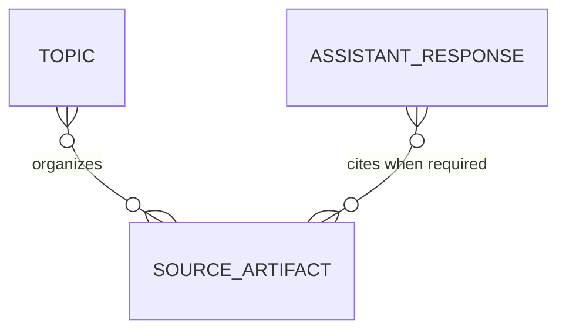
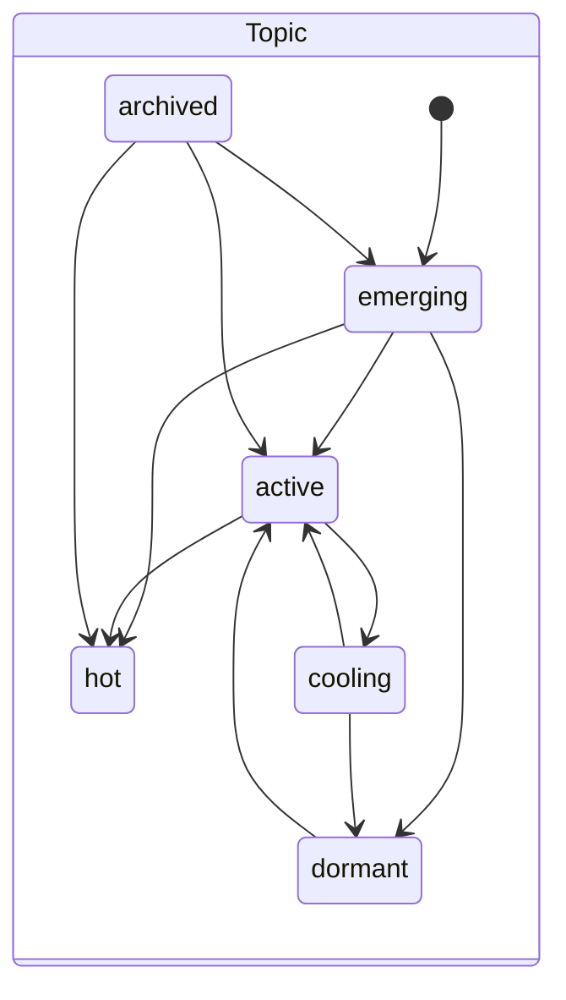

# Smackerel Domain Model

> This is the human-readable view of the product-domain SST. The formal model in
> `config/domain-model.yaml` wins on conflict. Go types, PostgreSQL migrations,
> and executable tests remain the field-level sources of truth; this document
> links them into a shared vocabulary without reproducing their schemas.

## Domain Glossary

| Term | Definition | Terms to avoid | Related entities |
|------|------------|----------------|------------------|
| Topic | A graph concept whose momentum changes how prominently related knowledge is surfaced | folder, static category | Topic, source artifact |
| Momentum | A derived score from captures, searches, stars, connections, and recency that drives Topic state | popularity alone | Topic |
| Archived Topic | A zero-momentum Topic hidden from active surfacing but eligible to resurface when evidence of interest returns | deleted Topic, terminal Topic | Topic |
| Source artifact | An owned or externally retrieved record that supports a derived claim | citation string without a recorded source | AssistantResponse, Topic |
| Assistant response | The typed user-facing result of an assistant turn, including a closed status and any source records | raw model text | AssistantResponse, source artifact |
| Honest refusal | An `unavailable` response with `no_grounded_answer` when a source-required answer cannot be substantiated | saved idea, empty success | AssistantResponse |

## Entity Graph

`SourceArtifact` is contextual in this initial shared model. Its concrete shapes
remain owned by connectors and the knowledge graph; the promoted formal entities
are `Topic` and `AssistantResponse`.

## Lifecycles And State Machines

Topic has no terminal state. In particular, `archived` remains reversible when
momentum returns, which distinguishes archival from deletion.

Assistant response statuses are a closed user-facing vocabulary rather than one
linear workflow. `thinking`, `checking_weather`, `checking_email`, and
`reminder_proposed` are in-flight states. `answered`, reminder confirmation or
cancellation, low-band `saved_as_idea`, and `unavailable` are terminal results
for a turn. A source-required high-band answer may end as `answered` only with
valid source records; otherwise it must end as `unavailable`.

## Business Rules And Invariants

| Invariant | Why it matters | Authoritative rule | Enforced by | Proven by |
|-----------|----------------|--------------------|-------------|-----------|
| `INV-SM-SOURCED-DERIVED-OUTPUT` | An unsupported synthesis presented as an answer would turn model invention into user knowledge | `config/domain-model.yaml` | Assistant provenance gate and cite-back verifier | `internal/assistant/provenance/gate_test.go::TestEnforce_BS007` and `internal/assistant/openknowledge/citeback/enforcement_test.go::TestCiteback_FabricatedSourceFlipsToRefusal` |

This invariant refines the ratified constitution rule: "Every derived insight,
digest item, or synthesis claim must be traceable back to source artifacts."

## Authoritative References

- Formal entities and invariants: `config/domain-model.yaml`
- Ratified business invariants: `.specify/memory/constitution.md`
- Topic state and momentum transition logic: `internal/topics/lifecycle.go`
- Topic transition coverage: `internal/topics/lifecycle_test.go`
- Assistant response status vocabulary: `internal/assistant/contracts/response.go`
- Missing-source enforcement: `internal/assistant/provenance/gate.go`
- Fabricated-citation enforcement: `internal/assistant/openknowledge/citeback/enforcement.go`
- Product architecture: `docs/smackerel.md`
- Per-feature field-level models: `specs/*/design.md` under each feature's `## Data Model`