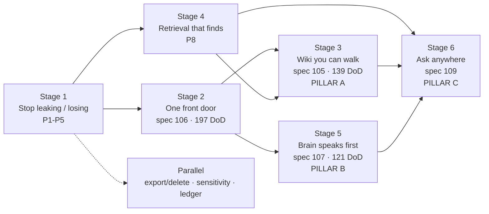

# Smackerel Delivery Plan — LLM Wiki, Second Brain, Extended Scenarios

**Snapshot:** 2026-08-02
**Type:** delivery plan. One-page summary: [`Strategy.md`](Strategy.md). Diagnostic evidence: [`Product_Direction_2026-07-31.md`](Product_Direction_2026-07-31.md).
**Status:** advisory. No spec, scope, state, source, test, or config file was changed to produce it.
**Scope:** this repository only — nothing outside the smackerel repo root was read or written.

---

## Read this first

Smackerel is trying to be three things at once. This document names them in plain
language, measures exactly how far each one has got, lists the problems that are
currently in the way, and gives a stage-by-stage plan to finish all three.

Every number here was produced by a command run against the repository on
2026-08-02. Nothing is estimated. Where a claim comes from reading code rather
than running the product, it says so.

| If you want to know… | Go to |
|---|---|
| What are we actually building? | [§1 The three things](#1-the-three-things-were-building) |
| How far along are we? | [§2 Scoreboard](#2-scoreboard--where-each-pillar-stands-today) |
| What is broken right now? | [§3 The eleven problems](#3-the-eleven-problems-in-plain-english) |
| What do we do, in what order? | [§4 The plan](#4-the-plan--six-stages) |
| What blocks what? | [§5 Critical path](#5-critical-path) |
| What are we deliberately *not* doing? | [§6 The freeze list](#6-the-freeze-list--what-we-are-not-doing-yet) |
| How were these numbers produced? | [§7 Method and evidence limits](#7-method-and-evidence-limits) |

---

## 1. The three things we're building

These are not labels invented for this document. All three already exist as named
surfaces or specs in the repository.

### Pillar A — The LLM wiki

> **One sentence:** everything you have ever captured, readable as connected
> pages — topics, people, places, time — that you can *browse*, not just search.

Real code today: `web/pwa/wiki.html` plus five section pages (`wiki_topics`,
`wiki_people`, `wiki_places`, `wiki_time`, `wiki_artifact`), shipped by spec 073,
reading the graph APIs shipped by spec 080. The canonical experience catalog
already reserves two surfaces for it: `knowledge_wiki` and `knowledge_graph`.

**"Complete and proper" means:** you can open any topic, person, place or date and
see a page that is accurate, cited, connected to genuinely related things, and
reachable in two clicks from anywhere in the product.

### Pillar B — The second brain

> **One sentence:** it tells you what matters before you ask, and it is right often
> enough that you trust it.

The digest, the topic lifecycle, the proactive surfacing controller, and the
cross-source synthesis pipeline. The delivery machinery exists. The judgement
layer — *which* few things matter today, and *why* — does not.

**"Complete and proper" means:** one daily surface shows a handful of things that
matter, each with a reason and a citation; you can say "this was wrong" and it
learns; it never claims it delivered something it did not.

### Pillar C — Extended scenarios

> **One sentence:** every capability the system has is reachable by asking for it
> in plain language — and reachable from the other tools you already use.

Smackerel has **27 scenario contracts** built in `config/prompt_contracts/`. Only
**5** are declared user-facing in `config/assistant/scenarios.yaml`. The other 22
are working capabilities with no front door.

**"Complete and proper" means:** every enabled capability has an intent, an
authorisation rule, and a projection into the assistant, the navigation, and the
MCP tool list — generated from one registry, not four hand-maintained ones.

---

## 2. Scoreboard — where each pillar stands today

### Portfolio baseline

| Measure | Value |
|---|---:|
| Specs total | **109** |
| — `done` | 99 |
| — `in_progress` | 2 (105, 106) |
| — `blocked` | 4 (058, 096, 104, 107) |
| — planning-only (`specs_hardened`) | 4 (063, 079, 108, 109) |
| Bug artifacts total | 241 |
| — non-terminal | 20 |
| Connectors implemented | 19 |
| Scenario contracts built | 27 |
| Scenario contracts user-facing | **5** |
| PWA pages | 31 |
| PWA pages loading the shared nav | **2** |
| Catalog surfaces declared | 20 |
| Release trains | 2 (`mvp` → self-hosted, `next` → staging) |

The headline: **ingestion and capability foundations are essentially finished — 99
of 109 specs done. What is unfinished is everything the user actually touches.**

### The three specs that carry the three pillars

All remaining product work concentrates in three specs. This is the whole job.

| Spec | Pillar | Scopes | DoD items done | Progress |
|---|---|---:|---:|---:|
| **106**-coherent-product-experience | shell for all three | 16 | **41 / 238** | 17% |
| **105**-connected-knowledge-graph-explorer | A — LLM wiki | 10 | **0 / 139** | 0% |
| **107**-proactive-correlated-experience | B — second brain | 11 | **39 / 160** | 24% |
| **Total** | | **37** | **80 / 537** | **15%** |

Pillar C has no single spec: it is the 22 unsurfaced scenarios, plus spec 109
(MCP, planning-only) and spec 108 (corpus grants, planning-only).

### Per-scope detail

<details>
<summary><strong>106 — coherent product experience</strong> (the shell)</summary>

| Scope | Status | DoD |
|---|---|---:|
| 01-source-locked-visual-foundation | In Progress | 8/16 |
| 02-canonical-catalog-route-inventory | In Progress | 9/13 |
| 03-truthful-state-feedback-foundation | In Progress | 9/16 |
| 04-shared-shell-shadow-canaries | In Progress | 12/15 |
| 05-shared-shell-cutover-compatibility | In Progress | 3/20 |
| 06-search-today-digest-synthesis | Not Started | 0/18 |
| 07-assistant-capture-composition | Not Started | 0/16 |
| 08-knowledge-graph-shell-integration | Not Started | 0/11 |
| 09-work-route-composition | Not Started | 0/11 |
| 10-cards-shell-integration | Not Started | 0/25 |
| 11-recommendations-projection | Not Started | 0/12 |
| 12-sources-activity-admin-projections | Not Started | 0/16 |
| 13-responsive-accessibility-hardening | Not Started | 0/11 |
| 14-disposable-product-journeys-nfr | Not Started | 0/16 |
| 15-readiness-acceptance-projection | Not Started | 0/12 |
| 16-final-acceptance-handoff | Not Started | 0/10 |

</details>

<details>
<summary><strong>105 — knowledge graph explorer</strong> (the wiki)</summary>

| Scope | Status | DoD |
|---|---|---:|
| 01-graph-contract-query-foundation | Not Started | 0/19 |
| 02-bounded-projection-cursor-expansion-api | Not Started | 0/9 |
| 03-source-locked-renderer-assets | Not Started | 0/13 |
| 04-desktop-explorer-interactions | Not Started | 0/9 |
| 05-keyboard-semantic-accessibility | Not Started | 0/18 |
| 06-entry-deep-links | Not Started | 0/15 |
| 07-responsive-mobile-motion-theming | Not Started | 0/11 |
| 08-privacy-security-honest-states | Not Started | 0/15 |
| 09-scale-performance-observability | Not Started | 0/14 |
| 10-real-stack-acceptance-handoff | Not Started | 0/16 |

</details>

<details>
<summary><strong>107 — proactive correlated experience</strong> (the brain)</summary>

| Scope | Status | DoD |
|---|---|---:|
| 01-single-controller-card-projection-foundation | Not Started | 13/20 |
| 02-web-proactive-card-action-transport | Not Started | 0/11 |
| 03A-telegram-proactive-nudge-rendering | In Progress | 13/13 |
| 03B1-whatsapp-nudge-rendering | Done | 13/13 |
| 03B2-cross-channel-web-parity | **Blocked** on 106/SCOPE-02 | 0/12 |
| 04-today-cockpit-composition | Not Started | 0/19 |
| 05-correlation-rail | Not Started | 0/14 |
| 06-ask-or-capture-command-palette | Not Started | 0/14 |
| 07-what-changed-feed | Not Started | 0/13 |
| 08-cross-surface-accessibility-responsive-authorization | Not Started | 0/19 |
| 09-real-stack-acceptance-handoff | Not Started | 0/12 |

</details>

---

## 3. The eleven problems, in plain English

Each problem states what is wrong, what it costs a real user, the exact change
required, the exact files, the measurable size of the work, and how we prove it is
fixed. The `Dnn` tags cross-reference the diagnostic memo so no prior analysis is
lost.

---

### P1 — Authorisation can be skipped entirely, depending on how you logged in

`D28` `D25` `D29` · **Critical** · **Stage 1**

**What is wrong.** Three holes in one trust boundary.

1. `internal/auth/scope_middleware.go` lines 71 and 75 make `RequireScope` return
   early — *without checking any scope* — for `SessionSourceSharedToken` and
   `SessionSourceBootstrap`. There are exactly four scope-guarded routes in the
   product (`internal/api/router.go:124`, `:178`, `:542`, and
   `internal/assistant/httpadapter/middleware.go:58`) and **all four are waved
   through for those two sources today**, including `/api/assistant/turn`.
2. `internal/agent/tools/retrieval/tool.go` takes `user_id` as a *required tool
   argument the model fills in* (lines 107, 110, 156). Line 180 checks only that
   it is non-empty, then searches the global corpus. The language model is
   effectively supplying the identity.
3. `internal/telegram/bot.go` opens by default: with the shipped SST value
   `chat_ids: ""` the bot processes messages from **any** chat and only logs a
   warning. `resolveActorUserID` refuses unmapped chats only when the environment
   string literally equals `production`. The same empty value fails *closed*
   outbound and *open* inbound.

**What it costs you.** A caller who cannot carry scopes still reaches the
assistant. The corpus can be read under the wrong grant. Anyone who finds the bot
can talk to it outside production.

**Exact change.**
- Delete both short-circuit branches; evaluate scopes unconditionally. A session
  source that cannot carry scopes is **denied**, not passed through. First-user
  enrolment is unaffected — `/v1/auth/users` is not `RequireScope`-guarded.
- Remove `user_id` from every agent tool schema; inject an `AuthenticatedPrincipal`
  through tool context. Require `corpus:read` at the retrieval boundary.
- Make Telegram inbound fail closed on an empty allowlist; require an explicit
  chat→user mapping in every environment; delete the environment-string comparison.
- Retire the production shared-token fallback on an audited timetable.

**Files (9).** `internal/auth/scope_middleware.go` · `internal/api/router.go` ·
`internal/assistant/httpadapter/middleware.go` ·
`internal/agent/tools/retrieval/tool.go` ·
`internal/agent/tools/notification/propose.go` ·
`internal/agent/tools/notification/execute.go` · `internal/telegram/bot.go` ·
`internal/telegram/user_mapping.go` · `config/smackerel.yaml`

**Home.** Spec **108-corpus-grant-enforcement** already carries the planning for
this. Drive it to delivery rather than re-planning.

**Proof.**
```bash
./smackerel.sh test unit --go --go-run 'Test(ScopeEnforcedForEverySessionSource|AssistantCorpusGrantRequired|TelegramInboundFailsClosed)$' --verbose
```

---

### P2 — A configured secret can be sent to a host the caller picks

`D24` · **Critical** · **Stage 1**

**What is wrong.** `internal/api/photos.go:398` reads `base_url` from the request
body. Line 404 falls back to the SST-configured Immich API key when the request
omits a credential. The adapter transmits that key as `x-api-key`. The same
pattern repeats for PhotoPrism at lines 430–450.

**What it costs you.** An authenticated caller can name any host and receive your
configured photo-library secret.

**Exact change.** Bind endpoint and credential together in one server-owned
provider record. Never combine a request-supplied URL with an SST credential — a
request that supplies a URL must supply its own credential, or be rejected.

**Files (3).** `internal/api/photos.go` ·
`internal/connector/photos/adapters/immich/immich.go` ·
`internal/connector/photos/adapters/photoprism/photoprism.go`

**Home.** Bug under existing spec **040-cloud-photo-libraries**.

**Proof.** `TestPhotoCredentialAudience` with an adversarial listener that must
receive *no* SST secret on audience mismatch.

---

### P3 — The gate we call non-negotiable runs in no automated lane

`D27` · **Critical** · **Stage 1**

**What is wrong.** `tests/eval/assistant/acceptance_test.go` carries
`//go:build integration`, so the unit lane (no tags) excludes it. The integration
lane at `scripts/runtime/go-integration.sh:53` scopes packages to
`./tests/integration/... ./internal/notification/... ./internal/assistant/... ./internal/cardrewards/...`
— **`./tests/eval/...` is not in that list.** The gate executes in no lane. It is
runnable by hand (documented in `docs/Testing.md`) but nothing enforces it, so
routing-accuracy and capture-fallback thresholds drift silently between manual runs.

**What it costs you.** The assistant can measurably degrade while CI stays green.

**Exact change.** Add `./tests/eval/...` to the integration package list, and
assert in CI that the gate reported a **non-zero executed-assertion count** — so a
silently skipped gate fails loudly instead of passing vacuously.

**Files (2).** `scripts/runtime/go-integration.sh` ·
`tests/eval/assistant/acceptance_test.go`

**Size.** The smallest high-value fix on this list.

---

### P4 — A failed publish can permanently skip source items

`D19` `D10` · **Critical** · **Stage 1**

**What is wrong.** `internal/connector/supervisor.go` (~line 384) assigns and
persists `lastCursor = newCursor` even after one or more `PublishRawArtifact`
calls failed. The next sync starts from the advanced cursor and never sees the
failed items. Separately, `internal/pipeline/ingest.go:51` omits `source_ref` from
the insert and deduplicates against `source_url`, so changed content creates a
second artifact and safe replay is impossible.

**What it costs you.** Captures disappear silently at the connector boundary, and
retries manufacture duplicates instead of correcting.

**Exact change.** Persist `source_ref`; deduplicate by `(source_id, source_ref)`;
update in place when content changes. Define a durable publish receipt and commit
the cursor **only** after every item in the page has one. On mixed failure, record
the cycle error and retain the previous cursor.

**Files (2 + 1 migration).** `internal/connector/supervisor.go` ·
`internal/pipeline/ingest.go`

**Home.** Existing spec **019-connector-wiring**.

**Proof.**
```bash
./smackerel.sh test unit --go --go-run 'Test(SuccessfulSync_PublishError|ConnectorCursorCommit|SourceRefReplay)' --verbose
./smackerel.sh test integration-light --go-run 'TestConnectorReplayIdentity'
```
An unchanged second connector run must add zero rows.

---

### P5 — ML work can outlive its lease and be processed twice

`D21` · **High** · **Stage 1**

**What is wrong.** `ml/app/nats_client.py` runs 25 subject loops, each fetching
five messages and acknowledging only after full processing. `ack_wait` is 120
seconds while a single permitted LLM call can run 600 seconds before retries.
There is no `in_progress` heartbeat and no shared inference limit.

**What it costs you.** Long local-model requests get redelivered while still
running — duplicate processing and unbounded concurrent inference on the host.

**Exact change.** Emit `msg.in_progress()` heartbeats below half of `ack_wait`.
Add one fail-loud SST `max_inflight` value and a shared `asyncio.Semaphore` across
all handlers. Reserve capacity *before* fetching so batch size cannot create 125
unowned leases.

**Files (3).** `ml/app/nats_client.py` · `ml/app/processor.py` ·
`config/smackerel.yaml`

**Home.** Existing spec **081-nats-python-sidecar-hardening-parity**.

**Proof.**
```bash
./smackerel.sh test unit --python --python-k 'nats_consumer_lease or nats_consumer_global_inflight'
./smackerel.sh test integration --go-run '^TestNATSConsumerLeaseConcurrency$'
```

---

### P6 — 31 loose pages, no shared shell

`D18` `D20` · **High** · **Stage 2**

**What is wrong.** There are 31 PWA pages. Only **2** — `index.html` and
`assistant.html` — load `web/pwa/lib/appnav.js`. The other 29 are composition
islands with no shared navigation.

Meanwhile `internal/experience/catalog.gen.json` already declares the intended
information architecture: **20 canonical surfaces** under schema
`smackerel-product-experience/v1`, including `knowledge_wiki` and `knowledge_graph`.
The target IA exists; the pages have not been moved onto it.

Concrete symptoms today: the Connect button on `connectors.html` is permanently
disabled; `connectors-add.js` always sends an `owner_user_id` that production
rejects; offline share enqueues without re-registering the one-shot sync tag;
capture outcome cards carry no `role`/`aria-live`.

**What it costs you.** You cannot get from one part of the product to another. The
wiki has no home. Connector onboarding cannot complete. Offline captures may never
flush.

**Exact change.** Finish spec 106. Collapse 31 pages onto the 20 catalog surfaces.
Load one shared bootstrap on every page — nav, service worker, session state,
pending-capture flush. Register `smackerel-sync` after every enqueue. Point Connect
at the real add flow. Derive owner from session. Add `role=status` / `role=alert`
live regions to capture outcomes.

**Files.** `web/pwa/*.html` (31) · `web/pwa/lib/appnav.js` ·
`web/pwa/connectors-add.js` · `internal/experience/navigation_projection.go` ·
`internal/api/drive_handlers.go` · `internal/api/pwa.go`

**Size.** **197 remaining DoD items across 16 scopes.** The largest and most
unblocking item in the plan.

**Proof.**
```bash
./smackerel.sh test unit --go --go-run 'TestPWACompositionContract' --verbose
./smackerel.sh test e2e-ui
```

---

### P7 — The wiki has pages but no explorer, and its edges are meaningless

`D4` `D13` · **High** · **Stage 3**

**What is wrong.** Spec 073 shipped six thin wiki pages (234 lines of HTML total)
reading spec 080's graph APIs. Spec **105**, which builds the actual connected
explorer behind them, is at **0 of 139 DoD items** — all ten scopes Not Started.

Underneath, the graph does not yet mean anything, and the reason is sharper than a
weighting problem — it is a **type collision**. Three different kinds of
relationship are written, but two of them share one edge type:

| Written at | Edge type | Weight | Actually means |
|---|---|---:|---|
| `linker.go:127` | `RELATED_TO` | the measured similarity (floor 0.3) | genuinely similar content |
| `linker.go:323` | `RELATED_TO` | **constant 0.5** | *created on the same calendar day* |
| `linker.go:364` | `SAME_SOURCE` | **constant 0.7** | *arrived from the same source* |

Graph expansion then ranks them together — `internal/api/search.go:843-844`:
`AND e.weight >= 0.3 ORDER BY e.weight DESC`.

Two consequences follow mechanically. A same-day artifact (constant 0.5) outranks
a genuinely similar artifact measured at 0.3–0.49 — **and because both carry the
type `RELATED_TO`, no consumer can tell which is which.** A same-source artifact
(constant 0.7) outranks every semantic match below 0.7.

The same temporal query is also the performance defect: `linker.go:300-301` uses
the cartesian shape `FROM artifacts a1, artifacts a2` and wraps the column in
`DATE(a2.created_at) = DATE(a1.created_at)`, which prevents the created-time index
from serving the predicate.

**What it costs you.** The wiki shows connections that are not connections, and
labels a coincidence of timing with the same word it uses for genuine relatedness.

**Exact change.** Introduce an `EdgeProducer` contract declaring, per edge: type,
observational-vs-inferential class, score semantics, and evidence. Give same-day
proximity its own observational edge type — stop overloading `RELATED_TO`. Remove
same-source as a semantic relation. Rank expansion only across comparable semantic
scores. Replace the cartesian temporal/source scans with bounded indexed candidate
lookups and a sargable date predicate. Then deliver spec 105's ten scopes: graph
contract, bounded projection API, renderer, desktop interactions, keyboard
accessibility, deep links, mobile, privacy states, scale, acceptance.

**Files.** `internal/graph/linker.go` · `internal/api/search.go` ·
`internal/knowledge/` · everything spec 105 declares

**Size.** **139 DoD items across 10 scopes**, plus the edge-semantics refactor.
Also clears `BUG-080-001-graph-api-fail-soft-runtime-disable` (currently blocked).

**Proof.**
```bash
./smackerel.sh test integration-light --go-run 'Test(GraphEdgeSemantics|GraphQueryPlan)'
./smackerel.sh test e2e-ui
```
Record per-type edge counts; require single-digit semantic edges per artifact; assert
no observational edge is ever ranked as a semantic score.

---

### P8 — Search cannot find a fact in the middle of a document

`D1` `D2` `D3` `D15` `D5` · **High** · **Stage 4**

**What is wrong.** Four compounding defects.

1. **No chunking.** There is no `artifact_chunks` table in any migration. One
   embedding per artifact means a 40-page paper and a one-line note have identical
   retrieval granularity.
2. **The embedding input is a summary, not the content.** `ml/app/embedder.py:210`
   embeds title + short summary + up to five key ideas. Facts that extraction
   omitted are unreachable by vector search.
3. **The configured model is not the running model.** `ml/app/embedder.py:43`
   hardcodes `all-MiniLM-L6-v2` while SST declares `nomic-embed-text`.
4. **The index is unproven.** `internal/db/migrations/001_initial_schema.sql:72`
   creates IVFFlat with `lists = 100`; production never sets `probes`. Either the
   joined query uses the index and inspects too little, or it bypasses the index
   and full-scans. No EXPLAIN or real-corpus latency measurement exists to settle
   which. Both branches are unacceptable.

Separately, `internal/graph/linker.go` uses cartesian query shapes and wraps
`created_at` in `DATE(...)`, preventing the index from serving the predicate.

**What it costs you.** Ask about something you definitely saved; get nothing.

**Exact change.** Resolve model and dimension from fail-loud SST. Add
`artifact_chunks(artifact_id, ordinal, text, embedding)` with bounded overlap and
an HNSW index. Re-embed in a resumable migration. Fuse chunk score, summary-vector
score and lexical score into one artifact result, keeping the winning chunk as
displayed evidence. Build a retrieval eval corpus of ≥100 vague queries with known
answer IDs; record accuracy@1/@5, recall@20, p95 and the EXPLAIN plan node; set SST
floors at the measured baseline. **Wire that gate into a named lane with an
executed-assertion count** — otherwise it repeats P3.

**Files (5 + migration + corpus + lane).** `ml/app/embedder.py` ·
`ml/app/nats_client.py` · `internal/pipeline/processor.go` ·
`internal/api/search.go` · `internal/graph/linker.go`

**Proof.**
```bash
./smackerel.sh test integration --go-run 'TestRetrieval(Eval|QueryPlan|Latency|ChunkRecall|ConfiguredModel|HybridFusion)'
```
Output must name the HNSW plan node, the measured metrics, and the executed-assertion
count. Fails below SST floors **and** fails when that count is zero.

---

### P9 — The digest shows the newest things, not the important things

`D8` `D14` `D16` · **High** · **Stage 5**

**What is wrong.** `internal/digest/generator.go` selects candidates with
`ORDER BY created_at DESC` (lines 349 and 460). There is no relevance formula.
The signals to build one already partly exist but are unused: `source_quality` is
persisted and never read by ranking; `temporal_relevance` is extracted by the ML
path but the Go writer never persists it. The model cannot compensate — it
receives only title and type (`ml/app/nats_client.py:1032`), not summary, score,
evidence or content.

**What it costs you.** The daily ritual is a reverse-chronological list.

**Exact change.** Persist `temporal_relevance`. Consume persisted `source_quality`.
Compute one explainable relevance score. Rank deterministically *before* prompting,
then pass bounded summaries, score reasons and citations to the model.

**Files (3 + migration).** `internal/digest/generator.go` ·
`internal/pipeline/processor.go` · `ml/app/nats_client.py`

---

### P10 — The system already writes cross-source insight, then throws it away

`D6` `D7` `D9` · **High** · **Stage 5**

**What is wrong.** This is the most surprising finding in the repository.

The ML path **works**. `internal/pipeline/synthesis_subscriber.go:363` publishes
cross-source assessment requests; `ml/app/synthesis.py:427` produces them;
`internal/knowledge/upsert.go:407` (`CreateCrossSourceEdge`) persists qualifying
`CROSS_SOURCE_CONNECTION` edges **with insight text and source artifact IDs**.

Nothing consumes them. `internal/intelligence/synthesis.go:50` (`RunSynthesis`)
derives its own structs from topic names and counts; `internal/scheduler/jobs.go:206`
discards the result; weekly output at `synthesis.go:333` opens with processed-item
statistics — directly contradicting Product Principle 6's prohibition on system
self-reporting.

Feedback is similarly half-built. Proactive act/snooze/dismiss resolves through one
acknowledgement path (`internal/proactive/ack.go:44`) and low ratings do reduce
persisted artifact relevance (`internal/intelligence/annotations.go:90`). But no
durable, producer-attributed "wrong / not useful" event exists, and the
acted-on / false-positive metric helpers in `internal/metrics/surfacing.go:123`
have no production call sites.

**What it costs you.** The genuinely differentiated capability — cross-domain
insight — is computed, stored, and never shown. And when the system is wrong, it
does not learn.

**Exact change.** Make digest and weekly synthesis **consume the already-persisted
`CROSS_SOURCE_CONNECTION` edges**, citing their insight text and source artifact IDs
through idempotent output-window records. Delete the duplicate topic-name
pseudo-insight path — do **not** build a second producer. Remove processed-item
counts from user-facing output. Extend the existing acknowledgement path to carry
producer attribution and persist an explicit useful / not-useful / wrong outcome
that updates relevance and increments the matching metric exactly once.

**Files (6).** `internal/intelligence/synthesis.go` · `internal/scheduler/jobs.go` ·
`internal/digest/generator.go` · `internal/proactive/ack.go` ·
`internal/intelligence/annotations.go` · `internal/metrics/surfacing.go`

**Size.** No new ML work — the producer already exists and is correct.

---

### P11 — The product says it delivered things it did not

`D22` `D26` · **High** · **Stage 5**

**What is wrong.** The daily digest job handles send failure correctly. Five other
proactive jobs in `internal/scheduler/jobs.go` discard the `SendDigest` return
value and then record or log delivery anyway: resurfacing (line 255, which then
calls `MarkResurfaced`), pre-meeting (293), weekly synthesis (319), monthly report
(347) and frequent-lookup quick reference (405).

Separately, Product Principle 6 promises **fewer than three** non-urgent prompts per
week. `config/smackerel.yaml:501` explicitly states this is not a hard cap and
permits **five per day**; `internal/intelligence/surfacing/budget.go:31` resets
daily. The executable policy therefore permits up to **35** ordinary interruptions
per week against a promised ceiling of 2.

**What it costs you.** Reminders vanish while the system reports success, and the
interruption promise is not the interruption behaviour.

**Exact change.** Route every proactive path through one `send → acknowledge →
commit` helper. A failed send stays retryable and never advances delivery state or
success metrics. Add a persisted per-principal rolling seven-day non-urgent cap of
two, with urgent overrides as a separate audited layer.

**Files (3, 5 call sites).** `internal/scheduler/jobs.go` ·
`internal/intelligence/surfacing/budget.go` · `config/smackerel.yaml`

**Proof.**
```bash
./smackerel.sh test unit --go --go-run 'Test(ProactiveSendFailureDoesNotCommit|WeeklyNonUrgentBudget)' --verbose
```
Metrics must conserve: proposed = acknowledged + failed + deferred + overridden.

---

## 4. The plan — six stages

Each stage ends with something a user can actually do. Stages are ordered by
dependency, not preference.

---

### Stage 1 — Stop leaking and stop losing

**Fixes:** P1 P2 P3 P4 P5 · **Pillar:** foundation for all three

Nothing else here is safe to ship until these close. Stage 1 is the only stage with
no new user-facing feature — it exists because Stages 2–6 all *widen access to the
corpus*, and widening access with these five holes open makes each hole worse.

| Item | Files | Home |
|---|---:|---|
| Unconditional scope evaluation | 3 | spec 108 → delivery |
| Server-derived principal in agent tools | 3 | spec 108 |
| Telegram inbound fails closed | 3 | spec 108 |
| Photo credential audience binding | 3 | spec 040 bug |
| Eval gate joins a real lane | 2 | spec 061 |
| Durable cursor + stable `source_ref` | 2 + migration | spec 019 |
| ML lease heartbeat + shared inference limit | 3 | spec 081 |

**Done when**

```bash
./smackerel.sh test unit --go --go-run 'Test(ScopeEnforcedForEverySessionSource|AssistantCorpusGrantRequired|TelegramInboundFailsClosed|PhotoCredentialAudience|ConnectorCursorCommit|SourceRefReplay)$' --verbose
./smackerel.sh test unit --python --python-k 'nats_consumer_lease or nats_consumer_global_inflight'
./smackerel.sh test integration
```
…all green, **and** the integration run reports the assistant acceptance gate with a
non-zero executed-assertion count.

**A user can now:** nothing new — but every capture that arrives is kept, every
secret stays where it belongs, and no session source reads the corpus without its
grant.

---

### Stage 2 — One front door

**Fixes:** P6 · **Delivers:** spec 106 · **Pillar:** shell for all three

The biggest single item in the plan and the one that unblocks the most. Spec 107's
SCOPE-03B2 is explicitly blocked on 106/SCOPE-02, and 107's scopes 02 and 04–09 are
gated on the 106 shell existing at all.

**Work.** Finish scopes 01–05 (currently 41/80 across them), then deliver 06–16.
Collapse 31 loose PWA pages onto the 20 declared catalog surfaces. One shared
bootstrap on every page. Fix the disabled Connect button, the rejected
`owner_user_id`, the missing sync-tag re-registration and the missing live regions.

**Size.** 197 remaining DoD items, 16 scopes.

**Done when**
```bash
./smackerel.sh test unit --go --go-run 'TestPWACompositionContract' --verbose
./smackerel.sh test e2e-ui
```
Spec 106 reaches `done`, which mechanically unblocks 107/SCOPE-03B2.

**A user can now:** move between every part of the product from any page, complete
connector onboarding, and trust an offline share to flush.

---

### Stage 3 — The wiki you can walk

**Fixes:** P7 · **Delivers:** spec 105, clears BUG-080-001 · **Pillar A**

**Work.** First fix edge semantics so the graph means something: introduce
`EdgeProducer`, remove same-source semantic edges, bound same-day observations,
replace cartesian scans with indexed candidate lookups. Then deliver spec 105's ten
scopes end to end.

**Size.** 139 DoD items + the edge-semantics refactor.

**Done when**
```bash
./smackerel.sh test integration-light --go-run 'Test(GraphEdgeSemantics|GraphQueryPlan)'
./smackerel.sh test e2e-ui
```
Per-type edge counts recorded; single-digit semantic edges per artifact; no result
explained by "same mailbox".

**A user can now:** open any topic, person, place or date, see genuinely related
things with evidence, expand outward and deep-link back in — **Pillar A complete.**

---

### Stage 4 — Retrieval that actually finds

**Fixes:** P8 · **Pillars A and C both depend on it**

**Work.** SST-resolved embedding model. `artifact_chunks` with bounded overlap and
HNSW. Resumable re-embed. Hybrid fusion with the winning chunk preserved as
evidence. A measured eval corpus wired into a named lane with an executed-assertion
count.

**Size.** 5 source files + 1 migration + 1 eval corpus + 1 lane change.

**Done when**
```bash
./smackerel.sh test integration --go-run 'TestRetrieval(Eval|QueryPlan|Latency|ChunkRecall|ConfiguredModel|HybridFusion)'
```
Output names the HNSW plan node, the measured accuracy/recall/p95, and the
executed-assertion count. Floors set at the measured baseline; cannot regress
silently.

**A user can now:** find a fact buried in the middle of a long document, and see
which passage answered them.

---

### Stage 5 — The brain that speaks first

**Fixes:** P9 P10 P11 · **Delivers:** spec 107 · **Pillar B**

**Work.** Persist and consume the relevance signals. Make digest and weekly output
consume the **already-persisted** `CROSS_SOURCE_CONNECTION` edges and delete the
duplicate topic-name path. Route all five proactive jobs through one
send-ack-commit helper. Enforce the rolling weekly cap of two. Then deliver spec
107's remaining scopes: today cockpit, correlation rail, ask-or-capture palette,
what-changed feed, cross-surface accessibility, acceptance.

**Size.** 12 source files + 1 migration, plus 121 remaining DoD items in spec 107.

**Done when**
```bash
./smackerel.sh test unit --go --go-run 'Test(ProactiveSendFailureDoesNotCommit|WeeklyNonUrgentBudget)' --verbose
./smackerel.sh test e2e --shell-run intelligence_truth.sh
```
Seed conflicting multi-source evidence; require the persisted ML-backed edge to
appear **with citations** in daily and weekly output; no duplicate producer; no
duplicate output window; digest median ≤ 5 items; no processed-count copy; a failed
send leaves state undelivered.

*Post-release observation, not a gate:* measure acted-on ÷ acknowledged eligible
surfaced items over a rolling 28-day window, only after ≥50 eligible items. 40% is
the target; smaller samples report `insufficient_data`.

**A user can now:** open one daily surface, see a handful of things that matter each
with a reason and a citation, mark one wrong and have it stick — **Pillar B complete.**

---

### Stage 6 — Ask anything, from anywhere

**Fixes:** the 22 unsurfaced scenarios · **Delivers:** spec 109 · **Pillar C**

**Work.** Define one capability registry entry per capability: ID, user intent,
domain service, required principal and grants, provenance requirement, side-effect
class, navigation projection, slash alias, MCP projection. Generate
`config/assistant/scenarios.yaml`, the navigation, the slash aliases and the MCP
tool list **from that one registry**. Raise user-facing scenarios from 5 toward 27 —
every enabled capability gets an intent. Then deliver spec 109's MCP server at
`/mcp` behind the `mcpKnowledgeServer` flag.

The registry is not built from scratch: `internal/experience/` already has
`catalog.gen.json`, `navigation_projection.go`, `renderer_projection.go`,
`consumer_inventory.go` and `validator.go`. This stage extends that catalog from 20
surfaces to cover capabilities too.

**Size.** 22 scenario declarations + registry extension + spec 109 delivery.

**Done when**
```bash
./smackerel.sh test unit --go --go-run 'TestCapabilityRegistryCoverage' --verbose
./smackerel.sh test e2e --shell-run mcp_knowledge_server.sh
```
Deterministic authorisation-filtered `tools/list`; six provenance fields on
retrieval; no `content_raw` egress; zero release-ledger projection drift.

**A user can now:** ask for any capability in plain language, and use the same
governed corpus from VS Code or a Claude-compatible client — **Pillar C complete.**

---

### Parallel track — ownership and operations

Not on the critical path; can run alongside any stage after Stage 1.

| Item | Problem | Files |
|---|---|---|
| Versioned `CorpusBundle` for export / import / delete | `D12` `D23` — export emits only `processing_status='processed'` rows and paginates on `created_at` alone, so tied timestamps skip rows | `internal/db/postgres.go` · `internal/api/capture.go` · migration |
| Canonical artifact sensitivity + fail-closed egress | `D11` — `artifacts` has no sensitivity column despite design claims that sensitivity governs model routing | `internal/db/migrations/` · egress call sites |
| Release claims generated from a runtime ledger | `A4-LEDGER` — the v1 packet says spec 095 is planning-only and `internal/retrieval/` is absent; the spec is `done`, certified, and `internal/retrieval/{evergreen,routing}` exists. A stale `delivery=optional` annotation now controls a Gate G101 enforcement decision | `docs/releases/v1/features.md` · ledger generator |

---

## 5. Critical path



**One-line version:** Stage 2 is the bottleneck. Spec 106 gates spec 107 directly
(SCOPE-03B2) and gates the wiki's home indirectly. Nothing user-visible finishes
until the shell exists.

**Blocked elsewhere, not on this path:**

| Spec | Blocked on | Agent-actionable? |
|---|---|---|
| 104-universal-ask-self-knowledge | operator sends `/ask what can you do?` to the live bot | No — human step |
| 096-multi-provider-model-connections | devops self-hosted handoff for the 088→087→084 cohort | Yes — devops |
| 058-chrome-extension-bridge | keyless-OIDC cosign identity binding from a tagged CI release | No — needs a real release |

---

## 6. The freeze list — what we are *not* doing yet

Adding any of these before Stage 5 completes makes the product worse, not better.

| Frozen | Until | Why |
|---|---|---|
| New connectors (notes, messages, voice) | after Stage 5 | 19 connectors already outrun the surfaces that display them; P4 means new sources can still lose data |
| Outbound actions (draft, book, send) | after Stage 6 | requires the authority and confirmation contracts Stages 1 and 6 establish |
| New destination pages | after Stage 2 | 31 pages *is* the problem; page 32 deepens it |
| Native mobile client | indefinitely | under context-server positioning, PWA reliability matters more |
| MCP exposure | after Stage 5 | exposing the corpus externally before grants, chunking and edge semantics land exports the current defects |

---

## 7. Method and evidence limits

**What was executed.** Every count, status, path and line reference came from
commands run against this repository root on 2026-08-02: `jq` over 109
`state.json` files, DoD checkbox counts over 37 `scope.md` files, directory
listings for connectors and PWA pages, `grep` against named source files, and
`./smackerel.sh test --help` for the command surface.

**What was NOT executed.** No product build, no test suite, no live stack, no
browser journey, no database query, no exploit, no deployment probe, no network
call to any provider. Every defect in §3 is established by reading source and
configuration.

**Re-verified today.** Every line reference in §3 was checked against current
source on 2026-08-02. All hold:

| Claim | Verified at |
|---|---|
| P1 scope short-circuit | `internal/auth/scope_middleware.go:71,75` — exactly 4 non-test `RequireScope` sites |
| P1 model-supplied identity | `internal/agent/tools/retrieval/tool.go:107,110,156,180` |
| P2 photo credential fallback | `internal/api/photos.go:398,404` (Immich), `:430,442` (PhotoPrism) |
| P3 gate in no lane | `tests/eval/assistant/acceptance_test.go:1` + `scripts/runtime/go-integration.sh:53` |
| P4 no `source_ref` persisted | `internal/pipeline/ingest.go:51` |
| P7 semantic edge | `internal/graph/linker.go:120,127` — floor 0.3, weight = measured similarity |
| P7 same-day edge reuses `RELATED_TO` | `internal/graph/linker.go:323` — constant 0.5 |
| P7 same-source edge | `internal/graph/linker.go:364` — constant 0.7 |
| P7 flat ranking | `internal/api/search.go:843,844` — `weight >= 0.3` / `ORDER BY e.weight DESC` |
| P7/P8 index-defeating predicate | `internal/graph/linker.go:300,301` — cartesian shape + `DATE(created_at)` |
| P8 hardcoded embedding model | `ml/app/embedder.py:43` — `all-MiniLM-L6-v2` |
| P8 IVFFlat, no chunk table | `internal/db/migrations/001_initial_schema.sql:72`; no `artifact_chunks` in any migration |
| P9 digest ordering | `internal/digest/generator.go:349,460` |
| P10 cross-source producer is real | `internal/knowledge/upsert.go:407` (`CreateCrossSourceEdge`) |
| P11 nudge budget | `config/smackerel.yaml:501` (`daily_nudge_budget: 5`) + `internal/intelligence/surfacing/budget.go` daily rollover |

The SST comment above `daily_nudge_budget` is worth quoting: the current values
"do not structurally guarantee <3/week; it is observed/tuned, **not enforced**."
The configuration already knows it does not implement the principle.

**Three corrections to the diagnostic memo.** All three narrow or sharpen its
claims:

1. It called the capability registry "missing" (`D17`/`D18`). `internal/experience/`
   already contains `catalog.gen.json` with 20 declared surfaces plus navigation,
   renderer, consumer-inventory, state, mutation and validator projections. The
   registry is **half-built and not yet projecting to all surfaces** — a much
   smaller job than starting one.
2. It framed cross-source synthesis as largely absent. The ML producer is real,
   correct, and persisting cited edges. The defect is narrower and more fixable:
   **nothing consumes what it writes.**
3. Its `D13` cited `internal/api/search.go:392` for the edge weights; that line is
   graph-expansion dispatch. The weights are constants in `internal/graph/linker.go`
   and the ranking clause is `search.go:843-844`. The corrected reading is also
   *worse* than the original: same-day and semantic relations share the single
   edge type `RELATED_TO`, so the defect is a type collision, not only a
   weighting imbalance.

**Scope statement.** This document changed nothing else. No spec, design, scope,
report, state, source, test or config artifact was created or modified. Routing any
stage into implementation still requires the normal Bubbles workflow — diagnostic
review is not an implementation bypass.
