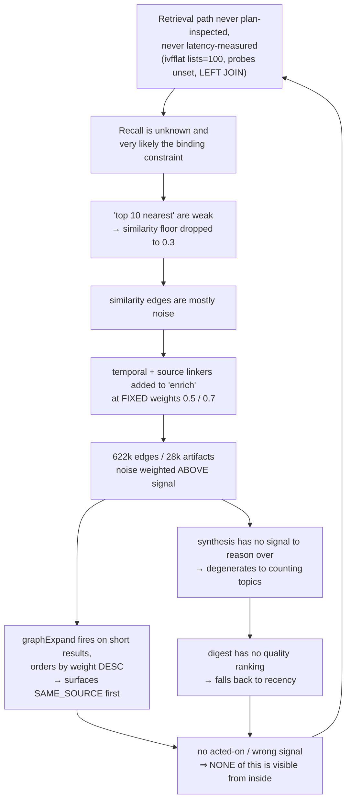

# Smackerel — Product Review & Recovery Plan

**Snapshot:** 2026-07-31 · **Type:** diagnostic review + executable plan · **Status:** advisory (no spec, state, or source mutated)

**Evidence rule.** Every claim cites a file, line, query, migration, or a competitor page fetched 2026-07-30/31. Nothing is asserted from inference alone. Limits are declared in the [Appendix](#appendix--declared-uncertainty).

---

## Executive summary

| # | Finding | Evidence |
|---|---|---|
| **1** | **The retrieval path has never had its query plan inspected or its real latency measured.** The index is `ivfflat lists=100`, built in migration 001 against an *empty* table, with `ivfflat.probes` never set (default 1). The search query also `LEFT JOIN`s another table, so whether the planner even uses the index is undeterminable by reading the SQL. **Both possible outcomes are defects** — see [D1](#32-defect-register). | [001_initial_schema.sql:72](../internal/db/migrations/001_initial_schema.sql#L72), [search.go:516](../internal/api/search.go#L516) |
| **2** | **The marquee differentiator does not exist.** "Cross-domain synthesis" is `fmt.Sprintf` over `GROUP BY` counts; its "CONNECTION DISCOVERED" output is a topic name plus a percentage. No reasoning step, no LLM call. The daily variant discards its result entirely. | [synthesis.go:50](../internal/intelligence/synthesis.go#L50) |
| **3** | **Search papers over weak recall with its noisiest data.** When results fall short, `graphExpand` pulls from the edge table ordered by `weight DESC` — where `SAME_SOURCE` (0.7) and same-day (0.5) edges **systematically outrank genuine similarity** (≥0.3). The user is told *"Connected via SAME_SOURCE"*, meaning "it came from the same mailbox." | [search.go:392](../internal/api/search.go#L392), [linker.go](../internal/graph/linker.go) |
| **4** | **The daily digest is a recency feed.** `ORDER BY created_at DESC LIMIT 20`. `relevance_score` exists, is indexed, and is ignored. The promise is "only the 2 that matter." | [generator.go:344](../internal/digest/generator.go#L344) |
| **5** | **The system cannot see its own errors.** The `acted_on` / `false_positive` counters have **zero** production call sites, and no correction path exists. This is why findings 1–4 survived to 28,000 artifacts. | [surfacing.go:127](../internal/metrics/surfacing.go#L127) |
| **6** | **The moat is 1-of-3, and two legs are stated falsely.** Passive ingestion and digests are now table stakes. What remains — *whole-life corpus, on your hardware, no vendor* — is real and defensible, but is not what the docs defend. | [§21.4](smackerel.md#L2900) vs. fetched competitor pages |

**Verdict in one line:** the idea is right, the engine beneath it has never been measured, and the product shape — a destination app — is the wrong shape to defend it with.

---

## 1. The idea — is this the right problem?

### 1.1 The stated problem, re-scored

[smackerel.md §1.1](smackerel.md#L49) lists five problems.

| Stated problem | Status in 2026 |
|---|---|
| Capture friction too high | **Dissolved.** One-click save, share sheets, extensions, email-to-inbox are universal. |
| Retrieval is broken | **Real — and the bar rose.** Users now expect ChatGPT-quality answers over their own material, not "the right link." |
| Nothing connects | **Real and underserved** — for a *whole-life* corpus. Competitors each hold one slice. |
| Knowledge doesn't evolve | **Real and uncontested.** Nobody else models topic lifecycle or decay. |
| Taxonomy demanded at capture time | **Dissolved.** Auto-organisation is table stakes. |

### 1.2 What is genuinely unsolved

> **No product holds your email + calendar + location + purchases + video + chat + property + market context in one graph, on hardware you own, with no vendor — and no cloud competitor can, because that is their business model.**

Fabric is a cloud workspace with 50+ integrations. Mem is notes + meetings. Recall is content consumption. **None touches location, purchases, or property operations.** That gap is the product.

### 1.3 Verdict

**The problem is right. The framing has decayed and the shape is wrong.**

- The framing (§1.1, §21.4) predates LLM ubiquity and defends two legs that no longer stand.
- The shape — a destination app with its own UI, chat, digest, notifications, photo manager and card tracker — competes on surface area against funded teams. That is the losing axis, and it shows: 31 PWA pages, three design systems, five simultaneously broken primary journeys.

The right shape is already written down in the repo, in [spec 109](../specs/109-mcp-knowledge-server/spec.md):

> *"The operator's actual working day happens somewhere else — inside VS Code, inside a coding agent, inside a general-purpose chat client. Every one of those environments now speaks MCP, and none of them can see a single artifact Smackerel has captured."*

**A personal context server, not a destination app.** See [§6](#6-target-end-state).

---

## 2. What exists today

### 2.1 Genuine strengths — do not break these

| Strength | Evidence |
|---|---|
| **Ingestion breadth is the real asset** | 17 connectors: email, calendar, video, location, browser, bookmarks, notes, chat, weather, gov alerts, markets, property, QF packets. |
| **The connector abstraction is clean and proven** | [`Connector`](../internal/connector/connector.go) — 5 methods (`ID/Connect/Sync/Health/Close`), cursor-based, plus `Registry` and `Supervisor`. 17 implementations validate it. |
| **The surfacing controller is genuinely novel** | [`surfacing/`](../internal/intelligence/surfacing/) — one cross-channel interruption budget across 5 channels × 8 producers, with dedupe, ack-suppression and a `MetricsSink` seam. No competitor has this. |
| **Per-artifact knowledge synthesis works *and* persists** | [synthesis_subscriber.go:248-346](../internal/pipeline/synthesis_subscriber.go#L248) — LLM-driven concept/entity extraction writing `CONCEPT_REFERENCES`, `ENTITY_MENTIONED_IN`, typed relations and `CONTRADICTS` edges, **transactionally**. |
| **The intelligence package is well-factored** | 16 focused files, 4–6 methods each; `engine.go` is 176 lines. Not a god-object. |
| **The scheduler is disciplined** | 10 intelligence jobs on explicit crons, each wrapped in `runGuarded` mutex protection. |
| **Retrieval routing is the right seam** | [`routing.Executor`](../internal/retrieval/routing/executor.go) — handler-free, injectable, with `StrategySelection{Strategy, Reason, FellBack, ContractKnown}` modelling honest degradation. Wired at [wiring_assistant_facade.go:60](../cmd/core/wiring_assistant_facade.go#L60). |
| **Failure honesty is architected, not merely intended** | A non-OK outcome may never render as "saved as an idea"; enforced by a dedicated test plus a surfaced metric. |
| **Two proven verification patterns already exist** | An **eval gate** ([tests/eval/assistant/](../tests/eval/assistant/harness.go): 150-row labelled corpus, SST thresholds at [config:1352](../config/smackerel.yaml#L1352), declared *"a NON-NEGOTIABLE acceptance regression"* if lowered) and an **EXPLAIN gate** ([trace_completeness_test.go](../tests/integration/agent/trace_completeness_test.go): asserts the planner picks the right index for four query shapes). **Neither has ever been pointed at retrieval.** |

### 2.2 Scenario promise vs. delivery

[§16](smackerel.md#L2383) is the product's contract with the user. Scored against code:

| Promised scenario | Reality |
|---|---|
| Digest shows "only the 2 that matter" | ❌ **Last 20 ingested, newest first.** No ranking. |
| Cross-domain synthesis ("three sources argue the same point, differently") | ❌ **A topic name + confidence %.** No reasoning; daily result discarded. |
| Weekly synthesis | ⚠️ **Delivers**, but is a stats report opening `"THIS WEEK: N artifacts processed"` — the exact anti-pattern Principle 6 names. |
| Pre-meeting briefs (30-min) | ✅ Implemented, scheduled `*/5 * * * *`, registered with the surfacing controller. |
| Commitment / promise tracking | ✅ `CheckOverdueCommitments` runs daily. |
| Relationship cooling | ✅ Scheduled weekly. |
| Subscription detection | ✅ Scheduled weekly. |
| Serendipity resurfacing | ✅ Scheduled daily. |
| Expertise mapping · seasonal patterns | ✅ Monthly report job. |
| Contradiction detection | ✅ Real `CONTRADICTS` edges from the LLM synthesis path. |
| Trip dossiers | ✅ Present. |
| Learning-path assembly | ⚠️ Present (`learning.go`) but not scheduled. |
| Content-creation fuel · energy/productivity patterns | ❌ **No implementation found.** |
| Export corpus | ✅ `/export` → NDJSON ([router.go:105](../internal/api/router.go#L105)). |
| **Delete corpus** (§18.3: per-artifact/topic/source/full wipe) | ❌ **No user-facing delete surface.** The three `DELETE FROM artifacts` sites are internal cleanup. **This breaks Principle 11's unconditional-exit guarantee.** |
| Export to Notion / Obsidian (§18.3) | ❌ Not implemented. |

**Read this as:** the *proactive* half — briefs, alerts, commitments, cooling, resurfacing — is genuinely built and running. The *retrieval, selection and synthesis* half, which is what makes it feel intelligent, is not.

### 2.3 Extension seams — design assessment

| Seam | Quality | Note |
|---|---|---|
| `connector.Connector` | ✅ **Strong** | Clean contract + registry + supervisor + health. The model to copy. |
| `surfacing.Controller` | ✅ **Strong** | Producers/channels/decisions separated; metrics behind an interface. Closed enums are correct here — a budget needs a bounded set. |
| `routing.Strategy` | ✅ **Strong** | Injectable, handler-free, models fallback honestly. |
| Prompt contracts as YAML | ✅ **Strong** | Scenarios are data, not code; loader-validated. |
| `confirm.Machine` | ✅ **Strong** | Race-safe propose/confirm/discard + audit; reusable as a domain service. |
| **Edge production** | ❌ **Missing** | No `EdgeProducer` interface. Five hardcoded strategies in a slice, plus **7 scattered `INSERT INTO edges` sites** across `connector/maps`, `connector/bookmarks`, `graph/linker`, `graph/hospitality_linker`, `knowledge/upsert` and `drive/save`. Nothing declares what an edge *means* — which is why weights are assigned ad hoc and end up inverted (see [D13](#32-defect-register)). |
| **Insight production** | ❌ **Missing** | Synthesis is a method on `Engine`, not a pluggable producer. Adding an insight type means editing the engine. |
| **Relevance signals** | ❌ **Missing** | `relevance_score` is mutated by ad-hoc SQL in two packages with no contract. |

**Conclusion: the architecture is better than the product.** Where seams exist they are well-designed and genuinely extensible. The three missing seams are exactly the three areas where quality has drifted — not a coincidence.

---

## 3. What is broken

### 3.1 Root-cause chain

**The loop at the bottom is the drift mechanism.** An unmeasured retrieval path survived to 28,000 artifacts because nothing in the system could report that it was wrong.

### 3.2 Defect register

| ID | Defect | Verified evidence |
|---|---|---|
| **D1** | **The retrieval query plan has never been inspected and real search latency has never been measured.** The index is `ivfflat lists=100`, built on an empty table in migration 001, never `REINDEX`ed, never migrated to HNSW despite `pgvector/pgvector:pg16`; `ivfflat.probes` is never set anywhere (default 1). The query also `LEFT JOIN`s `artifact_annotation_summary`, so index usage is planner-dependent. **Both branches are defects:** if the index *is* used, ~1 of 100 lists is examined and recall is the binding constraint; if it is *bypassed*, every search is a full-table vector scan and the index is dead weight. The only latency test uses a `fakeSearcher`, not the database. | Repo-wide grep for `SET LOCAL` / `ivfflat.probes` / `hnsw.ef_search`: zero production hits. [search.go:516](../internal/api/search.go#L516); [assistant_retrieval_p95_test.go](../tests/stress/assistant_retrieval_p95_test.go) |
| **D2** | The vector index is built from `title + summary + key_ideas[:5]` — **the LLM summary, not the content**. One vector per artifact; no chunking. You can retrieve only what the summariser mentioned. | [embedder.py:210](../ml/app/embedder.py#L210) |
| **D3** | Embedder hardcodes `all-MiniLM-L6-v2` (384-dim, 2021) while SST declares `nomic-embed-text`. The divergence is *acknowledged in a code comment* rather than fixed — a live constitution-C8 violation. | [embedder.py:43](../ml/app/embedder.py#L43), [main.py:500](../ml/app/main.py#L500) |
| **D4** | Five linking strategies run per artifact. `linkByTemporal` (**same calendar day**, similarity > 0.2, ≤20) emits the **same `RELATED_TO` type** as genuine similarity, so consumers cannot tell them apart. `linkBySource` (≤10, **no semantic test at all**) encodes only what `WHERE source_id = ?` already gives. ≥40 outbound per artifact before entity/topic. | [linker.go:54](../internal/graph/linker.go#L54); measured 622k/28k ≈ 22 edges/artifact vs a §1.4 target of "3+" |
| **D13** | **Edge weights are inverted against meaning.** `linkBySource` writes a fixed **0.7**, `linkByTemporal` a fixed **0.5**, genuine similarity a *variable* **≥0.3**. `graphExpand` — the search fallback that fires precisely when recall is poor — selects `WHERE e.weight >= 0.3 ORDER BY e.weight DESC`, so **the least meaningful edge type ranks first**, and the user is shown the explanation *"Connected via SAME_SOURCE (weight: 0.70)"*. | [search.go:392](../internal/api/search.go#L392) + the three `createEdge` weights in [linker.go](../internal/graph/linker.go) |
| **D5** | Both linker queries are `FROM artifacts a1, artifacts a2` cartesian joins. `linkByTemporal` wraps the indexed column (`DATE(a2.created_at)=…`), so `idx_artifacts_created` **cannot be used**, and it computes a vector distance against every same-day row — **on every ingest**. O(n) per insert. | [linker.go](../internal/graph/linker.go) |
| **D6** | **Synthesis performs no reasoning.** `RunSynthesis` is pure SQL: find topics with ≥3 artifacts from ≥2 sources, emit `ThroughLine = topicName`. `doSynthesisJob` then **discards the slice and logs `len()`**. Zero `INSERT INTO synthesis_insights` exists anywhere. | [synthesis.go:50](../internal/intelligence/synthesis.go#L50) |
| **D7** | The weekly deliverable is `fmt.Sprintf` over counts, opening `"THIS WEEK: %d artifacts processed…"` and rendering insights as `"• distributed systems (confidence: 62%)"`. Principle 6 forbids this self-reporting **by name**. | [`assembleWeeklySynthesisText`](../internal/intelligence/synthesis.go#L333) |
| **D8** | Digest selection is `ORDER BY created_at DESC LIMIT 20`. `relevance_score` is never computed from the §11.3 formula at ingestion, is written only by two feedback paths, and is **ignored by the digest**. | [generator.go:344](../internal/digest/generator.go#L344), [annotations.go:76](../internal/intelligence/annotations.go#L76), [lists.go:71](../internal/intelligence/lists.go#L71) |
| **D9** | `RecordSurfacingActedOn` / `RecordSurfacingFalsePositive` have **zero** production call sites; `MetricsSink` omits them. §17.1's promised `"that's wrong"` / `"fix: …"` correction path does not exist. | [surfacing.go:127](../internal/metrics/surfacing.go#L127) |
| **D10** | `artifacts.source_ref` is omitted from the ingest INSERT column list; `idx_artifacts_source` is a dead index; the dedup probe binds `SourceRef` to the `source_url` column. Falls back to `content_hash`, so changed content ⇒ a **new** artifact. | [ingest.go:51,94](../internal/pipeline/ingest.go#L94) |
| **D11** | No `sensitivity` column on `artifacts`. §18.1's Sensitive/Normal/Public and §17.3's "sensitive → local, general → cloud" routing exist only in prose. Harmless while the provider is Ollama; load-bearing the moment spec 096 or 109 lands. | Full DDL + every `ALTER TABLE artifacts` read |
| **D12** | **No user-facing delete surface.** §18.3 promises per-artifact/topic/source/full-wipe deletion; Principle 11 makes unconditional exit a ratified guarantee. Export exists; delete does not. | grep of all `DELETE FROM artifacts` sites |

---

## 4. Competitive position

### 4.1 The market, verified 2026-07-30/31

| Product | Verified today |
|---|---|
| **Fabric.so** | "A personal AI that actually knows you." 50+ integrations, "connected to your entire digital life", Email-to-Fabric, **Recap** (AI digest to inbox), scheduled AI jobs, and **agents that ACT** — *"moved three Linear tickets"*, *"drafted the client reply in Ezra's voice, left it in Gmail drafts"*. All frontier models in one $8/$18/$54-per-month subscription. iOS · Android · Chrome · Desktop · CLI · API. |
| **Mem.ai** | Workspace + Agent. Calendar integration. **Claude Connector (MCP)** — *"your favorite LLMs can now use your second brain as context."* "Heads Up" proactive context. Agent nudges: *"Your investor update goes out Thursday… draft Dana a quick message."* |
| **Recall (recall.it)** | 500,000+ users. Knowledge graph with auto-linking, augmented browsing (local-first), spaced repetition, chat with GPT/Claude/Gemini, Markdown export. |
| **Khoj** | Now three products. **Pipali** = desktop AI co-worker *"running safely on your computer."* |

### 4.2 Moat assessment

| §21.4 claim | Verdict |
|---|---|
| Passive-first ingestion | ❌ **Gone.** Fabric and Mem both ingest email + calendar and produce digests. |
| Cross-domain synthesis | ❌ **Does not exist** (D6, D7). Cannot be claimed. |
| Self-hosted · compiled · "modest hardware" | ⚠️ **Contested and partly false.** Khoj self-hosts, Pipali is local desktop, Recall's browsing is local-first. The approved model min-set is `qwen3:30b-a3b` at **31.8 GB resident** — not modest. |

**What remains, and it is enough:** *the whole-life corpus, on your hardware, with no vendor.* No cloud competitor can take that position.

### 4.3 The two moves the market made and Smackerel did not

1. **KNOW → DO.** Fabric agents move tickets and draft replies; Mem's agent drafts messages. Smackerel's [§1.5](smackerel.md#L104) still reads *"observe and draft only, never send"*; outbound action is v1 item **V2-A, not started**.
2. **App → MCP.** Mem ships a Claude Connector today. Smackerel's MCP server is [spec 109](../specs/109-mcp-knowledge-server/spec.md) — **planning only, zero code**.

---

## 5. Missing features

| Missing | Competitive weight | Cost |
|---|---|---|
| **Retrieval quality + query-plan measurement** | **Critical** — the loop-breaker for all drift; both patterns already exist in-repo | Low |
| **MCP server** (spec 109 hardened, unbuilt) | **Critical** — Mem ships it; largest usability jump available | Medium |
| **Feedback / correction path** | **Critical** — §17.1 promise; enables everything downstream | Low |
| **Corpus delete surface** | **High** — a ratified Principle 11 guarantee, unmet | **Very low** |
| **Outbound action** (V2-A, not started) | **High** — the market's headline move | High |
| Notes connectors (Notion, Obsidian, Apple Notes) | Medium — table stakes elsewhere | Medium |
| Messages (SMS, iMessage, Signal, Slack) | Medium | Medium |
| Voice capture + transcription | Medium — Fabric and Mem both ship it | Medium |
| Meeting recording / transcription | Medium | High |
| Spaced repetition | Low — Recall's differentiator, not ours | Low |
| Native mobile (decision doc V3-A absent) | Low for a context server | High |
| Export to Notion / Obsidian (§18.3) | Low | Low |

---

## 6. Target end state

> **Smackerel is the operator's personal context — held on their own hardware, retrievable with measured accuracy, and available to whatever model they already work inside.**

Not a destination app. A **context server** with a thin, honest operator console.

### The four excellences

| # | Property | Measured by |
|---|---|---|
| **1** | **Recall** — if it is in the corpus, it comes back | `retrieval_accuracy@1`, SST-gated, blocking; plan asserted by EXPLAIN; p95 measured against a real corpus |
| **2** | **Judgement** — it shows the few things that matter | median digest items ≤ 5; acted-on rate ≥ 40% |
| **3** | **Reach** — the context follows the operator to work | cold MCP client returns only real, authorized, domain-backed tools |
| **4** | **Honesty** — it never claims what it cannot show | zero uncited answers; `content_raw` never egresses; no result explained by an edge that carries no meaning |

### Explicit not-goals

- Competing on surface area with Fabric, Mem, or Recall.
- Making a local 30B model answer as well as Claude. Under the target shape that problem **dissolves** — the client brings the model, Smackerel brings the context.

---

## 7. The plan

Ten steps. Each **ships standalone value**, is **verified by one command producing a number or an exit code**, and **does not require any later step to be useful**.

**Freeze rule:** no new user-facing surface, no new connector, no new spec folder until Step 8 closes. Specs 105/106/107 stay parked — Steps 5 and 10 change what they should contain.

### Phase A — Make it true

#### Step 1 · Measure retrieval: accuracy, plan, and latency

| | |
|---|---|
| **Why first** | You cannot fix, or stop re-drifting, what you do not measure. This breaks the loop in §3.1. **Both verification patterns already exist in this repo** — this step points them at retrieval for the first time. |
| **Change** | **(a) Accuracy** — clone `tests/eval/assistant/` into `tests/eval/retrieval/`: `corpus.yaml` with **≥100 real vague queries** from the operator's own memory, each with a hand-resolved `ground_truth_artifact_id`; `harness.go` running them through `routing.Executor`; `acceptance_test.go` (tag `integration`) gated on new SST keys `retrieval.eval.{accuracy_at_1_min, accuracy_at_5_min, recall_at_20_min}`. **(b) Plan** — clone the EXPLAIN assertion from [trace_completeness_test.go](../tests/integration/agent/trace_completeness_test.go) and assert what the planner does with the vector query, resolving **D1**'s ambiguity. **(c) Latency** — replace the `fakeSearcher` p95 test with one that measures the real query against a seeded corpus. |
| **Discipline** | On day 1 set thresholds to the **measured baseline, however embarrassing**. The gate exists to stop the number falling, not to assert a number you wish were true. |
| **Value** | The first honest answer to *"does search work?"* — and the first knowledge of whether the vector index is being used at all. |
| **Verify** | `./smackerel.sh test integration -run 'TestRetrievalEval\|TestRetrievalQueryPlan'` → record accuracy@1/@5, recall@20, the chosen plan node, and p95. |
| **Done when** | Four facts are committed to SST and CI fails if any regresses. |

#### Step 2 · Fix the vector index

| | |
|---|---|
| **Why now** | Highest value-to-effort ratio in the repository — roughly a 20-line migration against **D1**. |
| **Change** | Replace `ivfflat` with HNSW; add an SST-driven `SET LOCAL hnsw.ef_search` on the search connection (no silent default — `smackerel-no-defaults` applies); `ANALYZE artifacts`. HNSW needs **no training pass**, so the "built on an empty table" failure mode is removed permanently rather than re-tuned, and it resolves **both** branches of D1: the plan becomes predictable and the scan stops being full-table. |
| **Migration** | `DROP INDEX IF EXISTS idx_artifacts_embedding;` then `CREATE INDEX idx_artifacts_embedding ON artifacts USING hnsw (embedding vector_cosine_ops) WITH (m = 16, ef_construction = 64);` |
| **Value** | Recall and latency improve for **every surface at once** — Telegram `/find`, web Search, the assistant, and the linker. |
| **Verify** | Re-run Step 1. The EXPLAIN assertion must now show the HNSW index; accuracy and p95 must both improve. Record the delta — it reveals how much of the problem was index vs. embedding, which sizes Step 4. |
| **Done when** | Numbers move up and SST floors are raised to the new truth. **Do not start Step 3 before the delta is recorded.** |

#### Step 3 · Stable artifact identity

| | |
|---|---|
| **Why now** | Every day this is broken the corpus accumulates duplicates that Steps 5, 7 and 8 must then reason about. Fix the input before improving consumers. A plan already exists (`docs(019): add source-ref persistence bug plan`). |
| **Change** | (a) add `source_ref` to the ingest INSERT column list; (b) repair the dedup probe to `WHERE source_id = $1 AND source_ref = $2`, activating the dead composite index; (c) **update-in-place** on ref-match with changed `content_hash` instead of inserting — a growing email thread becomes one evolving artifact; (d) backfill where connectors can re-derive their ref. Fixes **D10**. |
| **Value** | Duplicates stop accumulating. Topic momentum, expertise ranking and GuestHost booking context stop being skewed by re-ingestion. |
| **Verify** | `SELECT source_id, COUNT(*), COUNT(DISTINCT source_ref) FROM artifacts GROUP BY source_id ORDER BY 2 DESC;` — a second connector run must produce **zero** new rows for unchanged items. |

#### Step 4 · Honest, modern, chunked embeddings

| | |
|---|---|
| **Why now** | Steps 1–2 have revealed how much headroom remains in this layer, so it is correctly sized for the first time. |
| **Change** | (a) **Close the C8 violation** — read the model from config, fail loud if absent; delete the workaround comment at `main.py:500`. (b) Move to a current-generation model (dimension change ⇒ `vector(N)` migration + scripted background re-embed, not downtime). (c) **Chunk over raw content**: `artifact_chunks(artifact_id, ordinal, text, embedding)` with its own HNSW index; retrieval scores `max(chunk_score)` per artifact, so an artifact is reachable by any passage rather than only its abstract. (d) Keep the summary vector as a second signal and the lexical path ([search.go:894](../internal/api/search.go#L894)) as a third — a real hybrid. Fixes **D2**, **D3**. |
| **Value** | "Vague in, precise out" becomes achievable. Long artifacts — transcripts, threads, papers — become findable by their middle. |
| **Verify** | Step 1 harness; raise SST floors again. |

#### Step 5 · Graph honesty

| | |
|---|---|
| **Why now** | With recall fixed (2 + 4) and identity fixed (3), real similarity edges are finally trustworthy — so the padding can be removed without emptying the graph. This step also has a **direct search-quality payoff**: it is what stops `graphExpand` surfacing noise. |
| **Change** | (a) **Delete `linkBySource`** — `SAME_SOURCE` encodes nothing `WHERE source_id = ?` does not, and at weight 0.7 it actively outranks real signal; drop the edges. (b) **Retype `linkByTemporal`** — it must not emit `RELATED_TO`; give it `CO_OCCURRED_SAME_DAY` (honest, ignorable) or delete it, and cap it far below 20. (c) **Make `graphExpand` weight-honest** — it must rank by semantic strength, never by a fixed constant assigned at write time. (d) **Raise the similarity floor** from the measured distribution, not a guess. (e) **Introduce the missing seam** — one `EdgeProducer` interface, `Produce(ctx, artifactID) ([]Edge, error)`, where each producer declares its `EdgeType`, its `SemanticStrength`, and whether it is *inferential* or *observational*. Every current and future producer implements it; this is what prevents the next ad-hoc weight and the next "let's add another linker to enrich the graph." (f) Replace the cartesian joins with indexed lookups. Fixes **D4**, **D5**, **D13**. |
| **Value** | The graph starts meaning something — `RELATED_TO` becomes a claim a user can trust, and search stops explaining results with "it came from the same mailbox." Ingestion gets measurably faster. |
| **Verify** | Choose the floor from `SELECT width_bucket(weight,0,1,20) b, COUNT(*) FROM edges WHERE edge_type='RELATED_TO' GROUP BY 1 ORDER BY 1;` then confirm with `SELECT edge_type, COUNT(*), ROUND(AVG(weight)::numeric,3) FROM edges GROUP BY 1 ORDER BY 2 DESC;`. Expect total edges to fall sharply and edges/artifact to reach single digits. Step 1 must not regress. |

### Phase B — Make it useful

#### Step 6 · The feedback loop

| | |
|---|---|
| **Why now** | This closes the loop in §3.1. Everything after it improves faster because the system can finally see its own errors. |
| **Change** | (a) Wire `RecordSurfacingActedOn` / `RecordSurfacingFalsePositive` to real call sites and **extend `MetricsSink` so they cannot be forgotten again**. (b) One-tap affordance on every surfaced item — Telegram inline buttons, web card actions: `useful` / `not useful` / `wrong`. (c) Honour §17.1: `/wrong` and `fix: …` in any channel, routed to a correction record. (d) Feed back — corrections adjust `relevance_score`; `not useful` adjusts producer weight. Fixes **D9**. |
| **Value** | The operator can finally tell the system it is wrong, and the system finally knows. The M1a SLOs become real numbers — which also unblocks v1 item **V5-A**, currently planned to alert on counters that cannot move. |
| **Verify** | `curl -s localhost:<port>/metrics \| grep -E 'surfacing_(acted_on\|false_positive)_total'` → non-zero after a day of real use. |

#### Step 7 · The digest keeps its promise

| | |
|---|---|
| **Why now** | Step 6 supplies the interaction signal §11.3 needs; Step 3 supplies trustworthy counts; Step 5 supplies a trustworthy `connection_count`. |
| **Change** | (a) **Implement §11.3 at ingestion** — compute `relevance_score` from base quality + topic momentum + interaction count + connection count + recency, with the `explicit_boost` multiplier. It is a formula in the design doc and a column with an index; make it a number. (b) **Rewrite digest selection** — replace `ORDER BY created_at DESC LIMIT 20` with relevance-ranked selection targeting *the few that matter*. (c) **Delete the "Knowledge Health" section from the user digest** — synthesis backlog is an operator metric belonging on `/status`. Fixes **D8**. |
| **Value** | The daily ritual finally delivers §16.1. **The most visible product change on the ladder.** |
| **Verify** | Seven consecutive digests reviewed; record items-shown vs items-acted-on using the Step 6 signal. Target: median shown ≤ 5, acted-on ≥ 40%. |

#### Step 8 · Build synthesis, then persist it

| | |
|---|---|
| **Why now** | It is the marquee differentiator and it does not exist. Only after Step 5 is the graph trustworthy enough to reason over. |
| **Change** | (a) **Build the missing reasoning step.** `RunSynthesis` currently emits a topic name; it must instead take a cross-source cluster and produce the §16.4 artefact — *what the sources jointly argue, where they agree, where they differ* — via an LLM scenario with **citations attached before persistence**. The per-artifact synthesis path ([synthesis_subscriber.go](../internal/pipeline/synthesis_subscriber.go)) is the working template: prompt contract + transactional persist. (b) **Persist** to `synthesis_insights` / `weekly_synthesis`, idempotent per source/window. (c) **Report health truthfully** — never-run / running / current / stale / partial / failed; never "up" for a job that has never succeeded. (d) **Rewrite the weekly text** so it opens with an insight, not `"THIS WEEK: N artifacts processed"`. (e) Add the authorized read surface. Fixes **D6**, **D7**; closes [BUG-004-004](../specs/004-phase3-intelligence/bugs/BUG-004-004-synthesis-persistence-and-health-truth/bug.md). |
| **Value** | §16.4 becomes real. The weekly synthesis becomes the reason to keep the system running — the thing no competitor can produce from a whole-life corpus. |
| **Verify** | `SELECT COUNT(*) FROM synthesis_insights WHERE created_at > NOW() - INTERVAL '7 days';` and the same for `weekly_synthesis` over 30 days — both non-zero; every insight row carries ≥1 source link; **no output line contains a processed-item count**. |

### Phase C — Make it reach

#### Step 9 · MCP knowledge server

| | |
|---|---|
| **Why now, not earlier** | Steps 1–8 make the corpus worth exposing. Exposing an unmeasured-recall corpus would have propagated the defect to every attached client. |
| **Change** | Deliver [spec 109](../specs/109-mcp-knowledge-server/spec.md) as specified — its decisions of record are sound and need no relitigation: `local-inference` default with `remote-inference` off unless an explicit, per-client, **audited** operator grant exists (D1); **`content_raw` never egresses** at any class (D2) — a *security* control, since the corpus contains attacker-controlled prose by design; credentials **audience-bound to `/mcp`**, legacy bearers rejected (D3); tools backed by **real domain services**, never a passthrough of `agent.All()` which would advertise 19 non-capabilities; **pull-only**, no server-initiated notifications (D4). Build on `routing.Executor` — its `StrategySelection` already carries the six provenance fields §9 requires. |
| **Value** | **The largest usability jump available to this product.** The corpus becomes available inside VS Code, Claude and any conformant client — and the local-model quality ceiling stops mattering, because the client brings the model and Smackerel brings the context. This is the answer to §4.3. |
| **Verify** | The spec's own success signal: cold client + fresh audience-bound credential → `initialize` succeeds, `tools/list` is deterministically ordered and authorization-filtered, `memory.search` returns all six provenance fields, and a **byte-level scan of every response shows zero occurrences of `content_raw`**. |

#### Step 10 · Consolidation and exit guarantee

| | |
|---|---|
| **Why last** | Step 9 changes what the UI is *for*; consolidating earlier would be guesswork. |
| **Change** | (a) **Ship the delete surface** — per-artifact, per-topic, per-source, full wipe, honouring §18.3 and Principle 11 (**D12**; very low cost, high trust value). (b) **Fix the five journey bugs**, now tractable because the shell is about to shrink: [BUG-070-001](../specs/070-web-username-password-login/bugs/BUG-070-001-production-credential-session-paseto-split/bug.md) login/session, [BUG-002-006](../specs/002-phase1-foundation/bugs/BUG-002-006-search-htmx-sri-blocks-submit/bug.md) search submit, [BUG-002-007](../specs/002-phase1-foundation/bugs/BUG-002-007-digest-date-scan-false-empty/bug.md) digest false-empty, [BUG-080-001](../specs/080-knowledge-graph-public-api/bugs/BUG-080-001-graph-api-fail-soft-runtime-disable/bug.md) graph 404. (c) **Reduce the shell** to Assistant · Search · Knowledge · Settings/Status; one design system. (d) **Park or spin out non-thesis surfaces** — Cards is an absorbed standalone app holding 14 routes, its own design system, ~6.5k LOC and three specs; of 31 PWA pages, **21 are administration, not knowledge**. They need not be deleted; they must stop being co-equal to the thesis. (e) **Re-scope spec 105** — after Step 5 the graph is legible, so the explorer becomes viable rather than the hairball its own spec anticipates. (f) **Correct [§21](smackerel.md#L2839)** — the Fabric row is false on four counts and §21.4's "modest hardware" does not survive a 31.8 GB min-set. |
| **Value** | One coherent product. [Spec 106](../specs/106-coherent-product-experience/spec.md)'s own diagnosis — *"several partially connected products"* — is retired by **removal**, which is cheaper and more durable than unification. |
| **Verify** | The product-journey synthetic from [BUG-102-001](../specs/102-target-deploy-hardening/bugs/BUG-102-001-product-journey-acceptance-gap/bug.md) runs green against the deployed target and deploy acceptance consumes its machine-readable result. |

### Sequencing

### Fundamental vs. tactical

| Fundamental — changes what the product *is* | Tactical — cheap, high leverage, start now |
|---|---|
| **F1** Reposition to a personal context server (Step 9 promoted to primary surface; PWA demoted to console) | **T1** HNSW migration (Step 2) — ~20 lines against the root cause |
| **F2** Redefine "done" as measured retrieval quality, not spec certification (Step 1 + §8 A1) | **T2** `source_ref` persistence (Step 3) — plan already written |
| **F3** Build the synthesis that was only ever claimed (Step 8) | **T3** Wire two metric call sites + one feedback button (Step 6) |
| **F4** Freeze and park non-thesis surfaces (Step 10) | **T4** Ship the delete surface (Step 10a) — hours of work, closes a ratified guarantee |
| **F5** Right-size governance to reality: one operator, no revenue, **569k lines of spec prose vs 190k of code** | **T5** Correct the stale §21 competitive table |

---

## 8. Anti-drift contract

Drift here has one mechanism: **a spec can be certified `done` with no evidence the capability works for a user.** Five mechanical defences.

| ID | Defence | Detail |
|---|---|---|
| **A1** | **One number blocks the build** | `retrieval_accuracy_at_1_min` in SST, enforced by an integration test, using the wording already proven on `routing_accuracy_min`: *"Lowering this value is a NON-NEGOTIABLE acceptance regression."* This is the defence that would have caught **D1** in April. |
| **A2** | **Hot query paths assert their plan** | Extend the EXPLAIN pattern from [trace_completeness_test.go](../tests/integration/agent/trace_completeness_test.go) to every hot path. An index that the planner silently ignores is worse than no index, because it hides the cost. |
| **A3** | **Status derives from runtime, never from spec state** | Adopt the six-dimension ledger already specified in [BUG-004](../specs/032-documentation-freshness/bugs/BUG-004-production-readiness-claims-runtime-drift/bug.md) — implemented / configured / activated / live-verified / degraded / disabled, with evidence freshness — and make it the **only** source docs and release packets may cite. |
| **A4** | **Surface freeze until Step 8** | No new connector, PWA page, or spec folder. Justification is quantitative: 569k lines of spec prose vs 190k of production code (≈3:1), 109 specs, 244 bug folders, five broken journeys, ~30% of recent commits in framework/tooling. |
| **A5** | **Every promise gets a probe** | Any "the system does X" statement in [smackerel.md](smackerel.md) must name the test or metric proving X. Unprobed statements move under a `## Roadmap` heading. Apply once, now, to §16 and §21. |

---

## 9. Final view

**The morning after Step 10.**

The operator opens Telegram. One message, four lines:

> Two things need you today: the Nakamura contract reply you promised Thursday (3 days open), and the Lisbon flight change — the hotel booking still assumes the old dates.
>
> Also: the three things you saved about pricing this week argue the same point from different angles — the article from outcomes, the talk from process, your own note from politics. Worth five minutes. →

Nothing about processing. No backlog. Nothing about the system. Two actions and one genuine insight — because relevance ranking chose them (Step 7) and synthesis actually reasoned, with citations attached before it was written down (Step 8). They tap **useful**; the system records it (Step 6).

They open VS Code. Their coding agent has Smackerel attached over MCP (Step 9). They ask *"what did we decide about retry semantics on the ingest path?"* and get the answer from a Slack thread in February, an email in April and their own note in June — each cited, each with a provenance token — **without the raw text of any of them leaving the machine**. The model reasoning is Claude. The context is theirs.

At lunch they half-remember *"that video about pricing by value metrics."* They type it into Search. First result — because the index sees the whole corpus and the plan is asserted, not assumed (Steps 1–2), the transcript's middle is embedded (Step 4), and it is one artifact rather than six duplicates (Step 3). Nothing is explained away as *"connected via same source."*

They open Knowledge. Eight edges from the pricing note, each labelled with why it exists, each survivable (Step 5). Legible. It fits on a screen. It tells them something.

Nothing else competes for attention — no Cards tab, no photo-health screen, no drive-rules editor (Step 10). Those exist; they are not the product.

And if they ever want to leave, they can export everything and delete everything, today, without asking (Step 10a).

**Most of all: they can answer, with a number, the question that had no answer for this product's entire life — *does it find what I'm looking for?***

### What this is worth

| Before | After |
|---|---|
| Retrieval accuracy, query plan and real latency **all unknown** | Four committed, monitored, non-regressible facts |
| Vector index may be scanning 1% — or being ignored entirely | HNSW, plan asserted by test, latency measured |
| 622k edges, ~22/artifact, noise weighted above signal | Single-digit edges/artifact, ranked by real semantic strength |
| Search fallback explains results with "same mailbox" | Fallback ranks by meaning, or does not fire |
| Digest = last 20 things, newest first | The few that matter, relevance-ranked |
| "Synthesis" = topic names + counts, discarded | Durable, cited, cross-domain reasoning |
| System cannot see its own errors | Acted-on and wrong signals feeding relevance |
| Corpus reachable from 4 Smackerel surfaces | Every MCP client the operator already uses |
| 31 PWA pages, 3 design systems, 5 broken journeys | One console + a context server |
| Exit guarantee half-implemented | Export **and** delete, unconditional |
| Moat: 1 of 3 legs, 2 stated falsely | 1 leg, stated truthfully, genuinely unassailable |

---

## Appendix — declared uncertainty

- **The system was never run.** Runtime figures (28k artifacts, 622k edges, five broken journeys) come from repo artifacts. All five journey bugs are self-labelled *"Claim Source: interpreted. No database query, page load, or source execution was performed"* — operator reports, not reproduced.
- **D1 is deliberately stated as an ambiguity, not a measurement.** Whether the planner uses the ivfflat index through the `LEFT JOIN` cannot be determined by reading SQL. Both branches are defects, which is why the fix is the same either way — but **Step 1(b) settles which one is live**, and no number in this document should be quoted as if it had been measured.
- **Edge-weight distribution was not measured.** Run the `width_bucket` query in Step 5 before choosing a similarity floor. Do not adopt a number from this document.
- **Competitor capability depth is from vendor marketing** fetched 2026-07-30/31. The direction (agents that act; MCP connectors; digests) is independently corroborated across Fabric, Mem and Recall; specific depth is not verified.
- **Roughly 15% of the 569k-line spec corpus was read**, prioritising specs 100–109, the blocked bugs, both release packets, and the code paths behind load-bearing claims.
- **No effort estimates are given** — they would be fabricated. Steps are ordered by dependency and value and are each independently shippable. Sequence is the commitment; calendar is not.
