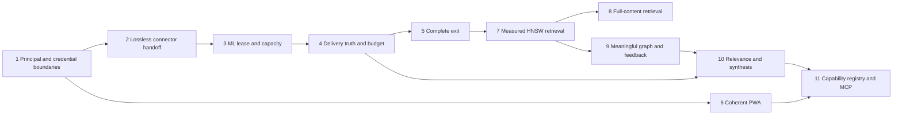

# System Review Summary: Smackerel Full System

**Snapshot:** 2026-08-01
**Review mode:** full
**Depth:** deep
**Output:** standalone diagnostic memo
**Status:** advisory; no spec, design, scope, report, state, source, test, or config artifact was changed

Every material claim below is tied to source, configuration, a product principle, a spec state, or a release artifact. Source inspection proves code shape, not production behavior. Runtime limits are explicit in the [Appendix](#appendix---evidence-classes-and-declared-uncertainty).

## 1. Review Scope

- **Reviewed target:** the complete Smackerel product: problem framing, ingestion, ML delivery, retrieval, graph, synthesis, digest, proactive delivery, PWA, assistant authority, data portability, competitive position, release truth, and extensibility.
- **Lenses used:** product, UX, runtime, stability, DevOps, simplification, trust, validation, audit, engineering, documentation, and spec freshness. Section 3 carries ten headers because two lenses are distributed rather than sectioned: DevOps findings sit in D27 (lane wiring), D21 (ML capacity), and A4-LEDGER (release projection); audit findings sit under Validation (VAL-1/VAL-2) and Spec Freshness.
- **Primary inputs:** [product design](smackerel.md), [product principles](Product-Principles.md), [MVP vision](releases/mvp/vision.md), [v1 feature packet](releases/v1/features.md), specs 004/095/109, and the concrete source/config paths cited per finding.
- **Review boundary:** diagnostic only. `promoteFindings=false`; no planning or implementation artifact was mutated.
- **Execution boundary:** no product stack, test suite, exploit, browser journey, database query, JetStream workload, or provider delivery was run for this memo.

## 2. System Summary

### 2.1 Overall assessment

**The problem is still right, but the system is not yet safe or truthful enough to defend the solution.** Smackerel has unusually broad ingestion, useful domain seams, and a credible local-first position. Its highest risks are now more fundamental than retrieval quality:

1. authorization is conditional on session source and environment string rather than on the endpoint's declared requirement: `RequireScope` short-circuits every required scope for shared-token and bootstrap sessions ([D28](#trust--security--compliance)), assistant tools take identity from model arguments and search the global corpus without `corpus:read` ([D25](#trust--security--compliance)), and the Telegram inbound boundary opens when its allowlist is empty while actor mapping is enforced only where an environment string equals `production` ([D29](#trust--security--compliance));
2. an authenticated caller can redirect configured photo credentials to a caller-selected host ([D24](#trust--security--compliance));
3. the one gate the repository itself calls non-negotiable runs in no automated lane — only a documented manual invocation — so the assistant acceptance thresholds enforce nothing between manual runs ([D27](#validation--claims-vs-reality));
4. connector handoff is not lossless: cursors can advance after publish failures, while `source_ref` is not persisted as stable replay identity ([D19](#runtime--real-user-execution), [D10](#engineering--code-signals));
5. ML work can outlive its JetStream lease by at least five times, without a heartbeat or shared inference limit ([D21](#runtime--real-user-execution));
6. several proactive jobs record or log delivery after an ignored send error ([D22](#runtime--real-user-execution)); and
7. the promised unconditional exit path exports only processed artifact rows and paginates them unsafely ([D23](#trust--security--compliance)).

Retrieval, graph quality, digest ranking, synthesis, capability reachability, and product coherence remain material. They must follow the safety and data-integrity work, not precede it.

**Verdict:** preserve the ingestion and domain foundations, replace implicit handoffs with durable contracts, make identity and authorization server-derived and unconditional, prove both delivery and gate execution before trusting either, then finish the context-server product that the repository already points toward.

### 2.2 Is this the right problem?

| Original problem | Current assessment |
|---|---|
| Capture friction is too high | **Mostly dissolved as differentiation.** Share sheets, extensions, email ingestion, and one-click saves are common. Reliable, lossless capture is still a hard requirement, and D10/D19/D20 show Smackerel does not yet guarantee stable replay, durable handoff, or dependable offline wake-up. |
| Retrieval is broken | **Real, with a higher bar.** Users expect precise, cited answers over their own corpus, not merely a matching link. D1-D3 and D15 show the current substrate is unmeasured and lossy. |
| Nothing connects across life domains | **Real and underserved.** Competitors each hold slices; Smackerel's whole-life corpus remains differentiated. D4-D7 and D13 show the current graph and synthesis do not yet deliver the claim. |
| Knowledge does not evolve | **Real and partly delivered.** Topic lifecycle, momentum, proactive act/snooze/dismiss acknowledgement, and rating-based relevance updates exist. Persistent producer-attributed wrong/not-useful feedback is missing, while source quality and temporal relevance do not yet drive ranking (D9/D16). |
| Taxonomy is demanded at capture time | **Dissolved.** Automatic organization is now table stakes. |
| Personal context should remain under user control | **More important than before.** It is Smackerel's strongest moat, but D12/D23-D25 currently weaken ownership, confidentiality, and exit. |

The genuinely unsolved problem is:

> No mainstream product holds email, calendar, location, purchases, media, chat, property, and market context in one user-controlled graph, then exposes that context safely to the tools where the user already works.

The holistic solution is therefore **a personal context server with a thin operator console**, not a destination application competing with cloud vendors on page count.

### 2.3 Strongest parts to preserve

| Strength | Evidence and qualification |
|---|---|
| Broad ingestion is the real asset | Seventeen-plus connector implementations span communication, browsing, location, media, weather, property, and QF packets under [`internal/connector/`](../internal/connector/). |
| The connector domain contract is small and reusable | [`Connector`](../internal/connector/connector.go) exposes five core methods and has a registry/supervisor. D19 is a supervisor durability defect, not a reason to discard the abstraction. |
| The surfacing controller is a valuable shared capability | [`internal/intelligence/surfacing/`](../internal/intelligence/surfacing/) centralizes channel, producer, dedupe, suppression, and budget decisions. D26 requires its executable policy to match the product promise. |
| ML-backed synthesis persists extracted structure and cross-source assessment | [`synthesis_subscriber.go`](../internal/pipeline/synthesis_subscriber.go#L248) writes concept/entity relationships and contradictions transactionally. For concepts spanning sources, the current source also publishes an ML assessment ([`synthesis_subscriber.go`](../internal/pipeline/synthesis_subscriber.go#L363), [`synthesis.py`](../ml/app/synthesis.py#L427)) and persists qualifying `CROSS_SOURCE_CONNECTION` edges with insight text and source artifact IDs ([`upsert.go`](../internal/knowledge/upsert.go#L405)). Scheduled outputs should consume this foundation. |
| Topic lifecycle is implemented | [`topics/lifecycle.go`](../internal/topics/lifecycle.go) computes momentum and state transitions on schedule. |
| Retrieval routing is a sound extension seam | [`routing.Executor`](../internal/retrieval/routing/executor.go) and evergreen scoring are implemented and wired; [spec 095](../specs/095-retrieval-strategy-routing/state.json) is `done`, not planning-only. |
| Feedback foundations are real | Proactive act/snooze/dismiss resolves through one acknowledgement path ([`ack.go`](../internal/proactive/ack.go#L44)), and low rating annotations atomically reduce persisted artifact relevance ([`annotations.go`](../internal/intelligence/annotations.go#L90)). D9 is an attribution, durability, and metrics-integration gap, not total feedback absence. |
| Failure honesty has explicit contracts | Assistant non-OK outcomes are structurally distinct from capture success, with focused regression coverage in [`internal/assistant/`](../internal/assistant/). |
| The repository already contains quality-gate designs | The assistant eval corpus and harness under [`tests/eval/assistant/`](../tests/eval/assistant/), the EXPLAIN assertions under [`tests/integration/agent/`](../tests/integration/agent/), and the honest-failure contracts above are genuinely reusable for retrieval. This is a strength of design, not of enforcement: the assistant acceptance gate belongs to no automated lane and enforces nothing outside a manual run (D27). |
| Scheduling is structured | Jobs have explicit cron ownership and guarded execution in [`scheduler.go`](../internal/scheduler/scheduler.go). Delivery finalization is the defect (D22), not cron registration. |

### 2.4 Systemic weaknesses

The architecture is strongest where a capability has one explicit contract. Drift appears where no contract owns the handoff:

| Missing contract | Consequences |
|---|---|
| Durable ingest handoff | Cursor commits are decoupled from publish acceptance (D19); stable replay identity is broken (D10). |
| Authenticated principal | Photo credentials can cross audiences (D24); assistant tools trust model/body identity (D25); scope enforcement is skipped wholesale for two session sources (D28); the Telegram boundary admits unmapped chats with an empty actor outside production (D29). |
| ML lease and capacity | Work can be redelivered while still running, and 25 consumers share no inference ceiling (D21). |
| Delivery lifecycle | Several jobs call `SendDigest` and then record/log success regardless of the return value (D22). |
| Complete corpus schema | Export and delete do not cover the same owned state (D12/D23). |
| PWA composition root | Navigation, service-worker registration, queue wake-up, and auth-aware onboarding vary by page (D20). |
| Capability registry | Assistant intents, navigation, slash commands, and future MCP tools are separate inventories (D17/D18). |
| Edge semantics | Producers and weights do not declare observational vs inferential meaning (D4/D13). |
| Scheduled insight consumption | ML-backed cross-source assessments already persist, but `RunSynthesis`, digest, and weekly output do not consume them. The daily result is discarded and weekly output remains topic/count-led (D6/D7). |
| Persistent surfacing feedback | Act/snooze/dismiss suppresses acknowledged content and ratings update relevance, but no durable producer-attributed wrong/not-useful event connects those paths to acted-on/false-positive metrics (D9). |
| Executable policy budget | Product Principle 6 says fewer than three prompts per week; runtime permits five per day (D26). |
| Runtime release ledger | Release packets can contradict certified state and live wiring (A4-LEDGER). |

### 2.5 User scenarios: promise vs reality

| Promised scenario | Current reality |
|---|---|
| Ask anything in natural language | Five declared user-facing intents cover only a fraction of built capabilities (D17). Retrieval also lacks an authenticated corpus grant boundary (D25), and the scope gate that would supply one is short-circuited entirely for shared-token and bootstrap sessions (D28). |
| Capture from a phone and trust it will arrive | Online capture can work, but changed source content lacks stable replay identity (D10), connector publish failure can advance the source cursor (D19), and offline queue wake-up is page-dependent (D20). |
| Digest shows only the few things that matter | Selection is newest-first and the LLM receives titles/types rather than useful evidence (D8/D14/D16). |
| Cross-domain synthesis explains agreement and disagreement | The ML path already persists qualifying source-cited cross-source assessments. The recurring product path bypasses them: `RunSynthesis` returns topic/count-derived structs, the daily job discards them, and weekly text remains count-led (D6/D7). |
| Timely proactive help | Scheduling exists. Daily digest delivery handles send failure correctly; resurfacing, pre-meeting, weekly, and monthly paths do not (D22). The interruption ceiling also violates Principle 6 (D26). |
| Reach Smackerel from the daily-touch surface (Telegram) | Inbound authorization is default-open: with no configured chat allowlist the bot processes any chat and only warns, and an unmapped chat yields an empty actor unless the environment string is `production` (D29). Outbound digest delivery fails closed on that same empty value, so one configuration default is read two opposite ways. |
| Connect a cloud drive from the PWA | The listed Connect control is permanently disabled, while the direct add page sends a production-forbidden owner field (D20). |
| Browse the daily digest from the product shell | Digest is absent from the guaranteed cross-surface navigation core (D18). |
| Export, relocate, or delete the complete corpus | Export is partial and pagination-unsafe; no user-facing full delete exists (D12/D23). |
| Use Smackerel context from another client | [Spec 109](../specs/109-mcp-knowledge-server/state.json) is a sound planning packet but remains `specs_hardened`, `planningOnly:true`; no MCP server is implemented. |

### 2.6 Competitive position

The market has moved in two directions:

1. **Know to do.** Fabric and Mem advertise agents that draft or act, not only retrieve.
2. **App to context protocol.** Mem exposes a Claude/MCP connector; users increasingly bring their preferred model and expect the knowledge system to supply governed context.

| Product | Vendor-stated position relevant to Smackerel |
|---|---|
| Fabric | Broad integrations, recap/digest, scheduled jobs, multi-client reach, and agents that act. |
| Mem | Notes/meetings, proactive context, and a Claude connector over MCP. |
| Recall | Consumption-focused knowledge graph, augmented browsing, chat, export, and spaced repetition. |
| Khoj/Pipali | Self-hosted/local AI positioning, weakening any generic "local AI" claim. |

Passive ingestion and digests are table stakes. "Local" alone is contested. Smackerel's defensible edge is narrower and stronger:

> **A whole-life corpus, on hardware the user controls, with no required vendor, exposed through explicit grants to the clients the user chooses.**

That edge is not defensible while credentials can cross audiences (D24), whole session sources bypass the scope gate (D28), the Telegram boundary is default-open (D29), corpus reads bypass the corpus grant (D25), and exit is incomplete (D12/D23). Safety work is product work here.

### 2.7 Missing or incomplete capabilities

| Capability | Weight | Current status |
|---|---:|---|
| Unconditional authorization boundary | Critical | Missing; model/body identity crosses retrieval and notification tools (D25), `RequireScope` is bypassed by session source (D28), and Telegram inbound authorization is default-open (D29). |
| Credential audience binding | Critical | Missing for photo provider base URLs (D24). |
| Lossless connector cursor and replay contract | Critical | Cursor commit is unsafe and stable source replay identity is broken (D19/D10). |
| Complete export, relocation, and full delete | Critical | Partial export, unsafe cursor, no full delete (D12/D23). |
| Retrieval quality/query-plan gate | Critical | No real plan or corpus latency proof (D1). |
| Producer-attributed persistent surfacing feedback | Critical | Act/snooze/dismiss acknowledgement and rating-based relevance updates exist; wrong/not-useful persistence and acted-on/false-positive metric wiring do not (D9). |
| Relevance-ranked digest | High | Selection is recency-first; persisted source quality is unused, temporal relevance is not persisted, and the prompt lacks evidence-rich inputs (D8/D14/D16). |
| Scheduled delivery of persisted cross-source assessment | High | ML-backed cited edges are implemented; `RunSynthesis`, digest, and weekly output do not consume them, and weekly output remains count-led (D6/D7). |
| Capability registry and built-feature intents | High | Missing (D17/D18). |
| MCP knowledge server | High | Planning complete; implementation absent (spec 109). |
| Outbound action foundation | High competitive value | Not started; should remain parked until authority and confirmation contracts are fixed. |
| Notes/messages/voice connectors | Medium | Useful breadth, but should remain parked until ingestion durability and product coherence are fixed. |
| Native mobile client | Low under context-server positioning | PWA reliability matters first. |

## 3. Findings by Lens

### Product / Capability

| ID | Severity / impact | Location | Finding | Recommendation | Promote to spec |
|---|---|---|---|---|---|
| **D6** | High / business, user | [`synthesis_subscriber.go`](../internal/pipeline/synthesis_subscriber.go#L363), [`upsert.go`](../internal/knowledge/upsert.go#L405), [`synthesis.py`](../ml/app/synthesis.py#L427), [`synthesis.go`](../internal/intelligence/synthesis.go#L50), [`jobs.go`](../internal/scheduler/jobs.go#L206) | ML-backed cross-source assessment is source-wired and qualifying results persist as `CROSS_SOURCE_CONNECTION` edges with insight text and source artifact IDs. The product gap is the separate scheduled output path: `RunSynthesis` still derives topic-name/count structs, the daily job discards them, and digest/weekly output never consumes the persisted assessment. | Integrate the existing persisted ML-backed assessment into digest and weekly selection/rendering; replace the duplicate topic-name pseudo-insight path rather than building another producer. | yes |
| **D7** | High / user, trust | [`synthesis.go`](../internal/intelligence/synthesis.go#L333) | Weekly synthesis opens with processed-item statistics and is assembled from counts, directly contradicting Principle 6's prohibition on system self-reporting noise. | Make the weekly output insight-first, source-cited, and free of processing counts. | yes |
| **D8** | High / user | [`generator.go`](../internal/digest/generator.go#L344) | Digest candidates are `ORDER BY created_at DESC LIMIT 20`; no relevance formula selects what matters. | Persist and rank by the existing quality, temporal, connection, and interaction signals. | yes |
| **D9** | High / quality | [`ack.go`](../internal/proactive/ack.go#L44), [`annotations.go`](../internal/intelligence/annotations.go#L90), [`surfacing.go`](../internal/metrics/surfacing.go#L123) | Proactive act/snooze/dismiss acknowledgement exists, and persisted low ratings reduce artifact relevance. The missing contract is a durable producer-attributed wrong/not-useful feedback event: acknowledgement is process-local, producer is not carried into the acknowledgement outcome, and acted-on/false-positive metric helpers have no production call sites. | Extend the existing acknowledgement and annotation paths to persist producer-attributed outcomes, update relevance/provenance, and increment the matching metrics from one event path. | yes |
| **D14** | High / user | [`nats_client.py`](../ml/app/nats_client.py#L1032) | The digest LLM receives title and type, not summary, score, evidence, or content. It cannot repair the selector's weak ranking. | Pass bounded summaries, reasons, scores, and citations after deterministic ranking. | optional |
| **D16** | High / quality | [`processor.py`](../ml/app/processor.py#L56), [`nats_client.py`](../ml/app/nats_client.py#L892), [`embedder.py`](../ml/app/embedder.py#L210), [`processor.go`](../internal/pipeline/processor.go#L650) | `key_ideas` already affect retrieval because they are included in artifact embedding text. The remaining ranking gap is narrower: persisted `source_quality` is not consumed by ranking, while `temporal_relevance` is extracted but the processing writer does not persist it, so ranking cannot consume it. | Define one relevance-signal contract that consumes persisted source quality and persists then consumes temporal relevance at digest and surfacing boundaries. | yes |
| **D17** | High / user, business | [`scenarios.yaml`](../config/assistant/scenarios.yaml) | Five user-facing intents expose only a small fraction of built capabilities. Reachability is split among assistant intents, pages, and Telegram slash commands. | Introduce one capability registry and generate assistant, nav, slash-alias, and MCP projections from it. | yes |

### UX / Accessibility / Flow

| ID | Severity / impact | Location | Finding | Recommendation | Promote to spec |
|---|---|---|---|---|---|
| **D18** | High / user | [`appnav.js`](../web/pwa/lib/appnav.js#L22), [`appshell_test.go`](../internal/web/appshell_test.go#L98) | The daily digest is a primary recurring output but is absent from the guaranteed cross-surface navigation core. | Put digest in the capability registry's core projection and derive parity checks from that registry. | yes |
| **D20** | High / user, accessibility, quality | [`index.html`](../web/pwa/index.html#L76), [`connectors.html`](../web/pwa/connectors.html#L76), [`connectors-add.js`](../web/pwa/connectors-add.js#L137), [`drive_handlers.go`](../internal/api/drive_handlers.go#L199), [`pwa.go`](../internal/api/pwa.go#L83) | PWA pages are composition islands: only home and assistant load `appnav.js`; the connector list's Connect button is permanently disabled; direct add always sends `owner_user_id`, which production rejects; offline share enqueues without re-registering the one-shot sync tag; capture outcome cards have no `role`/`aria-live`. Photo-health already has live regions and is not part of this finding. | Load one shared PWA bootstrap everywhere; enable/link the real add flow; derive owner from session; register sync after every enqueue and flush on boot; add status/alert live regions to capture outcomes. | yes |

### Runtime / Real-User Execution

| ID | Severity / impact | Location | Finding | Recommendation | Promote to spec |
|---|---|---|---|---|---|
| **D19** | Critical / user, operational, data loss | [`supervisor.go`](../internal/connector/supervisor.go#L384), [`supervisor_test.go`](../internal/connector/supervisor_test.go#L505) | After one or more `PublishRawArtifact` failures, the supervisor still assigns `lastCursor = newCursor` and persists that cursor. The next sync can skip the failed source items permanently. The test proves only no crash and zero publishes. | Commit a cursor only after every item has a durable publish receipt; retain/replay the old cursor on any failure; add a mixed-success replay regression. | optional |
| **D21** | High / operational, quality | [`nats_client.py`](../ml/app/nats_client.py#L43), [`nats_client.py`](../ml/app/nats_client.py#L478), [`processor.py`](../ml/app/processor.py#L159), [`smackerel.yaml`](../config/smackerel.yaml#L2361) | Twenty-five subject loops fetch five messages each and acknowledge after full processing. `ack_wait` is 120 seconds while a single permitted LLM call can run 600 seconds before retries. There is no `in_progress` heartbeat or shared inference semaphore. Static consequence: leases can expire during valid work, causing redelivery/duplicate processing and uncontrolled concurrent inference. | Add lease heartbeats and one SST-sized global in-flight semaphore; bound fetch reservations by available permits. | yes |
| **D22** | High / user, operational, trust | [`jobs.go`](../internal/scheduler/jobs.go#L255) | Daily digest correctly propagates send failure and marks delivered only after send. Five other sites discard the `SendDigest` return: resurfacing (L255), which then calls `MarkResurfaced`; and pre-meeting (L293), weekly synthesis (L319), monthly report (L347), and frequent-lookup quick reference (L405), which log delivery regardless. | Route every proactive path through one send-ack-commit helper; failed sends remain retryable and never advance delivery state or success metrics. | optional |

### Stability / Operations

| ID | Severity / impact | Location | Finding | Recommendation | Promote to spec |
|---|---|---|---|---|---|
| **D1** | Critical / quality, performance | [`001_initial_schema.sql`](../internal/db/migrations/001_initial_schema.sql#L72), [`search.go`](../internal/api/search.go#L516) | The IVFFlat index was created with `lists=100`; production never sets probes, and the joined query may or may not use the index. No real-corpus EXPLAIN or latency result settles the branch. Index use may inspect too little; index bypass means a full vector scan and dead index. | Add retrieval eval, EXPLAIN, and real-corpus p95 gates, then migrate to SST-tuned HNSW. | yes |
| **D5** | High / performance | [`linker.go`](../internal/graph/linker.go) | Temporal/source linkers use cartesian query shapes; temporal wraps `created_at` in `DATE(...)`, preventing the normal created-time index from serving the predicate. Cost grows with corpus size on ingest. | Replace cartesian scans with bounded indexed candidate lookups and assert their query plans. | optional |

### Simplification / Consistency

The product has good local abstractions but no shared foundation for the boundaries that cross features. The corrective simplification is not another framework; it is five small contracts:

1. `DurablePublishReceipt` before cursor commit;
2. `AuthenticatedPrincipal` injected into every tool;
3. `DeliveryAttempt -> Acknowledged -> Committed` for every channel;
4. one `CapabilityDescriptor` projected to assistant, navigation, aliases, and MCP; and
5. one versioned `CorpusBundle` shared by export, import, and delete.

These contracts collapse duplicated policy and directly address D12/D17-D25. They should replace hand-maintained lists and implicit call ordering, not sit beside them.

### Trust / Security / Compliance

| ID | Severity / impact | Location | Finding | Recommendation | Promote to spec |
|---|---|---|---|---|---|
| **D11** | High / security, trust | [`001_initial_schema.sql`](../internal/db/migrations/001_initial_schema.sql#L24) | `artifacts` has no canonical sensitivity field, despite design claims that sensitivity governs model routing and egress. | Add an artifact sensitivity policy with provenance and enforce it before any external egress. | yes |
| **D12** | High / trust, compliance | [`router.go`](../internal/api/router.go#L94), [Principle 11](Product-Principles.md#principle-11--local-first-data-ownership) | No user-facing per-artifact, per-topic, per-source, or full-corpus delete surface satisfies unconditional exit. | Build delete from the same corpus schema used by export/import and prove referential cleanup. | yes |
| **D23** | Critical / user, trust, data portability | [`postgres.go`](../internal/db/postgres.go#L92), [`capture.go`](../internal/api/capture.go#L350), [`001_initial_schema.sql`](../internal/db/migrations/001_initial_schema.sql#L40) | `/api/export` emits only `processing_status='processed'` artifact rows. Pending/failed captures, graph, digest, synthesis, and other corpus state are omitted. Pagination uses only `created_at > cursor`, orders only by `created_at`, and serializes RFC3339 seconds even though PostgreSQL stores subsecond timestamps; equal-time page boundaries can skip rows and precision loss can duplicate them. | Define a versioned complete corpus bundle; use a stable `(created_at,id)` cursor encoded without precision loss; prove export-import-delete parity. | yes |
| **D24** | Critical / security | [`photos.go`](../internal/api/photos.go#L397), [`immich.go`](../internal/connector/photos/adapters/immich/immich.go#L333), [`photoprism.go`](../internal/connector/photos/adapters/photoprism/photoprism.go#L429) | An authenticated caller controls photo `base_url`. If the request omits a credential, the handler pairs that host with the SST Immich/PhotoPrism secret; adapters transmit it as `x-api-key` or `X-Session-ID`. Static consequence: a caller-selected host can receive a configured secret. No exploit was run. | Bind endpoint and credential in one server-owned provider record; never combine a request URL with an SST credential; add an adversarial credential-audience test. | yes |
| **D25** | Critical / security, privacy | [`router.go`](../internal/api/router.go#L94), [`browser_session_policy.go`](../internal/auth/browser_session_policy.go#L37), [`retrieval/tool.go`](../internal/agent/tools/retrieval/tool.go#L180), [`propose.go`](../internal/agent/tools/notification/propose.go#L80), [`execute.go`](../internal/agent/tools/notification/execute.go#L83) | `/api/assistant/turn` requires `assistant:turn`, while the daily-user grant set lacks `corpus:read`. The retrieval tool checks a model-supplied `user_id` only for nonempty, discards it, and searches the global engine. Notification propose/execute also trust model-supplied identity. The production scheduler currently fails loud as a stub, limiting notification write impact but not fixing the authority design. | Remove identity from model/browser payloads; inject authenticated principal and grants through tool context; enforce corpus read at retrieval; bind confirmations to that principal; keep notifications unavailable until a real scheduler is bound. | yes |
| **D26** | High / user, trust | [Principle 6](Product-Principles.md#principle-6--invisible-by-default-felt-not-heard), [`smackerel.yaml`](../config/smackerel.yaml#L501), [`budget.go`](../internal/intelligence/surfacing/budget.go#L31) | The product promise is fewer than three non-urgent system prompts per week. SST explicitly says this is not a hard cap, permits five nudges per day, and runtime resets only daily. The executable policy therefore permits up to 35 ordinary slots per week. | Enforce a persisted per-principal rolling weekly non-urgent cap of two; keep urgent overrides separate and audited. | optional |
| **D28** | Critical / security | [`scope_middleware.go`](../internal/auth/scope_middleware.go#L67), [`router.go`](../internal/api/router.go#L533), [`httpadapter/middleware.go`](../internal/assistant/httpadapter/middleware.go#L58), [`session.go`](../internal/auth/session.go#L26), [`smackerel.yaml`](../config/smackerel.yaml#L1101) | `RequireScope` short-circuits for `SessionSourceSharedToken` and `SessionSourceBootstrap`: it increments a bypass counter, calls the next handler, and returns before evaluating any required scope. The complete non-test gate inventory is four — `annotation:edit` ([router.go#L124](../internal/api/router.go#L124)), `knowledge-graph:read` ([router.go#L178](../internal/api/router.go#L178)), `extension:bookmarks,history` ([router.go#L542](../internal/api/router.go#L542)), and `assistant:turn` ([httpadapter/middleware.go#L58](../internal/assistant/httpadapter/middleware.go#L58)) — and all four are bypassed for those two sources today. The hole is therefore present-tense, not only a hazard to a future `corpus:read` guard: `/api/assistant/turn` is already reachable without its declared scope. Tense qualification: `auth.production_shared_token_fallback_enabled` is `false`, so the shared-token production path is a latent opt-in rather than an active hole. Critical severity survives independently because `SessionSourceBootstrap` *is* a production path — it enrolls the first user on a fresh production deployment — and `Session.IsAdmin()` returns true for it. | Evaluate scopes unconditionally; deny scope-guarded routes for any source that cannot carry scopes instead of waving it through. Retire the production shared-token fallback behind an explicit, audited, time-boxed migration. | yes |
| **D29** | Critical / security | [`bot.go`](../internal/telegram/bot.go#L452), [`user_mapping.go`](../internal/telegram/user_mapping.go#L91), [`smackerel.yaml`](../config/smackerel.yaml#L337) | The Telegram trust boundary rests on one literal string comparison. With the SST default `chat_ids: ""` the bot enters open-access mode and processes messages from any chat, warning only. `resolveActorUserID` then refuses unmapped chats only when `strings.EqualFold(b.environment, "production")`; otherwise it returns an empty actor and, by its own comment, the request proceeds on a `SessionSourceSharedToken` session whose user id is empty — unscoped via D28 and unattributed. The same empty value fails closed outbound (`no telegram chats configured for digest delivery`) and open inbound. `IsAuthorized` exists but no production caller uses it; the real gate is the inline allowlist check. | Make inbound authorization fail closed like the outbound path, require an explicit chat-to-user mapping in every environment, and remove environment-string-conditional authorization. This is the repository's own no-defaults policy applied to a trust boundary. | yes |

### Validation / Claims vs Reality

| ID | Severity / impact | Location | Finding | Recommendation | Promote to spec |
|---|---|---|---|---|---|
| **VAL-1** | Critical / quality | D1 evidence above | No executed plan or real-corpus latency evidence supports the retrieval claim. | Make retrieval accuracy, EXPLAIN node, and p95 blocking runtime facts. | yes |
| **VAL-2** | High / business, docs | [`spec 004`](../specs/004-phase3-intelligence/spec.md), [MVP vision](releases/mvp/vision.md#what-shipping-mvp-proves), [`synthesis_subscriber.go`](../internal/pipeline/synthesis_subscriber.go#L363), [`synthesis.go`](../internal/intelligence/synthesis.go#L50) | Certified artifacts claim genuine, source-attributed synthesis as a delivered recurring experience. A real ML-backed assessment producer and durable cited edges exist, but the scheduled `RunSynthesis`/digest/weekly path bypasses them: daily output is discarded and weekly output is count-led. The end-to-end claim is therefore broader than the delivered output path. | Reclassify only the scheduled-output claim until digest and weekly synthesis consume the existing producer and the resulting cited output is proven. | yes |
| **A4-LEDGER** | High / operational, docs | [`v1/features.md`](releases/v1/features.md#v7--retrieval-strategy-routing--freshness-aware-retrieval-post-mvp-intelligence-gap-closers-planning-hardened-2026-06-17), [`spec 095 state`](../specs/095-retrieval-strategy-routing/state.json), [`tier_evergreen.go`](../internal/pipeline/tier_evergreen.go) | The v1 packet says spec 095 is planning-only, `internal/retrieval/` is absent, and validation has not occurred. The spec is actually `done`, `planningOnly:false`, validate-certified, and `internal/retrieval/` exists. The drift is not confined to prose: it is encoded in a machine-binding Gate G101 annotation at [`v1/features.md`](releases/v1/features.md) lines 78-79 — `<!-- bubbles:feature ... delivery=optional -->`, justified by "095 stays optional (NOT-ENFORCED) until its full-delivery run reaches done". G101 therefore declines to enforce delivery for a feature that is already delivered, so a stale premise now owns a release gate's enforcement decision, not merely a status sentence. | Generate release claims **and their machine-binding delivery annotations** from a runtime capability ledger, and fail on projection drift so an enforcement flag cannot outlive its premise. | no |
| **D27** | Critical / quality, trust | [`acceptance_test.go`](../tests/eval/assistant/acceptance_test.go), [`go-unit.sh`](../scripts/runtime/go-unit.sh#L67), [`go-integration.sh`](../scripts/runtime/go-integration.sh#L53), [`Testing.md`](Testing.md), [`smackerel.yaml`](../config/smackerel.yaml#L1350) | The assistant acceptance gate asserts routing-accuracy and capture-fallback floors that SST calls a NON-NEGOTIABLE acceptance regression if lowered. The file carries `//go:build integration`, so the unit lane (`go test ./...`, no tags) excludes it; the integration lane sets `-tags integration` but scopes packages to `./tests/integration/... ./internal/notification/... ./internal/assistant/... ./internal/cardrewards/...`, and `./tests/eval/...` is absent. The gate therefore executes in no automated lane. A manual path does exist and is documented: [`Testing.md`](Testing.md) lines 755 and 773 give `go test -count=1 -tags integration -run TestAcceptanceGate_RoutingAccuracyAndCaptureFallback ./tests/eval/assistant/...`. The thresholds are thus runnable on demand, but nothing enforces them and drift stays invisible between manual runs. The test's own comment that CI invokes `./smackerel.sh test integration` and the gate then runs is false. | Add `./tests/eval/...` to the integration package list and assert in CI that the gate actually ran (non-zero executed-assertion count), so a silently skipped gate fails loudly. | yes |

### Engineering / Code Signals

| ID | Severity / impact | Location | Finding | Recommendation | Promote to spec |
|---|---|---|---|---|---|
| **D2** | High / quality | [`nats_client.py`](../ml/app/nats_client.py#L892), [`embedder.py`](../ml/app/embedder.py#L210) | The embedding input is a generated abstraction: title, short summary, and up to five key ideas. Raw facts that extraction omits never reach vector matching. | Index a raw-content representation alongside the generated summary/key-idea signal. | yes |
| **D3** | High / quality, config | [`embedder.py`](../ml/app/embedder.py#L43), [`main.py`](../ml/app/main.py#L500) | Runtime hardcodes `all-MiniLM-L6-v2` while SST declares `nomic-embed-text`. | Resolve one fail-loud SST model/dimension contract and migrate embeddings explicitly. | optional |
| **D4** | High / quality | [`linker.go`](../internal/graph/linker.go#L54) | Five link strategies emit many edges per artifact; same-day and same-source observations are represented alongside semantic relations. | Separate observational edges from inferential edges and remove source co-membership as a semantic relation. | yes |
| **D10** | Critical / user, data quality | [`ingest.go`](../internal/pipeline/ingest.go#L51) | `source_ref` is omitted from insert and dedup binds it against `source_url`; changed content creates another artifact and safe replay is impossible. | Persist `source_ref`, dedup by `(source_id,source_ref)`, and update in place when content changes. | optional |
| **D13** | High / quality | [`search.go`](../internal/api/search.go#L392), [`linker.go`](../internal/graph/linker.go) | Same-source weight 0.7 and same-day weight 0.5 outrank genuine similarity that may begin at 0.3; graph expansion orders descending by those incomparable weights. | Define per-edge semantics and a common ranking score; never rank observational constants as semantic strength. | yes |
| **D15** | High / quality | [`001_initial_schema.sql`](../internal/db/migrations/001_initial_schema.sql#L15), [`processor.go`](../internal/pipeline/processor.go#L650) | Retrieval stores one embedding per artifact with no chunk rows, offsets, or winning-passage identity. Long and short artifacts therefore have the same single-vector granularity. | Chunk raw content with bounded overlap, retain the winning passage as evidence, and fuse chunk results at artifact level. | yes |

### Documentation / User Guidance

- **Release status:** only the spec 095 V7 section is proven stale here. [Spec 095](../specs/095-retrieval-strategy-routing/state.json) and source wiring contradict its planning-only release row. This memo does **not** generalize that all release documents are stale.
- **Synthesis status:** [spec 004](../specs/004-phase3-intelligence/state.json) remains certified `done`, and [MVP vision](releases/mvp/vision.md#what-shipping-mvp-proves) says synthesis works. The repository does contain ML-backed persisted cross-source assessment; D6/D7 show that the scheduled daily/weekly product output bypasses it and remains topic/count-led, so only the end-to-end recurring-output claim is unsupported.
- **MCP status:** [spec 109](../specs/109-mcp-knowledge-server/state.json) remains honestly planning-only. The current product must not claim an MCP server exists.
- **Proactive status:** documentation should say scheduling exists but delivery truth differs by job. "The proactive half is built and running" is too broad because D22/D26 are on the delivery path.

### Spec Freshness / Trust Classification

| Artifact | Classification | Reason |
|---|---|---|
| Spec 095 implementation packet | **STILL_TRUE** for implemented source/state | `done`, certified, and source-wired. |
| v1 V7 release projection | **MAJOR_DRIFT** | It states the opposite of spec 095's state and source existence. |
| Spec 004 synthesis behavior | **MAJOR_DRIFT** | A real ML-backed producer persists cited cross-source assessment, but the certified recurring experience uses a separate topic/count path and does not surface that result (D6/D7). |
| MVP synthesis claim | **Unsupported runtime claim** | It cites specs/docs, not a current behavior probe. |
| Spec 109 MCP packet | **STILL_TRUE planning artifact** | `specs_hardened`, planning-only, no implementation claimed. |

## 4. Cross-Domain Conflicts

### Product vs UX

- The product's recurring value is digest/intelligence, while the guaranteed navigation prioritizes Cards and omits Digest (D18).
- The product claims an integrated assistant front door, while most PWA pages do not load the common app navigation and connector onboarding cannot complete (D20).
- The product has many built capabilities, but users must know dedicated pages or slash commands because only five intents are declared (D17).

### UX vs Security

- Making provider setup flexible by accepting `base_url` from a request crosses the credential-audience boundary (D24).
- Asking the model to supply `user_id` makes a tool schema convenient but turns model output into authority (D25).
- A queued-share success card says it "will sync" even though the page does not re-register the sync tag that guarantees another attempt (D20).

### Runtime vs Reliability

- Connector sync success and cursor advancement are recorded even when the durable publish handoff fails (D19).
- ML processing duration and JetStream lease duration are independently configured, with no heartbeat contract (D21).
- Proactive jobs separate send and state mutation without a shared acknowledgement primitive (D22).

### Validation vs Documentation

- Spec/release status can move independently from runtime wiring, demonstrated by spec 095 (A4-LEDGER).
- Tests and certified scopes do not prove that scheduled digest/weekly output consumes the existing persisted ML-backed cross-source assessment, while user-facing documents describe that recurring experience as delivered (D6/D7).
- Product Principle 6 is binding prose while runtime configuration explicitly treats it as non-binding (D26).

## 5. Prioritized Actions

The order below is deliberate. Security, data loss, delivery truth, and exit precede performance optimization and reach expansion. Each step produces standalone user value and has an executable or observable verification.

**Freeze rule:** do not add connectors, outbound actions, new destination pages, or MCP exposure until Steps 1-6 close. Do not broaden corpus reach until retrieval and insight truth close in Steps 7-10.

### Step 1 - Bind every credential, artifact, and action to an authenticated principal

| | |
|---|---|
| **Fixes** | D11, D24, D25, D28, D29 |
| **Exact change** | Replace request-configured photo endpoints with server-owned provider records that bind endpoint plus credential. Never pair a request URL with an SST secret. Remove `user_id` from assistant tool schemas; inject `AuthenticatedPrincipal` and grants through tool context. Require `corpus:read` for retrieval and bind notification proposals/confirm refs to the same principal. Make scope evaluation unconditional in the same change: remove the shared-token and bootstrap short-circuits from `RequireScope` and deny scope-guarded routes for any source that carries no scopes — without this the `corpus:read` requirement is unreachable for exactly those sources, and removing the bootstrap short-circuit does not deadlock first-user enrollment because `/v1/auth/users` is not `RequireScope`-guarded — then retire the production shared-token fallback on an audited timetable. Close the Telegram chain: fail closed when the inbound allowlist is empty, require an explicit chat-to-user mapping in every environment, and delete the environment-string condition. Add canonical persisted artifact sensitivity with provenance, then require one fail-closed egress decision to validate authenticated principal/grants, credential audience, and artifact sensitivity before any external model/provider request. Keep scheduling unavailable while the production scheduler is a stub. |
| **Independent value** | Prevents corpus reads under the wrong grant for every session source, keeps configured secrets on their bound provider, closes the default-open inbound Telegram entry point, and prevents disallowed or unclassified artifact content from reaching an external endpoint. |
| **Verification** | Add `TestPhotoCredentialAudience`, `TestAssistantCorpusGrantRequired`, `TestNotificationPrincipalBound`, `TestArtifactSensitivityEgressPolicy`, `TestScopeEnforcedForEverySessionSource`, and `TestTelegramInboundFailsClosed`, then run `./smackerel.sh test unit --go --go-run 'Test(PhotoCredentialAudience|AssistantCorpusGrantRequired|NotificationPrincipalBound|ArtifactSensitivityEgressPolicy|ScopeEnforcedForEverySessionSource|TelegramInboundFailsClosed)$' --verbose`. Adversarial listeners must receive neither an SST secret on audience mismatch nor artifact content when principal, sensitivity, or policy approval is missing. The scope test must fail if any session source reaches a scope-guarded handler without satisfying every declared scope; the Telegram test must fail if an empty allowlist or an unmapped chat is processed in any environment. |

### Step 2 - Make connector handoff lossless and replay-safe

| | |
|---|---|
| **Fixes** | D19, D10 |
| **Exact change** | Persist `source_ref`; dedup by `(source_id,source_ref)`; update in place on changed content. Define a durable publish receipt. Commit `newCursor` only after every item receives that receipt. On mixed failure, record the cycle error and retain the prior cursor so the failed item is replayed safely. |
| **Independent value** | New captures stop disappearing at the connector-to-pipeline boundary, and retries no longer manufacture duplicates. |
| **Verification** | Extend the existing publish-error test with mixed success/failure plus a second sync. Run `./smackerel.sh test unit --go --go-run 'Test(SuccessfulSync_PublishError|ConnectorCursorCommit|SourceRefReplay)' --verbose`, then a stores-only test proving an unchanged second connector run adds zero rows: `./smackerel.sh test integration-light --go-run 'TestConnectorReplayIdentity'`. |

### Step 3 - Align ML work leases with real processing time

| | |
|---|---|
| **Fixes** | D21 |
| **Exact change** | Add periodic `msg.in_progress()` heartbeats below half of `ack_wait`. Introduce one fail-loud SST `max_inflight` value and a shared `asyncio.Semaphore` around all 25 handlers. Reserve capacity before fetching so batch size cannot create 125 unowned leases. Keep ack after validated response publication. |
| **Independent value** | Long local-model requests complete once instead of competing with redeliveries; the host gets a predictable inference ceiling. |
| **Verification** | Add Python tests with a handler exceeding `ack_wait` and with all subjects contending for a shared permit. Run `./smackerel.sh test unit --python --python-k 'nats_consumer_lease or nats_consumer_global_inflight'`. Add a real-NATS integration case named `TestNATSConsumerLeaseConcurrency` and run the supported focused live lane exactly as `./smackerel.sh test integration --go-run '^TestNATSConsumerLeaseConcurrency$'`; require one final ack, zero duplicate response publishes, and observed concurrency at or below SST. |

### Step 4 - Commit proactive state only after acknowledged delivery

| | |
|---|---|
| **Fixes** | D22, D26 |
| **Exact change** | Route digest, resurfacing, pre-meeting, weekly, and monthly jobs through one `send -> acknowledge -> commit` helper. Failed sends remain retryable and do not update resurfacing/delivery state or success logs. Add a persisted per-principal rolling seven-day non-urgent budget capped at two; retain daily/urgent controls as separate audited layers. |
| **Independent value** | Users do not silently miss reminders, and the product enforces its promise not to interrupt more than twice in a rolling week unless urgency is explicit. |
| **Verification** | Add fault-injected sender tests for every job and week-boundary budget tests. Run `./smackerel.sh test unit --go --go-run 'Test(ProactiveSendFailureDoesNotCommit|WeeklyNonUrgentBudget)' --verbose`. Metrics must conserve proposed = acknowledged + failed + deferred + overridden. |

### Step 5 - Make exit complete, stable, and symmetric

| | |
|---|---|
| **Fixes** | D12, D23 |
| **Exact change** | Define a versioned `CorpusBundle` manifest covering artifacts in every status, processing errors, topics/entities, graph edges, digests, synthesis, annotations, lists, and connector-owned corpus metadata. Use `(created_at,id)` ordering with an RFC3339Nano-plus-ID cursor. Implement import/relocation and delete from the same manifest, including per-artifact/source/topic/full scopes. |
| **Independent value** | The user can leave, restore, or move the system without losing failed captures or accumulated graph value. |
| **Verification** | Seed processed/pending/failed records and several rows sharing an exact timestamp across a page boundary. Run `./smackerel.sh test integration-light --go-run 'Test(CorpusExportRoundTrip|CorpusCursorTie|CorpusFullWipe)'`. Export/import entity counts and canonical hashes must match; full wipe must leave every manifest-owned table empty. |

### Step 6 - Give the PWA one shell and one reliable onboarding path

| | |
|---|---|
| **Fixes** | D18, D20 |
| **Exact change** | Load one bootstrap module on every PWA page to install nav, register the worker, expose session state, and flush pending captures. Register `smackerel-sync` after every successful enqueue. Make Connect navigate to the real add flow. Omit `owner_user_id` from same-origin requests and derive it from session. Add `role=status`/`aria-live` for success, duplicate, and queued outcomes and `role=alert` for failure. Include Digest in the core nav. |
| **Independent value** | A user can discover the digest, connect a drive, and trust an offline share without knowing hidden URLs or revisiting the home page. |
| **Verification** | Add a static all-pages bootstrap assertion and live journeys for connector add, offline enqueue/reconnect/flush, and screen-reader announcements. Run `./smackerel.sh test unit --go --go-run 'TestPWACompositionContract' --verbose` and `./smackerel.sh test e2e-ui`. |

### Step 7 - Measure retrieval and replace the ambiguous index

| | |
|---|---|
| **Fixes** | D1, A4-LEDGER foundation |
| **Exact change** | Create a retrieval eval corpus with at least 100 vague queries and known artifact IDs. Record accuracy@1/@5, recall@20, p95, and EXPLAIN nodes against a seeded realistic corpus. Set initial SST floors to the measured baseline. Replace IVFFlat with HNSW and an explicit SST `hnsw.ef_search`; run `ANALYZE`. Reuse the assistant eval pattern but not its wiring: the new gate must sit inside a named lane's package list and report a non-zero executed-assertion count, otherwise it repeats D27. Emit these measurements into the runtime capability ledger. |
| **Independent value** | Search receives a measurable recall/latency improvement and can no longer regress silently. |
| **Verification** | Run `./smackerel.sh test integration --go-run 'TestRetrieval(Eval|QueryPlan|Latency)'`. The output must name the HNSW plan node, the measured metrics, and the count of assertions actually executed; the test fails below SST floors and fails when that count is zero. |

### Step 8 - Search the full content with one configured embedding contract

| | |
|---|---|
| **Fixes** | D2, D3, D15 |
| **Exact change** | Resolve model and dimension from fail-loud SST. Add `artifact_chunks(artifact_id,ordinal,text,embedding)` with bounded overlap and HNSW. Re-embed in a resumable migration. Fuse chunk score, summary-vector score, and lexical score into one artifact result; preserve the winning chunk as evidence. |
| **Independent value** | A user can find a fact in the middle of a long paper or transcript rather than only what survived a short summary. |
| **Verification** | Extend the Step 7 corpus with answers located only in middle chunks. Run `./smackerel.sh test integration --go-run 'TestRetrieval(ChunkRecall|ConfiguredModel|HybridFusion)'`; accuracy floors must rise without violating p95. |

### Step 9 - Make graph relations meaningful and user-correctable

| | |
|---|---|
| **Fixes** | D4, D5, D9, D13 |
| **Exact change** | Introduce an `EdgeProducer` contract declaring edge type, observational vs inferential class, score semantics, and evidence. Remove same-source semantic edges; retype or sharply bound same-day observations; replace cartesian scans with indexed candidates. Rank graph expansion only across comparable semantic scores. Preserve the existing act/snooze/dismiss acknowledgement and rating-based relevance update, but add explicit useful/not-useful/wrong outcomes, carry producer attribution through acknowledgement, and persist one feedback event that drives relevance/provenance plus acted-on/false-positive metrics. |
| **Independent value** | Graph/Search stop explaining a result as related merely because it came from the same mailbox, while existing acknowledgement remains intact and user corrections become durable, attributable learning signals. |
| **Verification** | Run `./smackerel.sh test integration-light --go-run 'Test(GraphEdgeSemantics|GraphQueryPlan|SurfacingFeedback)'`. Record per-type edge counts, single-digit semantic edges per artifact, prove act/snooze/dismiss still suppress across channels, prove wrong/not-useful survives restart with the correct producer metric delta, prove a low rating lowers persisted relevance, and require no Step 7 retrieval regression. |

### Step 10 - Deliver a relevance-ranked digest and real synthesis

| | |
|---|---|
| **Fixes** | D6-D8, D14, D16 |
| **Exact change** | Consume persisted `source_quality`, persist extracted `temporal_relevance`, and compute one explainable relevance score. Select the few highest-value items before prompting; provide summary, score reason, and citations. Integrate the existing ML-backed `CROSS_SOURCE_CONNECTION` producer into digest and weekly selection, referencing its persisted insight text and source artifact IDs through idempotent output-window records. Replace the duplicate topic-name `RunSynthesis` output path; do not build a second cross-source producer. Use Step 4 delivery and remove processed-item counts from user output. |
| **Independent value** | The daily and weekly rituals finally deliver a few actionable items and a genuine cross-domain connection instead of recency and statistics. |
| **Verification** | Add `tests/e2e/intelligence_truth.sh` and run `./smackerel.sh test e2e --shell-run intelligence_truth.sh`. Seed conflicting multi-source evidence; require the existing ML-backed persisted edge to appear with citations in daily/weekly output, no duplicate producer or duplicate output window, digest median <=5 items, no processed-count copy, and failed-send state remaining undelivered. **Post-release observation, not a completion gate:** measure `acted_on / provider-acknowledged eligible surfaced items` over a rolling 28-day window only after at least 50 eligible items; 40% is the product target, and smaller samples must report `insufficient_data` rather than pass/fail. |

### Step 11 - Project one capability system into assistant, navigation, and MCP

| | |
|---|---|
| **Fixes** | D17/D18; completes the context-server direction |
| **Exact change** | Define one capability registry with ID, user intent, domain service, principal/grants, provenance requirement, side-effect class, nav projection, slash alias, and MCP projection. Add intents for existing subscriptions, people/cooling, trips, expertise, expenses, lists, learning paths, and digest. Deliver spec 109 from the registry after Steps 1-10, then reduce the PWA to Assistant, Search, Knowledge/Digest, and Settings/Status; park non-thesis surfaces rather than duplicating workflows. Generate release status from the runtime ledger. |
| **Independent value** | Built capabilities become askable and discoverable, and the same governed context becomes available inside VS Code/Claude-compatible clients without another hand-maintained tool inventory. |
| **Verification** | Add a registry coverage test and MCP live test: `./smackerel.sh test unit --go --go-run 'TestCapabilityRegistryCoverage' --verbose`, `./smackerel.sh test e2e --shell-run mcp_knowledge_server.sh`, and `./smackerel.sh test e2e-ui`. Require deterministic authorization-filtered `tools/list`, six provenance fields on retrieval, no `content_raw` egress, and zero release-ledger projection drift. |

### Sequencing

Step 6 branches from Step 1 alone: it needs the session-derived owner field but nothing from Steps 2-5. Step 8 extends Step 7's corpus; Step 9 must not regress Step 7; Step 10 consumes Step 4's delivery contract.

### Fundamental vs tactical

| Fundamental changes | Tactical first moves |
|---|---|
| **F1** Make authenticated principal, credential audience, and durable handoff domain contracts rather than caller conventions. | **T1** Refuse request `base_url` when using an SST photo credential. |
| **F2** Reposition Smackerel as a governed personal context server; the PWA is an operator console. | **T2** Stop cursor advancement on any publish failure. |
| **F3** Define one complete corpus bundle for export/import/delete. | **T3** Check every `SendDigest` error before state mutation or success log. |
| **F4** Define one capability registry and project all reachability surfaces from it. | **T4** Remove `owner_user_id` from same-origin connector add requests and enable the real link. |
| **F5** Define done/release status from runtime facts, not artifact prose. | **T5** Correct the spec 095 V7 release projection and qualify synthesis/proactive claims. |
| **F6** Make retrieval, graph, relevance, and insight quality measured properties. | **T6** Add an HNSW EXPLAIN regression and a rolling weekly prompt cap. |

### Concrete final state

The operator shares an item while offline. The PWA announces that the capture is queued, registers `smackerel-sync`, and flushes it through `/api/capture` when connectivity returns. This browser capture path has no connector cursor.

Independently, each source connector retains its prior cursor until every page item has a durable publish receipt. A failed publish is replayed under the same stable source identity.

The next morning one digest arrives. It contains two actions and one cited cross-source insight, not a processing report. Delivery state exists only because Telegram acknowledged the send. If the operator marks an item wrong, one producer-attributed feedback event is persisted, updates relevance, and increments the matching metric. The rolling weekly budget prevents casual interruptions from multiplying.

The operator asks, "what am I spending on subscriptions?" The capability registry routes the request. The authenticated principal, not a model-supplied ID, authorizes corpus access, and the scope gate evaluates that grant for every session source: a token that carries no scopes is denied rather than waved through. The same rule holds on the Telegram surface, where an unmapped chat is refused in every environment instead of only where a configuration string reads `production`. Artifact sensitivity and provider credential audience are approved before any external egress. The result cites the winning chunk and retrieval strategy. The same governed capability is available through MCP, with an authorization-filtered tool list and no unapproved raw-content egress.

Search can answer "that video about pricing by value metrics" because full-content chunks are indexed under the configured model. The graph shows a small number of typed, evidence-backed relations. No result is explained by "same mailbox."

The operator can export a complete versioned corpus, import it elsewhere, or delete it entirely. Every gate the product calls non-negotiable names the lane that runs it and reports how many assertions it executed, so a gate cannot go quiet. Release documentation reports what the runtime ledger proves. The product can answer, with current numbers, whether it finds what the user is looking for and whether it delivered what it claims.

### Anti-drift contract

| ID | Mechanical defence | Required invariant |
|---|---|---|
| **A1 - Durable handoff** | Mixed publish-failure regression plus durable receipt type | A connector cursor cannot advance until every item in the page is durably accepted; replay uses stable source identity. |
| **A2 - Principal provenance** | Tool schemas reject identity fields; middleware injects a signed `AuthenticatedPrincipal` | Identity and grants come from authenticated context, never model output, browser body, query parameter, or fallback config. |
| **A3 - Credential audience** | Adversarial listener test | A credential can be sent only to the endpoint stored with that credential; caller-selected hosts never receive SST secrets. |
| **A4 - Runtime capability ledger** | Generated release/doc projection with drift gate | Implemented, configured, activated, live-verified, degraded, and disabled are separate fields. Release claims **and machine-binding delivery annotations** (Gate G101 `delivery=required\|optional`) derive from this ledger, never from prose. The spec 095 V7 mismatch — stale row plus a stale `delivery=optional` flag — is the regression fixture. |
| **A5 - Delivery commit** | Shared send-ack-commit helper and fault-injected tests | `delivered`, `last_accessed`, counters, and success logs change only after provider acknowledgement. |
| **A6 - Executable policy budget** | Persisted rolling-window boundary tests | Fewer than three non-urgent prompts per week means a hard maximum of two; urgent overrides are separate and auditable. |
| **A7 - Capability projections** | Registry coverage test | Every enabled capability has an intent, authorization policy, nav status, eval case, and optional MCP projection generated from one descriptor. |
| **A8 - Retrieval facts** | SST-gated eval, EXPLAIN, and p95 integration checks | Accuracy, recall, plan node, and latency are measured against a seeded corpus and cannot regress silently. |
| **A9 - Complete corpus symmetry** | Export-import-delete round-trip with table manifest | Export, import, and delete own exactly the same versioned record classes; pending/failed data and graph state cannot disappear. |
| **A10 - Promise probes** | Documentation claim lint against runtime-ledger/test references | A statement that "the system does X" names its probe. Unproven behavior is labeled planned or degraded, never delivered. |
| **A11 - Sensitivity-gated egress** | Static external-egress call-site inventory plus adversarial no-egress contract test | Every external content request must carry an authenticated principal/grants decision, the credential's bound audience, and persisted artifact sensitivity. Missing or policy-disallowed inputs fail before any network call. |
| **A12 - ML lease and capacity (D21)** | Heartbeat-cadence test plus one shared-SST-semaphore duplicate-response/concurrency integration test | Active leases heartbeat before half of `ack_wait`; all handlers share one SST-sized permit pool; one input yields one response and measured concurrency never exceeds SST. |
| **A13 - PWA composition and wake-up (D20)** | All-page bootstrap inventory plus offline enqueue/reconnect/flush E2E and announcement contract test | Every page loads one bootstrap; each queued capture registers sync and flushes once through `/api/capture`; outcomes use the required accessible status or alert semantics. |
| **A14 - Graph semantics and plans (D4/D5/D13)** | `EdgeProducer` schema validation plus bounded indexed-plan regression | Every edge declares type, class, score semantics, and evidence; observational constants cannot rank as semantic strength; candidate plans remain bounded and indexed. |
| **A15 - Durable feedback (D9)** | Restart regression for persisted producer-attributed feedback and metric deltas | Useful/not-useful/wrong survives restart with producer identity and updates persisted relevance/provenance plus the matching acted-on or false-positive metric exactly once. |
| **A16 - Unconditional scope evaluation (D28/D29)** | Per-session-source scope matrix test plus a production bypass-counter assertion | No session source bypasses a declared scope; a source that cannot carry scopes is denied on scope-guarded routes rather than passed through; the scope-bypass counter is zero in production. |
| **A17 - Gate liveness (D27)** | Lane-membership inventory plus executed-assertion count assertion | Every declared quality gate names the lane that runs it and proves it executed with a non-zero assertion count; a gate that compiles in no lane fails the build. |

## 6. Spec Promotion Candidates

No finding was promoted or written into planning artifacts. The following are candidates for owner routing:

| Priority | Findings | Suggested owning packet |
|---:|---|---|
| 1 | D24 | Existing photo-library security bug under `specs/040-cloud-photo-libraries/`. |
| 1 | D25 | Cross-cutting assistant authority bug spanning specs 061/069/070 and notification skill wiring. |
| 1 | D28/D29 | Authorization-boundary security packet owning `internal/auth` scope enforcement, the production shared-token fallback, and the Telegram inbound gate across the spec 044/060/069 family. |
| 1 | D27 | Test/CI ownership packet under spec 061's acceptance scope: eval-lane membership plus a gate-liveness assertion. |
| 1 | D19/D10 | Existing connector-wiring/source-ref packet under spec 019, expanded to durable cursor commit. |
| 1 | D21 | ML consumer lease/concurrency hardening under spec 081. |
| 2 | D22/D26 | Delivery lifecycle and executable interruption-policy packet under specs 021/078. |
| 2 | D12/D23 | Local-first corpus portability foundation implementing Principle 11. |
| 2 | D20/D18 | PWA composition/onboarding improvement under specs 100/106. |
| 3 | D1-D5/D13/D15 | Retrieval and graph improvement against existing specs 003/095. |
| 3 | D6-D9/D14/D16 | Intelligence truth and feedback improvement against spec 004 and its existing synthesis bug. |
| 4 | D17 plus spec 109 | Capability registry foundation followed by MCP delivery. |

Any item labeled as a straightforward bug still requires the repository's bug artifact workflow before implementation; diagnostic review is not an implementation bypass.

## 7. Artifact Outputs

- **Summary document written:** yes - `docs/Product_Direction_2026-07-31.md`
- **Specs/design/scopes/reports/state updated or created:** no
- **Source/tests/config changed:** no
- **Findings promoted:** no
- **Recommended continuation:** route Steps 1-5 through `/bubbles.workflow` in owner order before any reach-expansion work.

## Appendix - Evidence Classes and Declared Uncertainty

### Static or interpreted findings

- **D19:** source proves cursor assignment/persistence occurs after publish failures. Permanent source-item loss was not reproduced against a connector and NATS; it is the deterministic consequence when the next sync honors that advanced cursor.
- **D20:** HTML/JS composition, the disabled button, production request rejection, sync registration location, and missing live-region attributes were inspected. No browser, install, offline reconnect, or screen reader was run. Photo-health live regions are present and deliberately excluded.
- **D21:** subject count, batch size, ack location, 120-second lease, 600-second call timeout, retries, and absence of heartbeat/semaphore were inspected. No JetStream redelivery or host saturation was observed.
- **D22:** return-value handling and success logging/state mutation were inspected. Daily digest is explicitly the honest counterexample. No Telegram failure was injected.
- **D23:** export projection and cursor SQL/serialization were inspected. A tied-timestamp page was not executed.
- **D24:** request-to-adapter credential flow was traced. No exploit listener was run and no credential was transmitted during review.
- **D25:** route scope, role grants, tool schemas, global search call, notification envelope, and scheduler stub were inspected. No cross-session corpus read or notification write exploit was run.
- **D26:** product promise, SST commentary/value, and daily in-memory reset were inspected. Actual weekly prompt volume was not measured.
- **D27:** the build tag, both lane runners, the integration package list, the SST threshold commentary, and the manual invocation documented in `Testing.md` were read. No lane was executed for this memo, so the finding is established from lane wiring, not from an observed skipped run. The gate is runnable by hand; the defect is the absence of enforcement, not the absence of a runnable path.
- **D28:** the scope-middleware short-circuit, all four non-test `RequireScope` call sites, the router comment documenting the behavior, the production fallback flag, and the bootstrap session's enrollment role and `IsAdmin()` result were read. The latent-versus-live distinction is drawn from that configuration and those call sites: the flag is `false` (latent), the bootstrap source is a production path (live). No request was issued and no bypass was exercised.
- **D29:** the inbound allowlist branch, `resolveActorUserID`, the SST `chat_ids` default, and the outbound digest refusal were read. No Telegram message, session, or exploit was executed.
- **A4-LEDGER:** the v1 V7 row, its `bubbles:feature ... delivery=optional` annotation and machine-binding note, and spec 095's certified state plus the presence of `internal/retrieval/` were read. Gate G101 was not executed, so its non-enforcement is the documented consequence of the annotation's own stated justification, not an observed guard run.

### Existing findings retained with limits

- **D6 is a source-wiring and consumption audit.** Current source publishes ML cross-source requests and persists qualifying cited edges; scheduled consumers do not read those edges. No ML assessment, digest, or weekly delivery was executed.
- **D9 distinguishes existing feedback from the missing product loop.** Act/snooze/dismiss acknowledgement and rating-based relevance updates were found in source. Persistence across restart, producer-attributed wrong/not-useful handling, and acted-on/false-positive metric increments were not observed at runtime.
- **D1 remains an ambiguity, not a measured plan.** Only EXPLAIN can establish whether the joined query uses IVFFlat. Both branches are unacceptable, but this memo does not report a chosen node or latency.
- **D5 is a query-shape finding.** O(n) growth and index exclusion follow from the SQL shape; production duration was not measured.
- **D11 is a schema/egress-contract finding.** The canonical artifact row has no sensitivity field; no external egress attempt was executed.
- **D16 is a source-consumption audit.** Key ideas are consumed into embedding text; no ranking consumer for persisted source quality was found, and the processing writer omits extracted temporal relevance. It does not prove every future dynamic consumer is absent.
- **D17 counts declared intents, not observed routing.** Generic `open_knowledge` may answer some questions; the named domain capabilities have no dedicated intent.
- **D18 is a navigation reachability finding, not a usage claim.** Direct URL, bookmark, or Telegram delivery may still reach Digest.
- **Competitor statements are vendor-marketing claims captured 2026-07-30/31, not independent product tests.** They establish market direction, not feature depth or reliability.

### Execution statement

- No product behavior tests, builds, lints, API calls, database queries, UI automation, security exploit, or deployment probes were run for this review.
- The only executable checks performed on this memo were document-focused validation after editing; they do not constitute product evidence.
- Spec status and source presence prove artifact/runtime wiring facts only. A `done` state is not behavior evidence, which is the point of A4.
- No claim is made that all release documentation is stale. The concrete release drift established here is spec 095's V7 projection plus the synthesis claims tied to D6/D7.
