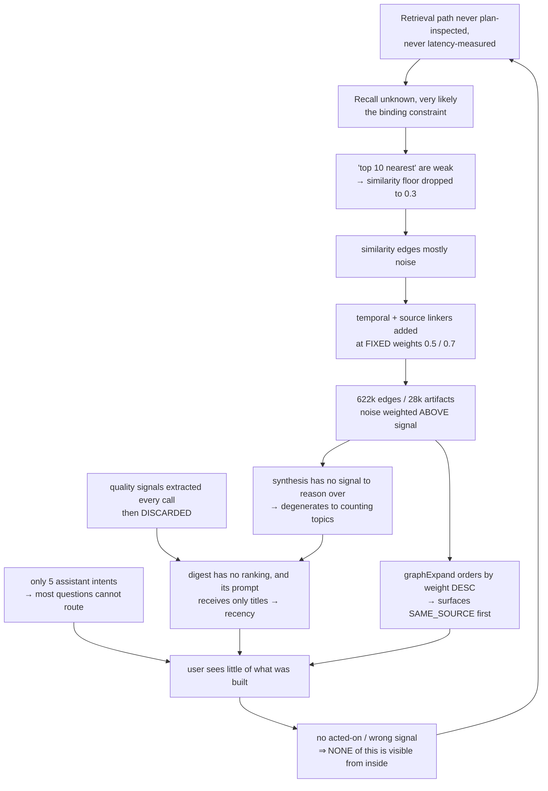

# Smackerel — Product Review & Recovery Plan

**Snapshot:** 2026-07-31 · **Type:** diagnostic review + executable plan · **Status:** advisory (no spec, state, or source mutated)

**Evidence rule.** Every claim cites a file, line, query, migration, or a competitor page fetched 2026-07-30/31. Nothing is asserted from inference alone. Limits are declared in the [Appendix](#appendix--declared-uncertainty).

---

## Executive summary

| # | Finding | Evidence |
|---|---|---|
| **1** | **What the product built, users cannot reach — on every surface.** The assistant — P2's "intelligent front door" — routes **5 intents** against **~20 built capabilities** ([D17](#32-defect-register)). And the **daily digest** — the primary recurring output, generated on a 07:00 cron — sits in **no** cross-surface navigation contract; the guaranteed core is `assistant, search, cards, notifications, settings`. **Card-reward tracking is a contractually-guaranteed journey. The daily knowledge digest is not** ([D18](#32-defect-register)). | [scenarios.yaml](../config/assistant/scenarios.yaml), [appshell_test.go:98](../internal/web/appshell_test.go#L98) |
| **2** | **The retrieval path has never had its query plan inspected or its real latency measured.** `ivfflat lists=100`, built on an *empty* table, `probes` never set (default 1); the query also `LEFT JOIN`s, so index usage is planner-dependent. **Both outcomes are defects** — see [D1](#32-defect-register). | [001_initial_schema.sql:72](../internal/db/migrations/001_initial_schema.sql#L72), [search.go:516](../internal/api/search.go#L516) |
| **3** | **The marquee differentiator does not exist.** "Cross-domain synthesis" is `fmt.Sprintf` over `GROUP BY` counts; its "CONNECTION DISCOVERED" output is a topic name plus a percentage. No reasoning step, no LLM call. The daily variant discards its result entirely. | [synthesis.go:50](../internal/intelligence/synthesis.go#L50) |
| **4** | **Search papers over weak recall with its noisiest data.** When results fall short, `graphExpand` orders by `weight DESC` — where `SAME_SOURCE` (0.7) and same-day (0.5) edges **outrank genuine similarity** (≥0.3). The user is told *"Connected via SAME_SOURCE"*: it came from the same mailbox. | [search.go:392](../internal/api/search.go#L392), [linker.go](../internal/graph/linker.go) |
| **5** | **The digest cannot select, because nothing selectable reaches it.** SQL returns `ORDER BY created_at DESC LIMIT 20`; the LLM prompt then gets **titles and types only**. Both inputs to the §11.3 relevance formula are extracted on every artifact and **discarded**. | [generator.go:344](../internal/digest/generator.go#L344), [nats_client.py:1032](../ml/app/nats_client.py#L1032) |
| **6** | **The system cannot see its own errors.** `acted_on` / `false_positive` counters have **zero** production call sites; no correction path exists. This is why findings 2–5 survived to 28,000 artifacts. | [surfacing.go:127](../internal/metrics/surfacing.go#L127) |
| **7** | **The moat is 1-of-3, and two legs are stated falsely.** Passive ingestion and digests are now table stakes. What remains — *whole-life corpus, on your hardware, no vendor* — is real, but is not what the docs defend. | [§21.4](smackerel.md#L2900) vs. fetched competitor pages |

**Verdict in one line:** the idea is right, the engine beneath it has never been measured, most of what was built is unreachable, and the product shape — a destination app — is the wrong shape to defend it with.

---

## 1. The idea — is this the right problem?

### 1.1 The stated problem, re-scored

[smackerel.md §1.1](smackerel.md#L49) lists five problems.

| Stated problem | Status in 2026 |
|---|---|
| Capture friction too high | **Dissolved.** One-click save, share sheets, extensions, email-to-inbox are universal. |
| Retrieval is broken | **Real — and the bar rose.** Users now expect ChatGPT-quality answers over their own material, not "the right link." |
| Nothing connects | **Real and underserved** — for a *whole-life* corpus. Competitors each hold one slice. |
| Knowledge doesn't evolve | **Real and uncontested.** Nobody else models topic lifecycle or decay. |
| Taxonomy demanded at capture time | **Dissolved.** Auto-organisation is table stakes. |

### 1.2 What is genuinely unsolved

> **No product holds your email + calendar + location + purchases + video + chat + property + market context in one graph, on hardware you own, with no vendor — and no cloud competitor can, because that is their business model.**

Fabric is a cloud workspace with 50+ integrations. Mem is notes + meetings. Recall is content consumption. **None touches location, purchases, or property operations.** That gap is the product.

### 1.3 Verdict

**The problem is right. The framing has decayed and the shape is wrong.**

- The framing (§1.1, §21.4) predates LLM ubiquity and defends two legs that no longer stand.
- The shape — a destination app with its own UI, chat, digest, notifications, photo manager and card tracker — competes on surface area against funded teams. That is the losing axis, and it shows: 31 PWA pages, three design systems, five broken primary journeys, and a front door that routes 5 of ~20 capabilities.

The right shape is already written down in the repo, in [spec 109](../specs/109-mcp-knowledge-server/spec.md):

> *"The operator's actual working day happens somewhere else — inside VS Code, inside a coding agent, inside a general-purpose chat client. Every one of those environments now speaks MCP, and none of them can see a single artifact Smackerel has captured."*

**A personal context server, not a destination app.** See [§6](#6-target-end-state).

---

## 2. What exists today

### 2.1 Genuine strengths — do not break these

| Strength | Evidence |
|---|---|
| **Ingestion breadth is the real asset** | 17 connectors: email, calendar, video, location, browser, bookmarks, notes, chat, weather, gov alerts, markets, property, QF packets. |
| **The connector abstraction is clean and proven** | [`Connector`](../internal/connector/connector.go) — 5 methods (`ID/Connect/Sync/Health/Close`), cursor-based, plus `Registry` and `Supervisor`. 17 implementations validate it. |
| **The surfacing controller is genuinely novel** | [`surfacing/`](../internal/intelligence/surfacing/) — one cross-channel interruption budget across 5 channels × 8 producers, with dedupe, ack-suppression and a `MetricsSink` seam. No competitor has this. |
| **Per-artifact knowledge synthesis works *and* persists** | [synthesis_subscriber.go:248-346](../internal/pipeline/synthesis_subscriber.go#L248) — LLM-driven concept/entity extraction writing `CONCEPT_REFERENCES`, `ENTITY_MENTIONED_IN`, typed relations and `CONTRADICTS` edges, **transactionally**. |
| **Topic lifecycle is real** | [`topics/lifecycle.go`](../internal/topics/lifecycle.go) computes `momentum_score` and transitions `state` on an hourly cron. Principle 3 is implemented, not just declared. |
| **The intelligence package is well-factored** | 16 focused files, 4–6 methods each; `engine.go` is 176 lines. Not a god-object. |
| **The scheduler is disciplined** | 10 intelligence jobs on explicit crons, each wrapped in `runGuarded` mutex protection. |
| **Retrieval routing is the right seam** | [`routing.Executor`](../internal/retrieval/routing/executor.go) — handler-free, injectable, with `StrategySelection{Strategy, Reason, FellBack, ContractKnown}` modelling honest degradation. |
| **Failure honesty is architected, not merely intended** | A non-OK outcome may never render as "saved as an idea"; enforced by a dedicated test plus a surfaced metric. |
| **Adding a capability is documented and cheap** | Design §3.8.2's *"Extensibility recipe — 4 steps, no new packages"*: prompt contract → manifest row → tool registration → wiring import. |
| **Two proven verification patterns already exist** | An **eval gate** ([tests/eval/assistant/](../tests/eval/assistant/harness.go): 150-row corpus, SST thresholds, *"a NON-NEGOTIABLE acceptance regression"* if lowered) and an **EXPLAIN gate** ([trace_completeness_test.go](../tests/integration/agent/trace_completeness_test.go)). **Neither has ever been pointed at retrieval.** |

### 2.2 Scenario promise vs. delivery

[§16](smackerel.md#L2383) is the product's contract with the user. Scored against code:

| Promised scenario | Reality |
|---|---|
| Ask anything in natural language | ❌ **5 intents only.** Anything else falls to a generic fallback or below the floor into capture. |
| Digest shows "only the 2 that matter" | ❌ **Last 20 ingested, newest first** — and the LLM is handed only titles, so it cannot rescue the selection. |
| Cross-domain synthesis ("three sources argue the same point, differently") | ❌ **A topic name + confidence %.** No reasoning; daily result discarded. |
| Weekly synthesis | ⚠️ **Delivers**, but is a stats report opening `"THIS WEEK: N artifacts processed"` — the anti-pattern Principle 6 names. |
| Bill reminder from a detected due date (§16.8) | ⚠️ Bills alert from a separate table; the extracted `temporal_relevance` due-date field is **never persisted or read**. |
| Pre-meeting briefs (30-min) | ✅ Implemented, scheduled `*/5 * * * *`, registered with the surfacing controller. |
| Commitment tracking · relationship cooling · subscriptions · serendipity · expertise · seasonal | ✅ All implemented and scheduled — **but none is reachable by asking.** |
| Contradiction detection | ✅ Real `CONTRADICTS` edges from the LLM synthesis path. |
| Trip dossiers | ✅ Present — **no assistant intent.** |
| Learning-path assembly | ⚠️ Present (`learning.go`) but not scheduled. |
| Content-creation fuel · energy/productivity patterns | ❌ **No implementation found.** |
| Export corpus | ✅ `/export` → NDJSON ([router.go:105](../internal/api/router.go#L105)). |
| **Delete corpus** (§18.3: per-artifact/topic/source/full wipe) | ❌ **No user-facing delete surface.** **Breaks Principle 11's unconditional-exit guarantee.** |
| Export to Notion / Obsidian (§18.3) | ❌ Not implemented. |

**Read this as:** the *proactive* half is genuinely built and running. The *retrieval, selection, synthesis and reachability* half — what makes it feel intelligent — is not.

### 2.3 Extension seams — design assessment

| Seam | Quality | Note |
|---|---|---|
| `connector.Connector` | ✅ **Strong** | Clean contract + registry + supervisor + health. The model to copy. |
| `surfacing.Controller` | ✅ **Strong** | Producers/channels/decisions separated; metrics behind an interface. |
| `routing.Strategy` | ✅ **Strong** | Injectable, handler-free, models fallback honestly. |
| Prompt contracts as YAML | ✅ **Strong** | Scenarios are data, not code; loader-validated. |
| `confirm.Machine` | ✅ **Strong** | Race-safe propose/confirm/discard + audit; reusable as a domain service. |
| **Capability exposure** | ❌ **Missing** | No single registry says "this capability exists, here is its intent, here is its nav entry, here is its MCP projection." Capabilities are reachable **four** unrelated ways — a slash command, a dedicated page, a hand-maintained nav list, or (for 5 of them) an assistant intent — with no shared source of truth. This is why ~15 capabilities are invisible, and why the daily digest is absent from the guaranteed nav core (**D18**). |
| **Edge production** | ❌ **Missing** | No `EdgeProducer` interface. Five hardcoded strategies plus **7 scattered `INSERT INTO edges` sites**. Nothing declares what an edge *means* — which is why weights are ad hoc and end up inverted ([D13](#32-defect-register)). |
| **Insight production** | ❌ **Missing** | Synthesis is a method on `Engine`, not a pluggable producer. |
| **Relevance signals** | ❌ **Missing** | `relevance_score` is mutated by ad-hoc SQL in two packages with no contract. |

**Conclusion: the architecture is better than the product.** Where seams exist they are well-designed. The four missing seams map exactly onto the four areas where quality has drifted — not a coincidence.

---

## 3. What is broken

### 3.1 Root-cause chain

**The loop at the bottom is the drift mechanism.** An unmeasured retrieval path and fifteen unreachable capabilities survived to 28,000 artifacts because nothing in the system could report that anything was wrong.

### 3.2 Defect register

| ID | Defect | Verified evidence |
|---|---|---|
| **D17** | **Capability reachability collapse.** The assistant exposes **5 user-facing intents**: `retrieval_qa`, `weather_query`, `notification_schedule`, `recipe_search`, `open_knowledge`. Two are not knowledge capabilities at all. Meanwhile expertise, people, subscriptions, learning paths, cooling, expenses, meal plans, card rewards, drive, annotations, lists, trips — **all built, all scheduled, none askable**. Reachability is split across 24 memorised slash commands, dedicated pages, and those 5 intents, with no shared registry. This is also the structural cause of "saved as an idea": with 5 intents, most natural questions fall below the confidence floor into capture. | [scenarios.yaml](../config/assistant/scenarios.yaml); 24 `"/cmd"` literals in `internal/telegram/` |
| **D18** | **The digest is outside every navigation contract.** The digest is the product's primary recurring output — `digest_cron: "0 7 * * *"`, a `/digest` page with 7 tested states including stale and read-error, plus Telegram delivery. Yet the cross-surface parity test defines the guaranteed core as exactly five journeys — `assistant, search, cards, notifications, settings` — and **digest is not among them**. `/digest` and `/topics` reach the UI only as literal `<a>` tags appended *outside* the guarded partial, so they render on server knowledge-base pages alone and are pinned by no test. A PWA user has **zero** navigational path to the digest: the entire PWA links to three server URLs (`/assistant`, `/login`, `/evidence-bundles/new`). **Card rewards is a guaranteed cross-surface journey; the daily knowledge digest is not** — a priority inversion encoded in a passing test. | [appshell_test.go:98](../internal/web/appshell_test.go#L98), [templates.go:81](../internal/web/templates.go#L81), [appnav.js:22](../web/pwa/lib/appnav.js#L22), [smackerel.yaml:61](../config/smackerel.yaml#L61) |
| **D1** | **The retrieval query plan has never been inspected and real latency never measured.** `ivfflat lists=100`, built on an empty table in migration 001, never `REINDEX`ed, never migrated to HNSW despite `pgvector/pgvector:pg16`; `probes` never set (default 1). The query `LEFT JOIN`s `artifact_annotation_summary`, so index usage is planner-dependent. **Both branches are defects:** index used ⇒ ~1 of 100 lists examined; index bypassed ⇒ full-table vector scan per search and the index is dead weight. The only latency test uses a `fakeSearcher`. | Repo-wide grep for `SET LOCAL` / `ivfflat.probes` / `hnsw.ef_search`: zero production hits. [search.go:516](../internal/api/search.go#L516) |
| **D2** | The vector index is built from `title + summary + key_ideas[:5]` — **the LLM summary, not the content**. One vector per artifact; no chunking. | [embedder.py:210](../ml/app/embedder.py#L210) |
| **D15** | **Every artifact is compressed to ~100–150 words before it becomes searchable by meaning.** The universal prompt asks for a "2-4 sentence summary" plus ≤5 key ideas, and *that is the vector index*. A 10,000-word paper and a 200-word note get **identical retrieval surface area**. | [`UNIVERSAL_PROCESSING_PROMPT`](../ml/app/processor.py#L26) |
| **D3** | Embedder hardcodes `all-MiniLM-L6-v2` (384-dim, 2021) while SST declares `nomic-embed-text`. The divergence is *acknowledged in a code comment* rather than fixed — a live constitution-C8 violation. | [embedder.py:43](../ml/app/embedder.py#L43), [main.py:500](../ml/app/main.py#L500) |
| **D4** | Five linking strategies run per artifact. `linkByTemporal` (**same calendar day**, similarity > 0.2, ≤20) emits the **same `RELATED_TO` type** as genuine similarity. `linkBySource` (≤10, **no semantic test at all**) encodes only what `WHERE source_id = ?` already gives. ≥40 outbound per artifact before entity/topic. | [linker.go:54](../internal/graph/linker.go#L54); 622k/28k ≈ 22 edges/artifact vs a §1.4 target of "3+" |
| **D13** | **Edge weights are inverted against meaning.** `linkBySource` writes a fixed **0.7**, `linkByTemporal` **0.5**, genuine similarity a variable **≥0.3**. `graphExpand` selects `WHERE weight >= 0.3 ORDER BY weight DESC`, so **the least meaningful edge type ranks first**. | [search.go:392](../internal/api/search.go#L392) + the three `createEdge` weights |
| **D5** | Both linker queries are `FROM artifacts a1, artifacts a2` cartesian joins. `linkByTemporal` wraps the indexed column (`DATE(...)`), so `idx_artifacts_created` **cannot be used**, and it computes a vector distance against every same-day row — **on every ingest**. O(n) per insert. | [linker.go](../internal/graph/linker.go) |
| **D6** | **Synthesis performs no reasoning.** `RunSynthesis` is pure SQL emitting `ThroughLine = topicName`; `doSynthesisJob` **discards the slice and logs `len()`**. Zero `INSERT INTO synthesis_insights` exists anywhere. | [synthesis.go:50](../internal/intelligence/synthesis.go#L50) |
| **D7** | The weekly deliverable is `fmt.Sprintf` over counts, opening `"THIS WEEK: %d artifacts processed…"`. Principle 6 forbids this self-reporting **by name**. | [`assembleWeeklySynthesisText`](../internal/intelligence/synthesis.go#L333) |
| **D8** | Digest selection is `ORDER BY created_at DESC LIMIT 20`. `relevance_score` is never computed from §11.3 at ingestion and is **ignored by the digest**. | [generator.go:344](../internal/digest/generator.go#L344) |
| **D14** | **The digest LLM is given nothing to select with.** Its prompt renders artifacts as `f"- {title} ({type})"` — no summary, no score, no content — then asks for a summary. The selection failure is not model quality; the information was never passed. | [nats_client.py:1032-1072](../ml/app/nats_client.py#L1032) |
| **D16** | **Three signals are extracted every LLM call and never consumed.** `source_quality` and `key_ideas`: zero ranking reads. `temporal_relevance`: fully dead — schema column, prompt field, Go struct, **no writer, no reader**. The first two are precisely §11.3's `base_quality_score` and recency inputs. **Relevance ranking is a wiring problem, not a data problem.** | consumption audit across `internal/`; [processor.py:56](../ml/app/processor.py#L56) |
| **D9** | `RecordSurfacingActedOn` / `RecordSurfacingFalsePositive` have **zero** production call sites; `MetricsSink` omits them. §17.1's `"that's wrong"` / `"fix: …"` correction path does not exist. | [surfacing.go:127](../internal/metrics/surfacing.go#L127) |
| **D10** | `artifacts.source_ref` is omitted from the ingest INSERT column list; `idx_artifacts_source` is a dead index; the dedup probe binds `SourceRef` to the `source_url` column. Changed content ⇒ a **new** artifact. | [ingest.go:51,94](../internal/pipeline/ingest.go#L94) |
| **D11** | No `sensitivity` column on `artifacts`. §18.1's Sensitive/Normal/Public and §17.3's "sensitive → local, general → cloud" routing exist only in prose. Load-bearing the moment spec 096 or 109 lands. | Full DDL + every `ALTER TABLE artifacts` read |
| **D12** | **No user-facing delete surface.** §18.3 promises per-artifact/topic/source/full-wipe deletion; Principle 11 makes unconditional exit a ratified guarantee. Export exists; delete does not. | grep of all `DELETE FROM artifacts` sites |

**Not a defect — tested and rejected.** The PWA and server navigations legitimately differ (server adds a `knowledge` deep link; the PWA adds capture/connectors/photos). That asymmetry is *deliberate, documented, and guarded* — the parity test reads the real `appnav.js` source rather than a copy, so the two cannot silently drift. The design is sound. **The defect is the contents of the guaranteed core, not the mechanism** — which is why D18 is a one-line fix to the core set plus its registry backing, not a rewrite.

---

## 4. Competitive position

### 4.1 The market, verified 2026-07-30/31

| Product | Verified today |
|---|---|
| **Fabric.so** | "A personal AI that actually knows you." 50+ integrations, Email-to-Fabric, **Recap** (AI digest to inbox), scheduled AI jobs, and **agents that ACT** — *"moved three Linear tickets"*, *"drafted the client reply in Ezra's voice, left it in Gmail drafts"*. All frontier models in one $8/$18/$54-per-month subscription. iOS · Android · Chrome · Desktop · CLI · API. |
| **Mem.ai** | Workspace + Agent. Calendar integration. **Claude Connector (MCP)** — *"your favorite LLMs can now use your second brain as context."* "Heads Up" proactive context. Agent nudges: *"Your investor update goes out Thursday… draft Dana a quick message."* |
| **Recall (recall.it)** | 500,000+ users. Knowledge graph with auto-linking, augmented browsing (local-first), spaced repetition, chat with GPT/Claude/Gemini, Markdown export. |
| **Khoj** | Now three products. **Pipali** = desktop AI co-worker *"running safely on your computer."* |

### 4.2 Moat assessment

| §21.4 claim | Verdict |
|---|---|
| Passive-first ingestion | ❌ **Gone.** Fabric and Mem both ingest email + calendar and produce digests. |
| Cross-domain synthesis | ❌ **Does not exist** (D6, D7). Cannot be claimed. |
| Self-hosted · compiled · "modest hardware" | ⚠️ **Contested and partly false.** Khoj self-hosts, Pipali is local desktop, Recall's browsing is local-first. The approved min-set is `qwen3:30b-a3b` at **31.8 GB resident** — not modest. |

**What remains, and it is enough:** *the whole-life corpus, on your hardware, with no vendor.* No cloud competitor can take that position.

### 4.3 The two moves the market made and Smackerel did not

1. **KNOW → DO.** Fabric agents move tickets and draft replies; Mem's agent drafts messages. Smackerel's [§1.5](smackerel.md#L104) still reads *"observe and draft only, never send"*; outbound action is **V2-A, not started**.
2. **App → MCP.** Mem ships a Claude Connector today. Smackerel's MCP server is [spec 109](../specs/109-mcp-knowledge-server/spec.md) — **planning only, zero code**.

---

## 5. Missing features

| Missing | Competitive weight | Cost |
|---|---|---|
| **Assistant intents for built capabilities** | **Critical** — ~15 capabilities are invisible today | **Low** — 4-step recipe per capability, no new packages |
| **Retrieval quality + query-plan measurement** | **Critical** — the loop-breaker for all drift | **Low** — both patterns exist in-repo |
| **Feedback / correction path** | **Critical** — §17.1 promise; enables everything downstream | Low |
| **Relevance ranking** (§11.3 formula) | **High** — the digest's whole promise | **Low** — inputs already extracted (D16); wiring only |
| **MCP server** (spec 109 hardened, unbuilt) | **High** — Mem ships it; the reach multiplier | Medium |
| **Corpus delete surface** | **High** — a ratified Principle 11 guarantee, unmet | **Very low** |
| **Outbound action** (V2-A, not started) | **High** — the market's headline move | High |
| Notes connectors (Notion, Obsidian, Apple Notes) | Medium — table stakes elsewhere | Medium |
| Messages (SMS, iMessage, Signal, Slack) | Medium | Medium |
| Voice capture + transcription | Medium — Fabric and Mem both ship it | Medium |
| Meeting recording / transcription | Medium | High |
| Spaced repetition | Low — Recall's differentiator, not ours | Low |
| Native mobile (decision doc V3-A absent) | Low for a context server | High |

---

## 6. Target end state

> **Smackerel is the operator's personal context — held on their own hardware, retrievable with measured accuracy, askable in plain language, and available to whatever model they already work inside.**

Not a destination app. A **context server** with a thin, honest operator console.

### The four excellences

| # | Property | Measured by |
|---|---|---|
| **1** | **Recall** — if it is in the corpus, it comes back | `retrieval_accuracy@1`, SST-gated; plan asserted by EXPLAIN; p95 measured against a real corpus |
| **2** | **Reachability** — anything the system can do, you can ask for *and* navigate to | every registered capability has an intent and a nav entry; intent-routing accuracy gated; parity core derived from the registry |
| **3** | **Judgement** — it shows the few things that matter | median digest items ≤ 5; acted-on rate ≥ 40% |
| **4** | **Honesty** — it never claims what it cannot show | zero uncited answers; `content_raw` never egresses; no result explained by a meaningless edge |

### Explicit not-goals

- Competing on surface area with Fabric, Mem, or Recall.
- Making a local 30B model answer as well as Claude. Under the target shape that problem **dissolves** — the client brings the model, Smackerel brings the context.

---

## 7. The plan

Eleven steps. Each **ships standalone value**, is **verified by one command producing a number or an exit code**, and **does not require any later step to be useful**.

**Freeze rule:** no new user-facing surface, no new connector, no new spec folder until Step 9 closes. Specs 105/106/107 stay parked — Steps 5 and 11 change what they should contain.

### Phase A — Make it true

#### Step 1 · Measure retrieval: accuracy, plan, and latency

| | |
|---|---|
| **Why first** | You cannot fix, or stop re-drifting, what you do not measure. This breaks the loop in §3.1. **Both verification patterns already exist in this repo** — this step points them at retrieval for the first time. |
| **Change** | **(a) Accuracy** — clone `tests/eval/assistant/` into `tests/eval/retrieval/`: `corpus.yaml` with **≥100 real vague queries** from the operator's own memory, each with a hand-resolved `ground_truth_artifact_id`; harness running them through `routing.Executor`; acceptance test (tag `integration`) gated on `retrieval.eval.{accuracy_at_1_min, accuracy_at_5_min, recall_at_20_min}`. **(b) Plan** — clone the EXPLAIN assertion from [trace_completeness_test.go](../tests/integration/agent/trace_completeness_test.go) and assert what the planner does with the vector query, resolving **D1**'s ambiguity. **(c) Latency** — replace the `fakeSearcher` p95 test with one measuring the real query against a seeded corpus. |
| **Discipline** | Set thresholds to the **measured baseline, however embarrassing**. The gate stops the number falling; it does not assert a number you wish were true. |
| **Value** | The first honest answer to *"does search work?"* — and the first knowledge of whether the vector index is used at all. |
| **Verify** | `./smackerel.sh test integration -run 'TestRetrievalEval\|TestRetrievalQueryPlan'` → record accuracy@1/@5, recall@20, chosen plan node, p95. |

#### Step 2 · Fix the vector index

| | |
|---|---|
| **Why now** | Highest value-to-effort ratio in the repository — ~20 lines against **D1**. |
| **Change** | Replace `ivfflat` with HNSW; add an SST-driven `SET LOCAL hnsw.ef_search` (no silent default — `smackerel-no-defaults` applies); `ANALYZE artifacts`. HNSW needs **no training pass**, so the "built on an empty table" failure mode is removed permanently, and it resolves **both** branches of D1. |
| **Migration** | `DROP INDEX IF EXISTS idx_artifacts_embedding;` then `CREATE INDEX idx_artifacts_embedding ON artifacts USING hnsw (embedding vector_cosine_ops) WITH (m = 16, ef_construction = 64);` |
| **Value** | Recall and latency improve for **every surface at once** — `/find`, web Search, the assistant, the linker. |
| **Verify** | Re-run Step 1. EXPLAIN must show HNSW; accuracy and p95 must both improve. **Record the delta before starting Step 3** — it sizes Step 4. |

#### Step 3 · Stable artifact identity

| | |
|---|---|
| **Why now** | Every day this is broken the corpus accumulates duplicates that Steps 5, 8 and 9 must reason about. A plan already exists (`docs(019): add source-ref persistence bug plan`). |
| **Change** | (a) add `source_ref` to the ingest INSERT column list; (b) repair the dedup probe to `WHERE source_id = $1 AND source_ref = $2`, activating the dead composite index; (c) **update-in-place** on ref-match with changed `content_hash` — a growing email thread becomes one evolving artifact; (d) backfill where connectors can re-derive their ref. Fixes **D10**. |
| **Value** | Duplicates stop accumulating. Topic momentum, expertise ranking and booking context stop being skewed by re-ingestion. |
| **Verify** | `SELECT source_id, COUNT(*), COUNT(DISTINCT source_ref) FROM artifacts GROUP BY source_id ORDER BY 2 DESC;` — a second connector run must produce **zero** new rows for unchanged items. |

#### Step 4 · Honest, modern, chunked embeddings

| | |
|---|---|
| **Why now** | Steps 1–2 have revealed how much headroom remains here, so it is correctly sized for the first time. |
| **Change** | (a) **Close the C8 violation** — read the model from config, fail loud if absent; delete the workaround comment at `main.py:500`. (b) Move to a current-generation model (dimension change ⇒ `vector(N)` migration + scripted background re-embed). (c) **Chunk over raw content**: `artifact_chunks(artifact_id, ordinal, text, embedding)` with its own HNSW index; score `max(chunk_score)` per artifact. This ends the **D15** regime where a 10,000-word paper and a 200-word note have equal retrieval surface area. (d) Keep the summary vector as a second signal and the lexical path as a third — a real hybrid. Fixes **D2**, **D3**, **D15**. |
| **Value** | "Vague in, precise out" becomes achievable. Long artifacts become findable by their middle. |
| **Verify** | Step 1 harness; raise SST floors again. |

#### Step 5 · Graph honesty

| | |
|---|---|
| **Why now** | With recall fixed (2 + 4) and identity fixed (3), real similarity edges are finally trustworthy — so padding can go without emptying the graph. Direct **search-quality** payoff: this is what stops `graphExpand` surfacing noise. |
| **Change** | (a) **Delete `linkBySource`** — at weight 0.7 it actively outranks real signal while encoding nothing. (b) **Retype `linkByTemporal`** — must not emit `RELATED_TO`; give it `CO_OCCURRED_SAME_DAY` or delete it, and cap far below 20. (c) **Make `graphExpand` weight-honest** — rank by semantic strength, never a constant assigned at write time. (d) **Raise the similarity floor** from the measured distribution. (e) **Introduce the missing seam** — one `EdgeProducer` interface, `Produce(ctx, artifactID) ([]Edge, error)`, each producer declaring `EdgeType`, `SemanticStrength`, and *inferential* vs *observational*. This prevents the next ad-hoc weight. (f) Replace the cartesian joins with indexed lookups. Fixes **D4**, **D5**, **D13**. |
| **Value** | `RELATED_TO` becomes a claim a user can trust, and search stops explaining results with "it came from the same mailbox." Ingestion gets measurably faster. |
| **Verify** | Choose the floor from `SELECT width_bucket(weight,0,1,20) b, COUNT(*) FROM edges WHERE edge_type='RELATED_TO' GROUP BY 1 ORDER BY 1;` then confirm with a per-type count. Expect edges/artifact in single digits. Step 1 must not regress. |

### Phase B — Make it useful

#### Step 6 · The feedback loop

| | |
|---|---|
| **Why now** | Closes the loop in §3.1. Everything after improves faster because the system can see its own errors. |
| **Change** | (a) Wire `RecordSurfacingActedOn` / `RecordSurfacingFalsePositive` to real call sites and **extend `MetricsSink` so they cannot be forgotten again**. (b) One-tap affordance on every surfaced item: `useful` / `not useful` / `wrong`. (c) Honour §17.1: `/wrong` and `fix: …` in any channel, routed to a correction record. (d) Feed back — corrections adjust `relevance_score`; `not useful` adjusts producer weight. Fixes **D9**. |
| **Value** | The operator can finally tell the system it is wrong, and the system finally knows. Unblocks v1 item **V5-A**, currently planned to alert on counters that cannot move. |
| **Verify** | `curl -s localhost:<port>/metrics \| grep -E 'surfacing_(acted_on\|false_positive)_total'` → non-zero after a day of real use. |

#### Step 7 · The digest keeps its promise

| | |
|---|---|
| **Why now** | Step 6 supplies the interaction signal §11.3 needs; Step 3 supplies trustworthy counts; Step 5 a trustworthy `connection_count`. **And the remaining inputs already exist** — per **D16**, `source_quality` and `temporal_relevance` are extracted every call and thrown away. Mostly wiring. |
| **Change** | (a) **Implement §11.3 at ingestion**, consuming the already-extracted signals rather than adding extraction; persist `temporal_relevance` (currently written nowhere). (b) **Rewrite digest selection** — relevance-ranked, targeting *the few that matter*. (c) **Pass score and summary into the digest prompt**, not just titles — without this the LLM still has nothing to select on (**D14**). (d) **Delete "Knowledge Health"** from the user digest; it is an operator metric. Fixes **D8**, **D14**, **D16**. |
| **Value** | The daily ritual finally delivers §16.1. **The most visible product change on the ladder.** |
| **Verify** | Seven consecutive digests; record items-shown vs items-acted-on via Step 6. Target: median shown ≤ 5, acted-on ≥ 40%. |

#### Step 8 · Build synthesis, then persist it

| | |
|---|---|
| **Why now** | It is the marquee differentiator and it does not exist. Only after Step 5 is the graph trustworthy enough to reason over. |
| **Change** | (a) **Build the missing reasoning step** — take a cross-source cluster and produce the §16.4 artefact (*what the sources jointly argue, where they agree, where they differ*) via an LLM scenario with **citations attached before persistence**. [synthesis_subscriber.go](../internal/pipeline/synthesis_subscriber.go) is the working template: prompt contract + transactional persist. (b) **Persist** to `synthesis_insights` / `weekly_synthesis`, idempotent per source/window. (c) **Report health truthfully** — never-run / running / current / stale / partial / failed. (d) **Rewrite the weekly text** to open with an insight, not a processed-item count. (e) Add the authorized read surface. Fixes **D6**, **D7**; closes [BUG-004-004](../specs/004-phase3-intelligence/bugs/BUG-004-004-synthesis-persistence-and-health-truth/bug.md). |
| **Value** | §16.4 becomes real. The weekly synthesis becomes the reason to keep the system running. |
| **Verify** | Non-zero rows in both tables over 7/30 days; every insight carries ≥1 source link; **no output line contains a processed-item count**. |

#### Step 9 · Make what exists reachable

| | |
|---|---|
| **Why now** | Fifteen working capabilities are unaskable (**D17**) and the flagship daily output is unnavigable (**D18**). Three reachability surfaces — assistant intents, navigation, MCP — each carry their own hand-maintained list, which is why a capability can ship and still be invisible. This is the highest usability return on the ladder, and the **foundation Step 10 consumes** — one registry, three projections. |
| **Change** | (a) **Introduce the missing capability seam.** One registry entry per capability declares: `id`, natural-language intent, the domain service that backs it, `requires_provenance`, side-effect class, **its navigation entry**, and its MCP projection. **This is the single source of truth for reachability** — assistant intents, the cross-surface nav, slash commands, and (in Step 10) MCP all derive from it, instead of the four unrelated inventories that exist today. **Promote `digest` into the guaranteed cross-surface core** and let the parity test derive that core from the registry rather than a hand-written list. (b) **Add intents for what is already built**, using the documented 4-step recipe (prompt contract → manifest row → tool registration → wiring import), prioritised by §16 promise: subscriptions, people/cooling, trips, expertise, expenses, lists, learning paths. (c) **Extend the Step-1 eval corpus** with the new intents so routing accuracy is gated as it grows. (d) Retire slash commands that become redundant, keeping them as aliases. |
| **Value** | *"What am I spending on subscriptions?"*, *"who haven't I talked to lately?"*, *"what does my Lisbon trip look like?"* start working — and a user who does not use Telegram can finally **find the digest the system writes for them every morning**. **Nothing new is built; what exists becomes usable.** It also removes the structural cause of "saved as an idea": most questions fall below the floor because no intent exists to catch them. |
| **Verify** | Extended eval corpus: routing accuracy ≥ the existing `routing_accuracy_min: 0.85` **with the new intents included**; a capability-coverage assertion that every registry entry has an intent; and the existing cross-surface parity test now deriving its core from the registry, so `digest` cannot fall out again. |

### Phase C — Make it reach

#### Step 10 · MCP knowledge server

| | |
|---|---|
| **Why now, not earlier** | Steps 1–8 make the corpus worth exposing; Step 9 supplies the registry MCP projects from. Exposing an unmeasured-recall corpus, or hand-maintaining a second capability list, would have propagated the defect outward. |
| **Change** | Deliver [spec 109](../specs/109-mcp-knowledge-server/spec.md) as specified — its decisions of record are sound: `local-inference` default with `remote-inference` off unless an explicit, per-client, **audited** grant exists (D1); **`content_raw` never egresses** (D2) — a *security* control, since the corpus contains attacker-controlled prose by design; credentials **audience-bound to `/mcp`**, legacy bearers rejected (D3); tools backed by **real domain services**, never a passthrough of `agent.All()` which would advertise 19 non-capabilities; **pull-only** (D4). Project the toolset from the **Step 9 registry**, so assistant intents and MCP tools cannot drift apart. Build on `routing.Executor` — its `StrategySelection` already carries the six provenance fields §9 requires. |
| **Value** | **The reach multiplier.** The corpus becomes available inside VS Code, Claude and any conformant client — and the local-model quality ceiling stops mattering, because the client brings the model and Smackerel brings the context. |
| **Verify** | The spec's own success signal: cold client + fresh audience-bound credential → `initialize` succeeds, `tools/list` deterministically ordered and authorization-filtered, `memory.search` returns all six provenance fields, and a **byte-level scan shows zero occurrences of `content_raw`**. |

#### Step 11 · Consolidation and exit guarantee

| | |
|---|---|
| **Why last** | Steps 9–10 change what the UI is *for*; consolidating earlier would be guesswork. |
| **Change** | (a) **Ship the delete surface** — per-artifact, per-topic, per-source, full wipe (**D12**; very low cost, high trust value). (b) **Fix the five journey bugs**, now tractable because the shell is shrinking: [BUG-070-001](../specs/070-web-username-password-login/bugs/BUG-070-001-production-credential-session-paseto-split/bug.md), [BUG-002-006](../specs/002-phase1-foundation/bugs/BUG-002-006-search-htmx-sri-blocks-submit/bug.md), [BUG-002-007](../specs/002-phase1-foundation/bugs/BUG-002-007-digest-date-scan-false-empty/bug.md), [BUG-080-001](../specs/080-knowledge-graph-public-api/bugs/BUG-080-001-graph-api-fail-soft-runtime-disable/bug.md). (c) **Reduce the shell** to Assistant · Search · Knowledge · Settings/Status; one design system. (d) **Park or spin out non-thesis surfaces** — Cards is an absorbed standalone app with 14 routes and its own design system; of 31 PWA pages, **21 are administration, not knowledge**. Many become redundant once Step 9 makes them askable. (e) **Re-scope spec 105** — after Step 5 the graph is legible, so the explorer becomes viable. (f) **Correct [§21](smackerel.md#L2839)** — the Fabric row is false on four counts; "modest hardware" does not survive a 31.8 GB min-set. |
| **Value** | One coherent product. [Spec 106](../specs/106-coherent-product-experience/spec.md)'s diagnosis — *"several partially connected products"* — is retired by **removal**, cheaper and more durable than unification. |
| **Verify** | The product-journey synthetic from [BUG-102-001](../specs/102-target-deploy-hardening/bugs/BUG-102-001-product-journey-acceptance-gap/bug.md) runs green and deploy acceptance consumes its result. |

### Sequencing

```mermaid
graph LR
    S1["1 · Measure<br/><b>TRUTH</b>"] --> S2["2 · HNSW<br/><b>RECALL</b>"]
    S2 --> S3["3 · source_ref<br/><b>IDENTITY</b>"]
    S3 --> S4["4 · Chunked embeddings<br/><b>DEPTH</b>"]
    S4 --> S5["5 · Graph honesty<br/><b>MEANING</b>"]
    S5 --> S6["6 · Feedback<br/><b>SIGHT</b>"]
    S6 --> S7["7 · Relevance digest<br/><b>JUDGEMENT</b>"]
    S7 --> S8["8 · Real synthesis<br/><b>DIFFERENTIATOR</b>"]
    S8 --> S9["9 · Capability registry<br/><b>REACHABILITY</b>"]
    S9 --> S10["10 · MCP<br/><b>REACH</b>"]
    S10 --> S11["11 · Consolidation<br/><b>COHERENCE</b>"]
    S1 -.->|gates every step| S11
```

### Fundamental vs. tactical

| Fundamental — changes what the product *is* | Tactical — cheap, high leverage, start now |
|---|---|
| **F1** Reposition to a personal context server (Steps 9–10 primary; PWA demoted to console) | **T1** HNSW migration (Step 2) — ~20 lines against the root cause |
| **F2** Redefine "done" as measured quality, not spec certification (Step 1 + §8 A1) | **T2** `source_ref` persistence (Step 3) — plan already written |
| **F3** One capability registry as the single source of reachability (Step 9) | **T3** Wire two metric call sites + one feedback button (Step 6) |
| **F4** Build the synthesis that was only ever claimed (Step 8) | **T4** Ship the delete surface (Step 11a) — hours of work, closes a ratified guarantee |
| **F5** Right-size governance: one operator, no revenue, **569k lines of spec prose vs 190k of code** | **T5** Correct the stale §21 competitive table |

---

## 8. Anti-drift contract

Drift here has one mechanism: **a spec can be certified `done` with no evidence the capability works for a user.** Five mechanical defences.

| ID | Defence | Detail |
|---|---|---|
| **A1** | **One number blocks the build** | `retrieval_accuracy_at_1_min` in SST, enforced by an integration test, using the wording already proven on `routing_accuracy_min`: *"Lowering this value is a NON-NEGOTIABLE acceptance regression."* This is the defence that would have caught **D1** in April. |
| **A2** | **Hot query paths assert their plan** | Extend the EXPLAIN pattern from [trace_completeness_test.go](../tests/integration/agent/trace_completeness_test.go) to every hot path. An index the planner silently ignores is worse than no index, because it hides the cost. |
| **A3** | **A capability is not done until it is askable *and* reachable** | Registry coverage is asserted in CI: every registered capability has an intent, an eval-corpus case, and a navigation entry — and the cross-surface parity core is **derived from the registry, not hand-listed**. This is what prevents the next fifteen invisible features, and what stops the flagship output falling out of the nav (**D18**). |
| **A4** | **Status derives from runtime, never from spec state** | Adopt the six-dimension ledger already specified in [BUG-004](../specs/032-documentation-freshness/bugs/BUG-004-production-readiness-claims-runtime-drift/bug.md) — implemented / configured / activated / live-verified / degraded / disabled, with evidence freshness — and make it the **only** source docs and release packets may cite. |
| **A5** | **Every promise gets a probe** | Any "the system does X" statement in [smackerel.md](smackerel.md) must name the test or metric proving X. Unprobed statements move under `## Roadmap`. Apply once, now, to §16 and §21. |

---

## 9. Final view

**The morning after Step 11.**

The operator opens Telegram. One message, four lines:

> Two things need you today: the Nakamura contract reply you promised Thursday (3 days open), and the Lisbon flight change — the hotel booking still assumes the old dates.
>
> Also: the three things you saved about pricing this week argue the same point from different angles — the article from outcomes, the talk from process, your own note from politics. Worth five minutes. →

Nothing about processing. No backlog. Nothing about the system. Two actions and one genuine insight — because relevance ranking chose them (Step 7) and synthesis actually reasoned, with citations attached before it was written down (Step 8). They tap **useful**; the system records it (Step 6).

They type back, in plain language: *"what am I spending on subscriptions?"* — and get an answer, because that capability finally has an intent (Step 9). Last month they would have had to remember `/sub`, or that it lived on a page they never visited.

They open VS Code. Their coding agent has Smackerel attached over MCP (Step 10). They ask *"what did we decide about retry semantics on the ingest path?"* and get the answer from a Slack thread in February, an email in April and their own note in June — each cited, each with a provenance token — **without the raw text of any of them leaving the machine**. The model reasoning is Claude. The context is theirs.

At lunch they half-remember *"that video about pricing by value metrics."* Search returns it first — because the index sees the whole corpus and the plan is asserted, not assumed (Steps 1–2), the transcript's middle is embedded (Step 4), and it is one artifact rather than six duplicates (Step 3). Nothing is explained away as *"connected via same source."*

They open Knowledge. Eight edges from the pricing note, each labelled with why it exists, each survivable (Step 5). Legible. It fits on a screen. It tells them something.

Nothing else competes for attention (Step 11). And if they ever want to leave, they can export everything and delete everything, today, without asking.

**Most of all: they can answer, with a number, the question that had no answer for this product's entire life — *does it find what I'm looking for?***

### What this is worth

| Before | After |
|---|---|
| Retrieval accuracy, query plan and real latency **all unknown** | Four committed, monitored, non-regressible facts |
| Vector index may be scanning 1% — or being ignored entirely | HNSW, plan asserted by test, latency measured |
| Any artifact searchable only via ~100–150 summary words | Chunk-level recall over full content |
| 622k edges, ~22/artifact, noise weighted above signal | Single-digit edges/artifact, ranked by real semantic strength |
| Search fallback explains results with "same mailbox" | Ranks by meaning, or does not fire |
| Digest = last 20 things, newest first | The few that matter, relevance-ranked |
| Quality signals extracted every call, then discarded | Feeding the ranking they were extracted for |
| "Synthesis" = topic names + counts, discarded | Durable, cited, cross-domain reasoning |
| **5 askable intents against ~20 built capabilities** | **One registry; everything built is askable and MCP-projectable** |
| System cannot see its own errors | Acted-on and wrong signals feeding relevance |
| Corpus reachable from 4 Smackerel surfaces | Every MCP client the operator already uses |
| Exit guarantee half-implemented | Export **and** delete, unconditional |
| Moat: 1 of 3 legs, 2 stated falsely | 1 leg, stated truthfully, genuinely unassailable |

---

## Appendix — declared uncertainty

- **The system was never run.** Runtime figures (28k artifacts, 622k edges, five broken journeys) come from repo artifacts. All five journey bugs are self-labelled *"Claim Source: interpreted. No database query, page load, or source execution was performed"* — operator reports, not reproduced.
- **D1 is deliberately stated as an ambiguity, not a measurement.** Whether the planner uses the ivfflat index through the `LEFT JOIN` cannot be determined by reading SQL. Both branches are defects, which is why the fix is the same either way — but **Step 1(b) settles which is live**, and no number here should be quoted as if measured.
- **Edge-weight distribution was not measured.** Run the `width_bucket` query in Step 5 before choosing a floor.
- **D17 counts declared intents, not observed routing.** Five `user_facing: true` scenarios are declared in the manifest; `open_knowledge` is a generic fallback that may answer some unrouted questions via web + corpus. The claim is that **no dedicated intent exists** for the ~15 named capabilities, not that every such question fails outright.
- **D18 is a reachability claim, not a usage claim.** It is established from the three rendered navigations, the parity test's core set, and every `href="/digest"` in the tree. Users may still reach the digest by URL, bookmark, or Telegram push — the claim is that **no navigational path exists from the PWA**, not that the digest is never seen.
- **The signal-consumption audit (D16) is grep-based.** `temporal_relevance` was additionally hand-verified across Go, SQL and Python; `source_quality` and `key_ideas` were counted, not exhaustively hand-traced.
- **Competitor capability depth is from vendor marketing** fetched 2026-07-30/31. The direction is independently corroborated across Fabric, Mem and Recall; specific depth is not verified.
- **Roughly 15% of the 569k-line spec corpus was read**, prioritising specs 100–109, the blocked bugs, both release packets, and the code paths behind load-bearing claims.
- **No effort estimates are given** — they would be fabricated. Steps are ordered by dependency and value and are each independently shippable. Sequence is the commitment; calendar is not.
