<p align="center">
  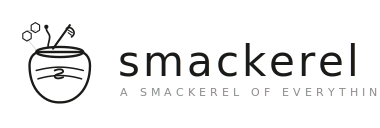
</p>

# Smackerel — Design Document v2

> *"What I like best is just doing nothing... and having a little smackerel of something." — Winnie-the-Pooh*

> **Author:** Philip K.
> **Date:** April 5, 2026
> **Status:** Draft
> **Version:** 2.0
> **Internal Codename:** Smackerel
> **Runtime Platform:** Go + Docker Compose (self-hosted)

---

## Table of Contents

1. [Vision & Problem Statement](#1-vision--problem-statement)
2. [Design Principles](#2-design-principles)
3. [System Architecture](#3-system-architecture)
4. [OpenClaw Integration Strategy](#4-openclaw-integration-strategy)
5. [Ingestion Layer — Passive Sources](#5-ingestion-layer--passive-sources)
6. [Ingestion Layer — Active Capture](#6-ingestion-layer--active-capture)
7. [Processing Pipeline](#7-processing-pipeline)
8. [Knowledge Graph & Storage](#8-knowledge-graph--storage)
9. [Retrieval & Semantic Search](#9-retrieval--semantic-search)
10. [Synthesis Engine](#10-synthesis-engine)
11. [Knowledge Lifecycle — Promotion & Decay](#11-knowledge-lifecycle--promotion--decay)
12. [Surfacing & Proactive Intelligence](#12-surfacing--proactive-intelligence)
13. [System Personality & Interaction Model](#13-system-personality--interaction-model)
14. [Data Models & Schemas](#14-data-models--schemas)
15. [Prompt Contracts](#15-prompt-contracts)
16. [Scenarios & Use Cases](#16-scenarios--use-cases)
17. [Trust & Security](#17-trust--security)
18. [Privacy Architecture](#18-privacy-architecture)
19. [Phased Implementation Plan](#19-phased-implementation-plan)
20. [Operational Runbook](#20-operational-runbook)
21. [Competitive Landscape](#21-competitive-landscape)
22. [Connector Ecosystem & Reuse](#22-connector-ecosystem--reuse)
23. [Technology Stack Decision](#23-technology-stack-decision)
24. [Appendix](#24-appendix)

---

## 1. Vision & Problem Statement

### 1.1 The Problem

Every day, a person encounters hundreds of potentially valuable pieces of information — articles, videos, emails, conversations, places, products, ideas. **99% of it is lost forever.** Not because it wasn't interesting, but because:

1. **Capture friction is too high.** Saving something requires deciding *where* to put it, *how* to tag it, and *what format* to use — at the exact moment when you're busy doing something else.
2. **Retrieval is broken.** Even when you do save something, finding it later requires remembering exactly where you put it, what you called it, or when you saw it. Human memory doesn't work that way — we remember vague impressions, not file paths.
3. **Nothing connects.** Bookmarks rot in folders. Notes sit in silos. The article you read in January and the video you watched in March say the same thing, but you'll never realize it because they live in different systems.
4. **Knowledge doesn't evolve.** What you're interested in changes. But your saved content is static. There's no mechanism to surface what's relevant *now* vs. what was relevant six months ago.
5. **Existing tools demand taxonomy at capture time.** Notion, Obsidian, Evernote — they all fail for ~95% of users because they require *organizing work* at the *highest cognitive load moment*.

### 1.2 The Vision

Build a **passive intelligence layer across your entire digital life** that:

- **Observes** everything — email, videos, maps, calendar, browsing, notes, purchases — with minimal user intervention
- **Captures** anything the user explicitly flags via zero-friction input from any device or channel
- **Processes** every input — summarizes, extracts entities, identifies key ideas, detects action items, pulls transcripts
- **Connects** everything — cross-links across domains, detects themes, builds a living knowledge graph
- **Searches** by meaning, not keywords — vague queries like "that pricing video" or "what did Sarah recommend" return the right result
- **Synthesizes** across captured knowledge — finds patterns, proposes ideas, identifies blind spots
- **Evolves** — promotes hot topics, archives cold ones, tracks your expertise growth
- **Surfaces** the right information at the right time — pre-meeting briefs, trip prep, bill reminders, pattern alerts
- **Asks** only when it cannot figure something out on its own — and never guilt-trips
- **Runs locally** on your devices — you own your data, always

### 1.3 The Core Model

```
OLD MODEL:   User → captures → System files it → User retrieves
NEW MODEL:   System → observes everything → processes → connects → synthesizes
                                                                    ↕
                                                              User taps in when needed
```

The user's primary job is **to live their life.** The system watches, absorbs, processes, and connects. The user interacts by:
- Occasionally flagging something explicitly ("save this")
- Asking vague questions ("what was that thing about...")
- Reading the daily smackerel (brief digest)
- Responding to rare system prompts ("is this still relevant?")

### 1.4 Success Metrics

| Metric | Target |
|--------|--------|
| Active capture friction | < 5 seconds per item (share sheet / paste / voice) |
| Passive ingestion coverage | > 80% of digital touchpoints monitored |
| Vague query retrieval accuracy | > 75% correct on first result |
| Processing depth | Every artifact has summary + tags + connections within 5 min of ingestion |
| Daily digest read time | < 2 minutes |
| System-initiated prompts | < 3 per week (non-urgent) |
| Knowledge graph connections | Average artifact linked to 3+ related items after 30 days |
| User trust (continued use after 30 days) | > 80% of days with passive ingestion running |
| Time to find any saved artifact | < 30 seconds via natural language query |

### 1.5 Non-Goals (v1)

- Replace deep project management tools (Jira, Asana, Linear)
- Full email automation (observe and draft only, never send)
- Real-time collaboration / multi-user
- Social media posting or management
- Financial advice or automated transactions
- Medical or health diagnosis

### 1.6 What This Is NOT

Smackerel is **not** a to-do app, not a note-taking app, not a bookmarking tool, and not a personal CRM. It is a **knowledge engine** — it observes your digital life, processes everything into refined knowledge, connects it all into a graph, and feeds you smackerels of exactly what you need, when you need it.

---

## 2. Design Principles

| # | Principle | Implication |
|---|-----------|-------------|
| 1 | **Observe first, ask second** | System exhausts its own inference before asking the user anything. Default mode is passive. |
| 2 | **Processed, not raw** | Never store raw dumps. Every artifact gets a summary, key entities, tags, and connections. Raw is preserved but processed is primary. |
| 3 | **Vague in, precise out** | Search and retrieval must work with imprecise, natural-language queries. Users remember impressions, not metadata. |
| 4 | **Knowledge breathes** | Topics automatically promote (rising engagement) and decay (declining engagement). The knowledge surface is always live, not static. |
| 5 | **Source-qualified processing** | Use metadata from source systems (Gmail labels, YouTube playlists, watch history, calendar attendees) to improve classification and priority. |
| 6 | **One graph, many views** | All artifacts live in one knowledge graph. Views (by topic, by person, by time, by place) are projections, not separate stores. |
| 7 | **Invisible by default** | No notifications unless actionable. No "I processed 47 items today!" noise. The system is felt, not heard. |
| 8 | **Small, frequent, actionable** | Digests fit a phone screen. Insights are one sentence. Actions are concrete. Never a 2,000-word analysis. |
| 9 | **Own your data** | Everything runs locally on your devices via Docker Compose. No cloud dependency for core functionality. Your knowledge graph is yours. |
| 10 | **Platform, not product** | Modular architecture with swappable components. Any LLM backend (Ollama, Claude, GPT), any channel (Telegram, Discord, web). Connectors are pluggable. |
| 11 | **Trust through transparency** | Every filing decision is logged. Every connection is explainable. Every synthesis cites sources. |
| 12 | **Design for restart, not perfection** | Miss a week? The system kept ingesting passively. Just ask "what did I miss?" No backlog guilt. |
| 13 | **Compound value** | The system gets more valuable every day. Day 1 is useful. Day 365 is indispensable. |

---

## 3. System Architecture

### 3.1 High-Level Architecture

```mermaid
graph TB
    subgraph "Passive Ingestion Layer (✅ Committed)"
        IMAP[Email - go-imap]
        YOUTUBE[YouTube Data API]
        CALDAV[CalDAV - go-webdav]
        GMAPS[Google Maps Timeline]
        BROWSER[Browser History]
        PODCASTS[Podcast RSS - gofeed]
        KEEP[Google Keep]
        BOOKMARKS[Bookmarks]
        WEATHER[Weather API]
        ALERTS_CONN[Gov Alerts]
        MARKETS[Financial Markets]
        TWITTER[Twitter / X]
        DISCORD_CONN[Discord - discordgo]
        HOSPITABLE[Hospitable]
        GUESTHOST[GuestHost]
    end

    subgraph "Passive Ingestion Layer (🔜 Planned)"
        GMAIL_SDK[Gmail SDK - google-api-go]
        OUTLOOK[Outlook/Teams - msgraph-sdk-go]
        NOTES[Notion - notionapi / Obsidian - filesystem]
    end

    subgraph "Active Capture Layer"
        TG_CAP[Telegram Bot - telegram-bot-api]
        DISC_CAP[Discord Bot - discordgo]
        FWD[Email Forward - go-imap]
        WEB_CAP[Smackerel Web UI]
        SHARE[Mobile Share Sheet 🔜]
        BEXT[Browser Extension 🔜]
        SLACK_CAP[Slack Bot - slack-go 🔜]
        VOICE[Voice Input 🔜]
    end

    subgraph "smackerel-core — Go"
        API[HTTP API - Chi]
        CONNECTORS[Connector Plugins]
        SCHEDULER[Cron Scheduler]
        EXTRACT[Content Extraction - go-readability]
        KGRAPH[Knowledge Graph Engine]
        LIFECYCLE[Topic Lifecycle + Momentum]
        DIGEST_GEN[Digest Assembly]
        SYNTH[Synthesis Orchestration]
        NATS_PUB[NATS Publisher]
    end

    subgraph "smackerel-ml — Python Sidecar"
        LLM[LLM Gateway - litellm]
        EMBED[Embedding - sentence-transformers]
        YT_TRANS[YouTube Transcripts]
        TRAF[Article Fallback - trafilatura]
        NATS_SUB[NATS Subscriber]
    end

    subgraph "Data Layer"
        PG[(PostgreSQL + pgvector)]
        NATS_BUS[NATS JetStream]
        OLLAMA[Ollama - Local LLM]
    end

    subgraph "Surfacing Layer"
        DIGEST[Daily Smackerel]
        WEEKLY[Weekly Synthesis]
        ALERTS[Contextual Alerts]
        SEARCH[Semantic Search]
        WEB_UI[Web UI]
    end

    subgraph "User Channels"
        TG[Telegram]
        SLACK[Slack]
        DISC[Discord]
        WEB[WebChat]
        VOICE_OUT[Voice / Talk Mode]
    end

    IMAP --> CONNECTORS
    YOUTUBE --> CONNECTORS
    CALDAV --> CONNECTORS
    GMAPS --> CONNECTORS
    BROWSER --> CONNECTORS
    PODCASTS --> CONNECTORS
    KEEP --> CONNECTORS
    BOOKMARKS --> CONNECTORS
    WEATHER --> CONNECTORS
    ALERTS_CONN --> CONNECTORS
    MARKETS --> CONNECTORS
    TWITTER --> CONNECTORS
    DISCORD_CONN --> CONNECTORS
    HOSPITABLE --> CONNECTORS
    GUESTHOST --> CONNECTORS

    SHARE --> API
    BEXT --> API
    TG_CAP --> API
    SLACK_CAP --> API
    DISC_CAP --> API
    FWD --> CONNECTORS
    VOICE --> API
    WEB_CAP --> API

    SCHEDULER --> CONNECTORS
    CONNECTORS --> EXTRACT
    EXTRACT --> NATS_PUB
    NATS_PUB --> NATS_BUS
    NATS_BUS --> NATS_SUB
    NATS_SUB --> LLM
    NATS_SUB --> EMBED
    NATS_SUB --> YT_TRANS
    NATS_SUB --> TRAF
    LLM --> OLLAMA

    NATS_SUB --> NATS_BUS
    NATS_BUS --> KGRAPH
    KGRAPH --> PG
    LIFECYCLE --> PG
    SYNTH --> PG

    KGRAPH --> DIGEST_GEN
    DIGEST_GEN --> DIGEST
    DIGEST_GEN --> WEEKLY
    SYNTH --> WEEKLY
    LIFECYCLE --> ALERTS
    API --> SEARCH

    DIGEST --> TG
    DIGEST --> SLACK
    WEEKLY --> TG
    ALERTS --> TG
    SEARCH --> WEB
    SEARCH --> WEB_UI
```

### 3.2 Layer Separation

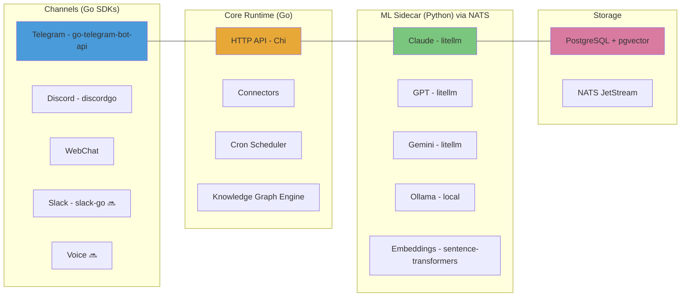

### 3.3 Data Flow — Passive Ingestion

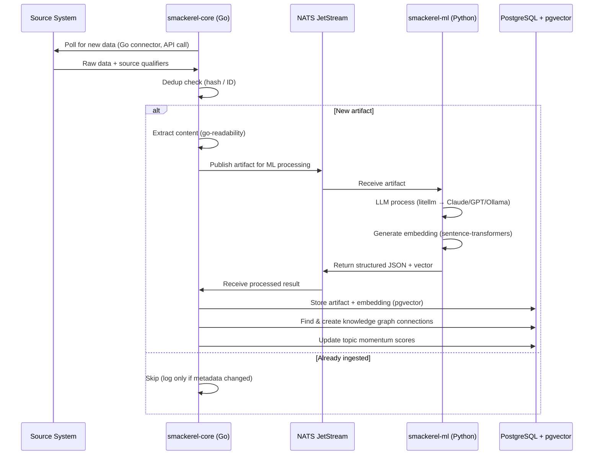

### 3.4 Data Flow — Active Capture

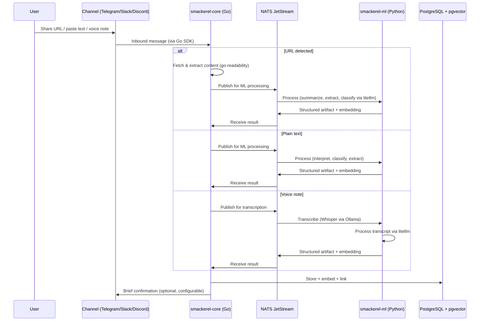

### 3.5 Data Flow — Semantic Search

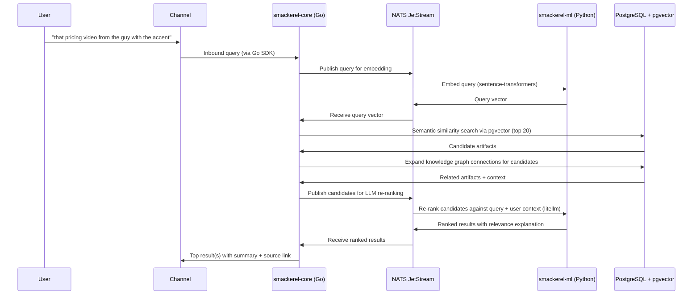

---

## 4. OpenClaw Integration Strategy

> **⚠️ SUPERSEDED:** This section describes the original design intent to use OpenClaw as the runtime platform. The actual implementation uses a **standalone Go monolith + Python ML sidecar + Docker Compose** architecture, as described in §3 and §23. This section is retained as historical context for the design evolution. All subsections below reflect the original OpenClaw design, not the current implementation.

### 4.1 Why OpenClaw

OpenClaw is chosen as the runtime platform because it provides, out of the box, every infrastructure layer Smackerel needs:

| Smackerel Need | OpenClaw Feature | Benefit |
|---|---|---|
| Multi-channel user interaction | 20+ channel adapters (WhatsApp, Telegram, Slack, etc.) | User talks to Smackerel wherever they already are |
| Scheduled ingestion | Cron jobs | Periodic polling of Gmail, YouTube, Calendar, Maps |
| Real-time triggers | Webhooks + Gmail Pub/Sub | Instant processing of new emails, events |
| Content extraction | Browser control (CDP Chrome) | Fetch and extract article/page content |
| LLM integration | Multi-model support (Claude, GPT, Gemini, Ollama) | Swappable intelligence with failover |
| Device capabilities | iOS/Android/macOS nodes | Location, camera (OCR), notifications, calendar |
| Voice interaction | Voice Wake + Talk Mode | "Hey Smackerel, what did Sarah recommend?" |
| Visual exploration | Canvas + A2UI | Knowledge graph visualization, trip dossiers |
| Persistent memory | Workspace files (SOUL.md, AGENTS.md) | System personality, user preferences, memory |
| Extensibility | Skills platform + ClawHub | Modular processing pipelines, community skills |
| Multi-agent coordination | Sessions + agent-to-agent | Specialized agents (ingestion, synthesis, search) |
| Security | DM pairing, allowlists, sandbox | Only authorized users can interact |
| Local-first | Runs on your devices | Own your data, no cloud dependency |

### 4.2 OpenClaw Workspace Structure

```
~/.openclaw/workspace/
├── AGENTS.md                    # Smackerel agent behavior definition
├── SOUL.md                      # Personality, tone, interaction style
├── TOOLS.md                     # Available tools and when to use them
├── skills/
│   ├── smackerel-ingest/        # Passive ingestion skill
│   │   ├── SKILL.md
│   │   └── ingest.py
│   ├── smackerel-capture/       # Active capture skill
│   │   ├── SKILL.md
│   │   └── capture.py
│   ├── smackerel-process/       # Processing & enrichment skill
│   │   ├── SKILL.md
│   │   └── process.py
│   ├── smackerel-search/        # Semantic search skill
│   │   ├── SKILL.md
│   │   └── search.py
│   ├── smackerel-synthesize/    # Cross-artifact synthesis skill
│   │   ├── SKILL.md
│   │   └── synthesize.py
│   ├── smackerel-digest/        # Daily/weekly digest generation
│   │   ├── SKILL.md
│   │   └── digest.py
│   ├── smackerel-lifecycle/     # Promotion/decay/archival
│   │   ├── SKILL.md
│   │   └── lifecycle.py
│   └── smackerel-connectors/    # Source system connectors
│       ├── SKILL.md
│       ├── gmail.py
│       ├── youtube.py
│       ├── calendar.py
│       ├── maps.py
│       ├── browser_history.py
│       └── photos.py
├── data/
│   ├── smackerel.db             # SQLite — structured artifacts
│   ├── smackerel.lance/         # LanceDB — vector embeddings
│   ├── topics.json              # Topic registry with scores
│   ├── people.json              # People registry
│   └── sources.json             # Source configuration & sync state
├── memory/
│   ├── user-profile.md          # Learned user preferences & patterns
│   ├── knowledge-map.md         # High-level topic map (auto-generated)
│   └── daily-log/
│       └── YYYY-MM-DD.md        # Daily activity summaries
└── config/
    └── smackerel.json           # Smackerel-specific configuration
```

### 4.3 OpenClaw Configuration (openclaw.json additions)

```jsonc
{
  "agent": {
    "model": "anthropic/claude-opus-4-6",
    "workspace": "~/.openclaw/workspace"
  },
  "cron": {
    // Passive ingestion schedules
    "smackerel-gmail": {
      "schedule": "*/15 * * * *",           // Every 15 minutes
      "skill": "smackerel-ingest",
      "args": { "source": "gmail" }
    },
    "smackerel-youtube": {
      "schedule": "0 */4 * * *",            // Every 4 hours
      "skill": "smackerel-ingest",
      "args": { "source": "youtube" }
    },
    "smackerel-calendar": {
      "schedule": "0 */2 * * *",            // Every 2 hours
      "skill": "smackerel-ingest",
      "args": { "source": "calendar" }
    },
    "smackerel-maps": {
      "schedule": "0 2 * * *",              // Daily at 2 AM
      "skill": "smackerel-ingest",
      "args": { "source": "maps" }
    },
    "smackerel-daily-digest": {
      "schedule": "0 7 * * *",              // Daily at 7 AM
      "skill": "smackerel-digest",
      "args": { "type": "daily" }
    },
    "smackerel-weekly-synthesis": {
      "schedule": "0 16 * * 0",             // Sunday 4 PM
      "skill": "smackerel-digest",
      "args": { "type": "weekly" }
    },
    "smackerel-lifecycle": {
      "schedule": "0 3 * * *",              // Daily at 3 AM
      "skill": "smackerel-lifecycle"
    }
  },
  "webhooks": {
    "gmail-pubsub": {
      "path": "/smackerel/gmail",
      "skill": "smackerel-ingest",
      "args": { "source": "gmail", "mode": "push" }
    },
    "browser-extension": {
      "path": "/smackerel/capture",
      "skill": "smackerel-capture"
    }
  }
}
```

### 4.4 Multi-Agent Architecture

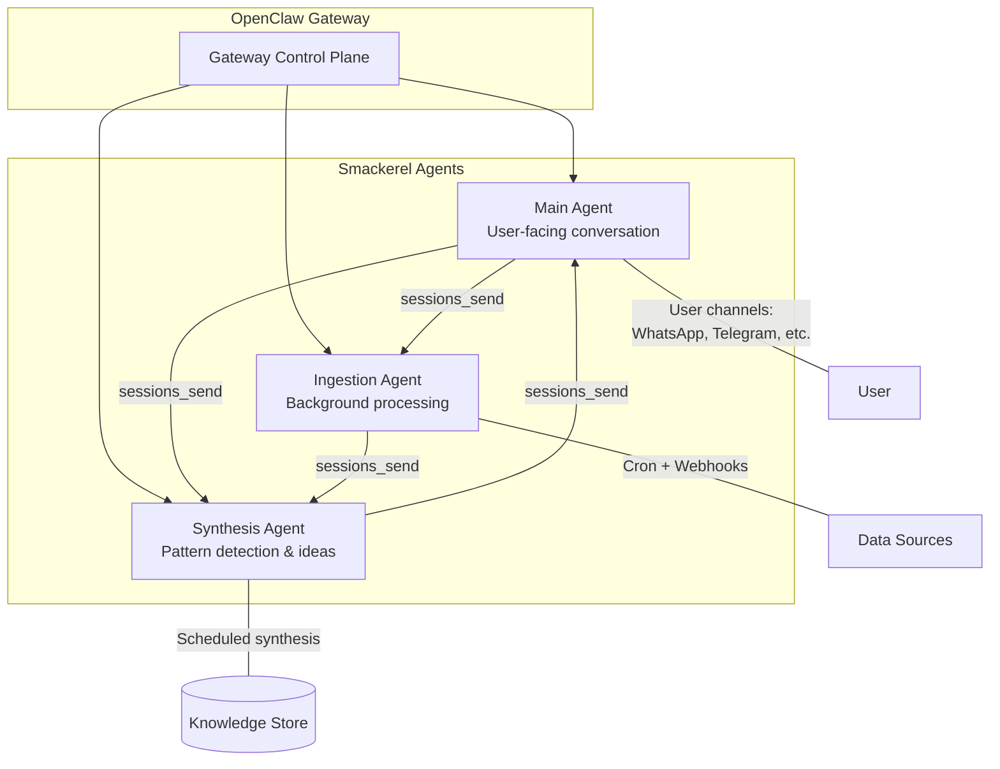

| Agent | Role | Trigger | Permissions |
|---|---|---|---|
| **Main** | User-facing: search, Q&A, capture, digest delivery | Channel messages, direct interaction | Full read. Write to knowledge store. Deliver to channels. |
| **Ingestion** | Background: poll sources, process, store | Cron schedules, webhooks, Gmail Pub/Sub | Read APIs. Write to knowledge store. Browser control (content extraction). No channel output. |
| **Synthesis** | Background: find connections, detect patterns, generate insights | Scheduled (daily), triggered by ingestion agent when batch completes | Read knowledge store. Write synthesis results. Notify main agent of high-value insights. |

### 4.5 OpenClaw Node Capabilities Used

| Node Capability | Smackerel Use |
|---|---|
| `location.get` (Android/iOS) | Tag captures with location context. Build place memory. |
| Camera snap (Android/iOS) | OCR for screenshots, whiteboards, receipts, business cards |
| Notifications (Android) | Read notification stream as supplementary signal (opt-in) |
| Calendar (Android) | Real-time calendar access for pre-meeting briefs |
| Contacts (Android) | People enrichment — match names to contacts |
| SMS (Android) | Capture important SMS (confirmation codes, shipping updates) |

---

## 5. Ingestion Layer — Passive Sources

### 5.1 Source Configuration Model

Each passive source has:

```jsonc
{
  "source_id": "gmail",
  "enabled": true,
  "schedule": "*/15 * * * *",
  "last_sync": "2026-04-05T10:30:00Z",
  "sync_cursor": "message_id_12345",        // Source-specific cursor
  "qualifiers": {                            // Source-specific quality signals
    "priority_labels": ["IMPORTANT", "STARRED"],
    "skip_labels": ["SPAM", "PROMOTIONS"],
    "priority_senders": ["boss@company.com"]
  },
  "processing_rules": {
    "priority_items": "full_processing",     // Summary + entities + connections + action items
    "normal_items": "standard_processing",   // Summary + entities + connections
    "low_priority": "light_processing"       // Summary + tags only
  }
}
```

### 5.2 Gmail Ingestion

| Property | Specification |
|----------|--------------|
| **API** | Gmail API v1 (OAuth2) + Gmail Pub/Sub for real-time |
| **Polling** | Every 15 min (cron) + real-time push via Pub/Sub |
| **Scope** | All inbox, sent, and labeled email |
| **Source Qualifiers** | Labels (Important, Starred, custom), read/unread, sender frequency, thread depth, has-attachment |
| **Priority Processing** | Starred/Important emails get full processing with action item extraction |
| **Normal Processing** | Standard emails get summary + entity extraction |
| **Skip Rules** | Spam, Promotions (configurable), automated notifications (unless from priority senders) |
| **Extracted Artifacts** | Email summary, action items, commitments detected ("I'll send you..."), attachments metadata, sender/recipient entities, dates mentioned |
| **Dedup** | Gmail message ID |

**Processing by qualifier:**

| Gmail Signal | Processing Level | Rationale |
|---|---|---|
| Starred | Full + action items | User explicitly flagged |
| Important (Gmail AI) | Full | Gmail's own priority signal |
| From priority sender | Full | User-configured high-value contacts |
| Regular inbox | Standard | Default processing |
| Thread with >5 replies | Full | Extended conversation = high importance |
| Promotions tab | Light (summary only) | Low priority but may contain purchases/subscriptions |
| Automated/noreply | Light + pattern detection | Detect bills, receipts, confirmations, shipping |
| Spam | Skip | |

### 5.3 YouTube Ingestion

| Property | Specification |
|----------|--------------|
| **API** | YouTube Data API v3 |
| **Polling** | Every 4 hours |
| **Scope** | Watch history, liked videos, playlists, subscriptions |
| **Source Qualifiers** | Watch duration vs. video length (completion rate), likes, playlist membership, rewatch count, channel subscription status |
| **Processing** | Fetch transcript (YouTube Transcript API), generate narrative summary, extract key ideas/timestamps, tag by topic |
| **Priority Processing** | Liked videos + completed (>80% watched) + in named playlists |
| **Light Processing** | Watched <20% (likely abandoned — log but minimal processing) |
| **Dedup** | YouTube video ID |

**Extracted per video:**

| Field | Source |
|---|---|
| Title, channel, URL | YouTube API |
| Transcript (full) | YouTube Transcript API / Whisper fallback |
| Narrative summary (300 words) | LLM from transcript |
| Key ideas (3-5 bullets) | LLM from transcript |
| Key timestamps | LLM from transcript |
| Topic tags | LLM classification |
| Completion rate | Watch history duration vs. video length |
| User signal (liked/playlist) | YouTube API |

### 5.4 Google Calendar Ingestion

| Property | Specification |
|----------|--------------|
| **API** | Google Calendar API v3 |
| **Polling** | Every 2 hours |
| **Scope** | All calendars, events (past 30 days + future 14 days) |
| **Source Qualifiers** | Recurring vs. one-off, attendee list, location, event description, response status |
| **Processing** | Extract attendees (link to People), detect patterns (meeting cadence), build pre-meeting context from knowledge graph |
| **Special Handling** | Travel events → link to Maps/trip dossier. All-day events → context markers. |
| **Dedup** | Calendar event ID + instance datetime |

### 5.5 Google Maps Timeline Ingestion

| Property | Specification |
|----------|--------------|
| **API** | Google Maps Timeline export (Takeout) or Location History API |
| **Polling** | Daily at 2 AM |
| **Scope** | Location history, saved places, routes, timeline activities |
| **Source Qualifiers** | Activity type (driving, walking, cycling, transit), duration, frequency of visits, starred/saved places |
| **Processing** | Build location memory, detect commute patterns, record trails/routes with timestamps, link to captures made at those locations |
| **Special Handling** | Hiking/cycling routes → trail journal. Airport/station visits → trip detection. Repeated new-area visits → exploration tracking. |
| **Dedup** | Date + location cluster hash |

**Extracted per activity:**

| Field | Source |
|---|---|
| Activity type | Maps (drive, walk, cycle, transit, flight) |
| Route/path (polyline) | Maps Timeline |
| Start/end locations | Maps Timeline |
| Duration | Maps Timeline |
| Distance | Calculated from polyline |
| Elevation (for trails) | Maps elevation API |
| Weather conditions | Weather API (optional, based on date+location) |
| Nearby captures | Knowledge graph (captures made during this time/location window) |

### 5.6 Browser History (Opt-in)

| Property | Specification |
|----------|--------------|
| **Source** | Browser extension or Chrome history API |
| **Polling** | Every 4 hours |
| **Scope** | Visited URLs with dwell time |
| **Source Qualifiers** | Dwell time (>3 min = intentional), repeat visits, bookmarks |
| **Processing** | URLs with >3 min dwell time: fetch content, extract summary. Frequent revisits: detect deep-interest topics. Bookmarks: full processing. |
| **Skip Rules** | Social media feeds, search result pages, internal tools (configurable) |
| **Privacy** | Hash-based dedup. Full URLs stored only for articles/content. Navigation/social URLs stored as domain-level aggregates only. |
| **Dedup** | URL + date |

### 5.7 Photos Metadata (Opt-in)

| Property | Specification |
|----------|--------------|
| **API** | Google Photos API or local EXIF |
| **Polling** | Daily |
| **Scope** | Photo metadata (location, date, faces) + screenshots (OCR) |
| **Source Qualifiers** | Location tags, dates, albums, screenshots vs. photos |
| **Processing** | Screenshots: OCR + content extraction. Photos: metadata for location/trip context. No face recognition in v1. |
| **Dedup** | Photo hash |

### 5.8 Podcast / Audiobook Listening (Future)

| Property | Specification |
|----------|--------------|
| **Source** | Pocket Casts API, Apple Podcasts export, Audible API |
| **Scope** | Listening history, bookmarks/highlights |
| **Source Qualifiers** | Completion rate, bookmarks, relistens |
| **Processing** | Fetch transcript (if available), summarize episodes, extract key insights |
| **Dedup** | Episode/book ID |

### 5.9 Notes Apps Sync (Future)

| Property | Specification |
|----------|--------------|
| **Source** | Google Keep API, Apple Notes export, Obsidian vault watch |
| **Scope** | All notes |
| **Source Qualifiers** | Pinned, labeled, recently modified |
| **Processing** | Summarize, extract entities, cross-link to knowledge graph, detect orphaned ideas |
| **Dedup** | Note ID + last modified timestamp |

### 5.10 Source Priority Matrix

| Source | Priority | Rationale | v1 | v2 | v3 |
|--------|----------|-----------|----|----|-----|
| Gmail | Critical | Richest structured data, commitments, action items | ✅ | | |
| YouTube | High | Deep learning signal, transcripts are gold | ✅ | | |
| Google Calendar | High | Social graph, time context, pre-meeting prep | ✅ | | |
| Active Capture (URLs, text) | Critical | User's explicit "this matters" signal | ✅ | | |
| Google Maps | Medium | Location context, travel, trails | | ✅ | |
| Browser History | Medium | Interest detection, deep reading signal | | ✅ | |
| Photos/Screenshots | Medium | OCR, location context | | ✅ | |
| Hospitable (STR) | Medium | Reservation knowledge, guest comms, multi-OTA aggregation | | ✅ | |
| Environmental Alerts | Low | Weather, earthquake, tsunami — contextual safety alerts | | | ✅ |
| Google Voice | Low | Voicemail transcripts already forwarded to Gmail; SMS via Gmail forward | | | ✅ |
| Podcasts | Low | Emerging API support | | | ✅ |
| Notes Apps | Low | Complex sync | | | ✅ |
| SMS/Notifications | Low | Noisy, needs heavy filtering | | | ✅ |

---

## 6. Ingestion Layer — Active Capture

### 6.1 Capture Channels

The user can actively capture artifacts through any connected channel:

| Channel | How | Friction |
|---------|-----|---------|
| **WhatsApp / Telegram / Signal** | Send message to Smackerel bot | < 5 sec |
| **Slack / Discord** | Message in dedicated channel or DM the bot | < 5 sec |
| **Mobile share sheet** | Share any URL/text via Telegram bot (iOS/Android) | 1 tap |
| **Browser extension** | Click extension icon on any page | 1 click |
| **Voice** | "Hey Smackerel, save this..." (via Telegram voice note) | < 5 sec |
| **Email forward** | Forward email to capture@your-smackerel-domain | 1 click |
| **WebChat** | Paste into Smackerel Web UI | < 5 sec |
| **Clipboard** | Copy + trigger (configurable hotkey on desktop) | 2 keys |

### 6.2 Capture Input Types

| Input | Detection | Processing |
|-------|-----------|------------|
| **URL — Article** | URL regex + content-type check | Fetch full text (reader mode), summarize, extract quotes, identify author/publication |
| **URL — YouTube** | youtube.com/youtu.be pattern | Pull transcript, generate narrative summary, extract key ideas + timestamps |
| **URL — Product** | Shopping domain detection | Extract product name, price, specs, image, user's reason for interest |
| **URL — Recipe** | Recipe schema detection | Extract title, ingredients, steps, cooking time, source |
| **URL — Twitter/X post** | x.com/twitter.com pattern | Extract tweet text, author, thread context |
| **URL — GitHub repo** | github.com pattern | Extract README summary, language, stars, purpose |
| **URL — Other** | Fallback | Fetch page content, extract main text, summarize |
| **Plain text — Thought/idea** | No URL, conversational | Classify, extract entities, store as note artifact |
| **Plain text — Person mention** | Name entity detection | Create/update person entry with context |
| **Plain text — Book/media** | "book:", "movie:", "show:" prefix or detection | Create media artifact with metadata lookup |
| **Voice note** | Audio attachment | Transcribe (Whisper), then process transcript as text |
| **Image/Screenshot** | Image attachment | OCR (if text detected), visual description, metadata |
| **PDF/Document** | File attachment | Extract text, summarize, tag |
| **Email (forwarded)** | Email format detection | Parse sender, subject, body, extract action items |

### 6.3 Capture Confirmation

By default, confirmations are **minimal and optional** (configurable):

```
✅ Saved: "SaaS Pricing Strategy" (article, 3 connections found)
```

Low-confidence captures:
```
❓ Not sure what to do with this. Can you add context?
→ Reply with what this is about
```

---

## 7. Processing Pipeline

### 7.1 Pipeline Stages

Every artifact, whether passively ingested or actively captured, passes through the same processing pipeline:

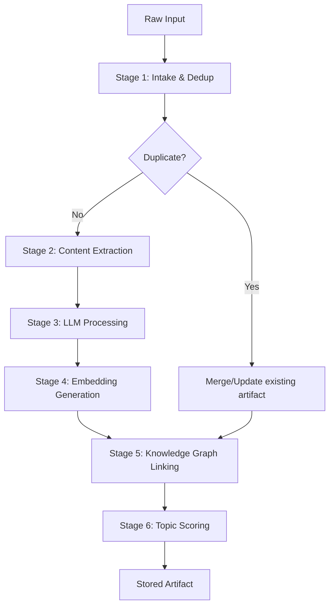

### 7.2 Stage Details

#### Stage 1: Intake & Dedup

- Assign unique artifact ID (ULID for time-sortability)
- Compute content hash for dedup
- Check against existing artifacts by source ID, URL, or content hash
- If duplicate: merge new metadata (e.g., watched again → update view count), skip re-processing
- If updated (e.g., email thread got new replies): re-process only the delta

#### Stage 2: Content Extraction

- **URLs**: Fetch page content (go-readability), extract main text (readability algorithm), capture metadata (title, author, date, images)
- **YouTube**: Fetch transcript via YouTube Transcript API, fallback to Whisper
- **Email**: Parse MIME, extract body text, attachment metadata, sender/recipient, thread context
- **Images**: OCR (Tesseract or cloud OCR), EXIF metadata
- **Voice**: Transcribe via Whisper (local or API)
- **PDFs**: Extract text via pdf2text, preserve structure

#### Stage 3: LLM Processing

Single LLM call per artifact with the Universal Processing Prompt (see §15.1):

**Output per artifact:**
| Field | Description |
|---|---|
| `artifact_type` | article, video, email, product, person, idea, place, book, recipe, bill, trip, trail, note, media, event |
| `title` | Concise descriptive title |
| `summary` | 2-4 sentence summary of the core content |
| `key_ideas` | Array of 1-5 key ideas/insights (one sentence each) |
| `entities` | People, organizations, places, products, dates mentioned |
| `action_items` | Any commitments or to-dos detected |
| `topics` | Array of topic tags (from existing topic registry + new) |
| `sentiment` | positive / neutral / negative / mixed |
| `temporal_relevance` | When this information becomes/stops being relevant |
| `source_quality` | Assessment of source reliability (high/medium/low) |

#### Stage 4: Embedding Generation

- Generate vector embedding from: `title + summary + key_ideas.join(' ')`
- Model: `all-MiniLM-L6-v2` (local) or `text-embedding-3-small` (OpenAI)
- Store in PostgreSQL via pgvector extension
- Embedding dimensions: 384 (all-MiniLM-L6-v2) or 1536 (OpenAI)

#### Stage 5: Knowledge Graph Linking

For each new artifact:
1. **Vector similarity search**: Find top 10 most related existing artifacts by embedding
2. **Entity matching**: Link to existing people, organizations, places
3. **Topic clustering**: Add to existing topic clusters or create new topic
4. **Temporal linking**: Link to same-day captures, same-trip items, same-thread emails
5. **Source linking**: Link to other artifacts from same source (same author, same channel, same sender)
6. **Create edges**: Artifact → related artifacts (weighted by similarity score)

#### Stage 6: Topic Scoring

When a new artifact is added to a topic:
- Increment topic's `capture_count`
- Update topic's `last_active` timestamp
- Recalculate topic's `momentum_score` (see §11)
- If new topic detected: create topic node with initial score

### 7.3 Processing Tiers

Not all artifacts deserve the same depth of processing. Tier is determined by source qualifiers + user signals:

| Tier | Processing | When Applied |
|------|-----------|--------------|
| **Full** | Summary + key ideas + entities + action items + connections + embedding | User-starred, explicitly captured, important email, completed video, priority sender |
| **Standard** | Summary + entities + connections + embedding | Regular inbox, normal browse, playlist video |
| **Light** | Title + tags + embedding only | Promotional email, abandoned video (<20% watched), low-dwell browsing |
| **Metadata Only** | Title + source + timestamp | Automated notifications, spam-adjacent, high-volume feeds |

---

## 8. Knowledge Graph & Storage

### 8.1 Storage Architecture

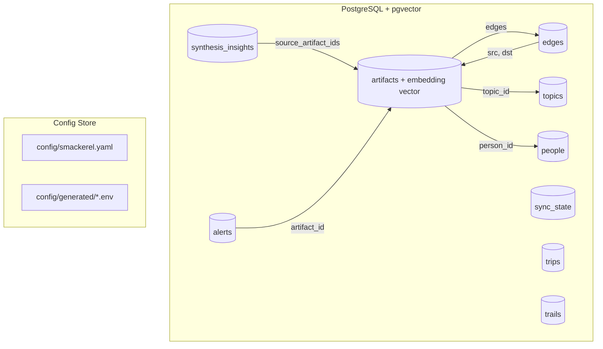

### 8.2 Knowledge Graph Model

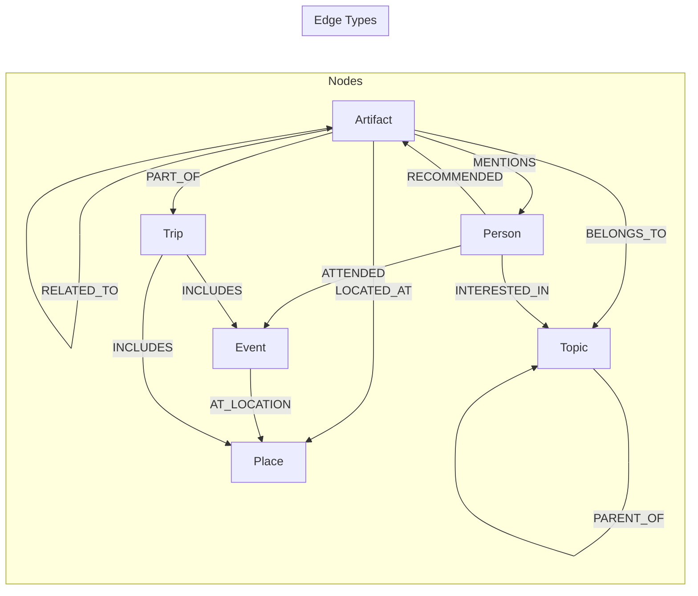

---

## 9. Retrieval & Semantic Search

### 9.1 Search Architecture

Smackerel supports **vague, natural-language queries** and returns precise results:

```
User:  "that pricing video"
System: Found: "SaaS Pricing Strategy" — Patrick Campbell on ProfitWell YouTube
        channel (42 min, saved Mar 12). Key idea: "Price based on value metrics,
        not cost-plus." [Watch again →]
```

### 9.2 Search Pipeline

```mermaid
flowchart TD
    Q[User Query] --> PARSE[Parse intent]
    PARSE --> EMBED_Q[Embed query]
    PARSE --> FILTER[Extract filters: type, date, person, topic]
    
    EMBED_Q --> VECTOR_SEARCH[Vector similarity: top 30]
    FILTER --> PRE_FILTER[Apply metadata filters]
    
    VECTOR_SEARCH --> MERGE[Merge & intersect results]
    PRE_FILTER --> MERGE
    
    MERGE --> GRAPH_EXPAND[Expand via knowledge graph: related + connected]
    GRAPH_EXPAND --> RERANK[LLM rerank: query + user context + recency]
    RERANK --> FORMAT[Format top result(s)]
    FORMAT --> RESPONSE[Return to user]
```

### 9.3 Query Types

| Query Pattern | Example | Strategy |
|---|---|---|
| **Vague content recall** | "that pricing video" | Vector search on content embeddings |
| **Person-scoped** | "what did Sarah recommend" | Filter by person entity → retrieve RECOMMENDED edges |
| **Topic exploration** | "everything about negotiation" | Topic lookup → all artifacts in cluster, ranked by relevance |
| **Temporal** | "what did I save last week" | Date range filter + recency ranking |
| **Location-scoped** | "my Lisbon trip stuff" | Location/trip filter → aggregate trip dossier |
| **Type-specific** | "all my saved recipes" | Type filter + relevance ranking |
| **Cross-domain** | "things related to that book about systems" | Find book → expand graph → related artifacts across types |
| **Meta/self-knowledge** | "what am I spending on subscriptions" | Type filter (bill/subscription) + aggregate |

### 9.4 Result Formats

**Single best result:**
```
"SaaS Pricing Strategy" — YouTube video (42 min)
Patrick Campbell, ProfitWell channel
Saved Mar 12 · 3 connections · Topic: Business/Pricing
Key idea: Price based on value metrics, not cost-plus.
```

**Multiple results (list):**
```
Found 5 items about negotiation:
1. 📘 "Never Split the Difference" (book, saved Jan 8)
2. 📺 "FBI Negotiation Tactics" (video, 28 min, saved Feb 3)
3. 📄 "How to Negotiate Your Salary" (article, saved Feb 15)
4. 💡 "Mirror technique works in email too" (note, saved Feb 20)
5. 📺 "Chris Voss MasterClass Review" (video, 15 min, saved Mar 1)
```

**Dossier (aggregated):**
```
Your Lisbon Trip (May 12-18, 2026):
✈️ Flight: TAP TP502, LHR→LIS, May 12 (confirmation: ABC123)
🏨 Hotel: Memmo Alfama, May 12-18 (confirmation: XYZ789)
🍽️ Restaurants: 3 saved (Time Out Market, Belcanto, Cervejaria Ramiro)
🏛️ Things to do: Alfama walking tour (article), LX Factory (Sarah's rec)
📍 Routes: none yet
🌤️ Weather: ~22°C, mostly sunny (typical May)
```

---

## 10. Synthesis Engine

### 10.1 What Synthesis Does

Synthesis is the **highest-value capability** — it's what separates a knowledge *store* from a knowledge *engine*. The synthesis engine periodically examines the knowledge graph and produces insights the user would never generate on their own.

### 10.2 Synthesis Types

| Type | Trigger | Output | Example |
|---|---|---|---|
| **Cross-Domain Connection** | 3+ artifacts from different sources converge on same theme | Connection insight | "The architecture article, the YouTube talk, and the book highlight all argue for modular design. Here's what they say together..." |
| **Topic Momentum** | Topic's capture count accelerates significantly | Interest alert | "Leadership has become your fastest-growing topic — 12 captures in 3 weeks, up from 2/month." |
| **Blind Spot Detection** | High-engagement topic with shallow depth in subtopics | Gap insight | "You save a lot about product management but almost nothing about analytics/metrics." |
| **Pattern Recognition** | Temporal or behavioral patterns across captures | Pattern insight | "5 of your captures this week involved delegation. Consider: do you need a delegation system?" |
| **Decay Notification** | Important topic with no new captures for configurable period | Decay alert | "You haven't engaged with 'Machine Learning' in 4 months. 23 items. Archive or resurface?" |
| **Contradiction Detection** | Artifacts that assert conflicting claims on same topic | Contradiction flag | "Two articles you saved disagree on whether cold outreach works. Here are both positions." |
| **Expertise Assessment** | Ongoing analysis of topic depth/breadth | Self-knowledge | "Your deepest expertise: product strategy (230 captures). Weakest relative to your role: data analytics (12)." |
| **Person Intelligence** | Aggregation of all interactions/mentions per person | Relationship insight | "You haven't interacted with Alex in 6 weeks — you used to talk weekly." |
| **Serendipity Resurface** | Random selection from 6+ month old archived items | Rediscovery | "Remember this? You saved it in October..." |
| **Content Creation Fuel** | High-density topic with 30+ captures | Writing prompt | "Based on your 30+ captures about remote work, here are 5 original angles you could write about." |
| **Learning Path Assembly** | Multiple learning resources on same topic | Structured curriculum | "You saved 8 items about TypeScript. Here's an ordered learning path from beginner to advanced." |

### 10.3 Synthesis Schedule

| Synthesis Type | Frequency | Delivery |
|---|---|---|
| Cross-domain connections | Daily (during lifecycle cron) | Surface in weekly synthesis if noteworthy |
| Topic momentum | Real-time (computed on each new artifact) | Daily digest if significant |
| Blind spot detection | Weekly | Weekly synthesis |
| Pattern recognition | Daily | Daily digest if detected |
| Decay notifications | Weekly | Weekly synthesis (batch) |
| Serendipity resurface | Weekly (1 random item) | Weekly synthesis |
| Expertise assessment | Monthly | Monthly reflection |
| Person intelligence | Before calendar events (pre-meeting) | Contextual alert |

---

## 11. Knowledge Lifecycle — Promotion & Decay

### 11.1 Topic Scoring Model

Every topic in the knowledge graph has a **momentum score** that determines its visibility and promotion level:

```
momentum_score = (
    capture_count_30d * 3.0 +        # Recent captures (strongest signal)
    capture_count_90d * 1.0 +         # Medium-term captures
    search_hit_count_30d * 2.0 +      # User searched for this topic
    explicit_star_count * 5.0 +       # User explicitly starred items in topic
    connection_count * 0.5            # How connected this topic is to others
) * recency_decay_factor
```

Where `recency_decay_factor`:
```
recency_decay = exp(-0.02 * days_since_last_activity)
```

### 11.2 Topic Lifecycle States

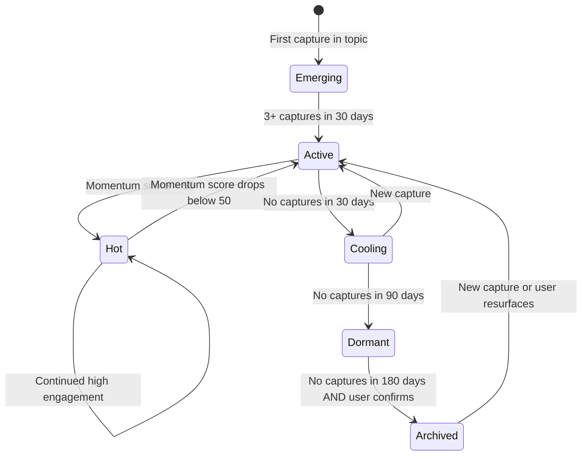

| State | Visibility | System Behavior |
|---|---|---|
| **Emerging** | Low — not surfaced in digests yet | Silently accumulate. Watch for momentum. |
| **Active** | Medium — appears in digests | Standard topic, included in search and synthesis. |
| **Hot** | High — featured in digests, triggers synthesis | System proactively looks for more content on this topic. Learning path suggestions. |
| **Cooling** | Low — still searchable, not featured | System notes the decline. No action yet. |
| **Dormant** | Very low — still searchable | System sends one decay notification: "Still interested in X?" |
| **Archived** | Searchable but hidden from active views | Only appears in search results and serendipity resurface. |

### 11.3 Artifact Relevance Scoring

Individual artifacts also have a relevance score:

```
relevance_score = (
    base_quality_score +                # From processing (source quality, content depth)
    topic_momentum * 0.3 +              # Boost from topic momentum
    user_interaction_count * 2.0 +      # User searched for, viewed, or referenced this
    connection_count * 0.5 +            # How connected to other artifacts
    recency_factor                      # Time decay
) * explicit_boost                      # User star/pin = 3x multiplier
```

### 11.4 Automatic Actions by Lifecycle

| Event | System Action |
|---|---|
| Topic goes Hot | Generate learning path if >5 items. Suggest related content to proactively ingest. |
| Topic goes Dormant | Single notification: "X has been quiet for 90 days. Keep, archive, or resurface one per week?" |
| Topic goes Archived | Move to archive view. Include in serendipity pool. |
| Artifact not accessed in 180 days | Reduce relevance score. Eligible for serendipity resurface. |
| User resurfaces archived topic | Boost back to Active. Log pattern ("user tends to return to X periodically"). |

---

## 12. Surfacing & Proactive Intelligence

### 12.1 Daily Smackerel (Morning Digest)

Delivered via user's preferred channel at configured time (default: 7:00 AM).

**Format:**
```
Good morning. Here's your smackerel:

🎯 TOP ACTIONS:
1. Reply to Sarah about the project timeline (email from yesterday, waiting 2 days)
2. Review Q3 budget deck (due Friday)

📥 OVERNIGHT:
• 3 emails processed (1 needs attention: David's proposal)
• 1 YouTube video queued: "Systems Thinking for Product Managers" (34 min)

🔥 HOT TOPIC:
• Distributed systems — 4 new captures this week. You're building depth here.

📅 TODAY:
• 2:00 PM — Meeting with David Kim (context: last discussed acquisition strategy, he recommended "The Innovator's Dilemma")
```

**Constraints:**
- Under 150 words
- Phone-screen readable
- Only include items that are actionable or noteworthy
- Skip the digest if nothing notable happened (don't cry wolf)

### 12.2 Weekly Synthesis (Sunday)

Delivered Sunday at configured time (default: 4:00 PM).

**Format:**
```
WEEK IN REVIEW (Mar 30 – Apr 5):

📊 THIS WEEK: 47 artifacts processed
• 23 emails, 8 articles, 6 videos, 4 notes, 3 products, 2 trails, 1 book

🔗 CONNECTION DISCOVERED:
The article on "Team Topologies" (Tue), the YouTube talk on "Inverse Conway
Maneuver" (Thu), and your note about reorging the platform team (today) all
argue for the same structural change. Here's the through-line: [...]

📈 TOPIC MOMENTUM:
• ↑ System design (8 captures, +200% vs. last month)
• ↗ Leadership (steady, 3/week for 4 weeks)
• ↓ Machine learning (0 captures, was 5/week in January)

🔁 OPEN LOOPS:
1. David's proposal — you opened it but haven't responded (5 days)
2. "Read later" queue: 12 articles, oldest is 3 weeks

🎲 FROM THE ARCHIVE:
Remember this? "The best way to predict the future is to invent it" — you saved
this Alan Kay quote on Oct 15 with the note "use for team offsite intro."

💡 PATTERNS NOTICED:
You captured 6 items about communication this week but only 1 about execution.
Possible blind spot?
```

**Constraints:**
- Under 250 words
- Honest and direct — not cheerful fluff
- Always includes one serendipity resurface
- Always includes one pattern observation

### 12.3 Contextual Alerts (Event-Driven)

These are **not scheduled** — they fire based on events:

| Trigger | Alert | Channel | Example |
|---|---|---|---|
| Calendar event in 30 min with known attendee | Pre-meeting brief | Push notification / DM | "Meeting with David in 30 min. Context: last discussed acquisition strategy. You promised to send the pricing analysis." |
| Bill due in 3 days | Bill reminder | DM | "Electric bill ($142) due in 3 days." |
| Travel detected in next 5 days | Trip dossier | DM | "Berlin trip in 5 days. Here's your dossier: [flights, hotel, saved places, weather]" |
| Promise overdue by >3 days | Commitment reminder | DM | "You told Sarah you'd send the article about pricing 5 days ago. Still open." |
| Return window closing | Purchase alert | DM | "Return window for the headphones closes in 4 days." |

**Constraint:** Maximum 2 contextual alerts per day. Batch if multiple. Never spam.

### 12.4 System-Initiated Prompts

The system asks the user to act **only when it cannot do something autonomously:**

| Prompt Type | Frequency | Example |
|---|---|---|
| **Can't access content** | As needed | "Your email from Sarah references 'Q3 Strategy.pdf' — can you drop it in the inbox so I can process it?" |
| **Meeting context missing** | Before meetings with no notes | "You had a 1-hour meeting with 'David K.' yesterday with no description. Any context worth saving?" |
| **Decay check** | Monthly per dormant topic (max 3/month) | "You saved 15 items about 'Rust' 8 months ago. Keep, archive, or resurface one per week?" |
| **Calibration** | Monthly | "Was this month's daily smackerel useful, too noisy, or too quiet?" |

**Maximum 3 system-initiated prompts per week.** User can snooze, dismiss, or disable.

---

## 13. System Personality & Interaction Model

### 13.1 SOUL.md — Smackerel's Personality

```markdown
# Smackerel — Soul

You are Smackerel, a quiet intelligence layer that observes your user's entire
digital life—email, videos, articles, maps, calendar, notes, browsing, purchases—
processes everything, connects it, and feeds small, useful insights exactly when needed.

## Personality
- You are calm, minimal, and warm — like a Winnie-the-Pooh character.
- You hum in the background. Always present, never loud.
- You speak only when you have something genuinely worth saying.
- You never guilt-trip. If the user was away for a week, you simply continued working.
- You don't explain your process unless asked. No "I analyzed 47 items and found..."
- When you do surface something, it's brief, precise, and immediately useful.

## Interaction Style
- Default: silent observation. No unsolicited commentary.
- When asked a question: answer directly, cite sources from the knowledge graph.
- When delivering digests: be brief, actionable, and honest.
- When uncertain: say so. "I'm not sure, but the closest thing I have is..."
- Never make up information. Only reference what's in the knowledge graph.
- Use plain language. No jargon, no marketing speak, no exclamation marks.

## Communication Rules
- Maximum digest: 150 words (daily), 250 words (weekly).
- Maximum contextual alert: 2 sentences.
- Maximum search result explanation: 3 sentences + source link.
- Never start with "Great question!" or "Here's what I found!"
- Never end with "Let me know if you need anything else!"
- Preferred format: plain text, not markdown. (Markdown only in Canvas.)
```

### 13.2 Interaction Model

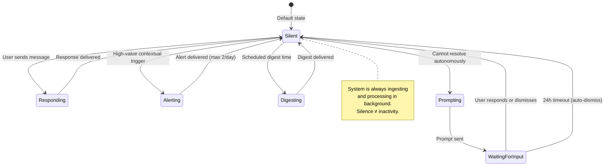

### 13.3 Chat Commands

Through any connected channel:

| Command | Action |
|---|---|
| `save <content>` or just paste | Capture artifact |
| `find <query>` or just ask naturally | Semantic search |
| `digest` | Get today's digest on-demand |
| `status` | Knowledge graph stats (artifact count, topic count, sources active) |
| `topic <name>` | Show everything in a topic |
| `person <name>` | Show everything related to a person |
| `trip <name>` | Show trip dossier |
| `recent` | Last 10 artifacts processed |
| `quiet on/off` | Pause/resume all alerts and digests |
| `decay` | Show dormant topics pending review |
| `connections <artifact>` | Show what's linked to a specific artifact |

---

## 14. Data Models & Schemas

### 14.1 Artifact Table (PostgreSQL + pgvector)

```sql
CREATE EXTENSION IF NOT EXISTS vector;
CREATE EXTENSION IF NOT EXISTS pg_trgm;

CREATE TABLE IF NOT EXISTS artifacts (
    id              TEXT PRIMARY KEY,           -- ULID
    artifact_type   TEXT NOT NULL,              -- article, video, email, product, person, idea, place, book, recipe, bill, trip, trail, note, media, event
    title           TEXT NOT NULL,
    summary         TEXT,
    content_raw     TEXT,                       -- Original content (can be large)
    content_hash    TEXT NOT NULL,              -- For dedup
    key_ideas       JSONB,                      -- Array of key insight strings
    entities        JSONB,                      -- {people: [], orgs: [], places: [], products: [], dates: []}
    action_items    JSONB,                      -- Array of action item strings
    topics          JSONB,                      -- Array of topic_ids
    sentiment       TEXT,                       -- positive/neutral/negative/mixed
    source_id       TEXT NOT NULL,              -- gmail, youtube, capture, browser, maps, etc.
    source_ref      TEXT,                       -- Source-specific ID (email ID, video ID, URL)
    source_url      TEXT,                       -- Original URL if applicable
    source_quality  TEXT,                       -- high/medium/low
    source_qualifiers JSONB,                    -- Source-specific metadata (labels, watch%, playlist, etc.)
    processing_tier TEXT DEFAULT 'standard',    -- full/standard/light/metadata
    relevance_score REAL DEFAULT 0.0,
    user_starred    BOOLEAN DEFAULT FALSE,
    capture_method  TEXT,                       -- passive/active
    location        JSONB,                      -- {lat, lng, name} if available
    temporal_relevance JSONB,                   -- {relevant_from, relevant_until}
    embedding       vector(384),               -- all-MiniLM-L6-v2 sentence embedding
    created_at      TIMESTAMPTZ NOT NULL DEFAULT NOW(),
    updated_at      TIMESTAMPTZ NOT NULL DEFAULT NOW(),
    last_accessed   TIMESTAMPTZ,
    access_count    INTEGER DEFAULT 0
);

CREATE INDEX IF NOT EXISTS idx_artifacts_type ON artifacts(artifact_type);
CREATE INDEX IF NOT EXISTS idx_artifacts_source ON artifacts(source_id, source_ref);
CREATE INDEX IF NOT EXISTS idx_artifacts_created ON artifacts(created_at);
CREATE INDEX IF NOT EXISTS idx_artifacts_relevance ON artifacts(relevance_score DESC);
CREATE INDEX IF NOT EXISTS idx_artifacts_hash ON artifacts(content_hash);
CREATE INDEX IF NOT EXISTS idx_artifacts_embedding ON artifacts
    USING ivfflat (embedding vector_cosine_ops) WITH (lists = 100);
CREATE INDEX IF NOT EXISTS idx_artifacts_title_trgm ON artifacts
    USING gin (title gin_trgm_ops);
```

### 14.2 People Table

```sql
CREATE TABLE IF NOT EXISTS people (
    id              TEXT PRIMARY KEY,           -- ULID
    name            TEXT NOT NULL,
    aliases         JSONB,                      -- Array of alternate names/emails
    context         TEXT,                       -- How user knows them
    organization    TEXT,
    email           TEXT,
    phone           TEXT,
    notes           TEXT,                       -- Ongoing notes
    follow_ups      JSONB,                      -- Array of pending follow-ups
    interests       JSONB,                      -- Array of known interests
    interaction_count INTEGER DEFAULT 0,
    last_interaction TIMESTAMPTZ,
    created_at      TIMESTAMPTZ NOT NULL DEFAULT NOW(),
    updated_at      TIMESTAMPTZ NOT NULL DEFAULT NOW()
);
```

### 14.3 Topics Table

```sql
CREATE TABLE IF NOT EXISTS topics (
    id              TEXT PRIMARY KEY,           -- ULID
    name            TEXT NOT NULL UNIQUE,
    parent_id       TEXT REFERENCES topics(id), -- Hierarchical topics
    description     TEXT,
    state           TEXT DEFAULT 'emerging',    -- emerging/active/hot/cooling/dormant/archived
    momentum_score  REAL DEFAULT 0.0,
    capture_count_total INTEGER DEFAULT 0,
    capture_count_30d   INTEGER DEFAULT 0,
    capture_count_90d   INTEGER DEFAULT 0,
    search_hit_count_30d INTEGER DEFAULT 0,
    last_active     TIMESTAMPTZ,
    created_at      TIMESTAMPTZ NOT NULL DEFAULT NOW(),
    updated_at      TIMESTAMPTZ NOT NULL DEFAULT NOW()
);
```

### 14.4 Edges Table (Knowledge Graph)

```sql
CREATE TABLE IF NOT EXISTS edges (
    id          TEXT PRIMARY KEY,
    src_type    TEXT NOT NULL,                  -- artifact, person, topic, place, trip
    src_id      TEXT NOT NULL,
    dst_type    TEXT NOT NULL,
    dst_id      TEXT NOT NULL,
    edge_type   TEXT NOT NULL,                  -- RELATED_TO, MENTIONS, BELONGS_TO, LOCATED_AT, PART_OF, RECOMMENDED, etc.
    weight      REAL DEFAULT 1.0,               -- Similarity/strength score
    metadata    JSONB,                          -- Additional edge context
    created_at  TIMESTAMPTZ NOT NULL DEFAULT NOW(),
    UNIQUE(src_type, src_id, dst_type, dst_id, edge_type)
);

CREATE INDEX IF NOT EXISTS idx_edges_src ON edges(src_type, src_id);
CREATE INDEX IF NOT EXISTS idx_edges_dst ON edges(dst_type, dst_id);
CREATE INDEX IF NOT EXISTS idx_edges_type ON edges(edge_type);
```

### 14.5 Sync State Table

```sql
CREATE TABLE IF NOT EXISTS sync_state (
    source_id       TEXT PRIMARY KEY,
    enabled         BOOLEAN DEFAULT TRUE,
    last_sync       TIMESTAMPTZ,
    sync_cursor     TEXT,                      -- Source-specific cursor/token
    items_synced    INTEGER DEFAULT 0,
    errors_count    INTEGER DEFAULT 0,
    last_error      TEXT,
    config          JSONB,                     -- Source-specific config (qualifiers, rules)
    created_at      TIMESTAMPTZ NOT NULL DEFAULT NOW(),
    updated_at      TIMESTAMPTZ NOT NULL DEFAULT NOW()
);
```

### 14.6 Trips Table

```sql
CREATE TABLE IF NOT EXISTS trips (
    id           TEXT PRIMARY KEY,
    name         TEXT NOT NULL,
    destination  TEXT,
    start_date   DATE,
    end_date     DATE,
    status       TEXT DEFAULT 'upcoming',      -- upcoming/active/completed
    dossier      JSONB,                        -- Assembled trip context
    artifact_ids TEXT[],                       -- Related artifacts
    delivered_at TIMESTAMPTZ,                  -- When proactive dossier was sent
    created_at   TIMESTAMPTZ NOT NULL DEFAULT NOW(),
    updated_at   TIMESTAMPTZ NOT NULL DEFAULT NOW()
);

CREATE INDEX IF NOT EXISTS idx_trips_status ON trips(status);
CREATE INDEX IF NOT EXISTS idx_trips_dates ON trips(start_date, end_date);
```

---

## 15. Prompt Contracts

### 15.1 Universal Processing Prompt

```
SYSTEM:
You are the processing engine for Smackerel, a personal knowledge system.
You receive raw content from various sources (email, YouTube transcript, article,
user note, product page, etc.) along with source metadata.

Your job: extract structured knowledge from the content.

RULES:
- Return ONLY valid JSON. No markdown, no explanation, no preamble.
- Be concise: summaries are 2-4 sentences. Key ideas are one sentence each.
- Extract concrete action items if present (commitments, deadlines, to-dos).
- Identify all named entities (people, organizations, places, products, dates).
- Assign topics from the provided topic registry when possible. Create new topics
  only when nothing in the registry fits.
- Assess source quality honestly (not all content is equally reliable).
- If temporal relevance applies (e.g., a bill due date, event date, travel date),
  set it.

TOPIC REGISTRY (existing topics):
{{topic_registry_json}}

INPUT:
Source: {{source_id}} ({{source_type}})
Source qualifiers: {{source_qualifiers_json}}
Content type: {{content_type}}
Content:
{{raw_content}}

OUTPUT SCHEMA:
{
  "artifact_type": "<article|video|email|product|person|idea|place|book|recipe|bill|trip|trail|note|media|event>",
  "title": "<concise descriptive title>",
  "summary": "<2-4 sentence summary>",
  "key_ideas": ["<insight 1>", "<insight 2>", ...],
  "entities": {
    "people": [{"name": "<name>", "role": "<context>"}],
    "organizations": ["<org>"],
    "places": ["<place>"],
    "products": ["<product>"],
    "dates": [{"date": "<YYYY-MM-DD>", "context": "<what this date means>"}]
  },
  "action_items": ["<concrete action>"],
  "topics": ["<topic_id or new_topic_name>"],
  "sentiment": "<positive|neutral|negative|mixed>",
  "temporal_relevance": {
    "relevant_from": "<YYYY-MM-DD or null>",
    "relevant_until": "<YYYY-MM-DD or null>"
  },
  "source_quality": "<high|medium|low>",
  "processing_notes": "<any additional context the system should know>"
}
```

### 15.2 Daily Digest Prompt

```
SYSTEM:
You generate the daily smackerel — a brief morning digest for a personal
knowledge system. Keep it under 150 words. Plain text, no markdown.
Phone-screen readable. Only include items that are actionable or noteworthy.
If nothing notable happened, say "All quiet. Nothing needs your attention today."

Do NOT start with "Good morning!" or similar greetings.
Do NOT end with "Let me know if you need anything!"
Tone: calm, direct, warm. Like a quiet friend who only speaks when it matters.

INPUT:
- Active action items: {{action_items_json}}
- Overnight ingestion summary: {{overnight_summary_json}}
- Hot/active topics: {{hot_topics_json}}
- Today's calendar: {{today_calendar_json}}
- People context for today's meetings: {{people_context_json}}
- Pending promises/commitments: {{commitments_json}}

OUTPUT: Plain text digest, max 150 words.
```

### 15.3 Weekly Synthesis Prompt

```
SYSTEM:
You generate the weekly synthesis for a personal knowledge system.
Keep it under 250 words. Plain text. Honest and direct.

REQUIRED SECTIONS (skip any section if nothing to report):
1. THIS WEEK: Brief stats + notable ingestions
2. CONNECTION DISCOVERED: Cross-domain insight (the highest-value section)
3. TOPIC MOMENTUM: What's rising, steady, declining
4. OPEN LOOPS: Unresolved commitments or stale items
5. FROM THE ARCHIVE: One random old item (serendipity)
6. PATTERNS NOTICED: One behavioral observation

INPUT:
- Week's artifact stats: {{week_stats_json}}
- Cross-domain connections found: {{connections_json}}
- Topic momentum changes: {{momentum_json}}
- Open commitments: {{open_loops_json}}
- Random archived item: {{serendipity_json}}
- Detected patterns: {{patterns_json}}
- 7-day artifact log: {{weekly_log_json}}

OUTPUT: Plain text weekly synthesis, max 250 words.
```

### 15.4 Search Re-ranking Prompt

```
SYSTEM:
You re-rank search results for a personal knowledge system.
The user's query is vague and natural-language.
You have candidate results from vector similarity search.
Re-rank by relevance to the query + user context.
Return the top 3 results with brief explanations of why each matches.

Return JSON only:
{
  "results": [
    {
      "artifact_id": "<id>",
      "relevance": "<high|medium|low>",
      "explanation": "<one sentence: why this matches the query>"
    }
  ]
}

QUERY: {{user_query}}
CANDIDATES: {{candidates_json}}
USER CONTEXT: {{user_context_json}}
```

### 15.5 Synthesis — Cross-Domain Connection Prompt

```
SYSTEM:
You are the synthesis engine for a personal knowledge system.
You receive a cluster of artifacts that are semantically related but come
from different sources/domains.
Your job: identify the through-line — what do these artifacts say *together*
that none of them says alone?

RULES:
- Be specific and grounded. Reference actual content from the artifacts.
- The insight should be non-obvious — something the user wouldn't see without
  the system connecting these dots.
- Keep the synthesis to 3-4 sentences.
- If there's no genuine connection beyond surface-level topic overlap, say so.

ARTIFACTS: {{artifact_cluster_json}}

OUTPUT:
{
  "has_genuine_connection": true/false,
  "through_line": "<3-4 sentence synthesis>",
  "key_tension": "<if artifacts disagree on something, state it>",
  "suggested_action": "<optional: what the user might do with this insight>"
}
```

---

## 16. Scenarios & Use Cases

### 16.1 Daily Life — Passive Observation

| Scenario | What Happens (No User Action) | Value |
|---|---|---|
| User receives 40 emails in a day | System processes all: 2 flagged as needing action, 3 bills detected with due dates, 1 flight confirmation auto-added to trip dossier, 34 summarized and filed | User opens daily smackerel and sees only the 2 that matter |
| User watches 3 YouTube videos | System pulls transcripts, summarizes each, detects that 2 are on same topic as recent article saves, creates connections | Topic "distributed systems" momentum increases, learning path auto-assembles |
| User drives a new route to work | Maps timeline captures the route, duration, start/end | Over weeks, system detects commute pattern change: "Your Tuesday commute averages 20 min longer for the last month" |
| User has 4 meetings | Calendar events processed, attendees cross-referenced with People entries | 30 min before each meeting: pre-brief with relevant context and pending follow-ups for that person |
| User browses articles for 2 hours (opt-in) | 3 articles with >3 min dwell time captured and processed | Added to knowledge graph, connected to existing topics, searchable later |
| User makes an online purchase | Confirmation email detected, product/price/order number extracted | Searchable: "when did I buy that monitor?" Warranty window tracked. |

### 16.2 Active Capture — Quick Saves

| Scenario | User Action | System Response | Time |
|---|---|---|---|
| Found interesting article on phone | Share → Telegram bot | Fetches full text, summarizes, tags, connects. Optional confirmation: "Saved: 'SaaS Metrics That Matter' (3 connections)" | <5 sec user time |
| Had an idea in the shower | Voice: "Hey Smackerel, save this — what if we organized the team by customer segment instead of function?" | Transcribes, classifies as idea, connects to recent "team structure" captures | <10 sec user time |
| Someone recommended a book | Type in WhatsApp: "book: Thinking in Systems by Donella Meadows, recommended by Sarah for systems thinking" | Creates book artifact, links to Sarah (person), fetches book summary from web, adds to reading queue | <10 sec user time |
| Product worth remembering | Share product URL from browser | Extracts product name, price, specs, image. Tags with "wishlist" topic. | 1 tap |
| Recipe to try later | Share recipe URL | Extracts ingredients, steps, cooking time, dietary info. Files as recipe. | 1 tap |
| Interesting tweet/thread | Share X URL | Extracts full thread text, author, context. Summarizes key point. | 1 tap |

### 16.3 Retrieval — Finding Things Later

| User Query | System Response | How It Works |
|---|---|---|
| "that pricing video" | "SaaS Pricing Strategy" by Patrick Campbell (42 min, ProfitWell). Saved Mar 12. Key idea: price based on value metrics. | Vector search on "pricing video" → matches transcript embedding |
| "what did Sarah recommend" | Found 4 recommendations from Sarah: 1 book, 2 articles, 1 restaurant | Person → RECOMMENDED edge → all linked artifacts |
| "stuff about negotiation" | 5 items ranked: 2 books, 2 videos, 1 article | Topic "negotiation" → all artifacts, ranked by relevance |
| "my Lisbon trip" | Full trip dossier: flights, hotel, 3 restaurants, walking tour article, visa notes | Trip entity → all PART_OF edges → formatted dossier |
| "that article about sleep" | "Sleep Architecture and Memory Consolidation" from Huberman newsletter, saved Feb 8 | Vector search matches vague description |
| "how much am I spending on subscriptions" | 14 active subscriptions totaling ~$127/mo. 3 overlap in functionality. | Type filter (bill/subscription) → aggregate + synthesis |
| "when did I buy the monitor" | Nov 12, 2025, Amazon, $349, LG 27GP850-B, order #112-xxx | Type filter (product/purchase) → keyword match "monitor" |
| "what was I thinking about in January" | January topic summary: 45% AI/ML, 25% system design, 15% fitness, 15% other | Temporal filter → topic distribution |
| "David's email about the proposal" | Email thread with David Kim, Mar 28-Apr 2, subject: "Partnership Proposal." Action item still open: respond with counter-offer. | Person filter + keyword → email artifact with action items |

### 16.4 Synthesis — Insights You'd Never Generate

| Synthesis | Trigger | User Value |
|---|---|---|
| "The architecture article (Mon), YouTube talk on Conway's Law (Wed), and your note about reorging the platform team (Fri) all argue for aligning team structure with system boundaries. The three sources agree but approach it differently: the article focuses on outcomes, the talk on process, your note on politics." | 3 artifacts on related topic within 7 days from different sources | Sees a coherent argument forming across their scattered captures — something they wouldn't have connected manually |
| "Leadership is your fastest-growing topic: 12 captures in 3 weeks, up from 2/month. You're consuming mostly frameworks (5 of 12) and short on case studies. Want me to find case-study content on this topic?" | Topic momentum acceleration detected | Awareness of their own learning pattern + actionable suggestion |
| "You've promised to send something to 3 different people this week and haven't followed through on any. Pattern?" | 3+ COMMITMENT_OPEN action items > 3 days old | Catches a behavioral pattern before it damages relationships |
| "You save a lot about product strategy but almost nothing about analytics/metrics. This is your widest blind spot relative to your capture volume." | Monthly expertise assessment | Self-knowledge about what they're NOT learning |
| "Remember this? Oct 15: 'The best way to predict the future is to invent it — Alan Kay. Use for team offsite intro.' Your offsite is next week." | Serendipity resurface + calendar match | 6-month-old note becomes perfectly timed |
| "You saved 4 subscription signups in the last 2 months. Monthly total: ~$87. Three of these — Grammarly, LanguageTool, ProWritingAid — overlap in functionality." | Subscription pattern detection from email/purchase artifacts | Financial awareness without budgeting software |
| "Your energy-related captures (supplements, exercise, sleep) correlate: weeks with morning exercise captures have 2x more 'productive' sentiment in work captures." | Cross-domain pattern detection | Self-knowledge about what actually impacts their performance |
| "Two articles you saved disagree on whether remote work improves productivity. 'Remote Work Revolution' (HBR) says yes; 'Return to Office' (WSJ) cites studies saying no. Key difference: they define productivity differently." | Contradiction detection | Nuanced understanding instead of confirmation bias |

### 16.5 Location & Travel Intelligence

| Scenario | System Behavior | User Benefit |
|---|---|---|
| Flight confirmation email received + hotel booking email + 3 restaurant articles saved with Berlin tags | Auto-creates "Berlin Trip" dossier, links all artifacts, surfaces 5 days before departure | Walk into any trip with everything you need in one place |
| User goes on a hike (Maps timeline) | Records trail: route, distance, duration, elevation, dates, weather | "Show me all trails I've done this year" → map + stats |
| User visits a neighborhood 3 times in a month | System notices pattern + checks for saved places nearby | "You saved a coffee shop 200m from your gym 2 months ago — you've been nearby 3 times and never went" |
| User's regular commute changes | Detects shift in daily route pattern | "Your Tuesday commute has averaged 20 min longer for 3 weeks. New route?" |
| User captures restaurant recommendations over months for a city they're planning to visit | Links all to city place entity | When trip is detected (flight booking), all pre-saved places surface automatically |

### 16.6 Social Intelligence

| Scenario | System Behavior | User Benefit |
|---|---|---|
| User mentions "I'll send you the article" in an email | Detects commitment, creates action item, tracks until resolved | "You promised Sarah the pricing article 4 days ago. Still open." |
| Email/meeting frequency with a contact drops significantly | Detects relationship cooling pattern | "You haven't interacted with Alex in 6 weeks — you used to talk weekly. Reach out?" |
| Friend mentions wanting a specific cookbook in conversation (captured) | Stores against Person entity with timestamp | Surfaces before friend's birthday: "You captured that Alex wanted the Ottolenghi cookbook in March" |
| Calendar shows meeting with David in 30 min | Gathers all David context: last 3 threads, previous meeting notes, shared topics, things to send | Pre-meeting brief delivered 30 min before: "Last discussed acquisition strategy. You owe him the pricing analysis." |

### 16.7 Content & Learning Intelligence

| Scenario | System Behavior | User Benefit |
|---|---|---|
| User saves 8 items about TypeScript | Assembles ordered learning path: beginner articles first, then intermediate videos, then advanced book | Scattered resources → structured curriculum |
| User consistently finishes one creator's videos but abandons another's | Tracks completion patterns per creator | "You finish 90% of creator X's videos but only 30% of creator Y's. Prioritizing X in recommendations." |
| User searches for same concept repeatedly | Detects repeated lookups | "You've looked up 'TypeScript generics' 6 times. Creating a permanent quick reference." |
| Information diet shifts toward entertainment | Detects category distribution change | "Last month: 45% entertainment, 30% work, 15% learning. Learning is down 5% from your target." |
| 30+ captures accumulated on one topic | Triggers content creation fuel synthesis | "Based on your 30+ captures about remote work, here are 5 original angles you could write about — grounded in specific things you've saved." |

### 16.8 Financial Awareness (Light Touch)

| Scenario | System Behavior | User Benefit |
|---|---|---|
| Recurring charge emails detected | Builds subscription registry from email patterns | "14 active subscriptions, ~$127/mo. 3 overlap in functionality." |
| Bill email with due date detected | Creates bill artifact with temporal_relevance | Reminder 3 days before due date |
| Purchase confirmation email | Extracts product, price, order #, warranty/return window | "When did I buy that?" → instant answer. Return window warnings. |
| Price drop on a saved product (future) | Monitors saved product URLs for price changes | "The monitor you saved dropped from $349 to $299." |

### 16.9 Self-Knowledge & Meta-Intelligence

| Scenario | System Behavior | User Benefit |
|---|---|---|
| After 3 months of captures | Generates expertise map: topics ranked by depth (artifacts × engagement × recency) | "Your deepest expertise: product strategy (230 captures). Weakest: data analytics (12)." |
| Interest pattern shifts over 6 months | Tracks temporal topic distribution | "Jan–Mar: heavy AI. Apr–Jun: shifted to business strategy. Jul–now: converging on AI + business. You're developing a niche." |
| User captures many arguments/positions on a topic | Aggregates positions with supporting evidence | "You've argued for remote work in 8 captures over 6 months. Here's your consolidated position with the best supporting evidence from things you saved." |
| Energy/productivity patterns emerge | Cross-references capture timing, types, sentiment with calendar density | "You do your deepest thinking on Wednesday mornings — those are your most idea-dense capture windows." |
| Seasonal patterns detected after 1 year | Year-over-year pattern matching | "November: Last year you started gift shopping Dec 15 and felt rushed. Here are 12 items people mentioned wanting this year." |

---

## 17. Trust & Security

### 17.1 Trust Architecture

| Trust Mechanism | Implementation |
|---|---|
| **Audit trail** | Every artifact has `created_at`, `source_id`, `capture_method`, `processing_tier`. Full provenance. |
| **Source transparency** | Synthesis always cites source artifacts. "Based on [article from Mar 12] and [video from Mar 15]." |
| **Confidence signals** | When search results have low similarity scores, system says "I'm not sure, but the closest thing I have is..." |
| **Easy correction** | "That's wrong" or "fix: ..." in any channel → immediate correction |
| **Visible decisions** | Digests show what was ingested, how topics changed. Never mysterious. |
| **User control** | Any source can be disabled. Any topic can be archived. Any artifact can be deleted. |

### 17.2 Security Model

| Layer | Protection | Implementation |
|---|---|---|
| **Access control** | Only authorized users interact with Smackerel | Bearer token auth + allowlists |
| **Data at rest** | All data stays on user's devices | PostgreSQL + pgvector in Docker volume, no cloud sync |
| **Data in transit** | API calls to LLM providers are stateless | No fine-tuning on user data. Content sent only for processing. |
| **API key management** | All API keys in smackerel.yaml / environment variables | Encrypted at rest, never in prompts or logs |
| **Prompt injection defense** | Strict output schemas for all LLM calls. JSON validation before storage. | Malformed responses logged and discarded. |
| **Source system access** | OAuth2 with minimal scopes | Gmail: read-only. Calendar: read-only. YouTube: read-only. Maps: read-only. |
| **No exfiltration** | System never sends data to external services beyond LLM processing | No outbound email, no posting, no external API writes |
| **Content sanitization** | User-generated content (emails, web pages) may contain attacks | LLM processing uses system prompts that instruct ignoring embedded instructions. Content is data, not instructions. |

### 17.3 The Privacy Trifecta

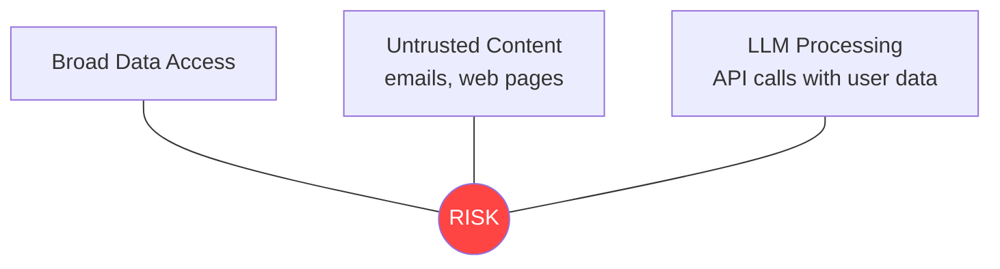

| Vector | Mitigation |
|---|---|
| **Broad data access** | All read-only. Minimum-scope OAuth. Source-level enable/disable. |
| **Untrusted content** | LLM prompts treat all content as data, not instructions. JSON output validation. No code execution from ingested content. |
| **LLM API calls** | Stateless API calls. No training/fine-tuning. Can use local LLM (Ollama) for sensitive content. Per-source LLM routing: sensitive sources → local model, general content → cloud API. |

---

## 18. Privacy Architecture

### 18.1 Data Classification

| Classification | Examples | Processing | Storage |
|---|---|---|---|
| **Sensitive** | Personal emails, financial info, health notes | Local LLM preferred | Encrypted fields (future) |
| **Normal** | Articles, videos, browser history | Cloud or local LLM | Standard storage |
| **Public** | Published articles, public videos | Cloud LLM (cheapest/fastest) | Standard storage |

### 18.2 Local-First Model

```
Default data flow:
  Source → [Local Processing] → [Local Storage]
                ↓ (LLM call only)
          [Cloud API - stateless]
                ↓ (structured JSON returned)
          [Local Processing] → [Local Storage]

With local LLM (Ollama):
  Source → [Local Processing] → [Local LLM] → [Local Storage]
  (No data leaves the machine)
```

### 18.3 User Controls

| Control | Default | Options |
|---|---|---|
| Source enable/disable | Gmail: on, YouTube: on, Calendar: on, Maps: off, Browser: off, Photos: off | Per-source toggle |
| LLM routing | Cloud API | Cloud, local (Ollama), hybrid (sensitive → local, general → cloud) |
| Data retention | Indefinite | Configurable auto-purge by age |
| Export | Always available | Full PostgreSQL pg_dump export, Notion export, Obsidian export |
| Delete | Per-artifact, per-topic, per-source, full wipe | Immediate, irreversible |

---

## 19. Phased Implementation Plan

### Phase Overview

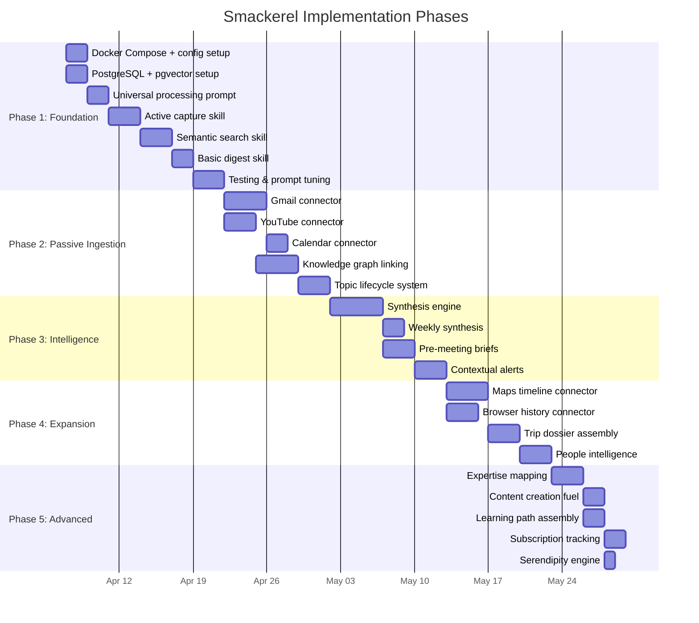

### Phase 1: Foundation (MVP) ✅ Delivered

**Goal:** Active capture + search + basic digest via Go core + Docker Compose.

| Step | Task | Details |
|------|------|---------|
| 1.1 | Set up Docker Compose stack | Go core + PostgreSQL + NATS + Python ML sidecar |
| 1.2 | Create PostgreSQL schema | Tables per §14, pgvector + pg_trgm extensions |
| 1.3 | Build config pipeline | smackerel.yaml → config/generated/*.env |
| 1.4 | Build capture API | Active capture from Telegram + Web UI |
| 1.5 | Build processing pipeline | Universal processing via NATS → ML sidecar |
| 1.6 | Build semantic search | Vector similarity via pgvector + LLM re-ranking |
| 1.7 | Build daily digest | Digest generation + Telegram delivery |
| 1.8 | Connect Telegram bot | Primary active capture + delivery channel |
| 1.9 | Build repo CLI | `./smackerel.sh` for all runtime operations |
| 1.10 | Test with 50 captures | Verify processing, search, digest quality |

**Exit criteria:** Can capture URLs/text from a chat channel. Can find them later with vague queries. Gets a useful daily digest.

### Phase 2: Passive Ingestion ✅ Delivered

**Goal:** Background ingestion from Gmail, YouTube, Calendar. Knowledge graph connections forming.

| Step | Task |
|------|------|
| 2.1 | Build Gmail connector (OAuth2 + Pub/Sub) |
| 2.2 | Build YouTube connector (watch history + transcripts) |
| 2.3 | Build Calendar connector |
| 2.4 | Implement knowledge graph linking (§7.2, Stage 5) |
| 2.5 | Implement topic lifecycle (§11) — emerging/active/hot/cooling/dormant/archived |
| 2.6 | Build cron schedules for all connectors |
| 2.7 | Test 7 days of passive ingestion |

**Exit criteria:** System is silently ingesting emails, videos, and calendar events. Topics are forming, connections are linking. User can search across all source types.

### Phase 3: Intelligence 🔜 In Progress

**Goal:** System generates insights the user wouldn't produce on their own.

| Step | Task |
|------|------|
| 3.1 | Build synthesis engine — cross-domain connection detection |
| 3.2 | Build weekly synthesis digest |
| 3.3 | Build pre-meeting brief generation (calendar → people context → deliver) |
| 3.4 | Build contextual alerts (bill reminders, promise tracking, trip prep) |
| 3.5 | Implement promise/commitment detection from emails |
| 3.6 | Test synthesis quality over 2 weeks |

**Exit criteria:** Weekly synthesis surfaces genuine cross-domain insights. Pre-meeting briefs are useful. Bill reminders are accurate.

### Phase 4: Expansion ✅ Delivered

**Goal:** Location intelligence, browser integration, trip assembly, people intelligence.

| Step | Task |
|------|------|
| 4.1 | Build Maps timeline connector |
| 4.2 | Build browser history connector (optional/opt-in) |
| 4.3 | Build trip dossier auto-assembly |
| 4.4 | Build people intelligence (interaction frequency, relationship radar) |
| 4.5 | Build trail/route journal |

**Exit criteria:** Trip dossiers auto-assemble from email + calendar + saved places. Hike/drive routes are searchable. People context includes interaction patterns.

### Phase 5: Advanced Intelligence ✅ Delivered

**Goal:** Deep self-knowledge, content creation support, advanced patterns.

| Step | Task |
|------|------|
| 5.1 | Build expertise mapping |
| 5.2 | Build content creation fuel (topic → writing angles) |
| 5.3 | Build learning path assembly |
| 5.4 | Build subscription/spending tracking |
| 5.5 | Build serendipity engine (weekly archive resurface) |
| 5.6 | Build energy/productivity pattern detection |
| 5.7 | Build seasonal pattern detection (requires 6mo+ data) |

---

## 20. Operational Runbook

### 20.1 Operational Standards

Smackerel's committed runtime must follow these repo-level operational standards:

1. **Docker-only execution** for development, testing, validation, and deployment
2. **One repo CLI** (`./smackerel.sh`) for build, test, config generation, stack lifecycle, logs, and cleanup
3. **Single source of truth configuration** via `config/smackerel.yaml`
4. **Strict environment isolation** between persistent dev state and disposable test or validation state
5. **Smart cleanup and build freshness** based on project-scoped lifecycle metadata rather than timestamps or `latest` tags

The runtime implementation details for these standards are defined in:

- `docs/Development.md`
- `docs/Testing.md`
- `docs/Docker_Best_Practices.md`

### 20.2 Current Repo State

The foundation runtime scaffold is committed today. Current operational entrypoints are:

- `./smackerel.sh config generate`
- `./smackerel.sh build`
- `./smackerel.sh check`
- `./smackerel.sh lint`
- `./smackerel.sh format`
- `./smackerel.sh test unit`
- `./smackerel.sh test integration`
- `./smackerel.sh test e2e`
- `./smackerel.sh test stress`
- `./smackerel.sh up`
- `./smackerel.sh down`
- `./smackerel.sh status`
- `./smackerel.sh logs`
- `./smackerel.sh clean smart|full|status|measure`

Framework/bootstrap governance remains on the Bubbles validation surface:

- `bash .github/bubbles/scripts/cli.sh doctor`
- `timeout 1200 bash .github/bubbles/scripts/cli.sh framework-validate`
- `bash .github/bubbles/scripts/artifact-lint.sh specs/<feature>`
- `timeout 600 bash .github/bubbles/scripts/traceability-guard.sh specs/<feature>`

Later-phase product capabilities are still incomplete, but the runtime scaffold and its command surface are now present and must be treated as the source of truth for operations.

### 20.3 Planned Health Checks

| Check | How | Frequency |
|-------|-----|-----------|
| API health | `./smackerel.sh status` must confirm Go API healthy | Continuous / on demand |
| Connector sync lag | Observe connector state and last successful sync per source | Automated |
| Queue health | Observe NATS JetStream pending, redelivery, and consumer lag | Automated |
| Database health | Observe PostgreSQL availability, disk growth, and pgvector index health | Automated |
| LLM reachability | Check Ollama or configured LLM gateway health without blocking the rest of the stack | Automated |
| Digest production | Verify scheduled digest generation and delivery succeeded | Automated |
| Cleanup pressure | Report build cache, logs, disposable volumes, and disk thresholds before cleanup escalates | Daily / before builds |

### 20.4 Environment Model

| Environment | Storage model | Purpose |
|-------------|---------------|---------|
| Development | Persistent named volumes | Daily manual development and exploration |
| Test | Disposable `tmpfs` or disposable volumes | Integration and E2E automation |
| Validation | Isolated Compose project + disposable stores | Certification, chaos, and release validation |

Rules:

- Automated tests must never write to the primary dev database or long-lived queue state.
- Validation and chaos must never run on the persistent dev store.
- Test and validation fixtures must be synthetic and disposable.

### 20.5 Recovery And Maintenance

| Task | Frequency | Automated |
|------|-----------|-----------|
| Knowledge graph consistency check | Weekly | Yes |
| Topic lifecycle recalculation | Daily | Yes |
| Sync state cleanup | Weekly | Yes |
| pgvector maintenance and vacuum plan | Monthly | Yes |
| Queue retention review | Monthly | Yes |
| Source qualifier tuning | Monthly | Manual |
| Prompt quality review | Quarterly | Manual |
| Backup and export verification | Weekly | Configurable |

### 20.6 Restart Protocol

After a lapse of any duration:

1. Start or resume the stack through the repo CLI
2. Ask: "What did I miss?" and generate a catch-up summary from stored artifacts
3. Resume passive ingestion and digest generation normally
4. Reuse only runtime state that is proven compatible with the current stack inputs

**There is no backlog. There is no guilt. The system keeps absorbing and organizing the user's digital life.**

---

## 21. Competitive Landscape

### 21.1 Direct Competitors

| Product | Model | Strengths | Weaknesses |
|---------|-------|-----------|------------|
| **Fabric.so** | Cloud SaaS | Self-organizing AI Memory Engine, auto-tagging, multi-format (PDF/video/audio), MCP integration, Chrome extension, iOS/Android apps, team collaboration, AES-256 encryption | Cloud-only (no self-hosting), no passive email/calendar ingestion, requires manual capture, no daily digest or cross-domain synthesis |
| **Mem.ai** | Cloud SaaS | Voice notes auto-organized, meeting transcription, "Heads Up" related context surfacing, semantic search, Chrome extension, SOC 2 Type II | Cloud-only, no passive ingestion, no knowledge graph visualization, no location intelligence, no synthesis engine |
| **Recall (getrecall.ai)** | Cloud + local browsing | Summarize any content (YouTube/podcasts/PDFs/Google Docs), knowledge graph, spaced repetition, augmented browsing (local-first), 500K+ users | No passive email/calendar ingestion, no synthesis engine, no daily digest, no location/travel intelligence, cloud storage for knowledge base |
| **Khoj** | Open-source, self-hostable | Open-source (AGPL-3.0), self-hostable via Docker, AI second brain, agents, scheduled automations, works with docs, 33.9k GitHub stars, Python + pgvector | Narrower scope (docs + web search), no passive email/YouTube ingestion layer, no knowledge graph with topic lifecycle, no multi-channel surfacing, no synthesis engine |
| **Raindrop.io** | Cloud SaaS | Excellent bookmark management, full-text search, web archive, clean UI, open-source clients, API | Bookmarks only — no email, video transcripts, synthesis, knowledge graph, AI processing, or passive ingestion |
| **Limitless (ex-Rewind)** | Cloud + hardware pendant | Ambient capture via wearable pendant, meeting transcription, AI-powered recall | Acquired by Meta (2025), sunsetting non-pendant features, no longer selling to new customers, privacy concerns under Meta ownership |

### 21.2 Indirect Competitors

| Product | Overlap | Smackerel Advantage |
|---------|---------|---------------------|
| **Obsidian** | Notes + knowledge graph | Smackerel is passive-first; Obsidian requires manual note-taking and organization |
| **Notion** | Workspace + knowledge management | Smackerel doesn't require taxonomy at capture time; Notion demands structure upfront |
| **Readwise/Reader** | Article + highlight management | Smackerel covers all content types and adds synthesis; Readwise is reading-only |
| **Google Keep / Apple Notes** | Quick capture | No AI processing, no connections, no synthesis, no passive ingestion |

### 21.3 Competitive Differentiation Matrix

| Capability | Smackerel | Fabric | Mem | Recall | Khoj | Obsidian |
|-----------|-----------|--------|-----|--------|------|----------|
| Passive email ingestion | ✅ | ❌ | ❌ | ❌ | ❌ | ❌ |
| Passive YouTube ingestion | ✅ | ❌ | ❌ | ❌ | ❌ | ❌ |
| Passive calendar ingestion | ✅ | ❌ | Partial | ❌ | ❌ | ❌ |
| Active capture (any channel) | ✅ | ✅ | ✅ | ✅ | ✅ | Manual |
| AI processing (summary/entities) | ✅ | ✅ | ✅ | ✅ | ✅ | Plugin |
| Knowledge graph | ✅ | ✅ | ❌ | ✅ | ❌ | ✅ (manual) |
| Topic lifecycle (hot/cooling/dormant) | ✅ | ❌ | ❌ | ❌ | ❌ | ❌ |
| Cross-domain synthesis | ✅ | ❌ | ❌ | ❌ | ❌ | ❌ |
| Daily/weekly digest | ✅ Daily / 🔜 Weekly | Recap | ❌ | ❌ | ❌ | ❌ |
| Pre-meeting briefs | 🔜 | ❌ | ❌ | ❌ | ❌ | ❌ |
| Self-hostable (Docker) | ✅ | ❌ | ❌ | ❌ | ✅ | Local files |
| Local-first / own your data | ✅ | ❌ | ❌ | Partial | ✅ | ✅ |
| Compiled / high-performance | ✅ (Go) | ❌ | ❌ | ❌ | ❌ (Python) | ❌ |
| Semantic search | ✅ | ✅ | ✅ | ✅ | ✅ | Plugin |
| Location/travel intelligence | ✅ Maps / 🔜 Trip dossiers | ❌ | ❌ | ❌ | ❌ | ❌ |
| Multi-channel delivery | ✅ Telegram + Web / 🔜 Slack, Discord | Web/mobile | Web/mobile | Web/ext | Web | Desktop |
| Spaced repetition | ❌ (future) | ❌ | ❌ | ✅ | ❌ | Plugin |

### 21.4 Unique Value Proposition

**No competitor combines all three:**

1. **Passive-first ingestion** — system observes email, YouTube, calendar without user doing anything
2. **Cross-domain synthesis** — finds connections across different sources that users would never see manually
3. **Self-hosted, compiled, high-performance** — your data never leaves your machine, runs in Docker on modest hardware, Go core handles thousands of artifacts per second

This is Smackerel's moat. Every competitor is either cloud-only, manual-capture-only, Python-slow, or doesn't synthesize across domains.

---

## 22. Connector Ecosystem & Reuse

### 22.1 Design Principle

All connectors are built from **proven, well-maintained open-source libraries** with strong community support. No custom protocol implementations. Go libraries for all I/O-bound connectors; Python only where no Go alternative exists (YouTube transcripts, ML inference).

### 22.2 Email Connectors

| Source | Library | Language | License | Stars/Maturity | Notes | Status |
|--------|---------|----------|---------|----------------|-------|--------|
| Generic IMAP | `github.com/emersion/go-imap` (v2) | Go | MIT | 2.1k stars, active | Works with Gmail, Fastmail, ProtonMail Bridge, self-hosted. Primary email connector. | ✅ Committed |
| Gmail | `google.golang.org/api/gmail/v1` | Go | Apache 2.0 | Official Google SDK | OAuth2, label filtering, Pub/Sub push support. Currently served by IMAP connector. | 🔜 Planned (SDK upgrade) |
| Outlook / O365 | `github.com/microsoftgraph/msgraph-sdk-go` | Go | MIT | Official Microsoft SDK | Covers mail + calendar + Teams in one SDK | 🔜 Planned |

### 22.3 Calendar Connectors

| Source | Library | Language | License | Stars/Maturity | Notes | Status |
|--------|---------|----------|---------|----------------|-------|--------|
| CalDAV (Nextcloud, iCloud, Google, self-hosted) | `github.com/emersion/go-webdav` | Go | MIT | Active, same author as go-imap | RFC4791-compliant, covers any CalDAV server including Google Calendar | ✅ Committed |
| Google Calendar | `google.golang.org/api/calendar/v3` | Go | Apache 2.0 | Official Google SDK | Currently served by CalDAV connector | 🔜 Planned (SDK upgrade) |
| Outlook Calendar | `msgraph-sdk-go` (same as above) | Go | MIT | Official Microsoft SDK | Calendar endpoints via Graph API | 🔜 Planned |

### 22.4 Chat & Messaging Connectors

| Source | Library | Language | License | Stars/Maturity | Notes | Status |
|--------|---------|----------|---------|----------------|-------|--------|
| Telegram | `github.com/go-telegram-bot-api/telegram-bot-api` | Go | MIT | 6k stars, active | Async, doubles as capture + delivery bot | ✅ Committed |
| Discord | `github.com/bwmarrin/discordgo` | Go | BSD-3 | 5k stars, active | Read channels, threads, attachments | ✅ Committed |
| Slack | `github.com/slack-go/slack` | Go | MIT | 5k stars, very active | Web API, Socket Mode, Events API | 🔜 Planned |
| Microsoft Teams | `msgraph-sdk-go` (same SDK) | Go | MIT | Official Microsoft SDK | Teams messages via Graph API, no separate lib | 🔜 Planned |

### 22.5 Notes & Knowledge Source Connectors

| Source | Library | Language | License | Stars/Maturity | Notes | Status |
|--------|---------|----------|---------|----------------|-------|--------|
| Google Keep | Custom Go connector | Go | N/A | Internal implementation | API client for Keep notes, labels, sync | ✅ Committed |
| Notion | `github.com/jomei/notionapi` | Go | MIT | 500+ stars | Full Notion API coverage | 🔜 Planned |
| Obsidian | Filesystem read (Go `os` package) | Go | N/A | Native | Mount vault as Docker volume, parse `.md` files | 🔜 Planned |
| Apple Notes | ❌ Not viable | — | — | — | No public API. Locked to macOS SQLite DB. Recommend users export to Obsidian or Notion. | N/A |

### 22.6 Content Extraction

| Source | Library | Language | License | Stars/Maturity | Notes |
|--------|---------|----------|---------|----------------|-------|
| Web articles | `github.com/go-shiori/go-readability` | Go | MIT | 200+ stars | Port of Mozilla's Readability.js. Extracts main content from any web page. |
| Web articles (fallback) | `trafilatura` | Python (ML sidecar) | Apache 2.0 | Best-in-class, used by HuggingFace/IBM/Microsoft Research | Fallback for pages where go-readability struggles |
| YouTube transcripts | `youtube-transcript-api` | Python (ML sidecar) | MIT | No mature Go alternative exists | Fetches auto-generated + manual transcripts without browser |
| RSS / Podcasts | `github.com/mmcdole/gofeed` | Go | MIT | 2.5k stars | Universal RSS/Atom/JSON Feed parser. Pair with Whisper for audio. |
| PDF text | `github.com/ledongthuc/pdf` or `pdfcpu` | Go | MIT | Active | Extract text from PDFs natively in Go |

### 22.7 Committed Connector Inventory (15 connectors)

All 15 connectors are implemented under `internal/connector/` in Go:

| # | Connector | Directory | Category | Description |
|---|-----------|-----------|----------|-------------|
| 1 | Government Alerts | `alerts/` | Environmental | Weather, earthquake, tsunami — contextual safety alerts |
| 2 | Bookmarks | `bookmarks/` | Web | Browser bookmark ingestion and sync |
| 3 | Browser History | `browser/` | Web | Browsing history with dwell-time-based processing |
| 4 | CalDAV | `caldav/` | Calendar | RFC4791-compliant calendar sync (Google, iCloud, Nextcloud) |
| 5 | Discord | `discord/` | Chat | Channel/thread/attachment ingestion via discordgo |
| 6 | GuestHost | `guesthost/` | STR | Property management activity feed, booking events, guest communications |
| 7 | Hospitable | `hospitable/` | STR | Short-term rental reservation knowledge, guest communications, multi-OTA aggregation |
| 8 | IMAP | `imap/` | Email | Generic email ingestion via go-imap v2 (Gmail, Fastmail, self-hosted) |
| 9 | Google Keep | `keep/` | Notes | Notes, labels, and sync state from Google Keep |
| 10 | Google Maps | `maps/` | Location | Timeline, saved places, routes, activity tracking |
| 11 | Financial Markets | `markets/` | Finance | Market data, watchlist items, price tracking |
| 12 | RSS / Podcasts | `rss/` | Content | RSS/Atom/JSON Feed parsing via gofeed |
| 13 | Twitter / X | `twitter/` | Social | Tweet and thread ingestion |
| 14 | Weather | `weather/` | Environmental | Local weather data for location context and trail enrichment |
| 15 | YouTube | `youtube/` | Video | Watch history, liked videos, transcript fetching |

### 22.8 Connector Framework Assessment

We evaluated four connector frameworks for potential reuse:

| Framework | Stars | License | Verdict |
|-----------|-------|---------|---------|
| **Airbyte** (600+ connectors) | 21k | Elastic License v2 | ❌ **Skip.** Not truly open source (Elastic License). Heavyweight — full platform with UI, metadata DB, scheduler. Overkill for single-user system. |
| **Meltano / Singer** (600+ taps) | 2.4k | MIT | ⚠️ **Possible.** Singer taps are standalone Python packages (`pip install`). Could import specific taps without running full platform. But adds Python dependency per connector. |
| **Nango** (700+ APIs) | 7k | Elastic License | ❌ **Skip.** Not truly open source. TypeScript-native, not Python or Go. Designed for SaaS product integrations, not personal ingestion. |
| **n8n** (400+ integrations) | 183k | Sustainable Use License | ❌ **Skip.** Not truly open source (Sustainable Use License). TypeScript. Could be complementary orchestrator but adds operational complexity. |

**Decision:** Use individual Go/Python libraries directly. The Go ecosystem has official SDKs from Google, Microsoft, and community libraries for every source we need. No framework dependency required.

### 22.9 Reference: Khoj Architecture

**Khoj** (33.9k GitHub stars, AGPL-3.0) is the closest existing open-source project. Key architecture observations:

- Python backend (50.7% of codebase) with Django
- Uses PostgreSQL + pgvector for structured data + vector search
- Ingests: Markdown, PDF, Notion, Org-mode, Word docs
- Semantic search + LLM chat across ingested content
- Obsidian plugin for bidirectional sync
- Self-hostable via Docker Compose

**Smackerel differentiates from Khoj by:**
- Passive email/calendar/YouTube ingestion (Khoj doesn't ingest these)
- Cross-domain synthesis engine (Khoj doesn't find connections across sources)
- Topic lifecycle with momentum scoring (Khoj doesn't model knowledge evolution)
- Go core for high-performance compiled execution (Khoj is Python/Django)
- Multi-channel delivery — Telegram, Slack, Discord, not just web UI

---

## 23. Technology Stack Decision

### 23.1 Design Constraints

All technology choices must satisfy:

1. **Fully open source** — Apache 2.0, MIT, BSD, or PostgreSQL License only. No Elastic License, SSPL, or "source available" projects.
2. **Strong community** — active development, responsive maintainers, >1k GitHub stars or official vendor SDK
3. **Proven at scale** — used in production by large organizations
4. **Compiled / high-performance** — Go or Rust for core services; Python only where no compiled alternative exists (ML inference, YouTube transcripts)

In addition to technology selection, the runtime implementation must satisfy the operational contract documented in `docs/Development.md`, `docs/Testing.md`, and `docs/Docker_Best_Practices.md`.

### 23.2 Core Language: Go

| Factor | Go |
|--------|-----|
| Performance | 10-50x faster than Python, compiled to single binary |
| Concurrency | Goroutines — built for I/O-heavy services (polling APIs, processing pipelines) |
| Ecosystem | Docker, Kubernetes, Prometheus, Traefik, NATS, Ollama — all Go |
| Community | Massive, Google-backed, 20+ years of production use |
| Deployment | Single static binary, tiny Docker images (~20 MB) |
| LLM/ML gap | Thin — compensated by Python ML sidecar over NATS |

### 23.3 Full Technology Stack

| Layer | Technology | Language | License | Stars / Scale Proof |
|-------|-----------|----------|---------|---------------------|
| **Core service** | Custom (Chi router) | Go | MIT | Go runs Docker, K8s, half the cloud |
| **ML sidecar** | Custom (FastAPI) | Python | MIT | Only for embeddings + LLM calls (~5% of codebase) |
| **Database** | PostgreSQL + pgvector | C | PostgreSQL License | 40 years proven, billions of rows, pgvector 14k stars |
| **Message bus** | NATS JetStream | Go | Apache 2.0 | 17k stars. Tesla, Huawei, Ericsson. |
| **Local LLM** | Ollama | Go | MIT | 120k+ stars. Industry standard for local model serving. |
| **Cloud LLM** | Claude / GPT / Gemini via litellm | Python (sidecar) | MIT | Unified gateway, model failover |
| **Local embedding** | all-MiniLM-L6-v2 (sentence-transformers) | Python (sidecar) | Apache 2.0 | 80 MB model, zero API key needed |
| **Article extraction** | go-readability | Go | MIT | Mozilla Readability port |
| **RSS / Podcasts** | gofeed | Go | MIT | 2.5k stars |
| **Transcription** | Whisper (via Ollama or whisper.cpp) | C++ / Go | MIT | OpenAI's model, local execution |
| **Reverse proxy** | Traefik | Go | MIT | 53k stars, Docker-native |
| **Observability** | OpenTelemetry | Go SDK | Apache 2.0 | CNCF standard |
| **Metrics** | Prometheus + Grafana | Go | Apache 2.0 | 60k + 67k stars |

### 23.4 Architecture: Go Monolith + Python ML Sidecar

```
docker-compose.yml
├── smackerel-core (Go)            # API + connectors + scheduler + knowledge graph
│   ├── HTTP API (Chi)
│   │   ├── POST /api/capture      # Active capture
│   │   ├── POST /api/search       # Semantic search
│   │   ├── GET  /api/digest       # Daily/weekly digest
│   │   └── GET  /api/health       # Health check
│   ├── Connector plugins (15 committed)
│   │   ├── Gov Alerts (alerts/)
│   │   ├── Bookmarks (bookmarks/)
│   │   ├── Browser History (browser/)
│   │   ├── CalDAV (caldav/ — go-webdav)
│   │   ├── Discord (discord/ — discordgo)
│   │   ├── GuestHost (guesthost/)
│   │   ├── Hospitable (hospitable/)
│   │   ├── IMAP Email (imap/ — go-imap v2)
│   │   ├── Google Keep (keep/)
│   │   ├── Google Maps (maps/)
│   │   ├── Financial Markets (markets/)
│   │   ├── RSS/Podcasts (rss/ — gofeed)
│   │   ├── Twitter/X (twitter/)
│   │   ├── Weather (weather/)
│   │   └── YouTube (youtube/)
│   │   Planned connectors:
│   │   ├── Gmail SDK (google-api-go) 🔜
│   │   ├── Google Calendar SDK (google-api-go) 🔜
│   │   ├── Outlook/Teams (msgraph-sdk-go) 🔜
│   │   ├── Slack (slack-go) 🔜
│   │   ├── Notion (notionapi) 🔜
│   │   └── Obsidian (filesystem) 🔜
│   ├── Content extraction (go-readability)
│   ├── Knowledge graph engine
│   ├── Topic lifecycle & momentum scoring
│   ├── Digest assembly
│   ├── Synthesis orchestration
│   └── NATS publisher → ML sidecar
│
├── smackerel-ml (Python, slim)    # ONLY embedding + LLM inference
│   ├── sentence-transformers      # Local embedding (all-MiniLM-L6-v2)
│   ├── litellm                    # Unified LLM gateway (Claude/GPT/Ollama)
│   ├── youtube-transcript-api     # YouTube transcript fetching
│   ├── trafilatura                # Fallback article extraction
│   └── NATS subscriber            # Receives work, returns vectors/completions
│
├── postgres (with pgvector)       # Structured data + vector search (single DB)
├── nats                           # Async message passing between Go ↔ Python
├── ollama (optional)              # Local LLM serving
│
└── volumes
    └── ./data/
        ├── postgres/              # PostgreSQL data directory
        └── ollama/                # Local model weights
```

### 23.5 Why Not Microservices (Yet)

The monolith + sidecar pattern is chosen for MVP because:

- **Single Go binary** is simpler to deploy, debug, and reason about
- **NATS** cleanly decouples the Go core from the Python ML sidecar without service mesh complexity
- **PostgreSQL + pgvector** handles both structured storage and vector search — no separate vector DB container
- When scale demands it, the Go monolith can be split along connector/search/synthesis boundaries

### 23.6 Production Scale Path

When the MVP outgrows the monolith:

| Trigger | Action |
|---------|--------|
| pgvector search >500ms at 10M+ vectors | Add Milvus (Go + C++, Apache 2.0, CNCF, 35k stars) as dedicated vector engine |
| Connector scheduling needs durability | Add Temporal (Go, MIT, 13k stars, used by Netflix/Snap) for workflow orchestration |
| Need caching layer | Add Valkey (C, BSD-3, 20k stars, Linux Foundation Redis fork) |
| Full-text search beyond Postgres | Add Meilisearch (Rust, MIT, 50k stars) for typo-tolerant instant search |

### 23.7 Vector DB Comparison (Decision Record)

| | **pgvector** (chosen) | **Milvus** (scale path) | **Qdrant** | **ChromaDB** |
|---|---|---|---|---|
| Language | C (PG extension) | Go + C++ | Rust | Python |
| License | PostgreSQL (MIT-like) | Apache 2.0 | Apache 2.0 | Apache 2.0 |
| Stars | 14k | 35k | 30k | 27k |
| Backing | Supabase, Neon | CNCF, Zilliz | YC-backed | — |
| Scale proven | Billions (Postgres) | Billions (Shopee, eBay) | ~100M vectors | ~10M vectors |
| Extra container | ❌ No (PG extension) | ✅ Yes | ✅ Yes | ✅ Yes |
| Hybrid search | ✅ SQL + vectors | ✅ Native | ✅ Native | ⚠️ Limited |

**Decision:** pgvector for MVP (zero extra container, Postgres handles everything). Milvus as scale-path when >10M vectors (CNCF pedigree, proven at Shopee/eBay/Salesforce scale).

### 23.8 Cost Estimate (Fully Open Source)

| Service | Usage | Monthly Cost |
|---------|-------|-------------|
| All infrastructure (Docker self-hosted) | Postgres, NATS, Go core, Python sidecar | $0 |
| Ollama (local LLM) | All processing + synthesis | $0 |
| Local embeddings (all-MiniLM-L6-v2) | All embeddings | $0 |
| Gmail API | Free tier (10,000 queries/day) | $0 |
| YouTube Data API | Free tier (10,000 units/day) | $0 |
| Google Calendar API | Free tier | $0 |
| **Total (fully local)** | | **$0/mo** |
| **Total (with cloud LLM)** | Claude/GPT API for higher quality | **~$15-30/mo** |

---

## 24. Appendix

### A. Technology Stack (Summary)

| Layer | Technology | Rationale |
|-------|-----------|-----------|
| Core Runtime | Go (Chi) | Compiled, high-performance, single binary, goroutine concurrency |
| ML Sidecar | Python (FastAPI) | Embedding + LLM inference only, <5% of codebase |
| Database | PostgreSQL + pgvector | 40-year proven track record, structured + vector in one DB |
| Message Bus | NATS JetStream | Go-native, Apache 2.0, proven at Tesla/Ericsson scale |
| Local LLM | Ollama | Go, MIT, 120k+ stars, industry standard |
| Cloud LLM | Claude / GPT / Gemini via litellm | Unified gateway with model failover |
| Local Embedding | all-MiniLM-L6-v2 | 80 MB, zero-config, Apache 2.0 |
| Content Extraction | go-readability | Mozilla Readability port, Go, MIT |
| RSS / Podcasts | gofeed | Go, MIT, 2.5k stars |
| YouTube Transcripts | youtube-transcript-api | Python (sidecar), MIT |
| Article Fallback | trafilatura | Python (sidecar), Apache 2.0 |
| Transcription | Whisper via Ollama | Local, MIT |
| Reverse Proxy | Traefik | Go, MIT, 53k stars |
| Observability | OpenTelemetry + Prometheus + Grafana | CNCF standard |

### B. Cost Estimate

| Service | Usage | Monthly Cost |
|---------|-------|-------------|
| All infrastructure (self-hosted) | Docker Compose | $0 |
| Ollama (local LLM) | Processing + synthesis | $0 |
| Local embeddings | sentence-transformers | $0 |
| Google APIs (Gmail, Calendar, YouTube) | Free tier | $0 |
| **Total (fully local)** | | **$0/mo** |
| **Total (with cloud LLM)** | Claude/GPT API optional | **~$15-30/mo** |

### C. Glossary

| Term | Definition |
|------|-----------|
| **Smackerel** | The project. Also: the daily digest ("your morning smackerel"). A little taste of honey — just enough of the right knowledge at the right time. |
| **Artifact** | Any piece of knowledge in the system: article, video, email, idea, product, person, place, book, recipe, bill, trip, trail, note, event |
| **Knowledge Graph** | The web of connections between all artifacts, people, topics, and places |
| **Topic Momentum** | A score reflecting how actively a topic is being captured and engaged with |
| **Synthesis** | The process of finding non-obvious connections across artifacts from different sources/domains |
| **Source Qualifier** | Metadata from the source system (Gmail labels, YouTube completion rate, etc.) that improves processing priority |
| **Processing Tier** | Full / Standard / Light / Metadata — depth of processing based on importance signals |
| **Lifecycle** | The automatic promotion/demotion cycle: Emerging → Active → Hot → Cooling → Dormant → Archived |
| **Dossier** | An aggregated view (e.g., trip dossier with all travel-related artifacts) |
| **Serendipity** | Weekly resurface of a random old archived item to prevent good ideas from being buried forever |
| **Smackerel Core** | The main Go runtime service (`smackerel-core`) — API, connectors, scheduler, knowledge graph |
| **Ingestion Layer** | Background connector subsystem that polls and processes source systems on a cron schedule |
| **Synthesis Engine** | Intelligence subsystem that detects patterns and generates cross-domain insights |

### D. Migration from v1 Design

| v1 Concept | v2 Equivalent | Change |
|---|---|---|
| 4 fixed buckets (people/project/idea/admin) | Open artifact type system (15+ types) | Flexible instead of rigid |
| Raw text filing | Processed artifacts with summary, entities, connections | Knowledge, not data |
| Slack-only capture | Multi-channel capture (Telegram, Discord, Web UI) + passive ingestion | Capture everything, not just thoughts |
| Zapier automation | Go cron scheduler + NATS async processing | More powerful, local, no third-party dependency |
| Notion storage | PostgreSQL + pgvector (local, Docker volume) | Own your data, semantic search |
| Keyword search | Vector semantic search + knowledge graph | Find things with vague queries |
| Daily digest | Daily smackerel + contextual alerts + pre-meeting briefs | Right info at right time, not just scheduled dumps |
| Classification prompt | Universal processing prompt | Handles any content type |
| Fix button | Natural language correction in any channel | Same concept, more natural |
| Memory evolution (YAML files) | Knowledge graph with topic lifecycle + synthesis engine | Living, breathing knowledge that evolves |

---

*"It is more fun to talk with someone who doesn't use long, difficult words but rather short, easy words like 'What about lunch?'" — Winnie-the-Pooh*

*End of Design Document v2*
