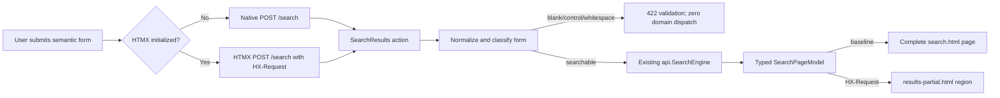

# Technical Design: [BUG-002-006] Secure Progressive Search Submission

## Design Brief

### Current State

`internal/web/templates.go::head` loads HTMX 1.9.12 from `unpkg.com` with a
declared SHA-384 value that does not match the browser-delivered bytes. The
browser therefore refuses to execute HTMX. `search.html` then exposes only a
standalone `<input>` whose `hx-post`, `hx-trigger`, `hx-target`, and
`hx-indicator` attributes own the entire submission path; it has no semantic
`<form>`, `action`, `method`, or submit control, so a blocked enhancement makes
Search inert.

The current enhanced trigger also combines delayed input submission with an
Enter-key trigger. That creates two potential requests for one user intent even
after the integrity defect is corrected. `internal/web/handler.go::SearchResults`
already owns `POST /search`, but always emits a fragment and collapses server
search failures into a generic rendered block without an HTTP/state contract.

### Target State

Search is a complete server-rendered POST workflow first. A labeled query field
and submit button live in `<form method="post" action="/search">`; this path
works when JavaScript is disabled, HTMX is blocked, or the enhancement fails to
initialize. HTMX may enhance that same form, but never owns validation,
submission eligibility, query preservation, or the terminal outcome.

The enhancement is served from Smackerel's own origin as immutable, reviewed
bytes resolved through the repository's locked dependency source. Production
CSP returns to `script-src 'self'` plus only the already-approved inline hashes;
there is no runtime CDN dependency and no broad source expression. Full-page
and HTMX fragment responses project the same typed `SearchPageModel` state.

Both browser paths may submit an invalid form to the HTTP boundary, but one
pre-dispatch normalization gate classifies empty, Unicode-whitespace-only,
control-only, and mixed whitespace/control input before `api.SearchEngine` or
any search-domain dependency is called. The gate returns the same accessible
validation semantics in a complete page or HTMX fragment. A browser-side
required-field check is an ergonomic optimization, not the proof of zero domain
work.

### Patterns To Follow

- `internal/api/router.go`: one registered `POST /search` route inside
	`webAuthMiddleware`; authentication remains router-owned.
- `internal/web/handler.go::SearchResults`: one server action delegates to the
	existing `api.SearchEngine`; no second ranking/search implementation.
- `internal/api/auth_browser_redirect.go`: HTMX requests receive 401 rather
	than top-level redirects, while baseline browser navigation can use the
	existing safe login redirect.
- `web/pwa/drive-search.js` and `internal/api/search.go`: existing search
	request/result semantics remain the business-data source; the legacy page is
	a projection, not a new search engine.

### Patterns To Avoid

- The current `search.html` standalone HTMX input is not a baseline form and
	must not remain the submission owner.
- The current unpkg runtime load in `templates.go::head` bypasses the desired
	same-origin/source-lock boundary and must not remain active.
- `internal/web/handler_test.go::TestSCN002033_WebSearchPage` currently proves
	only that `hx-post` text exists. Presence-only markup checks cannot validate
	operability.
- `tests/e2e/test_web_ui.sh` calls `/search` directly and cannot prove browser
	SRI execution, baseline form submission, request cardinality, or DOM states.

### Resolved Decisions

- The semantic form is authoritative; HTMX enhances the form's `submit` event.
- Explicit submission replaces input-change autosubmit. Enter and pointer both
	invoke the browser's one form-submit algorithm.
- HTMX is same-origin and source-locked; no CSP/SRI weakening is allowed.
- A small same-origin `search-enhancement.js` observes HTMX lifecycle events for
	loading, timeout, network, and response-error presentation; it never submits
	the form itself.
- The server uses one closed result-state model for full pages and fragments.
- Blank-input correctness is a server invariant: HTTP validation is allowed,
	while SearchEngine, knowledge matching, ML, NATS, PostgreSQL search, graph
	expansion, and reranking execute zero times.
- A production-safe dispatch counter and an injected counting executor at the
	handler boundary provide zero-domain-work test hooks; neither can select or
	induce a fault.
- Raw query text, result excerpts, and dependency error text are excluded from
	logs, metrics, and live-region status messages.
- No database schema, search ranking, or API route migration is required.

### Open Questions

None. The disposable-stack failure mechanisms, isolation, and expected
request/response contracts are defined in this design.

## Purpose And Scope

This design repairs the server-rendered Search route at `/` and its action at
`POST /search`. It owns the markup, enhancement delivery, request lifecycle,
response projection, security headers, non-sensitive telemetry, and focused
regression boundaries. It does not alter the ranking algorithm in
`api.SearchEngine`, the JSON `POST /api/search` contract, artifact persistence,
or unrelated HTMX screens except where the shared script source must become
same-origin.

## Root Cause Analysis

### Confirmed Root Cause

The defect is the conjunction of three concrete conditions:

1. `internal/web/templates.go::head` declares
	 `https://unpkg.com/htmx.org@1.9.12` with an incompatible SHA-384 integrity
	 value, so conforming browsers block the script before HTMX initializes.
2. `templates.go::search.html` uses a standalone search input with only HTMX
	 attributes. Without HTMX there is no native submit event or action, which
	 explains the observed zero `/search` requests.
3. The enhanced input declares both
	 `input changed delay:300ms` and `keyup[key=='Enter']`. Once the script loads,
	 one typed query followed by Enter can satisfy both triggers and violate the
	 exactly-once contract.

The server route itself exists: `internal/api/router.go` registers
`r.Post("/search", deps.WebHandler.SearchResults)`, and
`internal/web/handler.go::SearchResults` reads `r.FormValue("query")`. The
failure is therefore at dependency delivery and browser event ownership, not
route absence or search-engine wiring.

### Blast Radius

The shared `head` template is consumed by Search, Digest, Topics, Settings,
Status, Knowledge, recommendation, notification, and admin server-rendered
pages. Changing the HTMX source is a shared-infrastructure edit. The canary set
must therefore include one read-only HTMX screen and one mutation screen in
addition to Search before broad browser validation. No template may silently
gain a second copy of HTMX or a different version.

## Architecture Overview



### Owning Code Paths

| Concern | Current Owner | Required Design Change |
|---|---|---|
| Shared script declaration | `internal/web/templates.go::head` | Replace external URL with one same-origin immutable asset URL; keep one script declaration. |
| Asset bytes and provenance | `internal/web` embedded-static surface | Add the pinned HTMX bytes and a build/test-verifiable source digest resolved from the locked package source. |
| Static route | `internal/api/router.go` plus the `internal/web` asset handler | Serve the exact embedded asset under `/web-assets/htmx-1.9.12.min.js` with JavaScript content type, `nosniff`, and immutable cache identity. |
| CSP | `internal/api/router.go::securityHeadersMiddleware` | Remove `unpkg.com`; allow `'self'` and the existing reviewed inline hashes only. |
| Baseline/enhanced form | `internal/web/templates.go::search.html` | Use one semantic form; place HTMX attributes on the form, not the input; target the state region. |
| Browser lifecycle states | New focused `internal/web` embedded `search-enhancement.js` | Observe HTMX lifecycle events, disable/re-enable the submit action, and render only browser-owned loading/network/timeout states; no fetch or submit implementation. |
| Request and state mapping | `internal/web/handler.go::SearchResults` | Parse/normalize once, return validation before domain dispatch, otherwise call `SearchEngine` once, build one typed model, and select full-page or fragment rendering from request class. |
| Domain dispatch proof | Narrow `SearchExecutor` boundary plus search dispatch telemetry | Production adapts the existing `*api.SearchEngine`; tests count attempted dispatches. The production counter increments immediately before the real call and contains only `mode` and `outcome`, never query text. |
| Result projection | `search.html` and `results-partial.html` | Render the same closed state vocabulary and preserve query/form state. |

## Source-Locked Enhancement Contract

The HTMX bytes are build inputs, not a runtime CDN lookup. The implementation
must resolve the exact 1.9.12 artifact through the repository's pinned npm
registry and lockfile, then commit or embed the verified browser asset through
the existing build process. The source-lock check compares the embedded bytes
to the lock-derived digest. It must fail when either the bytes or declared
digest changes independently.

The browser script URL is `/web-assets/htmx-1.9.12.min.js`. The version in the
path prevents mutable-cache ambiguity. The response uses:

- `Content-Type: text/javascript; charset=utf-8`
- `X-Content-Type-Options: nosniff`
- `Cache-Control: public, max-age=31536000, immutable`
- a strong content-derived `ETag`

The script tag may retain an integrity attribute as defense in depth, but that
value is generated/verified from the same embedded bytes and cannot be a
hand-maintained independent constant. `crossorigin` is unnecessary for a
same-origin asset. Removing integrity, adding `unsafe-eval`, allowing an open
CDN host, or fetching an unpinned script at runtime is outside the accepted
design.

## Progressive Enhancement Contract

The authoritative markup shape is:

```html
<form method="post" action="/search" role="search"
			hx-post="/search" hx-target="#search-outcome"
			hx-indicator="#search-spinner" hx-swap="innerHTML">
	<label for="search-query">Search your knowledge</label>
	<input id="search-query" name="query" type="search" required>
	<button type="submit">Search</button>
</form>
```

No custom key listener is needed. Native Enter and pointer activation produce
the same single submit event. HTMX's normal form interception replaces, rather
than supplements, native navigation. During an enhanced request the form is
marked busy and its submit control is disabled by `search-enhancement.js` in
response to `htmx:beforeRequest`; `htmx:afterRequest`, `htmx:responseError`,
`htmx:sendError`, and `htmx:timeout` restore the control and project the matching
safe state. The hook does not call `fetch`, `requestSubmit`, or HTMX request APIs.
The server remains idempotent with respect to reads, but the browser contract is
still exactly one request per explicit submission.

With no enhancement, `POST /search` returns a complete HTML document containing
the retained query and terminal state. With `HX-Request: true`, it returns only
the `#search-outcome` projection. Both paths use the same handler invocation and
view model. The server does not infer enhancement from user-agent, JavaScript
cookies, or query flags.

## Request And Response Contracts

### Pre-Dispatch Input Gate

`SearchResults` performs these steps before constructing `api.SearchRequest`:

1. Parse the bounded form body once.
2. Normalize the query by trimming leading and trailing Unicode code points for
	which `unicode.IsSpace` or `unicode.IsControl` is true.
3. Scan the normalized value and reject it as blank when no remaining rune is
	neither whitespace nor control. A value containing a visible/searchable rune
	remains intact apart from the edge trim; the server does not silently delete
	interior control characters and must reject any interior control sequence
	that violates the canonical Search request validator.
4. On blank classification, build `SearchValidation`, return HTTP 422, and stop
	before knowledge matching, SearchEngine, ML health, embedding, NATS,
	PostgreSQL text/vector search, graph expansion, or reranking.
5. On searchable input, increment the bounded domain-dispatch counter exactly
	once immediately before calling the existing SearchEngine once.

The handler depends on a narrow `SearchExecutor` interface with the existing
`Search` signature. Production injects the real `*api.SearchEngine`; focused
unit tests inject a counting executor that fails the test if called for a blank
case. Live integration and browser tests use the real engine and compare the
dispatch counter/span delta for the request correlation window. These are
observation seams only: there is no runtime parameter, header, cookie, query,
route, or UI control that changes Search behavior for a test.

### Form Request

| Field | Type | Rule |
|---|---|---|
| `query` | UTF-8 form string | Required after Unicode whitespace/control edge normalization; blank/control-only/whitespace-only input produces validation and zero search-domain dispatch. |

Existing supported filter fields may be added only when they map directly to
the canonical `api.SearchRequest` filter contract. Unknown fields do not gain
business meaning. Query and filters are retained in the rendered form after a
terminal outcome but are not placed in login return metadata.

### Typed View Model

`internal/web` should replace untyped `map[string]interface{}` state for this
surface with a concrete projection:

```go
type SearchState string

const (
		SearchReady        SearchState = "ready"
		SearchValidation   SearchState = "validation"
		SearchResults      SearchState = "results"
		SearchEmpty        SearchState = "empty"
		SearchFilteredEmpty SearchState = "filtered_empty"
		SearchDegraded     SearchState = "degraded"
		SearchUnauthorized SearchState = "unauthorized"
		SearchTimeout      SearchState = "timeout"
		SearchServerError  SearchState = "server_error"
)

type SearchPageModel struct {
		Title          string
		Query          string
		State          SearchState
		Results        []SearchResultView
		KnowledgeMatch *knowledge.ConceptMatch
		ResultCount    int
		ErrorReference string
}
```

The exact Go names may follow local naming conventions, but the closed states
and exclusivity are normative. `loading`, `network`, and `retrying` are browser
transition states; the server's terminal model never claims those outcomes.

### HTTP And Rendering Matrix

| Condition | HTTP | State / Rendering |
|---|---:|---|
| Valid query with matches | 200 | `results`; one or more real links. |
| Valid authorized query with zero matches | 200 | `empty`; no error/retry language. |
| Canonical filters exclude otherwise eligible rows | 200 | `filtered_empty`; active filters and clear action. |
| Verified partial response | 200 | `degraded`; available rows plus typed limitation. |
| Empty/control/whitespace-only query, native or HTMX | 422 | `validation`; zero SearchEngine, knowledge-match, ML, NATS, PostgreSQL-search, graph, or rerank calls. A real HTTP request is permitted. |
| Session rejection on baseline form POST | 401 complete HTML recovery response from the shared web-auth presenter | `unauthorized` plus `/login?next=/`; raw query is omitted; never `empty`. |
| Session rejection on HTMX POST | 401 outcome fragment from the shared web-auth presenter | `unauthorized` plus sign-in action; no redirect swap and never `empty`. |
| Search deadline exceeded | 504 | `timeout`; retained form and Retry. |
| Search engine/query failure | 500 | `server_error`; safe reference and Retry. |
| Template render failure | 500 | plain safe terminal error if headers are not committed; never partial success. |

For HTMX, errors still return the state fragment with the real HTTP status so
`htmx:responseError` remains observable. A small same-origin enhancement hook
may replace the outcome region for non-2xx responses, but baseline responses
must already be complete and useful without it.

## Security And Privacy Boundaries

- `webAuthMiddleware` remains the only legacy-page authentication boundary.
- CSP remains fail-closed. There is no `unsafe-eval`, wildcard script source,
	or runtime CDN allowance.
- SRI/source-digest mismatch is a release-blocking validation failure, never a
	reason to omit integrity or broaden CSP.
- Search query text, result titles/excerpts, and personal source content are
	excluded from logs and metric labels. Structured logs carry request ID,
	outcome class, duration, result count, and enhancement class only.
- Search form values never enter a re-authentication `next` parameter. Safe
	return is the route `/`, after which the user explicitly resubmits.
- Template rendering continues to use `html/template`; result links and text
	are not marked trusted HTML.

## Failure Handling And Accessibility

The result region is a single mutually exclusive state container. Enhanced
loading sets `aria-busy="true"` and shows `Searching`; terminal success/empty
updates use a polite status, while validation, auth, and failures use one alert.
Raw query text is not repeated in live announcements. A new request replaces
stale rows and messages rather than stacking them.

Baseline responses put the terminal-state heading before results and retain
the query in the field. Enhanced responses preserve focus on the initiating
control; error recovery exposes Retry next in DOM order. The form and actions
remain operable at 320 CSS pixels and 200% zoom. Reduced-motion disables any
spinner animation without removing textual status.

Stable, content-free test hooks are part of the first vertical slice:

- the form exposes `data-search-form` and the outcome root exposes one closed
	`data-search-state` value;
- the result root exposes `data-search-result-count` only after a completed
	authorized read;
- the response includes a request ID header already owned by request middleware,
	which tests may correlate to content-free spans/counters;
- no hook contains the query, result title, artifact ID, source, user ID, or
	fault-profile ID.

Security, accessibility, and error behavior ship with the first repaired slice,
not as later hardening: native and HTMX validation, strict CSP/SRI, auth expiry,
safe error copy, keyboard submission, live-region semantics, 320px reflow, and
zero-domain-dispatch proof must all pass before enhanced result rendering can be
accepted.

## Disposable Fault Profile Contract

Search failure coverage is driven by a machine-readable test registry planned
at `tests/fault-profiles/search.v1.yaml`. The registry is consumed only by the
disposable integration/e2e stack orchestrator before containers start or by
test-owned lifecycle actions against that isolated stack. Smackerel request
schemas, routes, headers, cookies, query parameters, UI, production config, and
production images do not parse a profile ID.

Each registry entry has this closed shape:

```yaml
apiVersion: smackerel.test/fault-profile/v1
stableId: search.store-unavailable
ownerScenario: SCN-002-006-05
stackMode: disposable-e2e
startupConfigRefs: [test-env-key]
setup: [{actor: test-orchestrator, action: named-lifecycle-operation}]
teardown: [{actor: test-orchestrator, action: destroy-profile-stack-and-volumes}]
isolation:
  composeProject: per-run-per-profile
  storage: tmpfs-or-anonymous
  telemetryEnvironment: test
parallelism: isolated-parallel
expectedRequest: {method: POST, route: /search, count: 1}
expectedResponseOrTermination: {http: 500, state: server_error}
allowedEvidence: [method, route-template, status, state, request-count, domain-dispatch-count, timing]
noFirstPartyInterception: true
productionExposureGuard: absent-from-production-image-config-routes-requests-ui
```

The registry validator rejects unknown fields, duplicate IDs, shared Compose
projects, persistent volumes, non-`test*` telemetry, missing teardown, browser
interception, and any startup key available to the production config compiler.
Every profile owns a unique Compose project/network/tmpfs set and can run in
parallel with other profiles; profiles sharing a protocol sidecar use a
profile-local instance. Teardown runs on success, failure, and cancellation and
proves that the project, volumes, browser context, and test telemetry namespace
are gone.

| Stable profile | Test-only startup/setup | Expected real request and outcome | Teardown and isolation |
|---|---|---|---|
| `search.auth-expired` | Start with an explicit short test session TTL, log in through the real form, and poll the server-authoritative expiry before submission. | One `POST /search`; 401 `unauthorized`; zero SearchEngine/domain dispatch. | Destroy the profile-local identity rows and stack; no shared auth fixture. |
| `search.auth-revoked` | Real login, then canonical test-stack token revocation through the auth store/broadcaster before submission. | One `POST /search`; 401 `unauthorized`; zero SearchEngine/domain dispatch. | Revoke/identity rows disappear with ephemeral PostgreSQL. |
| `search.provider-unavailable` | Start the real SearchEngine with its ML/provider URL bound to a profile-local protocol server returning the declared unavailable response. | One `POST /search`; either verified `degraded` rows or typed `server_error` according to the real Search contract; one domain dispatch. | Stop the sidecar and destroy its network with the profile project. |
| `search.provider-schema-invalid` | Profile-local protocol server returns a bounded malformed embedding/provider body selected only by its startup fixture. | One `POST /search`; typed degraded/error outcome; never normal empty; one domain dispatch. | Destroy sidecar, tmpfs, and project. |
| `search.timeout` | A profile-local network gate delays the Search dependency/response beyond the explicit test timeout configured before startup. | One `POST /search`; 504/server timeout or client `timeout` according to the exercised boundary; retained query and Retry. | Remove the delayed network namespace; no product timeout selector exists. |
| `search.network-loss` | Browser reaches core only through a profile-local ingress gate that the orchestrator stops after page load and before submit. | One attempted browser submission terminates without an HTTP response; client `network`; query retained. | Destroy ingress, browser context, and network. |
| `search.store-unavailable` | Complete login, then stop only the profile-local PostgreSQL service before Search. | One `POST /search`; typed 5xx `server_error`, never empty; one real domain dispatch. | Entire PostgreSQL tmpfs/project is destroyed and no dev store is reachable. |

The network gate is disposable test infrastructure, not Playwright routing:
tests must not call `page.route`, `context.route`, `route.fulfill`, or mutate a
first-party response. Browser assertions observe the real request emitted by
the page and the result produced by the configured stack boundary.

Production-inertness is proved mechanically by building the production image
without the registry and profile sidecars, scanning production config and route
inventories for every profile ID/startup key, and verifying that adding any
profile field to a product request fails schema validation. A profile that can
be selected after production startup is a blocking design violation.

## Migration And Backward Compatibility

No database migration and no route rename are required. Existing bookmarks to
`/`, direct `POST /search` clients, and `SearchEngine` behavior remain valid.
The only asset migration is from the external HTMX URL to the versioned
same-origin URL plus the focused same-origin `search-enhancement.js`. The old
CDN source is removed from active CSP and markup in the same change so there is
one active dependency truth.

Other HTMX server-rendered pages continue using HTMX 1.9.12 through the new
same-origin asset. Their HTML attributes do not change as part of this bug. An
independent canary must verify one read interaction and one mutation interaction
before the broader web suite because the shared head has high fan-out.

## Observability

Add bounded labels only:

- `smackerel_web_search_requests_total{outcome,mode}` where `outcome` is one of
	`results|empty|filtered_empty|degraded|validation|unauthorized|timeout|error`
	and `mode` is `baseline|htmx`.
- `smackerel_web_search_duration_seconds{outcome,mode}`.
- a source-asset startup/build check that reports version and digest, never
	downloaded content.

Logs include request ID, outcome, mode, duration, and result count. They exclude
query, filter values that contain personal data, excerpts, source titles, and
raw engine errors. Browser console errors caused by SRI/CSP are treated as test
failures in the focused Playwright journey.

## Testing And Validation Strategy

No test execution is claimed by this design. The required strategy is:

| Scenario | Test Boundary | Required Assertion |
|---|---|---|
| `SCN-002-006-01` | Real-stack Playwright | Enter causes exactly one `POST /search`; `Searching` resolves to real result links. |
| `SCN-002-006-02` | Real-stack Playwright with JavaScript disabled | Pointer submits native form; complete terminal page retains query. |
| `SCN-002-006-03` | Asset/CSP contract test with adversarial mutated bytes | Locked bytes pass; one-byte mutation or stale digest fails while CSP remains strict. |
| `SCN-002-006-04` | Handler, real router, and native/HTMX browser paths | Empty/control/whitespace mixtures may issue one 422 HTTP request, but the counting executor and live dispatch telemetry prove zero SearchEngine and downstream domain work; accessible validation renders in full-page and fragment modes. |
| `SCN-002-006-05` | Disposable live search corpus | Empty and server failure render mutually exclusive states. |
| `SCN-002-006-06` | Real expired session | 401/re-auth presentation appears; no no-match state. |
| `SCN-002-006-07` | Owned degraded dependency boundary | Verified partial rows and limitation render together. |
| `SCN-002-006-08` | Playwright at 320px/200% zoom plus accessibility tree | Form, state, Retry, and results remain ordered, announced, and non-overlapping. |

The Playwright test must observe actual browser requests and DOM. It must not
use `page.route`, `context.route`, or another internal interception mechanism.
For blank input, a browser-side zero-request assertion is optional and cannot
satisfy SCN-002-006-04 without the server-side zero-domain-dispatch proof.
The existing `handler_test.go` check should evolve from “contains hx-post” to
semantic form/action/submit and source-lock assertions. The existing shell E2E
may remain an API canary but cannot satisfy browser behavior.

## Narrow Rollback

Rollback is one atomic reversal of the Search/shared-asset change: restore the
prior template, asset route, and CSP from the immediately preceding known-good
revision together. Do not roll back by disabling CSP, removing integrity, or
leaving a mixed external/self-hosted declaration. Because the prior Search
baseline is known inert when HTMX fails, rollback is permitted only to recover
an unrelated release regression while Search is explicitly treated as
unavailable; it is not an acceptable steady state.

No database, index, or business data rollback is involved.

## Alternatives And Tradeoffs

### Correcting Only The CDN Hash

Rejected. It restores one browser load but leaves Search dependent on a runtime
third party, retains duplicate input/Enter triggers, and provides no baseline.

### Removing HTMX From Search Only

Viable but not selected because the shared server-rendered UI already uses
HTMX for multiple read and mutation surfaces. Keeping the existing enhancement
with a source-locked same-origin asset is smaller than introducing a bespoke
Search script and preserves established interaction behavior.

### JavaScript Fetch Rewrite

Rejected. It creates a second client transport/state implementation where the
native form and existing server action already satisfy the baseline contract.

### Single-Implementation Justification

This is a narrow repair inside the existing server-rendered web and search
foundations. It adds no provider, plugin, strategy, or second search engine. A
new generalized enhancement framework would add ownership and test surface
without removing real complexity.

## Complexity Tracking

| Added Complexity | Simpler Alternative | Why The Simpler Alternative Is Rejected |
|---|---|---|
| Same-origin versioned HTMX asset and digest verification | Correct the remote SRI string | The remote-only repair preserves runtime supply-chain dependence and cannot guarantee byte availability. |
| Typed full-page/fragment model | Keep fragment-only maps | Fragment-only output cannot provide a no-JavaScript workflow or enforce mutually exclusive terminal states. |

## Downstream Planning Inputs

- Plan one profile-registry foundation row before failure-state browser rows;
	the profile table above is authoritative and no profile may be replaced with
	Playwright interception.
- Select one existing HTMX read and one existing HTMX mutation as independent
	shared-head canaries. The chosen routes do not change this design and must not
	broaden implementation beyond source compatibility.

## Superseded Design Decisions

The initialization-only text that treated the root cause and dependency choice
as unconfirmed is superseded by the source-grounded findings above. It is not
active design authority. Any earlier Search plan or UX row requiring zero
browser HTTP requests for blank input is also superseded by the analyst-owned
contract: HTTP validation is permitted, but SearchEngine and every downstream
search-domain dependency must execute zero times.
