# Expected Behavior: [BUG-002-006] Operable Search Under CSP And SRI

## Problem Statement

Search must remain a usable product workflow when browser integrity enforcement is active. Client enhancement may improve the interaction, but it cannot be the only submission path.

## Outcome Contract

**Intent:** An authenticated user can submit Search by keyboard or pointer and receive one truthful, recoverable outcome under the production CSP/SRI posture.

**Success Signal:** A real browser observes one `/search` request and visible loading followed by results, no matches, unauthorized, or error; disabling or blocking the enhancement still leaves a complete accessible form path.

**Hard Constraints:** Integrity and CSP protections stay strict; dependencies are pinned and verified or self-hosted; no internal request interception; query text and result content remain private in telemetry.

**Failure Condition:** The page is inert, duplicates requests, weakens security headers, has no non-JavaScript path, or mislabels failure as an empty result.

## Requirements

- **SEARCH-001:** Every externally loaded enhancement SHALL use a byte-matching integrity value and a CSP-allowed pinned source, or SHALL be self-hosted under the product origin.
- **SEARCH-002:** The semantic form SHALL submit without HTMX or other client enhancement.
- **SEARCH-003:** Enter-key and pointer submission SHALL issue exactly one request for a non-empty query.
- **SEARCH-004:** Input that is empty after trimming whitespace and control characters SHALL execute zero SearchEngine or other search-domain work on both native-form and HTMX paths. The HTTP layer MAY return a safe validation response so the browser can expose accessible field feedback; a browser-level zero-request assertion is not required and SHALL NOT substitute for proving zero domain execution.
- **SEARCH-005:** The page SHALL expose distinct initial, loading, results, no-match, unauthorized, timeout, network, and server-error states.
- **SEARCH-006:** The query SHALL remain available for correction/retry after failure.
- **SEARCH-007:** Search telemetry SHALL record outcome/timing without recording raw query or returned personal content.
- **SEARCH-008:** Keyboard, screen-reader, mobile, and reduced-motion users SHALL receive equivalent submission and state feedback.
- **SEARCH-009:** Real-stack E2E SHALL assert both the actual request and resulting DOM without request interception.

## User Scenarios

```gherkin
Scenario: SCN-002-006-01 Keyboard search returns real results
  Given an authenticated user and a non-empty query with matches
  When the user presses Enter
  Then exactly one real search request is sent
  And loading is followed by result links from the live stack

Scenario: SCN-002-006-02 Pointer submission works without client enhancement
  Given the enhancement script is unavailable or blocked
  When the user activates the semantic submit control
  Then the baseline form submits successfully
  And a terminal result state is rendered

Scenario: SCN-002-006-03 Integrity mismatch fails validation
  Given the dependency bytes do not match the declared integrity value
  When the security contract is checked
  Then validation fails before release
  And CSP or SRI is not weakened to make the mismatch pass

Scenario: SCN-002-006-04 Blank query performs no search-domain work
  Given the query is empty, control-only, whitespace-only, or a mixture of whitespace and control characters
  When the user submits through the native form or HTMX path
  Then SearchEngine and every downstream search-domain dependency execute zero times
  And the HTTP layer returns or preserves accessible validation without representing a search result

Scenario: SCN-002-006-05 No match differs from request failure
  Given an authorized search completes with zero matches
  When the response renders
  Then the page shows a no-match state and preserves the query
  When the request instead fails
  Then the page shows an actionable error and retry

Scenario: SCN-002-006-06 Auth expiry requests re-authentication
  Given the user's session expires before submission
  When Search responds unauthorized
  Then the page offers re-authentication and safe return context
  And does not claim there are no results

Scenario: SCN-002-006-07 Degraded search remains honest
  Given one search dependency is degraded but a verified partial result is available
  When Search completes
  Then the limitation and provenance of the remaining result are visible

Scenario: SCN-002-006-08 Search is accessible and responsive
  Given a keyboard or screen-reader user on a narrow viewport
  When the user submits and reviews loading, results, empty, or error
  Then status changes are announced and controls/results do not overlap or clip
```

## Acceptance Criteria

1. A pinned/self-hosted dependency contract and semantic no-enhancement path both work under CSP/SRI.
2. Playwright proves one real request plus visible DOM state for keyboard and pointer submission.
3. The adversarial regression uses an intentionally wrong integrity value or changed bytes and must fail the security check.
4. Empty/control/whitespace-only input produces accessible validation with zero SearchEngine/domain execution on native and HTMX paths; no-match, auth, timeout/network/server error, and degraded outcomes remain distinct.
5. No test intercepts internal application traffic or logs raw search content.

## Release Train

- Target train: `mvp`.
- Flags introduced: none.
- Other trains may advertise Search only when their pinned dependency and real submission journey satisfy this contract.

## UI Wireframes

### UX Requirements

| ID | Observable Contract |
|---|---|
| UX-002-006-01 | The Search surface presents one labeled query field and one explicit submit control inside a semantic form; enhancement does not remove or replace the baseline submission path. |
| UX-002-006-02 | Enter and pointer activation each begin exactly one visible search attempt, disable duplicate submission for that attempt, and preserve the submitted query in the field. |
| UX-002-006-03 | The result region exposes one mutually exclusive state from the closed vocabulary below; an authorized zero-result response is never rendered with error or unauthorized language. |
| UX-002-006-04 | A filtered-empty response names the active filters that excluded otherwise eligible results and keeps `Clear filters` adjacent to the explanation. |
| UX-002-006-05 | Timeout, network/offline, server, degraded, and unauthorized outcomes use distinct headings, explanations, and actions rather than one generic empty panel. |
| UX-002-006-06 | Retry reuses the retained query and filters, visibly returns to `Searching`, and does not duplicate stale result rows beneath the new attempt. |
| UX-002-006-07 | The non-enhanced response renders a complete page with the same terminal-state meaning, query retention, focus order, and recovery actions as the enhanced response. |
| UX-002-006-08 | Search status announcements contain state and result count only; raw query text, excerpts, and private source content are not copied into live-region announcements. |

### Screen Inventory

| Screen | Actor | Status | Scenarios Served |
|---|---|---|---|
| Search Submission and Outcomes (`/`) | Authenticated daily user | Existing - Modify | SCN-002-006-01, 02, 04, 05, 06, 07, 08 |

### Single-Screen Justification

This repair changes one Search screen and its mutually exclusive result states. It introduces no second page or reusable cross-feature component; the shared shell, form, state band, theme, and responsive primitives remain defined by spec 106 and are consumed here with the search-specific state vocabulary below.

### Screen: Search Submission And Outcomes

**Actor:** Daily User | **Route:** `/` | **Status:** Modify

**Desktop (ready/results composition):**

```text
┌──────────────────────────────────────────────────────────────────────────┐
│ [Primary navigation: Assistant | Knowledge | Cards | Notifications | …] │
├──────────────────────────────────────────────────────────────────────────┤
│ Search your knowledge                                                    │
│ ┌──────────────────────────────────────────────────────┐ ┌────────────┐ │
│ │ [Query retained here]                                │ │   Search   │ │
│ └──────────────────────────────────────────────────────┘ └────────────┘ │
│ Type [All ▾]   Source [All ▾]   Time [Any ▾]   [Clear filters]          │
│ [Field validation, only when invalid]                                    │
├──────────────────────────────────────────────────────────────────────────┤
│ STATUS: [Ready | Searching | 18 results | No matches | Degraded | …]    │
│ [state-specific explanation]                            [state action]   │
├──────────────────────────────────────────────────────────────────────────┤
│ [Artifact type]  [Result title]                              [Open →]   │
│ [matching excerpt] · [source] · [captured date] · [lifecycle]           │
│ ──────────────────────────────────────────────────────────────────────── │
│ [Artifact type]  [Result title]                              [Open →]   │
│ [matching excerpt] · [source] · [captured date] · [lifecycle]           │
└──────────────────────────────────────────────────────────────────────────┘
```

**Mobile / narrow viewport (320px minimum):**

```text
┌──────────────────────────────┐
│ [Menu]  Search       [Account]│
├──────────────────────────────┤
│ Search your knowledge        │
│ ┌──────────────────────────┐ │
│ │ [Query retained]         │ │
│ └──────────────────────────┘ │
│ ┌──────────────────────────┐ │
│ │ Search                   │ │
│ └──────────────────────────┘ │
│ [Filters (2 active)]         │
│ [Field validation]           │
├──────────────────────────────┤
│ [Searching / terminal state] │
│ [explanation wraps in place] │
│ [Retry / Sign in / Clear]    │
├──────────────────────────────┤
│ [type]                       │
│ [Result title]               │
│ [excerpt, clamped visually]  │
│ [source · date]      [Open]  │
└──────────────────────────────┘
```

**Interactions:**

- Enter in the query field and activation of `Search` submit the same semantic form action to `/search`; either gesture produces one request and one state transition.
- While loading, the submitted query stays editable but a changed value applies only to the next explicit submission; the active request label continues to identify `Searching` without echoing the private query.
- `Clear filters` removes filters without clearing the query, then submits only when the user activates Search again.
- Opening a result and returning restores query, filters, scroll position, and focus to the opened result link; baseline full-page navigation restores the query and filters even when enhancement did not run.
- `Retry` resubmits the retained query and filter set once. `Sign in again` carries only a same-origin return location and never places query content in the return URL.
- On mobile, `Filters` opens a named modal sheet; Apply returns focus to `Filters`, updates its active-count label, and does not submit until Search is activated.

**States:**

| State Key | Visible Heading | Visible Detail | Available Action | Result Region Rule |
|---|---|---|---|---|
| `ready` | `Ready to search` | No prior outcome is implied. | Search | Initial guidance only; no empty-result illustration. |
| `validation` | `Enter a search query` | The query field is identified as required. | Correct query | No request, spinner, or result mutation. |
| `loading` | `Searching` | Progress is indeterminate; submitted filters remain visible. | None required | Previous rows are removed or marked stale and inert; duplicate submit is disabled. |
| `results` | `[n] results` | Applied filters and provenance remain inspectable. | Open result | One or more live-stack result links are present. |
| `empty` | `No matches` | The completed unfiltered search returned zero results; query remains in the field but is not repeated in the live announcement. | Edit query | No retry language and no error styling. |
| `filtered-empty` | `No matches with these filters` | Active filter names are listed; the system does not imply the corpus is empty. | Clear filters | No result rows; filter control remains reachable next. |
| `degraded` | `Partial results` | Names the unavailable result source or capability and labels every displayed row as verified/available. | Retry unavailable source | Verified rows remain operable; omitted content is not represented by skeleton rows. |
| `unauthorized` | `Your session ended` | Search did not complete and old rows are removed. | Sign in again | No `No matches` copy; focus moves to the heading, then the sign-in action. |
| `timeout` | `Search took too long` | The request ended without a completed result set. | Retry | Retains query/filters; no rows are represented as current. |
| `network` | `Search is offline` | The browser could not reach Smackerel; no server outcome is inferred. | Retry | Retains query/filters; offline wording is distinct from server failure. |
| `server-error` | `Search could not complete` | Smackerel returned an error; a safe support reference may appear without private content. | Retry | Retains query/filters; no stack trace or raw error text. |
| `retrying` | `Trying search again` | Announces one new attempt. | None required | Same layout as loading; stale terminal message is replaced, not stacked. |

**Responsive:**

- Desktop keeps query and primary action on one row and exposes filters inline without turning the section into a card grid.
- Tablet permits the query action to wrap beneath the field while preserving source order: query, Search, filters, status, results.
- Mobile stacks the full-width field and Search control; filters move to the modal sheet and state actions remain at least 44 by 44 CSS pixels.
- Result metadata wraps below the title before truncation. No horizontal page scroll, action clipping, or overlap is permitted at 320px or at 200% browser zoom.

**Keyboard:**

- Tab order is primary navigation, query, Search, filters, Clear filters, state action, then result links in visual order.
- Enter in the query field submits once; Space or Enter activates focused buttons. Escape closes the filter sheet and restores focus to `Filters` without discarding unapplied values silently.
- Loading does not move focus. Terminal success/empty/degraded states announce politely; validation, unauthorized, and errors move focus to the state heading only after the initiating control remains identifiable.
- Back navigation restores focus to the previously opened result. A missing result after refresh restores focus to the results heading rather than the document start.

**Screen reader and visual accessibility:**

- The query has a persistent text label; placeholder text is supplementary. Validation uses `aria-describedby` and programmatic invalid state.
- A single atomic polite status region announces `Searching`, result count, empty, filtered-empty, degraded, and retrying. Unauthorized and terminal errors use an assertive alert once, without repeated announcements on re-render.
- Result count is a heading before the result list; each result has a unique accessible link name and exposes type/source/date as associated text.
- Match emphasis, degraded provenance, active filters, and errors use text or icons with accessible names in addition to color. Focus indication meets contrast requirements in both supported themes.
- Motion is limited to a nonessential progress indicator and is removed under reduced-motion preference; textual `Searching` remains visible.

### Playwright-Visible Behavior Contract

These are required real-stack observations for downstream test planning. They define visible outcomes; they do not claim tests or implementation exist.

| ID | Setup and Gesture | Network Observation | Required Visible Assertion |
|---|---|---|---|
| UX-E2E-002-006-01 | Authenticated user enters a known matching query and presses Enter. | Exactly one real `POST /search`; no route interception. | `Searching` becomes a positive result count; at least one live result link is visible and focus remains stable. |
| UX-E2E-002-006-02 | Client enhancement is blocked before page load; user activates Search. | One baseline form submission reaches `/search`. | A complete page renders one terminal state with the query retained and no inert controls. |
| UX-E2E-002-006-03 | User submits whitespace. | Zero `/search` requests. | Query is programmatically invalid, `Enter a search query` is visible, and focus is on the field. |
| UX-E2E-002-006-04 | Unfiltered query completes with zero results. | One completed real request. | `No matches` appears without Retry, alert styling, or unauthorized copy. |
| UX-E2E-002-006-05 | A query that has eligible corpus matches is constrained by an excluding filter. | One completed real request with the visible filter set. | `No matches with these filters`, active filter labels, and `Clear filters` are visible. |
| UX-E2E-002-006-06 | Session expires before submit. | Real response is unauthorized. | Old rows disappear; `Your session ended` and `Sign in again` appear; `No matches` does not. |
| UX-E2E-002-006-07 | The real stack produces a bounded timeout, unavailable network path, or server error in separate runs. | Each run reaches its real failure boundary without internal interception. | The respective heading (`Search took too long`, `Search is offline`, or `Search could not complete`) and Retry are visible; query/filters persist. |
| UX-E2E-002-006-08 | A verified partial result is returned while one source is degraded. | One real request returns the declared partial outcome. | `Partial results`, the unavailable source/capability, and operable verified rows are visible together. |
| UX-E2E-002-006-09 | User activates Retry after a terminal failure. | Exactly one additional real request. | Error is replaced by `Trying search again`, then one terminal state; stale rows/messages are not duplicated. |
| UX-E2E-002-006-10 | Viewport is 320px wide and keyboard-only navigation traverses the screen. | Normal real requests only. | No horizontal page scroll or overlap; focus order matches the visual order; status text is in the accessibility tree. |

### Routed Design Questions

| Owner | Question | UX Constraint That Must Survive Resolution |
|---|---|---|
| `bubbles.design` | What response/state contract distinguishes timeout, network failure, server failure, degraded results, and filtered-empty for both enhanced fragments and baseline full-page responses? | Each state key above must remain uniquely observable and mutually exclusive. |
| `bubbles.design` | What same-origin return-context mechanism restores Search after re-authentication without putting private query text in a URL or client credential store? | Re-authentication returns to Search, but the raw query is not transmitted as return metadata. |
| `bubbles.plan` | Which existing real-stack fixtures can deterministically produce result, unfiltered-empty, filtered-empty, degraded, unauthorized, timeout, network, and server-error outcomes? | Planned tests must hit real application paths and assert the visible distinctions above without internal request interception. |

## User Flows

### User Flow: Search With Baseline And Enhanced Paths

```mermaid
stateDiagram-v2
  [*] --> Search
  Search --> Validation: Empty submit
  Validation --> Search: Correct query
  Search --> FilterSheet: Open filters on narrow view
  FilterSheet --> Search: Apply or cancel; restore focus
  Search --> Loading: Enter or Search once
  Loading --> Results: Authorized matches
  Loading --> NoMatch: Authorized unfiltered zero matches
  Loading --> FilteredEmpty: Filters exclude eligible matches
  Loading --> Degraded: Verified partial results
  Loading --> Unauthorized: Session rejected
  Loading --> Timeout: Bound exceeded
  Loading --> NetworkError: Smackerel unreachable
  Loading --> ServerError: Server rejects request
  Results --> Detail: Open result
  Detail --> Results: Back restores context
  FilteredEmpty --> Search: Clear filters
  Degraded --> Retrying: Retry unavailable source
  Timeout --> Retrying: Retry
  NetworkError --> Retrying: Retry
  ServerError --> Retrying: Retry
  Retrying --> Loading: One new request
  Unauthorized --> Reauthenticate: Sign in again
  Reauthenticate --> Search: Safe return without query in URL
```


