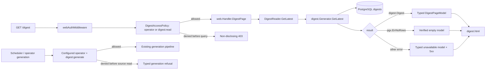

# Technical Design: [BUG-002-007] Typed Digest Read And Truthful States

## Design Brief

### Current State

PostgreSQL declares `digests.digest_date` as `DATE NOT NULL UNIQUE` and
`digests.created_at` as `TIMESTAMPTZ NOT NULL`. The canonical digest reader,
`internal/digest/generator.go::GetLatest`, already scans both into `time.Time`
inside `digest.Digest` and wraps `pgx.ErrNoRows` with `%w`.

The server-rendered route bypasses that reader. `internal/web/handler.go::DigestPage`
runs duplicate SQL, scans `digest_date` into `string`, and handles every returned
error identically by inventing `No digest generated yet.` and today's date.
Consequently, a real row plus a scan/query/connection failure is represented as
successful absence, and the stored digest is hidden.

### Target State

The legacy Digest page consumes the canonical typed digest reader rather than
owning duplicate SQL. A concrete `DigestPageModel` maps exactly one read result
to one state: current, quiet, stale, first-use empty, selected-date empty,
unauthorized, or typed read error. Only `errors.Is(err, pgx.ErrNoRows)` may
produce an empty state; every other error remains a failure.

The PostgreSQL `DATE` is the authoritative calendar date and is formatted as
`YYYY-MM-DD` only after a successful scan. `created_at` remains a UTC instant.
No current date, cached prose, sample digest, or fallback content is substituted
when metadata cannot be read.

Digest is one operator-owned global-corpus projection. The scheduled generator
acts as an explicitly configured operator principal with `digest:generate`;
browser/API reads require an authenticated operator or an identity carrying
`digest:read`. These grants authorize the same global rows rather than selecting
tenant- or user-owned rows. A denied request is rejected before the database
read and exposes no digest existence, date, source, count, age, or failure detail.

### Patterns To Follow

- `internal/digest/generator.go::GetLatest`: canonical query, ordering,
	`DATE/TIMESTAMPTZ -> time.Time` scan, and wrapped no-row sentinel.
- `internal/api/digest.go::DigestHandler`: already uses
	`errors.Is(err, pgx.ErrNoRows)` to distinguish 404 from 500 and formats typed
	values only after success.
- `cmd/core/services.go`: constructs one `digest.Generator` and one
	`web.Handler`; this is the correct composition seam for reader injection.
- `internal/api/router.go`: `webAuthMiddleware` remains the route's auth gate;
	the page adds the same explicit Digest grant check used by the API and never
	reads an actor or owner ID from query input.
- `auth.RequireScope` and the existing operator-role boundary: authorization is
	derived from the authenticated session and remains separate from the global
	Digest row query.

### Patterns To Avoid

- The duplicate SQL and `var digestText, digestDate string` in
	`internal/web/handler.go::DigestPage` are the confirmed failing path.
- The current catch-all `if err != nil` branch must not remain in any form that
	maps failures to an empty model.
- `time.Now().Format("2006-01-02")` must never stand in for unread row data.
- `internal/web/handler_test.go::TestDigestPage_NoRows` proves only that a nil
	pool was constructed; it executes no read behavior and cannot guard this bug.

### Resolved Decisions

- Reuse `digest.Generator.GetLatest`; do not add a second repository query.
- Inject a narrow reader interface into `web.Handler` for focused testing.
- Keep the existing `digests` schema; no cast or migration is required.
- Preserve `pgx.ErrNoRows` as the sole empty-state sentinel.
- Use a closed typed view state, not ad hoc template maps or magic strings.
- Treat `digest_date` as a PostgreSQL calendar date and `created_at` as UTC.
- Never render stale content after a failed read as though it were newly read.
- Treat Digest as one operator-owned global corpus; `actor_user_id` is never a
	row-selection predicate because no such ownership exists in `digests`.
- Require `digest:generate` for the configured scheduled/operator producer and
	`digest:read` for non-operator readers; authentication alone grants neither.
- Apply identical non-disclosing denial semantics at web, API, generation, and
	status boundaries.

### Open Questions

None blocking. The analyst decision fixes ownership as one operator-owned global
corpus with grant-based readers. The required disposable PostgreSQL fault
profiles and freshness configuration contract are defined below; implementation
must not replace them with a mock reader, shared-schema mutation, or code default.

## Purpose And Scope

This design repairs `GET /digest`, its typed read dependency, grant boundary,
page model, template states, safe telemetry, and focused regression strategy. It
also makes the existing scheduled generation boundary require the configured
operator principal and generation grant before source reads or publication. It
does not change digest generation algorithms, NATS delivery, synthesis prompts,
the `/api/digest` wire contract, the `digests` table, or unrelated pages. The
implementation may share authorization/classification/rendering helpers with
`/api/digest` only when that removes real duplication without changing its
public response.

## Root Cause Analysis

### Confirmed Root Cause

`internal/db/migrations/001_initial_schema.sql` defines:

```sql
digest_date DATE NOT NULL UNIQUE,
created_at  TIMESTAMPTZ NOT NULL DEFAULT NOW()
```

`internal/web/handler.go::DigestPage` executes:

```go
var digestText, digestDate string
err := h.Pool.QueryRow(...).Scan(&digestText, &digestDate, &isQuiet)
if err != nil {
		digestText = "No digest generated yet."
		digestDate = time.Now().Format("2006-01-02")
}
```

The `DATE` scan target is incompatible with the typed pgx result path reported
in production. More importantly, the handler erases every error category and
manufactures a valid-looking empty model. The defect therefore has two required
repairs: use a compatible type and preserve error meaning. Fixing only one
leaves either a failing scan or a false empty state.

### Existing Correct Path

`internal/digest/generator.go::Digest` declares `DigestDate time.Time` and
`CreatedAt time.Time`. `GetLatest` scans the exact columns into those fields,
orders latest reads by `digest_date DESC LIMIT 1`, and returns
`fmt.Errorf("get digest: %w", err)`. `internal/api/digest.go` already proves the
intended caller contract: `errors.Is(err, pgx.ErrNoRows)` is a no-digest response;
all other errors are logged safely and returned as `DIGEST_ERROR`.

The server-rendered route should consume this correct path rather than maintain
a divergent projection.

### Impact And Data Integrity

The bug does not prove stored data loss; it proves a lying read projection. The
affected surface can hide current, quiet, and stale rows alike. Because the
query is global and `digests` has no user column, the repaired contract does not
add a cosmetic owner predicate. The operator and explicitly granted identities
read the same authorized global projection. An ungranted identity is rejected
before querying and receives the same non-existence-disclosing denial whether a
row is current, stale, quiet, absent, or unreadable. This closes DIGEST-007 and
DIGEST-010 without making a tenant/user row-isolation claim.

## Architecture Overview



### Owning Code Paths

| Concern | Owner | Required Change |
|---|---|---|
| Canonical read | `internal/digest/generator.go::GetLatest` | Keep query and typed `Digest` contract; add only explicit error wrapping/classification helpers if needed. |
| Read/generation authorization | shared auth policy over the authenticated session and configured scheduler principal | Require operator or `digest:read` before web/API reads; require active configured operator plus `digest:generate` before generation source access. Denial performs no Digest query and reveals no existence metadata. |
| Web composition | `cmd/core/services.go` | Inject `svc.digestGen` into `svc.webHandler` through a narrow setter/constructor parameter. |
| Web handler | `internal/web/handler.go::Handler` and `DigestPage` | Add `DigestReader`; remove raw digest SQL; map reader result to a typed page model. |
| API parity | `internal/api/digest.go` | Preserve current wire behavior; share classification only if it cannot drift. |
| View | `internal/web/templates.go::digest.html` | Render mutually exclusive typed states and no raw error. |
| Metrics | `internal/metrics` | Add bounded read-outcome and latency metrics distinct from generation metrics. |

## Data Contract

### Ownership And Authorization

`digests` remains a global corpus table. No owner column, tenant predicate, or
viewer-derived filter is added by this bug. Authorization occurs at the
capability boundary:

| Boundary | Required authority | Denial contract |
|---|---|---|
| Web/API read | operator role or explicit `digest:read` grant | 401 for rejected session; otherwise non-disclosing 403 before query. |
| Scheduled generation | configured active operator principal with `digest:generate` | typed startup/run refusal before source reads, NATS publish, or Digest write. |
| Manual generation/retry, if exposed by an owner surface | operator role plus `digest:generate` | non-disclosing 403; no run identity or corpus state. |
| Status/telemetry detail | operator authority | no row/date/count/source/error detail for other identities. |

Grant checks authorize a capability; they never imply row ownership. A read
grant does not imply generation, correction, status-detail, or retry authority.

### Storage

No DDL change is required. Active storage remains:

| Column | PostgreSQL Type | Go Read Type | Semantics |
|---|---|---|---|
| `id` | `TEXT` | `string` | Digest identity. |
| `digest_date` | `DATE` | `time.Time` | Authoritative calendar date; format `2006-01-02` without viewer-zone conversion. |
| `digest_text` | `TEXT` | `string` | Stored digest prose; empty is permitted only for a deliberately modeled quiet row if generation contract allows it. |
| `word_count` | `INTEGER` | `int` | Stored count; never recomputed as read fallback. |
| `is_quiet` | `BOOLEAN` | `bool` | Successful quiet-digest discriminator. |
| `model_used` | `TEXT NULL` | `string` via current `COALESCE` | Generation provenance. |
| `created_at` | `TIMESTAMPTZ` | `time.Time` | Generation/persistence instant, displayed in UTC. |

### Reader Interface

The web package consumes an interface shaped to the existing domain method:

```go
type DigestReader interface {
		GetLatest(ctx context.Context, date string) (*digest.Digest, error)
}
```

For the initial latest-only page, `date` is empty. Adding selected-date UI may
pass a validated `YYYY-MM-DD` value later without changing the reader. The
production implementation is the existing `*digest.Generator`; tests can use a
contract fake only for pure view-state mapping. Required integration and E2E
tests must use real PostgreSQL and the real generator.

### Typed View Model

```go
type DigestViewState string

const (
		DigestCurrent           DigestViewState = "current"
		DigestQuiet             DigestViewState = "quiet"
		DigestStale             DigestViewState = "stale"
		DigestFirstUseEmpty     DigestViewState = "first_use_empty"
		DigestSelectedDateEmpty DigestViewState = "selected_date_empty"
		DigestReadError         DigestViewState = "read_error"
)

type DigestPageModel struct {
		Title          string
		State          DigestViewState
		Date           string
		GeneratedAtUTC string
		Text           string
		WordCount      int
		IsQuiet        bool
		AgeDays        int
		ErrorKind      DigestReadErrorKind
		ErrorReference string
}
```

The exact exported names are implementation-local; the closed states and field
semantics are normative. Loading/retrying and auth states are HTTP/browser
transitions around this server model, not invented storage states.

### Read Error Kinds

`DigestReadErrorKind` is a closed non-sensitive enum:

- `query_failed`
- `scan_failed`
- `decode_failed`
- `database_unavailable`

The user sees the UX-approved safe labels. Internal errors remain wrapped for
logging/tracing but never enter template data. Classification must use typed
error inspection where pgx exposes a type; unknown failures map to
`query_failed`, not to empty. String matching may not drive security or empty
state behavior.

## State And HTTP Mapping

| Read Result | HTTP | Page State | Content Rule |
|---|---:|---|---|
| Latest row, `is_quiet=false`, date within current threshold | 200 | `current` | Render stored date, UTC generation time, prose, and authorized sources. |
| Latest row, `is_quiet=true` | 200 | `quiet` | Render quiet explanation and persisted metadata; never empty copy. |
| Latest row older than threshold | 200 | `stale` | Retain stored prose and last-success metadata; visibly mark age/degradation. |
| Latest read returns wrapped `pgx.ErrNoRows` | 200 | `first_use_empty` | First-use copy only; no Retry or sample prose. |
| Valid selected date returns wrapped `pgx.ErrNoRows` while history exists | 200 | `selected_date_empty` | Identify selected date and offer latest; not first-use. |
| Query/scan/decode/connection error | 500 | `read_error` | Safe kind, Retry, request reference; no digest-derived fields. |
| Session missing/expired | router-owned 303/401 | auth recovery | Digest template must not receive protected data. |
| Valid session lacks `digest:read` and is not operator | 403 | access denied | Check occurs before query; no existence/date/content/source/count/error disclosure. |

The current packet requires latest, current, quiet, stale, true-empty, and
read-error behavior. Selected-date state is included because the UX contract
defines it and `GetLatest(ctx, date)` already supports exact-date reads; the
implementation must not add date navigation unless planning includes it.

## Date, Freshness, And Time Semantics

`digest_date` is a PostgreSQL `DATE`, not an instant. After pgx scans it into
`time.Time`, render the calendar components directly as `2006-01-02`; do not
convert it through the browser, viewer locale, or host local timezone.

`created_at` is a `TIMESTAMPTZ` and is normalized/displayed in UTC with an
explicit `UTC` label. Relative age is computed from an injected UTC clock and
the calendar date. No hidden freshness default is introduced: the stale
threshold must come from an existing explicit digest schedule/availability
contract or a new required SST value planned alongside implementation. Until
that threshold is explicit, a row can be current/quiet but must not be
arbitrarily called stale.

## Security And Privacy Boundaries

- `webAuthMiddleware` and explicit Digest grant authorization both precede
	`DigestPage`; no database read happens for a rejected or ungranted request.
- The scheduler resolves the configured operator principal and
	`digest:generate` authority before gathering source material or publishing a
	generation request. Request input cannot choose the actor.
- Operator and granted readers consume one global projection. The design makes
	no tenant or per-user row-isolation claim and returns no existence metadata
	to an ungranted identity.
- Error templates contain no digest text, date, source title, word count,
	query text, SQL, schema name, connection string, or raw pgx error.
- Logs carry request ID, read outcome, error kind, and date class only. They do
	not carry digest prose/source titles or credentials.
- A failed read clears all digest-derived fields from the model. The server
	never retains an earlier successful model in process as a fallback.
- The template uses `html/template`; digest prose remains escaped selectable
	text, not trusted HTML.

## Failure Handling And Progressive Delivery

The route is server-rendered and requires no JavaScript. Retry is a normal link
or form action back to the same authorized route. A retry performs one new read
and replaces the prior full page; it never stacks alerts or labels previously
rendered prose as newly read.

If source-link rendering is present, it is additive only after the base digest
row succeeds. A source lookup failure may produce an explicitly degraded source
section while preserving the successfully read digest, but a base-row failure
cannot be degraded into cached/current content.

The error response status remains 500 even though the body is a usable HTML
recovery page. Monitoring and browser tests must be able to distinguish failure
from a successful empty response at the HTTP layer as well as in the DOM.

## Migration And Backward Compatibility

No storage migration is required: the schema already has compatible types and
the canonical reader already consumes them. Existing rows, IDs, dates, quiet
flags, generation timestamps, `/api/digest` clients, scheduler writes, and NATS
digest handling remain unchanged.

This packet reserves no migration number. If implementation discovers a real
DDL need, it must return to design/plan rather than claiming a sequence number
here. The current repair is previous-release data compatible because it changes
only reader composition, authorization, rendering, and telemetry; rollback
never requires a data down-migration or restore.

The code migration is an ownership consolidation:

1. inject `svc.digestGen` into `svc.webHandler` during service construction;
2. remove the duplicate SQL from `DigestPage`;
3. map `digest.Digest` or its error to `DigestPageModel`;
4. expand `digest.html` to typed states.

Startup must fail loudly if the web Digest route is mounted in a production
runtime without a `DigestReader`. Nil is permitted only in tests that never
invoke the route; it must not become a runtime empty state.

## First Delivery Slice Contract

The first implementation slice is a complete secure vertical read, not a type
change followed by later hardening. It must include, together:

1. canonical `DigestReader` injection and the real PostgreSQL typed scan;
2. web/API `digest:read` plus operator authorization before every read;
3. configured-operator `digest:generate` authorization before generation input;
4. no-row versus query/scan/decode/connection error propagation and HTTP/DOM
	 exclusivity;
5. non-disclosing 401/403 behavior and protected-state clearing;
6. bounded read outcome/latency logs, metrics, and traces with no content; and
7. the current-row, grant-denial, scan-failure, and no-row disposable-stack
	 canaries.

No later slice may be used to add authorization, privacy, typed errors, or
observability to an already exposed Digest read.

## Disposable-Stack Fault Profile

The test-only machine-readable fault registry contains this profile. It is
loaded only by the disposable validate/e2e harness and is absent from production
config, routes, request schemas, and UI.

| Field | `DIGEST-FP-DB-SCAN-001` |
|---|---|
| Owning scenarios | `SCN-002-007-02`, `SCN-002-007-03` |
| Setup | Create a unique disposable PostgreSQL database, apply normal migrations, insert a marker digest into the real table, rename that table inside the isolated database, and create a same-name compatibility view whose `digest_date` projection is `TEXT`. Start the real core against that database. The production query and pgx scan remain unchanged. |
| Trigger | Use a real authenticated and `digest:read`-granted browser/API request to `/digest`; do not call the reader directly for E2E proof. |
| Expected outcome | The pgx scan fails at the typed boundary; HTTP is 500, DOM shows `Date could not be read` plus Retry, and no first-use/selected-date-empty copy, marker prose, date, source, or count appears. The read metric records `scan_error`, never `empty`. |
| Isolation/parallelism | One unique Compose project and database per run; profile is exclusive only within that database. It may run in parallel with profiles using other project/database names. It cannot target dev, shared validate, or operate data/telemetry. |
| Teardown | In a registered finally/EXIT cleanup, stop the core, drop the compatibility view, restore/drop the renamed table as needed for inspection, then destroy the disposable database, volumes, browser context, and validate telemetry namespace. Teardown failure fails the profile. |
| No-interception proof | Playwright network observation must show the actual `/digest` request and 500 response. Source scanning and the regression-quality guard must show no `page.route`, `context.route`, `route.fulfill`, proxy response replacement, canned handler, or internal reader mock. |
| Permitted evidence | Safe profile ID, normalized route, status, closed error kind, DOM state hooks, metric outcome, timestamps, and teardown result. Digest prose/date/source values and raw pgx errors are forbidden. |

## Observability

Generation telemetry (`smackerel_digest_generation_total`) remains generation-
owned and must not be reused for page reads. Add:

- `smackerel_digest_read_total{surface,outcome}` with `surface=web|api` and
	bounded `outcome=current|quiet|stale|empty|query_error|scan_error|decode_error|database_unavailable`;
- `smackerel_digest_read_duration_seconds{surface,outcome}`;
- an error log with request ID and safe error kind on non-empty failures.

No label or log field contains digest text, source title, selected raw input,
username, token, SQL, or connection details. A current row followed by a scan
error must increment an error outcome, never `empty`.

## Testing And Validation Strategy

No test, build, database, or browser execution is claimed by this design.
Required validation is:

| Scenario | Test Boundary | Required Assertion |
|---|---|---|
| `SCN-002-007-01` | Real disposable PostgreSQL plus real `digest.Generator` and authenticated browser | Approximately 380-word stored row renders exact marker prose/date; empty/error copy absent. |
| `SCN-002-007-02` | Real PostgreSQL `DATE` rows around timestamp/zone boundaries | Stored calendar date is stable; viewer/current date is not substituted. |
| `SCN-002-007-03` | Owned query/scan/decode/connection fault seams | Each yields HTTP 500 plus the matching safe error and Retry; no empty copy. |
| `SCN-002-007-04` | Successful real query with zero rows | First-use state only; no sample prose or Retry. |
| `SCN-002-007-05` | Real quiet row | Quiet state/date metadata visible; no empty/error. |
| `SCN-002-007-06` | Real old row plus explicit freshness contract | Stored prose retained with age/degraded state; no current/empty. |
| `SCN-002-007-07` | Real missing/expired session and scope denial | Protected digest-derived nodes absent from DOM/accessibility tree. |
| `SCN-002-007-08` | Playwright at 320px and 200% zoom | Heading/date/prose/source/Retry remain ordered, announced, and non-overlapping. |

The adversarial regression must insert through PostgreSQL using the actual
`DATE` column and drive the actual `GetLatest` scan. A mock row, SQL cast to
text, canned page response, or template-only assertion cannot close the bug.
Before the repair, the test must observe first-use copy instead of the stored
marker. Afterward it must prove exact marker/date and mutual exclusion.

For fault cases, planning must use an owned disposable database/fault boundary.
It must not mutate shared migrations, production schema, or global test data.
Playwright must not intercept the application response.

## Narrow Rollback

Rollback restores only the prior web-handler composition, page model/template,
and read metrics from the immediately preceding known-good revision. It does
not touch the `digests` table or stored rows because this design has no DDL or
data migration. The previous release can still read every row because storage is
unchanged. Rollback must never reintroduce catch-all false-empty behavior or
bypass the explicit grant boundary; if the prior binary lacks either contract,
Digest is held explicitly unavailable and excluded from ready/accepted claims
until the fixed reader is restored. Pointer rollback or process liveness alone
cannot make Digest green.

## Alternatives And Tradeoffs

### Scan `digest_date` Into `time.Time` In `DigestPage` Only

Rejected. It repairs the immediate type mismatch but preserves duplicate SQL
and the risk that API and web no-row/error behavior drift again.

### Cast `digest_date::text` In SQL

Rejected. It adapts the database to an incorrect domain type, loses the typed
contract, and still does not prevent error swallowing.

### Render Last Known Digest On Failure

Rejected. There is no verified cache with provenance/freshness semantics, and
serving stale memory as a successful read would violate the no-fallback policy.

### Single-Implementation Justification

This is a narrow bug repair inside the existing Digest capability. The
canonical reader already exists and is shared by the API; introducing a new
repository/provider abstraction beyond the small consumer interface would be
premature. The work consolidates onto the existing foundation.

## Complexity Tracking

None - simplest viable approach used: inject and reuse the existing typed
reader, classify its existing sentinel/error contract, and render a concrete
view model. No schema, provider, cache, or new runtime dependency is introduced.

## Routed Design Questions

| Owner | Question | Required Constraint |
|---|---|---|
| `bubbles.plan` | How should the typed reader/grant/error/observability vertical and `DIGEST-FP-DB-SCAN-001` be mapped into the first executable scope without splitting security into a later cleanup scope? | Required integration/E2E rows traverse the real pgx scan and handler, and first-slice DoD includes auth/privacy/errors/telemetry. |
| Config owner through implementation planning | Which required SST key supplies the Digest freshness interval already consumed by the state model? | Missing freshness policy fails config validation; no code, viewer-clock, or host-time fallback is allowed. |

## Superseded Design Decisions

The initialization text that left the scan and error-swallow path unconfirmed
is superseded by the source-grounded analysis above. It is not active design
authority.
