# Expected Behavior: [BUG-002-007] Truthful Digest Read States

## Problem Statement

Digest is a daily primary journey. A read/type failure must never erase stored content by masquerading as a legitimate never-generated state.

## Outcome Contract

**Intent:** Show the latest authorized stored digest with accurate date and state, or a typed recoverable failure when it cannot be read.

**Success Signal:** A real PostgreSQL row containing current non-empty digest content round-trips to a grant-authorized authenticated page, while true absence, quiet digest, stale digest, auth failure, access denial, and database/decode failure each render distinct user-visible states.

**Hard Constraints:** Date/time fields use typed scanning; errors are propagated and observable; no fallback content or swallowed error; Digest reads the single operator-owned global corpus and makes no tenant/user row-isolation claim; private content is grant-gated and not logged.

**Failure Condition:** Any stored row is hidden by false-empty copy, a failure becomes absence, or tests replace the database/read path with canned data.

## Requirements

- **DIGEST-001:** The latest digest query SHALL scan date/time columns into compatible typed values and format them only after a successful read.
- **DIGEST-002:** A successful non-empty read SHALL render digest content, date, quiet/current/stale status, and authorized source links where available.
- **DIGEST-003:** `sql.ErrNoRows` or equivalent verified absence SHALL map to the first-use no-digest state.
- **DIGEST-004:** Scan, query, decoding, and connection failures SHALL map to an explicit error with retry and SHALL NOT map to no digest.
- **DIGEST-005:** Quiet digest SHALL remain a valid digest state distinct from never-generated and error.
- **DIGEST-006:** Stale digest SHALL show age/generation state rather than appear current or absent.
- **DIGEST-007:** Unauthorized access SHALL request re-authentication or deny access without leaking content/date.
- **DIGEST-008:** Telemetry SHALL identify read outcome and age class without recording digest text or source titles.
- **DIGEST-009:** The page SHALL remain readable, keyboard navigable, and non-overlapping on mobile and assistive technology.
- **DIGEST-010:** Digest SHALL read from the single operator-owned global corpus. The operator role MAY read all private digest content; another authenticated identity MAY read it only with an explicit Digest read grant. An identity without that grant SHALL receive access denial without content, date, source, count, or existence disclosure. This contract SHALL NOT claim tenant-level or per-user row isolation.

## Corpus Ownership And Private Access

- Smackerel has one operator-owned/global artifact, knowledge, graph, Digest, and Synthesis corpus. Authenticated identities are principals with roles and explicit grants; they are not separate tenants and do not imply row ownership.
- Private Digest content is operator-private by default. A non-operator identity may read the global Digest projection only when its explicit role/grant permits that capability. A write, correction, or operator-health action requires a separate explicit grant and is never inferred from read access.
- An identity without the required grant may not receive digest prose, dates derived from stored rows, source titles, counts, row-existence hints, or stale cached content. Authentication alone is insufficient.

## User Scenarios

```gherkin
Scenario: SCN-002-007-01 Current stored digest renders
  Given PostgreSQL contains a current non-empty 380-word digest for the authenticated user
  When the user opens Digest
  Then the digest content and typed date are visible
  And no-digest copy is absent

Scenario: SCN-002-007-02 Date boundary scans and formats correctly
  Given the stored digest date is a database DATE or timestamp at a timezone boundary
  When the row is read
  Then the value scans into a compatible type and displays the intended calendar date

Scenario: SCN-002-007-03 Query or scan failure is explicit
  Given the digest read returns a query, scan, connection, or decode error
  When the page renders
  Then it shows an actionable error and retry
  And it does not show no-digest copy

Scenario: SCN-002-007-04 True first-use empty is honest
  Given the authorized user has no digest rows
  When the page reads successfully
  Then it shows the true never-generated state
  And displays no sample digest

Scenario: SCN-002-007-05 Quiet digest remains a digest
  Given the latest successful digest is intentionally quiet with valid metadata
  When the page opens
  Then it labels the quiet state and date
  And does not claim no digest exists

Scenario: SCN-002-007-06 Stale digest is degraded not empty
  Given the latest digest is older than the freshness contract
  When the page opens
  Then it shows the stored content with age and generation status
  And does not label it current or absent

Scenario: SCN-002-007-07 Unauthorized read leaks nothing
  Given the session is missing or expired, or the authenticated identity lacks the explicit Digest read grant
  When Digest is requested
  Then re-authentication or access denial is shown
  And no digest text, date, or source title is rendered

Scenario: SCN-002-007-08 Digest states are accessible and responsive
  Given a keyboard or screen-reader user on a narrow viewport
  When current, quiet, stale, empty, or error state renders
  Then headings, dates, links, status, and retry remain perceivable and operable without overlap
```

## Acceptance Criteria

1. A real PostgreSQL row with current content/date round-trips to the page.
2. The adversarial regression seeds the date type that the old string scan rejected and fails if false-empty substitution returns.
3. No-row, quiet, stale, unauthenticated, grant-denied, query, scan, decode, and connection states are distinct.
4. Authenticated Playwright asserts visible digest content/date and error/empty-state exclusivity.
5. No internal database mock or canned page response satisfies live test rows.
6. Role/grant acceptance proves authorized access to the global Digest projection and proves that an ungranted identity receives no private content or existence metadata; no evidence or claim relies on tenant/user row isolation.

## Release Train

- Target train: `mvp`.
- Flags introduced: none.
- Digest readiness may be claimed only where the typed read and truthful state contract is active.

## UI Wireframes

### UX Requirements

| ID | Observable Contract |
|---|---|
| UX-002-007-01 | Digest exposes one closed read-state vocabulary: loading, current, quiet, selected-date-empty, first-use-empty, stale/degraded, unauthorized, read-error, and retrying. |
| UX-002-007-02 | A stored digest always displays the persisted calendar date and generation time from that successful read; the page never substitutes the viewer's current date for unreadable metadata. |
| UX-002-007-03 | First-use empty appears only when the authorized history is successfully read and contains no rows. A selected-date miss instead identifies that date and preserves access to available dates. |
| UX-002-007-04 | Quiet is a successful digest with valid metadata and a calm-content explanation; it is never rendered with empty or failure language. |
| UX-002-007-05 | Stale/degraded retains the latest authorized stored prose and source links, names its age, and explains why a newer digest is unavailable. |
| UX-002-007-06 | Query, scan, decode, and connection failures share a safe user-facing error family but expose a stable non-sensitive cause label so support and Playwright can distinguish the failed boundary. |
| UX-002-007-07 | Retry visibly starts a new read, replaces the prior terminal message instead of stacking it, and never displays cached prose as a newly successful response. |
| UX-002-007-08 | Unauthorized states remove digest prose, dates, source titles, and counts from the document before exposing re-authentication or access-denied actions. |

### Screen Inventory

| Screen | Actor(s) | Status | Scenarios Served |
|---|---|---|---|
| Today / Digest (`/digest`) | Daily user, returning user | Existing - Modify | SCN-002-007-01 through SCN-002-007-08 |

### Single-Screen Justification

The defect affects one Today/Digest read projection and its mutually exclusive states. It introduces no second screen or cross-feature primitive; shared product shell, typography, availability bands, state presentation, and theme behavior remain owned by spec 106.

### Screen: Truthful Digest States

**Actor:** Daily User, Returning User | **Route:** `/digest` | **Status:** Modify

**Desktop (successful stored digest):**

```text
┌──────────────────────────────────────────────────────────────────────────┐
│ [Primary navigation: Assistant | Today | Knowledge | Cards | …]         │
├──────────────────────────────────────────────────────────────────────────┤
│ Today                                                                    │
│ [← Previous]  [Thursday, July 23, 2026 ▾]  [Next → disabled/available]  │
│ [Current | Quiet | Degraded | Unavailable]  Generated [time + zone]     │
├──────────────────────────────────────────────────────────────────────────┤
│ Daily digest                                                             │
│                                                                          │
│ [Authorized prose from the successfully read stored row..............] │
│ [......................................................................] │
│ [......................................................................] │
│                                                                          │
│ Sources [n]                                           [Show sources ▾]  │
│ [source title] · [source type] · [Open source]                           │
├──────────────────────────────────────────────────────────────────────────┤
│ [state-specific explanation]                     [Retry / View latest]  │
└──────────────────────────────────────────────────────────────────────────┘
```

**Mobile / narrow viewport (320px minimum):**

```text
┌──────────────────────────────┐
│ [Menu]  Today       [Account]│
├──────────────────────────────┤
│ Thursday, July 23            │
│ [Current]                    │
│ Generated [time + zone]      │
│ [← Previous]     [Next →]    │
├──────────────────────────────┤
│ Daily digest                 │
│ [Stored digest prose wraps   │
│  at reading width without    │
│  horizontal scrolling.]      │
│                              │
│ Sources [n] [Show ▾]         │
├──────────────────────────────┤
│ [state explanation]          │
│ [full-width recovery action] │
└──────────────────────────────┘
```

**States:**

| State Key | Visible Heading / Badge | Required Visible Detail | Primary Action | Forbidden Co-Presentation |
|---|---|---|---|---|
| `loading` | `Loading digest` | Selected date remains visible; progress does not imply content exists. | None required | Stored prose, empty copy, or prior error shown as current. |
| `current` | `Current` | Persisted date, generation time/zone, stored prose, and authorized sources. | Show sources | Quiet, empty, stale, unavailable, or retry copy. |
| `quiet` | `Quiet day` | Persisted date and generation time plus `Nothing crossed your digest threshold`; valid quiet metadata remains inspectable. | View sources considered, when authorized | `No digest has been generated` or failure language. |
| `selected-date-empty` | `No digest for [date]` | Explains that other retained dates may still be available and leaves date controls enabled. | View latest available | First-use onboarding or system-error copy. |
| `first-use-empty` | `Your first digest has not been generated` | Explains the configured generation cadence without inventing an expected completion time. | Check source status | Date navigation to nonexistent history, sample prose, or Retry. |
| `stale` | `Degraded · [age] old` | Latest stored prose remains visible; last successful generation timestamp and the reason newer content is unavailable are explicit. | Retry latest read / Check source status | Current badge or empty-state illustration. |
| `unauthorized-session` | `Your session ended` | No digest-derived content remains in the DOM. | Sign in again | Any date, prose, source title, source count, or empty copy. |
| `unauthorized-scope` | `You do not have access to this digest` | Identifies access denial without disclosing whether a digest exists. | Return to Today/home | Re-authentication loop or digest-derived metadata. |
| `read-error` | `Digest is unavailable` | Safe cause label: `Query failed`, `Date could not be read`, `Content could not be decoded`, or `Database unavailable`; selected date remains visible only when it was user input rather than row data. | Retry | First-use/selected-date-empty copy, raw database errors, or substituted dates. |
| `retrying` | `Trying again` | One new read is in progress for the selected/latest date. | None required | Duplicate error panels or stale prose represented as new. |

**Interactions:**

- `Previous`, date selection, and `Next` request only retained dates the user is authorized to read; unavailable directions are disabled with a text-equivalent explanation.
- Choosing a date moves the state to `Loading digest`, then one terminal state. A selected-date miss preserves the selected date and offers `View latest available`.
- `Retry` repeats the same latest/selected-date read exactly once and moves through `Trying again`; it does not silently change the date.
- `Show sources` expands an in-flow list without moving focus. Each source opens through its authorized route; hidden or inaccessible sources are summarized by count without leaking titles.
- `Sign in again` carries a same-origin `/digest` return target only. Digest date/content is not encoded into the return URL or stored as client credentials.

**Responsive:**

- Desktop uses a constrained reading measure for prose while date/state/action bands span the content column.
- Tablet allows navigation controls to wrap in source order without separating the selected date from its state badge.
- Mobile places date and status before prose, uses full-width recovery actions, and collapses source details behind a named disclosure.
- At 320px and 200% zoom, prose, dates, badges, navigation, and source links wrap without overlap or horizontal page scroll; tap targets are at least 44 by 44 CSS pixels.

**Keyboard:**

- Tab order is primary navigation, Previous, date selector, Next, source disclosure, source links, then state recovery action.
- Date controls use native button/select behavior; no custom arrow-key grid is introduced. Disabled navigation remains perceivable but is not focusable.
- Expanding sources keeps focus on `Show sources`; the next Tab reaches the first source. Collapsing restores focus to the disclosure.
- Retry and date changes do not steal focus while loading. Unauthorized and read-error headings receive programmatic focus once; current, quiet, empty, stale, and retrying announce politely without moving focus.

**Screen reader and visual accessibility:**

- The page has one `Today` page heading and a subordinate `Daily digest` heading. Persisted dates use semantic time text with an unambiguous spoken date and timezone.
- A single atomic polite status region announces loading, current/quiet, selected-date-empty, first-use-empty, stale, and retrying. Unauthorized and read errors use a one-time alert.
- `Current`, `Quiet day`, and `Degraded` use visible text plus non-color styling. Age and generation time are not conveyed by relative color or position alone.
- Digest prose remains selectable text; line length is constrained, text spacing can be overridden, and source links have unique accessible names.
- Unauthorized rendering removes protected nodes rather than visually hiding them. Reduced-motion mode removes spinner animation while retaining `Loading digest` text.

### Playwright-Visible Behavior Contract

These are planned real-stack observations for downstream test ownership; they do not claim browser or database execution.

| ID | Real-Stack Setup and Gesture | Required Visible Assertion | Exclusivity Assertion |
|---|---|---|---|
| UX-E2E-002-007-01 | Authenticated user opens `/digest` with a current non-empty persisted row. | Persisted prose, intended calendar date, generation time, `Current`, and authorized source link are visible. | First-use, selected-date-empty, degraded, unauthorized, and unavailable text are absent. |
| UX-E2E-002-007-02 | Persist a digest whose database date/timestamp crosses the configured timezone boundary, then open Digest. | The intended calendar date is visible in heading/navigation and semantic date text. | The viewer's current date is not substituted. |
| UX-E2E-002-007-03 | Authenticated user with no digest history opens Digest after a successful read. | `Your first digest has not been generated` and `Check source status` are visible. | No sample prose, source metadata, Retry, or generic failure appears. |
| UX-E2E-002-007-04 | User selects a retained-range date with no row while another digest exists. | `No digest for [date]`, selected date, and `View latest available` are visible. | First-use copy and `Digest is unavailable` are absent. |
| UX-E2E-002-007-05 | Latest stored row is a valid quiet digest. | `Quiet day`, persisted date/time, and quiet-threshold explanation are visible. | First-use and unavailable copy are absent. |
| UX-E2E-002-007-06 | Latest stored row exceeds freshness while a newer generation/read dependency is unavailable. | Stored prose remains visible with `Degraded`, exact age, last-success time, and recovery action. | `Current` and both empty states are absent. |
| UX-E2E-002-007-07 | Real query, incompatible date scan, decode, and connection failures are induced in separate runs at their owned boundaries. | `Digest is unavailable`, the matching safe cause label, and Retry are visible. | No digest prose, source title, first-use copy, or substituted date appears. |
| UX-E2E-002-007-08 | Session expires or an authenticated user lacks digest scope. | Session case shows `Your session ended` plus `Sign in again`; scope case shows access denial plus safe return. | Digest prose/date/source/count and empty copy are absent from both DOM and accessibility tree. |
| UX-E2E-002-007-09 | User activates Retry after a read error. | Error is replaced by `Trying again`, then one truthful terminal state. | No duplicate alerts, stale-current badge, or stacked prose remains. |
| UX-E2E-002-007-10 | Keyboard-only user traverses `/digest` at 320px and 200% zoom. | Focus order follows the visible controls; date/status/prose/actions do not overlap; status and semantic date are exposed to accessibility APIs. | No horizontal page scroll or pointer-only control exists. |

### Routed Design Questions

| Owner | Question | UX Constraint That Must Survive Resolution |
|---|---|---|
| `bubbles.design` | What read-result contract distinguishes no history, selected-date miss, quiet digest, stale digest, and the four safe read-error causes without exposing database details? | The closed state vocabulary and exclusivity rules above remain observable in full-page responses. |
| `bubbles.design` | Which timezone is authoritative for persisted digest dates, and how is that zone named beside generation time? | One stored instant maps deterministically to the intended calendar date; no viewer-local substitution occurs. |
| `bubbles.plan` | Which real PostgreSQL fixtures and fault boundaries can produce every listed state, including the adversarial date type, without replacing the internal read path? | Playwright must observe the rendered result of the real read path; no canned page response or database mock closes these scenarios. |

## User Flows

### User Flow: Read Current Or Honest Alternate State

```mermaid
stateDiagram-v2
  [*] --> Loading
  Loading --> Current: Stored current row
  Loading --> Quiet: Stored quiet row
  Loading --> FirstUseEmpty: Successful history read; zero rows
  Loading --> SelectedDateEmpty: Selected date has no row; history exists
  Loading --> Stale: Stored row exceeds freshness
  Loading --> ReadError: Query / scan / decode / connection failure
  Loading --> SessionEnded: Session rejected
  Loading --> AccessDenied: Scope rejected
  Current --> Loading: Previous / date / next
  Quiet --> Loading: Previous / date / next
  SelectedDateEmpty --> Loading: View latest available
  Stale --> Retrying: Retry latest read
  ReadError --> Retrying: Retry same read
  Retrying --> Loading: One new read
  SessionEnded --> Reauthenticate: Sign in again
  Reauthenticate --> Loading: Safe return to Digest
  AccessDenied --> SafeReturn: Return without content disclosure
```


