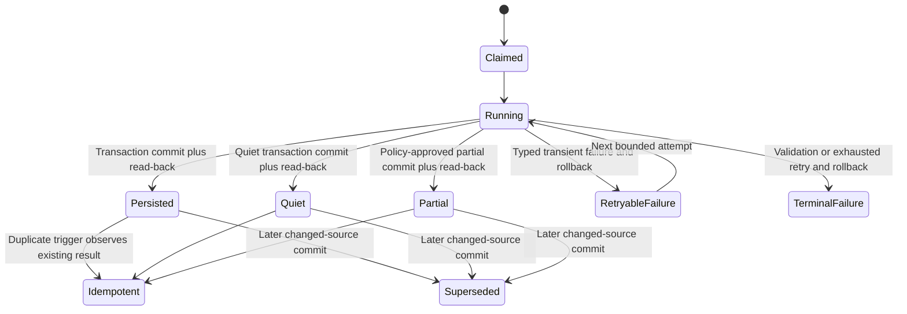

# Bug Fix Design: BUG-004-004 Durable Synthesis And Truthful Health

## Design Brief

### Current State

`internal/intelligence/synthesis.go::RunSynthesis` reads cross-domain clusters
from the canonical `artifacts`/`edges`/`topics` tables and returns newly generated
`SynthesisInsight` values in memory. `GenerateWeeklySynthesis` separately
assembles a weekly value while logging and continuing after several component
read failures. Neither function persists its returned value.

`internal/scheduler/jobs.go` invokes daily and weekly generation, logs counts or
delivers weekly text, and has only process-local overlap mutexes. The existing
`synthesis_insights` and `weekly_synthesis` tables have no run identity,
principal, citation rows, lifecycle, completeness, failure audit, or idempotency
constraint. `internal/api/health.go` reads only `MAX(synthesis_insights.created_at)`
and maps both probe failure and never-run to `up`.

### Target State

One `SynthesisPersistence` capability owns daily and weekly run identity,
pre-commit validation, citation authorization, a single PostgreSQL transaction,
idempotency, lifecycle, read models, and health derivation. A successful run is
defined by committed run, output, insight, and citation records that can be read
back together. A log line, scheduler acceptance, in-memory value, or partial
write is never success.

Daily and weekly cadence are concrete producers over the same foundation.
Reader `/digest` and operator `/status` projections consume one persisted truth
model. Scheduler retries attach attempts to the same logical run and cannot
duplicate output. Health distinguishes never-run, running, current, quiet,
partial, stale, failed-without-output, and failed-with-prior-output.

The source-set fingerprint identifies an idempotent input, but it is not the
concurrency lock. Every run for the same configured corpus actor, cadence, and
normalized window serializes under one PostgreSQL advisory transaction lock. A
same-source replay returns the existing durable output; a changed-source rerun
creates a new append-only run/output, supersedes the previous current output,
and installs the replacement current output inside one transaction without
violating the one-current constraint.

Synthesis reads and writes one operator-owned global corpus. The configured
operator principal owns scheduled generation; other authenticated identities
are access principals with explicit grants, not row owners or tenants. Read,
operate/retry, and generation boundaries authorize before loading private
run/output/source state, and denial leaks no existence metadata.

### Patterns To Follow

- Keep PostgreSQL as the sole source of truth, following the current canonical
	graph query in `buildSynthesisClusterQuery`; add no queue-backed or file-backed
	output store.
- Follow grant binding via the authenticated session and configured corpus
	actor; never accept an actor/corpus owner ID from a request body or use the
	viewer identity as a row-isolation predicate.
- Follow the scheduler's shared `runGuarded` entry point for local overlap
	suppression, but make durable run claims the cross-process authority.
- Follow existing safe health topology disclosure: full synthesis detail is
	authenticated/operator-scoped; unauthenticated health remains aggregate-only.
- Preserve source-qualified output and the product Principle 8 requirement that
	source links exist before persistence.

### Patterns To Avoid

- Do not follow `RunSynthesis`'s return-only boundary or the scheduler's
	count-only success log.
- Do not follow `GenerateWeeklySynthesis`'s warning-and-continue behavior unless
	the missing component is policy-approved and persisted as explicit partial
	provenance.
- Do not follow `GetLastSynthesisTime`'s epoch sentinel or the health branch that
	maps probe error/never-run to `up`.
- Do not follow `DigestPage`'s behavior of converting every database error into
	`No digest generated yet`; missing output and read failure must remain distinct.

### Resolved Decisions

- One durable run ledger is authoritative for scheduling, attempts, output,
	health, and alert state.
- Logical run identity is deterministic from cadence, configured principal,
	normalized UTC window, policy version, and a canonical source-set fingerprint.
- Daily and weekly outputs use one output table with cadence-specific JSON
	payloads; insights and citations remain normalized child records.
- The transaction commits run success, output, insights, and citations together.
- Run/attempt rows are durable coordination summaries; every lifecycle
	transition is also inserted into immutable `synthesis_run_events`, which is
	the authoritative append-only run history.
- Quiet is a committed output kind, not absence of a row.
- Partial is allowed only for explicitly optional source classes and records the
	included and omitted classes; missing required input fails and rolls back.
- Freshness and retry budgets are required SST values with no code fallback.
- Existing globally owned artifacts are not falsely relabeled per-user: the
	scheduled synthesis principal is an explicit operator user, readers are
	grant-authorized principals, and this packet makes no tenant/user row-isolation
	claim.
- Advisory locking is derived only from configured actor, cadence, and
	normalized window. Source-set and policy fingerprints remain identity/input
	facts and are never lock keys.
- Same-source replay is idempotent; changed-source rerun appends a new logical
	run and atomically replaces the current output for the same window.
- Run and attempt identities are never reused or deleted; their summary state
	may advance monotonically. Run history itself is append-only in
	`synthesis_run_events`. Current-output lifecycle is mutable only through the
	guarded `current -> superseded` transition.
- Migration numbering is allocated only in the implementation merge wave; this
	design names a symbolic migration and reserves no numeric slot.

### Open Questions

None block the single-operator design. A future multi-tenant artifact ownership
change is intentionally excluded; its owner route is recorded below.

## Purpose And Scope

This design repairs daily/weekly intelligence synthesis persistence, retry, read,
health, and alert truth. It covers:

- durable run and attempt identity;
- daily and weekly output records;
- normalized insight and citation persistence;
- transaction, idempotency, concurrency, retry, and read-back semantics;
- explicit source completeness and authorization;
- authenticated reader and operator APIs/UI state;
- health, metrics, traces, logs, and alerts;
- forward migration and rollback.

It does not change the graph candidate model, create a second knowledge store,
introduce a new LLM provider, implement multi-tenant artifact ownership, or
replace the daily `digests` capability. The Today page composes the latest
durable synthesis alongside the existing daily digest.

## Grounded Root Cause Analysis

### Confirmed Execution Path

1. `RunSynthesis` executes a bounded CTE over `edges`, `topics`, and `artifacts`,
	 creates ULID-bearing `SynthesisInsight` structs, and returns them. It issues no
	 `INSERT` or transaction.
2. `Scheduler.doSynthesisJob` logs `synthesis complete` with an insight count,
	 then continues to an unrelated overdue-commitment check.
3. `GenerateWeeklySynthesis` invokes `RunSynthesis`, several independent queries,
	 `Resurface`, and pattern detection. Many failures are logged and converted
	 into missing sections; the function still returns a `WeeklySynthesis` value.
4. `Scheduler.doWeeklySynthesisJob` may deliver that in-memory text through the
	 surfacing controller/Telegram, but it persists no weekly record.
5. The initial schema defines `synthesis_insights` and `weekly_synthesis`, but no
	 production path in the traced package writes either table. Existing E2E
	 scripts insert schema fixtures directly and therefore cannot prove runtime
	 persistence.
6. `GetLastSynthesisTime` returns a 1970 epoch sentinel when no insight exists.
	 `getCachedIntelligenceHealth` maps that sentinel to `up`, maps freshness-query
	 error to `up`, and hardcodes a 48-hour threshold.
7. `/digest` reads the separate `digests` table. The server-rendered `DigestPage`
	 turns any query error into the same `No digest generated yet` copy.

### Root Cause

Generation, persistence, scheduling, delivery, health, and read projection have
no shared lifecycle object. The scheduler treats function return as completion,
the schema cannot represent attempts or idempotency, and health infers success
from the absence of durable evidence. Weekly partial assembly also has no formal
required/optional policy, so omission cannot be distinguished from quiet output.

### Data-Ownership Constraint

The canonical `artifacts`, `topics`, and `edges` tables in
`001_initial_schema.sql` are operator-global and carry no `owner_user_id`.
Authentication is per identity, but current source truth is not. This design
binds scheduled synthesis to one explicitly configured active operator
principal and authorizes other readers through explicit `synthesis:read`
grants. Operator retry, run history, health detail, and generation require
`synthesis:operate` and/or `synthesis:generate` as specified below. These grants
authorize capabilities over the same global rows; they neither select per-user
rows nor imply tenant ownership. An ungranted identity is denied before a
private run/output lookup and receives no output, citation, window, count, run
identity, freshness, failure, or existence detail.

## Architecture Overview

```mermaid
flowchart LR
	Cron[Scheduler with configured operator] --> GenAuth[synthesis:generate]
	Retry[Authenticated operator retry] --> OpAuth[synthesis:operate]
	GenAuth --> Coordinator[SynthesisRunCoordinator]
	OpAuth --> Coordinator
	Coordinator --> Claim[Durable logical-run claim]
	Claim --> Daily[Daily producer]
	Claim --> Weekly[Weekly producer]
	Graph[(PostgreSQL graph)] --> Daily
	Graph --> Weekly
	Daily --> Validate[Schema citation authorization validation]
	Weekly --> Validate
	Validate --> Tx[Single persistence transaction]
	Tx --> Runs[(synthesis_runs)]
	Tx --> Output[(synthesis_outputs)]
	Tx --> Insights[(synthesis_insights)]
	Tx --> Citations[(synthesis_citations)]
	Runs --> ReadModel[Persisted synthesis read model]
	Output --> ReadModel
	Insights --> ReadModel
	Citations --> ReadModel
	Reader[Operator or synthesis:read] --> ReadAuth[Grant check before lookup]
	ReadAuth --> Digest
	ReadModel --> Digest[/digest Synthesis section]
	ReadModel --> Status[/status Synthesis section]
	ReadModel --> Health[/api/health authenticated detail]
	ReadModel --> Alerts[Prometheus alerts]
```

The coordinator owns one logical run from claim through read-back. Producers are
pure builders over authorized PostgreSQL records. Validation completes before
the transaction begins. The transaction writes the complete authoritative
result. The coordinator then reads the committed aggregate using the same store
query used by APIs; only that successful read-back yields `persisted`.

## Capability Foundation

### Foundation Contract

| Contract | Responsibility | Consumers |
|---|---|---|
| `SynthesisRunCoordinator` | Normalize window, resolve policy/principal, claim logical run, execute bounded retry lifecycle | Scheduler, operator retry API |
| `SynthesisProducer` | Build one cadence-specific validated candidate without persistence | Daily producer, weekly producer |
| `SynthesisValidator` | Enforce schema, citations, source authorization, completeness, size, and policy version | Coordinator before transaction |
| `SynthesisPersistence` | Claim attempts, atomically commit result, read aggregates, derive health | Coordinator, API, health, status |
| `SynthesisRunEventLedger` | Append every claim, attempt, replay, rollback, persistence, read-back, recovery, and supersession transition; reject history update/delete | Coordinator, run history, audit, health diagnostics |
| `SynthesisReadModel` | One privacy-aware current/history projection over committed records | Today, Status, API |
| `SynthesisHealthPolicy` | Derive closed health state from latest attempt, latest committed output, freshness, completeness, and alerts | Health, UI, Prometheus |
| `SynthesisAccessPolicy` | Authorize global-corpus read, generation, operate/retry, run-detail, and health-detail capabilities before private lookup or work | Scheduler, APIs, Today, Status |

### Extension Points

- Producers implement `Cadence`, `Build(ctx, input)`, and a typed payload schema.
- Source-class policy declares required and optional classes per cadence; a
	producer cannot silently downgrade a required class.
- Additional cadence types may reuse the run/persistence contracts only after
	adding a closed enum value, payload schema, migration constraint, and tests.
- Reader projections consume `SynthesisReadModel`; they do not derive health or
	lifecycle independently.

### Foundation-Owned Behavior

- deterministic logical run identity and serialized durable claim;
- actor/cadence/window advisory serialization independent of source-set identity;
- attempt lifecycle and bounded retries;
- immutable transition events and monotonic coordination summaries;
- pre-persistence schema/citation/auth validation;
- one atomic commit and mandatory read-back;
- idempotent no-change result for duplicate logical runs;
- output lifecycle and retention audit;
- claim-bound read/trigger authorization;
- closed health state, content-free observability, and alert resolution.

## Concrete Implementations

### Daily Cross-Domain Synthesis

The daily producer reuses `buildSynthesisClusterQuery` and its existing bounded
topic-group limit. It emits zero or more validated insight candidates and one
daily output record. When no candidate crosses the qualifying policy, it emits
an explicit `quiet` output with evaluated-source counts and no fabricated prose.

### Weekly Synthesis

The weekly producer builds stats, insights, topic movement, open loops,
serendipity, and patterns for one normalized Monday-start UTC week. Each section
has an explicit required/optional source-class policy. A required section
failure fails the run. A permitted optional omission yields `partial`, records
the omitted class and safe failure class, and excludes unsupported prose. The
250-word cap remains a validation invariant before persistence.

### Reader Projection

The reader projection returns the latest committed daily/weekly output, its
insights, authorized citations, completeness, lifecycle, persisted time, and
latest attempt summary. `/digest` renders the weekly synthesis section from this
projection; `/status` renders operational detail from the same projection.

### Variation Axes

| Axis | Options | Foundation Ownership |
|---|---|---|
| Cadence | daily, weekly | Identity/lifecycle shared; payload producer-specific |
| Output kind | synthesis, quiet | Shared and persisted |
| Completeness | complete, partial | Shared; partial requires policy-approved omissions |
| Trigger | scheduled, operator-retry | Shared attempt/audit identity |
| Read audience | synthesis reader, operator | Same truth; authorization/redaction differs |

## Durable Run Identity And Lifecycle

### Window Normalization

- Daily: `[00:00:00Z, 00:00:00Z + 1 day)` for the scheduled date.
- Weekly: `[Monday 00:00:00Z, next Monday 00:00:00Z)`.
- Caller-supplied timestamps are rejected if they do not normalize to the
	cadence boundary; the server computes the canonical window.

### Source-Set Fingerprint

Before generation, the coordinator queries the authorized candidate source IDs
and artifact IDs for the normalized window. It sorts each set in bytewise order
and hashes a versioned canonical encoding:

```text
v1\n<cadence>\n<actor>\n<window-start>\n<window-end>\n<policy-version>\n<source-id>...\n<artifact-id>...
```

The fingerprint is identifier-only and not logged. The logical key is the
SHA-256 digest of this canonical value. It prevents duplicate output for the
same configured corpus actor, cadence, source set, window, and policy. It
deliberately does not serialize concurrency. A later material source-set change
creates a new logical run for the same window, while the actor/cadence/window
advisory lock serializes its current-output transition against every same-window
replay or competing changed-source rerun.

### Serialization Key And Replay Rules

The coordinator derives a 64-bit PostgreSQL advisory key from a
domain-separated canonical encoding:

```text
smackerel/synthesis-window-lock/v1
<configured-corpus-actor>
<cadence>
<window-start>
<window-end>
```

It acquires `pg_advisory_xact_lock` inside the transaction that decides replay
versus replacement. Policy version and source-set fingerprint are excluded from
the lock, so every possible output for one actor/cadence/window is serialized.
They remain part of the logical-run key used for idempotency.

Under that lock:

1. If a terminal output already exists for the same source-set fingerprint and
	policy version, append an `idempotent` attempt referencing that output and
	return it without changing lifecycle or current identity.
2. If the source-set fingerprint or policy version changed, append a new run and
	attempt and validate a new candidate. The commit transaction supersedes the
	existing current output before inserting the replacement as current.
3. If another run is active for the same source-set identity, return/reference
	the active run without creating a parallel attempt unless retry policy permits
	a new attempt on that run.
4. A crash, cancellation, validation failure, or SQL failure before commit
	leaves the prior current output unchanged. Recovery appends a new attempt; it
	never edits or deletes the failed attempt.

### Run State Machine



Run and attempt identities are append-preserving: one source-set/policy identity
keeps one logical run, and every execution gets a distinct attempt number.
Their summary fields transition monotonically but are not the audit history.
Every transition appends an immutable `synthesis_run_events` row. A duplicate
trigger never overwrites a terminal output and returns `idempotent` with the
existing output identity. A changed-source rerun appends a different logical
run and output; only coordination summaries and the previous output's guarded
`current -> superseded` transition are updated.

## Data Model

### Migration Allocation

The symbolic migration is `<NNN>_durable_synthesis_truth.sql`. `<NNN>` is
allocated by the implementation owner only when the implementation merge wave
rebases against the then-current migration directory. This design reserves no
number, and no scope may pre-create or hold a numeric slot. The DDL shape below
is normative regardless of the allocated filename.

### `synthesis_runs`

```sql
CREATE TABLE synthesis_runs (
		id                    UUID PRIMARY KEY,
		logical_run_key       TEXT NOT NULL UNIQUE,
		cadence               TEXT NOT NULL CHECK (cadence IN ('daily','weekly')),
		actor_user_id         TEXT NOT NULL REFERENCES auth_users(user_id),
		window_start          TIMESTAMPTZ NOT NULL,
		window_end            TIMESTAMPTZ NOT NULL,
		source_set_fingerprint TEXT NOT NULL,
		policy_version        TEXT NOT NULL,
		state                 TEXT NOT NULL CHECK (state IN
													 ('claimed','running','persisted','quiet','partial',
														'retryable_failure','failed')),
		latest_attempt_no     INTEGER NOT NULL CHECK (latest_attempt_no >= 0),
		output_id             UUID,
		last_error_code       TEXT,
		claimed_at            TIMESTAMPTZ NOT NULL,
		started_at            TIMESTAMPTZ,
		finished_at           TIMESTAMPTZ,
		created_at            TIMESTAMPTZ NOT NULL,
		updated_at            TIMESTAMPTZ NOT NULL,
		CHECK (window_end > window_start),
		UNIQUE (actor_user_id, cadence, window_start, window_end,
						source_set_fingerprint, policy_version)
);
CREATE INDEX synthesis_runs_actor_window_idx
		ON synthesis_runs (actor_user_id, cadence, window_start DESC);
CREATE INDEX synthesis_runs_health_idx
		ON synthesis_runs (cadence, state, finished_at DESC);
```

`logical_run_key` is a hex SHA-256 digest, not source content. `output_id` gains
its FK after the output table exists to avoid creation-order ambiguity.
`actor_user_id` is the configured global-corpus generation principal and lock
component. It is not the viewing user, a tenant key, or a row-isolation claim.

### `synthesis_run_attempts`

```sql
CREATE TABLE synthesis_run_attempts (
		run_id                UUID NOT NULL REFERENCES synthesis_runs(id),
		attempt_no            INTEGER NOT NULL CHECK (attempt_no >= 1),
		trigger_kind          TEXT NOT NULL CHECK (trigger_kind IN
													 ('scheduled','operator_retry')),
		state                 TEXT NOT NULL CHECK (state IN
													 ('running','persisted','idempotent','rolled_back',
														'retryable_failure','failed')),
		failure_code          TEXT,
		included_source_classes TEXT[] NOT NULL,
		omitted_source_classes  TEXT[] NOT NULL,
		insight_count         INTEGER NOT NULL CHECK (insight_count >= 0),
		citation_count        INTEGER NOT NULL CHECK (citation_count >= 0),
		started_at            TIMESTAMPTZ NOT NULL,
		finished_at           TIMESTAMPTZ,
		PRIMARY KEY (run_id, attempt_no)
);
CREATE INDEX synthesis_attempts_finished_idx
		ON synthesis_run_attempts (finished_at DESC);
```

No generated prose, source title, artifact content, or raw error is stored in
the attempt summary. An attempt row is inserted once, may move from `running` to
one terminal state once, and is never reused or deleted.

### `synthesis_run_events`

```sql
CREATE TABLE synthesis_run_events (
		id                    UUID PRIMARY KEY,
		run_id                UUID NOT NULL REFERENCES synthesis_runs(id),
		attempt_no            INTEGER,
		event_type            TEXT NOT NULL CHECK (event_type IN
											 ('claimed','attempt_started','idempotent','persisted',
												'quiet','partial','rolled_back','retryable_failure',
												'failed','readback_failed','recovered','superseded')),
		output_id             UUID,
		failure_code          TEXT,
		insight_count         INTEGER CHECK (insight_count >= 0),
		citation_count        INTEGER CHECK (citation_count >= 0),
		created_at            TIMESTAMPTZ NOT NULL
);
CREATE INDEX synthesis_run_events_history_idx
		ON synthesis_run_events (run_id, created_at, id);
```

The runtime role has `INSERT` and `SELECT` only. A database trigger rejects
`UPDATE` and `DELETE`, including maintenance code paths. Events contain closed
states, safe codes, counts, and identities only; they contain no prose, source
title, artifact content, raw error, or source-set fingerprint. Run history APIs
derive chronology from this ledger and use run/attempt rows only as current
coordination summaries.

### `synthesis_outputs`

```sql
CREATE TABLE synthesis_outputs (
		id                    UUID PRIMARY KEY,
		run_id                UUID NOT NULL UNIQUE REFERENCES synthesis_runs(id),
		cadence               TEXT NOT NULL CHECK (cadence IN ('daily','weekly')),
		actor_user_id         TEXT NOT NULL REFERENCES auth_users(user_id),
		window_start          TIMESTAMPTZ NOT NULL,
		window_end            TIMESTAMPTZ NOT NULL,
		output_kind           TEXT NOT NULL CHECK (output_kind IN ('synthesis','quiet')),
		completeness          TEXT NOT NULL CHECK (completeness IN ('complete','partial')),
		synthesis_text        TEXT NOT NULL,
		word_count            INTEGER NOT NULL CHECK (word_count >= 0),
		payload_schema_version TEXT NOT NULL,
		payload               JSONB NOT NULL,
		included_source_classes TEXT[] NOT NULL,
		omitted_source_classes  TEXT[] NOT NULL,
		lifecycle_state       TEXT NOT NULL CHECK (lifecycle_state IN
													 ('current','stale','superseded','archived')),
		persisted_at          TIMESTAMPTZ NOT NULL,
		superseded_at         TIMESTAMPTZ,
		archived_at           TIMESTAMPTZ,
		CHECK (window_end > window_start),
		CHECK ((completeness = 'complete' AND cardinality(omitted_source_classes) = 0)
				OR completeness = 'partial')
);
CREATE INDEX synthesis_outputs_latest_idx
		ON synthesis_outputs (actor_user_id, cadence, window_end DESC, persisted_at DESC);
CREATE UNIQUE INDEX synthesis_outputs_one_current_idx
		ON synthesis_outputs (actor_user_id, cadence, window_start, window_end)
		WHERE lifecycle_state = 'current';
```

The partial index is safe only with the transaction order below: under the
actor/cadence/window advisory lock, update the prior current row to
`superseded`, then insert the replacement row as `current`. Inserting first and
superseding second is forbidden because it violates the unique-current
constraint. The whole transaction rolls back atomically, so a failed insert
restores the prior row to `current`.

The payload stores cadence-specific structured sections, not citations. Daily
payload schema `synthesis-daily/v1` contains evaluated counts and insight IDs.
Weekly payload schema `synthesis-weekly/v1` contains stats, topic movement,
open-loop IDs, serendipity artifact IDs, patterns, and insight IDs.

### Revised `synthesis_insights`

The current table is migrated in place:

```sql
ALTER TABLE synthesis_insights
		ADD COLUMN run_id UUID REFERENCES synthesis_runs(id),
		ADD COLUMN output_id UUID REFERENCES synthesis_outputs(id),
		ADD COLUMN ordinal INTEGER,
		ADD COLUMN schema_version TEXT,
		ADD COLUMN lifecycle_state TEXT,
		ADD COLUMN persisted_at TIMESTAMPTZ;
```

After existing rows are classified by migration policy, new columns become
`NOT NULL`; `source_artifact_ids` remains temporarily for backward read
compatibility but new writes derive it from citation rows in ordinal order.
New constraints require confidence in `[0,1]`, positive ordinal, valid lifecycle,
and uniqueness `(output_id, ordinal)`.

### `synthesis_citations`

```sql
CREATE TABLE synthesis_citations (
		output_id             UUID NOT NULL REFERENCES synthesis_outputs(id) ON DELETE RESTRICT,
		insight_id            TEXT NOT NULL REFERENCES synthesis_insights(id) ON DELETE RESTRICT,
		artifact_id           TEXT NOT NULL REFERENCES artifacts(id) ON DELETE RESTRICT,
		ordinal               INTEGER NOT NULL CHECK (ordinal >= 1),
		source_id             TEXT NOT NULL,
		source_ref            TEXT,
		authorization_class   TEXT NOT NULL,
		created_at            TIMESTAMPTZ NOT NULL,
		PRIMARY KEY (insight_id, artifact_id),
		UNIQUE (insight_id, ordinal)
);
CREATE INDEX synthesis_citations_output_idx
		ON synthesis_citations (output_id, insight_id, ordinal);
```

`source_id` and `source_ref` are copied provenance identifiers for audit
stability. Reader authorization is still evaluated against the current artifact
and principal before a source title/link is returned.

### Existing `weekly_synthesis`

The legacy table is read-only during compatibility, backfilled into
`synthesis_outputs`, then renamed to `weekly_synthesis_legacy` for one rollback
release. No new runtime writes target it. It is removed only after rollback
compatibility expires and evidence shows all rows migrated.

## Validation And Transaction Boundary

### Transaction Invariant

For each configured actor/cadence/window, after every committed transaction:

1. at most one `synthesis_outputs` row has `lifecycle_state='current'`;
2. that current row belongs to a terminal successful run whose output, insights,
	and citations all committed in the same transaction;
3. every citation existed, belonged to the canonical source set, and was
	authorized for the configured synthesis principal before commit;
4. same-source/policy replay creates no second output and appends an idempotent
	attempt;
5. a changed-source/policy run appends a new run/output and supersedes exactly
	the prior current row in the same transaction; and
6. rollback or crash leaves the previously committed current aggregate and all
	append-only history intact.

No API, health state, alert clear, surfacing action, or readiness claim may
report success outside this invariant plus the post-commit read-back gate.

### Pre-Transaction Validation

The candidate must satisfy all checks before writes begin:

1. cadence/window/policy schema is valid;
2. configured principal exists and is active;
3. every cited artifact exists in the canonical store;
4. every citation belongs to the candidate source set and is authorized for the
	 configured synthesis principal;
5. each non-quiet insight has at least one citation and non-empty through-line;
6. confidence is finite and in `[0,1]`;
7. payload matches the cadence schema and insight IDs exactly;
8. included/omitted classes satisfy required/optional policy;
9. text and word count agree and respect the cadence cap;
10. output contains no source content outside authorized citations.

Missing citation, schema drift, unauthorized source, or required-source omission
is terminal and produces no output transaction.

### Atomic Commit

Within one `pgx.Tx` at serializable isolation:

1. acquire the advisory transaction lock for actor/cadence/window;
2. re-read logical run and current output under the lock and take the
	 same-source idempotent path when applicable;
3. lock the claimed run/attempt rows and verify the candidate source-set and
	 policy identity still match the pre-validated candidate;
4. update the prior current output for the same actor/cadence/window to
	 `superseded` and set `superseded_at`;
5. insert the new `synthesis_outputs` row as `current`;
6. insert every `synthesis_insights` row;
7. insert every `synthesis_citations` row;
8. write the previous-release compatibility projection in the same transaction
	 while the expand-contract window is active;
9. update the new run to `persisted|quiet|partial` and set `output_id`;
10. update the attempt with counts/completeness and terminal state;
11. append the terminal run event and, when applicable, a supersession event;
12. verify one-current, output/insight/citation counts, immutable event count,
	 and compatibility-row identity; then commit.

Any statement failure rolls back all twelve effects, including the prior
output's temporary supersession. The failure path records a
terminal attempt summary plus `rolled_back|retryable_failure|failed` event in a
separate short transaction only after rollback; it cannot reference or expose
uncommitted prose. If even failure-event persistence fails, the scheduler
returns a typed audit failure and health derives from the absence of a verified
successful event/output, never `up`.

### Read-Back Gate

After commit, the coordinator calls the production aggregate reader by output
ID. It verifies output, insights, citations, run identity, and counts. Only then
does it return `persisted`, permit surfacing, and clear a stale/failed alert. A
read-back failure leaves the durable output intact but marks health `degraded`
with code `SYNTH_READBACK_FAILED`; it does not deliver unverified text.

## Scheduler, Retry, And Concurrency

### Durable Claim

The existing process-local `runGuarded` remains a cheap first guard. The
coordinator derives candidate identity outside the write transaction, then uses
the actor/cadence/window advisory transaction lock to insert/load the logical
run and decide same-source replay versus changed-source replacement. A
source-set-derived advisory lock is forbidden because two changed source sets
for the same window could concurrently violate current-output ordering. The
database lock plus the partial unique index are authoritative across restarts
and replicas.

### Retry Policy

Required SST fields, all fail-loud and without code defaults:

```yaml
intelligence:
	synthesis:
		actor_user_id: ${SYNTHESIS_ACTOR_USER_ID}
		daily_freshness_seconds: ${SYNTHESIS_DAILY_FRESHNESS_SECONDS}
		weekly_freshness_seconds: ${SYNTHESIS_WEEKLY_FRESHNESS_SECONDS}
		retry_budget: ${SYNTHESIS_RETRY_BUDGET}
		retry_backoff_seconds: ${SYNTHESIS_RETRY_BACKOFF_SECONDS}
		policy_version: ${SYNTHESIS_POLICY_VERSION}
		required_source_classes: ${SYNTHESIS_REQUIRED_SOURCE_CLASSES}
		optional_source_classes: ${SYNTHESIS_OPTIONAL_SOURCE_CLASSES}
		retention_seconds: ${SYNTHESIS_RETENTION_SECONDS}
```

Transient classes are connection unavailable, serialization conflict, timeout,
and read-back unavailable. Validation, authorization, schema, and policy errors
are terminal. Retries preserve logical run ID and increment attempt number. The
scheduler uses bounded backoff from SST, respects cancellation, and stops at the
budget. Restart recovery finds `claimed|running|retryable_failure` rows older
than the configured lease and resumes only if the attempt budget remains.

Every recovery appends a new attempt and a recovery event. It never rewrites an
earlier terminal attempt's trigger, failure, counts, or timestamps. A stale
running attempt advances once to a typed terminal summary and appends its
failure/recovery event before the next attempt starts.

### Manual Retry

An operator retry accepts a cadence and normalized window, never an actor ID or
logical key from the body. The server derives both from the authenticated
operator, configured corpus actor, policy, and current source set. If the
current source set/policy matches a committed output, it appends/returns
idempotent no-change. If the source set changed, it creates a new logical run
under the same actor/cadence/window lock and replaces current output through the
atomic order above. If a matching run is active, it returns the active run
identity without creating another attempt.

## API Contracts

All routes live in the existing bearer-authenticated `/api` group.

### Latest Persisted Output

`GET /api/intelligence/synthesis/latest?cadence=daily|weekly`

Authorization: operator role or explicit `synthesis:read`. The identity grants
access to the global projection and does not need to equal `actor_user_id`.
Authorization occurs before output/run lookup, so denial reveals no existence.

Success `200`:

```json
{
	"state": "current",
	"latestAttempt": {
		"runId": "uuid",
		"state": "persisted",
		"attemptedAt": "RFC3339",
		"failureCode": ""
	},
	"output": {
		"id": "uuid",
		"cadence": "weekly",
		"windowStart": "RFC3339",
		"windowEnd": "RFC3339",
		"outputKind": "synthesis",
		"completeness": "complete",
		"text": "persisted synthesis",
		"wordCount": 42,
		"persistedAt": "RFC3339",
		"lifecycleState": "current",
		"includedSourceClasses": ["capture"],
		"omittedSourceClasses": [],
		"insights": [
			{
				"id": "text-id",
				"type": "through_line",
				"throughLine": "...",
				"keyTension": "...",
				"suggestedAction": "...",
				"confidence": 0.8,
				"citations": [
					{"artifactId":"id","title":"authorized title","href":"/artifact/id"}
				]
			}
		]
	},
	"health": {
		"state": "ready-current",
		"freshnessAgeSeconds": 30,
		"freshnessThresholdSeconds": 172800,
		"alertState": "clear"
	}
}
```

When no output exists, `output` is absent and `state` is `never-run` or
`failed-without-output`. A failure with prior output returns that output under
its actual stale/lifecycle state and `state: failed-with-prior-output`.

### Run History

`GET /api/intelligence/synthesis/runs?cadence=<daily|weekly>&state=<closed-state>&cursor=<opaque>&limit=<bounded>`

Authorization: `synthesis:operate`. Returns newest-first run summaries and an
opaque cursor. Invalid filters are 400; unauthorized is 401/403; store failure
is 503; successful zero rows is an explicit empty `items` array.

### Run Detail

`GET /api/intelligence/synthesis/runs/{runId}`

Authorization: `synthesis:operate`. Returns safe run/attempt metadata, output
identity/counts/completeness, and failure code. It excludes output prose and
source titles from the operator evidence panel.

### Retry

`POST /api/intelligence/synthesis/retries`

Authorization: `synthesis:operate`, plus existing CSRF protection for browser
mutation.

Request:

```json
{"cadence":"weekly","windowStart":"2026-07-20T00:00:00Z"}
```

Accepted `202` returns derived `runId`, attempt state `requested`, and poll URL.
Existing committed output returns `200` with state `idempotent` and existing
output ID. Active matching run returns `202` with the same run ID. Invalid
window/cadence is 400; unauthorized is 401/403; terminal policy refusal is 409;
store unavailable is 503.

### Closed Error Codes

`SYNTH_CONFIG_INVALID`, `SYNTH_PRINCIPAL_INVALID`, `SYNTH_SOURCE_UNAUTHORIZED`,
`SYNTH_REQUIRED_SOURCE_MISSING`, `SYNTH_CITATION_MISSING`,
`SYNTH_SCHEMA_INVALID`, `SYNTH_TRANSACTION_FAILED`, `SYNTH_RETRY_EXHAUSTED`,
`SYNTH_READBACK_FAILED`, `SYNTH_STORE_UNAVAILABLE`, `SYNTH_RUN_NOT_FOUND`.

Messages are safe and contain no synthesis text, source title, artifact content,
SQL, auth token, or raw provider response.

## Authorization Matrix

| Endpoint / Surface | Identity With Explicit Read Grant | Configured Operator | Other Authenticated Identity | Public |
|---|---:|---:|---:|---:|
| Latest persisted synthesis | Read global projection | Read | Deny without existence disclosure | Deny |
| Citation artifact links | Read only when both synthesis and artifact grants permit | Read when authorized | Deny without title/count | Deny |
| Run history/detail | Deny unless also operator/`synthesis:operate` | Read | Deny without run existence | Deny |
| Retry mutation | Deny unless also operator/`synthesis:operate` | Execute | Deny without run/window detail | Deny |
| Scheduled generation | Not applicable | Configured active principal plus `synthesis:generate` | Not selectable by request | Not applicable |
| Authenticated health detail | Safe reader state without run detail | Full safe metadata | No existence/run detail | Aggregate only |

The corpus actor is always derived from explicit scheduler configuration; the
requesting identity and grants come from the session. Request bodies and query
strings cannot select a corpus owner, viewer, run actor, or another user. No
predicate claims tenant or per-user row ownership.

## Canonical Read And Health Model

### Health Derivation

Health is computed from the latest attempt plus latest committed output for each
cadence using required SST freshness thresholds:

| State | Durable Condition | Overall Intelligence Effect |
|---|---|---|
| `never-run` | No attempt and no output | Degraded/unavailable, never up |
| `running` | Active unexpired attempt; no newer output | Degraded until persisted |
| `ready-current` | Latest output complete, current, within freshness | Up |
| `ready-quiet` | Latest committed quiet output within freshness | Up |
| `degraded-partial` | Latest output partial under approved policy | Degraded |
| `degraded-stale` | Latest committed output exceeds threshold | Degraded |
| `failed-without-output` | Latest terminal failure; no committed output | Down |
| `failed-with-prior-output` | Latest attempt failed; prior output remains | Degraded, prior output labeled |
| `read-degraded` | Durable output exists but aggregate read-back/probe fails | Degraded |

Probe errors never map to up. Health cache entries include observed time and may
serve stale safe status only as `read-degraded`; stale cache cannot become fresh.
The current hardcoded 48-hour branch is replaced by cadence-specific SST values.

Required synthesis readiness is false for `never-run`, `running` without a
fresh prior output, `degraded-partial`, `degraded-stale`,
`failed-without-output`, `failed-with-prior-output`, and `read-degraded` unless
an explicit policy permits that exact named degradation. `ready-current` and
`ready-quiet` require successful aggregate read-back within freshness. Process
liveness, scheduler registration, cache presence, absence of logged errors, and
the legacy `MAX(created_at)` probe cannot promote health or readiness.

### Alert Lifecycle

- Alert activates when a required cadence becomes stale, a run exhausts retries,
	a required validation fails, or read-back cannot verify output.
- Alert remains active while only request/running/idempotent-with-stale-output
	states exist.
- Alert clears only after a complete or quiet output commits and the production
	aggregate reader verifies it within freshness.
- Partial output transitions the alert to degraded; it does not clear it.

## Reader And Operator UI Composition

### Today `/digest`

The existing daily digest remains intact. A sibling Weekly Synthesis section
loads the latest persisted weekly `SynthesisReadModel`. It renders prose only
when output ID, window, persisted time, and citations read together. Quiet has a
persisted row and explicit copy. Never-run/read-error/failed states never use
`No digest generated yet`.

### Status `/status`

The Status handler stops deriving synthesis truth from generic knowledge stats.
It consumes the safe run health projection and renders latest attempt, last
persisted success, exact freshness threshold/age, completeness, alert state, and
bounded run history. Retry feedback polls the run resource and declares success
only after the read-back gate.

### Privacy Clearing

On session expiry or scope loss, reader projections remove synthesis prose,
citation titles/counts, windows, run IDs, and timestamps before rendering the
auth state. Operator denial exposes no existence metadata. Cached DOM or client
storage is not used as an output source.

## Lifecycle, Retention, And Supersession

- A newer complete/quiet/partial output for the same configured corpus actor,
	cadence, and window supersedes the prior current output in the commit
	transaction, including when the source-set fingerprint changes.
- Freshness evaluation marks current output stale logically; a periodic lifecycle
	job may materialize `stale`, but health does not depend on that job running.
- After the required retention interval, superseded/stale outputs become
	`archived`; rows and citations remain queryable to operator audit.
- No lifecycle transition hard-deletes run attempts or citation provenance.
- Physical deletion, if ever required by privacy policy, must be a separate
	audited erasure capability and is not part of this bug.

## Observability And Failure Handling

### Metrics

- `smackerel_synthesis_runs_total{cadence,trigger,outcome,code}`
- `smackerel_synthesis_run_duration_seconds{cadence,outcome}`
- `smackerel_synthesis_last_attempt_unixtime{cadence}`
- `smackerel_synthesis_last_persisted_unixtime{cadence,completeness}`
- `smackerel_synthesis_output_records{cadence,kind}`
- `smackerel_synthesis_retry_attempts_total{cadence,outcome}`
- `smackerel_synthesis_health{cadence,state}` as one-hot bounded labels

No metric label contains user ID, run ID, source ID, artifact ID, title, text, or
error body.

### Logs And Traces

Every attempt carries `run_id`, `attempt_no`, cadence, trigger, normalized window,
state, safe failure code, insight/citation counts, completeness, and duration.
`run_id` is safe operational metadata; logical-key/source fingerprints are not
logged. Traces separate claim, gather, validate, transaction, read-back, and
surfacing spans without adding generated text or source content.

### Failure Behavior

- Candidate query failure: rollback/no output, retry only if transient.
- Validation/citation/auth failure: terminal failure, no persistence.
- Transaction failure: full rollback; failure audit in separate transaction.
- Read-back failure: no delivery/Available claim; degraded health.
- Delivery failure after verified persistence: output remains authoritative;
	delivery gets its own outcome and must not rewrite synthesis health.
- Shutdown cancels in-flight work; stale lease recovery handles restart.

## Migration And Rollback

### Expand-Contract Release Waves

The symbolic migration is allocated only when the implementation merge wave
begins and is delivered in two release waves:

1. **Expand / compatibility wave.** Create run, attempt, output, citation, and
	compatibility structures additively. Add nullable run/output/lifecycle columns
	to existing insights. Keep `synthesis_insights` old columns and
	`weekly_synthesis` readable. Deploy dual-read code plus fail-closed health that
	understands both old and new shapes, but do not enable new coordinator writes.
	This accepted release becomes the only eligible previous-release rollback
	target for the contract wave.
2. Backfill legacy insight/weekly rows as `archived_legacy` only when source
	references can be validated. Otherwise record a value-safe migration rejection
	and leave legacy rows untouched. Never fabricate citations or current health.
3. Prove the accepted compatibility release can read every backfilled and
	legacy row, reports no-output as never-run/degraded, and never maps probe error
	to up.
4. **Contract / writer wave.** Enable coordinator writes. In each successful
	transaction, write the normalized aggregate and the previous-release
	compatibility projection together. Keep new columns nullable where the
	accepted compatibility binary requires that shape.
5. Enforce stronger `NOT NULL`, FK, and check constraints only after the
	compatibility window ends and the next rollback target understands them.
6. Rename or remove legacy structures only in a later separately designed and
	validated contract migration after no eligible rollback release reads them.

No fixed migration number is reserved, and no migration marks a legacy row
`Available` without source-cited aggregate read-back.

### Previous-Release-Compatible Rollback

After normalized writes begin, rollback is code-only to the accepted
compatibility-wave release. New tables, run/attempt history, outputs, insights,
citations, and compatibility rows remain. The prior compatible release reads
the compatibility projection, ignores unknown additive tables, and retains the
fail-closed health model. It may report a supported prior output as degraded,
but it may never report never-run, probe failure, unreadable normalized data, or
unknown freshness as up.

Any release that still contains the old epoch/error-to-`up` health branch is an
ineligible rollback target once this migration starts. Pointer swap to such a
binary is forbidden because it provides process compatibility without health
truth.

### Data-Rollback Emergency Contract

Data rollback is exceptional and must be fully automatic and proven before
cutover:

1. acquire a synthesis write freeze that blocks scheduler generation, operator
	retry, lifecycle mutation, and compatibility-projection writes while leaving
	read-only product surfaces available with an explicit frozen/degraded state;
2. wait for or cancel active attempts, acquire every actor/cadence/window lock,
	and verify zero running transaction or lease remains;
3. capture a pre-migration PostgreSQL backup and restore it into a disposable
	namespace;
4. boot the eligible previous release against that restore and prove legacy
	reads plus fail-closed never-run/stale/failed health;
5. only then permit candidate migration/cutover;
6. on rollback, keep the freeze, restore the proven backup, deploy the eligible
	previous release, rerun read/health canaries, then lift the freeze; and
7. if backup, restore, canary, or freeze release fails, keep writes frozen and
	declare rollback failed. Never combine pointer swap with unproven data.

Audit and run history from the rejected candidate are preserved in the backup
and operator deployment evidence; no history row is edited to make rollback
look clean.

## First Delivery Slice Contract

The first implementation slice must deliver the protected foundation together:

1. global-corpus `SynthesisAccessPolicy` for read, generate, operate/retry, and
	health detail, including no-existence-leak denial;
2. actor/cadence/window advisory locking, source-set replay identity, append-only
	runs/attempts, and the transaction invariant;
3. pre-commit schema, citation, source existence, and source authorization
	validation;
4. typed persistence, replay, conflict, validation, and read-back errors with no
	raw content;
5. bounded logs, metrics, traces, and alert inputs for claim, validate,
	transaction, read-back, replay, rollback, and health; and
6. disposable profile coverage for persistence rollback, duplicate/race,
	invalid schema, source disappearance, stale health, never-run health, and
	grant denial.

Readers, retries, or readiness may not be exposed first with authorization,
privacy, errors, or observability postponed to a later slice.

## Disposable-Stack Fault Profiles

All profiles live in a test-only machine-readable registry loaded exclusively
by disposable validate/e2e stacks. Production config, routes, request schemas,
UI, and binaries expose no profile selector or trigger. Every profile uses a
unique Compose project, PostgreSQL database, actor, browser context, and
`env=test*` telemetry namespace; registered finally/EXIT teardown runs on pass,
failure, and cancellation. A teardown residue fails the profile. Browser rows
observe real first-party requests and may not use `page.route`,
`context.route`, `route.fulfill`, an internal service mock, or a canned handler.

| Profile | Setup And Trigger | Required Assertions | Isolation And Teardown |
|---|---|---|---|
| `SYNTH-FP-PERSIST-001` persistence failure | Apply normal migrations in a unique DB; install a test-namespace-only PostgreSQL trigger that raises on citation insert after output/insight statements begin; run the real coordinator through scheduler/operator HTTP. | Transaction rolls back output, insight, citation, current supersession, compatibility projection, and success state; prior current remains current; a separate append-only attempt records safe `SYNTH_TRANSACTION_FAILED`; health is failed/degraded, never up. | Trigger exists only in that DB. Destroy DB, volumes, process, browser, and validate telemetry during teardown. |
| `SYNTH-FP-RACE-002` duplicate and changed-source race | Seed authorized global sources; start two real core processes sharing the disposable DB; issue concurrent scheduled/retry triggers for the same source set, then add one authorized source and race a changed-source rerun against another duplicate. | Same-source triggers yield one output and append idempotent attempts. Changed-source work serializes on the same actor/cadence/window lock, appends one replacement, supersedes exactly one prior current row before insert, and leaves one current row. No unique violation or lost history occurs. | Unique actor/window/database. Stop both processes and destroy resources; verify no active advisory locks or leases first. |
| `SYNTH-FP-SCHEMA-003` schema/citation invalidity | Use a protocol-compatible controlled external generation boundary, or production candidate-builder input when no external model is used, to produce separately a missing citation, unknown payload version/field, invalid confidence, and required-source omission; trigger the real coordinator. | Validation fails before output transaction; no output/insight/citation/current/compatibility change; append-only attempt carries the closed validation code; generated text/source values are absent from evidence. | Controlled boundary is test-stack-only and removed with the unique project; no production fault switch or first-party interception. |
| `SYNTH-FP-SOURCE-004` source disappearance | Gather and fingerprint a valid candidate set, then delete or revoke one cited fixture artifact through a fixture-owned database control before pre-commit validation; execute the real coordinator. | Revalidation detects missing/unauthorized source and refuses persistence; prior current remains; no citation/output survives; health/attempt uses a safe source code and leaks no title/existence to an ungranted reader. | Only uniquely prefixed fixture artifacts are touched. Teardown destroys the database rather than attempting shared cleanup. |
| `SYNTH-FP-HEALTH-005` stale output | Produce a complete output through the real coordinator with an injected test clock, restart health readers, then advance the same explicit clock beyond cadence SST freshness without generating a replacement. | Latest output remains readable as stale/degraded with exact age/threshold, alert active, no current/up claim, and no mutation from the health read. | Clock control is dependency injection selected by test harness/build, not a production request/config switch. Destroy namespace after assertions. |
| `SYNTH-FP-HEALTH-006` never run | Start the fully migrated real stack with empty run/output tables and valid configuration; read public aggregate health, authorized reader state, and operator detail. | Capability is never-run/degraded or unavailable, strict readiness is false, no sample output exists, public health reveals no private details, and cache/probe paths cannot emit up. | Fresh unique DB and browser identities; teardown removes all stack and telemetry resources. |
| `SYNTH-FP-AUTH-007` grant denial | Seed a valid private synthesis through the real coordinator, then use separate missing-session, read-granted, ungranted, and operator identities through the real routes. | Read-granted identity sees the permitted global projection; operator sees safe run/health detail; missing and ungranted identities receive 401/403 with no text, citations, titles, windows, counts, run IDs, freshness, failure, or existence hints. Generation/retry remains unavailable without its separate grant. | Identities and data exist only in the unique stack. Browser context, DB, and telemetry namespace are destroyed; no intercepted response or body-selected actor is allowed. |

Each profile records only profile ID, normalized route/operation, status, closed
state/code, counts, timing, transaction/teardown outcome, and content-free trace
references. Synthesis prose, source titles/IDs, logical/source fingerprints,
credentials, raw SQL/pgx errors, and private run IDs outside authorized operator
evidence are forbidden.

## Testing And Validation Strategy

This is a downstream contract, not an execution claim.

| Scenario | Test Type | Grounded Surface | Required Assertion |
|---|---|---|---|
| SCN-004-004-01 | Integration + E2E API/UI | real PostgreSQL, coordinator, latest API, `/digest` | Exact output/insights/citations commit and read back together |
| SCN-004-004-02 | Concurrency integration | duplicate scheduled/manual triggers | One logical run/output; attempts show idempotent outcome |
| SCN-004-004-03 | Transaction integration | injected DB constraint failure after output insert | No output/insight/citation survives; failure attempt exists |
| SCN-004-004-04 | Unit + integration | validator and real source rows | Uncited/schema-invalid/unauthorized candidates store nothing |
| SCN-004-004-05 | Health integration + Playwright | empty run/output tables | Never-run visible; overall not up; no sample prose |
| SCN-004-004-06 | Time-bound integration + metrics alert contract | stale output/latest failed run | Exclusive stale/failed health and active alert until verified recovery |
| SCN-004-004-07 | Integration + UI | valid zero-insight candidate set | Quiet output row persists and renders distinct from never-run |
| SCN-004-004-08 | Integration + UI | optional source failure | Partial output names omissions; full health absent |
| SCN-004-004-09 | Security E2E | other user and no session | 401/403; no text/title/run metadata disclosure |
| SCN-004-004-10 | Playwright | desktop, 320px, 200% zoom, keyboard/screen reader | Closed states, citations, Retry lifecycle, reflow, focus, privacy clear |

Adversarial regression must replace the persistence coordinator with the current
return-and-log behavior and prove the test fails because no aggregate can be read
back. Live tests use disposable PostgreSQL and real internal services; direct SQL
fixture insertion cannot satisfy persistence behavior. Retry tests restart the
scheduler/coordinator to prove durable identity, not only process-local mutexes.
The registry profiles are mandatory setup contracts, not substitutes for the
scenario assertions. `SYNTH-FP-RACE-002` must cover both same-source replay and
changed-source replacement in the same actor/cadence/window. Every profile must
prove its teardown and no-interception assertion before its behavior evidence is
eligible.

The first-slice validation order is fixed:

1. grant and no-existence-leak canary (`SYNTH-FP-AUTH-007`);
2. transaction invariant and persistence rollback (`SYNTH-FP-PERSIST-001`);
3. same-source and changed-source race (`SYNTH-FP-RACE-002`);
4. schema/citation/source authorization (`SYNTH-FP-SCHEMA-003` and
	`SYNTH-FP-SOURCE-004`);
5. never-run/stale/failed health and alert truth (`SYNTH-FP-HEALTH-005/006`);
6. bounded metrics/logs/traces contain the closed state/code and no corpus
	content; and
7. only after these pass may reader, Retry, or readiness surfaces be considered
	for broader UI/E2E validation.

## Alternatives And Tradeoffs

### Add INSERTs Directly To `RunSynthesis`

Rejected. Weekly synthesis, retries, health, citations, and read-back would still
have separate lifecycle semantics, and transaction ownership would remain
implicit.

### Reuse `digests` As The Synthesis Store

Rejected. Daily digest delivery and cross-domain/weekly synthesis have different
identity, citation, completeness, lifecycle, and retry contracts. Reuse would
overload one row and lose normalized provenance.

### Keep Separate Daily And Weekly Tables

Rejected. It duplicates lifecycle, idempotency, health, authorization, and read
logic. One typed output table retains cadence-specific payloads without creating
a second knowledge model.

### Treat Never-Run As Healthy Fresh Install

Rejected. Operational convenience cannot substitute for delivered output. The
product may remain live, but the synthesis capability is explicitly never-run
and degrades strict readiness when required.

### Claim Per-User Isolation By Adding `actor_user_id` Only To Outputs

Rejected. The source graph remains operator-global. The configured-principal
model is honest for the current single-operator product; real multi-tenancy must
start with artifact/graph ownership.

## Complexity Tracking

| Deviation From Simpler Alternative | Simpler Alternative | Why Rejected |
|---|---|---|
| Separate run, attempt, output, insight, and citation records | Add two INSERT statements to existing functions | Atomicity, retries, idempotency, provenance, health, and audit have different cardinalities/lifecycles |
| Source-set replay identity plus actor/cadence/window lock | Use one source-set-derived lock or unique cadence/window row | A source-set lock permits changed sets to race; cadence/window uniqueness prevents legitimate changed-source replacement. Separate identity and serialization satisfy both. |
| Read-back gate after commit | Treat commit success as delivered success | UI/health contract requires proof the complete aggregate is readable and authorized |
| Compatibility release wave plus code-only rollback | Roll directly to any older binary | The existing old binary can report never-run/probe failure as up and cannot safely consume tightened shapes. |
| Write freeze plus proven backup/restore for exceptional data rollback | Pointer swap and best-effort down migration | Data shape and append-only provenance require a tested restore before writes resume. |

No new datastore, queue, service, or external dependency is introduced.

## Routed Questions

| Owner | Question | Required Contract |
|---|---|---|
| `bubbles.plan` | How should the protected transaction/access/observability foundation, compatibility wave, reader/health surfaces, scheduler/retry, UI, and fault profiles be split into dependency-ordered scopes? | The first foundation slice contains auth/privacy/errors/observability; transaction and previous-release compatibility proof precede every reader, health, Retry, and readiness surface. |

## Review Finding Disposition

| Finding | Disposition |
|---|---|
| `SR-003` | Resolved: authorization, privacy, typed errors, observability, and their adversarial checks are mandatory in the first vertical slice rather than a later hardening phase. |
| `SR-006` | Resolved: Synthesis derives from and persists into one operator-owned global corpus. The configured operator generates; explicit grants authorize global projections and operations. |
| `GRILL-08` | Resolved: source-set fingerprint is replay identity only. Actor/cadence/window advisory locking serializes current-output changes; changed-source reruns supersede-before-insert atomically. |
| `GRILL-12` | Resolved: ungranted identities receive non-disclosing denial, and no design, test, API, health, or readiness claim asserts tenant/user row isolation. |
| Migration allocation concern | Resolved: symbolic `<NNN>_durable_synthesis_truth.sql`; number assigned only during implementation merge-wave rebase, with no fixed reservation now. |
| Previous-release and rollback concern | Resolved: two-wave expand-contract keeps the accepted previous release readable and fail-closed; exceptional data rollback requires an automated write freeze plus proven backup/restore before cutover. |
| False-green health concern | Resolved: only read-backed fresh complete/quiet output can be up; never-run, stale, partial, failure, probe error, unreadable compatibility data, and stale cache cannot become up. |
| Fault-profile concern | Resolved: concrete isolated profiles cover persistence failure, same/changed-source race, schema/citation invalidity, source disappearance, stale, never-run, and grant denial with registered teardown and no first-party interception. |

## Superseded Design Decisions

The prior placeholder identified likely components but left transaction, schema,
identity, APIs, health, migration, and complexity unresolved. It is superseded
in full by the active design above. No persistence, runtime, test, or
certification claim is carried forward.
certification claim is carried forward.
