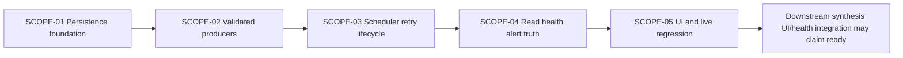

# BUG-004-004 Execution Scopes

## Execution Outline

### Phase Order

1. **SCOPE-01 - Durable synthesis persistence foundation (`foundation:true`)**: migrate PostgreSQL to authoritative run, attempt, output, insight, and citation records; implement atomic commit/read-back, idempotency, and non-destructive rollback.
2. **SCOPE-02 - Validated daily and weekly producers**: require schema-valid, authorized, source-cited complete/quiet/partial candidates before the persistence transaction.
3. **SCOPE-03 - Durable scheduler, retry, and lifecycle**: bind scheduled/manual triggers to deterministic logical runs, cross-process claims, bounded retries, recovery, supersession, retention, and audit.
4. **SCOPE-04 - Canonical read, health, alert, and API truth**: derive latest/history/detail/retry and health solely from durable attempts plus read-back output; never-run, stale, partial, failed, and recovery remain exclusive.
5. **SCOPE-05 - Today/Status UI and real-stack regression**: render durable synthesis, citation disclosure, health, retry lifecycle, privacy clearing, responsive accessibility, and broad red-to-green Playwright evidence.

Only SCOPE-01 is ready at plan creation. No producer, scheduler, health, alert, API, or UI scope may claim readiness before the persistence foundation and its real-PostgreSQL checkpoint are Done.

### New Types And Signatures

- `SynthesisRunCoordinator.Run(ctx, cadence, normalizedWindow, trigger) -> RunResult`
- `SynthesisProducer.Build(ctx, RunInput) -> Candidate`
- `SynthesisValidator.Validate(ctx, Candidate, SourcePolicy) -> ValidatedCandidate`
- `SynthesisPersistence.Claim`, `CommitAtomic`, `ReadAggregate`, `ReadHistory`, `DeriveHealth`
- `SynthesisReadModel` and `SynthesisHealthPolicy`
- PostgreSQL relations `synthesis_runs`, `synthesis_run_attempts`, `synthesis_outputs`, `synthesis_citations`, revised `synthesis_insights`
- APIs `GET /api/intelligence/synthesis/latest`, `GET /runs`, `GET /runs/{runId}`, `POST /retries`
- health states `never-run | running | ready-current | ready-quiet | degraded-partial | degraded-stale | failed-without-output | failed-with-prior-output | read-degraded`

### Validation Checkpoints

- **After SCOPE-01:** migration round-trip, atomic rollback, duplicate/concurrent claim, read-back aggregate, and adversarial return-only implementation tests pass against disposable PostgreSQL.
- **After SCOPE-02:** daily/weekly candidates cannot persist without valid schema, authorized citations, and declared source completeness; quiet/partial are explicit persisted outcomes.
- **After SCOPE-03:** process restart and concurrent trigger tests prove durable identity, bounded retries, lifecycle, and audit independent of process mutexes.
- **After SCOPE-04:** API, health, metrics, and alerts agree on durable truth and clear only after verified persisted recovery.
- **After SCOPE-05:** real browser tests prove current/quiet/stale/partial/never-run/failure/privacy/retry behavior on desktop/mobile without interception, then packet guards pass.

## Dependency Graph



## Scope Inventory

| Scope | Outcome | Surfaces | Depends On | Status |
|---|---|---|---|---|
| SCOPE-01 | Synthesis output is atomically durable and readable | migrations, PostgreSQL repository, transaction/read-back | - | Not Started |
| SCOPE-02 | Only validated source-cited candidates reach persistence | daily/weekly producers, source/schema policy | SCOPE-01 | Not Started |
| SCOPE-03 | Retries and lifecycle are durable and idempotent | scheduler, coordinator, claims, retention | SCOPE-02 | Not Started |
| SCOPE-04 | APIs, health, and alerts derive from durable truth | authenticated API, health, metrics, alerts | SCOPE-03 | Not Started |
| SCOPE-05 | Today/Status expose truthful accessible behavior | `/digest`, `/status`, Playwright, privacy | SCOPE-04 | Not Started |

---

## Scope 1: Durable Synthesis Persistence Foundation

**Scope ID:** SCOPE-01  
**Status:** Not Started  
**Scope-Kind:** runtime-behavior  
**Foundation:** true  
**Depends On:** -

### Requirements And Scenarios

- SYNTH-001, SYNTH-002, SYNTH-003, SYNTH-004, SYNTH-006
- SCN-004-004-01, SCN-004-004-02, SCN-004-004-03

```gherkin
Scenario: SCN-004-004-01 Successful run commits one complete aggregate
  Given eligible authorized source artifacts and a validated candidate for a normalized window
  When SynthesisPersistence commits the logical run
  Then run, output, insight, and citation rows commit in one serializable transaction
  And the production aggregate reader reads the same output identity and counts back together

Scenario: SCN-004-004-02 Duplicate logical run is idempotent
  Given one logical principal/cadence/window/source-set/policy run already committed
  When the same trigger runs concurrently or after process restart
  Then exactly one output exists
  And the later attempt records idempotent no-change against the existing output

Scenario: SCN-004-004-03 Required write failure rolls back atomically
  Given an output insert succeeds but a later required insight or citation write fails
  When the transaction ends
  Then no output, insight, citation, or success transition from that attempt survives
  And the separately recorded failure attempt references no uncommitted content
```

### Implementation Plan

1. Add the migration for `synthesis_runs`, attempts, outputs, citations, revised insight ownership/lifecycle, constraints, and indexes; classify legacy records without fabricating current/cited status.
2. Implement deterministic logical keys from cadence, configured principal, normalized UTC window, policy version, and canonical identifier-only source-set fingerprint.
3. Implement durable claim and one serializable transaction for output, insights, citations, supersession, run state, and attempt state.
4. Implement a production aggregate read by output ID and make successful read-back a mandatory post-commit gate.
5. Record failed/rolled-back attempts only after the content transaction has rolled back; no failure row can expose candidate text or source content.
6. Preserve legacy compatibility for one rollback release; after any new run exists, rollback is code-only and non-destructive.

### Shared Infrastructure Impact Sweep

- Migration runner ordering and schema bootstrap
- Existing synthesis insight readers and compatibility fields
- Scheduler startup against pre/post migration schemas
- health queries that currently read `MAX(created_at)`
- test-stack migration/reset and disposable PostgreSQL fixture creation
- backup/restore compatibility for new tables
- rollback behavior before versus after the first new run

Independent canary: start a disposable stack from a migrated blank database, persist/read one aggregate, restart the core, then re-read the same identity before broader suites run.

### Change Boundary

**Allowed:** next migration, synthesis persistence/domain package, real PostgreSQL repository/tests, migration/bootstrap tests, and interfaces needed by later scopes.  
**Excluded:** `/digest` and `/status` presentation, scheduler timing, alert rules, unrelated digest tables, graph construction logic, provider integrations, and multi-tenant artifact ownership.

### Migration And Rollback

- Forward migration follows the eight design steps, including valid legacy classification and delayed NOT NULL/FK enforcement.
- The down migration is allowed only while `synthesis_runs` is empty. Once a new run exists, rollback preserves all new tables and audit/output provenance.
- A rollback test must prove old binaries ignore retained new tables without destructive DDL.

### Test Plan

| ID | Test Type | Category | Scenario | File / Expected Test Title | Command | Live System |
|---|---|---|---|---|---|---|
| T004-01-MIGRATE | Integration | `integration` | SCN-004-004-01 | `tests/integration/synthesis/migration_test.go` - `TestSynthesisMigrationCreatesConstrainedDurableModelAndPreservesLegacyAudit` | `./smackerel.sh test integration` | Yes |
| T004-01-COMMIT | Integration | `integration` | SCN-004-004-01 | `tests/integration/synthesis/persistence_test.go` - `TestSynthesisAggregateCommitsAndReadsBackAtomically` | `./smackerel.sh test integration` | Yes |
| T004-02-IDEMPOTENT | Integration | `integration` | SCN-004-004-02 | `tests/integration/synthesis/persistence_test.go` - `TestConcurrentAndRestartedLogicalRunCreatesOneOutput` | `./smackerel.sh test integration` | Yes |
| T004-03-ROLLBACK | Integration | `integration` | SCN-004-004-03 | `tests/integration/synthesis/persistence_test.go` - `TestRequiredChildWriteFailureRollsBackCompleteAggregate` | `./smackerel.sh test integration` | Yes |
| T004-01-ADVERSARIAL | E2E API regression | `e2e-api` | SCN-004-004-01 | `tests/e2e/synthesis_persistence_e2e_test.go` - `Regression: return-and-log synthesis cannot pass without durable read-back` | `./smackerel.sh test e2e` | Yes |
| T004-01-ROLLBACK-COMPAT | Integration | `integration` | SCN-004-004-01 | `tests/integration/synthesis/migration_test.go` - `TestRollbackPreservesNewRunProvenanceAfterFirstWrite` | `./smackerel.sh test integration` | Yes |

### Definition of Done - Tiered Validation

#### Core Outcomes

- [ ] SCN-004-004-01: A successful run commits run, output, insight, and citation rows in one serializable transaction, and the production aggregate reader reads the same output identity and counts back together.
- [ ] SCN-004-004-02: A duplicate logical run (same principal/cadence/window/source-set/policy) across concurrency or restart yields exactly one output and records the later attempt as idempotent no-change.
- [ ] SCN-004-004-03: A required insight or citation write failure after the output insert rolls back the complete aggregate atomically so no output, insight, citation, or success transition from that attempt survives.
- [ ] PostgreSQL is the sole authoritative store for logical runs, attempts, outputs, insights, citations, lifecycle, and audit.
- [ ] One serializable transaction commits the complete aggregate, and mandatory production read-back gates success.
- [ ] Deterministic identity prevents duplicate output across concurrency and restart; rolled-back content leaves no partial rows.
- [ ] Forward migration, legacy classification, bootstrap canary, and non-destructive rollback behavior are proven.

#### Test Evidence - One Item Per Test Plan Row

- [ ] T004-01-MIGRATE passes with current-session raw evidence in `report.md#t004-01-migrate`.
- [ ] T004-01-COMMIT passes with current-session raw evidence in `report.md#t004-01-commit`.
- [ ] T004-02-IDEMPOTENT passes with current-session raw evidence in `report.md#t004-02-idempotent`.
- [ ] T004-03-ROLLBACK passes with current-session raw evidence in `report.md#t004-03-rollback`.
- [ ] T004-01-ADVERSARIAL fails against return-and-log behavior, then passes after persistence; both outputs are in `report.md#t004-01-adversarial`.
- [ ] T004-01-ROLLBACK-COMPAT passes with current-session raw evidence in `report.md#t004-01-rollback-compat`.

#### Build Quality Gate

- [ ] Migration/repository/integration/E2E tests, disposable-store isolation, schema lint, check/lint/format, artifact-lint, traceability, documentation, zero warnings, impact-sweep canary, and change-boundary review all pass with executed evidence.

---

## Scope 2: Validated Daily And Weekly Producers

**Scope ID:** SCOPE-02  
**Status:** Not Started  
**Scope-Kind:** runtime-behavior  
**Depends On:** SCOPE-01

### Requirements And Scenarios

- SYNTH-001, SYNTH-004, SYNTH-005, SYNTH-007
- SCN-004-004-01, SCN-004-004-04, SCN-004-004-07, SCN-004-004-08

```gherkin
Scenario: SCN-004-004-01 Daily and weekly producers persist cited output
  Given authorized canonical graph sources for a daily or weekly window
  When each cadence producer builds and validation succeeds
  Then every non-quiet insight has authorized citations and schema-valid payload
  And the complete candidate commits through SynthesisPersistence and reads back

Scenario: SCN-004-004-04 Invalid or uncited candidate is rejected
  Given, separately, a missing citation, invalid payload, unauthorized artifact, or required source omission
  When validation runs
  Then persistence is not entered and no output is stored
  And the attempt ends with the matching safe terminal failure code

Scenario: SCN-004-004-07 Quiet is durable output, not missing work
  Given a valid source set produces no qualifying insights
  When the producer completes
  Then one quiet output with window, evaluated counts, and run provenance commits
  And it reads differently from never-run and failure

Scenario: SCN-004-004-08 Permitted partial output names omissions
  Given one optional source class fails while required classes remain valid
  When policy permits partial synthesis
  Then the persisted output records included and omitted classes
  And no unsupported prose or full-completeness claim is present
```

### Implementation Plan

1. Define daily and weekly producer interfaces over canonical PostgreSQL reads and one required/optional source-class policy from explicit SST.
2. Preserve the existing bounded cross-domain query, but remove count-only success and warning-and-continue behavior for required components.
3. Implement validation for cadence/window, principal, source-set membership, authorization, citations, confidence, schema, payload/insight identity, completeness, and word limits before transaction entry.
4. Emit explicit `quiet` candidates for valid no-insight windows and explicit `partial` only for policy-approved optional omissions.
5. Route every valid candidate through SCOPE-01 persistence and read-back; no producer writes tables directly or surfaces unverified text.
6. Add content-free run metrics/traces and safe failure codes without synthesis text, source titles, artifact content, or fingerprints.

### Test Plan

| ID | Test Type | Category | Scenario | File / Expected Test Title | Command | Live System |
|---|---|---|---|---|---|---|
| T004-01-PRODUCERS | Integration | `integration` | SCN-004-004-01 | `tests/integration/synthesis/producers_test.go` - `TestDailyAndWeeklyProducersPersistSourceCitedAggregates` | `./smackerel.sh test integration` | Yes |
| T004-04-VALIDATOR | Unit | `unit` | SCN-004-004-04 | `internal/intelligence/synthesis_validator_test.go` - `TestValidatorRejectsUncitedSchemaInvalidAndUnauthorizedCandidates` | `./smackerel.sh test unit` | No |
| T004-04-NOWRITE | E2E API regression | `e2e-api` | SCN-004-004-04 | `tests/e2e/synthesis_persistence_e2e_test.go` - `Regression: invalid candidate stores no output or partial child rows` | `./smackerel.sh test e2e` | Yes |
| T004-07-QUIET | Integration | `integration` | SCN-004-004-07 | `tests/integration/synthesis/producers_test.go` - `TestNoInsightWindowPersistsQuietOutput` | `./smackerel.sh test integration` | Yes |
| T004-07-QUIET-E2E | E2E API regression | `e2e-api` | SCN-004-004-07 | `tests/e2e/synthesis_persistence_e2e_test.go` - `Regression: quiet output is not never-run or failed` | `./smackerel.sh test e2e` | Yes |
| T004-08-PARTIAL | Integration | `integration` | SCN-004-004-08 | `tests/integration/synthesis/producers_test.go` - `TestOptionalSourceFailurePersistsExplicitPartialProvenance` | `./smackerel.sh test integration` | Yes |

### Definition of Done - Tiered Validation

#### Core Outcomes

- [ ] SCN-004-004-01: Daily and weekly producers build schema-valid, source-cited complete candidates that commit through SynthesisPersistence and read back.
- [ ] SCN-004-004-04: A missing citation, invalid payload, unauthorized artifact, or required-source omission is rejected before persistence with the matching safe terminal failure code and stores nothing.
- [ ] SCN-004-004-07: A valid no-insight window persists one explicit quiet output with window, evaluated counts, and run provenance that reads differently from never-run and failure.
- [ ] SCN-004-004-08: A policy-approved optional source omission persists an explicit partial output naming included and omitted classes with no unsupported prose or full-completeness claim.
- [ ] Daily and weekly producers return validated candidates and never bypass the persistence/read-back foundation.
- [ ] Every non-quiet persisted insight carries authorized source citations; invalid, uncited, unauthorized, or required-incomplete candidates store nothing.
- [ ] Quiet and policy-approved partial outputs are durable, explicit, and mutually exclusive from never-run/failure/full health.
- [ ] Producer telemetry is content-free and uses closed cadence/outcome/failure labels.

#### Test Evidence - One Item Per Test Plan Row

- [ ] T004-01-PRODUCERS passes with current-session raw evidence in `report.md#t004-01-producers`.
- [ ] T004-04-VALIDATOR passes with current-session raw evidence in `report.md#t004-04-validator`.
- [ ] T004-04-NOWRITE passes with current-session raw evidence in `report.md#t004-04-nowrite`.
- [ ] T004-07-QUIET passes with current-session raw evidence in `report.md#t004-07-quiet`.
- [ ] T004-07-QUIET-E2E passes with current-session raw evidence in `report.md#t004-07-quiet-e2e`.
- [ ] T004-08-PARTIAL passes with current-session raw evidence in `report.md#t004-08-partial`.

#### Build Quality Gate

- [ ] Unit/integration/E2E regression, source authorization, schema/citation, privacy telemetry, check/lint/format, artifact-lint, traceability, docs, and broad synthesis regressions pass with executed evidence and zero warnings.

---

## Scope 3: Durable Scheduler Retry And Lifecycle

**Scope ID:** SCOPE-03  
**Status:** Not Started  
**Scope-Kind:** runtime-behavior  
**Depends On:** SCOPE-02

### Requirements And Scenarios

- SYNTH-002, SYNTH-003, SYNTH-006, SYNTH-009
- SCN-004-004-02, SCN-004-004-03, SCN-004-004-06

```gherkin
Scenario: SCN-004-004-02 Scheduled and manual retries share durable identity
  Given one logical run is active or committed
  When duplicate scheduled and operator triggers arrive across processes or restart
  Then advisory locking and the unique logical key prevent duplicate output
  And every trigger has an auditable attempt outcome

Scenario: SCN-004-004-03 Retry failure leaves no partial output
  Given a transient persistence failure occurs inside an attempt
  When bounded retries exhaust
  Then each content transaction rolls back and the logical run ends failed
  And no output is delivered or reported available

Scenario: SCN-004-004-06 Lifecycle and recovery remain truthful
  Given an output becomes stale, superseded, or archived, or the latest attempt fails
  When scheduler recovery and lifecycle work run
  Then audit provenance remains append-preserving
  And only a newly persisted and read-back-verified complete or quiet output can restore healthy state
```

### Implementation Plan

1. Add explicit fail-loud SST for actor, cadence freshness, retry budget/backoff, policy, source classes, lease, and retention.
2. Keep the process-local guard as a cheap optimization, but make advisory lock plus durable logical-run claim authoritative across replicas/restarts.
3. Route daily/weekly scheduled jobs and operator retry requests through the coordinator; remove success logs/delivery based solely on in-memory return.
4. Implement typed transient versus terminal failures, bounded cancellation-aware retries, attempt increments, stale-lease recovery, and restart continuity.
5. Implement current-to-stale/superseded/archived lifecycle without hard-deleting attempts or citation provenance.
6. Gate surfacing/delivery on persisted read-back. Treat delivery failure separately from synthesis durability.

### Test Plan

| ID | Test Type | Category | Scenario | File / Expected Test Title | Command | Live System |
|---|---|---|---|---|---|---|
| T004-02-SCHED | Integration | `integration` | SCN-004-004-02 | `tests/integration/synthesis/scheduler_test.go` - `TestScheduledAndManualTriggersShareDurableLogicalRun` | `./smackerel.sh test integration` | Yes |
| T004-02-RESTART | E2E API regression | `e2e-api` | SCN-004-004-02 | `tests/e2e/synthesis_retry_e2e_test.go` - `Regression: process restart cannot duplicate committed synthesis` | `./smackerel.sh test e2e` | Yes |
| T004-03-EXHAUST | Integration | `integration` | SCN-004-004-03 | `tests/integration/synthesis/scheduler_test.go` - `TestRetryExhaustionRollsBackAndNeverDeliversOutput` | `./smackerel.sh test integration` | Yes |
| T004-06-LIFECYCLE | Integration | `integration` | SCN-004-004-06 | `tests/integration/synthesis/lifecycle_test.go` - `TestSynthesisLifecyclePreservesAuditAcrossStaleSupersededAndArchived` | `./smackerel.sh test integration` | Yes |
| T004-06-RECOVERY | E2E API regression | `e2e-api` | SCN-004-004-06 | `tests/e2e/synthesis_retry_e2e_test.go` - `Regression: only persisted read-back recovery resolves failed or stale run` | `./smackerel.sh test e2e` | Yes |
| T004-03-STRESS | Stress | `stress` | SCN-004-004-02/03 | `tests/stress/synthesis_retry_stress_test.go` - `Concurrent triggers stay single-output within bounded retry budget` | `./smackerel.sh test stress` | Yes |

### Definition of Done - Tiered Validation

#### Core Outcomes

- [ ] SCN-004-004-02: Duplicate scheduled and operator triggers across processes or restart share one durable logical identity so advisory locking and the unique logical key prevent duplicate output, and every trigger has an auditable attempt outcome.
- [ ] SCN-004-004-03: When bounded retries exhaust a transient persistence failure, each content transaction rolls back, the logical run ends failed, and no output is delivered or reported available.
- [ ] SCN-004-004-06: Across stale, superseded, archived, or failed states, audit provenance remains append-preserving and only a newly persisted read-back-verified complete or quiet output restores healthy state.
- [ ] Scheduled and manual triggers use one durable logical-run identity, authoritative cross-process claim, and append-preserving attempt audit.
- [ ] Retries are explicit, bounded, cancellation-aware, restart-safe, and cannot deliver or report an unpersisted candidate.
- [ ] Lifecycle moves outputs through current/stale/superseded/archived without deleting provenance, and rollback preserves durable records.
- [ ] Recovery state changes only after complete/quiet commit plus production read-back.

#### Test Evidence - One Item Per Test Plan Row

- [ ] T004-02-SCHED passes with current-session raw evidence in `report.md#t004-02-sched`.
- [ ] T004-02-RESTART passes with current-session raw evidence in `report.md#t004-02-restart`.
- [ ] T004-03-EXHAUST passes with current-session raw evidence in `report.md#t004-03-exhaust`.
- [ ] T004-06-LIFECYCLE passes with current-session raw evidence in `report.md#t004-06-lifecycle`.
- [ ] T004-06-RECOVERY passes with current-session raw evidence in `report.md#t004-06-recovery`.
- [ ] T004-03-STRESS passes with current-session raw evidence in `report.md#t004-03-stress`.

#### Build Quality Gate

- [ ] Scheduler/coordinator integration, restart, stress, lifecycle, cancellation, delivery-boundary, check/lint/format, artifact-lint, traceability, docs, and broad scheduler regression checks pass with executed evidence and zero warnings.

---

## Scope 4: Canonical Read Health Alert And API Truth

**Scope ID:** SCOPE-04  
**Status:** Not Started  
**Scope-Kind:** runtime-behavior  
**Depends On:** SCOPE-03

### Requirements And Scenarios

- SYNTH-007, SYNTH-008, SYNTH-009, SYNTH-010
- SCN-004-004-05, SCN-004-004-06, SCN-004-004-07, SCN-004-004-08, SCN-004-004-09

```gherkin
Scenario: SCN-004-004-05 Never-run cannot be healthy
  Given no synthesis attempt or persisted output exists
  When the latest API, authenticated health, and alert evaluator read state
  Then state is never-run and strict synthesis readiness is not up
  And no epoch sentinel, generic success, or sample output appears

Scenario: SCN-004-004-06 Stale or failed remains alerted until verified recovery
  Given the latest output exceeds its cadence threshold or the latest run failed
  When health and alerts evaluate
  Then the exclusive stale/failed state and active alert are reported
  And request acceptance, running, or an unverified commit cannot clear it

Scenario: SCN-004-004-07 Quiet and partial are durable distinct read states
  Given a quiet or approved partial output has committed and read back
  When latest/history/detail are read
  Then quiet or partial output identity, window, completeness, and safe provenance appear
  And never-run, failed, or full-health claims are absent as applicable

Scenario: SCN-004-004-09 Authorization and telemetry preserve privacy
  Given an unauthenticated caller, another user, or a reader without operator scope
  When synthesis APIs, health, metrics, logs, and traces are inspected
  Then access and detail are limited by the authorization matrix
  And no text, source title, artifact content, run existence, or high-cardinality personal label leaks
```

### Implementation Plan

1. Implement one claim-bound `SynthesisReadModel` for latest output, attempts, insights, citations, lifecycle, completeness, and health.
2. Add authenticated latest, run-history, run-detail, and retry routes with bounded cursor/filter validation, context-derived actor, CSRF on mutation, and closed error codes.
3. Replace epoch-sentinel and probe-error-is-up logic with `SynthesisHealthPolicy` derived from durable latest attempt, latest persisted output, freshness SST, completeness, and read-back status.
4. Add alert rules that activate on required stale/failure/read-back states and clear only after verified complete/quiet recovery; partial remains degraded.
5. Preserve aggregate-only unauthenticated health and redact other-user/operator-only metadata.
6. Emit content-free run/health/retry metrics and spans; assert no prose, titles, source IDs, actor IDs, or raw errors become labels or logs.

### Test Plan

| ID | Test Type | Category | Scenario | File / Expected Test Title | Command | Live System |
|---|---|---|---|---|---|---|
| T004-05-HEALTH | Integration | `integration` | SCN-004-004-05 | `tests/integration/synthesis/health_test.go` - `TestNeverRunAndProbeFailureAreNeverUp` | `./smackerel.sh test integration` | Yes |
| T004-05-API | E2E API regression | `e2e-api` | SCN-004-004-05 | `tests/e2e/synthesis_api_e2e_test.go` - `Regression: latest synthesis never-run is not empty success or healthy` | `./smackerel.sh test e2e` | Yes |
| T004-06-ALERT | Integration | `integration` | SCN-004-004-06 | `tests/integration/synthesis/alert_test.go` - `TestStaleAndFailedAlertsClearOnlyAfterVerifiedPersistedRecovery` | `./smackerel.sh test integration` | Yes |
| T004-07-08-API | E2E API regression | `e2e-api` | SCN-004-004-07/08 | `tests/e2e/synthesis_api_e2e_test.go` - `Regression: quiet and partial persisted states remain exclusive and truthful` | `./smackerel.sh test e2e` | Yes |
| T004-09-AUTH | E2E API regression | `e2e-api` | SCN-004-004-09 | `tests/e2e/synthesis_api_e2e_test.go` - `Regression: synthesis APIs deny unauthorized callers without existence disclosure` | `./smackerel.sh test e2e` | Yes |
| T004-09-TELEMETRY | Security regression | `integration` | SCN-004-004-09 | `tests/integration/synthesis/observability_test.go` - `TestSynthesisTelemetryContainsSafeRunMetadataOnly` | `./smackerel.sh test integration` | Yes |

### Definition of Done - Tiered Validation

#### Core Outcomes

- [ ] SCN-004-004-05: With no attempt or persisted output, latest API, authenticated health, and the alert evaluator report never-run, strict synthesis readiness is not up, and no epoch sentinel, generic success, or sample output appears.
- [ ] SCN-004-004-06: When the latest output exceeds its cadence threshold or the latest run failed, the exclusive stale/failed state and active alert are reported and cannot be cleared by request acceptance, running, or an unverified commit.
- [ ] SCN-004-004-07: Committed quiet or approved partial output is read as its own distinct state with identity, window, completeness, and safe provenance, absent never-run, failed, or full-health claims as applicable.
- [ ] SCN-004-004-09: An unauthenticated caller, another user, or a reader without operator scope is limited by the authorization matrix so no text, source title, artifact content, run existence, or high-cardinality personal label leaks through APIs, health, metrics, logs, or traces.
- [ ] Latest/history/detail/retry, authenticated health, and alerts consume one durable read/health model and closed state vocabulary.
- [ ] Never-run and probe failure are never up; stale/failed alerts clear only after persisted read-back recovery; partial remains degraded.
- [ ] Authorization is context-derived and prevents text, citations, run identity, timestamps, counts, and existence hints from crossing the matrix.
- [ ] Logs, metrics, traces, and alert labels are bounded and content-free.

#### Test Evidence - One Item Per Test Plan Row

- [ ] T004-05-HEALTH passes with current-session raw evidence in `report.md#t004-05-health`.
- [ ] T004-05-API passes with current-session raw evidence in `report.md#t004-05-api`.
- [ ] T004-06-ALERT passes with current-session raw evidence in `report.md#t004-06-alert`.
- [ ] T004-07-08-API passes with current-session raw evidence in `report.md#t004-07-08-api`.
- [ ] T004-09-AUTH passes with current-session raw evidence in `report.md#t004-09-auth`.
- [ ] T004-09-TELEMETRY passes with current-session raw evidence in `report.md#t004-09-telemetry`.

#### Build Quality Gate

- [ ] API/auth/health/alert/observability tests, CSRF and privacy scans, check/lint/format, alert-rule validation, artifact-lint, traceability, docs, broad health regression, and zero-warning checks pass with executed evidence.

---

## Scope 5: Today Status UI And Real-Stack Regression

**Scope ID:** SCOPE-05  
**Status:** Not Started  
**Scope-Kind:** runtime-behavior  
**Depends On:** SCOPE-04

### Requirements And Scenarios

- SYNTH-001 through SYNTH-011
- SCN-004-004-01 through SCN-004-004-10

```gherkin
Scenario: SCN-004-004-01 Today renders only durable cited output
  Given a complete synthesis and citations committed and read back
  When the authorized reader opens Today
  Then the exact persisted text, window, time, and authorized citation disclosure appear together
  And no in-memory or unverified output is rendered

Scenario: SCN-004-004-05 through SCN-004-004-08 Reader and operator states are exclusive
  Given real durable never-run, quiet, stale, partial, failed-without-output, or failed-with-prior-output state
  When Today and Status render
  Then both surfaces show the matching state from the same output/attempt identity
  And prior verified output is labeled separately from a failed latest attempt

Scenario: SCN-004-004-09 Authorization loss clears synthesis content
  Given personal synthesis text and citations are visible
  When the real session expires or scope is denied
  Then prose, titles, counts, windows, run IDs, timestamps, and existence hints leave the DOM and accessibility tree before auth recovery paints

Scenario: SCN-004-004-10 Synthesis states and Retry are accessible and responsive
  Given a keyboard or screen-reader user on desktop and 320px at 200 percent zoom
  When citations, filters, run evidence, confirmation, Retry, running, persisted, idempotent, and failed states are used
  Then focus, announcements, target sizes, reflow, and state exclusivity satisfy the UX contract without overlap or horizontal scroll
```

### Implementation Plan

1. Add Today's Weekly Synthesis section and Status's Synthesis section as projections of `SynthesisReadModel`; retain the existing daily digest independently.
2. Render prose only when output ID, window, persisted time, and citation aggregate read together. Implement native citation disclosure and safe authorized links.
3. Implement exclusive current/quiet/stale/partial/never-run/failed-without-output/failed-with-prior-output/auth states and separate prior verified output from latest failure.
4. Implement run-history filters, filtered-empty versus no-history, evidence detail, Retry confirmation, requested/running/persisted/idempotent/failed feedback, and alert-clear timing.
5. Clear all synthesis-derived DOM/accessibility state synchronously on auth loss.
6. Implement desktop/mobile reflow, 44px targets, 320px/200% zoom, focus restoration, live-region behavior, and no pointer-only controls.
7. Use real disposable PostgreSQL and real production APIs in Playwright. Do not intercept internal requests, inject canned output, conditionally skip assertions, or use URL-only success checks.

### UI Scenario Matrix

| Scenario | Setup | User Steps | Required Assertion | Test |
|---|---|---|---|---|
| Durable current output | Real persisted complete output | Open Today; expand citations | Exact stored aggregate and authorized links; Available exclusive | T004-01-UI |
| Quiet/never-run | Separate persisted quiet and blank-store fixtures | Open Today and Status | Quiet has run metadata; never-run has none; states do not overlap | T004-05-07-UI |
| Stale/partial/failure | Real lifecycle/failed attempt fixtures | Open both surfaces; inspect evidence | Exact limitation, prior output boundary, active alert | T004-06-08-UI |
| Retry success/idempotency/failure | Operator session and real coordinator outcomes | Confirm Retry and follow status | Accepted is not success; persisted read-back clears alert; duplicate/failure remain truthful | T004-RETRY-UI |
| Privacy/accessibility/mobile | Visible private output, then real auth rejection | Use keyboard at desktop/320px; expire session | Private content clears; focus/reflow/announcements are correct | T004-09-10-UI |

### Consumer Impact Sweep

- `/digest` synthesis section and existing daily digest copy
- `/status` synthesis health and run history
- authenticated API clients, CSRF retry, polling, and error decoder
- citation/detail links and authorization
- health/alert labels and operator status claims
- navigation/deep links and browser history
- PWA service-worker/network-only behavior for authenticated responses
- docs/capability claims that currently imply generation equals persistence
- stale-reference scan for `GetLastSynthesisTime`, epoch sentinel, count-only success, and `No digest generated yet` on read failure

### Test Plan

| ID | Test Type | Category | Scenario | File / Expected Test Title | Command | Live System |
|---|---|---|---|---|---|---|
| T004-01-UI | E2E UI regression | `e2e-ui` | SCN-004-004-01 | `web/pwa/tests/synthesis-truth.spec.ts` - `Regression: Today renders exact persisted synthesis and authorized citations only after read-back` | `./smackerel.sh test e2e-ui` | Yes |
| T004-02-UI | E2E UI regression | `e2e-ui` | SCN-004-004-02 | `web/pwa/tests/synthesis-truth.spec.ts` - `Regression: rerun shows no duplicate output in Today or run history` | `./smackerel.sh test e2e-ui` | Yes |
| T004-03-04-UI | E2E UI regression | `e2e-ui` | SCN-004-004-03/04 | `web/pwa/tests/synthesis-truth.spec.ts` - `Regression: rolled-back or rejected candidate exposes no prose or citation` | `./smackerel.sh test e2e-ui` | Yes |
| T004-05-07-UI | E2E UI regression | `e2e-ui` | SCN-004-004-05/07 | `web/pwa/tests/synthesis-truth.spec.ts` - `Regression: never-run and durable quiet remain mutually exclusive` | `./smackerel.sh test e2e-ui` | Yes |
| T004-06-08-UI | E2E UI regression | `e2e-ui` | SCN-004-004-06/08 | `web/pwa/tests/synthesis-truth.spec.ts` - `Regression: stale partial and failed states retain exact durable provenance and alert truth` | `./smackerel.sh test e2e-ui` | Yes |
| T004-RETRY-UI | E2E UI regression | `e2e-ui` | SCN-004-004-02/03/06 | `web/pwa/tests/synthesis-truth.spec.ts` - `Regression: Retry acceptance running persisted idempotent and rollback states are truthful` | `./smackerel.sh test e2e-ui` | Yes |
| T004-09-10-UI | E2E UI | `e2e-ui` | SCN-004-004-09/10 | `web/pwa/tests/synthesis-truth.spec.ts` - `Synthesis privacy and keyboard responsive behavior hold at desktop and 320px 200 percent zoom` | `./smackerel.sh test e2e-ui` | Yes |
| T004-UI-UNIT | UI unit | `ui-unit` | SCN-004-004-05..10 | `internal/web/synthesis_projection_test.go` - `TestSynthesisProjectionClosedStatesAndPrivacyClearing` | `./smackerel.sh test unit` | No |
| T004-BROAD | Broad E2E regression | `e2e-ui` | SCN-004-004-01..10 | existing Today/Status plus `synthesis-truth.spec.ts` - `Today and Status remain coherent after durable synthesis integration` | `./smackerel.sh test e2e-ui` | Yes |

### Definition of Done - Tiered Validation

#### Core Outcomes

- [ ] SCN-004-004-01: Today renders the exact persisted text, window, time, and authorized citation disclosure together only after read-back, and never renders in-memory or unverified output.
- [ ] SCN-004-004-05: For real durable never-run, quiet, stale, partial, failed-without-output, and failed-with-prior-output states, Today and Status show the matching state from the same output/attempt identity and label prior verified output separately from a failed latest attempt.
- [ ] SCN-004-004-09: When the real session expires or scope is denied, prose, titles, counts, windows, run IDs, timestamps, and existence hints leave the DOM and accessibility tree before auth recovery paints.
- [ ] SCN-004-004-10: Citations, filters, run evidence, confirmation, Retry, running, persisted, idempotent, and failed states satisfy focus, announcements, target sizes, reflow, and state exclusivity on desktop and at 320px/200% zoom without overlap or horizontal scroll.
- [ ] Today and Status render one durable persisted truth model; no scheduler acceptance, in-memory value, or failed transaction can produce Available content.
- [ ] Current, quiet, stale, partial, never-run, failed-without-output, failed-with-prior-output, and auth states are exclusive and preserve the correct citation/provenance boundaries.
- [ ] Retry mutation feedback is truthful from confirmation through read-back and alert resolution; history filters never trigger runs or masquerade as no history.
- [ ] Auth loss clears private synthesis content before recovery; desktop/mobile/keyboard/screen-reader behavior satisfies the spec.
- [ ] Consumer impact, migration/rollback, security/privacy, observability, docs, and prior Today/Status journeys remain coherent.

#### Test Evidence - One Item Per Test Plan Row

- [ ] T004-01-UI passes with current-session raw evidence and screenshots in `report.md#t004-01-ui`.
- [ ] T004-02-UI passes with current-session raw evidence in `report.md#t004-02-ui`.
- [ ] T004-03-04-UI passes with current-session raw evidence in `report.md#t004-03-04-ui`.
- [ ] T004-05-07-UI passes with current-session raw evidence in `report.md#t004-05-07-ui`.
- [ ] T004-06-08-UI passes with current-session raw evidence in `report.md#t004-06-08-ui`.
- [ ] T004-RETRY-UI passes with current-session raw evidence in `report.md#t004-retry-ui`.
- [ ] T004-09-10-UI passes with desktop/mobile/accessibility evidence in `report.md#t004-09-10-ui`.
- [ ] T004-UI-UNIT passes with current-session raw evidence in `report.md#t004-ui-unit`.
- [ ] T004-BROAD passes with current-session raw evidence in `report.md#t004-broad`.

#### Build Quality Gate

- [ ] Full packet unit/integration/E2E API/E2E UI/stress tests, Playwright anti-interception and bailout guards, privacy/security scans, migration canary, check/lint/format/build, implementation reality, artifact-lint, traceability, docs/capability truth, broad regression, and zero-warning checks all pass with executed evidence before certification.

## Planning Assumptions And Owner Routes

- The current single-operator source graph is explicit. Any future multi-user source ownership requirement routes to `bubbles.analyst` and `bubbles.design`; this bug must not fabricate per-user isolation by adding only an output actor column.
- No UI or health scope may begin before SCOPE-01 through SCOPE-03 are Done; durable persistence is the foundation, not an implementation detail.
- Documentation status changes are `bubbles.docs` owned; certification fields are `bubbles.validate` owned.

## Planning Completion Criteria

- Every SCN-004-004 scenario maps to concrete unit/integration/live E2E coverage.
- Every Test Plan row has exactly one matching unchecked DoD evidence item.
- The return-and-log defect has explicit adversarial red-to-green proof.
- All mutable live tests use disposable real PostgreSQL and production code paths without internal mocks or request interception.
- No planning checkbox is pre-completed and no execution evidence is claimed.
