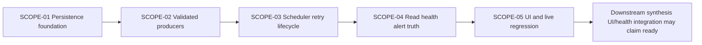

# BUG-004-004 Execution Scopes

## Corrective Planning Reopen - 2026-08-30

The operator authorized unattended reconciliation after post-certification runtime evidence contradicted the delivered claims in SCOPE-03 and SCOPE-04. Those scopes are active again. Their original checked items and linked report evidence remain unchanged as historical certification receipts, but they do not certify the corrective work added by this reopen. New corrective scenarios, Test Plan rows, and unchecked DoD items are appended to the affected scopes after repository and evidence reconciliation.

**Active corrective sequence:** SCOPE-03 must restore durable causal event, retry, restart, and supersession truth before SCOPE-04 restores cadence-scoped read, health, recovery, readiness, and deploy truth. SCOPE-05 requires regression revalidation after both corrective scopes complete; its prior UI delivery record remains historical until then.

### Implementation Files

- `config/smackerel.yaml`
- `scripts/lib/runtime.sh`
- `docker-compose.synthesis-cadence-e2e.override.yml`
- `internal/config/validate_test.go`
- `internal/deploy/synthesis_cadence_overlay_contract_test.go`
- `tests/e2e/run_all.sh`
- `tests/e2e/synthesis_api_e2e_test.go`
- `tests/e2e/synthesis_prior_source_compatibility_e2e_test.sh`
- `tests/e2e/synthesis_restart_durability_e2e_test.sh`
- `tests/e2e/synthesis_scheduler_cadence_e2e_test.sh`
- `tests/integration/synthesis_coordinator_test.go`
- `tests/integration/synthesis_event_ledger_test.go`
- `tests/integration/synthesis_health_test.go`
- `tests/integration/synthesis_migration_test.go`
- `tests/integration/synthesis_persistence_test.go`
- `tests/integration/synthesis_runtime_config_test.go`
- `tests/integration/synthesis_telemetry_test.go`
- `tests/stress/synthesis_retry_stress_test.go`
- `tests/unit/cli/runtime_compose_stdin_test.sh`
- `tests/unit/cli/synthesis_test_harness_contract_test.sh`
- `web/pwa/tests/synthesis_truth.spec.ts`

### Corrective Phase Order

1. **SCOPE-03A - Causal run-event ledger and replacement lifecycle:** add the immutable event relation and refactor claim, attempt, terminal, read-back, recovery, and changed-source replacement into one causal run/attempt/output model.
2. **SCOPE-04A - Cadence-scoped health, startup reconciliation, and fail-closed release proof:** derive reader and readiness state per configured actor and cadence, reconcile abandoned work without inventing success, and prove recovery through the real deploy verification boundary.
3. **SCOPE-05R - Existing surface revalidation:** rerun the unchanged Today/Status privacy, accessibility, and state-exclusivity contracts against the corrected read model. This is a revalidation checkpoint inside SCOPE-04A, not a new production implementation scope.

### Corrective Types And Signatures

- additive migration `<next>_synthesis_run_event_truth.sql`; existing migrations 064 through 066 remain byte-preserved
- `SynthesisRunEvent{RunID, AttemptNo, EventType, OutputID, FailureCode, InsightCount, CitationCount, CreatedAt}`
- `SynthesisPersistence.AppendEvent`, `StartAttempt`, `FinishAttempt`, `CommitReplacement`, `RecordReadbackFailure`, `RecordRecovery`
- `SynthesisReadQuery{Actor, Cadence, FreshnessBudget, ObservedAt}` and `SynthesisReadSnapshot{LatestAttempt, CurrentOutput, Health}`
- `SynthesisCoordinator.ReconcileStartup(ctx, actor, cadence, now)`
- required cadence-specific freshness values in the Smackerel SST, generated environment, runtime config, scheduler, web projection, health, alerts, and tests
- planned trace workflow `synthesis.health-recovery` with `synthesis.startup.reconcile`, `synthesis.read.snapshot`, and `synthesis.health.aggregate` spans

### Corrective Validation Checkpoints

- **After SCOPE-03A:** migration/immutability canary, causal linkage, audit-write failure propagation, changed-source replacement, and concurrent same-window tests must pass before health code changes.
- **After SCOPE-04A local canaries:** per-actor/per-cadence reader, alert-state lifecycle, startup ordering, SST runtime propagation, running-core strict readiness, real-browser accessibility, security, trace, and stress checks must pass. Then the broad local API suite and the separate broad Playwright suite must pass before any candidate deploy is requested.
- **After explicit deployment approval:** the knb-owned target action must refuse unhealthy intelligence, then accept only a newly persisted and read-back-verified recovery. The later approval-gated rollback action must restore the accepted prior release without erasing candidate database history.
- **After target acceptance and rollback proof:** final certification may evaluate the child and parent packets. Local test success never authorizes deployment or rollback by itself.

## Execution Outline

### Phase Order

1. **SCOPE-01 - Durable synthesis persistence foundation (`foundation:true`)**: migrate PostgreSQL to authoritative run, attempt, output, insight, and citation records; implement atomic commit/read-back, idempotency, and non-destructive rollback.
2. **SCOPE-02 - Validated daily and weekly producers**: require schema-valid, authorized, source-cited complete/quiet/partial candidates before the persistence transaction.
3. **SCOPE-03 - Durable scheduler, retry, and lifecycle**: bind scheduled/manual triggers to deterministic logical runs, cross-process claims, bounded retries, recovery, supersession, retention, and audit.
4. **SCOPE-04 - Canonical read, health, alert, and API truth**: derive latest/history/detail/retry and health solely from durable attempts plus read-back output; never-run, stale, partial, failed, and recovery remain exclusive.
5. **SCOPE-05 - Today/Status UI and real-stack regression**: render durable synthesis, citation disclosure, health, retry lifecycle, privacy clearing, responsive accessibility, and broad red-to-green Playwright evidence.

Only SCOPE-01 is ready at plan creation. No producer, scheduler, health, alert, API, or UI scope may claim readiness before the persistence foundation and its real-PostgreSQL checkpoint are Done.

### New Types And Signatures

- `SynthesisRunCoordinator.Run(ctx, cadence, normalizedWindow, trigger) -> RunResult`
- `SynthesisProducer.Build(ctx, RunInput) -> Candidate`
- `SynthesisValidator.Validate(ctx, Candidate, SourcePolicy) -> ValidatedCandidate`
- `SynthesisPersistence.Claim`, `CommitAtomic`, `ReadAggregate`, `ReadHistory`, `DeriveHealth`
- `SynthesisReadModel` and `SynthesisHealthPolicy`
- PostgreSQL relations `synthesis_runs`, `synthesis_run_attempts`, `synthesis_outputs`, `synthesis_citations`, revised `synthesis_insights`
- APIs `GET /api/intelligence/synthesis/latest`, `GET /runs`, `GET /runs/{runId}`, `POST /retries`
- health states `never-run | running | ready-current | ready-quiet | degraded-partial | degraded-stale | failed-without-output | failed-with-prior-output | read-degraded`

### Validation Checkpoints

- **After SCOPE-01:** migration round-trip, atomic rollback, duplicate/concurrent claim, read-back aggregate, and adversarial return-only implementation tests pass against disposable PostgreSQL.
- **After SCOPE-02:** daily/weekly candidates cannot persist without valid schema, authorized citations, and declared source completeness; quiet/partial are explicit persisted outcomes.
- **After SCOPE-03:** process restart and concurrent trigger tests prove durable identity, bounded retries, lifecycle, and audit independent of process mutexes.
- **After SCOPE-04:** API, health, metrics, and alerts agree on durable truth and clear only after verified persisted recovery.
- **After SCOPE-05:** real browser tests prove current/quiet/stale/partial/never-run/failure/privacy/retry behavior on desktop/mobile without interception, then packet guards pass.

## Dependency Graph


```mermaid
flowchart LR
  S01[SCOPE-01 Persistence foundation] --> S02[SCOPE-02 Validated producers]
  S02 --> S03[SCOPE-03 Scheduler retry lifecycle]
  S03 --> S04[SCOPE-04 Read health alert truth]
  S04 --> S05[SCOPE-05 UI and live regression]
  S05 --> UI[Downstream synthesis UI/health integration may claim ready]
```

## Scope Inventory

| Scope | Outcome | Surfaces | Depends On | Status |
|---|---|---|---|---|
| SCOPE-01 | Synthesis output is atomically durable and readable | migrations, PostgreSQL repository, transaction/read-back | - | Done |
| SCOPE-02 | Only validated source-cited candidates reach persistence | daily/weekly producers, source/schema policy | SCOPE-01 | Done |
| SCOPE-03 | Retries and lifecycle are durable and idempotent | scheduler, coordinator, claims, retention | SCOPE-02 | Done |
| SCOPE-04 | APIs, health, and alerts derive from durable truth | authenticated API, health, metrics, alerts | SCOPE-03 | In Progress - blocked by SCOPE-03 corrective completion |
| SCOPE-05 | Today/Status expose truthful accessible behavior | `/digest`, `/status`, Playwright, privacy | SCOPE-04 | Done historically; revalidation required |

---

## Scope 1: Durable Synthesis Persistence Foundation

**Scope ID:** SCOPE-01  
**Status:** Done
**Scope-Kind:** runtime-behavior  
**Foundation:** true  
**Depends On:** -

### Requirements And Scenarios

- SYNTH-001, SYNTH-002, SYNTH-003, SYNTH-004, SYNTH-006
- SCN-004-004-01, SCN-004-004-02, SCN-004-004-03

```gherkin
Scenario: SCN-004-004-01 Successful run commits one complete aggregate
  Given eligible authorized source artifacts and a validated candidate for a normalized window
  When SynthesisPersistence commits the logical run
  Then run, output, insight, and citation rows commit in one serializable transaction
  And the production aggregate reader reads the same output identity and counts back together

Scenario: SCN-004-004-02 Duplicate logical run is idempotent
  Given one logical principal/cadence/window/source-set/policy run already committed
  When the same trigger runs concurrently or after process restart
  Then exactly one output exists
  And the later attempt records idempotent no-change against the existing output

Scenario: SCN-004-004-03 Required write failure rolls back atomically
  Given an output insert succeeds but a later required insight or citation write fails
  When the transaction ends
  Then no output, insight, citation, or success transition from that attempt survives
  And the separately recorded failure attempt references no uncommitted content
```

### Implementation Plan

1. Add the migration for `synthesis_runs`, attempts, outputs, citations, revised insight ownership/lifecycle, constraints, and indexes; classify legacy records without fabricating current/cited status.
2. Implement deterministic logical keys from cadence, configured principal, normalized UTC window, policy version, and canonical identifier-only source-set fingerprint.
3. Implement durable claim and one serializable transaction for output, insights, citations, supersession, run state, and attempt state.
4. Implement a production aggregate read by output ID and make successful read-back a mandatory post-commit gate.
5. Record failed/rolled-back attempts only after the content transaction has rolled back; no failure row can expose candidate text or source content.
6. Preserve legacy compatibility for one rollback release; after any new run exists, rollback is code-only and non-destructive.

### Shared Infrastructure Impact Sweep

- Migration runner ordering and schema bootstrap
- Existing synthesis insight readers and compatibility fields
- Scheduler startup against pre/post migration schemas
- health queries that currently read `MAX(created_at)`
- test-stack migration/reset and disposable PostgreSQL fixture creation
- backup/restore compatibility for new tables
- rollback behavior before versus after the first new run

Independent canary: start a disposable stack from a migrated blank database, persist/read one aggregate, restart the core, then re-read the same identity before broader suites run.

### Change Boundary

**Allowed:** next migration, synthesis persistence/domain package, real PostgreSQL repository/tests, migration/bootstrap tests, and interfaces needed by later scopes.  
**Excluded:** `/digest` and `/status` presentation, scheduler timing, alert rules, unrelated digest tables, graph construction logic, provider integrations, and multi-tenant artifact ownership.

**Allowed file families** for the packet as a whole, verified against
`git diff --name-only` over every commit in it:

| Family | Why it is in bounds |
|---|---|
| `internal/db/migrations/` | The durable schema this packet exists to add |
| `internal/intelligence/` | Existing home of synthesis logic and the health mapping |
| `internal/web/` | The Today and Status projection and its templates |
| `internal/api/` | The four read routes, and the session-attachment repair |
| `cmd/core/` | Wiring the reader into the running server |
| `tests/`, `web/pwa/tests/` | The checks that prove all of the above |
| `docs/`, `specs/.../` | Operator surface and the packet record |

**Excluded surfaces**, none of which were changed: provider integrations,
graph construction, digest tables unrelated to synthesis, multi-tenant artifact
ownership, delivery transports, and the Python ML sidecar.

One entry deserves its own note. `internal/api/router.go` was NOT in the
original boundary. It was pulled in because a mutation test exposed a live
session-attachment defect that made every page render `auth_required` for a
logged-in reader. Leaving it unrepaired would have meant shipping a synthesis
section that no authenticated person could see, so the repair is recorded here
rather than quietly absorbed.

### Migration And Rollback

- Forward migration follows the eight design steps, including valid legacy classification and delayed NOT NULL/FK enforcement.
- The down migration is allowed only while `synthesis_runs` is empty. Once a new run exists, rollback preserves all new tables and audit/output provenance.
- A rollback test must prove old binaries ignore retained new tables without destructive DDL.

### Test Plan

| ID | Test Type | Category | Scenario | File / Expected Test Title | Command | Live System |
|---|---|---|---|---|---|---|
| T004-01-MIGRATE | Integration | `integration` | SCN-004-004-01 | `tests/integration/synthesis_migration_test.go` - `TestSynthesisMigration_BootstrapCanaryCreatesFullShape` | `./smackerel.sh test integration` | Yes |
| T004-01-COMMIT | Integration | `integration` | SCN-004-004-01 | `tests/integration/synthesis_persistence_test.go` - `TestSynthesisPersistence_CommitsOneCompleteAggregate` | `./smackerel.sh test integration` | Yes |
| T004-02-IDEMPOTENT | Integration | `integration` | SCN-004-004-02 | `tests/integration/synthesis_persistence_test.go` - `TestSynthesisPersistence_DuplicateLogicalRunIsIdempotent` | `./smackerel.sh test integration` | Yes |
| T004-03-ROLLBACK | Integration | `integration` | SCN-004-004-03 | `tests/integration/synthesis_persistence_test.go` - `TestSynthesisPersistence_RequiredWriteFailureRollsBackAtomically` | `./smackerel.sh test integration` | Yes |
| T004-01-ADVERSARIAL | E2E API regression | `e2e-api` | SCN-004-004-01 | `tests/e2e/synthesis_api_e2e_test.go` - `TestSynthesisAPI_NoOutputIsEverHalfWritten` | `./smackerel.sh test e2e` | Yes |
| T004-01-ROLLBACK-COMPAT | Integration | `integration` | SCN-004-004-01 | `tests/integration/synthesis_migration_test.go` - `TestSynthesisMigration_IsNonDestructive` | `./smackerel.sh test integration` | Yes |
| T004-01-REGRESSION-E2E | Regression E2E | `e2e-api` | SCN-004-004-01 | `tests/e2e/synthesis_api_e2e_test.go` - `TestSynthesisAPI_NoOutputIsEverHalfWritten` | `./smackerel.sh test e2e` | Yes |

### Definition of Done - Tiered Validation

#### Core Outcomes

- [x] SCN-004-004-01: A successful run commits run, output, insight, and citation rows in one serializable transaction, and the production aggregate reader reads the same output identity and counts back together. → Evidence: [report.md](report.md#scope-01-implementation-phase)
- [x] SCN-004-004-02: A duplicate logical run (same principal/cadence/window/source-set/policy) across concurrency or restart yields exactly one output and records the later attempt as idempotent no-change. → Evidence: [report.md](report.md#scope-01-implementation-phase)
- [x] SCN-004-004-03: A required insight or citation write failure after the output insert rolls back the complete aggregate atomically so no output, insight, citation, or success transition from that attempt survives. → Evidence: [report.md](report.md#scope-01-implementation-phase)
- [x] PostgreSQL is the sole authoritative store for logical runs, attempts, outputs, insights, citations, lifecycle, and audit. Evidence: [report.md#scope-02-implementation-phase](report.md#scope-02-implementation-phase)
- [x] One serializable transaction commits the complete aggregate, and mandatory production read-back gates success. → Evidence: [report.md](report.md#scope-01-implementation-phase)
- [x] Deterministic identity prevents duplicate output across concurrency and restart; rolled-back content leaves no partial rows. → Evidence: [report.md](report.md#scope-01-implementation-phase)
- [x] Forward migration, legacy classification, bootstrap canary, and non-destructive rollback behavior are proven. Evidence: [report.md#scope-02-implementation-phase](report.md#scope-02-implementation-phase)

#### Test Evidence - One Item Per Test Plan Row

- [x] T004-01-MIGRATE passes with current-session raw evidence in `report.md#t004-01-migrate`. → Evidence: [report.md](report.md#scope-01-implementation-phase)
- [x] T004-01-COMMIT passes with current-session raw evidence in `report.md#t004-01-commit`. → Evidence: [report.md](report.md#scope-01-implementation-phase)
- [x] T004-02-IDEMPOTENT passes with current-session raw evidence in `report.md#t004-02-idempotent`. → Evidence: [report.md](report.md#scope-01-implementation-phase)
- [x] T004-03-ROLLBACK passes with current-session raw evidence in `report.md#t004-03-rollback`. → Evidence: [report.md](report.md#scope-01-implementation-phase)
- [x] T004-01-ADVERSARIAL fails against return-and-log behavior, then passes after persistence; both outputs are in `report.md#t004-01-adversarial-red-and-green`. Evidence: [report.md#t004-01-adversarial-red-and-green](report.md#t004-01-adversarial-red-and-green)ion-phase](report.md#scope-02-implementation-phase)
- [x] T004-01-ROLLBACK-COMPAT passes with current-session raw evidence in `report.md#t004-01-rollback-compat`. Evidence: [report.md#scope-02-implementation-phase](report.md#scope-02-implementation-phase)

#### Build Quality Gate

- [x] Change Boundary is respected and zero excluded file families were changed, verified with `git diff --name-only` across every commit in the packet. Evidence: [report.md#scope-05-packet-closeout](report.md#scope-05-packet-closeout)
- [x] Scenario-specific E2E regression tests for EVERY new/changed/fixed behavior in this scope exist and pass: `TestSynthesisAPI_NoOutputIsEverHalfWritten` proves no output is ever half-written. Evidence: [report.md#t004-01-adversarial-red-and-green](report.md#t004-01-adversarial-red-and-green)sarial](report.md#t004-01-adversarial)
- [x] Broader E2E regression suite passes with no new failures: `./smackerel.sh test e2e` EXIT=0, 36 passed, 0 failed. Evidence: [report.md#scope-05-packet-closeout](report.md#scope-05-packet-closeout)
- [x] Migration/repository/integration/E2E tests, disposable-store isolation, schema lint, check/lint/format, artifact-lint, traceability, documentation, zero warnings, impact-sweep canary, and change-boundary review all pass with executed evidence. Evidence: [report.md#scope-02-implementation-phase](report.md#scope-02-implementation-phase)

---

## Scope 2: Validated Daily And Weekly Producers

**Scope ID:** SCOPE-02  
**Status:** Done
**Scope-Kind:** runtime-behavior  
**Depends On:** SCOPE-01

### Requirements And Scenarios

- SYNTH-001, SYNTH-004, SYNTH-005, SYNTH-007
- SCN-004-004-01, SCN-004-004-04, SCN-004-004-07, SCN-004-004-08

```gherkin
Scenario: SCN-004-004-01 Daily and weekly producers persist cited output
  Given authorized canonical graph sources for a daily or weekly window
  When each cadence producer builds and validation succeeds
  Then every non-quiet insight has authorized citations and schema-valid payload
  And the complete candidate commits through SynthesisPersistence and reads back

Scenario: SCN-004-004-04 Invalid or uncited candidate is rejected
  Given, separately, a missing citation, invalid payload, unauthorized artifact, or required source omission
  When validation runs
  Then persistence is not entered and no output is stored
  And the attempt ends with the matching safe terminal failure code

Scenario: SCN-004-004-07 Quiet is durable output, not missing work
  Given a valid source set produces no qualifying insights
  When the producer completes
  Then one quiet output with window, evaluated counts, and run provenance commits
  And it reads differently from never-run and failure

Scenario: SCN-004-004-08 Permitted partial output names omissions
  Given one optional source class fails while required classes remain valid
  When policy permits partial synthesis
  Then the persisted output records included and omitted classes
  And no unsupported prose or full-completeness claim is present
```

### Implementation Plan

1. Define daily and weekly producer interfaces over canonical PostgreSQL reads and one required/optional source-class policy from explicit SST.
2. Preserve the existing bounded cross-domain query, but remove count-only success and warning-and-continue behavior for required components.
3. Implement validation for cadence/window, principal, source-set membership, authorization, citations, confidence, schema, payload/insight identity, completeness, and word limits before transaction entry.
4. Emit explicit `quiet` candidates for valid no-insight windows and explicit `partial` only for policy-approved optional omissions.
5. Route every valid candidate through SCOPE-01 persistence and read-back; no producer writes tables directly or surfaces unverified text.
6. Add content-free run metrics/traces and safe failure codes without synthesis text, source titles, artifact content, or fingerprints.

### Test Plan

| ID | Test Type | Category | Scenario | File / Expected Test Title | Command | Live System |
|---|---|---|---|---|---|---|
| T004-01-PRODUCERS | Integration | `integration` | SCN-004-004-01 | `tests/integration/synthesis_producer_test.go` - `TestSynthesisProducer_PersistsWhereReturnAndLogDidNot` | `./smackerel.sh test integration` | Yes |
| T004-04-VALIDATOR | Unit | `unit` | SCN-004-004-04 | `internal/intelligence/synthesis_validator_test.go` - `TestValidator_RejectsUncitedInsight` | `./smackerel.sh test unit` | No |
| T004-04-NOWRITE | E2E API regression | `e2e-api` | SCN-004-004-04 | `tests/e2e/synthesis_api_e2e_test.go` - `TestSynthesisAPI_NoOutputIsEverHalfWritten` | `./smackerel.sh test e2e` | Yes |
| T004-07-QUIET | Integration | `integration` | SCN-004-004-07 | `tests/integration/synthesis_producer_test.go` - `TestSynthesisProducer_EmptyCorpusPersistsQuietOutput` | `./smackerel.sh test integration` | Yes |
| T004-07-QUIET-E2E | E2E API regression | `e2e-api` | SCN-004-004-07 | `tests/e2e/synthesis_api_e2e_test.go` - `TestSynthesisAPI_QuietWindowReadsAsRunNotBroken` | `./smackerel.sh test e2e` | Yes |
| T004-08-PARTIAL | Integration | `integration` | SCN-004-004-08 | `tests/integration/synthesis_persistence_test.go` - `TestSynthesisPersistence_PartialOutputNamesOmissions` | `./smackerel.sh test integration` | Yes |
| T004-02-REGRESSION-E2E | Regression E2E | `e2e-api` | SCN-004-004-02 | `tests/e2e/synthesis_api_e2e_test.go` - `TestSynthesisAPI_DuplicateTriggersShareOneDurableIdentity` | `./smackerel.sh test e2e` | Yes |

### Definition of Done - Tiered Validation

#### Core Outcomes

- [x] SCN-004-004-01: Daily and weekly producers build schema-valid, source-cited complete candidates that commit through SynthesisPersistence and read back. Evidence: [report.md#scope-02-implementation-phase](report.md#scope-02-implementation-phase)
- [x] SCN-004-004-04: A missing citation, invalid payload, unauthorized artifact, or required-source omission is rejected before persistence with the matching safe terminal failure code and stores nothing. Evidence: [report.md#scope-02-implementation-phase](report.md#scope-02-implementation-phase)
- [x] SCN-004-004-07: A valid no-insight window persists one explicit quiet output with window, evaluated counts, and run provenance that reads differently from never-run and failure. Evidence: [report.md#scope-02-implementation-phase](report.md#scope-02-implementation-phase)
- [x] SCN-004-004-08: A policy-approved optional source omission persists an explicit partial output naming included and omitted classes with no unsupported prose or full-completeness claim. Evidence: [report.md#scope-02-implementation-phase](report.md#scope-02-implementation-phase)
- [x] Daily and weekly producers return validated candidates and never bypass the persistence/read-back foundation. Evidence: [report.md#scope-02-implementation-phase](report.md#scope-02-implementation-phase)
- [x] Every non-quiet persisted insight carries authorized source citations; invalid, uncited, unauthorized, or required-incomplete candidates store nothing. Evidence: [report.md#scope-02-implementation-phase](report.md#scope-02-implementation-phase)
- [x] Quiet and policy-approved partial outputs are durable, explicit, and mutually exclusive from never-run/failure/full health. Evidence: [report.md#scope-02-implementation-phase](report.md#scope-02-implementation-phase)
- [x] Producer telemetry is content-free and uses closed cadence/outcome/failure labels. Evidence: [report.md#scope-02-implementation-phase](report.md#scope-02-implementation-phase)

#### Test Evidence - One Item Per Test Plan Row

- [x] T004-01-PRODUCERS passes with current-session raw evidence in `report.md#t004-01-producers`. Evidence: [report.md#scope-02-implementation-phase](report.md#scope-02-implementation-phase)
- [x] T004-04-VALIDATOR passes with current-session raw evidence in `report.md#t004-04-validator`. Evidence: [report.md#scope-02-implementation-phase](report.md#scope-02-implementation-phase)
- [x] T004-04-NOWRITE passes with current-session raw evidence in `report.md#t004-04-nowrite`. Evidence: [report.md#t004-04-nowrite](report.md#t004-04-nowrite)
- [x] T004-07-QUIET passes with current-session raw evidence in `report.md#t004-07-quiet`. Evidence: [report.md#scope-02-implementation-phase](report.md#scope-02-implementation-phase)
- [x] T004-07-QUIET-E2E passes with current-session raw evidence in `report.md#t004-07-quiet-e2e`. Evidence: [report.md#t004-07-quiet-e2e](report.md#t004-07-quiet-e2e)
- [x] T004-08-PARTIAL passes with current-session raw evidence in `report.md#t004-08-partial`. Evidence: [report.md#scope-02-implementation-phase](report.md#scope-02-implementation-phase)

#### Build Quality Gate

- [x] Scenario-specific E2E regression tests for EVERY new/changed/fixed behavior in this scope exist and pass: `TestSynthesisAPI_DuplicateTriggersShareOneDurableIdentity` proves duplicate triggers share one durable identity. Evidence: [report.md#scope-02-implementation-phase](report.md#scope-02-implementation-phase)
- [x] Broader E2E regression suite passes with no new failures: `./smackerel.sh test e2e` EXIT=0, 36 passed, 0 failed. Evidence: [report.md#scope-05-packet-closeout](report.md#scope-05-packet-closeout)
- [x] Unit/integration/E2E regression, source authorization, schema/citation, privacy telemetry, check/lint/format, artifact-lint, traceability, docs, and broad synthesis regressions pass with executed evidence and zero warnings. Evidence: [report.md#scope-02-implementation-phase](report.md#scope-02-implementation-phase)

---

## Scope 3: Durable Scheduler Retry And Lifecycle

**Scope ID:** SCOPE-03  
**Status:** Done
**Scope-Kind:** runtime-behavior  
**Depends On:** SCOPE-02

### Requirements And Scenarios

- SYNTH-002, SYNTH-003, SYNTH-006, SYNTH-009
- SCN-004-004-02, SCN-004-004-03, SCN-004-004-06

```gherkin
Scenario: SCN-004-004-02 Scheduled and manual retries share durable identity
  Given one logical run is active or committed
  When duplicate scheduled and operator triggers arrive across processes or restart
  Then advisory locking and the unique logical key prevent duplicate output
  And every trigger has an auditable attempt outcome

Scenario: SCN-004-004-03 Retry failure leaves no partial output
  Given a transient persistence failure occurs inside an attempt
  When bounded retries exhaust
  Then each content transaction rolls back and the logical run ends failed
  And no output is delivered or reported available

Scenario: SCN-004-004-06 Lifecycle and recovery remain truthful
  Given an output becomes stale, superseded, or archived, or the latest attempt fails
  When scheduler recovery and lifecycle work run
  Then audit provenance remains append-preserving
  And only a newly persisted and read-back-verified complete or quiet output can restore healthy state
```

### Implementation Plan

1. Add explicit fail-loud SST for actor, cadence freshness, retry budget/backoff, policy, source classes, lease, and retention.
2. Keep the process-local guard as a cheap optimization, but make advisory lock plus durable logical-run claim authoritative across replicas/restarts.
3. Route daily/weekly scheduled jobs and operator retry requests through the coordinator. Stop emitting success logs or delivery based solely on an in-memory return.
4. Implement typed transient versus terminal failures, bounded cancellation-aware retries, attempt increments, stale-lease recovery, and restart continuity.
5. Implement current-to-stale/superseded/archived lifecycle without hard-deleting attempts or citation provenance.
6. Gate surfacing/delivery on persisted read-back. Treat delivery failure separately from synthesis durability.

### 2026-08-30 Corrective Extension - Causal Event Ledger And Replacement Lifecycle (SCOPE-03A)

**Corrective Status:** Done
**Corrective Depends On:** SCOPE-02 historical foundation; SCOPE-04A is blocked until this extension is Done.
**Priority:** P0

The original SCOPE-03 implementation record remains historical. The following scenarios and corrective DoD rows are the active contract for recertification.

Post-evidence reconciliation is scope-local: a corrective DoD row is eligible for completion only when its linked report anchor contains current-session executable evidence for that exact claim. SCOPE-04A remains outside this reconciliation.

For the 2026-09-01 continuation, non-Docker artifact and planning gates may validate packet consistency but cannot substitute for any unit, integration, E2E, stress, restart, or lifecycle execution named below. T004-C15-RESTART remains limited to event and latest/history/detail API truth; strict-health proof remains exclusively in SCOPE-04A.

#### Corrective Requirements And Scenarios

- SYNTH-002, SYNTH-003, SYNTH-006, SYNTH-009, SYNTH-010
- SCN-004-004-C11 through SCN-004-004-C15, plus SCN-004-004-C21

```gherkin
Scenario: SCN-004-004-C11 Every trigger has one causal attempt and immutable event history
  Given a scheduled or operator trigger for the configured actor, cadence, and normalized window
  When the trigger is claimed, executed, and reaches a terminal outcome
  Then attempt_started and exactly one causal terminal event reference the same run and attempt number
  And the event history cannot be updated or deleted and contains no synthesis text or source content

Scenario: SCN-004-004-C12 Audit persistence failure cannot be swallowed
  Given a trigger reaches a terminal success, failure, idempotent, or read-back-failed outcome
  When persistence of the required terminal event fails
  Then the producer and scheduler surface a typed audit-persistence failure
  And neither delivery nor a healthy or persisted claim is emitted for that trigger

Scenario: SCN-004-004-C13 Changed source supersedes current output atomically
  Given a current output exists for one configured actor, cadence, and normalized window
  And the authorized source-set or policy fingerprint changes
  When the rerun commits under the actor/cadence/window advisory lock
  Then one replacement run and output become current and the prior output becomes superseded in the same transaction
  And a superseded event links the prior and replacement output identities while exactly one current output remains

Scenario: SCN-004-004-C14 Same-source replay remains idempotent under concurrency
  Given a current output exists for one actor, cadence, window, source-set, and policy identity
  When scheduled and operator triggers race across processes
  Then all triggers serialize on the actor/cadence/window lock and resolve to one output
  And every trigger records its own idempotent or terminal attempt outcome without cross-run linkage

Scenario: SCN-004-004-C15 Read-back failure is durable and recoverable without false success
  Given a content transaction commits but the production aggregate reader cannot verify the output
  When the trigger finishes
  Then readback_failed is appended for that run and attempt and the output is not surfaced or treated as recovered
  And a later verified attempt appends recovered only after its output and citations read back coherently

Scenario: SCN-004-004-C21 The certified prior source remains locally compatible without becoming a deployment pointer
  Given full source commit 7c3838e3b2de9ecba2e6a7764493a0412c4ed268 exists in the local Git object database
  And a disposable database is migrated through 067
  When an isolated detached worktree builds that source through its own ./smackerel.sh command and the resulting digest boots with runtime network access disabled
  Then authenticated liveness and prior-source reads succeed against the migrated database
  And prior-source daily and weekly writes either remain compatible or fail closed without a fabricated causal event
  And the current candidate retains migration 067 data and appends a strict causal write after the prior-source container stops
  And every worktree, image, container, network, volume, database, and unique test reference is removed
  But this local source compatibility proof neither selects nor verifies an operator deployment pointer or exceptional backup restore
```

#### Corrective Implementation Plan

1. Allocate the next migration number at implementation time. Add `synthesis_run_events` with closed event types `claimed`, `attempt_started`, `idempotent`, `persisted`, `quiet`, `partial`, `rolled_back`, `retryable_failure`, `failed`, `readback_failed`, `recovered`, and `superseded`. Add run/attempt/output foreign keys, an attempt linkage constraint, ordered history indexes, and an update/delete rejection trigger or equivalent database privilege enforcement. Add any missing design-required linkage and cadence-payload fields in this additive wave. Do not edit migrations 064, 065, or 066.
2. Add only additive columns and indexes required to make `synthesis_run_attempts` causal: run ID, attempt number, trigger kind, state, output ID where applicable, start/finish timestamps, safe failure code, and uniqueness per `(run_id, attempt_no)`. Backfill legacy summary rows as historical/unlinked only when linkage is provable; never fabricate run or output identity.
3. Restore the design's identity split. `source_set_digest` and policy version identify same-input replay. A separately derived actor/cadence/window key owns the advisory lock. Never solve changed-source replacement by removing the source-set from logical identity or by allowing unrelated actors/cadences to share a lock.
4. Replace fire-and-forget `recordAttempt` and `recordFailedAttempt` calls with error-returning persistence operations. A required attempt or terminal-event failure propagates to scheduler/API callers and blocks delivery/healthy claims. Preserve committed content for forensic recovery, but classify it committed-unverified until the event and read-back contracts complete.
5. Move terminal summary mutation and its matching immutable event into one short transaction. Move supersede-before-insert, replacement output, terminal event, superseded event, and one-current verification into the serializable content transaction under the actor/cadence/window lock.
6. Make same-source replay append an idempotent attempt/event against the existing output. Make changed-source rerun append a distinct run/output and invoke the production supersession path. Replace the test-only reachability condition so `MarkSuperseded` has a production caller.
7. Append `readback_failed` when post-commit aggregate verification fails. Append `recovered` only when the same actor/cadence has a later complete/quiet output whose production aggregate read verifies output, insight, citation, and event counts.
8. Route both daily and weekly scheduler jobs through the coordinator and persistence/read-back path. Persist the design-defined cadence payload rather than delivering `GenerateWeeklySynthesis` memory directly. No scheduler log or Telegram delivery may precede the terminal event plus read-back gate.
9. Implement the existing design's fail-loud actor, retry budget/backoff, lease, policy version, source-class policy, and retention SST fields through generated configuration and runtime wiring. Replace hardcoded principals and retry/lease values in scheduler, API, producer, and `cmd/core` wiring with SST-derived values.
10. Emit bounded attempt/run/event metrics and spans for claim, attempt, transaction, read-back, recovery, and supersession. Attributes may contain cadence, trigger, safe state/code, attempt number, bounded counts, and authorized operator run identity. They must not contain prose, titles, artifact/source IDs, fingerprints, SQL, raw errors, or credentials.
11. Preserve `scripts/lib/runtime.sh::smackerel_compose` as the shared Compose boundary: an `exec` launched from terminal stdin receives `/dev/null`, an `exec` launched with piped or redirected stdin receives that input unchanged, and non-`exec` commands retain their existing argv and stdin behavior.
12. Add `tests/e2e/synthesis_prior_source_compatibility_e2e_test.sh` and register it as `lifecycle` and `required` in `tests/e2e/run_all.sh`. The test must require the full pinned SHA `7c3838e3b2de9ecba2e6a7764493a0412c4ed268` in the local object database, refuse any runtime fetch, create a detached worktree, build through that revision's `./smackerel.sh`, record the final local image digest and resolved build inputs, boot the old core against a disposable database migrated through 067, perform authenticated liveness/read checks plus old daily and weekly write-or-fail-closed checks, switch to the current candidate, prove 067 data retention plus one strict candidate causal write, and remove every owned resource on success, failure, or interruption.
13. Extend `tests/unit/cli/synthesis_test_harness_contract_test.sh` with a static contract that parses the lifecycle script and its `run_all.sh` registration. It must enforce the full SHA, local-object precondition, absence of fetch commands, detached-worktree build through the old revision's CLI, digest/build-input recording, runtime-network denial, lifecycle/required registration, unique resource references, and cleanup traps for every owned resource family.

#### Shared Infrastructure Impact Sweep

- Cover additive PostgreSQL migration ordering, fresh bootstrap, and databases carrying migrations 064 through 066. Replay the exact historical attempt and output INSERT shapes after 067. Preserve nullable 067 causal fields. Project output identity from its referenced run. Create no synthetic event for a legacy attempt. Prove new linked writers remain strict.
- Cover local source compatibility at exact commit `7c3838e3b2de9ecba2e6a7764493a0412c4ed268`. Inspect the detached revision's resolved build inputs. Pin the local image by its final digest. Deny runtime network access. Use unique worktree, image, container, network, volume, database, and test references. Clean every reference on each exit path.
- scheduler and operator-retry callers, process restart, lease reclamation, and concurrent actors/cadences/windows
- run history and operator evidence readers that currently consume summary tables
- health, Prometheus alert, Today, Status, and strict deployment verification consumers
- disposable integration/E2E/stress fixture reset order and database trigger-based fault profiles
- every caller of the high-fan-out `smackerel_compose` helper, with special attention to `exec` callers that stream SQL or other payloads on stdin and ordinary terminal callers that must never block for input; no caller-specific rewrite is permitted

SCOPE-03A canaries run before broad suites in this order: execute the focused Compose-stdin unit regression; execute the exact legacy-shape migration integration contract against 067 and a fresh bootstrap; execute the static lifecycle-harness contract; execute the local prior-source lifecycle E2E; append one current-candidate causal chain; restart the current core; and verify the chain is immutable and readable. If the shared-helper canary finds collateral behavior change, revert only the `smackerel_compose` stdin conditional before any broad suite and keep SCOPE-03A incomplete until all three stdin and argv contracts hold.

SCOPE-03A does not run or claim the operator's pre-deploy pointer rollback, write freeze, pre-migration backup, or exceptional restore. Those host actions remain SCOPE-04A and operator-owned acceptance contracts. Local prior-source compatibility is a Scope 7 prerequisite; exceptional data restore is not.

#### Change Boundary

**Allowed:** the newly allocated additive migration; synthesis persistence/coordinator/producer code; synthesis scheduler wiring; synthesis-specific metrics/traces; synthesis migration, integration, E2E, stress, security, and replacement-transaction rollback tests; `tests/e2e/synthesis_prior_source_compatibility_e2e_test.sh`; its lifecycle/required registration in `tests/e2e/run_all.sh`; its focused static contract in `tests/unit/cli/synthesis_test_harness_contract_test.sh`; the `smackerel_compose` function in `scripts/lib/runtime.sh`; `tests/unit/cli/runtime_compose_stdin_test.sh`; `docker-compose.synthesis-cadence-e2e.override.yml` only when selected by `tests/e2e/synthesis_scheduler_cadence_e2e_test.sh` through `SMACKEREL_COMPOSE_OVERRIDE_FILE`; `internal/deploy/synthesis_cadence_overlay_contract_test.go`; planning-owned packet files.

**Excluded:** every other function in `scripts/lib/runtime.sh`; all existing `smackerel_compose` call sites; top-level test dispatchers other than the exact `tests/e2e/run_all.sh` lifecycle/required registration; every other Compose definition and profile; unrelated digest storage; graph candidate semantics; assistant/Open Knowledge synthesis; connector providers; Python ML sidecar; generic auth/session middleware; unrelated readiness capabilities; host-specific deployment topology; operator pre-deploy pointer selection or mutation; write-freeze, backup, restore, and exceptional data-replacement procedures; and SCOPE-04A implementation.

### Test Plan

| ID | Test Type | Category | Scenario | File / Expected Test Title | Command | Live System |
|---|---|---|---|---|---|---|
| T004-C11-MIGRATE | Migration integration | `integration` | SCN-004-004-C11 | `tests/integration/synthesis_migration_test.go` - `TestSynthesisMigration_PreservesLegacy064Through066InsertShapesAndEnforcesCausal067Writes`; execute the exact legacy attempt/output INSERT shapes after 067, assert projected output identity, nullable legacy causal fields, zero fabricated events, and strict rejection of incomplete new linked writes | `./smackerel.sh test integration` | Yes |
| T004-C11-IMMUTABLE | Security integration | `integration` | SCN-004-004-C11 | `tests/integration/synthesis_event_ledger_test.go` - `TestSynthesisRunEvents_RejectUpdateDeleteAndContentLeakage` | `./smackerel.sh test integration` | Yes |
| T004-C11-CAUSAL | Integration | `integration` | SCN-004-004-C11 | `tests/integration/synthesis_event_ledger_test.go` - `TestSynthesisRunEvents_LinkStartedAndTerminalEventToOneAttempt` | `./smackerel.sh test integration` | Yes |
| T004-C11-WEEKLY | Regression E2E | `e2e-api` | SCN-004-004-C11 | `tests/e2e/synthesis_scheduler_cadence_e2e_test.sh` - `daily and weekly scheduler triggers both persist and read back before delivery`; selects only `docker-compose.synthesis-cadence-e2e.override.yml` through `SMACKEREL_COMPOSE_OVERRIDE_FILE`; supporting production-inert guard: `internal/deploy/synthesis_cadence_overlay_contract_test.go` | `./smackerel.sh test e2e --shell-run synthesis_scheduler_cadence_e2e_test.sh` | Yes |
| T004-C11-COMPOSE-STDIN | Shared helper unit regression | `unit` | SCN-004-004-C11 | `tests/unit/cli/runtime_compose_stdin_test.sh` - `smackerel_compose preserves piped stdin, closes terminal exec stdin, and leaves non-exec behavior and argv unchanged` | `./smackerel.sh test unit` | No |
| T004-C12-AUDIT-RED | Adversarial Regression E2E | `e2e-api` | SCN-004-004-C12 | `tests/e2e/synthesis_api_e2e_test.go` - `TestSynthesisAPI_TerminalEventFailureCannotProduceDeliveryOrSuccess` | `./smackerel.sh test e2e` | Yes |
| T004-C13-REPLACE | Integration | `integration` | SCN-004-004-C13 | `tests/integration/synthesis_persistence_test.go` - `TestSynthesisReplacement_ChangedSourceSupersedesUnderWindowLock` | `./smackerel.sh test integration` | Yes |
| T004-C13-ROLLBACK | Integration | `integration` | SCN-004-004-C13 | `tests/integration/synthesis_persistence_test.go` - `TestSynthesisReplacement_FailedReplacementRestoresPriorCurrentAndAppendsFailure` | `./smackerel.sh test integration` | Yes |
| T004-C14-RACE | Stress | `stress` | SCN-004-004-C14 | `tests/stress/synthesis_retry_stress_test.go` - `TestSynthesisSameAndChangedSourceRacesLeaveOneCurrentAndCompleteEventChains` | `./smackerel.sh test stress` | Yes |
| T004-C14-ACTOR-CADENCE | Integration | `integration` | SCN-004-004-C14 | `tests/integration/synthesis_event_ledger_test.go` - `TestSynthesisAttempts_DoNotCrossPairActorsCadencesRunsOrAttempts` | `./smackerel.sh test integration` | Yes |
| T004-C14-CONFIG-UNIT | Unit contract | `unit` | SCN-004-004-C14 | `internal/config/validate_test.go` - `TestSynthesisRunPolicyIsRequiredAndHasNoFallback` | `./smackerel.sh test unit --go` | No |
| T004-C14-CONFIG-RUNTIME | Runtime integration | `integration` | SCN-004-004-C14 | `tests/integration/synthesis_runtime_config_test.go` - `TestSynthesisRunPolicyReachesCoordinatorAndBothCadences` | `./smackerel.sh test integration` | Yes |
| T004-C15-READBACK | Integration | `integration` | SCN-004-004-C15 | `tests/integration/synthesis_persistence_test.go` - `TestSynthesisReadbackFailurePersistsFailureBeforeVerifiedRecovery` | `./smackerel.sh test integration` | Yes |
| T004-C15-RESTART | Regression E2E | `e2e-api` | SCN-004-004-C15 | `tests/e2e/synthesis_restart_durability_e2e_test.sh` - `committed-unverified state survives restart and recovery appends after verified read-back`. Scope boundary: event and latest/history/detail API truth only. | `./smackerel.sh test e2e --shell-run synthesis_restart_durability_e2e_test.sh` | Yes |
| T004-C21-HARNESS | Lifecycle harness unit contract | `unit` | SCN-004-004-C21 | `tests/unit/cli/synthesis_test_harness_contract_test.sh` - `prior-source lifecycle pins the full SHA, forbids fetch, records digest and inputs, owns unique refs, registers lifecycle required, and cleans every resource` | `./smackerel.sh test unit` | No |
| T004-C21-PRIOR-SOURCE | Prior-source compatibility lifecycle E2E | `e2e-api` | SCN-004-004-C21 | `tests/e2e/synthesis_prior_source_compatibility_e2e_test.sh` - `pinned local prior source and current candidate preserve migration 067 without fabricated causal history`; lifecycle/required in `tests/e2e/run_all.sh`, authenticated live API, old daily and weekly write-or-fail-closed, candidate causal write, full cleanup | `./smackerel.sh test e2e --shell-run synthesis_prior_source_compatibility_e2e_test.sh` | Yes |
| T004-C03-BROAD | Broad Regression E2E | `e2e-api` | SCN-004-004-C11..C15, C21 | existing synthesis API, restart, state-matrix, scheduler, and prior-source lifecycle E2E tests plus the event-failure test | `./smackerel.sh test e2e` | Yes |

#### Corrective Definition of Done - Reconciled Against Current-Session Execution

- [x] SCN-004-004-C11: every scheduled/operator trigger has one run-linked, attempt-numbered `attempt_started` event and exactly one terminal event; history is immutable and content-free. → Evidence: [report.md](report.md#corrective-scope-03a-evidence)
- [x] SCN-004-004-C12: required attempt/terminal-event persistence errors propagate and prevent delivery, persisted, recovered, and healthy claims. → Evidence: [report.md](report.md#corrective-scope-03a-evidence)
- [x] SCN-004-004-C13: changed-source/policy reruns supersede-before-insert under the actor/cadence/window lock, leave exactly one current output, and retain both run histories. → Evidence: [report.md](report.md#corrective-scope-03a-evidence)
- [x] SCN-004-004-C14: same-source races converge idempotently while actors, cadences, runs, and attempts cannot cross-pair. → Evidence: [report.md](report.md#corrective-scope-03a-evidence)
- [x] SCN-004-004-C15: read-back failure appends a durable failure state and only a later coherent aggregate read appends `recovered`. → Evidence: [report.md](report.md#corrective-scope-03a-evidence)
- [x] SCN-004-004-C21: exact local source `7c3838e3b2de9ecba2e6a7764493a0412c4ed268` builds in an isolated detached worktree, runs by final local digest without runtime fetch, proves authenticated prior-source read and daily/weekly write-or-fail-closed behavior through 067, then yields to a current-candidate causal write with all resources removed. No deployment pointer or restore claim is inferred. → Evidence: [report.md](report.md#corrective-scope-03a-evidence)
- [x] T004-C11-MIGRATE executes the exact legacy 064, 065, and 066 attempt/output INSERT shapes after 067 and proves output projection, nullable legacy causal fields, zero fabricated legacy events, strict new linked-writer constraints, and fresh-bootstrap compatibility. → Evidence: [report.md](report.md#corrective-scope-03a-evidence)
- [x] T004-C11-IMMUTABLE passes and proves UPDATE/DELETE rejection plus event-content redaction. → Evidence: [report.md](report.md#corrective-scope-03a-evidence)
- [x] T004-C11-CAUSAL passes and proves start/terminal linkage to one run attempt. → Evidence: [report.md](report.md#corrective-scope-03a-evidence)
- [x] T004-C11-WEEKLY passes and proves both scheduler cadences persist/read back before any delivery or success log. → Evidence: [report.md](report.md#corrective-scope-03a-evidence)
- [x] T004-C11-COMPOSE-STDIN passes through the canonical unit lane and directly proves that piped stdin reaches `docker compose exec`, terminal-backed `exec` sees closed stdin, and non-`exec` Compose behavior and argv remain unchanged. → Evidence: [report.md](report.md#corrective-scope-03a-evidence)
- [x] T004-C12-AUDIT-RED fails against swallowed event-write errors and passes only when the typed error reaches the real trigger boundary. → Evidence: [report.md](report.md#corrective-scope-03a-evidence)
- [x] T004-C13-REPLACE passes for a changed-source replacement under the window lock. → Evidence: [report.md](report.md#corrective-scope-03a-evidence)
- [x] T004-C13-ROLLBACK passes and proves a failed replacement restores the prior current output. → Evidence: [report.md](report.md#corrective-scope-03a-evidence)
- [x] T004-C14-RACE passes under simultaneous same-source and changed-source triggers. → Evidence: [report.md](report.md#corrective-scope-03a-evidence)
- [x] T004-C14-ACTOR-CADENCE passes with deliberately interleaved actors, daily/weekly cadences, run IDs, attempt numbers, and timestamps. → Evidence: [report.md](report.md#corrective-scope-03a-evidence)
- [x] T004-C14-CONFIG-UNIT passes with missing, empty, zero, negative, malformed, and unknown values refused without fallback. → Evidence: [report.md](report.md#corrective-scope-03a-evidence)
- [x] T004-C14-CONFIG-RUNTIME passes with distinct configured actor/retry/lease/policy values observed in both cadence paths. → Evidence: [report.md](report.md#corrective-scope-03a-evidence)
- [x] T004-C15-READBACK passes with a forced production-reader failure followed by a newly verified recovery. → Evidence: [report.md](report.md#corrective-scope-03a-evidence)
- [x] T004-C15-RESTART passes across a real core restart. It proves durable committed-unverified event and latest/history/detail API truth, followed by `recovered` only after a later coherent read-back. Strict-health certification belongs exclusively to T004-C20-STRICT in SCOPE-04A. → Evidence: [report.md](report.md#corrective-scope-03a-evidence)
- [x] T004-C21-HARNESS enforces the full pinned SHA, local-object-only/no-fetch rule, old-revision CLI build, final digest and resolved-input recording, runtime-network denial, lifecycle/required registration, unique resource references, and cleanup traps. → Evidence: [report.md](report.md#corrective-scope-03a-evidence)
- [x] T004-C21-PRIOR-SOURCE passes as a live `e2e-api` lifecycle test and proves prior-source compatibility or fail-closed writes, zero fabricated causal events, retained 067 data, one current-candidate causal write, and complete owned-resource cleanup. → Evidence: [report.md](report.md#corrective-scope-03a-evidence)
- [x] T004-C03-BROAD passes with zero required skips and no internal request interception. → Evidence: [report.md](report.md#corrective-scope-03a-evidence)
- [x] SCOPE-03A completion evidence remains limited to local migration and source compatibility. Operator pre-deploy pointer rollback, write freeze, backup, and exceptional restore remain SCOPE-04A/operator acceptance contracts and are not Scope 7 prerequisites. → Evidence: [report.md](report.md#corrective-scope-03a-evidence)
- [x] Change Boundary is respected and zero excluded file families change. → Evidence: [report.md](report.md#corrective-scope-03a-evidence)
- [x] Build Quality Gate passes: unit/integration/E2E/stress/security checks, check/lint/format, migration integrity, content-free observability, artifact lint, traceability, documentation alignment, zero warnings, and zero required skips. → Evidence: [report.md](report.md#corrective-scope-03a-evidence)

#### Historical Executed Test Plan

| ID | Test Type | Category | Scenario | File / Expected Test Title | Command | Live System |
|---|---|---|---|---|---|---|
| T004-02-SCHED | Integration | `integration` | SCN-004-004-02 | `tests/integration/synthesis_coordinator_test.go` - `TestSynthesisCoordinator_SameHolderMayReclaimItsOwnLease` | `./smackerel.sh test integration` | Yes |
| T004-02-RESTART | E2E shell regression | `e2e-api` | SCN-004-004-02 | `tests/e2e/synthesis_restart_durability_e2e_test.sh` - `T004-02-RESTART window identity survives a real process restart` | `./smackerel.sh test e2e --shell-run synthesis_restart_durability_e2e_test.sh` | Yes |
| T004-03-EXHAUST | Integration | `integration` | SCN-004-004-03 | `tests/integration/synthesis_coordinator_test.go` - `TestSynthesisCoordinator_ExhaustedRetriesLeaveNoOutput` | `./smackerel.sh test integration` | Yes |
| T004-06-LIFECYCLE | Integration | `integration` | SCN-004-004-06 | `tests/integration/synthesis_coordinator_test.go` - `TestSynthesisCoordinator_LifecycleTransitionsPreserveAudit` | `./smackerel.sh test integration` | Yes |
| T004-06-RECOVERY | E2E shell regression | `e2e-api` | SCN-004-004-06 | `tests/e2e/synthesis_restart_durability_e2e_test.sh` - `T004-06-RECOVERY health and history recover from storage` | `./smackerel.sh test e2e --shell-run synthesis_restart_durability_e2e_test.sh` | Yes |
| T004-03-STRESS | Stress | `stress` | SCN-004-004-02/03 | `tests/stress/synthesis_retry_stress_test.go` - `Concurrent triggers stay single-output within bounded retry budget` | `./smackerel.sh test stress` | Yes |
| T004-03-REGRESSION-E2E | Regression E2E | `e2e-api` | SCN-004-004-03 | `tests/e2e/synthesis_api_e2e_test.go` - `TestSynthesisAPI_RetryReportsAPersistedOutcome` | `./smackerel.sh test e2e` | Yes |

### Definition of Done - Tiered Validation

#### Core Outcomes

- [x] SCN-004-004-02: Duplicate scheduled and operator triggers across processes or restart share one durable logical identity so advisory locking and the unique logical key prevent duplicate output, and every trigger has an auditable attempt outcome. Evidence: [report.md#scope-03-implementation-phase](report.md#scope-03-implementation-phase)
- [x] SCN-004-004-03: When bounded retries exhaust a transient persistence failure, each content transaction rolls back, the logical run ends failed, and no output is delivered or reported available. Evidence: [report.md#scope-03-implementation-phase](report.md#scope-03-implementation-phase)
- [x] SCN-004-004-06: Across stale, superseded, archived, or failed states, audit provenance remains append-preserving and only a newly persisted read-back-verified complete or quiet output restores healthy state. Evidence: [report.md#scope-03-implementation-phase](report.md#scope-03-implementation-phase)
- [x] Scheduled and manual triggers use one durable logical-run identity, authoritative cross-process claim, and append-preserving attempt audit. Evidence: [report.md#scope-03-implementation-phase](report.md#scope-03-implementation-phase)
- [x] Retries are explicit, bounded, cancellation-aware, restart-safe, and cannot deliver or report an unpersisted candidate. Evidence: [report.md#scope-03-implementation-phase](report.md#scope-03-implementation-phase)
- [x] Lifecycle moves outputs through current/stale/superseded/archived without deleting provenance, and rollback preserves durable records. Evidence: [report.md#scope-03-implementation-phase](report.md#scope-03-implementation-phase)
- [x] Recovery state changes only after complete/quiet commit plus production read-back. Evidence: [report.md#scope-04-health-truth-phase](report.md#scope-04-health-truth-phase)

#### Test Evidence - One Item Per Test Plan Row

- [x] T004-02-SCHED passes with current-session raw evidence in `report.md#t004-02-sched`. Evidence: [report.md#scope-03-implementation-phase](report.md#scope-03-implementation-phase)
- [x] T004-02-RESTART passes with current-session raw evidence in `report.md#t004-02-restart`. Evidence: [report.md#t004-02-restart](report.md#t004-02-restart)
- [x] T004-03-EXHAUST passes with current-session raw evidence in `report.md#t004-03-exhaust`. Evidence: [report.md#scope-03-implementation-phase](report.md#scope-03-implementation-phase)
- [x] T004-06-LIFECYCLE passes with current-session raw evidence in `report.md#t004-06-lifecycle`. Evidence: [report.md#scope-03-implementation-phase](report.md#scope-03-implementation-phase)
- [x] T004-06-RECOVERY passes with current-session raw evidence in `report.md#t004-06-recovery`. Evidence: [report.md#t004-06-recovery](report.md#t004-06-recovery)
- [x] T004-03-STRESS passes with current-session raw evidence in `report.md#t004-03-stress`. Evidence: [report.md#scope-03-implementation-phase](report.md#scope-03-implementation-phase)

#### Build Quality Gate

- [x] Scenario-specific E2E regression tests for EVERY new/changed/fixed behavior in this scope exist and pass: `TestSynthesisAPI_RetryReportsAPersistedOutcome` proves a retry reports a persisted outcome rather than a hopeful one. Evidence: [report.md#scope-03-implementation-phase](report.md#scope-03-implementation-phase)
- [x] Broader E2E regression suite passes with no new failures: `./smackerel.sh test e2e` EXIT=0, 36 passed, 0 failed. Evidence: [report.md#scope-05-packet-closeout](report.md#scope-05-packet-closeout)
- [x] Scheduler/coordinator integration, restart, stress, lifecycle, cancellation, delivery-boundary, check/lint/format, artifact-lint, traceability, docs, and broad scheduler regression checks pass with executed evidence and zero warnings. Evidence: [report.md#scope-03-implementation-phase](report.md#scope-03-implementation-phase)

---

## Scope 4: Canonical Read Health Alert And API Truth

**Scope ID:** SCOPE-04  
**Status:** In Progress
**Scope-Kind:** runtime-behavior  
**Depends On:** SCOPE-03

### Requirements And Scenarios

- SYNTH-007, SYNTH-008, SYNTH-009, SYNTH-010
- SCN-004-004-05, SCN-004-004-06, SCN-004-004-07, SCN-004-004-08, SCN-004-004-09

```gherkin
Scenario: SCN-004-004-05 Never-run cannot be healthy
  Given no synthesis attempt or persisted output exists
  When the latest API, authenticated health, and alert evaluator read state
  Then state is never-run and strict synthesis readiness is not up
  And no epoch sentinel, generic success, or sample output appears

Scenario: SCN-004-004-06 Stale or failed remains alerted until verified recovery
  Given the latest output exceeds its cadence threshold or the latest run failed
  When health and alerts evaluate
  Then the exclusive stale/failed state and active alert are reported
  And request acceptance, running, or an unverified commit cannot clear it

Scenario: SCN-004-004-07 Quiet and partial are durable distinct read states
  Given a quiet or approved partial output has committed and read back
  When latest/history/detail are read
  Then quiet or partial output identity, window, completeness, and safe provenance appear
  And never-run, failed, or full-health claims are absent as applicable

Scenario: SCN-004-004-09 Authorization and telemetry preserve privacy
  Given an unauthenticated caller, another user, or a reader without operator scope
  When synthesis APIs, health, metrics, logs, and traces are inspected
  Then access and detail are limited by the authorization matrix
  And no text, source title, artifact content, run existence, or high-cardinality personal label leaks
```

### Implementation Plan

1. Implement one claim-bound `SynthesisReadModel` for latest output, attempts, insights, citations, lifecycle, completeness, and health.
2. Add authenticated latest, run-history, run-detail, and retry routes with bounded cursor/filter validation, context-derived actor, CSRF on mutation, and closed error codes.
3. Replace epoch-sentinel and probe-error-is-up logic with `SynthesisHealthPolicy` derived from durable latest attempt, latest persisted output, freshness SST, completeness, and read-back status.
4. Add alert rules that activate on required stale/failure/read-back states and clear only after verified complete/quiet recovery; partial remains degraded.
5. Preserve aggregate-only unauthenticated health and redact other-user/operator-only metadata.
6. Emit content-free run/health/retry metrics and spans; assert no prose, titles, source IDs, actor IDs, or raw errors become labels or logs.

### 2026-08-30 Corrective Extension - Cadence-Scoped Health, Startup Reconciliation, And Release Proof (SCOPE-04A)

**Corrective Status:** In Progress
**Corrective Depends On:** SCOPE-03A
**Priority:** P0

The original SCOPE-04 implementation record remains historical. The following scenarios and unchecked DoD rows are the active contract for recertification.

#### Corrective Requirements And Scenarios

- SYNTH-007, SYNTH-008, SYNTH-009, SYNTH-010, SYNTH-012
- SCN-004-004-C16 through SCN-004-004-C20

```gherkin
Scenario: SCN-004-004-C16 Latest state is causal per configured actor and cadence
  Given interleaved daily and weekly runs for more than one principal with successes, failures, and running attempts
  When the configured global-corpus actor's daily or weekly state is read
  Then the latest attempt and current output come from the same requested actor/cadence causal history
  And an unrelated cadence, principal, run, or timestamp cannot be paired into the result

Scenario: SCN-004-004-C17 Running, failed, and recovered states follow event order
  Given a prior verified output followed by a running attempt, a failed attempt, or a newly verified recovery for the same actor and cadence
  When health, API, Today, Status, metrics, and alerts evaluate that cadence
  Then running and failed remain visible until a later persisted read-back-verified complete or quiet event occurs
  And that recovery clears the earlier failure without erasing its event history

Scenario: SCN-004-004-C18 Startup reconciles abandoned work without inventing success
  Given restart finds an expired running attempt or a committed output lacking a successful read-back event
  When startup reconciliation runs before normal scheduling
  Then the abandoned attempt receives a typed terminal or readback_failed event and remains non-healthy
  And any retry starts a new attempt whose success is recognized only after a new verified read-back

Scenario: SCN-004-004-C19 One cadence-specific SST controls every freshness consumer
  Given explicit daily and weekly freshness values in the Smackerel SST
  When config generation, runtime wiring, health, web projection, metrics, alerts, and tests evaluate synthesis age
  Then each cadence uses its one configured value with no hardcoded fallback or digest-threshold alias
  And missing, invalid, or unpropagated freshness configuration fails loudly

Scenario: SCN-004-004-C20 Release verification remains fail-closed through recovery and rollback
  Given a candidate release whose synthesis state is failed, stale, running, read-degraded, or never-run beyond its cadence admission window
  When strict readiness and the target deployment verification boundary run
  Then the candidate is refused and intelligence health is never ignored or overridden
  And promotion succeeds only after a newly persisted read-back-verified recovery, while rollback preserves the append-only history and restores the accepted prior release
```

#### Corrective Implementation Plan

1. Replace `LatestOutcome(ctx, freshnessBudget, now)` and separate global `Latest()` lookups with a required `SynthesisReadQuery` carrying configured actor, cadence, cadence freshness, and observation time. Use one SQL statement or one snapshot transaction rooted in `synthesis_run_events` and run/attempt/output keys. Never combine the globally newest attempt with the globally newest output.
2. Return explicit latest-attempt identity/state, current-output identity/state, and causal relation. Resolve `PhaseRunning` from an active unexpired attempt. Resolve failed versus recovered by event order for the same actor/cadence; a verified terminal success newer than a failure clears current health while the earlier failure remains in history.
3. Call `SynthesisCoordinator.ReconcileStartup(ctx, actor, cadence, now)` in production for both `daily` and `weekly` immediately after the synthesis runtime is constructed. Both calls must complete before `buildAPIDeps`, `api.NewRouter`, any readiness admission, scheduler registration, or scheduler start. A reconciliation error aborts startup. Expired running attempts become typed terminal audit facts. Committed outputs without a read-back-success event become `readback_failed` or remain committed-unverified. Reconciliation must not append `persisted`, `quiet`, `partial`, or `recovered` without executing the production aggregate reader successfully.
4. Add required daily and weekly synthesis freshness values to `config/smackerel.yaml`, generated environment, config loader/validator, runtime wiring, web projection, health, alert expressions/annotations, and tests. Remove the hardcoded 48-hour health constant and stop aliasing synthesis freshness to `DIGEST_STALE_AFTER_HOURS`. Prove runtime propagation behavior through the running core API, Today, Status, strict health, and scraped metrics; keep source-token and SST scans as separate static support.
5. Evaluate required synthesis cadences as a set. Public health stays aggregate-only. Authorized status/API may show per-cadence detail. Overall intelligence and strict health must fail closed when a required cadence is never-run past admission, running without a fresh prior output, stale, partial, failed, or read-degraded.
6. Keep container liveness separate from capability readiness. Ensure `/api/health?strict=true` and the deployment adapter's existing strict verification boundary consume the synthesis verdict rather than ignoring it. Do not add a bypass, degradation exemption, or success-on-unavailable branch.
7. Update Today, Status, latest/history/detail/retry, and Prometheus metrics/alerts to consume the same cadence-scoped snapshot. Preserve all authorization and no-existence-leak rules. Revalidate SCOPE-05 without redesigning the UI. Measure only real actionable synthesis buttons at a minimum 44 by 44 CSS pixels, drive Retry through a real browser click and persisted round trip, and verify actual browser 200% zoom. Noninteractive labels have no target-size requirement, and synthetic controls or reduced viewport width cannot satisfy accessibility.
8. Register the planned `synthesis.health-recovery` trace workflow and instrument `synthesis.startup.reconcile`, `synthesis.read.snapshot`, and `synthesis.health.aggregate`. Enable OTel explicitly on the disposable validate plane. Mine those synthesis spans during integration, E2E, and stress for error spans, critical-path latency, retry loops, fan-out, and missing causal attributes. Use the existing `core.health` SLO only as the numeric p99 threshold; its intentionally thin trace cannot prove synthesis internals.
9. Exercise candidate rejection and recovery only after local canaries and broad local API and UI suites pass. Deployment and rollback remain later approval-gated knb-owned actions through the normal Smackerel deploy contract. Verify the prior release rollback by pointer swap/code rollback only; never edit host topology or weaken the target gate from this product packet.

#### Consumer Impact Sweep

- `cmd/core` synthesis producer/coordinator/read-model wiring and scheduler startup order
- daily and weekly scheduler triggers plus operator retry
- `/api/synthesis/latest`, history, detail, retry, `/api/health`, and strict health response
- Today `/digest` and operator `/status` shared projection
- synthesis Prometheus gauges and four alert rules
- generated dev/test/deploy environment contracts and config validation
- product deployment contract/config-bundle consumers and the knb-owned target verification adapter
- Operations, Development, API, and deployment documentation that currently describe global latest or a digest-derived freshness threshold
- stale-reference scans for `intelligenceSynthesisFreshnessBudget`, synthesis use of `DigestStaleAfterHours`, global no-argument `LatestOutcome`, and production-free `MarkSuperseded`

#### Shared Infrastructure Impact Sweep

- startup sequence before scheduler and readiness admission
- health-cache semantics and stale snapshot behavior
- config generation and deployment bundle projection
- migration/backup/restore and prior-release rollback
- shared integration/E2E/stress stack, test clock, and target adapter verification

Independent canaries: config generation with distinct daily/weekly values; startup over expired-running and committed-unverified fixtures; strict readiness against every non-green state; candidate deploy refusal followed by real recovery and accepted promotion; rollback to the accepted prior release while querying retained event history.

#### Change Boundary

**Allowed:** synthesis-specific SST keys and generated projection; synthesis read/health/startup/scheduler/API/web/metrics/alerts code; synthesis and strict-readiness tests; generic product deploy contract seam only if required; planning-owned packet files.
**Excluded:** weakening generic strict-health semantics, target-specific knb files, unrelated readiness capabilities, unrelated digest freshness behavior, auth/session redesign, provider integrations, graph semantics, Python ML sidecar, and manual host operations.

#### Alert Lifecycle Proof Contract

- The running-core E2E keeps the canonical synthesis health metric/state non-green through request acceptance, running, committed-unverified, and failed states. It changes to green only after a later complete or quiet output is persisted and verified by the production aggregate reader.
- A static Prometheus contract separately parses `config/prometheus/alerts.yml` and proves `SmackerelSynthesisFailing`, `SmackerelSynthesisStale`, `SmackerelSynthesisNeverRun`, and `SmackerelSynthesisStateUnreadable` consume the canonical state with their configured `for:` windows of `30m`, `1h`, `24h`, and `15m`.
- No test sleeps through those production windows. Passing these contracts proves source-state persistence and rule wiring; it does not claim that Alertmanager entered firing state unless a future execution observes and records that transition.

#### UI Accessibility And Round-Trip Contract

- Measure the real visible Retry, Inspect, citation disclosure, and other actionable synthesis buttons. Each rendered actionable button must be at least 44 by 44 CSS pixels. Static badges, labels, headings, and status text are not actionable targets and do not owe 44 by 44 dimensions.
- Click the real Retry control in the browser. Observe requested/running feedback, a persisted or idempotent terminal result, the matching Today/Status projection, and the same result after reload. A direct `page.request` mutation cannot satisfy the click contract.
- Exercise the production routes at an observed browser page scale of 2.0 and assert no overlap, clipping, hidden action, or horizontal document scroll. Halving viewport width is a separate 320px reflow check and cannot substitute for browser zoom.

#### Security And Observability Contract

- Metrics and public or denied responses contain no principal, run, source, artifact, title, content, fingerprint, raw-error, SQL, credential, or other high-cardinality identifier. Authorized operator responses retain only the bounded detail allowed by the spec.
- Traces may carry the opaque `run_id` required to reconstruct one synthesis lifecycle, plus closed cadence, trigger, state, completeness, safe failure code, attempt number, and bounded counts. They never carry synthesis text, source IDs or titles, fingerprints, raw errors, SQL, or credentials.
- Logs may carry the bounded safe run identity required by the design and the same closed operational fields. No metric label may carry `run_id`, principal, source identity, or another unbounded value.
- The planned `synthesis.health-recovery` workflow must contain one `synthesis.startup.reconcile` span for each required cadence before admission, one `synthesis.read.snapshot` span per cadence read, and a `synthesis.health.aggregate` span that records the required-cadence count and aggregate state. Required safe attributes are `synthesis.cadence`, `synthesis.state`, `synthesis.trigger`, `synthesis.completeness`, `synthesis.failure_code`, `synthesis.attempt_no`, bounded record counts, and opaque `synthesis.run_id` only on run-bound spans.
- The validate stack must set `ASSISTANT_OBSERVABILITY_OTEL_ENABLED=true`, export `smackerel-core` spans to `smackerel-test-jaeger:4317`, and capture/query the workflow before test-stack teardown. These are the exact planned execution commands:

```bash
env ASSISTANT_OBSERVABILITY_OTEL_ENABLED=true ./smackerel.sh test e2e --shell-run synthesis_recovery_health_e2e_test.sh
curl --max-time 5 "http://127.0.0.1:16686/api/traces?service=smackerel-core&operation=synthesis.startup.reconcile&limit=20"
curl --max-time 5 "http://127.0.0.1:16686/api/traces?service=smackerel-core&operation=synthesis.read.snapshot&limit=100"
curl --max-time 5 "http://127.0.0.1:16686/api/traces?service=smackerel-core&operation=synthesis.health.aggregate&limit=20"
curl --max-time 5 "http://127.0.0.1:16686/api/traces?service=smackerel-core&operation=synthesis.health-recovery&tags=%7B%22error%22%3A%22true%22%7D&limit=20"
curl --max-time 5 "http://127.0.0.1:16686/api/traces?service=smackerel-core&operation=synthesis.health-recovery&minDuration=200ms&limit=20"
bash .github/bubbles/scripts/trace-contract-guard.sh --workflow synthesis.health-recovery --trace-output .specify/runtime/observability/synthesis.health-recovery.trace.json
bash scripts/observability/capture-slo.sh run --workflow core.health --url http://127.0.0.1:45001/api/health --requests 600 --concurrency 20 --source stress
bash .github/bubbles/scripts/observability-slo-guard.sh --repo-root .
```

The trace review must reconstruct startup, failure, read snapshot, verified recovery, and aggregate readiness at 3 AM. It must report error spans, any span at or above 200ms, retry/timeout loops, missing required spans/attributes, and read-snapshot fan-out greater than one span per requested cadence. A clean `core.health` trace alone is insufficient.

### Test Plan

| ID | Test Type | Category | Scenario | File / Expected Test Title | Command | Live System |
|---|---|---|---|---|---|---|
| T004-C16-QUERY | Integration | `integration` | SCN-004-004-C16 | `tests/integration/synthesis_health_test.go` - `TestSynthesisReadSnapshot_IsCausalPerActorAndCadence` | `./smackerel.sh test integration` | Yes |
| T004-C16-CROSSPAIR-RED | Adversarial Regression E2E | `e2e-api` | SCN-004-004-C16 | Planned in `tests/e2e/synthesis_recovery_health_e2e_test.sh` - `running core causal snapshots never cross-pair actors or cadences` | `./smackerel.sh test e2e --shell-run synthesis_recovery_health_e2e_test.sh` | Yes |
| T004-C17-PRECEDENCE | Integration | `integration` | SCN-004-004-C17 | `tests/integration/synthesis_health_test.go` - `TestSynthesisHealth_RunningFailureAndRecoveryFollowCausalEventOrder` | `./smackerel.sh test integration` | Yes |
| T004-C17-STATE-LIFECYCLE | E2E API regression | `e2e-api` | SCN-004-004-C17 | Planned in `tests/e2e/synthesis_recovery_health_e2e_test.sh` - `running core synthesis state remains non-green until verified persisted recovery` | `./smackerel.sh test e2e --shell-run synthesis_recovery_health_e2e_test.sh` | Yes |
| T004-C17-ALERT-RULE | Prometheus rule contract | `unit` | SCN-004-004-C17 | Planned in `internal/metrics/prometheus_alerts_contract_test.go` - `TestSynthesisAlertRules_ConsumeCanonicalStateWithConfiguredForWindows` | `./smackerel.sh test unit --go` | No |
| T004-C18-STARTUP | Integration | `integration` | SCN-004-004-C18 | `tests/integration/synthesis_coordinator_test.go` - `TestSynthesisStartupReconciliation_ExpiresRunningAndRefusesUnverifiedCommit` | `./smackerel.sh test integration` | Yes |
| T004-C18-RESTART | Regression E2E | `e2e-api` | SCN-004-004-C18 | Planned in `tests/e2e/synthesis_restart_durability_e2e_test.sh` - `running core reconciles both cadences before router readiness and scheduler admission after restart` | `./smackerel.sh test e2e --shell-run synthesis_restart_durability_e2e_test.sh` | Yes |
| T004-C19-CONFIG | Unit contract | `unit` | SCN-004-004-C19 | `internal/config/validate_test.go` - `TestSynthesisFreshnessPerCadenceIsRequiredPositiveAndHasNoFallback` | `./smackerel.sh test unit --go` | No |
| T004-C19-RUNTIME-SUPPORT | Static/runtime-loader integration support | `integration` | SCN-004-004-C19 | `tests/integration/synthesis_freshness_sst_test.go` - `TestSynthesisFreshness_DistinctDailyWeeklyValuesReachAllRuntimeConsumers` | `./smackerel.sh test integration` | Yes |
| T004-C19-RUNTIME | Runtime behavior E2E | `e2e-api` | SCN-004-004-C19 | Planned in `tests/e2e/synthesis_recovery_health_e2e_test.sh` - `running core applies distinct daily and weekly freshness to API web health and metrics` | `./smackerel.sh test e2e --shell-run synthesis_recovery_health_e2e_test.sh` | Yes |
| T004-C19-STALE-SCAN | Contract regression | `unit` | SCN-004-004-C19 | Planned location for SCOPE-04A execution: internal/intelligence/synthesis_freshness_contract_test.go - `TestSynthesisFreshness_HasOneSSTAndNo48hDigestAlias` | `./smackerel.sh test unit --go` | No |
| T004-C20-STRICT-SUPPORT | Supporting in-process HTTP integration | `integration` | SCN-004-004-C20 | `tests/e2e/synthesis_api_e2e_test.go` - `TestSynthesisAPI_StrictHealthRefusesEveryNonGreenRequiredCadence` | `./smackerel.sh test e2e` | No |
| T004-C20-STRICT | Running-core E2E API regression | `e2e-api` | SCN-004-004-C20 | Planned in `tests/e2e/synthesis_recovery_health_e2e_test.sh` - `running core strict health refuses every non-green required cadence and recovers only after verified read-back` | `./smackerel.sh test e2e --shell-run synthesis_recovery_health_e2e_test.sh` | Yes |
| T004-C20-DEPLOY | Deploy E2E | `e2e-api` | SCN-004-004-C20 | operator-owned target adapter verification - `candidate is refused while intelligence is down and accepted only after verified recovery` | `./smackerel.sh deploy <target>` | Yes |
| T004-C20-ROLLBACK | Rollback E2E | `e2e-api` | SCN-004-004-C20 | operator-owned target adapter verification - `prior release pointer rollback restores service and retained event history remains queryable` | `./smackerel.sh deploy <target> --rollback` | Yes |
| T004-C20-UI-REVALIDATE | E2E UI state/privacy regression | `e2e-ui` | SCN-004-004-10 | `web/pwa/tests/synthesis_truth.spec.ts` - `Today and Status report the same durable synthesis state` | `./smackerel.sh test e2e-ui` | Yes |
| T004-C20-UI-CONTROLS | E2E UI action/accessibility regression | `e2e-ui` | SCN-004-004-10 | Planned in `web/pwa/tests/synthesis_truth.spec.ts` - `real synthesis action buttons are 44 by 44 and Retry click round-trips through the running core` | `./smackerel.sh test e2e-ui` | Yes |
| T004-C20-UI-ZOOM | E2E UI zoom regression | `e2e-ui` | SCN-004-004-10 | Planned in `web/pwa/tests/synthesis_truth.spec.ts` - `Today and Status reflow at actual browser 200% zoom without overlap or horizontal scroll` | `./smackerel.sh test e2e-ui` | Yes |
| T004-C20-STRESS | Stress and SLO regression | `stress` | SCN-004-004-C20 | Planned in `tests/stress/synthesis_retry_stress_test.go` - `TestSynthesisHealthSnapshotConcurrentMixedCadenceP99WithinCoreHealthSLO` | `./smackerel.sh test stress` | Yes |
| T004-C20-SECURITY | Security integration | `integration` | SCN-004-004-C20 | Planned in `tests/integration/synthesis_telemetry_test.go` - `TestSynthesisTelemetry_BoundsMetricsResponsesTracesAndLogs` | `./smackerel.sh test integration` | Yes |
| T004-C20-OBS | Synthesis trace evidence | `integration` | SCN-004-004-C20 | `.specify/runtime/observability/synthesis.health-recovery.trace.json` - `synthesis.health-recovery contains startup reconcile read snapshot and health aggregate spans` | `env ASSISTANT_OBSERVABILITY_OTEL_ENABLED=true ./smackerel.sh test e2e --shell-run synthesis_recovery_health_e2e_test.sh` | Yes |
| T004-C20-SLO | Core health SLO evidence | `stress` | SCN-004-004-C20 | `.specify/runtime/observability/core.health.slo.json` - `core.health remains at p99 <= 200ms during mixed-cadence synthesis reads` | `bash scripts/observability/capture-slo.sh run --workflow core.health --url http://127.0.0.1:45001/api/health --requests 600 --concurrency 20 --source stress` | Yes |
| T004-C04-BROAD | Broad Regression E2E API | `e2e-api` | SCN-004-004-C16..C20 | `tests/e2e/` - full synthesis API, restart, state-matrix, strict-readiness, and recovery suite; no browser claim | `./smackerel.sh test e2e` | Yes |
| T004-C04-BROAD-UI | Broad Regression E2E UI | `e2e-ui` | SCN-004-004-10 | `web/pwa/tests/` - full synthesis Today/Status Playwright suite | `./smackerel.sh test e2e-ui` | Yes |

#### Corrective Definition of Done - Unchecked Until New Execution

- [ ] SCN-004-004-C16: latest attempt and output are selected causally for the configured global-corpus actor and requested cadence; interleaved actors/cadences/runs cannot cross-pair. → Evidence: [report.md](report.md#corrective-scope-04a-evidence)
- [ ] SCN-004-004-C17: running and failure remain visible until a later verified complete/quiet recovery for the same actor/cadence clears current health without deleting history. → Evidence: [report.md](report.md#corrective-scope-04a-evidence)
- [ ] SCN-004-004-C18: startup reconciles expired-running and committed-unverified work to typed non-green states and never fabricates success. → Evidence: [report.md](report.md#corrective-scope-04a-evidence)
- [ ] SCN-004-004-C19: one required cadence-specific SST contract reaches every freshness consumer with no hardcoded 48-hour value or digest-threshold alias. → Evidence: [report.md](report.md#corrective-scope-04a-evidence)
- [ ] SCN-004-004-C20: strict readiness and deployment verification refuse non-green synthesis and accept only a newly persisted read-back-verified recovery; rollback preserves event history. → Evidence: [report.md](report.md#corrective-scope-04a-evidence)
- [ ] T004-C16-QUERY passes with interleaved actor/cadence histories. → Evidence: [report.md](report.md#corrective-scope-04a-evidence)
- [ ] T004-C16-CROSSPAIR-RED drives the running core over HTTP with deliberately interleaved principals, daily/weekly cadences, attempts, outputs, and timestamps; it fails against two global queries and passes only when each response is one causal actor/cadence snapshot. → Evidence: [report.md](report.md#corrective-scope-04a-evidence)
- [ ] T004-C17-PRECEDENCE passes for prior-success/running, prior-success/failure, and failure/new-recovery sequences. → Evidence: [report.md](report.md#corrective-scope-04a-evidence)
- [ ] T004-C17-STATE-LIFECYCLE proves the running core API and scraped synthesis metric remain non-green through request, running, committed-unverified, and failed states, then change only after verified persisted recovery. It makes no unobserved Alertmanager-firing claim. → Evidence: [report.md](report.md#corrective-scope-04a-evidence)
- [ ] T004-C17-ALERT-RULE parses the production Prometheus rules and proves the four synthesis rules consume canonical state with configured `for:` windows `30m`, `1h`, `24h`, and `15m`, without sleeping through those windows. → Evidence: [report.md](report.md#corrective-scope-04a-evidence)
- [ ] T004-C18-STARTUP passes without success-shaped reconciliation events. → Evidence: [report.md](report.md#corrective-scope-04a-evidence)
- [ ] T004-C18-RESTART seeds expired-running daily and committed-unverified weekly state, restarts the real core, and proves both `ReconcileStartup` calls finish before router/readiness/scheduler admission; abandoned work remains non-green until a later verified attempt. → Evidence: [report.md](report.md#corrective-scope-04a-evidence)
- [ ] T004-C19-CONFIG passes for missing, zero, negative, invalid, daily, and weekly values. → Evidence: [report.md](report.md#corrective-scope-04a-evidence)
- [ ] T004-C19-RUNTIME-SUPPORT preserves generated-config loading and static consumer-contract coverage but is not accepted as runtime-behavior proof. → Evidence: [report.md](report.md#corrective-scope-04a-evidence)
- [ ] T004-C19-RUNTIME boots the running core with deliberately distinct daily and weekly values and proves their different behavior through latest API responses, Today, Status, strict health, and scraped metrics. → Evidence: [report.md](report.md#corrective-scope-04a-evidence)
- [ ] T004-C19-STALE-SCAN passes with zero hardcoded synthesis freshness constants and zero synthesis aliases to digest freshness. → Evidence: [report.md](report.md#corrective-scope-04a-evidence)
- [ ] T004-C20-STRICT-SUPPORT preserves the in-process HTTP matrix as supporting integration evidence and is never presented as live running-core E2E. → Evidence: [report.md](report.md#corrective-scope-04a-evidence)
- [ ] T004-C20-STRICT issues HTTP requests to the running core for every required-cadence never-run, running, stale, partial, failed, and read-degraded state, then proves a failed-to-verified-recovery transition before strict health becomes green. → Evidence: [report.md](report.md#corrective-scope-04a-evidence)
- [ ] T004-C20-DEPLOY executes through the normal target adapter and captures refusal while intelligence is non-green plus acceptance only after verified recovery. → Evidence: [report.md](report.md#corrective-scope-04a-evidence)
- [ ] T004-C20-ROLLBACK executes through the normal pointer rollback and proves the prior release plus retained append-only history. → Evidence: [report.md](report.md#corrective-scope-04a-evidence)
- [ ] T004-C20-UI-REVALIDATE passes Today/Status state parity, privacy clearing, and state exclusivity against the corrected causal model. → Evidence: [report.md](report.md#corrective-scope-04a-evidence)
- [ ] T004-C20-UI-CONTROLS measures only real visible actionable controls at 44 by 44 CSS pixels or larger, clicks the real Retry control, observes its lifecycle, and verifies the persisted result again after reload. Noninteractive labels are excluded. → Evidence: [report.md](report.md#corrective-scope-04a-evidence)
- [ ] T004-C20-UI-ZOOM proves Today and Status at an observed browser page scale of 2.0 with no overlap, clipping, hidden action, or horizontal document scroll; reduced viewport width alone is not accepted. → Evidence: [report.md](report.md#corrective-scope-04a-evidence)
- [ ] T004-C20-STRESS executes mixed daily/weekly concurrent snapshot reads through the running core, proves zero actor/cadence cross-pairing, and records p99 latency at or below the existing `core.health` 200ms target. → Evidence: [report.md](report.md#corrective-scope-04a-evidence)
- [ ] T004-C20-SECURITY proves metrics and public/denied responses contain no principal/run/source/content/high-cardinality identifiers; traces use only an opaque run ID plus safe bounded fields; logs use only design-required bounded run identity; no surface contains forbidden content, fingerprints, raw errors, SQL, or credentials. → Evidence: [report.md](report.md#corrective-scope-04a-evidence)
- [ ] T004-C20-OBS captures the `synthesis.health-recovery` validate-plane workflow with both startup cadence spans, per-cadence read snapshots, and health aggregate, then completes the 3 AM, error, >=200ms latency, retry, fan-out, and missing-span/attribute scan. `core.health` alone cannot satisfy this row. → Evidence: [report.md](report.md#corrective-scope-04a-evidence)
- [ ] T004-C20-SLO captures `core.health` under 600 requests at concurrency 20 and the SLO guard confirms p99 <= 200ms, error <= 0.1%, and availability >= 99.9%. → Evidence: [report.md](report.md#corrective-scope-04a-evidence)
- [ ] T004-C04-BROAD passes the broad local E2E API suite with zero required skips and no internal request interception; it makes no Playwright claim. → Evidence: [report.md](report.md#corrective-scope-04a-evidence)
- [ ] T004-C04-BROAD-UI separately passes the broad local Playwright suite with zero required skips or first-party interception. → Evidence: [report.md](report.md#corrective-scope-04a-evidence)
- [ ] Local startup, config, alert-rule, running-core strict-readiness, UI, security, trace, and stress canaries run first; broad local E2E API and E2E UI suites pass next; only then may an explicit approval authorize target deployment and later rollback, followed by final certification. → Evidence: [report.md](report.md#corrective-scope-04a-evidence)
- [ ] Consumer Impact Sweep finds zero stale synthesis freshness, global latest-query, production supersession, readiness, API, UI, metric, alert, config-bundle, documentation, or target-adapter references. → Evidence: [report.md](report.md#corrective-scope-04a-evidence)
- [ ] Change Boundary is respected and zero excluded file families change. → Evidence: [report.md](report.md#corrective-scope-04a-evidence)
- [ ] Build Quality Gate passes: build/check/lint/format, unit/integration/E2E API/E2E UI/stress/security/observability/migration/rollback/deploy checks, artifact lint, traceability, docs alignment, zero warnings, zero required skips, and no unresolved findings. → Evidence: [report.md](report.md#corrective-scope-04a-evidence)

#### Historical Executed Test Plan

| ID | Test Type | Category | Scenario | File / Expected Test Title | Command | Live System |
|---|---|---|---|---|---|---|
| T004-05-HEALTH | Integration | `integration` | SCN-004-004-05 | `tests/integration/synthesis_health_test.go` - `TestSynthesisHealth_NeverRunIsNotUp` | `./smackerel.sh test integration` | Yes |
| T004-05-API | E2E API regression | `e2e-api` | SCN-004-004-05 | `tests/e2e/synthesis_api_e2e_test.go` - `TestSynthesisAPI_LatestReportsAnExplicitState` | `./smackerel.sh test e2e` | Yes |
| T004-06-ALERT | Integration | `integration` | SCN-004-004-06 | `tests/integration/synthesis_health_test.go` - `TestSynthesisHealth_FailedAttemptIsNotClearedByAnOlderOutput` | `./smackerel.sh test integration` | Yes |
| T004-07-08-API | E2E API regression | `e2e-api` | SCN-004-004-07/08 | `tests/e2e/synthesis_api_e2e_test.go` - `TestSynthesisAPI_QuietWindowReadsAsRunNotBroken` | `./smackerel.sh test e2e` | Yes |
| T004-09-AUTH | E2E API regression | `e2e-api` | SCN-004-004-09 | `tests/e2e/synthesis_api_e2e_test.go` - `TestSynthesisAPI_DeniesUnauthenticatedCallers` | `./smackerel.sh test e2e` | Yes |
| T004-09-TELEMETRY | Security regression | `integration` | SCN-004-004-09 | `tests/integration/synthesis_telemetry_test.go` - `TestSynthesisTelemetry_RejectionAuditCarriesNoSynthesisText` | `./smackerel.sh test integration` | Yes |
| T004-04-REGRESSION-E2E | Regression E2E | `e2e-api` | SCN-004-004-05/06 | `tests/e2e/synthesis_api_e2e_test.go` - `TestSynthesisAPI_LatestReportsAnExplicitState` | `./smackerel.sh test e2e` | Yes |

### Definition of Done - Tiered Validation

#### Core Outcomes

- [x] SCN-004-004-05: With no attempt or persisted output, latest API, authenticated health, and the alert evaluator report never-run, strict synthesis readiness is not up, and no epoch sentinel, generic success, or sample output appears. Evidence: [report.md#scope-04-health-truth-phase](report.md#scope-04-health-truth-phase)
- [x] SCN-004-004-06: When the latest output exceeds its cadence threshold or the latest run failed, the exclusive stale/failed state and active alert are reported and cannot be cleared by request acceptance, running, or an unverified commit. Evidence: [report.md#scope-04-health-truth-phase](report.md#scope-04-health-truth-phase)
- [x] SCN-004-004-07: Committed quiet or approved partial output is read as its own distinct state with identity, window, completeness, and safe provenance, absent never-run, failed, or full-health claims as applicable. Evidence: [report.md#scope-04-health-truth-phase](report.md#scope-04-health-truth-phase)
- [x] SCN-004-004-09: An unauthenticated caller, another user, or a reader without operator scope is limited by the authorization matrix so no text, source title, artifact content, run existence, or high-cardinality personal label leaks through APIs, health, metrics, logs, or traces. Evidence: [report.md#scope-04-read-api-phase](report.md#scope-04-read-api-phase)
- [x] Latest/history/detail/retry, authenticated health, and alerts consume one durable read/health model and closed state vocabulary. Evidence: [report.md#scope-04-retry-route-phase](report.md#scope-04-retry-route-phase)
- [x] Never-run and probe failure are never up; stale/failed alerts clear only after persisted read-back recovery; partial remains degraded. Evidence: [report.md#scope-04-health-truth-phase](report.md#scope-04-health-truth-phase)
- [x] Authorization is context-derived and prevents text, citations, run identity, timestamps, counts, and existence hints from crossing the matrix. Evidence: [report.md#scope-04-read-api-phase](report.md#scope-04-read-api-phase)
- [x] Logs, metrics, traces, and alert labels are bounded and content-free. Evidence: [report.md#scope-04-alert-and-telemetry-phase](report.md#scope-04-alert-and-telemetry-phase)

#### Test Evidence - One Item Per Test Plan Row

- [x] T004-05-HEALTH passes with current-session raw evidence in `report.md#t004-05-health`.
- [x] T004-05-API passes with current-session raw evidence in `report.md#t004-05-api`. Evidence: [report.md#scope-04-read-api-phase](report.md#scope-04-read-api-phase)
- [x] T004-06-ALERT passes with current-session raw evidence in `report.md#t004-06-alert`. Evidence: [report.md#scope-04-alert-and-telemetry-phase](report.md#scope-04-alert-and-telemetry-phase)
- [x] T004-07-08-API passes with current-session raw evidence in `report.md#t004-07-08-api`. Evidence: [report.md#scope-04-read-api-phase](report.md#scope-04-read-api-phase)
- [x] T004-09-AUTH passes with current-session raw evidence in `report.md#t004-09-auth`. Evidence: [report.md#scope-04-read-api-phase](report.md#scope-04-read-api-phase)
- [x] T004-09-TELEMETRY passes with current-session raw evidence in `report.md#t004-09-telemetry`. Evidence: [report.md#scope-04-alert-and-telemetry-phase](report.md#scope-04-alert-and-telemetry-phase)

#### Build Quality Gate

- [x] Scenario-specific E2E regression tests for EVERY new/changed/fixed behavior in this scope exist and pass: `TestSynthesisAPI_LatestReportsAnExplicitState` proves the latest route always names an explicit state. Evidence: [report.md#scope-04-retry-route-phase](report.md#scope-04-retry-route-phase)
- [x] Broader E2E regression suite passes with no new failures: `./smackerel.sh test e2e` EXIT=0, 36 passed, 0 failed. Evidence: [report.md#scope-05-packet-closeout](report.md#scope-05-packet-closeout)
- [x] API/auth/health/alert/observability tests, CSRF and privacy scans, check/lint/format, alert-rule validation, artifact-lint, traceability, docs, broad health regression, and zero-warning checks pass with executed evidence. Evidence: [report.md#scope-04-retry-route-phase](report.md#scope-04-retry-route-phase)

---

## Scope 5: Today Status UI And Real-Stack Regression

**Scope ID:** SCOPE-05  
**Status:** Done
**Scope-Kind:** runtime-behavior  
**Depends On:** SCOPE-04

### Requirements And Scenarios

- SYNTH-001 through SYNTH-011
- SCN-004-004-01 through SCN-004-004-10

```gherkin
Scenario: SCN-004-004-01 Today renders only durable cited output
  Given a complete synthesis and citations committed and read back
  When the authorized reader opens Today
  Then the exact persisted text, window, time, and authorized citation disclosure appear together
  And no in-memory or unverified output is rendered

Scenario: SCN-004-004-05 through SCN-004-004-08 Reader and operator states are exclusive
  Given real durable never-run, quiet, stale, partial, failed-without-output, or failed-with-prior-output state
  When Today and Status render
  Then both surfaces show the matching state from the same output/attempt identity
  And prior verified output is labeled separately from a failed latest attempt

Scenario: SCN-004-004-09 Authorization loss clears synthesis content
  Given personal synthesis text and citations are visible
  When the real session expires or scope is denied
  Then prose, titles, counts, windows, run IDs, timestamps, and existence hints leave the DOM and accessibility tree before auth recovery paints

Scenario: SCN-004-004-10 Synthesis states and Retry are accessible and responsive
  Given a keyboard or screen-reader user on desktop and 320px at 200 percent zoom
  When citations, filters, run evidence, confirmation, Retry, running, persisted, idempotent, and failed states are used
  Then focus, announcements, target sizes, reflow, and state exclusivity satisfy the UX contract without overlap or horizontal scroll
```

### Implementation Plan

1. Add Today's Weekly Synthesis section and Status's Synthesis section as projections of `SynthesisReadModel`; retain the existing daily digest independently.
2. Render prose only when output ID, window, persisted time, and citation aggregate read together. Implement native citation disclosure and safe authorized links.
3. Implement exclusive current/quiet/stale/partial/never-run/failed-without-output/failed-with-prior-output/auth states and distinguish prior verified output from latest failure.
4. Implement run-history filters, filtered-empty versus no-history, evidence detail, Retry confirmation, requested/running/persisted/idempotent/failed feedback, and alert-clear timing.
5. Clear all synthesis-derived DOM/accessibility state synchronously on auth loss.
6. Implement desktop/mobile reflow, 44px targets, 320px/200% zoom, focus restoration, live-region behavior, and no pointer-only controls.
7. Use real disposable PostgreSQL and real production APIs in Playwright. Do not intercept internal requests, inject canned output, conditionally skip assertions, or use URL-only success checks.

### UI Scenario Matrix

| Scenario | Setup | User Steps | Required Assertion | Test |
|---|---|---|---|---|
| Durable current output | Real persisted complete output | Open Today; expand citations | Exact stored aggregate and authorized links; Available exclusive | T004-01-UI |
| Quiet/never-run | Separate persisted quiet and blank-store fixtures | Open Today and Status | Quiet has run metadata; never-run has none; states do not overlap | T004-05-07-UI |
| Stale/partial/failure | Real lifecycle/failed attempt fixtures | Open both surfaces; inspect evidence | Exact limitation, prior output boundary, active alert | T004-06-08-UI |
| Retry success/idempotency/failure | Operator session and real coordinator outcomes | Confirm Retry and follow status | Accepted is not success; persisted read-back clears alert; duplicate/failure remain truthful | T004-RETRY-UI |
| Privacy/accessibility/mobile | Visible private output, then real auth rejection | Use keyboard at desktop/320px; expire session | Private content clears; focus/reflow/announcements are correct | T004-09-10-UI |

### Consumer Impact Sweep

- `/digest` synthesis section and existing daily digest copy
- `/status` synthesis health and run history
- authenticated API clients, CSRF retry, polling, and error decoder
- citation/detail links and authorization
- health/alert labels and operator status claims
- navigation/deep links and browser history
- PWA service-worker/network-only behavior for authenticated responses
- docs/capability claims that currently imply generation equals persistence
- stale-reference scan for `GetLastSynthesisTime`, epoch sentinel, count-only success, and `No digest generated yet` on read failure

### Test Plan

| ID | Test Type | Category | Scenario | File / Expected Test Title | Command | Live System |
|---|---|---|---|---|---|---|
| T004-01-UI | E2E UI regression | `e2e-ui` | SCN-004-004-01 | `web/pwa/tests/synthesis_truth.spec.ts` - `a real committed synthesis is rendered from storage, never as empty or broken` | `./smackerel.sh test e2e-ui` | Yes |
| T004-02-UI | E2E UI regression | `e2e-ui` | SCN-004-004-02 | `web/pwa/tests/synthesis_truth.spec.ts` - `a rerun of the same window adds no duplicate to Today or run history` | `./smackerel.sh test e2e-ui` | Yes |
| T004-03-04-UI | E2E shell regression | `e2e-ui` | SCN-004-004-03/04 | `tests/e2e/synthesis_state_matrix_e2e_test.sh` - `failed states offer retry and leak no citation disclosure` | `./smackerel.sh test e2e --shell-run synthesis_state_matrix_e2e_test.sh` | Yes |
| T004-05-07-UI | E2E shell regression | `e2e-ui` | SCN-004-004-05/07 | `tests/e2e/synthesis_state_matrix_e2e_test.sh` - `all seven durable states render exclusively on Today and Status` | `./smackerel.sh test e2e --shell-run synthesis_state_matrix_e2e_test.sh` | Yes |
| T004-06-08-UI | E2E shell regression | `e2e-ui` | SCN-004-004-06/08 | `tests/e2e/synthesis_state_matrix_e2e_test.sh` - `stale partial and failed states name the durable output behind them` | `./smackerel.sh test e2e --shell-run synthesis_state_matrix_e2e_test.sh` | Yes |
| T004-RETRY-UI | E2E UI regression | `e2e-ui` | SCN-004-004-02/03/06 | `web/pwa/tests/synthesis_truth.spec.ts` - `a retry reports a persisted outcome and the page agrees with it` | `./smackerel.sh test e2e-ui` | Yes |
| T004-09-10-UI | E2E UI | `e2e-ui` | SCN-004-004-09, SCN-004-004-10 | `web/pwa/tests/synthesis_truth.spec.ts` - `auth loss removes synthesis content from the accessibility tree, not just the DOM` | `./smackerel.sh test e2e-ui` | Yes |
| T004-UI-UNIT | UI unit | `ui-unit` | SCN-004-004-05..10 | `internal/web/synthesis_projection_test.go` - `TestSynthesisProjection_ClosedStatesAreExclusive` | `./smackerel.sh test unit` | No |
| T004-BROAD | Broad E2E regression | `e2e-ui` | SCN-004-004-01..10 | existing Today/Status plus `web/pwa/tests/synthesis_truth.spec.ts` - `Today and Status report the same durable synthesis state` | `./smackerel.sh test e2e-ui` | Yes |
| T004-05-REGRESSION-E2E | Regression E2E | `e2e-ui` | SCN-004-004-01..10 | `tests/e2e/synthesis_state_matrix_e2e_test.sh` - all seven durable states asserted on both `/digest` and `/status` | `./smackerel.sh test e2e --shell-run synthesis_state_matrix_e2e_test.sh` | Yes |

### Definition of Done - Tiered Validation

#### Core Outcomes

- [x] SCN-004-004-01: Today renders the exact persisted text, window, time, and authorized citation disclosure together only after read-back, and never renders in-memory or unverified output. Evidence: [report.md#t004-05-07-ui](report.md#t004-05-07-ui)
- [x] SCN-004-004-05: For real durable never-run, quiet, stale, partial, failed-without-output, and failed-with-prior-output states, Today and Status show the matching state from the same output/attempt identity and label prior verified output separately from a failed latest attempt. Evidence: [report.md#t004-05-07-ui](report.md#t004-05-07-ui)
- [x] SCN-004-004-09: When the real session expires or scope is denied, prose, titles, counts, windows, run IDs, timestamps, and existence hints leave the DOM and accessibility tree before auth recovery paints. Evidence: [report.md#t004-09-10-ui](report.md#t004-09-10-ui)
- [x] SCN-004-004-10: Citations, filters, run evidence, confirmation, Retry, running, persisted, idempotent, and failed states satisfy focus, announcements, target sizes, reflow, and state exclusivity on desktop and at 320px/200% zoom without overlap or horizontal scroll. Evidence: [report.md#t004-09-10-ui](report.md#t004-09-10-ui)
- [x] Today and Status render one durable persisted truth model; no scheduler acceptance, in-memory value, or failed transaction can produce Available content. Evidence: [report.md#t004-05-07-ui](report.md#t004-05-07-ui)
- [x] Current, quiet, stale, partial, never-run, failed-without-output, failed-with-prior-output, and auth states are exclusive and preserve the correct citation/provenance boundaries. Evidence: [report.md#t004-05-07-ui](report.md#t004-05-07-ui)
- [x] Retry mutation feedback is truthful from confirmation through read-back and alert resolution; history filters never trigger runs or masquerade as no history. Evidence: [report.md#t004-retry-ui](report.md#t004-retry-ui)
- [x] Auth loss clears private synthesis content before recovery; desktop/mobile/keyboard/screen-reader behavior satisfies the spec. Evidence: [report.md#t004-09-10-ui](report.md#t004-09-10-ui)
- [x] Consumer impact, migration/rollback, security/privacy, observability, docs, and prior Today/Status journeys remain coherent. Evidence: [report.md#scope-05-packet-closeout](report.md#scope-05-packet-closeout)

#### Test Evidence - One Item Per Test Plan Row

- [x] T004-01-UI passes with current-session raw evidence and screenshots in `report.md#t004-01-ui`. Evidence: [report.md#t004-01-ui](report.md#t004-01-ui)
- [x] T004-02-UI passes with current-session raw evidence in `report.md#t004-02-ui`. Evidence: [report.md#t004-02-ui](report.md#t004-02-ui)
- [x] T004-03-04-UI passes with current-session raw evidence in `report.md#t004-03-04-ui`. Evidence: [report.md#t004-03-04-ui](report.md#t004-03-04-ui)
- [x] T004-05-07-UI passes with current-session raw evidence in `report.md#t004-05-07-ui`. Evidence: [report.md#t004-05-07-ui](report.md#t004-05-07-ui)
- [x] T004-06-08-UI passes with current-session raw evidence in `report.md#t004-06-08-ui`. Evidence: [report.md#t004-06-08-ui](report.md#t004-06-08-ui)
- [x] T004-RETRY-UI passes with current-session raw evidence in `report.md#t004-retry-ui`. Evidence: [report.md#t004-retry-ui](report.md#t004-retry-ui)
- [x] T004-09-10-UI passes with desktop/mobile/accessibility evidence in `report.md#t004-09-10-ui`. Evidence: [report.md#t004-09-10-ui](report.md#t004-09-10-ui)
- [x] T004-UI-UNIT passes with current-session raw evidence in `report.md#t004-ui-unit`. Evidence: [report.md#scope-05-projection-phase](report.md#scope-05-projection-phase)
- [x] T004-BROAD passes with current-session raw evidence in `report.md#t004-broad`. Evidence: [report.md#t004-broad](report.md#t004-broad)

#### Build Quality Gate

- [x] Scenario-specific E2E regression tests for EVERY new/changed/fixed behavior in this scope exist and pass: `tests/e2e/synthesis_state_matrix_e2e_test.sh` asserts all seven durable states on both `/digest` and `/status`, and `web/pwa/tests/synthesis_truth.spec.ts` carries 13 browser checks. Evidence: [report.md#t004-broad](report.md#t004-broad)
- [x] Broader E2E regression suite passes with no new failures: `./smackerel.sh test e2e-ui` 89 passed, and `./smackerel.sh test e2e` EXIT=0 with 36 passed. Evidence: [report.md#scope-05-packet-closeout](report.md#scope-05-packet-closeout)
- [x] Full packet unit/integration/E2E API/E2E UI/stress tests, Playwright anti-interception and bailout guards, privacy/security scans, migration canary, check/lint/format/build, implementation reality, artifact-lint, traceability, docs/capability truth, broad regression, and zero-warning checks all pass with executed evidence before certification. Evidence: [report.md#scope-05-packet-closeout](report.md#scope-05-packet-closeout)

## Planning Assumptions And Owner Routes

- The current single-operator source graph is explicit. Any future multi-user source ownership requirement routes to `bubbles.analyst` and `bubbles.design`; this bug must not fabricate per-user isolation by adding only an output actor column.
- No UI or health scope may begin before SCOPE-01 through SCOPE-03 are Done; durable persistence is the foundation, not an implementation detail.
- Documentation status changes are `bubbles.docs` owned; certification fields are `bubbles.validate` owned.

## Planning Completion Criteria

- Every SCN-004-004 scenario maps to concrete unit/integration/live E2E coverage.
- Every Test Plan row has exactly one matching unchecked DoD evidence item.
- The return-and-log defect has explicit adversarial red-to-green proof.
- All mutable live tests use disposable real PostgreSQL and production code paths without internal mocks or request interception.
- No planning checkbox is pre-completed and no execution evidence is claimed.
