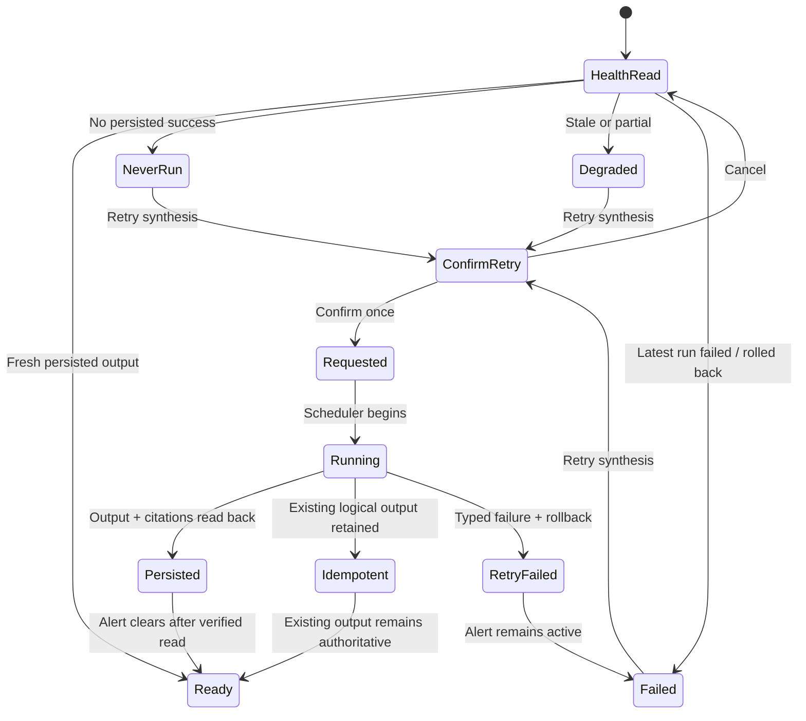

# Expected Behavior: [BUG-004-004] Durable Synthesis And Truthful Health

## Problem Statement

Constructing synthesis objects in memory is not a delivered synthesis capability. Health must be derived from successful durable work, not scheduler registration or lack of errors.

## Outcome Contract

**Intent:** Persist source-cited synthesis atomically and expose health that tells whether output has never run, is current, stale, partial, or failed.

**Success Signal:** Real-stack tests run synthesis over the global corpus, read the exact stored rows through a grant-authorized surface, rerun idempotently, exercise rollback, and observe matching health/alerts.

**Hard Constraints:** PostgreSQL-only persistence; source citations and schema validation before commit; one transaction per logical output; explicit idempotency and retention/lifecycle; one operator-owned global corpus with role/grant access and no tenant/user row-isolation claim; no private content in telemetry.

**Failure Condition:** Any success/up state exists without persisted output, output lacks sources, retries duplicate, partial rows survive failure, or never-run/stale/failed health is inaccurate.

## Requirements

- **SYNTH-001:** A successful run SHALL persist validated source-cited insight rows and one weekly synthesis for its logical window.
- **SYNTH-002:** The logical run SHALL commit atomically; any required write failure SHALL roll back all output for that run.
- **SYNTH-003:** A stable idempotency key SHALL prevent duplicate insight/weekly output for the same global source set and logical window; authenticated viewer identity SHALL NOT create a parallel synthesis corpus.
- **SYNTH-004:** Every persisted synthesis SHALL retain authorized source references and generation/run provenance.
- **SYNTH-005:** Missing citations, invalid schema, or unauthorized source SHALL prevent persistence and produce a typed failed run.
- **SYNTH-006:** Retention and lifecycle SHALL move output through current, stale, superseded/archived states without deleting audit provenance silently.
- **SYNTH-007:** An authenticated read surface SHALL distinguish current, quiet/no-insight, never-run, stale, partial, and failed outcomes.
- **SYNTH-008:** Health SHALL derive from last attempted/successful persisted run, freshness, and typed failure; never-run SHALL NOT be up.
- **SYNTH-009:** Alerts SHALL fire for failed/stale required synthesis and resolve only after a verified persisted recovery.
- **SYNTH-010:** Metrics/logs/traces SHALL contain run IDs, counts, timing, state, and error class, not synthesis text or source content.
- **SYNTH-011:** UI/read surfaces SHALL be accessible and responsive where synthesis is presented.
- **SYNTH-012:** Synthesis SHALL derive from and persist into the single operator-owned global corpus. Operators MAY read private output and health details; another authenticated identity MAY read private synthesis only with an explicit Synthesis read grant. Identities without that grant SHALL receive no text, citations, source titles, windows, run identifiers, counts, or existence hints. No requirement or readiness claim SHALL imply tenant-level or per-user row isolation.

## Corpus Ownership And Private Access

- Artifacts, relationships, Digest, Synthesis, and knowledge remain one operator-owned/global corpus. Multiple authenticated identities are access principals, not separate data tenants.
- Private Synthesis output is operator-private by default. A non-operator may read the global projection only through an explicit capability grant; operator retry, health, and run-detail actions require operator authority and are not implied by read access.
- A denied identity receives only a value-safe access-denied outcome. It may not learn whether output exists, which sources participated, when a run occurred, or whether a private source degraded.

## User Scenarios

```gherkin
Scenario: SCN-004-004-01 Successful run persists cited output
  Given eligible authorized source artifacts for a weekly window
  When synthesis completes successfully
  Then cited insight rows and one weekly synthesis commit transactionally
  And an authenticated read returns the persisted output

Scenario: SCN-004-004-02 Rerun is idempotent
  Given the same logical window and source set already committed
  When the scheduler retries the run
  Then no duplicate insight or weekly synthesis is created
  And the run audit records the retry outcome

Scenario: SCN-004-004-03 Partial write rolls back
  Given one required persistence step fails after another write begins
  When the transaction ends
  Then no partial insight or weekly synthesis survives
  And health reports failed

Scenario: SCN-004-004-04 Uncited or invalid synthesis is rejected
  Given generated output lacks authorized source links or fails schema validation
  When persistence is attempted
  Then no output is stored
  And the failure is observable without content leakage

Scenario: SCN-004-004-05 Never-run is not up
  Given no synthesis run has ever persisted output
  When health is read
  Then status is never-run or unavailable with an actionable reason

Scenario: SCN-004-004-06 Stale and failed health alert truthfully
  Given last successful output exceeds freshness or the latest run failed
  When health and alerts are evaluated
  Then stale or failed is reported and the alert remains active until verified recovery

Scenario: SCN-004-004-07 Quiet no-insight differs from missing output
  Given a successful run finds no qualifying insights and records a valid quiet synthesis
  When the user reads the period
  Then quiet is shown with run metadata
  And it is not never-run or failed

Scenario: SCN-004-004-08 Partial source degradation is explicit
  Given one source fails but policy permits verified output from remaining sources
  When synthesis completes
  Then output and health identify partial provenance
  And full health is not claimed

Scenario: SCN-004-004-09 Auth and privacy boundaries hold
  Given an unauthenticated caller or an authenticated identity without the explicit Synthesis read grant requests synthesis
  When the read is evaluated
  Then access is denied without revealing text, source titles, windows, counts, existence, or run details

Scenario: SCN-004-004-10 Synthesis read states are accessible
  Given a keyboard or screen-reader user on a narrow viewport
  When current, quiet, stale, never-run, partial, or failed state renders
  Then status, sources, and recovery action are perceivable and operable without overlap
```

## Acceptance Criteria

1. Real PostgreSQL tests prove atomic writes, rollback, idempotency, retention/lifecycle, and read-back.
2. Adversarial regression fails if `RunSynthesis` only constructs/logs without writing.
3. Source/schema rejection prevents persistence.
4. Never-run, current, quiet, stale, partial, and failed health/alerts are distinct.
5. Authenticated E2E reads durable output and no telemetry leaks content.
6. Role/grant acceptance proves authorized reads against the global corpus and denies ungranted identities without private-content or existence leakage; no test or claim assumes tenant/user row isolation.

## Release Train

- Target train: `mvp`.
- Flags introduced: none.
- Synthesis may be reported ready only where durable output and health contracts pass.

## UI Wireframes

### UX Requirements

| ID | Observable Contract |
|---|---|
| UX-004-004-01 | Reader and operator surfaces derive their visible availability state from the same persisted-run truth: last attempted run, last successful durable output, freshness, completeness, and typed failure. |
| UX-004-004-02 | `Available` appears only after the synthesis and citations can be read back from durable storage; scheduler registration, in-memory construction, request acceptance, or a zero-error log cannot produce it. |
| UX-004-004-03 | Reader states are mutually exclusive: loading, current, quiet, stale, partial, never-run, failed-without-output, failed-with-prior-output, unauthorized-session, and unauthorized-scope. |
| UX-004-004-04 | Failed runs never expose unpublished or partially written prose. When a prior verified output exists, it remains separately labeled by its persisted time and stale/degraded age. |
| UX-004-004-05 | Citation disclosure identifies the count and authorized source titles for the exact persisted output; inaccessible sources are represented by an undisclosing count, not leaked titles. |
| UX-004-004-06 | Operator Retry distinguishes confirmation, request accepted, running, persisted recovery, idempotent no-change, and failed/rolled-back outcomes with one visible run identity. |
| UX-004-004-07 | Run-history filtered-empty states name the active filters and never imply synthesis has never run. Clearing filters restores the unfiltered history without triggering synthesis. |
| UX-004-004-08 | Health alerts remain visible through stale/failed states and clear only after the operator surface reads a verified persisted recovery. |

### Screen Inventory

| Screen | Actor(s) | Status | Scenarios Served |
|---|---|---|---|
| Today Synthesis (`/digest`, Synthesis section) | Daily user | Existing - Modify | SCN-004-004-01, 07, 08, 09, 10 |
| Synthesis Health (`/status`, Synthesis section) | Operator | Existing - Modify | SCN-004-004-02 through 06, 08 through 10 |

### UI Primitives

| Primitive | Used By Screens | Composition Rule | Accessibility / Responsive Constraint |
|---|---|---|---|
| Synthesis state badge | Today Synthesis; Synthesis Health | Uses only the closed labels `Available`, `Quiet`, `Degraded`, `Never run`, `Failed`, and `Checking`; badge always sits beside a textual state explanation. | Text and icon accompany color; wraps before truncating. |
| Persisted-output frame | Today Synthesis; Synthesis Health latest-success summary | May render prose only when a persisted output identifier, window, and persisted timestamp are present together. | Reading measure is constrained; prose remains selectable and zoomable. |
| Citation disclosure | Today Synthesis; Synthesis Health run detail | Count is visible first; expansion lists only authorized source links associated with that persisted output. | Native disclosure semantics; focus remains on control when expanded. |
| Run evidence summary | Synthesis Health; Today degraded/failed note | Orders evidence as latest attempt, last persisted success, freshness, completeness, alert state. | Converts from columns to labeled definition list below tablet width. |
| Recovery action panel | Synthesis Health; Today read-only link to status | Daily user gets `View synthesis status`; only an authorized operator gets `Retry synthesis`. | Mutation status is a live region; duplicate activation disabled while active. |
| Run-history filters and empty state | Synthesis Health | Window/outcome filters affect history only; filtered-empty names filters and offers `Clear filters`. | Labels persist; filter summary precedes history for screen readers. |

### Screen: Today Synthesis

**Actor:** Daily User | **Route:** `/digest` (Synthesis section) | **Status:** Modify

**Desktop:**

```text
┌──────────────────────────────────────────────────────────────────────────┐
│ Today                                                    [date controls] │
├──────────────────────────────────────────────────────────────────────────┤
│ Weekly synthesis                          [Available | Quiet | Degraded] │
│ Window [start date - end date]   Persisted [time + zone]   Sources [n]  │
├──────────────────────────────────────────────────────────────────────────┤
│ [Persisted synthesis prose............................................] │
│ [......................................................................] │
│                                                                          │
│ [Show citations ▾]                              [View synthesis status] │
├──────────────────────────────────────────────────────────────────────────┤
│ [State-specific explanation: freshness / partial source classes / fail] │
└──────────────────────────────────────────────────────────────────────────┘
```

**Mobile / narrow viewport:**

```text
┌──────────────────────────────┐
│ Today                        │
├──────────────────────────────┤
│ Weekly synthesis             │
│ [Degraded]                   │
│ [window]                     │
│ Persisted [time + zone]      │
├──────────────────────────────┤
│ [Persisted prose wraps at    │
│  readable measure.]          │
│                              │
│ Sources [n] [Show ▾]         │
│ [View synthesis status]      │
├──────────────────────────────┤
│ [state explanation]          │
└──────────────────────────────┘
```

**Reader states:**

| State Key | Visible Outcome | Recovery / Navigation | Content Rule |
|---|---|---|---|
| `loading` | `Checking synthesis` with window placeholder only. | None required | No prose or source count is represented as current. |
| `current` | `Available`, window, persisted time, prose, citation count. | Show citations | All content came from the same persisted output. |
| `quiet` | `Quiet`, valid window/time, `No qualifying connections this period`, evaluated-source count. | Show evaluated sources when authorized | Never-run and failure copy are absent. |
| `stale` | `Degraded`, exact age, prior persisted prose/time, reason newer output is absent. | View synthesis status | Prior content remains explicitly historical, not current. |
| `partial` | `Degraded`, persisted prose, participating source count, missing source classes. | View synthesis status | No omitted-source claim or full-health badge. |
| `never-run` | `Never run`, `No persisted synthesis is available yet`. | View synthesis status | No prose, citations, sample output, or `Available`. |
| `failed-without-output` | `Failed`, safe failure class, latest attempt time. | View synthesis status | No prose/citation nodes exist. |
| `failed-with-prior-output` | `Failed latest attempt`; separate `Last verified synthesis` frame with age and persisted time. | View synthesis status | Prior prose is never nested under the failed attempt as its output. |
| `unauthorized-session` | `Your session ended`. | Sign in again | No text, window, source title/count, run ID, or existence hint. |
| `unauthorized-scope` | `You do not have access to synthesis`. | Return to Today | No existence or run-state disclosure. |

**Interactions:** Citation links open authorized source detail in the same product shell. `View synthesis status` opens the operator-readable status section only when authorized; otherwise it is omitted, not disabled as a disclosure. Daily users cannot trigger a run from this surface.

**Responsive:** Prose uses a stable reading measure. Metadata stacks in the order state, window, persisted time, source count. At 320px and 200% zoom there is no horizontal scroll or overlap; links/actions remain at least 44 by 44 CSS pixels.

**Accessibility:** The section has a named heading; the state explanation is associated with the badge. State changes use one polite atomic region, while unauthorized/failed-without-output use one-time alerts. Persisted time is a semantic date/time with timezone. Citations use unique link names and missing source classes are readable text, never color-only.

### Screen: Synthesis Health

**Actor:** Operator | **Route:** `/status` (Synthesis section) | **Status:** Modify

**Desktop:**

```text
┌──────────────────────────────────────────────────────────────────────────┐
│ System status > Synthesis                                  [Degraded]    │
│ [Actionable health explanation]                                           │
├───────────────────────────────┬──────────────────────────────────────────┤
│ LAST ATTEMPT                  │ LAST PERSISTED SUCCESS                   │
│ [time] [failed / running]     │ [time / Never]                          │
│ Run [safe ID]                 │ Window [range]  Freshness [age]          │
│ [safe failure / source state] │ Output [current / quiet / partial]      │
├───────────────────────────────┴──────────────────────────────────────────┤
│ Alert [Active / Clear after verified recovery]                           │
│ [Inspect run evidence]  [Retry synthesis]                                │
├──────────────────────────────────────────────────────────────────────────┤
│ Run history      Window [All ▾] Outcome [All ▾] [Clear filters]         │
│ [time] [window] [persisted / quiet / partial / failed / rolled back]    │
│ [time] [window] [idempotent no-change]                    [Inspect]      │
└──────────────────────────────────────────────────────────────────────────┘
```

**Mobile / narrow viewport:**

```text
┌──────────────────────────────┐
│ Synthesis health             │
│ [Failed]                     │
│ [health explanation]         │
├──────────────────────────────┤
│ Latest attempt               │
│ [labeled evidence list]      │
├──────────────────────────────┤
│ Last persisted success       │
│ [labeled evidence list]      │
├──────────────────────────────┤
│ [Inspect run evidence]       │
│ [Retry synthesis]            │
├──────────────────────────────┤
│ [History filters (2 active)] │
│ [run history / filtered empty]│
└──────────────────────────────┘
```

**Operator states and mutation feedback:**

| State Key | Visible Heading | Evidence / Feedback | Actions |
|---|---|---|---|
| `checking` | `Checking synthesis health` | Latest attempt/success skeletons retain labels without fabricated values. | None required |
| `ready-current` | `Synthesis is current` | Persisted output ID, window, persisted time, freshness, complete provenance, clear alert. | Inspect run |
| `ready-quiet` | `Synthesis completed quietly` | Persisted quiet output and evaluated-source counts. | Inspect run |
| `degraded-stale` | `Synthesis is stale` | Exact age/threshold, last success, latest attempt, active alert. | Retry synthesis; Inspect |
| `degraded-partial` | `Synthesis used partial sources` | Participating and missing source classes, persisted output, active degraded health. | Retry synthesis; Inspect |
| `never-run` | `No synthesis has been persisted` | Latest attempt is `Never` or a typed non-persisted attempt; health is not up. | Retry synthesis |
| `failed-rolled-back` | `Latest synthesis failed` | Safe failure class, rollback `No output committed`, prior success if any, active alert. | Retry synthesis; Inspect |
| `run-history-empty` | `No synthesis runs recorded` | Unfiltered history read succeeded with zero rows. | Retry synthesis, when authorized |
| `run-history-filtered-empty` | `No runs match these filters` | Active window/outcome filters are named. | Clear filters |
| `confirm-retry` | `Retry synthesis for [window]?` | Names window, source-set summary, and that duplicate activation is deduplicated. | Confirm; Cancel |
| `retry-requested` | `Retry requested` | Run identity is visible; acceptance is explicitly not persistence. | Inspect run |
| `retry-running` | `Synthesis is running` | Start time and current non-content phase; no success badge. | Inspect run |
| `retry-persisted` | `Synthesis persisted` | Read-back output ID, persisted time, citation count, and alert state changing to clear. | View synthesis |
| `retry-idempotent` | `No duplicate output created` | Existing output ID/window and audit outcome are visible. | View existing synthesis |
| `retry-failed` | `Retry failed; no output committed` | Safe failure class and rollback outcome; alert remains active. | Retry; Inspect run |
| `unauthorized` | `Operator access required` or `Your session ended` | No run identity, timestamps, counts, or failure details. | Safe return / Sign in again |

**Interactions:**

- `Retry synthesis` opens an in-flow confirmation. Confirm disables duplicate submission and exposes `Retry requested` before any running state.
- The state becomes `Synthesis persisted` only after the new durable output and its citations read back together. Request acceptance or scheduler registration never clears the alert.
- `Inspect run evidence` opens a disclosure/detail region containing safe run identity, window, counts, lifecycle outcome, and redacted failure class; it never displays generated prose or source content in the health panel.
- History filters modify the history list only. `Clear filters` restores unfiltered history and focus to the history heading without creating a run.

**Responsive:** Evidence columns become ordered labeled sections on tablet/mobile. Confirmation and mutation feedback remain in document flow, not transient corner toasts. History rows stack labels before values and keep Inspect adjacent to the corresponding run.

**Keyboard:** Tab order follows heading, evidence, alert, Inspect, Retry, filters, history rows. Confirmation traps focus only while modal semantics are active; Escape/Cancel returns focus to Retry. Mutation status does not move focus; failure focuses the error heading after preserving the initiating button relationship.

**Screen reader and visual accessibility:** Health, freshness, completeness, rollback, and alert state are explicit text. One polite live region announces request/running/persisted/idempotent feedback; retry failure uses one alert. Definition lists preserve label/value relationships. Run IDs are selectable and have a copy affordance with visible `Copied` feedback, but no synthesis text or source content enters the clipboard implicitly.

### Playwright-Visible Behavior Contract

These are planned real-stack observations. They do not claim persistence, browser, scheduler, or alert execution.

| ID | Real-Stack Setup and Gesture | Required Visible Assertion | Truthfulness / Exclusivity Assertion |
|---|---|---|---|
| UX-E2E-004-004-01 | Authorized sources produce and commit one synthesis window; user opens Today. | `Available`, persisted window/time, exact stored prose, citation count, and authorized citation link are visible. | Never-run, Failed, Quiet, and Degraded are absent. |
| UX-E2E-004-004-02 | Same logical run is retried; operator opens run history. | Existing output identity remains; history shows `No duplicate output created`. | No second output card or duplicate citation set appears. |
| UX-E2E-004-004-03 | A required write fails after transaction start. | Status shows `Latest synthesis failed` and `No output committed`; alert is active. | No prose/citation from the failed run appears on Today or status. |
| UX-E2E-004-004-04 | Output is uncited, schema-invalid, or source-unauthorized in separate runs. | Status exposes the matching safe failure class and rollback outcome. | Generated text and source titles are absent. |
| UX-E2E-004-004-05 | No persisted success and no run history exist. | Today shows `Never run`; status shows `No synthesis has been persisted`; unfiltered history shows `No synthesis runs recorded`. | No `Available`, green/up-only indicator, sample prose, or filtered-empty copy appears. |
| UX-E2E-004-004-06 | Fresh quiet synthesis is durably persisted. | Today shows `Quiet` plus window/time and no-qualifying-connections copy; status shows persisted quiet evidence. | Never-run and Failed are absent. |
| UX-E2E-004-004-07 | Last success is stale or a policy-approved run omits one source class. | Today retains verified prose with exact `Degraded` reason; status names age/threshold or participating/missing classes and keeps alert state truthful. | Full/current health is absent. |
| UX-E2E-004-004-08 | Operator applies history filters with no matching rows while unfiltered history contains runs. | `No runs match these filters`, filter labels, and Clear filters are visible. | `No synthesis runs recorded` is absent; clearing filters reveals real rows without triggering a run. |
| UX-E2E-004-004-09 | Operator confirms Retry and the run commits successfully. | `Retry requested` then running then `Synthesis persisted` appears with read-back output ID/time/citation count; alert clears only at persisted state. | Request acceptance alone never shows Available or clears alert. |
| UX-E2E-004-004-10 | Operator confirms Retry and the run fails/rolls back. | `Retry failed; no output committed`, safe cause, active alert, and Retry remain visible. | No success toast, persisted badge, or partial output appears. |
| UX-E2E-004-004-11 | Session expires or another user requests either surface. | Re-authentication/access-denied UI is visible. | Prose, source titles/counts, windows, run IDs, timestamps, and existence hints are absent from DOM/accessibility tree. |
| UX-E2E-004-004-12 | Keyboard-only user traverses both surfaces at 320px and 200% zoom. | Controls follow visual order; confirmation restores focus; live mutation feedback is exposed; no overlap/horizontal scroll occurs. | No pointer-only citation, filter, inspect, or retry action exists. |

### Routed Design Questions

| Owner | Question | UX Constraint That Must Survive Resolution |
|---|---|---|
| `bubbles.design` | What canonical read model supplies both `/digest` and `/status` with one persisted-run state without duplicating health derivation? | Both surfaces resolve to the same state vocabulary and output identity. |
| `bubbles.design` | What retry lifecycle and read-back boundary differentiates accepted, running, persisted, idempotent, and rolled-back outcomes? | `Available` and alert clearance occur only after durable output plus citations read back successfully. |
| `bubbles.design` | Which failure classes and source-completeness details are safe for operator display without leaking synthesis/source content? | Operators receive actionable typed state; daily users receive no private operational detail. |
| `bubbles.plan` | Which real-stack fixtures induce atomic rollback, idempotent retry, uncited/schema rejection, stale, partial, and verified recovery? | Planned browser assertions must observe production read surfaces and real persistence; internal request interception cannot satisfy them. |

## User Flows

### User Flow: Reader Sees Durable Synthesis Truth

```mermaid
stateDiagram-v2
  [*] --> Checking
  Checking --> Current: Fresh persisted output
  Checking --> Quiet: Fresh persisted quiet output
  Checking --> Stale: Last success exceeds freshness
  Checking --> Partial: Policy-approved incomplete sources
  Checking --> NeverRun: No persisted success
  Checking --> FailedNoOutput: Latest failed; no prior success
  Checking --> FailedPriorOutput: Latest failed; prior persisted output exists
  Checking --> Unauthorized: Session or scope rejected
  Current --> Citations: Show authorized citations
  Quiet --> Citations: Show evaluated sources
  Stale --> SynthesisStatus: View status
  Partial --> SynthesisStatus: View status
  FailedNoOutput --> SynthesisStatus: View status
  FailedPriorOutput --> SynthesisStatus: View status
```



### User Flow: Operator Retries Without False Success


