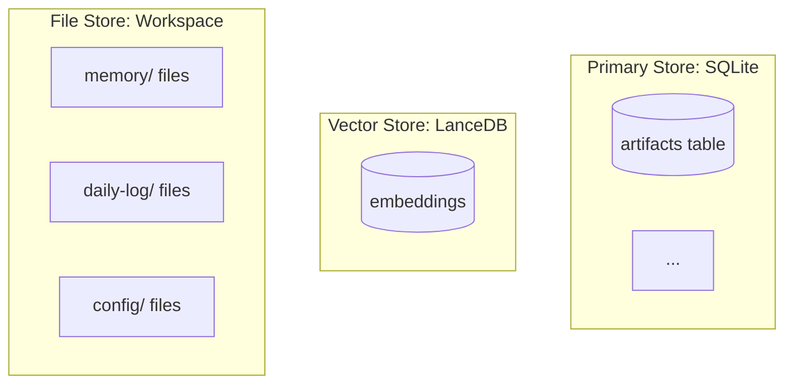
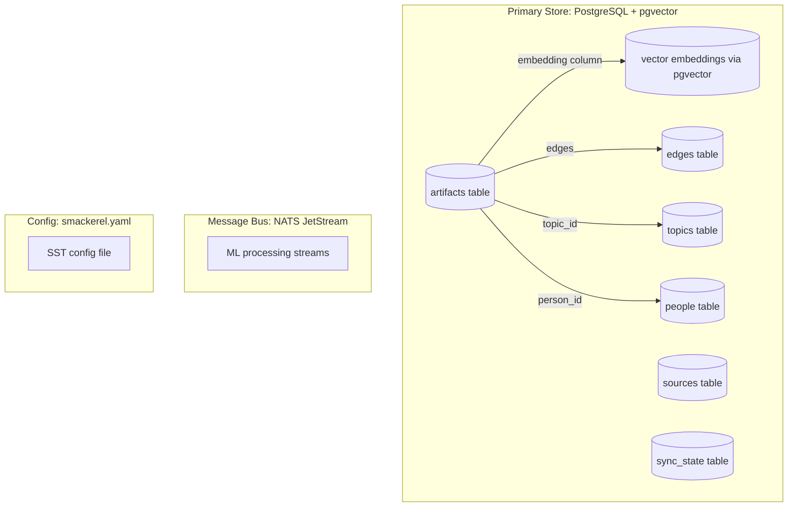

# Design: 024 Design Document Reconciliation

## Design Brief

**Current State:** `docs/smackerel.md` (v2, ~2400 lines) is the primary architecture reference. It contains three categories of drift from the committed codebase: (1) §4 describes ~2000 words of OpenClaw integration that doesn't exist — the actual runtime is standalone Go + Docker Compose; (2) §8 and §14 describe SQLite + LanceDB while the actual implementation is PostgreSQL + pgvector; (3) §21.3 marks aspirational features as implemented (✅). Additionally, scattered OpenClaw/SQLite/LanceDB references appear in §2, §6, §7, §17, §18, §19, and §24.

**Target State:** Every section of `docs/smackerel.md` accurately reflects the committed codebase, with aspirational content clearly labeled as planned rather than present.

**Patterns to Follow:**
- §3 (System Architecture) mermaid diagrams already correctly show Go core + Python sidecar + PostgreSQL + pgvector + NATS + Docker — preserve these as-is
- §23 (Technology Stack Decision) accurately describes PostgreSQL + pgvector — use as reference for correct terminology
- Existing connector directory structure under `internal/connector/` provides the ground truth for connector counts

**Patterns to Avoid:**
- Deleting aspirational content entirely — the vision in §4 is valuable historical context; label it, don't destroy it
- Partial reconciliation — fixing §4 while leaving SQLite references in §14 or §19 would be worse than the current state

**Resolved Decisions:**
- §4 retained with prominent "SUPERSEDED" header and bracketed disclaimer, not deleted
- §14 DDL rewritten in PostgreSQL syntax based on actual `internal/db/migrations/`
- §21.3 uses 🔜 marker for planned features, ✅ only for implemented
- §19 Gantt chart and phase tables updated to reflect Go + Docker Compose + PostgreSQL + pgvector
- No code changes — docs-only reconciliation

**Open Questions:** None.

---

## Architecture Overview

This is a docs-only feature. The single deliverable is an updated `docs/smackerel.md` with all sections reconciled to match the committed codebase. No code, config, test, or infrastructure changes.

---

## Section-by-Section Edit Plan

### Edit Group 1: Header Metadata (Line 14)

**Current:**
```
> **Runtime Platform:** OpenClaw
```

**Action:** Replace with:
```
> **Runtime Platform:** Go + Docker Compose (self-hosted)
```

**Rationale:** The header is the first thing a reader sees. It must reflect the actual runtime.

---

### Edit Group 2: §2 Design Principles (Lines 130-131)

**Current (Principle 9):**
```
| 9 | **Own your data** | Everything runs locally on your devices via OpenClaw. No cloud dependency for core functionality. Your knowledge graph is yours. |
```

**Action:** Replace "via OpenClaw" with "via Docker Compose":
```
| 9 | **Own your data** | Everything runs locally on your devices via Docker Compose. No cloud dependency for core functionality. Your knowledge graph is yours. |
```

**Current (Principle 10):**
```
| 10 | **Platform, not product** | Built on OpenClaw's swappable architecture. Any channel, any LLM, any storage backend. Skills are modular and replaceable. |
```

**Action:** Replace with technology-neutral language:
```
| 10 | **Platform, not product** | Modular architecture with swappable components. Any LLM backend (Ollama, Claude, GPT), any channel (Telegram, Discord, web). Connectors are pluggable. |
```

---

### Edit Group 3: §4 OpenClaw Integration Strategy (Lines 395-580)

**This is the largest single change — ~185 lines of content.**

**Action:** Do NOT delete §4. Instead:

1. Add a prominent superseded header immediately after the `## 4. OpenClaw Integration Strategy` heading:

```markdown
> **⚠️ SUPERSEDED:** This section describes the original design intent to use OpenClaw as the runtime platform. The actual implementation uses a **standalone Go monolith + Python ML sidecar + Docker Compose** architecture, as described in §3 and §23. This section is retained as historical context for the design evolution. All subsections below reflect the original OpenClaw design, not the current implementation.
```

2. The existing subsections (§4.1-§4.5) remain as-is under this disclaimer. No content editing within §4 beyond the disclaimer header.

**Rationale:** The OpenClaw design represents genuine architectural thinking. Deleting it loses context about design decisions. The disclaimer is unambiguous — a reader cannot mistake this for current architecture.

---

### Edit Group 4: §6 Active Capture References (Lines 759-769)

**Current (Line 759):**
```
The user can actively capture artifacts through any OpenClaw-connected channel:
```

**Action:** Replace with:
```
The user can actively capture artifacts through any connected channel:
```

**Current channel table entries (Lines 765, 769):**
```
| **Mobile share sheet** | Share any URL/text to OpenClaw app (iOS/Android) | 1 tap |
| **WebChat** | Paste into OpenClaw WebChat | < 5 sec |
```

**Action:** Replace with:
```
| **Mobile share sheet** | Share any URL/text to Telegram bot (iOS/Android) | 1 tap |
| **WebChat** | Paste into Smackerel Web UI | < 5 sec |
```

---

### Edit Group 5: §7 Processing Pipeline — Browser Control Reference (Line ~840)

**Current:**
```
- **URLs**: Fetch page content (OpenClaw browser control), extract main text (readability algorithm), capture metadata (title, author, date, images)
```

**Action:** Replace with:
```
- **URLs**: Fetch page content (go-readability), extract main text (readability algorithm), capture metadata (title, author, date, images)
```

---

### Edit Group 6: §7 Processing Pipeline — LanceDB Embedding Reference (Line ~869)

**Current:**
```
- Store in LanceDB (local vector database, no server required)
```

**Action:** Replace with:
```
- Store in PostgreSQL via pgvector extension (vector similarity search)
```

---

### Edit Group 7: §8 Knowledge Graph & Storage (Lines 903-930)

**Current §8.1 mermaid diagram (Lines 907-930):**


**Action:** Replace the entire mermaid block with:



**Rationale:** PostgreSQL + pgvector is a unified store — vector embeddings live in the same database as structured data, not a separate vector store. The "File Store: Workspace" subgraph (OpenClaw workspace files) doesn't exist.

---

### Edit Group 8: §14 Data Models & Schemas (Lines 1335-1540)

This is a significant rewrite. All six table DDLs must be updated from SQLite syntax to PostgreSQL syntax.

**§14.1 header change:**
```
### 14.1 Artifact Table (SQLite)
```
→
```
### 14.1 Artifact Table (PostgreSQL)
```

**§14.1 DDL changes (artifacts table):**

| SQLite Column | PostgreSQL Column | Change |
|---------------|-------------------|--------|
| `id TEXT PRIMARY KEY` | `id TEXT PRIMARY KEY` | Same (ULID as text) |
| `artifact_type TEXT NOT NULL` | `artifact_type TEXT NOT NULL` | Same |
| `key_ideas TEXT` | `key_ideas JSONB` | JSON columns → JSONB |
| `entities TEXT` | `entities JSONB` | JSON columns → JSONB |
| `action_items TEXT` | `action_items JSONB` | JSON columns → JSONB |
| `topics TEXT` | `topics JSONB` | JSON columns → JSONB |
| `source_qualifiers TEXT` | `source_qualifiers JSONB` | JSON columns → JSONB |
| `user_starred INTEGER DEFAULT 0` | `user_starred BOOLEAN DEFAULT false` | Integer → Boolean |
| `location TEXT` | `location JSONB` | JSON columns → JSONB |
| `temporal_relevance TEXT` | `temporal_relevance JSONB` | JSON columns → JSONB |
| `created_at TEXT NOT NULL` | `created_at TIMESTAMPTZ NOT NULL DEFAULT NOW()` | Text → TIMESTAMPTZ |
| `updated_at TEXT NOT NULL` | `updated_at TIMESTAMPTZ NOT NULL DEFAULT NOW()` | Text → TIMESTAMPTZ |
| `last_accessed TEXT` | `last_accessed TIMESTAMPTZ` | Text → TIMESTAMPTZ |
| (not present) | `embedding vector(384)` | Add pgvector column |

Add extension creation at top of §14:
```sql
CREATE EXTENSION IF NOT EXISTS vector;
CREATE EXTENSION IF NOT EXISTS pg_trgm;
```

**§14.2 people table:** Same pattern — `TEXT` JSON columns → `JSONB`, date columns → `TIMESTAMPTZ`.

**§14.3 topics table:** Same pattern — date columns → `TIMESTAMPTZ`, add `DEFAULT NOW()`.

**§14.4 edges table:** Same pattern — date columns → `TIMESTAMPTZ`, `metadata TEXT` → `metadata JSONB`.

**§14.5 sync_state table:** `enabled INTEGER DEFAULT 1` → `enabled BOOLEAN DEFAULT true`, dates → `TIMESTAMPTZ`, `config TEXT` → `config JSONB`.

**§14.6 trips table:** Dates → `TIMESTAMPTZ`, `dossier TEXT` → `dossier JSONB`.

**Note:** The exact DDL should be consistent with the 10 committed migrations under `internal/db/migrations/`, but the design doc schemas are conceptual — they show the desired end-state, not migration SQL.

---

### Edit Group 9: §17 Trust & Security (Line ~1757-1760)

**Current (Line 1757):**
```
| **Access control** | Only authorized users interact with Smackerel | OpenClaw DM pairing + allowlists |
```

**Action:** Replace with:
```
| **Access control** | Only authorized users interact with Smackerel | Bearer token auth (SMACKEREL_AUTH_TOKEN) + Telegram chat ID allowlist |
```

**Current (Line 1758):**
```
| **Data at rest** | All data stays on user's devices | SQLite + LanceDB in OpenClaw workspace, no cloud sync |
```

**Action:** Replace with:
```
| **Data at rest** | All data stays on user's devices | PostgreSQL + pgvector in Docker volume, no cloud sync |
```

**Current (Line 1760):**
```
| **API key management** | All API keys in OpenClaw credential store | Encrypted at rest, never in prompts or logs |
```

**Action:** Replace with:
```
| **API key management** | All API keys in smackerel.yaml / environment variables | Config generation pipeline, never in prompts or logs |
```

---

### Edit Group 10: §18 Privacy Architecture (Line ~1817)

**Current:**
```
| Export | Always available | Full SQLite + LanceDB export, Notion export, Obsidian export |
```

**Action:** Replace with:
```
| Export | Always available | Full PostgreSQL pg_dump export, Notion export, Obsidian export |
```

---

### Edit Group 11: §19 Phased Implementation Plan (Lines 1822-1950)

#### §19 Gantt chart (Lines 1830-1835):

**Current:**
```
    OpenClaw workspace setup        :p1a, 2026-04-07, 2d
    SQLite + LanceDB setup          :p1b, 2026-04-07, 2d
```

**Action:** Replace with:
```
    Docker Compose + config setup   :p1a, 2026-04-07, 2d
    PostgreSQL + pgvector setup     :p1b, 2026-04-07, 2d
```

#### §19 Phase 1 heading (Line 1870):

**Current:**
```
**Goal:** Active capture + search + basic digest via OpenClaw.
```

**Action:** Replace with:
```
**Goal:** Active capture + search + basic digest via Go core + Docker Compose.
```

#### §19 Phase 1 table (Lines 1874-1876):

**Current:**
```
| 1.1 | Set up OpenClaw workspace | Workspace structure per §4.2 |
| 1.2 | Create SQLite schema | Tables per §14 |
| 1.3 | Set up LanceDB | Local vector store |
```

**Action:** Replace with:
```
| 1.1 | Set up Docker Compose stack | Go core + Python sidecar + PostgreSQL + NATS + Ollama |
| 1.2 | Create PostgreSQL schema | Tables per §14 with pgvector extension |
| 1.3 | Configure NATS JetStream | ML processing streams |
```

Remove steps 1.4 (SOUL.md) and 1.5 (AGENTS.md) — these are OpenClaw concepts. Renumber remaining steps.

#### §19 Phase 1 exit criteria:

**Current:**
```
**Exit criteria:** Can capture URLs/text from a chat channel. Can find them later with vague queries. Gets a useful daily digest.
```

**Action:** Keep as-is — the exit criteria describe user-visible behavior, not technology.

#### Mark completed phases:

Add status indicators:
- Phase 1: **✅ Delivered** (foundation scaffold committed)
- Phase 2: **✅ Delivered** (connectors committed, topic lifecycle exists)
- Phase 3: **🔜 In Progress** (intelligence engine exists, synthesis partial)
- Phase 4: **✅ Delivered** (maps, browser connectors committed)
- Phase 5: **✅ Delivered** (expertise, learning, subscriptions, serendipity committed)

---

### Edit Group 12: §21.3 Competitive Differentiation Matrix (Lines 2084-2100)

Audit each ✅ claim against committed code:

| Capability | Claimed | Actual Status | Action |
|-----------|---------|---------------|--------|
| Passive email ingestion | ✅ | IMAP connector committed (`internal/connector/imap/`) | Keep ✅ |
| Passive YouTube ingestion | ✅ | YouTube connector committed (`internal/connector/youtube/`) | Keep ✅ |
| Passive calendar ingestion | ✅ | CalDAV connector committed (`internal/connector/caldav/`) | Keep ✅ |
| Active capture (any channel) | ✅ | Telegram + HTTP API committed | Keep ✅ |
| AI processing (summary/entities) | ✅ | Pipeline processor + ML sidecar committed | Keep ✅ |
| Knowledge graph | ✅ | Graph linker committed (`internal/graph/`) | Keep ✅ |
| Topic lifecycle | ✅ | Topics lifecycle committed (`internal/topics/`) | Keep ✅ |
| Cross-domain synthesis | ✅ | Intelligence engine committed (`internal/intelligence/`) | Keep ✅ — engine exists |
| Daily/weekly digest | ✅ | Daily digest committed (`internal/digest/`); weekly synthesis unclear | Change to `✅ Daily / 🔜 Weekly` |
| Pre-meeting briefs | ✅ | No evidence of pre-meeting brief generation in codebase | Change to 🔜 |
| Self-hostable (Docker) | ✅ | docker-compose.yml committed | Keep ✅ |
| Local-first / own your data | ✅ | All data in PostgreSQL Docker volume | Keep ✅ |
| Compiled / high-performance | ✅ (Go) | Go core committed | Keep ✅ |
| Semantic search | ✅ | Search engine committed (`internal/api/search.go`) | Keep ✅ |
| Location/travel intelligence | ✅ | Maps connector committed; trip dossier unclear | Change to `✅ Maps / 🔜 Trip dossiers` |
| Multi-channel delivery | ✅ | Telegram committed; Slack/Discord capture exists but not delivery | Change to `✅ Telegram + Web / 🔜 Slack, Discord delivery` |

Also update the connector count in §21.4 "Unique Value Proposition" if it references a specific number.

---

### Edit Group 13: §22 Connector Ecosystem — Connector Table (Lines 2103-2190)

#### Verify connector list accuracy

The 14 committed connector directories under `internal/connector/`:
1. `alerts/` — gov alerts
2. `bookmarks/` — browser bookmark imports
3. `browser/` — browser history
4. `caldav/` — calendar (CalDAV)
5. `discord/` — Discord
6. `hospitable/` — Hospitable property management
7. `imap/` — email (IMAP-based, works for Gmail/Outlook/Fastmail)
8. `keep/` — Google Keep
9. `maps/` — Google Maps Timeline
10. `markets/` — financial markets
11. `rss/` — RSS/Atom feeds
12. `twitter/` — Twitter/X
13. `weather/` — weather
14. `youtube/` — YouTube

**§22.2 Email Connectors:** The table lists Gmail, Outlook/O365, and Generic IMAP as separate connectors. The actual implementation is a single IMAP connector. Add a note: "Current implementation: unified IMAP connector. Gmail and Outlook/O365 SDK connectors are planned."

**§22.5 Notes & Knowledge Source Connectors:** Lists Notion and Obsidian. Neither is committed. Google Keep IS committed but not listed in §22.5. Add note marking Notion/Obsidian as planned, and add Google Keep entry.

**Missing from §22 entirely:**
- `alerts/` (gov alerts connector)
- `hospitable/` (Hospitable property management)
- `markets/` (financial markets)
- `twitter/` (Twitter/X)
- `weather/` (weather)
- `keep/` (Google Keep — exists in codebase, missing from §22.5)

**Action:** Add an "Additional Connectors" subsection (§22.8 or renumber) listing the six connectors not covered by existing categories:

```markdown
### 22.N Additional Committed Connectors

| Connector | Source | Status | Notes |
|-----------|--------|--------|-------|
| Google Keep | `internal/connector/keep/` | ✅ Committed | Takeout import + gkeepapi modes |
| Gov Alerts | `internal/connector/alerts/` | ✅ Committed | Government alert feeds |
| Hospitable | `internal/connector/hospitable/` | ✅ Committed | Property management API |
| Financial Markets | `internal/connector/markets/` | ✅ Committed | Market data feeds |
| Twitter/X | `internal/connector/twitter/` | ✅ Committed | Tweet capture |
| Weather | `internal/connector/weather/` | ✅ Committed | Weather data integration |
```

Mark connectors listed in §22 but not committed (Notion, Obsidian, Outlook/O365 via msgraph, Slack, direct Gmail API) as planned.

---

### Edit Group 14: §24 Appendix — Glossary (Lines 2368-2380)

**Current glossary entries (Lines 2368-2370):**
```
| **Smackerel Agent** | The main user-facing OpenClaw agent |
| **Ingestion Agent** | Background OpenClaw agent that polls and processes source systems |
| **Synthesis Agent** | Background OpenClaw agent that detects patterns and generates insights |
```

**Action:** Replace with:
```
| **Smackerel Core** | The main Go runtime service (smackerel-core) |
| **Ingestion Layer** | Connector plugins that poll and process source systems |
| **Synthesis Engine** | Intelligence engine module that detects patterns and generates insights |
```

**Current migration table (Lines 2378-2380):**
```
| Slack-only capture | Any OpenClaw channel + passive ingestion | Capture everything, not just thoughts |
| Zapier automation | OpenClaw cron + webhooks + skills | More powerful, local, no third-party dependency |
| Notion storage | SQLite + LanceDB (local) | Own your data, semantic search |
```

**Action:** Replace with:
```
| Slack-only capture | Multi-channel capture (Telegram, Discord, web, API) + passive ingestion | Capture everything, not just thoughts |
| Zapier automation | Go cron scheduler + connector plugins | More powerful, local, no third-party dependency |
| Notion storage | PostgreSQL + pgvector (Docker volume) | Own your data, semantic search |
```

---

### Edit Group 15: Table of Contents Entry (Line 23)

**Current:**
```
4. [OpenClaw Integration Strategy](#4-openclaw-integration-strategy)
```

**Action:** Keep as-is — the section still exists (with superseded header), so the TOC link remains valid.

---

## Implementation Sequence

Execute edits in this order to minimize merge conflicts and ensure consistency:

1. **Header metadata** (Edit Group 1) — single line change
2. **§2 Design Principles** (Edit Group 2) — two table rows
3. **§4 Superseded header** (Edit Group 3) — add disclaimer, no content deletion
4. **§6 Active Capture** (Edit Group 4) — three line changes
5. **§7 Processing Pipeline** (Edit Groups 5-6) — two line changes
6. **§8 Storage diagram** (Edit Group 7) — mermaid block replacement
7. **§14 Data Models** (Edit Group 8) — largest change, all DDL tables
8. **§17 Security** (Edit Group 9) — three table rows
9. **§18 Privacy** (Edit Group 10) — one table row
10. **§19 Phased Plan** (Edit Group 11) — Gantt chart + phase tables
11. **§21.3 Competitive Matrix** (Edit Group 12) — status markers
12. **§22 Connector Ecosystem** (Edit Group 13) — add missing connectors, mark planned
13. **§24 Appendix** (Edit Group 14) — glossary + migration table
14. **Final grep sweep** — verify zero unmarked OpenClaw/SQLite/LanceDB references remain

## Verification Checklist

After all edits:

```bash
# Zero unmarked OpenClaw references (§4 superseded header is the only allowed occurrence context)
grep -n "OpenClaw" docs/smackerel.md | grep -v "SUPERSEDED" | grep -v "## 4\."

# Zero SQLite references outside §4 superseded block and §22.5 Apple Notes note
grep -n "SQLite" docs/smackerel.md | grep -v "SUPERSEDED" | grep -v "Apple Notes"

# Zero LanceDB references outside §4 superseded block
grep -n "LanceDB" docs/smackerel.md | grep -v "SUPERSEDED"

# Verify 14 connectors are represented
grep -c "connector" docs/smackerel.md  # sanity check
```

## Security & Compliance

No security implications — docs-only changes.

## Observability

Not applicable — docs-only changes.

## Testing Strategy

- **AC-8 enforcement:** Verify zero code files are modified via `git diff --stat` after implementation.
- **Grep validation:** Run verification checklist above to confirm zero unmarked drift references.
- **Manual review:** Read §4, §8, §14, §19, §21.3, §22 in final document to confirm accuracy.

## Risks & Open Questions

No open questions. Key risks:

1. **§14 DDL accuracy.** The design doc DDL is conceptual, not migration SQL. It should be consistent with the committed migrations but doesn't need to match them byte-for-byte. Exact alignment with `internal/db/migrations/` can be verified during implementation.

2. **§19 phase completion markers.** Marking Phase 5 as "Delivered" is based on the existence of committed code (`internal/intelligence/`). If the intelligence engine is scaffold-only without full feature coverage, the marker should be `🔜 In Progress` instead. This can be verified during implementation by checking test coverage.
