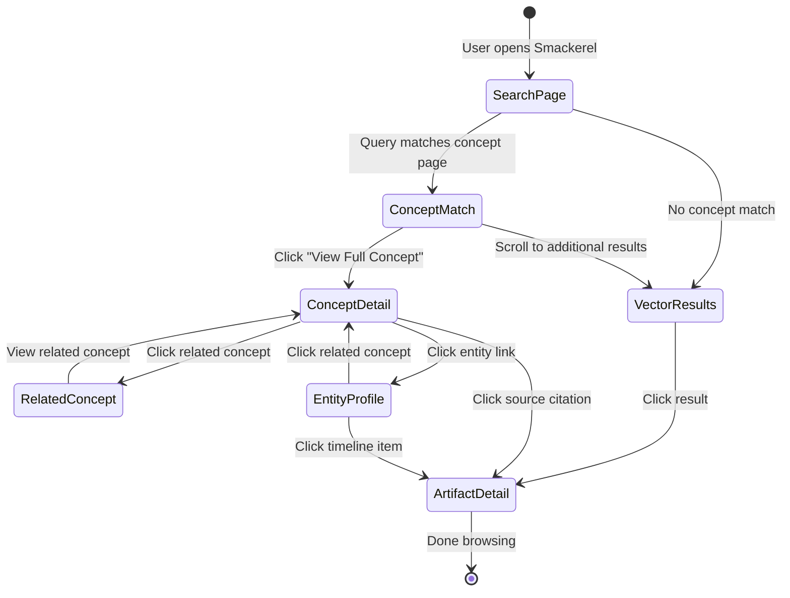
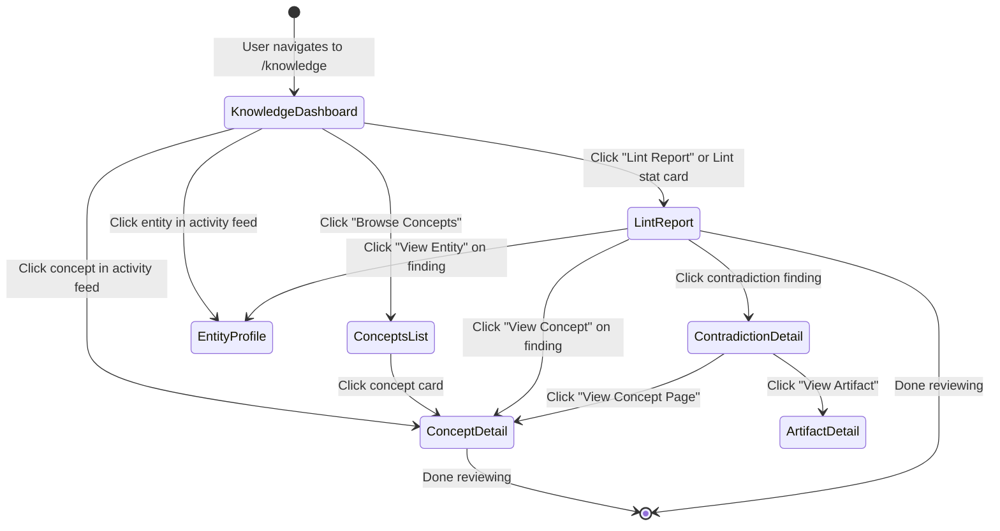
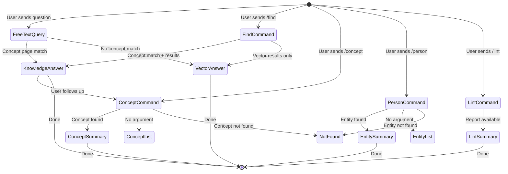
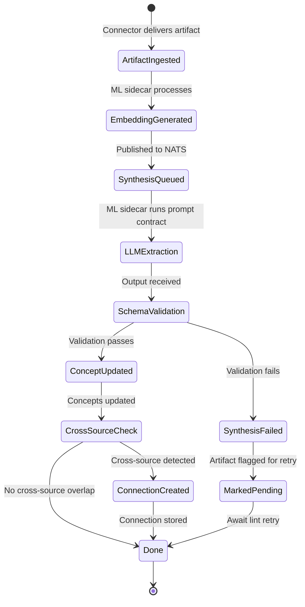

# Feature: 025 — Knowledge Synthesis Layer (LLM Wiki Pattern)

> **Parent Design:** [docs/smackerel.md](../../docs/smackerel.md)
> **Depends On:** Phase 2 (Passive Ingestion, spec 003), Phase 3 Intelligence (spec 004)
> **Inspired By:** Andrej Karpathy's LLM Wiki concept (April 2025)
> **Author:** bubbles.analyst
> **Date:** April 15, 2026
> **Status:** Draft

---

## Problem Statement

Smackerel's current pipeline follows a standard RAG pattern: connectors ingest raw artifacts → the ML sidecar generates embeddings → artifacts are stored in PostgreSQL with pgvector → queries run vector similarity search at retrieval time. This works for simple lookups ("that pricing video"), but fails at the system's core promise: **compounding knowledge that gets smarter over time**.

The critical gap is that **every query starts from scratch**. When a user asks "what should I know about leadership?", the system searches 200 raw artifacts, stitches together relevance in real time, and forgets the result. Ask the same class of question tomorrow, and the system repeats all that work. There is no persistent synthesis, no pre-built concept map, no structured knowledge that accumulates between queries.

Andrej Karpathy's LLM Wiki pattern (April 2025) identifies this exact failure mode and proposes a solution: instead of relying solely on RAG over raw documents, have an LLM **read sources once and build a structured, interlinked knowledge base** — a "wiki" — that grows with every new source. The wiki becomes the primary retrieval surface, not the raw artifacts.

Smackerel's design document already describes the components needed (knowledge graph §8, synthesis engine §10, prompt contracts §15, lifecycle §11), but the current implementation stops at embeddings. This spec bridges the gap between "raw artifact store with vector search" and "compounding knowledge engine with pre-synthesized structure."

---

## Outcome Contract

**Intent:** After ingestion, every artifact is not only embedded for vector search but also analyzed by the LLM to extract entities, concepts, and relationships that are integrated into a persistent, structured knowledge layer — concept pages, entity profiles, topic summaries, and cross-source connection maps. This structured layer becomes the primary surface for queries, digests, and synthesis.

**Success Signal:** User connects Gmail and YouTube on Monday. By Friday, the system has ingested 200+ artifacts AND built 15 concept pages (e.g., "Leadership," "Pricing Strategy," "Remote Work"), 8 entity profiles (people mentioned across sources), and 40+ cross-reference links between them. When the user asks "what do I know about negotiation?", the system returns a pre-built concept page with citations across 6 artifacts from 3 different sources — assembled at ingest time, not query time. A weekly lint report shows 2 orphan concepts and 1 contradiction, both actionable.

**Hard Constraints:**
- Raw source artifacts are immutable — the synthesis layer reads them but never modifies them (Karpathy Layer 1 principle)
- Every concept page, entity profile, and cross-reference must cite its source artifacts — no fabricated knowledge
- The synthesis layer must be incrementally updatable — adding one new artifact should update affected pages, not rebuild the whole wiki
- LLM processing budget: max 30 seconds per artifact for synthesis pass, max 5 minutes for a daily lint cycle
- The structured knowledge layer lives in PostgreSQL alongside artifacts, not in separate markdown files — this is a production system, not a note-taking app
- Schema (prompt contracts) must be versioned and testable — changes to synthesis rules produce predictable output changes
- Contradictions between sources must be preserved and surfaced, not silently resolved

**Failure Condition:** If after 500 ingested artifacts the system has no concept pages, no entity profiles, and queries still run against raw embeddings only — the synthesis layer has failed. If concept pages exist but contain hallucinated connections not traceable to source artifacts — the trust model is broken. If adding a new artifact takes >60 seconds because it rebuilds the entire knowledge structure — the incremental design has failed.

---

## Goals

1. Build the pre-synthesis layer that creates structured knowledge pages from ingested artifacts at ingest time
2. Implement executable prompt contracts (schemas) that govern how the LLM structures knowledge
3. Implement incremental knowledge building: embed + graph-link + synthesize on every ingestion
4. Build the lint/quality maintenance system for knowledge graph health
5. Implement cross-source synthesis at ingest time — connecting new artifacts to existing knowledge automatically

---

## Non-Goals

- Replacing the existing vector search (RAG stays as a fallback/complement)
- Building a user-facing wiki editor (the LLM maintains the wiki; users read it)
- Obsidian or markdown file output (knowledge lives in PostgreSQL, surfaced via API)
- Real-time collaborative editing of knowledge pages
- Fine-tuning models on user data (synthesis uses prompt contracts + RAG, not fine-tuning)

---

## Actors & Personas

| Actor | Description | Key Goals | Permissions |
|-------|------------|-----------|-------------|
| **System (Ingestion Pipeline)** | Automated process triggered by connectors | Ingest → embed → synthesize → link | Read raw artifacts, write to knowledge layer |
| **System (Lint Scheduler)** | Periodic cron job | Audit knowledge graph health | Read/flag knowledge layer, generate lint reports |
| **User (Knowledge Consumer)** | Person querying or browsing knowledge | Find synthesized answers, browse concept pages | Read knowledge layer, query via API/Telegram |
| **System (Digest Generator)** | Daily/weekly digest assembly | Pull from pre-synthesized knowledge, not raw artifacts | Read knowledge layer |

---

## Use Cases

### UC-001: Artifact Ingestion with Knowledge Synthesis
- **Actor:** System (Ingestion Pipeline)
- **Preconditions:** Artifact has been extracted and embedded by the existing pipeline (processor.go)
- **Main Flow:**
  1. After embedding generation, pipeline publishes artifact to synthesis queue (NATS `artifacts.synthesize`)
  2. ML sidecar receives artifact + its embedding + existing knowledge context
  3. LLM extracts: concepts (named ideas/topics), entities (people, places, organizations), claims (factual assertions with source attribution), and relationships (how concepts/entities connect)
  4. For each extracted concept: check if a concept page exists → update existing page with new information + citation, or create new concept page
  5. For each extracted entity: check if entity profile exists → update with new mentions/context, or create new profile
  6. For each relationship: create or strengthen edge in knowledge graph with citation
  7. If new information contradicts existing knowledge page content, flag contradiction with both citations
  8. Update the knowledge index (master list of all concept pages, entity profiles, their interconnections)
  9. Log what changed (which pages created, updated, edges added)
- **Alternative Flows:**
  - LLM extraction fails → artifact is marked `synthesis_pending`, retried on next lint cycle
  - No new concepts extracted (e.g., duplicate content) → log "no synthesis updates" and skip
  - Extraction exceeds 30s budget → abort, store partial results, mark for retry
- **Postconditions:** Knowledge layer updated with new concepts, entities, and relationships. All new knowledge cites the source artifact.

### UC-002: Cross-Source Connection at Ingest Time
- **Actor:** System (Ingestion Pipeline)
- **Preconditions:** New artifact synthesized, concept pages exist from prior ingestions
- **Main Flow:**
  1. After synthesis, system identifies which concept pages were touched
  2. For each touched concept page, retrieve other artifacts that also reference this concept
  3. If artifacts span 2+ different source types (email + video, bookmark + article, etc.), evaluate for cross-domain connection
  4. LLM assesses whether the cross-source overlap reveals a genuine insight (not just keyword match)
  5. If genuine: create or update a "connection insight" record linking the artifacts through the shared concept
  6. Connection insight is stored with: participating artifacts, shared concept(s), synthesis text, confidence score
- **Alternative Flows:**
  - Only one source type references the concept → no cross-source connection; skip
  - Cross-source overlap is surface-level only → discard silently (no false insights)
- **Postconditions:** Cross-domain connections pre-built and available for digests/queries without query-time computation.

### UC-003: Knowledge Query from Synthesized Layer
- **Actor:** User (Knowledge Consumer)
- **Preconditions:** Knowledge layer has concept pages and entity profiles from prior ingestion
- **Main Flow:**
  1. User submits natural language query ("what do I know about negotiation?")
  2. System first checks knowledge layer: search concept pages by title + content similarity
  3. If matching concept page found: return concept page content with citations, related concepts, and entity cross-references
  4. If partial match: augment with vector search against raw artifacts for additional context
  5. If no concept page match: fall back to existing RAG pipeline (vector search → LLM synthesis)
  6. Response always includes source citations and confidence indicator (from-wiki vs from-search)
- **Alternative Flows:**
  - Query matches an entity profile → return entity dossier (all interactions, mentions, recommendations)
  - Query is temporal ("what did I learn last week?") → aggregate recently-updated concept pages by modification date
- **Postconditions:** User receives a pre-synthesized answer that draws on structured knowledge, not just raw document chunks.

### UC-004: Knowledge Lint (Quality Audit)
- **Actor:** System (Lint Scheduler)
- **Preconditions:** Knowledge layer has been built from 10+ artifacts
- **Main Flow:**
  1. Lint job runs on configurable schedule (default: daily at 3:00 AM)
  2. Check 1 — **Orphan concepts:** pages with no incoming edges (nothing links to them) → flag for review
  3. Check 2 — **Contradictions:** concept pages where source artifacts assert conflicting claims → flag with both sides
  4. Check 3 — **Stale knowledge:** concept pages not updated in 90+ days while the underlying topic has new artifacts → flag for refresh
  5. Check 4 — **Missing synthesis:** artifacts marked `synthesis_pending` or `synthesis_failed` → retry synthesis
  6. Check 5 — **Weak entities:** entity profiles with only 1 mention → flag for potential merge or cleanup
  7. Check 6 — **Unreferenced claims:** claims in concept pages whose source artifact has been deleted/archived → flag
  8. Generate lint report with counts and specific page references
  9. Surface critical findings (contradictions, stale high-momentum topics) in next daily digest
- **Alternative Flows:**
  - Lint finds no issues → log clean report, skip digest mention
  - Lint finds >50 issues → cap report at top 10 by severity, schedule extended lint
- **Postconditions:** Knowledge layer health metrics updated, actionable findings surfaced to user.

### UC-005: Schema (Prompt Contract) Execution
- **Actor:** System (Ingestion Pipeline / Lint Scheduler)
- **Preconditions:** Prompt contracts are defined and versioned in configuration
- **Main Flow:**
  1. On each synthesis operation, system loads the active prompt contract version for the operation type (ingest-synthesis, lint-audit, query-augment, digest-assembly)
  2. Prompt contract specifies: extraction schema (what to extract), output format (how to structure), linking rules (when to create edges), contradiction handling (how to flag conflicts), and confidence thresholds
  3. LLM receives the prompt contract + artifact content + relevant existing knowledge context
  4. LLM output is validated against the contract's output schema before storage
  5. Contract version is recorded with every knowledge layer write for auditability
- **Alternative Flows:**
  - LLM output fails schema validation → reject, log validation error, retry with stricter instructions
  - Prompt contract version changes → existing knowledge is not retroactively updated; new ingestions use new version; lint can optionally detect version-drift
- **Postconditions:** Every knowledge layer operation is governed by a versioned, testable prompt contract.

---

## Business Scenarios

### BS-001: First-Time Knowledge Accumulation
Given the user has connected Gmail and YouTube
When 50 artifacts have been ingested over 3 days
Then the knowledge layer contains at least 5 concept pages with citations spanning both email and video sources
And the user can ask "what are my top topics?" and receive a response drawn from concept pages, not raw search

### BS-002: Incremental Knowledge Building
Given the knowledge layer has a concept page for "Leadership" citing 3 artifacts
When a new YouTube video about leadership styles is ingested
Then the "Leadership" concept page is updated with new information from the video
And the video is cited alongside the existing 3 artifacts
And the concept page's "last updated" timestamp reflects the new ingestion
And no existing citations are removed or altered

### BS-003: Cross-Source Connection Detection
Given an email from Sarah about a restaurant recommendation was ingested yesterday
And a Google Maps timeline entry showing a visit to that restaurant was ingested today
When the Maps artifact is synthesized
Then the system creates a cross-source connection linking the email, the Maps visit, and Sarah's entity profile
And the connection insight describes the relationship (Sarah recommended → user visited)

### BS-004: Contradiction Detection and Preservation
Given a concept page for "Cold Email Outreach" cites Article A saying cold email has a 2% response rate
When Article B is ingested asserting cold email has a 15% response rate
Then the concept page is updated to include both claims with their respective citations
And a contradiction flag is created referencing both articles
And the next lint report surfaces this contradiction

### BS-005: Knowledge Lint Catches Orphan Concepts
Given the knowledge layer has 20 concept pages
And 3 concept pages have no incoming edges from any artifact or other concept
When the lint job runs
Then the lint report lists those 3 pages as orphan concepts
And suggests either linking them to related concepts or archiving them

### BS-006: Query Uses Pre-Synthesized Knowledge
Given the user has been ingesting content for 2 weeks
And the knowledge layer has a rich concept page for "Pricing Strategy" with 8 artifact citations
When the user asks "what do I know about pricing?"
Then the response is drawn primarily from the concept page (pre-synthesized)
And the response includes source citations with artifact titles and dates
And the response is returned faster than a full RAG search because synthesis was done at ingest time

### BS-007: Schema Contract Governs Synthesis Quality
Given the prompt contract for ingest-synthesis requires extracting: concepts, entities, claims, and relationships
When a new artifact is processed
Then the LLM output conforms to the contract's output schema
And the output includes all required fields (concept names, entity references, claim text with source attribution, relationship type and direction)
And any output that fails schema validation is rejected and logged

### BS-008: New Source Type Enriches Existing Knowledge
Given concept pages were built from email and article sources
When the user connects Google Calendar and calendar events are ingested
Then existing entity profiles (people) are enriched with meeting frequency and context from calendar
And concept pages related to meeting topics gain calendar-derived temporal context
And the knowledge layer reflects three source types contributing to the same concepts

### BS-009: Synthesis Failure Doesn't Block Ingestion
Given a new artifact arrives and embedding generation succeeds
When the synthesis LLM call fails (timeout, API error, or output validation failure)
Then the artifact is still stored with its embedding (RAG still works)
And the artifact is marked `synthesis_pending` for retry
And the user can still find the artifact via vector search
And the next lint cycle retries the synthesis

### BS-010: Knowledge Layer Scales with Volume
Given the user has ingested 500 artifacts over 2 months
When a new artifact is ingested
Then synthesis completes within 30 seconds (not proportional to total artifact count)
And only affected concept pages and entity profiles are updated (not the full knowledge layer)
And the knowledge layer contains 30-50 concept pages with rich cross-references

---

## Competitive Analysis

| Feature | Smackerel (Current) | Smackerel (With This Spec) | NotebookLM | Obsidian + LLM Wiki | Mem.ai | Recall.ai |
|---------|--------------------|-----------------------------|------------|---------------------|--------|-----------|
| Raw document storage | ✅ | ✅ | ✅ | ✅ | ✅ | ✅ |
| Vector search (RAG) | ✅ | ✅ | ✅ | ❌ | ✅ | ✅ |
| Pre-synthesized knowledge layer | ❌ | ✅ | ❌ | ✅ | Partial | ❌ |
| Incremental knowledge building | ❌ | ✅ | ❌ | ✅ | ❌ | ❌ |
| Cross-source synthesis at ingest | ❌ | ✅ | ❌ | ✅ | ❌ | ❌ |
| Knowledge lint/quality audit | ❌ | ✅ | ❌ | Manual | ❌ | ❌ |
| Executable prompt contracts | ❌ | ✅ | ❌ | Schema file | ❌ | ❌ |
| Contradiction detection | ❌ | ✅ | ❌ | Manual | ❌ | ❌ |
| Entity profile accumulation | Partial (graph linker) | ✅ | ❌ | ✅ | ✅ | ❌ |
| 15+ passive source connectors | ✅ | ✅ | ❌ | ❌ | ❌ | ❌ |
| Runs locally / self-hosted | ✅ | ✅ | ❌ | ✅ | ❌ | ❌ |

**Key differentiator:** Smackerel combines the LLM Wiki pattern (pre-synthesis, incremental building, lint) with 15+ passive connectors and fully local operation. NotebookLM does RAG but not pre-synthesis. Obsidian + Claude Code does pre-synthesis but requires manual source management and has no passive connectors. No existing tool combines all three.

---

## Improvement Proposals

### IP-001: Pre-Synthesis Knowledge Layer ⭐ Competitive Edge
- **Impact:** High — transforms Smackerel from a RAG search tool to a compounding knowledge engine
- **Effort:** L (new PostgreSQL tables, NATS pipeline extension, ML sidecar synthesis endpoint)
- **Competitive Advantage:** No other self-hosted tool combines passive multi-source ingestion with LLM-maintained structured knowledge
- **Actors Affected:** All users — every query, digest, and alert improves
- **Business Scenarios:** BS-001, BS-002, BS-006, BS-010

### IP-002: Executable Prompt Contracts ⭐ Competitive Edge
- **Impact:** High — makes synthesis behavior predictable, testable, and versionable
- **Effort:** M (contract schema definition, validation layer, version tracking)
- **Competitive Advantage:** Obsidian LLM Wiki uses a single CLAUDE.md file; Smackerel's versioned contracts are production-grade
- **Actors Affected:** System reliability, test coverage, audit trail
- **Business Scenarios:** BS-007

### IP-003: Cross-Source Synthesis at Ingest Time ⭐ Competitive Edge
- **Impact:** High — the #1 value of the LLM Wiki pattern: knowledge compounds instead of fragmenting
- **Effort:** M (extends existing graph linker with LLM-assessed cross-domain logic)
- **Competitive Advantage:** This is the "magic moment" — the system tells you connections you never would have made
- **Actors Affected:** User (receives pre-built insights), Digest Generator (surfaces connections)
- **Business Scenarios:** BS-003, BS-008

### IP-004: Knowledge Lint System
- **Impact:** Medium — maintains knowledge quality as the graph grows (prevents wiki rot)
- **Effort:** M (periodic job, 6 check types, lint report format)
- **Competitive Advantage:** No competitor offers automated knowledge quality auditing
- **Actors Affected:** System health, user trust (contradictions surfaced, not hidden)
- **Business Scenarios:** BS-004, BS-005

### IP-005: Incremental Update Architecture
- **Impact:** High — ensures the system scales to thousands of artifacts without degradation
- **Effort:** S (design the update-in-place logic correctly from the start)
- **Competitive Advantage:** Karpathy's pattern works for ~100 articles; Smackerel needs to handle 500-5000
- **Actors Affected:** System performance, user experience at scale
- **Business Scenarios:** BS-002, BS-009, BS-010

---

## UI Scenario Matrix

| Scenario | Actor | Entry Point | Steps | Expected Outcome | Screen(s) |
|----------|-------|-------------|-------|-------------------|-----------|
| Browse concept page | User | Telegram: `/concept Leadership` | 1. User sends command 2. System retrieves concept page | Formatted concept summary with citations and related concepts | Telegram message |
| Query from knowledge layer | User | Telegram: free-text question | 1. User asks question 2. System checks knowledge layer first 3. Falls back to RAG if needed | Pre-synthesized answer with source citations | Telegram message |
| View lint report | User | Telegram: `/lint` or daily digest | 1. User requests lint status or reads digest 2. System returns latest lint findings | List of contradictions, orphans, stale concepts with counts | Telegram message |
| Review contradiction | User | Lint report link | 1. User clicks contradiction finding 2. System shows both sides with citations | Side-by-side claims from different sources with dates | Telegram message |
| View entity profile | User | Telegram: `/person Sarah` | 1. User queries entity 2. System returns accumulated profile | All interactions, recommendations, meeting history, topics | Telegram message |

---

## Non-Functional Requirements

### Performance
- Synthesis pass per artifact: < 30 seconds (P95)
- Incremental concept page update: < 5 seconds for the database write (excluding LLM time)
- Knowledge query response (from pre-synthesized pages): < 2 seconds (P95)
- Daily lint cycle: < 5 minutes for 1000-artifact knowledge base
- No degradation in ingestion throughput — synthesis runs asynchronously via NATS

### Scalability
- Knowledge layer designed for 100 to 5,000 artifacts
- Concept pages: typically 30-100 for a 1,000-artifact knowledge base
- Entity profiles: typically 50-200 for a 1,000-artifact knowledge base
- Edges: typically 2,000-10,000 for a 1,000-artifact knowledge base

### Reliability
- Synthesis failure must never block artifact ingestion (fail-open, mark for retry)
- Knowledge layer writes must be transactional (partial concept page updates are not allowed)
- Lint job must be idempotent (safe to re-run, safe to crash mid-run)

### Data Integrity
- Every knowledge layer entry must cite at least one source artifact
- Source artifacts are immutable — synthesis layer never modifies raw data
- Prompt contract version is recorded with every write
- Contradiction handling preserves both sides — never silently resolves

### Observability
- Metrics: synthesis_duration_seconds, concept_pages_total, entity_profiles_total, edges_created_total, lint_findings_total, synthesis_failures_total
- Logs: structured JSON logs for each synthesis operation (artifact_id, concepts_extracted, pages_updated, edges_created, duration_ms)
- Health check: `/health` includes knowledge layer stats (page count, last synthesis time, pending retries)

### Compliance
- All data stays local (Docker Compose deployment)
- LLM calls go through existing ML sidecar (Ollama for local, or configured external provider)
- No new external API dependencies

---

## Requirements

### R-2501: Knowledge Concept Pages
- New PostgreSQL table `knowledge_concepts` stores concept pages with: id, title, summary, content (structured markdown), source_artifact_ids (array), created_at, updated_at, prompt_contract_version
- Each concept page has a unique title within the knowledge base
- Content includes: summary paragraph, key claims with citations, related concepts (links), contributing artifacts list
- Concept pages are created/updated by the synthesis pipeline, never directly by users
- Maximum concept page size: 4,000 tokens (prevents unbounded growth)

### R-2502: Knowledge Entity Profiles
- New PostgreSQL table `knowledge_entities` extends the existing `people` table with synthesized profile content
- Entity profiles accumulate: all mentions across artifacts, interaction history, topics associated, recommendations made, meeting context
- Profiles are incrementally updated — each new artifact mentioning an entity adds to the profile
- Entity merge detection: if two entity references likely refer to the same person, flag for review (don't auto-merge)

### R-2503: Knowledge Edges (Extended)
- Extend existing `edges` table with edge types: `CONCEPT_REFERENCES`, `ENTITY_MENTIONED_IN`, `CONTRADICTS`, `SUPPORTS`, `CROSS_SOURCE_CONNECTION`
- Each edge stores: source_id, target_id, edge_type, confidence_score, source_artifact_ids, created_at, prompt_contract_version
- The `CROSS_SOURCE_CONNECTION` edge type includes a synthesis_text field describing the connection insight

### R-2504: Ingest-Time Synthesis Pipeline
- After embedding generation (existing pipeline step), publish artifact to NATS `artifacts.synthesize` subject
- ML sidecar consumes synthesis requests and runs the Synthesis Prompt Contract against the artifact content + relevant existing knowledge context
- Extraction output: concepts[] (name, description, claims[]), entities[] (name, type, context), relationships[] (source, target, type, description)
- Go core receives extraction results and performs transactional updates to knowledge_concepts, knowledge_entities, and edges
- Artifact record updated with `synthesis_status: completed | pending | failed` and `synthesis_at` timestamp

### R-2505: Prompt Contract System
- Prompt contracts stored in `config/prompt_contracts/` as versioned YAML files
- Contract types: `ingest-synthesis`, `lint-audit`, `query-augment`, `digest-assembly`, `cross-source-connection`
- Each contract defines: system_prompt, extraction_schema (JSON Schema for expected output), validation_rules, token_budget, temperature, model_preference
- Contract versions are immutable — new versions get new version numbers
- Active contract version per type stored in `config/smackerel.yaml` under `intelligence.prompt_contracts`
- Runtime validation: LLM output is validated against the contract's extraction_schema before storage; validation failures are logged and retried

### R-2506: Knowledge Lint System
- Lint job runs as a scheduled cron task (configurable, default: daily 3:00 AM)
- Six check types:
  1. **Orphan concepts**: concept pages with zero incoming edges → severity: low
  2. **Contradictions**: concept pages with conflicting claims from different artifacts → severity: high
  3. **Stale knowledge**: concept pages not updated in 90+ days while topic has new artifacts → severity: medium
  4. **Synthesis backlog**: artifacts with `synthesis_status: pending | failed` → severity: high
  5. **Weak entities**: entity profiles with only 1 mention across all artifacts → severity: low
  6. **Unreferenced claims**: claims citing artifacts that have been deleted/archived → severity: medium
- Lint results stored in `knowledge_lint_reports` table with: report_id, run_at, findings[] (type, severity, target_id, description, suggested_action)
- Critical findings (contradictions, synthesis backlog >10) are surfaced in the next daily digest

### R-2507: Cross-Source Connection Detection
- After synthesis updates concept pages, system checks if the updated concepts are referenced by artifacts from 2+ different source types
- If cross-source overlap detected, submit to LLM with the Cross-Source Connection prompt contract
- LLM assesses: `has_genuine_connection` (true/false), `insight_text` (2-3 sentences), `confidence_score` (0.0-1.0)
- Genuine connections (confidence > 0.7) are stored as `CROSS_SOURCE_CONNECTION` edges with synthesis text
- Surface-level overlaps (keyword-only, no meaningful insight) are discarded
- Cross-source connections are pre-built at ingest time, available for digests and queries without additional LLM calls

### R-2508: Knowledge-First Query Path
- Extend existing search pipeline (api/search.go) with a knowledge-layer-first strategy
- Query flow: 1) search knowledge_concepts by title similarity and content relevance, 2) if concept page match with score > threshold, return concept page content + citations, 3) if partial match, augment with vector search results, 4) if no match, fall back to existing RAG pipeline
- Responses include provenance indicator: `source: knowledge_layer | vector_search | hybrid`
- Concept page responses are faster than full RAG (no query-time LLM call needed for pre-synthesized content)

### R-2509: Incremental Update Semantics
- Adding a new artifact updates only the concept pages and entity profiles that the new artifact references — not a full rebuild
- Concept page updates are append-and-reconcile: new claims are added, existing claims from other artifacts are preserved, duplicate claims are merged
- If a concept page exceeds the 4,000-token limit, the synthesis contract includes a "condense" instruction that summarizes older claims while preserving citations
- Entity profile updates append new mentions without disturbing existing accumulated context
- Edge creation is additive — new edges never delete existing edges (edge removal only happens via lint actions)

### R-2510: Synthesis Failure Isolation
- Synthesis failure (LLM timeout, validation error, API error) must never prevent artifact storage
- Artifact is stored with embedding and basic graph links (existing linker.go behavior)
- Artifact is flagged `synthesis_status: failed` with error details
- Failed artifacts are retried by the lint system (R-2506, check type 4)
- Maximum 3 retry attempts per artifact before marking as `synthesis_abandoned` (surfaced in lint report)

---

## User Scenarios (Gherkin)

```gherkin
Scenario: Artifact ingestion triggers knowledge synthesis
  Given the ingestion pipeline has processed and embedded a new article about "remote work productivity"
  When the synthesis pipeline receives the artifact
  Then the LLM extracts concepts including "Remote Work" and "Productivity"
  And a concept page for "Remote Work" is created or updated with claims from the article
  And the article is cited in the concept page's source list
  And the artifact's synthesis_status is set to "completed"

Scenario: Incremental concept page update preserves existing knowledge
  Given a concept page "Leadership" exists with citations from 3 prior artifacts
  When a new video transcript about leadership styles is synthesized
  Then the "Leadership" concept page is updated with new claims from the video
  And all 3 prior citations are preserved unchanged
  And the video is added as a 4th citation
  And the concept page's updated_at timestamp is refreshed

Scenario: Cross-source connection detected at ingest time
  Given concept page "Italian Restaurants" has citations from an email recommendation
  When a Google Maps timeline visit to an Italian restaurant is ingested and synthesized
  Then the system detects a cross-source connection (email + maps)
  And the LLM assesses the connection as genuine (confidence > 0.7)
  And a CROSS_SOURCE_CONNECTION edge is created linking both artifacts
  And the connection insight text describes the recommendation-to-visit relationship

Scenario: Contradiction between sources is flagged
  Given concept page "Cold Outreach" cites Article A claiming "2% response rate"
  When Article B is ingested claiming "15% response rate" for the same topic
  Then both claims are preserved in the concept page with their respective citations
  And a CONTRADICTS edge is created between the two artifacts
  And the next lint report includes this contradiction as a high-severity finding

Scenario: Knowledge query returns pre-synthesized answer
  Given concept pages exist for "Negotiation" with 6 artifact citations
  When the user asks "what do I know about negotiation?"
  Then the system returns the "Negotiation" concept page content
  And the response includes citations with artifact titles and dates
  And the response provenance is marked as "knowledge_layer"
  And no query-time LLM call is needed for the synthesized content

Scenario: Lint detects orphan concepts
  Given the knowledge layer has 20 concept pages
  And 3 concept pages have zero incoming edges from any other concept or entity
  When the daily lint job runs
  Then the lint report includes 3 orphan concept findings with severity "low"
  And each finding includes the concept page title and a suggested action

Scenario: Synthesis failure does not block ingestion
  Given the LLM synthesis endpoint is temporarily unavailable
  When a new artifact is ingested
  Then the artifact is stored with its embedding and basic graph links
  And the artifact's synthesis_status is set to "failed"
  And the artifact is findable via vector search
  And the next lint cycle retries the synthesis

Scenario: Prompt contract validates LLM output
  Given the ingest-synthesis prompt contract requires concepts[], entities[], and relationships[]
  When the LLM returns output missing the relationships[] field
  Then the output fails schema validation
  And a validation error is logged with the contract version and failure details
  And the synthesis is retried with a stricter prompt instruction

Scenario: Knowledge layer scales incrementally
  Given the knowledge layer has 50 concept pages built from 500 artifacts
  When 1 new artifact is ingested
  Then only the 2-3 concept pages referenced by the new artifact are updated
  And the other 47-48 concept pages are untouched
  And the total synthesis time is under 30 seconds

Scenario: Entity profile enriched across source types
  Given entity profile for "Sarah" exists from email artifacts
  When a calendar event with "Sarah" as attendee is ingested
  Then Sarah's entity profile is updated with meeting context from the calendar
  And the profile now reflects both email interactions and calendar meetings
  And the profile's source types include "email" and "calendar"
```

---

## Acceptance Criteria

### Knowledge Concept Pages (R-2501)
- AC-01: Concept pages are created from ingested artifacts with title, summary, claims, and source citations
- AC-02: Concept pages have unique titles (case-insensitive dedup)
- AC-03: Concept page content does not exceed 4,000 tokens
- AC-04: Every claim in a concept page can be traced to at least one source artifact

### Entity Profiles (R-2502)
- AC-05: Entity profiles accumulate mentions from all ingested artifacts
- AC-06: Entity profiles track source type diversity (email, calendar, video, etc.)
- AC-07: Potential entity duplicates are flagged, not auto-merged

### Synthesis Pipeline (R-2504)
- AC-08: Synthesis runs asynchronously after embedding, does not block ingestion
- AC-09: Synthesis completes within 30 seconds per artifact (P95)
- AC-10: Synthesis failure stores artifact with `synthesis_status: failed` and preserves embedding/graph links

### Prompt Contracts (R-2505)
- AC-11: Prompt contracts are versioned and immutable per version
- AC-12: LLM output is validated against contract schema before storage
- AC-13: Validation failures are logged with contract version and specific failure details
- AC-14: Every knowledge layer write records the prompt contract version used

### Cross-Source Connections (R-2507)
- AC-15: Cross-source connections are only created when LLM assesses confidence > 0.7
- AC-16: Surface-level keyword overlaps without genuine insight are discarded
- AC-17: Connection insights include synthesis text describing the relationship

### Lint System (R-2506)
- AC-18: Lint detects all 6 check types (orphans, contradictions, stale, backlog, weak entities, unreferenced claims)
- AC-19: Lint reports are stored with findings, severities, and suggested actions
- AC-20: Critical lint findings are surfaced in the daily digest

### Knowledge Query (R-2508)
- AC-21: Queries against pre-built concept pages return faster than full RAG queries
- AC-22: Responses include provenance indicator (knowledge_layer vs vector_search vs hybrid)
- AC-23: If no concept page matches, system falls back to existing RAG pipeline

### Incremental Updates (R-2509)
- AC-24: Adding one artifact does not trigger a rebuild of the entire knowledge layer
- AC-25: Only concept pages and entity profiles referenced by the new artifact are updated
- AC-26: Existing citations on concept pages are never removed by new ingestion

---

## UI Wireframes

### Screen Inventory

| Screen | Actor(s) | Surface | Status | Scenarios Served |
|--------|----------|---------|--------|------------------|
| Knowledge Dashboard | User (Knowledge Consumer) | Web | New | BS-001, BS-010 |
| Concept Pages List | User (Knowledge Consumer) | Web | New | BS-001, BS-006 |
| Concept Page Detail | User (Knowledge Consumer) | Web | New | BS-002, BS-004, BS-006 |
| Entity Profile Page | User (Knowledge Consumer) | Web | New | BS-003, BS-008 |
| Lint Report Dashboard | User (Knowledge Consumer) | Web | New | BS-005, BS-004 |
| Contradiction Detail | User (Knowledge Consumer) | Web | New | BS-004 |
| Search Results | User (Knowledge Consumer) | Web | Existing - Modify | BS-006 |
| Status Page | User (Knowledge Consumer) | Web | Existing - Modify | BS-010 |
| Telegram: /concept | User (Knowledge Consumer) | Telegram | New | BS-006 |
| Telegram: /person | User (Knowledge Consumer) | Telegram | New | BS-003, BS-008 |
| Telegram: /lint | User (Knowledge Consumer) | Telegram | New | BS-005, BS-004 |
| Telegram: /find (enhanced) | User (Knowledge Consumer) | Telegram | Existing - Modify | BS-006 |

---

### Screen: Knowledge Dashboard
**Actor:** User (Knowledge Consumer) | **Route:** `/knowledge` | **Status:** New

```
┌─────────────────────────────────────────────────────────────┐
│  [Logo]   Search  Digest  Topics  Knowledge  Settings  Status │
├─────────────────────────────────────────────────────────────┤
│                                                               │
│  Knowledge Layer                                              │
│                                                               │
│  ┌────────────┐  ┌────────────┐  ┌────────────┐  ┌────────┐ │
│  │  Concepts  │  │  Entities  │  │   Edges    │  │  Lint  │ │
│  │    [32]    │  │    [87]    │  │   [412]    │  │  [5]   │ │
│  │   pages    │  │  profiles  │  │connections │  │findings│ │
│  └────────────┘  └────────────┘  └────────────┘  └────────┘ │
│                                                               │
│  ┌─────────────────────────────────────────────────────────┐ │
│  │  Synthesis Status                                        │ │
│  │  ───────────────────────────────────                     │ │
│  │  ● Completed: 487   ○ Pending: 8   ✕ Failed: 5          │ │
│  │  Last synthesis: 3m ago                                  │ │
│  │  Prompt contract: ingest-synthesis v3                    │ │
│  └─────────────────────────────────────────────────────────┘ │
│                                                               │
│  ┌─────────────────────────────────────────────────────────┐ │
│  │  Recent Knowledge Activity                               │ │
│  │  ───────────────────────────────────                     │ │
│  │  ● "Leadership" concept updated       — 3m ago          │ │
│  │  ● "Sarah" entity enriched            — 15m ago         │ │
│  │  + "Pricing Strategy" concept created — 1h ago          │ │
│  │  ⟷ Cross-source connection: email↔maps — 2h ago        │ │
│  │  ⚠ Contradiction flagged: Cold Outreach — 3h ago        │ │
│  └─────────────────────────────────────────────────────────┘ │
│                                                               │
│  [Browse Concepts]  [View Entities]  [Lint Report]            │
│                                                               │
└─────────────────────────────────────────────────────────────┘
```

**Interactions:**
- Stat cards (Concepts/Entities/Edges/Lint) → click → navigate to respective list/report page
- Recent activity items → click → navigate to concept page, entity profile, or contradiction detail
- [Browse Concepts] → navigate to `/knowledge/concepts`
- [View Entities] → navigate to `/knowledge/entities`
- [Lint Report] → navigate to `/knowledge/lint`

**States:**
- Empty state: "No knowledge synthesized yet. Connect sources and ingest content to start building your knowledge layer."
- Loading state: Stat cards show skeleton placeholders, activity list shows pulsing lines
- Error state: "Unable to load knowledge dashboard. Check system status." with retry link

**Responsive:**
- Mobile: Stat cards stack into 2×2 grid, activity list takes full width
- Tablet: Stat cards remain in single row, activity list full width

**Accessibility:**
- Stat cards are `role="status"` with `aria-label` (e.g., "32 concept pages")
- Activity list is `role="feed"` with `aria-label="Recent knowledge activity"`
- All interactive items are keyboard-focusable with visible focus indicator
- Color-coded status dots have text labels (not color-only)

---

### Screen: Concept Pages List
**Actor:** User (Knowledge Consumer) | **Route:** `/knowledge/concepts` | **Status:** New

```
┌─────────────────────────────────────────────────────────────┐
│  [Logo]   Search  Digest  Topics  Knowledge  Settings  Status │
├─────────────────────────────────────────────────────────────┤
│                                                               │
│  < Knowledge                                                  │
│  Concept Pages (32)                                           │
│                                                               │
│  ┌─────────────────────────────────────────────────────────┐ │
│  │ [Search concepts...]                                     │ │
│  └─────────────────────────────────────────────────────────┘ │
│                                                               │
│  Sort: [Most Referenced ▾]  [Updated Recently ▾]              │
│                                                               │
│  ┌─────────────────────────────────────────────────────────┐ │
│  │  Leadership                                              │ │
│  │  8 citations · 3 entities · Updated 3m ago               │ │
│  │  Key themes: leadership styles, team management,         │ │
│  │  delegation, servant leadership                          │ │
│  │  Sources: email (3), video (2), article (3)              │ │
│  └─────────────────────────────────────────────────────────┘ │
│  ┌─────────────────────────────────────────────────────────┐ │
│  │  Pricing Strategy                                        │ │
│  │  5 citations · 1 entity · Updated 1h ago                 │ │
│  │  Key themes: value-based pricing, SaaS models,           │ │
│  │  freemium conversion                                     │ │
│  │  Sources: article (3), bookmark (2)                      │ │
│  └─────────────────────────────────────────────────────────┘ │
│  ┌─────────────────────────────────────────────────────────┐ │
│  │  ⚠ Cold Email Outreach                                   │ │
│  │  4 citations · 0 entities · Updated 2h ago               │ │
│  │  Key themes: response rates, personalization             │ │
│  │  Sources: article (4) · ⚠ 1 contradiction               │ │
│  └─────────────────────────────────────────────────────────┘ │
│                                                               │
│  [Load more...]                                               │
│                                                               │
└─────────────────────────────────────────────────────────────┘
```

**Interactions:**
- Search box → filter concepts by title and key themes (HTMX, debounced 300ms)
- Sort dropdown → re-sort list by most referenced, recently updated, or alphabetical
- Concept card → click → navigate to `/knowledge/concepts/{id}`
- ⚠ contradiction indicator → click → navigate to contradiction detail
- "< Knowledge" → navigate back to `/knowledge`

**States:**
- Empty state: "No concept pages yet. The knowledge layer will build concept pages automatically as content is ingested."
- Loading state: Card placeholders with pulsing skeleton
- Search no results: "No concepts matching '[query]'. Try a broader search."

**Responsive:**
- Mobile: Cards take full width, sort controls stack vertically
- Tablet: Same layout, wider cards

**Accessibility:**
- Search input has `aria-label="Search concept pages"`
- Concept cards are `role="article"` with heading level h2 for concept title
- Contradiction warnings include `aria-label="Has 1 contradiction"` (not icon-only)
- Sort controls are `<select>` elements with associated `<label>`

---

### Screen: Concept Page Detail
**Actor:** User (Knowledge Consumer) | **Route:** `/knowledge/concepts/{id}` | **Status:** New

```
┌─────────────────────────────────────────────────────────────┐
│  [Logo]   Search  Digest  Topics  Knowledge  Settings  Status │
├─────────────────────────────────────────────────────────────┤
│                                                               │
│  < Concept Pages                                              │
│  Leadership                                                   │
│  Last updated: 3 minutes ago · Contract: ingest-synthesis v3  │
│                                                               │
│  ┌─────────────────────────────────────────────────────────┐ │
│  │  Summary                                                 │ │
│  │  ───────                                                 │ │
│  │  Leadership encompasses styles of team management and    │ │
│  │  organizational influence. Key topics include servant     │ │
│  │  leadership, delegation strategies, and the balance      │ │
│  │  between authority and empowerment.                      │ │
│  └─────────────────────────────────────────────────────────┘ │
│                                                               │
│  ┌─────────────────────────────────────────────────────────┐ │
│  │  Claims                                                  │ │
│  │  ──────                                                  │ │
│  │  • "Servant leadership increases retention by 23%"       │ │
│  │    📎 Article: "Modern Leadership" (2024-03-15)          │ │
│  │                                                          │ │
│  │  • "Delegation is the #1 skill gap in new managers"      │ │
│  │    📎 Video: "Management 101" (2024-02-20)               │ │
│  │    📎 Email: from Sarah (2024-04-01)                     │ │
│  │                                                          │ │
│  │  • "Remote teams need 2x communication cadence"          │ │
│  │    📎 Article: "Remote Work Guide" (2024-01-10)          │ │
│  └─────────────────────────────────────────────────────────┘ │
│                                                               │
│  ┌─────────────────────────────────────────────────────────┐ │
│  │  ⚠ Contradictions                                        │ │
│  │  ─────────────────                                       │ │
│  │  [None for this concept]                                 │ │
│  └─────────────────────────────────────────────────────────┘ │
│                                                               │
│  ┌─────────────────────────────────────────────────────────┐ │
│  │  Related Concepts                                        │ │
│  │  ────────────────                                        │ │
│  │  Remote Work (5 shared edges) · Team Management (3)      │ │
│  │  Productivity (2) · Communication (2)                    │ │
│  └─────────────────────────────────────────────────────────┘ │
│                                                               │
│  ┌─────────────────────────────────────────────────────────┐ │
│  │  Connected Entities                                      │ │
│  │  ──────────────────                                      │ │
│  │  Sarah (mentioned in 3 artifacts) · John (2 artifacts)   │ │
│  └─────────────────────────────────────────────────────────┘ │
│                                                               │
│  ┌─────────────────────────────────────────────────────────┐ │
│  │  Source Artifacts (8)                                     │ │
│  │  ─────────────────                                       │ │
│  │  📧 Email: "Leadership thoughts" — Sarah, 2024-04-01    │ │
│  │  🎥 Video: "Management 101" — YouTube, 2024-02-20       │ │
│  │  📄 Article: "Modern Leadership" — RSS, 2024-03-15      │ │
│  │  📄 Article: "Remote Work Guide" — RSS, 2024-01-10      │ │
│  │  [+4 more...]                                            │ │
│  └─────────────────────────────────────────────────────────┘ │
│                                                               │
└─────────────────────────────────────────────────────────────┘
```

**Interactions:**
- Citation links (📎) → click → navigate to `/artifact/{id}` for the source artifact
- Related concept links → click → navigate to that concept's detail page
- Entity links (Sarah, John) → click → navigate to `/knowledge/entities/{id}`
- Contradiction section (when present) → click → expand inline with side-by-side claims
- [+4 more...] → expand full artifact list (HTMX load-more)
- "< Concept Pages" → navigate back to `/knowledge/concepts`

**States:**
- Empty claims: "No claims extracted yet. This concept page is newly created."
- No contradictions: "No contradictions detected" (shown as informational, not as error)
- Loading: Sections render progressively with skeleton placeholders

**Responsive:**
- Mobile: All sections stack vertically, full width. Related concepts wrap inline.
- Tablet: Same layout, wider content area

**Accessibility:**
- Claims list uses `<dl>` with claim text as `<dt>` and citations as `<dd>`
- Citation links have `aria-label` describing the source ("Email from Sarah, dated April 1, 2024")
- Contradiction section uses `role="alert"` when contradictions exist
- Related concepts and entities are link lists with descriptive text

---

### Screen: Entity Profile Page
**Actor:** User (Knowledge Consumer) | **Route:** `/knowledge/entities/{id}` | **Status:** New

```
┌─────────────────────────────────────────────────────────────┐
│  [Logo]   Search  Digest  Topics  Knowledge  Settings  Status │
├─────────────────────────────────────────────────────────────┤
│                                                               │
│  < Knowledge                                                  │
│  Sarah Chen                                                   │
│  Entity Type: Person · 12 mentions across 4 source types      │
│                                                               │
│  ┌─────────────────────────────────────────────────────────┐ │
│  │  Profile Summary                                         │ │
│  │  ───────────────                                         │ │
│  │  Sarah is a colleague frequently mentioned in leadership │ │
│  │  and team management contexts. Interactions span email,  │ │
│  │  calendar meetings, and chat references.                 │ │
│  └─────────────────────────────────────────────────────────┘ │
│                                                               │
│  ┌─────────────────────────────────────────────────────────┐ │
│  │  Source Types                                            │ │
│  │  ────────────                                            │ │
│  │  📧 Email: 5 mentions  📅 Calendar: 4 meetings          │ │
│  │  💬 Discord: 2 refs    📍 Maps: 1 co-visit              │ │
│  └─────────────────────────────────────────────────────────┘ │
│                                                               │
│  ┌─────────────────────────────────────────────────────────┐ │
│  │  Related Concepts                                        │ │
│  │  ────────────────                                        │ │
│  │  Leadership (5 artifacts) · Italian Restaurants (2)      │ │
│  │  Team Offsites (1)                                       │ │
│  └─────────────────────────────────────────────────────────┘ │
│                                                               │
│  ┌─────────────────────────────────────────────────────────┐ │
│  │  Cross-Source Connections                                │ │
│  │  ────────────────────────                                │ │
│  │  ⟷ Sarah recommended Italian restaurant (email) →       │ │
│  │    User visited that restaurant (Maps timeline)          │ │
│  │    Confidence: 0.92                                      │ │
│  └─────────────────────────────────────────────────────────┘ │
│                                                               │
│  ┌─────────────────────────────────────────────────────────┐ │
│  │  Interaction Timeline                                    │ │
│  │  ────────────────────                                    │ │
│  │  2024-04-01  📧 Email: "Leadership thoughts"            │ │
│  │  2024-03-28  📅 Calendar: "1:1 with Sarah"              │ │
│  │  2024-03-15  📧 Email: "Restaurant recommendation"      │ │
│  │  2024-03-10  📍 Maps: Visit to Trattoria Roma           │ │
│  │  2024-02-20  💬 Discord: "Great talk on delegation"     │ │
│  │  [+7 more...]                                            │ │
│  └─────────────────────────────────────────────────────────┘ │
│                                                               │
└─────────────────────────────────────────────────────────────┘
```

**Interactions:**
- Concept links → click → navigate to concept page detail
- Cross-source connection → click → expand to show both source artifacts
- Timeline items → click → navigate to `/artifact/{id}`
- [+7 more...] → expand full timeline (HTMX load-more)
- "< Knowledge" → navigate back to `/knowledge`

**States:**
- Empty state: "This entity has been detected but no detailed profile has been synthesized yet."
- Single-source entity: Source types section shows only one type, cross-source connections section hidden
- Loading: Sections render progressively with skeleton placeholders

**Responsive:**
- Mobile: All sections stack vertically, timeline items take full width
- Tablet: Same layout, wider content area

**Accessibility:**
- Source type badges have `aria-label` with counts (e.g., "5 email mentions")
- Timeline is `<ol>` with `role="list"` and date entries as `<time>` elements
- Cross-source connections describe the relationship in plain text, not icon-only
- Entity name is `<h1>` with entity type as visually-associated subtitle

---

### Screen: Lint Report Dashboard
**Actor:** User (Knowledge Consumer) | **Route:** `/knowledge/lint` | **Status:** New

```
┌─────────────────────────────────────────────────────────────┐
│  [Logo]   Search  Digest  Topics  Knowledge  Settings  Status │
├─────────────────────────────────────────────────────────────┤
│                                                               │
│  < Knowledge                                                  │
│  Knowledge Lint Report                                        │
│  Last run: 2024-04-15 03:00 AM · Duration: 45s               │
│                                                               │
│  ┌──────────┐ ┌──────────┐ ┌──────────┐ ┌──────────┐        │
│  │  High    │ │  Medium  │ │   Low    │ │  Total   │        │
│  │   [2]    │ │   [1]    │ │   [2]    │ │   [5]    │        │
│  └──────────┘ └──────────┘ └──────────┘ └──────────┘        │
│                                                               │
│  Filter: [All ▾]  [Contradictions ▾]  [Orphans ▾]  ...       │
│                                                               │
│  ┌─────────────────────────────────────────────────────────┐ │
│  │  🔴 HIGH — Contradiction                                 │ │
│  │  Cold Email Outreach: conflicting response rate claims   │ │
│  │  Article A: "2% response rate" vs Article B: "15%"       │ │
│  │  [View Contradiction]                                    │ │
│  └─────────────────────────────────────────────────────────┘ │
│  ┌─────────────────────────────────────────────────────────┐ │
│  │  🔴 HIGH — Synthesis Backlog                             │ │
│  │  3 artifacts with synthesis_status: failed               │ │
│  │  IDs: art-291, art-305, art-312                          │ │
│  │  [Retry Synthesis]                                       │ │
│  └─────────────────────────────────────────────────────────┘ │
│  ┌─────────────────────────────────────────────────────────┐ │
│  │  🟡 MEDIUM — Stale Knowledge                             │ │
│  │  "Remote Work" not updated in 95 days, 4 new artifacts   │ │
│  │  exist on this topic                                     │ │
│  │  [View Concept]                                          │ │
│  └─────────────────────────────────────────────────────────┘ │
│  ┌─────────────────────────────────────────────────────────┐ │
│  │  🔵 LOW — Orphan Concept                                 │ │
│  │  "Underwater Basket Weaving" — no incoming edges         │ │
│  │  [View Concept]  [Suggested: archive]                    │ │
│  └─────────────────────────────────────────────────────────┘ │
│  ┌─────────────────────────────────────────────────────────┐ │
│  │  🔵 LOW — Weak Entity                                    │ │
│  │  "Dr. Martinez" — only 1 mention across all artifacts    │ │
│  │  [View Entity]  [Suggested: monitor or merge]            │ │
│  └─────────────────────────────────────────────────────────┘ │
│                                                               │
└─────────────────────────────────────────────────────────────┘
```

**Interactions:**
- Severity stat cards → click → filter findings to that severity
- Filter buttons → toggle finding type filter (multiple selection)
- [View Contradiction] → navigate to `/knowledge/lint/{finding_id}` (contradiction detail)
- [View Concept] → navigate to concept page detail
- [View Entity] → navigate to entity profile page
- [Retry Synthesis] → trigger synthesis retry via API (HTMX POST, shows spinner)
- "< Knowledge" → navigate back to `/knowledge`

**States:**
- Empty (clean): "No lint findings. Your knowledge layer is healthy." with green checkmark
- Loading: Finding cards show skeleton placeholders
- Error: "Lint report unavailable. The last lint job may not have completed."

**Responsive:**
- Mobile: Severity cards stack 2×2, finding cards full width, filter chips wrap
- Tablet: Severity cards in row, full-width findings

**Accessibility:**
- Severity indicators use both color AND text labels (🔴 HIGH, 🟡 MEDIUM, 🔵 LOW)
- Finding cards are `role="article"` with severity in `aria-label`
- Filter controls are `role="group"` with `aria-label="Filter lint findings"`
- Action buttons have descriptive text (not icon-only)

---

### Screen: Contradiction Detail
**Actor:** User (Knowledge Consumer) | **Route:** `/knowledge/lint/{finding_id}` | **Status:** New

```
┌─────────────────────────────────────────────────────────────┐
│  [Logo]   Search  Digest  Topics  Knowledge  Settings  Status │
├─────────────────────────────────────────────────────────────┤
│                                                               │
│  < Lint Report                                                │
│  ⚠ Contradiction: Cold Email Outreach                         │
│  Detected: 2024-04-14 03:00 AM · Severity: High              │
│                                                               │
│  ┌───────────────────────┐  ┌───────────────────────┐        │
│  │  Claim A              │  │  Claim B              │        │
│  │  ─────────            │  │  ─────────            │        │
│  │  "Cold email has a    │  │  "Cold email has a    │        │
│  │   2% response rate"   │  │   15% response rate   │        │
│  │                       │  │   with proper          │        │
│  │                       │  │   personalization"     │        │
│  │                       │  │                       │        │
│  │  📎 Source:           │  │  📎 Source:           │        │
│  │  "Email Marketing     │  │  "Advanced Outreach   │        │
│  │   Survey 2024"        │  │   Strategies"         │        │
│  │  Type: article        │  │  Type: article        │        │
│  │  Ingested: 2024-03-01 │  │  Ingested: 2024-04-14│        │
│  │                       │  │                       │        │
│  │  [View Artifact]      │  │  [View Artifact]      │        │
│  └───────────────────────┘  └───────────────────────┘        │
│                                                               │
│  ┌─────────────────────────────────────────────────────────┐ │
│  │  Concept Page                                            │ │
│  │  ────────────                                            │ │
│  │  Cold Email Outreach — both claims are preserved         │ │
│  │  [View Concept Page]                                     │ │
│  └─────────────────────────────────────────────────────────┘ │
│                                                               │
│  ┌─────────────────────────────────────────────────────────┐ │
│  │  Context                                                 │ │
│  │  ───────                                                 │ │
│  │  The claims differ on response rates. Note that Claim B  │ │
│  │  qualifies the rate with "proper personalization" while  │ │
│  │  Claim A cites a general survey. Both may be accurate    │ │
│  │  in their respective contexts.                           │ │
│  └─────────────────────────────────────────────────────────┘ │
│                                                               │
└─────────────────────────────────────────────────────────────┘
```

**Interactions:**
- [View Artifact] links → navigate to `/artifact/{id}` for each source
- [View Concept Page] → navigate to concept detail page
- "< Lint Report" → navigate back to `/knowledge/lint`

**States:**
- Loading: Side-by-side panels show skeleton placeholders
- Artifact deleted: "Source artifact no longer available" in place of artifact details

**Responsive:**
- Mobile: Claims A and B stack vertically (full width each) instead of side-by-side
- Tablet: Side-by-side layout preserved

**Accessibility:**
- Side-by-side comparison uses `role="group"` with `aria-label="Contradicting claims comparison"`
- Each claim panel is `role="article"` with claim text as heading
- Screen readers announce "Claim A" and "Claim B" labels before content
- Warning icon ⚠ is paired with text "Contradiction" (not icon-only)

---

### Screen: Search Results (Modified)
**Actor:** User (Knowledge Consumer) | **Route:** `/` (existing) | **Status:** Existing - Modify

```
┌─────────────────────────────────────────────────────────────┐
│  [Logo]   Search  Digest  Topics  Knowledge  Settings  Status │
├─────────────────────────────────────────────────────────────┤
│                                                               │
│  Search                                                       │
│  ┌─────────────────────────────────────────────────────────┐ │
│  │ [Search your knowledge...]                               │ │
│  └─────────────────────────────────────────────────────────┘ │
│                                                               │
│  ┌─────────────────────────────────────────────────────────┐ │
│  │  ★ From Knowledge Layer                                  │ │
│  │  ──────────────────────                                  │ │
│  │  Concept: Negotiation                                    │ │
│  │  Negotiation encompasses strategies for business deals,  │ │
│  │  salary discussions, and vendor management...            │ │
│  │  6 citations · 2 entities · Last updated: 2h ago         │ │
│  │  [View Full Concept Page]                                │ │
│  └─────────────────────────────────────────────────────────┘ │
│                                                               │
│  ┌─────────────────────────────────────────────────────────┐ │
│  │  Additional Results  [from vector search]                │ │
│  │  ──────────────────────                                  │ │
│  │  ┌─────────────────────────────────────────────────┐     │ │
│  │  │  "Never Split the Difference" notes   [article] │     │ │
│  │  │  Key ideas about tactical empathy...            │     │ │
│  │  └─────────────────────────────────────────────────┘     │ │
│  │  ┌─────────────────────────────────────────────────┐     │ │
│  │  │  Email: Salary negotiation tips    [email]      │     │ │
│  │  │  From Sarah, March 2024                         │     │ │
│  │  └─────────────────────────────────────────────────┘     │ │
│  └─────────────────────────────────────────────────────────┘ │
│                                                               │
└─────────────────────────────────────────────────────────────┘
```

**Interactions:**
- Search box → HTMX POST debounced 300ms (existing behavior)
- [View Full Concept Page] → navigate to `/knowledge/concepts/{id}`
- Individual result cards → navigate to `/artifact/{id}` (existing behavior)
- Provenance badge (★ From Knowledge Layer / from vector search) → informational, no action

**States:**
- Knowledge layer match found: concept page card appears above search results with ★ indicator
- Hybrid: concept page card + additional vector search results below
- No knowledge match: standard search results only, provenance shows "from vector search"
- Empty: "Type a query to search your knowledge" (existing)

**Responsive:**
- Mobile: Concept card and result cards stack full width (existing responsive behavior preserved)
- Tablet: Same layout

**Accessibility:**
- Provenance indicator ★ has `aria-label="Result from pre-synthesized knowledge layer"`
- "from vector search" badge has `aria-label="Result from vector search"`
- Search results group structure uses `role="feed"` with `aria-label` per section

---

### Screen: Status Page (Modified)
**Actor:** User (Knowledge Consumer) | **Route:** `/status` (existing) | **Status:** Existing - Modify

```
┌─────────────────────────────────────────────────────────────┐
│  [Logo]   Search  Digest  Topics  Knowledge  Settings  Status │
├─────────────────────────────────────────────────────────────┤
│                                                               │
│  System Status                                                │
│                                                               │
│  ┌────────────┐  ┌────────────┐  ┌────────────┐  ┌────────┐ │
│  │ Artifacts  │  │  Topics    │  │Connections │  │ Uptime │ │
│  │   [500]    │  │   [45]     │  │   [412]    │  │  3d 2h │ │
│  └────────────┘  └────────────┘  └────────────┘  └────────┘ │
│                                                               │
│  ┌─────────────────────────────────────────────────────────┐ │
│  │  Services                                                │ │
│  │  ● PostgreSQL    ● NATS                                  │ │
│  └─────────────────────────────────────────────────────────┘ │
│                                                               │
│  ┌─────────────────────────────────────────────────────────┐ │
│  │  Knowledge Layer                              [NEW]      │ │
│  │  ────────────────                                        │ │
│  │  Concept Pages: 32  · Entity Profiles: 87                │ │
│  │  Knowledge Edges: 412 · Synthesis Pending: 8             │ │
│  │  Last Synthesis: 3m ago                                  │ │
│  │  Lint Findings: 5 (2 high, 1 medium, 2 low)             │ │
│  │  Prompt Contract: ingest-synthesis v3                    │ │
│  │  [View Knowledge Dashboard]                              │ │
│  └─────────────────────────────────────────────────────────┘ │
│                                                               │
└─────────────────────────────────────────────────────────────┘
```

**Interactions:**
- [View Knowledge Dashboard] → navigate to `/knowledge`
- Existing status card interactions preserved

**States:**
- Knowledge layer section absent when no synthesis has occurred yet
- Knowledge layer section shows "Not initialized" when tables exist but no data

**Responsive:**
- Mobile: Knowledge layer section is full-width card below existing cards (existing responsive preserved)
- Tablet: Same layout

**Accessibility:**
- Knowledge layer section uses `<section>` with `aria-label="Knowledge layer status"`
- All stat values have associated labels for screen readers

---

### Screen: Telegram /concept Command
**Actor:** User (Knowledge Consumer) | **Surface:** Telegram | **Status:** New

```
┌─────────────────────────────────────┐
│  User:                               │
│  /concept Leadership                 │
│                                      │
│  Bot:                                │
│  ┌─────────────────────────────────┐ │
│  │ 📖 Leadership                    │ │
│  │                                  │ │
│  │ Leadership encompasses styles   │ │
│  │ of team management and          │ │
│  │ organizational influence.       │ │
│  │                                  │ │
│  │ 🔹 Key Claims:                  │ │
│  │ • Servant leadership increases  │ │
│  │   retention by 23% [Article]    │ │
│  │ • Delegation is the #1 skill    │ │
│  │   gap in new managers [Video]   │ │
│  │                                  │ │
│  │ 🔗 Related: Remote Work,        │ │
│  │ Team Management, Productivity   │ │
│  │                                  │ │
│  │ 👤 Entities: Sarah (3), John (2)│ │
│  │                                  │ │
│  │ 📎 8 sources · Updated 3m ago   │ │
│  └─────────────────────────────────┘ │
│                                      │
└─────────────────────────────────────┘
```

**Interactions:**
- `/concept` with no argument → list top 10 concepts by citation count
- `/concept <name>` → show concept page summary (truncated to Telegram message limits)
- `/concept <name> full` → show full concept page with all claims and citations

**States:**
- Concept not found: "No concept page found for '[name]'. Try /concept to see all concepts."
- No concepts exist: "No concept pages yet. Knowledge synthesis is building your library."

**Responsive:**
- N/A (Telegram message format)

**Accessibility:**
- Uses Telegram markdown formatting for structure
- Emoji icons are supplementary, not sole meaning carriers

---

### Screen: Telegram /person Command
**Actor:** User (Knowledge Consumer) | **Surface:** Telegram | **Status:** New

```
┌─────────────────────────────────────┐
│  User:                               │
│  /person Sarah                       │
│                                      │
│  Bot:                                │
│  ┌─────────────────────────────────┐ │
│  │ 👤 Sarah Chen                    │ │
│  │ 12 mentions · 4 source types    │ │
│  │                                  │ │
│  │ Sarah is a colleague frequently │ │
│  │ mentioned in leadership and     │ │
│  │ team management contexts.       │ │
│  │                                  │ │
│  │ 📧 Email: 5  📅 Calendar: 4    │ │
│  │ 💬 Discord: 2  📍 Maps: 1      │ │
│  │                                  │ │
│  │ 🔗 Concepts: Leadership,        │ │
│  │ Italian Restaurants, Offsites   │ │
│  │                                  │ │
│  │ ⟷ Connection: Recommended       │ │
│  │ restaurant → user visited       │ │
│  │ (confidence: 0.92)              │ │
│  │                                  │ │
│  │ Recent:                          │ │
│  │ Apr 1 — Email: Leadership       │ │
│  │ Mar 28 — Calendar: 1:1          │ │
│  │ Mar 15 — Email: Restaurant rec  │ │
│  └─────────────────────────────────┘ │
│                                      │
└─────────────────────────────────────┘
```

**Interactions:**
- `/person` with no argument → list top 10 entities by mention count
- `/person <name>` → show entity profile summary

**States:**
- Entity not found: "No entity profile found for '[name]'. Try /person to see all entities."
- No entities: "No entity profiles yet. The knowledge layer will build profiles as content is ingested."

**Responsive:**
- N/A (Telegram message format)

**Accessibility:**
- Uses Telegram markdown formatting for structure
- Source type counts given as text, not icon-only

---

### Screen: Telegram /lint Command
**Actor:** User (Knowledge Consumer) | **Surface:** Telegram | **Status:** New

```
┌─────────────────────────────────────┐
│  User:                               │
│  /lint                               │
│                                      │
│  Bot:                                │
│  ┌─────────────────────────────────┐ │
│  │ 🔍 Knowledge Lint Report         │ │
│  │ Last run: Apr 15 03:00 AM       │ │
│  │                                  │ │
│  │ 🔴 High: 2                       │ │
│  │ • Contradiction: Cold Outreach   │ │
│  │   (2% vs 15% response rate)     │ │
│  │ • Synthesis backlog: 3 failed    │ │
│  │                                  │ │
│  │ 🟡 Medium: 1                     │ │
│  │ • Stale: "Remote Work" (95 days) │ │
│  │                                  │ │
│  │ 🔵 Low: 2                        │ │
│  │ • Orphan: "Basket Weaving"       │ │
│  │ • Weak entity: "Dr. Martinez"    │ │
│  │                                  │ │
│  │ 📊 Total: 5 findings             │ │
│  └─────────────────────────────────┘ │
│                                      │
└─────────────────────────────────────┘
```

**Interactions:**
- `/lint` → show latest lint report summary
- `/lint contradictions` → show only contradiction findings with detail
- `/lint backlog` → show synthesis backlog details

**States:**
- Clean report: "✅ Knowledge layer is healthy. No lint findings."
- Lint never run: "Lint has not run yet. Next scheduled run: [time]."

**Responsive:**
- N/A (Telegram message format)

**Accessibility:**
- Severity uses both emoji AND text labels (🔴 High, 🟡 Medium, 🔵 Low)
- Finding descriptions are plain text

---

### Screen: Telegram /find (Enhanced)
**Actor:** User (Knowledge Consumer) | **Surface:** Telegram | **Status:** Existing - Modify

```
┌─────────────────────────────────────┐
│  User:                               │
│  /find negotiation                   │
│                                      │
│  Bot:                                │
│  ┌─────────────────────────────────┐ │
│  │ ★ From Knowledge Layer:          │ │
│  │ 📖 Negotiation                   │ │
│  │ Strategies for business deals,  │ │
│  │ salary discussions, and vendor  │ │
│  │ management. 6 citations across  │ │
│  │ email, articles, and video.     │ │
│  │ /concept Negotiation for full   │ │
│  │ page.                            │ │
│  │                                  │ │
│  │ Additional results:              │ │
│  │ 1. "Never Split the Difference" │ │
│  │    notes [article]              │ │
│  │ 2. Salary negotiation tips      │ │
│  │    [email, from Sarah]          │ │
│  └─────────────────────────────────┘ │
│                                      │
└─────────────────────────────────────┘
```

**Interactions:**
- `/find <query>` → check knowledge layer first, then augment with vector search (existing search enhanced)
- Concept page link (`/concept Negotiation`) → user can follow up with concept command

**States:**
- Knowledge match: Shows ★ concept summary at top, followed by additional vector results
- No knowledge match: Shows vector search results only (existing behavior, no ★ section)
- No results: "No results found. Try a different query." (existing)

**Responsive:**
- N/A (Telegram message format)

**Accessibility:**
- ★ provenance indicator paired with text "From Knowledge Layer"
- Results numbered for easy reference

---

## User Flows

### User Flow: Knowledge Discovery (Web)



### User Flow: Knowledge Health Monitoring (Web)



### User Flow: Telegram Knowledge Query



### User Flow: Ingestion-to-Synthesis Pipeline (System)



---

## Open Questions

1. **Concept page condensation strategy:** When a concept page reaches the 4,000-token limit, should condensation preserve all citations but summarize claims, or should it archve older claims to a "history" section?
2. **Entity merge workflow:** When the lint system detects potential entity duplicates, should it auto-suggest a merge to the user or require explicit confirmation?
3. **Prompt contract hot-reload:** Should prompt contract version changes be applied immediately to all new ingestions, or should they be staged and validated against a test set first?
4. **Knowledge layer backup/export:** Should concept pages be exportable as markdown files (for interop with tools like Obsidian), or is PostgreSQL the sole storage surface?
5. **Multi-user concept pages:** If Smackerel ever supports multi-user, how are concept page conflicts between users' knowledge handled?
