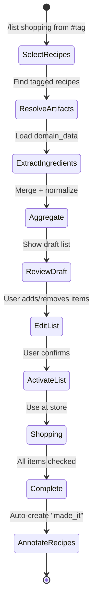

# Feature: 028 — Actionable Lists & Resource Tracking

> **Parent Design:** [docs/smackerel.md](../../docs/smackerel.md)
> **Depends On:** Domain-Aware Structured Extraction (spec 026), User Annotations (spec 027)
> **Author:** bubbles.analyst
> **Date:** April 17, 2026
> **Status:** Draft

---

## Problem Statement

Smackerel captures and processes hundreds of artifacts, many of which contain **actionable items that the user needs to aggregate across sources**. A user saves three recipes and needs a combined shopping list. They bookmark five articles about a trip and need a packing list. They save ten product reviews and need a comparison shortlist. Today, each artifact is an island — the user must manually open each one, extract what they need, and compile the list themselves.

The system already extracts structured data from artifacts (spec 026) and knows which artifacts the user values (spec 027). The missing piece is the ability to **aggregate extracted items across artifacts into a unified, actionable list** — and then track the state of that list (checked off, purchased, substituted, skipped).

This is not a to-do app. This is a **projection layer** that takes structured data already inside the knowledge graph and assembles it into practical output: shopping lists from ingredients, reading lists from book mentions, packing lists from travel plans, comparison tables from product specs. The source data already exists — the system just needs to project it into a usable form.

---

## Outcome Contract

**Intent:** Users can generate actionable lists from one or more artifacts by aggregating domain-extracted structured data. Lists are editable, shareable, and trackable. The system handles deduplication, unit normalization, and grouping automatically. Lists stay linked to their source artifacts so the user can always trace back to the original.

**Success Signal:** User selects 3 recipe artifacts and says "shopping list." The system produces a single aggregated ingredient list where "2 cloves garlic" from recipe A and "3 cloves garlic" from recipe B are merged into "5 cloves garlic." Items are grouped by category (produce, dairy, spices). User checks off items as they shop. Two weeks later, user selects 2 different recipes — the system remembers what was bought recently (from annotations/interaction tracking) and marks those items as "likely in pantry." User exports the list or shares it via Telegram.

**Hard Constraints:**
- Lists are generated from artifact domain_data (spec 026) — not from re-parsing raw content
- Aggregation logic is domain-schema-aware: ingredient lists aggregate differently than product comparison tables
- Items traced back to source artifacts — every list item cites which artifact(s) it came from
- Lists are mutable after generation (add/remove/edit items, check off)
- Lists have a lifecycle: draft → active → completed → archived
- List generation works for any domain that has extractable list-like data (ingredients, specs, destinations, exercises, etc.)
- No external API dependencies for core list functionality (price lookup and store discovery are separate future work)

**Failure Condition:** If the user must manually type ingredients after saving a recipe, the feature has failed. If aggregation across recipes produces duplicates (garlic listed three times), the normalization has failed. If the generated list cannot be edited or checked off, it's a read-only report, not an actionable tool. If adding list support for a new domain (e.g., packing lists from travel artifacts) requires modifying core list infrastructure rather than just defining aggregation rules, the generalization has failed.

---

## Goals

1. Define a universal list model that works across domains (shopping, reading, packing, comparison, etc.)
2. Implement list generation from artifact domain_data with automatic aggregation
3. Implement ingredient-specific aggregation as the first domain (quantity merging, unit normalization, category grouping)
4. Implement list item state tracking (unchecked, checked, skipped, substituted)
5. Implement list operations via REST API and Telegram
6. Link list items to source artifacts for traceability

---

## Non-Goals

- Price comparison or store recommendations (future work)
- Online ordering integration (future work)
- Meal planning / weekly menu generation (future work, builds on this)
- Pantry management / inventory tracking (future work, may use list completion data as input signal)
- Nutritional aggregation across a meal plan
- Multi-user shared list editing (single-user system)

---

## Actors & Personas

| Actor | Description | Key Goals | Permissions |
|-------|------------|-----------|-------------|
| User (List Creator) | Person generating lists from artifacts | Quickly get an actionable list from saved content | Create lists, select source artifacts |
| User (List Consumer) | Person using a list (shopping, reading, etc.) | Check off items, edit list, see what's left | Update list items, export/share |
| System (Aggregator) | Automated list builder | Merge, deduplicate, normalize extracted items | Read artifact domain_data, write lists |
| System (Intelligence) | Recommendation engine | Suggest items, detect patterns from completed lists | Read list history |

---

## Use Cases

### UC-001: Generate Shopping List from Recipes
- **Actor:** User (List Creator)
- **Preconditions:** User has 1+ recipe artifacts with domain_data containing extracted ingredients (spec 026)
- **Main Flow:**
  1. User selects recipe artifacts (by ID, search, tag, or "all recipes tagged #thisweek")
  2. System extracts ingredient lists from each artifact's domain_data
  3. Aggregation engine merges duplicate ingredients, normalizes quantities (e.g., "1 cup + 250ml" → combined amount)
  4. Items are grouped by category (produce, dairy, proteins, pantry staples, spices, etc.)
  5. List is created with status "draft"
  6. System presents the list to the user for review
  7. User confirms → list status becomes "active"
- **Alternative Flows:**
  - Artifact lacks domain_data → ingredient extraction attempted from summary/key_ideas as fallback
  - Ambiguous quantity normalization → items kept separate with note
  - User edits list before confirming (add/remove/change quantities)
- **Postconditions:** Active shopping list exists, linked to source recipe artifacts

### UC-002: Check Off Items While Shopping
- **Actor:** User (List Consumer)
- **Preconditions:** Active shopping list exists
- **Main Flow:**
  1. User views list in Telegram or via API
  2. User checks off items as they acquire them
  3. System updates item state and tracks completion timestamp
  4. When all items checked, system prompts to mark list as completed
- **Alternative Flows:**
  - User substitutes an item ("got almond milk instead of oat milk") → substitution recorded
  - User skips an item ("already have garlic") → marked as skipped with reason
  - User adds an item not from any recipe ("also need paper towels") → added as manual item
- **Postconditions:** List reflects real-time shopping progress; completion data available for future intelligence

### UC-003: Generate Reading List from Saved Articles
- **Actor:** User (List Creator)
- **Preconditions:** User has multiple article/book artifacts, some tagged or starred
- **Main Flow:**
  1. User requests "reading list from my starred articles this month"
  2. System collects matching artifacts
  3. List generated with: title, source, estimated read time (from content length), topic tags
  4. Items ordered by relevance score or date
- **Postconditions:** Reading list created with links back to source artifacts

### UC-004: Generate Comparison Table from Products
- **Actor:** User (List Creator)
- **Preconditions:** User has multiple product artifacts with domain_data (spec 026)
- **Main Flow:**
  1. User selects product artifacts ("compare the cameras I saved")
  2. System extracts specs from each product's domain_data
  3. Comparison table generated with common spec fields aligned
  4. Price, rating, pros/cons shown side by side
- **Postconditions:** Comparison list/table created with links to source artifacts

### UC-005: Telegram Interaction for Lists
- **Actor:** User (via Telegram)
- **Preconditions:** Bot is configured and user is authorized
- **Main Flow:**
  1. User sends "/list shopping from #weeknight-recipes"
  2. Bot generates shopping list and sends it formatted in Telegram
  3. User taps items to check them off (inline keyboard or reply commands)
  4. User sends "/list done" to complete
- **Alternative Flows:**
  - "/list" with no args → shows active lists
  - "/list add milk" → adds manual item to active shopping list
  - "/list share" → generates shareable text or link
- **Postconditions:** Full list lifecycle manageable via Telegram

---

## Business Scenarios

### BS-001: Multi-Recipe Shopping List
Given the user has 3 recipe artifacts with extracted ingredients
When the user requests a shopping list from those recipes
Then the system produces a single list with merged quantities
And "2 cloves garlic" + "3 cloves garlic" becomes "5 cloves garlic"
And items are grouped by category (produce, dairy, spices, etc.)
And each item cites which recipe(s) it comes from

### BS-002: Edit List Before Use
Given the system has generated a shopping list
When the user reviews the list
Then the user can remove items they already have
And add items not from any recipe
And adjust quantities
And the list retains traceability to source artifacts for unmodified items

### BS-003: Track Shopping Progress
Given the user has an active shopping list
When the user checks off items during shopping
Then checked items move to a "done" section
And the remaining count updates
And when all items are checked, the system asks if the list is complete

### BS-004: Substitution Tracking
Given the user is shopping from an active list
When the user marks "oat milk" as substituted with "almond milk"
Then the substitution is recorded with both the original and replacement
And the system can learn substitution preferences over time (e.g., "user prefers almond milk")

### BS-005: List from Search Results
Given the user searches "Italian recipes I rated 4+ stars"
When the user requests a shopping list from the search results
Then the system generates a combined ingredient list from all matching recipes
And the list is linked to the search query for easy regeneration

### BS-006: Reading List Generation
Given the user has 20 starred articles from the past month
When the user requests a reading list
Then the system produces an ordered list with title, source, estimated read time, and topic
And items are ordered by relevance score descending
And the user can check off articles as they read them

### BS-007: Product Comparison Generation
Given the user has 4 product artifacts for cameras with domain-extracted specs
When the user requests a comparison
Then the system produces a table with aligned specs (price, resolution, weight, battery life)
And highlights the best value in each category
And each row links back to the source artifact

### BS-008: List History Informs Intelligence
Given the user has completed 5 shopping lists over 2 months
When the intelligence engine analyzes list completion data
Then it detects which ingredients the user buys most frequently
And which recipes the user actually shops for (vs. saved but never made)
And this data feeds into recipe recommendations and resurfacing

### BS-009: Ingredient Normalization Ambiguity
Given recipe A calls for "1 chicken breast" and recipe B calls for "500g chicken"
When the system generates a shopping list
Then the system does NOT merge these (incompatible units: count vs weight)
And both items appear separately with a note suggesting they may overlap
And the user can manually merge them

### BS-010: Partial Domain Extraction Graceful Degradation
Given recipe A has full ingredient extraction and recipe B has domain_extraction_status "failed"
When the user generates a shopping list from both
Then recipe A's ingredients appear normally
And recipe B is flagged with "ingredients could not be extracted — add manually"
And the list is still generated (not blocked by one failure)

### BS-011: Quantity Overflow Normalization
Given the user selects 50 recipes that all include "1 tsp salt"
When quantities are summed to "50 tsp"
Then the system normalizes to a reasonable display unit ("~1 cup" or "~250ml")
And pantry staples are flagged as "likely already have"

### BS-012: Empty List Generation
Given the user selects 3 artifacts that have no domain_data (articles, not recipes)
When they request a shopping list
Then the system returns a clear message: "No extractable ingredients found"
And suggests selecting recipe artifacts instead

### BS-013: List Completion Triggers Annotation Feedback
Given a user completes a shopping list generated from 3 recipes
When the list status changes to "completed"
Then "made_it" interaction annotations are auto-created on all 3 source recipe artifacts (spec 027)
And the intelligence engine records these as usage events

### BS-014: Mobile List Access
Given a user generated a shopping list on desktop
When they open Smackerel on their phone at the grocery store (spec 033)
Then the list is accessible via the PWA or API
And they can check off items in real-time
And checked state syncs back to the server

---

## Non-Functional Requirements

- **List generation time:** < 5 seconds for aggregating up to 20 artifacts
- **Item limit:** Lists support up to 500 items (sufficient for any reasonable shopping/reading list)
- **Persistence:** Lists persist until explicitly archived or deleted; completed lists retained for intelligence
- **Offline resilience:** List state is stored server-side; Telegram inline keyboard state degrades gracefully if messages are old
- **Traceability:** Every auto-generated list item links to its source artifact(s); manual items are marked as user-added
- **Extensibility:** Adding a new list type (e.g., packing list) requires only a domain aggregation rule definition, not core list infrastructure changes

---

## List Data Model (Conceptual)

```
lists:
  id: unique identifier
  list_type: "shopping" | "reading" | "comparison" | "packing" | "checklist" | "custom"
  title: string
  status: "draft" | "active" | "completed" | "archived"
  source_artifact_ids: [artifact_id]  # which artifacts generated this list
  source_query: string (nullable)      # search query that generated this list
  created_at: timestamp
  updated_at: timestamp
  completed_at: timestamp (nullable)

list_items:
  id: unique identifier
  list_id: reference to list
  content: string                      # display text ("5 cloves garlic")
  category: string (nullable)          # grouping ("produce", "dairy", etc.)
  status: "pending" | "done" | "skipped" | "substituted"
  substitution: string (nullable)      # what was substituted if status = substituted
  source_artifact_ids: [artifact_id]   # which artifact(s) this item came from
  quantity: number (nullable)
  unit: string (nullable)
  sort_order: integer
  checked_at: timestamp (nullable)
  notes: string (nullable)

aggregation_rules (config, not DB):
  domain: "recipe" | "product" | "travel" | ...
  source_field: "domain_data.ingredients" | "domain_data.specs" | ...
  merge_strategy: "sum_quantities" | "union" | "compare_columns"
  grouping_field: "category" | "type" | none
  display_template: format string for list item text
```

---

## UI Wireframes

### Screen: Telegram Shopping List
**Actor:** User | **Channel:** Telegram | **Status:** New

```
┌─────────────────────────────────────────────────┐
│  🛒 Weekend Cooking (15 items)                   │
│  From: Carbonara, Tikka Masala, Lemon Chicken   │
│  ━━━━━━━━━━━━━━━━━━━━━━━━━━━━━━━━━━━━           │
│                                                   │
│  🥬 PRODUCE                                      │
│  [ ] 5 cloves garlic                   [✓][⊘]  │
│  [ ] 2 lemons                          [✓][⊘]  │
│  [ ] 1 bunch cilantro                  [✓][⊘]  │
│                                                   │
│  🥩 PROTEINS                                     │
│  [ ] 1 kg chicken breast               [✓][⊘]  │
│  [ ] 200g guanciale                    [✓][⊘]  │
│                                                   │
│  🧀 DAIRY                                        │
│  [ ] 100g pecorino romano              [✓][⊘]  │
│  [ ] 200ml yogurt                      [✓][⊘]  │
│                                                   │
│  🧂 SPICES                                       │
│  [ ] garam masala                      [✓][⊘]  │
│  [ ] black pepper                      [✓][⊘]  │
│                                                   │
│  ━━━━━━━━━━━━━━━━━━━━━━━━━━━━━━━━━━━━           │
│  Progress: 0/15 | [+ Add Item] [✅ Done]        │
└─────────────────────────────────────────────────┘
```

**Interactions:**
- [✓] button → inline keyboard callback: marks item done (strikethrough)
- [⊘] button → marks skipped
- [+ Add Item] → prompts for manual item text
- [✅ Done] → completes list, triggers annotation feedback (spec 027)

**States:**
- Item checked: `[✓] ~~5 cloves garlic~~`
- Item skipped: `[⊘] 1 bunch cilantro (skipped)`
- Item substituted: `[↔] yogurt → sour cream`
- All items done: "🎉 List complete! 15/15 items. Mark recipes as made?"

### Screen: Telegram List Summary
**Actor:** User | **Channel:** Telegram | **Status:** New

```
┌─────────────────────────────────────────────────┐
│  User: /list                                     │
│                                                   │
│  📋 Your Active Lists:                           │
│                                                   │
│  1. 🛒 Weekend Cooking (3/15 done)              │
│     Created: 2h ago | From: 3 recipes            │
│                                                   │
│  2. 📚 Reading Queue (0/8 done)                  │
│     Created: 1 day ago | From: 8 starred articles│
│                                                   │
│  Reply with a number to open.                    │
└─────────────────────────────────────────────────┘
```

### Screen: Mobile Shopping List (PWA)
**Actor:** User | **Channel:** PWA (spec 033) | **Status:** New

```
┌──────────────────────────┐
│  ← 🛒 Weekend Cooking    │
│  3/15 done               │
├──────────────────────────┤
│                           │
│  🥬 PRODUCE              │
│  ☐ 5 cloves garlic       │
│  ☑ 2 lemons    ──────── │
│  ☐ 1 bunch cilantro      │
│                           │
│  🥩 PROTEINS             │
│  ☐ 1 kg chicken breast   │
│  ☑ 200g guanciale ───── │
│  ☐ 100g pecorino romano  │
│                           │
│  ─────────────────────── │
│  [+ Add Item]             │
│                           │
├──────────────────────────┤
│  🏠  🔍  📋  ⚙️          │
└──────────────────────────┘
```

**Interactions:**
- Tap item → toggle checked (instant, syncs to server)
- Swipe left → skip/substitute options
- [+ Add Item] → inline text input

**Responsive:**
- Mobile: Full-width single column (primary use case: grocery store)
- Tablet: Two-column (categories side by side)

**Accessibility:**
- Each item is a checkbox with label
- Category headings are semantic `<h3>` with emoji as decorative
- Large tap targets (48px minimum)

### User Flow: Generate Shopping List



---

## Improvement Proposals

### IP-001: Smart Pantry Awareness ⭐ Competitive Edge
- **Impact:** High
- **Effort:** L
- **Competitive Advantage:** System knows what you bought recently (from completed shopping lists and receipt annotations) and auto-marks "likely in pantry" on new lists
- **Actors Affected:** Regular shoppers
- **Business Scenarios:** "Generate shopping list" → garlic is greyed out with "bought 3 days ago"

### IP-002: Recurring List Templates
- **Impact:** Medium
- **Effort:** M
- **Competitive Advantage:** "Generate my weekly shopping list" → reuses recipes user frequently makes
- **Actors Affected:** Users with regular shopping patterns
- **Business Scenarios:** System learns the weekly staples and pre-populates

### IP-003: List Sharing via Link
- **Impact:** Medium
- **Effort:** S
- **Competitive Advantage:** Share shopping list with partner/family without them needing Smackerel
- **Actors Affected:** Users who shop with others
- **Business Scenarios:** Generate a shareable URL or formatted text message

### IP-004: Receipt-to-Completion Matching
- **Impact:** High
- **Effort:** L
- **Competitive Advantage:** User photographs grocery receipt → system auto-checks items on the active shopping list
- **Actors Affected:** Users who want zero-friction list completion
- **Business Scenarios:** OCR receipt → match line items to list items → auto-complete
