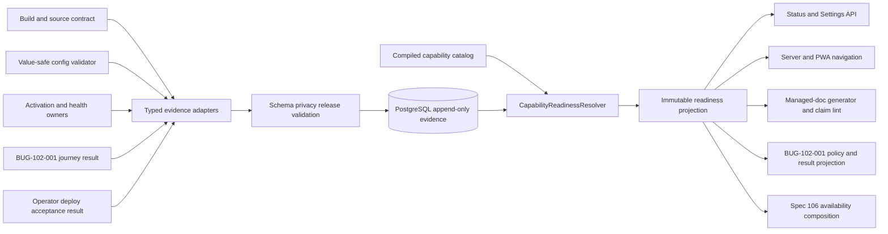

# Technical Design: [BUG-004] Canonical Capability Readiness Truth

## Design Brief

### Current State

Smackerel has several useful but independent partial truth surfaces. The static
server navigation in `internal/web/appshell.go`, the PWA inventory in
`web/pwa/lib/appnav.js`, and the extra links in `internal/web/templates.go` do
not consult runtime capability state. `internal/web/handler.go::SettingsPage`
reads environment variables and connector tables directly, while `StatusPage`
combines database/NATS liveness, knowledge counts, an enablement flag, and a
separate recommendation-provider list.

Domain-specific capability models already exist, but they answer narrower
questions. `internal/connector/photos/capability_taxonomy.go` owns provider
limitations, `internal/connector/qfdecisions/capability.go` owns QF protocol
compatibility, and the design for BUG-039-005 owns recommendation-provider
availability. None can truthfully answer whether an immutable Smackerel release
is implemented, configured, activated, healthy, user-journey-verified, and
deployed for a particular train and audience.

### Target State

One product-owned `CapabilityReadiness` foundation accepts only typed,
value-safe evidence, stores it append-only in PostgreSQL, and derives one
immutable readiness projection for a declared release, train, deployment class,
and audience. Six positive facts are independent: `implemented`, `configured`,
`activated`, `healthy`, `journey_verified`, and `deployed`. The spec-required
`degraded` and `disabled` facts are orthogonal overlays, not aliases for a
missing milestone.

Managed documents, release claims, `/status`, `/settings`, server/PWA
navigation, BUG-102-001 deployment acceptance, and spec 106 consume the same
resolver output. They may redact or compose it for their audience, but they may
not recalculate readiness from flags, routes, health, page presence, spec
status, or provider counts.

### Patterns To Follow

- Keep `config/smackerel.yaml` as the explicit configuration SST and
	PostgreSQL as the only readiness evidence store.
- Follow the typed domain capability boundaries in Photos, QF Decisions,
	Graph activation (BUG-080-001), Recommendations (BUG-039-005), and durable
	Synthesis health (BUG-004-004); adapt their outcomes rather than repeat their
	business checks.
- Follow the immutable result contract in BUG-102-001: one versioned,
	read-only, privacy-safe journey result with stable codes and release identity.
- Follow the existing managed-doc registry in
	`.github/bubbles/docs-registry.yaml`; project readiness claim surfaces extend
	that inventory explicitly rather than being found by an unbounded repo scan.
- Follow existing `pgxpool` store composition and typed handler dependencies;
	templates and PWA modules receive projections, not database access.

### Patterns To Avoid

- `RecommendationsEnabled`, route registration, a static page, a green health
	probe, a completed spec, or a passing fixture suite must never become a
	readiness decision by itself.
- The current static navigation arrays must not remain a second authority after
	cutover.
- The current `SettingsPage` environment probing and `StatusPage` ad hoc joins
	must not be copied into a new aggregate handler.
- Raw journey bodies, prompts, graph labels, source titles, provider payloads,
	secret values, hostnames, IP addresses, user identifiers, or filesystem paths
	must never enter readiness evidence.
- A checked-in JSON/YAML runtime ledger, in-memory cache as truth, or a second
	datastore is forbidden.

### Resolved Decisions

- Capability declarations are explicit compiled config; observations and
	corrections are append-only PostgreSQL rows.
- `journey_verified` is the technical fact behind the spec's `Live Verified`
	dimension. `healthy` and `deployed` remain separate even when the same
	acceptance run observes both.
- A pure resolver owns precedence, freshness, contradiction, requiredness, and
	claim vocabulary. Every projection consumes its result.
- Operated product journeys remain read-only. Importing their sanitized result
	writes only readiness-control metadata, never product/business rows.
- Current release identity is mandatory. Evidence for another release can
	remain historical but cannot prove the running release.
- Missing, expired, malformed, or mismatched evidence weakens the claim; it
	never activates a default or preserves an optimistic prior label.

### Open Questions

- The operator/config owner must supply explicit max-age, collection cadence,
	snapshot age, and evidence-retention values. Their semantics are fixed below;
	no implementation value may be invented.
- `bubbles.docs` must identify the exact claim-bearing headings in `README.md`,
	`docs/INVESTOR_OVERVIEW.md`, and release packets in addition to the effective
	managed-doc registry. Unregistered sections cannot publish runtime readiness
	claims.

## Purpose And Scope

This design owns the canonical readiness catalog, evidence envelope, PostgreSQL
ledger, deterministic resolver, immutable export, API projections, claim lint,
and consumer boundaries needed to satisfy READY-001 through READY-014. It
includes the one-way BUG-102-001 producer / readiness consumer / spec 106
presentation ownership (READY-013) and exact-from-disk dependency-spec status
that never promotes a top-level `blocked` dependency spec (spec 104) by its
individually completed scopes (READY-014). It defines how current implementation
history and current runtime truth coexist without rewriting certified artifacts.

It does not repair any underlying product journey, run a production synthetic,
edit managed documentation, redesign spec 106, change BUG-102-001 requirements,
or alter deployment adapters. Those producers and consumers integrate through
the contracts below.

## Grounded Root Cause Analysis

### Confirmed Distributed Inference

The repository contains no shared multi-dimensional readiness resolver:

1. `internal/web/appshell.go` hardcodes six server destinations.
2. `web/pwa/lib/appnav.js` hardcodes eight partially different destinations
	 and catches all construction errors without exposing capability truth.
3. `internal/web/templates.go::head` adds Digest, Topics, and Status separately,
	 producing a third navigation inventory.
4. `internal/web/handler.go::SettingsPage` labels LLM and digest configuration
	 through direct environment reads and independently queries `sync_state` and
	 `oauth_tokens`.
5. `StatusPage` treats process/dependency health, counts, recommendation
	 enablement, and provider rows as unrelated template fields.
6. `internal/api/photos_capability.go` and Photos' taxonomy expose valid
	 provider-specific limitations but no release/deployment/journey fact.
7. `internal/connector/qfdecisions/capability.go` validates a remote protocol
	 contract and persists its compatibility under `sync_state`; compatibility
	 is not Smackerel product readiness.
8. `internal/docfreshness/doc_freshness_test.go` protects three enumerated
	 `docs/Development.md` inventories but does not validate runtime claims.

The current architecture therefore lets each surface select a convenient proxy:
spec completion for release docs, env presence for Settings, route/page presence
for navigation, general liveness for operations, or registry cardinality for a
provider capability. The 2026-07-23 review demonstrated that these proxies can
all look positive while authenticated product journeys return 404, reject the
session, send no request, show false empty, or leave a blank response.

### Root Cause

Capability identity, evidence ownership, freshness, contradiction, and claim
derivation have no common boundary. The defect is not merely stale prose; it is
multiple independent algorithms deciding what `ready`, `available`,
`implemented`, and `delivered` mean.

### Important Distinction

The bug specification names six dimensions: implementation, configuration,
activation, live verification, degradation, and disablement. The live review
also requires health and deployment identity to remain visible. This design
does not replace the spec model. It makes `journey_verified` the exact technical
form of `live verified`, introduces `healthy` and `deployed` as independent
facts needed to prevent new conflation, and retains `degraded` and `disabled`
as independent spec-required overlays.

## Source Ownership And Authority

| Truth | Authoritative owner | What this foundation accepts | What is explicitly not authority |
|---|---|---|---|
| Capability identity, requiredness, audience, freshness, permitted outcomes, navigation/doc policy | Product/config owner through `config/smackerel.yaml` | Compiled catalog entry and digest | Route lists, environment names, document prose, database observations |
| Implemented | Owning implementation/build contract | Immutable release-bound build/source evidence | Spec status, source-file presence, test-file presence |
| Configured | Central config compiler plus owning domain validator | Value-safe validation outcome for the exact release | Environment dump, secret value, UI setup state |
| Activated | Owning runtime capability registry | Typed complete activation/route/provider contract | Process startup, one route, one non-nil handler, nav link |
| Healthy | Owning domain health model | Closed current health outcome under catalog freshness | General liveness, database/NATS health alone |
| User journey verified | BUG-102-001 product-owned runner | Immutable, schema-valid, read-only, audience-scoped journey result | Adapter probes, screenshots alone, fixture/unit success |
| Deployed | Operator-owned deploy adapter | Immutable applied-release identity and acceptance result identity | Product runtime inference, branch name, mutable tag |
| Degraded/disabled | Owning domain/policy contract | Affirmative typed limitation or explicit policy decision | Missing config, missing route, collector error, unknown state |
| Evidence history | `ReadinessEvidenceStore` in PostgreSQL | Valid append-only observation/correction rows | Generated docs, local files, browser storage, process memory |
| Current claim | `CapabilityReadinessResolver` | Exact catalog plus effective evidence at an explicit `as_of` | Templates, PWA code, docs, releases, deploy adapter |

The ownership rule is one-way: producers own observations, the foundation owns
normalization and derivation, and consumers own presentation only. A consumer
cannot write evidence or reinterpret a producer outcome.

## Architecture Overview



The catalog says what must be proven. Producers say only what they observed.
The ledger preserves those observations. The resolver alone decides what the
observations permit a consumer to claim.

## Capability Foundation

### Foundation Contracts

| Contract | Responsibility | Consumers |
|---|---|---|
| `CapabilityCatalog` | Stable IDs, owner, train/audience scope, requiredness, evidence requirements, freshness policy, actions, and projection policy | Validator, resolver, docs, navigation |
| `ReadinessEvidenceEnvelope` | Versioned producer-neutral observation with closed fields and no business content | Build/config/runtime/journey/deploy adapters |
| `ReadinessEvidenceStore` | Append accepted batches/evidence/corrections; list by exact release scope; never update/delete | Resolver, audit/export |
| `CapabilityReadinessResolver` | Select effective evidence, apply freshness and contradictions, derive dimension facts and claims | Every consumer |
| `ReadinessProjection` | Immutable, content-safe result for one release/train/deployment-class/audience/as-of tuple | API, docs, UI, navigation, acceptance |
| `ReadinessSnapshotExporter` | Persist and emit a digest-bound projection for static docs/release checks | Managed-doc generator, release workflow |
| `ReadinessClaimValidator` | Compare structured document claims with one snapshot and reject overstatement | `./smackerel.sh lint`, managed-doc/release checks |

### Stable Capability Identity

Capability IDs use lowercase dot-separated product meaning, not route or
package names. The first catalog covers the reviewed journeys and spec 106
surfaces, including:

- `auth.browser_session`
- `assistant`
- `capture`
- `search`
- `digest`
- `knowledge.browse`
- `knowledge.graph`
- `work.lists`
- `work.meals`
- `work.expenses`
- `cards`
- `recommendations`
- `sources.connectors`
- `sources.photos`
- `sources.models`
- `activity.notifications`
- `intelligence.synthesis`
- `client.android`
- `deployment.acceptance`

Catalog presence does not imply implementation. A capability can be declared
with missing implementation evidence and will remain non-live. IDs are never
reused. A rename adds a new ID plus an explicit compatibility alias and consumer
trace; it does not silently reinterpret historical evidence.

### Positive Readiness Facts

| Dimension | Exact question | Authoritative producer class |
|---|---|---|
| `implemented` | Does this immutable release contain the production contract and wired implementation? | Build/source contract owned by the capability implementation |
| `configured` | Did explicit required config validate without reading back values? | Central config validator plus domain config owner |
| `activated` | Did the current release register/mount/enable the complete capability contract? | Runtime capability/route/provider registry owner |
| `healthy` | Are required stores/providers/workers/contracts within their explicit current health policy? | Domain health owner; never general liveness alone |
| `journey_verified` | Did the exact authenticated user journey complete within freshness for this audience? | BUG-102-001 product-owned result bridge |
| `deployed` | Is the immutable release identity currently applied to the declared deployment class? | Operator deploy acceptance adapter |

### Orthogonal Condition And Policy Facts

| Dimension | Exact question | Rule |
|---|---|---|
| `degraded` | Does current evidence prove useful behavior remains with a named limitation? | May coexist with implementation/config/activation/deployment; requires explicit useful behavior and limitation code |
| `disabled` | Does explicit policy intentionally exclude this capability for this train/audience/deployment class? | Never inferred from missing config, missing route, or failed health |

`degraded` is not a softer name for unknown or broken. `disabled` is not a
fallback for configuration failure. Both require their own affirmative current
evidence.

### Variation Axes

| Axis | Options | Foundation ownership |
|---|---|---|
| Producer | build, config, activation, health, journey, deploy, policy | Envelope validation and precedence are shared; observation logic stays with owner |
| Evidence scope | release-bound, duration-bound, until-superseded | Catalog defines; producer cannot choose a weaker policy |
| Audience | daily user, operator, supported external consumer | Catalog and authorization define; no principal identity stored |
| Requiredness | required, optional, excluded | Catalog defines for each train/audience/deployment class |
| Runtime condition | complete, true-empty, quiet, partial, failed | Producer emits closed outcome; resolver maps only through catalog policy |
| Projection | operator detail, daily-user availability, docs, release, navigation, acceptance | Same facts; redaction/composition differ |

## Concrete Implementations

### Build And Implementation Adapter

The build pipeline emits release-bound evidence only after the capability's
declared production package, registration/wiring check, and required contract
tests succeed. A completed `state.json`, source-file presence, or test file
presence cannot produce this evidence. The adapter records capability ID,
release identity, build result ID, evidence digest, and a closed result code.
It stores no source code, test output, branch name, filesystem path, or operator
identity.

### Configuration Adapter

The central config compiler and each domain validator emit `configured`
evidence from value-safe categories: required keys present, enum/schema valid,
cross-field constraints valid, and domain-specific configuration accepted.
Secret values, secret lengths, hashes, env dumps, provider payloads, and
secret-to-variable mappings are excluded. Missing optional configuration emits
an explicit denied/not-applicable outcome according to catalog requiredness; it
does not become `disabled` automatically.

### Activation Adapter

Runtime owners expose a typed activation observation. Examples include the
composite Graph route manifest from BUG-080-001, provider inventory from
BUG-039-005, and durable Synthesis wiring from BUG-004-004. The adapter checks
the owner's typed contract and appends `activated`; it never counts Chi routes,
handler pointers, navigation items, or process startup independently.

### Health Adapter

Each capability health owner maps its current typed state to the shared
envelope. General `/readyz`, database liveness, and NATS liveness are supporting
facts only. Recommendation provider health, Graph read health, Synthesis durable
run health, connector health, and client artifact health remain domain-owned.
The adapter emits one closed health code, observed time, and optional limitation
code without payload content.

### Journey Evidence Bridge

BUG-102-001 remains the sole product journey runner. The bridge validates its
result version, release/train identity, manifest completeness, read-only safety,
and privacy contract, then maps each journey row to one or more catalog IDs.
The mapping lives in the catalog, not in the deploy adapter. A passed Search
row can affirm `search.journey_verified`; a failed Graph row denies
`knowledge.graph.journey_verified`. An omitted required row rejects the whole
ingestion batch.

The bridge never reruns login, Search, Digest, Assistant, Graph,
Recommendations, Cards, or Synthesis assertions. It consumes their stable
journey outcomes exactly once.

### Deployment Evidence Adapter

The operator-owned adapter emits `deployed` only for the immutable release it
actually applied. The payload contains a safe release ID, release train,
deployment class, acceptance result ID, observed time, and digest. It excludes
target name, hostname, IP, tailnet identity, operator name, path, image registry
credential, and secret material.

Deployment and journey evidence remain separate. A release can be deployed
while a required journey is broken; the resolver then reports `deployed=met`
and `journey_verified=not_met`, never overall readiness.

### Managed-Document Adapter

The docs adapter renders only `ReadinessProjection` records. It does not query
source trees, `state.json`, routes, provider registries, or runtime health. A
static document can show the implementation fact and runtime gaps together,
but it cannot strengthen the resolver's permitted claim.

## Configuration Single Source Of Truth

The capability catalog is an explicit `capability_readiness` block under
`config/smackerel.yaml`. The config compiler validates and exposes it to the Go
runtime and docs tooling from the same source. No generated env file or
database row becomes catalog authority.

Required top-level fields:

```yaml
capability_readiness:
	schema_version: capability-readiness-catalog/v1
	observer_interval_seconds: ${CAPABILITY_READINESS_OBSERVER_INTERVAL_SECONDS}
	snapshot_max_age_seconds: ${CAPABILITY_READINESS_SNAPSHOT_MAX_AGE_SECONDS}
	evidence_retention_days: ${CAPABILITY_READINESS_EVIDENCE_RETENTION_DAYS}
	health_max_age_seconds: ${CAPABILITY_READINESS_HEALTH_MAX_AGE_SECONDS}
	journey_max_age_seconds: ${CAPABILITY_READINESS_JOURNEY_MAX_AGE_SECONDS}
	capabilities: []
	claim_surfaces: []
```

The empty arrays above describe required field types, not runtime defaults; a
validated runtime/release catalog must contain the complete declared inventory
and claim-surface inventory. Every capability entry supplies all of:

- stable ID and display label;
- owner spec/bug and technical owner;
- release train and deployment class;
- audience-specific requiredness;
- required journey IDs and explicitly permitted empty/quiet/degraded outcomes;
- freshness mode for every dimension (`release_bound`, `duration`, or
	`until_superseded`), plus max age when mode is `duration`;
- safe setup, inspect, verify, retry, or no-action code;
- navigation visibility policy for each derived availability state;
- managed-document claim surfaces and heading anchors.

Missing fields, an empty catalog in an enabled runtime, unknown enum values,
duplicate IDs, a duration mode without max age, an unknown journey ID, or a
claim surface outside the explicit registry fails configuration. No environment
name, train name, or route presence selects a default policy.

## Evidence Ingestion Contract

### Versioned Envelope

All producers use one bounded envelope:

```json
{
	"schema_version": "capability-readiness-evidence/v1",
	"producer": "product-journey-acceptance",
	"producer_result_id": "opaque-result-id",
	"release_id": "sha256:immutable-release-digest",
	"release_train": "mvp",
	"deployment_class": "self-hosted",
	"observed_at": "2026-07-23T20:00:00Z",
	"observations": [
		{
			"capability_id": "search",
			"audience": "daily_user",
			"dimension": "journey_verified",
			"assertion": "denied",
			"result_code": "E102-JOURNEY-SEARCH-ZERO-REQUEST",
			"safe_observed_state": "zero_request",
			"safe_required_state": "terminal_result",
			"limitation_code": "",
			"evidence_ref": "evidence://product-journey-acceptance/result-id/search",
			"evidence_sha256": "sha256:content-digest",
			"supersedes_evidence_id": "",
			"correction_reason_code": ""
		}
	]
}
```

`producer_result_id`, release IDs, evidence references, result/state codes, and
digests use constrained formats and lengths. `safe_observed_state` and
`safe_required_state` must belong to the producer's registered closed enum.
Unknown fields are rejected. Arbitrary metadata maps are forbidden.

### Ingestion Boundary

There is no public readiness-write endpoint. A product-owned operator command
under `./smackerel.sh` validates an evidence artifact and writes it through the
Go readiness store using generated runtime configuration. The operator deploy
adapter may invoke this command with an artifact path and expected producer;
it does not pass credentials or evidence content as command-line arguments.

The journey itself performs zero product writes. The later ingestion transaction
writes only `capability_readiness_*` operational-control tables. It cannot
create, update, delete, trigger, sync, schedule, or inspect personal product
records. This is the sole allowed metadata write associated with readiness
proof.

### Batch Atomicity And Idempotency

Ingestion validates the whole envelope before opening a transaction. Inside one
transaction it:

1. inserts the unique ingestion batch;
2. inserts every observation;
3. validates correction references belong to the same capability/dimension/
	 train/audience/release scope;
4. verifies the inserted count and digest;
5. commits all or none.

`(producer, producer_result_id, envelope_sha256)` is idempotent. Reusing a
producer result ID with different bytes is a conflict and writes nothing.
Invalid, unsafe, partial, unsupported, or release-mismatched batches write no
evidence row; rejection is reported through safe logs/metrics.

## PostgreSQL Data Model

The implementation owner assigns the next available migration number. The
logical DDL below is binding. No SQLite, JSON file, Redis, browser store, or
in-memory persistence alternative is permitted.

### `capability_readiness_ingestions`

```sql
CREATE TABLE capability_readiness_ingestions (
		id                  UUID PRIMARY KEY,
		schema_version      TEXT NOT NULL CHECK
														(schema_version = 'capability-readiness-evidence/v1'),
		producer            TEXT NOT NULL,
		producer_result_id  TEXT NOT NULL,
		release_id          TEXT NOT NULL,
		release_train       TEXT NOT NULL,
		deployment_class    TEXT NOT NULL,
		observed_at         TIMESTAMPTZ NOT NULL,
		envelope_sha256     TEXT NOT NULL,
		observation_count   INTEGER NOT NULL CHECK (observation_count > 0),
		ingested_at         TIMESTAMPTZ NOT NULL,
		UNIQUE (producer, producer_result_id),
		UNIQUE (producer, producer_result_id, envelope_sha256)
);
CREATE INDEX capability_readiness_ingestions_scope_idx
		ON capability_readiness_ingestions
			 (release_train, deployment_class, release_id, observed_at DESC, id);
```

The application requires the same result ID to carry the same digest. The
second unique key documents idempotent identity; conflict classification occurs
before insert.

### `capability_readiness_evidence`

```sql
CREATE TABLE capability_readiness_evidence (
		id                       UUID PRIMARY KEY,
		ingestion_id             UUID NOT NULL
																 REFERENCES capability_readiness_ingestions(id),
		capability_id            TEXT NOT NULL,
		release_id               TEXT NOT NULL,
		release_train            TEXT NOT NULL,
		deployment_class         TEXT NOT NULL,
		audience                 TEXT NOT NULL,
		dimension                TEXT NOT NULL CHECK (dimension IN
																 ('implemented','configured','activated',
																	'healthy','journey_verified','deployed',
																	'degraded','disabled')),
		assertion                TEXT NOT NULL CHECK (assertion IN
																 ('affirmed','denied','not_applicable')),
		result_code              TEXT NOT NULL,
		safe_observed_state      TEXT NOT NULL,
		safe_required_state      TEXT NOT NULL,
		limitation_code          TEXT,
		evidence_ref             TEXT NOT NULL,
		evidence_sha256          TEXT NOT NULL,
		catalog_digest           TEXT NOT NULL,
		observed_at              TIMESTAMPTZ NOT NULL,
		ingested_at              TIMESTAMPTZ NOT NULL,
		supersedes_evidence_id   UUID REFERENCES capability_readiness_evidence(id),
		correction_reason_code   TEXT,
		CHECK ((supersedes_evidence_id IS NULL AND correction_reason_code IS NULL)
				OR (supersedes_evidence_id IS NOT NULL
						AND correction_reason_code IS NOT NULL)),
		UNIQUE (ingestion_id, capability_id, audience, dimension)
);
CREATE INDEX capability_readiness_evidence_resolve_idx
		ON capability_readiness_evidence
			 (capability_id, release_train, deployment_class, audience,
				release_id, dimension, observed_at DESC, ingested_at DESC, id);
CREATE INDEX capability_readiness_evidence_correction_idx
		ON capability_readiness_evidence (supersedes_evidence_id)
		WHERE supersedes_evidence_id IS NOT NULL;
```

There is no arbitrary JSON payload. Display labels and owner guidance come from
the catalog; observations carry only closed codes and opaque evidence identity.

### Immutable Snapshot Export

```sql
CREATE TABLE capability_readiness_snapshots (
		id                    UUID PRIMARY KEY,
		schema_version        TEXT NOT NULL CHECK
															(schema_version = 'capability-readiness-snapshot/v1'),
		release_id            TEXT NOT NULL,
		release_train         TEXT NOT NULL,
		deployment_class      TEXT NOT NULL,
		audience              TEXT NOT NULL,
		catalog_digest        TEXT NOT NULL,
		as_of                 TIMESTAMPTZ NOT NULL,
		valid_until           TIMESTAMPTZ NOT NULL,
		row_count             INTEGER NOT NULL CHECK (row_count > 0),
		snapshot_sha256       TEXT NOT NULL UNIQUE,
		created_at            TIMESTAMPTZ NOT NULL,
		CHECK (valid_until > as_of)
);

CREATE TABLE capability_readiness_snapshot_dimensions (
		snapshot_id           UUID NOT NULL
															REFERENCES capability_readiness_snapshots(id),
		capability_id         TEXT NOT NULL,
		dimension             TEXT NOT NULL CHECK (dimension IN
															('implemented','configured','activated',
															 'healthy','journey_verified','deployed',
															 'degraded','disabled')),
		state                 TEXT NOT NULL CHECK (state IN
															('met','not_met','not_applicable','missing',
															 'stale','contradicted')),
		evidence_id           UUID REFERENCES capability_readiness_evidence(id),
		evidence_freshness    TEXT NOT NULL CHECK (evidence_freshness IN
															('current','stale','missing','contradicted')),
		observed_at           TIMESTAMPTZ,
		valid_until           TIMESTAMPTZ,
		invalidation_code     TEXT,
		PRIMARY KEY (snapshot_id, capability_id, dimension)
);

CREATE TABLE capability_readiness_snapshot_claims (
		snapshot_id           UUID NOT NULL
															REFERENCES capability_readiness_snapshots(id),
		capability_id         TEXT NOT NULL,
		requiredness          TEXT NOT NULL CHECK (requiredness IN
															('required','optional','excluded')),
		machine_claim         TEXT NOT NULL,
		availability          TEXT NOT NULL CHECK (availability IN
															('available','needs_setup','degraded','unavailable')),
		evidence_state        TEXT NOT NULL CHECK (evidence_state IN
															('current','stale','missing','contradicted','fixture_only')),
		limitation_code       TEXT,
		action_code           TEXT NOT NULL,
		PRIMARY KEY (snapshot_id, capability_id)
);
```

Snapshots are immutable point-in-time exports for static consumers. Runtime
API requests use the same resolver directly; they do not insert a snapshot on
every page view. A snapshot cannot be treated as current after `valid_until`.

### Database Immutability

Database triggers reject `UPDATE` and `DELETE` on all three evidence/snapshot
families, and the runtime role receives no update/delete privilege. Corrections
are new evidence rows referencing the exact superseded row. Retention, when the
operator supplies it, archives whole immutable partitions through a separately
audited database operation; application code never edits history.

## Deterministic Resolution

### Resolution Key

Every resolution requires all fields explicitly:

```text
(release_id, release_train, deployment_class, audience, as_of, catalog_digest)
```

No field is inferred from `prod`, hostname, current branch, environment name,
or latest database row. Runtime wiring supplies the exact active release tuple
from compiled/deploy metadata. Static tooling receives it from the snapshot.

### Effective Evidence Selection

For each capability/dimension:

1. select only rows matching the exact catalog capability, train, deployment
	 class, audience, catalog digest, and release policy;
2. remove rows superseded by a valid correction in the same scope;
3. order by `observed_at`, then `ingested_at`, then UUID byte order;
4. apply the catalog freshness policy at `as_of`;
5. retain the newest effective row and its evidence reference;
6. classify absence as `missing`, expiry as `stale`, and a newer denial after
	 affirmation as `contradicted`/`not_met`.

Release-bound implementation/config/deployment evidence can prove only its
exact release. Duration-bound health/journey evidence expires even when no
new row arrives. `until_superseded` is allowed only for explicit policy such as
disablement and remains current until a correction or catalog change.

Clock movement alone therefore demotes stale evidence; no cleanup job or new
failure event is required.

### Contradiction Rules

- A newer denied required journey invalidates an older passed journey
	immediately, even if the old row's time window has not expired.
- A correction removes only the referenced row from effective selection; it
	does not erase the historical row.
- Evidence for a different release remains history and cannot override the
	selected release.
- Fixture, unit, integration, or validate-plane evidence may establish
	`implemented` or `test-covered only` according to catalog policy, but cannot
	affirm operated `journey_verified` or `deployed`.
- A successful true-empty or quiet journey affirms only the exact outcome named
	by catalog policy. It cannot prove populated behavior when populated behavior
	is required.
- A partial result affirms `degraded` only when useful behavior was verified and
	the exact limitation is permitted. Otherwise it denies the required journey.

### Dependency Spec Status And Bounded Scope Evidence (READY-014)

Some capabilities depend on a spec whose own top-level status is authoritative
and read exactly from disk. The Assistant capability depends on
`specs/104-universal-ask-self-knowledge`, whose on-disk `state.json` status is
`blocked`. The resolver treats a dependency spec's top-level status as a first-
class input and MUST NOT synthesize, soften, or promote it:

- Dependency spec status is read verbatim from the dependency's `state.json`
	(exact-from-disk). A top-level `blocked` dependency spec is recorded as
	`blocked`; a set of individually completed scopes on that spec does NOT promote
	the blocked spec to `done` or full-spec readiness.
- Completed-scope evidence on a blocked dependency spec is eligible ONLY for the
	bounded capability journey that the completed scope actually proves. For spec
	104 this means completed Scope 8 evidence may affirm the Assistant's specific
	bounded journey (the exact behavior Scope 8 certifies), and nothing more.
- The bounded scope evidence maps to a single catalog capability journey
	(`assistant.journey_verified` for the exact proven journey) under the normal
	freshness and contradiction rules. It never affirms `implemented`,
	`configured`, `activated`, `healthy`, or `deployed` for the whole spec, and it
	never yields a `live_verified` full-spec claim for spec 104.
- The forbidden claim is explicit: no managed doc, projection, snapshot, or
	release note may state "spec 104 done" or "spec 104 fully ready". The permitted
	set is the dependency status `blocked` plus, where relevant, the bounded
	Assistant capability claim derived from completed Scope 8 evidence.

This rule is the design realization of the packet's `dependencyEvidencePolicy`
(`spec104ObservedStatus = blocked`; `eligibleEvidence = completed scopes only,
scope-08 bounded Assistant evidence`; `forbiddenClaim = spec 104 done or fully
ready`). A completed lower scope can never lift a blocked parent spec, and the
completed-scope path is one-way: it derives a bounded claim, never a promotion.

### Derived Claim Lattice

The resolver emits both detailed machine facts and one primary documentation
claim. Rules are evaluated in this order:

| Condition | Machine claim | Documentation label | Spec 106 availability |
|---|---|---|---|
| Explicit disabled and scope is optional/excluded | `intentionally_unavailable` | `Intentionally unavailable` | `Unavailable` |
| Explicit disabled but scope is required | `broken_required_disabled` | `Broken` | `Unavailable` |
| Implementation evidence missing/denied | `not_live_verified` | `Not live verified` with implementation gap | `Unavailable` |
| Implemented; only fixture/non-operated proof exists | `test_covered_only` | `Test-covered only` | `Unavailable` |
| Implemented; required configuration missing | `needs_configuration` | `Needs configuration` | `Needs setup` only when optional and operator-remediable; otherwise `Unavailable` |
| Configured; activation missing/denied | `inactive` | `Inactive` | `Unavailable` |
| Activated; deployment or journey proof missing/stale | `not_live_verified` | `Not live verified` | `Unavailable` |
| Required current health or journey denied | `broken` | `Broken` | `Unavailable` |
| Useful current journey is permitted partial and `degraded` is affirmed | `degraded` | `Degraded` | `Degraded` |
| All six positive facts met, no degraded/disabled overlay | `live_verified` | `Live verified` | `Available` |
| Implemented but runtime context is not being claimed | `implemented` | `Implemented` plus explicit runtime qualifier | Never promotes availability by itself |

`healthy` cannot substitute for `journey_verified`. `journey_verified` cannot
substitute for `deployed`. `deployed` cannot substitute for a matching release.
No consumer may reorder or weaken this lattice.

### Failure Of The Resolver

Catalog/store/schema/clock/release-context failure produces a typed unavailable
projection and non-zero docs/claim validation. It never returns the last
successful snapshot as current. A prior snapshot may be displayed only with its
original `as_of`, `valid_until`, and explicit stale label.

## Runtime API And Authorization

### Daily-User Projection

`GET /api/capability-readiness`

The handler derives audience and authorization from the authenticated session
and takes release/train/deployment class from required runtime context. It
returns only capabilities the actor may discover, the four-state spec 106
availability, evidence age, limitation code mapped to safe text, and permitted
action. It excludes owner specs, ingestion IDs, evidence IDs, correction
history, config key names, and operator remediation details.

### Operator Projection

`GET /v1/admin/capability-readiness`

Requires the existing operator gate. It returns all catalog capabilities, all
eight dimension states in fixed order, safe evidence references, observed and
expiry times, catalog/release identity, derived claim, requiredness,
limitation/action codes, and correction indicators. It never returns the raw
producer artifact or user/business content.

### Safe Evidence Detail

`GET /v1/admin/capability-readiness/evidence/{evidence_id}`

Returns only the normalized ledger row plus its ingestion identity and digest.
The opaque `evidence_ref` may link to another product-owned safe projection; it
cannot be dereferenced by this endpoint into a raw log, screenshot, trace, or
response body.

### Response Shape

```json
{
	"schema_version": "capability-readiness-projection/v1",
	"release_id": "sha256:immutable-release-digest",
	"release_train": "mvp",
	"deployment_class": "self-hosted",
	"audience": "operator",
	"catalog_digest": "sha256:catalog-digest",
	"as_of": "2026-07-23T20:00:00Z",
	"capabilities": [
		{
			"id": "knowledge.graph",
			"label": "Connected knowledge graph",
			"requiredness": "required",
			"claim": "broken",
			"availability": "unavailable",
			"evidence_state": "contradicted",
			"limitation_code": "route_missing",
			"action_code": "inspect_graph_activation",
			"dimensions": [
				{
					"name": "implemented",
					"state": "met",
					"freshness": "current",
					"observed_at": "2026-07-23T19:00:00Z",
					"valid_until": null,
					"evidence_ref": "evidence://build/result/knowledge-graph"
				}
			]
		}
	]
}
```

`dimensions` always contains all eight entries in catalog order. A missing fact
is represented, never omitted. JSON field names follow the API's selected
projection contract consistently; implementation must not expose database
column names accidentally.

### Closed Errors

| Code | HTTP | Meaning |
|---|---:|---|
| `readiness_context_invalid` | 500 | Required release/train/deployment context absent or inconsistent |
| `readiness_catalog_invalid` | 500 | Compiled catalog invalid or digest mismatch |
| `readiness_store_unavailable` | 503 | PostgreSQL evidence read failed |
| `readiness_evidence_invalid` | 500 | Stored row violates a resolver invariant |
| `readiness_snapshot_stale` | 409 for static validation | Supplied snapshot is beyond `valid_until` |
| `readiness_snapshot_mismatch` | 409 | Release/train/audience/catalog does not match claim surface |
| `readiness_forbidden` | 403 | Actor cannot inspect operator evidence |

Messages are fixed, safe, and contain no raw SQL/driver/config/producer detail.

## Consumer Derivation

### Status And Settings

`StatusPage` and `SettingsPage` receive injected readiness projection providers.
They stop deciding product availability from `RecommendationsEnabled`, direct
environment reads, connector rows, DB/NATS dots, or provider cardinality.
Those domain facts may remain as operator detail beneath the capability row,
but the row's primary state and action come from `ReadinessProjection`.

Daily users see the four spec 106 labels: `Available`, `Needs setup`,
`Degraded`, `Unavailable`. Operators may expand the exact facts:
Implemented, Configured, Activated, Healthy, User journey verified, Deployed,
Degraded, Disabled.

### Server And PWA Navigation

One navigation projection maps capability IDs to destinations declared in the
catalog. Server templates render it directly. PWA code fetches the same
authenticated projection and builds DOM links from its closed fields. Neither
renderer retains an independent readiness array.

Catalog navigation policy can:

- expose an `Available` destination as operable;
- expose an unavailable destination with a textual state when discoverability
	is required;
- omit an explicitly disabled/excluded or unauthorized destination;
- link an authorized operator to a safe setup/detail action.

If readiness cannot resolve, capability-dependent links are not advertised as
ready. The shell exposes a typed `Capability status unavailable` route to
Settings; it does not use the old static arrays as a fallback. Existing deep
links remain routed and render their own typed unavailable/auth state, so
navigation failure does not become a generic 404.

### Managed Documentation And Release Claims

Static claim output is generated from one immutable snapshot. Generated blocks
carry machine-readable boundaries:

```markdown
<!-- smackerel-readiness:start capability=knowledge.graph train=mvp audience=operator snapshot=sha256:... -->
...generated summary or detail block...
<!-- smackerel-readiness:end -->
```

The generator writes the UX-defined primary label, train/audience, observation
date, evidence state, limitation, action, dimension detail, and correction note.
Document authors may add non-readiness explanation outside the block but may not
edit the generated claim.

The claim validator performs two checks:

1. exact regeneration: every registered block must equal output from the named
	 current snapshot;
2. reserved-claim scan: registered claim-bearing headings may not contain
	 unmarked `ready`, `live`, `available`, `delivered`, `production-ready`, or
	 equivalent closed-vocabulary claims outside a generated block.

Diagnostics use the spec-defined envelope: capability, document/heading,
observed claim, permitted claim, evidence state, required proof, and owner
route. The check reports all findings; correcting one cannot hide the rest.

`./smackerel.sh lint` runs structural claim checks. Any command that validates
or publishes a runtime claim additionally requires an explicit snapshot path;
missing, stale, release-mismatched, audience-mismatched, or catalog-mismatched
input fails closed. CI without operated evidence may publish only claims the
available build/validate snapshot permits, never `Live verified` or deployed
readiness by assumption.

### BUG-102-001 Consumption

BUG-102-001 consumes the catalog's requiredness and explicitly permitted
empty/quiet/degraded policies when building its journey manifest. It does not
consume the resolver's overall availability as proof, because that would make
journey verification self-referential.

After execution, its immutable result is ingested through the journey bridge.
The resolver then exposes the resulting `journey_verified` facts back to the
Admin Acceptance projection and docs. The acceptance UI may show the original
journey rows and the derived capability state side by side, but it cannot run a
second derivation or turn `accepted-degraded` into full health.

### Spec 106 Consumption

Spec 106 owns coherent composition, not readiness logic. Its availability
badge, Settings capability table, Product rail/mobile bar, local view switcher,
and operation-state bands consume the daily-user or operator projection.

The mapping is fixed:

| Resolver availability | Spec 106 label | Navigation behavior |
|---|---|---|
| `available` | `Available` | operable when actor is authorized |
| `needs_setup` | `Needs setup` | setup/detail only for authorized actor; no primary promise |
| `degraded` | `Degraded` | operable only for the verified useful subset; limitation adjacent |
| `unavailable` | `Unavailable` | no ready action; safe recovery/detail according to cause |

Spec 106 can render page-level loading, empty, filtered-empty, stale,
unauthorized, not-found, or mutation states beneath this capability label. It
cannot promote those states or reinterpret an empty page as capability
readiness.

## Freshness And Failure Semantics

### Freshness Modes

| Mode | Use | Expiration behavior |
|---|---|---|
| `release_bound` | implementation, configuration, deployment facts tied to immutable release | invalid for another release; current until release correction/supersession |
| `duration` | health and authenticated journey observations | stale when `as_of >= observed_at + max_age` |
| `until_superseded` | explicit requiredness/disablement policy | current until a valid correction or catalog digest change |

Every dimension has an explicit catalog mode. Duration has a required positive
max age. Producers cannot supply or extend their own freshness.

### Collector Failure

The observer runs at an explicit SST cadence and appends only changed outcomes
or a bounded current-observation heartbeat. If collection stops, duration-bound
evidence expires naturally and availability demotes. A collector crash cannot
leave an indefinite healthy/live claim.

### Ledger Or Resolver Failure

- Runtime API: return typed unavailable; do not return cached current output.
- Navigation: show no capability-dependent ready link and expose status failure.
- Settings/Status: preserve labels and show readiness-store unavailable, with no
	dimension invented.
- Docs/release: fail generation/lint; do not update claim blocks.
- BUG-102-001: may still execute its independent journeys, but result ingestion
	and derived claim remain unavailable until the ledger recovers.

### True Empty, Fixture, Optional, Disabled, Broken

- `true-empty`: successful current journey outcome permitted by exact catalog
	policy; no implication about populated behavior.
- `fixture-only`: may support implementation/test coverage, never operated
	journey/deployment evidence.
- `optional-unconfigured`: configured is not met, requiredness is optional, and
	setup is authorized; maps to Needs setup.
- `disabled`: affirmative policy evidence; maps to Intentionally unavailable
	only when optional/excluded.
- `broken`: required current fact denied or contradicted. It cannot be softened
	by changing requiredness in a producer payload.

## Security And Privacy

- Readiness is deployment/audience scoped, never per-person. No user ID,
	username, email, session ID, prompt, query, artifact ID, graph label, digest
	prose, card metadata, source title, or provider response is accepted.
- Evidence references use `evidence://<registered-producer>/<opaque-safe-id>`;
	arbitrary URLs and filesystem paths are rejected.
- Release IDs, catalog digests, evidence digests, codes, and states have closed
	syntax and length bounds. Unknown fields fail closed.
- Secret validation records presence/validity category only. It never records
	secret value, length, hash, prefix/suffix, env dump, or name-to-value map.
- Ingestion is operator-only and content-scanned before transaction. The
	database role can insert/select but cannot update/delete evidence.
- Daily-user projections omit evidence identity and operator remediation.
	Operator projections remain content-free and authorization-gated.
- Snapshot artifacts are safe structured data but still carry internal release
	posture; they are not public unless the docs owner publishes their generated
	projection.
- No readiness data is stored in localStorage, sessionStorage, IndexedDB, a
	service worker, or a browser URL. The PWA keeps only the current in-memory
	projection and refetches after auth/release changes.
- Logs, metrics, traces, claim diagnostics, and accessibility text obey the same
	data-minimization contract.

## Observability

### Metrics

- `smackerel_capability_readiness_evidence_ingestions_total{producer,outcome,code}`
- `smackerel_capability_readiness_observations_total{dimension,assertion}`
- `smackerel_capability_readiness_state{capability,availability}` as bounded
	one-hot gauges for catalog IDs
- `smackerel_capability_readiness_evidence_age_seconds{capability,dimension}`
- `smackerel_capability_readiness_contradictions_total{dimension,code}`
- `smackerel_capability_readiness_snapshot_exports_total{audience,outcome}`
- `smackerel_capability_readiness_claim_rejections_total{surface,claim}`
- `smackerel_capability_readiness_resolve_duration_seconds{outcome}`

Capability IDs are bounded by the compiled catalog. No release digest,
evidence ID, target, user, provider payload, route parameter, or error text is a
metric label.

### Logs And Traces

Ingestion logs producer, producer-result correlation hash, release class,
observation count, outcome, safe code, and duration. Resolution spans separate
catalog validation, evidence read, effective selection, freshness, derivation,
and projection. They exclude evidence refs when those could be linkable and
always exclude content/identity/secret/target data.

### Alerts

- required capability transitions to broken/unavailable;
- operated journey or health evidence becomes stale;
- collector has not produced evidence within its explicit cadence;
- evidence ingestion conflicts, rejects unsafe fields, or mismatches release;
- catalog digest differs between runtime and evidence;
- readiness resolver/store unavailable;
- managed-doc/release claim validation rejects an overclaim in CI/release.

An alert resolves only after current authoritative evidence produces the
expected state. A corrected document cannot clear a runtime broken alert, and a
new health pass cannot clear a missing journey requirement.

## Migration And Compatibility

### Forward Sequence

1. Add the explicit capability catalog and fail-loud parser without changing
	 current UI/docs claims.
2. Create append-only PostgreSQL ingestion/evidence/snapshot tables, triggers,
	 privileges, and pure resolver.
3. Add build/config/activation/health adapters in observation-only mode. Import
	 historical implementation evidence only when an immutable build/source
	 artifact proves it; otherwise leave the dimension missing. Never backfill
	 historical live/deployed proof from spec status.
4. Add operator and daily-user projection APIs. Compare their results with
	 current Settings/Status fields without using the old fields as truth.
5. Add BUG-102-001 and deploy-result bridges after their schemas are complete.
6. Add snapshot export and managed-claim generator/lint. Reconcile each
	 registered claim block through `bubbles.docs` without rewriting certified
	 spec history.
7. Switch Settings and Status primary labels to the projection; retain
	 subsystem detail as subordinate evidence.
8. Switch server and PWA navigation to one navigation projection and remove the
	 independent arrays in the same compatibility change.
9. Let spec 106 compose the four-state UI only after the projection and focused
	 consumer canaries pass.

No migration marks a capability live merely because an older spec is done.

### Backward Compatibility

- Existing `/settings`, `/status`, product routes, PWA paths, and deep links
	remain valid.
- Readiness APIs and generated doc blocks are additive before consumer cutover.
- Existing provider/connector/photo/QF/Synthesis health pages remain domain
	detail. Their primary product claim moves to the shared projection.
- Existing static navigation remains only until both renderers consume the
	projection; after cutover it is removed, not retained as a hidden fallback.
- Old binaries ignore additive PostgreSQL tables. New binaries fail loud if the
	required catalog or schema is absent.
- Historical certified specs remain unchanged and linked as implementation
	provenance only when real build evidence exists.

### Rollback

Before consumer cutover, application rollback ignores the additive tables and
catalog. After cutover, rollback restores the prior binary and marks managed
runtime claims unavailable/stale; it must not restore or publish old optimistic
labels as current. Evidence and snapshots remain immutable in PostgreSQL.

No rollback drops evidence tables, edits correction history, recreates static
ready links, or converts a failed current journey into an implementation-only
success. A later roll-forward recomputes from preserved evidence.

## Requirement-To-Mechanism Mapping

| Requirement | Owning design mechanism | Falsifying validation seam |
|---|---|---|
| READY-001 | `CapabilityCatalog`, eight dimension rows, exact release/train/deployment/audience key | Reject duplicate/unknown capability or missing dimension; projection always contains all dimensions |
| READY-002 | `ReadinessEvidenceEnvelope`, freshness policy, evidence table, immutable snapshot dimensions | Boundary-clock and missing/expired/correction tests prove status, source, time, expiry, and invalidation are retained |
| READY-003 | Ordered derived-claim lattice and independent positive facts | `implemented=met` with configuration/activation/journey gaps cannot resolve live/available |
| READY-004 | Orthogonal condition/policy facts plus true-empty, fixture, optional, and broken rules | Matrix proves fixture-only, true-empty, optional-unconfigured, disabled, degraded, broken, and unverified remain exclusive where required |
| READY-005 | BUG-102-001 journey bridge, duration freshness, newer-denial contradiction rule | Older pass followed by newer 404/auth/blank/false-empty denial demotes immediately without deleting either row |
| READY-006 | Insert-only PostgreSQL tables, update/delete triggers, correction references | Real PostgreSQL update/delete rejection and correction-chain tests |
| READY-007 | One `ReadinessProjection` consumed by docs, release, API, Settings, Status, and navigation | Cross-consumer contract test compares one resolver output across every projection |
| READY-008 | Snapshot-bound generated blocks, reserved-claim scan, `ReadinessClaimValidator` diagnostic | Adversarial overclaim and stale/mismatched snapshot fail with every required diagnostic field |
| READY-009 | Catalog requiredness plus disabled/broken precedence in the claim lattice | Optional explicit disabled resolves intentionally unavailable; required disabled/failed resolves broken |
| READY-010 | Closed envelope, no metadata map, `evidence://` references, projection redaction, security boundary | Unsafe-field corpus is rejected before transaction and absent from API/DOM/log/metric/trace output |
| READY-011 | Daily-user/operator projections and spec 106's fixed availability mapping | Real-stack keyboard/screen-reader/320px/200%-zoom assertions retain state, age, limitation, and action |
| READY-012 | Journey bridge consumes immutable BUG-102-001 results only; missing evidence classifies missing/unverified | Omitted result/row cannot be synthesized, approximated, or promoted by health, routes, specs, or fixtures |
| READY-013 | One-way ownership: `Source Ownership And Authority`, `Journey Evidence Bridge`, `BUG-102-001 Consumption`, and `Spec 106 Consumption` make BUG-102-001 the sole journey-evidence producer, this resolver the readiness consumer, and spec 106 the presentation consumer | Consumer cannot write journey evidence or become a producer dependency of BUG-102; cross-consumer contract test proves no derivation loop |
| READY-014 | `Dependency Spec Status And Bounded Scope Evidence` rule: exact-from-disk dependency-spec status; completed-scope evidence maps only to its bounded capability journey | Spec 104 blocked with completed Scope 8 records `blocked` plus only the bounded Assistant claim; any `spec 104 done`/full-spec promotion fails |

## Testing And Validation Strategy

This design records required validation seams; it claims no implementation or
test execution.

### Pure Resolver Tests

Table-driven tests pass immutable catalog/evidence values and an injected UTC
clock directly to the real resolver. They cover every dimension and
requiredness permutation, freshness boundary at one tick before/equal/after
expiry, correction chains, equal observed-time tie-break, release/catalog
mismatch, fixture-only evidence, true-empty, permitted/unpermitted partial,
required-disabled, optional-unconfigured, deployed-with-broken-journey, and
healthy-without-journey. Replacing the resolver with `implemented => ready`
must fail many cases.

### PostgreSQL Integration Tests

Use the disposable test stack and real pgx store to prove:

- atomic batch insert and zero rows on malformed/unsafe batch;
- idempotent identical result and conflict on same result ID/different digest;
- update/delete triggers and role privileges reject history rewrite;
- correction scope validation;
- exact release/audience/train selection;
- snapshot rows/digest match resolver output;
- concurrent ingestion remains one batch and deterministic evidence order.

No internal repository mock or file-backed test store can satisfy these rows.

### Producer Contract Tests

- Config adapter proves missing/empty required values become safe denied facts
	without values in output.
- Graph, Recommendations, Synthesis, Photos, connectors, Cards, and client
	adapters prove domain states map to shared evidence without repeating domain
	checks.
- BUG-102-001 result bridge rejects omitted journeys, unsupported schema,
	release mismatch, unsafe field, mutation attempt, and target/user content.
- Deploy adapter contract proves deployed release identity remains independent
	of journey success and contains no target detail.

### Claim And Consumer Tests

- Generated Markdown blocks round-trip exactly and reserved claim phrases
	outside registered blocks fail with the complete diagnostic envelope.
- A stale snapshot or catalog/release mismatch fails docs/release publication.
- `/status`, `/settings`, daily-user API, operator API, server nav, and PWA nav
	show the same capability state from one resolver result.
- Resolver/store failure produces no ready link or optimistic document update.
- Existing domain detail remains visible beneath the shared primary state.

### Scenario Mapping

| Scenario | Required test boundary | Primary assertion |
|---|---|---|
| SCN-032-004-01 | resolver unit + docs functional | implementation-only resolves Implemented/Inactive or Not live verified, never live |
| SCN-032-004-02 | BUG-102 bridge + PostgreSQL integration + API | current matching journey promotes only `journey_verified`; full claim needs all facts |
| SCN-032-004-03 | newer denial integration + docs/status | 404/auth/false-empty/blank invalidates old pass without deleting it |
| SCN-032-004-04 | injected-clock unit + snapshot/docs | equality at expiry is stale and blocks live claim |
| SCN-032-004-05 | requiredness/policy matrix + E2E API/UI | optional disabled and required broken have distinct labels/actions |
| SCN-032-004-06 | journey policy integration | true-empty is bounded proof; fixture-only cannot prove operated readiness |
| SCN-032-004-07 | managed-claim functional adversarial | overclaim fails with capability/location/permitted/evidence/owner fields |
| SCN-032-004-08 | schema/privacy/immutability integration | unsafe content rejected; correction appends; update/delete fail |
| SCN-032-004-09 | real-stack Playwright | dimensions, age, limitation, action reflow and remain semantic at 320px/200% zoom |
| SCN-032-004-10 | producer/consumer ownership contract + cross-consumer test | BUG-102 is the sole journey producer; BUG-032 derives the claim snapshot and spec 106 renders it; no consumer re-executes the journey or becomes a producer dependency of BUG-102 |
| SCN-032-004-11 | dependency-status unit + docs/status derivation | spec 104 top-level `blocked` with completed Scope 8 records `blocked` and cites Scope 8 only for its bounded Assistant journey; never `spec 104 done`/full-spec ready |

### Live-System Rules

Integration and E2E use ephemeral PostgreSQL and validate-plane telemetry. The
real browser uses actual product APIs and no internal request interception.
Operate-plane product journeys remain read-only and capture only value-safe
result artifacts. Evidence tests assert forbidden classes are absent from JSON,
DOM, accessibility snapshots, logs, metrics, traces, URLs, and clipboard.

## Alternatives And Tradeoffs

### Store Current Booleans Only

Rejected. It loses history, contradiction, corrections, freshness, source
ownership, and release identity, recreating the bug in a different table.

### Derive Directly From Current Runtime On Every Consumer

Rejected. Each consumer would choose its own error/freshness behavior and static
docs would have no immutable evidence identity.

### Put The Ledger In YAML Or Generated JSON

Rejected. It violates PostgreSQL-only persistence, permits manual history
rewrite, cannot safely reconcile concurrent producers, and makes a generated
artifact a second source of truth.

### Reuse General Health Or BUG-102 Verdict As Overall Readiness

Rejected. General health does not prove user behavior; BUG-102 proves journeys
but not implementation/config/activation/deployment as independent facts.

### Let Spec 106 Own Availability Derivation

Rejected. Spec 106 has multiple UI projections and would make presentation the
authority. It must consume a product foundation shared with docs and release.

### Let The Deploy Adapter Interpret Journeys

Rejected. Product semantics would move into the operator repository and drift
from Smackerel. The adapter supplies deployment identity and transports the
product-owned result only.

## Complexity Tracking

| Added complexity | Simpler alternative | Why the simpler alternative is rejected |
|---|---|---|
| Eight independent facts plus derived claim | One ready boolean | Cannot distinguish implemented/configured/activated/healthy/journey/deployed or required degraded/disabled policy |
| Append-only evidence plus corrections | Mutable current row | Contradictions and historical certification would be erased |
| Immutable snapshots for static consumers | Let docs query live runtime directly | Static publication needs reproducible release/audience/as-of identity and fail-closed freshness |
| Catalog-driven producer and consumer adapters | Hardcode each capability in every surface | Recreates distributed inference and blocks safe extension |
| Separate journey and deployment evidence | Treat accepted deployment as journey success | A release may be deployed while product behavior is broken |

No new datastore, external service, message bus, runtime framework, or client
business-data cache is introduced.

## Open Questions And Owner Decisions

1. **Freshness and retention values - operator/config owner.** Supply positive
	 values for observer cadence, health max age, journey max age, snapshot max
	 age, and evidence retention. The resolver and config validation above are
	 complete; missing values refuse startup/publication.
2. **Claim-bearing document headings - `bubbles.docs`.** Register the exact
	 README, Investor Overview, release, Architecture, API, Development, Testing,
	 Deployment, and Operations headings that make capability/release claims.
	 The registry must cover every active claim before publication cutover.
3. **Requiredness catalog - product owner through `bubbles.plan`.** Translate
	 the explicit required/optional/excluded decisions already present in owning
	 specs into every train/audience/deployment-class catalog row. An unresolved
	 row cannot be omitted or assigned a default; catalog validation must fail.

## Superseded Design Decisions

The previous file was an ownership-routing stub. It did not select source
ownership, storage, evidence schema, derivation, consumers, migration,
observability, security, or testing seams. It is superseded in full by the
active design above. Its five unsafe approaches remain rejected, but it carries
no active architecture or completion claim.
