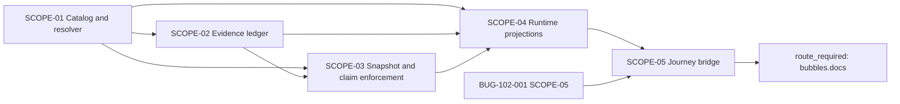

# Scopes: [BUG-004] Production Readiness Claims Drift From Runtime Truth

Links: [spec.md](spec.md) | [design.md](design.md) | [report.md](report.md) | [uservalidation.md](uservalidation.md)

## Execution Outline

### Phase Order

1. **SCOPE-01 - Catalog and resolver foundation:** define stable capability identity, independent facts, freshness/requiredness policy, and the closed claim lattice without changing consumers.
2. **SCOPE-02 - Append-only evidence ledger:** persist validated observations and corrections through real disposable PostgreSQL with zero product-data or production writes.
3. **SCOPE-03 - Snapshot and claim enforcement:** export immutable projections and reject stale, mismatched, unregistered, or overstated managed claims.
4. **SCOPE-04 - Runtime projection consumers:** make APIs, Settings, Status, server navigation, and PWA navigation consume one projection while absent journey proof remains unverified.
5. **SCOPE-05 - Journey bridge and publication handoff:** consume the immutable BUG-102-001 result, prove promotion/demotion, and route publication to `bubbles.docs` without editing managed docs here.

### New Types And Signatures

- `CapabilityCatalog.Load(compiledConfig) (CapabilityCatalog, error)`
- `CapabilityReadinessResolver.Resolve(ResolutionKey, []ReadinessEvidence) (ReadinessProjection, error)`
- `ReadinessEvidenceStore.AppendBatch(context.Context, ReadinessEvidenceEnvelope) (IngestionResult, error)`
- `ReadinessSnapshotExporter.Export(context.Context, ResolutionKey) (ReadinessSnapshot, error)`
- `ReadinessClaimValidator.Validate(snapshot, registeredClaimSurfaces) ([]ClaimViolation, error)`
- `JourneyEvidenceBridge.Ingest(ProductAcceptanceResult) (IngestionResult, error)`
- `GET /api/capability-readiness`
- `GET /v1/admin/capability-readiness`
- `GET /v1/admin/capability-readiness/evidence/{evidence_id}`
- Schemas: `capability-readiness-evidence/v1`, `capability-readiness-snapshot/v1`, and `capability-readiness-projection/v1`

### Validation Checkpoints

- After SCOPE-01, catalog/compiler and resolver canaries prove implementation or certification alone never yields `live_verified` or `available`.
- After SCOPE-02, disposable-PostgreSQL canaries prove atomic append, idempotency, correction-only history, and zero rows for malformed/unsafe batches.
- After SCOPE-03, claim-generation canaries reject expired/mismatched evidence before runtime/UI cutover.
- After SCOPE-04, real-stack API and Playwright canaries prove all product projections agree and no static fallback restores optimism.
- After SCOPE-05, actual BUG-102-001 envelopes promote, contradict, expire, and remain value-safe; only then is publication routed to `bubbles.docs`.

## Dependency DAG



The cross-packet graph is acyclic: BUG-102-001 may consume SCOPE-01/SCOPE-04 catalog and pre-journey status contracts, while this packet consumes BUG-102-001 journey evidence only in SCOPE-05.

| Scope | Primary Outcome | Surfaces | Depends On | Status |
|---|---|---|---|---|
| SCOPE-01 | Canonical catalog and claim resolver | Config and Go domain foundation | None | Not Started |
| SCOPE-02 | Immutable evidence/correction ledger | PostgreSQL and ingestion boundary | SCOPE-01 | Not Started |
| SCOPE-03 | Snapshot export and overclaim prevention | Snapshot schema, registry integration, lint | SCOPE-01, SCOPE-02 | Not Started |
| SCOPE-04 | One runtime projection across consumers | APIs, Settings, Status, server/PWA navigation | SCOPE-01, SCOPE-02, SCOPE-03 | Not Started |
| SCOPE-05 | Actual journey ingestion and docs handoff | BUG-102 bridge, resolver, generated claims | SCOPE-04; BUG-102-001 SCOPE-05 | Not Started |

## Global Invariants

- `implemented`, `configured`, `activated`, `healthy`, `journey_verified`, and `deployed` are independent positive facts; `degraded` and `disabled` are independent overlays.
- Spec completion, certification, source/route presence, provider count, health, fixture success, and deployment alone never imply readiness.
- Evidence is append-only in PostgreSQL. Corrections append and reference the superseded row; application roles cannot update/delete history.
- Operated journey evidence is consumed from BUG-102-001 and is never fabricated, approximated, or replaced here.
- Validation writes use disposable `env=test*` storage. Operate-plane journeys are read-only; ingestion writes only readiness-control metadata after a run.
- Output contains closed states, timings, digests, and safe references only. Secrets, personal/product content, prompts, graph labels, card facts, provider payloads, target identifiers, hosts, operator identities, and paths are forbidden.
- Publication is foreign-owned. This packet may generate and validate blocks plus a handoff manifest; only `bubbles.docs` edits managed documents.

## Scope 01: Capability Catalog And Deterministic Resolver Foundation

**Status:** Not Started  
**Priority:** P0  
**Scope-Kind:** contract-only  
**Foundation:** true  
**Depends On:** None

### Use Cases

```gherkin
Scenario: SCN-032-004-01 Implemented but inactive is not live
	Given immutable implementation evidence exists without configured, activated, deployed, or journey evidence
	When the canonical resolver derives operator and daily-user projections
	Then the claim is Implemented with an explicit runtime gap
	And neither projection reports live verified or available

Scenario: SCN-032-004-05 Disabled optional and broken required remain distinct
	Given an optional capability has affirmative disabled policy evidence
	And a required capability has current denied required evidence
	When readiness derives for the same train and audience
	Then the optional capability is intentionally unavailable
	And the required capability is broken

Scenario: SCN-032-004-06 True empty and fixture-only do not overstate readiness
	Given one journey has a catalog-permitted true-empty operated outcome
	And another capability has fixture-only evidence
	When readiness derives
	Then true-empty proves only bounded empty behavior
	And fixture-only resolves test-covered only rather than live verified
```

### Implementation Plan

1. Add the explicit `capability_readiness` catalog contract with stable IDs, owners, scope, requiredness, freshness, permitted outcomes, action/navigation/claim policy, and BUG-102 mappings.
2. Fail configuration on empty/duplicate IDs, unknown enums, missing duration values, unknown journeys, unregistered claim surfaces, or any implicit default.
3. Define typed catalog, evidence, resolution, dimension, freshness, requiredness, availability, claim, limitation, and action contracts without arbitrary metadata.
4. Implement a pure resolver with injected UTC `as_of`, deterministic ties, corrections, exact release/catalog matching, contradiction, and the ordered lattice.
5. Derive operator, daily-user, docs, navigation, and acceptance projections from the same immutable facts; projections redact but never re-derive.

### Change Boundary And Rollback

- **Allowed:** central capability-readiness config declarations/schema/compiler, new readiness domain package, focused config/domain tests.
- **Excluded:** migrations, APIs, UI/navigation, docs, BUG-102 code, owning repairs, specs 104/105/106, adapters, target details, production evidence.
- **Rollback:** revert additive catalog/domain registration before consumers exist.

### Independent Canary

Construct `implemented=met` plus certified-history metadata while every runtime fact is missing. Both projections must remain non-live; replacing the lattice with `implemented => ready` must fail.

### Test Plan

| Test ID | Scenario | Category | File / Exact Test Title | Command | Live System |
|---|---|---|---|---|---|
| TP-032-01-01 | SCN-032-004-01 | `unit` | `internal/readiness/catalog_test.go` - `TestCapabilityCatalogRejectsIncompleteAndImplicitPolicy` | `./smackerel.sh test unit --go` | No |
| TP-032-01-02 | SCN-032-004-01 | `unit` | `internal/readiness/resolver_test.go` - `TestResolverImplementationAndCertificationNeverImplyRuntimeReadiness` | `./smackerel.sh test unit --go` | No |
| TP-032-01-03 | SCN-032-004-05 | `unit` | `internal/readiness/resolver_test.go` - `TestResolverDistinguishesOptionalDisabledFromRequiredBroken` | `./smackerel.sh test unit --go` | No |
| TP-032-01-04 | SCN-032-004-06 | `unit` | `internal/readiness/resolver_test.go` - `TestResolverBoundsTrueEmptyAndRejectsFixtureOnlyLiveProof` | `./smackerel.sh test unit --go` | No |
| TP-032-01-05 | SCN-032-004-01 | `functional` | `internal/config/capability_readiness_test.go` - `TestCompiledCapabilityReadinessCatalogIsCompleteAndDigestStable` | `./smackerel.sh check` | No |

### Definition of Done

#### Core Outcomes

- [ ] `SCN-032-004-01 Implemented but inactive is not live`: implementation or certification evidence with missing runtime facts resolves to an explicit runtime gap and never `live_verified` or `available`.
- [ ] `SCN-032-004-05 Disabled optional and broken required remain distinct`: affirmative optional disablement resolves intentionally unavailable, while denied required evidence resolves broken.
- [ ] `SCN-032-004-06 True empty and fixture-only do not overstate readiness`: permitted operated empty proves only bounded empty behavior and fixture-only evidence remains test-covered, never live.
- [ ] The catalog identifies every capability, owner, scope, requiredness, evidence/freshness policy, permitted outcome, action, navigation rule, claim surface, and journey mapping without defaults.
- [ ] All eight facts are independent and the resolver alone owns precedence, freshness, contradiction, and claim vocabulary.
- [ ] No projection can strengthen the resolver result; Change Boundary and rollback are respected.

#### Test Evidence Parity

- [ ] TP-032-01-01 passes with current-session evidence in report.md.
- [ ] TP-032-01-02 passes with current-session evidence in report.md.
- [ ] TP-032-01-03 passes with current-session evidence in report.md.
- [ ] TP-032-01-04 passes with current-session evidence in report.md.
- [ ] TP-032-01-05 passes with current-session evidence in report.md.

#### Build Quality Gate

- [ ] Scope-owned check/lint/format, config validation, artifact lint, traceability, source-locking, zero-warning, zero-deferral, and generic-boundary checks pass without publishing claims.

## Scope 02: Append-Only Evidence Ledger And Safe Ingestion

**Status:** Not Started  
**Priority:** P0  
**Scope-Kind:** runtime-behavior  
**Depends On:** SCOPE-01

### Use Case

```gherkin
Scenario: SCN-032-004-08 Evidence remains private and auditable
	Given a producer envelope contains only registered value-safe states
	When the batch is ingested twice and later corrected
	Then the first ingestion appends atomically
	And the identical retry is idempotent
	And the correction appends without rewriting history
	And unsafe sensitive or target content writes zero rows
```

### Implementation Plan

1. Add the append-only PostgreSQL ingestion/evidence/snapshot table families, indexes, constraints, update/delete rejection, and least-privilege grants from design.md.
2. Implement strict envelope/producer/state/scope/reference/digest validation, atomicity, idempotency, and same-result/different-bytes conflict handling.
3. Add a product CLI ingestion surface that accepts artifact paths and expected producer only; content never appears in argv.
4. Emit bounded safe logs/metrics for accepted, duplicate, conflict, unsafe, malformed, and mismatched batches.
5. Use disposable PostgreSQL only; add no public write endpoint, file/cache truth, or product mutation.

### Shared Infrastructure Impact Sweep And Rollback

- Canary append/idempotency, unsafe zero-write, and update/delete rejection before enabling any producer.
- Old binaries must ignore additive tables; rollback disables invocation/runtime registration and retains immutable rows rather than dropping history.
- **Allowed:** next migration, readiness store/ingestion, generic CLI dispatch, safe telemetry, focused tests.
- **Excluded:** business tables, public mutation APIs, journeys, target data, docs/UI/navigation, and other packets.

### Test Plan

| Test ID | Scenario | Category | File / Exact Test Title | Command | Live System |
|---|---|---|---|---|---|
| TP-032-02-01 | SCN-032-004-08 | `unit` | `internal/readiness/evidence_schema_test.go` - `TestEvidenceEnvelopeRejectsUnknownUnsafeAndUnboundedFields` | `./smackerel.sh test unit --go` | No |
| TP-032-02-02 | SCN-032-004-08 | `integration` | `internal/readiness/store_integration_test.go` - `TestEvidenceBatchAppendIsAtomicIdempotentAndDigestBound` | `./smackerel.sh test integration` | Yes - disposable PostgreSQL |
| TP-032-02-03 | SCN-032-004-08 | `integration` | `internal/readiness/store_integration_test.go` - `TestEvidenceCorrectionsAppendAndHistoryRejectsUpdateDelete` | `./smackerel.sh test integration` | Yes - disposable PostgreSQL |
| TP-032-02-04 | SCN-032-004-08 | `e2e-api` | `tests/e2e/capability_readiness_evidence_test.go` - `TestReadinessIngestionCLIAppendsOneCompleteValueSafeBatch` | `./smackerel.sh test e2e` | Yes - disposable stack |
| TP-032-02-05 | SCN-032-004-08 | `e2e-api` | `tests/e2e/capability_readiness_evidence_test.go` - `TestReadinessIngestionCLIRejectsUnsafeBatchWithZeroRows` | `./smackerel.sh test e2e` | Yes - disposable stack |
| TP-032-02-06 | SCN-032-004-08 | `e2e-api` | `tests/e2e/capability_readiness_evidence_test.go` - `TestReadinessIngestionCLIPreservesCorrectionHistoryAcrossRestart` | `./smackerel.sh test e2e` | Yes - disposable stack |

### Definition of Done

#### Core Outcomes

- [ ] `SCN-032-004-08 Evidence remains private and auditable`: valid batches append atomically/idempotently, corrections preserve history, and unsafe sensitive or target content writes zero rows.
- [ ] PostgreSQL is the only evidence truth; all history is append-only or correction-based.
- [ ] Whole-batch validation makes malformed, unsafe, partial, mismatched, and conflicting input write zero rows.
- [ ] CLI, logs, metrics, traces, and rows are value-safe/target-generic; shared canaries and retention-preserving rollback are proven.

#### Test Evidence Parity

- [ ] TP-032-02-01 passes with current-session evidence in report.md.
- [ ] TP-032-02-02 passes with current-session evidence in report.md.
- [ ] TP-032-02-03 passes with current-session evidence in report.md.
- [ ] TP-032-02-04 passes with current-session evidence in report.md.
- [ ] TP-032-02-05 passes with current-session evidence in report.md.
- [ ] TP-032-02-06 passes with current-session evidence in report.md.

#### Build Quality Gate

- [ ] Scope-owned migration/store/CLI build, unit/integration/E2E, lint/format, artifact lint, traceability, environment isolation, source locking, zero-warning, and zero-deferral checks pass.

## Scope 03: Immutable Snapshots And Managed-Claim Enforcement

**Status:** Not Started  
**Priority:** P0  
**Scope-Kind:** contract-only  
**Depends On:** SCOPE-01, SCOPE-02

### Use Cases

```gherkin
Scenario: SCN-032-004-04 Stale evidence cannot remain current
	Given live-verification evidence reaches its configured expiry boundary
	When snapshot and claim generation run at that as-of time
	Then the dimension is stale and the claim is not live verified
	And required verification ownership is identified

Scenario: SCN-032-004-07 Claim lint rejects overstatement
	Given a registered heading claims delivered, live, or ready above its snapshot state
	When claim validation runs
	Then it fails with capability, location, observed/permitted claim, evidence state, required proof, and owner route
```

### Implementation Plan

1. Export immutable snapshot/dimension/claim rows from one explicit resolution key with content digest and validity interval.
2. Render exact Markdown blocks using the closed vocabulary, scope/date/freshness/limitation/action/correction contract.
3. Extend the managed-doc registry with claim-surface metadata only; edit no managed document.
4. Validate exact regeneration, stale/release/audience/catalog mismatch, and reserved claims under registered headings; report all findings.
5. Wire structural checks into product lint; runtime-claim publication requires an explicit current snapshot.

### Consumer Impact Sweep And Rollback

- Inventory README, Investor Overview, release packets, status/capability docs, API/Architecture/Development/Testing/Deployment/Operations headings, and release validation for a docs-owner handoff.
- Rollback disables snapshot/claim wiring before publication and leaves immutable data untouched.
- **Excluded:** claim prose/publication, runtime UI/API consumers, BUG-102, specs 104/105/106, and adapters.

### Test Plan

| Test ID | Scenario | Category | File / Exact Test Title | Command | Live System |
|---|---|---|---|---|---|
| TP-032-03-01 | SCN-032-004-04 | `unit` | `internal/readiness/snapshot_test.go` - `TestSnapshotMarksEvidenceStaleAtExactExpiryBoundary` | `./smackerel.sh test unit --go` | No |
| TP-032-03-02 | SCN-032-004-04 | `integration` | `internal/readiness/snapshot_integration_test.go` - `TestSnapshotDigestRowsAndValidityMatchResolverOutput` | `./smackerel.sh test integration` | Yes - disposable PostgreSQL |
| TP-032-03-03 | SCN-032-004-07 | `functional` | `internal/docfreshness/readiness_claims_test.go` - `TestReadinessClaimValidatorReportsEveryOverclaimField` | `./smackerel.sh lint` | No |
| TP-032-03-04 | SCN-032-004-07 | `functional` | `internal/docfreshness/readiness_claims_test.go` - `TestReadinessClaimValidatorRejectsImplementedAsProductionReady` | `./smackerel.sh lint` | No |
| TP-032-03-05 | SCN-032-004-04 | `functional` | `internal/docfreshness/readiness_claims_test.go` - `TestReadinessPublicationRejectsStaleOrMismatchedSnapshot` | `./smackerel.sh lint` | No |

### Definition of Done

#### Core Outcomes

- [ ] `SCN-032-004-04 Stale evidence cannot remain current`: equality at the configured expiry boundary marks evidence stale and blocks a current live claim while naming required verification ownership.
- [ ] `SCN-032-004-07 Claim lint rejects overstatement`: every managed claim above snapshot truth fails with capability, location, observed/permitted claim, evidence state, proof, and owner route.
- [ ] Snapshots are immutable, digest-bound, complete, and invalid after expiry or scope mismatch.
- [ ] One generator owns vocabulary and one validator rejects all overclaims with complete value-safe diagnostics.
- [ ] Exact claim headings are routed to `bubbles.docs`; no managed prose is edited here.

#### Test Evidence Parity

- [ ] TP-032-03-01 passes with current-session evidence in report.md.
- [ ] TP-032-03-02 passes with current-session evidence in report.md.
- [ ] TP-032-03-03 passes with current-session evidence in report.md.
- [ ] TP-032-03-04 passes with current-session evidence in report.md.
- [ ] TP-032-03-05 passes with current-session evidence in report.md.

#### Build Quality Gate

- [ ] Scope-owned snapshot/generator/lint build, unit/integration/functional, lint/format, registry consistency, artifact lint, traceability, zero-warning, and zero-deferral checks pass without publication.

## Scope 04: Runtime Readiness Projections And Product Consumers

**Status:** Not Started  
**Priority:** P0  
**Scope-Kind:** runtime-behavior  
**Depends On:** SCOPE-01, SCOPE-02, SCOPE-03

### Use Case

```gherkin
Scenario: SCN-032-004-09 Readiness status is accessible and responsive
	Given capabilities resolve across every closed state
	When an authorized user opens readiness, Settings, Status, and navigation on desktop or narrow mobile
	Then each state exposes meaning, scope, evidence age, limitation, and permitted action
	And meaning is not color, position, icon, or hover dependent
	And resolver failure creates no optimistic fallback link or claim
```

### Implementation Plan

1. Add authenticated daily-user/operator readiness APIs and safe evidence detail with strict authorization/redaction.
2. Inject one projection into Settings and Status; retain domain diagnostics only beneath the canonical primary state.
3. Build one navigation projection for server and PWA, removing independent readiness arrays in the same cutover while preserving typed deep-link unavailable/auth behavior.
4. Render fixed semantic label/value order at desktop, mobile, 320px/200% zoom, keyboard, screen reader, forced colors, themes, and reduced motion.
5. Fail closed on catalog/store/resolver errors: typed API/page state and no capability-ready navigation.

### Consumer Impact Sweep, Boundary, And Rollback

- Sweep Settings, Status, APIs, server/PWA nav, deep links, breadcrumbs, spec-106 composition, BUG-102 capability-status, tests, and snapshot generation.
- Remove first-party inference from flags/env/route presence/static arrays/provider counts/general health/spec status/fixtures.
- **Excluded:** journey execution, docs publication, spec-106 redesign, owning repairs, adapters, mutations.
- Rollback restores the prior binary but marks claims unavailable/stale; it must not restore old optimistic labels as current. Evidence remains.

### UI Scenario Matrix

| Scenario | Preconditions | Steps | Required Assertion | Exact Playwright Title |
|---|---|---|---|---|
| Operator detail | Operator; mixed states | Open Settings/Status and expand | One real API per view; all facts/date/limitation/action/requiredness/correction labeled | `operator readiness exposes all facts without reinterpretation` |
| Daily-user projection | Daily-user | Open shell/status | Safe discoverable capabilities only; no operator evidence IDs | `daily user sees bounded availability and no operator evidence` |
| Resolver unavailable | Disposable fault | Open Settings/Status/nav | Typed unavailable; no static ready fallback | `resolver failure never restores optimistic navigation` |
| Accessibility modes | Mixed states; required viewports/modes | Traverse records/actions | No clipping/overflow; semantic source order and accessible names | `readiness records remain semantic and operable in every required mode` |

### Test Plan

| Test ID | Scenario | Category | File / Exact Test Title | Command | Live System |
|---|---|---|---|---|---|
| TP-032-04-01 | SCN-032-004-09 | `unit` | `internal/api/capability_readiness_test.go` - `TestCapabilityReadinessProjectionAuthorizationAndRedaction` | `./smackerel.sh test unit --go` | No |
| TP-032-04-02 | SCN-032-004-09 | `integration` | `internal/web/capability_readiness_consumer_integration_test.go` - `TestSettingsStatusAndNavigationShareOneProjection` | `./smackerel.sh test integration` | Yes - disposable stack |
| TP-032-04-03 | SCN-032-004-09 | `e2e-api` | `tests/e2e/capability_readiness_api_test.go` - `TestDailyUserAndOperatorReadinessAPIsExposeOneDerivedState` | `./smackerel.sh test e2e` | Yes - real disposable stack |
| TP-032-04-04 | SCN-032-004-09 | `e2e-api` | `tests/e2e/capability_readiness_api_test.go` - `TestReadinessStoreFailureReturnsTypedUnavailableWithoutOptimisticFallback` | `./smackerel.sh test e2e` | Yes - real disposable stack |
| TP-032-04-05 | SCN-032-004-09 | `e2e-ui` | `web/pwa/tests/capability_readiness.spec.ts` - `operator readiness exposes all facts without reinterpretation` | `./smackerel.sh test e2e-ui` | Yes - real browser, no interception |
| TP-032-04-06 | SCN-032-004-09 | `e2e-ui` | `web/pwa/tests/capability_readiness.spec.ts` - `daily user sees bounded availability and no operator evidence` | `./smackerel.sh test e2e-ui` | Yes - real browser, no interception |
| TP-032-04-07 | SCN-032-004-09 | `e2e-ui` | `web/pwa/tests/capability_readiness.spec.ts` - `resolver failure never restores optimistic navigation` | `./smackerel.sh test e2e-ui` | Yes - real browser, no interception |
| TP-032-04-08 | SCN-032-004-09 | `e2e-ui` | `web/pwa/tests/capability_readiness.spec.ts` - `readiness records remain semantic and operable in every required mode` | `./smackerel.sh test e2e-ui` | Yes - real browser, no interception |

### Definition of Done

#### Core Outcomes

- [ ] `SCN-032-004-09 Readiness status is accessible and responsive`: state, audience/train, evidence age, limitation, and action remain semantic and operable across required viewports/modes, with no optimistic fallback on resolver failure.
- [ ] APIs, Settings, Status, and server/PWA navigation consume one projection and cannot strengthen it.
- [ ] Ad hoc authorities are removed in the cutover; deep links retain typed unavailable/auth behavior.
- [ ] Authorization, redaction, responsive/accessibility modes, failure states, consumer sweep, boundary, canary, and rollback are complete.
- [ ] Missing journey evidence stays not live verified; no BUG-102 result is fabricated.

#### Test Evidence Parity

- [ ] TP-032-04-01 passes with current-session evidence in report.md.
- [ ] TP-032-04-02 passes with current-session evidence in report.md.
- [ ] TP-032-04-03 passes with current-session evidence in report.md.
- [ ] TP-032-04-04 passes with current-session evidence in report.md.
- [ ] TP-032-04-05 passes with current-session evidence in report.md.
- [ ] TP-032-04-06 passes with current-session evidence in report.md.
- [ ] TP-032-04-07 passes with current-session evidence in report.md.
- [ ] TP-032-04-08 passes with current-session evidence in report.md.

#### Build Quality Gate

- [ ] Scope-owned build, unit/integration/E2E API/E2E UI, lint/format, browser console/privacy/no-interception scans, accessibility, artifact lint, traceability, environment isolation, zero-warning, and zero-deferral checks pass.

## Scope 05: Actual Journey Evidence Bridge And Docs Publication Handoff

**Status:** Not Started  
**Priority:** P0  
**Scope-Kind:** runtime-behavior  
**Depends On:** SCOPE-04; `specs/102-target-deploy-hardening/bugs/BUG-102-001-product-journey-acceptance-gap` SCOPE-05

### Use Cases

```gherkin
Scenario: SCN-032-004-02 Current live journey promotes readiness
	Given all non-journey facts are current for one exact scope
	And a current BUG-102-001 result passes every required mapped journey
	When the bridge ingests that immutable result
	Then only mapped journey_verified facts are affirmed
	And readiness requires every other fact independently

Scenario: SCN-032-004-03 Runtime contradiction invalidates optimistic claim
	Given a capability was live verified
	And a newer matching result reports a denied required outcome
	When the bridge ingests and resolves it
	Then the prior pass remains historical
	And the current claim demotes according to explicit policy

Scenario: SCN-032-004-10 Acceptance evidence has one producer
	Given BUG-102-001 has published an immutable versioned journey result
	When this readiness packet ingests that result and spec 106 consumes the derived snapshot
	Then this packet derives the claim snapshot without executing or duplicating the journey
	And it never becomes a producer dependency of BUG-102-001 and no producer loop exists

Scenario: SCN-032-004-11 Blocked spec status is not promoted by completed scopes
	Given spec 104 is top-level blocked on disk and its Scope 8 is individually completed
	When readiness evaluates the Assistant evidence
	Then the ledger records spec 104 as blocked
	And it may cite completed Scope 8 evidence only for the bounded journey it proves
	And it does not claim spec 104 is done or fully ready
```

### Implementation Plan

1. Validate exact BUG-102 schema/signature/digests, production-readonly eligibility, release/train/manifest/policy identity, completeness, freshness, safety, and required rows before atomic ingestion.
2. Map journey IDs through the catalog only; never rerun/reinterpret dependency-owned assertions.
3. Reject omitted/duplicate/unknown/unsafe/mismatched rows and target/personal/content fields with zero writes.
4. Prove newer denials, stale results, corrections, fixture results, and prior releases demote or remain ineligible without erasing history.
5. Generate a snapshot and docs handoff manifest with registered document/heading, block digest, permitted claim, freshness, and owner route.
6. Return `route_required` to `bubbles.docs`; do not edit README, Investor Overview, release packets, or managed docs here.

### Shared Impact, Boundary, And Rollback

- Canary unsupported schema, missing journey, release mismatch, unsafe evidence, accepted result, and newer denial before enabling the high-fan-out bridge.
- **Allowed:** BUG-102 evidence adapter, catalog mapping, ingestion/resolve integration, handoff manifest, focused tests, safe telemetry.
- **Excluded:** BUG-102 runner/requirements, owning repairs, managed docs, adapters/knb, targets, production execution/data, specs 104/105/106.
- Rollback disables bridge ingestion and marks claims unavailable/stale while preserving all evidence/snapshots.

### Test Plan

| Test ID | Scenario | Category | File / Exact Test Title | Command | Live System |
|---|---|---|---|---|---|
| TP-032-05-01 | SCN-032-004-02 | `unit` | `internal/readiness/journey_bridge_test.go` - `TestJourneyBridgeMapsOnlyCatalogRegisteredAcceptanceRows` | `./smackerel.sh test unit --go` | No |
| TP-032-05-02 | SCN-032-004-03 | `unit` | `internal/readiness/journey_bridge_test.go` - `TestJourneyBridgeRejectsMissingUnsafeAndReleaseMismatchedResults` | `./smackerel.sh test unit --go` | No |
| TP-032-05-03 | SCN-032-004-02 | `integration` | `internal/readiness/journey_bridge_integration_test.go` - `TestAcceptedProductResultPromotesOnlyMappedJourneyFacts` | `./smackerel.sh test integration` | Yes - disposable PostgreSQL |
| TP-032-05-04 | SCN-032-004-03 | `integration` | `internal/readiness/journey_bridge_integration_test.go` - `TestNewerDeniedJourneyDemotesClaimWithoutErasingPass` | `./smackerel.sh test integration` | Yes - disposable PostgreSQL |
| TP-032-05-05 | SCN-032-004-02 | `e2e-api` | `tests/e2e/capability_readiness_journey_evidence_test.go` - `TestCurrentAcceptedJourneyResultCompletesReadinessProjection` | `./smackerel.sh test e2e` | Yes - real disposable stack |
| TP-032-05-06 | SCN-032-004-03 | `e2e-api` | `tests/e2e/capability_readiness_journey_evidence_test.go` - `TestHealthGreenButBrokenJourneyInvalidatesLiveClaim` | `./smackerel.sh test e2e` | Yes - real disposable stack |
| TP-032-05-07 | SCN-032-004-03 | `e2e-api` | `tests/e2e/capability_readiness_journey_evidence_test.go` - `TestStalePriorReleaseAndFixtureResultsCannotProveCurrentReadiness` | `./smackerel.sh test e2e` | Yes - real disposable stack |
| TP-032-05-08 | SCN-032-004-02, SCN-032-004-03 | `functional` | `internal/docfreshness/readiness_publication_handoff_test.go` - `TestPublicationHandoffContainsOnlyCurrentGeneratedClaimsAndDocsOwnerRoutes` | `./smackerel.sh lint` | No |
| TP-032-05-09 | SCN-032-004-10 | `integration` | `internal/readiness/journey_bridge_integration_test.go` - `TestReadinessConsumesBUG102EvidenceWithoutBecomingProducerOrLooping` | `./smackerel.sh test integration` | Yes - disposable PostgreSQL |
| TP-032-05-10 | SCN-032-004-11 | `integration` | `internal/readiness/dependency_status_test.go` - `TestBlockedSpec104RecordsBlockedWhileCitingOnlyCompletedScope8Evidence` | `./smackerel.sh test integration` | Yes - disposable PostgreSQL |

### Definition of Done

#### Core Outcomes

- [ ] `SCN-032-004-02 Current live journey promotes readiness`: a current exact-scope BUG-102 result affirms only mapped journey facts, and a live claim still requires every other independent fact.
- [ ] `SCN-032-004-03 Runtime contradiction invalidates optimistic claim`: a newer denied journey demotes the current claim under policy without erasing the prior pass.
- [ ] `SCN-032-004-10 Acceptance evidence has one producer`: BUG-102-001 produces immutable acceptance evidence, this packet derives the readiness snapshot without re-executing the journey, spec 106 renders it, and no producer loop or producer dependency on this packet exists.
- [ ] `SCN-032-004-11 Blocked spec status is not promoted by completed scopes`: spec 104 is recorded as blocked from disk, only completed Scope 8 Assistant evidence is cited for its bounded journey, and spec 104 is never claimed done or fully ready.
- [ ] Only a current, complete, production-readonly, exact-scope, value-safe BUG-102 result can affirm mapped journey facts.
- [ ] Journey evidence is consumed but never fabricated, rerun, softened, or used to infer another fact.
- [ ] Contradiction, expiry, mismatch, fixture-only evidence, and correction demote exactly while retaining history.
- [ ] Generated output/handoff are current, digest-bound, complete, and routed to `bubbles.docs`; no managed doc is edited here.
- [ ] Producer canaries, boundary, value-safe output, zero production writes, and retention-preserving rollback are proven.

#### Test Evidence Parity

- [ ] TP-032-05-01 passes with current-session evidence in report.md.
- [ ] TP-032-05-02 passes with current-session evidence in report.md.
- [ ] TP-032-05-03 passes with current-session evidence in report.md.
- [ ] TP-032-05-04 passes with current-session evidence in report.md.
- [ ] TP-032-05-05 passes with current-session evidence in report.md.
- [ ] TP-032-05-06 passes with current-session evidence in report.md.
- [ ] TP-032-05-07 passes with current-session evidence in report.md.
- [ ] TP-032-05-08 passes with current-session evidence in report.md.
- [ ] TP-032-05-09 passes with current-session evidence in report.md.
- [ ] TP-032-05-10 passes with current-session evidence in report.md.

#### Build Quality Gate

- [ ] Scope-owned bridge/projection/handoff build, unit/integration/E2E API/functional, lint/format, privacy/target-generic scans, artifact lint, traceability, isolation, zero-warning, and zero-deferral checks pass with actual result/handoff evidence.

## Routed Follow-Up (Not An Executable Scope)

After SCOPE-05 passes, return `route_required` to `bubbles.docs` with the generated publication manifest. The docs owner reconciles each registered claim-bearing heading and validates publication against the exact current snapshot. Publication is not complete or implied by this packet.

Implementation, tests, validation, docs publication, adapters, and repairs route through `bubbles.workflow`; this plan authorizes no edits to requirements/design/source/tests, other packets, spec 079, knb, or CCManager.
