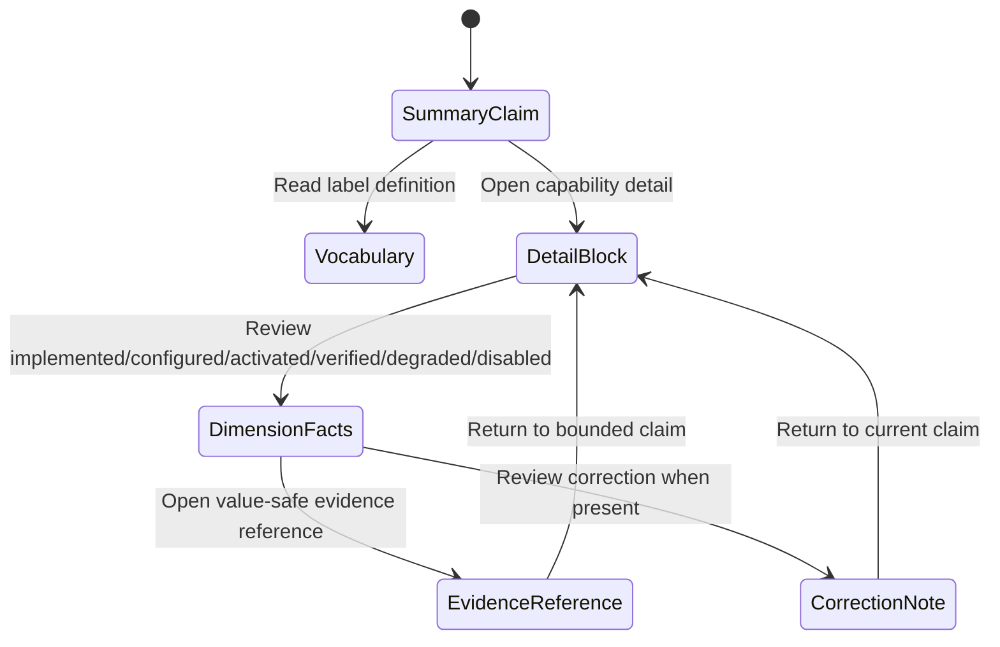
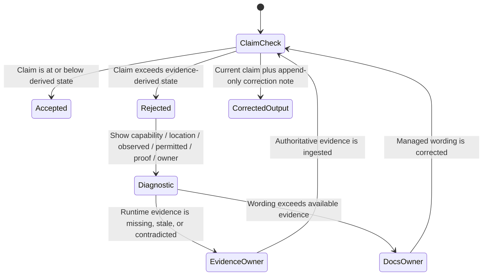

# Expected Behavior: [BUG-004] Evidence-Derived Capability Readiness

## Problem Statement

Implementation completion, deployment configuration, runtime activation, and live user verification are different facts. A single delivered/ready label hides those differences and produces stale optimistic documentation.

## Outcome Contract

**Intent:** Derive every public/operator readiness claim from a canonical multi-dimensional capability ledger with current evidence.

**Success Signal:** Managed docs/release/status checks fail when a claim exceeds the ledger-derived state; live journey evidence promotes a capability; contradictory or expired evidence demotes/invalidate live status without erasing implementation history.

**Hard Constraints:** Append-only evidence provenance, no fabricated runtime claim, no secret/personal data, no rewrite of certified historical artifacts, explicit audience/policy, and no production writes for validation.

**Failure Condition:** Code/spec completion can still become live-ready automatically, fixture/empty/disabled state appears delivered, or stale evidence is accepted without invalidation.

## Capability State Dimensions

| Dimension | Question | Required Evidence |
|---|---|---|
| Implemented | Does production code/contract exist? | Source/build/test provenance, not runtime readiness |
| Configured | Are all required explicit values/providers/secrets present? | Value-safe config validation result |
| Activated | Is the capability mounted/enabled in this release? | Runtime capability/route registry evidence |
| Live Verified | Did the required authenticated product journey pass recently? | Versioned product-journey evidence from BUG-102-001 or equivalent owner-approved contract |
| Degraded | Is useful verified behavior available with declared limitations? | Typed dependency/provider/partial result plus visible limitation |
| Disabled | Is the capability intentionally unavailable by policy/release? | Explicit compiled policy and support statement |

Dimensions are independent facts; derived audience labels must use a closed rule set.

## Requirements

- **READY-001:** One canonical ledger SHALL identify each capability, owning spec, release train, audience, requiredness, and all six dimensions.
- **READY-002:** Each dimension SHALL include status, evidence source, observed timestamp, freshness/expiry policy, and invalidation reason.
- **READY-003:** Implemented or certified alone SHALL NOT imply configured, activated, live verified, or ready.
- **READY-004:** Fixture-only, true-empty, optional-unconfigured, disabled, degraded, broken, and unverified SHALL remain distinct.
- **READY-005:** Live verification SHALL require current authenticated product behavior evidence and SHALL be invalidated by contradictory newer evidence.
- **READY-006:** Evidence SHALL be append-only or correction-based; historical implementation/certification truth SHALL not be rewritten.
- **READY-007:** Managed docs, release notes, capability status UI, and rollups SHALL derive labels from the ledger through one rule set.
- **READY-008:** A mechanical check SHALL fail claims that exceed the derived state or cite missing/stale evidence.
- **READY-009:** Disabled/optional capability SHALL not be called broken when policy permits it, and required broken capability SHALL not be softened to optional.
- **READY-010:** Evidence and rendered status SHALL exclude secrets, tokens, personal content, and target-specific details.
- **READY-011:** Status presentation SHALL expose meaning, evidence freshness, limitation, and permitted action accessibly on desktop/mobile.
- **READY-012:** The ledger SHALL consume but not fabricate journey evidence; absent evidence yields unverified.
- **READY-013:** BUG-102-001 SHALL be the acceptance-evidence producer. This readiness packet SHALL consume immutable, versioned BUG-102 results and derive claims; it SHALL NOT execute or duplicate product journeys. Spec 106 MAY render the resulting claim projection but SHALL be neither a journey-evidence producer nor a producer dependency of BUG-102.
- **READY-014:** Dependency status SHALL be read exactly from disk. For spec 104, the ledger SHALL record top-level `blocked` while consuming only individually completed scope evidence, including completed Scope 8 evidence where relevant. It SHALL NOT label spec 104 `done` or promote incomplete/top-level-blocked evidence into full-spec readiness.

## Evidence Production And Consumption Ownership

| Surface | Role | Allowed Input/Output | Forbidden Behavior |
|---|---|---|---|
| `BUG-102-001` | Acceptance producer | Executes owner-defined read-only journeys and publishes immutable versioned evidence | Depending on BUG-032 or spec 106 to produce/approve its evidence |
| `BUG-032-004` | Readiness and claims consumer | Ingests immutable BUG-102 evidence, applies freshness/claim rules, publishes a derived readiness snapshot | Re-running product journeys, fabricating missing evidence, or becoming a prerequisite for BUG-102 production |
| `spec 106` | Presentation/composition consumer | Renders product journeys and the BUG-032 readiness projection after evidence exists | Producing BUG-102 evidence, certifying readiness, or creating a dependency loop |

Final presentation ordering is producer-first: BUG-102 publishes immutable acceptance evidence, BUG-032 derives the current claim snapshot, then spec 106 renders/composes that snapshot. Planning may encode this ordering, but no behavioral requirement may reverse it.

## User Scenarios

```gherkin
Scenario: SCN-032-004-01 Implemented but inactive is not live
  Given a capability has completed code/spec evidence but is not configured or activated
  When docs and status derive its claim
  Then it is labeled implemented but inactive/unverified rather than live ready

Scenario: SCN-032-004-02 Current live journey promotes readiness
  Given configured and activated capability passes its authenticated product journey within freshness policy
  When the ledger ingests the evidence
  Then live-verified becomes current and managed claims may report ready

Scenario: SCN-032-004-03 Runtime contradiction invalidates optimistic claim
  Given a capability was live verified but a newer required journey returns 404, auth failure, false empty, blank, or another typed defect
  When evidence is reconciled
  Then live verification is invalidated and claims become degraded/broken/unverified as policy requires

Scenario: SCN-032-004-04 Stale evidence cannot remain current
  Given live evidence exceeds its freshness policy
  When docs/status are generated
  Then live-verified is stale/unverified and the claim identifies the needed verification

Scenario: SCN-032-004-05 Disabled optional and broken required remain distinct
  Given one capability is explicitly disabled/optional and another required capability fails
  When readiness derives
  Then the first is intentionally unavailable and the second is broken

Scenario: SCN-032-004-06 True empty and fixture-only do not overstate readiness
  Given a read succeeds with true empty or only fixture evidence exists
  When the ledger evaluates proof
  Then empty is recorded as behavior and fixture-only cannot establish production live verification

Scenario: SCN-032-004-07 Claim lint rejects overstatement
  Given managed text says delivered/live/ready beyond the ledger state
  When the mechanical freshness check runs
  Then it fails with capability, observed claim, allowed claim, and evidence requirement

Scenario: SCN-032-004-08 Evidence remains private and auditable
  Given runtime/config evidence contains sensitive details
  When it is recorded and rendered
  Then only value-safe references/outcomes are stored and corrections append rather than rewrite history

Scenario: SCN-032-004-09 Readiness status is accessible and responsive
  Given a keyboard or screen-reader user on a narrow viewport
  When capability dimensions, evidence age, limitation, and action render
  Then they are perceivable, operable, and not encoded by color alone or clipped

Scenario: SCN-032-004-10 Acceptance evidence has one producer
  Given BUG-102 has published an immutable compatible journey result
  When readiness and coherent presentation consume it
  Then BUG-032 derives the claim snapshot and spec 106 renders it
  And neither consumer re-executes the journey or becomes a producer dependency of BUG-102

Scenario: SCN-032-004-11 Blocked spec status is not promoted by completed scopes
  Given spec 104 is top-level blocked and Scope 8 is individually completed on disk
  When readiness evaluates Assistant evidence
  Then the ledger records spec 104 as blocked
  And may cite completed Scope 8 evidence only for the bounded journey it proves
  And does not claim spec 104 is done or fully ready
```

## Derived Claim Examples

| Facts | Permitted Claim | Forbidden Claim |
|---|---|---|
| implemented only | implemented; not configured/verified | production ready |
| implemented + configured, not activated | configured; inactive | live |
| activated + current journey pass | live verified/ready for declared audience | universally ready beyond tested audience |
| activated + partial provider failure | degraded with named limitation | fully healthy |
| explicitly disabled | intentionally unavailable | broken or ready |
| fixture evidence only | test-covered; production unverified | live verified |

## Acceptance Criteria

1. All six dimensions are explicit, evidence-linked, freshness-aware, and independently updateable.
2. Adversarial code-done/runtime-404 input fails any live-ready claim.
3. Managed docs/release/status use one derivation contract and mechanical overclaim check.
4. Contradictory/stale evidence invalidates current claims without erasing history.
5. Security/privacy and responsive accessibility requirements hold.
6. BUG-102 is the sole journey-evidence producer, BUG-032 is the readiness consumer, and spec 106 is a presentation consumer; no producer loop exists.
7. Spec 104 is represented as top-level blocked and only completed-scope evidence is consumed for bounded claims.

## Dependencies

- Parent freshness capability: `specs/032-documentation-freshness`.
- Runtime evidence producer: `BUG-102-001-product-journey-acceptance-gap`; this packet consumes its immutable output and is never a producer dependency.
- Presentation consumer: `specs/106-coherent-product-experience`, after BUG-102 evidence and this packet's derived readiness snapshot exist.
- Status-accuracy input: `specs/104-universal-ask-self-knowledge` is top-level blocked on disk; only completed scope evidence may be consumed.
- Current finding set: all product bug packets created in this planning run.

## Release Train

- Target train: `mvp`.
- Flags introduced: none.
- Ledger rows are train-aware; a capability may have different explicit activation/live states per train without hidden defaults.

## UI Wireframes

### Documentation UX Requirements

| ID | Human-Readable Contract |
|---|---|
| UX-032-004-01 | Every managed readiness claim names the capability, release train, audience, primary claim, evidence observation date, evidence freshness, limitation, and next permitted action. |
| UX-032-004-02 | A primary claim uses exactly one label from the closed vocabulary below; prose may explain it but may not replace it with optimistic synonyms. |
| UX-032-004-03 | `Implemented` describes code/contract existence only. It is always qualified with configuration, activation, and verification facts when the surrounding document discusses runtime availability. |
| UX-032-004-04 | `Live verified` is audience- and train-scoped and includes a current observation date. It never means universally available outside the tested audience or environment class. |
| UX-032-004-05 | Missing, stale, fixture-only, contradicted, corrected, intentionally unavailable, true-empty, degraded, and broken evidence are presented as different facts. |
| UX-032-004-06 | Managed documents never expose secrets, target identifiers, personal content, raw request/response bodies, or source titles from runtime evidence. |
| UX-032-004-07 | Readiness tables remain understandable when flattened to plain text, read by a screen reader, printed, or viewed at 320px; meaning is not carried by emoji, color, icon, or column position alone. |
| UX-032-004-08 | Claim-lint diagnostics tell an author the capability, document location, observed phrase, highest permitted claim, evidence gap, and owning correction route without rewriting certified history. |

### Documentation Surface Inventory

| Surface | Reader | Status | Existing Drift Addressed |
|---|---|---|---|
| Capability summary table in managed docs | Prospective user, operator, reviewer | Existing - Reconcile | Bare `Implemented` rows such as the connector inventory in `README.md` lack activation/live-verification context. |
| Capability readiness detail block | Operator, reviewer | New presentation contract | Delivered/live claims such as phase summaries in `docs/INVESTOR_OVERVIEW.md` need audience, train, date, freshness, and limitation. |
| Claim-lint diagnostic envelope | Documentation author | New presentation contract | Overclaim failures need a corrective explanation rather than a generic lint rejection. |

### Documentation Primitives

| Primitive | Used By | Composition Rule | Accessibility / Narrow-View Rule |
|---|---|---|---|
| Primary claim label | Summary table; detail block; release claim | Exactly one closed-vocabulary label; never emoji-only. | Label remains literal text when styles/icons are removed. |
| Evidence-age line | Summary table; detail block | `Observed [date] · [Current / Stale / Missing / Contradicted]`; relative age may supplement but not replace date. | Semantic date in rendered HTML; wraps as one labeled phrase. |
| Audience/train scope | Every live/degraded/broken claim | Always adjacent to the primary label. | Read before evidence age in source order. |
| Limitation and action | Detail block; degraded/broken summary | Names what is unavailable and the owner-permitted next action; never a vague `partial`. | Plain sentence; links have unique names. |
| Dimension facts | Detail block | Fixed order: Implemented, Configured, Activated, Live verified, Degraded, Disabled. | Render as labeled list below table breakpoint, not a clipped six-column grid. |
| Correction note | Detail block; historical claim | Appends `Corrected [date]` plus superseded claim reference and reason; does not erase history. | Exposed as a note/aside with heading. |
| Overclaim diagnostic | Author check output | Fixed field order defined below; one diagnostic per claim. | Plain text remains meaningful without ANSI color. |

### Human-Readable Readiness Vocabulary

| Primary Label | Exact Meaning | Required Supporting Phrase | Forbidden Substitutes |
|---|---|---|---|
| `Implemented` | Production code/contract exists; runtime availability is not established by this label. | `Runtime: [Needs configuration / Inactive / Not live verified / see current state]` | `Ready`, `live`, `available`, `delivered` when no runtime proof exists. |
| `Needs configuration` | Supported capability lacks one or more explicit required values/providers for the declared audience/train. | Value-safe missing category and authorized setup route. | `Broken`, `down`, `coming soon`, or a secret/config value. |
| `Inactive` | Implemented/configured capability is not mounted or enabled for the declared train/audience. | Activation policy and owner, without target details. | `Live`, `enabled`, `ready`. |
| `Not live verified` | Capability may be implemented/configured/active, but no current authenticated journey evidence exists. | Needed journey ID/category and evidence freshness policy. | `Ready`, `works`, `production ready`. |
| `Live verified` | Required authenticated journey passed within freshness policy for the named audience/train. | Audience, train, observed date, freshness, journey evidence reference. | `Universally ready`, `always available`, or audience-free `production ready`. |
| `Degraded` | Current evidence proves useful behavior remains with a named limitation. | Working behavior, unavailable behavior/dependency, observed date, permitted action. | `Healthy`, `fully available`, bare `partial`. |
| `Intentionally unavailable` | Explicit policy disables or excludes the capability for this audience/train. | Policy/requiredness and supported alternative, if one exists. | `Broken`, `failed`, `ready`. |
| `Broken` | A required current journey failed or contradictory evidence invalidated the prior live claim. | Failed journey category, observed date, impact, owning remediation route. | `Optional`, `degraded` when no useful required behavior remains, or `unverified` when failure is proven. |
| `Test-covered only` | Evidence comes from fixtures or non-production execution and cannot establish a live claim. | Test category and explicit `Production behavior not verified`. | `Live verified`, `production ready`. |

`True empty` is an outcome qualifier, not a readiness label: it means a successfully verified journey returned a legitimate empty dataset. It may support `Live verified` for that empty-state behavior, but it never proves populated-data behavior. `Evidence stale`, `Evidence missing`, `Evidence contradicted`, and `Correction recorded` are evidence qualifiers, not capability labels.

### Document: Capability Summary Table

**Reader:** User, operator, reviewer | **Location:** Managed README/release/feature/status documents | **Status:** Reconcile

```text
┌────────────────────────────────────────────────────────────────────────────┐
│ Capability readiness · Train: [mvp] · Audience: [self-hosted operator]   │
│ Vocabulary: [Read what each status means]                                 │
├──────────────────────┬──────────────────────┬─────────────────────────────┤
│ Capability           │ Primary claim        │ Evidence / limitation       │
├──────────────────────┼──────────────────────┼─────────────────────────────┤
│ [Assistant]          │ [Live verified]      │ Observed [date] · Current   │
│                      │                      │ [audience] · [journey link] │
├──────────────────────┼──────────────────────┼─────────────────────────────┤
│ [Graph explorer]     │ [Implemented]        │ Runtime: Inactive           │
│                      │                      │ Activation [policy/owner]   │
├──────────────────────┼──────────────────────┼─────────────────────────────┤
│ [Recommendations]    │ [Needs configuration]│ Missing [provider category] │
│                      │                      │ [setup guidance]            │
└──────────────────────┴──────────────────────┴─────────────────────────────┘
```

**Presentation rules:**

- The table introduction fixes train and audience once; any row with a narrower scope repeats that scope in the row.
- Capability names link to the detail block or owning capability document, not directly to raw evidence.
- A bare checkmark, traffic-light dot, `Implemented`, or spec status is insufficient as the only readiness signal.
- Summary rows contain no hidden hover-only explanation. Footnotes supplement but do not carry the status definition.
- Static managed documents have no loading, retry, or interactive filtering state. Those dynamic states must not be invented in documentation; missing ledger input is an authoring failure that blocks claim generation rather than rendering a spinner to readers.

**Responsive:** At narrow width, each row becomes a labeled record in source order: Capability, Primary claim, Audience/train exception, Evidence age, Limitation/action. No horizontal scrolling is required to understand status.

**Accessibility:** Rendered tables use a caption and scoped headers; record-mode labels remain visible. Link text names the capability/evidence purpose. Dates are unambiguous. Status never depends on color, emoji, tooltip, or visual column alignment.

### Document: Capability Readiness Detail Block

**Reader:** Operator, reviewer | **Location:** Managed capability/release/status document | **Status:** New presentation contract

```text
┌────────────────────────────────────────────────────────────────────────────┐
│ [Capability name]                                      [Primary claim]    │
│ Train [mvp] · Audience [daily user / operator]                              │
│ Observed [YYYY-MM-DD] · Evidence [Current / Stale / Missing / Contradicted]│
├────────────────────────────────────────────────────────────────────────────┤
│ What this claim means                                                       │
│ [One plain-language sentence bounded to audience + train.]                 │
│                                                                            │
│ Implemented    [fact · evidence ref · observed date]                       │
│ Configured     [fact · value-safe evidence ref · observed date]            │
│ Activated      [fact · registry/policy ref · observed date]                │
│ Live verified  [fact · journey ref · observed date · freshness]            │
│ Degraded       [fact · named limitation or Not applicable]                 │
│ Disabled       [fact · policy/requiredness or Not applicable]              │
├────────────────────────────────────────────────────────────────────────────┤
│ Limitation: [what is not proven or not working]                            │
│ Permitted action: [setup / verify / inspect owner route / none]            │
│ Evidence: [value-safe reference]                                            │
│ Correction: [append-only correction note, when present]                   │
└────────────────────────────────────────────────────────────────────────────┘
```

**Claim states:**

| Evidence State | Required Reader-Facing Presentation | Must Not Say |
|---|---|---|
| Current complete | Primary claim plus observed date/freshness and audience. | Audience-free `production ready`. |
| Missing | `Not live verified` or lower state plus the specific required evidence category. | `Live`, `ready`, `works`. |
| Stale | Prior observation date retained; `Evidence stale` and required re-verification named. | `Current`, undated `live verified`. |
| Contradicted | `Broken` or `Degraded` according to remaining useful behavior; newer failed journey and invalidation date named. | Prior live claim as current. |
| Fixture-only | `Test-covered only`; production behavior explicitly unverified. | `Production verified`. |
| True empty | Outcome says successful empty behavior; populated behavior remains separately unproven where required. | `No data` as proof of complete capability. |
| Intentionally unavailable | Policy and requiredness named; no failure implication. | `Broken` or `ready`. |
| Correction present | Current claim first; appended correction names superseded claim/date/reason. | Silent rewrite or erased history. |
| Ledger unavailable | Managed claim generation fails; last generated document is not silently refreshed or promoted. | New or updated optimistic claim. |

**Accessibility:** Each dimension is a real label/value pair; `Not applicable` is written out. Correction notes have a heading and remain adjacent to the corrected claim. Evidence references describe the evidence category rather than exposing opaque hashes alone.

### Author Diagnostic: Overstated Claim

**Actor:** Documentation author | **Surface:** Claim-lint output | **Status:** New presentation contract

```text
READINESS CLAIM REJECTED
Capability:      [capability ID + human name]
Document:        [managed path + section/line]
Observed claim:  [quoted non-sensitive phrase]
Permitted claim: [closed-vocabulary label]
Evidence state:  [missing / stale / contradicted / fixture-only]
Required proof:  [dimension + evidence category + freshness rule]
Owner route:     [artifact/evidence owner]
```

**Diagnostic rules:** Output is plain text and complete without color. It never prints secret/config values, personal content, target details, raw journey payloads, or full synthesis/source text. Multiple findings each receive a complete envelope; one correction does not hide the remaining set.

### Browser-Visible Managed-Documentation Contract

These are planned assertions for a rendered managed-document surface when one is served in a real product/docs stack. They do not require or propose a new application UI and do not claim browser execution.

| ID | Rendered Document Condition | Required Visible Assertion | Forbidden Presentation |
|---|---|---|---|
| UX-E2E-032-004-01 | Capability is implemented but inactive/unverified. | Primary label `Implemented`; adjacent runtime phrase says `Inactive` or `Not live verified`; audience/train are visible. | `Live verified`, `production ready`, or bare checkmark. |
| UX-E2E-032-004-02 | Current authenticated journey evidence exists. | `Live verified`, named audience/train, observation date, `Current`, and journey evidence link are visible together. | Universal or undated readiness wording. |
| UX-E2E-032-004-03 | Newer required journey contradicts prior pass. | Current claim is `Broken` or `Degraded`; invalidation date, impact, and correction note are visible. | Prior live label presented as current. |
| UX-E2E-032-004-04 | Evidence exceeds freshness. | `Evidence stale`, original observation date, and required verification category are visible. | `Current` or undated live claim. |
| UX-E2E-032-004-05 | Optional capability is disabled and required capability fails. | First reads `Intentionally unavailable`; second reads `Broken`; each includes requiredness/policy. | Shared generic `Unavailable` that erases the distinction. |
| UX-E2E-032-004-06 | Evidence is fixture-only or journey returned true empty. | Fixture row says `Test-covered only` and production unverified; true-empty row says successful empty outcome with bounded claim. | Fixture/live conflation or empty-as-full-readiness. |
| UX-E2E-032-004-07 | Viewport is 320px or zoom is 200%; keyboard/screen reader traverses rendered claims. | Every record exposes Capability, Primary claim, scope, evidence date/state, limitation, and action in source order. | Horizontal-scroll-only meaning, tooltip-only definitions, emoji/color-only status. |
| UX-E2E-032-004-08 | Corrected claim has append-only history. | Current claim appears first; `Correction recorded` note identifies superseded claim/date/reason and remains linked. | Historical claim erased or silently rewritten. |

### Routed Design Questions

| Owner | Question | Documentation UX Constraint That Must Survive Resolution |
|---|---|---|
| `bubbles.design` | What canonical derived-claim schema feeds every managed document without each document reinterpreting the six dimensions? | The closed primary labels, qualifiers, audience/train scope, date/freshness, limitation, and action remain identical across outputs. |
| `bubbles.docs` | Which managed documents and exact claims adopt summary rows versus full detail blocks, including the current `README.md` connector inventory and `docs/INVESTOR_OVERVIEW.md` phase claims? | No bare `Implemented` or delivered/live phrase remains where runtime context is material. |
| `bubbles.plan` | Which checks validate plain-text diagnostics, rendered Markdown semantics, narrow layout, and contradiction/staleness demotion? | Documentation checks prove claim meaning and accessibility without treating docs-only output as runtime delivery proof. |

## User Flows

### Reader Flow: Interpret A Capability Claim



### Author Flow: Reconcile An Overstated Claim


