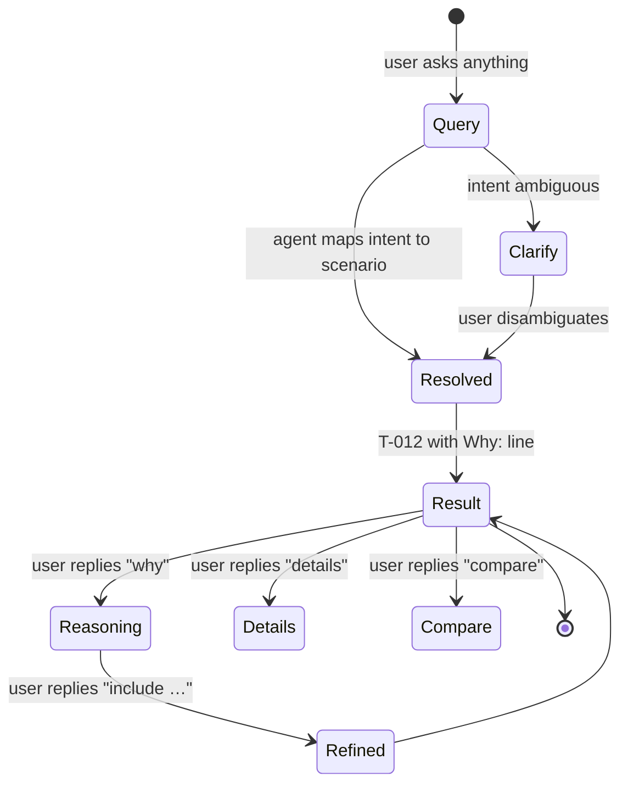
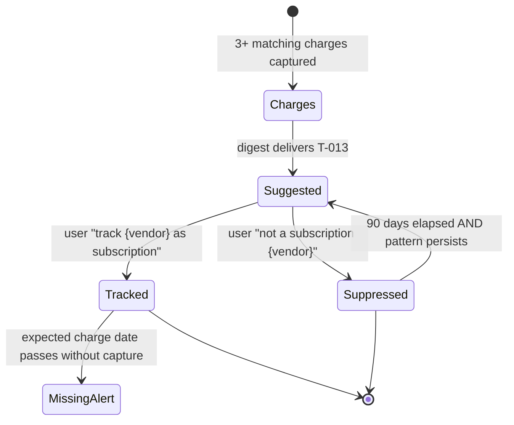
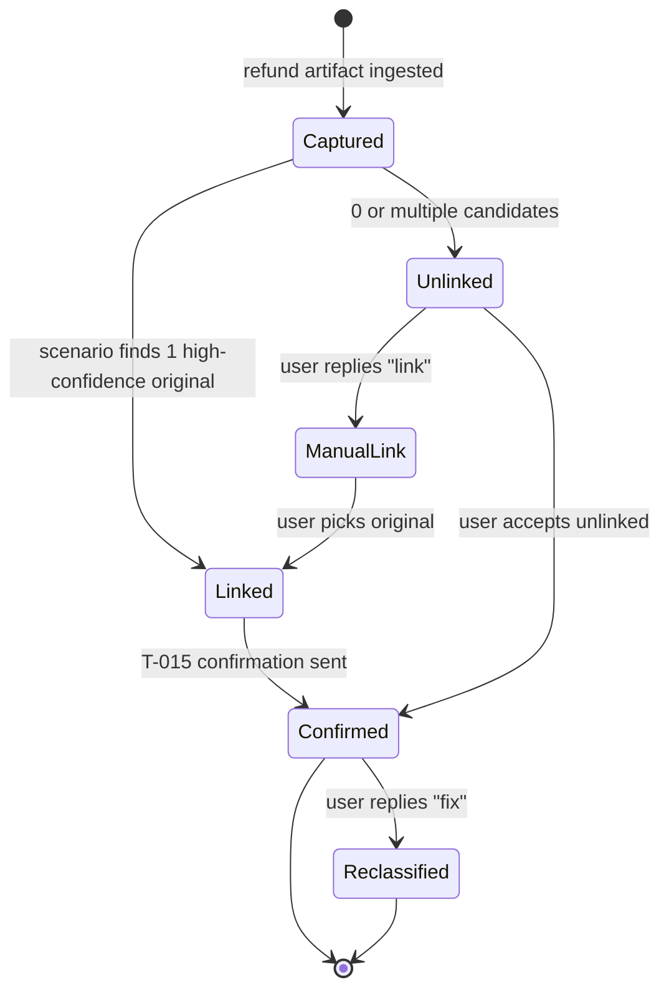
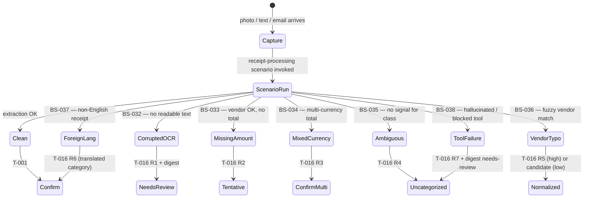

# Feature: 034 Expense Tracking

> **Architectural alignment (added with spec 037).**
> This feature is reframed onto the LLM-Agent + Tools pattern committed to in
> [docs/smackerel.md §3.6 LLM Agent + Tools Pattern](../../docs/smackerel.md)
> and [docs/Development.md "Agent + Tool Development Discipline"](../../docs/Development.md),
> and provided by [spec 037 — LLM Scenario Agent & Tool Registry](../037-llm-agent-tools/spec.md).
>
> User-visible behavior is preserved. The mechanism by which the system
> achieves it changes:
>
> - Receipt detection, expense classification (business / personal /
>   uncategorized / category), business-classification suggestions, vendor
>   normalization, and natural-language expense queries all flow through
>   scenarios on the agent runtime, calling read-only tools against the
>   knowledge graph.
> - New use cases — recurring-subscription detection, unusual-spend
>   surfacing, refund recognition, foreign-language receipt handling — MUST
>   be addable as new scenarios (and at most one or two new tools), NOT by
>   editing classification or routing code.
> - Mechanical operations remain deterministic tools: parse a decimal
>   amount, normalize a currency code, format a CSV row, perform schema-bound
>   CRUD on expense metadata.
>
> **Deprecated.** Any prior language in this spec or in scopes/design that
> mandates a fixed multi-level rule chain, a hardcoded vendor alias seed list
> in Go source, or a regex-based Telegram intent router for expense commands
> is deprecated. See spec 037 for the replacement capability.

## Problem Statement

The user already captures bills, receipts, and financial emails through Smackerel's ingestion pipeline (Gmail connector, Telegram share, web capture, PDF extraction, OCR). The system detects subscriptions and surfaces bill-due alerts. But the captured financial data stops at raw artifacts — there is no structured expense extraction, no categorization beyond subscription detection, no way to filter receipts by business vs. personal purpose, no expense aggregation, and no export in formats compatible with accounting systems. A user who wants to track business expenses or file taxes must manually sift through artifacts, re-enter data into spreadsheets, and lose the intelligence Smackerel already has about their purchases.

## Outcome Contract

**Intent:** Enable the user to passively collect, categorize, and export expenses from all ingestion sources, with structured line-item extraction from receipts and invoices, configurable business/personal classification via Gmail labels and manual tagging, expense aggregation by date range and category, and CSV export compatible with QuickBooks and general accounting imports.

**Success Signal:** A user who receives business receipts via email and photographs paper receipts via Telegram can, at the end of the month, query "show my business expenses for April" and export a CSV that imports into QuickBooks without manual data entry.

**Hard Constraints:**
- Single-user system; no multi-account, no sharing, no approval workflows
- All expense data lives in the existing artifact + metadata model; no separate accounting database
- Currency values stored as strings with explicit currency codes; no float arithmetic for monetary display
- Gmail label interpretation is user-configured, never hard-coded
- The system never modifies the user's Gmail labels or any external source
- Export is pull-only (user-initiated); no automatic push to external systems
- OCR and LLM extraction are best-effort; the user can always correct extracted data

**Failure Condition:** If a receipt captured via any channel (email, photo, PDF, manual entry) cannot be found via expense queries within 5 minutes of ingestion, or if the CSV export produces data that QuickBooks rejects on import, the feature has failed.

## Goals

- G1: Extract structured expense data (vendor, date, amount, currency, tax, line items, payment method) from receipts and invoices arriving via any ingestion channel
- G2: Classify expenses as business or personal using Gmail label mappings, source-level rules, and manual tagging
- G3: Suggest business classification for unclassified expenses that match business patterns
- G4: Aggregate expenses by date range, category, classification (business/personal), vendor, and payment method
- G5: Export filtered expenses as CSV in QuickBooks-compatible format
- G6: Surface expense-related insights in the daily digest (weekly spend summary, unusual charges, missing receipts for known subscriptions)
- G7: Allow manual correction of any extracted expense field

## Non-Goals

- Multi-user accounts, shared workspaces, or approval workflows
- Direct API integration with QuickBooks, Xero, or any accounting system (CSV export only)
- Tax calculation, tax filing, or tax advice
- Credit card statement parsing or bank feed integration
- Duplicate payment detection across bank statements (no bank data source)
- Currency conversion or multi-currency aggregation (expenses stored in their original currency; reports filter by currency)
- Receipt image storage or attachment management (the system stores extracted text, not the original image file)
- Mileage tracking or per-diem calculations

---

## Actors & Personas

| Actor | Description | Key Goals | Permissions |
|-------|-------------|-----------|-------------|
| User | Single self-hosted user who receives receipts via email, photographs paper receipts, and captures digital invoices | Track expenses, classify business vs. personal, generate expense reports, export for accounting | Full access to all expense operations |
| System (Ingestion Pipeline) | Automated ingestion from Gmail, Telegram, web capture, and file import | Detect expense-bearing artifacts, trigger extraction, apply classification rules | Read artifacts, write expense metadata, create suggestions |
| System (Intelligence Engine) | Scheduled intelligence that analyzes expense patterns | Detect anomalies, suggest classifications, surface digest insights | Read expense data, create alerts and digest sections |

---

## Use Cases

### UC-001: Passive Receipt Capture via Email

- **Actor:** System (Ingestion Pipeline)
- **Preconditions:** Gmail connector is enabled and syncing; user has configured expense label mappings in config
- **Main Flow:**
  1. Gmail connector syncs a new email
  2. System checks email labels against configured expense label mappings
  3. System checks email content against receipt/invoice detection patterns (billing keywords, amount patterns, known vendor domains)
  4. If the email matches receipt criteria, system routes the artifact through the receipt extraction prompt contract
  5. Extraction produces structured expense data stored in artifact metadata
  6. Classification rules apply business/personal tag based on label mappings
- **Alternative Flows:**
  - A1: Email matches billing keywords but has no extractable amount → artifact stored as `bill` type with partial metadata; flagged for user review
  - A2: Email has attachment (PDF invoice) → PDF text extracted first, then fed through receipt extraction
  - A3: Email labels don't match any configured mapping → expense classified as "uncategorized"
  - A4: LLM extraction returns invalid JSON or fails schema validation → artifact stored with `extraction_failed: true` in metadata; retried on next synthesis cycle
- **Postconditions:** Expense artifact exists with structured metadata including vendor, amount, date, category, line items, and classification

### UC-002: Receipt Photo Capture via Telegram / Mobile

- **Actor:** User
- **Preconditions:** Telegram bot is connected; OCR pipeline is operational
- **Main Flow:**
  1. User photographs a paper receipt and sends it to the Telegram bot
  2. System runs OCR (Tesseract, with Ollama vision fallback)
  3. OCR text is fed through the receipt extraction prompt contract
  4. Structured expense data is stored in artifact metadata
  5. System responds with a confirmation showing extracted vendor, amount, and date
- **Alternative Flows:**
  - A1: Photo is blurry or OCR produces < 10 characters → system responds "Couldn't read this receipt. Try a clearer photo or type the details."
  - A2: User sends receipt photo with a caption like "business lunch with client" → caption stored as context, classification set to business
  - A3: Receipt is in a non-English language → OCR may partially succeed; LLM extraction handles multilingual content
  - A4: User sends a multi-page receipt as multiple photos → each processed independently; no cross-photo assembly in v1
- **Postconditions:** Expense artifact created from the photographed receipt with structured extraction

### UC-003: Manual Expense Entry via API or Chat

- **Actor:** User
- **Preconditions:** System is running
- **Main Flow:**
  1. User sends a text message to Telegram or calls the capture API: "Lunch at Olive Garden $47.82 business"
  2. System parses the natural language input through the receipt extraction prompt contract
  3. Structured expense created with vendor, amount, and classification extracted from text
- **Alternative Flows:**
  - A1: Input has no amount → system asks "How much was that?" (Telegram only; API returns validation error)
  - A2: Input is ambiguous → system extracts best-effort and flags for review
- **Postconditions:** Expense artifact created from manual text input

### UC-004: PDF Invoice Capture via Web/Email

- **Actor:** User or System
- **Preconditions:** PDF extraction pipeline is operational
- **Main Flow:**
  1. User captures a PDF URL via the web capture API, or Gmail connector encounters an email with a PDF attachment URL
  2. System downloads and extracts text via pypdf
  3. Extracted text fed through the receipt extraction prompt contract
  4. Structured expense metadata stored on the artifact
- **Alternative Flows:**
  - A1: PDF is image-only (scanned document) → pypdf returns empty text → falls back to OCR pipeline if image extraction is available
  - A2: PDF is password-protected → extraction fails gracefully; artifact stored with `extraction_failed: true`
  - A3: PDF contains multiple invoices → LLM extraction may return multiple expense entries; each stored as a separate line item group
- **Postconditions:** Expense artifact created from PDF content

### UC-005: Expense Classification and Business Tagging

> **Reframed for spec 037.** Classification is performed by an
> `expense_classify` scenario on the agent runtime. The scenario receives
> available context (vendor, source labels, captured user notes,
> classification history for similar expenses) and decides
> business / personal / uncategorized plus a category, with a stated
> rationale. The previous prescription of a fixed multi-level rule chain is
> deprecated. New classification heuristics ship as scenario prompt edits
> (or new read-only tools when genuinely needed), not as new branches in Go.

- **Actor:** User
- **Preconditions:** Expense artifacts exist
- **Main Flow:**
  1. The system invokes the `expense_classify` scenario for each new or
     re-evaluated expense, passing available context: extracted vendor,
     source (Gmail, Telegram, manual, web), source labels (e.g., Gmail
     label set), captured user notes (e.g., Telegram caption), and
     historical context (prior classifications for the same vendor, the
     user's configured business-vendor list).
  2. The scenario produces a classification (`business` / `personal` /
     `uncategorized`), a category, and a rationale string explaining which
     contextual signals drove the decision.
  3. Configured user inputs (e.g., a vendor explicitly placed on the
     business-vendor list, an unambiguous Gmail label mapping) act as
     hard signals the scenario MUST honor.
  4. If no signal is sufficient, the classification is `uncategorized`.
  5. The user can override any classification via API or chat command;
     overrides are sticky and survive re-classification.
- **Alternative Flows:**
  - A1: User changes classification → metadata updated, marked
    `user_corrected: true`, downstream aggregations invalidated.
  - A2: User adds a vendor to the business-vendor list → past uncategorized
    expenses from that vendor are re-evaluated by the scenario, which
    treats the new list entry as a hard signal.
  - A3: The scenario fails (LLM error, schema-failure, timeout per
    spec 037) → the expense remains in its prior classification (or
    `uncategorized` if new) and is surfaced in the digest's "needs review"
    block; no silent default to `business` or `personal`.
- **Postconditions:** Every expense artifact has a classification and a
  category. Every classification carries a rationale recorded in the
  expense's metadata for auditability.

### UC-006: Business Classification Suggestions

- **Actor:** System (Intelligence Engine)
- **Preconditions:** Expense artifacts exist with mixed classifications; scheduled intelligence has run
- **Main Flow:**
  1. System scans uncategorized or personal expenses
  2. For each, checks: does the vendor appear in other business-classified expenses? Does the expense category match typical business categories? Does the amount or frequency suggest a business pattern?
  3. Generates suggestion artifacts with confidence score
  4. Surfaces top suggestions in the daily digest: "3 expenses might be business: Office Depot ($42.99), Zoom ($14.99), WeWork ($350.00)"
- **Alternative Flows:**
  - A1: User accepts suggestion → classification updated to business
  - A2: User dismisses suggestion → vendor/pattern excluded from future suggestions for this category
  - A3: No suggestions generated → digest section omitted
- **Postconditions:** Suggestions surfaced; user action updates classification

### UC-007: Expense Query and Filtering

- **Actor:** User
- **Preconditions:** Expense artifacts exist
- **Main Flow:**
  1. User queries: "show business expenses for April 2026" via chat or API
  2. System searches artifacts where expense_classification = business AND date within April 2026
  3. Returns a list of expenses with vendor, date, amount, category, and source
  4. Results can be further filtered by category, vendor, payment method, or amount range
- **Alternative Flows:**
  - A1: Query is vague ("my expenses") → system returns all expenses for current month
  - A2: Query specifies a vendor ("how much at Amazon this year") → filtered by vendor
  - A3: No expenses match the filter → system returns empty result with message
  - A4: Date range spans a gap where no syncing occurred → results reflect only captured data; no indication of missed data
- **Postconditions:** User sees filtered expense list

### UC-008: Expense Report Generation and CSV Export

- **Actor:** User
- **Preconditions:** Expense artifacts exist matching the requested filter
- **Main Flow:**
  1. User requests an expense report: "export business expenses April 2026 as CSV"
  2. System queries matching expenses
  3. Generates CSV with columns: Date, Vendor, Description, Category, Amount, Currency, Tax, Payment Method, Classification, Source, Artifact ID
  4. Returns the CSV file via API response with `Content-Type: text/csv` and appropriate filename
- **Alternative Flows:**
  - A1: No expenses match → system returns empty CSV with header row only
  - A2: Mixed currencies in result set → all included with currency column; no conversion
  - A3: Some expenses have incomplete data (missing vendor or amount) → included with empty cells; a warning header comment notes the count of incomplete records
  - A4: Export exceeds 10,000 rows → paginated with cursor (consistent with existing export API pattern)
  - A5: User requests QuickBooks format specifically → same CSV but column headers mapped to QBO import field names (Date, Payee, Category, Amount, Memo)
- **Postconditions:** CSV file delivered to user

### UC-009: Expense Digest Integration

- **Actor:** System (Intelligence Engine)
- **Preconditions:** Expense artifacts exist; daily digest scheduled
- **Main Flow:**
  1. During daily digest assembly, the expense module contributes a section:
     - "This week: 12 expenses totaling $847.32 (7 business, 5 personal)"
     - Unusual charges flagged: "New vendor: CloudFlare Workers — $5.00 (not previously seen)"
     - Missing receipt warnings: "Netflix subscription ($15.99) expected but no receipt captured this month"
  2. Section respects the existing digest word limit (100 words for this subsection)
- **Alternative Flows:**
  - A1: No expenses this period → section omitted
  - A2: Expense section exceeds word limit → prioritize unusual charges and missing receipts over summary stats
- **Postconditions:** Digest delivered with expense section

### UC-010: Manual Expense Correction

- **Actor:** User
- **Preconditions:** An expense artifact exists with incorrect extracted data
- **Main Flow:**
  1. User identifies an incorrectly extracted expense (wrong amount, wrong vendor, wrong date)
  2. User corrects via API: PATCH /api/expenses/{artifact_id} with corrected fields
  3. System updates the artifact metadata with the corrected values
  4. System marks the expense as `user_corrected: true` so future re-extraction doesn't overwrite
- **Alternative Flows:**
  - A1: User corrects only one field → other fields preserved
  - A2: User tries to correct a non-expense artifact → 404 or validation error
  - A3: Correction changes the amount from positive to negative (refund) → stored as-is; aggregation handles sign
- **Postconditions:** Expense artifact metadata reflects corrected values; user corrections are sticky

---

## Business Scenarios

### BS-001: End-to-End Email Receipt to Export
Given the user receives an email from "Square <receipts@squareup.com>" with subject "Receipt from Corner Coffee" containing "$4.75" and the Gmail label "Business"
When the Gmail connector syncs this email
Then the system creates an expense artifact with vendor "Corner Coffee", amount "4.75", currency "USD", classification "business", category "food-and-drink", and source "gmail"
And the expense appears in the results of "show business expenses for this month"
And the expense is included in the CSV export

### BS-002: Paper Receipt Photo to Structured Expense
Given the user photographs a paper receipt showing "Home Depot — Lumber $127.43, Screws $8.99, Tax $10.88, Total $147.30" and sends it to the Telegram bot with caption "rental property repair"
When the OCR processes the image and the receipt extraction runs
Then the system creates an expense artifact with vendor "Home Depot", total amount "147.30", currency "USD", tax "10.88", classification "business" (from caption context), and line items for each purchased item
And the Telegram bot confirms: "Saved: Home Depot $147.30 (business)"

### BS-003: PDF Invoice Extraction
Given the user captures a URL pointing to a PDF invoice from "DigitalOcean" showing monthly hosting charges of $48.00 with itemized droplets
When the system downloads the PDF and extracts text
Then the system creates an expense artifact with vendor "DigitalOcean", amount "48.00", currency "USD", category "technology", line items for each droplet, and the invoice date extracted from the document

### BS-004: Gmail Label Mapping
Given the user has configured `expense_labels: {"Business-Receipts": "business", "Tax-Deductible": "business", "Personal-Purchases": "personal"}` in smackerel.yaml
When the Gmail connector syncs an email with the label "Tax-Deductible"
Then the resulting expense artifact is classified as "business"
And the label "Tax-Deductible" is preserved in the artifact's source_qualifiers

### BS-005: Expense Without Amount
Given the Gmail connector syncs an email with subject "Your Uber Trip" that contains a ride summary but the amount extraction fails (unusual formatting)
When the receipt extraction runs
Then the system creates an expense artifact with vendor "Uber", category "transportation", `amount_missing: true` in metadata
And the expense is included in the daily digest under "Expenses needing review: Uber trip — amount not detected"

### BS-006: Duplicate Receipt Detection
Given the user receives a receipt email from Amazon for order #123-456 and later forwards the same receipt via Telegram
When both artifacts are processed
Then the system's existing dedup (content_hash) prevents a duplicate artifact
Or if the content differs slightly (email vs. forwarded text), both artifacts exist but the expense query deduplicates by vendor + date + amount within a tolerance window

### BS-007: Business Suggestion for Recurring Vendor
Given the user has 3 past expenses from "Zoom Video Communications" classified as "business"
When a new Zoom charge arrives with no Gmail label mapping and is classified as "uncategorized"
Then the system suggests: "Zoom Video Communications ($14.99) — classify as business? (3 previous business expenses from this vendor)"

### BS-008: Expense Correction
Given the system extracted vendor "AMZN MKTP" with amount "$29.99" from an email
When the user sends PATCH /api/expenses/{id} with `{"vendor": "Amazon Marketplace", "category": "office-supplies"}`
Then the vendor and category are updated
And the expense is marked `user_corrected: true`
And future re-extraction of this artifact does not overwrite the corrected fields

### BS-009: Monthly Business Expense Report
Given it is May 1st and the user requests "export business expenses for April 2026"
When the system queries expenses with classification "business" and date range 2026-04-01 to 2026-04-30
Then the system generates a CSV with one row per expense, sorted by date ascending
And the CSV headers are: Date, Payee, Category, Amount, Currency, Tax, Payment Method, Memo, Source
And the CSV can be imported into QuickBooks Online via the "Import Transactions" feature

### BS-010: Mixed-Currency Expense Report
Given the user has business expenses in USD ($500) and EUR (€200) for April
When the user exports business expenses for April
Then the CSV includes all expenses with their original currency in the Currency column
And the report does NOT attempt currency conversion
And a summary row or comment notes "Multiple currencies present: USD, EUR"

### BS-011: Refund Handling
Given the user receives a refund email from Amazon for -$29.99
When the receipt extraction processes the email
Then the system creates an expense artifact with a negative amount (-29.99)
And the expense aggregation correctly reduces the total by this amount
And the CSV export includes the refund as a negative row

### BS-012: Subscription as Expense
Given the system has detected an active subscription for "Netflix" at $15.99/month via the existing subscription detection
When the user queries expenses for this month
Then the subscription charge appears as an expense artifact if the corresponding receipt email was captured
And if no receipt email was captured for this billing cycle, the digest notes: "Expected receipt missing: Netflix ($15.99)"

### BS-013: Empty Month Query
Given the user has no expenses for March 2026
When the user queries "show expenses for March 2026"
Then the system returns an empty result with message "No expenses found for March 2026"
And the CSV export returns a file with only the header row

### BS-014: Vendor Name Normalization
Given the user receives receipts from "AMZN MKTP US", "Amazon.com", and "AMAZON MARKETPLACE"
When the receipt extraction processes each
Then the system normalizes them to a canonical vendor display name (the
canonical mapping is produced by a `vendor_normalize` scenario consulting
prior captured artifacts and the configured user overrides — NOT by a
hardcoded alias seed list in code)
And expense queries for vendor "Amazon" return all three
And the user can override the normalization via correction
And adding a new vendor variant later does not require a code change

### BS-015: Tax Amount Extraction
Given a receipt contains subtotal $100.00, tax $8.25, total $108.25
When the receipt extraction processes this
Then the expense metadata includes `tax_amount: "8.25"`, `subtotal: "100.00"`, `total: "108.25"`
And the CSV export includes the tax amount in the Tax column

### BS-016: Expense From Captured URL (Web Purchase)
Given the user captures a URL from an order confirmation page (e.g., "https://www.bestbuy.com/order/confirmation/BBY01-123")
When the content extraction fetches the page and identifies it as a product/order page
Then the system routes through the receipt extraction prompt contract
And creates an expense artifact with vendor "Best Buy", extracted amount, and purchased items

### BS-017: Categorization of Common Expense Types
Given an expense with vendor "Shell Gas Station" and amount $45.00
When the receipt extraction runs
Then the category is assigned as "auto-and-transport" (or equivalent IRS-aligned category)
And the user can reassign to any other category

### BS-018: Large Batch Gmail Sync
Given the user enables the Gmail connector for the first time with 6 months of email history
When the initial sync processes 500+ receipt-bearing emails
Then each receipt is queued through the extraction pipeline without overwhelming the LLM
And processing completes within the normal synthesis timeout per artifact
And no receipts are silently dropped

### BS-019: Receipt With No Vendor Name
Given the user photographs a receipt where the store name is illegible but the items and total are clear
When OCR and extraction run
Then the system creates an expense with vendor "Unknown" and the extracted line items and total
And the expense appears in the "needing review" section of the digest

### BS-020: Non-Receipt Email Rejected
Given the Gmail connector syncs a newsletter email from a known vendor (e.g., Amazon marketing email)
When the system checks receipt detection patterns
Then the email is NOT classified as a receipt (no amount, no order number, no "receipt" / "invoice" language)
And no expense artifact metadata is generated for it

### BS-021: User Re-classifies Vendor History
Given the user adds "WeWork" to their business vendor list in config
When the classification engine runs
Then all existing uncategorized expenses from "WeWork" are re-classified as "business"
And the user is notified: "Reclassified 4 WeWork expenses as business"

### BS-022: Expense From Forwarded Email
Given the user forwards a receipt email to the Smackerel Telegram bot using Telegram's message forwarding
When the forwarding pipeline assembles the message and the receipt extraction runs
Then the original sender, subject, and receipt content are preserved
And a proper expense artifact is created with the forwarded receipt's data, not the forwarding metadata

### BS-023: International Receipt (Non-USD)
Given the user photographs a receipt from a German store showing "Gesamt: €47,50" (European comma decimal format)
When OCR and extraction run
Then the system creates an expense with amount "47.50" (normalized to dot decimal) and currency "EUR"
And the original format is preserved in a `raw_amount` metadata field

### BS-024: Receipt With Tip and Service Charge
Given a restaurant receipt shows subtotal $50.00, tax $4.00, tip $10.00, total $64.00
When receipt extraction processes this
Then the expense metadata includes `subtotal: "50.00"`, `tax: "4.00"`, `tip: "10.00"`, `total: "64.00"`
And the primary expense amount is the total including tip ($64.00)

### BS-025: Expense Query by Natural Language
Given expenses exist for various categories and vendors
When the user asks "how much did I spend on food this month?"
Then the semantic search + expense filter returns expenses with category "food-and-drink" for the current month
And returns the total amount

### BS-026: Partial Extraction Recovery
Given a receipt image is partially legible (vendor and total clear, line items blurry)
When OCR and extraction run
Then the system extracts what it can (vendor, total) and sets `extraction_partial: true`
And line items are omitted rather than hallucinated
And the expense is still queryable and exportable

### BS-027: Split Expense (Business Portion)
Given the user has a phone bill of $120 where $60 is business use
When the user corrects the expense via PATCH with `{"amount": "60.00", "notes": "50% business portion of $120 phone bill"}`
Then the expense reflects the corrected business portion
And the notes field preserves the context

### BS-028: CSV Export Column Mapping for QuickBooks
Given the user requests QuickBooks-format export
When the CSV is generated
Then the column headers match QuickBooks Online import requirements: Date (MM/DD/YYYY), Description, Amount, Category
And date format is MM/DD/YYYY (QBO requirement)
And amount uses dot-decimal with no currency symbol in the amount column
And a separate Currency column is included for non-USD entries

### BS-029: New Use Case Added Without Classification Code Change

_See UX: T-012 (free-form query + reasoning), T-013 (subscription notification), A-008 (operator trace), Flow F-002, F-003._

Given the deployment currently classifies expenses via the
`expense_classify` scenario
When the user wants the system to additionally flag "recurring subscription"
expenses based on capture history
Then a new scenario `recurring_subscription_flag` is added to
`config/prompt_contracts/`, allowlisting the existing read-only tools
(e.g., search_expenses, aggregate_amounts)
And no Go code in the classification path is modified
And subscription flags begin appearing on matching expenses after the
service is reloaded

### BS-030: Unusual-Spend Surfacing As A Scenario

_See UX: T-014 (unusual-spend alert + breakdown), digest D-002 unusual-spend block._

Given the user has a normal weekly grocery spend of around $120
When a $640 grocery charge appears
Then an `unusual_spend` scenario flags it for the digest with a rationale
("5x typical weekly grocery spend, single vendor")
And adding new "unusual" criteria (geographic, time-of-day, frequency) does
not require modifying the classifier or routing code

### BS-031: Refund Recognition Via Scenario

_See UX: T-015 (refund recognition with linked / unlinked / manual link variants), digest D-002 refund block, Flow F-004._

Given a captured artifact contains a credit / refund (negative amount,
"refund" / "credit" / "rückerstattung" language, or a return order id)
When the `refund_recognize` scenario runs
Then the resulting expense is recorded with negative amount AND with
`is_refund: true` AND linked to the original purchase artifact when one is
found in the knowledge graph
And aggregations correctly net the refund against the original purchase

### BS-032: Adversarial — Corrupted OCR Output

_See UX: T-016 R1, Flow F-005._

Given OCR returns garbled text with no recognizable amount or vendor
When the receipt-processing scenario runs
Then it returns a structured "extraction_failed" outcome via spec 037's
schema-failure / loop-limit handling
And the artifact is stored with `extraction_status: failed`
And no hallucinated vendor or amount is written to metadata
And the failure is surfaced in the digest's "needs review" block

### BS-033: Adversarial — Missing Amount in Otherwise Valid Receipt

_See UX: T-016 R2 (tentative classification), Flow F-005._

Given OCR / extraction yields vendor + date + line items but no clear total
When the classification scenario runs
Then the expense is stored with `amount_missing: true`
And classification still proceeds where context allows (e.g., source
labels, vendor history) and may produce a tentative classification with a
rationale that explicitly notes the missing amount
And the expense appears in the digest's "needs review" block

### BS-034: Adversarial — Mixed-Currency Receipt

_See UX: T-016 R3, Flow F-005._

Given a single receipt contains items in two currencies (e.g., a duty-free
purchase showing both EUR and USD totals)
When extraction runs
Then the system records each line item with its own currency code
And the expense's primary amount uses the receipt's stated total currency,
recorded explicitly
And the classification scenario does NOT silently coerce to a single
currency
And BS-010's mixed-currency reporting rules apply to aggregations including
this expense

### BS-035: Adversarial — Ambiguous Business / Personal Context

_See UX: T-016 R4 (uncategorized + rationale), T-017 (compact reasoning display), A-008 (operator trace), Flow F-005._

Given a receipt for "Olive Garden $47.82" from a personal credit card with
no caption and no Gmail label
When the `expense_classify` scenario runs
Then the result MAY be `uncategorized` rather than guessing
And the rationale field explains why no signal was sufficient
And a business-suggestion scenario MAY later flag this expense if the user
classifies similar expenses as business going forward

### BS-036: Adversarial — Vendor Name With Typo

_See UX: T-016 R5 (high-confidence silent normalization + low-confidence candidate), Flow F-005._

Given a captured artifact records vendor "Amzaon" (typo from manual entry)
When the `vendor_normalize` scenario runs
Then it MAY map "Amzaon" to the canonical "Amazon" vendor based on
similarity AND on the existence of prior "Amazon" expenses in the
knowledge graph
And the original raw value is preserved in `vendor_raw`
And if the scenario is uncertain, it leaves `vendor` as captured rather
than guessing — surfacing the candidate match in the digest for
confirmation

### BS-037: Adversarial — Foreign-Language Receipt

_See UX: T-016 R6, Flow F-005._

Given a receipt in German showing "Lebensmittel, Gesamt: €47,50"
When the receipt-processing scenario runs
Then the amount is normalized to dot-decimal "47.50" with currency "EUR"
(BS-023 still holds)
And the category is determined by the agent based on the receipt content,
not by an English-only keyword list
And no English-only categorizer rejects the receipt as uncategorizable

### BS-038: Adversarial — Hallucinated Tool Call During Classification

_See UX: T-016 R7 (user-visible fallback identical to "no classification"), A-008 (rejected tool call surfaced in operator trace only), Flow F-005._

Given the `expense_classify` scenario is allowlisted to call only
read-only lookup tools
When the LLM, mid-loop, proposes calling a non-existent or unallowed tool
(e.g., `delete_expense`, `update_user_email`)
Then per spec 037 the agent rejects the call before execution
And no write occurs
And the trace records the rejected call
And classification still produces a result based on the legitimate tool
calls that did execute

---

## Competitive Analysis

| Capability | Smackerel (This Spec) | Expensify | QuickBooks Self-Employed | Dext (Receipt Bank) | Wave |
|-----------|----------------------|-----------|------------------------|--------------------|----|
| Receipt capture via email | Passive Gmail scanning with label-based routing | Email forwarding to receipts@expensify.com | Bank feed only | Forward emails to inbox@dext.com | Manual upload |
| Receipt photo capture | Telegram bot + PWA share sheet | Mobile app with OCR | Mobile app | Mobile app | Mobile upload |
| Auto-categorization | LLM-based with user-trainable vendor mappings | ML-based | Rule-based from bank feed | ML-based | Rule-based |
| Business/personal split | Gmail label mapping + manual tagging + vendor rules | Policy-based | Automatic from bank classification | Manual tagging | None (business-only) |
| Line-item extraction | LLM-powered from OCR/PDF text | Limited (total only in most cases) | None | Line-item OCR | None |
| Knowledge graph integration | Expenses linked to people, topics, trips, properties | Standalone | Standalone | Standalone | Standalone |
| Self-hosted / data ownership | Fully local, user owns all data | Cloud SaaS | Cloud SaaS | Cloud SaaS | Cloud SaaS |
| Cross-domain intelligence | "That client lunch" finds the expense + the meeting + the email thread | None | None | None | None |
| Natural language query | "How much at restaurants this month?" | Search by merchant/date | Basic filters | Search | Basic filters |
| Export formats | CSV (QuickBooks-compatible), JSONL | CSV, PDF, QBO, Xero | TurboTax integration | CSV, Xero, QBO, Sage | CSV, PDF |
| Cost | Free (self-hosted) | $5-11/user/month | $15/month | $16.50/user/month | Free (limited) |

### Competitive Gaps Identified
- **Smackerel unique:** Cross-domain intelligence (expense → meeting → email → person graph), fully self-hosted, passive Gmail scanning without forwarding
- **Behind competitors:** No bank feed integration, no direct accounting API push, no approval workflows, no policy enforcement, no mileage tracking
- **Competitive edge opportunity:** The knowledge graph turns every expense into a connected node — "what did we discuss at that lunch?" links the expense to the calendar event, the email thread, and the person entity

---

## Improvement Proposals

### IP-001: Cross-Domain Expense Intelligence ⭐ Competitive Edge
- **Impact:** High
- **Effort:** M
- **Competitive Advantage:** No competitor links expenses to the knowledge graph. "That client lunch" returns the receipt + the calendar event + the email about the meeting + the person profile. This is unique to Smackerel's architecture.
- **Actors Affected:** User
- **Business Scenarios:** BS-025

### IP-002: Receipt Detection As A Scenario
- **Impact:** Medium
- **Effort:** S
- **Competitive Advantage:** Receipt detection (deciding whether a captured
  email or document is in fact a receipt worth extracting) runs as a
  `receipt_detect` scenario calling lightweight read-only lookup tools.
  Adding new detection signals (new vendor domain patterns, new languages,
  new receipt types) ships as scenario edits, not Go changes. Replaces the
  current Python receipt-detection heuristic (`ml/app/receipt_detection.py`)
  as the canonical decision point; the heuristic may remain as an
  inexpensive read-only tool the scenario consults.
- **Actors Affected:** System (Ingestion Pipeline)
- **Business Scenarios:** BS-020, BS-029

### IP-003: Vendor Normalization As A Scenario ⭐ Generic-By-Default
- **Impact:** Medium
- **Effort:** S
- **Competitive Advantage:** Vendor display normalization is a
  `vendor_normalize` scenario that consults the knowledge graph for prior
  captured vendors and the user's configured overrides. New vendor variants
  do not require Go code or a hardcoded seed list. The ~50 vendor seed
  aliases currently in `internal/intelligence/vendor_seeds.go` are
  superseded by this scenario's lookup over real captured data plus user
  overrides. No competitor in the self-hosted space offers this.
- **Actors Affected:** User, System
- **Business Scenarios:** BS-014, BS-036

### IP-004: Tax Category Mapping
- **Impact:** Medium
- **Effort:** M
- **Competitive Advantage:** Map expense categories to IRS Schedule C categories so the CSV export can include a tax-ready category column. Saves significant tax prep time.
- **Actors Affected:** User
- **Business Scenarios:** BS-009, BS-017

---

## UI Scenario Matrix

| Scenario | Actor | Entry Point | Steps | Expected Outcome | Screen(s) |
|----------|-------|-------------|-------|-------------------|-----------|
| View expenses | User | Chat: "show expenses" / API: GET /api/expenses | 1. Send query 2. View list | Filtered expense list with vendor, date, amount, category | Telegram chat / API response |
| Capture receipt photo | User | Telegram: send photo | 1. Take photo 2. Send to bot 3. (Optional) add caption | Confirmation with extracted data | Telegram chat |
| Export CSV | User | Chat: "export expenses April 2026" / API: GET /api/expenses/export | 1. Specify filters 2. Download CSV | CSV file download | Telegram file / HTTP response |
| Correct expense | User | API: PATCH /api/expenses/{id} | 1. Identify wrong expense 2. Send correction | Updated metadata with corrections | API response |
| Classify expense | User | Chat: "mark expense X as business" / API: PATCH | 1. Identify expense 2. Set classification | Classification updated | Telegram chat / API response |
| View suggestions | User | Daily digest / API | 1. Read digest 2. Accept or dismiss suggestions | Classification updated or suggestion dismissed | Telegram digest / API |

---

## Non-Functional Requirements

### Performance
- Receipt extraction via LLM must complete within the existing synthesis timeout (configurable, default 30 seconds per artifact)
- Expense query with date range filter must return within 2 seconds for up to 10,000 expense artifacts
- CSV export must complete within 10 seconds for up to 10,000 rows
- Initial Gmail backfill of receipt processing must not block other ingestion channels

### Data Integrity
- Monetary amounts stored as string representations with explicit decimal precision (e.g., "147.30", never 147.3 or floating point)
- Currency codes stored as ISO 4217 three-letter codes (USD, EUR, GBP)
- All user corrections are sticky (`user_corrected: true`) and survive re-extraction
- Expense metadata uses the existing artifact `metadata` JSONB field; no separate table required for v1

### Reliability
- LLM extraction failure must not prevent the artifact from being stored; partial extraction is acceptable
- OCR failure falls back gracefully (existing behavior); the artifact is created with whatever text was extracted
- CSV export handles missing fields gracefully with empty cells, not errors

### Observability
- Extraction success/failure/partial rates logged and visible in existing metrics
- Count of uncategorized expenses tracked for digest reporting
- Vendor normalization cache hit/miss rates logged

### Privacy
- All expense data stays local (existing architecture guarantee)
- No expense data sent to external services beyond the configured LLM provider
- CSV exports are generated in-memory and streamed; no temp files on disk

### Accessibility
- Telegram bot interactions use plain text responses, compatible with screen readers
- CSV export uses standard RFC 4180 CSV format

### Scalability
- Expense queries use the existing PostgreSQL indexes on `metadata` JSONB fields
- Receipt extraction shares the existing NATS-based async pipeline; no new queue required
- Vendor normalization uses an in-memory cache with configurable size (consistent with existing OCR cache pattern)

---

## UX Specification

This section defines the observable interaction model across Smackerel's three user-facing surfaces: Telegram bot chat, REST API, and daily digest. All interactions follow the Smackerel personality: calm, minimal, warm. No exclamation marks, no "Great question!" patterns, no unsolicited commentary beyond what the user asked for.

### Design Principles

1. **Plain text first.** All Telegram interactions use plain text only. No markdown rendering, no HTML, no inline images. Formatting relies on line breaks, alignment, and whitespace.
2. **Silent unless spoken to.** The system confirms receipt captures and surfaces digest sections. It does not send unprompted alerts about individual expenses.
3. **Corrections over perfection.** Extraction is best-effort. The system shows what it extracted and makes correction easy, rather than blocking on uncertain data.
4. **Progressive disclosure.** Short confirmations by default. Details available on request.
5. **Error honesty.** When extraction fails, say what failed and what the user can do. No vague "something went wrong."

---

### Surface 1: Telegram Bot Interactions

#### T-001: Receipt Photo Confirmation (BS-002, UC-002)

**Trigger:** User sends a photo to the Telegram bot.

**Happy path response:**

```
┌─────────────────────────────────────────┐
│  User sends: [photo] rental property    │
│              repair                      │
│                                         │
│  Bot responds:                          │
│                                         │
│  Saved: Home Depot $147.30 (business)   │
│  Tax: $10.88 · 3 line items             │
│                                         │
│  Reply "details" to see line items      │
│  Reply "fix" to correct anything        │
└─────────────────────────────────────────┘
```

**Response format:**
```
Saved: {vendor} {currency_symbol}{amount} ({classification})
Tax: {currency_symbol}{tax} · {line_item_count} line items

Reply "details" to see line items
Reply "fix" to correct anything
```

**Rules:**
- First line is always `Saved:` with vendor, amount, classification
- Tax line appears only if tax was extracted
- Line item count appears only if line items were extracted
- Classification in parentheses: `(business)`, `(personal)`, or omitted if uncategorized
- Caption context ("rental property repair") influences classification silently; do not echo the caption back
- If no caption was provided and classification is uncategorized, omit the parenthetical

**Detail expansion (user replies "details"):**

```
┌─────────────────────────────────────────┐
│  User sends: details                    │
│                                         │
│  Bot responds:                          │
│                                         │
│  Home Depot · Apr 12, 2026             │
│                                         │
│  Lumber         $127.43                 │
│  Screws           $8.99                 │
│  Tax             $10.88                 │
│  Total          $147.30                 │
│                                         │
│  Category: home-improvement             │
│  Source: telegram-photo                 │
│  Classification: business               │
└─────────────────────────────────────────┘
```

#### T-002: Receipt Photo — OCR Failure (UC-002 A1)

**Trigger:** User sends a blurry or unreadable photo.

```
┌─────────────────────────────────────────┐
│  User sends: [blurry photo]            │
│                                         │
│  Bot responds:                          │
│                                         │
│  Couldn't read this receipt. Try a      │
│  clearer photo, or type the details:    │
│  "Lunch at Deli $12.50 business"        │
└─────────────────────────────────────────┘
```

**Rules:**
- Triggered when OCR produces fewer than 10 characters
- The example in the response teaches the manual entry format
- No artifact is created from the failed OCR

#### T-003: Receipt Photo — Partial Extraction (BS-026)

**Trigger:** OCR partially succeeds. Vendor and total are clear, but line items are not.

```
┌─────────────────────────────────────────┐
│  User sends: [partially legible photo]  │
│                                         │
│  Bot responds:                          │
│                                         │
│  Saved: Target $83.47                   │
│  Some details were hard to read.        │
│  Reply "fix" to correct anything.       │
└─────────────────────────────────────────┘
```

**Rules:**
- `extraction_partial: true` set in metadata
- "Some details were hard to read." appears only when extraction is partial
- No hallucinated line items in the response or metadata

#### T-004: Receipt Photo — Amount Missing (BS-005)

**Trigger:** Extraction succeeds for vendor but not amount.

```
┌─────────────────────────────────────────┐
│  User sends: [photo of Uber receipt]    │
│                                         │
│  Bot responds:                          │
│                                         │
│  Saved: Uber · amount not detected      │
│  Reply with the amount to add it,       │
│  e.g. "$23.50"                          │
└─────────────────────────────────────────┘
```

**Rules:**
- Artifact created with `amount_missing: true`
- If user replies with a dollar amount, system updates the expense
- Amount reply format: bare number (`23.50`), with symbol (`$23.50`), or with currency (`23.50 EUR`)

#### T-005: Manual Expense Entry via Chat (UC-003)

**Trigger:** User sends a text message describing an expense.

```
┌─────────────────────────────────────────┐
│  User sends: Lunch at Olive Garden      │
│              $47.82 business             │
│                                         │
│  Bot responds:                          │
│                                         │
│  Saved: Olive Garden $47.82 (business)  │
└─────────────────────────────────────────┘
```

**Rules:**
- Natural language parsed through the receipt extraction prompt contract
- Same response format as T-001 but without tax/line item lines
- If no amount is present in the message, bot asks: "How much was that?"
- If no vendor is present, system uses "Manual expense" as vendor

**Missing amount flow:**

```
┌─────────────────────────────────────────┐
│  User sends: Lunch with client          │
│                                         │
│  Bot responds:                          │
│                                         │
│  How much was that?                     │
│                                         │
│  User sends: $47.82                     │
│                                         │
│  Bot responds:                          │
│                                         │
│  Saved: Lunch with client $47.82        │
└─────────────────────────────────────────┘
```

#### T-006: Expense Query via Chat (UC-007, BS-025)

**Trigger:** User asks about expenses in natural language.

```
┌─────────────────────────────────────────┐
│  User sends: show business expenses     │
│              for April                   │
│                                         │
│  Bot responds:                          │
│                                         │
│  Business expenses · Apr 2026           │
│  12 expenses · $1,847.32                │
│                                         │
│  Apr 03  Corner Coffee       $4.75      │
│  Apr 05  DigitalOcean       $48.00      │
│  Apr 07  WeWork            $350.00      │
│  Apr 12  Home Depot        $147.30      │
│  Apr 15  Zoom               $14.99      │
│  ... and 7 more                         │
│                                         │
│  Reply "all" to see the full list       │
│  Reply "export" to get a CSV            │
└─────────────────────────────────────────┘
```

**Response format:**
```
{classification} expenses · {month_year}
{count} expenses · {currency_symbol}{total}

{date}  {vendor}  {currency_symbol}{amount}
{date}  {vendor}  {currency_symbol}{amount}
...

Reply "all" to see the full list
Reply "export" to get a CSV
```

**Rules:**
- Show at most 10 expenses in the initial response
- Expenses sorted by date ascending
- Right-align amounts for scanability (within Telegram's plain-text constraints, use spacing)
- Total shown only when all expenses share the same currency
- If mixed currencies: show count only, no total. Append note: "Multiple currencies — totals shown per currency in export"
- Empty result: "No expenses found for {period}"
- Vague query ("my expenses"): default to current month, all classifications

**Vendor query variant (BS-025):**

```
┌─────────────────────────────────────────┐
│  User sends: how much at restaurants    │
│              this month?                │
│                                         │
│  Bot responds:                          │
│                                         │
│  Food & drink · Apr 2026               │
│  8 expenses · $234.17                   │
│                                         │
│  Apr 02  Corner Coffee        $4.75     │
│  Apr 05  Olive Garden        $47.82     │
│  Apr 09  Thai Kitchen        $32.60     │
│  ... and 5 more                         │
│                                         │
│  Reply "all" to see the full list       │
└─────────────────────────────────────────┘
```

#### T-007: CSV Export via Chat (UC-008, BS-009)

**Trigger:** User requests an export.

```
┌─────────────────────────────────────────┐
│  User sends: export business expenses   │
│              April 2026                  │
│                                         │
│  Bot responds:                          │
│                                         │
│  [attached file:                        │
│   smackerel-expenses-business-2026-04   │
│   .csv]                                 │
│                                         │
│  34 expenses · $4,287.50                │
│  3 with incomplete data (marked in      │
│  file)                                  │
└─────────────────────────────────────────┘
```

**Rules:**
- File sent as a Telegram document attachment
- Filename format: `smackerel-expenses-{classification}-{YYYY-MM}.csv`
- If no classification filter: `smackerel-expenses-all-{YYYY-MM}.csv`
- Summary line shows count and total
- If any expenses have missing fields, note the count
- Empty result: send CSV with headers only, message: "No matching expenses. CSV has headers only."

#### T-008: Business Classification Suggestion (UC-006, BS-007)

**Trigger:** Daily digest delivery (not standalone message).

Suggestions appear within the digest, not as separate messages. See the Digest section (T-010) for format.

**Accept/dismiss flow (after reading digest):**

```
┌─────────────────────────────────────────┐
│  User sends: accept zoom as business    │
│                                         │
│  Bot responds:                          │
│                                         │
│  Zoom classified as business.           │
│  Applied to 1 expense.                  │
│                                         │
│  ─ ─ ─ ─ ─ ─ ─ ─ ─ ─ ─ ─ ─ ─ ─ ─ ─  │
│                                         │
│  User sends: dismiss zoom suggestion    │
│                                         │
│  Bot responds:                          │
│                                         │
│  Noted. Won't suggest Zoom as business  │
│  again.                                 │
└─────────────────────────────────────────┘
```

**Rules:**
- "accept {vendor} as business" triggers reclassification
- "dismiss {vendor} suggestion" suppresses future suggestions for that vendor+classification pair
- If the vendor name is ambiguous, system asks: "Which one? Zoom Video Communications ($14.99, Apr 10) or Zoom Car Wash ($25.00, Apr 12)?"
- Reclassification count shows how many expenses were affected

#### T-009: Expense Correction via Chat (UC-010, BS-008)

**Trigger:** User replies "fix" to a confirmation, or sends a correction command.

```
┌─────────────────────────────────────────┐
│  User sends: fix                        │
│                                         │
│  Bot responds:                          │
│                                         │
│  What needs fixing?                     │
│  • vendor — "Home Depot"                │
│  • amount — "$147.30"                   │
│  • date — "Apr 12, 2026"               │
│  • category — "home-improvement"        │
│  • classification — "business"          │
│                                         │
│  Reply with the field and new value,    │
│  e.g. "vendor Acme Hardware"            │
│                                         │
│  ─ ─ ─ ─ ─ ─ ─ ─ ─ ─ ─ ─ ─ ─ ─ ─ ─  │
│                                         │
│  User sends: vendor Acme Hardware       │
│                                         │
│  Bot responds:                          │
│                                         │
│  Updated: vendor → Acme Hardware        │
│  Anything else to fix? Reply "done"     │
│  when finished.                         │
│                                         │
│  ─ ─ ─ ─ ─ ─ ─ ─ ─ ─ ─ ─ ─ ─ ─ ─ ─  │
│                                         │
│  User sends: done                       │
│                                         │
│  Bot responds:                          │
│                                         │
│  All set.                               │
└─────────────────────────────────────────┘
```

**Rules:**
- "fix" works as a reply to the most recent expense confirmation
- Correction format: `{field} {new_value}`
- After each correction, prompt for more until user says "done"
- Corrected fields marked `user_corrected: true`
- If "fix" is sent without context (no recent expense), bot asks: "Which expense? Send the vendor name or date."

#### T-010: Daily Digest — Expense Section (UC-009, BS-012)

**Trigger:** Scheduled daily digest delivery.

```
┌─────────────────────────────────────────┐
│  (within daily digest)                  │
│                                         │
│  ── Expenses ──                         │
│  This week: 12 expenses, $847.32        │
│  (7 business, 5 personal)               │
│                                         │
│  New vendor: CloudFlare Workers $5.00   │
│                                         │
│  Needs review:                          │
│  • Uber trip — amount not detected      │
│  • Target $83.47 — partial extraction   │
│                                         │
│  Suggestion:                            │
│  • Zoom $14.99 — classify as business?  │
│    (3 past business expenses)           │
│  • Office Depot $42.99 — business?      │
│                                         │
│  Missing receipt: Netflix ($15.99)      │
│  expected this cycle                    │
│                                         │
│  Reply "accept zoom as business"        │
│  or "dismiss zoom suggestion"           │
└─────────────────────────────────────────┘
```

**Digest section structure (priority order when word limit applies):**
1. **Needs review** — expenses with extraction problems (highest priority)
2. **Suggestions** — business classification suggestions
3. **Missing receipts** — expected subscription charges without captured receipts
4. **Unusual charges** — new vendors or amounts significantly above average
5. **Summary stats** — weekly count and total (lowest priority; omitted first if space-constrained)

**Rules:**
- Section header: `── Expenses ──`
- Maximum 100 words for this subsection
- If no expenses exist for the period, the entire section is omitted
- Suggestions include vendor, amount, and brief rationale
- "Reply" instructions appear only when actionable items (suggestions) are present
- At most 3 suggestions shown; if more exist, show count: "... and 2 more suggestions"

#### T-011: Vendor Reclassification Notification (BS-021)

**Trigger:** User adds a vendor to the business vendor list via config.

```
┌─────────────────────────────────────────┐
│  (next digest or immediate if           │
│  triggered via chat command)            │
│                                         │
│  Reclassified 4 WeWork expenses as      │
│  business (Oct 2025 – Apr 2026).        │
└─────────────────────────────────────────┘
```

**Rules:**
- Shows count and date range of affected expenses
- Delivered in the next digest, or immediately if the user triggers reclassification via chat ("reclassify wework as business")

---

#### Agent + Tools UX Additions (T-012 .. T-017)

The wireframes below extend Surface 1 to cover the LLM-Agent + Tools
shift introduced by spec 037. They cover BS-029..BS-038. All previously
specified screens (T-001..T-011) remain authoritative. The agent runtime
now accepts a strict superset of the existing trigger phrases.

##### Screen / Flow Inventory (New & Modified)

| ID    | Surface  | Status   | Scenarios Served                  | Purpose |
|-------|----------|----------|------------------------------------|---------|
| T-012 | Telegram | New      | BS-025, BS-029                     | Free-form expense intent ("how much did I spend on coffee last month?") with agent-generated breakdown + reasoning |
| T-013 | Telegram | New      | BS-029 (subscription scenario)     | Subscription detection notification ("I noticed Netflix charges every month — track as subscription?") |
| T-014 | Telegram | New      | BS-030                             | Unusual-spend alert with breakdown offer |
| T-015 | Telegram | New      | BS-031                             | Refund recognition confirmation linking back to original purchase |
| T-016 | Telegram | New      | BS-032..BS-038                     | Adversarial-case responses (corrupted OCR, missing amount, mixed currency, ambiguous classification, vendor typo, foreign-language receipt, hallucinated tool fallback) |
| T-017 | Telegram | New      | UC-005, BS-035                     | Compact rationale display embedded in confirmations and queries |
| A-001 | API      | Modify   | UC-005, UC-007                     | Add `rationale`, `rationale_short`, and `scenario` fields to expense response objects |
| A-008 | API      | New      | UC-005, BS-029, BS-035             | Operator-grade tool-call trace via `GET /api/expenses/{id}/trace` |
| D-002 | Digest   | New      | BS-030, BS-031                     | Unusual-spend and refund blocks within the existing expense digest section |
| F-001 | All      | Modify   | T-005, T-006, T-007, T-009         | Existing trigger-pattern tables become **MUST-handle examples**, not the full grammar |

> **No screens superseded.** All existing wireframes remain valid.

##### Phrasing Flexibility Note (applies to all existing Telegram flows)

The trigger-pattern examples elsewhere in this section (e.g. `show
{classification} expenses for {month}`, `export {classification}
expenses {month_year}`, `accept {vendor} as business`, `fix`, `done`,
`details`) are **MUST-handle exemplars** — the agent runtime MUST
recognize them verbatim. They are NOT the full grammar.

The agent classifies the user's intent from any phrasing, including:

- Synonyms ("export", "download", "send me a CSV", "give me the file")
- Question forms ("how much did I spend on …", "what did I spend at …",
  "what's my total for …")
- Imperatives ("show me business expenses for last month", "list April
  business expenses", "pull up business stuff from April")
- Mixed scope ("group April business expenses by vendor")
- Conversational repair ("actually make that personal", "no, last month
  not this month")
- Implicit references ("export those", "send that as CSV") immediately
  after a query response

If the agent cannot resolve the intent within its allowlisted tools, it
falls back to a single clarifying question (T-016 R3) rather than
guessing. It never silently mis-routes a recognized command.

#### T-012: Free-Form Expense Query With Reasoning (BS-025, BS-029)

**Trigger:** User asks any question about their expenses in natural
language. Examples (all MUST work; none is privileged):

- "how much did I spend on coffee last month?"
- "what did I drop at restaurants in March?"
- "what's my Amazon total for Q1?"
- "did I spend more on groceries this month vs last?"

**Happy path response:**

```
┌─────────────────────────────────────────┐
│  User sends: how much did I spend on    │
│              coffee last month?          │
│                                         │
│  Bot responds:                          │
│                                         │
│  Coffee · Mar 2026                      │
│  $87.45 across 21 expenses              │
│                                         │
│  Top vendors:                           │
│  Corner Coffee     $42.50 (12 visits)   │
│  Blue Bottle       $28.95  (5 visits)   │
│  Starbucks         $16.00  (4 visits)   │
│                                         │
│  Why: matched expenses tagged           │
│  food-and-drink with vendors typed as   │
│  "coffee" or category "coffee-shop".    │
│                                         │
│  Reply "details" for the full list      │
│  Reply "compare" for last 3 months      │
└─────────────────────────────────────────┘
```

**Response format:**

```
{topic_label} · {period}
{currency_symbol}{total} across {count} expenses

Top vendors:
{vendor}  {currency_symbol}{amount}  ({visit_count} visits)
...

Why: {one_sentence_rationale}

Reply "details" for the full list
Reply "compare" for last 3 months
```

**Rules:**
- `Why:` line is the compact rationale (T-017). Always one sentence,
  always lowercase after the colon, never blames the user, never
  references internal tool names. If the rationale would exceed one
  sentence, truncate and offer "Reply 'why' for full reasoning" instead.
- Top vendors block omitted if total expense count is less than 3.
- "compare" appears only when at least 2 prior periods of the same
  length exist.
- Mixed currencies: same rules as T-006 — show count only, append
  "Multiple currencies — see export".
- Empty result: `No coffee expenses found for Mar 2026. Why: no
  expenses matched food-and-drink vendors typed as "coffee".`
- The agent MUST NOT invent categories. If the requested topic does
  not match any classification, category, or vendor pattern in the
  knowledge graph, respond: `Not sure what counts as "{topic}". Reply
  with example vendors and I'll learn.`

**Expanded reasoning (user replies "why"):**

```
┌─────────────────────────────────────────┐
│  User sends: why                        │
│                                         │
│  Bot responds:                          │
│                                         │
│  Reasoning:                             │
│  • Resolved "coffee" to category        │
│    food-and-drink + vendor type         │
│    coffee-shop.                         │
│  • Resolved "last month" to Mar 2026.   │
│  • Searched expenses in that range,     │
│    matched 21 of 184 total.             │
│  • Excluded 3 catering charges          │
│    (vendor type "restaurant").          │
│                                         │
│  Reply "include catering" to add them   │
└─────────────────────────────────────────┘
```

**Rules for expanded reasoning:**
- Bulleted, at most 6 lines.
- Lists the resolved terms (what "coffee" and "last month" became), the
  filter, the match count, and any explicit exclusions.
- Never reveals internal tool names, prompt-contract IDs, or trace IDs
  (those live in the API trace view A-008).
- Always offers a corrective reply when an exclusion was applied.

#### T-013: Subscription Detection Notification (BS-029)

**Trigger:** The `recurring_subscription_flag` scenario detects ≥3
charges from the same vendor at a regular cadence (weekly, monthly,
quarterly, annually) within a 25% time-window tolerance, and the
vendor is not already tracked as a subscription.

**Happy path response (delivered in the next digest, NOT as a separate
ping):**

```
┌─────────────────────────────────────────┐
│  (within daily digest, Subscriptions    │
│   block under ── Expenses ──)           │
│                                         │
│  Looks like a subscription:             │
│  • Netflix $15.99 · monthly · 4 charges │
│    Last 4 dates: Jan 12, Feb 12,        │
│    Mar 12, Apr 12.                      │
│                                         │
│  Reply "track netflix as subscription"  │
│  or "not a subscription netflix"        │
└─────────────────────────────────────────┘
```

**User confirmation flow:**

```
┌─────────────────────────────────────────┐
│  User sends: track netflix as           │
│              subscription                │
│                                         │
│  Bot responds:                          │
│                                         │
│  Tracking Netflix as a monthly          │
│  subscription. Next charge expected     │
│  May 12.                                │
│                                         │
│  ─ ─ ─ ─ ─ ─ ─ ─ ─ ─ ─ ─ ─ ─ ─ ─ ─    │
│                                         │
│  User sends: not a subscription netflix │
│                                         │
│  Bot responds:                          │
│                                         │
│  Noted. Won't suggest Netflix as a      │
│  subscription again.                    │
└─────────────────────────────────────────┘
```

**Rules:**
- Subscription suggestion appears in digest only, never as a standalone
  push message (consistent with "silent unless spoken to").
- Cadence label is one of: `weekly`, `monthly`, `quarterly`, `annually`,
  or `every {N} days` if irregular but consistent.
- Charge count and sample dates are mandatory; never propose a
  subscription on fewer than 3 historical charges.
- "track {vendor} as subscription" sets the artifact's
  `is_subscription: true`, links prior charges, and seeds an expected
  next-charge date in the `Missing receipt` block (T-010).
- "not a subscription {vendor}" suppresses future suggestions for that
  vendor for 90 days. After 90 days, if pattern persists, suggest
  again.
- If the vendor is ambiguous, fall back to the disambiguation pattern
  from E-008.

#### T-014: Unusual-Spend Alert (BS-030)

**Trigger:** The `unusual_spend` scenario flags an expense whose
amount, frequency, geography, or time-of-day deviates from the user's
established baseline for that vendor or category by a margin the
scenario itself defines (the criteria live in the prompt contract,
not in code).

**Happy path response (delivered in the next digest, "Unusual charges"
block):**

```
┌─────────────────────────────────────────┐
│  (within daily digest, Unusual block    │
│   under ── Expenses ──)                 │
│                                         │
│  Unusual:                               │
│  • Whole Foods $640.12 (Apr 21) — about │
│    5x your typical weekly grocery       │
│    spend ($120 avg over 12 weeks).      │
│                                         │
│  Reply "breakdown groceries this week"  │
│  to see what changed                    │
└─────────────────────────────────────────┘
```

**User-initiated breakdown (T-006 variant):**

```
┌─────────────────────────────────────────┐
│  User sends: breakdown groceries this   │
│              week                        │
│                                         │
│  Bot responds:                          │
│                                         │
│  Groceries · Apr 19–Apr 25, 2026        │
│  $712.40 across 4 expenses              │
│  (vs $128 avg over prior 12 weeks)      │
│                                         │
│  Apr 19  Trader Joe's      $52.18       │
│  Apr 20  Local Market      $19.80       │
│  Apr 21  Whole Foods      $640.12       │
│  Apr 22  Corner Bodega       $0.30      │
│                                         │
│  Why: the Whole Foods charge accounts   │
│  for 90% of the spike. Reply "details   │
│  whole foods apr 21" for that receipt.  │
└─────────────────────────────────────────┘
```

**Rules:**
- Rationale always names the dominant contributor (vendor + amount +
  share of the delta) when one expense accounts for >50% of the spike.
- Baseline window stated explicitly (e.g. "12 weeks") so the user can
  judge the comparison.
- The agent MUST NOT trigger an unusual-spend alert outside the
  digest. No standalone "unusual charge" pings.
- If the user replies "not unusual" with the vendor, the scenario
  records the suppression and won't flag the same vendor for the same
  category for 30 days.

#### T-015: Refund Recognition (BS-031)

**Trigger:** Receipt-processing scenario classifies an artifact as a
refund (negative amount, refund/credit/return language, or matched
return order id).

**Happy path response (immediate, like T-001):**

```
┌─────────────────────────────────────────┐
│  User sends: [photo of Amazon refund    │
│              email]                     │
│                                         │
│  Bot responds:                          │
│                                         │
│  Saved: Amazon refund −$47.99           │
│  Linked to: Amazon $47.99 (Apr 02)      │
│  Net for that purchase: $0.00           │
│                                         │
│  Reply "details" to see both            │
│  Reply "fix" if this isn't a refund     │
└─────────────────────────────────────────┘
```

**Unlinked refund (no original purchase found):**

```
┌─────────────────────────────────────────┐
│  Bot responds:                          │
│                                         │
│  Saved: Amazon refund −$22.50           │
│  No matching original purchase found in │
│  capture history.                       │
│                                         │
│  Reply "link" to associate it manually  │
│  Reply "fix" if this isn't a refund     │
└─────────────────────────────────────────┘
```

**Manual link flow:**

```
┌─────────────────────────────────────────┐
│  User sends: link                       │
│                                         │
│  Bot responds:                          │
│                                         │
│  Recent Amazon purchases:               │
│  • Apr 02  $47.99  USB-C cable          │
│  • Mar 28  $22.50  Coffee filters       │
│  • Mar 21  $89.00  Desk lamp            │
│                                         │
│  Reply with the date or amount          │
└─────────────────────────────────────────┘
```

**Rules:**
- Refund displayed with leading minus sign (`−$47.99`); never wrapped
  in parentheses (parentheses are reserved for classification labels).
- "Linked to:" line appears only when the scenario found exactly one
  high-confidence match. If multiple candidates exist, show the
  unlinked variant and offer "link".
- "Net for that purchase:" computed only for fully-netted purchases
  (refund equals original amount). Otherwise show "Partial refund of
  $47.99 charge".
- If the user marks "fix" → the artifact is reclassified as a regular
  expense via the same correction flow as T-009.
- Refund expenses appear in queries with negative amounts and are
  netted in aggregations (BS-031).

#### T-016: Adversarial-Case Responses (BS-032..BS-038)

These wireframes specify what the user sees when the agent runtime
encounters an adversarial input or an internal failure. All responses
share a structural contract: **state what was understood, state what
failed, offer the next step.** Never blame the user, never invent
data, never silently store hallucinated values.

##### T-016 R1: Corrupted OCR (BS-032)

```
┌─────────────────────────────────────────┐
│  User sends: [photo with unreadable     │
│              OCR output]                │
│                                         │
│  Bot responds:                          │
│                                         │
│  Couldn't read this receipt clearly.    │
│  Saved as needs-review with no amount   │
│  or vendor.                             │
│                                         │
│  Reply with the details, e.g.           │
│  "Lunch at Deli $12.50 business"        │
│  Or reply "discard" to remove it        │
└─────────────────────────────────────────┘
```

**Rules:**
- Distinct from T-002: T-002 returns no artifact; T-016 R1 returns an
  artifact with `extraction_status: failed` so the failure is visible
  in the digest's "needs review" block.
- No partial vendor or amount is ever shown; the agent does not guess.
- "discard" deletes the artifact (the only Telegram-driven delete
  path).

##### T-016 R2: Missing Amount With Tentative Classification (BS-033)

```
┌─────────────────────────────────────────┐
│  User sends: [photo with vendor + date  │
│              but no clear total]        │
│                                         │
│  Bot responds:                          │
│                                         │
│  Saved: Uber · amount not detected      │
│  Tentative: business (matches your past │
│  Uber rides on weekday mornings).       │
│                                         │
│  Reply with the amount, e.g. "$23.50"   │
│  Reply "personal" if this wasn't work   │
└─────────────────────────────────────────┘
```

**Rules:**
- Extends T-004: where T-004 omits classification, T-016 R2 shows a
  tentative classification only when historical evidence supports it.
- The rationale is the compact T-017 form: one sentence, naming the
  evidence.
- "personal" / "business" replies update classification without
  requiring the amount.

##### T-016 R3: Mixed-Currency Receipt (BS-034)

```
┌─────────────────────────────────────────┐
│  User sends: [photo of duty-free        │
│              receipt with EUR + USD]    │
│                                         │
│  Bot responds:                          │
│                                         │
│  Saved: Duty Free Shop                  │
│  Receipt total: €87.40 EUR              │
│  Line items in 2 currencies: EUR, USD   │
│                                         │
│  Stored each line in its own currency.  │
│  Aggregations will keep them separate.  │
│                                         │
│  Reply "details" to see line items      │
└─────────────────────────────────────────┘
```

**Rules:**
- Primary amount uses the receipt's stated total currency, named
  explicitly ("€87.40 EUR" not just "€87.40").
- The line "Line items in N currencies: …" lists every currency code
  found.
- The agent MUST NOT ask the user "which currency dominates?" — that
  would imply silent coercion. It states the receipt's stated total
  and stores granular line-item currencies (BS-034).

##### T-016 R4: Ambiguous Business / Personal (BS-035)

```
┌─────────────────────────────────────────┐
│  User sends: [photo of Olive Garden     │
│              $47.82, no caption]        │
│                                         │
│  Bot responds:                          │
│                                         │
│  Saved: Olive Garden $47.82             │
│  Classification: uncategorized          │
│                                         │
│  Why: no signal to choose business or   │
│  personal — no caption, no Gmail label, │
│  no past Olive Garden expenses tagged   │
│  either way.                            │
│                                         │
│  Reply "business" or "personal" to set  │
│  it. I'll learn from the choice.        │
└─────────────────────────────────────────┘
```

**Rules:**
- The classification is `uncategorized` — never a coin-flip guess.
- Rationale enumerates the missing signals (caption, label, history).
- The closing line tells the user the choice will inform future
  classifications, satisfying BS-035's learning clause.

##### T-016 R5: Vendor Typo Normalization (BS-036)

**High-confidence normalization (silent, with disclosure on details):**

```
┌─────────────────────────────────────────┐
│  User sends: Amzaon $14.99              │
│                                         │
│  Bot responds:                          │
│                                         │
│  Saved: Amazon $14.99                   │
│                                         │
│  Reply "details" for the original entry │
│  Reply "fix" to correct anything        │
└─────────────────────────────────────────┘
```

```
┌─────────────────────────────────────────┐
│  User sends: details                    │
│                                         │
│  Bot responds:                          │
│                                         │
│  Amazon · Apr 23, 2026                  │
│                                         │
│  Original entry: "Amzaon"               │
│  Normalized to:  Amazon                 │
│  Why: matched canonical vendor with     │
│  17 prior Amazon expenses.              │
│                                         │
│  Source: telegram-text                  │
└─────────────────────────────────────────┘
```

**Low-confidence normalization (preserves raw, surfaces candidate):**

```
┌─────────────────────────────────────────┐
│  User sends: Amzaon $14.99              │
│              (no prior Amazon history)  │
│                                         │
│  Bot responds:                          │
│                                         │
│  Saved: Amzaon $14.99                   │
│  Possible match: Amazon? Reply          │
│  "rename to amazon" to confirm.         │
└─────────────────────────────────────────┘
```

**Rules:**
- High confidence = canonical vendor exists in the knowledge graph
  with prior expenses AND similarity score above the scenario's
  threshold.
- `vendor_raw` always preserves the original (BS-036).
- Low confidence keeps the raw value as `vendor`, offers the candidate
  but does NOT apply it.
- "rename to {canonical}" applies the normalization and back-fills
  `vendor_raw` from the original input.

##### T-016 R6: Foreign-Language Receipt (BS-037)

```
┌─────────────────────────────────────────┐
│  User sends: [photo of German receipt:  │
│              "Lebensmittel Gesamt €47,50"]│
│                                         │
│  Bot responds:                          │
│                                         │
│  Saved: Edeka €47.50 EUR                │
│  Category: groceries                    │
│                                         │
│  Reply "details" to see line items      │
│  Reply "fix" to correct anything        │
└─────────────────────────────────────────┘
```

**Rules:**
- Amount normalized to dot-decimal (`47.50`), currency explicit
  (`EUR`) — same rule as BS-023.
- Category derived from the receipt content ("Lebensmittel" =
  groceries) by the agent, NOT by an English-only keyword list
  (BS-037).
- The bot never echoes the original-language tokens in the
  confirmation — that would feel like the system is showing off its
  translation. The original text is preserved in artifact metadata
  and visible via "details" → `Receipt language: de` line.
- If the agent cannot determine a category from the content, it falls
  through to T-016 R4 (uncategorized + rationale).

##### T-016 R7: Hallucinated Tool Call / Scenario Failure (BS-038)

The user-visible behavior is identical to "scenario produced no
classification" — the rejected tool call is invisible at the chat
surface (it lives in the trace via A-008).

```
┌─────────────────────────────────────────┐
│  User sends: [receipt that triggers a   │
│              scenario failure]          │
│                                         │
│  Bot responds:                          │
│                                         │
│  Saved: Acme Hardware $89.10            │
│  Couldn't classify automatically this   │
│  time. Set as uncategorized.            │
│                                         │
│  Reply "business" or "personal" to set  │
│  it manually.                           │
└─────────────────────────────────────────┘
```

**Rules:**
- The user is never told a tool was hallucinated, blocked, or that the
  loop limit fired. That is operator-grade information (trace, logs).
- The artifact is created with `extraction_status: complete` if the
  parse succeeded but classification failed, or `partial` if both.
- The artifact's metadata records `classification_failed: true` and
  the digest includes it under "Needs review".
- Manual entry is always available as the fallback (consistent with
  the "Corrections over perfection" design principle).

#### T-017: Compact Reasoning Display (UC-005, BS-035)

The agent's rationale appears in two compact forms throughout
Telegram:

##### T-017 A: Inline `Why:` line

Used in confirmations (T-001, T-013, T-014, T-015), uncategorized
results (T-016 R4), and queries (T-012). One sentence. Lowercase
after the colon. Never names internal tool, scenario, or contract
IDs.

```
Why: matched expenses tagged food-and-drink with vendors typed as
"coffee" or category "coffee-shop".
```

##### T-017 B: `Reasoning:` block (on demand)

Used when the user replies `why`. Bulleted, max 6 lines, structured
as: resolved-terms → filter → match-count → exclusions → corrective
hint.

```
Reasoning:
• Resolved "coffee" to category food-and-drink + vendor type
  coffee-shop.
• Resolved "last month" to Mar 2026.
• Searched expenses in that range, matched 21 of 184 total.
• Excluded 3 catering charges (vendor type "restaurant").

Reply "include catering" to add them
```

**Rules across both forms:**
- Plain English; no jargon, no schema names, no JSON snippets.
- Never references the LLM, the prompt contract name, the scenario
  name, or any internal trace ID.
- If the rationale is genuinely empty (e.g. classification fell
  through to `uncategorized`), say so explicitly: `Why: no signal to
  choose business or personal — no caption, no label, no vendor
  history.`
- Operator-grade detail (tool call list, rejected calls, loop
  iterations) belongs in A-008, not in chat.

---

### Surface 2: REST API Contract UX

All expense endpoints live under the existing API namespace. Responses follow the standard Smackerel API envelope. All monetary values are strings. All dates are ISO 8601.

#### API Envelope

Every API response uses the standard envelope:

```json
{
  "ok": true,
  "data": { ... },
  "meta": { ... }
}
```

Error responses:

```json
{
  "ok": false,
  "error": {
    "code": "EXPENSE_NOT_FOUND",
    "message": "No expense with that ID"
  }
}
```

#### A-001: GET /api/expenses — Query and Filter

**Purpose:** Retrieve a filtered list of expenses.

**Query parameters:**

| Parameter | Type | Required | Description | Example |
|-----------|------|----------|-------------|---------|
| `from` | date | no | Start of date range (inclusive), ISO 8601 | `2026-04-01` |
| `to` | date | no | End of date range (inclusive), ISO 8601 | `2026-04-30` |
| `classification` | string | no | `business`, `personal`, `uncategorized` | `business` |
| `category` | string | no | Expense category slug | `food-and-drink` |
| `vendor` | string | no | Vendor name (partial match, case-insensitive) | `amazon` |
| `amount_min` | string | no | Minimum amount (inclusive) | `10.00` |
| `amount_max` | string | no | Maximum amount (inclusive) | `500.00` |
| `currency` | string | no | ISO 4217 currency code | `USD` |
| `needs_review` | bool | no | Filter to expenses with extraction issues | `true` |
| `cursor` | string | no | Pagination cursor from previous response | |
| `limit` | int | no | Results per page, default 50, max 200 | `50` |

**Response (200 OK):**

```json
{
  "ok": true,
  "data": {
    "expenses": [
      {
        "id": "01HWXYZ...",
        "vendor": "Corner Coffee",
        "vendor_raw": "SQ *CORNER COFFEE",
        "date": "2026-04-03",
        "amount": "4.75",
        "currency": "USD",
        "tax": null,
        "tip": null,
        "subtotal": null,
        "category": "food-and-drink",
        "classification": "business",
        "payment_method": null,
        "line_items": [],
        "source": "gmail",
        "notes": null,
        "extraction_status": "complete",
        "user_corrected": false,
        "artifact_id": "01HWXYZ...",
        "scenario": "expense_classify",
        "rationale": "Matched user-defined business vendor list and weekday-morning pattern.",
        "rationale_short": "matches your past coffee runs on workdays"
      }
    ],
    "summary": {
      "count": 34,
      "total_by_currency": {
        "USD": "1847.32"
      }
    }
  },
  "meta": {
    "cursor": "eyJkYX...",
    "has_more": true,
    "limit": 50
  }
}
```

**Rules:**
- `vendor_raw` preserves the original extracted text before normalization
- `extraction_status`: `complete`, `partial`, `failed`
- `line_items` is an array of `{ "description": string, "amount": string, "quantity": string | null }`
- `summary.total_by_currency` groups totals by currency code; never sums across currencies
- Default sort: date ascending
- Amounts are strings, never numeric types
- `null` for fields not extracted (not empty string, not `0`)

**Agent runtime fields (added with the LLM-Agent + Tools shift; see
[spec 037](../037-llm-agent-tools/spec.md)).** Always present in the
response shape; may be `null` when the expense predates the agent
runtime or the scenario produced no rationale. Existing clients that
ignore unknown fields continue to work.

| Field            | Type            | Rules |
|------------------|-----------------|-------|
| `scenario`       | string \| null  | The scenario name that produced the classification (e.g. `expense_classify`, `recurring_subscription_flag`, `unusual_spend`, `refund_recognize`, `vendor_normalize`). Stable identifier; safe for clients to switch on. |
| `rationale`      | string \| null  | Full rationale, max 280 chars. Plain English. No tool names, no schema fragments. |
| `rationale_short`| string \| null  | One-clause version (max 80 chars) suitable for Telegram's `Why:` line. |

**Error responses:**

| Code | HTTP Status | Condition |
|------|-------------|-----------|
| `INVALID_DATE_RANGE` | 400 | `from` is after `to` |
| `INVALID_CURRENCY` | 400 | Currency code not ISO 4217 |
| `INVALID_AMOUNT_RANGE` | 400 | `amount_min` greater than `amount_max` |

#### A-002: GET /api/expenses/export — CSV Export

**Purpose:** Generate and download a CSV file of filtered expenses.

**Query parameters:** Same as A-001 (excluding `cursor` and `limit`), plus:

| Parameter | Type | Required | Description | Example |
|-----------|------|----------|-------------|---------|
| `format` | string | no | `standard` or `quickbooks`, default `standard` | `quickbooks` |

**Response (200 OK):** `Content-Type: text/csv` with `Content-Disposition: attachment; filename="smackerel-expenses-{classification}-{YYYY-MM}.csv"`

**Standard CSV columns:**
```
Date,Vendor,Description,Category,Amount,Currency,Tax,Payment Method,Classification,Source,Artifact ID
```

**QuickBooks CSV columns (BS-028):**
```
Date,Payee,Category,Amount,Memo
```

**QuickBooks format rules:**
- Date format: MM/DD/YYYY
- Amount: dot-decimal, no currency symbol, no thousands separator
- Negative amounts for refunds
- Memo: concatenation of notes and source

**Standard format rules:**
- Date format: YYYY-MM-DD
- Amount: dot-decimal string as stored
- Currency column always present
- Empty cells for missing fields (not "N/A" or "null")

**Mixed currency warning:** If the result set contains multiple currencies, the CSV includes a comment row at the top:
```
# Note: Multiple currencies present (USD, EUR). No conversion applied.
```

**Error responses:**

| Code | HTTP Status | Condition |
|------|-------------|-----------|
| `EXPORT_TOO_LARGE` | 413 | Result exceeds 10,000 rows; use date range filters to narrow |
| `NO_EXPENSES` | 200 | Returns CSV with headers only (not an error) |

#### A-003: PATCH /api/expenses/{id} — Correction

**Purpose:** Correct one or more fields on an expense.

**Request body:**

```json
{
  "vendor": "Amazon Marketplace",
  "category": "office-supplies",
  "amount": "29.99",
  "currency": "USD",
  "date": "2026-04-08",
  "classification": "business",
  "notes": "Printer paper for home office"
}
```

**Rules:**
- All fields are optional; only provided fields are updated
- Any corrected field sets `user_corrected: true` on the expense
- Corrected fields survive re-extraction
- `amount` must be a decimal string (e.g., "29.99", not "29.9" or "$29.99")
- `currency` must be ISO 4217
- `classification` must be one of: `business`, `personal`, `uncategorized`

**Response (200 OK):**

```json
{
  "ok": true,
  "data": {
    "expense": {
      "id": "01HWXYZ...",
      "vendor": "Amazon Marketplace",
      "category": "office-supplies",
      "user_corrected": true,
      "corrected_fields": ["vendor", "category"]
    }
  }
}
```

**Error responses:**

| Code | HTTP Status | Condition |
|------|-------------|-----------|
| `EXPENSE_NOT_FOUND` | 404 | No expense artifact with that ID |
| `INVALID_AMOUNT` | 400 | Amount not a valid decimal string |
| `INVALID_CURRENCY` | 400 | Currency code not ISO 4217 |
| `INVALID_CLASSIFICATION` | 400 | Classification not in allowed values |
| `NOT_AN_EXPENSE` | 422 | Artifact exists but has no expense metadata |

#### A-004: GET /api/expenses/{id} — Single Expense Detail

**Purpose:** Retrieve full details of a single expense.

**Response (200 OK):**

```json
{
  "ok": true,
  "data": {
    "expense": {
      "id": "01HWXYZ...",
      "vendor": "Home Depot",
      "vendor_raw": "THE HOME DEPOT #4721",
      "date": "2026-04-12",
      "amount": "147.30",
      "currency": "USD",
      "tax": "10.88",
      "tip": null,
      "subtotal": "136.42",
      "category": "home-improvement",
      "classification": "business",
      "payment_method": "visa-ending-4242",
      "line_items": [
        { "description": "Lumber", "amount": "127.43", "quantity": "1" },
        { "description": "Screws", "amount": "8.99", "quantity": "1" }
      ],
      "source": "telegram-photo",
      "source_qualifiers": [],
      "notes": "rental property repair",
      "extraction_status": "complete",
      "user_corrected": false,
      "corrected_fields": [],
      "artifact_id": "01HWXYZ...",
      "created_at": "2026-04-12T14:32:00Z",
      "updated_at": "2026-04-12T14:32:00Z"
    }
  }
}
```

#### A-005: POST /api/expenses/{id}/classify — Classification Change

**Purpose:** Change the classification of an expense (shorthand for PATCH with only classification).

**Request body:**

```json
{
  "classification": "business"
}
```

**Response (200 OK):**

```json
{
  "ok": true,
  "data": {
    "expense": {
      "id": "01HWXYZ...",
      "classification": "business",
      "previous_classification": "uncategorized"
    }
  }
}
```

#### A-006: POST /api/expenses/suggestions/{id}/accept — Accept Suggestion

**Purpose:** Accept a business classification suggestion.

**Response (200 OK):**

```json
{
  "ok": true,
  "data": {
    "suggestion_id": "01HWXYZ...",
    "vendor": "Zoom Video Communications",
    "new_classification": "business",
    "expenses_updated": 1
  }
}
```

#### A-007: POST /api/expenses/suggestions/{id}/dismiss — Dismiss Suggestion

**Purpose:** Dismiss a suggestion and suppress future suggestions for this vendor+classification.

**Response (200 OK):**

```json
{
  "ok": true,
  "data": {
    "suggestion_id": "01HWXYZ...",
    "vendor": "Zoom Video Communications",
    "suppressed": true
  }
}
```

#### A-008: GET /api/expenses/{id}/trace — Operator Reasoning Trace

**Purpose:** Expose the agent runtime's tool-call trace for debugging
classification, refund linking, vendor normalization, or unusual-spend
flags. This is operator-grade data, not user-facing UX. Surfaces
BS-029, BS-035, BS-038 for operator inspection.

**Authorization:** Same as other `/api/expenses/*` endpoints.

**Response (200 OK):**

```json
{
  "ok": true,
  "data": {
    "expense_id": "01HWXYZ...",
    "scenario": "expense_classify",
    "scenario_version": "v3",
    "trace": {
      "tool_calls": [
        {
          "tool": "search_expenses",
          "args": { "vendor": "corner coffee", "limit": 25 },
          "outcome": "ok",
          "result_summary": "12 prior expenses, 11 classified business"
        },
        {
          "tool": "aggregate_amounts",
          "args": { "ids": ["..."], "group_by": "classification" },
          "outcome": "ok",
          "result_summary": "business: $42.50, personal: $4.00"
        }
      ],
      "rejected_calls": [
        {
          "tool": "delete_expense",
          "reason": "tool not allowlisted for scenario expense_classify"
        }
      ],
      "loop_iterations": 2,
      "loop_limit_hit": false,
      "schema_failure": false,
      "duration_ms": 412
    },
    "rationale": "Matched user-defined business vendor list and weekday-morning pattern."
  }
}
```

**Rules:**
- `rejected_calls` MUST list any hallucinated or disallowed tool the
  LLM proposed (BS-038). Empty array if none.
- `tool_calls[].args` MUST be redacted of any user-secret fields
  (`auth_token`, `api_key`, `bot_token`).
- `loop_limit_hit: true` always pairs with a non-null
  `extraction_status` of `partial` or `failed` on the underlying
  expense.
- This endpoint is purely informational — calling it never mutates
  the expense.

**Error responses:**

| Code | HTTP Status | Condition |
|------|-------------|-----------|
| `EXPENSE_NOT_FOUND`  | 404 | No expense with that ID |
| `TRACE_UNAVAILABLE`  | 410 | Expense predates the agent runtime or trace expired |

#### API Error Model Summary

All error codes follow the pattern `EXPENSE_{NOUN}` or `{VALIDATION_NOUN}`:

| HTTP Status | Error Codes |
|-------------|-------------|
| 400 | `INVALID_DATE_RANGE`, `INVALID_CURRENCY`, `INVALID_AMOUNT_RANGE`, `INVALID_AMOUNT`, `INVALID_CLASSIFICATION` |
| 404 | `EXPENSE_NOT_FOUND` |
| 413 | `EXPORT_TOO_LARGE` |
| 422 | `NOT_AN_EXPENSE` |

---

### Surface 3: Daily Digest Expense Section Format

The expense section integrates into the existing daily digest assembly. It is not a standalone message.

#### Digest Section Schema

```
── Expenses ──
{summary_line}

{needs_review_block}

{suggestions_block}

{subscription_suggestion_block}   ← new (T-013, BS-029)

{missing_receipts_block}

{unusual_charges_block}

{unusual_spend_block}             ← new (T-014, BS-030)

{refund_block}                    ← new (T-015, BS-031)
```

**Subscription suggestion block (D-002, T-013):**
```
Looks like a subscription:
• {vendor} {currency_symbol}{amount} · {cadence} · {N} charges
  Last {min(N,4)} dates: {date}, {date}, {date}, {date}.
```

**Unusual-spend block (D-002, T-014):**
```
Unusual:
• {vendor} {currency_symbol}{amount} ({date}) — {one_clause_rationale}
```

**Refund block (D-002, T-015) — only when refunds occurred since last
digest:**
```
Refunds:
• {vendor} −{currency_symbol}{amount} (linked to {orig_date} purchase)
• {vendor} −{currency_symbol}{amount} (unlinked — reply "link" to match)
```

**Caps & omission for new blocks:**
- Each new block follows the same omission contract as existing blocks
  in T-010: omitted when empty, no "None" placeholders.
- Subscription suggestions: max 3 per digest, then `... and N more
  subscription suggestions`.
- Unusual-spend items: max 3 per digest, then `... and N more unusual
  charges`.
- Refunds: max 5 per digest, then `... and N more refunds`.
- The 100-word cap from T-010 still applies. Drop order extended:
  summary → unusual → refunds → missing receipts → subscriptions →
  suggestions → needs review (highest priority retained).

**Summary line:** `This week: {count} expenses, {currency_symbol}{total} ({business_count} business, {personal_count} personal)`

- Omitted when word limit is tight (lowest priority)
- If mixed currencies, show count only: `This week: {count} expenses`

**Needs review block:**
```
Needs review:
• {vendor} — {reason}
```
Reasons: `amount not detected`, `partial extraction`, `vendor unknown`

**Suggestions block:**
```
Suggestion:
• {vendor} {currency_symbol}{amount} — classify as business? ({evidence})
```
Evidence: `{N} past business expenses` or `matches business category {category}`

**Missing receipts block:**
```
Missing receipt: {vendor} ({currency_symbol}{amount}) expected this cycle
```

**Unusual charges block:**
```
New vendor: {vendor} {currency_symbol}{amount}
```

**Section omission rules:**
- Entire section omitted if no expenses exist for the period
- Individual blocks omitted if empty (no "None" or "Nothing to report")
- If total content exceeds 100 words, blocks are dropped in reverse priority order (summary first, then unusual charges, then missing receipts)

---

### User Flow Diagrams

The following flows complement the existing wireframes by visualizing
multi-screen journeys introduced by the agent + tools shift. They are
complementary visualization; the ASCII wireframes above remain the
authoritative specification.

#### Flow F-002: Free-Form Query With Reasoning Drill-Down



#### Flow F-003: Subscription Detection Lifecycle



#### Flow F-004: Refund Recognition



#### Flow F-005: Adversarial Receipt Handling



---

### Edge Cases and Error States

#### E-001: Multi-Page Receipt (UC-002 A4)

Each photo processed independently. No cross-photo assembly. If user sends 3 photos of a long receipt:
- Each gets a separate confirmation
- Each creates a separate expense artifact
- User can correct by sending a single manual entry and deleting the partials via API

#### E-002: Forwarded Email via Telegram (BS-022)

The forwarding pipeline preserves the original sender and content. The expense is attributed to the original receipt, not the forwarding metadata. Confirmation format is identical to T-001.

#### E-003: Password-Protected PDF (UC-004 A2)

```
Saved the document but couldn't read it (password-protected).
You can type the expense details manually.
```

No retry, no password prompt. Artifact stored with `extraction_failed: true`.

#### E-004: Non-Receipt Email Filtered (BS-020)

No user-visible interaction. The system silently skips marketing emails and newsletters. No expense metadata is generated. No confirmation, no notification.

#### E-005: Duplicate Receipt (BS-006)

If `content_hash` matches: no duplicate artifact created. No notification.

If content differs slightly but vendor + date + amount match within tolerance: both artifacts exist, but `GET /api/expenses` deduplicates. The user sees one expense. Detail view shows both source artifacts.

#### E-006: Batch Gmail Backfill (BS-018)

No per-receipt confirmation during batch import. Instead, the next digest includes:

```
Gmail import: processed 127 receipt emails.
12 need review (reply "expenses needing review" to see them).
```

#### E-007: International Receipt — Comma Decimal (BS-023)

Amount normalized to dot decimal internally. Display always uses dot decimal. Raw value preserved in `raw_amount` metadata for auditability. No user interaction change; confirmation shows normalized amount.

#### E-008: Ambiguous Vendor Matching

When "accept" or "dismiss" targets an ambiguous vendor name:

```
Which one?
• Zoom Video Communications $14.99 (Apr 10)
• Zoom Car Wash $25.00 (Apr 12)

Reply with the date or amount to clarify.
```

---

### Accessibility Specifications

#### Screen Reader Compatibility (Telegram)
- All responses are plain text, inherently compatible with screen readers
- No emoji used for semantic meaning (amounts and statuses are expressed in words)
- Line item lists use bullet characters (`•`) which screen readers announce as "bullet"
- No tables in Telegram responses (tables require visual alignment)

#### API Accessibility
- All error responses include human-readable `message` field alongside machine-readable `code`
- CSV exports use RFC 4180 standard, compatible with all spreadsheet readers and assistive technology
- JSON responses use consistent field naming (snake_case) for predictable programmatic access

#### Keyboard and Input Accessibility
- All Telegram interactions are text-based; no buttons, inline keyboards, or callbacks required
- Correction flow uses conversational text, not numbered menus
- Natural language queries accepted; no rigid command syntax required (though structured commands like "export business expenses April" work too)

#### Agent Runtime Additions
- **Reasoning lines (`Why:` and `Reasoning:`)** are plain prose. No
  emoji, no symbols other than the bullet `•`, no table structures.
  Screen readers announce them naturally.
- **Negative amounts for refunds** use the Unicode minus sign `−`
  (U+2212), which screen readers reliably announce as "minus". ASCII
  hyphen `-` is forbidden in amount displays because some readers
  ignore it.
- **Cadence labels for subscriptions** (`weekly`, `monthly`,
  `quarterly`, `annually`) use English words, never abbreviations like
  `wk` or `mo`, to remain clear for screen readers and translation.
- **Disambiguation prompts** ("Reply with the date or amount") always
  offer at least two distinguishing attributes per candidate, so a
  user navigating by audio can tell candidates apart.

---

## Open Questions

1. **Category taxonomy:** Should expense categories follow IRS Schedule C categories, a simplified custom taxonomy, or both? (Recommendation: start with a simplified taxonomy that maps to IRS categories for export)
2. **Vendor normalization scope:** Should the vendor alias map be pre-seeded with common mappings or learned purely from user corrections? (Recommendation: pre-seed with ~100 common vendor aliases, augment with user corrections)
3. **Attachment handling:** When a receipt email has a PDF attachment, should the system extract from the email body, the PDF, or both? (Recommendation: try PDF first as it's usually more structured, fall back to email body)
4. **Batch re-classification trigger:** When the user adds a vendor to the business list, should re-classification run immediately or on the next scheduled intelligence cycle? (Recommendation: immediate for UX, but bounded to 100 most recent matching artifacts to avoid long-running operations)
5. **Reasoning verbosity default (A-001).** Should `rationale` always be returned by `GET /api/expenses` (default on), or require `?include=rationale` (default off)? (Recommendation: default on — cost is small, and existing clients ignore unknown fields.)
6. **Subscription cadence tolerance (T-013).** The 25% time-window tolerance for `recurring_subscription_flag` is a UX decision (false positives vs missed detections). Should it live in `config/smackerel.yaml` under `expense.subscription_cadence_tolerance` so users can tune it? (Recommendation: yes, exposed as a config knob with a sane default.)
7. **Foreign-language receipt details surface (T-016 R6).** When the user replies "details" on a foreign-language receipt, should line items be shown in original language, translated, or both? (Recommendation: original tokens with translated category labels alongside, to preserve auditability without sacrificing readability.)
8. **Trace retention (A-008).** How long should A-008 trace data be retained? (Recommendation: 30 days for individual expenses, indefinite for any expense the user has explicitly corrected, so the correction loop is debuggable.)
