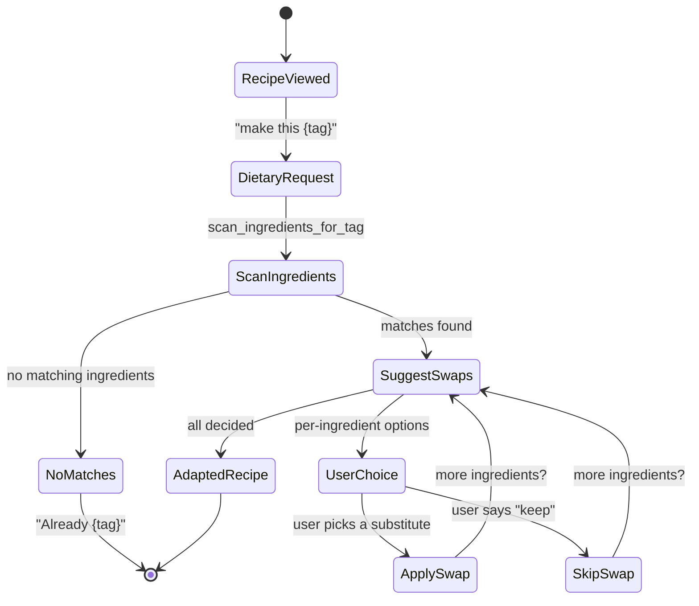
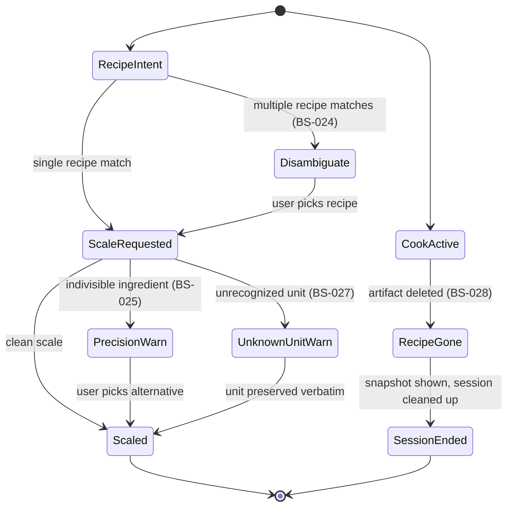
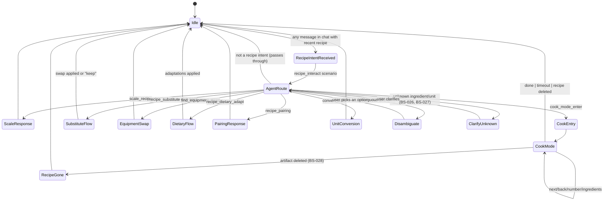

# Feature: 035 Recipe Enhancements — Serving Scaler & Cook Mode

> **Architectural alignment (added with spec 037).**
> This feature is reframed onto the LLM-Agent + Tools pattern committed to in
> [docs/smackerel.md §3.6 LLM Agent + Tools Pattern](../../docs/smackerel.md)
> and [docs/Development.md "Agent + Tool Development Discipline"](../../docs/Development.md),
> and provided by [spec 037 — LLM Scenario Agent & Tool Registry](../037-llm-agent-tools/spec.md).
>
> User-visible behavior is preserved. The mechanism by which the system
> achieves it changes:
>
> - Recipe interactions over Telegram (cook-mode entry, scaling requests,
>   ingredient questions, recipe lookup, future substitution and dietary-
>   adaptation requests) flow through scenarios on the agent runtime.
>   Users do not need to learn a fixed phrase grammar.
> - New recipe capabilities (substitutions, dietary adaptation, equipment
>   swap suggestions) MUST be addable as new scenarios + (optional) new
>   tools, NOT as new branches in regex intent code.
> - Mechanical operations remain deterministic tools: scale a quantity by a
>   factor, format a kitchen-practical fraction, look up a recipe, advance
>   a cook-mode session, fetch ingredients for a step. The trigger-pattern
>   tables in this spec describe inputs the system MUST handle, not a
>   required grammar at the surface.
> - Ingredient categorization (e.g., for shopping list grouping) MUST be
>   handled by an agent scenario consulting the knowledge graph, not by a
>   hardcoded keyword list.
>
> **Deprecated.** Any prior language in this spec or in scopes/design that
> mandates a regex-based intent router for recipe commands, a fixed phrase
> grammar as the only acceptable input form, or a keyword-based ingredient
> categorizer is deprecated. See spec 037 for the replacement capability.

## Problem Statement

Smackerel already extracts structured recipe data (ingredients with quantities/units, numbered steps with durations, servings count) via the domain extraction pipeline (spec 026). The Telegram bot displays a recipe card with timing, servings, cuisine, and up to 10 ingredients. But the extracted data stops at display — the user cannot scale a recipe to a different number of servings, and there is no way to walk through a recipe step-by-step while cooking. These are the two most common interactions people have with recipes after finding them, and both are pure transforms on data the system already has.

The serving scaler is arithmetic on the existing `servings`, `quantity`, and `unit` fields. Cook mode is a stateful walk-through of the existing `steps` array. No new extraction, no new LLM calls, no schema changes — just using what's already captured.

## Outcome Contract

**Intent:** When a user views a recipe, they can request any number of servings and see all ingredient quantities scaled accordingly. They can enter "cook mode" to receive recipe steps one at a time via Telegram, with each step showing the instruction, duration, and technique, and the ability to navigate forward, backward, or see the ingredient list at any point.

**Success Signal:** User finds a recipe for 4 servings, asks for "8 servings", and every ingredient quantity doubles correctly (including fractional amounts like "1/3 cup" → "2/3 cup"). User then says "cook" and receives step 1 of N. They reply "next" through each step, can go "back" to review a previous step, and say "done" to exit. The steps include estimated durations when available.

**Hard Constraints:**
- Single-user system; cook mode is per-chat, one active session at a time
- Scaling is a pure client-side transform on existing domain_data; no re-extraction, no LLM call
- Ingredient quantities that cannot be parsed (free-text like "a pinch") are displayed unscaled with a note
- Cook mode session times out after a configurable inactivity period (default: 2 hours)
- Steps are delivered one at a time; the system does not batch-send
- No modification to the recipe-extraction-v1 prompt contract or domain_data schema
- All existing recipe display behavior must continue to work unchanged

**Failure Condition:** If scaling produces obviously wrong quantities (doubles the servings but doesn't change amounts, or loses fractional precision), the scaler has failed. If cook mode cannot deliver steps one at a time or loses the user's position in the recipe, the feature has failed.

## Goals

- G1: Scale ingredient quantities to any positive serving count, preserving units and handling fractions
- G2: Deliver recipe steps one at a time via Telegram with navigation (next, back, ingredients, done)
- G3: Track cook mode session state per chat with configurable timeout
- G4: Expose serving scaler via REST API for the web UI
- G5: Handle edge cases: recipes with no servings count, unparseable quantities, recipes with 0 or 1 step

## Non-Goals

- Modifying the recipe extraction schema or prompt contract
- Timer functionality (sending reminders after step durations — future Telegram feature)
- Voice-activated step navigation
- Multi-recipe cook mode (cooking two recipes simultaneously)
- Nutritional scaling (scaling nutrition_per_serving — trivial to add later but not in v1)
- Persistent cook session history (which recipes the user has cooked)

---

## Actors & Personas

| Actor | Description | Key Goals | Permissions |
|-------|-------------|-----------|-------------|
| User | Person viewing and cooking recipes | Scale ingredients, walk through steps hands-free | Full access to recipe operations |
| System (Telegram Bot) | Telegram bot managing cook sessions | Deliver steps, track position, handle timeout | Read domain_data, manage session state |
| System (API) | REST API serving scaled recipe data | Return scaled ingredients on request | Read domain_data |

---

## Use Cases

### UC-001: Scale Recipe Ingredients via Telegram

- **Actor:** User
- **Preconditions:** A recipe artifact exists with domain_data containing `servings` and `ingredients` with quantities
- **Main Flow:**
  1. User views a recipe card in Telegram
  2. User sends "{N} servings" (e.g., "8 servings")
  3. System identifies the most recently displayed recipe in the chat
  4. System scales all ingredient quantities by (requested_servings / original_servings)
  5. System responds with the scaled ingredient list and a note showing the scale factor
- **Alternative Flows:**
  - A1: Recipe has no `servings` field → system responds "This recipe doesn't specify servings. I can't scale without a baseline."
  - A2: Some ingredients have unparseable quantities (e.g., "a pinch", "to taste") → displayed unchanged with "(unscaled)" note
  - A3: User requests 0 or negative servings → system responds "Servings must be at least 1"
  - A4: Scale factor produces very small fractions (e.g., 1/16 tsp) → round to nearest practical kitchen fraction (1/8, 1/4, 1/3, 1/2, etc.)
  - A5: No recent recipe in chat → system asks "Which recipe? Send a recipe link or search for one."
- **Postconditions:** User sees scaled ingredient list. Original recipe data is unchanged.

### UC-002: Scale Recipe Ingredients via API

- **Actor:** User (via web UI)
- **Preconditions:** Recipe artifact exists with domain_data
- **Main Flow:**
  1. Client sends GET /api/artifacts/{id}/domain?servings={N}
  2. System retrieves the recipe domain_data
  3. System scales ingredient quantities and returns the modified domain_data in the response
  4. Original stored data is not modified
- **Alternative Flows:**
  - A1: Artifact has no domain_data → 404
  - A2: domain_data is not a recipe → 422
  - A3: servings parameter missing → return unscaled data (no error)
  - A4: servings parameter is 0 or negative → 400
- **Postconditions:** Client receives scaled recipe data. Database unchanged.

### UC-003: Enter Cook Mode via Telegram

- **Actor:** User
- **Preconditions:** A recipe artifact exists with domain_data containing `steps`
- **Main Flow:**
  1. User sends "cook {recipe name}" or "cook" (referring to last displayed recipe)
  2. System creates a cook session for the chat, storing the recipe ID and current step (1)
  3. System sends step 1 with recipe title, step count, instruction, duration (if available), and technique (if available)
  4. System shows navigation options: "next", "back", "ingredients", "done"
- **Alternative Flows:**
  - A1: Recipe has no steps → system responds "This recipe has no steps to walk through."
  - A2: Recipe has only 1 step → system sends that step with no "next" option
  - A3: Active cook session already exists for this chat → system asks "You're cooking {current recipe}. Switch to {new recipe}?" → user confirms or cancels
  - A4: Recipe not found → system asks "Which recipe? Send a name or link."
- **Postconditions:** Cook session is active. User sees step 1.

### UC-004: Navigate Cook Mode Steps

- **Actor:** User
- **Preconditions:** Active cook session exists in the chat
- **Main Flow:**
  1. User sends "next" → system advances to next step and displays it
  2. User sends "back" or "prev" → system goes to previous step
  3. User sends "ingredients" → system shows the full ingredient list (optionally scaled if scaler was used)
  4. User sends "done" → session ends, system confirms "Cook session ended. Enjoy your meal."
  5. On final step, "next" triggers: "That was the last step. Reply 'done' when finished."
- **Alternative Flows:**
  - A1: "back" on step 1 → system says "Already at the first step."
  - A2: "next" after the last step → system says "That was the last step."
  - A3: User sends unrelated message during cook mode → cook mode is paused (session preserved), normal message handling occurs. Next "next"/"back"/"done" resumes cook mode.
  - A4: Session timeout (configurable, default 2h) → session auto-expires. Next cook command starts fresh.
  - A5: User sends a number (e.g., "3") → system jumps to step 3 directly
- **Postconditions:** User navigates through recipe steps at their own pace.

### UC-005: Cook Mode with Scaled Servings

- **Actor:** User
- **Preconditions:** Recipe artifact exists with steps and servings
- **Main Flow:**
  1. User says "cook {recipe} for 8 servings"
  2. System creates a cook session with the scale factor stored
  3. When user requests "ingredients" during cook mode, quantities are displayed scaled
  4. Steps are unaffected by scaling (instructions don't change)
- **Alternative Flows:**
  - A1: No servings specified in cook command → use original servings
- **Postconditions:** Cook session active with scaled ingredient context.

---

## Business Scenarios

### BS-001: Simple 2x Scaling
Given a recipe "Pasta Carbonara" with servings: 4 and ingredient "200g guanciale"
When the user sends "8 servings"
Then the system responds with "400g guanciale" and a note "Scaled from 4 to 8 servings (2×)"

### BS-002: Fractional Scaling
Given a recipe with servings: 4 and ingredient "1/3 cup olive oil"
When the user sends "2 servings"
Then the system responds with "2 tbsp + 2 tsp olive oil" or "⅙ cup olive oil" (nearest practical fraction)

### BS-003: Scale Down to 1 Serving
Given a recipe with servings: 6 and ingredient "3 cups flour"
When the user sends "1 serving"
Then the system responds with "½ cup flour"

### BS-004: Unparseable Quantity Preserved
Given a recipe with ingredient "salt to taste"
When the user scales to any number of servings
Then "salt to taste" is displayed unchanged with an "(unscaled)" annotation

### BS-005: No Servings Baseline
Given a recipe with no `servings` field in domain_data
When the user sends "4 servings"
Then the system responds "This recipe doesn't specify a base serving count. I can't scale without a baseline."

### BS-006: API Scaling Returns Modified Domain Data
Given a recipe artifact with id "art-123" and servings: 4
When the client sends GET /api/artifacts/art-123/domain?servings=12
Then the response contains all original domain_data fields with ingredient quantities scaled by 3×
And the response includes a `scaled_servings` field showing 12 and `scale_factor` showing "3.0"
And the stored artifact domain_data is not modified

### BS-007: Cook Mode Step 1 Display
Given a recipe "Thai Green Curry" with 6 steps, step 1: "Heat oil in a wok over high heat" (duration: 2 min, technique: "stir-frying")
When the user sends "cook Thai Green Curry"
Then the system responds:
  "Thai Green Curry · Step 1 of 6"
  "Heat oil in a wok over high heat."
  "~ 2 min · stir-frying"
  ""
  "Reply: next · back · ingredients · done"

### BS-008: Cook Mode Navigation to Last Step
Given an active cook session at step 5 of 6
When the user sends "next"
Then step 6 is displayed
And the footer says "Last step. Reply 'done' when finished."

### BS-009: Cook Mode Back at First Step
Given an active cook session at step 1
When the user sends "back"
Then the system responds "Already at the first step."

### BS-010: Cook Mode Jump to Step
Given an active cook session for a recipe with 8 steps
When the user sends "5"
Then step 5 is displayed

### BS-011: Cook Mode Ingredient Check
Given an active cook session for "Pasta Carbonara" with scaled servings (8 from original 4)
When the user sends "ingredients"
Then the full ingredient list is displayed with quantities scaled to 8 servings

### BS-012: Cook Mode Timeout
Given an active cook session with no interaction for 2 hours
When the session timeout fires
Then the session is expired and cleaned up
And if the user later sends "next", the system responds "No active cook session. Send 'cook {recipe}' to start one."

### BS-013: Cook Mode Session Replacement
Given an active cook session for "Pasta Carbonara" at step 3
When the user sends "cook Thai Green Curry"
Then the system asks "You're cooking Pasta Carbonara (step 3 of 6). Switch to Thai Green Curry?"
And if the user confirms, the old session is replaced with a new one starting at step 1

### BS-014: Cook Mode for Recipe with No Steps
Given a recipe artifact with domain_data that has ingredients but empty steps array
When the user sends "cook {recipe}"
Then the system responds "This recipe has no steps to walk through. Here are the ingredients:" followed by the ingredient list

### BS-015: Cook Mode for Recipe with Duration-less Steps
Given a recipe where steps have instructions but no duration_minutes
When the user navigates through cook mode
Then each step shows the instruction without a duration line (no "~ 0 min")

### BS-016: Scale with Mixed Units
Given a recipe with "2 cups chicken broth" and "4 tbsp soy sauce" for 4 servings
When the user scales to 8 servings
Then the response shows "4 cups chicken broth" and "8 tbsp soy sauce" (or "½ cup soy sauce" if unit upgrading is implemented)

### BS-017: Cook Mode Done Confirmation
Given an active cook session
When the user sends "done"
Then the system responds "Cook session ended. Enjoy your meal."
And the session is cleaned up

### BS-018: API Scaling with Non-Recipe Domain
Given a product artifact (domain = "product")
When the client sends GET /api/artifacts/{id}/domain?servings=4
Then the response returns 422 with error "DOMAIN_NOT_SCALABLE" — serving scaling only applies to recipes

### BS-019: Integer Quantity Stays Integer
Given a recipe with "2 eggs" for 4 servings
When the user scales to 6 servings
Then the response shows "3 eggs" (not "3.0 eggs")

### BS-020: Very Large Scale Factor
Given a recipe with servings: 2 and ingredient "1 tsp vanilla extract"
When the user scales to 100 servings
Then the system scales to "50 tsp vanilla extract" or "1 cup + 2 tbsp vanilla extract" (unit upgrade)
And no overflow or precision errors occur

### BS-021: Natural-Language Recipe Interaction Without Fixed Grammar
Given the user has just viewed a recipe "Pasta Carbonara" (4 servings)
When the user sends "make this for the 6 of us tonight" (a phrasing the
trigger-pattern tables do not literally enumerate)
Then a `recipe_interact` scenario routes the intent to the scaling tool with
servings=6 and to the cook-mode-entry tool
And the user receives the scaled ingredient list and step 1
And no regex grammar change was required to support this phrasing

### BS-022: New Recipe Capability Added Without Code Change
Given the agent runtime is deployed with the existing recipe tools
(scale_recipe, format_kitchen_quantity, get_recipe_steps, ...)
When the developer wants the system to suggest ingredient substitutions
("I'm out of pecorino — what can I use?")
Then a new scenario `recipe_substitute` is added to
`config/prompt_contracts/`, allowlisting the existing recipe-lookup tools
plus (if needed) a new read-only `find_substitutes` tool
And no Go intent-routing or grammar code is modified
And substitution requests begin working after service reload

### BS-023: Ingredient Categorization Via Scenario, Not Keywords
Given a recipe ingredient is "dragon fruit" (not in any prior keyword list)
When the meal-planning shopping-list assembly (spec 036) requests a category
for grouping
Then the `ingredient_categorize` scenario returns a category (e.g., "produce")
based on the agent's knowledge plus prior captured categorizations
And no Go keyword list is consulted as the source of truth
And adding categories for novel ingredients does not require Go changes

### BS-024: Adversarial — Ambiguous Recipe Reference
Given the user has multiple recipes named "Pasta" in the knowledge base
When the user sends "scale pasta to 6 servings"
Then the agent does NOT silently pick one
And it returns a structured disambiguation outcome listing the matching
recipes with enough context (source, last-viewed time) for the user to choose
And the user's reply identifying the recipe completes the original intent
without re-typing the scale factor

### BS-025: Adversarial — Scale That Loses Precision
Given a recipe with "1 egg" for 4 servings
When the user requests 1 serving
Then the system reports the scaled value honestly ("1/4 egg") with a note
that the user may need to round
And does NOT silently round to 0
And does NOT silently round to 1 either

### BS-026: Adversarial — Ingredient With No Known Category
Given an ingredient the system has never categorized before and no prior
captured categorization exists in the knowledge graph
When the `ingredient_categorize` scenario runs
Then it MAY return an "uncategorized" category with a rationale
OR propose a best-guess category with low confidence and ask for
confirmation in the next user-facing surface that uses the categorization
(e.g., the shopping list display in spec 036)
And the user's confirmation is captured as a future signal

### BS-027: Adversarial — Unit The System Has Never Seen
Given a recipe specifies an unusual unit (e.g., "1 punnet strawberries")
When the user asks to scale the recipe to 8 servings (from 4)
Then the system scales the numeric quantity ("2 punnet strawberries")
without rejecting the request
And the unit is preserved verbatim
And the unit-upgrade tool (if invoked) does NOT attempt to convert an
unknown unit to a known one — it leaves the unit alone

### BS-028: Adversarial — Recipe Deleted Mid-Cook-Session
Given an active cook session for a recipe artifact
When that artifact is deleted (e.g., user cleanup)
And the user sends "next"
Then the agent's cook-mode tool reports "Recipe no longer available" via a
structured outcome
And the session is cleaned up
And the user receives a single, clear message — not silent failure or a
crash trace

---

## Competitive Analysis

| Capability | Smackerel (This Spec) | Paprika | Mealime | Whisk | Allrecipes App |
|-----------|----------------------|---------|---------|-------|----------------|
| Serving scaler | Scales from extracted structured data; works on any captured recipe | Built-in for manually added recipes | Built-in for curated recipes | Built-in | Built-in for site recipes |
| Cook mode (step-by-step) | Telegram bot hands-free navigation; "next"/"back" voice-friendly | Screen-on cook mode | No | No | In-app cook mode |
| Works across sources | Any recipe from any URL or manual input | Only imported recipes | Only Mealime recipes | Limited sources | Allrecipes.com only |
| Self-hosted | Yes — fully local | No (cloud sync) | No (cloud) | No (cloud) | No (cloud) |
| Knowledge graph integration | Recipe linked to related artifacts (email about dinner, calendar event, grocery list) | Standalone | Standalone | Standalone | Standalone |

### Competitive Edge
- **Cross-source scaling:** No competitor can scale a recipe captured from an email, a photo, or a random blog — Smackerel can because extraction is source-agnostic
- **Telegram cook mode:** Hands-free step navigation via chat is unique. Competitors require screen-on apps. Telegram works with voice assistants ("Hey Siri, send next to Smackerel bot")

---

## Improvement Proposals

### IP-001: Step Timer Notifications ⭐ Competitive Edge
- **Impact:** Medium
- **Effort:** S
- **Competitive Advantage:** When a step has `duration_minutes`, offer "start timer?" — system sends a message after the duration elapses. No competitor does this in a chat interface.
- **Actors Affected:** User
- **Business Scenarios:** BS-007

### IP-002: Unit Upgrading in Scaler
- **Impact:** Medium
- **Effort:** S
- **Competitive Advantage:** When scaling produces large quantities of small units (16 tsp → 1/3 cup), auto-upgrade to the next practical unit. Reduces cognitive load.
- **Actors Affected:** User
- **Business Scenarios:** BS-016, BS-020

### IP-003: Substitution & Dietary-Adaptation Scenarios ⭐ Generic-By-Default
- **Impact:** High
- **Effort:** S (per scenario, after spec 037 ships)
- **Competitive Advantage:** "I'm out of pecorino", "make this vegetarian",
  "what if I don't have a wok?" all become individual scenario files calling
  existing recipe-lookup tools (and possibly one new `find_substitutes` tool).
  No competitor in the self-hosted recipe-app space exposes this kind of
  open-ended, additive interaction surface.
- **Actors Affected:** User
- **Business Scenarios:** BS-022, BS-024

### IP-004: Free-Form Recipe Intent Routing
- **Impact:** Medium
- **Effort:** S
- **Competitive Advantage:** A single `recipe_interact` scenario fronts all
  recipe Telegram messages, removing the need for users to memorize phrases
  like "for {N}" or "scale to {N}". Replaces the regex-based intent grammar
  in `internal/telegram/recipe_commands.go`.
- **Actors Affected:** User
- **Business Scenarios:** BS-021

---

## UI Scenario Matrix

| Scenario | Actor | Entry Point | Steps | Expected Outcome | Screen(s) |
|----------|-------|-------------|-------|-------------------|-----------|
| Scale recipe | User | Telegram: "{N} servings" | 1. View recipe 2. Send servings | Scaled ingredient list | Telegram chat |
| Scale via API | User | GET /api/artifacts/{id}/domain?servings=N | 1. Call API | Scaled domain_data JSON | API response |
| Enter cook mode | User | Telegram: "cook {recipe}" | 1. Send command 2. Receive step 1 | Step-by-step display | Telegram chat |
| Navigate steps | User | Telegram: "next"/"back"/number | 1. Send navigation | Next/previous step | Telegram chat |
| View ingredients mid-cook | User | Telegram: "ingredients" | 1. Send command during cook mode | Full (optionally scaled) ingredient list | Telegram chat |
| Exit cook mode | User | Telegram: "done" | 1. Send done | Confirmation, session cleared | Telegram chat |

---

## Non-Functional Requirements

### Performance
- Ingredient scaling must complete in < 50ms (pure arithmetic, no I/O)
- Cook mode session lookup must complete in < 10ms (in-memory map)
- API scaling response time: < 200ms including DB read

### Data Integrity
- Scaling never modifies stored domain_data — it's a read-time transform
- Cook session state is ephemeral (in-memory); loss on restart is acceptable
- ParseQuantity must handle: integers, decimals, fractions (1/3), mixed numbers (1 1/2), Unicode fractions (⅓, ½)

### Reliability
- Cook mode session timeout prevents memory leaks from abandoned sessions
- Unparseable quantities degrade gracefully (displayed unscaled, not omitted)
- If the recipe artifact is deleted mid-cook-session, next navigation returns "Recipe no longer available" and session ends

### Accessibility
- Cook mode responses use plain text, compatible with screen readers
- Step navigation commands ("next", "back", "done") are short, voice-friendly words
- Ingredient scaling output uses readable fractions ("½ cup" not "0.5 cup")

---

## UX Specification

### UX-1: Telegram Serving Scaler

#### UX-1.1: Trigger Patterns

> **MUST-handle, not exhaustive (spec 037 reframe — see UX-N4).** The
> patterns in the table below are phrasings the system MUST handle. They
> are NOT the only acceptable input grammar. Per spec 037 and BS-021 /
> IP-004, recipe Telegram intent is routed by the `recipe_interact`
> scenario; equivalent natural-language phrasings (e.g., "double it",
> "make this for 6 of us tonight", "lemme cook the carbonara thing for
> like 5 people") MUST also work without code changes. The bot MUST NOT
> respond `? I don't understand "double it". Try "8 servings".` for any
> phrasing semantically equivalent to a MUST-handle row. See UX-N1 and
> UX-N4 for the wireframe contract for unexpected phrasing.

The scaler activates on natural-language messages matching these patterns (case-insensitive):

| Pattern | Example |
|---------|---------|
| `{N} servings` | "8 servings" |
| `for {N}` | "for 6" |
| `scale to {N}` | "scale to 12" |
| `{N} people` | "3 people" |

The system resolves `{N}` as a positive integer. Decimal servings (e.g. "2.5 servings") are rejected.

Context resolution: the bot uses the most recently displayed recipe in that chat. If no recipe was displayed, the bot asks the user to identify one.

#### UX-1.2: Scaled Ingredient Response

Uses the existing text marker system. Format:

```
# Pasta Carbonara — 8 servings
~ Scaled from 4 to 8 servings (2x)

- 400g guanciale
- 8 egg yolks
- 200g pecorino romano
- 2 tsp black pepper
- 800g spaghetti
- salt to taste (unscaled)
```

Rules:
- Heading line: `# {Title} — {N} servings`
- Scale note: `~ Scaled from {original} to {requested} servings ({factor}x)`
- Each ingredient: `- {scaled_qty}{unit} {name}`
- Integer results stay integer: "3 eggs" not "3.0 eggs"
- Readable fractions: "1/2 cup" not "0.5 cup"
- Kitchen-practical rounding: nearest 1/8, 1/4, 1/3, 1/2 for volume measures
- Unparseable quantities get `(unscaled)` suffix: `- salt to taste (unscaled)`
- All ingredients shown (no 10-item cap — scaling context needs completeness)

#### UX-1.3: Fraction Display Table

| Decimal | Display |
|---------|---------|
| 0.125 | 1/8 |
| 0.167 | 1/6 |
| 0.25 | 1/4 |
| 0.333 | 1/3 |
| 0.375 | 3/8 |
| 0.5 | 1/2 |
| 0.625 | 5/8 |
| 0.667 | 2/3 |
| 0.75 | 3/4 |
| 0.875 | 7/8 |

Mixed numbers display as: `1 1/2 cup`, `2 1/3 tsp`

#### UX-1.4: Error States

**No servings baseline (BS-005):**
```
? This recipe doesn't specify a base serving count. I can't scale without a baseline.
```

**Invalid serving count (UC-001 A3):**
```
? Servings must be a whole number, at least 1.
```

**No recent recipe (UC-001 A5):**
```
? Which recipe? Send a recipe link or search with /find.
```

**Same serving count as original:**
```
> This recipe is already for 4 servings.
```

---

### UX-2: Telegram Cook Mode

#### UX-2.1: Entry

> **MUST-handle, not exhaustive (spec 037 reframe — see UX-N4).** The
> patterns in the table below are phrasings the system MUST handle. They
> are NOT the only acceptable cook-mode entry grammar. Per spec 037 and
> BS-021 / IP-004, equivalent natural-language phrasings ("let's cook
> this", "walk me through it", "lemme cook the carbonara thing for like
> 5 people") MUST also enter cook mode without code changes. The bot
> MUST NOT reject such phrasings with a "try `cook {recipe name}`"
> message. See UX-N1 and UX-N4 for the wireframe contract.

Trigger patterns (case-insensitive):

| Pattern | Example |
|---------|---------|
| `cook` | Refers to last displayed recipe |
| `cook {recipe name}` | "cook Thai Green Curry" |
| `cook {recipe} for {N} servings` | "cook carbonara for 8 servings" |

#### UX-2.2: Step Display Format

Step message format:

```
# Thai Green Curry
> Step 1 of 6

Heat oil in a wok over high heat.

~ 2 min · stir-frying

Reply: next · back · ingredients · done
```

Rules:
- Line 1: `# {Title}` (heading marker)
- Line 2: `> Step {N} of {total}` (info marker)
- Line 3: blank
- Line 4: Step instruction (plain text, no marker — it's the main content)
- Line 5: blank
- Line 6: `~ {duration} · {technique}` (continued marker) — omitted if neither duration nor technique exists
- Line 7: blank
- Line 8: `Reply: next · back · ingredients · done` (navigation hint)

Special cases:
- Duration without technique: `~ 2 min`
- Technique without duration: `~ stir-frying`
- Neither duration nor technique: line omitted entirely
- Single-step recipe: navigation hint shows only `Reply: ingredients · done`
- Last step: navigation hint changes to `Last step. Reply: back · ingredients · done`

#### UX-2.3: Navigation Commands

All commands are case-insensitive, trimmed of whitespace.

| Command | Aliases | Behavior |
|---------|---------|----------|
| `next` | `n` | Advance to next step |
| `back` | `b`, `prev`, `previous` | Return to previous step |
| `ingredients` | `ing`, `i` | Show full ingredient list |
| `done` | `d`, `stop`, `exit` | End cook session |
| `{number}` | — | Jump to step N directly |

These are intentionally short for voice input ("Hey Siri, send next to Smackerel").

#### UX-2.4: Ingredient List During Cook Mode (BS-011)

When the user sends "ingredients" during an active cook session:

```
# Thai Green Curry — Ingredients
~ 8 servings (scaled from 4)

- 400ml coconut milk
- 4 tbsp green curry paste
- 500g chicken thigh
- 2 tbsp fish sauce
- 1 tbsp palm sugar
- 6 Thai basil leaves
- salt to taste (unscaled)

Reply: next · back · done
```

If no scaling was applied, the `~ scaled` line is omitted and quantities show as extracted.

#### UX-2.5: Session Boundary Messages

**Enter cook mode — step 1 (BS-007):**
```
# Thai Green Curry
> Step 1 of 6

Heat oil in a wok over high heat.

~ 2 min · stir-frying

Reply: next · back · ingredients · done
```

**Last step reached (BS-008):**
```
# Thai Green Curry
> Step 6 of 6

Garnish with Thai basil leaves and serve over jasmine rice.

~ plating

Last step. Reply: back · ingredients · done
```

**"next" after last step (UC-004 A2):**
```
> That was the last step. Reply "done" when finished.
```

**"back" on step 1 (BS-009):**
```
> Already at the first step.
```

**Jump to step (BS-010):**
Same display as any step — `> Step 5 of 8` etc.

**Jump out of range:**
```
? This recipe has 6 steps. Pick a number from 1 to 6.
```

**Done (BS-017):**
```
. Cook session ended. Enjoy your meal.
```

#### UX-2.6: Session Replacement (BS-013)

When the user starts a new cook session while one is active:

```
? You're cooking Pasta Carbonara (step 3 of 6). Switch to Thai Green Curry?

Reply: yes · no
```

On "yes" (or "y"): old session replaced, step 1 of new recipe displayed.
On "no" (or "n"): keep current session, respond:

```
> Continuing with Pasta Carbonara. You're on step 3 of 6.
```

#### UX-2.7: Session Timeout (BS-012)

After 2 hours of inactivity (configurable via `config/smackerel.yaml` key `telegram.cook_session_timeout_minutes`, default 120), the session expires silently. No message sent on expiry.

If the user sends a cook navigation command after timeout:

```
? No active cook session. Send "cook {recipe name}" to start one.
```

#### UX-2.8: Recipe Not Found

**"cook" with no recent recipe (UC-003 A4):**
```
? Which recipe? Send a name or search with /find.
```

**"cook {name}" with no match:**
```
? I don't have a recipe called "{name}". Try /find {name} to search.
```

#### UX-2.9: Recipe With No Steps (BS-014)

```
> This recipe has no steps to walk through. Here are the ingredients:

- 200g guanciale
- 4 egg yolks
- 100g pecorino romano
- 1 tsp black pepper
- 400g spaghetti
```

#### UX-2.10: Unrelated Messages During Cook Mode (UC-004 A3)

Cook mode does not intercept all messages. Only recognized navigation commands (`next`, `back`, `ingredients`, `done`, or a bare number) are handled by the cook session. Any other message passes through to normal bot handling. The session persists — the next navigation command resumes where the user left off.

#### UX-2.11: Deleted Recipe Mid-Session

If the recipe artifact is deleted while a cook session is active:

```
? Recipe no longer available. Cook session ended.
```

---

### UX-3: REST API Serving Scaler

#### UX-3.1: Endpoint

```
GET /api/artifacts/{id}/domain?servings={N}
```

#### UX-3.2: Response Shape — Success (200)

```json
{
  "domain": "recipe",
  "title": "Pasta Carbonara",
  "servings": 8,
  "original_servings": 4,
  "scale_factor": 2.0,
  "timing": { "prep": "15 min", "cook": "20 min", "total": "35 min" },
  "cuisine": "Italian",
  "difficulty": "medium",
  "dietary_tags": ["gluten-free"],
  "ingredients": [
    { "name": "guanciale", "quantity": "400", "unit": "g", "scaled": true },
    { "name": "egg yolks", "quantity": "8", "unit": "", "scaled": true },
    { "name": "salt", "quantity": "to taste", "unit": "", "scaled": false }
  ],
  "steps": [
    { "number": 1, "instruction": "Cut guanciale into strips.", "duration_minutes": 5, "technique": "knife work" }
  ]
}
```

Notes:
- `servings` reflects the requested count; `original_servings` preserves the baseline
- `scale_factor` is a float: `requested / original`
- Each ingredient carries `"scaled": true|false` so the client can annotate unscaled items
- `steps` are returned verbatim (scaling does not affect instructions)
- All other domain_data fields pass through unchanged

#### UX-3.3: Response — No `servings` Query Param

If `servings` is omitted, return the unscaled domain_data as-is (no `scale_factor`, no `original_servings`, no `scaled` booleans on ingredients). This preserves backward compatibility.

#### UX-3.4: Error Responses

| Condition | Status | Body |
|-----------|--------|------|
| Artifact not found | 404 | `{ "error": "ARTIFACT_NOT_FOUND" }` |
| No domain_data | 404 | `{ "error": "NO_DOMAIN_DATA" }` |
| Domain is not "recipe" | 422 | `{ "error": "DOMAIN_NOT_SCALABLE", "message": "Serving scaling only applies to recipes" }` |
| servings <= 0 | 400 | `{ "error": "INVALID_SERVINGS", "message": "Servings must be a positive integer" }` |
| servings not an integer | 400 | `{ "error": "INVALID_SERVINGS", "message": "Servings must be a positive integer" }` |
| Recipe has no base servings | 422 | `{ "error": "NO_BASELINE_SERVINGS", "message": "Recipe does not specify a base serving count" }` |

---

### UX-4: ASCII Wireframes

#### UX-4.1: Telegram — Recipe Card + Scale Prompt

```
+------------------------------------------+
| # Recipe Details                         |
| > Prep: 15 min | Cook: 20 min            |
| > Servings: 4                            |
| > Cuisine: Italian                       |
|                                          |
| # Ingredients                            |
| - 200g guanciale                         |
| - 4 egg yolks                            |
| - 100g pecorino romano                   |
| - 1 tsp black pepper                     |
| - 400g spaghetti                         |
+------------------------------------------+
          |
          | User sends: "8 servings"
          v
+------------------------------------------+
| # Pasta Carbonara — 8 servings           |
| ~ Scaled from 4 to 8 servings (2x)      |
|                                          |
| - 400g guanciale                         |
| - 8 egg yolks                            |
| - 200g pecorino romano                   |
| - 2 tsp black pepper                     |
| - 800g spaghetti                         |
+------------------------------------------+
```

#### UX-4.2: Telegram — Cook Mode Flow

```
User: "cook Thai Green Curry"
          |
          v
+------------------------------------------+
| # Thai Green Curry                       |
| > Step 1 of 6                            |
|                                          |
| Heat oil in a wok over high heat.        |
|                                          |
| ~ 2 min · stir-frying                    |
|                                          |
| Reply: next · back · ingredients · done  |
+------------------------------------------+
          |
          | User sends: "next"
          v
+------------------------------------------+
| # Thai Green Curry                       |
| > Step 2 of 6                            |
|                                          |
| Add curry paste and fry until fragrant.  |
|                                          |
| ~ 3 min · stir-frying                    |
|                                          |
| Reply: next · back · ingredients · done  |
+------------------------------------------+
          |
          | User sends: "ingredients"
          v
+------------------------------------------+
| # Thai Green Curry — Ingredients         |
|                                          |
| - 400ml coconut milk                     |
| - 4 tbsp green curry paste               |
| - 500g chicken thigh                     |
| - 2 tbsp fish sauce                      |
| - 1 tbsp palm sugar                      |
| - 6 Thai basil leaves                    |
|                                          |
| Reply: next · back · done               |
+------------------------------------------+
          |
          | User sends: "next" (x4, reaching step 6)
          v
+------------------------------------------+
| # Thai Green Curry                       |
| > Step 6 of 6                            |
|                                          |
| Garnish with basil and serve over rice.  |
|                                          |
| ~ plating                                |
|                                          |
| Last step. Reply: back · ingredients ·   |
|   done                                   |
+------------------------------------------+
          |
          | User sends: "done"
          v
+------------------------------------------+
| . Cook session ended. Enjoy your meal.   |
+------------------------------------------+
```

#### UX-4.3: Telegram — Session Replacement

```
User has active session: Pasta Carbonara, step 3 of 6

User: "cook Thai Green Curry"
          |
          v
+------------------------------------------+
| ? You're cooking Pasta Carbonara         |
|   (step 3 of 6). Switch to              |
|   Thai Green Curry?                      |
|                                          |
| Reply: yes · no                          |
+------------------------------------------+
          |
          | User sends: "yes"
          v
+------------------------------------------+
| # Thai Green Curry                       |
| > Step 1 of 6                            |
|   ...                                    |
+------------------------------------------+
```

#### UX-4.4: Telegram — Error States

```
No servings baseline:
+------------------------------------------+
| ? This recipe doesn't specify a base     |
|   serving count. I can't scale without   |
|   a baseline.                            |
+------------------------------------------+

No steps:
+------------------------------------------+
| > This recipe has no steps to walk       |
|   through. Here are the ingredients:     |
|                                          |
| - 200g guanciale                         |
| - 4 egg yolks                            |
| - ...                                    |
+------------------------------------------+

Session expired:
+------------------------------------------+
| ? No active cook session. Send           |
|   "cook {recipe name}" to start one.    |
+------------------------------------------+
```

---

### UX-5: Interaction State Machine

```
                     ┌──────────┐
              ┌──────│  Idle    │◄──── timeout (2h)
              │      └────┬─────┘          │
              │           │                │
    "N servings"    "cook {recipe}"        │
              │           │                │
              v           v                │
     ┌────────────┐  ┌──────────┐          │
     │  Scaling   │  │ Confirm? │──no──►───┘
     │  Response  │  │ (if active│          │
     └────────────┘  │ session) │          │
                     └────┬─────┘          │
                      yes │                │
                          v                │
                   ┌──────────┐            │
            ┌──────│ Cook Mode│────────────┘
            │      │ Step N   │
            │      └──┬───┬───┘
            │    next/│   │back/
            │    num  │   │prev
            │         v   v
            │      ┌────────┐
            │      │Step N±1│
            │      └────────┘
            │
       "ingredients"      "done"
            │                │
            v                v
     ┌──────────┐    ┌──────────┐
     │Ingredient│    │  Done    │
     │  List    │    │  (Idle)  │
     └──────────┘    └──────────┘
```

---

### UX-6: Personality Compliance Checklist

All Telegram responses must comply with SOUL.md (docs/smackerel.md §13.1):

| Rule | Application |
|------|------------|
| No exclamation marks | "Enjoy your meal." not "Enjoy your meal!" |
| No "Great question!" opener | Never used in any response |
| No "Let me know if you need anything else!" | Never used |
| No process explanation | "Scaled from 4 to 8 servings (2x)" not "I analyzed the ingredients and scaled each quantity by a factor of 2" |
| Plain text only | No markdown bold/italic — Telegram plain text rendering |
| Brief and direct | Error messages are one sentence. Step display is the instruction, not a preamble about the instruction |
| Warm but minimal | "Enjoy your meal." is the only warmth; no "Happy cooking" or "Bon appetit" |

---

### UX-7: Configuration Surface

All UX-relevant configuration lives in `config/smackerel.yaml`:

| Key | Type | Default | Purpose |
|-----|------|---------|---------|
| `telegram.cook_session_timeout_minutes` | int | 120 | Inactivity timeout before cook session auto-expires |
| `telegram.cook_session_max_per_chat` | int | 1 | Max concurrent cook sessions per chat (always 1 in v1) |

No new environment variables. Config flows through the existing `config generate` pipeline.

---

### UX-N1: Free-Form Recipe Intent Routing

**Drives:** BS-021, IP-004
**Front-door scenario:** `recipe_interact` (spec 037)

All wireframes in UX-N1..UX-N5 use the same Telegram plain-text marker
conventions as §UX-1.2 / §UX-2.2 (`#` heading, `>` info, `~` continued,
`?` warning, `.` confirmation, `-` list).

#### UX-N1.1: Routing Contract

When the user sends a message in a Telegram chat where a recipe was recently
displayed, the bot routes the message through the `recipe_interact` scenario.
The scenario inspects the message + recent-recipe context and decides which
recipe tool(s) to call. The user does not have to use any specific phrase.

**MUST handle (illustrative, not exhaustive):**

| Intent class | Example phrasing | Tool(s) the agent calls |
|--------------|------------------|--------------------------|
| Scale | "8 servings", "for 6", "double it", "lemme cook the carbonara thing for like 5 people", "make this for the 6 of us tonight" | `scale_recipe`, optionally `cook_mode_enter` |
| Enter cook mode | "cook this", "let's cook", "walk me through it", "start cooking carbonara" | `cook_mode_enter` |
| Substitute ingredient | "I'm out of pecorino", "what can I use instead of guanciale?", "make this dairy-free" | `find_substitutes` (new tool, IP-003) + `recipe_substitute` scenario |
| Equipment swap | "I don't have a stand mixer, what can I use?", "no wok — alternatives?" | `find_equipment_swap` (new tool, IP-003) |
| Pairing | "what goes well with this for a side?", "what wine pairs?" | `recipe_pairing` scenario + knowledge-graph lookup |
| Unit conversion | "convert this to metric", "how much is that in grams?" | `convert_units` tool |
| Partial scaling | "half this but keep eggs whole" | `scale_recipe` with per-ingredient overrides + agent reasoning about indivisible units |
| Disambiguation reply | "the chicken one", "yes", "no" | scenario continues prior outcome |

#### UX-N1.2: Wireframe — Unexpected Phrasing Routed Correctly

```
+-------------------------------------------------------------+
| User just viewed: Pasta Carbonara (4 servings)             |
+-------------------------------------------------------------+

User -> Bot:
  "lemme cook the carbonara thing for like 5 people"

          |
          | recipe_interact scenario routes:
          |   - scale_recipe(recipe=carbonara, servings=5)
          |   - cook_mode_enter(recipe=carbonara, scale_factor=1.25)
          v

+-------------------------------------------------------------+
| # Pasta Carbonara — 5 servings                              |
| ~ Scaled from 4 to 5 servings (1.25x)                       |
|                                                             |
| - 250g guanciale                                            |
| - 5 egg yolks                                               |
| - 125g pecorino romano                                      |
| - 1 1/4 tsp black pepper                                    |
| - 500g spaghetti                                            |
| - salt to taste (unscaled)                                  |
+-------------------------------------------------------------+
+-------------------------------------------------------------+
| # Pasta Carbonara                                           |
| > Step 1 of 5                                               |
|                                                             |
| Cut guanciale into strips.                                  |
|                                                             |
| ~ 5 min · knife work                                        |
|                                                             |
| Reply: next · back · ingredients · done                     |
+-------------------------------------------------------------+
```

**Interactions:**
- The agent infers servings=5 from "for like 5 people" and combined intent
  (scale + cook) from "lemme cook ... for".
- No regex change is required to accept this phrasing.

**States:**
- Confident routing → execute both tools, return both responses.
- Low-confidence routing → fall back to disambiguation (see UX-N3.1).

#### UX-N1.3: Wireframe — Unit Conversion Intent

```
User just viewed: Banana Bread (uses cups, oz, °F)

User -> Bot:
  "convert this to metric"

          |
          | recipe_interact -> convert_units(target="metric")
          v

+-------------------------------------------------------------+
| # Banana Bread — metric                                     |
| ~ Converted from US customary to metric                     |
|                                                             |
| - 240g flour (was 2 cups)                                   |
| - 200g sugar (was 1 cup)                                    |
| - 113g butter (was 4 oz)                                    |
| - 2 eggs                                                    |
| - 3 ripe bananas                                            |
|                                                             |
| Oven: 175°C (was 350°F)                                     |
+-------------------------------------------------------------+
```

#### UX-N1.4: Wireframe — Partial Scaling With Indivisibles

```
User just viewed: Lemon Tart (4 servings, 3 eggs, 200g sugar, 1 lemon)

User -> Bot:
  "half this but keep eggs whole"

          |
          | recipe_interact -> scale_recipe(
          |   factor=0.5,
          |   per_ingredient_overrides={"eggs": "keep_original"})
          v

+-------------------------------------------------------------+
| # Lemon Tart — 2 servings                                   |
| ~ Scaled from 4 to 2 (0.5x), eggs kept at 3 per request     |
|                                                             |
| - 100g sugar                                                |
| - 3 eggs (kept whole as requested)                          |
| - 1/2 lemon                                                 |
| - 75g flour                                                 |
+-------------------------------------------------------------+
```

**Accessibility:**
- The `~` annotation line MUST explain any deviation from straight scaling
  so screen-reader users understand why eggs did not halve.

---

### UX-N2: Substitution & Dietary Adaptation Flows

**Drives:** BS-022, IP-003
**Scenarios:** `recipe_substitute`, `recipe_dietary_adapt`
**Tools (new, read-only):** `find_substitutes`, `find_equipment_swap`

#### UX-N2.1: Wireframe — Single-Ingredient Substitution

```
User just viewed: Pasta Carbonara

User -> Bot:
  "I'm out of pecorino, what can I use?"

          |
          | recipe_substitute -> find_substitutes(
          |   ingredient="pecorino romano",
          |   role="finishing cheese, salty/sharp",
          |   dietary_constraints=[])
          v

+-------------------------------------------------------------+
| > Substitutes for pecorino romano (100g)                    |
|                                                             |
| - parmigiano reggiano (100g) — closest match, slightly      |
|   nuttier, less sharp                                       |
| - grana padano (100g) — milder, very common                 |
| - aged manchego (90g) — sheep's milk like pecorino,         |
|   different flavor profile                                  |
|                                                             |
| Reply with the name to swap it in, or "keep" to leave as is |
+-------------------------------------------------------------+

User -> Bot:
  "parmigiano"

          |
          | recipe_substitute applies swap
          v

+-------------------------------------------------------------+
| . Swapped: pecorino romano -> parmigiano reggiano (100g)    |
|                                                             |
| Updated ingredient list:                                    |
| - 200g guanciale                                            |
| - 4 egg yolks                                               |
| - 100g parmigiano reggiano                                  |
| - 1 tsp black pepper                                        |
| - 400g spaghetti                                            |
+-------------------------------------------------------------+
```

**Interactions:**
- Each suggestion shows an adjusted quantity (the substitution tool may
  recommend a different amount, e.g., 90g manchego for 100g pecorino).
- Each suggestion shows a one-line reasoning string so the user understands
  the trade-off.
- Swap is non-destructive: original recipe stored data is unchanged; the
  swap applies to the current chat-scoped view only.

#### UX-N2.2: Wireframe — Equipment Swap

```
User just viewed: Brioche (calls for stand mixer)

User -> Bot:
  "I don't have a stand mixer, what can I use?"

          |
          | recipe_interact -> find_equipment_swap(equipment="stand mixer")
          v

+-------------------------------------------------------------+
| > Alternatives to stand mixer for this recipe               |
|                                                             |
| - hand mixer with dough hooks — works but tires the motor;  |
|   knead in 2-min bursts                                     |
| - food processor (dough blade) — fast; pulse to avoid       |
|   overheating the dough                                     |
| - by hand — slap-and-fold, expect 15-20 min of kneading     |
|                                                             |
| Reply: next · back · ingredients · done                     |
+-------------------------------------------------------------+
```

**Interactions:**
- Equipment swap does NOT mutate the recipe steps; it adds an inline
  advisory message above the existing cook-mode controls.

#### UX-N2.3: Wireframe — Dietary Adaptation (Whole-Recipe Scan)

```
User just viewed: Pasta Carbonara

User -> Bot:
  "make this dairy-free"

          |
          | recipe_dietary_adapt scenario:
          |   1. scan_ingredients_for_tag(tag="dairy")
          |   2. find_substitutes(per matched ingredient,
          |      dietary_constraints=["dairy-free"])
          v

+-------------------------------------------------------------+
| > Dairy-free adaptation                                     |
|                                                             |
| Found 1 dairy ingredient:                                   |
|                                                             |
| - 100g pecorino romano                                      |
|     -> 80g nutritional yeast + 1 tsp miso (umami + salt)    |
|     -> 100g vegan parmesan (store-bought)                   |
|                                                             |
| Note: traditional carbonara uses no cream. Eggs are not     |
| dairy and stay as-is.                                       |
|                                                             |
| Reply: "use yeast", "use vegan parm", or "keep" to skip     |
+-------------------------------------------------------------+

User -> Bot:
  "use yeast"

          |
          v

+-------------------------------------------------------------+
| . Adapted to dairy-free.                                    |
|                                                             |
| - 200g guanciale                                            |
| - 4 egg yolks                                               |
| - 80g nutritional yeast + 1 tsp miso                        |
| - 1 tsp black pepper                                        |
| - 400g spaghetti                                            |
|                                                             |
| Tag applied: dairy-free                                     |
+-------------------------------------------------------------+
```

**States:**
- Empty state (no matching ingredients): `> Already dairy-free. No changes needed.`
- Multi-match state: each matched ingredient gets its own choose-one block.
- Partial state: user can accept some swaps and skip others; unaccepted
  ingredients remain unchanged with a `(not adapted)` annotation.

#### UX-N2.4: Mermaid Flow — Dietary Adaptation



#### UX-N2.5: Wireframe — Pairing Suggestion

**Trigger:** user asks what to serve alongside the current recipe.
**Scenario:** `recipe_pairing` (consults knowledge graph for cuisine,
dietary tags, season, prior-cooked pairings).

```
User just viewed: Pasta Carbonara (Italian, 4 servings)

User -> Bot:
  "what goes well with this for a side?"

          |
          | recipe_interact -> recipe_pairing(
          |   recipe=carbonara,
          |   role="side",
          |   constraints={cuisine: "Italian", dietary: []})
          v

+-------------------------------------------------------------+
| > Side dish pairings for Pasta Carbonara                    |
|                                                             |
| - Simple green salad with lemon vinaigrette                 |
|     > cuts the richness; ~ 5 min, no cook                   |
| - Roasted broccolini with chili and garlic                  |
|     > Italian-aligned; ~ 15 min                             |
|     > you cooked this on 2026-03-22                         |
| - Crusty bread + good olive oil                             |
|     > traditional; no recipe needed                         |
|                                                             |
| Reply with a number to open that recipe, or "more" for      |
| wine / drink pairings                                       |
+-------------------------------------------------------------+

User -> Bot:
  "more"

          |
          | recipe_pairing(role="drink")
          v

+-------------------------------------------------------------+
| > Drink pairings for Pasta Carbonara                        |
|                                                             |
| - Frascati (dry white, Lazio) — regional match              |
| - Pinot Grigio — widely available, clean                    |
| - Sparkling water with lemon — non-alcoholic                |
+-------------------------------------------------------------+
```

**Rules:**
- Pairings MUST be drawn from the user's knowledge graph (prior recipes,
  dietary preferences, what's in season) — never a hardcoded list.
- Each suggestion shows a one-line reason so the user understands why.
- A pairing the user has previously cooked MUST be annotated with the
  most recent cook date so they can recognize repeats.
- Empty state (no graph data yet): `> Not enough cooking history to suggest sides. Try /find {cuisine}.`
- Pairing does NOT mutate the source recipe; suggestions are advisory.

---

### UX-N3: Adversarial UX

This section covers the adversarial business scenarios added in the spec
037 reframe (BS-024, BS-025, BS-026, BS-027, BS-028). Each maps to a
structured outcome from an agent tool — never a silent failure.

#### UX-N3.1: Ambiguous Recipe Reference (BS-024)

**Trigger:** user references a recipe by name (or vague pronoun) and the
recipe-lookup tool finds more than one match.

```
User -> Bot:
  "scale pasta to 6 servings"        (or "cook the chicken one")

          |
          | recipe_lookup returns multiple matches
          | recipe_interact returns disambiguation outcome
          v

+-------------------------------------------------------------+
| ? I have 3 recipes that match "pasta". Which one?           |
|                                                             |
| 1. Pasta Carbonara                                          |
|    > Italian, 4 servings, last viewed 2 days ago            |
|    > from: silvia-recipes.it (captured 2026-04-12)          |
|                                                             |
| 2. Pasta alla Norma                                         |
|    > Sicilian, 4 servings, last viewed 3 weeks ago          |
|    > from: telegram share (captured 2026-03-30)             |
|                                                             |
| 3. Pasta with Lemon and Olive Oil                           |
|    > Italian, 2 servings, last viewed never                 |
|    > from: nytimes.com (captured 2026-04-20)                |
|                                                             |
| Reply: 1, 2, or 3 — or send a more specific name            |
+-------------------------------------------------------------+

User -> Bot:
  "1"

          |
          | scenario completes original intent
          | (scale_recipe applied to Pasta Carbonara, servings=6)
          v

+-------------------------------------------------------------+
| # Pasta Carbonara — 6 servings                              |
| ~ Scaled from 4 to 6 servings (1.5x)                        |
|                                                             |
| - 300g guanciale                                            |
| - 6 egg yolks                                               |
| - 150g pecorino romano                                      |
| - 1 1/2 tsp black pepper                                    |
| - 600g spaghetti                                            |
+-------------------------------------------------------------+
```

**Rules:**
- The agent generates the short descriptor lines (`> Italian, 4 servings,
  last viewed 2 days ago`) from artifact metadata; they are not stored
  fixed strings.
- The user's reply with `1` / `2` / `3` MUST complete the original intent
  (`scale to 6 servings`) without the user re-typing `to 6 servings`.
- The agent MUST NOT silently pick a default.
- Empty state: zero matches → `? I don't have a recipe matching "pasta". Try /find pasta to search.`

#### UX-N3.2: Precision Loss On Scale (BS-025)

**Trigger:** scaling produces a fractional quantity of an indivisible
ingredient (eggs, whole spices, garlic cloves, etc.).

```
User just viewed: Vanilla Custard (4 servings, "1 egg")

User -> Bot:
  "1 serving"

          |
          | scale_recipe detects indivisible ingredient
          v

+-------------------------------------------------------------+
| # Vanilla Custard — 1 serving                               |
| ~ Scaled from 4 to 1 (0.25x)                                |
|                                                             |
| - 1/4 egg  (heads up: hard to measure)                      |
|     Options:                                                |
|       a) round up to 1 whole egg — richer custard           |
|       b) use 1 tbsp beaten egg (~ 1/4 of a large egg)       |
|       c) use 1 tbsp egg whites only — leaner result         |
|     Reply: a, b, or c — or "keep" to leave as 1/4 egg       |
| - 60ml milk                                                 |
| - 12g sugar                                                 |
| - 1/4 tsp vanilla extract                                   |
+-------------------------------------------------------------+
```

**Rules:**
- The agent MUST NOT silently round 1/4 egg to 0 (hides the ingredient).
- The agent MUST NOT silently round 1/4 egg to 1 (changes the recipe).
- It MUST report the honest scaled value AND offer agent-reasoned
  alternatives whose trade-offs are explained.
- "keep" preserves the literal `1/4 egg` line with the heads-up note.

#### UX-N3.3: Unknown Ingredient Category (BS-026)

**Trigger:** the `ingredient_categorize` scenario sees an ingredient with
no prior categorization in the knowledge graph (e.g., "yuzu kosho",
"black garlic"). Surfaces in the meal-planning shopping list (spec 036).

```
+-------------------------------------------------------------+
| # Shopping List — Week of Apr 27                            |
|                                                             |
| ## Produce                                                  |
| - 2 lemons                                                  |
| - 1 bunch parsley                                           |
|                                                             |
| ## Pantry                                                   |
| - 200g spaghetti                                            |
|                                                             |
| ## Uncategorized  (?)                                       |
| - 1 jar yuzu kosho                                          |
|     > Best guess: pantry/condiments (low confidence)        |
|     > Reply "yuzu kosho is produce" or "yuzu kosho is       |
|       pantry" to teach the system                           |
+-------------------------------------------------------------+
```

**Rules:**
- The shopping list MUST NOT drop the ingredient.
- The `Uncategorized` group is rendered with a `(?)` marker so the user
  notices.
- Each uncategorized item shows the agent's best-guess category and
  confidence indicator (`low confidence` text marker).
- The user's correction is captured by spec 037's signal-capture path
  and used as future input to `ingredient_categorize`. It does NOT
  require a code change.

#### UX-N3.4: Unknown Unit (BS-027)

**Trigger:** scaling encounters an unfamiliar unit (e.g., "1 punnet
strawberries", "2 nubs ginger").

```
User just viewed: Pavlova (4 servings, "1 punnet strawberries")

User -> Bot:
  "8 servings"

          |
          | scale_recipe scales numeric quantity, preserves unit verbatim
          v

+-------------------------------------------------------------+
| # Pavlova — 8 servings                                      |
| ~ Scaled from 4 to 8 servings (2x)                          |
|                                                             |
| - 6 egg whites                                              |
| - 300g caster sugar                                         |
| - 2 punnet strawberries                                     |
|     > "punnet" left as-is (unit unrecognized)               |
| - 500ml double cream                                        |
+-------------------------------------------------------------+
```

**Optional follow-up (only if the user asks):**

```
User -> Bot:
  "what's a punnet?"

          |
          | recipe_interact -> convert_units in clarification mode
          v

+-------------------------------------------------------------+
| > A punnet is a small basket, typically 250g of berries     |
| in the UK / AU. Want me to switch the recipe to "500g       |
| strawberries" instead?                                      |
|                                                             |
| Reply: yes · no                                             |
+-------------------------------------------------------------+
```

**Rules:**
- Scaling MUST NOT reject an unknown unit.
- The unit MUST be preserved verbatim (no silent conversion).
- The annotation `> "punnet" left as-is (unit unrecognized)` is required
  so the user notices.

#### UX-N3.5: Recipe Deleted Mid-Cook (BS-028)

**Trigger:** the recipe artifact backing an active cook session is
deleted (manual cleanup, retention policy, etc.).

```
User has active session: Pasta Carbonara, step 3 of 6
Artifact deleted (out-of-band)

User -> Bot:
  "next"

          |
          | cook_mode tool returns RECIPE_NOT_FOUND structured outcome
          v

+-------------------------------------------------------------+
| ? Recipe no longer available — it was deleted while you     |
|   were cooking.                                             |
|                                                             |
| > You were on step 3 of 6: "Whisk eggs and pecorino in a    |
|   bowl." (cached snapshot)                                  |
|                                                             |
| > Cook session ended. Send "cook {recipe name}" to start a  |
|   new one, or /find to search.                              |
+-------------------------------------------------------------+
```

**Rules:**
- The user MUST see one clear message — not silent failure, not a crash
  trace, not a generic error.
- The agent MUST surface the cached snapshot of the user's last seen step
  so the cooking-in-progress is not lost.
- The session is cleaned up after this message — subsequent navigation
  commands fall back to the standard "no active cook session" message
  from §UX-2.7.

#### UX-N3.6: Mermaid Flow — Adversarial Outcomes



---

### UX-N4: Trigger-Table Reframe Annotation

The trigger-pattern tables in §UX-1.1 (scaler) and §UX-2.1 (cook mode
entry) are **MUST-handle examples**, not the only valid grammar. This
section binds the contract; the disclaimers in §UX-1.1 and §UX-2.1
reference UX-N4 as the source of truth.

| Spec table | Reframe |
|------------|---------|
| §UX-1.1 scaler triggers | Examples the system MUST handle. The `recipe_interact` scenario MUST also handle equivalent natural-language phrasing without code change (BS-021, IP-004). |
| §UX-2.1 cook entry triggers | Examples the system MUST handle. Equivalent phrasings ("let's cook this", "walk me through it", "lemme cook the carbonara thing for like 5 people") MUST also enter cook mode. |
| §UX-2.3 navigation commands | Stays exact. These are short voice-friendly commands inside an active cook session and the alias table is the source of truth. |

**Wireframe — Unexpected scaler phrasing (mirrors UX-N1.2 but scaler-only):**

```
User just viewed: Pasta Carbonara (4 servings)

User -> Bot:
  "double it"

          |
          | recipe_interact -> scale_recipe(factor=2)
          v

+-------------------------------------------------------------+
| # Pasta Carbonara — 8 servings                              |
| ~ Scaled from 4 to 8 servings (2x)                          |
|                                                             |
| - 400g guanciale                                            |
| - 8 egg yolks                                               |
| - 200g pecorino romano                                      |
| - 2 tsp black pepper                                        |
| - 800g spaghetti                                            |
+-------------------------------------------------------------+
```

The bot must NOT respond `? I don't understand "double it". Try "8 servings".`

---

### UX-N5: Updated Interaction State Machine (Agent-Routed)

Supersedes the simplified state machine in §UX-5 for any
recipe-Telegram interaction that flows through `recipe_interact`. The
§UX-5 diagram is preserved as the legacy reference.



**Rules:**
- Inside `CookMode`, navigation commands (`next`, `back`, `done`,
  `ingredients`, bare number) bypass `recipe_interact` and go straight to
  the cook-mode tool — see §UX-2.10. This preserves the existing short,
  voice-friendly contract.
- Outside `CookMode`, recipe-context messages flow through
  `recipe_interact` so new capabilities (substitution, equipment swap,
  pairing, conversion) are added by adding scenarios, not by changing the
  router.

---

### UX-N6: Scenario-to-Wireframe Cross-Reference

| Scenario | Wireframe |
|----------|-----------|
| BS-021 (free-form intent) | UX-N1.2, UX-N4 |
| BS-022 (additive scenarios) | UX-N2.1, UX-N2.2, UX-N2.3, UX-N2.5 |
| BS-023 (agent-based ingredient categorization) | UX-N3.3 |
| BS-024 (ambiguous recipe reference) | UX-N3.1 |
| BS-025 (precision loss on scale) | UX-N3.2 |
| BS-026 (unknown category) | UX-N3.3 |
| BS-027 (unknown unit) | UX-N3.4 |
| BS-028 (recipe deleted mid-cook) | UX-N3.5 |
| IP-003 (substitution / dietary) | UX-N2.1, UX-N2.2, UX-N2.3, UX-N2.4, UX-N2.5 |
| IP-004 (free-form intent routing) | UX-N1.1, UX-N1.2, UX-N4, UX-N5 |

---

## Open Questions

1. **Unit upgrading:** Should the scaler convert 16 tsp to ~1/3 cup, or always preserve the original unit? (Recommendation: preserve original unit in v1, add unit upgrading as IP-002)
2. **Cook mode persistence:** Should cook sessions survive a bot restart? (Recommendation: no — ephemeral in-memory is simpler and losing a cook position is a minor inconvenience)
3. **Cook mode in web UI:** Should cook mode also work in the web UI? (Recommendation: yes in the future, but Telegram-only in v1 since the web UI doesn't have a real-time messaging model yet)
4. **Substitution rendering depth (UX-N2.1).** Should each substitute show only one-line reasoning (current draft) or also link to the underlying knowledge-graph artifact that justified it? (Recommendation: one-line in v1; deep link is a follow-up.)
5. **Disambiguation max options (UX-N3.1).** UX-N3.1 caps the visible list at 3. What if the agent finds 8 matches? (Recommendation: show top 3 by recency/relevance, append `> 5 more — reply "more" to see them`.)
6. **"keep" semantics across flows.** UX-N2.1, UX-N2.3, UX-N3.2 all use `keep`. Is that consistent enough or should each flow have its own verb? (Recommendation: keep `keep` consistent; it is short and voice-friendly.)
7. **Snapshot retention for BS-028 (UX-N3.5).** UX-N3.5 shows a cached snapshot of the last viewed step. How long should the snapshot persist after deletion? (Recommendation: until the cook session is cleaned up — i.e., until the session-ending message is sent.)
