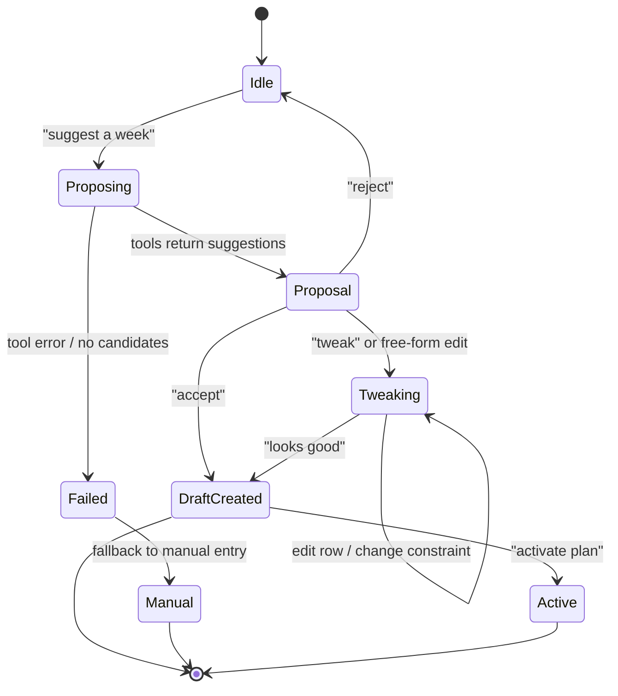
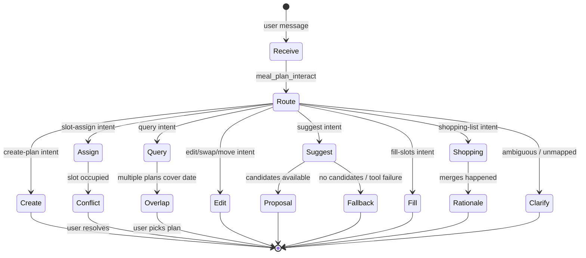
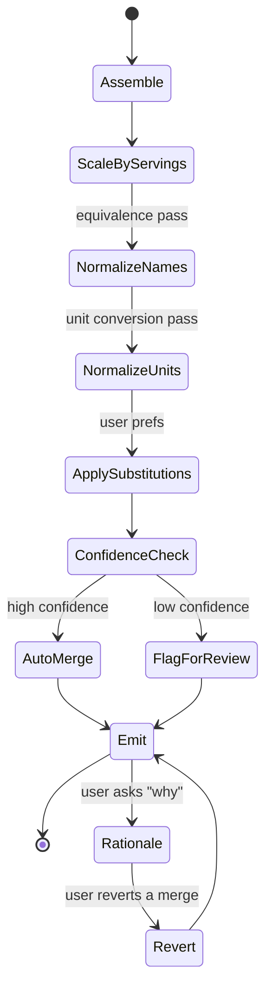

# Feature: 036 Meal Planning Calendar

> **Architectural alignment (added with spec 037).**
> This feature is reframed onto the LLM-Agent + Tools pattern committed to in
> [docs/smackerel.md §3.6 LLM Agent + Tools Pattern](../../docs/smackerel.md)
> and [docs/Development.md "Agent + Tool Development Discipline"](../../docs/Development.md),
> and provided by [spec 037 — LLM Scenario Agent & Tool Registry](../037-llm-agent-tools/spec.md).
>
> User-visible behavior is preserved. The mechanism by which the system
> achieves it changes:
>
> - Plan creation, slot assignment, daily and weekly queries, plan
>   activation, and plan repetition flow through scenarios on the agent
>   runtime. Users do not need to learn a fixed phrase grammar.
> - Shopping list generation flows through a `shopping_list_assemble`
>   scenario that calls deterministic tools (recipe ingredient lookup,
>   ingredient categorization, quantity merging, unit normalization).
>   Substitution awareness, near-duplicate merging, and category-based
>   organization are decisions the scenario makes — not pure string-match
>   aggregation.
> - New planning capabilities — "suggest a week of meals from my
>   preferences", "fill the empty slots in this plan", "what would I cook
>   if I had 30 minutes tonight" — MUST be addable as new scenarios +
>   (optional) new tools, NOT as new branches in regex command code.
> - Mechanical operations remain deterministic tools: assign a recipe to a
>   slot, look up plan slots in a date range, scale a recipe's ingredients,
>   create a CalDAV event, perform schema-bound CRUD on plans and slots.
>
> **Deprecated.** Any prior language in this spec or in scopes/design that
> mandates a regex-based intent router for meal-plan commands, a fixed
> phrase grammar as the only acceptable input form, or a pure string-match
> shopping list aggregator with no agent involvement is deprecated. See
> spec 037 for the replacement capability.

## Problem Statement

Smackerel captures recipes, extracts structured ingredients and steps (spec 026), generates shopping lists from selected recipes (spec 028), and will soon support serving scaling and cook mode (spec 035). But there is no mechanism to plan *when* to cook *what*. A user who collects 20 recipes over a month has no way to assign them to days of the week, generate a consolidated shopping list for the week's meals, or see a calendar view of their meal plan. They fall back to separate apps (Mealime, Paprika) or paper, breaking the knowledge graph's ability to connect meal planning with grocery expenses (spec 034), calendar events, and cooking sessions.

The building blocks exist: recipes with structured data, shopping list generation from recipes, calendar ingestion via CalDAV (spec 003), the actionable lists framework, and serving scaling. Meal planning is the composition layer that ties them together — assigning recipes to date+meal slots and projecting the plan into shopping lists and calendar events.

## Outcome Contract

**Intent:** Users can create weekly meal plans by assigning recipe artifacts to date+meal slots (breakfast, lunch, dinner, snack). The system generates a consolidated shopping list for the planned period, accounts for serving counts per meal, and optionally creates CalDAV events for meal prep. Plans are editable, repeatable, and queryable ("what's for dinner Tuesday?").

**Success Signal:** User creates a week plan: Monday dinner = Pasta Carbonara (4 servings), Tuesday dinner = Thai Green Curry (2 servings), Wednesday lunch = Caesar Salad (2 servings). System generates a single shopping list with all ingredients merged and scaled. User asks "what's for dinner tomorrow?" and gets the right answer. Shopping list from the plan includes quantities aggregated across all planned meals.

**Hard Constraints:**
- Meal plans are projections over recipe artifacts, not copies — if a recipe's domain_data updates, the plan reflects the update
- Shopping list generation reuses the existing list framework (spec 028) and recipe aggregator
- Calendar event creation uses the existing CalDAV connector infrastructure (spec 003), not a new calendar system
- Serving counts per meal slot are independent — the same recipe can be planned for different servings on different days
- Plans have a lifecycle: draft → active → completed → archived
- No nutritional aggregation or dietary constraint checking in v1
- Single-user system; no shared meal plans

**Failure Condition:** If creating a meal plan requires manually building a shopping list by selecting each recipe individually (rather than generating it from the plan), the integration has failed. If the plan cannot be queried by date ("what's for dinner?"), it's a static document, not a useful tool.

## Goals

- G1: Create meal plans with date+meal slot assignments for recipe artifacts
- G2: Generate consolidated, scaled shopping lists from meal plans
- G3: Query meal plans by date and meal type
- G4: Optionally create CalDAV events for planned meals
- G5: Support plan templates (e.g., "repeat last week's plan")
- G6: Expose meal planning via Telegram commands and REST API

## Non-Goals

- Nutritional aggregation or dietary constraint checking
- AI-powered meal suggestions or auto-planning
- Recipe discovery based on pantry inventory
- Multi-user shared meal plans
- Grocery delivery integration
- Cost estimation from expense tracking (future cross-spec opportunity with 034)
- Integration with restaurant reservation systems

---

## Actors & Personas

| Actor | Description | Key Goals | Permissions |
|-------|-------------|-----------|-------------|
| User (Planner) | Person creating and editing weekly meal plans | Assign recipes to days/meals, generate shopping lists, view plan | Full CRUD on meal plans |
| User (Consumer) | Person using the plan day-to-day | Ask "what's for dinner?", start cook mode from plan | Read plan, trigger shopping list and cook mode |
| System (List Generator) | Automated shopping list builder | Aggregate ingredients across planned meals with correct scaling | Read plan + recipe domain_data, create lists |
| System (Calendar Bridge) | CalDAV event creator | Create/update calendar events for planned meals | Read plan, write to CalDAV |

---

## Use Cases

### UC-001: Create a Meal Plan

- **Actor:** User (Planner)
- **Preconditions:** Recipe artifacts exist with domain_data
- **Main Flow:**
  1. User creates a new plan with a name and date range (e.g., "Week of Apr 20")
  2. User assigns recipes to date+meal slots: "Monday dinner: Pasta Carbonara for 4"
  3. System validates that each recipe has domain_data with ingredients
  4. Plan is saved as "draft"
  5. User reviews and activates the plan
- **Alternative Flows:**
  - A1: Recipe has no domain_data → system warns "This recipe hasn't been fully extracted. Shopping list may be incomplete."
  - A2: Same recipe assigned to multiple slots → allowed (common for batch cooking)
  - A3: Slot left empty → allowed (not every meal needs to be planned)
  - A4: Date range overlaps with existing active plan → system warns and asks to merge, replace, or create parallel
- **Postconditions:** Meal plan exists with recipe assignments

### UC-002: Generate Shopping List from Plan

> **Reframed for spec 037.** Shopping list assembly is performed by a
> `shopping_list_assemble` scenario on the agent runtime. The scenario
> calls deterministic tools (recipe ingredient lookup, quantity scaling,
> unit normalization, ingredient categorization, near-duplicate merging)
> and decides how to combine results. Pure string-match aggregation is
> deprecated as the canonical mechanism; equivalent merging tools may be
> exposed to the scenario but are not the sole decision-maker. Substitution
> awareness ("if I have spaghetti and the recipe calls for linguine, treat
> as the same purchase") is achievable as scenario prompt edits, not Go
> changes.

- **Actor:** User (Planner)
- **Preconditions:** Active meal plan with at least one recipe assigned
- **Main Flow:**
  1. User requests "shopping list for this week's plan"
  2. The `shopping_list_assemble` scenario is invoked with the plan id
  3. The scenario calls tools to: collect recipe ingredients per slot,
     scale them to the slot's serving count, normalize units where
     practical, merge equivalent ingredients across recipes, and assign
     categories for grouping
  4. The resulting list is persisted via the existing list framework
     (spec 028) and linked to the meal plan
- **Alternative Flows:**
  - A1: Some recipes lack ingredients → those are skipped with a note
    surfaced in the resulting list and in the digest
  - A2: Plan has 0 recipes → system responds "Plan is empty. Assign some
    recipes first."
  - A3: Shopping list already exists for this plan → system asks to
    regenerate or keep existing
  - A4: Scenario timeout / schema-failure (per spec 037) → previous
    shopping list (if any) is preserved; user is told the regeneration did
    not complete and can retry
- **Postconditions:** Shopping list created with merged, scaled, categorized
  ingredients from all planned meals, plus a rationale record showing how
  each shopping item was assembled (which recipes contributed, which merges
  were applied)

### UC-003: Query Plan by Date

- **Actor:** User (Consumer)
- **Preconditions:** Active meal plan covers the queried date
- **Main Flow:**
  1. User asks "what's for dinner tomorrow?" or "meal plan for Tuesday"
  2. System looks up the active plan for the target date
  3. Returns the assigned recipe(s) with serving counts
- **Alternative Flows:**
  - A1: No active plan for that date → "No meal plan for Tuesday."
  - A2: Multiple meals planned for the day → list all (breakfast, lunch, dinner)
  - A3: User asks "what's for dinner this week?" → list all dinners for the week
- **Postconditions:** User sees planned meals for the queried date

### UC-004: Create CalDAV Events from Plan

- **Actor:** System (Calendar Bridge)
- **Preconditions:** Active meal plan; CalDAV connector is configured
- **Main Flow:**
  1. User activates a plan with "sync to calendar" option
  2. System creates CalDAV events for each planned meal:
     - Event title: recipe name
     - Event time: meal slot default times (configurable: breakfast=8:00, lunch=12:00, dinner=18:00)
     - Event description: ingredient list, link to recipe artifact
  3. Events are tagged with a Smackerel category for easy identification
- **Alternative Flows:**
  - A1: CalDAV not configured → skip with notification "Calendar sync not available"
  - A2: Plan changes after sync → events updated on next sync cycle
  - A3: User deletes a plan → associated calendar events are cleaned up
- **Postconditions:** Calendar shows planned meals as events

### UC-005: Repeat a Previous Plan

- **Actor:** User (Planner)
- **Preconditions:** A completed or archived plan exists
- **Main Flow:**
  1. User says "repeat last week's plan" or "copy plan {name} to next week"
  2. System creates a new draft plan with the same recipe assignments, shifted to the new date range
  3. User can edit before activating
- **Alternative Flows:**
  - A1: Source plan has recipes that no longer exist → those slots are left empty with a note
  - A2: User specifies different servings → overrides applied
- **Postconditions:** New draft plan created from template

---

## Business Scenarios

### BS-001: Full Week Plan Creation
Given the user has recipes "Pasta Carbonara", "Thai Green Curry", "Caesar Salad", and "Overnight Oats" in the knowledge base
When the user creates a plan "Week of Apr 20" and assigns:
  - Mon dinner: Pasta Carbonara (4 servings)
  - Tue dinner: Thai Green Curry (2 servings)
  - Wed lunch: Caesar Salad (2 servings)
  - Thu-Sun breakfast: Overnight Oats (2 servings)
Then a draft plan exists with 7 meal slot assignments

### BS-002: Shopping List from Plan with Merged Ingredients
Given the plan from BS-001 is active
When the user requests "shopping list for this week"
Then the system generates a single shopping list where:
  - Ingredients from Pasta Carbonara are scaled to 4 servings
  - Ingredients from Thai Green Curry are scaled to 2 servings
  - Ingredients from Caesar Salad are scaled to 2 servings
  - Overnight Oats ingredients are scaled to 2 servings × 4 days = 8 servings
  - Duplicate ingredients across recipes are merged (e.g., garlic from multiple recipes)

### BS-003: Daily Meal Query
Given an active plan with "Pasta Carbonara" assigned to Monday dinner
When the user asks "what's for dinner Monday?"
Then the system responds "Monday dinner: Pasta Carbonara (4 servings)"

### BS-004: Weekly Overview Query
Given an active plan for the current week
When the user asks "meal plan this week"
Then the system lists all assigned meals by day:
  "Mon: dinner — Pasta Carbonara (4)\nTue: dinner — Thai Green Curry (2)\n..."

### BS-005: Empty Day Query
Given an active plan where Wednesday has no dinner assigned
When the user asks "what's for dinner Wednesday?"
Then the system responds "No dinner planned for Wednesday."

### BS-006: Repeat Previous Week
Given a completed plan "Week of Apr 13" with 5 meal assignments
When the user says "repeat last week's plan"
Then a new draft plan "Week of Apr 20" is created with the same recipe assignments shifted by 7 days

### BS-007: Plan with Scaled Overnight Oats
Given "Overnight Oats" is planned for 4 breakfasts (Mon-Thu) at 2 servings each
When the shopping list is generated
Then oat quantities reflect 8 total servings (2 servings × 4 occurrences)
And duplicate ingredients from other planned recipes are still merged

### BS-008: CalDAV Event Creation
Given an active plan with "Thai Green Curry" on Tuesday dinner
When calendar sync is enabled
Then a CalDAV event is created for Tuesday at 18:00 with title "Thai Green Curry" and ingredient list in the description

### BS-009: Plan Overlap Warning
Given an active plan for Apr 20-26
When the user creates a new plan for Apr 23-29 (overlapping dates)
Then the system warns "3 days overlap with 'Week of Apr 20'. Merge, replace, or keep both?"

### BS-010: Cook Mode from Plan
Given an active plan with "Pasta Carbonara" for tonight's dinner
When the user says "cook tonight's dinner"
Then the system resolves "tonight's dinner" to "Pasta Carbonara" via the plan
And enters cook mode for that recipe with the planned servings (spec 035)

### BS-011: Plan with Missing Recipe
Given a plan template referencing recipe "Deleted Soup" which no longer exists
When the user copies this plan to a new week
Then the slot for "Deleted Soup" is empty with a note "Recipe no longer available"
And all other slots are copied correctly

### BS-012: Regenerate Shopping List After Plan Edit
Given a shopping list was generated from the plan
When the user changes Tuesday's dinner from Thai Green Curry to Pad Thai
Then the user can request "regenerate shopping list"
And the new list reflects Pad Thai ingredients instead of Thai Green Curry

### BS-013: Default Meal Times Configurable
Given the user has configured meal times in smackerel.yaml as breakfast=7:00, lunch=12:30, dinner=19:00
When CalDAV events are created from the plan
Then event times match the configured values, not hardcoded defaults

### BS-014: Natural-Language Plan Interaction Without Fixed Grammar
Given the user has an active meal plan
When the user sends "swap tuesday and wednesday's dinners" (a phrasing the
trigger-pattern tables do not literally enumerate)
Then a `meal_plan_interact` scenario routes the intent to the slot-update
tools and performs the swap
And the user receives a confirmation
And no regex grammar change was required to support this phrasing

### BS-015: New Planning Capability Added Without Code Change
Given the agent runtime is deployed with the existing meal-plan tools
(create_plan, assign_slot, list_slots, get_recipe_summary, ...)
When the developer wants the system to suggest a week of meals based on
the user's past cooking and stated preferences
Then a new scenario `meal_plan_suggest_week` is added to
`config/prompt_contracts/`, allowlisting existing read-only tools plus
(if needed) one new `find_recently_cooked` tool
And no Go intent-routing or planning code is modified
And meal suggestions begin working after service reload

### BS-016: Fill-Empty-Slots Scenario
Given an active plan has dinners assigned for Mon, Tue, Wed but Thu, Fri,
Sat, Sun are empty
When the user sends "fill the rest of the week with quick weeknight meals"
Then a `meal_plan_fill_slots` scenario assigns recipes to the empty slots,
preferring recipes with short prep time and that the user has not cooked
recently, drawing only from the user's recipe knowledge base
And the user can review and accept, edit, or reject the proposed slots
before activation

### BS-017: Intelligent Shopping-List Merging Beyond String Match
Given the plan includes a recipe calling for "scallion" and another calling
for "green onion" (the same ingredient, different name)
When `shopping_list_assemble` runs
Then the resulting list contains a single merged entry for the ingredient
(under whichever canonical name the scenario chose)
And the rationale record notes the merge
And no Go code changes are required to handle a new equivalent-ingredient
pair in the future

### BS-018: Substitution-Aware Shopping List
Given the user has captured a substitution preference ("I always use brown
rice instead of white rice")
When a planned recipe calls for white rice
And `shopping_list_assemble` runs
Then the shopping list reflects brown rice (with a rationale noting the
substitution)
OR the shopping list shows white rice with an explicit note of the
substitution preference, depending on scenario configuration
And the substitution decision is auditable in the trace, not hidden

### BS-019: Adversarial — Overlapping Plans
Given two active plans cover overlapping date ranges (Plan A: Apr 20-26,
Plan B: Apr 23-29)
When the user asks "what's for dinner Thursday?"
Then the agent does NOT silently pick one plan
And it returns a structured outcome listing both plans' Thursday dinner
slots with enough context (plan name, date) for the user to choose
And the BS-009 overlap-warning flow remains available for resolving the
overlap permanently

### BS-020: Adversarial — Recipe Deleted Mid-Plan
Given a plan slot references recipe "Pasta Carbonara"
When that recipe artifact is deleted
And the user asks "what's for dinner tonight?" (where tonight = the slot)
Then the agent reports "Pasta Carbonara (recipe no longer available)" with
a clear marker
And the slot remains visible in the plan with the same marker
And the slot does NOT silently vanish from the plan
And `shopping_list_assemble` skips the missing recipe with a note in the
list rationale

### BS-021: Adversarial — Ambiguous Day Reference
Given today is Wednesday
When the user asks "what's for dinner Monday?"
Then the agent does NOT silently choose between last Monday and next
Monday
And it asks for clarification with both candidate dates spelled out
("Monday Apr 20 or Monday Apr 27?")
OR it picks a default (next occurrence) AND clearly states the resolved
date in the response
And the trace records the date resolution choice

### BS-022: Adversarial — Conflicting Batch Slot Assignment
Given the user sends "Mon-Thu breakfast: Overnight Oats" and Tuesday
breakfast is already occupied by "Yogurt Bowl"
When the batch assignment runs
Then the agent does NOT silently overwrite the Tuesday slot
And it surfaces the conflict, listing the conflicting day(s) and asking
the user to confirm replacement, skip the conflict, or cancel
And the trace records the user's resolution choice

### BS-023: Adversarial — Hallucinated Tool Call During Plan Suggestion
Given the `meal_plan_suggest_week` scenario allowlists only read-only
recipe and history tools
When the LLM mid-loop proposes calling a write tool not in the allowlist
(e.g., `delete_recipe`, `activate_plan`)
Then per spec 037 the agent rejects the call before execution
And no plan or recipe is mutated by the suggestion scenario
And the trace records the rejected call

---

## Competitive Analysis

| Capability | Smackerel (This Spec) | Mealime | Paprika | Whisk | Plan to Eat |
|-----------|----------------------|---------|---------|-------|-------------|
| Source flexibility | Any recipe from any URL, email, photo, or manual entry | Curated recipe library only | Manually imported recipes | Limited web sources | Web recipe clipper |
| Shopping list from plan | Auto-generated, merged, scaled via existing aggregator | Built-in | Built-in | Built-in | Built-in |
| Calendar sync | CalDAV (works with Google, iCloud, Nextcloud, any CalDAV server) | None | None | Google Calendar only | None |
| Serving flexibility | Per-slot serving override with scaling from spec 035 | Per-recipe only | Per-recipe only | Per-recipe only | Per-recipe only |
| Cook mode integration | Direct "cook tonight's dinner" → step-by-step (spec 035) | None | In-app cook mode | None | None |
| Knowledge graph | Plans linked to expenses, calendar, people ("dinner with Sarah") | Standalone | Standalone | Standalone | Standalone |
| Self-hosted | Yes | No | No (cloud sync) | No | No |
| Cost | Free | Free (limited) / $5.99/mo | $4.99 one-time | Free | $5.95/mo |

### Competitive Edge
- **Cross-domain intelligence:** "What did I cook the week I had dinner with Sarah?" connects meal plan → calendar event → person entity. No competitor does this.
- **Universal CalDAV:** Works with any calendar, not just Google. Self-hosted Nextcloud users get meal planning calendar sync.
- **Source-agnostic:** Plan a meal from a recipe you photographed, one from an email, and one from a blog. No other meal planner handles this diversity.

---

## Improvement Proposals

### IP-001: Expense-Meal Cross-Reference ⭐ Competitive Edge
- **Impact:** High
- **Effort:** M
- **Competitive Advantage:** Link grocery expenses (spec 034) to meal plans. "How much did last week's meals cost?" — no competitor connects expense tracking to meal planning.
- **Actors Affected:** User
- **Business Scenarios:** BS-002

### IP-002: Smart Meal Suggestions
- **Impact:** Medium
- **Effort:** L
- **Competitive Advantage:** Use recipe metadata (cuisine, difficulty, prep time, dietary tags) + past cooking patterns to suggest meals: "You haven't cooked Italian in 2 weeks. Pasta Carbonara?"
- **Actors Affected:** User

### IP-003: Pantry-Aware Shopping Lists
- **Impact:** Medium
- **Effort:** M
- **Competitive Advantage:** Cross-reference shopping list completion history (spec 028) to mark items as "likely in pantry" — reduces the shopping list to only what's actually needed.
- **Actors Affected:** User
- **Business Scenarios:** BS-002

### IP-004: Suggest-A-Week Scenario ⭐ Generic-By-Default
- **Impact:** High
- **Effort:** S (after spec 037 ships)
- **Competitive Advantage:** "Suggest a week of meals from my preferences"
  ships as a `meal_plan_suggest_week` scenario calling existing read-only
  recipe and history tools. New variants ("suggest a vegetarian week",
  "suggest meals using what I bought last weekend") add as additional
  scenarios, not as new code paths. No competitor in the self-hosted space
  exposes this kind of additive suggestion surface.
- **Actors Affected:** User
- **Business Scenarios:** BS-015, BS-016

### IP-005: Free-Form Plan Intent Routing
- **Impact:** Medium
- **Effort:** S
- **Competitive Advantage:** A single `meal_plan_interact` scenario fronts
  meal-plan Telegram messages, removing the need for users to memorize
  command shapes like "{day} {meal}: {recipe} for {N}". Replaces the
  regex-based intent grammar in `internal/telegram/mealplan_commands.go`.
- **Actors Affected:** User
- **Business Scenarios:** BS-014

---

## UI Scenario Matrix

| Scenario | Actor | Entry Point | Steps | Expected Outcome | Screen(s) |
|----------|-------|-------------|-------|-------------------|-----------|
| Create plan | Planner | Telegram: "meal plan this week" / API: POST /api/meal-plans | Assign recipes to slots | Draft plan created | Telegram / API |
| View plan | Consumer | Telegram: "what's for dinner?" / API: GET /api/meal-plans/current | Query by date | Planned meal(s) shown | Telegram / API |
| Generate shopping list | Planner | Telegram: "shopping list for plan" / API: POST /api/meal-plans/{id}/shopping-list | Request generation | Merged shopping list | Telegram / API |
| Repeat plan | Planner | Telegram: "repeat last week" / API: POST /api/meal-plans/{id}/copy | Copy with date shift | New draft plan | Telegram / API |
| Sync to calendar | Planner | Config: `meal_plan_calendar_sync: true` | Activate plan | CalDAV events created | Calendar app |
| Cook from plan | Consumer | Telegram: "cook tonight's dinner" | Plan resolves recipe | Cook mode starts (spec 035) | Telegram |

---

## Non-Functional Requirements

### Performance
- Plan creation and editing: < 200ms per operation
- Shopping list generation from a 7-day plan with 14 meals: < 2 seconds
- "What's for dinner?" query: < 100ms (simple date lookup)

### Data Integrity
- Meal plans reference recipe artifact IDs, not copies of recipe data
- If a recipe artifact is updated, the plan reflects the latest domain_data
- Deleting a recipe artifact that's in an active plan marks that slot as "recipe unavailable" rather than silently removing it

### Reliability
- CalDAV sync failures are logged and retried on next cycle; they do not block plan creation
- Shopping list generation gracefully handles recipes with missing or incomplete domain_data

### Scalability
- Plan storage: simple relational model (meal_plans + meal_plan_slots tables)
- A user creating 52 weekly plans per year produces ~3,640 slot rows — negligible

---

## UX Specification

### UX-1: Telegram Plan Creation

#### UX-1.1: Plan Entry Patterns

> **MUST-handle, not exhaustive (spec 037 reframe).** The patterns below
> enumerate phrasings the agent MUST handle deterministically. They do NOT
> define the only acceptable input grammar. The `meal_plan_interact`
> scenario (IP-005) routes equivalent natural-language phrasings to the
> same tools with no code changes (BS-014). New patterns MUST be added when
> reviewers identify common phrasings the agent fails to route.
> Equivalent free-form messages (e.g., "let's plan next week", "I want to
> think about meals for the weekend") MUST also work. The same disclaimer
> applies in spirit to the trigger-pattern tables in UX-1.2, UX-1.3, UX-2.1,
> UX-2.2, UX-2.3, UX-3.1, UX-4.1, UX-5.1, and UX-6.1; see UX-12 for the
> free-form routing surface and acceptance examples.

The meal planning flow activates on natural-language messages matching these patterns (case-insensitive):

| Pattern | Example | Effect |
|---------|---------|--------|
| `meal plan this week` | "meal plan this week" | Create plan for current Mon-Sun |
| `meal plan next week` | "meal plan next week" | Create plan for next Mon-Sun |
| `meal plan {date} to {date}` | "meal plan Apr 20 to Apr 26" | Create plan for explicit range |
| `plan {name}` | "plan Week of Apr 20" | Create named plan (dates inferred or prompted) |

If dates cannot be inferred, the bot asks:

```
? When does this plan start and end? (e.g., "Apr 20 to Apr 26")
```

**Plan created response:**

```
. Created plan: Week of Apr 20 (Apr 20 - Apr 26)
  Status: draft

  Add meals with: "Monday dinner Pasta Carbonara for 4"
  Activate when ready: "activate plan"
```

#### UX-1.2: Slot Assignment Patterns

| Pattern | Example |
|---------|---------|
| `{day} {meal}: {recipe}` | "Monday dinner: Pasta Carbonara" |
| `{day} {meal} {recipe} for {N}` | "Monday dinner Pasta Carbonara for 4" |
| `{day} {meal}: {recipe} ({N} servings)` | "Tuesday lunch: Caesar Salad (2 servings)" |
| `{day} {meal}: {recipe} for {N} servings` | "Wed dinner: Thai Green Curry for 2 servings" |

Day names accept abbreviations: Mon, Tue, Wed, Thu, Fri, Sat, Sun.

Meal types: breakfast, lunch, dinner, snack (configurable via `smackerel.yaml`).

Default servings from config when not specified (default: 2).

**Slot added response:**

```
. Monday dinner: Pasta Carbonara (4 servings)
  7 slots filled. 3 days have meals planned.
```

**Recipe disambiguation:** If `{recipe}` matches multiple artifacts, the bot uses the existing disambiguation window:

```
? Multiple recipes match "carbonara":
  1. Pasta Carbonara
  2. Carbonara Pizza

  Reply with a number.
```

#### UX-1.3: Batch Slot Assignment

For repeating recipes across days:

| Pattern | Example |
|---------|---------|
| `{day}-{day} {meal}: {recipe}` | "Mon-Thu breakfast: Overnight Oats" |
| `{day}-{day} {meal}: {recipe} for {N}` | "Mon-Thu breakfast: Overnight Oats for 2" |

**Response:**

```
. Mon-Thu breakfast: Overnight Oats (2 servings each)
  4 slots added.
```

#### UX-1.4: Plan Activation

| Pattern | Example |
|---------|---------|
| `activate plan` | Activates current draft |
| `activate {plan name}` | "activate Week of Apr 20" |

**Response:**

```
. Plan "Week of Apr 20" is now active.
```

**Overlap warning (BS-009):**

```
? 3 days overlap with active plan "Week of Apr 20".
  - merge: combine both plans' meals
  - replace: deactivate the old plan
  - keep both: run plans in parallel

  Reply: merge · replace · keep both
```

#### UX-1.5: Error States

**No draft plan exists when assigning slots:**

```
? No draft plan. Create one first: "meal plan this week"
```

**Recipe not found:**

```
? No recipe called "Spaghetti Bolognese". Try /find spaghetti to search.
```

**Recipe missing domain_data (UC-001 A1):**

```
~ Monday dinner: Pasta Carbonara (4 servings)
  Note: this recipe hasn't been fully extracted. Shopping list may be incomplete.
```

**Invalid meal type:**

```
? "brunch" isn't a configured meal type. Available: breakfast, lunch, dinner, snack.
```

**Slot already occupied:**

```
? Monday dinner already has Thai Green Curry (2 servings).
  Replace it with Pasta Carbonara?

  Reply: yes · no
```

---

### UX-2: Telegram Plan Viewing

#### UX-2.1: Weekly Overview

Trigger patterns:

| Pattern | Example |
|---------|---------|
| `meal plan` | Show current active plan |
| `plan this week` | Show current week's plan |
| `show plan` | Show current active plan |
| `plan {name}` | Show named plan (if exists and not creating) |

**Weekly overview response (BS-004):**

```
# Week of Apr 20
> Apr 20 - Apr 26 · active

Mon  dinner   Pasta Carbonara (4)
Tue  dinner   Thai Green Curry (2)
Wed  lunch    Caesar Salad (2)
Thu  bfast    Overnight Oats (2)
Fri  bfast    Overnight Oats (2)
Sat  bfast    Overnight Oats (2)
Sun  bfast    Overnight Oats (2)

7 meals planned. 4 days without dinner.
```

Rules:
- Line 1: `# {Title}` (heading marker)
- Line 2: `> {date range} · {status}` (info marker)
- Blank line
- Grid: day (3-char), meal type (7-char padded), recipe name, servings in parens
- Meal type abbreviations: `bfast`, `lunch`, `dinner`, `snack`
- Days without any meals are omitted from the list
- Summary line: total meals, gaps noted (missing dinners, empty days)

#### UX-2.2: Daily Query

Trigger patterns:

| Pattern | Example |
|---------|---------|
| `what's for dinner?` | Today's dinner |
| `what's for dinner {day}?` | "what's for dinner Tuesday?" |
| `what's for lunch tomorrow?` | Tomorrow's lunch |
| `{day} meals` | "Tuesday meals" |
| `today's plan` | All meals for today |

**Single meal response (BS-003):**

```
Monday dinner: Pasta Carbonara (4 servings)
```

**Multiple meals for a day:**

```
Tuesday:
  breakfast  Overnight Oats (2)
  dinner     Thai Green Curry (2)
```

**No plan for date (BS-005):**

```
. No dinner planned for Wednesday.
```

**No active plan at all:**

```
. No active meal plan. Create one with "meal plan this week".
```

#### UX-2.3: Weekly Meal-Type Query

| Pattern | Example |
|---------|---------|
| `dinners this week` | "dinners this week" |
| `what's for dinner this week?` | List all dinners |

**Response:**

```
Dinners this week:
  Mon  Pasta Carbonara (4)
  Tue  Thai Green Curry (2)
  Wed  —
  Thu  —
  Fri  —
  Sat  —
  Sun  —
```

Unplanned days show `—` (em dash) to make gaps visible.

---

### UX-3: Telegram Shopping List from Plan

#### UX-3.1: Trigger Patterns

| Pattern | Example |
|---------|---------|
| `shopping list for plan` | Generate from active plan |
| `shopping list for this week` | Generate from current week plan |
| `shopping list for {plan name}` | Generate from named plan |

#### UX-3.2: Generation Response (BS-002)

```
. Shopping list generated from "Week of Apr 20" (7 meals).

  Scaled across recipes:
  - Pasta Carbonara: 4 servings
  - Thai Green Curry: 2 servings
  - Caesar Salad: 2 servings
  - Overnight Oats: 2 servings x 4 days = 8 servings

  List: "Apr 20 Plan Shopping"
  Items: 34
  View with /list Apr 20 Plan Shopping
```

The actual shopping list is created via the existing list framework (spec 028) and viewable through existing list commands.

#### UX-3.3: Empty Plan (UC-002 A2)

```
. Plan is empty. Assign some recipes first: "Monday dinner Pasta Carbonara for 4"
```

#### UX-3.4: Recipes with Missing Ingredients (UC-002 A1)

```
~ 2 recipes have incomplete ingredient data and were skipped:
  - Grandma's Special Cake
  - Mystery Stew

  Shopping list generated from the remaining 5 recipes.
```

#### UX-3.5: Regeneration Warning (BS-012)

When a list already exists for this plan:

```
? A shopping list already exists for this plan.
  The plan has changed since it was generated.
  - regenerate: create a fresh list
  - keep: keep the existing list

  Reply: regenerate · keep
```

---

### UX-4: Telegram Cook from Plan

#### UX-4.1: Trigger Patterns

| Pattern | Example |
|---------|---------|
| `cook tonight's dinner` | Resolve tonight's dinner via plan, start cook mode |
| `cook tonight's {meal}` | "cook tonight's lunch" |
| `cook {day}'s dinner` | "cook Tuesday's dinner" |
| `cook {day} {meal}` | "cook Wednesday lunch" |

#### UX-4.2: Plan Resolution Flow

The system resolves the meal through the active plan, then delegates to spec 035 cook mode.

**Success — starts cook mode (BS-010):**

```
. Tonight's dinner: Pasta Carbonara (4 servings)
  Starting cook mode...

# Pasta Carbonara
> Step 1 of 6

Cut guanciale into strips.

~ 5 min · knife work

Reply: next · back · ingredients · done
```

Line 1 is the plan resolution confirmation. The rest is standard cook mode (spec 035 UX-2.2).

#### UX-4.3: No Meal Planned

```
. No dinner planned for tonight.
```

#### UX-4.4: No Active Plan

```
. No active meal plan. Create one with "meal plan this week".
```

#### UX-4.5: Recipe Unavailable

If the recipe artifact was deleted since the plan was created:

```
? Tonight's dinner recipe is no longer available. The slot shows "recipe unavailable".
```

---

### UX-5: Telegram Repeat Plan

#### UX-5.1: Trigger Patterns

| Pattern | Example |
|---------|---------|
| `repeat last week` | Copy last completed plan, shift +7 days |
| `repeat last week's plan` | Same |
| `copy plan {name} to next week` | Copy named plan |
| `repeat plan {name}` | Copy named plan to next available week |

#### UX-5.2: Repeat Response (BS-006)

```
. Copied "Week of Apr 13" to "Week of Apr 20" (Apr 20 - Apr 26).
  5 meals carried over. Status: draft.

  Review and edit, then "activate plan".
```

#### UX-5.3: Missing Recipes in Source Plan (BS-011)

```
~ Copied "Week of Apr 13" to "Week of Apr 20".
  4 of 5 meals carried over.
  1 slot skipped — recipe no longer available:
  - Wed dinner: (was "Deleted Soup")

  Status: draft. Review and edit, then "activate plan".
```

#### UX-5.4: No Previous Plan

```
. No completed plans to repeat. Create a new plan with "meal plan this week".
```

---

### UX-6: Telegram Plan Editing

#### UX-6.1: Remove Slot

| Pattern | Example |
|---------|---------|
| `remove {day} {meal}` | "remove Monday dinner" |
| `clear {day}` | "clear Monday" (removes all meals for that day) |
| `clear plan` | Removes all slots from draft plan |

**Response:**

```
. Removed Monday dinner (was Pasta Carbonara).
  6 meals remaining.
```

#### UX-6.2: Change Servings on Slot

| Pattern | Example |
|---------|---------|
| `{day} {meal} for {N}` | "Monday dinner for 6" |
| `change Monday dinner to 6 servings` | Same |

**Response:**

```
. Monday dinner: Pasta Carbonara updated to 6 servings (was 4).
```

#### UX-6.3: Replace Slot

Assigning a recipe to an already-occupied slot triggers the replacement prompt (UX-1.5).

#### UX-6.4: Plan Status Transitions

| Pattern | Example |
|---------|---------|
| `activate plan` | draft → active |
| `archive plan` | active/completed → archived |
| `delete plan` | Any status → deleted |

**Delete confirmation:**

```
? Delete plan "Week of Apr 20" and all its slots?

  Reply: yes · no
```

---

### UX-7: REST API Endpoints

#### UX-7.1: Create Plan

```
POST /api/meal-plans
Content-Type: application/json

{
  "title": "Week of Apr 20",
  "start_date": "2026-04-20",
  "end_date": "2026-04-26"
}
```

**Response (201):**

```json
{
  "id": "01JABC123",
  "title": "Week of Apr 20",
  "start_date": "2026-04-20",
  "end_date": "2026-04-26",
  "status": "draft",
  "slots": [],
  "created_at": "2026-04-18T10:00:00Z"
}
```

**Validation error (400):**

```json
{
  "error": "end_date must be on or after start_date"
}
```

#### UX-7.2: List Plans

```
GET /api/meal-plans?status=active&from=2026-04-01&to=2026-04-30
```

**Response (200):**

```json
{
  "plans": [
    {
      "id": "01JABC123",
      "title": "Week of Apr 20",
      "start_date": "2026-04-20",
      "end_date": "2026-04-26",
      "status": "active",
      "slot_count": 7,
      "created_at": "2026-04-18T10:00:00Z"
    }
  ],
  "total": 1
}
```

#### UX-7.3: Get Plan with Slots

```
GET /api/meal-plans/{id}
```

**Response (200):**

```json
{
  "id": "01JABC123",
  "title": "Week of Apr 20",
  "start_date": "2026-04-20",
  "end_date": "2026-04-26",
  "status": "active",
  "slots": [
    {
      "id": "01JSLOT001",
      "slot_date": "2026-04-20",
      "meal_type": "dinner",
      "recipe": {
        "artifact_id": "01JRCP001",
        "title": "Pasta Carbonara"
      },
      "servings": 4,
      "batch_flag": false,
      "notes": null
    }
  ],
  "created_at": "2026-04-18T10:00:00Z",
  "updated_at": "2026-04-18T10:05:00Z"
}
```

**Not found (404):**

```json
{
  "error": "plan not found"
}
```

#### UX-7.4: Update Plan Metadata

```
PATCH /api/meal-plans/{id}
Content-Type: application/json

{
  "status": "active"
}
```

**Response (200):** Updated plan object.

**Invalid transition (422):**

```json
{
  "error": "cannot transition from completed to draft"
}
```

Allowed transitions: draft → active, active → completed, active → archived, completed → archived.

#### UX-7.5: Delete Plan

```
DELETE /api/meal-plans/{id}
```

**Response (204):** No content. Cascades to all slots.

#### UX-7.6: Add Slot

```
POST /api/meal-plans/{id}/slots
Content-Type: application/json

{
  "slot_date": "2026-04-20",
  "meal_type": "dinner",
  "recipe_artifact_id": "01JRCP001",
  "servings": 4,
  "batch_flag": false,
  "notes": "Family dinner"
}
```

**Response (201):** Created slot object.

**Conflict (409):**

```json
{
  "error": "slot already exists for 2026-04-20 dinner",
  "existing_slot": {
    "id": "01JSLOT001",
    "recipe_title": "Thai Green Curry",
    "servings": 2
  }
}
```

**Recipe not found (422):**

```json
{
  "error": "recipe artifact not found",
  "artifact_id": "01JRCP001"
}
```

#### UX-7.7: Update Slot

```
PATCH /api/meal-plans/{id}/slots/{slotId}
Content-Type: application/json

{
  "recipe_artifact_id": "01JRCP002",
  "servings": 6
}
```

**Response (200):** Updated slot object. Partial updates allowed — only provided fields change.

#### UX-7.8: Delete Slot

```
DELETE /api/meal-plans/{id}/slots/{slotId}
```

**Response (204):** No content.

#### UX-7.9: Generate Shopping List

```
POST /api/meal-plans/{id}/shopping-list
```

**Response (201):**

```json
{
  "list_id": "01JLIST001",
  "plan_id": "01JABC123",
  "title": "Apr 20 Plan Shopping",
  "item_count": 34,
  "recipes_included": 4,
  "recipes_skipped": 0,
  "scaling_summary": [
    { "recipe": "Pasta Carbonara", "servings": 4, "occurrences": 1 },
    { "recipe": "Overnight Oats", "servings": 2, "occurrences": 4, "total_servings": 8 }
  ]
}
```

**Empty plan (422):**

```json
{
  "error": "plan has no recipe assignments"
}
```

**List already exists (409):**

```json
{
  "error": "shopping list already exists for this plan",
  "existing_list_id": "01JLIST001",
  "plan_modified_since_list": true
}
```

Client can force regeneration with `?force=true`.

#### UX-7.10: Copy Plan

```
POST /api/meal-plans/{id}/copy
Content-Type: application/json

{
  "new_start_date": "2026-04-27",
  "new_title": "Week of Apr 27"
}
```

**Response (201):** New plan object with slots shifted. `new_title` is optional — defaults to title with date adjusted.

**Missing recipes in source:**

```json
{
  "id": "01JABC456",
  "title": "Week of Apr 27",
  "status": "draft",
  "slots_copied": 4,
  "slots_skipped": [
    {
      "original_date": "2026-04-22",
      "meal_type": "dinner",
      "reason": "recipe artifact not found"
    }
  ]
}
```

#### UX-7.11: Query by Date

```
GET /api/meal-plans/query?date=2026-04-21&meal=dinner
```

**Response (200):**

```json
{
  "date": "2026-04-21",
  "meal_type": "dinner",
  "plan": {
    "id": "01JABC123",
    "title": "Week of Apr 20"
  },
  "slot": {
    "id": "01JSLOT002",
    "recipe": {
      "artifact_id": "01JRCP002",
      "title": "Thai Green Curry"
    },
    "servings": 2
  }
}
```

**No meal planned (200):**

```json
{
  "date": "2026-04-23",
  "meal_type": "dinner",
  "plan": {
    "id": "01JABC123",
    "title": "Week of Apr 20"
  },
  "slot": null
}
```

**No active plan (200):**

```json
{
  "date": "2026-04-21",
  "meal_type": "dinner",
  "plan": null,
  "slot": null
}
```

Parameters: `date` (required, ISO date), `meal` (optional — omit to get all meals for the date).

#### UX-7.12: Calendar Sync

```
POST /api/meal-plans/{id}/calendar-sync
```

**Response (200):**

```json
{
  "plan_id": "01JABC123",
  "events_created": 7,
  "events_updated": 0,
  "events_deleted": 0,
  "calendar": "smackerel-meals"
}
```

**CalDAV not configured (422):**

```json
{
  "error": "calendar sync not configured. Set meal_planning.calendar_sync: true in smackerel.yaml"
}
```

---

### UX-8: Plan Overview ASCII Wireframes

#### UX-8.1: Telegram Weekly Grid

The full weekly grid is sent when the user requests "show plan" or "meal plan":

```
+------+-----------+-----------+-----------+---------+
|      | Breakfast | Lunch     | Dinner    | Snack   |
+------+-----------+-----------+-----------+---------+
| Mon  |           |           | Carbonara |         |
|      |           |           | (4)       |         |
+------+-----------+-----------+-----------+---------+
| Tue  |           |           | Thai Grn  |         |
|      |           |           | Curry (2) |         |
+------+-----------+-----------+-----------+---------+
| Wed  |           | Caesar    |           |         |
|      |           | Salad (2) |           |         |
+------+-----------+-----------+-----------+---------+
| Thu  | Ovrnt     |           |           |         |
|      | Oats (2)  |           |           |         |
+------+-----------+-----------+-----------+---------+
| Fri  | Ovrnt     |           |           |         |
|      | Oats (2)  |           |           |         |
+------+-----------+-----------+-----------+---------+
| Sat  | Ovrnt     |           |           |         |
|      | Oats (2)  |           |           |         |
+------+-----------+-----------+-----------+---------+
| Sun  | Ovrnt     |           |           |         |
|      | Oats (2)  |           |           |         |
+------+-----------+-----------+-----------+---------+
```

Rules:
- Recipe names truncated to 9 chars in grid cells for mobile readability
- Servings in parens on second line of cell
- Empty cells are blank
- Only columns with at least one entry are shown (if no snacks planned, column omitted)
- Monospace font assumed (Telegram code block formatting)
- This grid is sent as a code block (triple-backtick) to preserve alignment

#### UX-8.2: Compact List View (Default)

For most queries, the compact list view (UX-2.1) is preferred over the grid. The grid is available on explicit request: "show plan grid" or "plan grid".

The compact list is the default because it reads better on mobile, handles long recipe names, and is faster to scan:

```
# Week of Apr 20
> Apr 20 - Apr 26 · active

Mon  dinner   Pasta Carbonara (4)
Tue  dinner   Thai Green Curry (2)
Wed  lunch    Caesar Salad (2)
Thu  bfast    Overnight Oats (2)
Fri  bfast    Overnight Oats (2)
Sat  bfast    Overnight Oats (2)
Sun  bfast    Overnight Oats (2)

7 meals planned. 4 days without dinner.
```

#### UX-8.3: API Weekly View (Future HTMX Web UI)

The API returns structured data that a web UI renders into a calendar grid. The API response for `GET /api/meal-plans/{id}` provides all slots grouped by date, which the client renders. No server-side HTML generation in v1.

```
┌─────────────────────────────────────────────────┐
│  Week of Apr 20          [Edit] [Shopping List]  │
├───────┬───────┬───────┬───────┬───────┬───┬─────┤
│       │  Mon  │  Tue  │  Wed  │  Thu  │...│ Sun │
├───────┼───────┼───────┼───────┼───────┼───┼─────┤
│ Bfast │       │       │       │ Ovrnt │...│Ovrnt│
│       │       │       │       │ Oats  │   │Oats │
├───────┼───────┼───────┼───────┼───────┼───┼─────┤
│ Lunch │       │       │Caesar │       │   │     │
│       │       │       │Salad  │       │   │     │
├───────┼───────┼───────┼───────┼───────┼───┼─────┤
│Dinner │Carbo- │ Thai  │       │       │   │     │
│       │ nara  │Green C│       │       │   │     │
├───────┼───────┼───────┼───────┼───────┼───┼─────┤
│ Snack │       │       │       │       │   │     │
└───────┴───────┴───────┴───────┴───────┴───┴─────┘
```

This wireframe is a reference for future HTMX web UI implementation. The API provides the data; the rendering is client-side.

---

### UX-9: Edge Cases & System Messages

#### UX-9.1: Deleted Recipe in Active Plan

When a recipe artifact is deleted while referenced by an active plan slot:

**On plan view:**

```
Mon  dinner   (recipe unavailable)
```

**On "what's for dinner Monday?":**

```
. Monday dinner: recipe is no longer available. Edit the plan to assign a new recipe.
```

**On shopping list generation:**
The slot is skipped with a note (see UX-3.4).

#### UX-9.2: Plan with All Empty Slots

If a plan exists but no recipes are assigned:

```
# Week of Apr 20
> Apr 20 - Apr 26 · draft

No meals planned yet.
Add meals with: "Monday dinner Pasta Carbonara for 4"
```

#### UX-9.3: Multiple Active Plans

The system allows multiple active plans with overlapping dates. When querying "what's for dinner?", the system checks all active plans:

**Single match:** Normal response.

**Multiple plans have the same date+meal:**

```
? Two plans cover Monday dinner:
  1. "Week of Apr 20" — Pasta Carbonara (4)
  2. "Special Dinners" — Beef Wellington (6)

  Which one? Reply with a number.
```

#### UX-9.4: Calendar Sync Failure

```
~ Calendar sync for "Week of Apr 20" partially failed.
  5 of 7 events created. 2 failed (connection timeout).
  Run "sync plan to calendar" again to retry.
```

#### UX-9.5: Stale Shopping List Warning

When viewing a plan whose shopping list was generated before the plan was last modified:

```
~ Shopping list for this plan may be outdated.
  Plan was modified after the list was generated.
  Run "shopping list for plan" to regenerate.
```

---

### UX-10: Text Marker Reference

All Telegram messages follow the Smackerel text marker system established in spec 035:

| Marker | Meaning | Example |
|--------|---------|---------|
| `#` | Heading / title | `# Week of Apr 20` |
| `>` | Info / metadata | `> Apr 20 - Apr 26 · active` |
| `~` | Note / continued | `~ 2 recipes skipped (missing ingredients)` |
| `.` | Confirmation | `. Created plan: Week of Apr 20` |
| `?` | Question / prompt | `? Replace Monday dinner?` |
| `-` | List item | `- Pasta Carbonara: 4 servings` |
| `(no marker)` | Main content | Plain instructions or content |

---

### UX-12: Free-Form Intent Routing (BS-014, IP-005)

#### UX-12.1: Patterns Are Examples, Not Grammar

The `Pattern` columns in UX-1.1, UX-1.2, UX-1.3, UX-2.1, UX-2.2, UX-2.3,
UX-3.1, UX-4.1, UX-5.1, and UX-6.1 are **MUST-handle examples**. The agent
(`meal_plan_interact` scenario, IP-005) routes free-form intent to the
underlying tools; the listed phrasings are a non-exhaustive acceptance
set, not a closed grammar.

**Equivalent free-form messages MUST also work** (BS-014):

| Free-form input | Resolved intent | Tool(s) called |
|-----------------|-----------------|----------------|
| `let's plan next week` | create_plan(next Mon-Sun) | `create_plan` |
| `throw together a meal plan for next week, mostly veggie` | suggest_week(prefs={dietary: vegetarian-leaning}) | `meal_plan_suggest_week` |
| `swap tuesday and wednesday's dinners` | swap_slots(Tue-dinner, Wed-dinner) | `get_slot`, `update_slot`, `update_slot` |
| `what should I cook tonight that uses up the chicken?` | suggest_recipe(constraint=use:chicken, slot=tonight-dinner) | `find_recipes_by_ingredient`, `get_recipe_summary` |
| `bump pasta carbonara to friday instead` | move_slot(recipe=carbonara, to=Fri-dinner) | `find_slot_by_recipe`, `update_slot` |
| `nothing too heavy for thursday` | suggest_slot(slot=Thu-dinner, constraint=light) | `find_recipes_by_tag`, `get_recipe_summary` |

The agent surface does NOT print "command not recognized" for unfamiliar
phrasing. Unhandled intent falls through to the agent's clarification
prompt (UX-12.2), never to a regex error.

#### UX-12.2: Clarification Prompt (Free-Form Fallback)

```
? I'm not sure what you'd like to do with the plan. A few options:

  - "show plan"           — see the current week
  - "plan next week"      — start a new draft
  - "fill empty dinners"  — let me suggest meals
  - or just describe what you want

  Reply with a phrase or one of the suggestions.
```

**States:**
- Empty state: shown when `meal_plan_interact` cannot map intent to any tool
- Loading state: not applicable — clarification is synchronous
- Error state: same prompt; do not surface tool-routing internals

---

### UX-13: Suggest A Week Flow (BS-015, IP-004)

#### UX-13.1: Conversational Wireframe

**Actor:** Planner · **Channel:** Telegram · **Status:** New
**Scenario:** `meal_plan_suggest_week`

```
User → bot
─────────
> suggest a week of meals

bot → user (turn 1: clarify scope, async if history lookup is slow)
──────────────────────────────────────────────────────────────────
. Looking at your last 6 weeks of cooking and your saved preferences...

  ~ working...

bot → user (turn 2: proposal as a draft, NOT activated)
───────────────────────────────────────────────────────
# Suggested: Week of Apr 27
> draft proposal · 7 dinners · based on your history + preferences

  Mon  dinner   Sheet-Pan Salmon (2)        — quick weeknight
  Tue  dinner   Black Bean Tacos (2)        — vegetarian
  Wed  dinner   Pasta Primavera (2)         — last cooked 5 wks ago
  Thu  dinner   Thai Green Curry (2)        — you cook this often
  Fri  dinner   Grilled Pizza Night (4)     — Friday tradition
  Sat  dinner   Roast Chicken + Veg (4)     — batch cook for Sun lunch
  Sun  dinner   Chicken Soup (2)            — uses Sat leftovers

  Reasoning:
  - 2 vegetarian, 5 non-veg (you've cooked ~30% veg recently)
  - No repeats from the last 2 weeks
  - Sat → Sun is a leftover chain (saves ~1 hour Sunday)

  Reply: accept · tweak · reject · explain {row}
```

**Interactions:**
- `accept` → creates draft plan, prompts to activate
- `tweak` → enters slot-by-slot review (UX-13.2)
- `reject` → discards proposal, no plan created
- `explain 3` → expands rationale for row 3
- Free-form ("swap tue and wed", "make friday vegetarian") → routes back
  through `meal_plan_interact` against the proposed (still-draft) plan

**States:**
- Empty state: user has no history → agent says "I'll suggest from your
  saved recipes only" and proceeds with a smaller pool
- Loading state: explicit `~ working...` line; no spinner emoji
- Error state: see UX-16.5 (suggestion failure fallback)

**Accessibility:**
- Each row is a single line with consistent leading day code → screen-reader friendly
- Row indices are 1-based and announced in headers (`row 1`, `row 2`)
- Reasoning bullets are below the grid, never inline, so the proposal grid
  reads cleanly without context interruptions

#### UX-13.2: Tweak Loop

```
User → bot
─────────
> tweak

bot → user
──────────
. Editing proposal "Week of Apr 27" (still draft, not activated).

  Tell me what to change:
  - "row 3: something with chicken"
  - "make friday vegetarian"
  - "I don't have time on tuesday — quick meals only"
  - "looks good" when done

User → bot
─────────
> row 3: something I can make in 20 min

bot → user
──────────
. Updated row 3:
  Wed  dinner   15-Min Pesto Pasta (2)      — 12 min prep, 3 min cook

  Anything else? Reply "looks good" to keep this draft.
```

#### UX-13.3: Mermaid Flow



---

### UX-14: Fill Empty Slots Flow (BS-016)

#### UX-14.1: Conversational Wireframe

**Actor:** Planner · **Channel:** Telegram · **Status:** New
**Scenario:** `meal_plan_fill_slots`

```
User → bot
─────────
> fill the empty dinner slots

bot → user
──────────
. Active plan "Week of Apr 20" has 4 empty dinners (Thu, Fri, Sat, Sun).
  Filling with quick weeknight meals you haven't cooked recently...

  Thu  dinner   Sheet-Pan Salmon (2)        — 25 min, last cooked: never
  Fri  dinner   Black Bean Tacos (2)        — 20 min, last cooked: 4 wks
  Sat  dinner   Grilled Pizza Night (4)     — 35 min, last cooked: 3 wks
  Sun  dinner   Pasta Primavera (2)         — 20 min, last cooked: 5 wks

  Existing slots are unchanged:
    Mon  dinner   Pasta Carbonara (4)
    Tue  dinner   Thai Green Curry (2)
    Wed  dinner   Caesar Salad (2)

  Reply: accept · tweak · reject
```

**Interactions:**
- `accept` → writes the 4 new slots; existing slots untouched
- `tweak` → row-level edit loop (same as UX-13.2)
- `reject` → no slots added, plan unchanged

**States:**
- No empty slots: `. Plan "Week of Apr 20" has no empty dinner slots. Specify a meal type or day to fill.`
- No matching recipes: `~ I couldn't find recipes that match the existing pattern. Want me to broaden the criteria?`
- Loading state: `~ working...` line shown for >1s lookups

#### UX-14.2: Targeted Variant — "Use Up the Chicken"

```
User → bot
─────────
> what should I cook tonight that uses up the chicken?

bot → user
──────────
. Tonight's dinner is empty. Here are recipes from your collection that
  use chicken:

  1. Roast Chicken + Veg (4)         — 60 min · uses 1 whole chicken
  2. Thai Chicken Curry (2)          — 30 min · uses 500g chicken
  3. Chicken Noodle Soup (2)         — 40 min · uses 2 thighs

  Reply with a number to assign, or "none of these".
```

**Interactions:**
- `1` → assigns Roast Chicken + Veg to tonight's dinner slot
- Free-form ("the curry", "first one") → resolves via agent
- `none of these` → falls back to the clarification prompt (UX-12.2)

**Note:** When pantry tracking ships (IP-003), the agent SHOULD pre-filter
to ingredients the user has confirmed. For now it surfaces "uses chicken"
based on recipe metadata only and does not assert pantry presence.

---

### UX-15: Intelligent Shopping List (BS-017, BS-018)

UX-15 reframes UC-002 to surface the agent's reasoning. It extends UX-3
(Telegram Shopping List from Plan) without replacing the existing
generation flow.

#### UX-15.1: Generation Response — Merging Surfaced

The shopping list response now exposes the agent's merging decisions
instead of presenting only the final aggregate.

```
. Shopping list generated from "Week of Apr 20" (7 meals).

  Scaled across recipes:
  - Pasta Carbonara: 4 servings
  - Thai Green Curry: 2 servings
  - Caesar Salad: 2 servings
  - Overnight Oats: 2 servings × 4 days = 8 servings

  ~ I merged 3 entries (tap "why" to see reasoning)
  ~ I applied 1 substitution preference

  List: "Apr 20 Plan Shopping"
  Items: 31 (was 34 before merging)

  Reply: view · why · regenerate
```

**Interactions:**
- `view` → opens the list via existing list framework (spec 028)
- `why` → expands the merging rationale (UX-15.2)
- `regenerate` → re-runs `shopping_list_assemble`

#### UX-15.2: Merging Rationale View

**Status:** New · responds to `why` from UX-15.1

```
# Merging rationale — "Apr 20 Plan Shopping"
> 3 merges · 1 substitution

  Merge 1: "scallion" + "green onion" → "scallions"
    sources: Pasta Carbonara (2 stalks), Thai Green Curry (3 stalks)
    result: 5 stalks
    reason: same ingredient, different common names

  Merge 2: "garlic, 2 cloves" + "garlic, 1 head" + "garlic, 3 cloves"
    → "garlic, 4 cloves (~half a head)"
    sources: Carbonara (2 cloves), Thai Curry (1 head ≈ 10 cloves),
             Caesar Salad (3 cloves)
    result: 4 cloves total — note: Thai Curry's "1 head" was kept as
            "1 head" because the recipe uses it whole for paste
    reason: clove counts merged; head kept distinct because it has a
            different prep role

  Merge 3: "olive oil, 2 tbsp" + "olive oil, 1/4 cup" → "olive oil, 6 tbsp"
    sources: Caesar Salad (2 tbsp), Pasta Carbonara (1/4 cup = 4 tbsp)
    result: 6 tbsp
    reason: unit conversion to tablespoons

  Substitution 1: white rice → brown rice
    source: Thai Green Curry (1 cup white rice)
    result: 1 cup brown rice
    reason: your saved preference "always brown rice instead of white"
    revert: reply "use white rice this time"

  Reply: accept · revert merge {N} · revert substitution {N}
```

**Interactions:**
- `revert merge 2` → splits merge 2 back into source entries; list regenerates
- `revert substitution 1` → swaps brown rice back to white for this list only
- `accept` → confirms current state; closes the rationale view
- Free-form ("keep the substitution but split the garlic") → routes through
  `meal_plan_interact`

**States:**
- No merges performed: rationale view shows `. No merges or substitutions applied — every ingredient was already distinct.`
- Substitution preference exists but no recipe matched: not surfaced
- Merge confidence low: surfaced as `? Possible merge — review:` instead of
  silently merging (the agent must NOT merge ambiguously without flagging)

**Accessibility:**
- Each merge is a numbered, self-contained block
- Source recipes are listed inline so users do not need to cross-reference
- Reasons are written in plain language, not tool/SDK terminology

#### UX-15.3: Substitution-Aware Shopping List (BS-018)

When a recipe ingredient is overridden by a captured substitution
preference, the shopping list MUST surface the override visibly. Two
display modes are scenario-configurable:

**Mode A — substitute applied (default):**
```
- brown rice, 1 cup    [substituted from "white rice"]
```

**Mode B — original kept with note:**
```
- white rice, 1 cup    [you usually substitute brown rice — tap to swap]
```

Both modes are auditable in the trace per BS-018. Silent substitution
(no marker on the line) is forbidden.

---

### UX-16: Adversarial UX (BS-019..BS-023)

UX-16 extends UX-9 (Edge Cases) with the agent-surface variants required
by the adversarial business scenarios.

#### UX-16.1: Overlapping Plans (BS-019)

Existing UX-9.3 surfaces overlap on the same date+meal. The agent surface
MUST also handle overlap during free-form queries.

```
User → bot
─────────
> what's for dinner thursday?

bot → user
──────────
? Thursday Apr 23 falls inside two active plans. Which one?

  1. "Week of Apr 20"     — Sheet-Pan Salmon (2)
  2. "Special Dinners"    — Beef Wellington (6)

  Reply with a number, or "fix the overlap" to merge / replace plans.
```

**Interactions:**
- `1` or `2` → answers for the chosen plan; does not resolve the overlap
- `fix the overlap` → routes to the BS-009 overlap resolution flow (UX-1.4)
- Free-form ("the salmon", "the special one") → resolved by agent

**Forbidden:** silently picking one plan. The agent MUST list both.

#### UX-16.2: Recipe Deleted Mid-Plan (BS-020)

Extends UX-9.1 with the agent-surface variant.

**Plan view:**
```
Mon  dinner   [recipe unavailable: "Pasta Carbonara"]
```

**Daily query:**
```
User → bot
─────────
> what's for dinner tonight?

bot → user
──────────
~ Tonight's dinner slot points to "Pasta Carbonara", but that recipe was
  deleted on Apr 22.

  The slot is still in the plan with a marker. Options:

  - "suggest replacement"   — I'll find a similar recipe
  - "remove monday dinner"  — clear the slot
  - "ignore"                — keep the marker, decide later
```

**Forbidden:** the slot vanishing from plan view. The marker MUST persist
until the user explicitly clears it.

**Shopping list behavior:** UX-3.4 already covers the skip-with-note case.
The agent additionally adds: `~ 1 slot skipped because the recipe was deleted (Mon dinner: "Pasta Carbonara")`.

#### UX-16.3: Ambiguous Day Reference (BS-021)

```
User → bot (today is Wednesday Apr 22)
─────────
> what's for dinner Monday?

bot → user (clarification mode — default)
──────────
? "Monday" is ambiguous. Did you mean:

  1. Last Monday — Apr 20
  2. Next Monday — Apr 27

  Reply with a number, or specify the date.
```

**Alternative — context-inferred mode (scenario-configurable):**
```
. Showing dinner for Monday Apr 27 (next Monday).
  Pasta Carbonara (4 servings)

  ~ If you meant last Monday (Apr 20), reply "last monday".
```

**Forbidden:** silently picking one without naming the resolved date. The
trace MUST record which mode was used and which date was chosen.

#### UX-16.4: Conflicting Batch Slot (BS-022)

```
User → bot
─────────
> Mon-Thu breakfast: Overnight Oats

bot → user
──────────
? Conflict on 1 day: Tuesday breakfast already has "Yogurt Bowl (2)".

  How should I handle Tuesday?

  - "replace"   — overwrite Tue with Overnight Oats
  - "skip"      — leave Tue as Yogurt Bowl, fill Mon/Wed/Thu only
  - "cancel"    — make no changes

  Mon, Wed, Thu have no conflicts and are ready to fill.
```

**Interactions:**
- `replace` → all 4 days become Overnight Oats; Yogurt Bowl removed
- `skip` → Mon/Wed/Thu filled; Tue unchanged
- `cancel` → no slots written

**Forbidden:** silent overwrite. The trace MUST record the user's choice.

#### UX-16.5: Suggestion Failure → Manual Fallback (BS-023, IP-004 failure mode)

```
User → bot
─────────
> suggest a week of meals

bot → user
──────────
~ I couldn't generate a suggestion this time.
  (reason: tool call rejected — see /trace last for details)

  Falling back to manual entry. You can:

  - "plan next week"               — start an empty draft
  - "repeat last week"             — copy last week's plan
  - "fill empty dinners"           — try the smaller fill flow

  Or describe what you'd like — I'll route it to the right tool.
```

**Trigger conditions covered by this fallback:**
- Hallucinated tool call rejected (BS-023) — the suggestion scenario halts
- All candidate suggestions filtered out (no recipes match constraints)
- Upstream tool error (recipe lookup, history lookup unavailable)

**Forbidden:** the agent silently producing a degraded suggestion when
candidates are unavailable. Failure MUST be visible.

---

### UX-17: Agent Flow Catalog (Complementary Mermaid)

#### UX-17.1: Free-Form Intent Routing (BS-014, IP-005)



#### UX-17.2: Shopping List Reasoning Loop



---

### UX-11: Traceability Matrix

| UX Section | Use Case | Business Scenario | Improvement |
|------------|----------|-------------------|-------------|
| UX-1 (Plan Creation) | UC-001 | BS-001 | — |
| UX-1.4 (Overlap) | UC-001 A4 | BS-009 | — |
| UX-1.5 (Missing data) | UC-001 A1 | — | — |
| UX-2 (Plan Viewing) | UC-003 | BS-003, BS-004, BS-005 | — |
| UX-3 (Shopping List) | UC-002 | BS-002, BS-007, BS-012 | — |
| UX-4 (Cook from Plan) | UC-003, spec 035 | BS-010 | — |
| UX-5 (Repeat Plan) | UC-005 | BS-006, BS-011 | — |
| UX-6 (Plan Editing) | UC-001 | BS-012 | — |
| UX-7 (REST API) | All | All | — |
| UX-7.9 (Shopping API) | UC-002 | BS-002, BS-007 | — |
| UX-7.10 (Copy API) | UC-005 | BS-006, BS-011 | — |
| UX-7.12 (CalDAV API) | UC-004 | BS-008, BS-013 | — |
| UX-8 (Wireframes) | UC-003 | BS-004 | — |
| UX-9 (Edge Cases) | UC-001 A4, UC-002 A1, UC-003 A1-A2 | BS-005, BS-009, BS-011 | — |
| UX-12 (Free-form routing) | UC-001, UC-003 | BS-014 | IP-005 |
| UX-13 (Suggest a week) | UC-001 | BS-015 | IP-004 |
| UX-14 (Fill empty slots) | UC-001 | BS-016 | IP-004 |
| UX-15.1 (Merge surfaced) | UC-002 | BS-017 | — |
| UX-15.2 (Merge rationale) | UC-002 | BS-017 | — |
| UX-15.3 (Substitution-aware) | UC-002 | BS-018 | — |
| UX-16.1 (Overlap query) | UC-003 | BS-019 | — |
| UX-16.2 (Deleted recipe) | UC-003 | BS-020 | — |
| UX-16.3 (Ambiguous day) | UC-003 | BS-021 | — |
| UX-16.4 (Batch conflict) | UC-001 | BS-022 | — |
| UX-16.5 (Suggest failure) | UC-001 | BS-023 | IP-004 |
| UX-17 (Agent flow catalog) | UC-001, UC-002, UC-003 | BS-014..BS-023 | IP-004, IP-005 |

---

## Open Questions

1. **Plan granularity:** Should plans support custom meal types beyond breakfast/lunch/dinner/snack? (Recommendation: allow a configurable list of meal types in smackerel.yaml, default to the four standard ones)
2. **Batch cooking:** Should the system recognize "cook Overnight Oats once for 4 days" as a single batch rather than 4 separate cook sessions? (Recommendation: yes, add a "batch" flag on slot assignments that consolidates shopping and cooking)
3. **Cross-plan shopping:** Should shopping list generation work across multiple active plans? (Recommendation: yes, allow "shopping list for next 2 weeks" that spans plans)
4. **Plan lifecycle auto-transition:** Should plans auto-complete when their date range passes? (Recommendation: yes, a daily scheduler job transitions past plans to "completed")
5. **Rationale verbosity default (UX-15.2).** Should the merging rationale be shown by default for lists with ≥1 merge, or always opt-in via "why"? (Recommendation: opt-in for ≤2 merges, auto-shown for ≥3 merges)
6. **Suggestion proposal persistence (UX-13).** If the user closes the chat after a `suggest a week` proposal but before accepting, does the proposal survive? (Recommendation: discard after 24 hours; user can re-issue)
7. **Substitution mode default (UX-15.3).** Mode A vs Mode B — which is the default scenario configuration? (Recommendation: Mode A — apply substitution, mark inline — with per-list opt-out via "use originals")
8. **Tweak loop exit (UX-13.2).** "looks good" is the documented exit phrase; should the agent also accept silence (no message for N minutes) as implicit accept? (Recommendation: no — explicit accept only, to avoid surprise plan creation)
