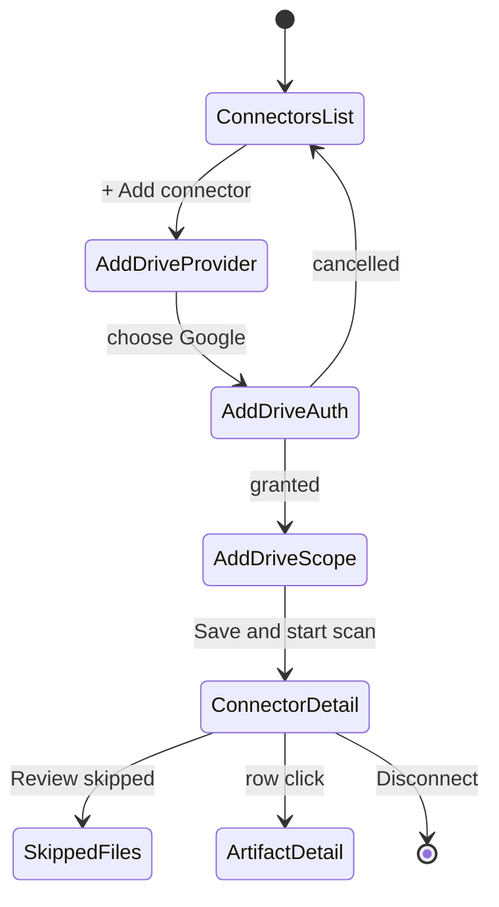
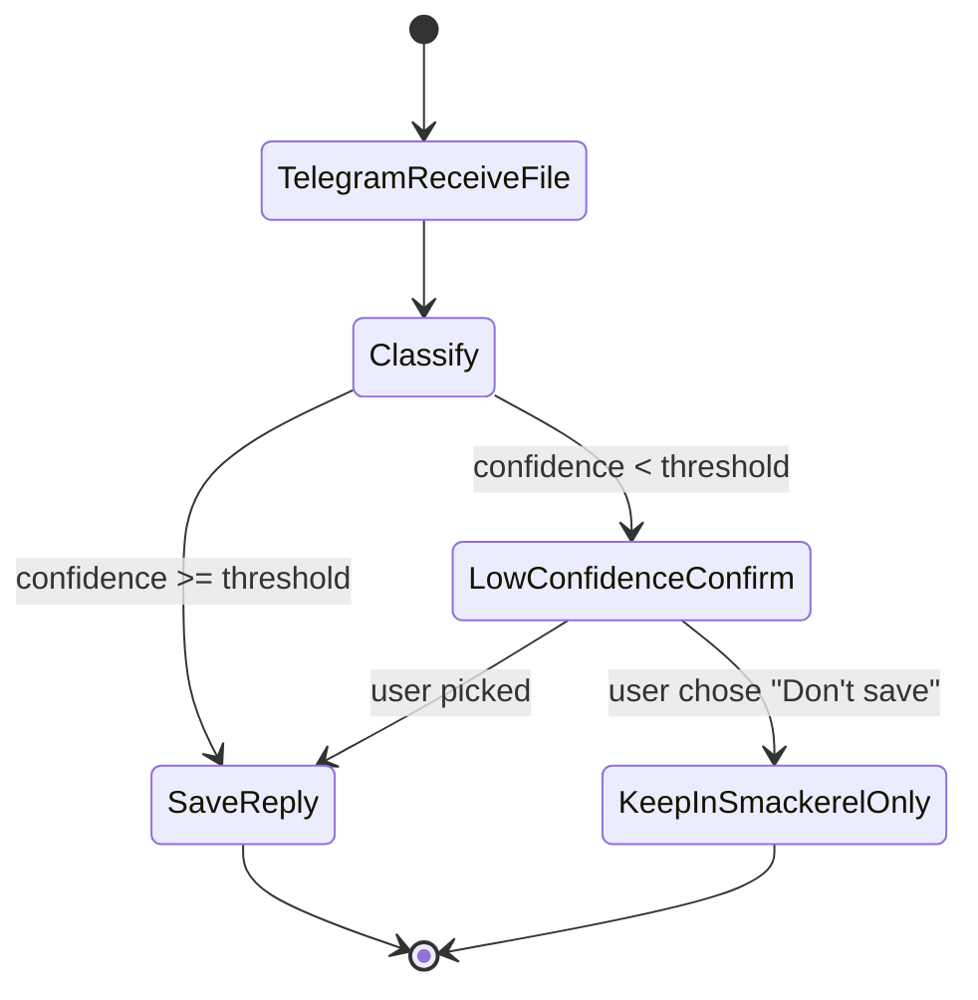
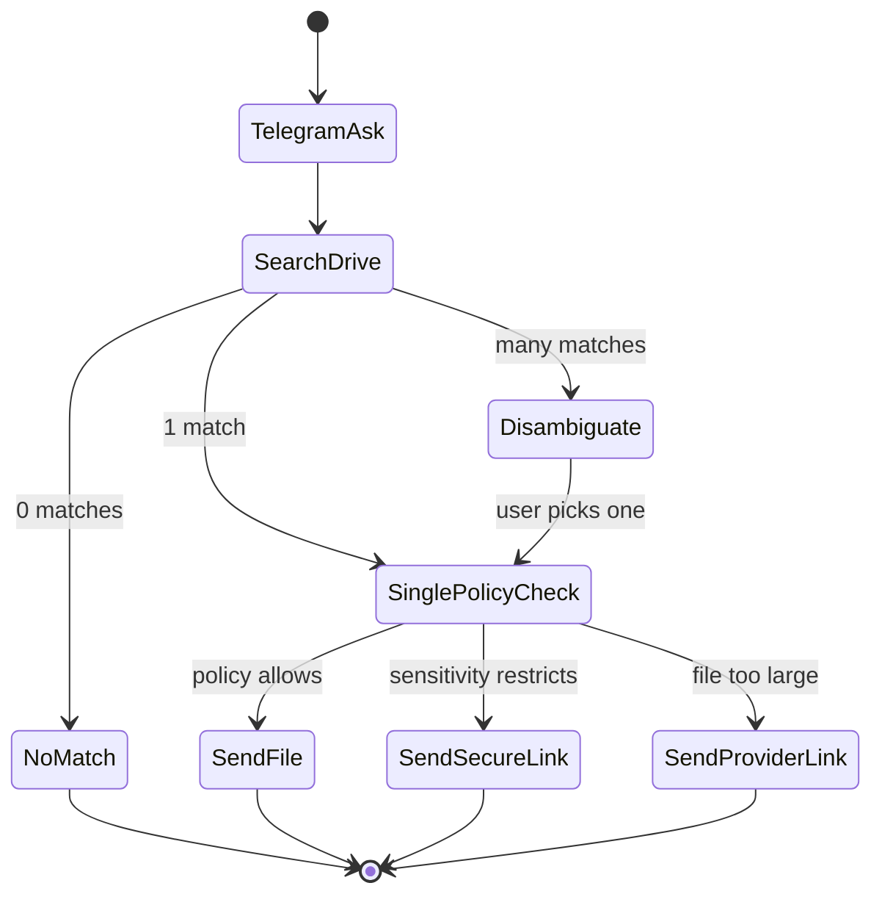
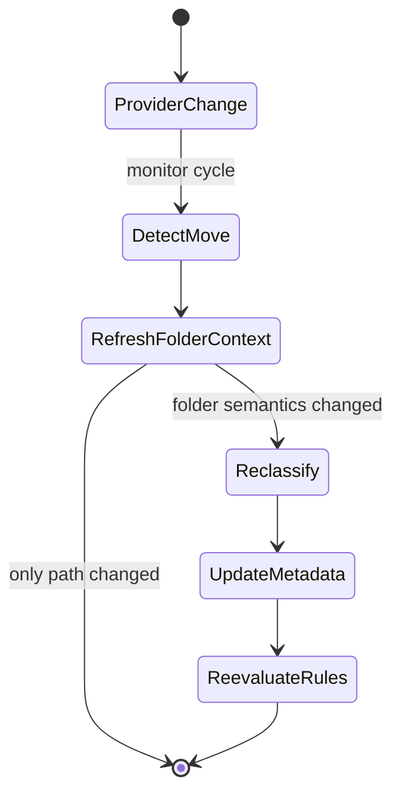

# Feature: 038 - Cloud Drives Integration

> **Author:** bubbles.analyst
> **Date:** April 26, 2026
> **Status:** Draft (analyst-owned requirements sections only)
> **Design Doc Reference:** [docs/smackerel.md](../../docs/smackerel.md) - extends Section 5 (Passive Sources) and Section 22 (Connector Ecosystem); cross-cuts 026 (Domain Extraction), 027 (User Annotations), 028 (Actionable Lists), 034 (Expense Tracking), 035 (Recipe Enhancements), 036 (Meal Planning), 008 (Telegram Share Capture).

---

## Problem Statement

Most people's actual long-term memory of digital artifacts lives in cloud drives - the PDFs they downloaded "to read later," the receipt photos saved to a Receipts folder, the manual for the air-fryer, the cookbook PDFs, the kids' school documents, the tax returns, the boarding passes, scanned passports, photos of whiteboards, recipe screenshots, hiking maps, mortgage paperwork, and decades of Office documents. **Without a cloud-drive layer, Smackerel is blind to the largest, most personally curated knowledge base most users own.**

Concrete failure modes today:

1. **The "I know I saved that PDF" gap.** A user remembers downloading a PDF about sourdough hydration ratios in 2023 - it lives in `Drive/Cooking/Books/`. Smackerel cannot see it, cannot answer "how do I adjust hydration for whole wheat?", and cannot link it to the recipe artifacts in feature 035.
2. **Cross-connector capture is one-way.** The Telegram bot (008) ingests a photo of a receipt the user shared - but Smackerel cannot also stash that photo into the user's `Drive/Receipts/2026/` folder where their accountant looks for it. Capture and storage are decoupled.
3. **Folder taxonomy is wasted signal.** Users have already organized decades of files into folders (`Personal/Tax/2025`, `Travel/Italy-2024`, `Work/Clients/Acme`). That folder structure is a high-quality, user-authored taxonomy that should seed topics, expense categories, trip dossiers, and people graphs, but currently gets discarded.
4. **PDF/image content is dark matter.** Even when a file is technically reachable, its content is opaque without OCR, PDF text extraction, and Office-format parsing. The intelligence layer (021) cannot reason about "what's in my drive" the way it can about emails or notes.
5. **No write-back means dead-end ingestion.** Recall, Mem, Notion, and most "second brain" tools treat files as one-way imports. Users want the inverse too: "Put the meal plan PDF I just generated into my `Drive/Meals/Week-17/` folder so my partner can see it from their phone."
6. **Each new drive provider would mean rewriting half the system.** Without a generic drive abstraction, supporting Dropbox, OneDrive, iCloud Drive, Box, or self-hosted Nextcloud after Google Drive becomes a sequence of one-off connectors with duplicated metadata, classification, monitoring, and write-back code.

This feature treats cloud drives as **first-class, bidirectional, multi-provider knowledge surfaces** - read, write, monitor, classify, and integrate - with Google Drive as the first concrete provider and a provider-neutral core that lets every additional drive add only its connection layer.

---

## Current Capability Map

| Capability | Existing Evidence | Current Status | Requirement Impact |
|------------|-------------------|----------------|--------------------|
| Connector lifecycle | `internal/connector/connector.go` defines ID, Connect, Sync, Health, Close and health states. | Present for read-oriented sync connectors | Cloud drives must extend this pattern while adding provider-neutral write and monitor behavior. |
| Normalized connector output | `RawArtifact` supports source ID, source ref, content type, title, raw content, URL, metadata, captured time. | Present for text-like artifacts | Drive artifacts need richer binary-file, folder, version, sharing, and extraction-state metadata. |
| Processing handoff | `internal/pipeline/ingest.go` stores connector artifacts and submits them for processing. | Present for connector-produced artifacts | Drive ingestion can reuse the artifact path, but must avoid flattening file versions and folder context. |
| Google ecosystem precedent | Google Keep connector parses Takeout/gkeepapi notes, preserves labels, collaborators, attachments, and timestamps. | Present for notes, not drives | Keep proves Google-source normalization patterns exist; Drive needs official provider read/write and broader file extraction. |
| Telegram media capture | Feature 008 defines media/document capture and media-group assembly. | Planned/available as a cross-feature source | Telegram should be able to save files into Drive and retrieve Drive files through the same cross-connector rules. |
| Cloud drive provider | No existing `drive` connector package or generic drive abstraction is present. | Missing | This feature must introduce the first provider-neutral drive requirements before design. |
| Save-back service | No existing generic save-to-external-store service is present. | Missing | Bidirectional drive behavior is a new cross-feature capability, not just another passive connector. |
| Multi-format file understanding | Existing sources cover notes, links, feeds, and connector metadata; full drive-scale PDF/image/Office/audio/video understanding is not a shared requirement yet. | Partial | Requirements must explicitly include extraction, blocked-file visibility, and model-driven classification across content types. |

---

## Outcome Contract

**Intent:** Give Smackerel bidirectional, LLM-driven access to the user's cloud drives - starting with Google Drive - so that every file (text, PDF, image, Office doc, audio, video) becomes a first-class, classified, semantically searchable artifact whose folder context, sharing state, and revision history enrich the knowledge graph; and so that any artifact Smackerel produces, receives, or retrieves through another connector can be saved to or returned from the right drive location through one consistent drive model.

**Success Signal:** Within 24 hours of connecting a Google Drive account, a user can ask "what was that air-fryer manual I saved?", "show me all 2025 medical receipts", or "find the cookbook PDF with the dumpling recipe" and get the exact file plus its extracted content. A photo a user shares to the Telegram bot is auto-saved into `Drive/Receipts/<year>/` because the LLM classified it as a receipt and a configured save-rule pointed there. A meal plan generated by feature 036 lands in `Drive/Meals/Week-17/meal-plan.pdf` without the user lifting a finger. A user can ask the Telegram bot for "the Lisbon boarding pass" and receive the matching drive link or file subject to sharing and sensitivity policy. When a second drive provider is added, every existing classification, save-rule, search, retrieval, and downstream feature works against it without per-feature changes.

**Hard Constraints:**
- **Provider-neutral behavior.** All user-facing drive behavior - ingestion, classification, search, retrieval, save-rules, write-back, monitoring, and downstream-feature routing - MUST behave the same across connected drive providers. Provider-specific connection differences MUST NOT leak into recipes, expenses, Telegram, meal planning, lists, annotations, or search.
- **LLM-driven understanding.** File classification, folder-intent inference, cross-feature routing, sensitivity detection, save-destination inference, and metadata enrichment MUST be LLM-driven. Heuristics are permitted only for stable machine facts such as file size, byte-derived file type, dimensions, timestamps, and exact provider metadata.
- **Read, save, monitor, and scan.** The first provider MUST support reading existing files, scanning folders on demand, monitoring changes, and saving new or generated files back to user-selected or rule-selected folders.
- **Metadata preservation.** Folder path, provider labels/tags when available, sharing state, owner, last-modified-by, revision/version identity, starred/important flags, and provider URL MUST be captured per file and made available to downstream features.
- **Multi-format content understanding.** PDFs, scanned PDFs, images, office documents, text/markdown/code files, audio, and video MUST be represented as searchable, classifiable artifacts. A file that cannot be fully understood MUST still be visible with a concrete blocked/skipped reason.
- **Cross-connector composition.** Other connectors and synthesis features MUST be able to use drive files as inputs and use drive folders as save or retrieval destinations through one shared product contract.
- **Incremental updates without duplicate artifacts.** Repeated syncs, file moves, metadata changes, and provider version changes MUST update the existing file identity instead of creating duplicates unless the provider has created a distinct file/version.
- **No silent dropping.** Files skipped due to size, unsupported format, permissions, encryption, quota, or extraction failure MUST appear in user/operator-visible status with per-file reason.
- **Privacy and isolation.** User drive credentials and content MUST stay inside the approved local/self-hosted trust boundary except for the user's configured model provider. Automated tests MUST never read or write the user's real drive.

**Failure Condition:** If a user connects Google Drive, sees the connector report "healthy," but (a) cannot find a known PDF by natural-language description, (b) photos saved to drive never appear in the knowledge graph, (c) folder structure is collapsed into a flat blob with no hierarchy preserved, (d) Telegram-shared receipts cannot be auto-routed to a drive folder, (e) the user cannot retrieve a drive file through Telegram when policy allows it, (f) the meal-plan generator cannot save its output back to drive, or (g) adding a second provider requires re-implementing classification, save-rules, search, or any downstream-feature integration - the feature has failed regardless of technical health status.

---

## Functional Requirements

### FR-001: Provider-Neutral Drive Model
The system MUST present connected cloud drives through one shared drive model for listing, reading, monitoring, saving, replacing, versioning, and retrieving files. Google Drive is the first required provider; additional providers MUST reuse the same classification, search, save-rule, retrieval, and downstream-feature behavior.

### FR-002: Google Drive Connection and Scope Control
The system MUST let the user connect Google Drive, grant the minimum scopes required for the selected read/write behavior, choose which folders are included, and pause, resume, or revoke the connection.

### FR-003: Bulk Scan and Incremental Monitoring
The system MUST support an initial scan of selected folders and ongoing monitoring for new files, modified files, moves, deletes/trash, sharing changes, and version changes.

### FR-004: Bidirectional File Operations
The system MUST read existing drive files, save incoming connector artifacts to drive, save generated artifacts to drive, retrieve matching drive files through other connectors when policy allows, and preserve provider URLs on resulting artifacts.

### FR-005: Multi-Format Understanding
The system MUST understand and index PDFs, scanned PDFs, images, office documents, text/markdown/code files, audio, and video well enough for natural-language search, classification, and downstream-feature routing. Unsupported or blocked files MUST remain visible with reason and metadata.

### FR-006: LLM-Driven Classification and Enrichment
The system MUST use LLM judgment for content classification, folder-intent interpretation, sensitivity detection, save-destination inference, cross-feature routing, and confidence/rationale. It MUST NOT rely on brittle keyword or folder-name heuristics except for stable machine facts.

### FR-007: Folder, Tag, Sharing, and Version Metadata
The system MUST preserve folder path, provider tags/labels when available, owner, last-modified-by, sharing state, starred/important state, provider URL, deleted/trashed state, and revision/version identity.

### FR-008: Folder-as-Taxonomy Enrichment
The system MUST treat user folder organization as a first-class classification signal and enrich artifacts with inferred topics, dates, audiences, sensitivity, projects, people, recipe domains, expense categories, trips, or list contexts when confidence is sufficient.

### FR-009: Save Rules Across Connectors
The system MUST let a user create rules that route files from any connector to a drive folder based on LLM classification, source connector, sensitivity, sender/person, folder context, date, and confidence threshold.

### FR-010: Retrieval Through Other Connectors
The system MUST let authorized channels such as Telegram request and receive drive search results, deep links, or file attachments according to sensitivity, sharing, file size, and channel-safety policy.

### FR-011: Cross-Feature Consumption
Recipes, expenses, actionable lists, annotations, meal planning, intelligence delivery, domain extraction, and agent tools MUST be able to consume drive artifacts without provider-specific branching.

### FR-012: Cross-Feature Production
Recipes, expenses, actionable lists, meal plans, digests, annotations, and agent tools MUST be able to save generated artifacts to drive folders without provider-specific branching.

### FR-013: Visible Skip and Blocked States
Every skipped, blocked, partial, unsupported, too-large, encrypted, permission-denied, quota-limited, or extraction-failed file MUST be visible to the user/operator with file identity, folder path when known, reason, and recommended next action.

### FR-014: Sensitivity-Aware Behavior
Sensitive content such as medical, financial, identity, legal, and family documents MUST carry sensitivity metadata that can constrain retrieval, save-back, sharing, digest inclusion, and cross-channel delivery.

### FR-015: Duplicate and Version Control
The system MUST distinguish duplicate files, file moves, changed versions, provider revisions, and re-uploads so users can find the current file while still being able to ask for earlier versions when retained.

### FR-016: User Confirmation for Low Confidence
When classification or save-destination confidence falls below policy threshold, the system MUST pause routing and request user clarification rather than guessing silently.

### FR-017: Drive Health and Progress Visibility
The system MUST expose initial scan progress, monitoring lag, save-rule successes/failures, skipped-file counts, classification confidence distribution, and provider health in user/operator-visible surfaces.

### FR-018: Privacy-Preserving Test and Validation Boundary
Validation of this feature MUST use disposable or recorded drive fixtures, never the user's personal drive, and MUST prove read, save, monitor, classify, retrieve, skip, and cross-feature behavior using representative files.

---

## Non-Goals

- **Real-time collaborative editing.** Live cursor presence, comment threading, and concurrent-edit conflict resolution inside native office editors are excluded. Smackerel reads snapshots and writes new files or versions.
- **Drive as primary Smackerel storage.** Drive is an external user surface, not the canonical store for Smackerel state.
- **Provider-to-provider migration.** Bulk migration such as "move all files from Dropbox to Google Drive" is excluded.
- **Drive permission administration.** Smackerel captures sharing state for context; granting and revoking provider permissions from inside Smackerel is excluded.
- **Password recovery or cracking.** Encrypted files whose passwords Smackerel does not hold are surfaced as extraction-blocked artifacts.
- **Desktop sync replacement.** This feature is not a local filesystem sync client.
- **Automated redaction.** Sensitivity flagging and policy enforcement are included; per-line redaction before upload is excluded.
- **New identity provider program.** Google Drive uses the existing Google account connection pattern; additional identity-provider expansion is excluded from this feature.

---

## Actors & Personas

| Actor | Description | Key Goals | Permissions |
|-------|-------------|-----------|-------------|
| **Knowledge Owner** | Primary end user. Has Google Drive and may add more cloud drives over time, with personal, family, and work files spanning years. | Recover any file by description; have new captures auto-filed; retrieve files from chat channels; save generated outputs back to drive; trust that nothing is silently dropped. | Connect/revoke own drive; choose folder scope; configure save/retrieval rules; pause/resume. |
| **Family Co-User** | Person who shares household or project folders with the Knowledge Owner. | Find shared school forms, receipts, recipes, travel docs, or household files without exposing private folders. | Access only files already shared by provider permissions and Smackerel audience policy. |
| **External Capture Channel** | Telegram, mobile capture, or another connector that receives files from the user. | Save received files into the right drive folder and retrieve matching drive files back to the user when policy allows. | Operates through user-approved save/retrieval rules. |
| **Cross-Feature Producer** | Smackerel scenario that creates an output such as a meal plan, expense report, recipe collection, list, or digest. | Save generated artifacts into the user's drive with stable links. | Internal producer constrained by user rules and sensitivity policy. |
| **Cross-Feature Consumer** | Smackerel scenario that uses drive files as input, such as recipes, expenses, lists, annotations, domain extraction, intelligence delivery, or agent tools. | Consume classified drive artifacts without knowing which drive provider produced them. | Internal consumer constrained by artifact metadata and sensitivity policy. |
| **Self-Hoster / Operator** | Person running Smackerel and supervising connector behavior. | Tune folder inclusion, size caps, processing tiers, save-rules, retries, and health visibility. | Administrative control over local configuration and connector health. |
| **Drive Provider Contributor** | Contributor adding an additional provider after Google Drive. | Add a provider connection without rebuilding classification, search, save-rules, retrieval, or cross-feature logic. | Contributor-level access to provider connection code and test fixtures. |

---

## Use Cases

### UC-001: Connect Google Drive and Bulk Scan
- **Actor:** Knowledge Owner
- **Preconditions:** User has a Google Drive account and wants Smackerel to understand selected folders.
- **Main Flow:**
  1. User chooses Google Drive from the drive connection flow.
  2. User grants requested access and selects included folders.
  3. Smackerel scans the selected folder tree.
  4. Smackerel extracts or describes file content according to file type.
  5. Smackerel classifies files with LLM judgment and preserves folder, sharing, owner, label/tag, version, and provider URL metadata.
  6. User can search for scanned files by natural language.
- **Alternative Flows:**
  - A1: User restricts access to a subset of folders, and only that subset is scanned and monitored.
  - A2: Selected folders exceed configured limits, and Smackerel shows partial progress plus skipped/queued counts rather than dropping files silently.
  - A3: User grants insufficient access, and connection fails with a clear corrective message before any partial scan is claimed.
- **Postconditions:** In-scope files are searchable; blocked/skipped files are visible with reason.

### UC-002: Monitor Drive Changes and Reclassify When Context Changes
- **Actor:** Knowledge Owner
- **Preconditions:** A drive connection is active.
- **Main Flow:**
  1. User adds, modifies, moves, deletes, or shares a file in Drive.
  2. Smackerel detects the change during the next monitoring cycle.
  3. Smackerel updates the existing artifact identity or creates a new version as appropriate.
  4. If folder, sharing, or content changed, Smackerel refreshes LLM-derived classification and sensitivity.
  5. Any matching save or downstream routing rules are evaluated.
- **Alternative Flows:**
  - A1: File moves folders without content change, and only folder-derived context refreshes.
  - A2: File becomes publicly shared, and sensitivity policy is rechecked.
  - A3: File is trashed, and the artifact is tombstoned rather than silently removed.

### UC-003: Natural-Language Recall of a Drive File
- **Actor:** Knowledge Owner
- **Preconditions:** Drive files have been scanned and understood.
- **Main Flow:**
  1. User asks: "find the air-fryer manual I downloaded last summer."
  2. Smackerel searches across content, folder path, filename, classification, date, and provider metadata.
  3. User receives a ranked result with preview snippet, provider link, folder breadcrumb, sharing state, and sensitivity badge.
- **Alternative Flows:**
  - A1: Multiple matches exist, and Smackerel shows disambiguating folder/date/provider details.
  - A2: File was trashed or deleted, and Smackerel shows retained content with a tombstone/access-state banner.
  - A3: File access was revoked, and Smackerel explains the access state and offers reconnection when possible.

### UC-004: Save Telegram Capture to Drive
- **Actor:** Knowledge Owner, External Capture Channel
- **Preconditions:** Telegram capture is configured and a save-rule exists: "Telegram receipts to `Drive/Receipts/<year>/`."
- **Main Flow:**
  1. User shares a restaurant receipt photo to the Telegram bot.
  2. Smackerel captures the file and classifies it as a receipt with confidence and rationale.
  3. Matching save-rule resolves the target folder.
  4. Smackerel saves the original file and any extracted metadata to Drive.
  5. Artifact metadata records Telegram as the capture source and Drive as a storage location.
- **Alternative Flows:**
  - A1: Classification confidence is low, and Smackerel asks for confirmation before saving.
  - A2: Drive write fails, and Smackerel surfaces the failure with retry status.
  - A3: Target folder is missing, and Smackerel follows the rule's create-or-fail policy.

### UC-005: Retrieve Drive File Through Telegram
- **Actor:** Knowledge Owner, External Capture Channel
- **Preconditions:** User has connected Drive and authorized Telegram retrieval for policy-allowed files.
- **Main Flow:**
  1. User asks Telegram: "send me the Lisbon boarding pass."
  2. Smackerel searches Drive artifacts using natural-language retrieval.
  3. Smackerel checks sensitivity, sharing, file size, and channel-safety policy.
  4. Telegram returns either the file, a provider deep link, or a ranked list for disambiguation.
- **Alternative Flows:**
  - A1: File is sensitive, and Telegram returns a safe refusal or secure-link flow instead of the file.
  - A2: Multiple files match, and Telegram asks the user to choose.
  - A3: File exceeds channel delivery limits, and Telegram returns the provider link with explanation.

### UC-006: Save Generated Meal Plan to Drive
- **Actor:** Cross-Feature Producer
- **Preconditions:** Meal planning generated a weekly plan and a rule exists for weekly meal-plan folders.
- **Main Flow:**
  1. Meal planning produces a user-facing plan artifact.
  2. Smackerel resolves the rule target folder.
  3. Smackerel saves the artifact to Drive and records the provider URL.
  4. The daily digest surfaces the saved drive link.
- **Alternative Flows:**
  - A1: Same week already has a plan, and Smackerel follows the user's replace/version policy.

### UC-007: Use Folder Structure as Taxonomy
- **Actor:** Cross-Feature Consumer
- **Preconditions:** Files live in user-organized folders.
- **Main Flow:**
  1. Smackerel provides the LLM with file content, folder path, and nearby folder context.
  2. LLM emits inferred topic, audience, sensitivity, date, project, person, recipe, expense, trip, or list metadata with confidence.
  3. Downstream features use the enriched metadata when confidence is sufficient.
- **Alternative Flows:**
  - A1: Folder name is opaque, and Smackerel records low-confidence enrichment rather than guessing.

### UC-008: Add Another Cloud Drive Provider
- **Actor:** Drive Provider Contributor, Knowledge Owner
- **Preconditions:** Google Drive behavior has established the provider-neutral product contract.
- **Main Flow:**
  1. Contributor adds a second provider connection.
  2. User connects that provider through the same drive experience.
  3. Files from both providers use the same search, classification, save-rule, retrieval, and cross-feature behavior.
  4. Results show provider-specific breadcrumbs and links while preserving unified ranking.
- **Postconditions:** Existing scenarios do not need provider-specific variants.

### UC-009: Apply Folder-Level Processing and Skip Policy
- **Actor:** Self-Hoster / Operator
- **Preconditions:** Operator wants important folders processed deeply and archive folders processed lightly.
- **Main Flow:**
  1. Operator configures included folders, excluded folders, size caps, and processing tiers.
  2. Smackerel applies the policy during scan and monitoring.
  3. Operator can review counts by included, skipped, blocked, classified, and saved status.

### UC-010: Handle Sensitive Files Safely
- **Actor:** Knowledge Owner
- **Preconditions:** Drive contains identity, financial, medical, legal, or family documents.
- **Main Flow:**
  1. LLM classifies the file and assigns sensitivity metadata.
  2. Search, digest, Telegram retrieval, and save-back policy respect the sensitivity state.
  3. User can inspect why a sensitive action was allowed, blocked, or required confirmation.

### UC-011: Recover After Permission Loss
- **Actor:** Knowledge Owner
- **Preconditions:** Drive access is revoked, expired, or narrowed.
- **Main Flow:**
  1. Smackerel detects that drive access no longer satisfies the configured scope.
  2. Connector status changes to disconnected or degraded with a clear reason.
  3. User reconnects or narrows scope intentionally.
  4. Files no longer accessible are marked `access-revoked` without losing previously retained knowledge.

---

## Business Scenarios

### BS-001: Bulk Ingest with Folder Hierarchy Preserved
Given a user has 1,200 files across 80 folders in Google Drive
When they connect Drive to Smackerel
Then within 24h every in-scope file is searchable AND the folder path is queryable AND folder-derived topics seed the knowledge graph

### BS-002: PDF Content Becomes Recall-able
Given a user has a 60-page PDF cookbook in `Drive/Cooking/Books/`
When PDF extraction completes
Then a query "dumpling dough hydration" returns the right page of that PDF AND the artifact links to the recipe collection from feature 035

### BS-003: Image OCR Surfaces Receipt Totals
Given a user has 200 receipt photos in `Drive/Receipts/2025/`
When ingestion completes
Then each receipt has structured fields (vendor, total, date, line items) extracted by the LLM AND is queryable as expense data per feature 034

### BS-004: Inbound Telegram Receipt Auto-Files to Drive
Given a save-rule "Telegram receipt to `Drive/Receipts/<year>/`" is active
When a user shares a receipt photo to the Telegram bot
Then within 1 minute the photo lives in `Drive/Receipts/2026/<deterministic-name>` AND the artifact records both Telegram source and drive URL

### BS-005: Outbound Meal Plan Saved to Drive
Given the meal-planner produces a Week-17 plan
When the configured save-rule fires
Then `Drive/Meals/Week-17/meal-plan.pdf` exists AND its drive URL is surfaced in the daily digest

### BS-006: Folder Move Updates Topic Context
Given a file currently classified `personal` lives in `Drive/Inbox/`
When the user moves it to `Drive/Work/Clients/Acme/`
Then within one sync cycle the artifact's folder context updates AND the LLM re-evaluates topic and sensitivity

### BS-007: Native Google Doc Round-Trip
Given a user has a native Google document named "Trip plan - Lisbon"
When ingested
Then the document is searchable, the provider deep link is preserved, and later edits update the same artifact identity without creating duplicates

### BS-008: Second Provider Has Zero Downstream Impact
Given a second cloud-drive provider is added after Google Drive
When a user connects that provider
Then existing recipe / expense / receipt / meal-plan / annotation / list integrations work against both providers unchanged AND search returns results from both providers uniformly

### BS-009: Skipped File Is Visible
Given a 1.2GB video exceeds the configured 500MB cap
When ingestion encounters it
Then it appears in the artifact list with status `extract: skipped:size` AND the connector health surfaces a per-rule counter rather than silently dropping it

### BS-010: Shared-with-Family File Is Distinguished
Given a file is owned by the user's spouse and shared into `Family/`
When ingested
Then the artifact records owner, sharing state, and `family` audience AND retrieval contexts can filter by audience

### BS-011: External Public-Link File Triggers Sensitivity Review
Given a file becomes publicly link-shared
When the next sync detects the change
Then the artifact's sharing state updates AND any sensitivity-tagged content emits an alert per the user's policy

### BS-012: Encrypted PDF Is Surfaced, Not Hidden
Given a password-protected PDF is ingested
When extraction fails
Then artifact records `extract: blocked:encrypted` AND the file remains discoverable by filename / folder context

### BS-013: Revision History Preserved
Given a contract PDF is replaced with v2 in the same drive path
When ingested
Then both versions are linked AND retrieval can ask for "the previous version" and get v1

### BS-014: Save-to-Drive Honors Sensitivity Policy
Given a user policy "never auto-link-share medical files"
When a save-to-drive call would create a public link for a `medical`-classified file
Then the call is rejected with an explicit policy violation event rather than silently changing the action

### BS-015: LLM Classifier Disagreement Routes to Annotation
Given the classifier returns confidence below the configured threshold
When the file would otherwise auto-route to a downstream feature
Then routing pauses and an annotation request is created (feature 027) instead of silently guessing

### BS-016: Concurrent Inbound Save Avoids Folder Race
Given two simultaneous inbound saves target the same folder name that does not yet exist
When the save-to-drive service handles them
Then exactly one folder is created AND both files are placed correctly with no duplicate-folder race artifact

### BS-017: Drive Trash Does Not Lose Knowledge
Given a file is moved to drive trash
When sync detects it
Then the artifact is tombstoned (not deleted) AND its content remains queryable per retention policy until either restored or hard-deleted past the policy window

### BS-018: First-Time Empty Drive
Given a user connects an empty drive
When initial sync runs
Then the connector reports healthy AND no spurious artifacts are created AND subsequent uploads start flowing immediately

### BS-019: Bulk Folder Restructure Does Not Reprocess Content
Given the user reorganizes 5,000 files into new folders without changing content
When sync runs
Then content is not re-extracted or re-embedded AND only folder-context metadata refreshes

### BS-020: Provider Outage Degrades Gracefully
Given the connected drive provider is unavailable for an extended window
When Smackerel attempts to scan, monitor, save, or retrieve files
Then the connector reports `degraded` then `failing` per error-count thresholds AND in-flight save-to-drive calls are queued, not silently dropped

### BS-021: Cross-Drive Search Returns Provider-Neutral Results
Given the user has Google Drive and Dropbox connected
When they search "tax 2025"
Then results from both providers appear with provider, folder path, and sharing state shown in unified ranking, not separate result tabs

### BS-022: Folder-as-Taxonomy Surfaces Year and Topic
Given files live under `Drive/Personal/Tax/2025/`
When ingested
Then the LLM enrichment emits topic `tax`, time anchor `2025`, sensitivity `financial`, audience `private`, and these flow into the expense / domain features

### BS-023: Voice Memo Transcribed and Linked
Given an audio memo lives in `Drive/Voice Memos/2026-04/`
When ingested
Then the file is transcribed, the transcript is searchable, and any action items are available to the synthesis engine

### BS-024: Image-Only PDF Fallback to OCR
Given a scanned-only PDF (no text layer) is ingested
When first-pass text extraction yields no text
Then image-based extraction runs AND the resulting text is indexed with no silent empty artifact

### BS-025: Telegram Retrieves a Drive File
Given the user has authorized Telegram retrieval for non-sensitive drive files
When they ask Telegram "send me the Lisbon boarding pass"
Then Smackerel finds the matching drive file, checks sensitivity and channel policy, and returns either the file, provider link, or a disambiguation prompt

---

## Competitive Analysis

| Capability | Smackerel (target) | Recall (recall.it) | Mem.ai | Glean (Google Drive connector) | Microsoft Copilot for OneDrive | Google Drive native |
|------------|--------------------|--------------------|--------|--------------------------------|--------------------------------|---------------------|
| Drive ingestion (read) | Yes, multi-provider target | Partial: PDFs/articles, not native drive watch | Partial: web/voice/meeting capture, no first-class drive watch | Yes, enterprise-grade | Yes, OneDrive only | n/a |
| Drive write-back from synthesis | Yes, generic save-to-drive service | No | No | Yes, create Docs/Sheets | Yes, within OneDrive | n/a |
| Multi-provider abstraction | Yes, first-class goal | No | No | Yes, enterprise SaaS | No, Microsoft-only | n/a |
| Self-hosted, local data | Yes | No, cloud knowledge base | No, cloud | No, enterprise SaaS | No, cloud | Partial |
| Folder-as-taxonomy enrichment | Yes, explicit | No, flat tags | Partial, implicit AI organize | Partial, enterprise context | Partial, within OneDrive | No |
| Sharing/sensitivity-aware classification | Yes, explicit | No | No | Yes, permissions-aware | Partial, tenant ACL | No |
| Cross-connector capture-to-drive (Telegram to Drive) | Yes, explicit | No | No | No | No | No |
| Cross-channel retrieval from drives (Telegram asks for a file) | Yes, explicit | No | No | No | No | No |
| LLM-driven classification + routing | Yes, default | Partial, tag inference | Yes | Yes | Yes | No |
| PDF / image / Office multi-format extraction | Yes | Yes, PDF+articles | Partial | Yes | Yes | No, retrieval only |
| Revision history retained | Yes | No | No | Yes, enterprise | Yes | Yes, native |
| Quota / size / tier policy with visible skip | Yes, explicit | No | No | Partial, enterprise | Partial | n/a |
| Bidirectional with non-Drive providers (Dropbox/OneDrive/Box) | Yes, target | No | No | Yes | No | No |

**Top gaps Smackerel can close as competitive edge:**
1. **Provider-neutral, self-hosted bidirectionality.** Glean has multi-provider but is enterprise SaaS. Recall and Mem are cloud-only and treat files as one-way imports. Nothing in the consumer/prosumer self-hosted space offers a generic `CloudDrive` abstraction with read+write+monitor+save-rules.
2. **Cross-connector capture and retrieval composition.** Telegram-to-Drive auto-routing and Telegram-from-Drive retrieval via LLM classification is a unique combination. Recall/Mem don't do inbound capture pipelines; Glean is enterprise-only.
3. **Folder-as-taxonomy as an explicit signal.** Most tools either ignore folder structure (flat tagging) or use it shallowly. Treating it as an LLM input alongside content is a differentiator.
4. **Visible, policy-driven skip reasons.** Competitors silently drop files at quota / mime / permission walls. Surfacing skip reasons per file is a trust differentiator.

---

## Platform Direction & Market Trends

### Industry Trends

| Trend | Status | Relevance | Impact on Product |
|-------|--------|-----------|-------------------|
| Personal AI "second brains" with file ingestion | Growing | High | Drive integration is becoming table stakes; arriving without it makes Smackerel look incomplete to its core audience. |
| Local and self-hosted model runtimes reaching parity for routine tasks | Growing | High | LLM-driven classification at our quality bar is now feasible without external API spend. |
| Multi-provider cloud-storage federation | Established | Medium | Validates the provider-neutral shape; sets user expectation that "any drive plugs in." |
| Native PDF + image multimodal models | Growing | High | Reduces our reliance on multiple narrow extractors; one multimodal call can replace OCR+layout+vision+classification chains for many files. |
| Enterprise "knowledge work AI" (Glean, Hebbia) | Established | Medium | Strong validation of the read side; weak validation of consumer self-hosted bidirectional. |
| Privacy-first / on-device AI sentiment | Growing | High | Aligns with Smackerel's local-data-ownership posture; differentiator vs. Recall / Mem. |
| Cross-app workflow automation (Zapier-style) blending into AI agents | Emerging | High | The save-rule engine is exactly this surface; doing it well via LLM classification is a defensible edge. |
| Voice memos as a major capture channel | Growing | Medium | Audio-in-drive is no longer rare; transcription path must be a first-class case, not an afterthought. |

### Strategic Opportunities

| Opportunity | Type | Priority | Rationale |
|-------------|------|----------|-----------|
| Multi-provider `CloudDrive` abstraction | Differentiator | High | Self-hosted, multi-provider, bidirectional is empty market space. |
| LLM-routed inbound capture and retrieval rules (Telegram to/from Drive etc.) | Differentiator | High | Compounding value across every connector; nothing in consumer space does this. |
| Folder-as-taxonomy enrichment | Differentiator | High | Cheap to do once the LLM hop exists; high-quality signal that's currently wasted. |
| PDF/image multi-format extraction parity with PDF-tool category | Table Stakes | High | Without this, the feature is theater. |
| Visible skip / extraction-blocked surfacing | Differentiator | Medium | Trust differentiator vs. competitors that silently drop. |
| Sensitivity-aware retrieval and write-back | Differentiator | Medium | Personal drives contain medical/financial; handling this correctly is both a moat and an obligation. |
| Sharing-state-as-context | Differentiator | Medium | Audience-aware retrieval ("show me only family files") is novel. |
| Versioning / revision-aware retrieval | Table Stakes | Medium | Expected behavior; absence is a failure mode. |
| Self-hosted and open-storage provider support | Differentiator | Medium | Users of self-hosted Smackerel disproportionately also self-host storage. |

### Recommendations
1. **Immediate (this delivery):** Provider-neutral drive model plus Google Drive read, save, monitor, and scan behavior; multi-format extraction (PDF/image OCR/Office/text/audio/video); LLM classification and folder-as-taxonomy; save/retrieval rules for Telegram to/from Drive and meal-plan to Drive integrations; visible skip reasons; sensitivity flags; revision tracking.
2. **Near-term (next deliveries):** Dropbox and OneDrive provider support; sensitivity-aware retrieval surfaces; per-folder processing tiers and exclude rules surfaced in UI.
3. **Strategic (6+ months):** Self-hosted and open-storage provider support; cross-drive duplicate detection; sharing-state-aware automated workflow library; encrypted-vault on-demand decrypt with explicit consent.

---

## Improvement Proposals

### IP-001: Generic Cloud Drive Provider Model - Competitive Edge
- **Impact:** High
- **Effort:** L
- **Competitive Advantage:** Self-hosted multi-provider bidirectional cloud-drive AI is empty market space; Glean owns enterprise but no consumer-prosumer player covers this.
- **Actors Affected:** Knowledge Owner, Drive Provider Contributor, Cross-Feature Producer/Consumer, Self-Hoster
- **Business Scenarios:** BS-008, BS-021, BS-001

### IP-002: Inbound LLM-Routed Save and Retrieval Rules (Telegram to/from Drive, Capture to Drive) Competitive Edge
- **Impact:** High
- **Effort:** M
- **Competitive Advantage:** No consumer "second brain" tool composes capture connectors with cloud drives via LLM classification and channel-safe retrieval. Each rule compounds across every connector.
- **Actors Affected:** Knowledge Owner, Cross-Feature Producer
- **Business Scenarios:** BS-004, BS-014, BS-015, BS-016, BS-025

### IP-003: Folder-as-Taxonomy Enrichment - Competitive Edge
- **Impact:** High
- **Effort:** S-M (additional LLM call on ingest with folder context)
- **Competitive Advantage:** Folder structure is the most curated, longest-tenure user signal in personal storage; competitors collapse it to a flat tag.
- **Actors Affected:** Knowledge Owner, Cross-Feature Consumer
- **Business Scenarios:** BS-006, BS-022, BS-010

### IP-004: Outbound Save-to-Drive Service for Synthesized Artifacts
- **Impact:** High
- **Effort:** M
- **Competitive Advantage:** Closes the "dead-end ingestion" loop. Lets meal plans, expense reports, digests, and recipe collections live where the user already keeps such files.
- **Actors Affected:** Cross-Feature Producer, Knowledge Owner
- **Business Scenarios:** BS-005, BS-014

### IP-005: Multi-Format Extraction (PDF / Image-OCR / Office / Audio / Video)
- **Impact:** High
- **Effort:** L
- **Competitive Advantage:** Without this, drives are text-only. With it, drives become equal-class with email and notes.
- **Actors Affected:** Knowledge Owner, all Cross-Feature Consumers
- **Business Scenarios:** BS-002, BS-003, BS-023, BS-024

### IP-006: Sharing- and Sensitivity-Aware Classification - Competitive Edge
- **Impact:** Medium-High
- **Effort:** M
- **Competitive Advantage:** Personal drives carry medical/financial/identity content. Filtering retrieval and constraining auto-shares around a sensitivity flag is both a trust differentiator and a basic adult-product expectation.
- **Actors Affected:** Knowledge Owner, Family Co-User
- **Business Scenarios:** BS-009, BS-010, BS-011, BS-014

### IP-007: Visible Skip / Extraction-Blocked Surfacing
- **Impact:** Medium
- **Effort:** S
- **Competitive Advantage:** Trust differentiator. Competitors silently drop large/encrypted/unsupported files.
- **Actors Affected:** Knowledge Owner, Self-Hoster
- **Business Scenarios:** BS-009, BS-012

### IP-008: Revision-Aware Artifact Model
- **Impact:** Medium
- **Effort:** M
- **Competitive Advantage:** Lets users ask for "the previous version" - a natural, frequently desired query that current consumer tools don't answer.
- **Actors Affected:** Knowledge Owner
- **Business Scenarios:** BS-013, BS-007

### IP-009: Per-Folder Processing Tier and Exclude Rules
- **Impact:** Medium
- **Effort:** S-M
- **Competitive Advantage:** Lets users include "the cookbook folder" at full tier and exclude "Backups" - quality-tier control without giving up coverage.
- **Actors Affected:** Self-Hoster, Knowledge Owner
- **Business Scenarios:** BS-001, BS-009, BS-019

### IP-010: Provider-Neutral Search with Audience and Sharing Filters
- **Impact:** Medium
- **Effort:** S-M
- **Competitive Advantage:** Cross-drive unified search with audience filters ("only family", "only private") is a category-leading retrieval surface.
- **Actors Affected:** Knowledge Owner
- **Business Scenarios:** BS-021, BS-010

---

## UI Scenario Matrix

| Scenario | Actor | Entry Point | Steps | Expected Outcome | Screen(s) |
|----------|-------|-------------|-------|-------------------|-----------|
| Connect Google Drive | Knowledge Owner | Connectors panel | Click "Add Drive", choose Google, authorize, choose folder scope, confirm | Connector listed as `healthy`; first scan starts; progress visible | Connectors / Add / Scope picker / Connector detail |
| Find a file by description | Knowledge Owner | Chat / Search | Enter NL query | Result with snippet, folder breadcrumb, drive deep link, sharing badge | Search results, Artifact preview |
| Configure save-rule (Telegram receipt to Drive) | Knowledge Owner | Save Rules panel | New rule, source: Telegram, classification: receipt, target folder picker, save | Rule listed as active; subsequent matching captures auto-file | Save Rules list, Rule editor |
| Retrieve drive file through Telegram | Knowledge Owner | Telegram chat | Ask for a file by description | Telegram returns file, provider link, or disambiguation prompt after policy checks | Telegram conversation, Artifact preview |
| Review skipped files | Self-Hoster | Connector health detail | Click "Skipped (N)" | List grouped by reason (size, mime, encrypted, permission); each with file path | Connector health / Skipped detail |
| Inspect drive artifact | Knowledge Owner | Search result / artifact link | Open artifact | Shows extracted content, folder path, owner, sharing state, sensitivity, revisions, drive link | Artifact detail |
| Toggle audience filter | Knowledge Owner | Search | Filter "Family only" | Results restricted to family-audience artifacts | Search filter chips |
| Restore tombstoned artifact | Knowledge Owner | Artifact detail (tombstoned) | Click "Restore from drive" | If still in drive trash, opens drive restore link; if hard-deleted, shows last-known content with banner | Artifact detail (tombstoned variant) |
| Pause / resume connector | Self-Hoster | Connector detail | Pause / Resume buttons | Sync halts cleanly; resume picks up at last cursor | Connector detail |
| Add second drive provider (Dropbox) | Knowledge Owner | Connectors panel | Add, choose Dropbox, authorize, choose scope | Same flow as Google Drive; results unified in search | Same screens |
| Review version of a file | Knowledge Owner | Artifact detail | Click "Older versions" | Linked artifacts for prior revisions with diff summary | Artifact detail / Versions tab |

---

## UI Wireframes

> Surfaces: **web (PWA)** for Knowledge Owner and Self-Hoster, **conversational (Telegram)** for inbound capture and retrieval. No mobile-native UI is committed yet; mobile capture (033) inherits the same behavior contracts when delivered.

### Screen Inventory

| # | Screen | Surface | Actor(s) | Status | Scenarios Served |
|---|--------|---------|----------|--------|------------------|
| 1 | Connectors List | Web | Knowledge Owner, Self-Hoster | New | UC-001, UC-008, UC-011 |
| 2 | Add Drive — Provider & Scope | Web | Knowledge Owner | New | UC-001, UC-008, BS-018 |
| 3 | Drive Connector Detail | Web | Knowledge Owner, Self-Hoster | New | UC-001, UC-009, UC-011, BS-009, BS-020 |
| 4 | Skipped & Blocked Files | Web | Self-Hoster, Knowledge Owner | New | BS-009, BS-012, FR-013 |
| 5 | Search Results (Drive-aware) | Web | Knowledge Owner | New | UC-003, BS-001, BS-002, BS-021 |
| 6 | Drive Artifact Detail | Web | Knowledge Owner | New | UC-003, BS-007, BS-010, BS-013, BS-017 |
| 7 | Save Rules List | Web | Knowledge Owner | New | UC-004, UC-006, BS-004, BS-005 |
| 8 | Save Rule Editor | Web | Knowledge Owner | New | UC-004, UC-006, BS-014, BS-015 |
| 9 | Telegram — Save Reply | Conversational | Knowledge Owner | New | UC-004, BS-004, BS-015 |
| 10 | Telegram — Retrieval Reply | Conversational | Knowledge Owner | New | UC-005, BS-025, BS-014 |
| 11 | Low-Confidence Confirmation | Web + Conversational | Knowledge Owner | New | FR-016, BS-015 |

---

### Screen 1: Connectors List
**Actor:** Knowledge Owner, Self-Hoster | **Route:** `/connectors` | **Status:** New

```
┌──────────────────────────────────────────────────────────────────┐
│  Smackerel        Capture  Search  Connectors  Rules    [User ▾] │
├──────────────────────────────────────────────────────────────────┤
│                                                                    │
│  Connectors                                  [ + Add connector ]  │
│  Manage how Smackerel reads from and writes to your sources.      │
│                                                                    │
│  ┌────────────────────────────────────────────────────────────┐  │
│  │ Drive                                                       │  │
│  │ ● Google Drive             healthy   1,284 files  [Open ▸] │  │
│  │ ○ Dropbox                  not connected           [Add]   │  │
│  │ ○ OneDrive                 not connected           [Add]   │  │
│  ├────────────────────────────────────────────────────────────┤  │
│  │ Capture                                                     │  │
│  │ ● Telegram                 healthy   12 today     [Open ▸] │  │
│  │ ● Mobile capture           pending invite          [Open ▸]│  │
│  ├────────────────────────────────────────────────────────────┤  │
│  │ Notes & feeds                                               │  │
│  │ ● Google Keep              degraded  retry 3m     [Open ▸] │  │
│  └────────────────────────────────────────────────────────────┘  │
│                                                                    │
│  Tip: drives can both read existing files and save new ones from  │
│  Telegram, mobile capture, recipes, expenses, and meal plans.     │
└──────────────────────────────────────────────────────────────────┘
```

**Interactions:**
- `[ + Add connector ]` → opens Screen 2 (provider picker).
- `[Open ▸]` on a drive row → Screen 3 (connector detail).
- Status dot click → tooltip with last sync, error count, skipped count.

**States:**
- Empty: only the section headers and "Add" buttons are shown; tip text is replaced with onboarding prompt.
- Loading: skeleton rows for each known section.
- Error: failing connectors show a red dot, the failure reason, and a `Reconnect` action.

**Responsive:**
- Mobile: section headers collapse into accordions; rows stack vertically; status dot + name on row 1, count + actions on row 2.
- Tablet: same as desktop with reduced gutters.

**Accessibility:**
- Status dots have a text label for screen readers (`aria-label="Healthy"`, etc.); color is never the only signal.
- Keyboard: section headers are buttons (Tab/Enter), rows are list items with one focus ring per row, `[Open ▸]` is the row's primary action.
- All copy meets WCAG 2.2 AA contrast on light and dark themes.

---

### Screen 2: Add Drive — Provider & Scope
**Actor:** Knowledge Owner | **Route:** `/connectors/add/drive` | **Status:** New

```
┌──────────────────────────────────────────────────────────────────┐
│  ← Back to Connectors                                              │
│                                                                    │
│  Add a cloud drive                                                 │
│  Step  ●──○──○   1 of 3 · Choose provider                          │
│                                                                    │
│  ┌─────────────┐  ┌─────────────┐  ┌─────────────┐                │
│  │ Google      │  │ Dropbox     │  │ OneDrive    │                │
│  │ Drive       │  │ (preview)   │  │ (preview)   │                │
│  │   [select]  │  │   [select]  │  │   [select]  │                │
│  └─────────────┘  └─────────────┘  └─────────────┘                │
│                                                                    │
│  ──────────────────────────────────────────────────────────────   │
│  Step ●──●──○   2 of 3 · Authorize access                          │
│  Smackerel will request the smallest scope set for the behavior   │
│  you choose below. You can change this later.                     │
│  ( ) Read only        — scan, classify, search                    │
│  (•) Read & save back — also auto-file captures and synthesis     │
│                                       [ Continue with Google ▸ ]  │
│                                                                    │
│  ──────────────────────────────────────────────────────────────   │
│  Step ●──●──●   3 of 3 · Choose folders                            │
│  ┌────────────────────────────────────────────────────────────┐  │
│  │ ▣ My Drive            (everything)                          │  │
│  │   ▣ Cooking            ▣ Receipts            ▢ Backups     │  │
│  │   ▢ Work/Confidential  ▣ Travel              ▣ Family      │  │
│  │   ▣ Voice Memos                                             │  │
│  └────────────────────────────────────────────────────────────┘  │
│  Estimated 3,800 files in scope · ~12 GB                           │
│  [ Cancel ]                       [ Save & start initial scan ▸ ] │
└──────────────────────────────────────────────────────────────────┘
```

**Interactions:**
- Provider tile click → moves stepper to step 2; selected tile gets focus ring + `aria-pressed=true`.
- Read scope radios → updates the requested provider scopes shown in the next-step preview.
- Folder tree checkbox → tri-state (checked / unchecked / mixed) propagating to descendants; updates estimate row live.
- `[Save & start initial scan ▸]` → writes the connection, kicks off bulk scan, navigates to Screen 3.

**States:**
- Auth pending: step 2 button shows spinner labeled "Waiting for Google…"; user can cancel.
- Insufficient scope: step 3 is disabled with banner "Smackerel needs at least 'Read only' access — re-authorize to continue."
- Estimate unavailable: count row reads "Estimating…" with non-blocking spinner; primary action is still enabled because estimate is informational.
- Validation error on save: inline banner above primary action with retry guidance.

**Responsive:**
- Mobile: provider tiles stack 1-up; folder tree is a full-screen sheet opened via "Choose folders" button; estimate row is sticky at bottom.
- Tablet: provider tiles in a 2-column grid; folder tree displayed inline.

**Accessibility:**
- Stepper uses `aria-current="step"` on the active step and is announced as "Step 2 of 3".
- Folder tree is a `role="tree"` with `aria-expanded` on nodes; checkboxes have descriptive labels including the folder path.
- Radio group has a visible legend ("Access mode") and per-option helper text linked via `aria-describedby`.

---

### Screen 3: Drive Connector Detail
**Actor:** Knowledge Owner, Self-Hoster | **Route:** `/connectors/drive/<id>` | **Status:** New

```
┌──────────────────────────────────────────────────────────────────┐
│  ← Connectors                                                      │
│                                                                    │
│  Google Drive — alice@example.com                                  │
│  ● healthy · last sync 2m ago · next sync in 8m                    │
│                                                                    │
│  ┌──────────┐ ┌──────────┐ ┌──────────┐ ┌──────────┐              │
│  │ In scope │ │ Indexed  │ │ Skipped  │ │ Saved-back│             │
│  │  3,812   │ │  3,540   │ │   142    │ │    87    │              │
│  └──────────┘ └──────────┘ └──────────┘ └──────────┘              │
│                                                                    │
│  Initial scan       ████████████████████░  92% · ETA 14m           │
│                                                                    │
│  Recent activity                                                   │
│  ┌────────────────────────────────────────────────────────────┐  │
│  │ 11:42  Added   Cooking/dumplings.pdf      classified recipe │  │
│  │ 11:39  Saved   Receipts/2026/lunch.jpg    via Telegram rule │  │
│  │ 11:30  Skipped Backups/old-archive.zip    size > 500 MB ▸   │  │
│  │ 11:21  Updated Tax/2025/return.pdf        new revision (v3) │  │
│  └────────────────────────────────────────────────────────────┘  │
│                                                                    │
│  Folder scope    [ Edit ]      Save rules (3)        [ Manage ]   │
│  Skipped & blocked (142)  [ Review ▸ ]                             │
│  Pause sync   Reconnect   Disconnect                               │
└──────────────────────────────────────────────────────────────────┘
```

**Interactions:**
- Counter cards are buttons → filter Recent activity below to that category.
- Recent activity row click → opens Screen 6 (artifact detail) for the file.
- `[ Review ▸ ]` next to "Skipped & blocked" → Screen 4.
- `Pause sync` toggles to `Resume sync`; `Reconnect` reopens the OAuth flow at Screen 2 step 2; `Disconnect` opens a destructive confirmation dialog.

**States:**
- Initial scan in progress: progress bar visible; counter cards show `(running)` annotation.
- Degraded: status banner replaces "healthy" line and explains the most recent error class with a `Retry now` action.
- Disconnected: counters dim, primary CTA becomes `Reconnect`, save rules show `(paused)` chips.
- Empty drive: counter cards read 0; activity list shows guidance "No files yet — add files to your drive or relax folder scope."

**Responsive:**
- Mobile: counter cards become a 2x2 grid; recent activity rows compress to two lines (file path on top, status + verb below).
- Tablet: 4 cards in a row with reduced padding.

**Accessibility:**
- Progress bar has `role="progressbar"` with `aria-valuenow/min/max` and a textual ETA.
- Recent activity is a list with semantic time elements (`<time datetime=...>`) and verb badges that include text, not just color.
- Destructive actions trigger a confirmation dialog with focus trapping and a clearly-labeled `Disconnect` button distinct from `Cancel`.

---

### Screen 4: Skipped & Blocked Files
**Actor:** Self-Hoster, Knowledge Owner | **Route:** `/connectors/drive/<id>/skipped` | **Status:** New

```
┌──────────────────────────────────────────────────────────────────┐
│  ← Drive · alice@example.com                                       │
│                                                                    │
│  Skipped & blocked  (142)        Group by:  [ Reason ▾ ]           │
│  Filter: [ All reasons ▾ ] [ Folder… ] [ Last 7 days ▾ ]           │
│                                                                    │
│  ▾ Size limit (94)                                                 │
│   ┌──────────────────────────────────────────────────────────┐   │
│   │ Backups/old-archive.zip       1.2 GB   reason: > 500 MB  │   │
│   │   Suggested action: raise size cap, or exclude folder    │   │
│   │   [ Raise cap ]  [ Exclude folder ]  [ Open in Drive ↗ ] │   │
│   ├──────────────────────────────────────────────────────────┤   │
│   │ Family/wedding-video.mov      820 MB   reason: > 500 MB  │   │
│   │   [ Raise cap ]  [ Exclude folder ]  [ Open in Drive ↗ ] │   │
│   └──────────────────────────────────────────────────────────┘   │
│  ▸ Encrypted (31)                                                  │
│  ▸ Unsupported format (12)                                         │
│  ▸ Permission denied (5)                                           │
│                                                                    │
│  Showing 142 of 142 · per-rule counters update on next sync        │
└──────────────────────────────────────────────────────────────────┘
```

**Interactions:**
- Group sections are expandable (`▸` / `▾`); Enter/Space toggles.
- `Raise cap` opens an inline policy editor; `Exclude folder` toggles the folder out of scope and queues a re-sync; `Open in Drive ↗` deep-links to the provider.
- Filter chips combine with AND semantics; clear-all chip removes all filters.

**States:**
- Empty: "Nothing skipped — every in-scope file was indexed."
- Provider failure: per-row reason replaced with "Provider error · Retry" with a per-row retry action.
- After action: row collapses with a success toast; next sync count updates in place.

**Responsive:**
- Mobile: row actions collapse into a `⋯` menu; filter chips become a single sheet.
- Tablet: identical to desktop with smaller chip padding.

**Accessibility:**
- Each row exposes the reason as plain text; suggested action is a real button with descriptive label ("Raise size cap for `Backups/old-archive.zip`").
- Group toggles announce expanded/collapsed via `aria-expanded`.
- "Open in Drive" link uses `rel="noopener noreferrer"` and an `aria-label` that includes the full path.

---

### Screen 5: Search Results (Drive-aware)
**Actor:** Knowledge Owner | **Route:** `/search?q=...` | **Status:** New

```
┌──────────────────────────────────────────────────────────────────┐
│  [🔍  air-fryer manual                                    ] [Go] │
│  Filters:  [ Type: any ▾ ] [ Source: any ▾ ] [ Audience: any ▾ ] │
│            [ Sensitivity: any ▾ ] [ Date: any ▾ ]                 │
│                                                                    │
│  18 results in 0.4s                                                │
│  ┌────────────────────────────────────────────────────────────┐  │
│  │ 📄  Air fryer XL — User manual.pdf                          │  │
│  │     Drive · Cooking/Manuals · saved May 2024 · private      │  │
│  │     "…preheat to 200°C for 3 minutes. For frozen items…"    │  │
│  │     [ Open ▸ ]   [ Open in Drive ↗ ]                        │  │
│  ├────────────────────────────────────────────────────────────┤  │
│  │ 📄  Cooking notebook.gdoc                                    │  │
│  │     Drive · Cooking · shared with family · v7               │  │
│  │     "…fryer batter ratios when using whole-wheat…"          │  │
│  │     [ Open ▸ ]   [ Open in Drive ↗ ]                        │  │
│  ├────────────────────────────────────────────────────────────┤  │
│  │ 📷  fryer-receipt-2024.jpg                                  │  │
│  │     Drive · Receipts/2024 · sensitivity: financial          │  │
│  │     OCR: "AIR FRYER XL · $189.00 · 2024-05-10"              │  │
│  │     [ Open ▸ ]   [ Open in Drive ↗ ]                        │  │
│  └────────────────────────────────────────────────────────────┘  │
│  Showing 1-3 of 18    [ < ] [ > ]                                  │
└──────────────────────────────────────────────────────────────────┘
```

**Interactions:**
- Filter chips open a popover with a single search box per facet; selected values become removable chips inline.
- Result row click opens Screen 6 (artifact detail).
- "Open in Drive ↗" opens the provider URL in a new tab with a confirmation if sensitivity is `medical|financial|identity` and policy requires it.

**States:**
- Empty: "No matches across your connected sources. Try removing filters or rephrasing."
- Loading: skeleton rows with shimmering snippet bars.
- Mixed-provider: rows include a provider chip ("Drive (Google)" / "Drive (Dropbox)") and ranking is unified — never per-tab.
- Tombstoned hit: row shows a dimmed banner "Trashed in Drive · still queryable until 2026-05-30".

**Responsive:**
- Mobile: filters collapse into a single `Filters (n)` button that opens a sheet; result rows show two lines (title, breadcrumb) with snippet expandable on tap.
- Tablet: same as desktop with truncated breadcrumbs.

**Accessibility:**
- Search field is a single labeled input; `Enter` triggers search.
- Filter chips include text removal labels ("Remove filter: Source = Drive").
- Result list is a `role="list"` with each row a `role="listitem"`; preview snippet uses `<mark>` for highlighted terms (not color-only).

---

### Screen 6: Drive Artifact Detail
**Actor:** Knowledge Owner | **Route:** `/artifacts/<id>` | **Status:** New

```
┌──────────────────────────────────────────────────────────────────┐
│  ← Search results                                                  │
│                                                                    │
│  Air fryer XL — User manual.pdf                                    │
│  Drive (Google) · Cooking/Manuals · v3 · 2.4 MB                   │
│  Owner: alice@example.com   Sharing: private   Sensitivity: none  │
│  [ Open in Drive ↗ ]   [ Save copy to… ▾ ]   [ ⋯ More ]            │
│                                                                    │
│  Tabs:  [Preview]  [Extracted text]  [Metadata]  [Versions (3)]    │
│  ┌────────────────────────────────────────────────────────────┐  │
│  │  ┌────────────────────┐  Highlights                         │  │
│  │  │  PDF page preview  │   • preheat to 200°C for 3 minutes  │  │
│  │  │   (rendered)       │   • baskets dishwasher-safe         │  │
│  │  │                    │   • warranty 24 months              │  │
│  │  └────────────────────┘                                     │  │
│  │  Linked artifacts                                           │  │
│  │   ↳ Receipt: fryer-receipt-2024.jpg                         │  │
│  │   ↳ Recipe collection: Air-fryer favorites                  │  │
│  │  Annotations                                                │  │
│  │   "warranty expires 2026-05" — Knowledge Owner, 2024-06-12  │  │
│  └────────────────────────────────────────────────────────────┘  │
└──────────────────────────────────────────────────────────────────┘
```

**Interactions:**
- Tab switch updates content area without a navigation; URL fragment reflects active tab.
- `Save copy to…` opens a folder picker (Screen 8 reused) to save the artifact into a different drive folder.
- Linked artifact rows are deep links to other artifact detail screens (recipes, expenses, lists).
- Versions tab lists revisions in descending order with diff summary and a "Restore as new version" action that requires confirmation.

**States:**
- Loading preview: shows a placeholder card with the file's metadata until the rendered preview is ready.
- Extraction blocked: Preview tab is replaced with a banner ("Extraction blocked: encrypted") and the Extracted text tab is hidden; Metadata and Versions remain.
- Tombstoned: header carries a "Trashed in Drive" banner and the primary action is `Restore in Drive ↗`.
- Sensitive: a "Sensitivity: medical" chip appears red-amber; "Open in Drive ↗" requires a confirm dialog when policy demands it.

**Responsive:**
- Mobile: tabs become a horizontally scrollable strip; preview and highlights stack; linked artifacts collapse into an accordion.
- Tablet: 2-column layout becomes 1-column when width < 800 px.

**Accessibility:**
- Tabs use `role="tablist"` with `aria-controls` linkage to panels.
- Preview area exposes extracted text as the accessible name when no text layer is available (image PDFs).
- Sensitivity chips include the sensitivity term in text and an `aria-label` that explains why the file is flagged.

---

### Screen 7: Save Rules List
**Actor:** Knowledge Owner | **Route:** `/rules` | **Status:** New

```
┌──────────────────────────────────────────────────────────────────┐
│  Save & retrieval rules            [ + New rule ]                  │
│  Rules route incoming files to drive folders and decide whether   │
│  Telegram and other channels can return drive files.              │
│                                                                    │
│  Active (3)                                                        │
│  ┌────────────────────────────────────────────────────────────┐  │
│  │ Telegram receipt → Drive/Receipts/<year>/                  │  │
│  │ ● enabled · matched 42 · last 11:39 · 0 errors             │  │
│  │ [ Edit ] [ Pause ] [ Test… ] [ Duplicate ] [ Delete ]      │  │
│  ├────────────────────────────────────────────────────────────┤  │
│  │ Meal plan → Drive/Meals/<isoweek>/meal-plan.pdf            │  │
│  │ ● enabled · matched 17 · last Mon 09:02                    │  │
│  ├────────────────────────────────────────────────────────────┤  │
│  │ Telegram retrieve → Drive (non-sensitive only)             │  │
│  │ ● enabled · 9 retrievals last 7 days · 1 policy refusal    │  │
│  └────────────────────────────────────────────────────────────┘  │
│                                                                    │
│  Paused (1)                                                        │
│   • Mobile capture receipts → Drive/Receipts/<year>/               │
│                                                                    │
│  Audit log → [ Open ]                                              │
└──────────────────────────────────────────────────────────────────┘
```

**Interactions:**
- `[ + New rule ]` → Screen 8 (rule editor).
- `Test…` opens a side panel that lets the user pick a recent capture and previews the rule outcome (target folder, classification confidence, would-route or would-skip).
- `Pause` is reversible; `Delete` requires a confirmation that names the rule and its match counter.

**States:**
- Empty: a one-line guide and a single CTA to create the first rule.
- Conflicting rules: rules that overlap show an amber chip linking to a conflict resolution explainer; the list itself is never silently reordered.
- Provider disconnected: rules pointing at a disconnected provider are visibly disabled with a `Reconnect` action.

**Responsive:**
- Mobile: rule cards stack; per-rule actions collapse into a `⋯` menu.
- Tablet: 2-column grid above a certain width.

**Accessibility:**
- Each rule card is a region with an accessible name composed from source + classification + target.
- Match counts use textual labels rather than icons-only.
- "Audit log" is a focusable link that opens a separate page; never a popup.

---

### Screen 8: Save Rule Editor
**Actor:** Knowledge Owner | **Route:** `/rules/new` and `/rules/<id>/edit` | **Status:** New

```
┌──────────────────────────────────────────────────────────────────┐
│  New save rule                                                     │
│                                                                    │
│  Source                                                            │
│   ( ) Any connector   (•) Telegram   ( ) Mobile capture            │
│   ( ) Meal plan       ( ) Recipes    ( ) Lists                     │
│                                                                    │
│  When the file is classified as                                    │
│   [ Receipt              ▾ ]   confidence ≥  [ 0.75 ]              │
│   AND sensitivity in   [ none, financial ▾ ]                       │
│                                                                    │
│  Save to                                                           │
│   Provider [ Google Drive ▾ ]                                      │
│   Folder    Receipts/{year}/                       [ Pick… ]       │
│   If folder is missing:  (•) create   ( ) fail                     │
│   If file already exists: ( ) replace  (•) version  ( ) skip       │
│                                                                    │
│  Sensitivity guardrails                                            │
│   ▣ Never auto-link-share                                          │
│   ▣ Require confirmation when confidence < threshold               │
│                                                                    │
│  Test against:  last Telegram capture (lunch.jpg)                  │
│   → would route to Drive/Receipts/2026/  ·  conf 0.91  · OK       │
│                                                                    │
│  [ Cancel ]                              [ Save and enable ▸ ]     │
└──────────────────────────────────────────────────────────────────┘
```

**Interactions:**
- Folder field accepts placeholder tokens (`{year}`, `{isoweek}`, `{topic}`) — invalid tokens are flagged inline.
- `[ Pick… ]` opens a folder browser modal scoped to the selected provider.
- Confidence threshold is a numeric input with up/down stepper and slider; values below 0.5 trigger an inline warning, never a silent block.
- "Test against" preview re-runs whenever inputs change; the preview is informational and never persists routing.

**States:**
- Validation: missing source, target folder, or confidence threshold disables `Save and enable`; field-level errors appear inline with `aria-describedby`.
- Conflict: if the new rule overlaps with an existing rule, a banner offers `Compare rules` and `Continue anyway` (the latter requires explicit confirmation).
- Disconnected provider: target provider dropdown shows reconnection guidance and disables the save action until reconnected.

**Responsive:**
- Mobile: sections stack with collapsible group headers; `Test against` becomes a button that opens a result sheet.
- Tablet: 2-column layout for "Save to" details.

**Accessibility:**
- Every input has a visible label; placeholder tokens are listed in a help disclosure linked via `aria-describedby`.
- Radios and checkboxes are grouped via `<fieldset>` and `<legend>`.
- Error summary at the top of the form aggregates field errors and links to each by `id`.

---

### Screen 9: Telegram — Save Reply (Conversational)
**Actor:** Knowledge Owner | **Surface:** Telegram bot | **Status:** New

```
┌─────────────────────────────────────────────┐
│ Smackerel bot                                │
├─────────────────────────────────────────────┤
│  You sent: 📷 receipt.jpg                    │
│                                              │
│  Smackerel:                                  │
│  Saved as receipt for "Lunch · La Trattoria" │
│  → Drive · Receipts/2026/                    │
│  Confidence 91%                              │
│  [ Open in Drive ]  [ Wrong category? ]      │
└─────────────────────────────────────────────┘
```

**Interactions:**
- `Open in Drive` is a deep link to the provider URL.
- `Wrong category?` opens an inline category picker (top 3 alternatives + "Pick another"); selection re-routes the existing artifact and updates the matching rule's match counter.

**States:**
- Low confidence: reply leads with a confirmation prompt — see Screen 11.
- Save failure: reply explains the failure ("Drive returned: rate-limited; retrying in 2m") and offers `Retry now`.
- Folder missing with `fail` policy: reply states which folder is missing and offers `Create now` linking to the rule editor.

**Responsive:**
- Telegram clients are responsive by default; messages fit the platform's layout.
- Buttons render as Telegram inline keyboard rows; long labels truncate with full text in `aria-label`.

**Accessibility:**
- Plain-language confirmation text (no symbol-only signals); confidence is expressed as a percentage, not a color.
- Each inline keyboard button has descriptive text suitable for screen readers used with Telegram.

---

### Screen 10: Telegram — Retrieval Reply (Conversational)
**Actor:** Knowledge Owner | **Surface:** Telegram bot | **Status:** New

```
┌─────────────────────────────────────────────┐
│ Smackerel bot                                │
├─────────────────────────────────────────────┤
│  You: send me the Lisbon boarding pass       │
│                                              │
│  Smackerel:                                  │
│  I found 2 matches:                          │
│  1) Lisbon-boarding-2026-04.pdf  · Travel    │
│  2) Lisbon-boarding-2024-09.pdf  · Travel    │
│  [ Send #1 ]  [ Send #2 ]  [ Cancel ]        │
└─────────────────────────────────────────────┘
```

**Interactions:**
- `Send #N` returns the chosen file. If file size > Telegram limit, the bot returns a deep link with a one-line explanation.
- `Cancel` ends the request and confirms nothing was sent.

**States:**
- Sensitive match: reply replaces file buttons with `[ Open secure link ]` plus a one-line policy note ("Medical files cannot be sent over Telegram per your policy").
- No match: reply offers two actions — `Search the web app` or `Refine` (re-prompts for clarifying terms).
- Provider unavailable: reply explains the connector state and offers `Try again in a minute`.

**Responsive:**
- Same as Screen 9.

**Accessibility:**
- Numbered options are spoken in order; per-option label is the file name plus folder, never just an emoji or index.
- Refusals are explained in plain language without acronyms.

---

### Screen 11: Low-Confidence Confirmation
**Actor:** Knowledge Owner | **Surface:** Web (modal) and Telegram | **Status:** New

```
Web modal:
┌─────────────────────────────────────────────────────┐
│  Help Smackerel get this right                       │
│  receipt.jpg looks like a receipt (confidence 62%).  │
│  How would you like to file it?                      │
│  ( ) Receipt — Drive/Receipts/2026/                  │
│  ( ) Travel doc — Drive/Travel/2026/                 │
│  ( ) Personal — Drive/Personal/                      │
│  ( ) Don't save to drive                             │
│  [ Cancel ]                       [ Save where I picked ]│
└─────────────────────────────────────────────────────┘

Telegram fallback:
"Confidence 62% — I think this is a receipt. Save it as:
 1) Receipt    2) Travel doc    3) Personal    4) Don't save"
```

**Interactions:**
- A choice resolves the pending save and feeds back into the classifier as labeled correction (no silent training).
- "Don't save to drive" closes the prompt and keeps the artifact in Smackerel only.

**States:**
- Timeout: if the user does not respond within a configured window, the artifact stays in Smackerel without a drive copy and a follow-up notification appears in the daily digest.
- Repeat low-confidence: after three consecutive low-confidence prompts for the same source, the rule editor surfaces a banner suggesting the threshold be raised or that the source be re-scoped.

**Responsive:**
- Mobile (web): modal becomes a bottom sheet that does not block scrolling content above.
- Telegram: numbered options fit a single inline keyboard row when length permits.

**Accessibility:**
- Modal traps focus; Escape closes; first interactive element receives focus.
- Each option is announced as "Choice N of 4: <label> — saves to <folder>" so screen readers convey the routing consequence.

---

## User Flows

### Flow A: Connect Google Drive and Bulk Scan (UC-001)



### Flow B: Telegram Capture Saved to Drive (UC-004)



### Flow C: Telegram Retrieves a Drive File (UC-005, BS-025)



### Flow D: Folder Move Updates Topic and Sensitivity (UC-002, BS-006)



---

## Non-Functional Requirements

- **Performance - initial sync:** For a drive of 5,000 files / 25GB total, in-scope text+metadata indexing completes within 24h on the standard self-hosted profile; large-file extraction may continue beyond 24h but must not block search availability of completed items.
- **Performance - incremental sync:** A single change reaches the knowledge graph within the configured sync interval (default 5-15 min) plus extraction time; metadata-only changes (folder move, share-state change) propagate within one sync cycle without re-extracting content.
- **Performance - save-to-drive:** P95 round-trip for a single artifact <= 3MB completes within 10s end-to-end (request to drive URL returned), excluding provider-side propagation lag.
- **Reliability:** Drive health must degrade predictably as repeated provider or extraction errors accumulate. Save-to-drive retries must be visible, bounded, and recoverable. No silent failures.
- **Scalability:** Processing must handle bursts (e.g., 1,000-file folder import) without blocking other connectors. Per-file processing is independent and idempotent for the same provider file and version.
- **Accessibility:** All UI scenarios (connector setup, rule editor, artifact detail) MUST meet WCAG 2.2 AA for the existing PWA and respect platform a11y norms for the mobile client (033) when present.
- **Security & Privacy:**
  - Provider refresh tokens stored only in approved secret storage; never logged.
  - All drive content stays within the self-hosted stack; no third-party cloud relay except the user-chosen LLM gateway.
  - Sensitivity-flagged content excluded from any optional aggregate / training surfaces by default.
  - Audit log entries for every save-to-drive write and every share-state-changing observation.
- **Compliance:** Read-only by default for the legacy fallback path on any provider with ambiguous ToS for unofficial APIs (mirrors the strategy used in feature 007). Write-back only on providers with stable official write APIs.
- **Observability:** Per-provider, per-connector, and per-rule metrics: items ingested, items skipped (by reason), classification confidence histogram, save-to-drive success/failure, extraction format mix, OCR fallback count, sensitivity-flag distribution, revision counts, cursor lag.
- **Configurability:** Provider identifiers, default sync intervals, size caps, processing tiers, capture rules, and folder include/exclude patterns MUST come from the repository configuration source of truth. Missing required values MUST fail loudly.
- **Test isolation:** Tests MUST never read or write the user's real drive. Use disposable provider test accounts or recorded fixtures only, with test category clearly labeled before validation.

---

## Cross-Feature Integration Map

This feature is deliberately a hub. Each link below is an integration contract that the design phase MUST formalize.

| Feature | Direction | Contract |
|---------|-----------|----------|
| 008 Telegram Share Capture | Inbound and retrieval | Save-rules consume Telegram artifacts post-classification and save them to drive; retrieval rules let Telegram request drive files when policy allows. |
| 026 Domain Extraction | Consumer | Drive artifacts emit folder-context metadata that domain extraction merges as candidate domain signal. |
| 027 User Annotations | Consumer | Low-confidence classifier results trigger annotation requests instead of silent routing. |
| 028 Actionable Lists | Consumer + Producer | Lists extracted from drive PDFs/images become first-class lists; generated lists can save back via Save-to-Drive. |
| 034 Expense Tracking | Consumer + Producer | Receipt-classified drive artifacts are ingested as expenses; expense reports save back to drive. |
| 035 Recipe Enhancements | Consumer + Producer | Cookbook PDFs and recipe images become recipe artifacts; recipe collections save back. |
| 036 Meal Planning | Producer | Generated meal plans save back to drive on a configurable folder rule. |
| 021 Intelligence Delivery | Consumer | Daily/weekly digests surface drive-derived artifacts and link to drive URLs. |
| 037 LLM Agent Tools | Consumer + Producer | Agent tools can read drive artifacts and call Save-to-Drive as a registered tool. |
| 033 Mobile Capture | Inbound | Mobile-captured photos can target drive folders via the same save-rule path used by Telegram. |

---

## Open Questions (analyst-flagged for design phase)

1. **Native Google Doc representation.** Treat as canonical `(provider, file_id)` artifact and re-extract on each version, or also keep an exported snapshot per version? Affects storage and revision diffing.
2. **Sensitivity threshold and policy schema.** What is the minimum policy model needed to express "never auto-link-share medical files" without becoming a full permission-rule engine?
3. **Save-rule conflict resolution.** When two rules match the same artifact (e.g., "Telegram receipts to Receipts/" and "Telegram from family to Family/"), what is the conflict policy: first-match, highest-confidence, all-targets, or user-confirm?
4. **Folder include/exclude expressiveness.** Are simple folder patterns sufficient for the first delivery, or do users need combined include/exclude rules with depth limits?
5. **Provider capability mapping.** Does the provider-neutral model expose drive labels uniformly when some providers support labels and others do not? Mapping policy must be explicit.
6. **Encrypted PDF handling.** Surface as `extract: blocked:encrypted` only, or offer a one-time consent flow for password capture with secure local storage?
7. **Quota visibility surface.** Single per-connector quota gauge or per-folder breakdown?
8. **Change-history continuity.** How should Smackerel recover when a provider invalidates its change-history marker and a broader rescan is required?
9. **Mobile capture (033) and Drive precedence.** When mobile capture and Telegram both have rules pointing to the same target folder, do they share duplicate-prevention identity?
10. **Cross-feature test fixtures.** Where do canonical test PDFs / receipt images / cookbook samples live so that 034, 035, 036, and this feature share a single source of truth?
11. **Cross-channel retrieval delivery.** For Telegram and mobile retrieval, when should Smackerel send the raw file versus a provider link versus a secure review prompt?

---

## Summary

| Metric | Count |
|--------|-------|
| Actors | 7 |
| Use Cases | 11 |
| Business Scenarios | 25 |
| Improvement Proposals | 10 (4 marked competitive edge) |
| Cross-Feature Integration Points | 10 |
| Open Questions for Design | 11 |

Foreign-owned artifacts (`design.md`, `scopes.md`, `report.md`, `uservalidation.md`) are intentionally not created in this run; they belong to `bubbles.design`, `bubbles.plan`, and downstream owners.
