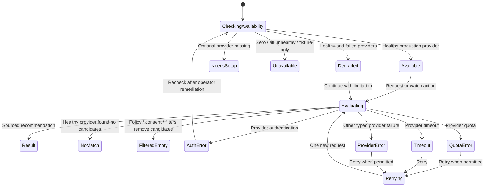

# Expected Behavior: [BUG-039-005] Provider-Backed Recommendation Readiness

## Problem Statement

Feature enablement is not capability readiness. Recommendations cannot be ready when no production provider can evaluate a request or maintain a watch.

## Outcome Contract

**Intent:** Make provider health and configuration the authoritative readiness signal for recommendation UI, APIs, watches, and product claims.

**Success Signal:** At least one configured healthy non-fixture provider yields ready actions/results; zero or unhealthy providers yield explicit unavailable/degraded status, prevent actions, and expose safe remediation.

**Hard Constraints:** No fixture provider in production, no fake result, no fallback provider, no secret output, and optional unavailability does not become a whole-product outage.

**Failure Condition:** Routes/flags alone yield ready, actions mount without providers, empty provider failure appears as no match, or tests seed a fixture in production mode.

## Requirements

- **REC-READY-001:** First production readiness SHALL require at least one operator-selected provider that is enabled, fully configured, production-capable, healthy for at least one declared recommendation category, and non-fixture.
- **REC-READY-002:** When the capability is required, enabled plus zero providers SHALL fail startup/config validation; when optional, it SHALL report unavailable and hide/refuse actions.
- **REC-READY-003:** A configured eligible but unhealthy provider SHALL contribute degraded/unavailable status with a non-sensitive cause.
- **REC-READY-004:** Fixture/test providers SHALL be impossible to register or count toward readiness in production mode.
- **REC-READY-005:** True no-match from a healthy provider SHALL differ from zero-provider, auth, timeout, quota, and provider-error outcomes.
- **REC-READY-006:** Watch creation/refresh SHALL be unavailable without a healthy provider and SHALL not create inert watches.
- **REC-READY-007:** UI/routes/status/docs SHALL consume one capability availability contract rather than infer readiness independently.
- **REC-READY-008:** Provider provenance and limitations SHALL accompany successful/degraded results.
- **REC-READY-009:** Health/metrics SHALL expose provider counts and outcome classes without credentials, query details, or personal data.
- **REC-READY-010:** Unavailable/degraded/no-match/auth/error states SHALL be accessible and responsive.
- **REC-READY-011:** The readiness denominator SHALL contain only operator-selected providers that are enabled, fully configured, production-capable, and relevant to the evaluated category. Disabled or unconfigured providers SHALL remain visible to authorized operators, SHALL be hidden from daily-user provider detail, and SHALL be excluded from both numerator and denominator.
- **REC-READY-012:** One eligible healthy provider is sufficient for first readiness. A second production provider is an independent optional expansion and SHALL NOT be a completion dependency. The concrete first adapter remains provider-neutral until design records source/config evidence for an implemented production adapter.

## First Readiness Provider Policy

- Current source declares Google Places and Yelp configuration shapes, but both are disabled and the production runtime registry is intentionally empty. Therefore this requirements packet does not select either adapter as already supported.
- The operator selects which production provider satisfies first readiness. That provider must pass the same configuration, health, provenance, privacy, and no-fixture contract regardless of brand.
- Operator status may list disabled/unconfigured declared providers as setup inventory. Daily-user surfaces see only category availability, participating provenance for actual results, and safe limitations; they do not see unused provider inventory.

## User Scenarios

```gherkin
Scenario: SCN-039-005-01 Healthy provider makes capability ready
  Given recommendations are enabled and one operator-selected production provider is eligible and healthy for the requested category
  When readiness is evaluated
  Then recommendation actions are available
  And results identify provider provenance

Scenario: SCN-039-005-02 Enabled zero-provider state is not ready
  Given recommendations are enabled and the registry has zero providers
  When startup or optional capability status is evaluated
  Then required mode refuses startup or optional mode reports unavailable
  And user actions do not mount as ready

Scenario: SCN-039-005-03 Unhealthy provider is degraded or unavailable
  Given configured providers all fail health, quota, or authentication
  When readiness is evaluated
  Then the capability is degraded or unavailable with safe remediation

Scenario: SCN-039-005-04 Fixture provider cannot satisfy production
  Given production mode and a fixture provider registration attempt
  When the registry is built
  Then registration or readiness fails
  And no fixture result is served

Scenario: SCN-039-005-05 Healthy no-match remains a valid outcome
  Given a healthy provider evaluates a request and finds no match
  When the result renders
  Then the UI shows no match with provider provenance
  And does not report zero providers or service failure

Scenario: SCN-039-005-06 Watch creation requires provider readiness
  Given no healthy provider exists
  When a user attempts to create or refresh a watch
  Then the action is refused visibly
  And no inert watch is persisted

Scenario: SCN-039-005-07 Auth and privacy boundaries hold
  Given the caller is unauthorized or provider configuration contains secrets
  When status or errors render
  Then access is denied appropriately and no secret/query/personal detail appears

Scenario: SCN-039-005-08 Partial provider degradation is transparent
  Given two eligible configured providers participate, one is healthy, and the other fails
  When a recommendation completes
  Then useful verified output is marked degraded with participating/missing provenance

Scenario: SCN-039-005-10 Disabled providers do not dilute readiness
  Given one operator-selected provider is eligible and healthy while another declared provider is disabled or unconfigured
  When readiness is evaluated for a daily user and an operator
  Then the healthy provider is sufficient for first readiness
  And the disabled or unconfigured provider is excluded from the denominator, visible only as operator setup inventory, and absent from daily-user provider detail

Scenario: SCN-039-005-09 Recommendation availability is accessible
  Given a keyboard or screen-reader user on a narrow viewport
  When ready, unavailable, degraded, no-match, or error state renders
  Then state and permitted actions are perceivable and operable without overlap
```

## Acceptance Criteria

1. Readiness derives from configured healthy non-fixture providers.
2. Adversarial production zero-provider and fixture-provider cases fail old false-ready behavior.
3. Required and optional capability modes have explicit fail-loud/unavailable semantics.
4. No-match, unavailable, degraded, auth, quota, timeout, and provider error are distinct.
5. UI/API/watch/status tests consume the same readiness contract.
6. First readiness passes with one eligible healthy provider; disabled/unconfigured providers are excluded from the denominator and a second provider is not a completion dependency.

## Release Train

- Target train: `mvp`.
- Flags introduced: none.
- The existing enablement flag cannot advertise readiness without a healthy provider in any train.

## UI Wireframes

### UX Requirements

| ID | Observable Contract |
|---|---|
| UX-039-005-01 | Recommendation request, watch, and status surfaces consume one provider-backed availability state and never infer readiness from route presence or feature enablement alone. |
| UX-039-005-02 | Request and watch-creation controls mount as operable only when at least one configured healthy non-fixture production provider can serve the relevant category. |
| UX-039-005-03 | `Needs setup`, zero-provider `Unavailable`, all-provider `Unavailable`, and partially `Degraded` states name different causes and permitted actions without exposing credentials or raw provider errors. |
| UX-039-005-04 | A healthy provider's true no-match differs from a policy/consent/filter-eliminated result and from provider/auth/quota/timeout failure. |
| UX-039-005-05 | Verified degraded results retain participating provider provenance and name missing provider classes; they never claim complete coverage. |
| UX-039-005-06 | Watch create/refresh refuses visibly before persistence when no healthy relevant provider exists; no inert row, success message, or next-run time appears. |
| UX-039-005-07 | Request, retry, and watch mutations expose submitting, accepted/persisted, idempotent, refused, and failed feedback in-flow, with duplicate activation disabled. |
| UX-039-005-08 | Unauthorized daily users see no query, watch, provider identity, health cause, or setup detail; provider remediation remains operator-only. |

### Screen Inventory

| Screen | Actor(s) | Status | Scenarios Served |
|---|---|---|---|
| Recommendation Request (`/recommendations`) | Daily user | Existing - Modify | SCN-039-005-01, 03, 05, 07, 08, 09 |
| Recommendation Watches (`/recommendations/watches` and editor) | Daily user | Existing - Modify | SCN-039-005-02, 03, 06, 07, 09 |
| Recommendation Provider Status (`/status`, Recommendations section) | Operator | Existing - Modify | SCN-039-005-01 through 04, 07 through 09 |

### UI Primitives

| Primitive | Used By Screens | Composition Rule | Accessibility / Responsive Constraint |
|---|---|---|---|
| Capability availability header | Request; Watches; Provider Status | Closed primary labels: `Checking`, `Available`, `Needs setup`, `Degraded`, `Unavailable`; explanation and last-verified time are adjacent. | Text/icon plus color; wraps before clipping. |
| Provider coverage summary | Request; Watches; Provider Status | Daily surface names participating/missing provider classes only; operator status may name configured provider display names and safe health categories. | Converts to labeled list below tablet width. |
| Action eligibility gate | Request form; New watch; Refresh watch | Operable control exists only when the relevant category has a healthy provider; refusal reason appears where the control would be. | Never disabled without associated explanatory text. |
| Outcome state region | Request; Watch mutation | One mutually exclusive state replaces the prior state; stale results cannot remain under a new failure. | Polite live region for progress/success; alert for refusal/error. |
| Provenance strip | Result card; No-match; Degraded result; Watch run | Names participating provider class/display label, observation time, and limitation; never credential/config values. | Read in source order before feedback actions. |
| Mutation feedback | Watch create/pause/resume/refresh; request retry | Fixed lifecycle: submitting, persisted/accepted, idempotent, refused, failed. | In-flow, focus-associated, no transient-only toast. |

### Screen: Recommendation Request

**Actor:** Daily User | **Route:** `/recommendations` | **Status:** Modify

**Desktop:**

```text
┌──────────────────────────────────────────────────────────────────────────┐
│ Work / Recommendations                                      [Available] │
│ [Requests] [Watches] [Preferences]                                      │
│ Coverage: [Places provider] · Verified [time]            [Why this state]│
├──────────────────────────────────────────────────────────────────────────┤
│ What are you looking for?                                                │
│ ┌──────────────────────────────────────────────────────────┐ [Recommend]│
│ │ [request text retained through terminal outcome]         │            │
│ └──────────────────────────────────────────────────────────┘            │
│ Location [named area]   Precision [Neighborhood ▾]   [More filters]     │
├──────────────────────────────────────────────────────────────────────────┤
│ [Evaluating / Results / No match / Filtered out / Typed failure]        │
│                                                                          │
│ 1. [Recommendation title]                                  [Why?]       │
│ [rationale]  [provider provenance]  [limitation when degraded]          │
│ [Not interested]                                                        │
└──────────────────────────────────────────────────────────────────────────┘
```

**Mobile / narrow viewport:**

```text
┌──────────────────────────────┐
│ Recommendations [Degraded]   │
│ [Requests][Watches][Prefs]    │
│ [coverage limitation]         │
├──────────────────────────────┤
│ What are you looking for?    │
│ ┌──────────────────────────┐ │
│ │ [request retained]       │ │
│ └──────────────────────────┘ │
│ [Location] [Precision]       │
│ [full-width Recommend]       │
├──────────────────────────────┤
│ [outcome heading + detail]   │
│ [result card]                │
│ [provenance]                 │
│ [Why?] [Not interested]      │
└──────────────────────────────┘
```

**Request states:**

| State Key | Visible Heading | Detail / Provenance | Action Rule |
|---|---|---|---|
| `checking-availability` | `Checking recommendation providers` | No provider is implied ready. | Form controls are not yet operable. |
| `available` | `Recommendations available` | Healthy relevant provider class and verified time. | Form operable. |
| `needs-setup` | `Recommendations need setup` | Supported optional provider category is not configured. | No request submit; authorized setup link only. |
| `unavailable-zero-provider` | `Recommendations are unavailable` | `No production provider is registered for this category`. | No request submit; operator-status link only when authorized. |
| `unavailable-all-unhealthy` | `Recommendation providers are unavailable` | Safe aggregate cause: authentication, quota, timeout, or provider error; no secret/provider payload. | Retry availability when cause is retryable; request submit withheld. |
| `degraded` | `Recommendations have limited coverage` | Healthy participating and unavailable provider classes plus verified time. | User may continue with explicit limitation. |
| `evaluating` | `Finding recommendations` | Retained request/filter summary without echoing it in telemetry/live announcements. | Duplicate submit disabled. |
| `results` | `[n] recommendations` | Every card has provider provenance; degraded limitation persists. | Why/feedback operable. |
| `no-match` | `No provider matches found` | Confirms healthy provider evaluation and participating provenance. | Edit request / location; no provider-retry alarm. |
| `policy-filtered-empty` | `No recommendations passed your current filters` | Names active precision/preferences/policy categories without exposing rejected candidate data. | Adjust filters/preferences. |
| `unauthorized` | `Your session ended` or access denied | Request/results/provider details removed. | Sign in again / safe return. |
| `timeout` | `Recommendation request timed out` | Safe provider class and retained form values. | Retry once. |
| `quota` | `Provider limit reached` | Safe retry guidance or unavailable-until information when known. | Retry only when permitted. |
| `provider-error` | `Recommendation provider could not complete` | Safe provider class and retained form values. | Retry when retryable. |
| `retrying` | `Trying recommendations again` | One new attempt; prior error/result replaced. | Duplicate Retry disabled. |

**Interactions:** Submit and Retry each issue one request. `Why?` opens persisted explanation/provenance for that recommendation. `Not interested` exposes `Saving feedback`, then `Feedback saved` or `Feedback could not be saved`; it never removes the card before authoritative mutation success.

**Responsive:** Form fields stack in label order; tabs horizontally scroll without hiding active state; result actions wrap below provenance. No horizontal page scroll or overlap at 320px or 200% zoom.

**Keyboard / screen reader:** Tab order follows tabs, request, location, precision, filters, Recommend, outcome, cards/actions. One polite region announces checking/evaluating/result count/no-match/filtered-empty/retrying; unauthorized and failures use one-time alerts. Availability and provenance are text, not color-only. Disabled/withheld actions expose their reason in adjacent text and are not focus traps.

### Screen: Recommendation Watches

**Actor:** Daily User | **Route:** `/recommendations/watches` and `/recommendations/watches/new` | **Status:** Modify

```text
┌──────────────────────────────────────────────────────────────────────────┐
│ Recommendation watches                                      [Available] │
│ Coverage [provider classes]                         [New watch / reason] │
├──────────────────────────────────────────────────────────────────────────┤
│ Name       Kind       State       Last run       Next due      Actions  │
│ [watch]    [kind]     [Active]    [outcome/time] [time]        [Open]   │
│                                                               [Pause]  │
│                                                               [Refresh]│
├──────────────────────────────────────────────────────────────────────────┤
│ [empty / mutation feedback / capability refusal]                        │
└──────────────────────────────────────────────────────────────────────────┘
```

**Watch states and mutation feedback:**

| State | Visible Outcome | Persistence Truth |
|---|---|---|
| Ready with no watches | `No watches yet` plus New watch. | Provider readiness is proven; list read succeeded. |
| Provider unavailable | Availability reason replaces New watch; existing watches remain visible as `Paused by provider availability` when applicable. | No new/inert watch is created. |
| Watch-list error | `Watches could not be loaded` plus Retry. | Not rendered as no watches. |
| Creating | `Saving watch and consent`; submit disabled. | No row shown yet. |
| Created | `Watch created` with persisted name/state/next due and Open action. | Appears only after authoritative read-back. |
| Create refused | `Watch not created: no healthy provider for [category]`. | Form values retained; list unchanged. |
| Refreshing | `Refreshing [watch name]`; one trigger in flight. | Prior run remains labeled prior. |
| Refreshed | New persisted run outcome/time appears: delivered, no-match, filtered, degraded, or failed. | Outcome comes from watch run record. |
| Refresh refused/failed | Safe reason and Retry/Provider status action. | No synthetic run or next-due success. |
| Pause/resume | `Saving` then `Watch paused/resumed`; row state updates after persistence. | Failure leaves prior state and exposes error. |

**Responsive:** Desktop table becomes labeled watch records on mobile; name/state/last outcome precede actions. New watch and mutation feedback stay in flow. Existing watches never disappear merely because providers become unavailable.

**Accessibility:** Each action includes watch name in its accessible label. Mutation feedback is associated with its row/form. Confirmation focus returns to the invoking action. Empty, unavailable, and list-error states are distinct headings, and provider limitations are text.

### Screen: Recommendation Provider Status

**Actor:** Operator | **Route:** `/status` (Recommendations section) | **Status:** Modify

```text
┌──────────────────────────────────────────────────────────────────────────┐
│ Recommendations provider status                            [Unavailable] │
│ Enabled [Yes] · Required [No] · Usable providers [0]                    │
├──────────────────────────────────────────────────────────────────────────┤
│ Provider       Categories      Configuration      Health      Last check│
│ [display name] [places, …]     [Configured]       [Degraded]  [time]    │
│ Safe cause: [Authentication / Quota / Timeout / Provider error]         │
├──────────────────────────────────────────────────────────────────────────┤
│ [Recheck provider health]  [Open value-safe setup guidance]              │
└──────────────────────────────────────────────────────────────────────────┘
```

**Operator behavior:** Zero-provider status explicitly reports usable/configured/fixture counts without listing secrets. Fixture registration in production is a blocking configuration status, not a provider row that can become healthy. Recheck exposes checking, recovered, unchanged-degraded, and failed feedback; it does not alter configuration or create providers.

**Responsive / accessibility:** Provider rows become labeled records. Safe cause, categories, last check, and requiredness remain visible text. Recheck status is announced politely; errors use one alert. No hover-only cause or traffic-light-only health.

### Playwright-Visible Behavior Contract

These are planned real-stack observations and do not claim provider, browser, mutation, or test execution.

| ID | Real-Stack Setup and Gesture | Required Visible Assertion | Forbidden Outcome |
|---|---|---|---|
| UX-E2E-039-005-01 | One healthy production provider serves the category; user opens Request. | `Recommendations available`, verified provider class/time, operable form; submitted request yields sourced result card. | Fixture badge, missing provenance, or setup/unavailable label. |
| UX-E2E-039-005-02 | Optional mode is enabled with zero registered providers. | `Recommendations are unavailable`, zero-provider explanation, no operable Recommend/New watch controls. | Ready/Available badge, empty result area, inert watch creation. |
| UX-E2E-039-005-03 | All configured providers fail auth, quota, timeout, and provider error in separate runs. | Matching safe cause is visible on request/status; actions are withheld or Retry appears only when permitted. | Generic no-match or exposed credential/raw payload. |
| UX-E2E-039-005-04 | Production attempts to register only a fixture provider. | Operator status reports blocking fixture/zero-usable-provider state; daily actions remain unavailable. | Fixture result or fixture counted as healthy. |
| UX-E2E-039-005-05 | Healthy provider returns no candidates. | `No provider matches found` and participating provenance are visible. | Zero-provider, setup, filtered-empty, or provider-failure copy. |
| UX-E2E-039-005-06 | Healthy provider returns candidates that user/policy filters remove. | `No recommendations passed your current filters`, active filter categories, and adjust action are visible. | `No provider matches found` or outage wording. |
| UX-E2E-039-005-07 | One provider succeeds and another fails. | `Recommendations have limited coverage`; participating/missing classes and sourced results are visible. | Full Available/healthy claim or omitted limitation. |
| UX-E2E-039-005-08 | No healthy relevant provider; user attempts create/refresh through a stale direct route or open page. | Visible refusal names unavailable category; form values/existing watch remain; no success feedback. | New inert watch, synthetic run, or next-due success. |
| UX-E2E-039-005-09 | Provider is healthy; user creates, pauses/resumes, and refreshes an owned watch. | Each action shows in-flow pending then persisted state/read-back; refresh shows actual run outcome/provenance. | Optimistic row removal/state change before persistence or duplicate action. |
| UX-E2E-039-005-10 | Session expires or unauthorized user opens request/watch/status surfaces. | Re-authentication/access-denied state is visible. | Query, watch names, provider identities, health causes, setup details, or result content in DOM/accessibility tree. |
| UX-E2E-039-005-11 | Keyboard-only user traverses request/watch/status at 320px and 200% zoom. | Focus order follows visual order; withheld actions have readable reasons; mutation/status regions are exposed; no overlap/horizontal scroll. | Pointer-only or color-only state. |

### Routed Design Questions

| Owner | Question | UX Constraint That Must Survive Resolution |
|---|---|---|
| `bubbles.design` | What shared availability contract computes category-level request/watch eligibility from configured production-provider health? | Request, watch, API, status, and claims expose one state and do not infer from route/flag presence. |
| `bubbles.design` | How are true provider no-match and post-provider policy/filter elimination represented without leaking rejected candidates? | The two empty outcomes remain separately observable with safe provenance. |
| `bubbles.design` | What mutation/read-back contract prevents stale direct routes from creating inert watches during provider loss? | Refusal occurs before persistence and every visible success follows authoritative read-back. |
| `bubbles.plan` | Which real provider-compatible test surfaces produce healthy, zero-provider, fixture-only, auth, quota, timeout, error, partial, no-match, and filtered-empty outcomes? | Real-stack browser assertions use the same availability contract and do not intercept internal traffic. |

## User Flows

### User Flow: Evaluate Provider Before Recommendation Action



### User Flow: Watch Mutation Requires Provider Readiness

```mermaid
stateDiagram-v2
  [*] --> WatchList
  WatchList --> CreateForm: Healthy relevant provider
  WatchList --> CapabilityRefusal: No healthy relevant provider
  CreateForm --> Saving: Save and confirm consent
  Saving --> Created: Persisted watch reads back
  Saving --> Refused: Provider became unavailable before persistence
  Saving --> Failed: Typed persistence error
  Created --> Refreshing: Refresh once
  Refreshing --> RunRecorded: Persisted real run outcome
  Refreshing --> Refused: Provider unavailable; no run created
  Refreshing --> Failed: Provider or persistence failure
  Refused --> WatchList: Existing list unchanged
  Failed --> WatchList: Prior authoritative state retained
```


