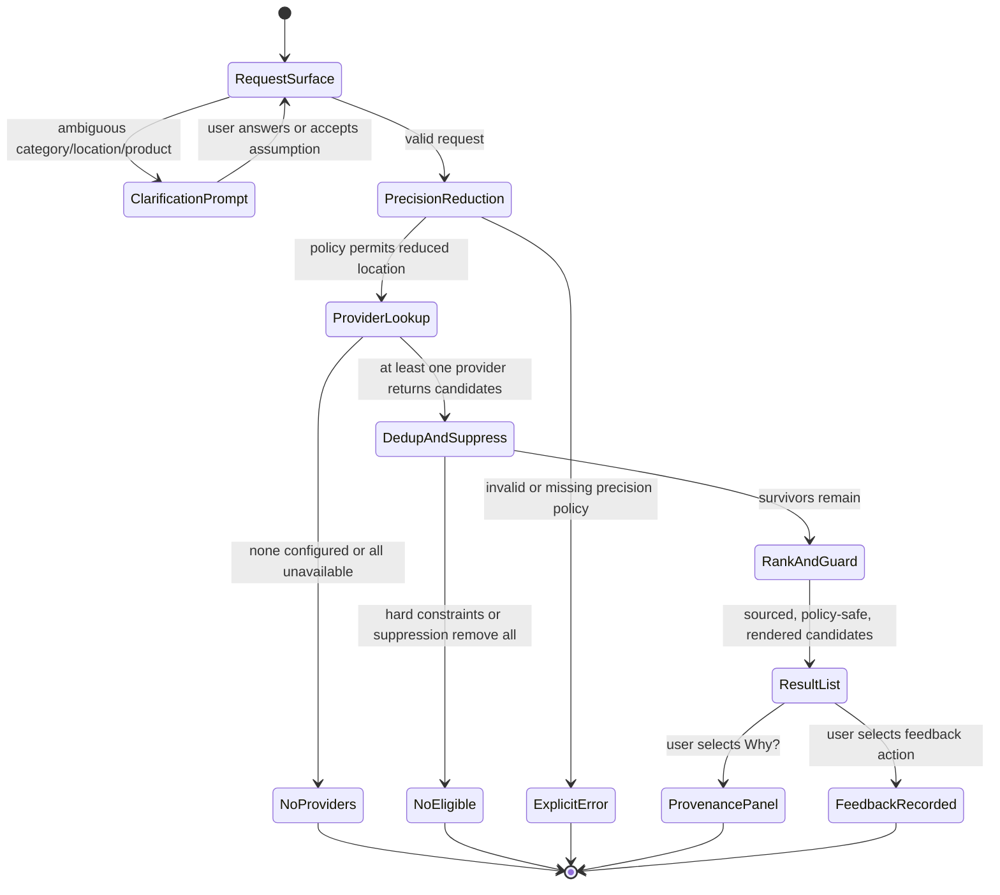
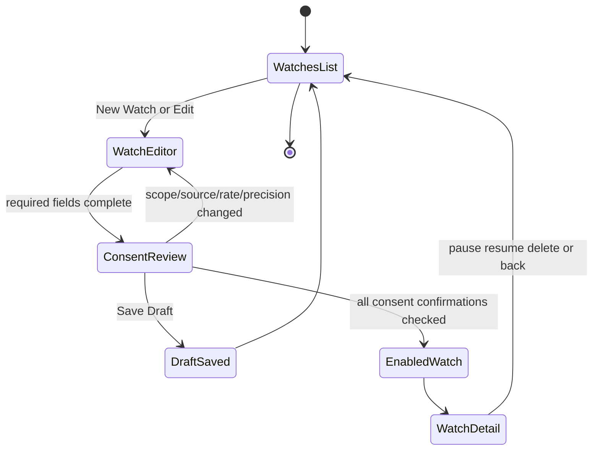
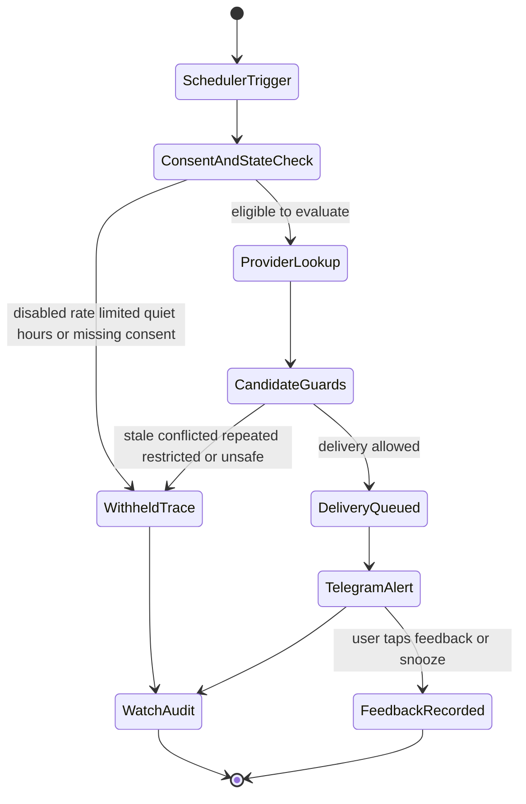
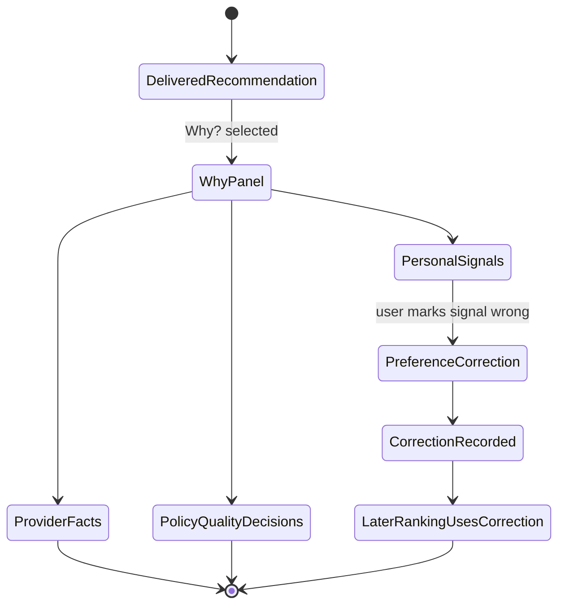
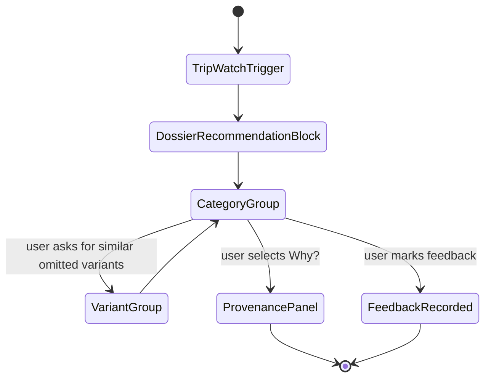

# Feature: 039 Recommendations Engine

> **Mode of analysis:** greenfield. No prior `spec.md` for recommendations
> existed. This feature introduces an entirely new capability surface that
> sits *outside* Smackerel's existing knowledge graph: instead of recalling
> what the user already captured, it actively brings in external candidates
> (restaurants, places, products, deals, articles) from third-party sources
> and ranks them against the user's personal knowledge graph.
>
> **Product alignment.**
> - Builds on Smackerel's scenario-agent direction from
>   [specs/037-llm-agent-tools](../037-llm-agent-tools/spec.md) and
>   [docs/smackerel.md §3.6](../../docs/smackerel.md): recommendation behavior
>   must be explainable, bounded, and replayable.
> - Extends the existing connector ecosystem with read-only recommendation
>   sources such as Yelp, Google Places, Foursquare, community discussions,
>   and retail/deal providers.
> - Uses the existing location/trip, digest, Telegram, and web delivery
>   surfaces rather than creating a new user channel.

## Problem Statement

Today, when the user wants a "good Japanese dinner near my hotel in Lisbon",
"a quiet co-working spot within 1 km", or "a price drop on an espresso machine
in my budget", they leave Smackerel and ask Google Maps, Yelp, Tripadvisor,
Reddit, and a price-watcher — none of which know:

- which cuisines the user has captured positively over the last year
- which places the user's friends recommended (in old emails / WhatsApp /
  Telegram captures)
- which places the user already visited (Google Maps Timeline, photos)
- which places the user explicitly disliked (a captured note: "Cervejaria X —
  tourist trap, skip")
- price/quality tier the user gravitates to (inferred from purchase history,
  saved products)
- dietary, accessibility, or schedule constraints scattered across notes and
  calendar

Conversely, when the user is *not* asking — sitting in a new neighbourhood for
a weekend, or passively shopping for a particular item over weeks — there is
no system that watches for relevant nearby/online opportunities and surfaces
them at the right moment. Existing competitors do one half of this poorly:
Google/Yelp recommend without personal knowledge, and personal-AI products recall
without external lookup.

The result: the user's most personal knowledge — their captured preferences,
their friends' tips, their past visits — is sitting in Smackerel and silently
unused at the exact moments it would matter most.

## Current Capability Map

| Capability | Existing Surface | Status | Recommendation Gap |
|------------|------------------|--------|--------------------|
| Connector framework | `internal/connector/` includes maps, browser, bookmarks, markets, weather, alerts, RSS, Twitter, Discord, Telegram-adjacent capture, and other source connectors | Present | No connector category currently returns external recommendation candidates from place, shopping, event, or community sources |
| Location history and trip context | [specs/011-maps-connector](../011-maps-connector/spec.md), `internal/connector/maps`, and trip-prep behavior in [specs/021-intelligence-delivery](../021-intelligence-delivery/spec.md) | Partial | The system can reason about where the user has been or is going, but cannot ask external sources what is good nearby |
| In-graph recommendation recall | Person/entity recommendation edges in [specs/025-knowledge-synthesis-layer](../025-knowledge-synthesis-layer/spec.md), plus existing "what did Sarah recommend" scenarios in foundation specs | Present | The system recalls recommendations already captured, but does not match them against live external candidates |
| Prompt-contract and scenario foundation | Existing processing/synthesis contracts are present; [specs/037-llm-agent-tools](../037-llm-agent-tools/spec.md) defines scenario orchestration | Foundation present | No recommendation scenarios, candidate-ranking contract, or watch-evaluation contract exists yet |
| Product and price understanding | `product-extraction-v1.yaml`, receipt/expense work in [specs/034-expense-tracking](../034-expense-tracking/spec.md), and price filter parsing in `internal/api/domain_intent.go` | Partial | The system can understand product/price-like artifacts, but cannot monitor outside offers or price changes |
| Alerts and delivery | [specs/021-intelligence-delivery](../021-intelligence-delivery/spec.md), alert response types in `internal/api/context.go`, Telegram and web delivery surfaces | Present / partial | Alert plumbing exists, but recommendation watches need their own rate limits, provenance, and feedback states |
| External provider aggregation | None found in current source/spec inventory | Missing | Yelp/Google/Foursquare/retail/community provider lookup, candidate deduplication, provider attribution, and graceful degradation must be added |

## Outcome Contract

**Intent:** Smackerel can produce, on demand or proactively, a small ranked
list of external recommendations (places, products, content, deals) that are
both (a) sourced from real third-party providers, and (b) personalized using
the user's own knowledge graph (captured preferences, past visits, friends'
recommendations, dietary/budget/temporal constraints). The user sees clearly
*why* each recommendation was chosen and *which sources* it came from.

**Success Signal:** A self-hosted user can:
1. Ask "find me a quiet ramen place within 1 km" via Telegram and within
   ≤ 10 seconds receive 3 ranked recommendations, each with name, distance,
   provider source(s), one-line rationale tied to the user's own data
   ("Sarah recommended this in March; you visited the same chef's other
   restaurant in 2025"), and a link.
2. Configure a standing recommendation watch ("notify me about ≥ 25% price
   drops on espresso machines under $800 from my saved brand list") and
   later receive a single Telegram alert when a real, current matching offer
   is found.
3. Inspect, in any recommendation response, the full provenance trail:
   which providers were queried, which candidates returned, which were
   filtered out and why, and which knowledge-graph signals influenced the
   final ranking.

**Hard Constraints:**
- Recommendations MUST aggregate from at least two independent providers per
  category (places, products) when both are configured — never single-source
  for categories where the user has enabled multiple providers.
- Recommendations MUST be re-rankable using personal-knowledge signals: prior
  visits, captured positive/negative notes, friend recommendations, captured
  preferences, dietary/budget/accessibility constraints. A recommendation
  produced *without* graph-derived signals MUST be labeled as "no personal
  signals applied".
- Every recommendation response MUST cite (a) the third-party source(s) for
  the candidate and (b) the personal-knowledge artifact(s) that influenced
  ranking, by ID. Unsourced claims MUST be impossible to render.
- Negative-feedback signals already in the graph (captured "skip", "tourist
  trap", "made me sick", "do not return") MUST suppress the matching place
  or product from results unless the user explicitly overrides.
- Watches MUST be declarative, scoped, rate-limited, and silenceable. A
  watch MUST NOT generate more than its configured maximum alerts per
  rolling window (initial standard: 2 per day per watch).
- All location-bearing requests MUST honor the configured location-precision
  policy (e.g., neighborhood-level vs exact GPS) and MUST NOT leak finer
  precision to third-party providers than the user authorized for that
  watch or query.
- Provider API keys, quotas, and per-provider failures MUST be handled at
  the connector layer; a single provider outage MUST NOT fail a multi-source
  recommendation if any other source returned results.
- Proactive monitoring MUST be explicit opt-in per watch. The system MUST NOT
  infer or create standing watches from passive user behavior alone.
- Sponsored, affiliate, promoted, or paid-placement candidates MUST be
  labeled before ranking and delivery. Paid placement MUST NOT override
  personal constraints, negative feedback, safety policy, or source quality.
- Age-restricted, regulated, medical, legal, emergency, unsafe, or recalled
  categories MUST be blocked, downgraded, or clearly labeled according to the
  user's policy and applicable source facts. The system MUST NOT present such
  recommendations as ordinary lifestyle suggestions.
- Ranked lists MUST be useful, not merely high-scoring. The system MUST avoid
  repetitive near-duplicates, repeated watch alerts for the same candidate,
  hidden cost surprises, and unlabeled travel-effort assumptions.
- The capability MUST be orchestrated through the scenario capability from
  spec 037, not as a new hardcoded intent router or recommendation rule
  engine.
- The system MUST NOT execute purchases, bookings, or any other write actions
  on third-party providers in v1; recommendations are read-only outputs.

**Failure Condition:** This feature has failed if any of the following hold:
- The system returns recommendations that contradict an explicit
  negative-feedback artifact already in the graph.
- "Personalized" recommendations are demonstrably indistinguishable from a
  raw provider listing (no measurable graph influence).
- A user cannot tell which provider a candidate came from, or which personal
  artifacts influenced its rank.
- A configured watch fires more often than its declared rate limit, or fires
  silently with no auditable trace.
- Location precision sent to a third party exceeds the user's configured
  precision policy for that surface.
- A sponsored or affiliate candidate is delivered without disclosure.
- A proactive watch is created or broadened without explicit user consent.
- A recommendation ignores a known safety warning, recall, restricted-category
  policy, or corrected user preference.
- A watch repeatedly alerts about the same or nearly identical candidate
  without a material change or explicit user request.
- A recommendation presents a candidate as convenient, affordable, or
  best-fit while hiding known travel effort, total cost, uncertainty, or
  hard-constraint relaxation.

## Goals

- G1: Represent delivered recommendations and standing recommendation watches
  as durable, searchable records with provenance back to provider candidates
  and personal-knowledge signals.
- G2: Let operators add or disable external recommendation sources by category
  without changing user-facing recommendation behavior.
- G3: Rank raw external candidates against personal graph context: visits,
  captured recommendations, captured negatives, preferences, dietary needs,
  budget constraints, schedule, and trip context.
- G4: Support direct recommendation requests for nearby, named-location, and
  online contexts.
- G5: Support standing watches for location-radius suggestions,
  topic/keyword scans, trip-context suggestions, and price-drop alerts.
- G6: Deliver recommendations through existing channels: Telegram, web UI,
  daily digest, weekly synthesis, and trip dossier surfaces.
- G7: Record every recommendation event with enough detail to answer "why did
  you suggest this?" without repeating the external lookup.
- G8: Let the user give feedback (liked, disliked, not interested, snooze,
  override) and have that feedback influence later ranking and suppression.
- G9: Keep working when one configured external source is unavailable, quota
  limited, or returns poor-quality data.
- G10: Enforce a configurable location-precision policy per request and watch,
  so third-party sources receive only the precision needed for the user's goal.
- G11: Keep the user in control of the inferred preference profile used for
  ranking, including inspecting, correcting, and deleting incorrect preference
  signals.
- G12: Prevent commercial bias, unsafe categories, and restricted-category
  recommendations from bypassing provenance, personalization, and policy
  checks.
- G13: Keep result lists diverse, non-repetitive, and honest about travel,
  cost, uncertainty, and hard constraints so recommendations remain useful
  after repeated use.

## Non-Goals

- **Booking, ordering, or purchasing.** No reservations, no checkout, no
  cart. This feature is read-only suggestion only.
- **Real-time streaming feeds.** Watches are polled on schedule, not pushed.
- **Social-graph recommendations from external networks.** Smackerel will not
  ingest a friend's public reviews from Yelp/Google to recommend "what your
  network likes" — only personal artifacts already in the graph.
- **Generic search engine.** This is recommendation, not search. "Find me
  any Italian restaurant" is a recommendation request; "find me information
  about pasta history" remains a knowledge-graph query handled by existing
  retrieval.
- **Cross-tenant recommendations or marketplace.** Single-user system.
- **Replacing existing in-graph recall.** "What did Sarah recommend?" stays
  on the existing person-scoped retrieval path. This feature triggers when
  the user wants candidates *beyond* what is already in the graph.
- **Travel itinerary planning.** Multi-day, multi-stop optimization is out of
  this feature's boundary; trip dossiers are augmented with recommendations,
  but itinerary assembly remains a separate capability.
- **Auto-extending the location-history surface.** This feature consumes the
  existing Maps connector's location data; it does not add new always-on
  location tracking.
- **Financial or investment advice.** The feature may recommend consumer
  products, places, events, and content; it MUST NOT produce buy/sell signals,
  investment recommendations, price targets, or portfolio advice, preserving
  the financial-market boundary in [specs/018-financial-markets-connector](../018-financial-markets-connector/spec.md).
- **Medical, legal, emergency, or safety-critical advice.** The feature may
  surface provider facts and general consumer options, but it MUST NOT tell
  the user what medical, legal, emergency, or safety-critical action to take.
- **Sponsored placement business model.** The feature may ingest source facts
  that label a candidate as sponsored or promoted, but Smackerel itself does
  not sell ranking position or inject paid placement into the recommendation
  list.

## Requirements

Functional and non-functional requirements written as observable behavior.

### Reactive recommendations (on request)

- R-001: The system SHALL accept recommendation requests from any existing
  user channel (Telegram, web UI, API) using the same input surface as
  capture and search.
- R-002: A recommendation request SHALL be parseable into: category (place,
  product, content, deal), location anchor (current, named, none), filters
  (cuisine, price, dietary, brand, keyword, opening-hours), and result count.
  If the user does not specify a count, the standard response is 3 results;
  no response may show more than 10 results.
- R-003: For place-category requests, the system SHALL evaluate every enabled
  and eligible place source unless the user explicitly restricts sources in
  the request.
- R-004: For product-category requests, the system SHALL evaluate every
  enabled and eligible product or deal source unless the user explicitly
  restricts sources in the request.
- R-005: The system SHALL deduplicate candidates that the providers describe
  as the same real-world entity (same place, same product) and merge their
  provider sources on the surviving candidate.
- R-006: The system SHALL filter candidates against negative-feedback
  artifacts in the graph (captured "skip / avoid / bad experience" notes
  matching by entity id, name, or tight geographic match).
- R-007: The system SHALL rank surviving candidates using personal signals:
  friend recommendations, captured preferences, prior visits, past purchases,
  dietary needs, budget constraints, time availability, trip context, and
  source quality.
- R-008: Each recommendation in the response SHALL include: title, brief
  description, distance / availability / price (as applicable), provider
  badge(s), and a one-line rationale that cites at least one personal-graph
  artifact id when graph signals influenced the rank, or an explicit
  "no personal signals applied" marker otherwise.
- R-009: Reactive recommendation responses SHALL meet a P95 latency target
  of ≤ 10 seconds end-to-end on a warm cache, ≤ 20 seconds cold.
- R-009A: Place recommendations SHALL support at least these categories:
  restaurants, cafes, bars, sights, parks, shops, services, errands, events,
  and quiet work/study locations.

### Proactive recommendations (watches)

- R-010: The system SHALL allow declaring standing recommendation watches with
  a name, kind (location-radius | topic-keyword | trip-context | price-drop),
  scope (location anchor or topic anchor or trip anchor or product anchor),
  filters, allowed sources, schedule or trigger, max alerts per rolling
  window, delivery channel, and silence hours.
- R-011: A location-radius watch SHALL fire when the user enters or stays in
  the watch's location radius beyond the configured dwell threshold AND
  matching candidates are found AND the watch's rate limit allows it.
- R-012: A topic-keyword watch SHALL fire when its scheduled scan finds at
  least one new candidate beyond the watch's seen-set AND the watch's rate
  limit allows it.
- R-013: A price-drop watch SHALL fire when a tracked product/category drops
  by at least the configured percentage or absolute amount from its tracked
  baseline AND the watch's rate limit allows it.
- R-014: A trip-context watch SHALL fire on a schedule relative to the
  detected or upcoming trip's dates (e.g., "5 days before departure") and
  produce destination-scoped recommendations grouped into the trip dossier.
- R-015: All watches SHALL respect their configured maximum alerts per
  rolling window. Excess matches SHALL be queued, summarized, or suppressed
  per watch policy and SHALL be visible in the audit trace.
- R-016: All watches SHALL be individually pause-able, edit-able, and
  delete-able by the user via a documented command surface (Telegram and/or
  web UI).
- R-017: Watch executions SHALL persist a `Recommendation` artifact for each
  surfaced candidate, even if the candidate is later marked "not interested"
  by the user — so the audit trail and feedback loop survive.

### Personalization & feedback loop

- R-018: The personalization step SHALL accept raw candidates plus a bounded
  graph snapshot and return ranked candidates, per-candidate rationale, and
  the exact signals used.
- R-019: The system SHALL accept user feedback on any delivered recommendation
  via the existing channels: "tried it — liked", "tried it — disliked",
  "not interested", "snooze N days". Each feedback action SHALL update the
  graph and influence later ranking and suppression.
- R-020: Disliked candidates SHALL be suppressed from later watches and
  reactive responses for that user (not globally) for at least the configured
  retention window.
- R-021: "Not interested" candidates SHALL be suppressed from the same watch
  permanently, but MAY still appear in unrelated watches/queries.
- R-022: Liked candidates that the user actually visited (confirmed by Maps
  history or explicit capture) SHALL be promoted as positive signal in
  later ranking on related categories.

### Provenance, audit, and trust

- R-023: Every recommendation event SHALL emit an auditable trace
  containing: request id, scenario id, providers queried, raw candidate
  count per provider, dedup decisions, filters applied, signals used in
  ranking, final ranked list, and delivery destination.
- R-024: Every recommendation rendered to the user SHALL carry stable refs
  to: provider source(s), graph-artifact ids that influenced rank, and the
  trace id of the originating event.
- R-025: A user query "why did you recommend X?" SHALL be answerable from the
  trace + graph refs without any further provider call.
- R-026: Recommendation traces SHALL contain enough structured data to replay
  the decision path against controlled fixtures in tests.

### Privacy, location, and quotas

- R-027: A configurable location-precision setting SHALL exist per watch
  and per query with values at least: exact location, neighborhood, and city.
  Unless the user requests higher precision, mobile ad-hoc queries use
  neighborhood-level precision.
- R-028: The system SHALL reduce outgoing source requests to the configured
  precision level before contacting any external source. External requests
  SHALL never carry exact location unless the active surface explicitly
  requested it AND the user-level policy allows it.
- R-029: Per-provider credentials, quotas, and rate limits SHALL come from
  the project's configuration single source of truth and never from
  duplicated or hardcoded values.
- R-030: When a provider exceeds its quota or returns a rate-limit error,
  the system SHALL degrade gracefully: skip that provider for the remainder
  of the rolling window, surface the degradation in the recommendation's
  audit trace, and continue with remaining providers.
- R-031: Provider request/response payloads SHALL NOT be persisted in raw
  form beyond the configured retention window, except for the structured
  recommendation artifact derived from them.

### Non-functional

- R-032: A reactive recommendation request SHALL have P95 ≤ 10 s warm and
  ≤ 20 s cold from user request to delivered response.
- R-033: A watch evaluation cycle SHALL complete within its scheduled
  interval at the 95th percentile or be flagged via observability metrics.
- R-034: The system SHALL emit metrics per provider (requests, errors,
  latency, candidates returned, dedup rate, suppression rate) per spec 030
  / observability conventions.
- R-035: The system SHALL be operable with zero configured external
  providers (all-disabled mode) — in which case it SHALL refuse
  recommendation requests with a clear error rather than fabricating
  candidates.
- R-036: Recommendation behavior SHALL support a local-only ranking path for
  personal graph data; only external candidate lookup requires third-party
  source calls.

### Candidate quality and source obligations

- R-037: The system SHALL treat availability, opening hours, inventory, and
  price as time-sensitive facts. Candidates with stale or unverifiable
  time-sensitive facts SHALL be withheld from proactive alerts and clearly
  marked in reactive results.
- R-038: When enabled sources disagree on a material fact (e.g., hours,
  closure state, price, stock, address, or rating), the response SHALL surface
  the conflict instead of silently choosing one source as authoritative.
- R-039: Source attribution and display obligations required by each provider
  SHALL be preserved in user-visible responses and recommendation records.
- R-040: Ambiguous user intent (unclear category, location, radius, budget, or
  product identity) SHALL produce a concise clarification prompt before any
  external lookup unless the user explicitly accepts a stated assumption.
- R-041: Proactive watches SHALL NOT alert from cached source data older than
  the watch's freshness policy. Such matches SHALL be recorded as not eligible
  for delivery.
- R-042: Quiet hours and explicit user silence commands SHALL override watch
  delivery even when a candidate otherwise qualifies.

### Consent, commercial bias, and safety policy

- R-043: Creating, enabling, or broadening a proactive watch SHALL require an
  explicit user action that names the watch scope, source category, delivery
  channel, rate limit, and location precision when location is involved.
- R-044: Sponsored, affiliate, promoted, or paid-placement indicators from a
  source SHALL be preserved and visible before a candidate can be delivered.
- R-045: Sponsored or affiliate status SHALL NOT improve rank unless the user
  has explicitly enabled commercial promotions for that watch or query; even
  then, it SHALL never override personal constraints or negative feedback.
- R-046: The user SHALL be able to inspect, correct, and remove inferred
  preference signals used for recommendation ranking.
- R-047: Preference corrections SHALL affect subsequent ranking and SHALL be
  cited in later recommendation rationales when they influence a result.
- R-048: The system SHALL apply restricted-category policy before delivery for
  age-restricted goods, regulated services, medical/legal/emergency contexts,
  unsafe activities, recalled products, and explicit user-blocked categories.
- R-049: If a candidate is withheld by restricted-category or safety policy,
  the response SHALL explain the category-level reason without replacing it
  with fabricated alternatives.
- R-050: A recommendation response SHALL distinguish between provider facts,
  personal-graph signals, and system policy decisions so the user can tell
  why a candidate was ranked, withheld, or labeled.

### Result quality, diversity, and fatigue control

- R-051: A ranked recommendation list SHALL avoid presenting near-duplicate
  candidates as separate top results unless the user explicitly asks for more
  of the same. If all eligible candidates are similar, the response SHALL say
  so.
- R-052: Delivered candidates SHALL carry seen-state for the relevant query or
  watch context so later responses can identify repeated suggestions.
- R-053: Proactive watches SHALL NOT alert repeatedly for the same candidate,
  near-duplicate candidate, or unchanged deal within the configured cooldown
  window unless the user explicitly asks to be reminded.
- R-054: The system SHALL distinguish hard constraints from soft preferences.
  If hard constraints eliminate all candidates, the response SHALL state that
  no eligible match exists instead of silently relaxing the constraint.
- R-055: Place recommendations SHALL label travel effort facts clearly:
  provider distance, estimated route mode, straight-line distance, opening
  window, and uncertainty when any of those facts are unavailable.
- R-056: Product or deal recommendations SHALL show total-cost facts when
  known, including price, shipping, taxes/fees, availability, return limits,
  and whether any of those facts are unknown or stale.
- R-057: Ranking explanations SHALL surface low-confidence fit when source
  quality is thin, personal signals are weak, or the top result wins only by
  generic provider popularity.
- R-058: The user SHALL be able to request a recommendation style at least
  across familiar, novel, and balanced results; the standard style is balanced
  and MUST NOT collapse into pure provider popularity.

---

## Actors & Personas

| Actor | Description | Key Goals | Permissions |
|-------|-------------|-----------|-------------|
| User | Single self-hosted user, on mobile or desktop, sometimes traveling | Get good, personalized suggestions on demand; receive timely watch alerts; never feel surveilled or spammed | Issue recommendation requests; create/edit/pause/delete watches; provide feedback; override suppression |
| Developer / Operator | Person extending Smackerel | Add a new source or recommendation category without changing existing recommendation behavior | Configure sources, inspect traces, and verify provider attribution |
| System (Recommendation Orchestrator) | Internal capability that interprets recommendation requests, gathers candidates, ranks them, and delivers a result | Produce correct, audited, personalized recommendations | Read graph context, query enabled sources, write recommendation records and traces, enqueue delivery |
| System (Watch Scheduler) | Internal scheduler that evaluates standing watches | Run watches at configured cadence, enforce rate limits, dispatch results | Trigger watch evaluations, read watch records, write recommendation records, never bypass silence/precision settings |
| System (External Source Adapter) | Read-only integration with a third-party recommendation source | Fetch candidates with the configured precision and quotas; surface errors honestly | Outbound read-only access; never write to providers; never send precision finer than authorized |
| System (Personalization Ranker) | Internal capability that ranks candidates against a graph snapshot | Produce ranked list with explainable rationale | Read bounded graph context; do not contact third parties directly |
| System (Policy Guard) | Internal capability that applies consent, sponsorship, restricted-category, and safety rules before delivery | Keep ranking honest, consentful, and safe | Read recommendation candidates, source labels, user policy, and preference corrections; block or label outputs before delivery |
| System (Quality Guard) | Internal capability that checks result diversity, repeats, travel effort, total cost, confidence, and watch fatigue before delivery | Keep recommendations useful over repeated use | Read candidate list, seen-state, watch history, user style preference, and source facts; label, diversify, suppress, or group outputs before delivery |

---

## Use Cases

### UC-001: User asks for a nearby place

- **Actor:** User (on Telegram)
- **Preconditions:** User has at least one place provider configured. User
  shared (or implicitly has) a current location at the configured precision.
- **Main Flow:**
  1. User types "find me a quiet ramen place within 1 km".
  2. The system identifies this as a place recommendation request with
    current-location anchor, quiet ambience, ramen category, and 1 km radius.
  3. Enabled place sources return raw candidates.
  4. The system merges duplicates across sources.
  5. The system removes candidates flagged negatively in the user's graph.
  6. The system ranks survivors using bounded personal context.
  7. Top 3 are formatted with rationale, source badges, and links.
  8. The response is delivered to the originating Telegram chat.
- **Alternative Flows:**
  - 3a. One provider errors → audit-logged, others continue (R-030).
  - 5a. All candidates suppressed → respond "I have nothing I'd recommend
    here right now; here's why" with the suppressed-set summary.
  - 7a. No personal signals available → respond with source-provided rank,
    explicitly labeled "no personal signals applied" (R-008).
- **Postconditions:** A `Recommendation` artifact per delivered candidate is
  persisted; a trace is emitted.

### UC-002: User asks for recommendations at a remote location

- **Actor:** User (on web UI or Telegram)
- **Preconditions:** Same as UC-001, plus the request explicitly references
  a location ("near Belém, Lisbon"), so no current-location dependency.
- **Main Flow:** As UC-001, with the named place resolved before external
  sources are queried. Location precision policy still applies.
- **Alternative Flows:**
  - 1a. Named place ambiguous → ask one clarifying question with up to 3
    candidate resolutions; if no reply within timeout, choose the highest
    confidence and label the response with the assumption.

### UC-003: Proactive nearby suggestion when dwelling in a new area

- **Actor:** System (Watch Scheduler) → User
- **Preconditions:** User configured a `location-radius` watch ("when I'm in
  a new neighborhood for ≥ 30 min, suggest 1 coffee shop"). Maps connector
  has detected the dwell.
- **Main Flow:**
  1. Scheduler triggers watch on dwell-event.
  2. The system gathers candidates for the dwell location.
  3. Suppression and personalization apply as in UC-001.
  4. If the watch's rate-limit allows and ≥ 1 candidate survives, the
     system delivers the top recommendation with rationale.
- **Alternative Flows:**
  - 4a. Rate-limit exceeded → batched into the next allowed window or
    dropped per watch policy; logged in trace.
  - 4b. No survivors → silent (no false alerts).
- **Postconditions:** Even silent runs persist a trace for auditability.

### UC-004: Standing online-shopping watch (price drop)

- **Actor:** System (Watch Scheduler) → User
- **Preconditions:** User configured a `price-drop` watch ("≥ 25% drop on
  espresso machines under $800 from brand list X"). Product/deal connector
  configured.
- **Main Flow:**
  1. Scheduler triggers watch on cron (e.g., daily).
  2. The system fetches current prices across allowed sources.
  3. The watch compares current prices against tracked baseline and threshold.
  4. Survivors are personalized (e.g., user's saved-product brand affinity)
     and ranked.
  5. If the watch's rate-limit allows and ≥ 1 survives, deliver alert.
- **Alternative Flows:**
  - 2a. Provider unavailable → degraded run, audit-logged, do not fire
    alert based on missing data.
  - 3a. Baseline missing → first run establishes baseline silently; no
    alert.
- **Postconditions:** Per-product price history grows; recommendation
  artifacts persisted only on real fires.

### UC-005: Pre-trip recommendation dossier

- **Actor:** System (Watch Scheduler) → User
- **Preconditions:** A trip is detected by the existing trip-dossier path;
  user has a `trip-context` watch enabled (e.g., "5 days before any trip,
  recommend 5 places per category I care about").
- **Main Flow:**
  1. Scheduler triggers the watch at the trip-relative offset.
  2. Watch scenario resolves the destination, queries place providers,
     merges with graph-known places (already-saved restaurants, friend
     recommendations for that city), and ranks them.
  3. Output is integrated into the trip dossier and delivered through the
     normal trip-dossier delivery path.
- **Postconditions:** Trip dossier carries explicit recommendation
  provenance; user can request "more like X" refinements against the same
  trip context.

### UC-006: Recommendation grounded in friends' past tips

- **Actor:** User
- **Preconditions:** User has captured artifacts where a contact recommended
  things in this city (RECOMMENDED edges).
- **Main Flow:** When ranking candidates, the personalization scorer detects
  overlap (by name, place id, or geographic + cuisine match) between provider
  candidates and graph-recommended-by-known-person, and boosts those
  candidates with rationale "Sarah recommended this in March".
- **Postconditions:** Same as UC-001; rationale cites the friend artifact.

### UC-007: Feedback loop

- **Actor:** User
- **Preconditions:** User received a recommendation.
- **Main Flow:** User replies "tried it, liked" / "tried it, disliked" /
  "not interested" / "snooze 30d". The feedback action writes a graph edge
  on the `Recommendation` artifact and the underlying place/product entity,
  and updates the suppression / promotion sets per R-019..R-022.
- **Alternative Flows:**
  - 1a. User overrides suppression: "actually, recommend X again". The
    suppression edge is reversed and traced.

### UC-008: Privacy-controlled location request

- **Actor:** User
- **Preconditions:** User has set `location_precision` policy.
- **Main Flow:** Any recommendation that needs a provider lookup calls the
  precision-reduction step before any external lookup. External sources
  receive only the policy-permitted precision. The trace records both the
  raw and reduced precision locally so the user can audit.
- **Postconditions:** No third party ever sees finer precision than policy
  allows.

### UC-009: Provider degradation

- **Actor:** System (Recommendation Agent)
- **Preconditions:** ≥ 2 providers configured for the relevant category.
- **Main Flow:** One provider errors / quota-exceeds. The agent skips it
  for the remainder of its rolling window, marks the recommendation trace
  with the degraded-source list, and continues with remaining providers.
  If all providers are unavailable, the agent responds with an explicit
  "no providers available right now" — never with hallucinated candidates.

### UC-010: Ambiguous request clarification

- **Actor:** User
- **Preconditions:** User asks for a recommendation but leaves a material
  constraint unclear, such as "good bars around there" with no resolvable
  location anchor.
- **Main Flow:** The system identifies the missing or ambiguous constraint,
  asks one concise clarification question with a small set of likely choices,
  and waits for the user's reply before contacting external sources.
- **Alternative Flows:**
  - 1a. User says "you choose" or accepts a stated assumption → proceed and
    label the response with that assumption.
  - 1b. User does not reply within the configured interaction window → no
    external lookup occurs and no recommendation artifact is created.

### UC-011: Watch lifecycle and quiet hours

- **Actor:** User / System (Watch Scheduler)
- **Preconditions:** User has at least one standing watch enabled with quiet
  hours or a temporary silence command.
- **Main Flow:** A watch finds a qualifying candidate during quiet hours. The
  system records the match, withholds delivery, and either queues, summarizes,
  or drops it according to the watch policy. The user can later inspect why
  delivery did not happen.
- **Postconditions:** The watch's rate-limit and audit history reflect the
  withheld match without disturbing the user's silence window.

### UC-012: Source conflict and stale fact handling

- **Actor:** User
- **Preconditions:** Two enabled sources return the same candidate but disagree
  on a material fact, or one source returns data older than the freshness
  window.
- **Main Flow:** The system deduplicates the candidate, marks the disputed or
  stale fact, and either withholds it from proactive delivery or shows it in a
  reactive response with the conflict clearly stated.
- **Postconditions:** The recommendation record preserves the provider facts
  and the reason the candidate was delivered, withheld, or downgraded.

### UC-013: User creates a watch with explicit consent

- **Actor:** User
- **Preconditions:** User wants proactive recommendations for a recurring
  need, such as price drops or nearby coffee suggestions.
- **Main Flow:** The user names the watch, chooses its scope, confirms allowed
  sources, sets a delivery channel and rate limit, and confirms location
  precision if the watch uses location. The watch remains inactive until all
  required consent details are confirmed.
- **Postconditions:** The watch record contains the consented scope and the
  system cannot broaden that scope without another user action.

### UC-014: User corrects an inferred preference

- **Actor:** User
- **Preconditions:** A recommendation rationale claims a preference that is
  wrong, such as "you like spicy food".
- **Main Flow:** The user marks the preference as incorrect. The system records
  the correction, stops using that signal in ranking, and cites the correction
  when it prevents later candidates from ranking highly.
- **Postconditions:** The corrected preference is inspectable and reversible.

### UC-015: Sponsored or affiliate candidate transparency

- **Actor:** User
- **Preconditions:** A source returns a candidate with sponsored, promoted, or
  affiliate metadata.
- **Main Flow:** The system labels the commercial status, prevents the label
  from improving rank by default, and shows the user why the candidate did or
  did not appear.
- **Postconditions:** Sponsored status is stored with the recommendation record
  and is visible in provenance.

### UC-016: Restricted or unsafe candidate handling

- **Actor:** User
- **Preconditions:** A provider returns a candidate in a restricted category,
  or a product candidate has a recall or safety warning.
- **Main Flow:** The system applies policy before delivery. It withholds,
  downgrades, or labels the candidate and explains the category-level reason.
- **Postconditions:** The system does not replace the withheld candidate with
  invented alternatives, and the policy decision remains auditable.

### UC-017: User receives a diverse ranked list

- **Actor:** User
- **Preconditions:** Multiple eligible candidates exist, but several are
  near-duplicates by place, chain, product family, or provider listing.
- **Main Flow:** The system groups near-duplicates, chooses a diverse ranked
  set by default, and labels any repeated or similar option when it is still
  useful.
- **Alternative Flows:**
  - 1a. User asks for "more like this" → near-duplicates are allowed and
    labeled as variants.
- **Postconditions:** The recommendation trace records which candidates were
  grouped, omitted, or shown for diversity.

### UC-018: User compares convenience and total cost

- **Actor:** User
- **Preconditions:** A candidate's apparent quality depends on travel effort
  or total cost beyond the headline provider score.
- **Main Flow:** The response labels whether distance is route-based or
  straight-line, shows known cost components, and marks unknown or stale facts
  so the user can judge tradeoffs.
- **Postconditions:** The recommendation rationale distinguishes provider
  facts from inferred convenience or affordability.

### UC-019: Watch fatigue is controlled

- **Actor:** User / System (Watch Scheduler)
- **Preconditions:** A watch has already delivered a candidate or a near-
  duplicate candidate within its cooldown window.
- **Main Flow:** The scheduler groups or withholds repeated matches unless a
  material fact changed, such as price drop, availability, rating, opening
  state, or the user explicitly requested reminders.
- **Postconditions:** The watch audit shows repeated matches as grouped,
  withheld, or delivered due to material change.

---

## User Scenarios (Gherkin)

```gherkin
Scenario: BS-001 Nearby reactive recommendation with personal signals
  Given the user is on Telegram with location precision "neighborhood"
    And providers Yelp and Google Places are configured and healthy
    And the user has a captured artifact where Sarah recommended ramen at "Menkichi"
  When the user sends "find me a quiet ramen place within 1 km"
  Then the system returns 3 ranked candidates within 10 seconds
    And each candidate cites at least one provider source
    And the candidate "Menkichi" appears with rationale that cites Sarah's
        recommendation artifact id
    And no candidate marked negative in the graph appears in the response

Scenario: BS-002 Reactive recommendation with no personal signals available
  Given the user has no captured signals about coffee shops in this city
    And providers Foursquare and Google Places are configured and healthy
  When the user asks "find me a coffee shop nearby"
  Then the system returns up to 3 ranked candidates
    And each candidate carries a "no personal signals applied" label

Scenario: BS-003 Proactive location-radius watch fires once on dwell
  Given the user configured a watch "new neighborhood coffee, max 1 alert/day"
    And the user has been dwelling in a new neighborhood for 35 minutes
    And at least one matching candidate exists across configured providers
  When the watch scheduler evaluates the watch
  Then the user receives exactly one Telegram alert
    And a Recommendation artifact is persisted with full provenance
    And the watch's daily rate limit reflects 1/1 used

Scenario: BS-004 Watch rate limit is enforced across multiple matches
  Given a watch with max 1 alert per day
    And 5 matching candidates surface in a single evaluation cycle
  When the watch scheduler evaluates the watch
  Then the user receives exactly one alert (the top-ranked candidate)
    And the remaining 4 candidates are persisted but not delivered
    And the trace marks them as "withheld:rate-limit"

Scenario: BS-005 Negative feedback suppresses later recommendations
  Given the user previously responded "not interested" to candidate X for watch W
  When watch W next fires and candidate X is again in the raw provider results
  Then candidate X does not appear in the delivered recommendation
    And the trace marks X as "suppressed:user-not-interested"

Scenario: BS-006 Provider outage degrades gracefully
  Given providers Yelp and Google Places are configured for the category
    And Yelp is currently returning 5xx
  When the user requests a place recommendation
  Then the system returns recommendations sourced from Google Places only
    And the response audit trace lists Yelp as "skipped:provider-error"
    And the user-visible response is not blocked by the Yelp outage

Scenario: BS-007 Price-drop watch fires only on real threshold crossing
  Given a price-drop watch on espresso machines with threshold 25% from baseline
    And the tracked baseline for product P is $700
  When the daily watch run finds P at $560
  Then the user receives one alert citing the actual percentage drop and
       the provider that returned the price
    And no alert fires for products that have not crossed the threshold

Scenario: BS-008 Location precision policy is enforced before provider call
  Given the user policy is "neighborhood" precision
    And the user requests recommendations from a mobile share with raw GPS
  When the recommendation scenario runs
  Then the precision-reduction step runs before any external source call
    And the outgoing provider request carries only neighborhood-level coords
    And the trace records both raw and reduced precision (locally only)

Scenario: BS-009 Trip-context watch attaches recommendations to trip dossier
  Given a trip to Lisbon is detected starting in 5 days
    And a trip-context watch "5 days out, recommend 5 places per food/sights"
       is enabled
  When the trip-context watch fires
  Then 10 recommendation artifacts are persisted with PART_OF the trip entity
    And the next trip dossier delivery includes the recommendations grouped
        per category, each with provider source and graph rationale

Scenario: BS-010 "Why" question is answerable without re-querying providers
  Given the user received recommendation R with trace id T
  When the user asks "why did you recommend R?"
  Then the system answers from trace T plus graph artifact refs
    And no provider call is issued to answer the question

Scenario: BS-011 No providers configured → refuse, do not fabricate
  Given no place providers are configured
  When the user requests a place recommendation
  Then the system responds with an explicit "no providers configured" error
    And no candidate is invented or hallucinated

Scenario: BS-012 Disliked candidate is suppressed across watches
  Given the user marked candidate X as "tried it, disliked" within retention window
  When any watch or reactive query for the same category and locale runs
  Then candidate X is suppressed from the delivered list
    And the trace marks X as "suppressed:user-disliked"

Scenario: BS-013 Adding a new source expands results without changing behavior
  Given an operator enables a new place-recommendation source
    And the source is available for the user's locale
  When existing recommendation scenarios run
  Then the new source is queried in addition to existing ones
    And existing user-facing recommendation behavior remains unchanged

Scenario: BS-014 Adversarial: hallucinated provider candidate is rejected
  Given the recommendation output claims a candidate from a source that did
    not actually return that candidate
  When the recommendation agent validates the response
  Then the candidate is rejected on schema/source validation
    And the trace records "rejected:unverified-source"
    And no fabricated candidate reaches the user

Scenario: BS-015 Ambiguous request asks for clarification before lookup
  Given the user asks "find a good place around there"
    And the current conversation has no reliable location anchor
  When the recommendation scenario interprets the request
  Then the system asks one concise clarification question before contacting
       any external source
    And no recommendation artifact is persisted until the user answers or
        accepts a stated assumption

Scenario: BS-016 Conflicting source facts are visible to the user
  Given two enabled sources return the same restaurant candidate
    And one source says it is open tonight while another says it is closed
  When the candidate appears in a reactive recommendation response
  Then the response marks the hours as conflicting
    And the provenance lists both source facts
    And the system does not state "open tonight" as settled truth

Scenario: BS-017 Stale data cannot trigger a proactive alert
  Given a price-drop watch has a freshness policy of 24 hours
    And the only matching offer was last verified 72 hours ago
  When the watch scheduler evaluates the watch
  Then no user alert is sent
    And the trace marks the match as "withheld:stale-source-data"

Scenario: BS-018 Quiet hours suppress watch delivery
  Given a watch is configured with quiet hours from 22:00 to 07:00
    And a qualifying candidate is found at 23:15
  When the watch scheduler evaluates delivery
  Then the user receives no immediate alert
    And the trace records the delivery decision as "withheld:quiet-hours"
    And the match follows the watch's queue, summarize, or drop policy

Scenario: BS-019 Provider attribution obligations are preserved
  Given a provider requires a source badge and link in displayed results
  When a recommendation candidate from that provider is delivered
  Then the user-visible result includes the required attribution
    And the recommendation record stores the attribution requirement that was
        applied

Scenario: BS-020 Hard personal constraints override popularity
  Given the user has a captured dietary constraint "vegetarian only"
    And the top raw provider candidate has no vegetarian options
    And a lower-ranked candidate satisfies the constraint
  When the user asks for dinner recommendations nearby
  Then the incompatible candidate is excluded or clearly marked ineligible
    And the compatible candidate can rank above more popular raw results

Scenario: BS-021 Proactive watch requires explicit consent
  Given the system has observed the user repeatedly searching for coffee shops
    And no coffee-related watch has been explicitly configured
  When the watch scheduler evaluates proactive recommendation candidates
  Then no coffee watch is created automatically
    And no proactive coffee alert is sent

Scenario: BS-022 Watch scope cannot broaden silently
  Given the user configured a watch for "espresso machines under $800"
  When the system detects deals for unrelated kitchen appliances
  Then those candidates are not delivered by that watch
    And the watch scope remains unchanged until the user explicitly edits it

Scenario: BS-023 Sponsored candidate is labeled and cannot buy rank
  Given a provider returns candidate A as sponsored
    And candidate B has stronger personal-graph fit and no safety conflicts
  When the recommendation list is ranked
  Then candidate A is labeled as sponsored in the response
    And sponsored status alone does not rank A above B

Scenario: BS-024 User corrects an inferred preference
  Given a recommendation rationale says "because you like spicy food"
    And the user marks that preference as incorrect
  When a later dinner recommendation is ranked
  Then the corrected preference is not used as a positive ranking signal
    And the trace records the preference correction as a ranking constraint

Scenario: BS-025 Restricted-category policy blocks ordinary delivery
  Given a provider returns a candidate in a user-blocked category
  When a watch or reactive request evaluates that candidate
  Then the candidate is withheld or labeled according to policy
    And the user-visible response explains the category-level reason

Scenario: BS-026 Recalled product is not recommended as an ordinary deal
  Given a price-drop watch finds a product below the user's price threshold
    And a configured source marks the product as recalled or unsafe
  When the watch evaluates delivery
  Then no ordinary deal alert is sent for that product
    And the trace marks the candidate as "withheld:safety-policy"

Scenario: BS-027 Near-duplicate results are diversified
  Given five eligible coffee shop candidates are returned
    And three are branches of the same chain within the same area
  When the user asks for "good coffee nearby"
  Then the default top 3 list includes no more than one branch of that chain
    And the response can offer "more like this" for the omitted variants

Scenario: BS-028 Repeated watch candidates are suppressed by cooldown
  Given a price-drop watch alerted about product P yesterday
    And today's source scan returns the same price and same provider listing
  When the watch scheduler evaluates the match during its cooldown window
  Then no new alert is sent
    And the trace marks the match as "withheld:repeat-cooldown"

Scenario: BS-029 Hard constraints are not silently relaxed
  Given the user asks for "vegetarian ramen open now within 1 km"
    And no candidate satisfies all three hard constraints
  When the recommendation response is prepared
  Then the system says no eligible match exists for those constraints
    And it may offer clearly labeled alternatives only after stating which
        constraint would need to change

Scenario: BS-030 Travel effort is labeled honestly
  Given candidate A is 700 meters straight-line away but requires a 25-minute
    route around a river
    And candidate B is 1.2 km away by straight-line distance but 10 minutes
    by walking route
  When the user asks for a nearby place
  Then the response labels the distance and route basis for each candidate
    And candidate A is not presented as more convenient solely because its
        straight-line distance is shorter

Scenario: BS-031 Hidden total-cost facts are visible
  Given a product candidate has a low headline price
    And shipping cost or return limits are unknown or materially worse than
        another candidate
  When the product recommendation is rendered
  Then the response labels the unknown or unfavorable total-cost facts
    And the candidate is not described as cheapest unless total cost supports it

Scenario: BS-032 Low-confidence ranking is disclosed
  Given the top raw provider result has only generic popularity evidence
    And the user's graph has weak or conflicting personal signals for the query
  When the recommendation is delivered
  Then the response labels the fit as low-confidence
    And the rationale does not overstate personalization
```

## Acceptance Criteria

| ID | Criterion | Maps to | Test Type |
|----|-----------|---------|-----------|
| AC-01 | Reactive nearby recommendation returns ≥1 candidate ≤ 10 s P95 with personal-signal rationale when graph data exists | BS-001, R-001..R-009, R-032 | e2e-api |
| AC-02 | "No personal signals" label is shown when graph has nothing relevant | BS-002, R-008 | integration |
| AC-03 | Location-radius watch fires once per rate-limit window on dwell | BS-003, R-010, R-011, R-015 | integration |
| AC-04 | Multiple matches in one cycle do not bypass rate limit | BS-004, R-015 | integration |
| AC-05 | Negative feedback suppresses across watches and reactive queries | BS-005, BS-012, R-019..R-021 | integration |
| AC-06 | Single-provider outage does not block the response | BS-006, R-030 | integration |
| AC-07 | Price-drop watch fires only on real threshold crossing | BS-007, R-013 | integration |
| AC-08 | Location precision is reduced before any external source call | BS-008, R-027, R-028 | integration |
| AC-09 | Trip-context watch attaches recommendations to the trip dossier | BS-009, R-014 | e2e-api |
| AC-10 | "Why" question is answered from trace + graph without provider calls | BS-010, R-023..R-026 | e2e-api |
| AC-11 | No-providers-configured returns explicit error, no hallucinations | BS-011, R-035 | integration |
| AC-12 | Adding a new provider requires no scenario or routing change | BS-013, G2 | integration |
| AC-13 | Hallucinated/unverified provider candidates are rejected | BS-014, spec-037 invariants | unit + integration |
| AC-14 | Recommendation traces are replayable from fixtures | spec-037 invariants, G7 | unit |
| AC-15 | Watches are pause-able / edit-able / delete-able from at least one user-channel command surface | R-016 | e2e-api |
| AC-16 | Per-provider metrics (requests, errors, latency, dedup rate, suppression rate) are exposed | R-034 | integration |
| AC-17 | Stress: P95 reactive latency holds under 50 concurrent recommendation requests across a 5-minute window | R-032 | stress |
| AC-18 | Ambiguous recommendation requests ask for clarification before any external lookup | BS-015, R-040 | e2e-api |
| AC-19 | Conflicting provider facts are surfaced and not collapsed into false certainty | BS-016, R-038 | integration |
| AC-20 | Stale source data cannot trigger proactive watch delivery | BS-017, R-037, R-041 | integration |
| AC-21 | Quiet hours and silence commands suppress watch delivery while preserving auditability | BS-018, R-042 | integration |
| AC-22 | Provider attribution obligations appear in delivered recommendations and persisted records | BS-019, R-039 | integration |
| AC-23 | Hard personal constraints can exclude or outrank raw provider popularity signals | BS-020, R-006, R-007 | e2e-api |
| AC-24 | Proactive watches are never created or broadened without explicit user consent | BS-021, BS-022, R-043 | e2e-api |
| AC-25 | Sponsored or affiliate candidates are labeled and cannot improve rank by default | BS-023, R-044, R-045 | integration |
| AC-26 | Users can correct inferred preferences and corrections affect subsequent ranking | BS-024, R-046, R-047 | e2e-api |
| AC-27 | Restricted-category policy blocks or labels candidates before delivery | BS-025, R-048, R-049 | integration |
| AC-28 | Safety warnings or recalls prevent ordinary deal alerts | BS-026, R-048, R-049 | integration |
| AC-29 | Recommendation explanations separate provider facts, personal signals, and policy decisions | R-050 | e2e-api |
| AC-30 | Default ranked lists diversify near-duplicates and expose omitted variants on request | BS-027, R-051 | integration |
| AC-31 | Proactive watches suppress unchanged repeated candidates during cooldown | BS-028, R-052, R-053 | integration |
| AC-32 | Hard constraints are never silently relaxed when no eligible match exists | BS-029, R-054 | e2e-api |
| AC-33 | Place recommendations label route/distance basis and do not imply convenience from straight-line distance alone | BS-030, R-055 | integration |
| AC-34 | Product recommendations disclose known and unknown total-cost facts before claiming a best deal | BS-031, R-056 | integration |
| AC-35 | Low-confidence personalization is labeled and does not overstate graph fit | BS-032, R-057, R-058 | e2e-api |

---

## Competitive Analysis

> Existing `docs/smackerel.md §21` covers competitors for **personal-knowledge
> recall**. Competitors for **personalized external recommendations** are a
> different set. This pass checked source pages for Google Maps, Yelp Places
> API docs, Foursquare Places, and Honey; TripAdvisor and Yelp consumer pages
> blocked direct fetch, so source-grounded claims use the accessible developer
> and product pages.

| Capability | Smackerel (this feature) | Google Maps | Yelp Places API | Foursquare Places | Tripadvisor | Apple Maps | Perplexity / ChatGPT (with location) | Honey | Camelcamelcamel | Reddit communities |
|---|---|---|---|---|---|---|---|---|---|---|
| External candidate lookup | Yes, multi-source | Yes, Google-owned surface | Yes, business search/details/reviews/events | Yes, POI data and rich attributes | Yes, travel/place surface | Yes, Apple-owned surface | Partial, depends on enabled browsing | Retail offers/coupons | Amazon price history | Human advice, not structured API |
| Source breadth | Places, products, deals, content, events | Places/navigation/lists | Businesses, reviews, events, categories | 100M+ POIs, 50+ attributes, 200+ countries per product page | Travel-heavy places | Places/navigation | Broad web | 30,000+ stores per product page | Amazon-focused | Topic/community-specific |
| Personal graph grounding from captured emails, notes, trips, visits | Yes | No | No | No | No | Partial device ecosystem signals | Partial conversational memory | No | No | No |
| Friend-recommendation grounding from captured messages | Yes | No | No | No | No | No | No | No | No | Indirect only if user searches manually |
| Negative-feedback suppression from user's own notes | Yes | No | No | No | No | No | No | No | No | No |
| Standing watches | Location, topic, trip, price | Partial local suggestions/lists | Not general-purpose for this user need | Data feed/source, not personal watch product | Trip browsing | Device/app suggestions | Scheduled tasks possible, not provider-specific | Droplist price tracker | Price tracker | Manual only |
| Multi-source aggregation per response | Yes | No | No | No | No | No | Partial via web synthesis | Retail only | No | No |
| Auditable "why this" with provider + personal artifact refs | Yes | No | No | No | No | No | Partial generated explanation | No | No | No |
| Configurable location precision per query/watch | Yes | No visible per-request policy | API supports location inputs but policy is app-owned | API/data product; policy is app-owned | No visible per-request policy | Partial device privacy controls | No explicit per-source policy | Not applicable | Not applicable | Not applicable |
| Sponsored / affiliate transparency as a ranking constraint | Yes | Ads/promoted surfaces exist but not user-graph-rank constrained | API attribution and business data; app must enforce display policy | Data product; app must enforce display policy | Ads/promoted listings common | App-owned | Generated explanation varies | Affiliate/coupon oriented | Not affiliate ranking | Community norms, not structured |
| User-editable preference profile | Yes | Partial saved preferences/lists | No | No | No | Partial ecosystem settings | Partial memory settings | No | No | Manual community context only |
| Repeat/fatigue control with auditable cooldown | Yes | Partial notification controls | App-owned | App-owned | App-owned | Device notification controls | Scheduled task controls | Droplist frequency controls | Price alert controls | Manual only |
| Route/total-cost honesty as ranking input | Yes | Partial route facts | App-owned | App-owned | Partial travel facts | Partial route facts | Varies by browsing result | Price/coupon focused | Price history focused | Manual advice |

### Top competitive gaps Smackerel closes

1. **Cross-source personalization.** No competitor combines your friend
   Sarah's old email recommendations + your Google Maps visit history +
   your captured "skip this" notes + Yelp reviews + Foursquare tips into
   one ranked answer. Each competitor sees only its own signals.
2. **Auditable rationale.** Every existing recommender is a black box. Users
   cannot ask "why did you suggest X?" and get a real answer. Smackerel can.
3. **Standing watches with rate-limit + privacy posture built in.** Existing
  watch-style products are often price-only (Honey Droplist,
  camelcamelcamel) or bound to a single map provider, not multi-category and
  privacy-scoped.
4. **No vendor lock-in / self-hosted.** None of the listed competitors run
   under your control. Smackerel does.
5. **Commercial-bias guardrails.** Paid placement, affiliate incentives, and
  promoted source results cannot silently outrank a user's own constraints,
  unlike most ad-funded recommendation surfaces.
6. **Result-quality controls over time.** Smackerel can remember what it
  already showed, diversify lists, and avoid repeated watch fatigue while
  preserving an audit trail. Most competitors treat each query or alert as
  isolated.

---

## Platform Direction & Market Trends

### Industry Trends

| Trend | Status | Relevance | Impact on Product |
|-------|--------|-----------|-------------------|
| Conversational local discovery in map apps (e.g., Gemini in Google Maps) | Growing | High | Users increasingly expect to ask complex place questions directly; Smackerel must answer with personal context, not just generic map results |
| Personal-AI assistants explicitly grounded in user data (Apple Intelligence, Google "Personal" agents) | Growing | High | Expect users to assume "the assistant should know my preferences"; failure to leverage already-captured artifacts will feel broken |
| Local-first / on-device recommendation (Apple Intelligence, Pixel Personal AI) | Growing | High | Aligns with Smackerel's local-first stance; sets a privacy bar competitors will struggle to match |
| Scenario orchestration over first-party actions | Established | High | Confirms spec 037 architectural bet; recommendations are the highest-fan-out scenario family |
| Death of the "single super-app for places" (Yelp/Foursquare decline) | Established | Medium | Users are willing to try aggregators; reduces switching cost |
| Explicit auditability and provenance for AI outputs (regulatory and trust pressure) | Emerging | High | Smackerel's per-recommendation provenance is a durable differentiator |
| Standing "agents that watch the world for me" (Perplexity Spaces, ChatGPT scheduled tasks) | Emerging | High | Validates the watch model in this spec; speed-of-shipping matters |
| Recommender systems penalized for engagement-maximization (regulatory, user pushback) | Growing | Medium | "Honest small list with rationale" beats "infinite scroll" for a maturing audience |
| Commercial disclosure pressure for AI recommendations | Growing | High | Sponsored and affiliate recommendations need explicit labels and rank constraints from the beginning |
| Safety and recall awareness in shopping recommendations | Growing | Medium | Price-drop alerts must not incentivize unsafe or recalled products just because the price is attractive |
| User fatigue from automated agents and alerts | Growing | High | Proactive recommendations need cooldown, grouping, and user-tunable style controls before users trust always-on behavior |
| Demand for transparent total cost and route effort | Established | Medium | Users punish recommendations that hide travel friction, fees, stock uncertainty, or return limits |
| Rich POI APIs and datasets are mature (Yelp Places, Foursquare Places, Google Maps Platform) | Established | High | Candidate supply exists; differentiation shifts to privacy, source blending, and personal graph grounding |

### Strategic Opportunities

| Opportunity | Type | Priority | Rationale |
|------------|------|----------|-----------|
| Multi-provider place recommendation grounded in personal graph | Differentiator | High | Strongest moat; nobody does this today |
| Standing location-radius and trip-context watches | Differentiator | High | Ties recommendations to existing Maps/trip work; high felt value during travel |
| Standing price-drop watches with personal brand affinity | Table stakes | Medium | Users already expect this from Honey/camelcamelcamel; matching it removes a reason to leave |
| Auditable "why" answer for every recommendation | Differentiator | High | Becomes a defensible feature as regulation and user trust pressure rise |
| Reddit / community-discussion ingestion as a recommendation source | Differentiator | Medium | Many real recommendations live in r/AskFoodie-style threads; can be mined by ML sidecar |
| Voice-driven recommendation requests | Table stakes | Medium | Catches up with Alexa/Siri/Google Assistant on mobile |
| Booking / reservation execution | Adjacent opportunity | Low | Strong long-term moat but high risk; keep separate from recommendation selection |
| Explicit "no personal signals" labeling | Differentiator | High | Builds trust; competitors will be forced to match |
| User-editable preference profile | Differentiator | High | Prevents a wrong inference from becoming a recurring product failure |
| Sponsored-result rank constraints | Differentiator | High | Lets Smackerel stay useful even when sources include promoted candidates |
| Recommendation fatigue controls | Differentiator | High | Makes proactive watches viable for daily use instead of noisy novelty |
| Total-cost and route-effort honesty | Table Stakes | Medium | Avoids a common recommender failure: cheap or nearby results that are not actually convenient or affordable |

### Recommendations

1. **Immediate:**
   place + product reactive recommendations across ≥2 providers each;
   location-radius, topic-keyword, price-drop, and trip-context watches;
   personalization scorer; full audit trace; feedback loop;
  precision reduction; metrics; explicit watch consent; sponsored-label and
  restricted-category policy; result diversity; repeat cooldown; hard-
  constraint handling; route and total-cost labeling.
2. **Near-term:**
   Reddit / community provider ingestion;
  "why" response handled in-line in the same Telegram thread;
   richer trip-dossier integration including hours/weather merge.
3. **Strategic:**
  booking/reservation execution as a distinct capability with isolated risk
  controls;
   on-device personalization scorer (zero outbound for ranking, only for
   provider lookup);
   user-controllable scoring weights.

---

## UI Scenario Matrix

| Scenario | Actor | Entry Point | Steps | Expected Outcome | Screen(s) |
|----------|-------|-------------|-------|-------------------|-----------|
| Reactive nearby recommendation | User | Telegram chat | Type "find me a quiet ramen place within 1 km" | Ranked top-3 with rationale, provider badges, deep links | Telegram message |
| Reactive named-location recommendation | User | Telegram chat | Type "good Italian near Belém, Lisbon" | Ranked top-3, geocoded, with rationale | Telegram message |
| Web UI ad-hoc recommendation | User | Web UI search bar | Same query, web | Ranked top-3 with expandable provenance panel per item | Recommendation result page |
| Configure a watch | User | Web UI "Watches" page | Choose kind, scope, filters, providers, schedule, rate limit, precision, delivery | New watch persisted; user gets "watch enabled" confirmation | Watch editor page |
| Pause / resume / delete a watch | User | Web UI "Watches" list or `/watch ...` Telegram command | Toggle / delete | State change reflected; audit logged | Watches list / Telegram message |
| Receive a watch alert | System → User | Telegram | Watch fires; user gets a single message | One alert with rationale; reply buttons for feedback | Telegram message |
| Provide feedback on a recommendation | User | Telegram inline reply or Web UI button | Tap "tried it, liked" / "tried it, disliked" / "not interested" / "snooze 30d" | Graph updated; rate-limit / suppression updated | Telegram message / Web UI inline |
| Ask "why did you recommend X?" | User | Telegram or Web UI | Reply "why?" or click "Why?" | Plain-language explanation citing graph artifacts and providers; no new provider call | Telegram message / Web UI panel |
| Trip-context watch dossier delivery | System → User | Telegram + Web UI | Watch fires N days before trip | Recommendations grouped by category inside the trip dossier with provenance | Trip dossier message / page |
| No-providers-configured response | User | Telegram / Web UI | Issue any recommendation request with all providers off | Clear error; suggestion to enable at least one provider | Telegram message / Web UI banner |
| Clarify ambiguous request | User | Telegram / Web UI | Ask vague request; answer clarification | No external lookup until ambiguity is resolved or assumption accepted | Clarification prompt / message |
| Review source conflict | User | Web UI / Telegram "why" | Open candidate provenance with conflicting facts | Conflicting provider facts are visible and not collapsed into false certainty | Provenance panel / Telegram explanation |
| Quiet-hours watch withholding | User | Watches list / audit view | Inspect a watch that matched during quiet hours | Candidate shows withheld reason and queue/summarize/drop policy | Watch detail / audit view |
| Correct inferred preference | User | Recommendation rationale / Profile settings | Mark an inferred preference as wrong | Later rankings stop using that signal and show the correction when relevant | Preference review / Rationale panel |
| Sponsored result disclosure | User | Recommendation result | Open ranked list containing promoted candidate | Candidate is labeled and rank explanation shows paid status did not override personal fit | Recommendation result / Provenance panel |
| Restricted candidate withheld | User | Watch detail / Recommendation result | Inspect a withheld candidate | Category-level policy reason is visible without fabricated substitute | Watch audit / Result explanation |
| Diversify similar results | User | Recommendation result | Open list with grouped similar candidates; request more variants | Default list stays diverse and variants are available on demand | Recommendation result / Variant group |
| Inspect repeated watch suppression | User | Watch detail / audit view | Review candidates withheld during cooldown | Repeated matches show withheld reason and material-change status | Watch audit / Watch detail |
| Compare travel and total cost | User | Recommendation result | Expand convenience/cost facts | Route basis, price components, unknowns, and confidence are visible | Recommendation result / Provenance panel |

---

## UI Wireframes

### UX Operating Context

The current committed web UI is a compact server-rendered Go/HTMX surface with
top navigation for Search, Digest, Topics, Knowledge, Settings, and Status. The
recommendations UX should extend that pattern with restrained cards, badges,
tables, expandable panels, and same-origin HTMX requests rather than a separate
frontend app. Telegram remains the fastest mobile response surface; web owns
inspection, watch configuration, preference correction, and audit-heavy flows.

### Screen Inventory

| Screen | Actor(s) | Status | Route / Surface | Scenarios Served |
|--------|----------|--------|-----------------|------------------|
| Recommendation Request & Results | User | New, linked from existing Search nav | `/recommendations` | BS-001, BS-002, BS-006, BS-008, BS-011, BS-015, BS-016, BS-020, BS-023, BS-025, BS-027, BS-029, BS-030, BS-031, BS-032 |
| Recommendation Provenance / Why Panel | User | New | `/recommendations/{id}` or expandable result panel | BS-010, BS-014, BS-016, BS-019, BS-023, BS-024, BS-025, BS-030, BS-031, BS-032 |
| Watches List | User | New | `/recommendations/watches` | BS-003, BS-004, BS-005, BS-007, BS-012, BS-017, BS-018, BS-021, BS-022, BS-028 |
| Watch Editor & Consent Review | User | New | `/recommendations/watches/new`, `/recommendations/watches/{id}/edit` | BS-003, BS-007, BS-009, BS-013, BS-021, BS-022, BS-026, BS-028 |
| Watch Detail & Audit | User | New | `/recommendations/watches/{id}` | BS-004, BS-005, BS-012, BS-017, BS-018, BS-019, BS-025, BS-026, BS-028 |
| Preference Review | User | New | `/recommendations/preferences` | BS-024 plus R-046, R-047 |
| Trip Dossier Recommendation Block | User | Modify existing digest / trip-dossier delivery surface | `/digest` and trip dossier delivery | BS-009, BS-016, BS-019, BS-027, BS-030 |
| Telegram Reactive Recommendation Message | User | Modify Telegram delivery surface | Telegram chat | BS-001, BS-002, BS-006, BS-010, BS-011, BS-015, BS-016, BS-020, BS-023, BS-025, BS-027, BS-029, BS-030, BS-031, BS-032 |
| Telegram Watch Alert & Command Response | User / System | Modify Telegram delivery surface | Telegram chat | BS-003, BS-004, BS-007, BS-012, BS-017, BS-018, BS-021, BS-022, BS-026, BS-028 |
| Operator Provider Health & Trace View | Developer / Operator | Modify existing Status and Agent Admin surfaces | `/status`, `/admin/agent/traces` | BS-006, BS-009, BS-010, BS-013, BS-014, R-023, R-034 |

### Screen: Recommendation Request & Results

**Actor:** User | **Route:** `/recommendations` | **Status:** New

```text
┌────────────────────────────────────────────────────────────────────────────┐
│ Search  Digest  Topics  Knowledge  Recommendations  Settings  Status      │
├────────────────────────────────────────────────────────────────────────────┤
│ Recommendations                                                            │
│ ┌──────────────────────────────────────────────────────────────────────┐   │
│ │ [Find a quiet ramen place within 1 km___________________________] [→]│   │
│ └──────────────────────────────────────────────────────────────────────┘   │
│ [Place] [Product] [Deal] [Content]  Style: [Balanced ▾] Count: [3 ▾]      │
│ Precision: [Neighborhood ▾]  Sources: [Google Places] [Yelp] [Foursquare] │
├────────────────────────────────────────────────────────────────────────────┤
│ Assumptions: current neighborhood, 1 km radius, hard constraint: quiet      │
│ Degraded: Yelp skipped: provider error                         [Trace]     │
├────────────────────────────────────────────────────────────────────────────┤
│ 1. Menkichi                                             [Google] [Yelp]    │
│    10 min walk · moderate · hours conflict                         [!]     │
│    Why: Sarah recommended this in artifact [ART-123]; similar visit liked  │
│    [Open] [Why?] [Tried liked] [Tried disliked] [Not interested] [Snooze]  │
├────────────────────────────────────────────────────────────────────────────┤
│ 2. Shoyu Counter                                      [Google] [FSQ]       │
│    1.2 km route · low confidence fit · no personal signals applied         │
│    [Open] [Why?] [More like this] [Not interested]                         │
├────────────────────────────────────────────────────────────────────────────┤
│ Withheld summary                                                           │
│ suppressed:user-not-interested 1 · withheld:restricted-policy 1            │
└────────────────────────────────────────────────────────────────────────────┘
```

**Interactions:**
- Query submit → POST recommendation request → shows loading row, then delivered, ambiguous, no-providers, no-eligible, or failed state.
- Category/style/count/precision/source controls → update parsed request before lookup; exact precision requires explicit confirmation.
- Result `Why?` → opens the provenance panel without issuing provider calls.
- Feedback buttons → submit liked, disliked, not interested, snooze, wrong preference, or more-like-this actions and update suppression state inline.
- Withheld summary `Trace` → opens the audit/provenance view filtered to suppressed or withheld candidates.

**States:**
- Empty state: request box plus recent watch alerts and recent delivered recommendation artifacts when available.
- Loading state: one skeleton result row per requested count, provider badges marked pending, and a live-region status.
- Error state: no providers configured, provider exhaustion, invalid precision policy, no eligible candidates, and hard-constraint-empty responses render as explicit non-result banners with no fabricated substitutes.
- Clarification state: one question with up to three selectable location/category/product choices and an accept-assumption action.

**Responsive:**
- Mobile: controls collapse into stacked fieldsets; result actions wrap into two rows; withheld summary moves below results.
- Tablet: query and controls remain full width; provenance can open as an inline section under the selected result.

**Accessibility:**
- Query input has a persistent label, not placeholder-only naming.
- Results are an ordered list with rank announced; badges use text labels, not color alone.
- Loading, degradation, and submission outcomes use `aria-live="polite"`; hard errors use `aria-live="assertive"`.
- All action buttons are keyboard reachable with visible focus and unique accessible names including candidate title.

### Screen: Recommendation Provenance / Why Panel

**Actor:** User | **Route:** `/recommendations/{id}` or expandable panel | **Status:** New

```text
┌────────────────────────────────────────────────────────────────────────────┐
│ < Results                                      Recommendation: Menkichi    │
├────────────────────────────────────────────────────────────────────────────┤
│ Summary                                                                    │
│ Rank 1 · delivered · trace [TRACE-789] · request [REQ-456]                 │
│ Provider facts      Personal signals      Policy decisions      Quality    │
├────────────────────┬───────────────────────────────────────────────────────┤
│ Candidate           │ Provider Facts                                       │
│ Menkichi            │ Google Places: 10 min walk, open window known        │
│ [Google] [Yelp]     │ Yelp: hours conflict, quiet ambience                 │
│ 10 min walk         │ Attribution applied: Yelp badge + provider link      │
│ moderate            │                                                       │
│ [Open provider]     │ Personal Signals                                     │
│ [Correct rationale] │ ART-123 Sarah recommended this in March              │
│ [Wrong preference]  │ ART-441 You liked a similar ramen place in 2025      │
│                     │                                                       │
│                     │ Policy / Quality                                     │
│                     │ sponsored: none · restricted: none                  │
│                     │ diversity: similar chain branch omitted             │
│                     │ confidence: medium, hours fact is disputed          │
└────────────────────┴───────────────────────────────────────────────────────┘
```

**Interactions:**
- Provider fact rows → reveal source timestamp, attribution requirement, and conflict/staleness details.
- Personal signal refs → link to the artifact detail page when available.
- `Correct rationale` / `Wrong preference` → opens preference correction controls and records a correction against the cited signal.
- Trace id → opens existing agent admin trace for operators when the user has admin access; otherwise displays user-safe trace summary.

**States:**
- Empty state: unavailable recommendation id returns a typed not-found state without graph mutation.
- Loading state: panel shell loads first, then provider facts, graph refs, and trace summary sections independently.
- Error state: why endpoint failure shows stored recommendation summary and states that explanation is temporarily unavailable without re-querying providers.

**Responsive:**
- Mobile: two-column layout becomes a single column with section tabs anchored under the summary.
- Tablet: candidate summary stays above a two-column fact/signal layout.

**Accessibility:**
- Tabs use roving focus or native buttons with `aria-selected`.
- Conflict, sponsored, restricted, and low-confidence labels include text descriptions.
- Trace and artifact IDs remain copyable text and are not exposed only through icons.
- Correction controls announce the exact preference or signal being changed.

### Screen: Watches List

**Actor:** User | **Route:** `/recommendations/watches` | **Status:** New

```text
┌────────────────────────────────────────────────────────────────────────────┐
│ Recommendations > Watches                                      [New Watch] │
├────────────────────────────────────────────────────────────────────────────┤
│ Filters: [All kinds ▾] [Enabled ▾] [Needs attention ▢] Search [_____]      │
├────────────────────────────────────────────────────────────────────────────┤
│ Name                     Kind        Status      Rate      Last run Actions │
│ new neighborhood coffee   location    Enabled     1/1 day   23m ago  [Pause]│
│ espresso under 800        price-drop  Enabled     0/2 day   6h ago   [Edit] │
│ Lisbon trip ideas         trip        Paused      0/2 day   2d ago   [Run]  │
├────────────────────────────────────────────────────────────────────────────┤
│ Attention                                                               │   │
│ quiet-hours withheld 1 · provider degraded 1 · stale-source-data 2 [View] │ │
└────────────────────────────────────────────────────────────────────────────┘
```

**Interactions:**
- `New Watch` → opens Watch Editor & Consent Review.
- Row title → opens Watch Detail & Audit.
- Pause/resume/run/edit/delete/silence actions → require confirmation for delete and scope-broadening edits.
- Filters and search → update the table with HTMX and preserve keyboard focus.

**States:**
- Empty state: no watches; shows a single primary `New Watch` action and recent recommendation requests if any.
- Loading state: table skeleton with stable column widths.
- Error state: watch list unavailable banner with retry; no destructive actions shown while state is unknown.

**Responsive:**
- Mobile: table becomes a stacked list with status, rate, and last run grouped under each watch name.
- Tablet: action buttons collapse into a per-row menu after primary pause/resume.

**Accessibility:**
- Table has caption text and sortable column labels when sorting is added.
- Toggle actions expose current state, for example `Pause new neighborhood coffee`.
- Status colors have text equivalents: enabled, paused, quiet-hours withheld, degraded, needs attention.

### Screen: Watch Editor & Consent Review

**Actor:** User | **Route:** `/recommendations/watches/new`, `/recommendations/watches/{id}/edit` | **Status:** New

```text
┌────────────────────────────────────────────────────────────────────────────┐
│ < Watches                                             New recommendation watch │
├────────────────────────────────────────────────────────────────────────────┤
│ Identity                                                                  │
│ Name [new neighborhood coffee____________________] Kind [Location radius ▾]│
├────────────────────────────────────────────────────────────────────────────┤
│ Scope & Filters                                                           │
│ Location anchor [Current neighborhood ▾] Radius [1000 m] Dwell [30 min]   │
│ Category [Cafe ▾] Hard constraints [quiet] Soft preferences [novel]       │
│ Sources [Google Places ✓] [Yelp ✓] [Foursquare □]                         │
├────────────────────────────────────────────────────────────────────────────┤
│ Delivery & Fatigue                                                        │
│ Channel [Telegram ▾] Max alerts [1] per [1 day] Cooldown [7 days]         │
│ Quiet hours [22:00] to [07:00] Queue policy [Summarize ▾]                 │
│ Location precision [Neighborhood ▾]                                       │
├────────────────────────────────────────────────────────────────────────────┤
│ Consent Review                                                            │
│ [✓] Scope shown: current neighborhood, 1000 m, cafe                       │
│ [✓] Sources shown: Google Places, Yelp                                    │
│ [✓] Rate limit shown: 1 alert per day, 7 day cooldown                     │
│ [✓] Precision shown: neighborhood, exact GPS not sent                     │
│ [Enable Watch] [Save Draft] [Cancel]                                      │
└────────────────────────────────────────────────────────────────────────────┘
```

**Interactions:**
- Kind changes → swaps only the scope-specific fieldset while preserving shared delivery, fatigue, and consent fields.
- Source/category/rate/precision changes → invalidate the matching consent checkbox until reconfirmed.
- `Enable Watch` → disabled until all required fields and consent confirmations are complete.
- Broadening an existing watch → creates a new consent revision before saving.

**States:**
- Empty state: blank draft with required fields clearly marked.
- Loading state: provider/source options load with disabled source checkboxes until health and category support are known.
- Error state: invalid broadening, missing consent, invalid precision, unavailable provider, or conflicting quiet-hour window errors display next to the field and in a form summary.

**Responsive:**
- Mobile: fieldsets stack in the order Identity, Scope, Delivery, Consent, Actions; sticky actions appear at the bottom.
- Tablet: Scope and Delivery can sit in two columns; Consent remains full width.

**Accessibility:**
- Fieldsets and legends group controls by purpose.
- Consent checkboxes include exact watch values in their labels.
- Validation summary links to invalid fields and does not rely on red-only styling.
- Save/enable disabled state is paired with text explaining which consent item is missing.

### Screen: Watch Detail & Audit

**Actor:** User | **Route:** `/recommendations/watches/{id}` | **Status:** New

```text
┌────────────────────────────────────────────────────────────────────────────┐
│ < Watches                         new neighborhood coffee       [Pause] [Edit] │
├────────────────────────────────────────────────────────────────────────────┤
│ Enabled · location-radius · Telegram · neighborhood precision              │
│ Rate window: 1/1 used · cooldown: 7 days · quiet hours: 22:00-07:00        │
├────────────────────────────────────────────────────────────────────────────┤
│ Last Run Summary                                                           │
│ delivered 1 · withheld:rate-limit 4 · provider degraded: Yelp              │
├────────────────────────────────────────────────────────────────────────────┤
│ Candidate / Run      Status        Reason                    Actions       │
│ Menkichi             delivered     rank 1                    [Why?] [Open] │
│ Chain Cafe Variant   withheld      repeat-cooldown           [Details]     │
│ Old Espresso Deal    withheld      stale-source-data         [Details]     │
│ Recalled Grinder     withheld      safety-policy             [Details]     │
├────────────────────────────────────────────────────────────────────────────┤
│ Run History                                                                 │
│ 23m ago ok · 6h ago quiet-hours · yesterday provider-degraded              │
└────────────────────────────────────────────────────────────────────────────┘
```

**Interactions:**
- `Pause`, `Resume`, `Edit`, `Delete`, and `Silence` update watch state with confirmation for destructive or scope-broadening actions.
- Candidate `Why?` / `Details` opens provenance for delivered and withheld candidates.
- Run history row → shows provider status, raw count, delivered count, withheld count, and trace id.

**States:**
- Empty state: watch exists but has not run; shows configured trigger and next scheduled evaluation.
- Loading state: summary loads first, audit table rows stream in below it.
- Error state: missing watch, deleted watch, unavailable audit trace, and provider health unknown are visibly distinct.

**Responsive:**
- Mobile: summary becomes stacked badges; audit table becomes cards grouped by run time.
- Tablet: summary and current rate window appear side by side; audit remains tabular.

**Accessibility:**
- Audit reasons use exact text values such as `withheld:quiet-hours` and `suppressed:user-disliked`.
- The run history has chronological heading structure for screen-reader navigation.
- Destructive delete confirmation returns focus to the watch list after success.

### Screen: Preference Review

**Actor:** User | **Route:** `/recommendations/preferences` | **Status:** New

```text
┌────────────────────────────────────────────────────────────────────────────┐
│ Recommendations > Preferences                                              │
├────────────────────────────────────────────────────────────────────────────┤
│ Inferred preferences used for ranking                                      │
│ Search [spicy________________]  Filter [Active ▾]                          │
├────────────────────────────────────────────────────────────────────────────┤
│ Preference                Evidence                         Controls        │
│ likes spicy food          ART-321, ART-455                 [Remove] [Edit] │
│ vegetarian only           ART-811                          [Keep] [Block]  │
│ prefers quiet cafes       feedback REC-222                 [Remove] [Edit] │
├────────────────────────────────────────────────────────────────────────────┤
│ Active corrections                                                          │
│ spicy food removed from positive ranking since 2026-04-26       [Revoke]  │
└────────────────────────────────────────────────────────────────────────────┘
```

**Interactions:**
- Preference row → opens cited artifacts and recommendations that produced the signal.
- Remove/edit/block/allow controls → create explicit correction records with reversible effects.
- Revoke correction → restores the previous signal only after confirmation.

**States:**
- Empty state: no inferred preferences; shows only corrections history if any.
- Loading state: preference rows skeleton with stable evidence/control columns.
- Error state: correction write fails with no ranking change applied and a retry option.

**Responsive:**
- Mobile: each preference renders as a compact block with evidence links before controls.
- Tablet: table remains, with controls collapsed into a menu after the most common correction action.

**Accessibility:**
- Every correction action states the preference name and effect.
- Evidence links include artifact or recommendation type in accessible text.
- Reversible corrections announce success through a live region.

### Screen: Trip Dossier Recommendation Block

**Actor:** User | **Route:** `/digest` and trip dossier delivery surface | **Status:** Modify

```text
┌────────────────────────────────────────────────────────────────────────────┐
│ Daily Digest / Trip Dossier: Lisbon                                        │
├────────────────────────────────────────────────────────────────────────────┤
│ Recommendations for this trip                                              │
│ Food                                                                      │
│ 1 Menkichi [Google] [Yelp] 10 min walk · Sarah recommended [Why?] [Open]  │
│ 2 Mercado Lunch [FSQ] low confidence · hours unknown [Why?]               │
│ Sights                                                                    │
│ 1 Tile Museum [Google] route 18 min · matches saved design notes [Why?]   │
├────────────────────────────────────────────────────────────────────────────┤
│ Provider conflicts: 1 · Omitted similar variants: 3 [Show variants]       │
└────────────────────────────────────────────────────────────────────────────┘
```

**Interactions:**
- Category groups expand/collapse without losing rank order.
- `Why?` opens the same provenance panel used by reactive results.
- `Show variants` reveals grouped near-duplicates labeled as variants, not default top results.
- Feedback actions are available in expanded item rows when the dossier is rendered in web.

**States:**
- Empty state: trip watch found no eligible recommendations; dossier states why if hard constraints eliminated the set.
- Loading state: digest/trip shell renders before recommendation group hydration.
- Error state: trip dossier remains available while recommendation block shows provider or trace failure.

**Responsive:**
- Mobile: groups become stacked sections with rank, title, badges, and one primary `Why?` action per item.
- Tablet: two-column category grouping is allowed when categories have enough entries.

**Accessibility:**
- Category headings are real headings under the trip section.
- Rank order is preserved in ordered lists.
- Conflict, low-confidence, and stale labels are text-first and announced with each item.

### Screen: Telegram Reactive Recommendation Message

**Actor:** User | **Surface:** Telegram chat | **Status:** Modify

```text
┌──────────────────────────────────────────────┐
│ You: find me a quiet ramen place within 1 km │
├──────────────────────────────────────────────┤
│ Smackerel                                    │
│ 1. Menkichi                                  │
│ Google Places + Yelp | 10 min walk | moderate│
│ Why: Sarah recommended this in ART-123.      │
│ Labels: hours conflict                       │
│ [Open] [Why?] [Liked] [Not interested]       │
│                                              │
│ 2. Shoyu Counter                             │
│ Google Places | 1.2 km route                 │
│ Why: no personal signals applied             │
│ [Open] [Why?] [More like this]               │
└──────────────────────────────────────────────┘
```

**Interactions:**
- Inline `Why?` → returns a compact explanation from persisted trace and graph refs only.
- Feedback buttons → record feedback, update graph/suppression, and acknowledge in the same thread.
- Ambiguous request → sends one concise clarification with up to three choices and no provider lookup before reply.
- No-provider / hard-constraint-empty / restricted candidate responses → send explicit status with safe next actions such as edit sources or open web detail.

**States:**
- Empty state: not applicable; Telegram responses are event-driven.
- Loading state: optional typing indicator while provider calls run within latency budget.
- Error state: explicit no-providers, all-providers-unavailable, invalid precision, ambiguous request, no eligible match, and safety-policy messages.

**Responsive:**
- Mobile: Telegram's native message layout is the primary target; keep each candidate to compact title, badges, one rationale, and one row of actions.
- Tablet/Desktop Telegram: same content can include an additional `Trace` or `Open web detail` action when supported.

**Accessibility:**
- Buttons use concise text labels that remain meaningful when read out of visual context.
- Message text does not rely on emoji or color to communicate sponsored, restricted, conflict, or low-confidence labels.
- Long rationale text is clipped before button rows and available in `Why?` detail.

### Screen: Telegram Watch Alert & Command Response

**Actor:** User / System | **Surface:** Telegram chat | **Status:** Modify

```text
┌──────────────────────────────────────────────┐
│ Smackerel watch: espresso under 800          │
├──────────────────────────────────────────────┤
│ Price drop found                             │
│ Baratza Encore ESP                           │
│ Provider: Store A + Store B                  │
│ Price: 700 baseline → 560 now | 20% drop     │
│ Total cost: shipping unknown                 │
│ Why: matches saved brand list ART-700        │
│ [Open] [Why?] [Not interested] [Snooze 30d]  │
├──────────────────────────────────────────────┤
│ /watch list                                  │
│ new neighborhood coffee: enabled 1/1 today   │
│ espresso under 800: enabled 1/2 today        │
│ [Pause coffee] [Edit in web] [Silence all]   │
└──────────────────────────────────────────────┘
```

**Interactions:**
- Watch alert buttons record feedback, snooze, or why explanation against the delivered recommendation.
- `/watch list`, `/watch pause`, `/watch resume`, `/watch delete`, and silence commands return scoped state and require confirmation for delete.
- Quiet-hours withheld matches are not delivered immediately; a later summary says what was queued, summarized, or dropped.

**States:**
- Empty state: `/watch list` with no watches returns a short message plus `Create in web` action.
- Loading state: command acknowledgement while watch state is fetched.
- Error state: unknown watch, command ambiguous, delete not confirmed, or watch already paused/resumed.

**Responsive:**
- Mobile: keep alerts to one candidate unless the watch policy explicitly summarizes multiple candidates.
- Tablet/Desktop Telegram: command response may include up to five watches before linking to web list.

**Accessibility:**
- Commands and buttons include the watch name in text where Telegram supports it.
- Rate-limit and quiet-hour states are written as text values, not just muted visual treatments.
- Snooze duration is stated in the acknowledgement.

### Screen: Operator Provider Health & Trace View

**Actor:** Developer / Operator | **Route:** `/status`, `/admin/agent/traces` | **Status:** Modify

```text
┌────────────────────────────────────────────────────────────────────────────┐
│ System Status / Agent Admin                                                │
├────────────────────────────────────────────────────────────────────────────┤
│ Recommendation Providers                                                   │
│ Provider        Category      Health      Quota        Last error          │
│ Google Places   place         healthy     84/100       -                   │
│ Yelp            place         degraded    100/100      rate_limited        │
│ Foursquare      place         disabled    -            not configured      │
├────────────────────────────────────────────────────────────────────────────┤
│ Recent recommendation traces                                               │
│ Trace       Scenario                         Outcome        Link           │
│ TRACE-789   recommendation-reactive-v1       provider-error [Open]         │
│ TRACE-790   recommendation-watch-evaluate-v1 ok             [Open]         │
└────────────────────────────────────────────────────────────────────────────┘
```

**Interactions:**
- Provider row → opens provider health details, quota window, and affected recent traces.
- Trace row → opens existing agent trace detail.
- Outcome filter → reuses admin trace filtering for recommendation scenario IDs.

**States:**
- Empty state: recommendations disabled or no provider runtime state yet.
- Loading state: status page renders core service health before provider health block.
- Error state: provider runtime state unavailable shows unknown health without implying recommendations are safe.

**Responsive:**
- Mobile: provider table becomes stacked provider summaries; trace links remain visible.
- Tablet: provider and trace tables remain full-width with horizontal scrolling only as a last resort.

**Accessibility:**
- Health state includes text and not only the existing circular health indicator.
- Trace links include scenario ID and outcome in accessible names.
- Tables use headers for provider/category/health/quota/error and retain readable order on mobile.

## User Flows

### Business Scenario Flow Coverage

| Business Scenarios | Flow | Primary Screens |
|--------------------|------|-----------------|
| BS-001, BS-002, BS-006, BS-008, BS-011, BS-015, BS-016, BS-020, BS-023, BS-025, BS-027, BS-029, BS-030, BS-031, BS-032 | Reactive recommendation request | Recommendation Request & Results, Telegram Reactive Recommendation Message, Recommendation Provenance / Why Panel |
| BS-003, BS-004, BS-005, BS-007, BS-012, BS-017, BS-018, BS-021, BS-022, BS-026, BS-028 | Standing watch lifecycle and alert delivery | Watches List, Watch Editor & Consent Review, Watch Detail & Audit, Telegram Watch Alert & Command Response |
| BS-009 | Trip-context delivery | Trip Dossier Recommendation Block, Recommendation Provenance / Why Panel |
| BS-010, BS-014, BS-019, BS-024 | Explanation, validation, attribution, and correction | Recommendation Provenance / Why Panel, Preference Review, Operator Provider Health & Trace View |
| BS-013 | Provider expansion and operator verification | Operator Provider Health & Trace View, Recommendation Request & Results |

### User Flow: Reactive Recommendation With Trust Gates



### User Flow: Create Or Broaden Watch With Explicit Consent



### User Flow: Watch Evaluation, Fatigue, And Delivery



### User Flow: Why Explanation And Preference Correction



### User Flow: Trip Dossier Recommendation Review



### Competitor UI Insights

| Pattern | Competitor / Source | Our Approach | Edge |
|---------|---------------------|--------------|------|
| Conversational local discovery with follow-up shaping | Google Maps positions complex natural-language questions and follow-up journey shaping as a core local discovery pattern | Keep a natural-language request box in web and Telegram, but expose parsed assumptions, precision, providers, and hard constraints before or alongside results | Smackerel makes hidden assumptions auditable instead of treating the assistant answer as a black box |
| Saved lists and personal notes | Google Maps emphasizes organizing places into lists with notes | Persist recommendation artifacts, feedback, seen-state, and preference corrections rather than only saved places | The user's old captures, friend tips, and corrections become ranking inputs and explainable evidence |
| Rich place filters and attributes | Yelp Places API exposes location, radius, price, open-now, accessibility, ambience, noise, Wi-Fi, and related filters | Surface category, hard constraints, source filters, and provenance labels in result and watch UIs without implying provider filters are authoritative when they are only suggestions | The UI distinguishes provider facts, personal constraints, and system policy decisions |
| POI context and source breadth | Foursquare Places highlights broad POI coverage, tips/photos, features, hours, popularity, and AI/location context | Provider badges and provenance panels show which provider facts contributed and when source facts conflict or are stale | Multi-source conflict visibility beats silently picking one data source |
| Explicit price-watch opt-in | Honey Droplist uses explicit item saving and later price-drop alerts | Watch editor requires named scope, sources, rate limit, precision, delivery, quiet hours, cooldown, and consent before enabling | Proactive recommendations stay opt-in, rate-limited, silenceable, and auditable |

---

## Non-Functional Requirements

- **Performance:** Reactive P95 ≤ 10 s warm, ≤ 20 s cold. Watch evaluation
  cycles complete within their schedule at P95.
- **Availability / resilience:** A single-provider outage MUST NOT block any
  multi-provider recommendation. Per-provider circuit breakers.
- **Privacy:** Configurable location precision. Ad-hoc mobile queries use
  neighborhood-level precision unless the user asks otherwise. No raw provider payloads kept beyond a
  configurable retention window. No third-party analytics or tracking.
- **Security:** Provider secrets and quotas come only from the project
  configuration source of truth. No keys in prompts, traces, or logs.
  Outbound provider behavior is read-only for this capability.
- **Scalability:** Designed for single-user; quotas and rate limits per
  provider must be respected without throttling unrelated subsystems.
- **Observability:** Per-provider metrics (requests, errors, latency,
  candidate count, dedup rate, suppression rate); per-watch metrics
  (fires, skipped-rate-limit, skipped-no-survivors). Traces per spec 037.
- **Compliance:** Provider terms-of-service compliance is the operator's
  responsibility; the connector layer MUST expose provider-attribution
  hooks so user-visible output can carry required attribution.
- **Trust and safety:** Sponsored, restricted-category, recalled, and unsafe
  candidates must be labeled, withheld, or downgraded before delivery; user
  preference corrections must be honored in later ranking.
- **Quality and fatigue:** Result lists must diversify near-duplicates,
  respect seen-state and cooldown, label low-confidence fit, and avoid hidden
  travel or total-cost assumptions.
- **Internationalization:** Place names, addresses, and currency formatting
  follow user locale where available from existing config.
- **Accessibility:** Web UI recommendation lists meet baseline keyboard +
  screen-reader requirements consistent with the rest of the web UI.

---

## Open Questions

1. **Provider mix for the first slice:** Yelp Fusion + Google Places is the obvious place
   pair; for products/deals the field is messier (Amazon ToS-restrictive,
  eBay Browse API friendly, Walmart, Best Buy). Which one or two providers
  ship in the initial slice, and which belong to a separate capability?
2. **Reddit as a provider:** Strong rationale (real human recommendations)
  but ToS and rate limits are tightening. Should the first slice include it?
3. **Personalization scorer boundary:** embedding-aware ranking,
  deterministic constraint filtering, or both? The split needs explicit
  owner decision.
4. **Watch record ownership:** Should standing watches reuse an existing
   synchronization concept or become their own first-class record type?
5. **Standard rate limits per watch kind:** Concrete numbers must be set by
  the planning owner; this spec proposes an initial 2/day watch cap.
6. **Geofence precision for location-radius watches:** How is "neighborhood"
   defined operationally — H3 hex level, S2 cell, postal code, named
  neighborhood polygon? Owner decision required.
7. **Booking surface:** Not included here, but the recommendation record and
  trace schema should not preclude a separate booking capability.
8. **Restricted-category policy vocabulary:** Which categories are governed
  by built-in policy versus user-defined blocklists?
9. **Preference-review surface:** Should inferred preferences be reviewed only
  from recommendation rationales, or also from a dedicated profile view?
10. **Sponsored result policy:** Should commercial promotions be globally
  disabled by default, or allowed only per source/category with explicit user
  enablement?
11. **Default diversity policy:** How aggressively should near-duplicates be
  grouped for places, products, events, and content?
12. **Cooldown defaults by watch kind:** What is the standard repeat-cooldown
  window for places, products, deals, and trip recommendations?
13. **Route and total-cost source priority:** Which provider facts are trusted
  first when distance, route time, shipping, fees, stock, or returns conflict?

These belong to downstream owner resolution and should not block analyst handoff.

---

## Handoff

This is an analyst-only artifact. Required next owners:

- `bubbles.design` to produce `design.md` covering:
  - active recommendation records, standing watch records, feedback,
    suppression, and trace persistence
  - provider source calls, geocoding, deduplication, suppression,
    personalization, delivery, and feedback contracts
  - scenario contracts per spec 037
  - location-precision policy implementation (per surface, per watch)
  - degradation, retry, and circuit-breaking strategy
  - consent, sponsored-result, preference-correction, restricted-category,
    and safety-policy contracts
  - diversity, seen-state, repeat-cooldown, hard-constraint, route-effort,
    total-cost, and low-confidence ranking contracts
  - resolution of all Open Questions above
- `bubbles.ux` to wireframe the Watches editor / list and the recommendation
  result panel in the web UI, plus Telegram inline-reply controls
- `bubbles.plan` after design is set, to decompose into scopes (likely:
  data model + scaffolding, first reactive scenario over 2 providers,
  personalization scorer, watch scheduler, feedback loop, observability,
  hardening / stress)
