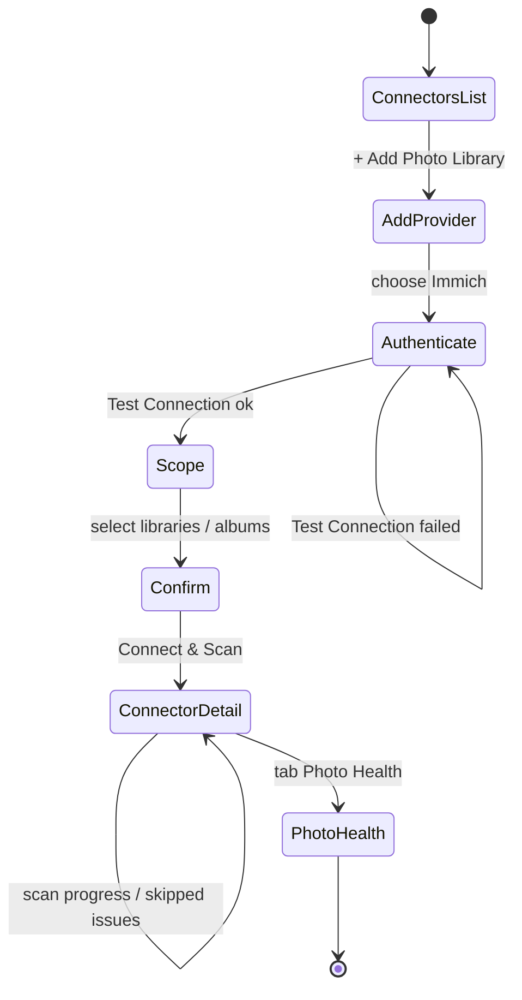
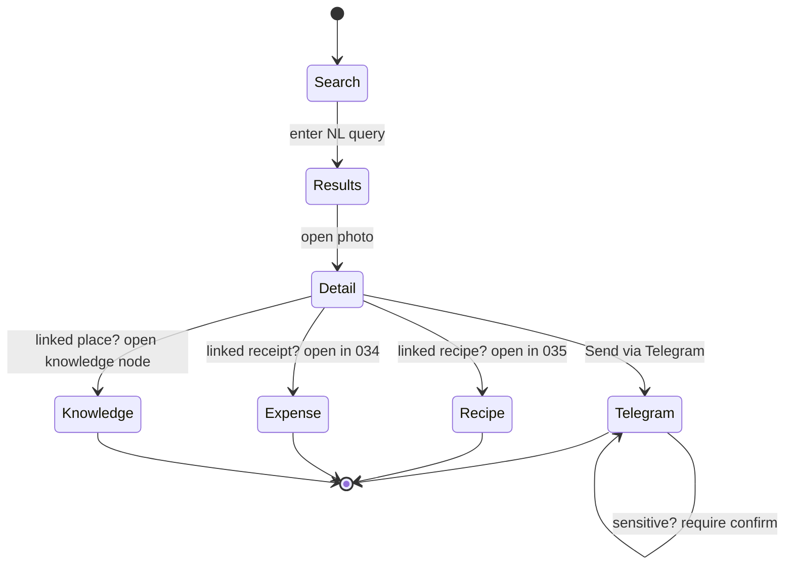
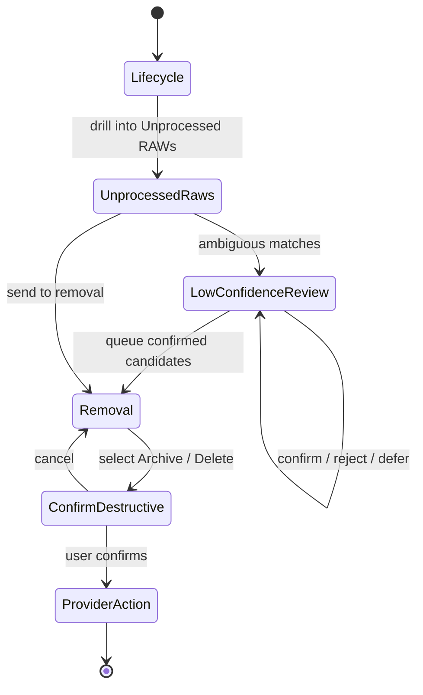
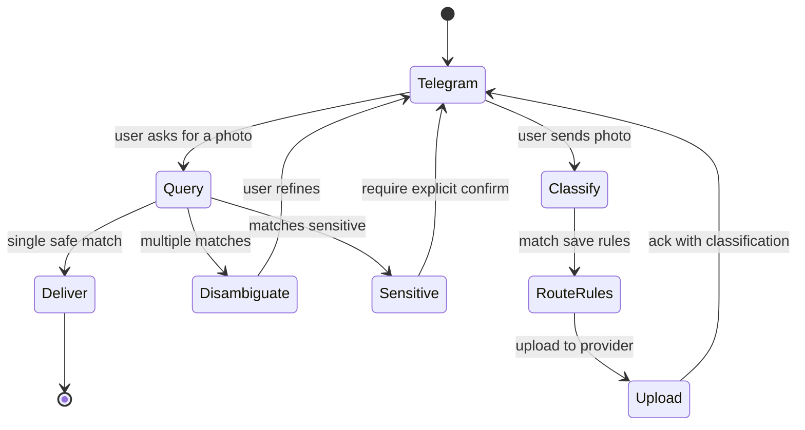
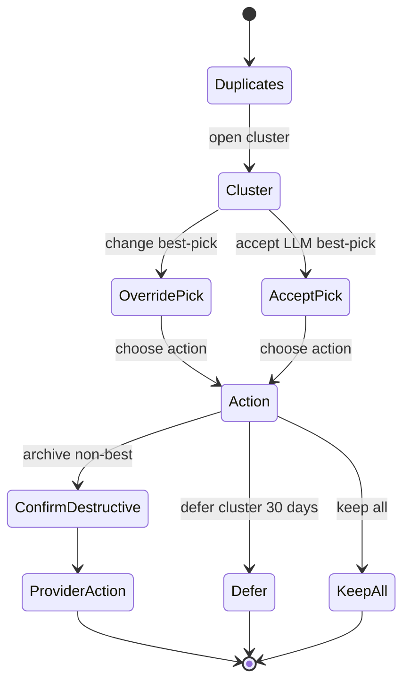

# Feature: 040 — Cloud Photo Libraries

> **Author:** bubbles.analyst
> **Date:** April 27, 2026
> **Status:** Draft (analyst-owned requirements sections only)
> **Design Doc Reference:** [docs/smackerel.md](../../docs/smackerel.md) — Section 5.7 (Photos Metadata), Section 6.2 (Capture Input Types — Image/Screenshot); cross-cuts 038 (Cloud Drives Integration), 026 (Domain Extraction), 027 (User Annotations), 033 (Mobile Capture), 034 (Expense Tracking), 035 (Recipe Enhancements), 036 (Meal Planning), 008 (Telegram Share Capture), 021 (Intelligence Delivery), 037 (LLM Agent Tools).
> **Sibling Feature:** [specs/038-cloud-drives-integration](../038-cloud-drives-integration/spec.md) owns generic file-storage drives (Google Drive, Dropbox, OneDrive). This feature owns **dedicated photo library platforms** with photo-native taxonomy (albums, faces, places, events, memories) and photo lifecycle (RAW → processed → curated → archived).

---

## Problem Statement

Dedicated cloud photo libraries — Immich, Google Photos, Amazon Photos, Apple iCloud Photos, and self-hosted alternatives — are where people keep their most personal, most voluminous, and most emotionally significant digital artifacts. These platforms are fundamentally different from generic file-storage drives: they have their own APIs, their own taxonomies (albums, faces, places, events, memories — not folders), and a unique photo lifecycle where a single moment can exist as a RAW file, a camera JPEG, an edited export from Lightroom/DaVinci Resolve/Darktable/GIMP/RawTherapee, a cropped social-media version, and multiple near-duplicates from burst shooting.

Without a photo library layer, Smackerel has critical blind spots:

1. **The "I took a photo of that" gap.** A user photographed a restaurant menu in Lisbon, a whiteboard diagram at work, a handwritten recipe from their grandmother, and a serial number on a broken appliance. These photos contain actionable knowledge — but without ingestion, OCR, and LLM-driven understanding, they're invisible to the knowledge graph.

2. **Photo lifecycle is chaos without intelligence.** A serious photographer shoots 200 RAW files on a weekend trip, processes 30 in Lightroom, exports 30 JPEGs, and posts 10 to social media. The remaining 170 RAW files are candidates for deletion — but no system tells them which RAWs have been processed and which haven't. The user manually compares filenames and timestamps across folders. This is a problem that LLM + metadata analysis can solve.

3. **Duplicate and near-duplicate sprawl is universal.** Burst shots, HDR brackets, panorama components, the same photo saved to multiple albums, synced across multiple devices, re-shared through messaging apps — photo libraries accumulate enormous redundancy. Current solutions use perceptual hashing (basic) but don't understand *intent*: "these 5 shots are from a burst; this one is the best; the other 4 can go."

4. **Cross-system photo intelligence doesn't exist.** A user has photos in Immich (self-hosted), Google Photos (phone backup), and Amazon Photos (family shared). No tool provides a unified view, cross-library deduplication, or consistent classification across providers. Each library is an island.

5. **Photos are disconnected from other knowledge.** A photo of a receipt should link to expense tracking (034). A photo of a recipe page should link to the recipe system (035). A photo taken at a restaurant should link to the restaurant's knowledge graph entry. A screenshot of a product should link to a wishlist. Without LLM-driven classification that routes photos to downstream features, these connections are lost.

6. **Upload, scan, and device capture are fragmented.** Users want to upload photos from devices (phone camera roll, desktop folders), scan documents using the camera, and have those flow into the right photo library with classification. Currently this requires manual sorting across multiple apps.

7. **Processed vs. unprocessed tracking doesn't exist anywhere.** No consumer photo tool tracks which photos have been edited in external applications (Lightroom, DaVinci Resolve, Darktable, GIMP, RawTherapee, Capture One, Affinity Photo) and which haven't. This is a category-defining capability: understanding the editing lifecycle of a photo library.

This feature treats cloud photo libraries as **first-class, LLM-driven, multi-provider photo intelligence surfaces** — read, save, monitor, scan, classify, deduplicate, track editing lifecycle, and integrate with every other Smackerel feature — with Immich as the first provider and a provider-neutral core.

---

## Current Capability Map

| Capability | Existing Evidence | Current Status | Requirement Impact |
|------------|-------------------|----------------|--------------------|
| Connector lifecycle | `internal/connector/connector.go` defines connector identity, connection, sync, health, close, cursor sync, connector configuration, and health states. | Present for source-oriented sync connectors | Photo libraries should reuse connector lifecycle expectations but need provider-neutral photo operations beyond generic text artifact sync. |
| Normalized connector output | `RawArtifact` supports source ID, source ref, content type, title, raw content, URL, metadata, and captured time. | Present for connector-produced artifacts | Photo artifacts need richer media metadata, provider identity, album/face/place context, lifecycle state, duplicate cluster state, and extraction/skip state. |
| Pipeline handoff | `ArtifactPublisher` and `internal/pipeline/ingest.go` bridge connector artifacts into the processing pipeline. | Present | Photo libraries can enter the same processing path, but must preserve binary media references, thumbnails, EXIF, and lifecycle relationships instead of flattening photos into text-only artifacts. |
| Existing product photo intent | `docs/smackerel.md` defines opt-in photo metadata with Google Photos/local EXIF, location/date/faces, screenshot OCR, and photo hash dedup. | Planned/partial in product docs, not dedicated implementation | This feature expands the old metadata-only photo idea into dedicated multi-provider photo-library intelligence. |
| Image capture extraction | `docs/smackerel.md` lists image/screenshot capture with OCR, visual description, and metadata in the processing pipeline. | Planned/product-level | Photo-library ingestion must reuse the same image understanding contract while adding library-scale scan, monitoring, lifecycle, and dedup behavior. |
| Cross-connector save/retrieve foundation | Feature 038 defines provider-neutral cloud-drive read/write/monitor/classify/save-rule behavior and Telegram save/retrieve scenarios. | Analyst-owned planned sibling feature | Photo libraries should reuse routing and retrieval concepts from 038, but own photo-native taxonomy and lifecycle semantics. |
| Dedicated photo-library connector | No existing Immich, Google Photos, Amazon Photos, Apple Photos, or Ente connector is present in the current repo. | Missing | This feature must define the first dedicated photo-library provider requirements before design. |
| RAW/editing lifecycle | No existing artifact model captures RAW originals, processed exports, editor signatures, duplicate clusters, or removal-candidate rationale. | Missing | Lifecycle tracking must be introduced as a photo-specific domain, not bolted onto generic file metadata. |
| Cross-feature photo routing | Existing/planned features consume images for recipes, expenses, mobile capture, Telegram, annotations, and domain extraction, but no unified photo source routes into them. | Partial/planned across sibling specs | Photo classification must produce one provider-neutral artifact shape that downstream features can consume without provider-specific branching. |

## Outcome Contract

**Intent:** Give Smackerel deep, LLM-driven understanding of the user's photo libraries across multiple providers (starting with Immich), so that every photo becomes a classified, searchable, lifecycle-tracked artifact; RAW-to-processed relationships are automatically detected; near-duplicates are clustered with best-pick suggestions; photos route to downstream features (recipes, expenses, annotations, lists) based on content; and the user can upload, scan, retrieve, and manage photos through any connected channel (Telegram, mobile, web).

**Success Signal:** A user connects their Immich instance with 15,000 photos. Within 48 hours: (1) searching "that whiteboard diagram from the March offsite" returns the right photo with OCR-extracted text, (2) the system identifies 800 RAW files that have matching processed exports and marks the unedited RAWs as removal candidates, (3) 50 receipt photos are auto-linked to expense tracking, (4) a photo of grandma's handwritten recipe is extracted and appears in the recipe system, (5) burst sequences are clustered with a suggested best shot, (6) the user asks Telegram "send me the Lisbon restaurant menu photo" and receives it, (7) when a second provider (Google Photos) is connected, all classification, dedup, lifecycle, and downstream routing works identically.

**Hard Constraints:**
- **Provider-neutral behavior.** All photo library behavior — ingestion, classification, search, retrieval, lifecycle tracking, deduplication, save-rules, and downstream-feature routing — MUST behave the same across connected photo providers. Provider-specific connection and API differences MUST NOT leak into downstream features.
- **LLM-driven intelligence.** Photo classification, content understanding (OCR, scene description, object detection), cross-feature routing, sensitivity detection, editing-lifecycle inference, duplicate-cluster quality ranking, and removal-candidate scoring MUST be LLM-driven. Heuristics are permitted only for stable machine facts: EXIF data, file dimensions, byte-level file type detection, perceptual hash computation, timestamps, and exact provider metadata.
- **Read and write.** The first provider MUST support reading existing photos, uploading new photos, monitoring for changes, and organizing (album assignment, tagging, favoriting) through the provider's API.
- **No silent dropping.** Photos skipped due to size, unsupported format, permissions, extraction failure, or quota MUST appear in user/operator-visible status with per-photo reason.
- **Privacy and isolation.** Photo library credentials and content MUST stay inside the approved local/self-hosted trust boundary except for the user's configured model provider. Automated tests MUST never access the user's real photo library.
- **Editing lifecycle is first-class.** The system MUST track relationships between RAW originals, processed exports, and derivative versions across editing applications, and surface actionable lifecycle state (unprocessed, processed, published, archived, removal-candidate).
- **No irreversible automated cleanup.** The system MAY recommend archive/delete actions, but MUST NOT delete, trash, or mutate provider photos without explicit user approval or a user-authored rule that names the allowed action and scope.

**Failure Condition:** If a user connects their Immich library, sees the connector report "healthy," but (a) cannot find a photo by natural-language description of its content, (b) RAW files with matching Lightroom exports are not identified as processed, (c) burst duplicates are not clustered, (d) receipt photos don't appear in expense tracking, (e) recipe photos don't link to recipes, (f) adding Google Photos requires re-implementing classification or dedup logic, or (g) the user cannot retrieve a photo through Telegram — the feature has failed.

---

## Goals

1. **Multi-provider photo library abstraction** — Connect to dedicated photo library platforms (Immich first, then Google Photos, Amazon Photos, Apple iCloud Photos, Ente) through one provider-neutral photo model that shares classification, search, lifecycle, dedup, and downstream routing.
2. **LLM-driven photo understanding** — Classify every photo by content (scene, objects, text/OCR, people context, document type, receipt, recipe, product, etc.) using multimodal LLM, not keyword heuristics.
3. **Editing lifecycle tracking** — Detect RAW-to-processed relationships by analyzing EXIF editor tags, filename patterns, timestamps, and content similarity; classify photos as unprocessed, processed, published, archived, or removal-candidate.
4. **Intelligent deduplication** — Cluster exact duplicates, near-duplicates (burst shots, HDR brackets, crops, resizes), and cross-provider duplicates; suggest best-pick per cluster using LLM quality assessment.
5. **Cross-feature photo routing** — Route classified photos to downstream features: receipts → expenses (034), recipe photos → recipes (035), document photos → knowledge graph, product photos → wishlists, location photos → trip context.
6. **Bidirectional photo operations** — Upload photos from devices and other connectors, organize within libraries (albums, tags, favorites), retrieve photos through channels (Telegram, mobile, web).
7. **Device upload and document scanning** — Accept photo uploads from mobile devices (033), Telegram (008), and web; support document-scan mode with perspective correction and OCR.
8. **Photo metadata as knowledge signal** — Treat EXIF data (GPS, camera, lens, settings), provider metadata (albums, faces, places, events, memories), and editing metadata as first-class knowledge graph signals.

---

## Non-Goals

- **Photo editing.** Smackerel does not provide RAW processing, color grading, retouching, or any image manipulation. It understands the editing lifecycle but delegates actual editing to dedicated tools (Lightroom, Darktable, etc.).
- **Face recognition model training.** Smackerel consumes face clusters from providers (Immich's face recognition, Google Photos' face groups) but does not train its own face recognition model.
- **Social media publishing.** Posting photos to Instagram, Facebook, Flickr, or other social platforms is out of scope.
- **Photo printing or physical product ordering.** No integration with print services.
- **Real-time camera streaming.** No live camera feed ingestion; photos are processed after capture.
- **Provider migration.** Bulk-moving photos between providers (Immich → Google Photos) is out of scope. Cross-provider dedup and unified search are in scope.
- **Video editing timeline analysis.** Video files are classified and searchable, but frame-level timeline analysis for video editing workflows is out of scope.
- **Copyright or licensing detection.** No watermark detection, reverse image search, or stock photo identification.

---

## Functional Requirements

### FR-001: Provider-Neutral Photo Library Model
The system MUST present connected photo libraries through one shared photo model for listing, reading, uploading, organizing (albums, tags, favorites), monitoring changes, and retrieving photos. Immich is the first required provider; additional providers (Google Photos, Amazon Photos, Apple iCloud Photos, Ente) MUST reuse the same classification, search, lifecycle, dedup, and downstream-feature behavior.

### FR-002: Immich Connection and Scope Control
The system MUST let the user connect an Immich instance through provider-supported authentication, choose which libraries/albums are included, and pause, resume, or revoke the connection.

### FR-003: Bulk Scan and Incremental Monitoring
The system MUST support an initial scan of selected libraries/albums and ongoing monitoring for new uploads, edits, moves, deletes, album changes, face-cluster updates, and metadata changes.

### FR-004: Multimodal LLM Photo Understanding
The system MUST use a multimodal LLM to classify every in-scope photo by: scene description, detected objects, text content (OCR), document type (receipt, recipe, menu, whiteboard, business card, ID document, product, screenshot, handwritten note, map, diagram, serial number), people context (from provider face clusters), location context (from EXIF GPS + reverse geocoding), and emotional/aesthetic quality signals. Heuristics are permitted only for stable machine facts (EXIF parsing, file type detection, perceptual hash, dimensions, timestamps).

### FR-004A: Stable-Signal Boundary for LLM Decisions
The system MUST treat EXIF fields, file hashes, perceptual hashes, timestamps, dimensions, provider IDs, and provider metadata as stable signals that prepare candidate evidence. Final classification, lifecycle judgment, duplicate best-pick selection, routing, sensitivity judgment, and removal-candidate rationale MUST come from LLM judgment or explicit user confirmation, not from brittle keyword/folder/filename rules.

### FR-005: Editing Lifecycle Detection
The system MUST detect relationships between RAW originals and processed exports by analyzing: (a) EXIF software/editor tags (Lightroom, DaVinci Resolve, Darktable, GIMP, RawTherapee, Capture One, Affinity Photo, Photoshop, Snapseed, VSCO), (b) filename patterns (e.g., `IMG_1234.CR2` → `IMG_1234-Edit.jpg`), (c) timestamp proximity between RAW and export, (d) content similarity via perceptual hash or embedding distance. Each photo MUST carry a lifecycle state: `unprocessed`, `processed`, `published`, `archived`, `removal-candidate`.

### FR-006: Intelligent Duplicate Clustering
The system MUST cluster photos into duplicate groups using: (a) exact hash (byte-identical), (b) perceptual hash (visually similar), (c) EXIF burst/sequence metadata, (d) HDR bracket detection, (e) panorama component detection, (f) cross-provider matching. Each cluster MUST have an LLM-suggested best-pick based on sharpness, composition, exposure, and expression quality. Remaining cluster members MUST be scored as keep/archive/removal-candidate.

### FR-007: Cross-Feature Photo Routing
The system MUST route classified photos to downstream features based on LLM classification: receipt photos → expense tracking (034), recipe/food photos → recipe system (035), document photos → knowledge graph (026), product photos → wishlists/annotations (027), location photos → trip/place context, screenshot photos → content extraction. Routing MUST use the same save-rule engine as feature 038 where applicable.

### FR-008: Photo Upload from Devices and Channels
The system MUST accept photo uploads from: mobile devices via the PWA/mobile capture (033), Telegram bot (008), web interface, and bulk import from local directories. Uploaded photos MUST flow through the same classification and routing pipeline as library-scanned photos.

### FR-009: Document Scan Mode
The system MUST support a document-scan capture mode (via mobile/web) that applies perspective correction, contrast enhancement, and OCR to produce a clean document artifact alongside the original photo.

### FR-010: Photo Retrieval Through Other Connectors
The system MUST let authorized channels such as Telegram request and receive photos by natural-language description, date, location, person, event, or album. Retrieval MUST respect sensitivity, file size, and channel-safety policy.

### FR-011: Album, Tag, and Favorite Organization
The system MUST support reading and writing album membership, tags/labels, and favorite/starred status through provider-supported operations. Organization actions triggered by classification or user rules MUST propagate back to the provider when the provider supports that operation, and otherwise surface a visible capability limitation.

### FR-012: EXIF and Provider Metadata Preservation
The system MUST capture and preserve: EXIF (camera, lens, focal length, aperture, ISO, shutter speed, GPS coordinates, capture timestamp, orientation, color space, software/editor), provider metadata (albums, face clusters, places, events, memories, tags, sharing state, favorite status), and file metadata (format, dimensions, file size, creation/modification timestamps).

### FR-013: Photo Sensitivity and Privacy Classification
The system MUST use LLM judgment to flag photos containing: identity documents, medical information, nudity/intimate content, financial documents, children (for extra caution in sharing), and private locations. Sensitivity flags MUST constrain retrieval, auto-routing, digest inclusion, and cross-channel delivery.

### FR-014: Visible Skip and Extraction States
Every skipped, blocked, partial, unsupported, too-large, permission-denied, quota-limited, or extraction-failed photo MUST be visible with file identity, reason, and recommended action. Photos where LLM understanding failed MUST still be searchable by metadata.

### FR-015: Cross-Provider Unified Search
When multiple photo libraries are connected, search MUST return results from all providers in unified ranking with provider, album, date, location, and classification shown per result. No separate provider tabs.

### FR-016: Removal Candidate Surfacing
The system MUST surface removal candidates — unprocessed RAWs whose processed counterparts exist, low-quality duplicates within clusters, blurry/underexposed/overexposed shots, and screenshots of transient content — with per-photo rationale and batch-action capability (archive, delete, keep).

### FR-017: Photo Library Health and Progress Visibility
The system MUST expose: scan progress, monitoring lag, classification confidence distribution, duplicate cluster count, lifecycle state distribution (unprocessed/processed/published/archived/removal-candidate), extraction success/failure counts, and provider connection health.

### FR-018: Privacy-Preserving Test Boundary
Tests MUST use synthetic photo fixtures or recorded API responses, never the user's real photo library. Test fixtures MUST include representative RAW files, processed exports, burst sequences, documents, receipts, and recipe photos.

### FR-019: Provider Capability Visibility
When a provider does not support a required operation (for example, original download, album write-back, delete/trash, or change monitoring), the system MUST expose that capability gap in connector status and preserve provider-neutral read/search/classification behavior where possible. Provider limitations MUST NOT become silent no-ops or provider-specific branching in downstream features.

### FR-020: Confirmation for Destructive or Low-Confidence Actions
Before deleting, trashing, archiving, album-removing, or applying a low-confidence lifecycle/duplicate/routing action, the system MUST request user confirmation unless the user has created an explicit rule that authorizes that exact action, target scope, and confidence threshold.

---

## Actors & Personas

| Actor | Description | Key Goals | Permissions |
|-------|-------------|-----------|-------------|
| **Photographer** | Primary user with one or more photo libraries, possibly shooting RAW, editing in desktop apps, and managing a large collection. | Find any photo by description; know which RAWs are processed; clean up duplicates; have receipts/recipes auto-routed; retrieve photos from chat. | Connect/revoke libraries; configure scan scope; set lifecycle and dedup rules; approve/reject removal candidates. |
| **Casual User** | Phone-only user with Google Photos or Amazon Photos, no RAW workflow, wants photos searchable and connected to other features. | Find photos by description or date; have receipt/document photos auto-categorized; share and retrieve photos via Telegram. | Connect/revoke library; basic search and retrieval; opt-in to classification. |
| **Family Member** | Person who shares albums or a family library with the primary user. | Access shared album photos through Smackerel search; find shared family photos by event/person/date. | Access only shared-library/shared-album content as defined by provider permissions. |
| **External Capture Channel** | Telegram bot, mobile capture, or web upload interface that receives photos from the user. | Upload received photos to the right library with classification; retrieve matching photos back to the user when policy allows. | Operates through user-approved upload and retrieval rules. |
| **Cross-Feature Consumer** | Smackerel scenario that uses photo content: expense tracking (receipts), recipe system (food/recipe photos), knowledge graph (documents), annotations, lists, intelligence delivery, agent tools. | Consume classified photo artifacts without knowing which photo provider produced them. | Internal consumer constrained by classification metadata and sensitivity policy. |
| **Self-Hoster / Operator** | Person running Smackerel and supervising photo library connector behavior. | Tune scan scope, processing tiers, classification confidence thresholds, dedup sensitivity, and removal-candidate rules. | Administrative control over local configuration and connector health. |
| **Provider Contributor** | Developer adding a new photo library provider after Immich. | Add provider connection without rebuilding classification, dedup, lifecycle, or downstream routing. | Contributor-level access to provider connection code and test fixtures. |

---

## Use Cases

### UC-001: Connect Immich and Bulk Scan
- **Actor:** Photographer
- **Preconditions:** User has an Immich instance with photos.
- **Main Flow:**
  1. User adds Immich from the photo library connection flow, enters instance URL and API key.
  2. User selects which libraries/albums to include.
  3. Smackerel scans selected scope: downloads thumbnails, reads EXIF, reads provider metadata (albums, faces, places, tags).
  4. Smackerel sends photos to multimodal LLM for classification (scene, objects, OCR, document type, sensitivity).
  5. Smackerel detects editing lifecycle: identifies RAW files, finds matching processed exports, assigns lifecycle state.
  6. Smackerel clusters duplicates: exact, perceptual, burst, HDR brackets.
  7. User can search photos by natural language.
- **Alternative Flows:**
  - A1: Immich instance is unreachable → clear error with connection diagnostics.
  - A2: API key lacks required permissions → connector shows which permissions are missing.
  - A3: Library exceeds configured scan cap → partial scan with progress and queued count.
- **Postconditions:** In-scope photos are searchable, classified, lifecycle-tracked, and duplicate-clustered. Blocked photos visible with reason.

### UC-002: Monitor Library Changes
- **Actor:** Photographer
- **Preconditions:** Photo library connection is active.
- **Main Flow:**
  1. User uploads, edits metadata, moves to album, deletes, or shares a photo in their library.
  2. Smackerel detects the change during next monitoring cycle.
  3. New photos go through full classification pipeline.
  4. Metadata changes refresh classification and lifecycle state.
  5. Deletions tombstone the artifact (content retained per policy).
  6. Album/face/tag changes update enrichment metadata.
- **Alternative Flows:**
  - A1: Provider API reports a face cluster merge → Smackerel updates all affected artifacts.
  - A2: Photo moves between albums → album context refreshes without re-extracting content.

### UC-003: Natural-Language Photo Search
- **Actor:** Photographer, Casual User
- **Preconditions:** Photos have been scanned and classified.
- **Main Flow:**
  1. User searches: "that whiteboard diagram from the March offsite."
  2. Smackerel searches across: LLM-derived scene/object/text descriptions, OCR content, EXIF date/location, album names, face clusters, provider tags.
  3. User receives ranked results with thumbnail, date, location, album, provider, and classification badges.
- **Alternative Flows:**
  - A1: Query matches across multiple providers → unified results with provider indicator.
  - A2: Query matches a document photo → OCR text shown as snippet.
  - A3: Query matches a face cluster → results grouped by person.

### UC-004: Editing Lifecycle Analysis
- **Actor:** Photographer
- **Preconditions:** Library contains RAW files and processed exports.
- **Main Flow:**
  1. Smackerel identifies RAW files (CR2, NEF, ARW, DNG, RAF, ORF, RW2, etc.).
  2. For each RAW, Smackerel searches for matching processed exports by: filename stem match, timestamp proximity, content similarity (perceptual hash/embedding).
  3. Smackerel reads EXIF software tags on exports to identify the editing application (Lightroom, Darktable, GIMP, etc.).
  4. RAW files with matching exports → lifecycle state `processed`. RAW files without → `unprocessed`.
  5. User views lifecycle dashboard: N RAW unprocessed, N processed, N removal candidates.
  6. User can batch-review unprocessed RAWs and choose: keep, archive, or delete.
- **Alternative Flows:**
  - A1: RAW has multiple processed exports (e.g., color + B&W) → all linked, RAW marked `processed`.
  - A2: Processed export exists in a different provider than the RAW → cross-provider link detected.
  - A3: Confidence in RAW-export match is low → flagged for user confirmation instead of auto-linking.

### UC-005: Duplicate Cluster Review
- **Actor:** Photographer
- **Preconditions:** Library scanned and duplicates clustered.
- **Main Flow:**
  1. User opens duplicate review.
  2. Smackerel shows clusters: burst sequences, HDR brackets, exact duplicates, near-duplicates.
  3. Each cluster shows the LLM-suggested best-pick with rationale (sharpest, best exposure, best expression).
  4. User can accept suggestion (archive/delete others), keep all, or manually pick.
  5. Actions propagate to the provider through the provider-supported organization or cleanup path.
- **Alternative Flows:**
  - A1: Cluster spans multiple providers → shown together, actions per-provider.
  - A2: All cluster members are equally good → no single best-pick; user decides.

### UC-006: Receipt Photo → Expense Tracking
- **Actor:** Cross-Feature Consumer (Expense Tracking 034)
- **Preconditions:** Photo classified as receipt by LLM.
- **Main Flow:**
  1. Photo ingested and classified as `document/receipt` with confidence above threshold.
  2. LLM extracts structured fields: vendor, date, total, currency, line items, payment method.
  3. Extracted receipt routes to expense tracking (034) as an expense artifact.
  4. Original photo linked as evidence.
- **Alternative Flows:**
  - A1: Receipt is partially legible → extracted fields marked with confidence; user prompted to fill gaps.
  - A2: Classification confidence below threshold → annotation request (027) instead of silent routing.

### UC-007: Recipe Photo → Recipe System
- **Actor:** Cross-Feature Consumer (Recipe Enhancements 035)
- **Preconditions:** Photo classified as recipe content.
- **Main Flow:**
  1. Photo classified as `document/recipe` or `food/plated-dish` or `document/handwritten-recipe`.
  2. For recipe documents: LLM extracts recipe name, ingredients, steps, servings.
  3. Extracted recipe routes to recipe system (035).
  4. For food photos: classified as meal/dish with inferred cuisine, linked to nearby recipe artifacts.
- **Alternative Flows:**
  - A1: Handwritten recipe with poor handwriting → OCR + LLM best-effort extraction; low-confidence fields flagged.

### UC-008: Upload Photos from Telegram
- **Actor:** Photographer, External Capture Channel
- **Preconditions:** Telegram capture (008) is configured with photo library upload rules.
- **Main Flow:**
  1. User sends a photo to the Telegram bot.
  2. Smackerel classifies the photo.
  3. Matching upload rule determines target library and album.
  4. Photo uploaded to the target provider through the provider-supported upload path.
  5. Artifact records both Telegram source and provider URL.
- **Alternative Flows:**
  - A1: No matching rule → photo stored as Smackerel artifact only, not uploaded to any library.
  - A2: Classification triggers cross-feature routing (receipt → expenses) in addition to library upload.

### UC-009: Retrieve Photo via Telegram
- **Actor:** Photographer, External Capture Channel
- **Preconditions:** Photos scanned; Telegram retrieval authorized for non-sensitive photos.
- **Main Flow:**
  1. User asks Telegram: "send me the Lisbon restaurant menu photo."
  2. Smackerel searches photo artifacts.
  3. Sensitivity and channel-safety policy checked.
  4. Telegram returns the photo, a provider link, or a disambiguation list.
- **Alternative Flows:**
  - A1: Photo is sensitive → safe refusal or secure-link flow.
  - A2: Photo exceeds Telegram file size limit → provider link returned instead.

### UC-010: Document Scan and Upload
- **Actor:** Casual User
- **Preconditions:** Mobile capture (033) or web interface available.
- **Main Flow:**
  1. User activates document scan mode.
  2. Camera captures document; perspective correction applied.
  3. OCR extracts text content.
  4. LLM classifies document type and routes to appropriate feature.
  5. Both original photo and clean scan artifact stored; optionally uploaded to photo library.
- **Alternative Flows:**
  - A1: Multi-page document → sequential captures assembled into one document artifact.

### UC-011: Cross-Provider Unified View
- **Actor:** Photographer
- **Preconditions:** Multiple photo libraries connected.
- **Main Flow:**
  1. User searches or browses photos.
  2. Results from all providers appear in unified timeline/grid with provider badges.
  3. Duplicate clusters may span providers.
  4. Classification, lifecycle, and routing work identically across providers.
- **Alternative Flows:**
  - A1: Same photo exists in Immich and Google Photos → cross-provider duplicate cluster formed.

### UC-012: Removal Candidate Review
- **Actor:** Photographer
- **Preconditions:** Lifecycle analysis and dedup clustering complete.
- **Main Flow:**
  1. User opens removal candidate review.
  2. Smackerel shows: (a) unprocessed RAWs with processed counterparts, (b) inferior duplicates in clusters, (c) blurry/underexposed/overexposed shots, (d) old screenshots of transient content.
  3. Each candidate shows rationale (e.g., "RAW IMG_1234.CR2 has a Lightroom-edited export IMG_1234.jpg").
  4. User can batch-archive, batch-delete, or keep with per-item override.
  5. Actions propagate to provider.
- **Alternative Flows:**
  - A1: User disagrees with a removal suggestion → "keep" overrides future suggestions for that photo.
  - A2: Removal candidate is in a shared album → warning shown before deletion.

### UC-013: Photo-Enriched Intelligence Delivery
- **Actor:** Cross-Feature Consumer (Intelligence Delivery 021)
- **Preconditions:** Photos classified and enriched.
- **Main Flow:**
  1. Daily/weekly digest includes photo-derived insights: "You took 15 photos at 3 restaurants in Lisbon last week — here are the menus you photographed."
  2. Trip summaries include location-clustered photos.
  3. "This week in photos" surfaces notable shots with context.
- **Alternative Flows:**
  - A1: Sensitive photos excluded from digest per policy.

---

## Business Scenarios

### BS-001: Bulk Library Ingest with Full Classification
Given a user has 15,000 photos in Immich across 200 albums
When they connect Immich to Smackerel
Then within 48h every in-scope photo is searchable by content description AND album/face/place/tag metadata is preserved AND classification confidence is visible per photo

### BS-002: OCR Makes Document Photos Searchable
Given a user has 300 photos of whiteboards, menus, business cards, and handwritten notes
When classification completes
Then each document photo has extracted text AND a search for "budget projections Q3" returns the whiteboard photo containing that text

### BS-003: RAW-to-Processed Lifecycle Detection
Given a user has 500 CR2 RAW files and 150 Lightroom-exported JPEGs
When lifecycle analysis completes
Then 150 RAWs are linked to their exports with lifecycle state `processed` AND the remaining 350 RAWs are marked `unprocessed` AND the EXIF software tag "Adobe Lightroom" is recorded on linked exports

### BS-004: Unprocessed RAW Removal Candidates
Given lifecycle analysis found 350 unprocessed RAWs from shoots older than 6 months
When the user opens removal candidate review
Then those RAWs appear with rationale "unprocessed RAW from [date], no matching export found" AND the user can batch-archive or delete with per-item override

### BS-005: Editor Signature Detection Across Applications
Given a library contains exports from Lightroom, Darktable, GIMP, RawTherapee, and DaVinci Resolve
When lifecycle analysis runs
Then each export's EXIF software tag is parsed AND the editing application is recorded AND RAW-export links are established regardless of which editor was used

### BS-006: Burst Sequence Clustering with Best-Pick
Given a user took a 10-shot burst of a moving subject
When duplicate clustering completes
Then all 10 shots appear in one cluster AND the LLM suggests the sharpest frame with best expression as the pick AND the other 9 are scored as archive/removal candidates

### BS-007: HDR Bracket Detection
Given a camera captured 3 exposure brackets (-2, 0, +2 EV) for HDR
When clustering runs
Then the 3 brackets are grouped AND if an HDR-merged result exists it is identified as the output AND brackets are candidates for archival

### BS-008: Cross-Provider Duplicate Detection
Given the same vacation photo exists in both Immich and Google Photos
When both providers are connected
Then the photo appears in one cross-provider duplicate cluster AND search returns it once with both provider links

### BS-009: Receipt Photo Auto-Routes to Expenses
Given a photo classified as `document/receipt` with vendor "Whole Foods", total "$87.32", date "2026-04-15"
When confidence exceeds the routing threshold
Then an expense artifact is created in feature 034 with those fields AND the original photo is linked as evidence

### BS-010: Recipe Photo Auto-Routes to Recipes
Given a photo of a handwritten recipe for "Grandma's Apple Pie"
When classification and OCR complete
Then recipe name, ingredients, and steps are extracted AND the recipe appears in feature 035 AND the original photo is linked

### BS-011: Food Photo Linked to Restaurant Context
Given a photo of a plated dish taken at GPS coordinates matching restaurant "Tasca do Chico, Lisbon"
When classification completes
Then the photo is tagged with cuisine "Portuguese", restaurant name, and location AND the daily digest surfaces it in the Lisbon trip context

### BS-012: Telegram Upload Routes to Library
Given an upload rule "Telegram photos to Immich album 'Mobile Captures'"
When user sends a photo to the Telegram bot
Then within 1 minute the photo is uploaded to Immich in that album AND classified AND visible in Smackerel search

### BS-013: Telegram Retrieves a Photo
Given the user asks Telegram "send me the photo of the broken dishwasher serial number"
When the matching photo is found and passes policy checks
Then Telegram delivers the photo with extracted serial number text in the caption

### BS-014: Panorama Components Grouped
Given a phone captured 5 component images for a panorama plus the stitched result
When clustering runs
Then components are grouped with the stitched panorama identified as the output AND components scored as removal candidates

### BS-015: Screenshot of Transient Content Flagged
Given a screenshot of a flight booking confirmation from 2024
When lifecycle analysis runs with current date 2026
Then the screenshot is flagged as `transient-expired` with rationale "flight booking from 2024, likely completed"

### BS-016: Sensitive Photo Blocks Auto-Retrieval
Given a photo classified as containing an identity document (passport scan)
When the user asks Telegram to "send my passport"
Then Telegram returns a secure-link flow or refusal per sensitivity policy AND does not send the raw photo in the chat

### BS-017: Multi-Page Document Scan
Given the user scans a 4-page lease agreement using document scan mode
When all pages are captured
Then a single multi-page document artifact is created AND OCR extracts text from all pages AND the document is classified as `document/legal`

### BS-018: Provider-Agnostic Classification
Given the Immich adapter and Google Photos adapter are both connected
When a new photo is added to either provider
Then the same LLM classification prompt, lifecycle analysis, and routing logic run AND downstream features receive identical artifact shapes

### BS-019: Blurry Photo Detection
Given a burst contains 3 sharp frames and 7 blurry ones
When LLM quality assessment runs
Then blurry frames are identified with rationale AND scored lower in the cluster AND surfaced as removal candidates

### BS-020: Photo Metadata Seeds Knowledge Graph
Given a photo has EXIF GPS coordinates, camera "Sony A7IV", lens "85mm f/1.4", taken at ISO 3200
When ingested
Then the knowledge graph records: location "Alfama, Lisbon", equipment context, shooting conditions AND these are queryable ("photos I took with the 85mm" or "low-light shots")

### BS-021: Album Changes Propagate
Given a user moves a photo from "Unsorted" to "Lisbon 2026" album in Immich
When next sync detects the change
Then the artifact's album metadata updates AND any album-derived context refreshes AND no content re-extraction occurs

### BS-022: Face Cluster Enrichment
Given Immich's face recognition clusters 500 photos of "Person A"
When Smackerel ingests the face cluster data
Then all 500 photos carry the face cluster reference AND a search for photos of "Person A" (by assigned name or cluster ID) returns them

### BS-023: Video File Classified But Not Frame-Analyzed
Given a library contains 200 video files
When scan completes
Then each video has: duration, resolution, codec, thumbnail classification, and EXIF metadata AND is searchable by location/date/description AND frame-level editing timeline analysis is NOT performed

### BS-024: Empty Library Connection
Given a user connects a brand-new Immich instance with zero photos
When initial scan runs
Then connector reports healthy AND no artifacts created AND subsequent uploads start flowing immediately

### BS-025: Scan Progress Visibility
Given an initial scan of 15,000 photos is in progress
When the user checks connector status
Then they see: N/15000 scanned, N classified, N duplicate clusters found, N lifecycle states assigned, estimated time remaining, N skipped with reasons

### BS-026: Cross-Feature Photo in Meal Plan
Given a recipe was extracted from a photo and used in meal planning (036)
When the weekly meal plan is generated
Then the plan references the original recipe photo AND if the user asks "show me the recipe" they get both the extracted text and the original photo

### BS-027: Processed Export Without Matching RAW
Given a JPEG with EXIF software tag "Adobe Lightroom" exists but no corresponding RAW is in any connected library
When lifecycle analysis runs
Then the export is marked `processed` (editor detected) but lifecycle link shows "RAW source: not found in connected libraries"

### BS-028: Photo Quality Distribution Dashboard
Given a library of 15,000 photos has been fully analyzed
When the user views the photo health dashboard
Then they see: N unprocessed RAW, N processed, N removal candidates, N duplicate clusters, N sensitive, N documents, N receipts, N recipes, classification confidence histogram

### BS-029: Low-Confidence RAW Match Requests Confirmation
Given a RAW file and a JPEG export have similar timestamps but weak visual similarity
When lifecycle analysis proposes a RAW-to-export relationship below the confidence threshold
Then the relationship is marked pending confirmation AND the RAW is not classified as processed until the user approves or rejects the match

### BS-030: Provider Capability Gap Is Visible
Given a connected provider supports photo search and metadata reads but does not support album write-back
When a rule attempts to organize a photo into an album on that provider
Then the action is blocked with a visible provider-capability reason AND search/classification for that provider continues to work

### BS-031: Destructive Cleanup Requires Explicit Approval
Given the duplicate review marks 900 photos as removal candidates
When the user has not created an explicit cleanup rule for that scope
Then no photo is deleted, trashed, archived, or removed from an album until the user confirms the exact batch action

### BS-032: Stable Signals Do Not Override LLM Judgment
Given two photos have similar filenames and timestamps but show different subjects
When candidate matching prepares duplicate or lifecycle evidence
Then stable signals may place them in a review candidate set BUT the final relationship is rejected or sent for confirmation based on LLM/user judgment

---

## Competitive Analysis

| Capability | Smackerel (target) | Immich | Google Photos | Amazon Photos | PhotoPrism | Apple iCloud Photos | Ente |
|------------|--------------------|---------|---------|----|------|------|------|
| Multi-provider unified view | Yes — first-class goal | No (single instance) | No (Google only) | No (Amazon only) | No (single instance) | No (Apple only) | No (Ente only) |
| LLM-driven content classification | Yes — multimodal LLM | CLIP-based search + ML classification | Proprietary ML | Basic auto-tagging | TensorFlow-based classification | Proprietary ML | No classification |
| OCR on document photos | Yes — LLM multimodal | Not built-in | Yes (screenshots/docs) | No | No | Yes (Live Text) | No |
| RAW-to-processed lifecycle tracking | **Yes — category-defining** | No | No | No | Stacking (manual) | No | No |
| Editor signature detection (LR, DT, GIMP, etc.) | **Yes — category-defining** | No | No | No | No | No | No |
| Intelligent duplicate clustering with best-pick | Yes — LLM quality ranking | Duplicate detection (hash) | Duplicate detection (basic) | No | Duplicate detection (hash + stacking) | Duplicate detection (basic) | Duplicate detection (hash) |
| Cross-feature routing (receipts → expenses, recipes → cooking) | **Yes — category-defining** | No | No | No | No | No | No |
| Removal candidate surfacing with rationale | **Yes — LLM-driven** | No | Storage management (basic) | No | Archive/review workflow | Storage optimization | No |
| Cross-provider dedup | Yes | No | No | No | No | No | No |
| Bidirectional (upload + organize) | Yes — album, tag, favorite write-back | Yes (API write) | Limited (upload only) | Limited | Yes (WebDAV) | No API | Limited |
| Telegram/chat retrieval of photos | **Yes — unique** | No | No | No | No | No | No |
| Face cluster consumption | Yes — from provider | Yes (built-in) | Yes (built-in) | Yes (basic) | Yes (built-in) | Yes (built-in) | No |
| EXIF + metadata preservation | Yes | Yes | Partial (strips some) | Yes | Yes (advanced) | Partial | Yes |
| Self-hosted / local data | Yes | Yes | No | No | Yes | No | Yes (encrypted) |

**Top competitive edges:**
1. **RAW-to-processed lifecycle tracking with editor detection** — No consumer tool tracks which RAWs have been processed in which editing application.
2. **Cross-feature photo routing** — Receipt → expenses, recipe photo → recipes, menu → restaurant knowledge. No photo library does this.
3. **Multi-provider unified view with cross-provider dedup** — Users have photos across 2-4 services. Nobody unifies them.
4. **LLM-driven removal candidates with rationale** — Explanation-driven cleanup builds trust vs. generic "similar photos" suggestions.
5. **Chat-channel photo retrieval** — "Send me the serial number photo" via Telegram is unique.

---

## Platform Direction & Market Trends

### Industry Trends

| Trend | Status | Relevance | Impact on Product |
|-------|--------|-----------|-------------------|
| Self-hosted photo management (Immich, PhotoPrism) growing rapidly | Established | High | Primary user base overlaps with Smackerel self-hosted audience; Immich-first strategy aligns. |
| Multimodal LLMs (GPT-4V, Gemini, LLaVA) for image understanding | Growing | High | Enables content classification, OCR, scene description, quality assessment without custom CV models. |
| RAW photography workflow (Lightroom, Darktable, Capture One) as mainstream | Established | High | Large user base has the RAW lifecycle problem; nobody solves it with automation. |
| AI-powered photo curation and storytelling (Google Memories, Apple Memories) | Growing | Medium | Validates demand for auto-curated narratives; Smackerel can do this cross-provider. |
| Privacy-first photo storage (Ente, Immich) vs. cloud incumbents | Growing | High | Smackerel's local-data-ownership posture is a natural complement. |
| Computational photography producing more variants per capture | Established | High | Increases variant sprawl; makes intelligent dedup more valuable. |
| AI-assisted editing (Adobe Firefly, Google Magic Editor) | Emerging | Medium | Adds new variant types to lifecycle tracking; edits may lack traditional EXIF tags. |
| Cross-device photo ecosystem fragmentation | Established | High | Users have 3-5 photo repositories; unified view increasingly needed. |

### Strategic Opportunities

| Opportunity | Type | Priority | Rationale |
|-------------|------|----------|-----------|
| RAW lifecycle + editor detection | Differentiator | High | Empty market space; immediate photographer value. |
| Cross-feature routing (photo → expense/recipe/knowledge) | Differentiator | High | Compounds value across every Smackerel feature. |
| Multi-provider unified search + cross-provider dedup | Differentiator | High | Addresses real fragmented-library pain. |
| LLM removal candidates with rationale | Differentiator | High | Solves "50,000 photos, can't clean up" intelligently. |
| Chat-channel photo retrieval (Telegram) | Differentiator | Medium | Instant utility; unique capability. |
| Document scan + auto-classification | Table Stakes | Medium | Expected; differentiator is downstream routing. |
| Provider-neutral abstraction for NAS/S3 photo stores | Differentiator | Medium | Self-hosted users store photos on NAS/S3. |
| AI-edit variant detection | Emerging | Low | Future-proofs lifecycle for AI edits. |

### Recommendations
1. **Immediate (this delivery):** Immich adapter, LLM classification, RAW lifecycle detection, editor signature parsing, duplicate clustering with best-pick, cross-feature routing (receipt/recipe/document), Telegram upload/retrieval, visible skip states, sensitivity flags, document scan mode.
2. **Near-term (next delivery):** Google Photos + Amazon Photos adapters, cross-provider dedup, removal candidate batch actions, photo health dashboard, memories/stories via intelligence delivery.
3. **Strategic (6+ months):** Apple iCloud Photos adapter (if API viable), Ente adapter, NAS/S3 scanning, AI-edit variant detection, face-cluster cross-provider merge.

---

## Improvement Proposals

### IP-001: RAW-to-Processed Lifecycle Tracking ⭐ Competitive Edge
- **Impact:** High
- **Effort:** M
- **Competitive Advantage:** No consumer photo tool tracks RAW→processed relationships automatically. Photographers spend hours manually comparing RAW folders against export folders.
- **Actors Affected:** Photographer
- **Business Scenarios:** BS-003, BS-004, BS-005, BS-027

### IP-002: Editor Signature Detection ⭐ Competitive Edge
- **Impact:** High
- **Effort:** S
- **Competitive Advantage:** Parsing EXIF software tags to identify Lightroom, Darktable, GIMP, RawTherapee, DaVinci Resolve, Capture One, Affinity Photo, Snapseed, VSCO is straightforward but nobody does it.
- **Actors Affected:** Photographer
- **Business Scenarios:** BS-005

### IP-003: Cross-Feature Photo Routing ⭐ Competitive Edge
- **Impact:** High
- **Effort:** M
- **Competitive Advantage:** Receipt → expenses, recipe → cooking, document → knowledge, product → wishlist. No photo library routes classified photos to domain-specific features.
- **Actors Affected:** Cross-Feature Consumer, Photographer
- **Business Scenarios:** BS-009, BS-010, BS-011, BS-026

### IP-004: LLM-Driven Removal Candidates with Rationale ⭐ Competitive Edge
- **Impact:** High
- **Effort:** M
- **Competitive Advantage:** Google Photos says "these look similar." Smackerel says "this RAW has a Lightroom export; this burst frame is blurrier than frame 3; this screenshot is a 2024 flight booking."
- **Actors Affected:** Photographer
- **Business Scenarios:** BS-004, BS-006, BS-015, BS-019

### IP-005: Multi-Provider Unified Photo Search
- **Impact:** High
- **Effort:** L
- **Competitive Advantage:** Users have photos in 2-4 services. Nobody unifies them with cross-provider dedup and consistent classification.
- **Actors Affected:** Photographer, Casual User
- **Business Scenarios:** BS-008, BS-018

### IP-006: Telegram Photo Upload and Retrieval
- **Impact:** Medium-High
- **Effort:** M
- **Competitive Advantage:** "Send me the serial number photo" via chat is unique. Upload-to-library via Telegram completes the capture loop.
- **Actors Affected:** Photographer, External Capture Channel
- **Business Scenarios:** BS-012, BS-013

### IP-007: Document Scan Mode with Auto-Classification
- **Impact:** Medium
- **Effort:** M
- **Competitive Advantage:** Table stakes for capture; differentiator is downstream routing.
- **Actors Affected:** Casual User
- **Business Scenarios:** BS-017

### IP-008: Photo Health Dashboard
- **Impact:** Medium
- **Effort:** S
- **Competitive Advantage:** Aggregated library health view: lifecycle distribution, duplicate count, removal candidates, classification confidence, skip reasons.
- **Actors Affected:** Photographer, Self-Hoster
- **Business Scenarios:** BS-025, BS-028

### IP-009: Cross-Provider Duplicate Clustering
- **Impact:** Medium
- **Effort:** M
- **Competitive Advantage:** Same photo in Immich + Google Photos detected as one. Nobody does cross-platform dedup.
- **Actors Affected:** Photographer
- **Business Scenarios:** BS-008

### IP-010: Face Cluster Consumption for People Search
- **Impact:** Medium
- **Effort:** S
- **Competitive Advantage:** Leverages provider face recognition without building our own model. "Show me photos of Mom" works cross-provider.
- **Actors Affected:** Photographer, Casual User, Family Member
- **Business Scenarios:** BS-022

---

## UI Scenario Matrix

| Scenario | Actor | Entry Point | Steps | Expected Outcome | Screen(s) |
|----------|-------|-------------|-------|-------------------|-----------|
| Connect Immich | Photographer | Connectors panel | Add Photo Library → Immich → Enter URL + API key → Select libraries/albums → Confirm | Connector healthy; scan starts; progress visible | Connectors / Add / Scope picker |
| Search photos by description | Photographer | Chat / Search | Enter NL query | Ranked photo results with thumbnails, date, location, album, OCR snippet, provider badge | Search results / Photo preview |
| Review editing lifecycle | Photographer | Photo Health | Open Lifecycle tab → See RAW/processed/unprocessed counts → Drill into unprocessed RAWs | List of unprocessed RAWs with date, camera, linked exports, rationale | Photo Health / Lifecycle |
| Review duplicate clusters | Photographer | Photo Health | Open Duplicates tab → Browse clusters → Accept/reject best-pick → Batch action | Clusters resolved; actions propagated to provider | Photo Health / Duplicates |
| Review removal candidates | Photographer | Photo Health | Open Removal tab → See candidates with rationale → Batch archive/delete/keep | Selected photos acted on; kept photos exempt from future suggestions | Photo Health / Removal |
| Upload photo via Telegram | Casual User | Telegram chat | Send photo to bot | Photo classified, uploaded to library, confirmation shown | Telegram conversation |
| Retrieve photo via Telegram | Photographer | Telegram chat | Ask "send me the Lisbon menu photo" | Photo delivered or provider link or disambiguation | Telegram conversation |
| Scan document | Casual User | Mobile/Web capture | Activate scan mode → Capture → Confirm | Document artifact with OCR, classified, optionally uploaded | Mobile capture / Scan |
| Configure upload rule | Photographer | Save Rules panel | New rule → Source: Telegram → Target: Immich album → Save | Rule active; Telegram photos auto-upload | Save Rules |
| View photo detail | Photographer | Search result | Open photo | Full image, EXIF, classification, lifecycle, linked RAWs/exports, albums, faces, sensitivity | Artifact detail / Photo |
| Browse by person | Casual User | People section | Select person → View photos | Photos filtered by face cluster across providers | People / Photo grid |
| View scan progress | Self-Hoster | Connector detail | Open Immich connector | N/total scanned, classified, clustered, lifecycle-assigned, skipped | Connector health |

---

## UI Wireframes

> Author: bubbles.ux. ASCII layouts are the machine-readable wireframe contract for downstream agents (`bubbles.design`, `bubbles.implement`, `bubbles.cinematic-designer`). Wireframes intentionally show structure, hierarchy, interactive affordances, and state — not pixel precision.

### Screen Inventory

| # | Screen | Actor(s) | Surface | Status | Scenarios Served |
|---|--------|----------|---------|--------|------------------|
| 1 | Connectors — Photo Libraries List | Photographer, Self-Hoster | Web | New | UC-001, UC-011, BS-001, BS-024 |
| 2 | Add Photo Library Wizard (Immich) | Photographer, Self-Hoster | Web | New | UC-001, BS-001, BS-018, BS-024, BS-030 |
| 3 | Connector Detail — Immich (Scan Progress + Health) | Photographer, Self-Hoster | Web | New | UC-002, BS-025, BS-024, BS-030, FR-014, FR-019 |
| 4 | Photo Search Results | Photographer, Casual User | Web, Mobile | New | UC-003, UC-011, BS-002, BS-018, BS-020 |
| 5 | Photo Detail | Photographer, Casual User | Web, Mobile | New | UC-003, BS-003, BS-005, BS-015, BS-016, BS-020, BS-027 |
| 6 | Photo Health — Lifecycle | Photographer | Web | New | UC-004, BS-003, BS-005, BS-027, BS-029 |
| 7 | Photo Health — Duplicates | Photographer | Web | New | UC-005, BS-006, BS-007, BS-008, BS-014, BS-019 |
| 8 | Photo Health — Removal Candidates | Photographer | Web | New | UC-012, BS-004, BS-019, BS-031 |
| 9 | Photo Health — Quality Distribution | Photographer | Web | New | BS-028, FR-017 |
| 10 | People (Face Clusters) | Casual User, Photographer | Web, Mobile | New | BS-022, IP-010 |
| 11 | Save Rules — Photo Routing | Photographer, Casual User | Web | Modify (extends 038) | UC-008, BS-012, BS-031 |
| 12 | Mobile Capture — Document Scan | Casual User | Mobile (PWA), Browser Ext | New | UC-010, BS-017 |
| 13 | Telegram Conversation Patterns | Casual User, Photographer | Telegram | Modify (extends 008) | UC-008, UC-009, BS-012, BS-013, BS-016, BS-031 |
| 14 | Confirm Destructive Action (modal) | Photographer | Web, Mobile | New | BS-029, BS-031, FR-020 |
| 15 | Provider Limitation Notice (banner/inline) | Photographer, Self-Hoster | Web | New | BS-030, FR-019 |

### Screen: Connectors — Photo Libraries List
**Actor:** Photographer, Self-Hoster | **Route:** `/connectors/photo-libraries` | **Status:** New

```
┌─────────────────────────────────────────────────────────────────────┐
│ Smackerel  Capture  Search  Knowledge  Connectors▼  Health   [User] │
├─────────────────────────────────────────────────────────────────────┤
│ Connectors  >  Photo Libraries                                       │
│                                                                       │
│ Photo Libraries                       [ + Add Photo Library ]        │
│ Connect Immich, Google Photos, Amazon Photos, Apple iCloud, Ente.    │
│                                                                       │
│ ┌─[ Immich · self-hosted ]──────────────────────────────[ ⋯ Menu ]┐ │
│ │ ● Healthy    Last sync 2m ago    14,812 / 15,003 photos          │ │
│ │ Lifecycle: 612 RAW · 484 processed · 128 unprocessed             │ │
│ │ Duplicates: 37 clusters open · Removal candidates: 92            │ │
│ │ [ Open ]  [ Pause sync ]  [ Reconfigure ]                        │ │
│ └────────────────────────────────────────────────────────────────┘ │
│                                                                       │
│ ┌─[ Google Photos ]─────────────────────────────────────[ ⋯ Menu ]┐ │
│ │ ◐ Syncing   Initial scan 38%   5,710 / 14,920 photos             │ │
│ │ Provider write: ⚠ limited (no album writes via API)              │ │
│ │ [ Open ]  [ Cancel scan ]                                        │ │
│ └────────────────────────────────────────────────────────────────┘ │
│                                                                       │
│ ┌─[ Empty state — no providers connected ]──────────────────────┐   │
│ │ Connect a photo library to give Smackerel deep, LLM-driven    │   │
│ │ understanding of your photos across Immich, Google Photos,    │   │
│ │ Amazon Photos, Apple iCloud, and Ente.                        │   │
│ │ [ Add Photo Library ]                                         │   │
│ └────────────────────────────────────────────────────────────────┘ │
└─────────────────────────────────────────────────────────────────────┘
```

**Interactions:**
- `[ + Add Photo Library ]` → opens **Add Photo Library Wizard** (Screen 2).
- Provider card → `[ Open ]` → **Connector Detail** (Screen 3).
- Provider card → `[ ⋯ Menu ]` → Pause sync, Reconfigure scope, Disconnect, View limitations.
- Health dot → tooltip with `HealthFromErrorCount`-derived state (healthy / syncing / degraded / failing / error / disconnected).

**States:**
- Empty: full-card CTA shown when no providers connected.
- Loading: skeleton cards with pulsing health dot.
- Error per-card: red banner inline with last error and `Retry` action; never silently hidden.
- Provider write limitation: surfaces inline as `⚠ limited` with hover detail (BS-030, FR-019).

**Responsive:**
- Mobile: cards stack full-width; metrics collapse into a 2-row mini-grid; `⋯ Menu` becomes a bottom sheet.
- Tablet: 2-column card grid.

**Accessibility:**
- Health states paired with text label, not color alone.
- Card actions reachable via Tab in document order.
- `aria-live="polite"` on syncing card so progress updates announce.

---

### Screen: Add Photo Library Wizard (Immich)
**Actor:** Photographer, Self-Hoster | **Route:** `/connectors/photo-libraries/new?provider=immich` | **Status:** New

```
┌─────────────────────────────────────────────────────────────────────┐
│ Add Photo Library                                          [ × Close ]│
├─────────────────────────────────────────────────────────────────────┤
│ Step 1 — Choose provider           ●────○────○────○                  │
│   Step 2 — Authenticate            Step 3 — Scope    Step 4 — Confirm│
│                                                                       │
│ ┌─Provider─────────────────────────────────────────────────────────┐ │
│ │ ◉ Immich (self-hosted)        — read, write, monitor, organize  │ │
│ │ ○ Google Photos               — read + monitor; ⚠ limited writes│ │
│ │ ○ Amazon Photos               — read; ⚠ very limited writes     │ │
│ │ ○ Apple iCloud Photos         — read via export; ⚠ no API write │ │
│ │ ○ Ente                        — read + write; encrypted         │ │
│ └─────────────────────────────────────────────────────────────────┘ │
│                                                                       │
│ Step 2 — Authenticate Immich                                          │
│   Server URL  [ https://immich.home.lan                ]             │
│   API Key     [ ••••••••••••••••••••••••••••••••       ] [Show]     │
│   ▢ I trust this server's TLS certificate (self-signed allowed)      │
│   [ Test Connection ]   ● Connected · v1.x · 1 user                  │
│                                                                       │
│ Step 3 — Scope                                                        │
│   Libraries:  ▣ Main library   ▣ Family shared   ▢ External imports  │
│   Albums:     [ Select albums to exclude…  (0 excluded) ]            │
│   Sensitive:  ▣ Skip albums tagged "private" / "hidden"              │
│   Faces:      ▣ Use Immich face clusters as person hints             │
│                                                                       │
│ Step 4 — Confirm                                                      │
│   Provider:   Immich (self-hosted)                                    │
│   Scope:      2 libraries · ~14,920 photos · ~410 GB                  │
│   Capabilities: read ✓ · write ✓ · monitor ✓ · organize ✓             │
│   Estimated:  metadata ≤ 24h · full classification ≤ 48h              │
│                                                                       │
│   [ Cancel ]                          [ Back ]   [ Connect & Scan ]   │
└─────────────────────────────────────────────────────────────────────┘
```

**Interactions:**
- Provider radio → updates capability badges and Step 2 form fields per provider.
- `[ Test Connection ]` → live probe; success shows green status with provider info; failure shows the verbatim provider error and remediation hint.
- Library/album checkboxes → drive scope size estimate in Step 4.
- `[ Connect & Scan ]` → creates connector, redirects to **Connector Detail** with scan in progress.

**States:**
- Each step disabled until prior step is valid.
- Test failure: inline error with retry; no silent advance (FR-014).
- Provider with limited writes: capability row shows `⚠ limited` and link to provider limitation note (Screen 15).
- Empty library detected: explicit empty-but-healthy summary (BS-024) instead of a misleading 0% scan bar.

**Responsive:**
- Mobile: each step is a full-screen page with sticky bottom action bar.

**Accessibility:**
- Step indicator uses `aria-current="step"`.
- Sensitive credentials use `type=password` with explicit `Show` toggle and reduced-motion friendly transitions.
- Test result announced via `role="status"`.

---

### Screen: Connector Detail — Immich (Scan Progress + Health)
**Actor:** Photographer, Self-Hoster | **Route:** `/connectors/photo-libraries/{id}` | **Status:** New

```
┌─────────────────────────────────────────────────────────────────────┐
│ ‹ Photo Libraries  ·  Immich (self-hosted)             [ ⋯ Actions ] │
├─────────────────────────────────────────────────────────────────────┤
│ ● Healthy   Last sync 2 min ago   Auto-sync every 10 min             │
│                                                                       │
│ Tabs:  [ Overview ] [ Photo Health ] [ Scope ] [ Limits ] [ Logs ]   │
│ ─────────────────────────────────────────────────────────────────── │
│ Overview                                                              │
│                                                                       │
│ Scan Progress                                                         │
│  Metadata indexed   ████████████████████░░  91%  13,654 / 15,003     │
│  Thumbnails         ████████████████░░░░░░  78%  11,702 / 15,003     │
│  LLM classification ███████████░░░░░░░░░░░  54%   8,101 / 15,003     │
│  Lifecycle pairing  ████░░░░░░░░░░░░░░░░░░  19%   2,910 / 15,003     │
│  Duplicate clusters ███░░░░░░░░░░░░░░░░░░░  14%   2,103 / 15,003     │
│                                                                       │
│ Skipped / Issues (visible — never silent)                            │
│  ▴ 12 photos: extraction failed (provider 5xx) — [ Retry batch ]     │
│  ▴ 47 photos: skipped — over size limit ( > 200 MB)                  │
│  ▴ 3 albums: skipped — marked private (per scope rule)               │
│                                                                       │
│ Provider Capabilities                                                 │
│  Read ✓     Write ✓     Monitor ✓     Organize ✓     Faces (read) ✓  │
│                                                                       │
│ Quality Snapshot                                                      │
│  ████████░░  62% high · 28% medium · 10% low                         │
│  [ Open Photo Health → Quality ]                                     │
└─────────────────────────────────────────────────────────────────────┘
```

**Interactions:**
- Tab `Photo Health` → opens dashboard (Screens 6–9).
- `Skipped / Issues` rows → expand to per-photo list; `Retry batch` requeues just that batch.
- `Provider Capabilities` row with `⚠ limited` → opens limitation banner (Screen 15).
- `⋯ Actions` → Pause sync, Force full rescan (with confirmation), Disconnect.

**States:**
- Initial scan: progress bars animate; ETA shown when monotonic enough.
- Degraded: progress bars freeze, banner explains last successful checkpoint.
- Empty library: each progress bar shows `0 / 0` and the panel prints "Library is empty — connector healthy" (BS-024).

**Responsive:**
- Mobile: tabs collapse into a horizontal scroller; progress bars stack with totals on a second line.

**Accessibility:**
- Each progress bar has `role="progressbar"` with `aria-valuenow / aria-valuemin / aria-valuemax`.
- Skipped issues are a `<ul>` with descriptive labels, not just icons.

---

### Screen: Photo Search Results
**Actor:** Photographer, Casual User | **Route:** `/search?q=…` | **Status:** New

```
┌─────────────────────────────────────────────────────────────────────┐
│ 🔎 [ that whiteboard diagram from the March offsite          ]  [Go] │
│ Filters:  ▾ Provider   ▾ Date   ▾ Album   ▾ Person   ▾ Lifecycle    │
│           ▾ Has text (OCR)   ▾ Sensitivity                           │
├─────────────────────────────────────────────────────────────────────┤
│ 38 results · 0.42s · cross-provider                                  │
│                                                                       │
│ ┌────────┐ ┌────────┐ ┌────────┐ ┌────────┐ ┌────────┐ ┌────────┐   │
│ │ [thumb]│ │ [thumb]│ │ [thumb]│ │ [thumb]│ │ [thumb]│ │ [thumb]│   │
│ │ 03/14  │ │ 03/14  │ │ 03/15  │ │ 03/15  │ │ 03/15  │ │ 03/15  │   │
│ │ Immich │ │ Immich │ │ G.Photos│ │Immich │ │ Immich │ │Amazon  │   │
│ │ "Q2 OK"│ │ "Q2 OK"│ │ menu   │ │ board │ │ board │ │ board  │   │
│ │ ★ 0.93 │ │ ★ 0.91 │ │ ★ 0.86 │ │ ★ 0.84│ │ ★ 0.82│ │ ★ 0.80 │   │
│ └────────┘ └────────┘ └────────┘ └────────┘ └────────┘ └────────┘   │
│                                                                       │
│ Result detail (selected):                                             │
│  Whiteboard photo · IMG_4821.HEIC · 2026-03-14 14:08 · Lisbon, PT    │
│  OCR snippet: "…Q2 OKR brainstorm — north star → activation…"        │
│  Album: "Offsite — March 2026"  ·  Person hints: Maria, Tom           │
│  [ Open ]  [ Send to Telegram ]  [ Add to list ]  [ Mark insensitive ]│
└─────────────────────────────────────────────────────────────────────┘
```

**Interactions:**
- Filter chips → multi-select; results re-rank in place.
- Thumbnail click → **Photo Detail** (Screen 5).
- `Send to Telegram` → triggers retrieval flow (Telegram screen / UC-009); gated by sensitivity (BS-016).
- Provider badge per card distinguishes Immich / Google Photos / Amazon Photos / etc.

**States:**
- Empty: "No photos match. Try removing a filter." with affordances.
- Partial coverage: yellow banner "Classification still in progress for X photos — results may grow as the scan finishes." (BS-025)
- Sensitive photos: blurred thumbnail with `🔒` and explicit reveal action; never auto-revealed by retrieval (BS-016).

**Responsive:**
- Mobile: 2-column grid; filter chips collapse into a `[ ▾ Filters ]` modal.

**Accessibility:**
- Thumbnails have `alt` from LLM caption + provider + date.
- Confidence (`★ 0.93`) has `aria-label="match confidence 93%"`.

---

### Screen: Photo Detail
**Actor:** Photographer, Casual User | **Route:** `/photos/{artifactId}` | **Status:** New

```
┌─────────────────────────────────────────────────────────────────────┐
│ ‹ Search   Photo · IMG_4821.HEIC · Immich               [ ⋯ Actions ]│
├──────────────────────────────────┬──────────────────────────────────┤
│                                  │ Classification (LLM)             │
│        ┌──────────────────┐      │  • Whiteboard / diagram         │
│        │                  │      │  • Indoor, low light             │
│        │   [PHOTO PREVIEW]│      │  • Text-bearing (OCR yes)        │
│        │                  │      │  • Confidence: 0.93              │
│        └──────────────────┘      │                                  │
│                                  │ Lifecycle                        │
│  ‹ prev   1 / 38   next ›        │  State: Processed                │
│                                  │  RAW: IMG_4821.DNG (linked)      │
│                                  │  Editor: Lightroom Classic 13.x  │
│                                  │  Exports: 2 (JPEG, web) ▸        │
│                                  │  [ Show RAW ]  [ Show siblings ] │
│                                  │                                  │
│                                  │ EXIF                             │
│  OCR transcript                  │  2026-03-14 14:08 · Lisbon, PT   │
│   "Q2 OKR brainstorm — north     │  Sony A7 IV · 35mm · f/2.0 · ISO 800│
│   star → activation → retention" │                                  │
│                                  │ Provider                         │
│  Linked artifacts                 │  Immich · album "Offsite — March"│
│   • Recipe ❌    • Receipt ❌     │  Faces: Maria, Tom (Immich cluster)│
│   • Place ✓ Lisbon (Knowledge)    │  Sensitivity: ☐ none            │
│                                  │                                  │
│  Actions                          │                                  │
│   [ Send via Telegram ]  [ Add to list ]  [ Add note ]              │
│   [ Re-classify ]        [ Mark sensitive ]                         │
│   [ Archive ]   [ Suggest for removal ]                             │
└──────────────────────────────────┴──────────────────────────────────┘
```

**Interactions:**
- Lifecycle "Show RAW" / "Show siblings" → opens duplicate cluster (Screen 7) preselected on this photo.
- `Mark sensitive` → flips classification + write-back to provider where supported.
- `Suggest for removal` → adds to removal queue (Screen 8) with rationale.
- `Re-classify` → re-runs LLM pass, useful when initial classification was low confidence.

**States:**
- Sensitive: preview hidden behind `🔒 Reveal` even on detail page; matches retrieval policy.
- Low-confidence classification: orange "Confidence below threshold — review suggested" badge with quick action to confirm or override.
- Provider write limitation: action grays out with hover note "Google Photos does not support album write via API" (BS-030).

**Responsive:**
- Mobile: stack vertically (preview top, classification panel below); EXIF and OCR collapse into accordions.

**Accessibility:**
- Preview has full descriptive `alt` from LLM caption.
- Action buttons have `aria-keyshortcuts` for power users (e.g., `s` for Send via Telegram).

---

### Screen: Photo Health — Lifecycle
**Actor:** Photographer | **Route:** `/photo-health/lifecycle` | **Status:** New

```
┌─────────────────────────────────────────────────────────────────────┐
│ Photo Health   [ Lifecycle ] [ Duplicates ] [ Removal ] [ Quality ]  │
├─────────────────────────────────────────────────────────────────────┤
│ Lifecycle                                                             │
│  Total photos: 14,920    Across 2 providers                          │
│                                                                       │
│  ┌────────────────────────────────────────────────────────────────┐ │
│  │ RAW originals               1,204                              │ │
│  │ ▣ With matching processed export   882                         │ │
│  │ ▢ Unprocessed (no export found)    322   ← removal candidates  │ │
│  │ Processed (camera JPEG / phone)   12,016                       │ │
│  │ Edited (editor signature found)      884                       │ │
│  │  Lightroom Classic    612                                      │ │
│  │  Darktable             88                                      │ │
│  │  GIMP                  41                                      │ │
│  │  RawTherapee           29                                      │ │
│  │  Capture One           22                                      │ │
│  │  Affinity Photo        14                                      │ │
│  │  DaVinci Resolve still 78                                      │ │
│  │ Ambiguous / low confidence          120  [ Review ]            │ │
│  └────────────────────────────────────────────────────────────────┘ │
│                                                                       │
│ Drill-in:                                                             │
│  [ Unprocessed RAWs ]  [ RAWs with multiple exports ]                 │
│  [ Processed without RAW ]  [ Editor signatures ]                     │
└─────────────────────────────────────────────────────────────────────┘
```

**Interactions:**
- Each metric is a link → filtered grid view (reuses Screen 4 layout).
- `[ Review ]` on Ambiguous → opens low-confidence review queue (BS-029): each item shows the LLM rationale and a Confirm / Reject / Defer triplet.

**States:**
- Pre-classification: shows "Lifecycle is computing — N% complete; numbers will grow." (BS-025)
- No RAW files in library: hides RAW row entirely instead of showing 0; still shows Edited/Processed sections.

**Accessibility:**
- Numeric counts are paired with descriptive labels and link text (no count-only links).

---

### Screen: Photo Health — Duplicates
**Actor:** Photographer | **Route:** `/photo-health/duplicates` | **Status:** New

```
┌─────────────────────────────────────────────────────────────────────┐
│ Photo Health   [ Lifecycle ] [ Duplicates ] [ Removal ] [ Quality ]  │
├─────────────────────────────────────────────────────────────────────┤
│ Duplicates                                                            │
│  37 open clusters · 4 cross-provider · 122 photos involved           │
│  Filter:  ▾ Type (burst / HDR / panorama / cross-provider / exact)   │
│                                                                       │
│ ┌─Cluster #C-018 · burst sequence · 5 photos · 2026-04-12 11:32 ────┐│
│ │ ┌─────┐ ┌─────┐ ┌─────┐ ┌─────┐ ┌─────┐                          ││
│ │ │thumb│ │thumb│ │thumb│★best │thumb│ │thumb│                     ││
│ │ │ 1/5 │ │ 2/5 │ │ 3/5 │ │ 4/5 │ │ 5/5 │                          ││
│ │ └─────┘ └─────┘ └─────┘ └─────┘ └─────┘                          ││
│ │ LLM rationale: "#4 has best subject sharpness and eye contact;   ││
│ │ #1–#3 have motion blur; #5 has closed eyes."  Confidence 0.88    ││
│ │ Actions: [ Accept best-pick ]  [ Pick another ]  [ Keep all ]    ││
│ │          [ Archive non-best ]   [ Defer ]                        ││
│ └────────────────────────────────────────────────────────────────────┘│
│                                                                       │
│ ┌─Cluster #C-019 · cross-provider · Immich + Google Photos · 2 ─────┐│
│ │ Identical hash. Best-pick: Immich copy (higher resolution).      ││
│ │ Actions: [ Keep Immich, archive Google Photos ] [ Keep both ]    ││
│ └────────────────────────────────────────────────────────────────────┘│
│                                                                       │
│ Cluster review queue: 35 more →                                      │
└─────────────────────────────────────────────────────────────────────┘
```

**Interactions:**
- Best-pick star is interactive — click another thumb to override the LLM pick.
- `Archive non-best` and `Keep Immich, archive Google Photos` route through the **Confirm Destructive Action** modal (Screen 14) before any provider call.
- `Defer` keeps the cluster but hides it from the queue for 30 days.

**States:**
- Provider write limited: action button shows "Archive (download + remote-mark only)" with limitation badge; nothing destructive runs without provider support.
- Mixed-confidence cluster: star is dim until user explicitly confirms.

**Accessibility:**
- Each thumb is a button with `aria-pressed` reflecting best-pick selection.
- Rationale text is part of the cluster's accessible name.

---

### Screen: Photo Health — Removal Candidates
**Actor:** Photographer | **Route:** `/photo-health/removal` | **Status:** New

```
┌─────────────────────────────────────────────────────────────────────┐
│ Photo Health   [ Lifecycle ] [ Duplicates ] [ Removal ] [ Quality ]  │
├─────────────────────────────────────────────────────────────────────┤
│ Removal Candidates                                                    │
│  92 candidates · 4.3 GB · grouped by reason                          │
│                                                                       │
│ Reasons                                                               │
│  ▣ Unprocessed RAW with no matching export    322 photos             │
│  ▣ Burst non-best from resolved cluster        58 photos             │
│  ▣ Blurry / out of focus (LLM)                 22 photos             │
│  ▣ Screenshots of transient content            14 photos             │
│  ▢ Cross-provider duplicate copy               12 photos             │
│                                                                       │
│ ┌─Photo grid (filtered by selected reasons) ─────────────────────────┐│
│ │ [thumb] [thumb] [thumb] [thumb] [thumb] [thumb] [thumb] [thumb]    ││
│ │ rationale per photo on hover/expand                                ││
│ └────────────────────────────────────────────────────────────────────┘│
│                                                                       │
│ Bulk actions                                                          │
│  Selected: 38 photos · 1.7 GB                                        │
│  [ Keep ]  [ Archive (provider) ]  [ Delete (provider) ]             │
│  ⚠ Delete is irreversible — confirmation required                    │
└─────────────────────────────────────────────────────────────────────┘
```

**Interactions:**
- Reason checkboxes filter the grid in place.
- Each thumb has a tooltip / expand showing the LLM rationale (mandatory — not just a score).
- `Delete (provider)` always opens **Confirm Destructive Action** (Screen 14); never one-click.
- `Keep` permanently exempts the photo from this reason.

**States:**
- No candidates: positive empty state "No removal candidates right now — your library looks tidy."
- Provider does not support delete: button replaced with `Archive (download + flag)` and a Provider Limitation Notice (Screen 15).

**Accessibility:**
- Bulk action area is a `role="region"` with live updates of selected count.
- Destructive button has `aria-describedby` pointing at the warning text.

---

### Screen: Photo Health — Quality Distribution
**Actor:** Photographer | **Route:** `/photo-health/quality` | **Status:** New

```
┌─────────────────────────────────────────────────────────────────────┐
│ Photo Health   [ Lifecycle ] [ Duplicates ] [ Removal ] [ Quality ]  │
├─────────────────────────────────────────────────────────────────────┤
│ Quality Distribution                                                  │
│                                                                       │
│  By LLM aesthetic score                                              │
│  High       ████████░░░░░░░░░░░░░░░░░░░  62%   9,251                │
│  Medium     █████░░░░░░░░░░░░░░░░░░░░░░  28%   4,178                │
│  Low        ██░░░░░░░░░░░░░░░░░░░░░░░░░  10%   1,491                │
│                                                                       │
│  By technical issues                                                  │
│  Blurry           212    Underexposed      88     Overexposed   54   │
│  Out of focus     119    Motion blur      147     Tilted        33   │
│                                                                       │
│  Hot spots (drill-in)                                                 │
│  · 41% of "low" are from Album "Phone backup 2018" — [ Review ]      │
│  · 22% of "blurry" are bursts already clustered — [ Open Duplicates ] │
└─────────────────────────────────────────────────────────────────────┘
```

**Interactions:**
- Each bar / counter → filtered grid.
- Hot spot rows route directly to the relevant tab (Duplicates, Removal).

**States:**
- Pre-classification: shows partial bars with "Sample of N analyzed so far" and a confidence note.

---

### Screen: People (Face Clusters)
**Actor:** Casual User, Photographer | **Route:** `/people` | **Status:** New

```
┌─────────────────────────────────────────────────────────────────────┐
│ People                                                                │
│ Source: Immich face clusters (read-only).                            │
│ ⓘ Smackerel does not train face models — see Privacy.                │
├─────────────────────────────────────────────────────────────────────┤
│ ┌────────┐ ┌────────┐ ┌────────┐ ┌────────┐ ┌────────┐               │
│ │ [face] │ │ [face] │ │ [face] │ │ [face] │ │ [face] │               │
│ │ Maria  │ │ Tom    │ │ ?      │ │ Family │ │ ?      │               │
│ │ 412 ph │ │ 287 ph │ │ 198 ph │ │ 1,204  │ │ 142 ph │               │
│ └────────┘ └────────┘ └────────┘ └────────┘ └────────┘               │
│                                                                       │
│ Selected: Maria · 412 photos across Immich + Google Photos            │
│ ┌─Photo grid filtered by person ──────────────────────────────────┐  │
│ │ [thumb] [thumb] [thumb] [thumb] [thumb] [thumb] [thumb] [thumb] │  │
│ └─────────────────────────────────────────────────────────────────┘  │
│                                                                       │
│ ⚠ This view consumes provider face clusters; rename / merge / split  │
│   actions write back only where the provider supports them.          │
└─────────────────────────────────────────────────────────────────────┘
```

**Interactions:**
- Face card click → filtered photo grid.
- Rename / Merge / Split → only enabled where provider write supports it; otherwise show limitation badge.

**States:**
- Provider with no face clusters: panel hidden entirely with a one-line note "This provider does not expose face clusters."
- User opted out of face features: replaced with "Face features disabled in privacy settings."

**Accessibility:**
- Face thumbnails have `aria-label` with the cluster's display name and photo count, never just a face image.

---

### Screen: Save Rules — Photo Routing
**Actor:** Photographer, Casual User | **Route:** `/save-rules?domain=photos` | **Status:** Modify (extends 038)

```
┌─────────────────────────────────────────────────────────────────────┐
│ Save Rules — Photos                                  [ + New rule ]   │
├─────────────────────────────────────────────────────────────────────┤
│ ▣ Active   Telegram → Immich · album "Inbox"                         │
│   Trigger: photo received in Telegram from any allowed sender         │
│   Action:  upload to Immich, tag "from-telegram", classify, route     │
│   Confirmation: required for >50 MB or video files                    │
│                                                                       │
│ ▣ Active   Mobile scan (document) → Immich album "Documents"         │
│ ▣ Active   Mobile capture (food) → Recipe candidate (035)             │
│ ▢ Paused   Auto-archive screenshots > 90 days                        │
│                                                                       │
│ Rule editor (drawer)                                                  │
│  Source:    Telegram │ Mobile │ Browser ext │ Email ▼                │
│  Match:     content type, sender, sensitivity, hash, classification   │
│  Target:    Provider Immich ▾   Library Main ▾   Album "Inbox" ▾      │
│  Action:    Upload · Tag · Add to list · Route to feature ▾           │
│  Confirm:   ▣ Always confirm destructive actions                      │
│             ▣ Confirm low-confidence (<0.6) classifications           │
└─────────────────────────────────────────────────────────────────────┘
```

**Interactions:**
- New rule opens drawer; preview line updates as the rule is edited.
- Toggle rule active/paused inline.
- Provider/album select disables write-incompatible options with limitation badge.

**States:**
- Conflicting rule: yellow inline warning with link to the conflicting rule.
- Rule that names a provider currently disconnected: red "provider disconnected" tag, rule auto-paused.

**Accessibility:**
- Form is fully keyboard-traversable; drawer traps focus and returns focus on close.

---

### Screen: Mobile Capture — Document Scan
**Actor:** Casual User | **Surface:** Mobile (PWA) | **Status:** New (extends 033)

```
┌──────────────────────────────────┐
│ ← Capture                  ⚙     │
│ ┌──────────────────────────────┐ │
│ │                              │ │
│ │   [LIVE CAMERA VIEWFINDER]   │ │
│ │                              │ │
│ │   ┌──────────────────────┐   │ │
│ │   │ detected page edges  │   │ │
│ │   │  (auto perspective)  │   │ │
│ │   └──────────────────────┘   │ │
│ │                              │ │
│ └──────────────────────────────┘ │
│                                  │
│  Mode:  ◯ Photo  ◉ Document      │
│  Pages: 1 captured  [ + Add page]│
│                                  │
│  Target: Immich · "Documents"    │
│         (overridable)            │
│                                  │
│      ( ⬤ Capture / Tap )         │
│                                  │
│  [ Cancel ]            [ Done ]  │
└──────────────────────────────────┘
```

**Interactions:**
- Doc mode auto-detects page edges, applies perspective correction, runs OCR after capture.
- Multi-page capture concatenates into one logical artifact.
- `Done` triggers upload to selected provider; routing/save-rules still apply.

**States:**
- Edge detection failure → manual quad adjustment overlay; never silent capture of a skewed page.
- Offline → captures queued locally with a clearly visible "queued" indicator; uploaded when online.

**Accessibility:**
- Capture shutter has a large tap target (≥ 56dp) and a hardware-volume-key alternative.
- OCR result is announced after capture so non-visual users can confirm content.

---

### Screen: Telegram Conversation Patterns
**Actor:** Casual User, Photographer | **Surface:** Telegram | **Status:** Modify (extends 008)

```
┌──────────────────────────────────────────────┐
│  Telegram · Smackerel bot                     │
├──────────────────────────────────────────────┤
│  You:  [photo of restaurant menu]             │
│                                               │
│  Bot:  ✓ Saved to Immich → "Inbox"            │
│        Detected: menu (food/document, 0.92)   │
│        Linked to place: Lisbon (knowledge)    │
│                                               │
│  You:  send me the lisbon menu photo          │
│  Bot:  Found 1 match. Sending [photo]…        │
│        [photo delivered]                      │
│                                               │
│  You:  send me the kids on the beach          │
│  Bot:  ⚠ This matches 3 photos tagged         │
│        sensitive. Reply "confirm" to send,    │
│        or refine the request.                 │
│                                               │
│  You:  delete the unprocessed RAWs from march │
│  Bot:  That would archive 42 photos (1.1 GB). │
│        Reply "confirm archive" or open:       │
│        smackerel://photo-health/removal       │
└──────────────────────────────────────────────┘
```

**Interactions:**
- Inbound photo → ack message confirms classification + target album; route shown so user can change before TTL.
- Disambiguation messages always show count + categories rather than a single guess.
- Destructive operations require an explicit `confirm` reply and a deep link to the web Removal screen.

**States:**
- Sensitive match → never auto-delivered (BS-016).
- Provider write limited → bot replies "Saved to local cache; Immich is the only provider currently accepting writes" rather than failing silently (FR-019).

**Accessibility:**
- All non-text statuses are also written in plain text so screen readers convey them.

---

### Screen: Confirm Destructive Action (modal)
**Actor:** Photographer | **Status:** New | **FR:** FR-020

```
┌─────────────────────────────────────────────────────────────┐
│ Confirm action                                          ×    │
├─────────────────────────────────────────────────────────────┤
│ You're about to ARCHIVE 42 photos (1.1 GB) on Immich.        │
│                                                              │
│ Why these photos                                             │
│  • 38 unprocessed RAWs (no matching export found)           │
│  •  4 burst non-best from resolved clusters                 │
│ LLM confidence range: 0.71 – 0.94                            │
│                                                              │
│ This action will:                                            │
│  • Move photos to provider archive (recoverable for 30 days) │
│  • Keep all metadata + classification in Smackerel           │
│  • NOT touch processed exports or originals not in scope     │
│                                                              │
│ ▢ I understand and want to archive these 42 photos           │
│                                                              │
│       [ Cancel ]                       [ Archive 42 ]        │
└─────────────────────────────────────────────────────────────┘
```

**Interactions:**
- `Archive 42` disabled until checkbox is on AND scope reviewed.
- Modal is the only entry point for `Archive` and `Delete` from any other screen.
- For `Delete (provider)`, a second-step text confirmation ("type DELETE") is required.

**States:**
- Low-confidence subset present → orange banner "Includes N photos with confidence < 0.6 — re-classify first?" and a `Re-classify` shortcut.
- Provider does not support archive → modal switches to "Mark for review" mode and explains why.

**Accessibility:**
- Focus traps inside the modal; ESC cancels; primary action requires explicit checkbox toggle (no Enter-key auto-confirm).

---

### Screen: Provider Limitation Notice (banner / inline)
**Actor:** Photographer, Self-Hoster | **Status:** New | **FR:** FR-019

```
┌─ ⚠ Provider limitation ─────────────────────────────────────┐
│ Google Photos does not support album writes through its API.│
│ Smackerel will:                                              │
│  • Read all photos and metadata (classification works)       │
│  • Apply local tags / albums in Smackerel                    │
│  • NOT push album changes back to Google Photos              │
│ [ Learn more ]   [ Dismiss for this connector ]              │
└──────────────────────────────────────────────────────────────┘
```

**Interactions:**
- Banner shown inline anywhere a write action would otherwise be silently degraded.
- `Dismiss` only suppresses the banner per-user-per-connector; the limitation badge stays on action buttons.

**States:**
- Multiple limitations → list rather than collapse (don't hide partial capability).

---

## User Flows

> Mermaid diagrams complement the ASCII wireframes for journeys spanning ≥3 screens, conditional branches, or multiple actors.

### User Flow: Connect Immich and Initial Scan (UC-001)



### User Flow: Search → Detail → Cross-Feature Routing (UC-003, BS-009/010/011)



### User Flow: Editing Lifecycle Review and Removal (UC-004, UC-012, BS-003/004/029/031)



### User Flow: Telegram Photo In-and-Out (UC-008, UC-009, BS-012/013/016)



### User Flow: Duplicate Cluster Resolution (UC-005, BS-006/007/014)



### Competitor UI Insights

| Pattern | Competitor | Our Approach | Edge |
|---------|-----------|-------------|------|
| Memories carousel on home | Google Photos, Apple Photos | Memories appear inside Photo Detail and Search filters, never as the default home — Smackerel home is intelligence, not nostalgia | Avoids dark patterns that surface emotional content unprompted |
| Single best-pick auto-selection | Apple Photos, Google Photos | LLM best-pick + visible rationale + override + explicit confirm before any provider action | Transparency over magic; user retains authority |
| External library / read-only roots | Immich, PhotoPrism | Same model with explicit scope picker + provider-capability badges | Honest about what's read-only vs. writable, not silent |
| Bulk delete shortcuts | Google Photos | All destructive paths funnel through one Confirm Destructive Action modal | Eliminates one-tap regret; aligns with FR-020 |
| Faces UX | Immich, Google Photos, Apple Photos | Consume face clusters from provider; never train faces locally | Privacy-first; matches Non-Goal |
| Cross-provider unified view | None at consumer scale | Provider badges + cross-provider duplicate detection + unified search | Category-defining capability |

---

## Non-Functional Requirements

- **Performance — initial scan:** For 15,000 photos, metadata + thumbnail indexing completes within 24h. Full LLM classification may take up to 48h. Metadata search MUST be available as items are indexed without waiting for classification.
- **Performance — incremental sync:** New photos reach searchable state within configured sync interval (default 5-15 min) plus classification time. Metadata-only changes propagate within one cycle.
- **Performance — lifecycle analysis:** RAW-to-export matching for 500 RAW files completes within 2h.
- **Performance — duplicate clustering:** Clustering for 15,000 photos completes within 4h. Incremental updates sub-minute.
- **Reliability:** Connector follows existing `HealthFromErrorCount` thresholds. Provider outages degrade gracefully with queued uploads.
- **Scalability:** Handles 1,000-photo upload bursts without blocking other connectors. Per-photo processing is independent and idempotent on `(provider, photo_id, version)`.
- **Accessibility:** All UI scenarios MUST meet WCAG 2.2 AA. Photo alt text from LLM classification MUST be provided for screen readers.
- **Security & Privacy:** API keys/OAuth tokens in SST secrets path only; never logged. All content stays in self-hosted stack. Sensitive photos excluded from retrieval/digest by default. Audit log for every provider write.
- **Observability:** Per-provider metrics: ingested, classified, lifecycle-assigned, duplicate-clustered, removal-surfaced, skipped (by reason), cross-feature-routed (by target), confidence histogram.
- **Configurability (SST):** All provider details, sync intervals, scan caps, confidence thresholds, duplicate sensitivity, lifecycle rules, and upload rules from `config/smackerel.yaml`. Zero hardcoded fallbacks.
- **Test isolation:** Synthetic photo fixtures (sample RAW, JPEG, burst, document, receipt, recipe photo) or recorded API responses. No real library access.

---

## Cross-Feature Integration Map

| Feature | Direction | Contract |
|---------|-----------|----------|
| 038 Cloud Drives Integration | Sibling | Shares save-rule engine, provider-neutral abstraction pattern, cross-connector composition. Photo libraries are distinct from file-storage drives but reuse routing and retrieval contracts. |
| 008 Telegram Share Capture | Inbound + Retrieval | Upload rules route Telegram photos to libraries; retrieval rules return photos by description. |
| 026 Domain Extraction | Consumer | Photo OCR text, scene descriptions, and metadata flow to domain extraction as knowledge candidates. |
| 027 User Annotations | Consumer | Low-confidence classifications trigger annotation requests instead of silent routing. |
| 033 Mobile Capture | Inbound | Mobile photos route to libraries via same upload rules. Document scan mode produces classifiable artifacts. |
| 034 Expense Tracking | Consumer | Receipt-classified photos auto-create expense artifacts with extracted fields. |
| 035 Recipe Enhancements | Consumer | Recipe/food photos auto-create recipe artifacts or link to existing recipes. |
| 036 Meal Planning | Consumer | Recipe photos used in plans reference back to the original photo. |
| 021 Intelligence Delivery | Consumer | Digests surface photo-derived insights, trip summaries, and "this week in photos." |
| 037 LLM Agent Tools | Consumer + Producer | Agent tools search, retrieve, upload, and organize photos. |

---

## Open Questions (analyst-flagged for design phase)

1. **Immich API stability.** Immich API is evolving rapidly. Which version do we target, and how do we handle breaking changes?
2. **Google Photos API restrictions.** Severe limitations: no download of original quality, limited write, no album deletion. What is the minimum viable adapter scope?
3. **Amazon Photos API.** No public API. Is data export the only path (like Twitter archive)?
4. **LLM classification cost model.** 15,000 photos × multimodal LLM = significant token cost. Tiered approach: thumbnail-only first pass, full-resolution for high-value?
5. **Perceptual hash algorithm.** pHash, dHash, aHash, or CLIP embedding distance? Trade-offs: speed vs. accuracy vs. cross-format robustness.
6. **RAW-export matching confidence.** When filenames differ (Lightroom renames), how much weight to timestamp proximity vs. content similarity? Confirmation threshold?
7. **Cross-provider face cluster mapping.** Each provider has its own face IDs. User-assisted merge? Embedding similarity?
8. **Deletion propagation policy.** Delete from provider immediately or move to provider trash? Undo window?
9. **Video lifecycle tracking.** Unified with photo lifecycle or separate pipeline?
10. **Multi-routing policy.** A receipt at a restaurant: receipt (→ expenses) AND restaurant photo (→ trip)? Both? Priority?
11. **Local directory scanning.** Scan ~/Photos or external drives as a "local" provider?
12. **HEIF/HEIC and ProRAW.** Apple ProRAW (DNG + computational) and HEIF containers need special extraction and lifecycle handling.

---

## Summary

| Metric | Count |
|--------|-------|
| Current Capability Map Rows | 9 |
| Actors | 7 |
| Use Cases | 13 |
| Business Scenarios | 32 |
| Functional Requirements | 21 |
| Improvement Proposals | 10 (4 marked competitive edge) |
| Cross-Feature Integration Points | 10 |
| Open Questions for Design | 12 |
| UI Wireframes (screens) | 15 |
| User Flow Diagrams | 5 |

Foreign-owned artifacts (`design.md`, `scopes.md`, `report.md`, `uservalidation.md`) are intentionally not created; they belong to `bubbles.design`, `bubbles.plan`, and downstream owners.
