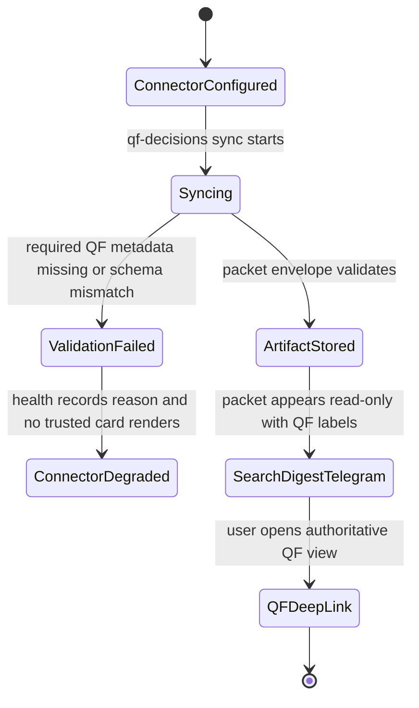
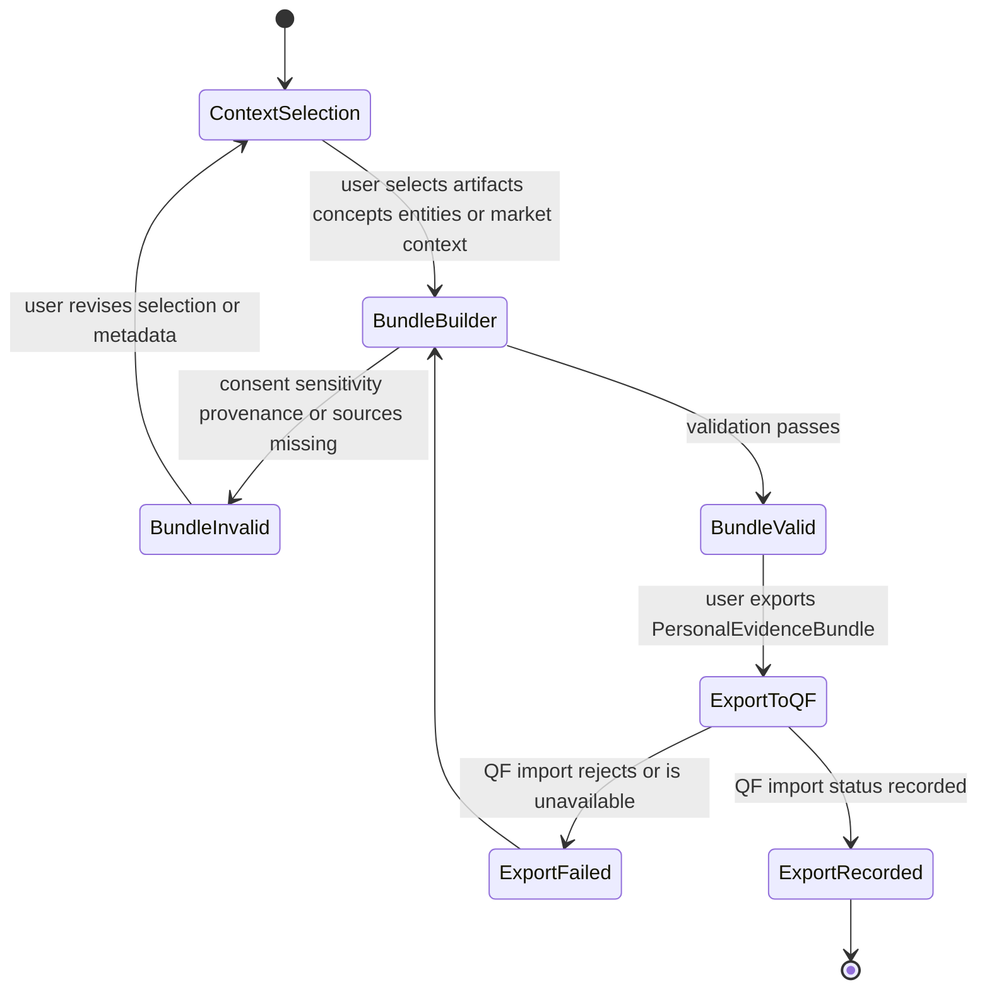
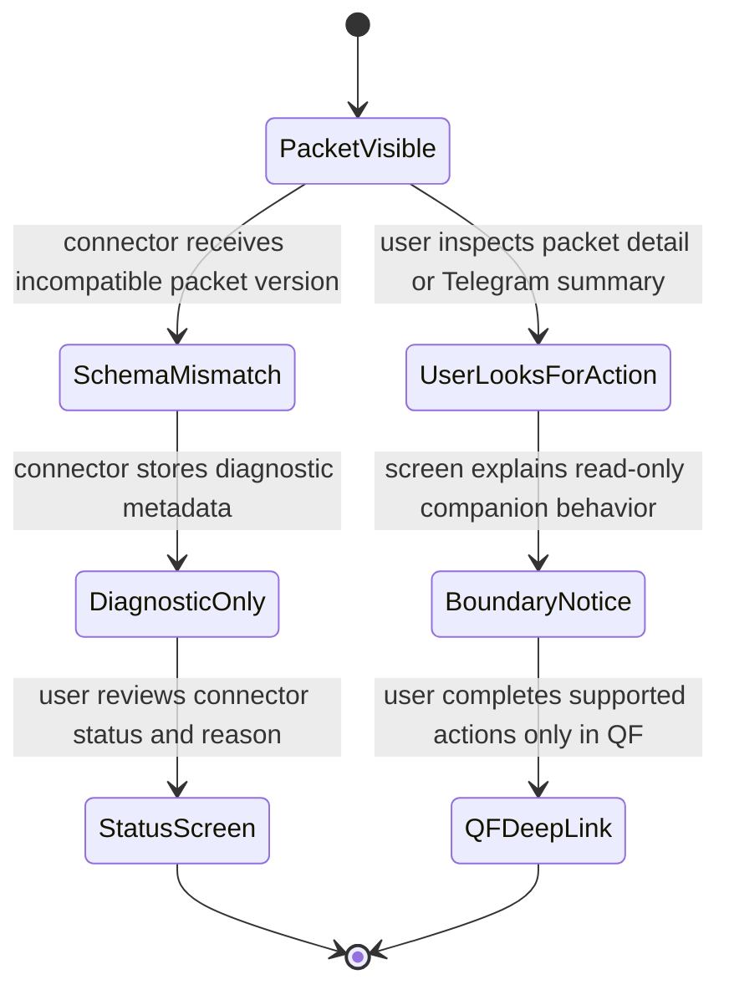

# Feature: 041 — QF Companion Connector

> **Author:** bubbles.analyst  
> **Date:** May 2, 2026  
> **Status:** Draft (analyst-owned requirements sections)  
> **Related QF Feature:** `quantitativeFinance/specs/063-smackerel-companion-bridge`

## Problem Statement

Smackerel already captures personal context, financial-market artifacts, cross-source connections, semantic search results, daily digests, and multi-channel delivery. QuantitativeFinance is evolving toward a canonical decision system where every meaningful output flows through `Intent`, `Scenario`, `DecisionPacket`, trust badges, approval state, and later mandates/outcomes.

Without a QF companion connector, Smackerel cannot surface QF decisions in the user's daily context, and QF cannot use Smackerel's personal knowledge graph as evidence without ad-hoc copying. The integration should be built now while Smackerel is mostly complete, but it must preserve the boundary that QF is the decision authority and Smackerel is the companion/context surface.

## Current Capability Map

| Capability | Existing Evidence | Current Status | Requirement Impact |
|------------|-------------------|----------------|--------------------|
| Connector lifecycle | `internal/connector/connector.go`, supervisor, cursor state, health states. | Present | QF connector should be a normal passive connector. |
| Financial markets connector | `internal/connector/markets` pulls quotes, crypto, forex, FRED, company news, and daily summaries. | Present | QF companion can link QF packets to Smackerel market/news context. |
| Prompt contracts | `config/prompt_contracts` includes digest, query augment, cross-source connection, recommendation watches, and feedback. | Present | QF rendering/evidence bundle generation should use prompt contracts where reasoning is needed. |
| Digest/search/web/Telegram surfaces | Runtime docs list daily digest, Web UI, semantic search, Telegram bot, PWA share target. | Present | QF packets can surface through existing channels. |
| Approval/action safety | Recommendation watch/feedback scenarios have policy and side-effect classes. | Present | QF actions must remain disabled or clearly side-effect scoped until QF allows them. |

## Outcome Contract

**Intent:** Add a QF companion connector that ingests QF decision events, renders QF packets read-only with trust metadata intact, and lets users export Smackerel personal context back to QF as consent-scoped evidence bundles.

**Success Signal:** A user configures the QF connector, syncs at least one QF decision packet, sees it in Smackerel Web/Telegram/digest with QF trace and trust badges preserved, opens the authoritative QF deep link, and exports a personal evidence bundle for a symbol/topic research trail back to QF.

**Hard Constraints:** Smackerel MUST NOT generate financial advice, buy/sell recommendations, approval state, calibration badges, data-provenance badges, or execution actions for QF. QF is the system of record. Pre-MVP connector behavior is read-only for decisions.

**Failure Condition:** The feature fails if Smackerel invents or edits QF trust metadata, treats a QF packet as a local recommendation, allows approval/execution before QF supports it, loses trace IDs, or exports personal context without source artifact references and sensitivity/consent metadata.

## Goals

1. Add a `qf-decisions` connector that syncs QF decision events by cursor.
2. Normalize QF packets into Smackerel artifacts without flattening trust metadata.
3. Render read-only QF packet cards in Web, digest, and Telegram-compatible channels.
4. Generate `PersonalEvidenceBundle`s from Smackerel artifacts, concepts, entities, market/news context, and cross-source connections.
5. Keep QF approval/execution actions disabled in pre-MVP with clear phase-boundary copy.
6. Define later release upgrades for approval, standing watches, tenant-aware access, and voice/kill-switch parity.

## Non-Goals

- No Smackerel-generated financial recommendations.
- No portfolio tracking inside Smackerel.
- No trade execution or broker integration.
- No QF tenant/client companion behavior before QF v2.0.
- No voice or EmergencyStop action before QF supports attested parity.
- No direct database connection into QF.
- No Kafka/Redpanda client in Smackerel for pre-MVP.

## Functional Requirements

### FR-001: QF Connector Configuration
Smackerel MUST support a `qf-decisions` connector configuration with QF base URL, credential reference, enabled flag, sync schedule, and connector-specific source config through `config/smackerel.yaml` and generated env.

### FR-002: Cursor-Based Sync
The connector MUST fetch QF decision events incrementally and store cursor state through the existing connector supervisor/state store.

### FR-003: QF Artifact Types
Smackerel MUST normalize QF objects into content types such as `qf/decision-packet`, `qf/no-action-decision`, `qf/policy-denial`, reserved future `qf/approval-request`, and reserved future `qf/watch-signal` (bidirectional schema with QF as final authority — pre-MVP non-actionable; see FR-015 for proposal direction handling).

### FR-004: Trust Metadata Preservation
Smackerel MUST preserve QF-provided `CalibrationBadge`, `DataProvenanceBadge`, trace ID, packet ID, intent ID, scenario ID, and deep link.

### FR-005: Read-Only Rendering
Smackerel MUST render QF packets as read-only companion cards in Web and digest surfaces, with Telegram-compatible summary formatting where channel limits allow.

### FR-006: No Local Financial Advice
Smackerel MUST NOT produce buy/sell/hold recommendations for QF packets. Any recommendation wording must originate from QF packet content.

### FR-007: PersonalEvidenceBundle Generation
Smackerel MUST generate a `PersonalEvidenceBundle` from selected artifacts or concept/entity context, including source artifact IDs, related symbols/entities, extracted claims, confidence, sensitivity tier, consent scope, and generated timestamp.

### FR-008: Evidence Export To QF
Smackerel MUST export evidence bundles to QF through the QF bridge API or private-alpha import path when configured.

### FR-009: Disabled Action Boundary
Approval, execution, mandate changes, and EmergencyStop actions MUST be disabled in pre-MVP unless QF exposes an explicit supported endpoint for that action class.

### FR-010: Connector Health
Smackerel MUST surface QF connector health, auth failures, schema/version mismatches, cursor lag, and packet validation failures.

### FR-011: Digest Integration
Smackerel's daily digest MAY include QF packets when they are high priority, but MUST preserve QF trust labels and MUST respect Smackerel quiet/sensitivity policies.

### FR-012: Search Integration
QF packets MUST be searchable by symbol, thesis, source entities, trace ID, packet ID, and related Smackerel concepts without exposing hidden sensitive evidence.

### FR-013: Packet Engagement Signal Exporter (O1)
Smackerel MUST emit a `PacketEngagementSignal` event to QF whenever a user opens, dwells on, dismisses, snoozes, deep-links, or shares a QF packet rendered in any Smackerel surface (Web detail, daily digest, Telegram). Required envelope fields: `signal_id`, `packet_id`, `trace_id`, `engagement_event` (enum: `opened`, `dwell`, `dismissed`, `snoozed`, `deep_linked`, `shared`), `engagement_ts`, `surface` (enum: `web`, `digest`, `telegram`), `consent_scope`, and opaque `actor_ref`. Emission MUST be consent-gated (user opt-in). The signal MUST NOT include packet content, evidence content, or PII beyond `actor_ref`. Emit failures MUST NOT block UX (fire-and-forget with bounded retry); every attempt MUST be recorded in the unified audit envelope (FR-016). Engagement signals MUST NOT influence Smackerel's local rendering, ranking, digest priority, recommendation surfaces, or local trust metadata.

### FR-014: Personal Context Read Endpoint Exposure (O2)
Smackerel MUST expose `GET /api/private/qf/v1/personal-context?entity={ref}&max_sensitivity={tier}&consent_token={t}` for QF guided-analysis and Rhai workflows. The endpoint MUST return artifact summaries (NOT raw content) with source IDs, sensitivity tier, claims, and provenance for the requested entity. Behavior: validate the Smackerel-issued `consent_token`, enforce the `max_sensitivity` ceiling, redact above ceiling, and return an empty list rather than an error when no consent or no matches exist. The endpoint MUST have NO write side-effects and MUST NOT grant action authority to QF. Responses MUST inherit the trust/non-influence stance of the existing `PersonalEvidenceBundle` push (FR-007/FR-008): QF treats responses as analysis-context only, never as advice authority.

### FR-015: Bidirectional Watch Signal — Pre-MVP Design Only (O3)
Smackerel MUST treat `qf/watch-signal` as a bidirectional schema with QF as the final authority for watch creation, evaluation, and `AttentionBudget` enforcement. Pre-MVP: Smackerel MUST NOT construct or send watch proposals; the connector MUST log any QF rejection (`WATCH_PROPOSALS_DEFERRED_TO_V1`) as diagnostic-only and MUST NOT surface a proposal affordance in any user-visible surface. v1.0: Smackerel UI MAY surface a "propose paper-mandate watch" affordance grounded in observed local context patterns, but every proposal MUST be sent to QF as a `qf/watch-signal` proposal, and Smackerel MUST NOT autonomously create or evaluate watches.

### FR-016: Unified Cross-Product Audit Envelope (O4)
All Smackerel-side bridge events — sync events, validation failures, packet upserts, evidence-bundle exports, engagement-signal emits, capability handshake, action-boundary diagnostics, signed-deep-link rendering decisions, callback signing/rejection — MUST emit the unified envelope `{trace_id, packet_id?, export_id?, signal_id?, actor_ref, surface, action, outcome, reason, ts}` so cross-product incident investigation produces a single greppable timeline shared with QF.

### FR-017: Signed Callback Protocol — Pre-MVP Design + Signing Infra (O5)
Pre-MVP Smackerel Telegram packet summary surfaces MUST render every actionable element as a signed callback payload (`trace_id`, `packet_id`, `action`, `nonce`, `expires_at`, HMAC). The signing infrastructure MUST be implemented pre-MVP. Pre-MVP receivers (Smackerel-internal callback handlers) MUST reject all incoming callbacks with reason code `CALLBACK_DEFERRED_TO_V1`, mirroring QF's pre-MVP rejection. v1.0+: callbacks MUST be accepted for delivery acks and `NoActionDecision` capture using the same signing protocol. v3.0: the same protocol MUST be reused for EmergencyStop attestation. Smackerel MUST NOT introduce a second callback signing scheme.

### FR-018: Smackerel Connector Class Evidence Eligibility (O7)
When `PersonalEvidenceBundle` source artifacts originate in Smackerel-owned connectors of an eligible class, Smackerel MUST attach a `DataProvenanceBadge`-shaped metadata block to those source references inside the bundle. Eligible Smackerel connector classes are: financial markets, weather, news/RSS, geopolitical/public-events, public bookmarks, and web-archive. Pre-MVP: the eligibility rule and the connector-class enumeration MUST be defined in spec; bundle-side badge attachment MUST NOT be enabled until the paired QF design accepts it (gated to v1.0 enforcement).

### FR-019: Signed Deep-Link Rendering (O8)
Every QF deep link Smackerel renders (Web, digest, Telegram) MUST be the signed payload form when QF supplies it. Pre-MVP: Smackerel MUST render signed deep links exactly as QF supplies them. If a packet envelope arrives without a signed deep link, Smackerel MUST render the unsigned link with a diagnostic note in operator-visible status, and MUST NOT re-sign or re-issue the link locally. Smackerel MUST NOT downgrade signed links to unsigned form on any rendering surface.

### FR-020: Preferred Surface Hint Honoring (O9)
Smackerel MUST read the optional `preferred_surface` enum from `QFDecisionPacketEnvelope` and use it as a render-priority signal only. Behavior matrix:
- `qf_dashboard`: render in search and detail; suppress from digest unless the user explicitly opens it.
- `smackerel_digest`: include in the next eligible digest; default for `analysis_note` decision-type.
- `smackerel_telegram`: prioritize for the next Telegram delivery window (when v1.0 enables Telegram delivery actions).
- `any` or missing: existing default behavior.

Honoring the hint MUST NOT change content rendering, trust metadata, or action-boundary behavior.

## Actors & Personas

| Actor | Description | Key Goals | Permissions |
|-------|-------------|-----------|-------------|
| Smackerel User / QF User | Same person running both systems. | See QF decisions in daily context; export personal context into QF. | Configure connector, view packets, export evidence. |
| QF Connector | Passive Smackerel connector. | Sync QF packet events reliably. | Read-only access to QF bridge endpoint. |
| Personal Evidence Curator | User selecting context for QF. | Bundle relevant research trail without dumping raw private data. | Select artifacts/concepts and consent scope. |
| Future Advisor/Operator | Later QF v2 persona. | Use Smackerel as client/family-office companion. | Deferred until tenant-aware QF bridge. |

## Cross-Product Opportunities (Mirror)

These opportunities mirror the cross-product opportunities defined in QF spec 063 (`quantitativeFinance/specs/063-smackerel-companion-bridge`) from the Smackerel-implementation perspective. Smackerel responsibility statements describe what this codebase MUST build, expose, or respect; mutual-benefit statements explain why both products gain. None of these expands Smackerel's authority over financial decisions; QF remains the system of record and the sole decision authority.

### O1: Packet Engagement Signal Exporter — Pre-MVP

- **Smackerel Responsibility:** Build the `PacketEngagementSignal` emitter (FR-013), gate it behind explicit user consent, and wire it into Web detail, daily digest, and Telegram surfaces with bounded fire-and-forget retry. Never let signal emission affect local rendering, ranking, digest priority, or recommendation surfaces.
- **Mutual Benefit:** QF gains decision-salience telemetry distinct from `OutcomeRecord`; Smackerel surfaces become first-class calibration inputs without inheriting decision authority.

### O2: Personal Context Read Endpoint Exposure — Pre-MVP

- **Smackerel Responsibility:** Implement the `GET /api/private/qf/v1/personal-context` endpoint (FR-014) returning consent-gated, sensitivity-aware artifact summaries with source IDs, claims, and provenance — never raw content. Validate `consent_token`, enforce `max_sensitivity` ceiling, redact above ceiling, and return empty rather than error on missing consent or no matches.
- **Mutual Benefit:** QF guided-analysis and Rhai workflows can ground reasoning in personal context proactively; Smackerel becomes a load-bearing personal-context substrate without acquiring action authority.

### O3: Bidirectional Watch Signal — Pre-MVP Design Only, v1.0 Implementation

- **Smackerel Responsibility:** Pre-MVP, do not construct or send watch proposals; log any QF rejection (`WATCH_PROPOSALS_DEFERRED_TO_V1`) as diagnostic-only and keep the proposal affordance off all user surfaces. v1.0, surface a "propose paper-mandate watch" affordance grounded in observed local context patterns and emit each proposal as a `qf/watch-signal` (FR-015). Never autonomously create or evaluate watches.
- **Mutual Benefit:** QF gets richer watch seed input from observed personal patterns; Smackerel acts on those patterns without authoring financial decisions.

### O4: Unified Cross-Product Audit Envelope — Pre-MVP

- **Smackerel Responsibility:** Adopt the unified envelope `{trace_id, packet_id?, export_id?, signal_id?, actor_ref, surface, action, outcome, reason, ts}` for every bridge event — sync, validation, packet upsert, bundle export, engagement emit, capability handshake, action-boundary diagnostic, signed-deep-link decision, callback signing/rejection (FR-016).
- **Mutual Benefit:** Both products gain incident-investigation parity at zero new endpoint cost; each side keeps its own log store while sharing one greppable shape.

### O5: Telegram Callback Signing Protocol — Pre-MVP Signing Infra + Design, v1.0 Acceptance

- **Smackerel Responsibility:** Implement the signing infrastructure pre-MVP and render every Telegram actionable element as a signed callback payload (`trace_id`, `packet_id`, `action`, `nonce`, `expires_at`, HMAC). Pre-MVP receivers reject all incoming callbacks with `CALLBACK_DEFERRED_TO_V1`. v1.0+ accept callbacks for delivery acks and `NoActionDecision` capture; v3.0 reuse the same protocol for EmergencyStop attestation (FR-017). Never introduce a second callback signing scheme.
- **Mutual Benefit:** QF gets forgery-resistant callback inputs from launch; Smackerel avoids retrofitting unsigned callback paths later and shares one signing scheme across all callback flows.

### O6: Engagement-Driven Re-Staleness Recheck — v1.0

- **Smackerel Responsibility:** Re-sync QF badge updates through the existing `qf-decisions` connector when QF re-evaluates badge staleness based on the engagement signals emitted under O1. No new Smackerel surface is required; rely on the existing connector and rendering paths.
- **Mutual Benefit:** QF tightens its staleness loop with real engagement evidence; Smackerel gains downstream effect from its own engagement data without new endpoints.

### O7: Smackerel Connector Class Evidence Eligibility — Pre-MVP Design Only

- **Smackerel Responsibility:** Enumerate eligible Smackerel connector classes (financial markets, weather, news/RSS, geopolitical/public-events, public bookmarks, web-archive) in spec; design the `DataProvenanceBadge`-shaped metadata generator (FR-018). Pre-MVP defines the rule; bundle-side badge attachment is gated to v1.0 enforcement to align with paired QF acceptance.
- **Mutual Benefit:** QF gets richer machine-sourced evidence under proper provenance; Smackerel connector data is no longer artificially downgraded when imported as personal evidence.

### O8: Signed Deep-Link Rendering — Pre-MVP Design Only

- **Smackerel Responsibility:** Render signed deep links exactly as QF supplies them across Web, digest, and Telegram surfaces. If QF supplies an unsigned link, render it with a diagnostic note in operator-visible status; never re-sign or re-issue locally; never downgrade signed links to unsigned form on any rendering surface (FR-019).
- **Mutual Benefit:** QF gets cross-surface authenticity guarantees; Smackerel renders deep links that future QF clients can verify without negotiation.

### O9: Preferred Surface Hint Honoring — Pre-MVP

- **Smackerel Responsibility:** Read the optional `preferred_surface` enum from `QFDecisionPacketEnvelope` and use it as a render-priority signal only — never as a content, trust, or action-behavior modifier (FR-020). Apply the digest/search/Telegram behavior matrix without changing trust metadata or action-boundary copy.
- **Mutual Benefit:** Both products avoid duplicate primary-surface noise without breaking the trust/action boundary; user attention lands on the surface best suited to each packet type.

## Business Scenarios

### BS-001: QF Packet In Digest
Given QF exposes a decision packet for the user  
When the QF connector syncs  
Then Smackerel includes the packet in search/digest with QF trust metadata intact.

### BS-002: Evidence Bundle Export
Given a user has email, bookmark, market/news, and notes context around a symbol  
When the user exports context to QF  
Then Smackerel creates a `PersonalEvidenceBundle` with source IDs, claims, symbols, sensitivity, confidence, and consent scope.

### BS-003: Action Boundary
Given a QF packet appears in Smackerel pre-MVP  
When the user tries to approve or execute from Smackerel  
Then Smackerel shows that actions must be completed in QF until the relevant release enables companion actions.

### BS-004: Schema Mismatch
Given QF sends a packet version Smackerel does not understand  
When the connector syncs  
Then Smackerel stores diagnostic metadata, marks connector degraded, and does not render an actionable card.

## UI Scenario Matrix

| Scenario | Actor | Entry Point | Steps | Expected Outcome | Screen(s) |
|----------|-------|-------------|-------|------------------|-----------|
| View QF packet | User | Digest/search/Telegram | Sync -> open card -> inspect badges -> open QF link | Same trace and trust metadata visible | Digest, Web, Telegram |
| Build evidence bundle | User | Search/concept/entity page | Select context -> generate bundle -> export to QF | QF receives consent-scoped evidence | Web knowledge/search |
| Connector health issue | User/operator | Settings connectors | Open QF connector status | Auth/schema/cursor issue visible | Settings, status |
| Engagement signal emit (O1) | Smackerel User / QF User | QF packet card on Web detail, daily digest, or Telegram | Open packet -> dwell/dismiss/snooze/deep-link/share | Consent-gated `PacketEngagementSignal` posted to QF; Smackerel local rendering, ranking, digest priority, and trust metadata unchanged | Web, Digest, Telegram |
| Personal-context read response (O2) | QF Connector / QF Analyst | QF guided-analysis or Rhai workflow calls `GET /api/private/qf/v1/personal-context` | Validate consent_token -> enforce max_sensitivity -> redact above ceiling -> return artifact summaries with source IDs, claims, provenance | QF receives consent-gated, sensitivity-aware summaries (no raw content); empty list when no consent or no matches | Backend endpoint (no Smackerel UI) |
| Digest priority by `preferred_surface` (O9) | Smackerel User / QF User | Daily digest assembly | QF sets `preferred_surface=smackerel_digest` for `analysis_note` -> digest includes packet primary; QF mirrors. `qf_dashboard` -> digest suppresses unless explicitly opened | Render priority follows hint; content, trust metadata, and action-boundary copy identical to default render | Digest, Web |
| Telegram signed-callback rendering (O5 design-only) | Smackerel User / QF User | Telegram QF packet summary | Smackerel renders actionable elements as signed callback payloads (`trace_id`, `packet_id`, `action`, `nonce`, `expires_at`, HMAC); pre-MVP receivers reject incoming callbacks with `CALLBACK_DEFERRED_TO_V1` | Signed payloads emitted; pre-MVP rejection logged in unified audit envelope; no callback action accepted | Telegram |

## Release Mapping

| Capability | Pre-MVP | MVP | v1.0 | v2.0 | v3.0 |
|------------|---------|-----|------|------|------|
| `qf-decisions` connector | Implement private-alpha read-only | Harden under QF auth/entitlements | Carry as delivery channel | Tenant/service-account scoped | Certified external surface |
| QF packet cards | Read-only | Read-only + limited QF-supported actions | Full approval feedback for paper workflows | Policy-scoped advisor/client mode | Full parity where allowed |
| Evidence bundles | Manual/export path | Attach to guided/Rhai workflows | Committee grounding | Retention/consent/audit policy | Universal asset context |
| Standing watches | Design/reserved only (bidirectional schema; QF rejects proposals with `WATCH_PROPOSALS_DEFERRED_TO_V1`) | Limited alert surfacing | Mandate/watch evaluation under QF authority | AttentionBudget scoped | Full omni-channel watches |
| Voice/EmergencyStop | Not supported | Not supported | Paper/status only if QF supports | Tenant-scoped parity prep | Attested voice/mobile parity |
| Packet engagement signal (O1) | Implement consent-gated emitter for Web/digest/Telegram | Harden under QF auth/entitlements | Feed engagement-driven re-staleness recheck (O6) | Tenant/service-account scoped | Full cross-channel engagement parity |
| Personal-context read endpoint (O2) | Expose `GET /api/private/qf/v1/personal-context` private alpha | Production-safe context-attachment surface | Committee/guided-analysis grounding | Consent, retention, audit policy | Universal cross-asset context |
| Smackerel-proposed standing watches (O3) | Design only; do not surface proposal affordance | Disabled | Implement proposal emission and evaluation under QF authority | Attention-budget scoped | Omni-channel parity |
| Unified audit envelope (O4) | Adopt envelope across all Smackerel bridge events | Enforce coverage across all cross-product surfaces | Retain across delivery substrate | Tenant-aware audit query | External API audit parity |
| Signed callback protocol (O5) | Implement signing infra; render signed Telegram payloads; receivers reject with `CALLBACK_DEFERRED_TO_V1` | Disabled | Accept callbacks for delivery acks and `NoActionDecision` capture | Tenant/policy scoped callbacks | EmergencyStop attestation parity |
| Engagement-driven re-staleness recheck (O6) | — | — | Re-sync QF badge updates through `qf-decisions` connector using O1 signals | Tenant/policy scoped re-evaluation | Full cross-channel staleness loop |
| Smackerel connector provenance eligibility (O7) | Define eligible connector classes; design metadata generator (no bundle-side attachment yet) | Enable for analysis-context attachments | Committee grounding | Provenance retention/audit policy | Universal asset context |
| Signed deep-link rendering (O8) | Render signed deep links as supplied; diagnostic note when unsigned; never re-sign locally | Enforce signature verification across all rendered deep links | Carry signature through delivery substrate | Tenant/scope-bound link validity | v3.0 mobile parity |
| Preferred surface hint honoring (O9) | Read `preferred_surface` and apply render-priority matrix | Honor across hardened surfaces | Carry into delivery substrate | Tenant/service-account scoped | External API parity |

## Non-Functional Requirements

- **Privacy:** Evidence bundles must include sensitivity and consent metadata.
- **Security:** QF credentials must come from Smackerel config/env generation, never hardcoded.
- **Reliability:** Connector failure must not mutate existing QF packet artifacts.
- **Auditability:** Trace ID, packet ID, and source artifact IDs must be preserved.
- **UX clarity:** Smackerel must clearly distinguish QF-authored decisions from Smackerel-local recommendations.
- **Cross-Product Audit Envelope (O4):** All Smackerel bridge logs MUST emit the unified cross-product audit envelope `{trace_id, packet_id?, export_id?, signal_id?, actor_ref, surface, action, outcome, reason, ts}` covering every export, fetch, import, validation rejection, signed-deep-link rendering decision, callback signing/rejection, engagement emit, and unsupported-action record so cross-product incident investigation produces a single greppable timeline shared with QF.

## UI Wireframes

### Screen Inventory

| Screen | Actor(s) | Status | Scenarios Served |
|--------|----------|--------|------------------|
| QF Connector Status | Smackerel User / QF User, QF Connector | Modify existing `/settings` and `/status` | BS-004 |
| QF Packet Search And Digest Card | Smackerel User / QF User | Modify existing search, digest, and result cards | BS-001, BS-003, BS-004 |
| QF Packet Artifact Detail | Smackerel User / QF User | Modify existing `/artifact/{id}` detail | BS-001, BS-003 |
| Personal Evidence Bundle Builder | Personal Evidence Curator | New flow from search/concept/entity/artifact pages | BS-002 |
| Telegram QF Packet Summary | Smackerel User / QF User | Modify existing Telegram/digest formatting | BS-001, BS-003 |

### Screen: QF Connector Status

**Actor:** Smackerel User / QF User | **Route:** `/settings` and `/status` | **Status:** Modify

```text
┌──────────────────────────────────────────────────────────────┐
│ Search  Digest  Topics  Knowledge  Settings  Status  [Theme] │
├──────────────────────────────────────────────────────────────┤
│ Settings / Connectors                                        │
│                                                              │
│ ┌──────────────────────────────────────────────────────────┐ │
│ │ QF Decisions                                             │ │
│ │ Status: [healthy/degraded/error]     Connector: qf-decisions │
│ │ Last sync: [timestamp]               Cursor lag: [count/time]│
│ │ Contract: [packet_version]           QF schema: [compatible] │
│ │ Required metadata: packet trace badges approval deep link     │
│ │                                                          │ │
│ │ Health Details                                           │ │
│ │ [auth ok] [schema ok] [cursor ok] [validation failures n]│ │
│ │                                                          │ │
│ │ [Sync Now] [View diagnostics] [Disable connector]        │ │
│ └──────────────────────────────────────────────────────────┘ │
│                                                              │
│ ┌──────────────────────────────────────────────────────────┐ │
│ │ Diagnostics                                              │ │
│ │ Time | Event | Packet ID | Trace ID | Reason             │ │
│ │ [row]| schema mismatch | [id] | [trace] | degraded       │ │
│ └──────────────────────────────────────────────────────────┘ │
└──────────────────────────────────────────────────────────────┘
```

**Interactions:**
- `[Sync Now]` triggers the existing connector sync pattern for `qf-decisions` and updates status without exposing QF credential material.
- `[View diagnostics]` expands per-packet validation failures, schema/version mismatch, cursor lag, and auth errors.
- `[Disable connector]` routes through the existing config-owned enable/disable workflow and never deletes synced artifacts.

**States:**
- Empty state: connector not configured; show required config keys and no QF packet previews.
- Loading state: connector row shows syncing state and disables duplicate sync triggers.
- Error state: auth, missing config, incompatible schema, or QF read-surface outage appears as connector error with no packet rendering.
- Degraded state: missing packet IDs, trace IDs, or trust badges marks connector degraded and packet cards non-actionable.

**Responsive:**
- Mobile: connector facts collapse into stacked rows; diagnostics table becomes cards keyed by packet ID.
- Tablet: diagnostics panel sits below the connector health card.
- Desktop: status and diagnostics use a two-card vertical layout inside the existing Settings page width.

**Accessibility:**
- Health is conveyed with text and status icons, never color alone.
- Sync result messages use `aria-live` status text.
- Diagnostic rows are keyboard-expandable and identify packet ID, trace ID, and failure reason.

### Screen: QF Packet Search And Digest Card

**Actor:** Smackerel User / QF User | **Route:** `/`, `/digest` | **Status:** Modify

```text
┌──────────────────────────────────────────────────────────────┐
│ Search  Digest  Topics  Knowledge  Settings  Status  [Theme] │
├──────────────────────────────────────────────────────────────┤
│ Search your knowledge                                        │
│ [ query: symbol / thesis / packet / trace id              ]   │
│                                                              │
│ ┌──────────────────────────────────────────────────────────┐ │
│ │ QuantitativeFinance · qf-decisions                       │ │
│ │ [QF-authored packet title]                               │ │
│ │ Approval: [display-only]  Calibration: [badge text]      │ │
│ │ Provenance: [badge text]  Trace: [trace_id]              │ │
│ │ Thesis excerpt: [QF-authored excerpt, not rewritten]     │ │
│ │ [Open detail] [Open in QF] [Build evidence bundle]       │ │
│ │ Action boundary: approval and execution happen in QF     │ │
│ └──────────────────────────────────────────────────────────┘ │
│                                                              │
│ Daily Digest                                                 │
│ ┌──────────────────────────────────────────────────────────┐ │
│ │ QF Packet: [title] · [approval state] · [trust summary]  │ │
│ │ [one-line QF-authored why-now excerpt] [Open in QF]      │ │
│ └──────────────────────────────────────────────────────────┘ │
└──────────────────────────────────────────────────────────────┘
```

**Interactions:**
- Search result card opens the normal artifact detail while preserving QF source label and trust metadata.
- `[Open in QF]` uses the QF deep link exactly as supplied in packet metadata.
- `[Build evidence bundle]` starts a user-selected context bundle flow; it does not treat the QF packet itself as Smackerel advice.

**States:**
- Empty state: no QF packets match the query; keep normal Smackerel search empty copy.
- Loading state: existing HTMX search spinner remains visible until cards render.
- Error state: search failure does not show stale QF packets as fallback results.
- Degraded state: missing trust metadata renders a diagnostic card without QF thesis excerpt or action affordances.

**Responsive:**
- Mobile: badges wrap below title; trace and packet IDs collapse behind a details toggle.
- Tablet: card actions stack below metadata.
- Desktop: source/trust row stays visible without expanding the card.

**Accessibility:**
- Source and connector labels are text, not icon-only.
- Badge text includes semantic state and does not rely on color.
- Action boundary sentence remains visible to screen readers before any action controls.

### Screen: QF Packet Artifact Detail

**Actor:** Smackerel User / QF User | **Route:** `/artifact/{id}` | **Status:** Modify

```text
┌──────────────────────────────────────────────────────────────┐
│ < Back to search                                             │
│ QF Packet: [QF-authored title]                               │
│ QuantitativeFinance · qf-decisions · qf/decision-packet      │
├──────────────────────────────────────────────────────────────┤
│ Trust Metadata                                               │
│ [CalibrationBadge] [DataProvenanceBadge] [Approval state]    │
│ Packet [packet_id]  Trace [trace_id]                         │
│ Intent [intent_id]  Scenario [scenario_id]                   │
│                                                              │
│ ┌──────────────────────────────────────────────────────────┐ │
│ │ QF-authored content                                     │ │
│ │ Thesis: [verbatim/faithful packet thesis]               │ │
│ │ Why now: [QF why-now excerpt]                           │ │
│ │ Quantified impact: [QF impact summary]                  │ │
│ └──────────────────────────────────────────────────────────┘ │
│                                                              │
│ ┌──────────────────────────────────────────────────────────┐ │
│ │ Companion Context                                       │ │
│ │ Related artifacts/concepts/entities from Smackerel       │ │
│ │ [select] Email note      [select] Bookmark               │ │
│ │ [select] Market news     [select] Concept page           │ │
│ │ [Build PersonalEvidenceBundle] [Open in QF]              │ │
│ └──────────────────────────────────────────────────────────┘ │
│                                                              │
│ Actions unavailable here: approve, execute, mandate changes, │
│ and EmergencyStop remain QF-owned release-gated actions.     │
└──────────────────────────────────────────────────────────────┘
```

**Interactions:**
- Related context selection adds Smackerel artifacts to the evidence builder draft.
- `[Build PersonalEvidenceBundle]` opens the builder with selected sources prefilled.
- `[Open in QF]` opens the authoritative QF packet deep link.
- Approval/execution/mandate/EmergencyStop controls are absent in pre-MVP; if a later endpoint appears, the screen must still show QF-supported action class and policy text.

**States:**
- Empty state: no related Smackerel context; show packet trust metadata and QF deep link only.
- Loading state: related context area shows loading while packet metadata remains visible.
- Error state: related context failure does not hide QF trust metadata.
- Degraded state: if packet validation failed, detail shows diagnostic metadata and suppresses evidence-building entry points.

**Responsive:**
- Mobile: related context checkboxes become full-width rows; QF metadata appears before content.
- Tablet: trust metadata and QF content stack above companion context.
- Desktop: QF content and companion context can use two stacked panels inside the existing 800px body width.

**Accessibility:**
- Checkboxes have source titles, content type, sensitivity, and selection purpose in their labels.
- The action-boundary notice uses alert/information semantics and is present in reading order.
- QF deep link text includes packet title or ID.

### Screen: Personal Evidence Bundle Builder

**Actor:** Personal Evidence Curator | **Route:** `/evidence-bundles/new` | **Status:** New

```text
┌──────────────────────────────────────────────────────────────┐
│ Search  Digest  Topics  Knowledge  Settings  Status  [Theme] │
├──────────────────────────────────────────────────────────────┤
│ Build PersonalEvidenceBundle                                 │
│ Target QF packet/context: [packet_id or analysis context]     │
│                                                              │
│ ┌──────────────────────────────┐ ┌─────────────────────────┐ │
│ │ Selected Sources             │ │ Bundle Metadata         │ │
│ │ [x] [artifact title] email   │ │ Consent scope [select]  │ │
│ │ [x] [artifact title] note    │ │ Sensitivity [select]    │ │
│ │ [x] [artifact title] market  │ │ Confidence [summary]    │ │
│ │ [remove] [preview source]    │ │ Redaction [summary]     │ │
│ └──────────────────────────────┘ └─────────────────────────┘ │
│                                                              │
│ ┌──────────────────────────────────────────────────────────┐ │
│ │ Extracted Claims                                         │ │
│ │ Claim | Source IDs | Symbol/Entity | Confidence          │ │
│ │ [row] | [ids]      | [symbol]      | [score]             │ │
│ └──────────────────────────────────────────────────────────┘ │
│                                                              │
│ [Validate bundle] [Export to QF] [Cancel]                    │
└──────────────────────────────────────────────────────────────┘
```

**Interactions:**
- Source rows can be removed before export; source preview is read-only.
- Consent scope and sensitivity must be explicitly selected before validation can pass.
- `[Validate bundle]` checks source IDs, claims, consent, sensitivity, provenance, and redaction summary.
- `[Export to QF]` submits only after validation passes and then shows QF import status.

**States:**
- Empty state: no sources selected; primary action returns user to search/knowledge to choose sources.
- Loading state: claim extraction and export status use explicit progress messages.
- Error state: missing consent, missing source provenance, unsupported sensitivity, or QF export failure appears beside the failing section.
- Success state: bundle ID, QF import status, and source count are shown with a link back to the target packet/context.

**Responsive:**
- Mobile: source selection, metadata, claims, and export status become a single-column stepper.
- Tablet: selected sources and metadata stack above claims.
- Desktop: selected sources and metadata sit side by side above claims.

**Accessibility:**
- Step headings identify source selection, metadata, claims, and export status.
- Validation summary focuses the first invalid section.
- Export success and failure are announced through an `aria-live` region.

### Screen: Telegram QF Packet Summary

**Actor:** Smackerel User / QF User | **Route:** Telegram digest/message surface | **Status:** Modify

```text
┌──────────────────────────────────────────────┐
│ Smackerel Daily Digest                       │
│                                              │
│ QuantitativeFinance · qf-decisions           │
│ [QF packet title]                            │
│ Approval: [display-only state]               │
│ Calibration: [badge text]                    │
│ Provenance: [badge text]                     │
│ Trace: [short trace_id]                      │
│                                              │
│ [QF-authored why-now excerpt]                │
│ Open in QF: [deep_link]                      │
│                                              │
│ Actions: open/read only in Smackerel         │
└──────────────────────────────────────────────┘
```

**Interactions:**
- User can open QF deep link from the message.
- No Telegram approval, execution, mandate, watch, or EmergencyStop buttons appear in pre-MVP.
- If packet is degraded, message uses diagnostic wording and links to connector status rather than packet detail.

**States:**
- Empty state: no QF packets selected for digest; digest omits the QF block.
- Loading state: not shown in Telegram; packet inclusion is decided before delivery.
- Error state: connector health warnings appear in status/admin surfaces, not as stale packet advice.
- Degraded state: degraded packet summary contains source, reason, trace/packet identifiers if safe, and no thesis excerpt.

**Responsive:**
- Telegram summary is single-column and limited to compact labels.
- Long IDs are shortened visually while full IDs remain available in Web detail.

**Accessibility:**
- Text order is source, title, trust, trace, excerpt, link, boundary notice.
- Links use descriptive labels and do not rely on emoji or icons.

## User Flows

### User Flow: QF Packet Sync And Read-Only Surfacing



### User Flow: Evidence Bundle Export



### User Flow: Action Boundary And Schema Mismatch


