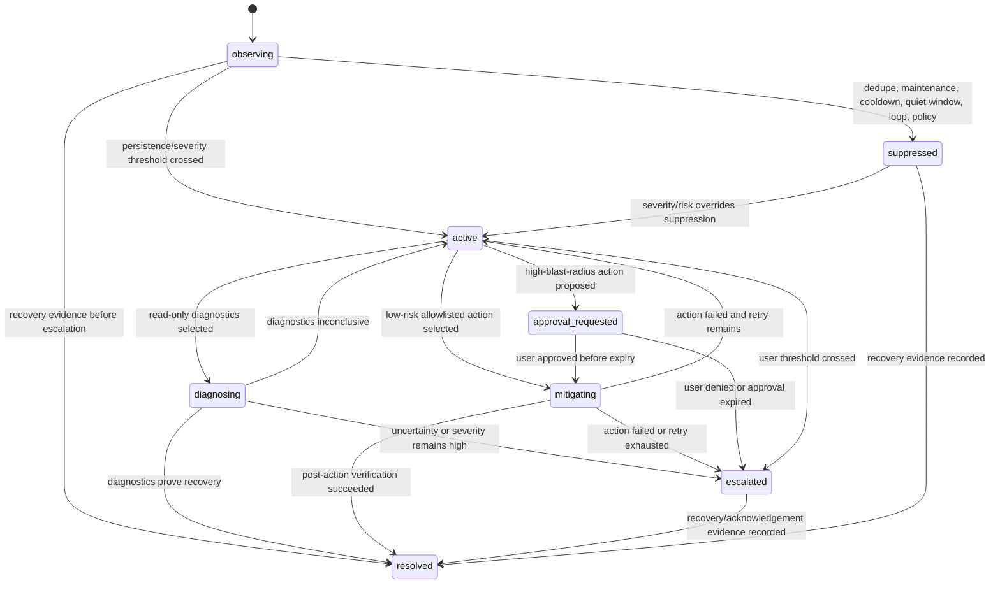

# Design: Notification Intelligence Handler Service

> **Design Successor Note (2026-05-31).** This spec stays `done`. Source-neutral
> notification ingestion, normalization, classification, correlation,
> decisioning, suppression, approvals, and dashboard dispatch in this design
> remain authoritative. Notification→user delivery now intersects the assistant
> routing layer in [spec 061](../061-conversational-assistant/design.md) and the
> `TransportAdapter` contract in [spec 069](../069-assistant-http-transport/design.md);
> user-initiated queries about notifications should flow through the assistant
> facade rather than per-channel handlers. This spec still owns the
> notification intelligence core; the assistant stack owns user-facing
> conversational delivery.

## Design Brief

### Current State

Smackerel has a mature ingestion and intelligence foundation: source connectors implement `internal/connector.Connector`, connector health is tracked through `sync_state`, raw artifacts flow into PostgreSQL and NATS, and operator surfaces exist through Chi API routes plus HTMX web handlers. The existing `alerts` table, Telegram delivery path, recommendation suppression/delivery tables, agent traces, and knowledge graph prove adjacent patterns but do not provide a source-neutral notification intelligence model.

The current alert path is channel-shaped: weather/government alerts can publish `alerts.notify`, and Telegram can deliver selected messages. That is useful as a producer/output precedent, but it is not the model for this feature because spec 054 requires raw-event preservation, normalization, classification, incident correlation, safety-gated handling, approvals, and output-channel abstraction for every notification source.

### Target State

Spec 054 introduces a core `internal/notification` service that accepts events from pluggable source adapters, stores raw input first, normalizes into one notification model, classifies severity/domain/intent, deduplicates and correlates incidents, chooses a single handling decision, and records diagnostics, actions, suppressions, approvals, and deliveries. Routine notifications stay silent; severe, persistent, uncertain, or risky incidents become concise, redacted, source-qualified user output.

The handler is deliberately source-agnostic. Spec 055 ntfy implements the source interface as one adapter, while the core handler never imports ntfy-specific packages, branches on ntfy fields, or treats Telegram/ntfy as the domain model.

### Patterns to Follow

- `internal/connector/connector.go`, `registry.go`, `supervisor.go`, and `state.go`: reuse the registry/supervision/health approach while defining a notification-specific source contract that supports stream, webhook, polling, queue, file/drop, API pull, and manual ingest forms.
- `internal/db/migrations/022_recommendations.sql`: follow explicit application-written IDs/timestamps, bounded enums with `CHECK`, JSONB rationale envelopes, suppression records, delivery attempts, and traceability to source records.
- `internal/api/router.go` and `internal/api/recommendations.go`: add authenticated `/api/notifications/*` JSON endpoints and authenticated web routes behind existing middleware rather than inventing a separate API stack.
- `internal/knowledge/store.go` and `internal/db/migrations/001_initial_schema.sql`: enrich from `artifacts`, `knowledge_concepts`, `knowledge_entities`, `topics`, and `edges` as read-side graph context, then write graph-compatible references rather than creating a parallel knowledge silo.
- `internal/recommendation/store/redact.go`: create a notification-owned redaction guard for logs, raw previews, delivery payloads, diagnostics, and action results.

### Patterns to Avoid

- Do not extend the old `alerts` table as the primary notification model. It lacks raw-event durability, source-specific metadata preservation, incidents, safety-gated actions, approvals, and replayable decision history.
- Do not let source adapters call Telegram or output channels directly. Adapters submit source events only; the handler owns classification, correlation, suppression, escalation, approvals, and actions.
- Do not store source credentials, secret values, raw token fragments, or unredacted sensitive payload excerpts in source health, logs, audit views, or user-facing output.
- Do not introduce `${VAR:-value}`, `os.Getenv` fallback values, generated-env hand edits, or optional credentials that silently degrade into fake connectivity.
- Do not add a source-specific branch such as `if sourceType == "ntfy"` inside classification, incident, decision, or action code. Source-specific mapping belongs in adapter-owned mapping rules that output normalized fields.

### Resolved Decisions

- Raw event storage is the first durable step for every accepted source event.
- Notification source identity is always `(source_type, source_instance_id)`, never `source_type` alone.
- Raw payloads and source-specific fields are preserved for audit and replay, but core decisioning consumes normalized fields and mapping outputs.
- Incidents are the primary user-facing unit; individual routine events remain searchable/auditable.
- Diagnostics are read-only; autonomous actions are non-destructive, low-risk, allowlisted, and bounded; high-blast-radius actions require approval.
- Destructive automatic actions are refused even when severity is high.
- Output channels implement a delivery interface. Telegram, dashboard, digest, email, webhook, and ntfy reply are channel implementations, not notification-domain types.
- Configuration flows through `config/smackerel.yaml` and generated env files; missing enabled source/action/channel values fail loud.

### Open Questions

None blocking for design. Specific threshold values, source instances, action allowlists, and channel destinations must be explicit SST values during planning and implementation.

## Purpose And Scope

The Notification Intelligence Handler is a core Go service in `smackerel-core`. It owns source-neutral notification ingest, durable event persistence, normalization, classification, deduplication, incident correlation, decisioning, diagnostics orchestration, action safety, approval state, suppressions, and output delivery requests.

Spec 054 owns the contract and core handler. Spec 055 ntfy owns ntfy transport, subscription, ntfy payload parsing, ntfy health checks, and ntfy-specific conformance tests against the spec 054 contract.

### In Scope

- `internal/notification` domain types, service orchestration, stores, classifiers, correlators, state machine, decision engine, diagnostics runner, action executor, output dispatcher, source registry, and safety policy.
- `internal/db/migrations/036_notification_intelligence.sql` additive schema.
- `/api/notifications/*` authenticated operator/user API endpoints and `/notifications/*` HTMX web pages implied by UX.
- NATS subjects/stream entries for asynchronous pipeline stages and delivery dispatch where queueing is required.
- SST configuration blocks under `notification_intelligence` and `notification_outputs`, with generated env wiring through the existing config generator.

### Out Of Scope For Core Handler Ownership

- ntfy-specific subscription mechanics, topic auth, priority parsing, attachment handling, and retry transport details. Those belong to spec 055.
- Source-specific UI configuration screens that store secret values. Source configuration remains SST/secret-managed; web surfaces show health and status only.
- Automatic destructive remediation.

## Architecture Overview

```mermaid
flowchart LR
    subgraph Sources[Source Adapters]
        Stream[stream]
        Webhook[webhook]
        Poll[polling]
        Queue[queue]
        FileDrop[file/drop]
        Pull[API pull]
        Manual[manual ingest]
        Ntfy[spec 055 ntfy adapter]
    end

    Sources --> Contract[NotificationSourceAdapter contract]
    Contract --> Ingest[Notification Ingestor]
    Ingest --> Raw[(notification_raw_events)]
    Raw --> Normalize[Normalizer]
    Normalize --> Notifications[(normalized_notifications)]
    Notifications --> Classify[Severity / Domain / Intent classifier]
    Classify --> Enrich[Knowledge graph / metadata enrichment]
    Enrich --> Dedupe[Deduper]
    Dedupe --> Correlate[Incident correlator]
    Correlate --> Incidents[(notification_incidents)]
    Incidents --> Decide[Handling decision engine]
    Decide --> Diagnostics[Read-only diagnostics]
    Decide --> Actions[Safe action executor]
    Decide --> Approval[Approval requests]
    Decide --> Suppress[Suppressions]
    Decide --> Dispatch[Output dispatcher]
    Dispatch --> Channels[Telegram / dashboard / digest / email / webhook / ntfy_reply]
    Diagnostics --> Incidents
    Actions --> Incidents
    Approval --> Incidents
```



### Component Responsibilities

| Component | Responsibility | Key Boundary |
|-----------|----------------|--------------|
| `notification.SourceRegistry` | Registers configured source instances and adapters by source type/form/instance | Does not classify, correlate, or deliver user output |
| `notification.Ingestor` | Validates source envelopes, persists raw events, updates source health, starts normalization | Rejects missing source identity/raw payload/delivery metadata before partial normalized rows exist |
| `notification.Normalizer` | Maps raw envelopes into normalized notification records | Adapter mapping output only; no source-specific branch in core policy |
| `notification.Classifier` | Computes severity/domain/intent with confidence, rationale, and uncertainty | Rule-first, graph-aware; optional ML classification records uncertainty when unavailable |
| `notification.Enricher` | Reads existing graph/metadata surfaces and writes bounded enrichment references | Missing context remains explicit uncertainty |
| `notification.Deduper` | Detects exact and near duplicates without deleting raw history | Produces suppression/correlation records, not data loss |
| `notification.Correlator` | Creates or updates incidents and transition history | Incident state changes are durable and rationale-backed |
| `notification.DecisionEngine` | Chooses exactly one primary handling decision | Routine events are silent unless thresholds justify output/action |
| `notification.DiagnosticsRunner` | Executes read-only allowlisted diagnostics and records outputs | No external state mutation |
| `notification.ActionExecutor` | Executes non-destructive low-risk allowlisted actions or approved high-blast-radius actions | Destructive automatic actions are refused and recorded |
| `notification.OutputDispatcher` | Sends delivery requests to configured channels and records attempts | Channels cannot mutate classification/incident policy |
| `notification.Redactor` | Redacts secrets and sensitive payload fragments before logs, UI, delivery, and action records | Raw bytes remain access-controlled and redaction state is durable |

## Source-Agnostic Source Interface And Adapter Lifecycle

### Source Form Enumeration

Core source forms are data, not branches:

| Source Form | Adapter Behavior | Required Metadata |
|-------------|------------------|-------------------|
| `stream` | Maintains long-lived connection and submits ordered events | cursor or offset when available, connection identity |
| `webhook` | Authenticates inbound request and submits envelope | headers summary, request ID, remote identity category |
| `polling` | Polls source on explicit schedule | cursor/window, poll duration, retry count |
| `queue` | Consumes broker messages | message ID, delivery attempt, ack/nack outcome |
| `file_drop` | Watches or scans a configured path | file path ref, file metadata, checksum, observed time |
| `api_pull` | Pulls bounded windows on demand or schedule | request window, cursor, upstream result IDs |
| `manual` | Accepts user/operator-submitted event | actor identity, manual source label, submitted timestamp |

### Go Interfaces

```go
package notification

type SourceForm string

const (
    SourceFormStream   SourceForm = "stream"
    SourceFormWebhook  SourceForm = "webhook"
    SourceFormPolling  SourceForm = "polling"
    SourceFormQueue    SourceForm = "queue"
    SourceFormFileDrop SourceForm = "file_drop"
    SourceFormAPIPull  SourceForm = "api_pull"
    SourceFormManual   SourceForm = "manual"
)

type SourceHealthState string

const (
    SourceHealthConnected    SourceHealthState = "connected"
    SourceHealthDisconnected SourceHealthState = "disconnected"
    SourceHealthDegraded     SourceHealthState = "degraded"
)

type SourceAdapter interface {
    SourceType() string
    SourceForm() SourceForm
    InstanceID() string
    Connect(ctx context.Context, cfg SourceInstanceConfig) error
    Start(ctx context.Context, ingestor SourceEventSink) error
    Health(ctx context.Context) SourceHealthReport
    Stop(ctx context.Context) error
}

type SourceEventSink interface {
    SubmitSourceEvent(ctx context.Context, envelope SourceEventEnvelope) (IngestReceipt, error)
    ReportSourceHealth(ctx context.Context, report SourceHealthReport) error
}
```

`SourceInstanceConfig` contains only non-secret values and secret reference names. Secret material is resolved by adapter-specific startup code through the existing secret-managed config path and is never copied into `notification_source_instances`, health records, logs, or UI payloads.

### Adapter Lifecycle

1. **Configured:** `config/smackerel.yaml` declares source instance identity, form, enabled flag, mapping rules, thresholds, and secret reference names.
2. **Validated:** startup validates enabled source instances. Missing enabled credentials or missing required source fields fail that source instance loudly and write `disconnected` health with a redacted error category.
3. **Registered:** `SourceRegistry.Register(adapter)` records `(source_type, source_instance_id, source_form)` and rejects duplicate instance IDs.
4. **Connected:** `Connect` performs adapter-owned connection or credential validation. Success records connected health only after a real source check, heartbeat, or event.
5. **Running:** `Start` submits `SourceEventEnvelope` values to `SourceEventSink`. Adapters do not call classifiers, correlators, Telegram, output channels, action executors, or incident stores.
6. **Degraded:** repeated transient source failures update `retry_count`, `last_error_kind`, and `last_error_redacted`, while preserving last known event time.
7. **Disconnected:** auth, connectivity, or non-recoverable config failures set disconnected health.
8. **Stopped:** shutdown drains adapter goroutines and records no synthetic connected state.

### Spec 055 ntfy Boundary

Spec 055 must implement `SourceAdapter` for `source_type="ntfy"` and `source_form="stream"` or `source_form="webhook"` depending on transport. The spec 054 core handler must not import an ntfy package, inspect ntfy field names directly, or define ntfy-only incident states, classification branches, approval paths, suppressions, or output delivery.

Conformance tests for spec 055 should use the same source-contract test suite as a non-ntfy fixture adapter and prove that ntfy events become `notification_raw_events` and `normalized_notifications` before any classification, incident, action, approval, or delivery decision.

## Event Envelope And Normalized Model

### Source Event Envelope

The adapter submits this core envelope:

| Field | Type | Required | Notes |
|-------|------|----------|-------|
| `source_type` | string | yes | Stable adapter type such as `webhook`, `queue`, `manual`, or `ntfy` |
| `source_instance_id` | string | yes | Configured source instance ID |
| `source_form` | enum | yes | One of the source forms above |
| `source_event_id` | string | conditional | Source-provided ID; if absent, adapter marks it absent and ingestor derives deterministic ID |
| `observed_at` | timestamp | yes | Time Smackerel observed the event |
| `event_timestamp` | timestamp | conditional | Source event time when present |
| `raw_payload_kind` | enum | yes | `json`, `text`, `bytes`, `headers_body`, or `file_ref` |
| `raw_payload` | bytes/text/file-ref | yes | Raw input preserved before decisioning |
| `delivery_metadata` | JSONB | yes | Transport-specific delivery metadata with no secrets |
| `source_specific_fields` | JSONB | yes | Adapter-preserved source fields for audit/enrichment |
| `mapping_hints` | JSONB | no | Adapter-provided normalized hints, never policy decisions |
| `loop_metadata` | JSONB | no | Output/action origin IDs when source can preserve them |

If `source_event_id` is absent, the ingestor computes `source_event_id = sha256(source_instance_id + source_form + observed_window + payload_hash + canonical_delivery_metadata)`. The computed value is stored with `source_event_id_origin="handler_derived"` so replay can explain identity.

### Normalized Notification

The normalized notification is the only event shape consumed by classifier, deduper, correlator, and decision engine:

| Field | Type | Required Behavior |
|-------|------|-------------------|
| `notification_id` | text ULID | Handler-generated durable ID |
| `raw_event_id` | text | References stored raw event |
| `source_type` | text | Copied from source envelope |
| `source_instance_id` | text | Copied from source envelope |
| `source_event_id` | text | Source or derived event ID |
| `observed_at` | timestamp | Handler observation time |
| `event_timestamp` | timestamp nullable | Source timestamp when available |
| `title` | text | Source title or derived title with derivation rationale |
| `body` | text | Redacted normalized body within configured size bound |
| `severity` | enum | `info`, `low`, `medium`, `high`, `critical`, or `unknown` |
| `source_severity` | text nullable | Raw source severity when present |
| `tags` | JSONB | Source tags and handler tags separated by provenance |
| `subject` | text | Service, host, topic, person, or affected entity |
| `service` | text nullable | Explicit service/component if known |
| `domain` | enum | Classified domain such as `ops`, `finance`, `travel`, `personal`, `system`, `unknown` |
| `intent` | enum | `routine`, `investigate`, `outage`, `recovery`, `mitigation`, `approval`, `unknown` |
| `raw_payload_ref` | text | Raw event ID or external blob ref if payload storage moves behind a blob store |
| `delivery_metadata` | JSONB | Redacted delivery metadata |
| `source_specific_ref` | JSONB | Reference to source-specific fields, not branch inputs |
| `redaction_state` | JSONB | Sensitive categories detected/redacted/withheld |

The store uses snake_case JSON field names in HTTP responses to match existing Smackerel API handlers. Go types use idiomatic exported field names with `json:"snake_case"` tags.

## Durable Storage And Migration Strategy

Add migration `036_notification_intelligence.sql`. New tables follow the recommendation schema pattern: application code writes IDs and timestamps, enum-like values are constrained with `CHECK`, and JSONB fields carry structured rationale and redaction metadata. No feature table should hide runtime values behind database-side generated defaults.

### Tables

```sql
CREATE TABLE IF NOT EXISTS notification_source_instances (
    id TEXT PRIMARY KEY,
    source_type TEXT NOT NULL,
    source_form TEXT NOT NULL CHECK (source_form IN ('stream','webhook','polling','queue','file_drop','api_pull','manual')),
    display_name TEXT NOT NULL,
    enabled BOOLEAN NOT NULL,
    config_hash TEXT NOT NULL,
    credential_ref_names TEXT[] NOT NULL,
    source_config_redacted JSONB NOT NULL,
    health_state TEXT NOT NULL CHECK (health_state IN ('connected','disconnected','degraded')),
    last_event_at TIMESTAMPTZ,
    last_successful_check_at TIMESTAMPTZ,
    last_error_kind TEXT,
    last_error_redacted TEXT,
    retry_count INTEGER NOT NULL CHECK (retry_count >= 0),
    sync_cursor TEXT,
    created_at TIMESTAMPTZ NOT NULL,
    updated_at TIMESTAMPTZ NOT NULL,
    UNIQUE (source_type, id)
);

CREATE TABLE IF NOT EXISTS notification_source_health_events (
    id TEXT PRIMARY KEY,
    source_instance_id TEXT NOT NULL REFERENCES notification_source_instances(id) ON DELETE CASCADE,
    health_state TEXT NOT NULL CHECK (health_state IN ('connected','disconnected','degraded')),
    event_kind TEXT NOT NULL CHECK (event_kind IN ('connect_success','connect_failure','heartbeat','event_observed','poll_success','poll_failure','recovered','stopped')),
    last_event_at TIMESTAMPTZ,
    retry_count INTEGER NOT NULL CHECK (retry_count >= 0),
    error_kind TEXT,
    error_redacted TEXT,
    observed_at TIMESTAMPTZ NOT NULL
);

CREATE TABLE IF NOT EXISTS notification_raw_events (
    id TEXT PRIMARY KEY,
    source_instance_id TEXT NOT NULL REFERENCES notification_source_instances(id) ON DELETE RESTRICT,
    source_type TEXT NOT NULL,
    source_form TEXT NOT NULL,
    source_event_id TEXT NOT NULL,
    source_event_id_origin TEXT NOT NULL CHECK (source_event_id_origin IN ('source','handler_derived')),
    observed_at TIMESTAMPTZ NOT NULL,
    event_timestamp TIMESTAMPTZ,
    payload_hash TEXT NOT NULL,
    raw_payload_kind TEXT NOT NULL CHECK (raw_payload_kind IN ('json','text','bytes','headers_body','file_ref')),
    raw_payload_bytes BYTEA,
    raw_payload_text TEXT,
    payload_size_bytes INTEGER NOT NULL CHECK (payload_size_bytes >= 0),
    source_specific_fields JSONB NOT NULL,
    delivery_metadata JSONB NOT NULL,
    redaction_state JSONB NOT NULL,
    validation_status TEXT NOT NULL CHECK (validation_status IN ('accepted','rejected')),
    validation_errors JSONB NOT NULL,
    loop_guard_key TEXT,
    created_at TIMESTAMPTZ NOT NULL,
    UNIQUE (source_instance_id, source_event_id, payload_hash)
);

CREATE TABLE IF NOT EXISTS normalized_notifications (
    id TEXT PRIMARY KEY,
    raw_event_id TEXT NOT NULL UNIQUE REFERENCES notification_raw_events(id) ON DELETE RESTRICT,
    source_instance_id TEXT NOT NULL REFERENCES notification_source_instances(id) ON DELETE RESTRICT,
    source_type TEXT NOT NULL,
    source_event_id TEXT NOT NULL,
    observed_at TIMESTAMPTZ NOT NULL,
    event_timestamp TIMESTAMPTZ,
    title TEXT NOT NULL,
    title_derivation JSONB NOT NULL,
    body TEXT NOT NULL,
    body_hash TEXT NOT NULL,
    severity TEXT NOT NULL CHECK (severity IN ('info','low','medium','high','critical','unknown')),
    source_severity TEXT,
    tags JSONB NOT NULL,
    subject TEXT NOT NULL,
    service TEXT,
    domain TEXT NOT NULL,
    intent TEXT NOT NULL,
    canonical_key TEXT NOT NULL,
    raw_payload_ref TEXT NOT NULL,
    delivery_metadata JSONB NOT NULL,
    source_specific_ref JSONB NOT NULL,
    redaction_state JSONB NOT NULL,
    normalization_status TEXT NOT NULL CHECK (normalization_status IN ('normalized','failed')),
    normalization_errors JSONB NOT NULL,
    created_at TIMESTAMPTZ NOT NULL
);

CREATE TABLE IF NOT EXISTS notification_classifications (
    id TEXT PRIMARY KEY,
    notification_id TEXT NOT NULL REFERENCES normalized_notifications(id) ON DELETE CASCADE,
    severity TEXT NOT NULL,
    domain TEXT NOT NULL,
    intent TEXT NOT NULL,
    confidence NUMERIC(5,4) NOT NULL CHECK (confidence >= 0 AND confidence <= 1),
    source_severity_policy TEXT NOT NULL CHECK (source_severity_policy IN ('accepted','downgraded','upgraded','none')),
    signals JSONB NOT NULL,
    rationale TEXT NOT NULL,
    uncertainty JSONB NOT NULL,
    classifier_version TEXT NOT NULL,
    created_at TIMESTAMPTZ NOT NULL
);

CREATE TABLE IF NOT EXISTS notification_incidents (
    id TEXT PRIMARY KEY,
    incident_key TEXT NOT NULL UNIQUE,
    status TEXT NOT NULL CHECK (status IN ('observing','active','diagnosing','mitigating','approval_requested','escalated','suppressed','resolved')),
    title TEXT NOT NULL,
    subject TEXT NOT NULL,
    service TEXT,
    severity TEXT NOT NULL,
    domain TEXT NOT NULL,
    intent TEXT NOT NULL,
    risk_level TEXT NOT NULL CHECK (risk_level IN ('low','medium','high','blocked','unknown')),
    first_event_at TIMESTAMPTZ NOT NULL,
    last_event_at TIMESTAMPTZ NOT NULL,
    persistence_count INTEGER NOT NULL CHECK (persistence_count >= 1),
    source_instance_ids TEXT[] NOT NULL,
    state_reason TEXT NOT NULL,
    redaction_state JSONB NOT NULL,
    created_at TIMESTAMPTZ NOT NULL,
    updated_at TIMESTAMPTZ NOT NULL,
    resolved_at TIMESTAMPTZ
);

CREATE TABLE IF NOT EXISTS notification_incident_events (
    incident_id TEXT NOT NULL REFERENCES notification_incidents(id) ON DELETE CASCADE,
    notification_id TEXT NOT NULL REFERENCES normalized_notifications(id) ON DELETE CASCADE,
    correlation_kind TEXT NOT NULL CHECK (correlation_kind IN ('exact_duplicate','near_duplicate','same_subject','same_service','manual_link','recovery','maintenance')),
    correlation_score NUMERIC(5,4) NOT NULL CHECK (correlation_score >= 0 AND correlation_score <= 1),
    rationale TEXT NOT NULL,
    created_at TIMESTAMPTZ NOT NULL,
    PRIMARY KEY (incident_id, notification_id)
);

CREATE TABLE IF NOT EXISTS notification_incident_state_transitions (
    id TEXT PRIMARY KEY,
    incident_id TEXT NOT NULL REFERENCES notification_incidents(id) ON DELETE CASCADE,
    from_state TEXT,
    to_state TEXT NOT NULL,
    triggering_notification_id TEXT REFERENCES normalized_notifications(id) ON DELETE SET NULL,
    decision_id TEXT,
    actor_kind TEXT NOT NULL CHECK (actor_kind IN ('system','user','operator','source_adapter','output_channel')),
    actor_ref TEXT NOT NULL,
    rationale TEXT NOT NULL,
    created_at TIMESTAMPTZ NOT NULL
);

CREATE TABLE IF NOT EXISTS notification_enrichment_refs (
    id TEXT PRIMARY KEY,
    notification_id TEXT REFERENCES normalized_notifications(id) ON DELETE CASCADE,
    incident_id TEXT REFERENCES notification_incidents(id) ON DELETE CASCADE,
    ref_type TEXT NOT NULL CHECK (ref_type IN ('artifact','knowledge_concept','knowledge_entity','topic','edge','sync_state','maintenance_window','suppression')),
    ref_id TEXT NOT NULL,
    signal_kind TEXT NOT NULL,
    confidence NUMERIC(5,4) CHECK (confidence >= 0 AND confidence <= 1),
    used_in_decision BOOLEAN NOT NULL,
    missing_context_reason TEXT,
    created_at TIMESTAMPTZ NOT NULL,
    CHECK (notification_id IS NOT NULL OR incident_id IS NOT NULL)
);

CREATE TABLE IF NOT EXISTS notification_processing_decisions (
    id TEXT PRIMARY KEY,
    notification_id TEXT REFERENCES normalized_notifications(id) ON DELETE CASCADE,
    incident_id TEXT REFERENCES notification_incidents(id) ON DELETE CASCADE,
    decision_type TEXT NOT NULL CHECK (decision_type IN ('no_action','record_only','diagnostics','autonomous_handling','user_escalation','approval_request')),
    reason_codes TEXT[] NOT NULL,
    threshold_inputs JSONB NOT NULL,
    risk_assessment JSONB NOT NULL,
    rationale TEXT NOT NULL,
    created_at TIMESTAMPTZ NOT NULL,
    CHECK (notification_id IS NOT NULL OR incident_id IS NOT NULL)
);

CREATE TABLE IF NOT EXISTS notification_diagnostics (
    id TEXT PRIMARY KEY,
    decision_id TEXT NOT NULL REFERENCES notification_processing_decisions(id) ON DELETE CASCADE,
    notification_id TEXT REFERENCES normalized_notifications(id) ON DELETE CASCADE,
    incident_id TEXT REFERENCES notification_incidents(id) ON DELETE CASCADE,
    diagnostic_key TEXT NOT NULL,
    target_ref TEXT NOT NULL,
    status TEXT NOT NULL CHECK (status IN ('queued','running','succeeded','failed','timed_out','refused')),
    inputs_redacted JSONB NOT NULL,
    outputs_redacted JSONB NOT NULL,
    error_kind TEXT,
    error_redacted TEXT,
    started_at TIMESTAMPTZ,
    completed_at TIMESTAMPTZ,
    duration_ms INTEGER CHECK (duration_ms >= 0)
);

CREATE TABLE IF NOT EXISTS notification_approval_requests (
    id TEXT PRIMARY KEY,
    incident_id TEXT NOT NULL REFERENCES notification_incidents(id) ON DELETE CASCADE,
    decision_id TEXT NOT NULL REFERENCES notification_processing_decisions(id) ON DELETE CASCADE,
    action_key TEXT NOT NULL,
    target_ref TEXT NOT NULL,
    risk_explanation TEXT NOT NULL,
    expected_effect TEXT NOT NULL,
    verification_plan JSONB NOT NULL,
    expires_at TIMESTAMPTZ NOT NULL,
    status TEXT NOT NULL CHECK (status IN ('pending','approved','rejected','expired','snoozed','canceled')),
    created_at TIMESTAMPTZ NOT NULL,
    resolved_at TIMESTAMPTZ
);

CREATE TABLE IF NOT EXISTS notification_approval_decisions (
    id TEXT PRIMARY KEY,
    approval_request_id TEXT NOT NULL REFERENCES notification_approval_requests(id) ON DELETE CASCADE,
    decision TEXT NOT NULL CHECK (decision IN ('approve','deny','snooze','expire','cancel')),
    actor_kind TEXT NOT NULL CHECK (actor_kind IN ('user','operator','system')),
    actor_ref TEXT NOT NULL,
    channel TEXT NOT NULL,
    reason TEXT,
    created_at TIMESTAMPTZ NOT NULL
);

CREATE TABLE IF NOT EXISTS notification_action_attempts (
    id TEXT PRIMARY KEY,
    decision_id TEXT NOT NULL REFERENCES notification_processing_decisions(id) ON DELETE CASCADE,
    incident_id TEXT NOT NULL REFERENCES notification_incidents(id) ON DELETE CASCADE,
    approval_request_id TEXT REFERENCES notification_approval_requests(id) ON DELETE SET NULL,
    action_key TEXT NOT NULL,
    action_class TEXT NOT NULL CHECK (action_class IN ('read_only_diagnostic','low_risk','high_blast_radius','destructive')),
    status TEXT NOT NULL CHECK (status IN ('requested','running','succeeded','failed','refused','retry_exhausted')),
    actor_kind TEXT NOT NULL CHECK (actor_kind IN ('system','user','operator')),
    target_ref TEXT NOT NULL,
    risk_level TEXT NOT NULL,
    blast_radius JSONB NOT NULL,
    input_redacted JSONB NOT NULL,
    retry_count INTEGER NOT NULL CHECK (retry_count >= 0),
    idempotency_key TEXT NOT NULL,
    loop_guard_key TEXT NOT NULL,
    requested_at TIMESTAMPTZ NOT NULL,
    started_at TIMESTAMPTZ,
    completed_at TIMESTAMPTZ,
    UNIQUE (idempotency_key)
);

CREATE TABLE IF NOT EXISTS notification_action_results (
    id TEXT PRIMARY KEY,
    action_attempt_id TEXT NOT NULL UNIQUE REFERENCES notification_action_attempts(id) ON DELETE CASCADE,
    outcome TEXT NOT NULL CHECK (outcome IN ('succeeded','failed','refused','timed_out','retry_exhausted')),
    external_effects JSONB NOT NULL,
    output_redacted JSONB NOT NULL,
    verification JSONB NOT NULL,
    error_kind TEXT,
    error_redacted TEXT,
    completed_at TIMESTAMPTZ NOT NULL
);

CREATE TABLE IF NOT EXISTS notification_suppressions (
    id TEXT PRIMARY KEY,
    notification_id TEXT REFERENCES normalized_notifications(id) ON DELETE CASCADE,
    incident_id TEXT REFERENCES notification_incidents(id) ON DELETE CASCADE,
    source_instance_id TEXT REFERENCES notification_source_instances(id) ON DELETE SET NULL,
    suppression_kind TEXT NOT NULL CHECK (suppression_kind IN ('dedupe','maintenance','cooldown','user_preference','reaction_loop','policy','quiet_window')),
    scope JSONB NOT NULL,
    reason TEXT NOT NULL,
    starts_at TIMESTAMPTZ NOT NULL,
    expires_at TIMESTAMPTZ,
    created_at TIMESTAMPTZ NOT NULL,
    CHECK (notification_id IS NOT NULL OR incident_id IS NOT NULL)
);

CREATE TABLE IF NOT EXISTS notification_delivery_attempts (
    id TEXT PRIMARY KEY,
    decision_id TEXT NOT NULL REFERENCES notification_processing_decisions(id) ON DELETE CASCADE,
    incident_id TEXT REFERENCES notification_incidents(id) ON DELETE SET NULL,
    approval_request_id TEXT REFERENCES notification_approval_requests(id) ON DELETE SET NULL,
    channel TEXT NOT NULL CHECK (channel IN ('telegram','dashboard','digest','email','webhook','ntfy_reply')),
    destination_ref TEXT NOT NULL,
    payload_hash TEXT NOT NULL,
    redaction_state JSONB NOT NULL,
    status TEXT NOT NULL CHECK (status IN ('queued','sent','failed','withheld','retry_exhausted')),
    error_kind TEXT,
    error_redacted TEXT,
    attempted_at TIMESTAMPTZ NOT NULL,
    completed_at TIMESTAMPTZ
);
```

### Indexes And Constraints

- `notification_raw_events(source_instance_id, source_event_id, payload_hash)` unique for idempotent replay.
- `notification_raw_events(payload_hash, observed_at DESC)` for duplicate detection.
- `normalized_notifications(source_instance_id, source_event_id)` and `normalized_notifications(canonical_key, observed_at DESC)` for exact/near dedupe windows.
- `normalized_notifications(subject, service, observed_at DESC)` for correlation.
- `notification_incidents(status, last_event_at DESC)` for queue views.
- `notification_incidents(subject, service, status)` for active incident lookup.
- `notification_processing_decisions(incident_id, created_at DESC)` for decision timeline.
- `notification_suppressions(suppression_kind, starts_at DESC)` and active partial index on `expires_at IS NULL OR expires_at > now()` is avoided because `now()` is not immutable; active suppression checks use query-time predicates.
- `notification_delivery_attempts(channel, status, attempted_at DESC)` for delivery recovery views.

### Raw Payload Retention And Replay

Raw event rows are durable and replayable. Replay reconstructs the processing path from `notification_raw_events`, `source_specific_fields`, `delivery_metadata`, classification records, enrichment references, and decisions. Replaying a raw event must not create duplicate user escalations, incidents, or actions because idempotency keys include source identity, source event ID, payload hash, incident key, decision type, and action key.

Raw payload access is restricted to authenticated operator/user surfaces and redacted by default in API/web output. Raw bytes are never logged. UI preview uses redacted excerpts and exposes redaction categories instead of secret values.

## Classification Pipeline

Classification is a deterministic, explainable pipeline with optional ML assistance only where configured. The pipeline records each stage in `notification_classifications.signals` and `rationale`.

1. **Envelope validation:** required source identity, form, payload, and delivery metadata are present.
2. **Redaction scan:** detect credential-like fields, bearer tokens, URL secrets, PII-like fragments, and raw source payload fields before logs or delivery payloads exist.
3. **Source mapping:** adapter mapping hints translate vendor fields into normalized `title`, `body`, `severity`, `tags`, `subject`, and `delivery_metadata`. The core consumes mapped values, not vendor field names.
4. **Severity reconciliation:** compare source-provided severity against rule-derived severity. Preserve source severity and record whether it was accepted, downgraded, upgraded, or absent.
5. **Domain classification:** map subject, service, tags, known entities, source category, and content terms into bounded domains such as `ops`, `finance`, `travel`, `personal`, `system`, or `unknown`.
6. **Intent classification:** detect `routine`, `investigate`, `outage`, `recovery`, `mitigation`, `approval`, or `unknown` from title/body, state verbs, recovery terms, and source metadata.
7. **Knowledge/metadata enrichment:** read graph context and maintenance/suppression state.
8. **Confidence and uncertainty:** compute confidence from source quality, mapping completeness, graph match strength, severity consistency, and missing-context count. Missing enrichment lowers confidence and is recorded as uncertainty.
9. **Classifier versioning:** store `classifier_version` and rule-set hash so decision replay can explain drift.

Classification must never convert missing context into certainty. When the classifier cannot distinguish routine noise from actionable incident, it chooses `diagnostics` or `record_only` depending on risk, not autonomous handling.

## Deduplication And Correlation Algorithms

### Exact Deduplication

Exact duplicates are detected by:

```text
exact_key = sha256(source_instance_id + source_event_id + payload_hash + canonical_delivery_metadata)
```

If `exact_key` matches a prior accepted raw event, the new raw event remains durable, but no new incident, escalation, or action is created. The handler records a `notification_suppressions` row with `suppression_kind='dedupe'` and links the duplicate to the original notification or incident.

### Near-Duplicate Detection

Near duplicates use bounded scoring:

| Signal | Weight | Notes |
|--------|--------|-------|
| Same `source_instance_id` and canonical subject | high | Prevents duplicate bursts from one source |
| Same `service` or `subject` across sources | high | Enables cross-source incident correlation |
| Similar normalized title/body hash | medium | Uses token-set hash and trigram similarity, not raw vendor fields |
| Shared tags/domain/intent | medium | Requires mapped tags with provenance |
| Time-window proximity | medium | Window value is explicit SST config |
| Source correlation hint | low to medium | Hint is evidence, not a policy decision |
| Severity conflict | negative unless recovery | Different severities may correlate but should not suppress |

Near-duplicates above suppression threshold are recorded as suppressions. Near-duplicates above correlation threshold but not suppression threshold join an incident with `correlation_kind='near_duplicate'` or `same_subject`.

### Incident Correlation

Incident key generation:

```text
incident_key = sha256(domain + subject_or_service + normalized_intent_cluster + active_window_bucket)
```

The correlator first looks for unresolved incidents with the same service/subject and compatible domain/intent. It then scores candidate incidents with source diversity, persistence, diagnostics, maintenance windows, recovery events, and prior incident history. Recovery notifications can resolve an incident only when they provide explicit resolution evidence such as recovery intent, successful diagnostic check, source clear event, or post-action verification.

## Incident State Machine

Durable states are those in the spec. Operator labels from the UX are view labels and do not change stored state.



Every transition writes `notification_incident_state_transitions` with actor, triggering notification or decision, rationale, and timestamp.

## Enrichment Boundary

The notification service reads existing Smackerel knowledge surfaces but does not claim ownership of them.

### Read Sources

- `artifacts`: known source artifacts, summaries, metadata, source IDs, content hashes, and timestamps.
- `knowledge_concepts`: concept pages and source artifact IDs for topic context.
- `knowledge_entities`: entity profiles and mentions for people/services/orgs.
- `topics`: lifecycle state, momentum, and recent activity.
- `edges`: graph relationships between incidents, artifacts, topics, services, and entities.
- `sync_state`: connector health/cursor context when source instance maps to an existing connector.
- Notification-owned suppressions and quiet windows.

### Write Outputs

- `notification_enrichment_refs` records which graph/metadata references were considered and whether they influenced a decision.
- `edges` may be written for durable graph projections: `notification -> artifact`, `incident -> artifact`, `incident -> knowledge_entity`, `incident -> topic`, and `incident -> notification`.
- `artifacts` may receive incident summary artifacts only for user-meaningful incidents such as active, escalated, approval-requested, mitigated, or resolved narratives. Routine raw events do not become full artifacts solely to inflate the graph.

### Rules

- Enrichment is read-side evidence, not source truth. Source identity and raw payload remain authoritative for what arrived.
- Missing graph context records `missing_context_reason` and lowers confidence rather than fabricating certainty.
- Sensitive graph text is never copied into delivery payloads; references use IDs and redacted summaries.

## Handling Decision Engine

The decision engine evaluates a normalized notification or incident and writes exactly one primary decision.

| Decision | When Chosen | Primary Outputs |
|----------|-------------|-----------------|
| `no_action` | Invalid, stale, irrelevant, blocked by policy, exact reaction loop | Decision row, optional suppression |
| `record_only` | Useful history but routine, low severity, no persistence, no risk | Decision row, searchable event |
| `diagnostics` | Severity/uncertainty warrants read-only checks | Decision row, diagnostic rows, state `diagnosing` |
| `autonomous_handling` | Non-destructive low-risk allowlisted action below blast-radius thresholds | Decision row, action attempt/result, state `mitigating` |
| `user_escalation` | Severity, persistence, uncertainty, or risk crosses user threshold | Decision row, delivery attempt, state `escalated` |
| `approval_request` | Useful non-destructive action exceeds autonomous risk threshold | Decision row, approval request, delivery attempt, state `approval_requested` |

### Threshold Inputs

`threshold_inputs` includes severity, persistence count/window, source diversity, uncertainty, risk level, suppression policy, maintenance state, user preference, action class, blast radius, loop score, and output rate-limit state. Values come from SST configuration and durable history, not hardcoded constants.

### Batching And Prioritization

When multiple incidents cross thresholds together, the dispatcher prioritizes approval requests and high-severity unresolved incidents before low-risk summaries. Batching groups incidents by subject/service and window. A delivery batch is still linked to each underlying decision so audit remains precise.

## Reaction Safety Model

### Action Classes

| Class | Automatic? | Examples | Behavior |
|-------|------------|----------|----------|
| `read_only_diagnostic` | yes when allowlisted | health probe, status read, metadata lookup | Records diagnostic row, no external mutation |
| `low_risk` | yes when allowlisted and below blast radius | refresh source cursor within bounds, request resync, mark local quiet window | Requires idempotency key, bounded retry, verification |
| `high_blast_radius` | no without approval | restart shared service, change routing, pause broad source | Creates approval request before execution |
| `destructive` | never automatic | delete data, drop volume, purge queue, wipe directory | Refused; reason recorded |

### Safety Rules

- Action catalog is explicit SST configuration: action key, domain, allowed subjects/services, class, risk, blast-radius limits, retry budget, timeout, verification command, and approval requirement.
- Diagnostics runner enforces read-only action type and refuses any diagnostic with mutation verbs or write-capable target metadata.
- Autonomous actions require all of: non-destructive class, allowlist match, confidence above configured threshold, blast radius below limit, no active loop guard, bounded retries available, and idempotency key unused.
- High-blast-radius actions create approval requests with expected effect, target, risk, verification plan, expiry, approve/deny/snooze choices, and trace reference.
- Destructive action suggestions produce `action_attempts.status='refused'` and `action_results.outcome='refused'` if represented for audit; no executor call happens.
- Failed actions never convert into success. Retry exhaustion records terminal failure and can escalate.

### Loop Prevention

Loop prevention combines explicit and heuristic signals:

- Outgoing delivery/action payloads include `smackerel_origin_id`, `incident_id`, `decision_id`, and `loop_guard_key` where the channel supports metadata.
- Re-ingested source events preserve loop metadata when available.
- For channels without metadata, the handler compares content hash, destination/source instance, time window, incident trace reference, and output template signature.
- Loop detections write `notification_suppressions.suppression_kind='reaction_loop'` and never trigger a second escalation/action.
- Action attempts use idempotency keys to avoid repeating an effect during retries or replay.

## Output Channel Abstraction

Output channels receive delivery requests after decisions are durable. They do not classify, correlate, suppress, approve, or execute actions.

```go
type OutputChannel interface {
    ChannelKey() string
    Send(ctx context.Context, req DeliveryRequest) (DeliveryResult, error)
}

type DeliveryRequest struct {
    DecisionID        string
    IncidentID        string
    ApprovalRequestID string
    Channel           string
    DestinationRef    string
    MessageKind       string
    RedactedPayload   map[string]any
    LoopMetadata      map[string]string
    TraceRef          string
}
```

Supported channel keys are `telegram`, `dashboard`, `digest`, `email`, `webhook`, and `ntfy_reply`. `ntfy_reply` is an output channel key only; it does not make ntfy a core source model.

Delivery failure writes `notification_delivery_attempts.status='failed'` with bounded `error_kind` and redacted error text. The underlying decision, incident, approval, or action state remains durable and inspectable.

## Operator-Facing API And Status Surfaces

All API routes live under authenticated `/api/notifications`. Web routes live under authenticated `/notifications` using the existing HTMX `web.Handler` pattern.

### API Contracts

| Method | Path | Purpose | Auth |
|--------|------|---------|------|
| `GET` | `/api/notifications/sources` | List source instances, health, retry count, last event/check, redacted last error | Bearer/cookie auth |
| `GET` | `/api/notifications/events` | List raw+normalized event summaries with filters | Bearer/cookie auth |
| `GET` | `/api/notifications/events/{event_id}` | Raw/normalized detail, classification, redaction state, incident link | Bearer/cookie auth |
| `POST` | `/api/notifications/manual-ingest` | Submit manual notification into same pipeline | Bearer/cookie auth |
| `GET` | `/api/notifications/incidents` | Incident queue with operator label mapping | Bearer/cookie auth |
| `GET` | `/api/notifications/incidents/{incident_id}` | Incident narrative, timeline, correlations, diagnostics, actions, decisions, deliveries | Bearer/cookie auth |
| `POST` | `/api/notifications/incidents/{incident_id}/snooze` | Create quiet-window suppression for incident scope | Bearer/cookie auth |
| `GET` | `/api/notifications/approvals/{approval_id}` | Inspect approval request and current status | Bearer/cookie auth |
| `POST` | `/api/notifications/approvals/{approval_id}/decisions` | Approve, deny, or snooze approval request | Bearer/cookie auth |
| `GET` | `/api/notifications/suppressions` | Search suppressions and quiet-window records | Bearer/cookie auth |
| `POST` | `/api/notifications/quiet-windows` | Create source/subject/service quiet window | Bearer/cookie auth |
| `GET` | `/api/notifications/summary` | Read daily/on-demand summary for selected range | Bearer/cookie auth |
| `POST` | `/api/notifications/summary` | Generate durable on-demand summary and optional delivery request | Bearer/cookie auth |

### Representative Schemas

`POST /api/notifications/manual-ingest` request:

```json
{
  "source_label": "manual-router-note",
  "event_timestamp": "2026-05-22T05:00:00Z",
  "title": "Router warning seen on console",
  "body": "Observed repeated gateway warning during maintenance window",
  "severity": "medium",
  "tags": ["gateway", "maintenance"],
  "subject": "gateway",
  "raw_payload": {
    "kind": "text",
    "text": "redacted console excerpt or operator note"
  }
}
```

Validation errors use existing `writeError` shape:

```json
{
  "error": {
    "code": "missing_source_identity",
    "message": "source identity is required"
  }
}
```

`GET /api/notifications/incidents/{incident_id}` response includes:

```json
{
  "incident_id": "01J...",
  "status": "approval_requested",
  "operator_label": "waiting-for-approval",
  "title": "Gateway restart proposal",
  "subject": "gateway",
  "severity": "high",
  "domain": "ops",
  "intent": "mitigation",
  "why": "5 related events, 2 sources, persistence threshold crossed",
  "timeline": [],
  "correlated_notifications": [],
  "enrichment_refs": [],
  "decisions": [],
  "diagnostics": [],
  "action_attempts": [],
  "approval_requests": [],
  "delivery_attempts": [],
  "redaction_state": {}
}
```

### Web Routes

| Route | Screen |
|-------|--------|
| `/notifications/sources` | Notification Sources |
| `/notifications/events` | Notification Inbox |
| `/notifications/incidents` | Incident Queue |
| `/notifications/incidents/{incident_id}` | Incident Detail |
| `/notifications/approvals/{approval_id}` | Approval Request |
| `/notifications/suppressions` | Quiet Windows and Suppressions |
| `/notifications/summary` | Notification Summary |

The web handler should reuse embedded template patterns from `internal/web` and same-origin authenticated calls. Tables/cards must preserve the UX requirement that state is text-first and not color-only.

### Authorization Matrix

| Surface | Authenticated User | Operator/Admin | Source Adapter | Output Channel |
|---------|--------------------|----------------|----------------|----------------|
| List/read own notification events/incidents | yes | yes | no | no |
| View raw redacted payload preview | yes | yes | no | no |
| Export source health snapshot | no | yes | no | no |
| Manual ingest | yes | yes | no | no |
| Create quiet window/snooze | yes for own scope | yes | no | no |
| Approve/deny high-blast action | yes when approval owner | yes | no | no |
| Submit source event | no | no | yes through in-process sink or adapter-authenticated route | no |
| Record delivery result | no | no | no | yes through dispatcher-owned callback |

## Observability And Failure Handling

### Metrics

Add bounded-label Prometheus metrics under the `smackerel_notification_` prefix:

| Metric | Type | Labels | Purpose |
|--------|------|--------|---------|
| `smackerel_notification_source_health_state` | gauge | `source_type`, `source_instance_id`, `state` | Current connected/degraded/disconnected health |
| `smackerel_notification_source_lag_seconds` | gauge | `source_type`, `source_instance_id` | Time since last source event/check |
| `smackerel_notification_ingest_total` | counter | `source_type`, `source_form`, `status` | Accepted/rejected raw events |
| `smackerel_notification_normalization_errors_total` | counter | `source_type`, `error_kind` | Failed normalization |
| `smackerel_notification_classification_confidence_bucket` | histogram | `domain`, `intent` | Confidence distribution |
| `smackerel_notification_dedupe_total` | counter | `source_type`, `suppression_kind` | Exact/near dedupe and loop suppression |
| `smackerel_notification_incidents_open` | gauge | `status`, `severity` | Open incident counts |
| `smackerel_notification_incident_transitions_total` | counter | `from_state`, `to_state` | State machine churn |
| `smackerel_notification_action_attempts_total` | counter | `action_class`, `status` | Action attempts/results |
| `smackerel_notification_action_failures_total` | counter | `action_key`, `error_kind` | Action failure monitoring |
| `smackerel_notification_delivery_attempts_total` | counter | `channel`, `status` | Output delivery health |
| `smackerel_notification_processing_duration_ms` | histogram | `stage` | Ingest-to-decision latency by stage |

### Logs And Traces

- Logs include `source_type`, `source_instance_id`, `raw_event_id`, `notification_id`, `incident_id`, `decision_id`, and `trace_ref` when available.
- Logs never include raw payload bytes, credential names paired with values, bearer tokens, URL secrets, or unredacted diagnostic/action output.
- Traces span ingest, raw persist, normalize, classify, enrich, dedupe, correlate, decide, diagnostics/action, approval, and delivery.

### Failure Modes

| Failure | Handling |
|---------|----------|
| Missing enabled source credential | Source instance health disconnected; no fallback credential; redacted error |
| Raw payload validation failure | Rejected raw event row with explicit validation errors; no normalized notification |
| Normalization failure | Raw event retained; failed normalization record; source may degrade |
| Classification uncertainty | Record uncertainty; choose diagnostics or record-only instead of unsafe action |
| Deduper store conflict | Treat as idempotent replay; no duplicate output/action |
| Diagnostics timeout | Record timed out result; escalate if uncertainty/risk remains high |
| Action failure | Record result, bounded retry, retry exhaustion if needed |
| Output delivery failure | Record failed delivery; decision/incident remains durable |
| Loop detection | Suppress and record reaction-loop reason |

## Configuration, SST, And No-Defaults Approach

All configuration originates in `config/smackerel.yaml` and generated env files. Implementation must update the config generator and validation tests in the same change set as new config keys.

Proposed SST blocks:

```yaml
notification_intelligence:
  enabled: true
  classifier:
    rule_set_version: "notification-v1"
    min_confidence_for_action: 0.85
    min_confidence_for_silent_routine: 0.70
  dedupe:
    exact_window_seconds: 86400
    near_duplicate_window_seconds: 900
    near_duplicate_threshold: 0.82
  correlation:
    active_window_seconds: 3600
    persistence_threshold_count: 3
    persistence_threshold_seconds: 900
  decisions:
    escalation_severity_threshold: "high"
    uncertainty_escalation_threshold: 0.55
    max_escalations_per_window: 3
    escalation_window_seconds: 900
  diagnostics:
    timeout_seconds: 30
    allowlist: []
  actions:
    retry_budget: 2
    action_timeout_seconds: 60
    allowlist: []
  sources: []

notification_outputs:
  enabled_channels: []
  delivery_retry_budget: 2
  delivery_timeout_seconds: 30
```

These values are examples of required keys and shapes, not fallback values. If `notification_intelligence.enabled` is true, the loader must fail loud when required nested keys are missing, malformed, or inconsistent. If no source instances are configured, the service starts with an empty source registry and health surfaces show zero sources; it must not fabricate a source.

Secret handling rules:

- Source credentials are secret references only in config and durable source rows.
- Output channel credentials are secret references only.
- Generated env files remain generated artifacts and are not hand-edited.
- No `${VAR:-...}` or Compose fallback syntax is introduced for this feature.
- `HOST_BIND_ADDRESS` behavior remains unchanged and uses the existing Smackerel fail-loud deploy contract.

NATS changes, if asynchronous pipeline stages are used:

- Add `notifications.raw`, `notifications.normalized`, `notifications.decided`, and `notifications.delivery` to `config/nats_contract.json`.
- Add a bounded `NOTIFICATIONS` stream to `internal/nats.AllStreams()` and `infrastructure.nats.stream_max_bytes`.
- Existing stream-cap validation must fail loud if the new stream lacks a positive byte cap.

## Security, Privacy, And Redaction

- Raw payload storage is access-controlled and redacted by default in all API/web/channel output.
- Redaction detects common secret keys (`api_key`, `access_token`, `password`, `client_secret`, `bearer_token`), token-like URL query params, credential-looking headers, and sensitive free-text markers.
- Health errors store bounded categories and redacted text. They never store credential values or raw payload fragments.
- Approval IDs are opaque and checked against current status, expiry, incident ID, and action key before execution.
- Channel reply handling validates opaque approval ID, actor identity, channel, expiry, and idempotency key before recording approval.
- Diagnostics/action outputs are redacted before persistence in `notification_diagnostics`, `notification_action_results`, delivery attempts, logs, and UI payloads.
- High-blast-radius and destructive policy enforcement happens server-side in `ActionExecutor`, not only in UI controls.

## Testing And Validation Strategy

### Unit Tests

| Area | Required Behaviors |
|------|--------------------|
| Source contract | Missing identity/payload/delivery metadata rejects; multiple same-type instances are distinct |
| Normalizer | Raw event stored before normalized row; source-specific fields preserved but isolated |
| Redactor | Tokens, URL secrets, credential headers, and sensitive payload fields are redacted in previews/log payloads |
| Classifier | Severity/domain/intent with confidence/rationale; source severity accepted/downgraded/upgraded cases |
| Deduper | Exact duplicate idempotency; near-duplicate suppression; severity conflict correlates rather than suppresses |
| Correlator | Same subject/service across sources creates one incident; recovery requires evidence |
| State machine | All allowed transitions pass; invalid transitions fail with typed errors |
| Decision engine | Exactly one primary decision; routine stays record-only; high severity escalates; uncertainty prefers diagnostics/escalation over unsafe action |
| Safety policy | Diagnostics read-only; low-risk allowlisted action allowed; high-blast-radius approval; destructive action refused |
| Loop prevention | Explicit origin metadata and heuristic hash/time-window detection suppress re-ingested output |
| Output dispatcher | Delivery attempts persist on success/failure without mutating incidents incorrectly |

### Integration Tests

- PostgreSQL migration creates all notification tables, constraints, and indexes; rollback drops in dependency-safe order.
- Store methods write/read raw events, normalized notifications, incidents, transitions, decisions, suppressions, approvals, action attempts/results, delivery attempts, and health events.
- API handlers enforce auth, validate request bodies with `DisallowUnknownFields`, return existing `writeError` shape, and never expose unredacted raw secrets.
- A fixture source adapter submits events through `SourceEventSink` and cannot create incidents/actions directly.
- Enrichment reads `artifacts`, `knowledge_concepts`, `knowledge_entities`, `topics`, and `edges` and records missing context as uncertainty.

### E2E / Live-Stack Tests

Use the repo CLI and disposable test stack only:

- `./smackerel.sh test e2e` for source-to-incident-to-output flows against live PostgreSQL/NATS.
- `./smackerel.sh test integration` for API and store integration.
- `./smackerel.sh test stress` for noisy-source throughput and dedupe behavior.

Required live scenarios:

| Scenario | Test Type | Assertion |
|----------|-----------|-----------|
| BS-054-001 ntfy plus webhook as generic sources | e2e-api | Both use the same source contract; incident cites both; no ntfy branch required |
| BS-054-002 same source event ID on two instances | integration | Distinct raw/normalized rows and separate health |
| BS-054-003 routine event silent | e2e-api | Event recorded, decision `record_only`, zero delivery attempts |
| BS-054-004 persistent warning incident | e2e-api | Repeated events correlate into one active incident |
| BS-054-007 diagnostics | integration | Read-only diagnostic rows record inputs/outputs and update decision |
| BS-054-008 low-risk action | integration | Allowlisted action attempt/result recorded with idempotency key |
| BS-054-009 approval gate | e2e-ui and e2e-api | No action before approval; approval records actor/channel; action runs only after approval |
| BS-054-010 destructive refusal | unit/integration | Refusal recorded, executor not called |
| BS-054-012 reaction loop | e2e-api | Re-ingested output suppressed and no second delivery/action occurs |
| BS-054-014 delivery failure | integration | Delivery failure recorded, decision/incident preserved |

### Stress Tests

- High-volume source burst with repeated payloads: verify raw rows are durable, duplicate suppression rate is high, user deliveries remain bounded, and processing lag remains within configured budget.
- Multi-source correlated incident storm: verify one incident per correlated subject/service window, no duplicate action attempts, and bounded open incident counts.
- Output channel failure storm: verify delivery failures are recorded and retry exhaustion does not block ingest.

### Contract Guards

- Static test: core `internal/notification` package must not import `internal/notification/source/ntfy` or `internal/connector/ntfy`.
- Static test: source adapters may depend on the notification source contract, but classification/correlation/action packages must not depend on source adapter packages.
- Config guard: no `${VAR:-...}` fallback, no generated env hand edits, no missing stream cap when NATS `NOTIFICATIONS` stream is added.
- Redaction guard: serialized logs/API/channel payloads reject known secret markers and raw payload leak markers.

## Alternatives And Tradeoffs

### Reusing `alerts` As The Core Model

Rejected. `alerts` is delivery-oriented and lacks the durable raw event, normalized notification, incident, action, approval, suppression, source health, and replay fields required by spec 054.

### Treating ntfy As The Notification Model

Rejected. The product requirement is source-neutral. ntfy is a source adapter and optional output channel shape, not the core handler model.

### Creating Artifacts For Every Raw Notification

Rejected for routine events because it would pollute the knowledge graph with noise. The design writes graph-compatible notification records and creates artifact/edge projections for meaningful incidents and summaries.

### Running ML Classification First

Rejected as the primary path. Rule-first classification is deterministic, explainable, and available without optional ML. ML can refine ambiguous cases only when configured and must record uncertainty if unavailable.

## Scenario-To-Design Mapping

| Scenario | Design Surface |
|----------|----------------|
| BS-054-001 | Source contract, incident correlation, ntfy boundary guard |
| BS-054-002 | `(source_type, source_instance_id)` identity and raw event unique constraint |
| BS-054-003 | Decision engine `record_only`, zero delivery attempts |
| BS-054-004 | Persistence threshold and incident correlator |
| BS-054-005 | Source-specific fields in raw/source metadata, core uses normalized fields |
| BS-054-006 | Source health current/history tables and source health API |
| BS-054-007 | Read-only diagnostics runner and diagnostic rows |
| BS-054-008 | Low-risk allowlisted action path |
| BS-054-009 | Approval request state and approval decision API/channel prompt |
| BS-054-010 | Destructive action refusal in safety policy |
| BS-054-011 | Bounded retry, retry exhaustion records |
| BS-054-012 | Loop metadata and heuristic suppression |
| BS-054-013 | Redaction guard and compact output payload contract |
| BS-054-014 | Delivery attempt persistence independent of decision durability |
| BS-054-015 | Manual ingest API and correlation path |
| BS-054-016 | Suppression/quiet-window state and escalation override rules |
| BS-054-017 | Source envelope validation and rejected raw event records |

## Upstream Coordination

This section describes the contract between spec 054's decision engine and the
unified surfacing controller introduced by spec 021 M1a. It applies only to
Scope 9 "Surfacing Controller Integration" and is gated on spec 021 M1a being
delivered first.

### Producer/Arbiter Split

- **Producer (spec 054):** `internal/notification/decision.go` continues to
  classify, enrich, dedupe, correlate, and decide. Its terminal step changes
  from "invoke output channels" to "publish `SurfacingProposal`".
- **Arbiter (spec 021):** the unified surfacing controller consumes
  `SurfacingProposal` events from notification, digest, intelligence, and any
  future producers. It owns the GLOBAL per-day nudge budget, cross-surface
  acknowledgment fan-out, and the final dispatch outcome.

### SurfacingProposal Event Type

`SurfacingProposal` is a new event type introduced by spec 021 M1a and consumed
by the controller. Spec 054 produces it; spec 054 does NOT define its canonical
schema. The spec 021 design owns the schema. Spec 054 references the following
required fields it MUST populate:

| Field | Source | Notes |
|-------|--------|-------|
| `proposalId` | generated by producer | UUID, idempotent within decision lifetime |
| `producer` | constant `"notification"` | identifies spec 054 as origin |
| `decisionId` | from notification decision record | links proposal → durable decision row |
| `sourceQualifiedContext` | normalized notification context | redacted, source-type tagged |
| `severityClass` | classifier output | `informational | warning | severe` |
| `urgencyClass` | decision engine output | `routine | elevated | urgent` |
| `requestedSurfaces` | decision engine output | subset of `digest | push | telegram | web | ntfy | email-out` |
| `redactedPreview` | redaction guard output | compact, channel-agnostic |
| `correlationKey` | from incident correlator | enables ack fan-out within an incident |

### Contract Edges

1. **Publish edge:** decision engine publishes via a `SurfacingProposalSink`
   interface (defined in spec 021). Spec 054 production code MUST NOT directly
   invoke any output channel after Scope 9 ships.
2. **Arbitration edge:** controller returns a `SurfacingArbitration` record
   (`delivered`, `suppressed`, `deferred`, `superseded`) which is persisted
   against the decision row for audit.
3. **Acknowledgment edge:** controller fans acknowledgment events back to
   producers via an `AcknowledgmentBus`. Spec 054 subscribes and cancels
   sibling proposals tied to the same `decisionId` or `correlationKey`.
4. **Urgent bypass edge:** urgency class `urgent` is the only producer-side
   signal that the controller honors for soft-budget bypass. Hard safety
   stops (loop guard, destructive refusal) remain spec 054's responsibility
   BEFORE a proposal is emitted.

### Pre-Implementation Dependency

Scope 9 implementation MUST NOT start until:
- Spec 021 M1a controller is implemented and exposes a stable
  `SurfacingProposalSink` interface and `AcknowledgmentBus`.
- Spec 021 publishes the canonical `SurfacingProposal` schema.
- Integration test harness for cross-surface arbitration exists in the spec
  021 surface and can be reused by spec 054 e2e tests.

### Rollback Path

If the controller integration must be rolled back, the engine's existing
output-channel dispatch path remains available behind a config-driven feature
gate (`notification.use_surfacing_controller`). The gate is fail-loud per
Smackerel SST policy: a missing value aborts startup; there is no implicit
default.

| BS-054-018 | Adapter cannot bypass handler-owned decisions |