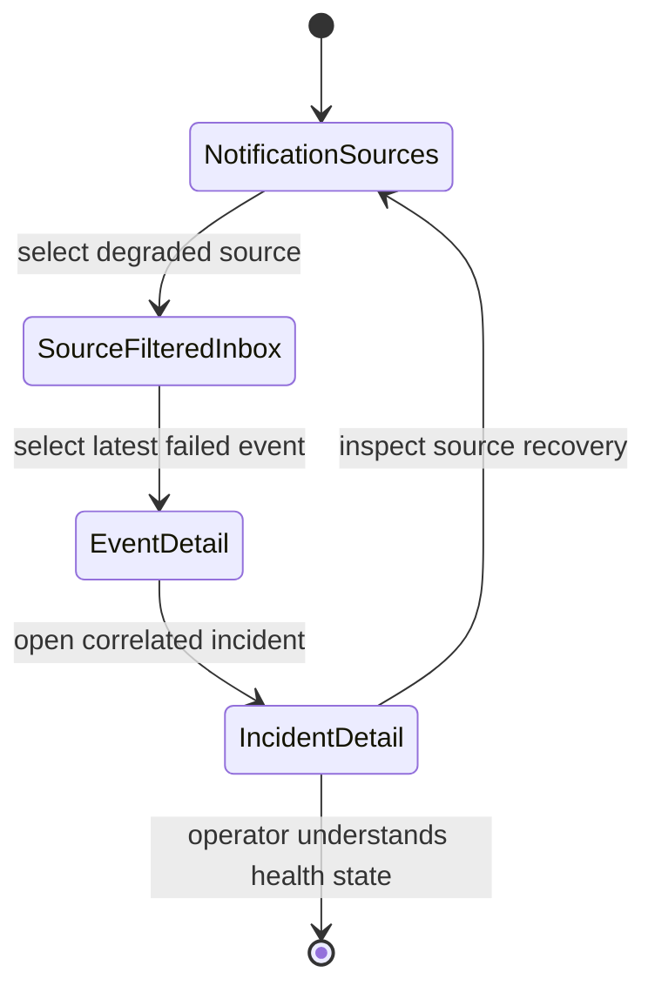
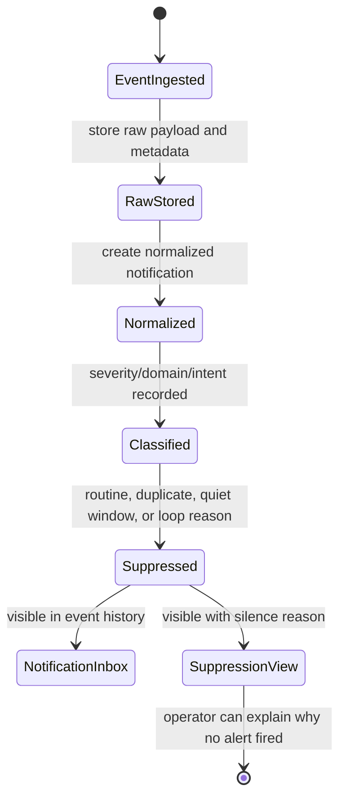
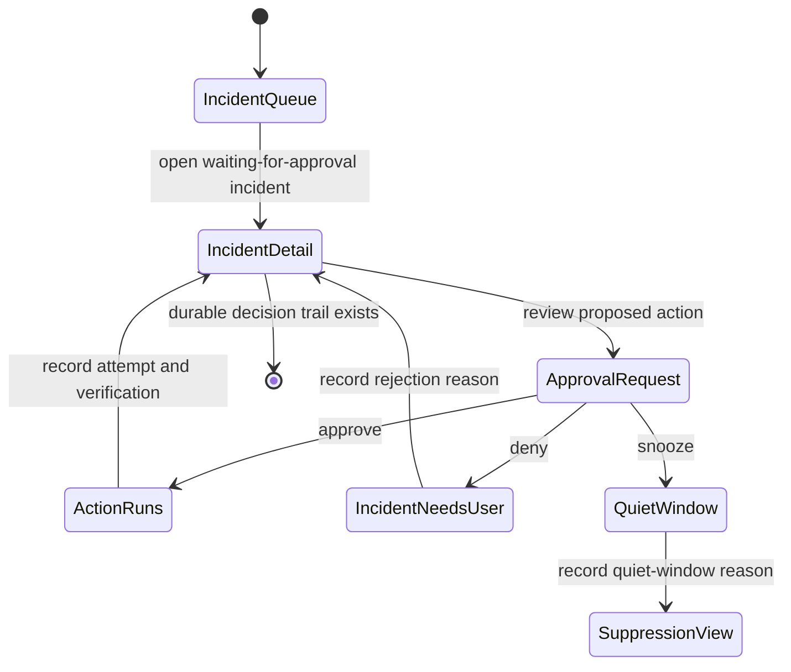
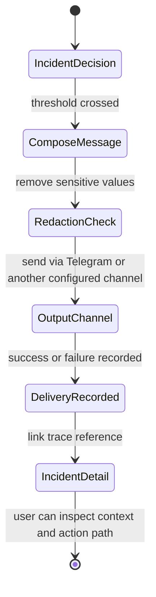
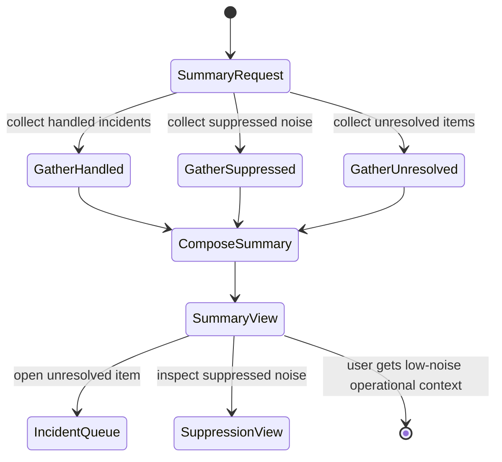

# Feature: 054 Notification Intelligence Handler Service

**Status:** Done (certified per state.json)

## Status

In Progress - analysis phase. This greenfield spec defines the source-neutral notification subscription, processing, handling, and smart reaction layer. It does not hardwire any source or output channel.

## Problem Statement

Smackerel already has several adjacent intelligence surfaces: source connectors, artifact processing, alert production, Telegram delivery, recommendation watches, suppression records, and agent traces. Those pieces prove the product can ingest, process, and surface knowledge. They do not yet provide a general notification intelligence service that can accept operational or personal notifications from many input shapes, normalize them into one model, correlate them into incidents, decide whether to stay silent or react, and record every decision.

Without a source-neutral handler, each new notification source risks becoming its own mini-system: one-off parsing, one-off severity logic, one-off deduplication, one-off output routing, and one-off action safety. That would violate Smackerel's source-qualified processing and one-graph principles. It would also make ntfy, Telegram, or any other channel look like the product model instead of what they are: adapters around a core notification intelligence capability.

The service must let Smackerel observe notifications first, process them quietly, act only when the risk and confidence model allows it, and ask the user only when an action is genuinely needed.

## Current Capability Map

| Capability | Existing Surface | Current Status | Gap for this Spec |
|------------|------------------|----------------|-------------------|
| Passive source connectors | `internal/connector/` plus docs in [docs/smackerel.md](../../docs/smackerel.md) | Present for several domains | No source-neutral notification source contract spanning stream, webhook, polling, queue, file drop, API pull, and manual ingest |
| Alert persistence and delivery | `alerts` table in `internal/db/migrations/001_initial_schema.sql`; delivery sweep in `internal/scheduler/jobs.go` | Present for existing intelligence alerts | Alerts are downstream user-facing messages, not a normalized notification event and incident model |
| Telegram delivery | `internal/telegram/` and scheduler delivery paths | Present | Telegram is currently a concrete output path; this spec requires output channels to remain separate from notification handling |
| Recommendation suppression and delivery attempts | `internal/db/migrations/022_recommendations.sql` | Present for recommendations | Similar audit/suppression concepts exist, but they are not generalized for notification reactions |
| Agent trace audit | `internal/db/migrations/020_agent_traces.sql` | Present | Action decisions need notification-specific traceability across diagnostics, autonomous actions, approvals, and loop prevention |
| NATS streams | `config/nats_contract.json` summarized in [docs/Development.md](../../docs/Development.md) | Present | A notification handler may consume or publish queue events, but source adapters must not bypass the normalized model |
| Source health | `sync_state` and connector-specific runtime state | Partial | Notification source instances need uniform connected/disconnected/degraded health with last event, last error, and retry count |
| ntfy integration | No `specs/055-*` folder exists at analysis time | Missing | Spec 055 must be a concrete source adapter for ntfy, dependent on this handler contract |

## Outcome Contract

**Intent:** Smackerel provides a general notification intelligence handler that can ingest notifications from many pluggable source instances, preserve source-specific context, normalize every event into a common model, correlate related events into incidents, and decide whether to record, diagnose, act, escalate, or request approval while staying quiet by default.

**Success Signal:** A self-hosted user can enable multiple notification source instances, including a future ntfy adapter and at least one non-ntfy source, then observe that repeated routine events are silently recorded, persistent severe events are correlated into one incident, safe diagnostics run without changing external state, low-risk allowlisted actions are recorded with results, high-blast-radius actions require explicit approval, and any user-facing output is concise, contextual, redacted, and routed through an output-channel abstraction rather than hardcoded Telegram behavior.

**Hard Constraints:**

- Notification sources are pluggable. ntfy is one future concrete adapter and MUST NOT be hardwired into the handler service.
- Supported source forms include stream, webhook, polling, message queue, file/drop directory, API pull, and manual ingest.
- Multiple source instances can run at the same time, including multiple instances of the same source type.
- Credentials and tokens are secret-managed only. No literal secret values, generated env edits, or runtime fallback credentials are permitted.
- Every event is stored as raw source input plus a normalized notification record before decisioning can claim success.
- Source-specific fields are preserved in source metadata and raw payload storage, but source-specific fields MUST NOT leak into core classification, incident, decision, or action logic.
- The normalized notification model always includes source type, source instance, source event ID, timestamp, title, body, severity, tags, subject/service, raw payload reference, and delivery metadata.
- Source health is uniform across adapters: connected, disconnected, or degraded, with last event time, last error, retry count, and source instance identity.
- Classification covers severity, domain, and intent. Classification decisions are durable and explainable.
- Deduplication and correlation are durable. Related notifications become incidents with explicit states rather than repeated standalone alerts.
- Durable records exist for raw events, normalized notifications, incidents, processing decisions, classifications, correlations, actions, suppressions, and escalations.
- Enrichment with system metadata occurs when available, but missing enrichment never fabricates confidence or source facts.
- Handling decisions are limited to no action, record only, diagnostics, autonomous handling, user escalation, or approval request.
- Routine events are silent by default. Escalation happens only when severity, persistence, uncertainty, or risk crosses configured thresholds.
- Diagnostics are read-only. Autonomous handling is allowed only for low-risk allowlisted actions. High-blast-radius actions require user approval. Destructive actions are never automatic.
- Every action attempt and result is recorded, including retries, refusal reasons, approval decisions, and external effects.
- Retry policy is bounded and auditable. The handler must prevent reaction loops where its own output re-enters as a new actionable notification.
- Output channels are separate from the core handler. Telegram is one possible output channel, not the notification model.
- User notifications are concise, contextual, actionable, redacted, and source-qualified.

**Failure Condition:** The feature fails if the core handler contains ntfy-specific branches, treats Telegram as the model, drops source-specific context, emits routine noise, performs destructive or high-blast-radius actions without approval, cannot explain why a notification was suppressed/escalated/actioned, stores only derived output without durable raw input, or allows a source adapter to bypass normalization, incident correlation, safety policy, and audit recording.

## Product Principle Alignment

| Principle | Alignment |
|-----------|-----------|
| Observe First, Ask Second | The handler records, classifies, correlates, and diagnoses before asking the user. Approval prompts appear only when risk or uncertainty requires user judgment. |
| Source-Qualified Processing | Every notification keeps source type, source instance, source event ID, delivery metadata, and source-specific fields. Source metadata improves classification without becoming hardcoded core logic. |
| One Graph, Many Views | Notifications, incidents, decisions, actions, and suppressions become durable graph-compatible artifacts and projections, not a parallel alert silo. |
| Invisible By Default, Felt Not Heard | Routine and duplicate events stay silent. The user is interrupted only when severity, persistence, uncertainty, or risk clears the escalation threshold. |
| Trust Through Transparency | Every classification, correlation, suppression, action, retry, escalation, and approval is recorded with source references and rationale. User-facing messages cite what happened and why. |

## Competitive Analysis

No external competitor web research was performed in this run. The analysis below is grounded in the Smackerel product direction, existing repository capabilities, and common market expectations for notification aggregation, incident intelligence, and safe automation.

| Capability | Smackerel Target | Common Notification Tools | Gap / Edge |
|------------|------------------|---------------------------|------------|
| Source-neutral intake | One handler contract across stream, webhook, polling, queue, file/drop, API pull, and manual ingest | Often channel-specific or integration-specific | Smackerel can keep source adapters thin and preserve provenance consistently. |
| Quiet intelligence | Routine events are recorded silently; escalation requires threshold evidence | Many tools optimize delivery volume and routing | Smackerel differentiates by reducing interruptions rather than forwarding everything. |
| Incident correlation | Related notifications become one incident with rationale and state | Basic dedupe is common; causal correlation varies | Smackerel can turn notification noise into an inspectable narrative. |
| Safe reaction policy | Read-only diagnostics, low-risk allowlisted actions, approval for high-blast-radius actions, no destructive automation | Automation platforms can blur safe and risky actions | Smackerel's safety boundary is a trust differentiator. |
| Source-qualified audit | Raw event, normalized model, source-specific metadata, decisions, actions, and outputs are durable | Some tools keep delivery logs but not decision provenance | Smackerel can explain why it stayed quiet, escalated, or acted. |

## Platform Direction & Market Trends

### Industry Trends

| Trend | Status | Relevance | Impact on Product |
|-------|--------|-----------|-------------------|
| Notification overload reduction | Established | High | The handler should optimize for fewer, better interruptions rather than maximal delivery. |
| Event-to-incident correlation | Growing | High | Correlated incidents become the core user-facing unit, not standalone messages. |
| Human-approved automation | Growing | High | Approval requests and risk classes are required for trust. |
| Source provenance and auditability | Established | High | Source-specific metadata preservation is mandatory for transparent decisions. |
| Local self-hosted control | Growing | Medium | Secret-managed credentials and local durable records support Smackerel's self-hosted positioning. |

### Strategic Opportunities

| Opportunity | Type | Priority | Rationale |
|-------------|------|----------|-----------|
| Source-neutral notification contract | Table Stakes | High | Required before ntfy or any other source adapter can scale without duplicated logic. |
| Quiet incident intelligence | Differentiator | High | Converts noisy alerts into useful, sparse, explainable interruptions. |
| Safe diagnostic/action loop | Differentiator | High | Lets Smackerel help without undermining user trust. |
| Source health dashboard | Table Stakes | Medium | Operators need to know whether sources are connected, degraded, or disconnected. |
| Output-channel separation | Table Stakes | Medium | Prevents Telegram from becoming the product model and allows web/API/digest delivery later. |

## Improvement Proposals

### IP-054-001: Source-Neutral Adapter Conformance Contract

- **Impact:** High
- **Effort:** Medium
- **Competitive Advantage:** New sources can be added without duplicating dedupe, correlation, safety, and audit behavior.
- **Actors Affected:** Operator, Source Adapter, Notification Handler
- **Business Scenarios:** BS-054-001, BS-054-002, BS-054-005, BS-054-018

### IP-054-002: Quiet Incident Narrative

- **Impact:** High
- **Effort:** Medium
- **Competitive Advantage:** Reduces user interruption while preserving full inspectability and escalation rationale.
- **Actors Affected:** Smackerel User, Notification Handler, Output Channel
- **Business Scenarios:** BS-054-003, BS-054-004, BS-054-013, BS-054-016

### IP-054-003: Safety-Gated Smart Reaction Layer

- **Impact:** High
- **Effort:** Large
- **Competitive Advantage:** Enables helpful automation while keeping diagnostics read-only, low-risk actions allowlisted, and high-blast-radius actions approval-gated.
- **Actors Affected:** Smackerel User, Diagnostics Runner, Action Executor
- **Business Scenarios:** BS-054-007, BS-054-008, BS-054-009, BS-054-010, BS-054-011, BS-054-012

## Goals

- G1: Define a source-neutral notification handler that accepts pluggable adapters across stream, webhook, polling, message queue, file/drop directory, API pull, and manual ingest forms.
- G2: Normalize notifications into one core model while preserving raw payloads and source-specific fields outside core logic.
- G3: Support simultaneous source instances, including multiple instances of the same type with separate health, credentials, cursors, and source identity.
- G4: Maintain uniform source health with connected, disconnected, and degraded states plus last event time, last error, and retry count.
- G5: Classify each notification by severity, domain, and intent with auditable reasoning.
- G6: Deduplicate repeated events and correlate related notifications into incidents with explicit lifecycle states.
- G7: Persist raw events, normalized notifications, incidents, classifications, processing decisions, correlations, actions, suppressions, escalations, and approval decisions.
- G8: Enrich notifications with system metadata when available, including known services, host metadata, related artifacts, prior incidents, and maintenance windows.
- G9: Decide among no action, record only, diagnostics, autonomous handling, user escalation, and approval request using thresholds for severity, persistence, uncertainty, and risk.
- G10: Keep routine events quiet while producing concise, contextual, actionable, redacted user notifications when escalation is warranted.
- G11: Run read-only diagnostics safely and permit only low-risk allowlisted autonomous actions.
- G12: Require explicit approval for high-blast-radius actions and prohibit destructive automatic actions.
- G13: Prevent reaction loops across source adapters and output channels.
- G14: Keep output channels separate so Telegram, web, digest, API, or other channels can deliver the same decision without changing core handling.
- G15: Establish the contract that future spec 055 ntfy source adapter must implement.

## Scope Boundaries

### Owned by Spec 054

- Source-neutral notification source contract and source instance identity.
- Common normalized notification model and raw payload preservation requirements.
- Source health model across all source instances.
- Classification, deduplication, correlation, incident lifecycle, and decision policy.
- Durable audit model for raw events, notifications, incidents, decisions, classifications, correlations, actions, suppressions, escalations, retries, and approvals.
- Safety policy for diagnostics, autonomous handling, approval requests, and destructive-action prohibition.
- Output-channel boundary and user-facing notification content rules.
- Relationship contract for source adapters, including spec 055 ntfy.

### Owned by Future Spec 055 ntfy Source Adapter

- ntfy-specific connection configuration, subscription semantics, auth material references, topic mapping, message parsing, delivery metadata extraction, retry behavior, and health probes.
- Translation from ntfy events into the spec 054 source adapter contract.
- ntfy-specific tests proving ntfy does not bypass normalization, health, audit, decisioning, or loop prevention.
- Any ntfy-specific operator documentation.

### Not Part of Spec 054

- Implementing the ntfy adapter itself.
- Making Telegram the only notification output channel.
- Building a full incident-management product with team paging, rotations, or service-level objective ownership.
- Executing destructive remediation automatically.
- Replacing existing digest, recommendation, or alert features; this handler provides a generalized event intelligence layer they may integrate with.

## Actors & Personas

| Actor | Description | Key Goals | Permissions |
|-------|-------------|-----------|-------------|
| Smackerel User | The self-hosted owner receiving only meaningful notification intelligence | Stay informed without noise; approve risky work; inspect why the system acted | Full read access to their notification history, incidents, and decisions; approval authority for high-risk actions |
| Operator | The person configuring source instances and output channels | Add sources, manage credentials, inspect health, tune thresholds | Configure source instances through SST/secret-managed paths; read health and audit records |
| Source Adapter | A pluggable adapter for ntfy, webhook, stream, queue, poller, file drop, API pull, or manual ingest | Deliver source events into the handler without owning core policy | May read its configured source and submit raw events; may not bypass normalization or decisioning |
| Notification Intelligence Handler | Core system actor | Normalize, classify, dedupe, correlate, decide, and record outcomes | Reads durable event history and allowed system metadata; writes notifications, incidents, decisions, and actions |
| Diagnostics Runner | System actor for read-only checks | Gather supporting facts without changing external state | Executes read-only diagnostics from an allowlist and records results |
| Action Executor | System actor for approved or low-risk allowlisted actions | Carry out safe reactions and record exact effects | Executes only allowlisted low-risk autonomous actions or user-approved high-risk actions |
| Output Channel | Telegram, web, digest, API, or another delivery surface | Deliver concise, redacted, actionable messages | Sends user-facing messages from handler decisions; cannot reclassify or mutate incidents |
| Future ntfy Adapter | Concrete source adapter defined by spec 055 | Subscribe to ntfy topics and submit events to the handler contract | Owns ntfy transport only; no core decision authority |

## Source Forms

| Source Form | Business Meaning | Handler Expectation |
|-------------|------------------|---------------------|
| Stream | Long-lived event feed | Source instance submits ordered events with cursor or offset metadata when available |
| Webhook | External system POSTs events | Source adapter authenticates the request, preserves headers/body metadata, and submits raw event envelope |
| Polling | Adapter checks source on an interval | Source instance tracks cursor, last event time, retry count, and degraded state on repeated failure |
| Message queue | Events arrive through a broker | Source instance preserves queue metadata, delivery attempt, message ID, and ack/nack outcome |
| File/drop directory | Files appear in a watched directory | Source instance preserves path, file metadata, checksum, and observed timestamp |
| API pull | User or scheduler requests a bounded pull | Source instance records request window, cursor, API identity, and returned event IDs |
| Manual ingest | User or operator submits an event | Handler records actor identity, submitted timestamp, and source instance `manual` metadata |

## Normalized Notification Model

Every normalized notification MUST expose these core fields to handler logic:

| Field | Required Behavior |
|-------|-------------------|
| `notificationId` | Handler-generated durable ID |
| `sourceType` | Stable adapter type such as `ntfy`, `webhook`, `queue`, `file_drop`, or `manual` |
| `sourceInstanceId` | Specific configured instance, unique across simultaneous sources |
| `sourceEventId` | Source-provided event/message ID when available; handler-generated deterministic identity when absent |
| `observedAt` | Time Smackerel observed the event |
| `eventTimestamp` | Source event timestamp when available |
| `title` | Short source title or derived title with derivation recorded |
| `body` | Main notification body after safe normalization and size bounds |
| `severity` | Source severity or classified severity with source/classifier provenance |
| `tags` | Source tags plus handler tags, separated by provenance |
| `subject` | Subject, service, host, component, topic, or affected entity |
| `rawPayloadRef` | Durable reference to raw payload bytes or text |
| `deliveryMetadata` | Source delivery metadata such as topic, headers, queue subject, file path, retry count, or manual actor |
| `sourceSpecificFields` | Preserved adapter fields for audit/enrichment; never used directly by core branching without mapping |
| `redactionState` | Whether sensitive values were detected, redacted, or withheld from user-facing output |

## Incident Model

| Incident State | Meaning |
|----------------|---------|
| `observing` | Related events exist but thresholds do not justify escalation or action |
| `active` | Correlated events indicate an ongoing condition needing tracking |
| `diagnosing` | Read-only diagnostics are running or queued |
| `mitigating` | Low-risk allowlisted or approved action is in progress |
| `approval_requested` | User approval is required before an action can proceed |
| `escalated` | User-facing escalation was sent and awaits acknowledgement or external handling |
| `suppressed` | Incident is intentionally hidden due to dedupe, routine policy, maintenance window, user suppression, or cooldown |
| `resolved` | Condition cleared, with resolution evidence recorded |

## Handling Decision Model

| Decision | Business Rule |
|----------|---------------|
| `no_action` | Event is irrelevant, duplicate, stale, or blocked by policy; record decision and stop |
| `record_only` | Event is useful history but not actionable; store and keep silent |
| `diagnostics` | Run read-only checks to reduce uncertainty before deciding |
| `autonomous_handling` | Execute only allowlisted low-risk actions with bounded blast radius |
| `user_escalation` | Notify the user because severity, persistence, uncertainty, or risk crossed thresholds |
| `approval_request` | Ask the user to approve or reject a high-blast-radius but non-destructive action |

## Use Cases

### UC-001: Register a Source Instance

- **Actor:** Operator
- **Preconditions:** Source adapter type is installed and credentials are available through secret management.
- **Main Flow:**
  1. Operator enables a source instance with a stable instance name and source form.
  2. Handler records the instance identity and expected health contract.
  3. Source adapter validates credentials without exposing secret values.
  4. Source health becomes connected when the adapter can observe or retrieve events.
- **Alternative Flows:**
  - Credentials are missing or invalid: source health becomes disconnected with a redacted last error.
  - Adapter connects but event retrieval is impaired: health becomes degraded with retry count.
- **Postconditions:** The source instance can submit events without being hardwired into handler logic.

### UC-002: Ingest and Normalize a Notification

- **Actor:** Source Adapter, Notification Intelligence Handler
- **Preconditions:** A source instance is enabled and produces an event.
- **Main Flow:**
  1. Source adapter submits raw payload, delivery metadata, source type, source instance, and source event ID.
  2. Handler stores the raw event durably.
  3. Handler maps the event into the normalized notification model.
  4. Handler preserves source-specific fields separately from core fields.
  5. Handler records the processing decision for normalization.
- **Alternative Flows:**
  - Event lacks a source event ID: handler creates a deterministic identity from source instance, timestamp window, body hash, and delivery metadata.
  - Event cannot be normalized: raw event is stored, classification is marked failed, and source health may degrade.
- **Postconditions:** A normalized notification exists or a failed-normalization record explains why not.

### UC-003: Track Source Health

- **Actor:** Source Adapter, Operator
- **Preconditions:** At least one source instance is configured.
- **Main Flow:**
  1. Handler receives heartbeat, event, or poll outcome from the source adapter.
  2. Handler updates health state, last event time, last error, and retry count.
  3. Operator views source health across all instances.
- **Alternative Flows:**
  - Repeated transient failures move health to degraded.
  - Authentication or connectivity failure moves health to disconnected.
  - New event after recovery moves health to connected and records recovery time.
- **Postconditions:** Health status is source-instance-specific and inspectable.

### UC-004: Classify Notification Severity, Domain, and Intent

- **Actor:** Notification Intelligence Handler
- **Preconditions:** A normalized notification exists.
- **Main Flow:**
  1. Handler evaluates source severity, body/title, tags, subject/service, prior incidents, and system metadata.
  2. Handler assigns severity, domain, and intent classifications.
  3. Handler records confidence, rationale, and source metadata used.
- **Alternative Flows:**
  - Confidence is low: handler chooses diagnostics or record-only until more evidence arrives.
  - Source severity conflicts with classifier severity: both values are preserved and the final decision cites reconciliation.
- **Postconditions:** Classification is durable and available for correlation and audit.

### UC-005: Deduplicate Repeated Notifications

- **Actor:** Notification Intelligence Handler
- **Preconditions:** Multiple notifications share source IDs, content hashes, subjects, or time-window signatures.
- **Main Flow:**
  1. Handler compares new notification against recent raw events and normalized notifications.
  2. Exact duplicates are linked to the original event.
  3. Near-duplicates increment counters or update an incident rather than creating repeated user output.
  4. Suppression decision is recorded.
- **Alternative Flows:**
  - Similar events differ in severity or subject: handler correlates them rather than suppressing them.
- **Postconditions:** The user is not flooded by repeated source events, and audit history still shows every raw event.

### UC-006: Correlate Notifications into an Incident

- **Actor:** Notification Intelligence Handler
- **Preconditions:** One or more notifications share subject/service, tags, source metadata, diagnostics results, or timing.
- **Main Flow:**
  1. Handler evaluates correlation signals.
  2. Handler creates or updates an incident.
  3. Handler records which notifications joined the incident and why.
  4. Incident state changes according to severity, persistence, and handling status.
- **Alternative Flows:**
  - Notification matches a maintenance window or user suppression: incident state becomes suppressed.
  - A recovery notification arrives: incident transitions toward resolved with evidence.
- **Postconditions:** Related notifications produce one durable incident narrative.

### UC-007: Run Read-Only Diagnostics

- **Actor:** Diagnostics Runner
- **Preconditions:** Handler decision is diagnostics and the diagnostic is allowlisted as read-only.
- **Main Flow:**
  1. Handler selects diagnostics based on domain and subject/service.
  2. Diagnostics Runner executes read-only checks.
  3. Handler records diagnostic inputs, outputs, timing, and errors.
  4. Handler updates classification, incident state, and next decision.
- **Alternative Flows:**
  - Diagnostic fails: handler records failure and may escalate if uncertainty remains high.
  - Diagnostic confirms routine condition: handler records only and stays silent.
- **Postconditions:** Diagnostic evidence is attached to the notification or incident without changing external state.

### UC-008: Perform Low-Risk Autonomous Handling

- **Actor:** Action Executor
- **Preconditions:** Incident requires action, action is allowlisted, low-risk, non-destructive, and below blast-radius thresholds.
- **Main Flow:**
  1. Handler selects an allowlisted action and verifies loop-prevention constraints.
  2. Action Executor performs the action.
  3. Handler records action attempt, result, external target, retry state, and post-action observation.
  4. Handler updates incident state.
- **Alternative Flows:**
  - Action fails transiently: bounded retry policy applies.
  - Action would exceed risk threshold: handler creates approval request instead.
- **Postconditions:** The action result is durable and explainable.

### UC-009: Request Approval for High-Blast-Radius Action

- **Actor:** Notification Intelligence Handler, Smackerel User, Output Channel
- **Preconditions:** Handler identifies a useful non-destructive action that exceeds autonomous risk thresholds.
- **Main Flow:**
  1. Handler creates approval request with incident context, proposed action, expected effect, risk, and alternatives.
  2. Output channel sends concise redacted approval prompt.
  3. User approves or rejects.
  4. Handler records the decision and either executes approved action or records rejection.
- **Alternative Flows:**
  - User does not respond before expiry: no action occurs and incident remains escalated or observing.
- **Postconditions:** High-blast-radius action never happens without approval.

### UC-010: Escalate to User

- **Actor:** Notification Intelligence Handler, Output Channel, Smackerel User
- **Preconditions:** Severity, persistence, uncertainty, or risk crosses user notification thresholds.
- **Main Flow:**
  1. Handler composes a concise, contextual, actionable, redacted message.
  2. Handler selects configured output channel without embedding channel-specific logic into core decisioning.
  3. Output channel delivers message and records delivery result.
  4. Handler links escalation to incident and source notifications.
- **Alternative Flows:**
  - Output channel fails: delivery attempt is recorded and retry policy applies.
  - Multiple incidents cross thresholds together: handler batches or prioritizes according to rate limits.
- **Postconditions:** User receives only actionable notification intelligence with traceable context.

### UC-011: Prevent Reaction Loops

- **Actor:** Notification Intelligence Handler, Source Adapter, Output Channel
- **Preconditions:** A handler output could appear back in a watched source.
- **Main Flow:**
  1. Handler stamps outgoing actions and user messages with loop-prevention metadata when the channel supports it.
  2. Source adapter preserves metadata or detectable signatures on re-ingest.
  3. Handler identifies self-originated or previously actioned events.
  4. Handler records loop suppression and avoids further action.
- **Alternative Flows:**
  - Source cannot preserve metadata: handler uses content hash, source instance, time window, and delivery metadata to detect likely loops.
- **Postconditions:** Handler output does not recursively trigger more handler output.

### UC-012: Manual Ingest for a Notification

- **Actor:** Smackerel User, Operator
- **Preconditions:** User or operator has a notification payload that did not arrive through an automated source.
- **Main Flow:**
  1. Actor submits title, body, timestamp, severity if known, source label, and optional raw payload.
  2. Handler records manual source metadata and actor identity.
  3. Handler normalizes, classifies, correlates, and decides like any other source.
- **Alternative Flows:**
  - Required manual metadata is missing: handler rejects the ingest with explicit field errors.
- **Postconditions:** Manual events participate in the same durable notification and incident model.

## Business Scenarios

### BS-054-001: ntfy Is Just One Source

Given the user has an ntfy source instance and a webhook source instance enabled
When both sources send notifications about the same service outage
Then the handler normalizes both events into the same model
And the incident correlation cites both source instances
And no handler decision depends on an ntfy-specific branch.

### BS-054-002: Multiple Instances of Same Source Type

Given the operator configures two webhook source instances for different services
When both instances emit events with the same source event ID value
Then the handler treats the events as distinct because source instance identity is part of event identity
And source health is tracked separately for each instance.

### BS-054-003: Routine Event Stays Silent

Given a low-severity notification reports a routine backup completion
When the handler classifies it as routine and no persistence threshold is crossed
Then the notification is recorded only
And no user-facing output is sent.

### BS-054-004: Persistent Warning Becomes Incident

Given the same warning arrives repeatedly across a configured time window
When deduplication sees persistence above the threshold
Then the handler correlates the events into one active incident
And escalation considers incident persistence rather than individual event count.

### BS-054-005: Source-Specific Fields Are Preserved But Not Hardcoded

Given an ntfy event includes topic, priority, click URL, and attachment metadata
When the handler normalizes the event
Then those fields are preserved in source-specific metadata
And core decisioning uses normalized severity, tags, subject, and delivery metadata rather than ntfy-only field names.

### BS-054-006: Degraded Source Health Is Visible

Given a polling source fails three consecutive retrieval attempts
When the source adapter reports failures
Then the source health is degraded with last error and retry count
And the handler does not fabricate connected health from stale events.

### BS-054-007: Read-Only Diagnostics Reduce Uncertainty

Given a high-severity service notification arrives without enough context
When a read-only diagnostic is allowlisted for that service
Then the handler runs diagnostics
And records diagnostic results before choosing escalation, approval, or record-only handling.

### BS-054-008: Low-Risk Allowlisted Action Runs Automatically

Given an incident matches a low-risk allowlisted action
And the action is non-destructive and below blast-radius limits
When the handler chooses autonomous handling
Then the action executes
And the action attempt, result, and incident state change are recorded.

### BS-054-009: High-Blast-Radius Action Requires Approval

Given an incident suggests restarting a shared service or changing routing
When the handler evaluates blast radius above the autonomous threshold
Then it sends an approval request instead of acting
And no action occurs unless the user approves.

### BS-054-010: Destructive Action Is Refused

Given an incident suggests deleting data, dropping a volume, purging a queue, or wiping a directory
When the handler evaluates the action
Then autonomous handling is refused
And the refusal reason is recorded even if severity is high.

### BS-054-011: Action Retry Is Bounded

Given an approved or allowlisted action fails due to a transient external error
When retry policy applies
Then the handler retries only within configured bounds
And records each attempt, final outcome, and retry exhaustion if it cannot succeed.

### BS-054-012: Reaction Loop Is Controlled

Given the handler sends a user escalation through an output channel
And that output is ingested back through a watched notification source
When the handler detects self-originated content or loop metadata
Then the re-ingested event is suppressed as a reaction loop
And no new escalation or action is triggered.

### BS-054-013: User Notification Is Redacted and Actionable

Given an escalation contains a raw payload with a token, URL secret, or personally sensitive value
When the output channel sends the user message
Then the message redacts sensitive values
And includes what happened, why it matters, what Smackerel already did, and what the user can do next.

### BS-054-014: Output Channel Failure Does Not Lose Decision History

Given Telegram delivery fails for an escalation
When the output channel returns a send error
Then the escalation decision remains durable
And the failed delivery attempt is recorded for retry or alternate channel routing.

### BS-054-015: Manual Ingest Participates in Correlation

Given the user manually ingests a notification about the same subject as automated source events
When the handler processes the manual event
Then it can join the existing incident
And the incident narrative records the manual actor and payload provenance.

### BS-054-016: Maintenance Window Controls Noise

Given the operator has marked a service as under maintenance
When related warning notifications arrive during the window
Then the handler records and correlates them
And suppresses user escalation unless severity or risk exceeds maintenance suppression rules.

### BS-054-017: Unknown Source Payload Fails Loudly

Given a source adapter submits a payload missing required source type, source instance, and raw payload reference
When the handler validates the ingest envelope
Then the event is rejected with explicit missing-field errors
And no partial normalized notification is created.

### BS-054-018: Source Adapter Cannot Bypass Decisioning

Given an adapter wants to directly send a user notification
When it submits an event to the handler
Then the adapter can provide source metadata only
And the handler remains the sole owner of classification, correlation, escalation, approval, and action decisions.

## Requirements

### Source Adapter Boundary

- **FR-054-001:** The handler MUST define a source adapter contract that all notification sources use, independent of source form or source vendor.
- **FR-054-002:** The handler MUST accept source events from stream, webhook, polling, message queue, file/drop directory, API pull, and manual ingest forms.
- **FR-054-003:** The handler MUST support multiple simultaneous source instances, including multiple instances of the same source type.
- **FR-054-004:** The handler MUST treat `sourceType` and `sourceInstanceId` together as the source identity boundary.
- **FR-054-005:** The handler MUST reject source submissions missing required source identity, source form, raw payload reference, or delivery metadata.
- **FR-054-006:** Source adapters MUST NOT directly create incidents, user escalations, autonomous actions, or approval requests.
- **FR-054-007:** Future spec 055 ntfy source adapter MUST implement this source adapter contract and MUST NOT add ntfy-specific branches to the handler.

### Credentials and Source Health

- **FR-054-008:** Source credentials MUST be referenced through secret-managed configuration only; secret values MUST NOT be stored in the spec, committed config, logs, source health records, or user-facing messages.
- **FR-054-009:** Missing or invalid source credentials MUST fail loudly for that source instance and mark health disconnected without using fallback credentials.
- **FR-054-010:** Every source instance MUST expose connected, disconnected, or degraded health.
- **FR-054-011:** Source health MUST record last event time, last successful check time when applicable, last error, retry count, and current state.
- **FR-054-012:** Health errors MUST identify the source instance and error category without leaking credential values or raw sensitive payload.

### Normalization and Preservation

- **FR-054-013:** Every accepted raw event MUST be stored durably before normalization-dependent decisioning proceeds.
- **FR-054-014:** Every normalized notification MUST include source type, source instance, source event ID, timestamp, title, body, severity, tags, subject/service, raw payload reference, and delivery metadata.
- **FR-054-015:** Source-specific fields MUST be preserved with provenance and raw payload references.
- **FR-054-016:** Core handler logic MUST use normalized fields and explicit source mappings, not source-specific field names.
- **FR-054-017:** Redaction state MUST be tracked for normalized notifications and user-facing outputs.
- **FR-054-018:** Invalid payloads MUST produce durable rejection records with explicit validation errors.

### Classification and Enrichment

- **FR-054-019:** The handler MUST classify notifications by severity, domain, and intent.
- **FR-054-020:** Classification MUST record confidence, rationale, source signals used, and whether source-provided severity was accepted, downgraded, or upgraded.
- **FR-054-021:** The handler MUST enrich notifications with system metadata when available, including known services, hosts, related artifacts, prior incidents, maintenance windows, and user suppressions.
- **FR-054-022:** Missing enrichment MUST NOT be represented as certainty. Decisions that rely on missing context MUST record uncertainty.
- **FR-054-023:** Classification and enrichment outputs MUST be durable and queryable by incident and notification.

### Deduplication, Correlation, and Incidents

- **FR-054-024:** The handler MUST deduplicate exact duplicate notifications using source identity, source event ID, payload hash, and delivery metadata.
- **FR-054-025:** The handler MUST identify near-duplicates using subject/service, normalized title/body, tags, time windows, and source correlation hints.
- **FR-054-026:** Duplicate and near-duplicate decisions MUST be recorded as suppressions or correlations rather than deleting raw event history.
- **FR-054-027:** The handler MUST correlate related notifications into incidents.
- **FR-054-028:** Incidents MUST support observing, active, diagnosing, mitigating, approval_requested, escalated, suppressed, and resolved states.
- **FR-054-029:** Incident state transitions MUST record triggering notification IDs, decision rationale, actor/system origin, and timestamp.
- **FR-054-030:** Recovery or clear notifications MUST resolve or de-escalate incidents only when resolution evidence is recorded.

### Decisioning and Silence Policy

- **FR-054-031:** The handler MUST choose exactly one primary handling decision for each normalized notification or incident evaluation: no action, record only, diagnostics, autonomous handling, user escalation, or approval request.
- **FR-054-032:** Routine, duplicate, low-severity, maintenance-window, or suppressed events MUST be silent by default.
- **FR-054-033:** Escalation MUST require threshold evidence based on severity, persistence, uncertainty, risk, or user policy.
- **FR-054-034:** Decision records MUST include threshold inputs, final decision, and reason codes.
- **FR-054-035:** The handler MUST batch or prioritize simultaneous escalations so the user does not receive avoidable notification bursts.
- **FR-054-036:** Suppression state MUST be durable and explain whether the cause is dedupe, maintenance, cooldown, user preference, reaction loop, or policy.

### Diagnostics and Action Safety

- **FR-054-037:** Diagnostics MUST be read-only and allowlisted by domain/subject/service.
- **FR-054-038:** Diagnostics MUST record inputs, outputs, errors, timing, and linked incident/notification IDs.
- **FR-054-039:** Autonomous actions MUST be non-destructive, low-risk, allowlisted, and below configured blast-radius thresholds.
- **FR-054-040:** High-blast-radius actions MUST create approval requests and MUST NOT run until explicitly approved.
- **FR-054-041:** Destructive actions MUST never run automatically, even with high severity.
- **FR-054-042:** Every action attempt MUST record requested action, actor/system origin, approval reference if applicable, execution target, result, error, retry count, and post-action observation.
- **FR-054-043:** Retry policy MUST be bounded and must record retry exhaustion without converting failure into success.
- **FR-054-044:** The handler MUST prevent reaction loops using source metadata, output metadata, content hashes, source instance identity, and time-window detection.

### Output Channel Boundary

- **FR-054-045:** Output channels MUST receive delivery requests from handler decisions; they MUST NOT own classification, correlation, suppression, approval, or action policy.
- **FR-054-046:** Telegram MUST be treated as one possible output channel and MUST NOT be required for the notification model.
- **FR-054-047:** User-facing notifications MUST be concise, contextual, actionable, redacted, and source-qualified.
- **FR-054-048:** Delivery attempts and failures MUST be durable, including channel, destination reference, outcome, error category, and attempted timestamp.
- **FR-054-049:** Output channel failure MUST NOT erase the underlying escalation, approval, or action decision.

### Audit and Durability

- **FR-054-050:** Durable storage MUST cover raw events, normalized notifications, incidents, processing decisions, classifications, correlations, actions, suppressions, escalations, approval requests, approval decisions, and delivery attempts.
- **FR-054-051:** Every durable record MUST link back to source instance and source event identity when applicable.
- **FR-054-052:** The user or operator MUST be able to answer: what happened, where it came from, why Smackerel classified it that way, why Smackerel stayed silent or escalated, what action was attempted, and what happened next.
- **FR-054-053:** Audit views MUST redact secret values and sensitive payload fragments by default.
- **FR-054-054:** Handler decisions MUST be replayable from durable raw events and recorded source metadata for verification.

## Non-Functional Requirements

- **NFR-054-001 Source-neutral extensibility:** Adding a new source adapter MUST require implementing the source adapter contract, not editing core decision branches for that source.
- **NFR-054-002 Reliability:** Accepted raw events and decision records MUST survive process restart and source reconnect.
- **NFR-054-003 Idempotency:** Replayed source events MUST not create duplicate user escalations, duplicate incidents, or duplicate actions.
- **NFR-054-004 Privacy:** Raw payloads and user-facing outputs MUST preserve redaction state and avoid exposing secrets, credentials, tokens, or sensitive source-specific fields.
- **NFR-054-005 Security:** Source credentials MUST be secret-managed and fail-loud on missing/invalid values. No fallback credentials are permitted.
- **NFR-054-006 Observability:** Handler metrics and logs MUST distinguish source health, ingest volume, normalization failures, classification confidence, dedupe rate, incident creation rate, action attempts, action failures, delivery failures, and loop suppressions.
- **NFR-054-007 Explainability:** Every escalation, suppression, approval request, and autonomous action MUST include inspectable rationale.
- **NFR-054-008 Performance:** Routine ingest MUST not block on user-output delivery. Diagnostics and actions must use bounded execution windows and record timeout outcomes.
- **NFR-054-009 Scalability:** The handler MUST support high-volume noisy sources through dedupe, batching, source-level backpressure, and silent record-only decisions.
- **NFR-054-010 Accessibility:** User-facing output must be readable in compact text channels and must not depend on color, emoji, or image-only cues.
- **NFR-054-011 Local-first operation:** Core notification history, incidents, and decisions remain in Smackerel-owned storage. Source adapters may talk to external sources only as configured by the operator.
- **NFR-054-012 Safety:** The system must prefer no action or approval request over unsafe autonomous handling when risk classification is uncertain.

## UI Scenario Matrix

| Scenario | Actor | Entry Point | Steps | Expected Outcome | Screen(s) or Channel(s) |
|----------|-------|-------------|-------|------------------|--------------------------|
| Inspect source health | Operator | Source health view or API | Open notification sources, filter by instance, inspect last event and error | Each source instance shows connected/disconnected/degraded, last event, last error, retry count | Web, API |
| Review incident narrative | Smackerel User | Incident detail | Open incident, view correlated notifications, decisions, diagnostics, actions, escalations | User can trace why the incident exists and what Smackerel did | Web, API |
| Approve high-risk action | Smackerel User | Output channel approval prompt | Read concise prompt, inspect context, approve or reject | No action runs before approval; decision is recorded | Telegram, web, API |
| Audit suppressed routine events | Operator | Suppression/audit view | Filter suppressed events by reason and source | Routine/dedupe/maintenance/loop suppressions are visible without user noise | Web, API |
| Manual ingest | Smackerel User | Manual ingest form or API | Submit title, body, source label, timestamp, severity if known | Event enters same normalization, classification, correlation, and decision pipeline | Web, API |
| Delivery failure recovery | Operator | Delivery attempts view | Inspect failed output delivery and retry state | Underlying escalation remains durable and retry/alternate routing is visible | Web, API |

## UI Wireframes

### User-Facing UX Requirements

| UX Requirement | Applies To | Required Behavior |
|----------------|------------|-------------------|
| UX-054-001 Source health transparency | Notification sources | Operator-facing source health MUST show connected, degraded, and disconnected states with source instance identity, source form, last event time, last successful check time when present, retry count, and redacted last error. |
| UX-054-002 Event inspectability | Notification inbox and event detail | Every accepted event MUST be inspectable as both raw source input and normalized notification output, with source metadata, severity, domain, intent, classification confidence, and redaction state visible. |
| UX-054-003 Incident queue clarity | Incident queue | The queue MUST present operator-facing status labels `open`, `investigating`, `auto-handled`, `waiting-for-approval`, `needs-user`, `resolved`, and `suppressed`, mapped from the durable incident model without changing core incident semantics. |
| UX-054-004 Incident explanation | Incident detail | Incident detail MUST answer what happened, what correlated, what enrichment was used or missing, which diagnostics ran, which actions were attempted, and why Smackerel notified, stayed silent, or requested approval. |
| UX-054-005 High-blast-radius approval safety | Approval request | Approval prompts MUST explain proposed action, risk, target, expected effect, rollback or verification check, expiry, and available approve, deny, and snooze choices before any high-blast-radius action can run. |
| UX-054-006 Output-channel discipline | Telegram and configured output channels | User escalations MUST fit compact text channels: concise, contextual, actionable, source-qualified, and redacted, with a trace reference back to the incident. Telegram is a delivery surface only, not the handler model. |
| UX-054-007 Quiet window visibility | Suppressions and quiet windows | Operators MUST be able to see why alerts were silent, including dedupe, cooldown, maintenance window, user suppression, quiet window, reaction loop, or policy reason. |
| UX-054-008 Summary without noise | Daily and on-demand summary | Summaries MUST emphasize handled incidents, suppressed noise, unresolved items, and recurring patterns without replaying every raw event. |
| UX-054-009 No-noise posture | All notification UX | Default views MUST prioritize exceptions, decisions, and explanations over volume. Routine events remain searchable and auditable but are not promoted as urgent UI. |
| UX-054-010 Source-neutral labels | All notification UX | ntfy MAY appear as a source type/instance label when configured by spec 055, but screens MUST use generic source, adapter, output channel, and incident language. |

### Incident Status Label Mapping

| Operator Label | Durable State(s) | User Meaning |
|----------------|------------------|--------------|
| `open` | `observing`, `active` | Smackerel is tracking related events, and no higher-intent action state is active. |
| `investigating` | `diagnosing` | Read-only diagnostics are running or queued. |
| `auto-handled` | `mitigating` with completed low-risk action | Smackerel performed an allowlisted low-risk action and recorded the result. |
| `waiting-for-approval` | `approval_requested` | A high-blast-radius non-destructive action is paused until the user decides. |
| `needs-user` | `escalated` | Smackerel notified the user because thresholds were crossed or action is outside automation policy. |
| `resolved` | `resolved` | Resolution evidence exists. |
| `suppressed` | `suppressed` | The incident or event was intentionally kept silent and the reason is inspectable. |

### Screen Inventory

| Screen | Actor(s) | Status | Scenarios Served |
|--------|----------|--------|------------------|
| Notification Sources | Operator | New web/API surface, compatible with existing Settings/Status patterns | BS-054-002, BS-054-006, BS-054-017, BS-054-018 |
| Notification Inbox | Operator, Smackerel User | New web/API surface | BS-054-001, BS-054-003, BS-054-005, BS-054-013, BS-054-015, BS-054-017 |
| Incident Queue | Operator, Smackerel User | New web/API surface | BS-054-004, BS-054-006, BS-054-008, BS-054-009, BS-054-010, BS-054-016 |
| Incident Detail | Operator, Smackerel User | New web/API surface | BS-054-004, BS-054-007, BS-054-008, BS-054-009, BS-054-010, BS-054-011, BS-054-012, BS-054-013, BS-054-014, BS-054-016 |
| Approval Request | Smackerel User, Output Channel | New web/API surface plus compact output-channel rendering | BS-054-009, BS-054-010, BS-054-011, BS-054-013 |
| Quiet Windows and Suppressions | Operator | New web/API surface | BS-054-003, BS-054-005, BS-054-012, BS-054-016 |
| Notification Summary | Smackerel User, Operator | New web/API surface and digest-capable output | BS-054-003, BS-054-004, BS-054-008, BS-054-013, BS-054-014, BS-054-016 |

### Screen: Notification Sources
**Actor:** Operator | **Route:** `/notifications/sources` | **Status:** New

```
┌────────────────────────────────────────────────────────────────────────────┐
│ Search  Digest  Topics  Knowledge  Settings  Status  Notifications         │
├────────────────────────────────────────────────────────────────────────────┤
│ Notification Sources                                                       │
│ Source-neutral intake health across stream, webhook, polling, queue, file, │
│ API pull, and manual ingest instances.                                     │
│                                                                            │
│ ┌──────────────┐ ┌──────────────┐ ┌──────────────┐ ┌──────────────┐       │
│ │ Connected 04 │ │ Degraded 01  │ │ Disconnected │ │ Retry Budget │       │
│ │ active now   │ │ needs review │ │ 00           │ │ 7 used       │       │
│ └──────────────┘ └──────────────┘ └──────────────┘ └──────────────┘       │
│                                                                            │
│ Filters: [All states v] [All source forms v] [Search instance...]          │
│                                                                            │
│ ┌──────────────────────────────────────────────────────────────────────┐   │
│ │ State       Instance          Form       Last event   Retry  Error   │   │
│ ├──────────────────────────────────────────────────────────────────────┤   │
│ │ connected   prod-webhook      webhook    2m ago       0      -       │   │
│ │ degraded    billing-poller    polling    31m ago      3      auth... │   │
│ │ connected   manual            manual     4h ago       0      -       │   │
│ └──────────────────────────────────────────────────────────────────────┘   │
│                                                                            │
│ [Open Events] [Open Incidents] [Export Health Snapshot]                    │
└────────────────────────────────────────────────────────────────────────────┘
```

**Interactions:**
- State/source-form filters narrow the table without hiding degraded or disconnected summary counts.
- Selecting a source row opens its filtered Notification Inbox view with the source instance preselected.
- `Export Health Snapshot` downloads a redacted operator diagnostic snapshot containing no credential values.
- Last error expands inline to show category, first seen, last seen, and redaction note.

**States:**
- Empty state: shows `No notification sources configured` plus a neutral note that source adapters are configured outside this screen through SST/secret-managed paths.
- Loading state: summary cards and table rows use skeleton blocks while preserving row height.
- Error state: view shows `Source health unavailable` with retry affordance and does not infer connected health from stale events.

**Responsive:**
- Mobile: summary cards become one-column, table becomes stacked source cards with state, last event, retry count, and last error visible without horizontal scrolling.
- Tablet: table keeps core columns and moves source form plus last successful check into an expandable details row.

**Accessibility:**
- State is always text plus icon/shape, never color-only.
- Table headers remain programmatically associated with cells; stacked mobile cards preserve labels.
- Health changes are announced through a polite live region, while repeated retry count updates are batched to avoid screen reader noise.

### Screen: Notification Inbox
**Actor:** Operator, Smackerel User | **Route:** `/notifications/events` | **Status:** New

```
┌────────────────────────────────────────────────────────────────────────────┐
│ Notifications > Events                                                     │
├────────────────────────────────────────────────────────────────────────────┤
│ Event History                                                              │
│ Every row is a raw event plus normalized notification record.               │
│                                                                            │
│ Filters: [source instance v] [severity v] [domain v] [intent v] [redacted] │
│ Search: [source event id, subject, title, body...]                         │
│                                                                            │
│ ┌──────────────────────────────────────────────────────────────────────┐   │
│ │ Time     Source        Subject       Severity  Domain   Intent       │   │
│ ├──────────────────────────────────────────────────────────────────────┤   │
│ │ 09:41    prod-webhook  gateway       high      ops      outage       │   │
│ │ 09:39    billing-poll  invoice       low       finance  routine      │   │
│ │ 09:35    manual        router        medium    ops      investigate  │   │
│ └──────────────────────────────────────────────────────────────────────┘   │
│                                                                            │
│ Selected Event                                                             │
│ ┌───────────────────────────────┬──────────────────────────────────────┐   │
│ │ Raw Source Input              │ Normalized Notification              │   │
│ │ sourceType: webhook           │ notificationId: [id]                 │   │
│ │ sourceInstanceId: prod...     │ severity: high                       │   │
│ │ sourceEventId: [source id]    │ domain: ops                          │   │
│ │ headers: [redacted summary]   │ intent: outage                       │   │
│ │ body: [raw preview redacted]  │ redactionState: redacted             │   │
│ └───────────────────────────────┴──────────────────────────────────────┘   │
│ Classification: confidence 0.82 · source severity accepted · rationale     │
│ [View Incident] [Copy Trace Ref] [Show Redaction Details]                  │
└────────────────────────────────────────────────────────────────────────────┘
```

**Interactions:**
- Selecting a row updates the raw/normalized comparison panel without losing the current filters.
- `Show Redaction Details` reveals which categories were redacted or withheld, not the secret values.
- `View Incident` appears only when the event is correlated to an incident; otherwise the panel shows `recorded only` or `normalization failed` with reason.
- Severity/domain/intent filters support keyboard-accessible clear controls.

**States:**
- Empty state: explains that routine events may be silent but remain searchable here once ingested.
- Loading state: table skeleton plus disabled comparison panel labelled `Select an event after load`.
- Error state: explicit fetch failure with no partial normalization claim.

**Responsive:**
- Mobile: raw and normalized panels stack vertically with sticky tabs labelled `Raw` and `Normalized`.
- Tablet: comparison panel appears below the list; desktop uses side-by-side raw/normalized columns.

**Accessibility:**
- Redaction status is text-based and screen-reader visible.
- Raw payload previews are bounded and collapsed by default to prevent overwhelming assistive technology.
- Classification confidence includes a textual explanation, not only a meter or color.

### Screen: Incident Queue
**Actor:** Operator, Smackerel User | **Route:** `/notifications/incidents` | **Status:** New

```
┌────────────────────────────────────────────────────────────────────────────┐
│ Notifications > Incidents                                                  │
├────────────────────────────────────────────────────────────────────────────┤
│ Incident Queue                                                             │
│ Sorted by user need, risk, and unresolved state. Routine noise stays low.  │
│                                                                            │
│ Status: [open] [investigating] [auto-handled] [waiting-for-approval]       │
│         [needs-user] [resolved] [suppressed]                               │
│                                                                            │
│ ┌──────────────────────────────────────────────────────────────────────┐   │
│ │ Status                Incident                 Last event  Source(s) │   │
│ ├──────────────────────────────────────────────────────────────────────┤   │
│ │ waiting-for-approval  Gateway restart proposal  4m ago     2 sources │   │
│ │ investigating         Billing poller degraded   12m ago    1 source  │   │
│ │ suppressed            Backup completion noise   2h ago     1 source  │   │
│ │ resolved              Queue lag recovered       yesterday  3 sources │   │
│ └──────────────────────────────────────────────────────────────────────┘   │
│                                                                            │
│ Queue Controls: [Group by subject] [Hide resolved] [Show suppressed why]   │
└────────────────────────────────────────────────────────────────────────────┘
```

**Interactions:**
- Status chips filter queue rows and expose counts for each operator-facing label.
- Selecting an incident opens Incident Detail.
- `Show suppressed why` expands suppressed rows to display reason codes such as maintenance, cooldown, dedupe, user suppression, quiet window, reaction loop, or policy.
- `Group by subject` collapses related incidents by service/host/component while preserving highest-risk status.

**States:**
- Empty state: `No incidents need attention`; suppressed and resolved counts remain visible as quiet audit links.
- Loading state: fixed-height row skeletons to avoid layout shift.
- Error state: `Incident queue unavailable` with last successful snapshot timestamp when available.

**Responsive:**
- Mobile: status chips wrap into two rows and incident rows render as cards with status, subject, last event, source count, and next required action.
- Tablet: table hides source count behind details disclosure when width is constrained.

**Accessibility:**
- Status labels are plain text and map to durable states in help text.
- Queue sorting changes announce `N incidents shown` through a polite live region.
- Controls are real buttons or links and do not require drag, hover, or color perception.

### Screen: Incident Detail
**Actor:** Operator, Smackerel User | **Route:** `/notifications/incidents/{incidentId}` | **Status:** New

```
┌────────────────────────────────────────────────────────────────────────────┐
│ < Incident Queue                                                           │
├────────────────────────────────────────────────────────────────────────────┤
│ Gateway restart proposal                         Status: waiting-approval  │
│ Subject: gateway · Severity: high · Domain: ops · Intent: mitigation       │
│ Why this exists: 5 related events, 2 sources, persistence threshold crossed │
│                                                                            │
│ ┌──────────────┐ ┌──────────────┐ ┌──────────────┐ ┌──────────────┐       │
│ │ Notify? yes  │ │ Risk high    │ │ Diagnostics  │ │ Redacted     │       │
│ │ reason shown │ │ approval req │ │ 3 completed  │ │ 2 fields     │       │
│ └──────────────┘ └──────────────┘ └──────────────┘ └──────────────┘       │
│                                                                            │
│ Timeline                                                                   │
│ 09:35 raw event received from prod-webhook                                 │
│ 09:36 normalized and classified high / ops / outage                        │
│ 09:37 correlated with billing-poller warning                               │
│ 09:38 diagnostics: health check failed, queue depth normal                 │
│ 09:39 proposed action: restart shared gateway; approval required           │
│                                                                            │
│ Correlations                                                               │
│ [event #1 webhook] [event #2 polling] [manual note]                        │
│                                                                            │
│ Enrichment                                                                 │
│ Known service: gateway · Prior incidents: 2 · Maintenance: none            │
│ Missing context: owner schedule unavailable                                │
│                                                                            │
│ Actions Attempted                                                          │
│ read-only diagnostics: complete · autonomous action: refused by risk       │
│                                                                            │
│ Notification Decision                                                      │
│ Smackerel notified because severity high + persistence + shared target.    │
│ [Review Approval] [View Raw Events] [Copy Trace Ref] [Snooze Incident]     │
└────────────────────────────────────────────────────────────────────────────┘
```

**Interactions:**
- Timeline entries expand to show source event ID, decision record, diagnostics output, action attempt, or delivery attempt.
- `Review Approval` opens the approval request for incidents in `waiting-for-approval` state.
- `View Raw Events` opens Notification Inbox with incident and event filters applied.
- `Snooze Incident` requires a duration and records a suppression reason visible in the timeline.

**States:**
- Empty state: not applicable for a valid incident; missing incident returns an explicit not-found state with trace-safe ID.
- Loading state: title, status, and timeline skeletons load independently so partial data never implies completed diagnostics.
- Error state: failed enrichment or diagnostics sections show `unavailable` with recorded uncertainty instead of blank confidence.

**Responsive:**
- Mobile: summary cards become a vertical list; timeline remains the primary section; secondary panels collapse into labelled disclosures.
- Tablet: two-column layout keeps timeline full-width and moves correlations/enrichment below.

**Accessibility:**
- Timeline is an ordered list with timestamp and event type in text.
- Risk and notification decisions include explanations in prose, not only badges.
- Copy actions announce success through `aria-live` and never copy raw sensitive payload by default.

### Screen: Approval Request
**Actor:** Smackerel User, Output Channel | **Route:** `/notifications/approvals/{approvalId}` and channel prompt | **Status:** New

```
┌────────────────────────────────────────────────────────────────────────────┐
│ Approval Required                                                          │
├────────────────────────────────────────────────────────────────────────────┤
│ Proposed action: Restart shared gateway service                            │
│ Target: gateway on [source-qualified service identity]                     │
│ Incident: Gateway restart proposal · Severity high · Trace [trace id]      │
│                                                                            │
│ Why Smackerel is asking                                                    │
│ The action could interrupt active traffic. It is non-destructive but high  │
│ blast radius, so it cannot run automatically.                              │
│                                                                            │
│ Expected effect                                                            │
│ Clear stuck health state and restore source delivery.                      │
│                                                                            │
│ Risk and rollback/check                                                    │
│ Risk: temporary service interruption. Verification: health endpoint and    │
│ source recovery check after action. Rollback/check: if health fails, stop  │
│ retries and keep incident needs-user.                                      │
│                                                                            │
│ Expiry: 15 minutes                                                         │
│ [Approve Action] [Deny] [Snooze 1h] [Open Incident Detail]                 │
└────────────────────────────────────────────────────────────────────────────┘

Channel prompt shape:
┌────────────────────────────────────────────────────┐
│ Approval needed: restart shared gateway            │
│ Risk: high blast radius, non-destructive           │
│ Why: persistent outage across 2 sources            │
│ Reply: approve [id], deny [id], snooze [id]        │
│ Trace: [incident trace]                            │
└────────────────────────────────────────────────────┘
```

**Interactions:**
- `Approve Action` requires explicit confirmation and records actor, timestamp, channel, and approval ID before execution can start.
- `Deny` records rejection reason when supplied and leaves the incident needs-user or observing according to policy.
- `Snooze 1h` records a quiet-window suppression and returns the user to incident detail.
- Channel replies use opaque approval IDs and cannot execute if expired, already resolved, or mismatched to the target incident.

**States:**
- Empty state: approval not found or expired shows the durable outcome and links back to the incident when available.
- Loading state: action details and risk panel load before action buttons become enabled.
- Error state: failed approval decision keeps buttons disabled until the latest approval state is reloaded.

**Responsive:**
- Mobile: action buttons are full-width and ordered approve, deny, snooze, details; risk copy remains above controls.
- Compact output channels: message must fit within small text surfaces and include trace reference, risk, target, and valid response verbs.

**Accessibility:**
- Approval buttons have distinct labels and confirmation text; deny and snooze are not visually hidden secondary traps.
- Risk language is text-first and does not depend on warning colors.
- Expiry countdown has a static timestamp equivalent for screen readers.

### Screen: Quiet Windows and Noise Controls
**Actor:** Operator | **Route:** `/notifications/suppressions` | **Status:** New

```
┌────────────────────────────────────────────────────────────────────────────┐
│ Notifications > Suppressions                                               │
├────────────────────────────────────────────────────────────────────────────┤
│ Quiet Windows and Suppressed Noise                                         │
│ Inspect why Smackerel stayed silent.                                       │
│                                                                            │
│ Active Quiet Windows                                                       │
│ ┌──────────────────────────────────────────────────────────────────────┐   │
│ │ Scope         Reason          Starts       Ends         Created by   │   │
│ ├──────────────────────────────────────────────────────────────────────┤   │
│ │ gateway       maintenance     09:00        11:00        operator     │   │
│ │ billing       cooldown        active       14:00        policy       │   │
│ └──────────────────────────────────────────────────────────────────────┘   │
│                                                                            │
│ Suppressed Events                                                          │
│ Reason: [all v] Source: [all v] Incident: [all v]                          │
│ ┌──────────────────────────────────────────────────────────────────────┐   │
│ │ Time    Reason          Event                       Would notify?    │   │
│ ├──────────────────────────────────────────────────────────────────────┤   │
│ │ 09:41   maintenance     gateway warning x3          no, within win   │   │
│ │ 09:39   dedupe          backup completion duplicate no, duplicate    │   │
│ │ 09:37   reaction-loop   output re-ingested          no, self-origin  │   │
│ └──────────────────────────────────────────────────────────────────────┘   │
│ [Create Quiet Window] [Review Policy] [Open Incident]                     │
└────────────────────────────────────────────────────────────────────────────┘
```

**Interactions:**
- Suppressed event rows expand to show threshold inputs, suppression reason code, linked incident, and whether the event would have notified outside the quiet window.
- `Create Quiet Window` requires scope, start/end, and reason; created records are visible in incident timelines.
- `Review Policy` opens policy explanation, not hidden configuration values or secrets.
- `Open Incident` appears when suppression is tied to a correlated incident.

**States:**
- Empty state: `No active quiet windows and no suppressions in the selected range` while preserving audit search controls.
- Loading state: quiet windows and suppressed event lists load separately.
- Error state: quiet-window write failure is user-visible and does not pretend suppression was applied.

**Responsive:**
- Mobile: active windows and suppressed events render as stacked cards with reason and time range first.
- Tablet: filters collapse into a disclosure above tables.

**Accessibility:**
- Suppression reasons are text labels and documented in a nearby help panel.
- Date/time range controls expose timezone and exact values.
- Creating a quiet window announces success/failure and focuses the resulting record.

### Screen: Notification Summary
**Actor:** Smackerel User, Operator | **Route:** `/notifications/summary` | **Status:** New

```
┌────────────────────────────────────────────────────────────────────────────┐
│ Notifications > Summary                                                    │
├────────────────────────────────────────────────────────────────────────────┤
│ Daily Notification Intelligence                                            │
│ [Today v] [Generate on-demand summary] [Send to output channel]            │
│                                                                            │
│ ┌──────────────────────┐ ┌──────────────────────┐ ┌────────────────────┐ │
│ │ Handled              │ │ Suppressed Noise      │ │ Unresolved         │ │
│ │ 3 incidents          │ │ 42 events silent      │ │ 2 need attention   │ │
│ └──────────────────────┘ └──────────────────────┘ └────────────────────┘ │
│                                                                            │
│ Handled Incidents                                                          │
│ - Gateway recovered after read-only diagnostics; no action needed.          │
│ - Backup duplicate storm suppressed by dedupe policy.                      │
│                                                                            │
│ Suppressed Noise                                                           │
│ - 31 routine events · 7 duplicates · 3 quiet-window · 1 reaction-loop      │
│                                                                            │
│ Unresolved Items                                                           │
│ - Billing source degraded for 3 retries.                                   │
│ - Approval pending for shared gateway restart.                             │
│                                                                            │
│ Recurring Patterns                                                         │
│ - Polling source degradation repeats around 09:00.                         │
│ [Open Incident Queue] [Open Suppressions] [Copy Summary]                   │
└────────────────────────────────────────────────────────────────────────────┘
```

**Interactions:**
- `Generate on-demand summary` creates a durable summary record and links back to incidents/events used.
- `Send to output channel` sends through the output-channel abstraction and records delivery attempt outcome.
- Summary bullets link to filtered incident queue, suppression list, or source health views.
- `Copy Summary` copies redacted summary text only.

**States:**
- Empty state: `No notification intelligence for this period` with links to source health and event inbox.
- Loading state: cards and summary sections load in stable order; unresolved items are not hidden while long-running summary generation completes.
- Error state: failed summary generation records the error and does not create a partial `delivered` claim.

**Responsive:**
- Mobile: metric cards stack; summary sections are collapsible but unresolved items stay expanded by default.
- Compact output channels: summary limits itself to handled count, suppressed count, unresolved count, and one top recurring pattern plus trace link.

**Accessibility:**
- Counts have descriptive labels and are not communicated through visual size alone.
- Summary sections use headings in logical order for screen-reader navigation.
- Links describe the destination and filter context, for example `Open suppressed duplicate events`.

## User Flows

### User Flow: Source Health Investigation



### User Flow: Quiet Event To Audit Trail



### User Flow: Incident Approval Gate



### User Flow: User Escalation Through Output Channel



### User Flow: Daily Or On-Demand Summary



## Acceptance Criteria

- AC-054-001: The spec 054 handler contract can describe ntfy, webhook, polling, queue, file/drop, API pull, and manual ingest sources without adding source-specific core branches.
- AC-054-002: Two source instances with the same source event ID do not collide when their source instance IDs differ.
- AC-054-003: Raw event storage precedes normalized notification decisioning.
- AC-054-004: Source-specific fields are preserved and auditable but isolated from core logic.
- AC-054-005: Classification by severity, domain, and intent is durable and explainable.
- AC-054-006: Duplicate routine events are recorded and suppressed without user-facing output.
- AC-054-007: Related notifications create or update one incident with explicit state transitions.
- AC-054-008: Read-only diagnostics can run without mutating external systems.
- AC-054-009: Low-risk allowlisted actions record every attempt and result.
- AC-054-010: High-blast-radius actions require explicit approval.
- AC-054-011: Destructive actions are refused for automatic execution.
- AC-054-012: Escalation messages are concise, contextual, actionable, redacted, and source-qualified.
- AC-054-013: Output channel failure records delivery failure without losing incident or escalation history.
- AC-054-014: Reaction loop detection suppresses self-originated outputs re-entering as source events.
- AC-054-015: Future spec 055 ntfy adapter can be tested against this contract as a concrete source adapter, not a core handler special case.

## Dependency and Relationship to Spec 055 ntfy Source Adapter

Spec 054 is the parent contract for notification intelligence. Spec 055 ntfy source adapter depends on this spec and must treat ntfy as a source adapter only.

Spec 055 must provide:

- ntfy source instance configuration and secret-managed credential references.
- ntfy subscription, connection, retry, and health behavior.
- ntfy message-to-source-event translation, including topic, priority, tags, click/action fields, attachments, headers, and delivery metadata.
- ntfy-specific validation that submitted events satisfy the spec 054 source adapter contract.
- tests proving ntfy events become raw events plus normalized notifications before classification, correlation, escalation, or action decisions.

Spec 055 must not provide:

- ntfy-specific classification branches inside the handler.
- ntfy-specific incident states.
- direct Telegram or user-output delivery from the ntfy adapter.
- autonomous actions, approvals, suppressions, or escalations that bypass spec 054 decisioning.

## Requirement Traceability Seeds

| Requirement Area | Business Scenarios |
|------------------|--------------------|
| Source neutrality | BS-054-001, BS-054-002, BS-054-005, BS-054-018 |
| Source health | BS-054-006 |
| Normalization and preservation | BS-054-001, BS-054-005, BS-054-017 |
| Deduplication and incidents | BS-054-004, BS-054-015, BS-054-016 |
| Decisioning and silence | BS-054-003, BS-054-004, BS-054-016 |
| Diagnostics and action safety | BS-054-007, BS-054-008, BS-054-009, BS-054-010, BS-054-011 |
| Output channel separation | BS-054-013, BS-054-014, BS-054-018 |
| Loop prevention | BS-054-012 |
| ntfy dependency | BS-054-001, BS-054-005 |

## Coordination with Unified Surfacing Controller

Spec 054's decision engine MUST become a SUBORDINATE producer to the global unified
surfacing controller introduced by spec 021 M1a (`specs/021-intelligence-delivery`).
It no longer owns final cross-surface dispatch or rate budgeting. Instead, every
notification decision that would have triggered user-facing output is emitted as
a `SurfacingProposal` event to the controller, which arbitrates against the
GLOBAL per-day nudge budget and the cross-surface acknowledgment state.

**Hard dependency:** Spec 021 M1a scope (unified surfacing controller + proposal
ingress + acknowledgment fan-out) MUST be implemented before spec 054 Scope 9 is
implemented. Until then, Scope 9 remains `not_started` and the legacy
in-engine dispatch path stays active behind the existing decision pipeline.

### Coordination Scenarios

```gherkin
Scenario: SCN-054-027 Notification engine emits proposal and defers final dispatch
  Given the unified surfacing controller from spec 021 is enabled
  And a notification decision classifies as user-facing severity "informational"
  When the notification decision engine reaches its dispatch step
  Then it MUST publish a SurfacingProposal event addressed to the controller
  And it MUST NOT directly invoke an output channel
  And the proposal MUST carry the decision id, source-qualified context,
    severity class, urgency class, requested surfaces, and a redacted preview
  And the controller's arbitration decision MUST be the authoritative dispatch outcome

Scenario: SCN-054-028 Controller suppresses notification when global budget exceeded
  Given the global per-day nudge budget for the active operator is exhausted
  And the notification engine emits a non-urgent SurfacingProposal
  When the controller arbitrates the proposal
  Then the controller MUST return decision "suppressed" with reason "global-budget-exceeded"
  And the notification engine MUST persist the suppression outcome against the decision record
  And no output channel MUST be invoked for that proposal
  And the suppression MUST be observable via metrics and audit trail without leaking payload

Scenario: SCN-054-029 Urgent-class decisions bypass the soft budget
  Given a notification decision classifies as urgency class "urgent"
  And the global per-day nudge budget is already exhausted
  When the notification engine emits the SurfacingProposal with urgency "urgent"
  Then the controller MUST arbitrate as "deliver" regardless of the soft budget
  And the controller MUST record the urgent bypass against the budget ledger
  And downstream output channels MUST receive the proposal exactly once per requested surface

Scenario: SCN-054-030 Acknowledgment on one surface suppresses duplicates on others
  Given a notification decision was fanned out to multiple surfaces via the controller
  And the user acknowledges the notification on any one surface
  When the controller propagates the acknowledgment event
  Then the notification engine MUST mark sibling proposals for the same decision as "superseded-by-ack"
  And the engine MUST cancel any not-yet-dispatched sibling proposals for that decision
  And duplicate output MUST NOT be delivered on any other surface
  And the acknowledgment chain MUST be observable in the decision's audit trail
```

### Boundary Notes

- The notification engine retains ownership of classification, dedupe, incident
  correlation, enrichment, and decision creation.
- The controller owns: global budget accounting, cross-surface arbitration,
  acknowledgment fan-out, and the published per-day nudge SLO.
- This split satisfies Product Principle 6 (Invisible by Default, Felt Not Heard):
  the engine cannot independently spend the global interruption budget.

