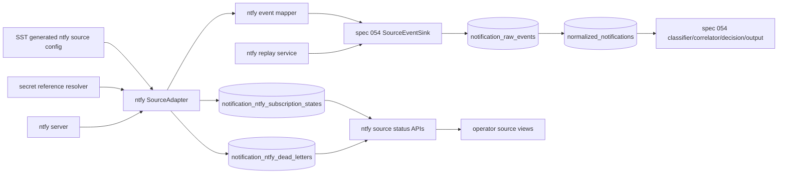
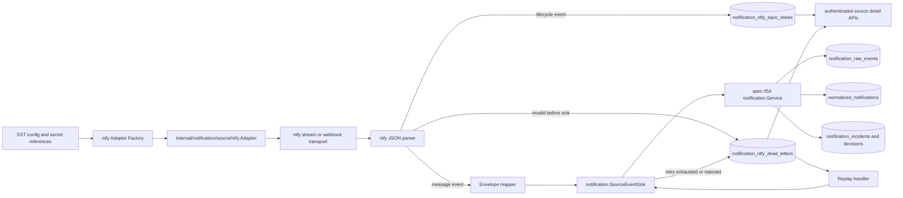

# Design: 055 Notification Source ntfy Adapter

## Design Brief

### Current State

Spec 054 has implemented the source-neutral notification core under `internal/notification`: `SourceAdapter`, `SourceEventSink`, `SourceEventEnvelope`, source health, raw event storage, normalization, classification, correlation, decisioning, loop guard, and dashboard output dispatch. The authenticated source health API already exposes `GET /api/notifications/sources`, and the core package has a static guard that rejects ntfy-specific or Telegram-specific production coupling.

Spec 055 has an analyst and UX specification for ntfy as a concrete notification source adapter. There is no ntfy adapter package, ntfy transport client, ntfy topic state store, ntfy dead-letter store, replay control, or ntfy source detail API yet.

### Target State

Spec 055 adds an ntfy source adapter that implements the spec 054 source contract and translates ntfy stream or webhook JSON into source-qualified `SourceEventEnvelope` values. The adapter owns ntfy connection, topic subscription, auth resolution, event parsing, field preservation, health, reconnect, lag, dead-letter, replay, and ntfy-specific operator status views.

Core notification processing remains in spec 054. Accepted ntfy message events enter the same raw-before-normalized pipeline as every other source, and all classification, correlation, suppression, approval, decisioning, action policy, loop prevention, and output dispatch remain core-owned.

### Patterns To Follow

- `internal/notification/types.go`: implement the existing `SourceAdapter` and `SourceEventSink` interfaces exactly, using `SourceType() == "ntfy"` and `SourceFormStream` or `SourceFormWebhook`.
- `internal/notification/store.go` and `internal/db/migrations/036_notification_intelligence.sql`: register ntfy instances through `notification_source_instances`, report source health through `notification_source_health_events`, and let `SubmitSourceEvent` create `notification_raw_events` and `normalized_notifications`.
- `internal/notification/health.go`: use connected, degraded, and disconnected source health with redacted error categories, never raw auth errors.
- `internal/notification/normalizer.go`: provide normalized mapping hints while preserving ntfy-specific fields separately; do not make core policy branch on ntfy-only keys.
- `internal/api/notifications.go`: keep operator APIs under authenticated `/api/notifications/*` and use the existing `writeJSON` / `writeError` response style.
- `config/smackerel.yaml` and `./smackerel.sh config generate`: all ntfy runtime values must come from SST-generated config and explicit secret references.

### Patterns To Avoid

- Do not add ntfy imports, ntfy field checks, ntfy incident states, or ntfy-specific policy branches to `internal/notification` production files.
- Do not call Telegram, dashboard output, digest output, webhook output, or ntfy reply delivery from the ntfy source adapter.
- Do not store plaintext ntfy tokens, passwords, endpoint credentials, operator hostnames, or deployment topology in source status, dead letters, logs, config examples, or UI responses.
- Do not use default or fallback endpoint URLs, topics, auth modes, reconnect budgets, retry budgets, output channels, or health states.
- Do not auto-fetch attachments or execute ntfy actions. Attachments and actions are preserved as source metadata only.

### Resolved Decisions

- The adapter package lives outside the core notification package, under an adapter-owned namespace such as `internal/notification/source/ntfy` or an equivalent non-core package.
- ntfy message-like events become `SourceEventEnvelope` submissions; ntfy lifecycle events update health and topic state only.
- ntfy `priority` and `tags` are preserved and may become mapping hints, but the core classifier remains authoritative.
- Dead-letter and replay state are adapter-owned operational records, not core incident records.
- Replay re-submits eligible records through `SourceEventSink.SubmitSourceEvent`; replay never sends output directly.
- Operator views extend notification source status and ntfy detail screens; source configuration remains SST-owned.

### Open Questions

- None blocking for design. Concrete operator instance names, topics, endpoint identities, secret reference names, retry budgets, and lag thresholds must be explicit SST values during planning and implementation.

## Purpose And Scope

This design defines the concrete ntfy source adapter for Smackerel's notification intelligence pipeline. The adapter reads ntfy events from configured topics, preserves raw ntfy JSON and source context, maps message events into the source-neutral envelope, and reports adapter health and operational failures to source status views.

### In Scope

- ntfy source adapter lifecycle: validate, connect, start, report health, reconnect, stop.
- ntfy stream and webhook transport design, with a single instance using one configured transport mode.
- ntfy JSON parsing for message, open, keepalive, poll request, and unsupported event types.
- Mapping from ntfy JSON fields to `notification.SourceEventEnvelope`.
- Topic-level subscription state, lag state, reconnect state, and event gap indicators.
- Adapter-owned dead-letter records for malformed, unsupported, oversize, redaction-failed, and repeatedly unaccepted events.
- Replay of eligible dead-letter records through the source sink.
- ntfy-specific authenticated operator APIs and HTMX views for source detail, topic state, dead letters, replay confirmation, and troubleshooting.
- SST config shape and secret-reference handling for ntfy source instances.
- Tests for adapter conformance, mapping, health, reconnect, lag, dead-letter, replay, redaction, no direct output dispatch, and no core ntfy dependency.

### Out Of Scope

- Core normalization, classification, correlation, decisioning, suppression, approval, actions, loop guard, and output dispatch. Those remain spec 054 behavior.
- Telegram delivery, ntfy reply delivery, dashboard output delivery, digest delivery, or any output-channel implementation.
- Runtime editing of ntfy source configuration through the UI. Configuration stays in SST and secret-managed deployment inputs.
- Automatic fetching of ntfy attachment URLs or execution of ntfy action definitions.

## Architecture Overview



### Component Ownership

| Component | Package / Surface | Owner | Responsibility |
|-----------|-------------------|-------|----------------|
| ntfy source adapter | `internal/notification/source/ntfy` or equivalent adapter package | Spec 055 | Implements `SourceAdapter`, transport, parse, map, health, reconnect, lag, dead-letter, replay. |
| ntfy transport client | adapter package | Spec 055 | Connects to ntfy stream or receives webhook events with explicit endpoint/topic/auth config. |
| ntfy mapper | adapter package | Spec 055 | Converts ntfy message JSON to `SourceEventEnvelope` without classifying or dispatching output. |
| ntfy state store | adapter package + migration | Spec 055 | Persists topic subscription state, retry state, lag, possible gap, and dead-letter/replay records. |
| source registry and sink | `internal/notification` | Spec 054 | Registers adapters, accepts source envelopes, persists raw and normalized records, reports health. |
| core pipeline | `internal/notification` | Spec 054 | Classifies, dedupes, correlates, decides, suppresses, approves, actions, and dispatches output. |
| operator API | `internal/api` plus adapter handler | Spec 055 for ntfy endpoints, Spec 054 for generic sources | Authenticated read/control surface for ntfy status and replay. |
| operator UI | `internal/web` templates or existing web handler pattern | Spec 055 | Source detail, topic state, dead-letter queue, replay confirmation, troubleshooting. |

### Dependency Direction

- The ntfy adapter imports `internal/notification` interfaces and domain types.
- The ntfy adapter may import config, metrics, logging, HTTP, and store utilities needed to run.
- `internal/notification` production files must not import the ntfy adapter package or contain ntfy-specific string branches.
- Output-channel packages must not be imported by the ntfy adapter.
- The API/router layer may mount ntfy adapter handlers as an adapter module, but core notification service methods must remain source-neutral.

## Source Adapter Interface

The adapter implements the existing interface:

```go
type SourceAdapter interface {
    SourceType() string
    SourceForm() notification.SourceForm
    InstanceID() string
    Connect(ctx context.Context, cfg notification.SourceInstanceConfig) error
    Start(ctx context.Context, sink notification.SourceEventSink) error
    Health(ctx context.Context) notification.SourceHealthReport
    Stop(ctx context.Context) error
}
```

### ntfy Adapter Type

```go
type Adapter struct {
    instance ntfy.InstanceConfig
    client   ntfy.TransportClient
    store    ntfy.Store
    clock    clock.Clock
    metrics  ntfy.Metrics
    logger   *slog.Logger
}
```

`SourceType()` returns `ntfy`. `SourceForm()` returns `stream` for long-lived subscription mode or `webhook` for inbound webhook mode. `InstanceID()` returns the configured `source_instance_id` exactly.

### Lifecycle

1. `Connect` validates `SourceInstanceConfig`, ntfy adapter config, endpoint identity, auth mode, topic set, reconnect policy, lag policy, dead-letter policy, and secret references.
2. `Connect` resolves auth values from the secret-management path only. Resolved secrets stay in memory and are never stored in source status, dead-letter records, or logs.
3. `Connect` performs a real source check: stream mode opens a subscription or validates the first open/keepalive event; webhook mode validates handler registration and signature/auth expectations.
4. `Start` begins the stream reader or webhook receiver and submits only message-like events to `SourceEventSink.SubmitSourceEvent`.
5. `Health` returns the latest redacted source health assembled from topic states and adapter state.
6. `Stop` cancels transport work, drains in-flight accepted submissions, and reports stopped/disconnected health only when the adapter is no longer reading.

## ntfy Transport Modes

### Stream Mode

Stream mode is the primary self-hosted operator path. The adapter opens a long-lived HTTP stream to the configured ntfy endpoint for the explicitly configured topics.

Required behavior:

- Subscribe only to configured topics.
- Treat `open` and `keepalive` events as health signals, not notifications.
- Treat `message` events as candidate source events.
- Detect stalled keepalive intervals using explicit `keepalive_timeout_seconds` from SST.
- Reconnect with bounded retry policy from SST.
- Preserve possible event gaps when the transport cannot prove replay continuity.

### Webhook Mode

Webhook mode is supported only when the operator explicitly configures it. It receives ntfy-delivered JSON through an authenticated adapter route.

Required behavior:

- Validate adapter route auth or signature using configured secret references.
- Preserve safe request metadata as delivery metadata.
- Reject unknown topics unless the topic appears in the configured topic set.
- Submit message-like events through the same mapper and sink as stream mode.
- Update source health based on accepted webhook events and validation failures.

### Transport Selection

Each source instance declares exactly one `transport_mode`: `stream` or `webhook`. A source instance must not silently switch transport modes when connection fails. Operators may configure separate source instances for separate transport modes if they need both.

## ntfy JSON Event Model

The adapter parses ntfy JSON into an internal event shape that preserves known fields and bounded safe unknown fields.

```go
type Event struct {
    ID         string          `json:"id"`
    Time       *int64          `json:"time"`
    Expires    *int64          `json:"expires"`
    Event      string          `json:"event"`
    Topic      string          `json:"topic"`
    Title      string          `json:"title"`
    Message    string          `json:"message"`
    Priority   json.RawMessage `json:"priority"`
    Tags       []string        `json:"tags"`
    Click      string          `json:"click"`
    Icon       string          `json:"icon"`
    Markdown   *bool           `json:"markdown"`
    Attachment json.RawMessage `json:"attachment"`
    Attach     string          `json:"attach"`
    Actions    json.RawMessage `json:"actions"`
    Unknown    map[string]json.RawMessage
}
```

`Priority` accepts numeric and string ntfy representations and is normalized into an adapter-level source priority string. Unknown fields are retained only when their names and values pass redaction and size checks. Unsafe unknown fields are represented by redaction categories and a payload hash, not by plaintext value.

### Event Type Handling

| ntfy event value | Adapter behavior |
|------------------|------------------|
| `message` or absent event with message fields | Build and submit `SourceEventEnvelope`. |
| `open` | Update topic/source health and `last_open_at`; do not submit notification. |
| `keepalive` | Update topic/source health and `last_successful_check_at`; do not submit notification. |
| `poll_request` | Preserve as health/transport metadata if emitted by the server; do not submit notification. |
| Unknown event with message/title fields | Dead-letter as `unsupported_event_type` unless explicitly allowed in SST mapping rules. |
| Unknown event without message/title fields | Dead-letter or health-only according to explicit event allowlist; no successful ingest. |

## Mapping To SourceEventEnvelope

The mapper builds the existing `notification.SourceEventEnvelope` with `RawPayloadKindJSON` and the exact raw JSON bytes observed from ntfy.

| Envelope field | ntfy source | Required behavior |
|----------------|-------------|-------------------|
| `SourceType` | constant | Always `ntfy`. |
| `SourceInstanceID` | SST source instance | Exact configured instance ID. |
| `SourceForm` | transport mode | `stream` or `webhook`, matching source config. |
| `SourceEventID` | `id` | Use ntfy `id` when present; leave empty only when absent so spec 054 derives identity. |
| `ObservedAt` | adapter clock | Time Smackerel observed the event. |
| `EventTimestamp` | `time` | Convert Unix seconds to UTC timestamp when valid; invalid time is preserved in source fields and omitted from `EventTimestamp`. |
| `RawPayloadKind` | constant | `json`. |
| `RawPayload` | original ntfy JSON bytes | Preserve before normalization; no reconstructed JSON as proof of raw input. |
| `DeliveryMetadata` | topic/transport/request metadata | Include topic, transport mode, endpoint reference name, subscription ID, delivery attempt, webhook request ID, safe header names, and event type. No secret values. |
| `SourceSpecificFields` | recognized ntfy fields | Preserve id, time, event, topic, title, message, priority, tags, click, icon, markdown, attachment metadata, attach value, actions, expires, and safe unknown field summary. |
| `MappingHints` | ntfy fields plus explicit mapping rules | Provide title, body, severity hint, subject, service, domain, intent, and primary tag where available. Hints are not final policy. |
| `LoopMetadata` | ntfy metadata or message fields | Preserve Smackerel origin IDs, decision IDs, incident IDs, loop guard keys, and output trace refs when present. |

### Recognized Field Preservation

Because the current source envelope uses `map[string]string`, structured ntfy values are canonical JSON strings in `SourceSpecificFields`:

| ntfy value | `SourceSpecificFields` key | Encoding |
|------------|----------------------------|----------|
| `id` | `ntfy.id` | raw string |
| `time` | `ntfy.time` | decimal Unix seconds string |
| `event` | `ntfy.event` | raw string |
| `topic` | `ntfy.topic` | raw string |
| `title` | `title` and `ntfy.title` | raw string after redaction for operator-facing copies |
| `message` | `body` and `ntfy.message` | raw string after redaction for operator-facing copies |
| `priority` | `severity` and `ntfy.priority` | source priority text plus original representation |
| `tags` | `ntfy.tags_json` | canonical JSON array string |
| `click` | `ntfy.click` | URL string after query-secret redaction for display copies |
| `icon` | `ntfy.icon` | URL/string after redaction for display copies |
| `markdown` | `ntfy.markdown` | `true` or `false` |
| `attachment` | `ntfy.attachment_json` | canonical JSON object string, no attachment fetch |
| `attach` | `ntfy.attach` | redacted URL/string, no fetch |
| `actions` | `ntfy.actions_json` | canonical JSON array string, no execution |
| unknown safe fields | `ntfy.unknown_json` | canonical JSON object string after allowlist and redaction |

### Priority Mapping Hints

The adapter maps ntfy priority to a source severity hint only:

| ntfy priority | Mapping hint `severity` | Source-specific preservation |
|---------------|--------------------------|------------------------------|
| `1` or `min` | `info` | `ntfy.priority=min` |
| `2` or `low` | `low` | `ntfy.priority=low` |
| `3` or `default` | `medium` | `ntfy.priority=default` |
| `4` or `high` | `high` | `ntfy.priority=high` |
| `5` or `urgent` | `critical` | `ntfy.priority=urgent` |
| missing/invalid | omit severity hint | preserve invalid representation in redacted source fields |

The spec 054 classifier may accept, downgrade, or upgrade this hint. The adapter must not produce incidents, decisions, suppressions, approval requests, or output deliveries from priority alone.

### Subject, Service, Domain, And Intent Hints

The adapter may derive hints from explicit SST mapping rules only. Examples:

- Topic `home-lab-alerts` may map to subject `home-lab` and domain `ops` when configured.
- Tags such as `disk`, `backup`, or `recovery` may map to service or intent only when the mapping rule is explicit.
- Without configured mapping, the adapter preserves topic/tags and supplies only title/body/severity hints.

No hardcoded topic-to-domain or tag-to-action behavior is allowed.

## Data Flow

### Message Ingest Flow

1. ntfy emits JSON to the configured stream or webhook.
2. Adapter validates topic membership, payload size, event type, and redaction safety.
3. Adapter records topic state with observed event ID/time and health signal.
4. Adapter builds a `SourceEventEnvelope` with raw JSON bytes and source metadata.
5. Adapter calls `SourceEventSink.SubmitSourceEvent`.
6. Spec 054 stores the raw event, normalizes, classifies, correlates, decides, and records output attempts if policy requires.
7. Adapter records the sink receipt and updates health only from real transport/sink results.

### Lifecycle Event Flow

1. ntfy emits `open` or `keepalive`.
2. Adapter updates topic state and source health with last successful check time.
3. Adapter does not call `SubmitSourceEvent`.
4. Operator status reflects connected health if the check is current.

### Sink Failure Flow

1. ntfy event maps successfully.
2. `SubmitSourceEvent` returns a transient error or unaccepted receipt.
3. Adapter retries within explicit retry budget.
4. If retry budget is exhausted, adapter writes a dead-letter record with redacted cause and replay eligibility.
5. Adapter reports degraded or disconnected health according to error class and retry exhaustion.
6. Adapter never sends the event to an output channel as a workaround.

## Data Model

Spec 055 adds an adapter-owned migration after spec 054's notification migration. The suggested filename is `037_notification_ntfy_source_adapter.sql`.

### `notification_ntfy_subscription_states`

One row per configured `(source_instance_id, topic)`.

```sql
CREATE TABLE IF NOT EXISTS notification_ntfy_subscription_states (
    source_instance_id        TEXT NOT NULL REFERENCES notification_source_instances(source_instance_id) ON DELETE CASCADE,
    topic                     TEXT NOT NULL,
    source_form               TEXT NOT NULL CHECK (source_form IN ('stream', 'webhook')),
    transport_mode            TEXT NOT NULL CHECK (transport_mode IN ('stream', 'webhook')),
    subscription_state        TEXT NOT NULL CHECK (subscription_state IN ('connected', 'reconnecting', 'disconnected', 'stalled', 'disabled')),
    last_ntfy_event_id        TEXT,
    last_event_at             TIMESTAMPTZ,
    last_open_at              TIMESTAMPTZ,
    last_keepalive_at         TIMESTAMPTZ,
    last_successful_check_at  TIMESTAMPTZ,
    lag_seconds               INTEGER NOT NULL CHECK (lag_seconds >= 0),
    possible_gap              BOOLEAN NOT NULL,
    retry_count               INTEGER NOT NULL CHECK (retry_count >= 0),
    retry_budget              INTEGER NOT NULL CHECK (retry_budget >= 0),
    last_error_kind           TEXT,
    last_error_redacted       TEXT,
    redaction_state           JSONB NOT NULL,
    created_at                TIMESTAMPTZ NOT NULL,
    updated_at                TIMESTAMPTZ NOT NULL,
    PRIMARY KEY (source_instance_id, topic),
    CHECK (topic <> ''),
    CHECK (jsonb_typeof(redaction_state) = 'object')
);

CREATE INDEX IF NOT EXISTS idx_notification_ntfy_subscription_state
    ON notification_ntfy_subscription_states (subscription_state, updated_at DESC);
```

### `notification_ntfy_dead_letters`

Dead-letter records are adapter-owned records for source intake failures before or during sink submission.

```sql
CREATE TABLE IF NOT EXISTS notification_ntfy_dead_letters (
    id                    TEXT PRIMARY KEY,
    source_instance_id    TEXT NOT NULL REFERENCES notification_source_instances(source_instance_id) ON DELETE CASCADE,
    topic                 TEXT,
    source_event_id       TEXT,
    event_type            TEXT,
    observed_at           TIMESTAMPTZ NOT NULL,
    payload_hash          TEXT NOT NULL,
    payload_size_bytes    INTEGER NOT NULL CHECK (payload_size_bytes >= 0),
    payload_ref_kind      TEXT NOT NULL CHECK (payload_ref_kind IN ('hash_only', 'raw_payload_bytes', 'source_raw_event_ref')),
    raw_payload_bytes     BYTEA,
    source_raw_event_id   TEXT REFERENCES notification_raw_events(id) ON DELETE SET NULL,
    safe_payload_preview  TEXT NOT NULL,
    cause_kind            TEXT NOT NULL CHECK (cause_kind IN ('malformed_json', 'unsupported_event_type', 'oversize_payload', 'redaction_failed', 'sink_unavailable', 'sink_rejected', 'auth_failed', 'topic_not_configured', 'unknown')),
    cause_redacted        TEXT NOT NULL,
    replay_eligible       BOOLEAN NOT NULL,
    replay_status         TEXT NOT NULL CHECK (replay_status IN ('not_replayable', 'pending', 'replayed', 'replay_failed')),
    attempt_count         INTEGER NOT NULL CHECK (attempt_count >= 0),
    last_attempt_at       TIMESTAMPTZ,
    redaction_state       JSONB NOT NULL,
    created_at            TIMESTAMPTZ NOT NULL,
    updated_at            TIMESTAMPTZ NOT NULL,
    CHECK (jsonb_typeof(redaction_state) = 'object')
);

CREATE INDEX IF NOT EXISTS idx_notification_ntfy_dead_letters_source
    ON notification_ntfy_dead_letters (source_instance_id, observed_at DESC);
CREATE INDEX IF NOT EXISTS idx_notification_ntfy_dead_letters_replay
    ON notification_ntfy_dead_letters (replay_eligible, replay_status, observed_at DESC);
```

Replay eligibility requires a payload that can be safely reconstructed without exposing secret material. Malformed, oversize, auth-failed, topic-not-configured, or redaction-failed records are not replay eligible. Sink-unavailable records are replay eligible only when the original source envelope can be reconstructed exactly.

### `notification_ntfy_replay_attempts`

```sql
CREATE TABLE IF NOT EXISTS notification_ntfy_replay_attempts (
    id                 TEXT PRIMARY KEY,
    dead_letter_id     TEXT NOT NULL REFERENCES notification_ntfy_dead_letters(id) ON DELETE CASCADE,
    source_instance_id TEXT NOT NULL REFERENCES notification_source_instances(source_instance_id) ON DELETE CASCADE,
    idempotency_key    TEXT NOT NULL UNIQUE,
    actor_kind         TEXT NOT NULL CHECK (actor_kind IN ('operator', 'system')),
    actor_ref          TEXT NOT NULL,
    status             TEXT NOT NULL CHECK (status IN ('accepted', 'rejected', 'failed')),
    raw_event_id       TEXT,
    sink_status        TEXT NOT NULL,
    error_kind         TEXT,
    error_redacted     TEXT,
    attempted_at       TIMESTAMPTZ NOT NULL
);

CREATE INDEX IF NOT EXISTS idx_notification_ntfy_replay_attempts_dead_letter
    ON notification_ntfy_replay_attempts (dead_letter_id, attempted_at DESC);
```

The idempotency key is `sha256(source_instance_id + topic + source_event_id_or_payload_hash + dead_letter_id)`. A replay attempt that produces an existing raw event is recorded as accepted only when the sink returns an accepted receipt or a core idempotency response that still proves raw-event identity.

## Configuration And SST

All ntfy source configuration originates from `config/smackerel.yaml` and generated env files. Runtime code reads only generated config/environment values and fails loudly when enabled source instances are incomplete.

Proposed config shape:

```yaml
notification_sources:
  ntfy:
    instances:
      - source_instance_id: "ntfy-home-lab-alerts"
        enabled: true
        source_form: "stream"
        transport_mode: "stream"
        endpoint_ref_name: "NTFY_HOME_LAB_ENDPOINT_URL"
        topics: ["home-lab-alerts"]
        auth:
          mode: "bearer_token"
          secret_ref_names: ["NTFY_HOME_LAB_TOKEN"]
        mapping:
          default_domain: "ops"
          topic_subjects:
            home-lab-alerts: "home-lab"
          tag_services: {}
          tag_intents: {}
        reconnect:
          retry_budget: 8
          initial_delay_seconds: 1
          max_delay_seconds: 60
          keepalive_timeout_seconds: 90
        lag:
          degraded_after_seconds: 180
          disconnected_after_seconds: 900
        dead_letter:
          retry_budget: 3
          max_payload_bytes: 65536
          pressure_threshold_count: 5
        redacted_metadata:
          display_name: "ntfy home lab alerts"
          endpoint_label: "operator-managed ntfy endpoint"
```

This YAML is a schema example. It must not be copied with operator-specific endpoints, hostnames, tokens, or deployment topology. Real endpoint values and secrets are supplied through the repo's explicit config and secret-management path.

### Required Generated Runtime Values

For each enabled instance, config generation must produce explicit values for:

| Runtime value | Meaning |
|---------------|---------|
| `NTFY_SOURCE_<INSTANCE>_ENABLED` | Source instance enabled flag. |
| `NTFY_SOURCE_<INSTANCE>_SOURCE_FORM` | `stream` or `webhook`. |
| `NTFY_SOURCE_<INSTANCE>_TRANSPORT_MODE` | `stream` or `webhook`. |
| `NTFY_SOURCE_<INSTANCE>_ENDPOINT_URL` | ntfy endpoint URL resolved by SST. |
| `NTFY_SOURCE_<INSTANCE>_TOPICS` | Comma-separated explicit topics. |
| `NTFY_SOURCE_<INSTANCE>_AUTH_MODE` | `bearer_token`, `basic`, or `none`. |
| `NTFY_SOURCE_<INSTANCE>_SECRET_REF_NAMES` | Secret reference names only; empty is allowed only when `AUTH_MODE=none` is explicitly configured. |
| `NTFY_SOURCE_<INSTANCE>_RETRY_BUDGET` | Bounded reconnect retry budget. |
| `NTFY_SOURCE_<INSTANCE>_KEEPALIVE_TIMEOUT_SECONDS` | Explicit stream stall threshold. |
| `NTFY_SOURCE_<INSTANCE>_DEAD_LETTER_RETRY_BUDGET` | Bounded sink retry budget before dead-letter. |
| `NTFY_SOURCE_<INSTANCE>_MAX_PAYLOAD_BYTES` | Explicit maximum ntfy JSON event size accepted by the adapter. |

### Source Contract Compatibility

The current spec 054 implementation requires at least one `SecretRefNames` entry in `SourceInstanceConfig`. Spec 055 must support ntfy topics with no authentication only when config declares `auth.mode = "none"` explicitly. Planning must either:

- update the source config validator and migration constraint to allow zero secret refs only when redacted metadata records `auth_mode=none`, or
- require all enabled ntfy instances to use credential-backed auth.

The first option best matches the spec 055 requirement for explicitly unauthenticated ntfy topics. This is a source-config contract refinement only; it must not alter core processing, classification, decisioning, or output dispatch.

### Forbidden Config Patterns

- FORBIDDEN: `${VAR:-value}` or any other default/fallback substitution form.
- FORBIDDEN: hardcoded ntfy endpoint URLs, topic names used as universal defaults, auth tokens, passwords, operator hostnames, or deployment adapter paths.
- FORBIDDEN: a missing endpoint/topic/auth mode that silently disables the source while reporting connected health.
- REQUIRED: enabled incomplete instances fail loud, report disconnected health with redacted error kind, and accept zero events.

## Secret Handling

- ntfy credential values are resolved from secret references at adapter startup or webhook request validation time.
- `notification_source_instances.secret_ref_names` stores reference names only.
- `notification_ntfy_*` tables store no credential values.
- Logs, health reports, API responses, dead-letter records, replay attempts, and UI exports must pass through the notification redaction guard.
- Auth failures use redacted `last_error_kind` values such as `auth_failed`, `credential_ref_missing`, or `invalid_credentials`.
- The adapter must never log raw Authorization headers, Basic auth values, bearer tokens, URL query secrets, or ntfy server error bodies that echo credentials.

## Operator API Contracts

All endpoints are authenticated with the same bearer/cookie policy as spec 054 notification endpoints. Responses use JSON and the existing `writeError` shape.

### `GET /api/notifications/sources`

Existing spec 054 endpoint. ntfy rows appear as normal source rows with:

- `source_type = "ntfy"`
- `source_instance_id` from SST
- `source_form = "stream"` or `"webhook"`
- `secret_ref_names` only
- `redacted_metadata` containing safe display fields such as `display_name`, `endpoint_label`, `topic_count`, `transport_mode`, `auth_mode`, and `config_hash`
- redacted health state from source health reports

### `GET /api/notifications/sources/{source_instance_id}/ntfy`

Returns ntfy-specific detail for a configured ntfy source instance.

Response:

```json
{
  "source": {
    "source_type": "ntfy",
    "source_instance_id": "ntfy-home-lab-alerts",
    "source_form": "stream",
    "health_state": "degraded",
    "config_hash": "sha256:...",
    "secret_ref_names": ["NTFY_HOME_LAB_TOKEN"],
    "redacted_metadata": {
      "display_name": "ntfy home lab alerts",
      "endpoint_label": "operator-managed ntfy endpoint",
      "auth_mode": "bearer_token"
    }
  },
  "topics": [
    {
      "topic": "home-lab-alerts",
      "subscription_state": "reconnecting",
      "last_ntfy_event_id": "abc123",
      "last_event_at": "2026-05-23T02:40:00Z",
      "last_keepalive_at": "2026-05-23T02:41:00Z",
      "lag_seconds": 840,
      "possible_gap": true,
      "retry_count": 4,
      "retry_budget": 8,
      "last_error_kind": "auth_failed",
      "last_error_redacted": "source authentication failed"
    }
  ],
  "dead_letter_summary": {
    "pending_count": 3,
    "replay_eligible_count": 1,
    "latest_cause_kind": "sink_unavailable"
  },
  "last_accepted_event": {
    "source_event_id": "abc123",
    "raw_event_id": "notif_raw_...",
    "notification_id": "notif_...",
    "topic": "home-lab-alerts",
    "raw_stored": true,
    "normalized": true
  }
}
```

Validation:

- `404 source_not_found` when the source instance does not exist.
- `404 ntfy_source_not_found` when the source exists but is not `source_type=ntfy`.
- No secret values are returned.

### `POST /api/notifications/sources/{source_instance_id}/ntfy/reconnect`

Starts a bounded reconnect attempt for the ntfy adapter instance.

Request:

```json
{
  "reason": "operator_requested_reconnect"
}
```

Success response:

```json
{
  "source_instance_id": "ntfy-home-lab-alerts",
  "accepted": true,
  "state": "reconnecting",
  "retry_count": 0,
  "retry_budget": 8,
  "health_state": "degraded"
}
```

Rules:

- Reconnect changes adapter source state only.
- Reconnect does not submit synthetic notification events.
- Reconnect does not dispatch output.
- Connected health is reported only after a real source check or accepted event.

### `GET /api/notifications/sources/{source_instance_id}/ntfy/dead-letters`

Query parameters:

| Parameter | Meaning |
|-----------|---------|
| `topic` | Optional topic filter. |
| `cause_kind` | Optional dead-letter cause filter. |
| `replay_eligible` | Optional boolean filter. |
| `limit` | Explicit positive page size. Missing or invalid limit returns validation error; no runtime default. |
| `cursor` | Opaque pagination cursor. |

Response:

```json
{
  "dead_letters": [
    {
      "id": "ntfy_dlq_...",
      "source_instance_id": "ntfy-home-lab-alerts",
      "topic": "home-lab-alerts",
      "source_event_id": "abc123",
      "observed_at": "2026-05-23T02:40:00Z",
      "payload_hash": "sha256:...",
      "cause_kind": "sink_unavailable",
      "cause_redacted": "source event could not be accepted after bounded retry",
      "replay_eligible": true,
      "replay_status": "pending",
      "attempt_count": 3
    }
  ],
  "next_cursor": "opaque-or-empty"
}
```

### `GET /api/notifications/sources/{source_instance_id}/ntfy/dead-letters/{dead_letter_id}`

Returns record detail, safe payload preview, attempts, replay eligibility, and redaction state. It never returns plaintext secrets or unredacted raw payload bytes.

### `POST /api/notifications/sources/{source_instance_id}/ntfy/dead-letters/{dead_letter_id}/replay`

Request:

```json
{
  "confirmation": "replay_through_source_sink"
}
```

Success response:

```json
{
  "replay_attempt_id": "ntfy_replay_...",
  "dead_letter_id": "ntfy_dlq_...",
  "status": "accepted",
  "sink_status": "accepted",
  "raw_event_id": "notif_raw_...",
  "idempotency_key": "sha256:..."
}
```

Rules:

- The only accepted confirmation value is `replay_through_source_sink`.
- Replay re-creates the original `SourceEventEnvelope` and calls `SubmitSourceEvent`.
- Replay does not invoke the classifier, correlator, or dispatcher directly.
- Replay does not call Telegram or any output channel.
- Replay is refused for non-replayable causes, source mismatch, redaction failure, missing payload ref, or duplicate in-flight idempotency key.

## Operator UI Design

The UX in `spec.md` is active and authoritative for visual layout. The technical mapping below defines data sources and behavior.

### Notification Sources With ntfy Row

- Data: `GET /api/notifications/sources`.
- Row action `Open ntfy Source`: route `/notifications/sources/{source_instance_id}` and fetch ntfy detail.
- Row action `View Events`: route to spec 054 notification event history filtered by `source_type=ntfy` and `source_instance_id`.
- Row action `View DLQ`: route to ntfy dead-letter queue.
- `Export Redacted Snapshot`: uses source status plus ntfy detail response; includes secret reference names, never values.

### ntfy Source Detail

- Data: `GET /api/notifications/sources/{source_instance_id}/ntfy`.
- `Refresh Health`: re-fetch detail and preserve selected topic.
- `Reconnect Source`: `POST /api/notifications/sources/{source_instance_id}/ntfy/reconnect`.
- Topic row expansion: uses topic state from the detail response.
- `Open Events`: navigates to spec 054 event history filters.
- `Open DLQ`: fetches dead-letter list for the source.

### ntfy Dead-Letter Queue

- Data: `GET /api/notifications/sources/{source_instance_id}/ntfy/dead-letters`.
- Detail panel: `GET /api/notifications/sources/{source_instance_id}/ntfy/dead-letters/{dead_letter_id}`.
- Replay button enabled only when `replay_eligible=true` and `replay_status=pending`.
- Copy action copies only redacted source instance ID, topic, observed time, cause, and payload hash.

### ntfy Replay Confirmation

- Data: dead-letter detail endpoint.
- Action: `POST /api/notifications/sources/{source_instance_id}/ntfy/dead-letters/{dead_letter_id}/replay`.
- The confirmation text must state that replay submits through the source sink and is not output delivery.
- After replay, the UI shows the replay attempt status and links to the raw event or the dead-letter record.

### ntfy Troubleshooting Panel

- Data: ntfy detail endpoint plus dead-letter summary.
- Checklist items are read-only diagnostic prompts, not workflow evidence.
- Controls call refresh, reconnect, topic list, and DLQ routes only.
- Redacted error categories must be visible as text and not only color or icon state.

## Reconnect, Lag, Dead-Letter, And Replay

### Reconnect Policy

Each instance has explicit reconnect policy in SST:

- `retry_budget`
- `initial_delay_seconds`
- `max_delay_seconds`
- `keepalive_timeout_seconds`

The adapter records each failed reconnect attempt in topic state and source health. Health states:

| Condition | Source health |
|-----------|---------------|
| Active stream or webhook accepted event/check within lag budget | `connected` |
| Temporary transport failure, stalled keepalive, sink retrying, dead-letter pressure under final threshold | `degraded` |
| Auth failure, invalid config, endpoint unreachable after retry budget, or all topics disconnected | `disconnected` |

Reconnect must not use unbounded sleeps, unbounded queues, or unbounded retry loops.

### Lag And Gap Signals

Lag is computed from the latest of `last_event_at`, `last_keepalive_at`, and `last_successful_check_at`, using explicit SST thresholds.

- `lag_seconds` is written per topic.
- `possible_gap=true` when the adapter reconnects after a stalled stream and ntfy cannot prove all missed events were replayed.
- Possible gaps are health and troubleshooting signals; they are not fabricated notifications.

### Dead-Letter Causes

| Cause | Replay eligible | Notes |
|-------|-----------------|-------|
| `malformed_json` | no | Cannot safely reconstruct envelope. |
| `unsupported_event_type` | no | Event shape is outside configured adapter contract. |
| `oversize_payload` | no | Payload exceeds explicit adapter limit. |
| `redaction_failed` | no | Payload cannot be safely stored or displayed. |
| `sink_unavailable` | yes when envelope payload is safely retained | Replays through source sink. |
| `sink_rejected` | conditional | Only replayable if rejection cause is transient and payload is safe. |
| `auth_failed` | no | Fix secret/config, then reconnect. |
| `topic_not_configured` | no | Rejects unconfigured topic. |
| `unknown` | no unless classified by explicit adapter rule | Safe default is no replay. |

### Replay Semantics

Replay is an intake retry, not a user notification. It must:

- rebuild the source envelope with original source identity, topic, source event ID, raw payload, delivery metadata, source-specific fields, mapping hints, and loop metadata;
- call `SourceEventSink.SubmitSourceEvent`;
- record the sink receipt or redacted error in `notification_ntfy_replay_attempts`;
- update the dead-letter `replay_status` and attempt count;
- rely on spec 054 idempotency to prevent duplicate raw accepted notifications and duplicate output;
- never call an output channel directly.

## Security, Redaction, And Privacy

- All operator-visible payload previews use `notification.RedactText` and adapter-specific redaction for structured JSON.
- `click`, `attach`, `icon`, webhook headers, endpoint URLs, and server error bodies are scanned for query tokens, bearer tokens, passwords, and secret fragments.
- Raw ntfy JSON is stored by spec 054 raw event persistence only after envelope validation succeeds.
- Dead-letter payload bytes are stored only when replay requires them and the redaction/size policy marks them safe. Otherwise the record stores hash and safe preview only.
- Secret values are never included in `redacted_metadata`, `DeliveryMetadata`, `SourceSpecificFields`, dead-letter records, replay attempts, metrics labels, trace attributes, or log messages.
- Webhook mode rejects requests without the configured auth/signature proof; it must not accept unauthenticated webhook traffic by omission.
- Operator APIs must enforce source instance lookup and source type checks before returning ntfy details.

## Observability

### Metrics

Add bounded-label metrics:

| Metric | Type | Labels |
|--------|------|--------|
| `smackerel_notification_ntfy_events_total` | counter | `source_instance_id`, `topic`, `event_type`, `status` |
| `smackerel_notification_ntfy_lifecycle_events_total` | counter | `source_instance_id`, `topic`, `event_type` |
| `smackerel_notification_ntfy_reconnect_attempts_total` | counter | `source_instance_id`, `result`, `error_kind` |
| `smackerel_notification_ntfy_lag_seconds` | gauge | `source_instance_id`, `topic` |
| `smackerel_notification_ntfy_dead_letters_total` | counter | `source_instance_id`, `cause_kind`, `replay_eligible` |
| `smackerel_notification_ntfy_replay_attempts_total` | counter | `source_instance_id`, `status` |
| `smackerel_notification_ntfy_mapper_duration_ms` | histogram | `source_instance_id`, `status` |

Do not label metrics with endpoint URLs, tokens, payload hashes, event titles, message bodies, or unbounded error text.

### Logs

Logs include bounded fields:

- `source_type=ntfy`
- `source_instance_id`
- `source_form`
- `topic`
- `ntfy_event_id` when safe
- `payload_hash`
- `dead_letter_id`
- `replay_attempt_id`
- `error_kind`
- `retry_count`

Logs do not include raw payloads, message bodies, auth headers, endpoint URLs with secrets, server response bodies that may echo secrets, or output-channel payloads.

### Traces

Trace spans:

- `notification.ntfy.connect`
- `notification.ntfy.stream.read`
- `notification.ntfy.webhook.receive`
- `notification.ntfy.map_event`
- `notification.ntfy.submit_source_event`
- `notification.ntfy.dead_letter`
- `notification.ntfy.replay`

Trace attributes use the same bounded fields as logs.

## Failure Modes

| Failure | Handling | User/operator visibility |
|---------|----------|--------------------------|
| Missing endpoint URL | Source instance refuses to start; disconnected health with `missing_endpoint`. | Sources row and troubleshooting panel. |
| Missing topic set | Source instance refuses to start; disconnected health with `missing_topics`. | Sources row. |
| Missing secret reference for auth mode | Source instance refuses to start; disconnected health with `credential_ref_missing`. | Sources row; no value exposed. |
| Invalid token/basic auth | Disconnected health with `auth_failed`; no event acceptance. | Topic status and troubleshooting. |
| Stream connect timeout | Degraded while retrying; disconnected after retry budget. | Retry count, lag, last redacted error. |
| Keepalive stall | Degraded, possible gap when reconnecting. | Lag and possible gap indicator. |
| Malformed JSON | Dead-letter `malformed_json`, not accepted. | DLQ queue and degraded pressure if threshold crossed. |
| Message from unconfigured topic | Dead-letter `topic_not_configured`, not accepted. | DLQ; no source envelope. |
| Oversize payload | Dead-letter `oversize_payload`, not accepted. | DLQ with hash and size only. |
| Sink unavailable | Bounded retry, then replay-eligible dead letter if safe. | DLQ and health degraded. |
| Duplicate replay | Core idempotency prevents duplicate accepted raw/event output. | Replay attempt shows existing identity or rejected duplicate. |
| Output requested by policy | Adapter does nothing; core output dispatcher owns delivery. | Core notification output views, not ntfy adapter logs. |

## Testing And Validation Strategy

### Scenario-To-Test Mapping

| Scenario | Test type | Test location | Primary assertion |
|----------|-----------|---------------|-------------------|
| SCN-055-001 | unit, integration | `internal/notification/source/ntfy/config_test.go`, `internal/notification/source/ntfy/store_integration_test.go` | Missing explicit config refuses source start and reports disconnected redacted health with no defaults. |
| SCN-055-002 | integration, e2e-api | `internal/notification/source/ntfy/adapter_integration_test.go`, `tests/e2e/notification_ntfy_source_api_test.go` | Valid ntfy message produces raw and normalized records through `SubmitSourceEvent`. |
| SCN-055-003 | unit, e2e-api | `internal/notification/source/ntfy/mapper_test.go`, `tests/e2e/notification_ntfy_source_api_test.go` | ntfy fields are preserved in delivery/source metadata; core policy does not branch on ntfy keys. |
| SCN-055-004 | unit | `internal/notification/source/ntfy/mapper_test.go` | Priority/tags become hints and source fields; final classifier result remains core-owned. |
| SCN-055-005 | unit, integration | `internal/notification/source/ntfy/health_test.go` | open/keepalive update health and create no normalized notification. |
| SCN-055-006 | integration | `internal/notification/source/ntfy/reconnect_integration_test.go` | Transient drop reports degraded health and recovers only after real check/event. |
| SCN-055-007 | integration | `internal/notification/source/ntfy/reconnect_integration_test.go` | Retry exhaustion reports disconnected health with redacted error and retry count. |
| SCN-055-008 | unit, integration | `internal/notification/source/ntfy/dead_letter_test.go`, `internal/notification/source/ntfy/store_integration_test.go` | Malformed payload becomes dead letter and no accepted ingest. |
| SCN-055-009 | integration, e2e-api | `internal/notification/source/ntfy/replay_integration_test.go`, `tests/e2e/notification_ntfy_source_api_test.go` | Sink failure retries then dead-letters; replay goes through source sink only. |
| SCN-055-010 | integration, e2e-api | `internal/notification/source/ntfy/multi_topic_integration_test.go` | Multiple topics preserve exact topic provenance. |
| SCN-055-011 | integration, e2e-api | `internal/notification/source/ntfy/multi_instance_integration_test.go` | Overlapping source instances remain distinct by instance and topic. |
| SCN-055-012 | unit, e2e-api | `internal/notification/source/ntfy/no_output_coupling_test.go`, `tests/e2e/notification_ntfy_source_api_test.go` | Adapter makes no Telegram/output calls; core dispatcher owns output. |
| SCN-055-013 | unit, integration | `internal/notification/source/ntfy/loop_metadata_test.go` | Loop metadata is preserved for spec 054 loop guard. |
| SCN-055-014 | unit, e2e-api | `internal/notification/source/ntfy/redaction_test.go`, `tests/e2e/notification_ntfy_source_api_test.go` | Auth failure exposes only redacted categories and no credential values. |

### Required Test Categories

- Unit: mapper, config validation, priority mapping, lifecycle classification, redaction, replay eligibility, no output coupling.
- Integration: source registration, topic state store, dead-letter store, replay attempts, health reports, reconnect transitions, source sink submissions against test PostgreSQL.
- E2E API: authenticated operator APIs for ntfy detail, dead letters, replay, raw/normalized event proof, and no direct output dispatch.
- E2E UI: source list row, source detail, DLQ, replay confirmation, troubleshooting, responsive text-first health states.
- Stress: burst of ntfy messages with duplicates, malformed records, sink transient failures, reconnect churn, and dead-letter pressure.
- Static guards: no ntfy in core notification production package; no Telegram/output imports in ntfy adapter; no fallback/default config syntax in touched config/docs.

### Regression Requirements

- Regression E2E: ntfy message still enters raw/normalized core pipeline and does not become direct forwarding.
- Regression E2E: replay-eligible dead letter replays through the sink and does not send output directly.
- Regression E2E: auth failure and secret-bearing payloads remain redacted in APIs and UI.
- Regression E2E: multiple topics and multiple instances keep provenance distinct.

### Validation Commands

Design and planning must require repo-standard commands:

- `./smackerel.sh test unit`
- `./smackerel.sh test integration`
- `./smackerel.sh test e2e`
- `./smackerel.sh test stress`
- `./smackerel.sh lint`
- `./smackerel.sh format --check`
- `bash .github/bubbles/scripts/artifact-lint.sh specs/055-notification-source-ntfy-adapter`

## Rollout Strategy

1. Add config schema and validation for ntfy sources while disabled instances remain inert and visible only as validated config records.
2. Add adapter package, mapper, topic state store, dead-letter store, and conformance tests.
3. Wire source registry startup to instantiate enabled ntfy adapters and report disconnected redacted health for invalid enabled instances.
4. Mount authenticated ntfy source detail, dead-letter, reconnect, and replay APIs.
5. Add HTMX/operator views that consume the APIs and preserve source/output-channel boundary language.
6. Enable one explicit operator-managed ntfy source instance only after SST values and secret references exist.
7. Monitor source health, lag, dead-letter pressure, replay attempts, and core notification pipeline metrics before adding additional topics or instances.

Rollback is configuration-first: disable the ntfy source instance in SST and regenerate config. Existing raw notification, dead-letter, replay, and source health records remain auditable. Disabling the source must not delete historical records or mutate core notification incidents.

## Alternatives And Tradeoffs

### Put ntfy Parsing In Core Notification Service

Rejected. It would violate spec 054's source-neutral contract and make ntfy field names available to core classification and decision branches.

### Forward ntfy Messages Directly To Telegram

Rejected. The adapter is a source. Telegram is an output channel. Direct forwarding would bypass raw storage, normalization, classification, correlation, decisions, suppressions, approvals, redaction, and loop guard.

### Store Dead Letters Only In Logs

Rejected. Operators need authenticated, redacted, queryable dead-letter and replay state. Logs are not a durable source-intake workflow surface.

### Auto-Fetch ntfy Attachments

Rejected for the adapter. Attachment metadata is preserved, but fetching remote content can leak network identity, fetch unsafe content, and bypass core risk policy. Attachment fetch can only be designed as a separate safe action or enrichment path governed by spec 054 policy.

### Treat ntfy Priority As Final Severity

Rejected. ntfy priority is a source signal. The core classifier must remain authoritative and explain whether it accepted, downgraded, or upgraded source severity.

## Open Questions And Risks

| Item | Status | Owner / Decision Path |
|------|--------|-----------------------|
| Source config no-auth compatibility | Open but non-blocking for design | `bubbles.plan` must choose source-contract refinement or credential-required first implementation. |
| Exact package path | Open but non-blocking for design | `bubbles.plan` should pick the concrete adapter package path while preserving dependency direction. |
| Endpoint URL storage shape | Open but non-blocking for design | Config owner must decide whether generated runtime value stores URL directly or resolves via named endpoint reference; both must fail loud. |
| UI technology details | Open but non-blocking for design | Follow the current Smackerel authenticated web/HTMX pattern and existing notification source routes. |
| Replay payload retention | Risk | Implementation must prove replay-eligible dead letters do not expose secrets while preserving exact source envelope reconstruction. |

## Active Design Truth Summary

- ntfy source adapter owns transport, parsing, mapping, health, reconnect, lag, dead-letter, replay, and ntfy operator status views.
- Spec 054 core owns all notification intelligence after `SubmitSourceEvent` accepts the envelope.
- ntfy JSON is preserved as raw payload and source-specific metadata; normalized hints do not become final policy.
- Lifecycle events update health only.
- Dead-letter replay is source intake only.
- Direct Telegram coupling and plaintext/default/fallback configuration are forbidden.
<!-- Superseded duplicate content from an interrupted file rewrite begins here. It is intentionally hidden from the active rendered design.
Superseded duplicate design content: 055 Notification Source ntfy Adapter

## Design Brief

### Current State

Spec 054 has established the source-neutral notification core in `internal/notification`: `SourceAdapter`, `SourceEventSink`, `SourceEventEnvelope`, source health reporting, raw-event persistence, normalization, classification, correlation, decisioning, loop guard, redaction, and the authenticated `/api/notifications/sources` status surface. Its static dependency guard requires production core notification code to stay free of ntfy and Telegram source-specific coupling.

Spec 055 has an analyst and UX-complete `spec.md` for the first concrete ntfy source adapter. No spec 055 `design.md` existed before this pass, and no adapter package, ntfy config parser, ntfy transport state table, dead-letter table, replay endpoint, or ntfy operator detail handler exists in the current spec 055 folder.

### Target State

Spec 055 adds an ntfy source adapter that plugs into the spec 054 source contract and owns only ntfy transport, subscription state, JSON parsing, field preservation, mapping hints, reconnect/lag health, dead-letter records, replay controls, and ntfy source operator views. Every accepted ntfy message becomes a `notification.SourceEventEnvelope` and enters `notification.Service.SubmitSourceEvent`; core classification, correlation, incident decisions, suppressions, approvals, actions, and output delivery remain spec 054 behavior.

The operator can inspect ntfy source health, topics, reconnect state, lag, dead-letter records, and replay attempts through authenticated source-status surfaces. The adapter never forwards directly to Telegram, dashboard delivery, digest, webhook, email, or ntfy reply output channels.

### Patterns To Follow

- `internal/notification/types.go`: implement `SourceAdapter`, submit only through `SourceEventSink`, and populate `SourceEventEnvelope` with source identity, raw JSON, delivery metadata, source-specific fields, mapping hints, and loop metadata.
- `internal/notification/service.go`: rely on `SubmitSourceEvent` for raw persistence, normalization, classification, correlation, decisioning, loop guard, and delivery creation.
- `internal/notification/health.go`: report source health through `SourceHealthReport` with `connected`, `degraded`, or `disconnected` and redacted error categories.
- `internal/notification/store.go` and `internal/db/migrations/036_notification_intelligence.sql`: reuse source instance records, source health events, raw events, normalized notifications, and the existing redacted source status API.
- `internal/api/notifications.go`: extend authenticated notification source APIs using snake_case JSON and existing `writeError` behavior; mount adapter-owned handlers without adding ntfy branches to the core notification package.
- `internal/notification/source_contract_test.go` and `internal/notification/no_ntfy_core_dependency_test.go`: keep source conformance and core dependency guards as the mandatory contract for this adapter.

### Patterns To Avoid

- Do not put ntfy parsing, ntfy field names, ntfy priorities, ntfy topic rules, or ntfy replay logic inside `internal/notification` core production files.
- Do not call `internal/telegram`, scheduler Telegram jobs, recommendation watches, or any output channel from the ntfy adapter.
- Do not use `notification_delivery_attempts` as proof of adapter ingest; only `SourceEventSink.SubmitSourceEvent` acceptance proves source ingest.
- Do not store plaintext ntfy tokens, passwords, basic-auth credentials, bearer values, endpoint credentials, or operator topology in source status, dead-letter records, logs, UI payloads, or committed config.
- FORBIDDEN: `${VAR:-value}`, `${VAR-value}`, `os.Getenv("KEY")` with silent fallback, generated-env hand edits, fallback topics, fallback endpoints, fallback instance IDs, or fallback output channels.

### Resolved Decisions

- The adapter package is `internal/notification/source/ntfy`; the core package remains ntfy-free.
- `source_type` is always `ntfy`; each configured instance has one explicit `source_instance_id`, one explicit `source_form`, and one explicit topic set.
- Stream mode is the primary transport; webhook mode uses the same mapping and source sink path when explicitly configured.
- ntfy lifecycle events (`open`, `keepalive`, `poll_request`) update health and topic state only; message-like events are the only events eligible for core notification ingest.
- ntfy `priority` and `tags` become mapping hints and source-specific context, never final severity/domain/intent decisions.
- Adapter dead-letter and replay records are adapter-owned; replay resubmits through `SourceEventSink` and cannot dispatch output directly.
- Unauthenticated ntfy topics require explicit `auth_mode=none`; credentialed topics use secret reference names only.

### Open Questions

None blocking for design. Concrete source instance IDs, topic names, endpoint identities, auth modes, retry budgets, lag thresholds, and dead-letter limits must be explicit SST values during planning and implementation.

## Purpose And Scope

Spec 055 designs a concrete ntfy source adapter for Smackerel's notification intelligence system. The adapter reads ntfy JSON events, preserves ntfy context, converts message events into source envelopes, and reports source health. It is intentionally thin: its purpose is to move ntfy events into the spec 054 core pipeline without becoming a second notification processor.

### In Scope

- ntfy source adapter package and lifecycle implementation.
- ntfy stream and webhook transport behavior.
- ntfy JSON event parsing, validation, redaction pre-checks, field preservation, and mapping hints.
- ntfy topic subscription state, reconnect state, lag visibility, and topic-level health.
- Adapter-owned dead-letter storage, replay eligibility, replay attempts, and operator controls.
- ntfy source detail, topic list, dead-letter queue, replay confirmation, and troubleshooting API/web data contracts.
- SST config schema and validation for ntfy source instances, auth references, reconnect budgets, lag thresholds, payload limits, and dead-letter thresholds.
- Source-contract conformance, no direct output-channel coupling, no core ntfy dependency, redaction, failure, replay, and stress validation strategy.

### Out Of Scope

- Core notification classification, correlation, incident state, decisions, suppressions, approvals, actions, output delivery, and loop policy. These remain spec 054.
- Telegram output behavior, ntfy reply output behavior, dashboard delivery behavior, digest delivery behavior, and output-channel destination configuration.
- A runtime UI for editing secret values or source endpoint values. Source config remains SST and secret-managed.
- Destructive source operations. Adapter controls are refresh, reconnect, inspect, and replay through the source sink only.

## Architecture Overview



### Package Boundary

| Package Or Surface | Owns | Must Not Own |
|--------------------|------|--------------|
| `internal/notification` | Source contract, core pipeline, source health model, raw/normalized persistence, classifier, correlator, decisions, loop guard, output dispatcher | ntfy JSON parsing, ntfy transport, ntfy topic auth, ntfy replay logic, Telegram source forwarding |
| `internal/notification/source/ntfy` | ntfy adapter, transport client, parser, mapper, topic state, dead-letter store, replay logic, adapter-specific API/web view model | core classification/correlation/decisioning/output dispatch |
| `internal/api` | Authenticated route mounting, common response/error helpers, adapter handler registration | ntfy processing policy or direct source parsing |
| `config/smackerel.yaml` and generator | Explicit source instance config and generated env keys | plaintext secrets, hardcoded endpoints, runtime fallback values |
| `docs/API.md` and `docs/Operations.md` | Published operator contract after implementation | Claims that ntfy source status is delivered before runtime code exists |

The ntfy adapter may import `internal/notification` for source contracts. `internal/notification` production files must never import the ntfy adapter package or mention ntfy-specific tokens. `internal/api` or the application bootstrap may import the adapter package only to mount adapter-owned handlers and start configured instances.

## Component Design

### Adapter Type

```go
package ntfy

type Adapter struct {
    cfg       Config
    client    Client
    store     Store
    clock     Clock
    redactor  Redactor
}

func (a *Adapter) SourceType() string { return "ntfy" }
func (a *Adapter) SourceForm() notification.SourceForm
func (a *Adapter) InstanceID() string
func (a *Adapter) Connect(ctx context.Context, cfg notification.SourceInstanceConfig) error
func (a *Adapter) Start(ctx context.Context, sink notification.SourceEventSink) error
func (a *Adapter) Health(ctx context.Context) notification.SourceHealthReport
func (a *Adapter) Stop(ctx context.Context) error
```

`Adapter` has no dependency on Telegram, output dispatchers, incident stores, classifiers, correlators, or action executors. It sees a `SourceEventSink`, reports health, and stores adapter-owned operational records.

### Adapter Collaborators

| Type | Responsibility |
|------|----------------|
| `ConfigLoader` | Loads generated ntfy source config and resolves secret values through the existing generated env/secret path without exposing them in public structs. |
| `Client` | Performs stream subscription or webhook request validation. The default client uses `net/http` with explicit timeouts from SST. |
| `Parser` | Converts raw line-delimited JSON or webhook body JSON into `Event` values. |
| `Mapper` | Converts message events into `notification.SourceEventEnvelope` values. |
| `TopicStateStore` | Persists topic-level subscription, keepalive, reconnect, lag, and possible-gap state. |
| `DeadLetterStore` | Persists invalid, unsafe, rejected, or retry-exhausted ntfy events and replay attempts. |
| `ReplayService` | Reconstructs eligible envelopes and calls `SourceEventSink.SubmitSourceEvent`. |
| `HTTPHandler` | Serves authenticated ntfy source detail, topic state, reconnect, dead-letter, and replay controls. |

### Startup Flow

1. Config generation emits explicit ntfy source instance env/config values.
2. Bootstrap loads ntfy source instances and validates every enabled instance.
3. For each enabled instance, bootstrap creates `notification.SourceInstanceConfig` and `ntfy.Config`.
4. Bootstrap persists or reconciles `notification_source_instances` with redacted metadata.
5. Bootstrap registers the adapter with `notification.SourceRegistry` and starts it with the core `SourceEventSink`.
6. Invalid enabled config creates disconnected health with `last_error_kind` such as `config_missing`, `credential_ref_missing`, `topic_missing`, or `endpoint_missing`; it does not start a partially configured adapter.

Disabled ntfy source instances are not started. An empty ntfy source list is an explicit empty registry state, not a fabricated source and not a connected health state.

## ntfy Transport Design

### Supported Source Forms

| Form | Use | Required Config |
|------|-----|-----------------|
| `stream` | Adapter subscribes to ntfy's JSON event stream for one or more topics. | Endpoint identity, topics, auth mode, keepalive timeout, reconnect budget, lag thresholds. |
| `webhook` | ntfy or an operator-managed relay POSTs ntfy JSON events into Smackerel. | Endpoint identity, topics allowed, request auth mode, replay policy, payload limit. |

Each source instance declares exactly one source form. Stream and webhook instances can coexist, but their `source_instance_id` values must be distinct.

### Stream Behavior

- Connect using the configured endpoint and topic list.
- Request JSON event format.
- Treat `open` and `keepalive` events as health signals.
- Treat `message` events as candidate notification events.
- Treat unknown lifecycle events as health metadata when they are safe to parse; unsupported message-like events go to dead letter.
- Keep one topic state row per configured topic.
- Stop the source on context cancellation and report a stopped health event only as adapter lifecycle metadata, not as a normalized notification.

### Webhook Behavior

- Accept only authenticated requests that match the configured source instance and topic allowlist.
- Apply the same parser and mapper as stream mode.
- Record request metadata as redacted delivery metadata.
- Reject unknown topics before sink submission and record a dead-letter item with `cause='unauthorized_topic'` when the payload is safe to summarize.

## ntfy JSON Event Contract

### Parsed Event Shape

```go
type Event struct {
    ID         string
    Time       *time.Time
    EventType  string
    Topic      string
    Title      string
    Message    string
    Priority   string
    Tags       []string
    Click      string
    Icon       string
    Markdown   string
    Attachment map[string]any
    Actions    []map[string]any
    Unknown    map[string]any
    Raw        []byte
}
```

The parser uses strict JSON decoding for known top-level fields and retains safe unknown fields in `Unknown`. Unknown nested values are retained only when they can be represented as bounded canonical JSON strings and pass redaction scans.

### Event Type Handling

| ntfy `event` | Adapter Behavior | Core Sink Submission |
|--------------|------------------|----------------------|
| `message` | Validate topic, map fields, submit envelope. | Yes |
| `open` | Mark stream opened and update health/topic state. | No |
| `keepalive` | Update last successful check and lag state. | No |
| `poll_request` | Preserve as health/transport metadata when observed. | No |
| Missing event with message fields | Treat as malformed unless transport mode declares webhook message wrapper with explicit schema. | No until valid |
| Unknown event | Dead-letter as `unsupported_event` when payload is safe; otherwise record hash only. | No |

Lifecycle events never create normalized user notifications. If repeated lifecycle failures indicate source degradation, the adapter reports health through `ReportSourceHealth`; the core can later record source-health incidents only through a separate explicit source-health event path, not by pretending lifecycle events are user notifications.

## Mapping To `notification.SourceEventEnvelope`

Every accepted ntfy message maps to the current spec 054 envelope type from `internal/notification/types.go`.

| Envelope Field | ntfy Mapping | Notes |
|----------------|--------------|-------|
| `SourceType` | Literal `ntfy` | Stable adapter type. |
| `SourceInstanceID` | Configured instance ID | Never derived from topic or endpoint. |
| `SourceForm` | Configured `stream` or `webhook` | Must match source instance record. |
| `SourceEventID` | ntfy `id` when present | If absent, leave empty so spec 054 derives identity and records `handler_derived`. |
| `ObservedAt` | Adapter observation timestamp | Required and generated at receipt. |
| `EventTimestamp` | ntfy `time` when valid | ntfy Unix seconds parse failure is preserved as source metadata and omitted from the normalized timestamp. |
| `RawPayloadKind` | `json` | The full ntfy JSON bytes are preserved as raw payload. |
| `RawPayload` | Original JSON bytes | Before any normalization. |
| `DeliveryMetadata` | `ntfy_topic`, `transport_mode`, `endpoint_ref`, `subscription_id`, `stream_event_type`, `request_id`, `delivery_attempt` | Values are non-secret and redacted before persistence. |
| `SourceSpecificFields` | Flat string map preserving recognized and safe unknown ntfy fields | Complex fields use canonical JSON string values. |
| `MappingHints` | Normalized title/body/severity/subject/service/domain/intent/tag hints | Hints are evidence only; final classification remains core-owned. |
| `LoopMetadata` | `smackerel_origin_id`, `incident_id`, `decision_id`, `loop_guard_key`, or source-provided origin fields | Passed through for spec 054 loop guard evaluation. |

### Field-Level Mapping

| ntfy Field | Source-Specific Preservation | Mapping Hint | Core Boundary |
|------------|------------------------------|--------------|---------------|
| `id` | `ntfy_id` | `SourceEventID` | Used for idempotency, not severity. |
| `time` | `ntfy_time_unix` | `EventTimestamp` when valid | Invalid value does not fabricate a timestamp. |
| `event` | `ntfy_event` | None | Lifecycle events update health only. |
| `topic` | `ntfy_topic` and delivery metadata | `subject` when topic mapping config names the topic as subject | Topic is provenance, not final incident key by itself. |
| `title` | `ntfy_title` | `title` | If absent, no title hint is sent. |
| `message` | `ntfy_message` | `body` | Redaction still occurs in core normalizer. |
| `priority` | `ntfy_priority` and `ntfy_priority_label` | `severity` using configured priority mapping | The core classifier can accept, downgrade, upgrade, or ignore the hint. |
| `tags` | `ntfy_tags_json` | `tag` for the primary configured tag only | All tags remain auditable in source fields. |
| `click` | `ntfy_click` after redaction | None | Must not create an action. |
| `icon` | `ntfy_icon` after redaction | None | Display metadata only. |
| `markdown` | `ntfy_markdown` | None | Rendering choice stays UI-owned. |
| `attachment` / `attach` | `ntfy_attachment_json` with unsafe URLs redacted | None | Adapter does not fetch attachments automatically. |
| `actions` | `ntfy_actions_json` with credentials redacted | None | Adapter does not execute actions. |
| Unknown safe fields | `ntfy_unknown_fields_json` | None | Unknown fields cannot drive core policy. |

### Priority Mapping

The priority-to-severity hint is explicit config, with a required full map for values the adapter accepts. The recommended operator configuration for ntfy's numeric priority shape is:

| ntfy Priority | Severity Hint |
|---------------|---------------|
| `1` | `info` |
| `2` | `low` |
| `3` | `medium` |
| `4` | `high` |
| `5` | `critical` |

This is not final severity. The adapter stores both raw priority and mapped severity hint. Spec 054 classification records whether source severity was accepted, downgraded, upgraded, or treated as absent.

### Topic Mapping

Topic mappings are adapter configuration, not core branches:

| Config Field | Behavior |
|--------------|----------|
| `topic` | Exact ntfy topic name. |
| `subject_hint` | Optional normalized subject hint for this topic. |
| `service_hint` | Optional normalized service hint for this topic. |
| `domain_hint` | Optional bounded domain hint. |
| `intent_hint_rules` | Optional tag/title/message pattern names that produce bounded intent hints. |

If a topic has no subject or service hint, the adapter preserves the topic in delivery metadata and source-specific fields. It does not invent service identity.

## Data Model

Spec 055 reuses spec 054 tables for source identity, source health, raw events, normalized notifications, classifications, incidents, decisions, suppressions, and deliveries. It adds adapter-owned tables for topic-level transport state, dead-letter records, and replay attempts.

### Migration

Add migration `037_notification_ntfy_source_adapter.sql`.

```sql
CREATE TABLE IF NOT EXISTS notification_ntfy_topic_states (
    id                         TEXT PRIMARY KEY,
    source_instance_id         TEXT NOT NULL REFERENCES notification_source_instances(source_instance_id) ON DELETE CASCADE,
    topic                      TEXT NOT NULL,
    transport_mode             TEXT NOT NULL CHECK (transport_mode IN ('stream', 'webhook')),
    subscription_state         TEXT NOT NULL CHECK (subscription_state IN ('connected', 'reconnecting', 'disconnected', 'stopped')),
    last_ntfy_event_id         TEXT,
    last_event_at              TIMESTAMPTZ,
    last_keepalive_at          TIMESTAMPTZ,
    last_open_at               TIMESTAMPTZ,
    last_successful_check_at   TIMESTAMPTZ,
    lag_seconds                INTEGER NOT NULL CHECK (lag_seconds >= 0),
    possible_gap               BOOLEAN NOT NULL,
    retry_count                INTEGER NOT NULL CHECK (retry_count >= 0),
    retry_budget               INTEGER NOT NULL CHECK (retry_budget >= 0),
    last_error_kind            TEXT,
    last_error_redacted        TEXT,
    observed_at                TIMESTAMPTZ NOT NULL,
    created_at                 TIMESTAMPTZ NOT NULL,
    updated_at                 TIMESTAMPTZ NOT NULL,
    CHECK (topic <> ''),
    UNIQUE (source_instance_id, topic)
);

CREATE INDEX IF NOT EXISTS idx_notification_ntfy_topic_states_source
    ON notification_ntfy_topic_states (source_instance_id, subscription_state, observed_at DESC);

CREATE TABLE IF NOT EXISTS notification_ntfy_dead_letters (
    id                         TEXT PRIMARY KEY,
    source_instance_id         TEXT NOT NULL REFERENCES notification_source_instances(source_instance_id) ON DELETE CASCADE,
    topic                      TEXT,
    source_event_id            TEXT,
    transport_mode             TEXT NOT NULL CHECK (transport_mode IN ('stream', 'webhook')),
    cause                      TEXT NOT NULL CHECK (cause IN (
        'malformed_json', 'unsupported_event', 'unauthorized_topic', 'payload_too_large',
        'redaction_failed', 'sink_unavailable', 'sink_rejected', 'retry_exhausted'
    )),
    status                     TEXT NOT NULL CHECK (status IN ('pending', 'not_replayable', 'replayed', 'replay_failed')),
    replay_eligible            BOOLEAN NOT NULL,
    idempotency_key            TEXT NOT NULL,
    payload_hash               TEXT NOT NULL,
    raw_payload_kind           TEXT NOT NULL CHECK (raw_payload_kind IN ('json', 'text', 'bytes', 'headers_body', 'file_ref', 'hash_only')),
    raw_payload_bytes          BYTEA,
    safe_payload_preview       TEXT,
    redaction_state            JSONB NOT NULL,
    error_kind                 TEXT NOT NULL,
    error_redacted             TEXT NOT NULL,
    attempts                   INTEGER NOT NULL CHECK (attempts >= 0),
    observed_at                TIMESTAMPTZ NOT NULL,
    last_attempt_at            TIMESTAMPTZ,
    created_at                 TIMESTAMPTZ NOT NULL,
    updated_at                 TIMESTAMPTZ NOT NULL,
    CHECK (payload_hash <> ''),
    UNIQUE (source_instance_id, idempotency_key)
);

CREATE INDEX IF NOT EXISTS idx_notification_ntfy_dead_letters_source
    ON notification_ntfy_dead_letters (source_instance_id, status, observed_at DESC);

CREATE INDEX IF NOT EXISTS idx_notification_ntfy_dead_letters_payload
    ON notification_ntfy_dead_letters (payload_hash, observed_at DESC);

CREATE TABLE IF NOT EXISTS notification_ntfy_replay_attempts (
    id                         TEXT PRIMARY KEY,
    dead_letter_id             TEXT NOT NULL REFERENCES notification_ntfy_dead_letters(id) ON DELETE CASCADE,
    source_instance_id         TEXT NOT NULL REFERENCES notification_source_instances(source_instance_id) ON DELETE CASCADE,
    operator_actor_ref         TEXT NOT NULL,
    idempotency_key            TEXT NOT NULL,
    status                     TEXT NOT NULL CHECK (status IN ('accepted', 'duplicate', 'rejected', 'failed')),
    raw_event_id               TEXT,
    sink_status                TEXT,
    error_kind                 TEXT,
    error_redacted             TEXT,
    attempted_at               TIMESTAMPTZ NOT NULL,
    created_at                 TIMESTAMPTZ NOT NULL,
    UNIQUE (dead_letter_id, idempotency_key)
);

CREATE INDEX IF NOT EXISTS idx_notification_ntfy_replay_attempts_dead_letter
    ON notification_ntfy_replay_attempts (dead_letter_id, attempted_at DESC);
```

### Dead-Letter Payload Rules

| Condition | Stored Payload | Replay Eligible |
|-----------|----------------|-----------------|
| Malformed JSON | Hash and safe preview only | No |
| Unsupported lifecycle/event type | Hash and safe preview only | No |
| Unauthorized topic | Hash and safe preview only | No |
| Payload too large | Hash only plus size metadata in redaction state | No |
| Redaction failed or suspected secret content | Hash only plus redaction category | No |
| Sink unavailable after valid envelope | Raw bytes only if redaction scan passes, else hash only | Yes only when raw bytes are stored |
| Sink rejected after valid envelope | Raw bytes only if redaction scan passes, else hash only | Yes only when rejection is transient-safe |

Dead-letter operator APIs never return `raw_payload_bytes`. They return `payload_hash`, redaction state, safe preview when available, cause, status, attempts, and replay eligibility.

## Config, SST, And Secret Handling

### Config Shape

The config generator adds a `notification_sources.ntfy.instances` block. The shape below is a schema contract; concrete values must be explicit in SST-managed config or generated env, and secret values must stay in the secret path.

```yaml
notification_sources:
  ntfy:
    instances:
      - source_instance_id: "operator-chosen-id"
        enabled: true
        source_form: "stream"
        transport_mode: "stream"
        endpoint_url_env: "NTFY_SOURCE_ENDPOINT_URL_ENV_NAME"
        endpoint_display_name: "operator-safe endpoint label"
        topics:
          - topic: "home-lab-alerts"
            subject_hint: "home-lab"
            service_hint: ""
            domain_hint: "ops"
        auth:
          mode: "bearer_token"
          secret_ref_names:
            - "NTFY_SOURCE_BEARER_TOKEN_REF"
        priority_map:
          "1": "info"
          "2": "low"
          "3": "medium"
          "4": "high"
          "5": "critical"
        reconnect:
          retry_budget: 8
          initial_delay_seconds: 1
          max_delay_seconds: 60
          keepalive_timeout_seconds: 90
        lag:
          stale_after_seconds: 120
          possible_gap_after_seconds: 300
        dead_letter:
          retry_budget: 3
          max_payload_bytes: 65536
          degraded_threshold: 3
```

`endpoint_url_env` names a generated env key whose value is supplied by the SST/deploy adapter path. The committed config must not contain real operator endpoint URLs when those identify a deployment target. `secret_ref_names` are names only; the generated runtime env provides secret values to the adapter process without exposing them through source status.

### Auth Modes

| Mode | Required Fields | Source Instance Secret Refs |
|------|-----------------|-----------------------------|
| `bearer_token` | `secret_ref_names` contains exactly the token reference names needed for the instance. | Non-empty. |
| `basic_auth` | `secret_ref_names` contains username and password reference names. | Non-empty. |
| `none` | `auth.mode` is explicitly `none` and source metadata records `auth_mode=none`. | Empty refs are allowed only when the source config validator sees explicit `auth_mode=none`. |

Current spec 054 validation requires at least one `SecretRefNames` value. Spec 055 must update that validation narrowly so credentialed sources still require non-empty secret refs while explicitly unauthenticated sources are accepted only when redacted metadata includes `auth_mode=none`. This is a source-config validation extension, not a core processing change.

### Validation Rules

- Enabled ntfy instances require source instance ID, source form, transport mode, endpoint env key, endpoint value at runtime, topic list, priority map, reconnect settings, lag settings, dead-letter settings, config hash, redacted metadata, and auth declaration.
- Missing enabled values fail startup for that source instance and report disconnected health with a redacted error kind.
- Duplicate source instance IDs fail before any event is accepted.
- Duplicate topics within one instance fail config validation.
- Topics must be non-empty and must match incoming event topics exactly.
- Unknown priority values are preserved as source-specific fields and do not create severity hints unless the map contains the value.
- FORBIDDEN: fallback topics, fallback endpoint URL, fallback auth mode, fallback secret value, fallback source instance ID, or fallback output channel.

## Reconnect, Lag, And Health Design

### Health Reduction

| Adapter Condition | Source Health State | Topic State |
|-------------------|--------------------|-------------|
| Stream/webhook check succeeds or message accepted | `connected` | `connected` |
| Stream is retrying within budget | `degraded` | `reconnecting` |
| Keepalive timeout exceeded but retry remains | `degraded` | `reconnecting` and `possible_gap=true` when threshold crossed |
| Dead-letter pressure crosses threshold | `degraded` | Affected topics remain connected/reconnecting based on transport state |
| Auth fails and retry budget is exhausted | `disconnected` | `disconnected` |
| Endpoint missing or invalid config | `disconnected` | No topic subscription starts |
| Stop requested by service shutdown | Last health remains as previous state; stop is recorded in topic state | `stopped` |

Connected health is reported only after a real source check, open/keepalive signal, webhook validation, or accepted message event. The adapter cannot mark connected after merely loading config.

### Reconnect Policy

- Retry budget, initial delay, maximum delay, and keepalive timeout are explicit SST values.
- Retry delays use bounded exponential backoff with jitter derived from a non-secret process RNG. Jitter affects scheduling only and is not a source of business truth.
- Each retry attempt records topic state and a redacted source health event.
- Exhausted retry budget reports `disconnected` with `last_error_kind` such as `auth_failed`, `connectivity_failed`, `timeout`, or `upstream_5xx`.
- Recovery reports `connected` only after a new open/keepalive/webhook validation or accepted message event.

### Lag And Possible Gaps

Lag is calculated per topic as the larger of:

- observed time minus the most recent accepted ntfy message event timestamp for that topic;
- observed time minus last keepalive/open time when no message event has arrived;
- sink backlog age for valid events waiting on retry.

If ntfy cannot provide replay for missed stream data, the adapter records `possible_gap=true` rather than fabricating missed events. Possible gaps are visible in source detail and troubleshooting views and are not converted into normalized notifications by themselves.

## Dead-Letter And Replay Design

### Dead-Letter Causes

| Cause | Trigger | Replay |
|-------|---------|--------|
| `malformed_json` | JSON cannot be parsed safely. | Not eligible. |
| `unsupported_event` | Event type cannot be mapped and is not a lifecycle signal. | Not eligible. |
| `unauthorized_topic` | Event topic is not in the configured topic set. | Not eligible. |
| `payload_too_large` | Raw payload exceeds configured adapter limit. | Not eligible. |
| `redaction_failed` | Payload cannot be safely previewed or stored. | Not eligible. |
| `sink_unavailable` | Core sink returns a transient infrastructure error after bounded retry. | Eligible when raw bytes are stored. |
| `sink_rejected` | Core sink rejects a valid envelope with a retry-safe error. | Eligible when cause is transient-safe. |
| `retry_exhausted` | Retry budget is exhausted for a valid event. | Eligible when raw bytes are stored. |

### Replay Flow

1. Operator opens a replay-eligible dead-letter record.
2. API returns source instance, topic, cause, payload hash, redaction state, replay idempotency key, and expected effect text.
3. Operator confirms replay with the latest idempotency key.
4. `ReplayService` reconstructs the original `SourceEventEnvelope` from stored raw bytes and metadata.
5. Replay calls `SourceEventSink.SubmitSourceEvent`.
6. The core sink enforces source identity and raw-event idempotency.
7. Replay attempt records `accepted`, `duplicate`, `rejected`, or `failed` with redacted error text.
8. The adapter never creates output delivery attempts during replay.

Replay is an intake operation only. If the core accepts the replayed event and later decides output is warranted, output goes through spec 054 decisions and output dispatch.

## Operator API Contracts

All routes are authenticated with the existing protected API middleware. JSON field names use snake_case, matching current `/api/notifications/sources` contracts.

### Generic Source Status

Spec 055 continues to use:

| Method | Path | Purpose |
|--------|------|---------|
| `GET` | `/api/notifications/sources` | Shows ntfy rows through the existing generic `NotificationSourceStatus` response. |

`redacted_metadata` for ntfy rows includes only safe fields: `adapter=ntfy`, `transport_mode`, `endpoint_display_name`, `topics_csv`, `auth_mode`, `config_hash`, `dead_letter_threshold`, and `reconnect_budget`.

### ntfy Source Detail

| Method | Path | Purpose |
|--------|------|---------|
| `GET` | `/api/notifications/sources/{source_instance_id}/ntfy` | Source summary, topic states, last accepted event summary, and adapter controls state. |
| `GET` | `/api/notifications/sources/{source_instance_id}/ntfy/topics` | Topic subscription state list. |
| `POST` | `/api/notifications/sources/{source_instance_id}/ntfy/reconnect` | Starts a bounded reconnect attempt for the adapter instance. |

`GET /api/notifications/sources/{source_instance_id}/ntfy` response:

```json
{
  "source_type": "ntfy",
  "source_instance_id": "operator-chosen-id",
  "source_form": "stream",
  "health_state": "degraded",
  "subscription_state": "reconnecting",
  "config_hash": "sha256:...",
  "secret_ref_names": ["NTFY_SOURCE_BEARER_TOKEN_REF"],
  "auth_mode": "bearer_token",
  "endpoint_display_name": "operator-safe endpoint label",
  "last_event_at": "2026-05-23T02:45:00Z",
  "last_successful_check_at": "2026-05-23T02:46:00Z",
  "retry_count": 4,
  "retry_budget": 8,
  "lag_seconds": 840,
  "possible_gap": true,
  "last_error_kind": "auth_failed",
  "last_error_redacted": "source authentication failed",
  "dead_letter_count": 3,
  "topics": []
}
```

`POST /api/notifications/sources/{source_instance_id}/ntfy/reconnect` request:

```json
{
  "operator_actor_ref": "authenticated-operator-id",
  "reason": "operator_requested_reconnect"
}
```

Success returns `202 Accepted` with the current reconnect state. The API must return `409 Conflict` when the adapter is already reconnecting and `404 Not Found` when the source instance is not ntfy.

### Dead-Letter And Replay

| Method | Path | Purpose |
|--------|------|---------|
| `GET` | `/api/notifications/sources/{source_instance_id}/ntfy/dead-letters` | List dead-letter records with filters. |
| `GET` | `/api/notifications/sources/{source_instance_id}/ntfy/dead-letters/{dead_letter_id}` | Inspect one redacted dead-letter record. |
| `POST` | `/api/notifications/sources/{source_instance_id}/ntfy/dead-letters/{dead_letter_id}/replay` | Confirm replay through `SourceEventSink`. |

Dead-letter list response:

```json
{
  "dead_letters": [
    {
      "dead_letter_id": "ntfy_dlq_01J...",
      "source_instance_id": "operator-chosen-id",
      "topic": "home-lab-alerts",
      "source_event_id": "ntfy-event-id",
      "cause": "sink_unavailable",
      "status": "pending",
      "replay_eligible": true,
      "payload_hash": "sha256:...",
      "safe_payload_preview": "redacted preview",
      "redaction_state": {"status": "redacted", "categories": []},
      "attempts": 3,
      "observed_at": "2026-05-23T02:45:00Z",
      "last_attempt_at": "2026-05-23T02:47:00Z"
    }
  ]
}
```

Replay request:

```json
{
  "operator_actor_ref": "authenticated-operator-id",
  "idempotency_key": "source-instance-topic-event-payload-hash",
  "confirm_source_sink_replay": true
}
```

Replay responses:

| Status | Meaning |
|--------|---------|
| `202 Accepted` | Replay submitted to `SourceEventSink`; response includes sink receipt and replay attempt ID. |
| `400 Bad Request` | Confirmation flag or idempotency key is missing or stale. |
| `404 Not Found` | Source or dead-letter record does not exist for the authenticated context. |
| `409 Conflict` | Record is not replay eligible, already replayed, or idempotency key was used. |
| `500 Internal Server Error` | Replay infrastructure failed; response uses redacted error code. |

## UI Component Specifications

The UI uses the existing Smackerel operator web surface and extends spec 054 notification-source pages. It must not offer runtime secret editing.

### `/notifications/sources`

Component tree:

```text
NotificationSourcesPage
  SourceHealthSummaryCards
  SourceFilters
  SourceStatusTable
    SourceStatusRow
    SourceInlineDetailsPanel
  SourceActionBar
```

Data source: `GET /api/notifications/sources`. ntfy rows are detected from `source_type=ntfy` and route to the adapter detail route. The inline panel shows topics from redacted metadata only; full topic state is loaded in detail view.

### `/notifications/sources/{source_instance_id}`

Component tree:

```text
NtfySourceDetailPage
  SourceSummaryHeader
  SourceBoundaryNotice
  SourceHealthCards
  TopicSubscriptionTable
  LastAcceptedEventSummary
  AdapterControls
  TroubleshootingPanel
```

Data sources: `GET /api/notifications/sources/{source_instance_id}/ntfy`, `GET /api/notifications/events` filtered by `source_instance_id`, and dead-letter count from the ntfy detail response.

### `/notifications/sources/{source_instance_id}/dead-letters`

Component tree:

```text
NtfyDeadLetterPage
  DeadLetterFilters
  DeadLetterTable
  DeadLetterDetailPanel
  ReplayActionButton
```

Data source: `GET /api/notifications/sources/{source_instance_id}/ntfy/dead-letters`. Replay button is enabled only when `replay_eligible=true` and `status=pending`.

### Replay Confirmation

Component tree:

```text
NtfyReplayConfirmation
  ReplayBoundaryNotice
  ReplaySourceSummary
  ReplayExpectedResult
  ConfirmReplayButton
  CancelReplayButton
```

The confirmation copy must state that replay submits to `SourceEventSink` and does not send Telegram or any output-channel message. The primary action is disabled until the latest dead-letter detail confirms eligibility.

### Accessibility And Responsive Rules

- Health state, subscription state, replay eligibility, and lag are text labels, not color-only indicators.
- Reconnect and replay status changes use polite live regions.
- Mobile source rows become cards with state, source instance, topics, lag, retry count, and redacted error visible before secondary actions.
- Dead-letter safe previews are collapsed by default and labelled with redaction state.

## Security, Privacy, And Redaction

- ntfy auth values are resolved only inside the adapter runtime and are never copied into `SourceInstanceConfig`, `notification_source_instances`, health reports, dead-letter API responses, logs, or UI payloads.
- Endpoint values that identify operator topology must not be committed. Operator-visible APIs use `endpoint_display_name` and config hash.
- Raw ntfy JSON is preserved by the spec 054 raw-event path for accepted events. API and UI previews are redacted by default.
- Dead-letter records store raw bytes only for replay-eligible events that passed redaction scan and payload-size checks. Otherwise they store hash and redacted metadata only.
- Attachment URLs, click URLs, action URLs, headers, and unknown fields pass through redaction before operator display.
- The adapter never fetches attachments automatically and never executes ntfy action definitions.
- All reconnect and replay APIs require authenticated operator context.
- Replay requires an idempotency key tied to source instance, topic, source event ID when present, and payload hash.
- Adapter logs include source instance ID, topic, cause, health state, payload hash, and trace ID only. They do not include raw payload bytes or credential values.

## Observability And Failure Handling

### Metrics

Add bounded-label metrics under the `smackerel_notification_ntfy_` prefix:

| Metric | Type | Labels | Meaning |
|--------|------|--------|---------|
| `smackerel_notification_ntfy_events_total` | counter | `source_instance_id`, `event_type`, `status` | Parsed lifecycle/message/invalid events. |
| `smackerel_notification_ntfy_sink_submissions_total` | counter | `source_instance_id`, `status` | Sink accepted/rejected/error counts. |
| `smackerel_notification_ntfy_topic_lag_seconds` | gauge | `source_instance_id`, `topic` | Current topic lag. |
| `smackerel_notification_ntfy_reconnect_attempts_total` | counter | `source_instance_id`, `result` | Reconnect attempt outcomes. |
| `smackerel_notification_ntfy_dead_letters_total` | counter | `source_instance_id`, `cause`, `replay_eligible` | Dead-letter pressure. |
| `smackerel_notification_ntfy_replay_attempts_total` | counter | `source_instance_id`, `status` | Replay outcomes. |
| `smackerel_notification_ntfy_processing_duration_ms` | histogram | `source_instance_id`, `stage` | Parse, map, submit, and dead-letter durations. |

Label values must come from configured source identity and bounded enums. Raw topic names can be high-cardinality; topic-level metrics are allowed only when the configured topic list is bounded and explicit. If operators configure many topics, topic labels must be disabled through explicit config and topic detail remains available through the database/API.

### Logs And Traces

- Span names: `ntfy.connect`, `ntfy.stream.read`, `ntfy.parse`, `ntfy.map_envelope`, `ntfy.submit_sink`, `ntfy.dead_letter`, `ntfy.replay`.
- Span attributes: `source_type`, `source_instance_id`, `source_form`, `topic`, `ntfy_event_type`, `payload_hash`, `dead_letter_cause`, `replay_status`.
- Red flags: raw payload values, credential values, endpoint URLs with credentials, full auth headers, and Telegram destination identifiers must never appear.

### Failure Handling Matrix

| Failure | Handling | Health |
|---------|----------|--------|
| Missing endpoint env value | Do not start instance; record redacted config error. | Disconnected |
| Missing credential ref for credentialed mode | Do not start instance; record `credential_ref_missing`. | Disconnected |
| Auth failure | Retry only if policy says auth can recover; never expose credential. | Degraded, then disconnected on budget exhaustion |
| Stream timeout | Reconnect with bounded retry and possible gap tracking. | Degraded |
| Malformed JSON | Dead-letter hash/preview, no sink submission. | Degraded when threshold crossed |
| Unknown topic | Dead-letter as unauthorized topic, no sink submission. | Degraded when threshold crossed |
| Sink unavailable | Retry bounded, then dead-letter replay-eligible if safe. | Degraded |
| Sink accepted duplicate | Record replay attempt as duplicate when replaying; no output dispatch. | Connected if source remains healthy |
| Replay fails | Record replay failure and redacted reason. | Health unchanged unless pressure threshold crossed |

## Authorization Matrix

| API Or Control | Authenticated User | Operator/Admin | ntfy Adapter Runtime | Output Channel |
|----------------|--------------------|----------------|----------------------|----------------|
| `GET /api/notifications/sources` | Read own permitted source statuses | Yes | No | No |
| `GET /api/notifications/sources/{id}/ntfy` | No unless operator role is granted | Yes | No | No |
| `GET /api/notifications/sources/{id}/ntfy/topics` | No unless operator role is granted | Yes | No | No |
| `POST /api/notifications/sources/{id}/ntfy/reconnect` | No | Yes | No | No |
| `GET /api/notifications/sources/{id}/ntfy/dead-letters` | No | Yes | No | No |
| `POST /api/notifications/sources/{id}/ntfy/dead-letters/{dlq_id}/replay` | No | Yes | No | No |
| `SourceEventSink.SubmitSourceEvent` | No | No | Yes, in-process adapter only | No |
| Output delivery | No | No | No | Spec 054 dispatcher only |

If the existing auth model only distinguishes authenticated users at implementation time, these operator controls must remain behind the same protected auth group and include a design note in docs that production operators must grant this surface only to trusted operator identities.

## Rollout Strategy

1. Add the adapter-owned migration after spec 054 migration `036_notification_intelligence.sql`.
2. Add config generation for `notification_sources.ntfy.instances` and generated env validation.
3. Add the adapter package and conformance tests with a fake ntfy client.
4. Mount adapter-owned API/web handlers behind the existing authenticated notification routes.
5. Start with no configured ntfy source instances in committed dev config unless all required non-secret fields and secret refs are explicitly present.
6. Operators enable ntfy by adding explicit SST config and secret references, regenerating config, and restarting through `./smackerel.sh` lifecycle commands.
7. During first runtime rollout, verify `/api/notifications/sources` shows the ntfy row, topic state transitions from disconnected/degraded to connected only after source evidence, and a representative ntfy message creates raw and normalized records through spec 054.

Rollback is additive: stop configured ntfy source instances, remove or disable their explicit SST entries, regenerate config, restart, and leave core notification tables intact. Existing raw/normalized notification records remain auditable.

## Testing And Validation Strategy

### Unit Tests

| Test File | Required Behavior |
|-----------|-------------------|
| `internal/notification/source/ntfy/config_test.go` | Enabled ntfy config fails loud for missing endpoint, topics, auth declaration, priority map, reconnect, lag, or dead-letter settings; no fallback values. |
| `internal/notification/source/ntfy/parser_test.go` | Valid message, open, keepalive, unsupported event, malformed JSON, oversize payload, attachment/action/unknown fields. |
| `internal/notification/source/ntfy/mapper_test.go` | Exact `SourceEventEnvelope` mapping for ID, time, topic, title, message, priority, tags, attachment, actions, unknown safe fields, and loop metadata. |
| `internal/notification/source/ntfy/adapter_test.go` | Adapter implements `SourceAdapter`, submits only through sink, and reports health through sink. |
| `internal/notification/source/ntfy/reconnect_test.go` | Bounded retry, degraded health while retrying, disconnected after budget exhaustion, connected only after source evidence. |
| `internal/notification/source/ntfy/dead_letter_test.go` | Dead-letter causes, payload storage rules, redacted errors, replay eligibility, and idempotency keys. |
| `internal/notification/source/ntfy/no_output_coupling_test.go` | Adapter package does not import Telegram or output-channel packages and never creates delivery attempts directly. |

### Integration Tests

| Test File | Required Behavior |
|-----------|-------------------|
| `internal/notification/source/ntfy/store_integration_test.go` | Topic state, dead-letter, and replay attempt tables persist and query redacted records. |
| `internal/notification/source/ntfy/adapter_integration_test.go` | Fake ntfy stream submits message events through real `notification.Service` and creates raw/normalized records. |
| `internal/notification/source/ntfy/health_integration_test.go` | Health reports reduce topic state, lag, retry, and redacted errors to generic source health. |
| `internal/notification/source/ntfy/replay_integration_test.go` | Replay eligible dead-letter calls real `SourceEventSink` and respects raw-event idempotency. |

### E2E API Tests

| Scenario | Test File | Assertion |
|----------|-----------|-----------|
| SCN-055-001 | `tests/e2e/notification_ntfy_source_api_test.go` | Missing config reports disconnected health and no fallback topic/endpoint/credential. |
| SCN-055-002 | `tests/e2e/notification_ntfy_source_api_test.go` | Valid ntfy JSON creates raw and normalized records through spec 054. |
| SCN-055-003, SCN-055-004 | `tests/e2e/notification_ntfy_pipeline_api_test.go` | Priority/tags are preserved as hints/context while core classification owns final severity/domain/intent. |
| SCN-055-005 | `tests/e2e/notification_ntfy_source_api_test.go` | Keepalive/open update health without normalized notifications. |
| SCN-055-006, SCN-055-007 | `tests/e2e/notification_ntfy_health_api_test.go` | Reconnect transitions through degraded, connected, and disconnected correctly. |
| SCN-055-008, SCN-055-009 | `tests/e2e/notification_ntfy_dead_letter_api_test.go` | Malformed/sink-failed events are dead-lettered and not reported as accepted. |
| SCN-055-010, SCN-055-011 | `tests/e2e/notification_ntfy_multi_source_api_test.go` | Multiple topics/instances preserve distinct provenance. |
| SCN-055-012 | `tests/e2e/notification_ntfy_no_output_bypass_api_test.go` | Adapter ingest creates no direct Telegram or delivery attempt before core decision. |
| SCN-055-013 | `tests/e2e/notification_ntfy_loop_guard_api_test.go` | Loop metadata reaches spec 054 loop guard. |
| SCN-055-014 | `tests/e2e/notification_ntfy_redaction_api_test.go` | Auth failures expose redacted categories only. |

### E2E UI Tests

| Screen | Test File | Assertion |
|--------|-----------|-----------|
| Notification Sources With ntfy Row | `tests/e2e/notification_ntfy_sources_ui_test.go` | ntfy row shows source state, instance ID, topics, lag, retry count, and redacted error text. |
| ntfy Source Detail | `tests/e2e/notification_ntfy_source_detail_ui_test.go` | Topic table and last accepted event summary match API data without secret values. |
| ntfy Dead-Letter Queue | `tests/e2e/notification_ntfy_dead_letters_ui_test.go` | DLQ rows show cause, payload hash, replay eligibility, and safe preview only. |
| ntfy Replay Confirmation | `tests/e2e/notification_ntfy_replay_ui_test.go` | Confirmation states replay is source-sink intake only and does not dispatch output. |
| Troubleshooting Panel | `tests/e2e/notification_ntfy_troubleshooting_ui_test.go` | Redacted diagnosis, retry, lag, and dead-letter pressure are visible as text labels. |

### Stress Tests

- Burst of repeated ntfy messages on one topic: raw records remain durable, dedupe/core suppression prevents repeated output, topic lag stays bounded by explicit thresholds.
- Multi-topic incident storm: provenance remains distinct while core may correlate incidents by normalized subject/service.
- Dead-letter pressure burst: adapter surfaces degraded health without unbounded memory growth or silent drops.
- Sink outage and recovery: valid events retry, dead-letter after budget exhaustion, and replay later respects idempotency.

### Static And Contract Guards

- Core notification production package has no ntfy dependency and no ntfy-specific token.
- ntfy adapter package has no Telegram dependency and no direct output-channel dispatch dependency.
- Config scan proves no `${VAR:-...}` or `${VAR-...}` fallback form in touched config, scripts, docs, or Compose surfaces.
- Redaction tests prove tokens in endpoint URLs, auth headers, payload body, attachment URLs, click URLs, actions, and health errors never appear in API/UI/log payloads.
- Source contract conformance proves ntfy implements `SourceAdapter`, calls `SubmitSourceEvent`, and reports health through `SourceEventSink` only.

## Scenario-To-Test Mapping

| Scenario | Primary Test Type | Required Assertion |
|----------|-------------------|--------------------|
| SCN-055-001 | unit + e2e-api | Missing required config disconnects source and uses no fallback. |
| SCN-055-002 | integration + e2e-api | Valid ntfy message produces raw and normalized spec 054 records. |
| SCN-055-003 | unit + e2e-api | ntfy fields preserve source context and do not become core branches. |
| SCN-055-004 | unit + e2e-api | Priority/tags are hints; core classifier produces final decision. |
| SCN-055-005 | unit + e2e-api | Lifecycle events update health only. |
| SCN-055-006 | unit + e2e-api | Transient loss becomes degraded and recovers only after source evidence. |
| SCN-055-007 | unit + e2e-api | Exhausted retry budget becomes disconnected with redacted error. |
| SCN-055-008 | unit + e2e-api | Malformed/unsupported events are dead-lettered and not accepted. |
| SCN-055-009 | integration + e2e-api | Sink failure retries then dead-letters without output-channel workaround. |
| SCN-055-010 | integration + e2e-api | Multiple topics preserve exact topic provenance. |
| SCN-055-011 | integration + e2e-api | Overlapping instances remain distinct by source instance and topic. |
| SCN-055-012 | static + e2e-api | ntfy adapter performs no Telegram or output-channel dispatch. |
| SCN-055-013 | integration + e2e-api | Loop metadata is included in envelope and evaluated by spec 054. |
| SCN-055-014 | unit + e2e-api | Auth failure exposes redacted categories only. |

## Alternatives And Tradeoffs

### Put ntfy Parsing In Core Notification Service

Rejected. This would violate the spec 054 source-neutral contract and make ntfy a policy branch inside classification or decisioning.

### Forward ntfy Messages Directly To Telegram

Rejected. The adapter is a source intake path. User-facing output must be selected and delivered by spec 054 output-channel abstractions after classification, correlation, and policy.

### Store All Dead-Letter Raw Payload Bytes

Rejected. Some invalid events may contain credentials or unsafe content. The design stores raw dead-letter bytes only when payload size and redaction scan allow replay-safe storage; otherwise it stores hash and redacted metadata.

### Treat ntfy Priority As Final Severity

Rejected. ntfy priority is useful evidence but source severity can be wrong, noisy, or operator-specific. The core classifier remains authoritative and records reconciliation.

## Risks

| Risk | Mitigation |
|------|------------|
| ntfy stream misses events during reconnect | Track `possible_gap`, report degraded health, and avoid fabricating missed events. |
| Dead-letter replay causes duplicate processing | Use source instance, topic, source event ID, payload hash, and spec 054 raw-event idempotency. |
| Operator-visible status leaks secrets | Redaction guard, secret refs only, no raw payload in UI, and redaction E2E tests. |
| Adapter gains output-channel behavior | Static dependency guard plus E2E no-output-bypass test. |
| Topic labels create metric cardinality | Require explicit bounded topics and disable topic labels when configured topic count exceeds the explicit metric limit. |
| Auth-free topics weaken source identity | Require explicit `auth_mode=none`, exact topic allowlist, and redacted endpoint identity; do not infer no-auth from missing secrets. |

## Open Questions

None blocking for design. Planning must choose exact scope boundaries and test file ownership for implementation, UI, config generator, docs, and validation evidence.
-->