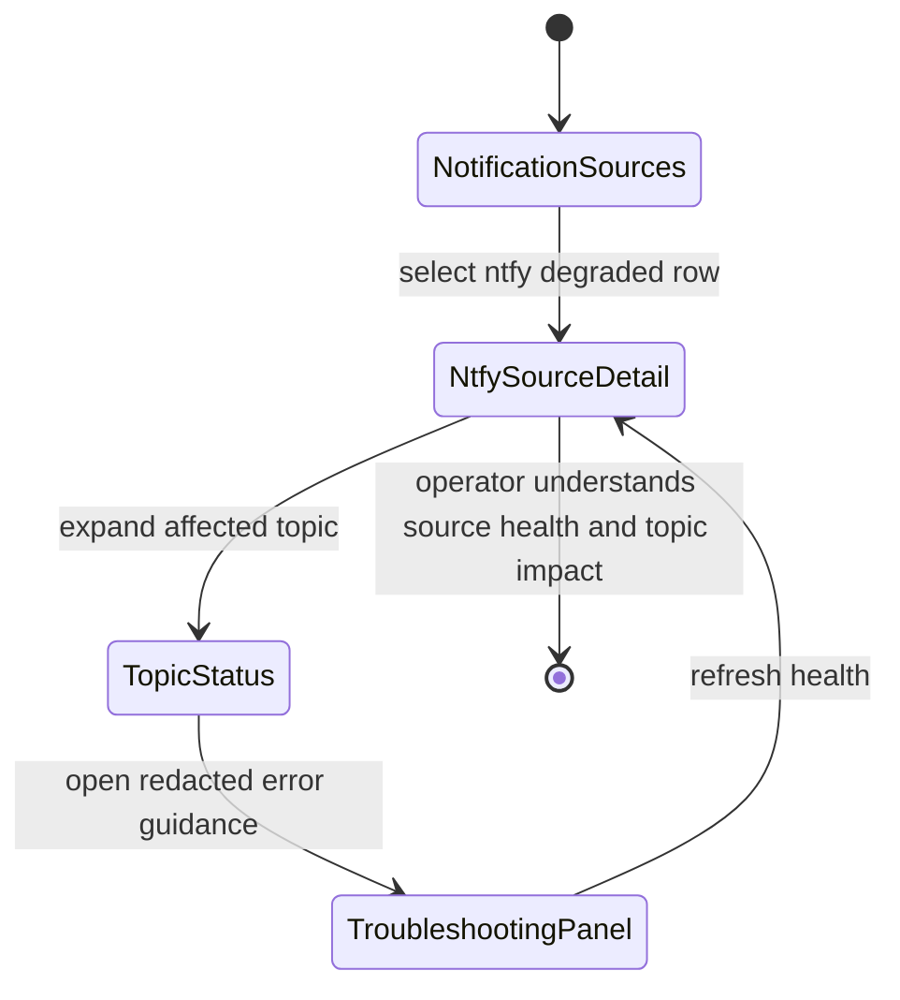
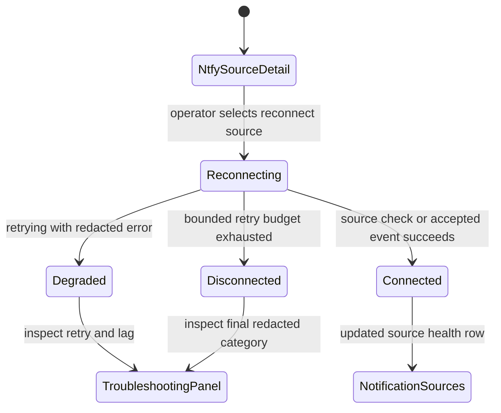
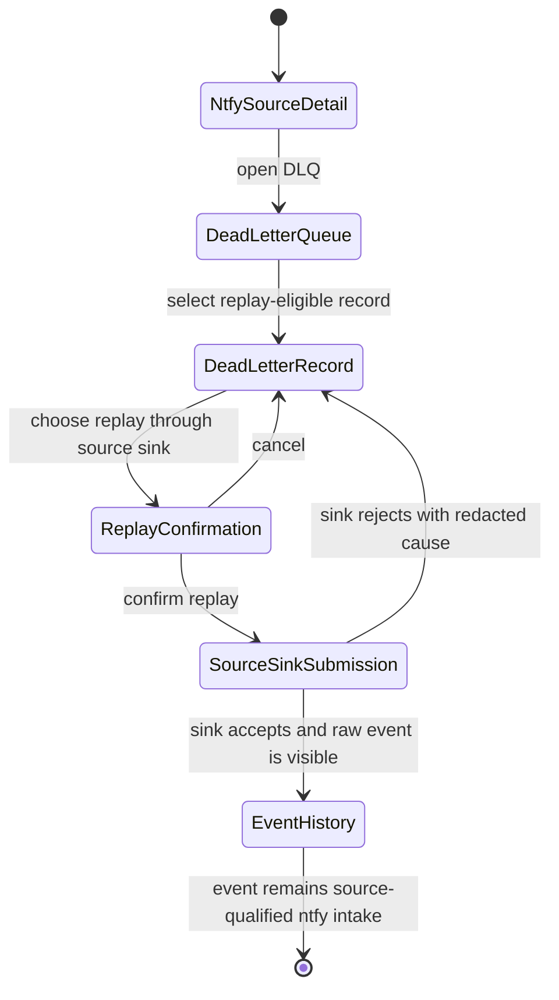
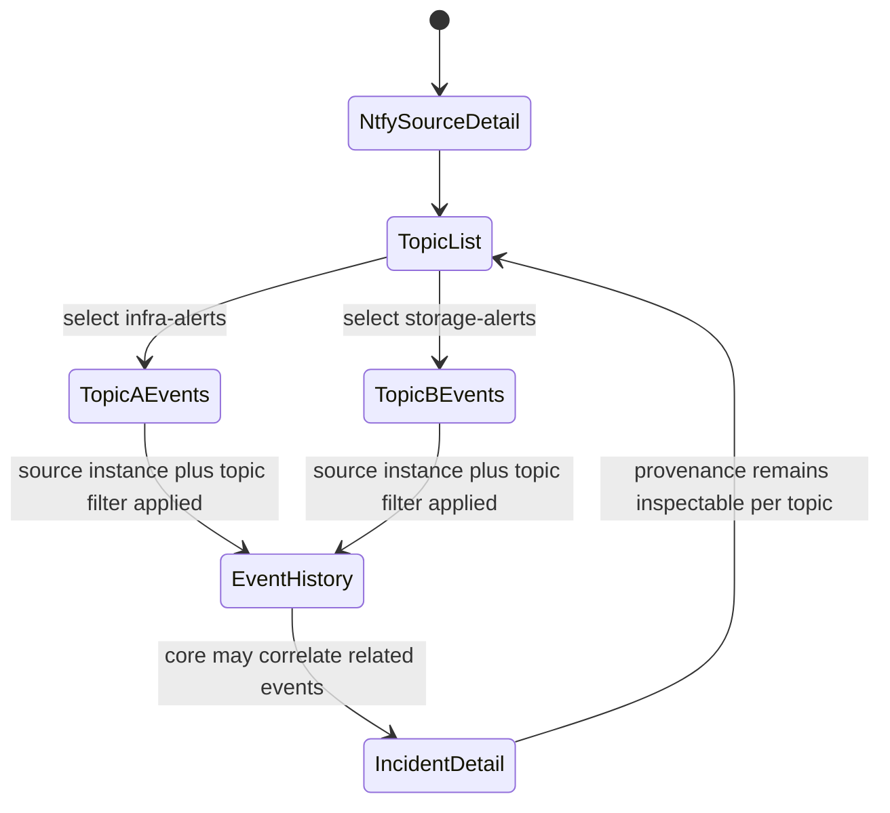
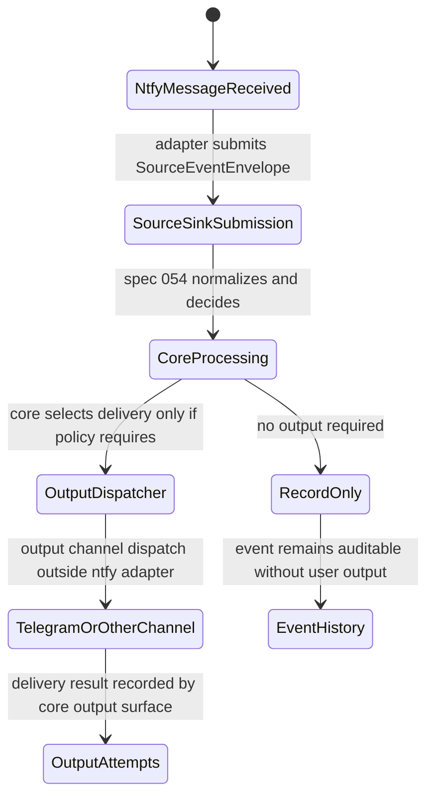

# Feature: 055 Notification Source ntfy Adapter

**Status:** Done (certified per state.json)

## Status

Blocked for final artifact certification only. The concrete ntfy notification source adapter has been implemented and spec-review recertification found the runtime behavior aligned with this contract. Parent state remains `blocked` until validate-owned certification metadata, done-mode artifact-lint, traceability, and state-transition guard checks are rerun after governance reconciliation. The adapter plugs into the source-neutral Notification Intelligence Handler Service from spec 054; it does not duplicate core notification processing, create a separate ntfy incident model, or forward ntfy messages directly to Telegram or any other output channel.

## Problem Statement

Spec 054 gives Smackerel a source-neutral notification intelligence handler: adapters submit source events, the core preserves raw input, normalizes events, classifies severity/domain/intent, correlates incidents, applies safe reaction policy, and routes redacted output through channel abstractions.

Smackerel still needs a concrete ntfy source implementation so self-hosted operators can subscribe to ntfy topics such as `self-hosted-alerts` and bring those notifications into the same intelligent handling pipeline. Without a dedicated adapter spec, ntfy risks becoming a one-off forwarding path: ntfy JSON parsing, topic auth, reconnect logic, severity mapping, dead-letter handling, and output behavior could drift into the core service or become hardwired to Telegram. That would violate the source-neutral contract established by spec 054.

This feature turns ntfy into a thin, source-qualified adapter. It owns ntfy transport and payload translation only. All classification, correlation, suppressions, approvals, output routing, and smart reactions remain in the spec 054 core.

## Current Capability Map

| Capability | Existing Surface | Current Status | Gap for Spec 055 |
|------------|------------------|----------------|------------------|
| Source-neutral notification core | `internal/notification.SourceAdapter`, `SourceEventSink`, `SourceEventEnvelope`, and `SourceHealthReport` | Present in spec 054 implementation | Spec 055 consumes the contract through the implemented ntfy adapter. |
| Raw and normalized notification pipeline | `internal/notification.Service.SubmitSourceEvent` and `Process` | Present | Implemented ntfy mapping submits message events as `SourceEventEnvelope` values through the source sink. |
| Source health model | `SourceHealthConnected`, `SourceHealthDisconnected`, `SourceHealthDegraded` plus redacted health reporting | Present | Implemented ntfy health covers connection, subscription, retry, lag, dead-letter pressure, and redacted failure state. |
| Core ntfy boundary guard | `internal/notification/no_ntfy_core_dependency_test.go` and source contract tests | Present | Implemented guard coverage keeps ntfy code outside the core package and preserves source-neutral processing. |
| Operator source status API | `/api/notifications/sources` documented in `docs/API.md` plus adapter-owned ntfy detail/reconnect/dead-letter/replay routes | Present | Implemented ntfy source instances appear through source health and authenticated ntfy operational APIs. |
| Core notification config | `notification_intelligence`, `notification_outputs`, and generated `NTFY_SOURCES_JSON` from SST-managed config | Present | Implemented ntfy configuration is adapter-owned, explicit, and fail-loud; core notification blocks remain source-neutral. |
| ntfy source adapter | `internal/notification/source/ntfy` with runtime startup and API wiring | Present | Current blocker is artifact certification reconciliation, not a missing adapter implementation. |

## Dependency On Spec 054

Spec 055 depends on spec 054 and cannot stand alone.

| Spec 054 Contract | Spec 055 Obligation |
|-------------------|---------------------|
| `SourceAdapter` lifecycle | The ntfy adapter implements `SourceType()`, `SourceForm()`, `InstanceID()`, `Connect`, `Start`, `Health`, and `Stop`. |
| `SourceEventSink` | The ntfy adapter submits events only through `SubmitSourceEvent` and reports health only through `ReportSourceHealth`. |
| `SourceEventEnvelope` | Every ntfy message event becomes a source envelope with raw payload, delivery metadata, source-specific fields, mapping hints, and loop metadata when available. |
| Raw-before-normalized persistence | The adapter must not claim accepted ingest unless the core sink accepts and stores the raw event path. |
| Core classification/correlation/decisioning | The adapter must not classify, correlate, suppress, approve, act, or dispatch output directly. |
| Source health state | ntfy connection status, retries, lag, and dead-letter pressure must reduce to connected, degraded, or disconnected with redacted error categories. |
| Output channel separation | ntfy is a source adapter here. Any ntfy reply or Telegram message is an output channel concern outside this source adapter. |

Spec 054 remains the owner of the normalized notification model, incident model, decision model, safe reaction policy, output dispatcher, operator API, and loop guard. Spec 055 owns ntfy connection configuration, subscription mechanics, topic selection, ntfy event parsing, ntfy metadata preservation, reconnect behavior, lag reporting, and adapter conformance.

## Outcome Contract

**Intent:** Smackerel can subscribe to explicitly configured ntfy topics, ingest ntfy JSON events as source-qualified notification events, preserve ntfy-specific context for audit and enrichment, and hand every accepted event to the spec 054 core pipeline for classification, correlation, handling, escalation, approval, and output routing.

**Success Signal:** An operator enables an ntfy source instance for one or more explicitly configured topics, observes connected source health, sends a representative ntfy JSON message to a subscribed topic, and sees the event appear in the spec 054 raw and normalized notification pipeline with source type `ntfy`, the configured source instance ID, topic metadata, ntfy event ID, ntfy priority/tags/title/message fields preserved, and a core-generated incident/decision path with no direct Telegram forwarding and no ntfy-specific branch inside core notification logic.

**Hard Constraints:**

- Spec 055 must depend on and conform to the spec 054 source adapter contract.
- ntfy is a concrete notification source adapter, not the core notification model.
- The adapter must not duplicate classification, deduplication, correlation, suppression, approval, action, escalation, or output-channel behavior.
- The adapter must not call Telegram or any output channel directly.
- Enabled ntfy source instances must have explicit configuration for source instance identity, transport mode, topic set, source form, endpoint identity, auth secret references when required, and metadata safe for operator display.
- No ntfy endpoint, topic, token, credential, username, password, operator hostname, or deployment topology may be hardcoded.
- Missing required ntfy configuration must fail loudly for that source instance and report redacted disconnected health.
- Secret values must remain in the secret-management path. Adapter config and source health may expose only secret reference names and redacted metadata.
- The adapter must preserve the full ntfy JSON event as raw payload before normalization.
- The adapter must preserve ntfy-specific fields in source-specific metadata, including recognized fields and unknown fields that are safe to retain.
- Mapping hints may guide normalization, but core policy must operate on normalized fields and not on ntfy-specific field names.
- Reconnect, retry, lag, and dead-letter behavior must be bounded, auditable, and visible through source health or adapter-owned operational records.
- The adapter must support multiple ntfy source instances and multiple topics without merging their identities.
- Loop prevention metadata must be passed through when ntfy receives events that originated from Smackerel output or actions.

**Failure Condition:** The feature fails if ntfy messages bypass the spec 054 sink, if raw ntfy JSON is not durably preserved, if ntfy-specific fields drive core decision branches directly, if the adapter forwards messages to Telegram, if missing config is hidden by defaults, if credentials appear in logs or source status, if reconnect/dead-letter failures are invisible, or if events from multiple ntfy topics or instances cannot be traced back to their exact source identity.

## Product Principle Alignment

| Principle | Alignment |
|-----------|-----------|
| Observe First, Ask Second | ntfy events are observed, recorded, normalized, and processed by the core before the user is interrupted. |
| Source-Qualified Processing | ntfy topic, event ID, priority, tags, attachment/action metadata, and transport details are preserved as source context. |
| One Graph, Many Views | ntfy events enter the existing notification and incident graph instead of creating an ntfy-specific silo. |
| Invisible By Default, Felt Not Heard | The adapter never forwards every ntfy event; the core decides when silence, diagnosis, escalation, or approval is warranted. |
| Trust Through Transparency | Operators can inspect which ntfy source instance produced an event, how it was normalized, and what the core decided. |

## Source Boundary

### Owned By Spec 055

- ntfy source instance configuration requirements and validation rules.
- ntfy subscription transport for streaming and/or webhook mode as selected by design.
- Explicit topic subscription handling, including topics such as `self-hosted-alerts` when configured by the operator.
- ntfy JSON event parsing and validation.
- Preservation of ntfy fields, unknown safe fields, delivery metadata, and raw payload references.
- Mapping from ntfy event shape into `SourceEventEnvelope`, including mapping hints for title, body, severity, tags, subject, service, domain, and intent when the source provides enough signal.
- ntfy connection health, heartbeat/keepalive interpretation, reconnect behavior, retry count, lag signals, and dead-letter behavior.
- Adapter conformance tests proving ntfy submits only through the spec 054 sink.

### Provided By Spec 054

- Source registry, source identity, and source health state model.
- Raw event persistence and normalized notification persistence.
- Classification, confidence, deduplication, incident correlation, suppressions, decisions, approvals, action policy, output dispatch, and loop guard.
- Operator APIs under `/api/notifications/*` for source health, manual ingest, event history, incidents, approvals, summaries, and output attempts.
- Redaction guard and core audit records.

### Forbidden Coupling

- No ntfy-specific imports, field checks, incident states, decision branches, approval behavior, or output behavior in core notification packages.
- No direct Telegram forwarding from the ntfy adapter.
- No adapter-owned incident store writes, classification writes, action execution, approval creation, suppression creation, or output delivery attempts.
- No hardcoded ntfy server URL, topic, auth token, self-hosted hostname, Tailscale identity, port, or operator-specific path.
- No runtime fallback credentials, fallback topics, fallback endpoint, or fallback output channel.

## ntfy Event Preservation Contract

The adapter must preserve recognized ntfy JSON fields when present and retain safe unknown fields for audit. The contract below describes required business behavior rather than a final storage schema.

| ntfy Field Or Concept | Preservation Requirement | Normalization Hint |
|-----------------------|--------------------------|--------------------|
| `id` | Store as source event ID when present | Used as `source_event_id` with origin `source` |
| `time` | Preserve as source event timestamp when valid | Used as `event_timestamp` |
| `event` | Preserve event type such as message, keepalive, open, or poll request | Only message-like events become core notifications; lifecycle events update health |
| `topic` | Preserve exact topic name as delivery metadata | May contribute to subject/service mapping when configured |
| `title` | Preserve source field | May become normalized title with derivation recorded |
| `message` | Preserve source field and raw payload | May become normalized body after redaction |
| `priority` | Preserve source priority | May map to severity hint; core classifier remains authoritative |
| `tags` | Preserve source tags | May map to source tags with provenance |
| `click`, `icon`, `markdown` | Preserve as safe source-specific fields when present | Must not create actions by themselves |
| `attachment` / `attach` | Preserve metadata without fetching unsafe content by default | May enrich body or source-specific fields only after safety checks |
| `actions` | Preserve action definitions as source-specific metadata | Must not execute actions directly |
| Headers or webhook metadata | Preserve non-secret delivery metadata | May support traceability and idempotency |
| Unknown fields | Preserve safe fields with redaction and size bounds | Must not drive core policy without explicit mapping |

Lifecycle events such as keepalive/open/poll-request signals are source-health inputs. They must not become user-facing notifications unless the adapter receives a valid message-like event or a configured adapter health failure requires core ingestion as an operational event.

## Actors & Personas

| Actor | Description | Key Goals | Permissions |
|-------|-------------|-----------|-------------|
| Operator | Self-hosted Smackerel operator enabling ntfy topics as notification sources | Configure ntfy source instances, verify health, diagnose ingest failures | Can manage source config through SST and inspect redacted health/status |
| Smackerel User | Person relying on Smackerel to understand notification meaning | Receive only meaningful escalations and inspect source-qualified history | Can inspect notifications, incidents, and decisions surfaced by spec 054 |
| ntfy Source Adapter | The concrete adapter defined by this spec | Subscribe to topics, parse ntfy events, preserve source context, submit envelopes | Can read configured ntfy topics and submit source events/health only |
| ntfy Server | External or self-hosted notification broker | Publish topic events to subscribed clients | Sends events; has no authority inside Smackerel policy |
| Notification Intelligence Handler | Core service from spec 054 | Normalize, classify, correlate, decide, and dispatch output | Owns all core processing after adapter submission |
| Output Channel | Dashboard, Telegram, digest, webhook, ntfy reply, or another channel | Deliver redacted core decisions | Receives output dispatches from core only; cannot act as the ntfy source adapter |
| Source Health Observer | Operator-facing status surface | Show connected, degraded, disconnected, lag, retry, and dead-letter signals | Reads redacted source health via existing source status contracts |

## Use Cases

### UC-055-001: Configure An ntfy Source Instance

- **Actor:** Operator
- **Preconditions:** Spec 054 notification intelligence is enabled and the operator has a valid ntfy endpoint and topic set.
- **Main Flow:**
  1. Operator declares an ntfy source instance with explicit instance identity, source form, topics, endpoint identity, auth secret reference names when required, and redacted display metadata.
  2. Adapter validates that all required fields are present and non-empty.
  3. Adapter reports disconnected health with redacted error categories when configuration is invalid.
  4. Adapter registers the source as `source_type="ntfy"` with the spec 054 source registry only when identity and source form are valid.
- **Alternative Flows:**
  - Auth is not required for a configured topic: the source explicitly declares no credential use through an approved non-secret config flag, not by falling back silently.
  - Duplicate source instance ID exists: registration fails loudly and no events are accepted under ambiguous identity.
- **Postconditions:** The ntfy source instance has one unambiguous source identity and no secret values are stored in source status.

### UC-055-002: Subscribe To Configured ntfy Topics

- **Actor:** ntfy Source Adapter
- **Preconditions:** Source instance configuration is valid and enabled.
- **Main Flow:**
  1. Adapter connects to the configured ntfy transport.
  2. Adapter subscribes only to explicitly configured topics.
  3. Adapter interprets successful connection, open, keepalive, or first message signals as source health evidence.
  4. Adapter reports connected health after a real source check or event.
- **Alternative Flows:**
  - Connection fails: adapter reports disconnected or degraded health with a redacted error category.
  - The source closes the stream: adapter enters bounded reconnect behavior and reports degraded health until recovery or final disconnection.
- **Postconditions:** The source health API can show whether the ntfy source is connected, degraded, or disconnected.

### UC-055-003: Ingest A Message Event Through The Core Sink

- **Actor:** ntfy Source Adapter
- **Preconditions:** Adapter is connected and receives a valid ntfy message event.
- **Main Flow:**
  1. Adapter stores the full JSON event in the source envelope raw payload.
  2. Adapter maps ntfy identity, topic, timestamp, title, message, priority, tags, and delivery metadata into `SourceEventEnvelope` fields.
  3. Adapter submits the envelope through `SourceEventSink.SubmitSourceEvent`.
  4. Core handler stores the raw event, normalizes the notification, classifies, correlates, decides, and records the result.
  5. Adapter records acceptance status from the sink receipt.
- **Alternative Flows:**
  - Source event ID is missing: adapter marks it absent and lets spec 054 derive deterministic identity.
  - Mapping hints are partial: core normalization proceeds with recorded derivation and errors where applicable.
- **Postconditions:** The ntfy event appears as a source-qualified raw event and normalized notification in the spec 054 pipeline.

### UC-055-004: Preserve ntfy Source Fields Without Core Branching

- **Actor:** Notification Intelligence Handler
- **Preconditions:** Adapter submitted an ntfy envelope containing priority, tags, attachment, action, and unknown fields.
- **Main Flow:**
  1. Adapter places ntfy-specific data in source-specific fields and delivery metadata.
  2. Adapter supplies mapping hints only for normalized fields the core already understands.
  3. Core classifier and decision logic operate on normalized severity, domain, intent, subject, service, tags, and incident history.
  4. Operator can inspect source-specific fields for audit without those fields becoming core policy branches.
- **Alternative Flows:**
  - An ntfy action field is present: it is preserved but never executed by the adapter.
  - Attachment metadata is present: it is preserved and redacted as required; unsafe fetches are not automatic.
- **Postconditions:** ntfy context is retained for transparency without coupling the core to ntfy.

### UC-055-005: Reconnect And Report Lag

- **Actor:** ntfy Source Adapter
- **Preconditions:** Adapter is subscribed and then loses connectivity or falls behind.
- **Main Flow:**
  1. Adapter detects transport failure, stalled keepalive, or lag signal.
  2. Adapter increments retry/lag counters within bounded policy.
  3. Adapter reports degraded health with redacted error kind and last successful event/check time.
  4. Adapter reconnects and resumes event submission without duplicating already accepted events.
  5. Adapter reports connected health only after a successful source check or accepted event.
- **Alternative Flows:**
  - Reconnect budget is exhausted: adapter reports disconnected health.
  - Events cannot be replayed by the ntfy transport: adapter reports possible gap metadata without fabricating missed events.
- **Postconditions:** Operator can distinguish healthy subscription, degraded retrying, disconnected failure, and possible event gap.

### UC-055-006: Dead-Letter Invalid Or Unaccepted ntfy Events

- **Actor:** ntfy Source Adapter
- **Preconditions:** Adapter receives malformed JSON, unsupported event shape, oversize payload, redaction failure, or sink rejection.
- **Main Flow:**
  1. Adapter records a dead-letter item with redacted cause, source identity, topic when known, observed timestamp, and payload hash or safe payload reference.
  2. Adapter reports degraded health when dead-letter pressure crosses configured thresholds.
  3. Adapter does not drop repeated invalid events silently.
  4. Adapter does not turn invalid payloads into successful notifications.
- **Alternative Flows:**
  - Payload contains suspected secrets: dead-letter record stores redacted reason and hash, not plaintext secret content.
  - Core sink is temporarily unavailable: adapter retries within bounded policy before dead-lettering.
- **Postconditions:** Failures are inspectable and no invalid ntfy event is disguised as successful ingest.

### UC-055-007: Preserve Loop Metadata

- **Actor:** ntfy Source Adapter
- **Preconditions:** An ntfy event contains metadata indicating it originated from Smackerel output or an action result.
- **Main Flow:**
  1. Adapter preserves origin, correlation, or loop metadata in the source envelope when available.
  2. Adapter submits the event to the core sink normally.
  3. Spec 054 loop guard decides whether to suppress actionable re-entry.
- **Alternative Flows:**
  - Origin metadata is absent: core loop guard still evaluates content and recent output origins using available signals.
- **Postconditions:** The adapter does not create an output-to-input reaction loop.

### UC-055-008: Run Multiple ntfy Instances And Topics

- **Actor:** Operator
- **Preconditions:** Two ntfy source instances or multiple topics are configured.
- **Main Flow:**
  1. Each configured source instance registers with a distinct source instance ID.
  2. Each event preserves exact topic and source instance identity.
  3. Core incident correlation may relate events across topics or instances, but source provenance remains distinct.
- **Alternative Flows:**
  - Same topic appears in two instances: source instance identity still disambiguates provenance.
  - Duplicate event ID appears across different topics: topic and instance metadata prevent incorrect identity collapse.
- **Postconditions:** Operators can trace every event to the exact ntfy instance and topic.

## User Scenarios (Gherkin)

```gherkin
Scenario: SCN-055-001 Enabled ntfy source requires explicit configuration
  Given spec 054 notification intelligence is enabled
  And an ntfy source instance is enabled
  When the instance is missing an explicit source instance ID, transport mode, topic set, endpoint identity, or required secret reference
  Then the adapter refuses to run that source instance
  And source health is reported as disconnected with redacted error details
  And no fallback topic, endpoint, credential, or output channel is used
```

```gherkin
Scenario: SCN-055-002 ntfy message enters the spec 054 raw and normalized pipeline
  Given an enabled ntfy source instance subscribes to the configured topic `self-hosted-alerts`
  When ntfy emits a valid JSON message event with id, time, topic, title, message, priority, and tags
  Then the adapter submits one `SourceEventEnvelope` with `source_type` set to `ntfy`
  And the core stores the raw ntfy JSON before normalization
  And the core creates a normalized notification linked to the raw event
```

```gherkin
Scenario: SCN-055-003 ntfy fields are preserved without becoming core policy branches
  Given an ntfy message includes priority, tags, attachment metadata, actions, and unknown safe fields
  When the adapter submits the event to the source sink
  Then recognized and safe unknown ntfy fields are preserved in delivery metadata or source-specific fields
  And mapping hints use only normalized fields understood by spec 054
  And core classification and decisioning do not branch on ntfy-only field names
```

```gherkin
Scenario: SCN-055-004 ntfy priority and tags provide hints but not final authority
  Given an ntfy event has high priority and operational tags
  When the adapter maps the event into the core source envelope
  Then source priority and tags are preserved with provenance
  And the core classifier produces the final severity, domain, and intent decision
  And the classification rationale records the signals used
```

```gherkin
Scenario: SCN-055-005 ntfy keepalive and open events update source health without creating notifications
  Given an ntfy source stream emits open or keepalive lifecycle events
  When the adapter observes those events
  Then the adapter updates connected health or last successful check time
  And no normalized user notification is created for lifecycle-only events
```

```gherkin
Scenario: SCN-055-006 transient ntfy connection loss becomes degraded health and then recovers
  Given an ntfy source instance is connected and has accepted events
  When the ntfy connection drops and reconnect succeeds within bounded retry policy
  Then source health becomes degraded while retrying
  And retry count and last redacted error are visible through source health
  And source health returns to connected only after a successful source check or accepted event
```

```gherkin
Scenario: SCN-055-007 exhausted reconnect budget becomes disconnected health
  Given an ntfy source instance cannot reconnect after bounded retry attempts
  When the retry budget is exhausted
  Then source health becomes disconnected
  And last event time, last successful check time, retry count, and redacted error category remain inspectable
  And the adapter does not fabricate a connected state
```

```gherkin
Scenario: SCN-055-008 malformed ntfy JSON is dead-lettered without successful ingest
  Given an ntfy source instance receives malformed JSON or an unsupported event shape
  When the adapter cannot safely parse the event
  Then a dead-letter record captures source identity, topic when known, observed time, payload hash or safe payload reference, and redacted reason
  And the event is not reported as accepted by the core pipeline
  And source health reflects degraded status when dead-letter pressure crosses policy thresholds
```

```gherkin
Scenario: SCN-055-009 core sink failure is retried and then dead-lettered
  Given an ntfy event is valid
  And the spec 054 source sink is temporarily unavailable
  When adapter submission fails
  Then the adapter retries within bounded policy
  And if acceptance still fails, the event is dead-lettered with redacted cause
  And the adapter never dispatches the event directly to an output channel as a workaround
```

```gherkin
Scenario: SCN-055-010 multiple topics preserve exact topic provenance
  Given one ntfy source instance subscribes to multiple explicitly configured topics
  When messages arrive from different topics
  Then every envelope preserves the exact ntfy topic in delivery metadata
  And normalized notifications keep the same source instance ID
  And incident correlation may relate events without losing per-topic provenance
```

```gherkin
Scenario: SCN-055-011 multiple ntfy source instances remain distinct
  Given two ntfy source instances subscribe to overlapping topics
  When both receive an event with the same source event ID
  Then the events remain distinct by source instance ID and topic metadata
  And the core can correlate them only through explicit incident correlation logic
```

```gherkin
Scenario: SCN-055-012 ntfy adapter cannot become ntfy-to-Telegram forwarding
  Given an ntfy message qualifies for user-facing escalation
  When the adapter submits the event to the core sink
  Then the adapter performs no Telegram call and no output-channel dispatch
  And the spec 054 decision/output dispatcher decides whether and where to notify the user
```

```gherkin
Scenario: SCN-055-013 ntfy-originated loop metadata is preserved for the core loop guard
  Given an ntfy event contains metadata tying it to a recent Smackerel output or action result
  When the adapter maps the event
  Then loop metadata is included in the source envelope
  And the spec 054 loop guard decides whether to suppress actionable re-entry
```

```gherkin
Scenario: SCN-055-014 ntfy auth failure never exposes credential values
  Given an ntfy source instance uses a secret-managed credential reference
  When ntfy authentication fails
  Then source health reports a redacted authentication error category
  And logs, source status, dead-letter records, and operator APIs contain no credential value
```

## Functional Requirements

- **FR-055-001 Source Contract Conformance:** The ntfy adapter must implement the spec 054 `SourceAdapter` lifecycle and submit events only through `SourceEventSink`.
- **FR-055-002 Source Identity:** Every ntfy source instance must use `source_type="ntfy"`, an explicit source instance ID, and a valid source form.
- **FR-055-003 Explicit Topic Configuration:** The adapter must subscribe only to explicitly configured topics and must preserve topic identity for every event.
- **FR-055-004 No Runtime Defaults:** The adapter must fail loudly for missing required source identity, endpoint identity, transport mode, topics, enabled flag, config hash, redacted metadata, or required secret references.
- **FR-055-005 Secret Reference Discipline:** ntfy auth material must be represented by secret reference names only; secret values must not appear in source status, logs, raw payload metadata, dead-letter records, or API responses.
- **FR-055-006 ntfy JSON Preservation:** Every accepted ntfy message event must preserve the full raw JSON payload before normalization.
- **FR-055-007 Event Type Handling:** Message-like ntfy events are eligible for notification ingest; lifecycle events such as open or keepalive update health without creating user notifications.
- **FR-055-008 Field Preservation:** The adapter must preserve ntfy id, time, event, topic, title, message, priority, tags, click/icon/markdown fields, attachment metadata, action definitions, safe headers, and safe unknown fields when present.
- **FR-055-009 Mapping Hints:** The adapter may provide mapping hints for normalized title, body, severity, subject, service, domain, intent, and tags, but those hints must not be policy decisions.
- **FR-055-010 Core Processing Boundary:** Classification, deduplication, correlation, incident lifecycle, suppressions, approvals, actions, and output delivery must remain exclusively in spec 054 core behavior.
- **FR-055-011 Health Reporting:** The adapter must report connected, degraded, or disconnected health with last event time, last successful check time, retry count, redacted error kind, and observed time.
- **FR-055-012 Reconnect Behavior:** ntfy stream or webhook connectivity failures must use bounded retry behavior and must not fabricate connected health.
- **FR-055-013 Lag Visibility:** The adapter must expose lag or possible event-gap indicators when transport signals show stalled delivery, missed replay, or delayed processing.
- **FR-055-014 Dead-Letter Behavior:** Malformed, unsupported, oversize, redaction-failed, or repeatedly unaccepted events must be dead-lettered with redacted cause and source provenance.
- **FR-055-015 Idempotency:** Duplicate ntfy events must not create duplicate raw accepted notifications when the source event identity and source instance identity prove they are the same event.
- **FR-055-016 Multi-Instance Support:** Multiple ntfy source instances and overlapping topic subscriptions must remain distinguishable by source instance identity and topic metadata.
- **FR-055-017 Attachment And Action Safety:** ntfy attachment and action fields must be preserved as metadata and must not trigger automatic fetches or executions by the adapter.
- **FR-055-018 Loop Metadata:** When source data contains Smackerel-origin metadata, the adapter must pass it through so spec 054 loop prevention can evaluate it.
- **FR-055-019 Output Channel Separation:** The adapter must not call Telegram, dashboard output, digest output, webhook output, ntfy reply output, or any other delivery channel directly.
- **FR-055-020 Operator Observability:** Operators must be able to inspect ntfy source status through existing source health surfaces without requiring ntfy-specific core APIs.
- **FR-055-021 Conformance Evidence:** Tests must prove that ntfy events become raw events and normalized notifications through the same source-contract conformance path used by non-ntfy sources.
- **FR-055-022 Core Dependency Guard:** Tests must prove core notification production code still has no ntfy-specific dependency after the adapter is added.

## Non-Functional Requirements

- **Reliability:** The adapter must tolerate transient ntfy connectivity failures with bounded retries, redacted health transitions, and no silent event loss claims.
- **Auditability:** Every accepted event, rejected event, dead-letter item, health transition, retry budget exhaustion, and lag signal must preserve source instance identity and topic provenance.
- **Security:** Credentials must remain secret-managed. No plaintext ntfy auth values, passwords, tokens, or operator-specific topology may be committed, logged, or exposed through APIs.
- **Privacy:** Raw payloads and source-specific fields must pass through redaction and size controls before any operator-facing display or output-channel delivery.
- **Configurability:** Endpoint identity, topics, source instance identity, transport mode, auth reference names, and safe display metadata must come from explicit configuration generated through the repo config pipeline.
- **No Defaults:** The adapter must not infer fallback topics, fallback endpoints, fallback auth, fallback instance IDs, fallback output channels, or fallback health success.
- **Scalability:** The adapter must support multiple topics and multiple source instances without identity collisions or topic provenance loss.
- **Backpressure:** The adapter must surface lag and dead-letter pressure instead of silently buffering unbounded events.
- **Source Agnosticity:** Adding ntfy must not require modifying spec 054 classification, correlation, decision, action, approval, or output dispatch logic for ntfy-specific branches.
- **Operator Safety:** ntfy action definitions and attachments must never become automatic actions without passing through spec 054 risk and approval policy.
- **Testability:** The adapter must be testable with representative ntfy JSON events, connection failures, auth failures, malformed payloads, duplicate events, multiple topics, and loop-origin metadata.

## UI Wireframes

### UX Boundary

Spec 055 UX extends the spec 054 notification-source operator surfaces with ntfy adapter visibility and bounded source-control workflows. It does not define notification classification, incident policy, output-channel delivery, Telegram behavior, digest behavior, approval policy, or user-facing escalation copy. Those remain owned by spec 054 core surfaces and output-channel implementations.

Operator controls in this section are source-adapter controls only: refresh health, inspect subscriptions, reconnect the ntfy source, inspect dead-letter records, and replay eligible ntfy source events back through the source sink. They must not deliver messages to Telegram or any other output channel.

### Screen Inventory

| Screen | Actor(s) | Status | Scenarios Served |
|--------|----------|--------|------------------|
| Notification Sources With ntfy Row | Operator, Source Health Observer | Modify spec 054 `/notifications/sources` surface | UC-055-001, UC-055-002, UC-055-005, UC-055-008, SCN-055-001, SCN-055-006, SCN-055-007, SCN-055-010, SCN-055-011 |
| ntfy Source Detail | Operator, Source Health Observer | New drill-in from generic source health | UC-055-002, UC-055-003, UC-055-005, UC-055-006, UC-055-008, SCN-055-002, SCN-055-005, SCN-055-006, SCN-055-007, SCN-055-008, SCN-055-010, SCN-055-014 |
| ntfy Dead-Letter Queue | Operator | New adapter-owned operational review within source detail | UC-055-006, UC-055-009, SCN-055-008, SCN-055-009, SCN-055-014 |
| ntfy Replay Confirmation | Operator | New confirmation step for adapter replay controls | UC-055-006, UC-055-009, SCN-055-008, SCN-055-009, SCN-055-012, SCN-055-013 |
| ntfy Troubleshooting Panel | Operator | New contextual help panel within source detail | UC-055-001, UC-055-002, UC-055-005, UC-055-006, SCN-055-001, SCN-055-006, SCN-055-007, SCN-055-014 |

### Screen: Notification Sources With ntfy Row
**Actor:** Operator, Source Health Observer | **Route:** `/notifications/sources` | **Status:** Modify

```
┌────────────────────────────────────────────────────────────────────────────┐
│ Search  Digest  Topics  Knowledge  Settings  Status  Notifications         │
├────────────────────────────────────────────────────────────────────────────┤
│ Notification Sources                                                       │
│ Source-neutral intake health. ntfy appears only as a source adapter row.    │
│                                                                            │
│ ┌──────────────┐ ┌──────────────┐ ┌──────────────┐ ┌──────────────┐       │
│ │ Connected 02 │ │ Degraded 01  │ │ Disconnected │ │ Dead-letter  │       │
│ │ healthy      │ │ retrying     │ │ 01           │ │ 03 pending   │       │
│ └──────────────┘ └──────────────┘ └──────────────┘ └──────────────┘       │
│                                                                            │
│ Filters: [All states v] [All source types v] [Search instance/topic...]    │
│                                                                            │
│ ┌──────────────────────────────────────────────────────────────────────┐   │
│ │ State        Source       Instance        Last event   Lag    Error  │   │
│ ├──────────────────────────────────────────────────────────────────────┤   │
│ │ connected    ntfy         self-hosted-alerts  2m ago       0s     -     │   │
│ │ degraded     ntfy         infra-alerts     41m ago      14m    auth  │   │
│ │ connected    manual       operator-note    3h ago       -      -     │   │
│ └──────────────────────────────────────────────────────────────────────┘   │
│                                                                            │
│ Selected source: ntfy / infra-alerts                                       │
│ Topics: infra-alerts, storage-alerts       Subscription: reconnecting      │
│ Last check: 09:42 UTC                       Retry count: 4                 │
│ [Open ntfy Source] [View Events] [View DLQ] [Export Redacted Snapshot]     │
└────────────────────────────────────────────────────────────────────────────┘
```

**Interactions:**
- Selecting an ntfy row shows the topic list, subscription status, lag, reconnect state, retry count, and redacted error category in the inline details panel.
- `Open ntfy Source` opens the ntfy Source Detail screen for the selected source instance.
- `View Events` opens the spec 054 Notification Inbox filtered by `source_type=ntfy` and the selected source instance; it does not bypass the raw/normalized pipeline.
- `View DLQ` opens the ntfy Dead-Letter Queue filtered to the selected source instance.
- `Export Redacted Snapshot` includes source type, source instance ID, source form, topic names, config hash, secret reference names, health state, lag, retry count, and redacted errors only.

**States:**
- Empty state: `No notification sources configured` with a note that source instances come from generated configuration and secret-managed references.
- Loading state: metric cards and rows use fixed-height skeletons; no connected state is inferred until health data loads.
- Error state: `Source health unavailable` with the latest health observation timestamp when available; stale data is labelled stale.

**Responsive:**
- Mobile: each source row becomes a card with state, source type, instance ID, subscription status, last event, lag, DLQ count, and redacted error visible before secondary actions.
- Tablet: table keeps state, source, instance, last event, and lag columns; topics and error details move into row disclosure.

**Accessibility:**
- Health state, subscription state, and lag are text labels and not color-only signals.
- The source table preserves header associations and mobile cards preserve field labels.
- Health updates are announced through a polite live region; fast retry-count changes are grouped to avoid noisy repeated announcements.

### Screen: ntfy Source Detail
**Actor:** Operator, Source Health Observer | **Route:** `/notifications/sources/{sourceInstanceId}` | **Status:** New

```
┌────────────────────────────────────────────────────────────────────────────┐
│ < Notification Sources                                                     │
├────────────────────────────────────────────────────────────────────────────┤
│ ntfy Source: infra-alerts                         State: degraded          │
│ Source form: stream · Config hash: [redacted hash] · Auth: [secret refs]   │
│ Boundary: source intake only; output channels are managed elsewhere.       │
│                                                                            │
│ ┌──────────────┐ ┌──────────────┐ ┌──────────────┐ ┌──────────────┐       │
│ │ Subscription │ │ Last event   │ │ Lag          │ │ Reconnect    │       │
│ │ reconnecting │ │ 41m ago      │ │ 14m behind   │ │ retry 4/8    │       │
│ └──────────────┘ └──────────────┘ └──────────────┘ └──────────────┘       │
│                                                                            │
│ Topic Subscriptions                                                        │
│ ┌──────────────────────────────────────────────────────────────────────┐   │
│ │ Topic            Status        Last event  Lag     Last error        │   │
│ ├──────────────────────────────────────────────────────────────────────┤   │
│ │ infra-alerts     connected     2m ago      0s      -                 │   │
│ │ storage-alerts   reconnecting  41m ago     14m     auth_failed       │   │
│ └──────────────────────────────────────────────────────────────────────┘   │
│                                                                            │
│ Last Accepted Event                                                        │
│ id: [ntfy event id] · topic: infra-alerts · raw stored: yes · normalized: yes│
│ title: [redacted title preview]                                             │
│                                                                            │
│ Adapter Controls                                                           │
│ [Refresh Health] [Reconnect Source] [Open Events] [Open DLQ] [Troubleshoot]│
└────────────────────────────────────────────────────────────────────────────┘
```

**Interactions:**
- `Refresh Health` requests the latest source-health view and preserves the current selected topic.
- `Reconnect Source` starts a bounded adapter reconnect attempt and immediately shows `reconnecting` with retry budget and last redacted error; it cannot mark connected until a source check or accepted event succeeds.
- Topic rows expand to show endpoint identity, transport mode, keepalive/open timing, last successful check, last event ID, lag category, and redaction note.
- `Open Events` navigates to the spec 054 event history filtered by source instance and selected topic.
- `Open DLQ` opens the ntfy Dead-Letter Queue; `Troubleshoot` opens the contextual troubleshooting panel.

**States:**
- Empty state: source exists but has no health report, showing `disconnected / no_health_report` with configuration identity and secret reference names.
- Loading state: health cards, topic rows, and last accepted event load independently; missing last event never implies an ingest gap unless health reports a gap.
- Error state: redacted error category and safe error text appear with first seen, last seen, retry count, and affected topic when known.

**Responsive:**
- Mobile: health cards stack in the order subscription, last event, lag, reconnect; topic rows become expandable cards; controls stay in a sticky action bar below the source summary.
- Tablet: topic table remains primary; last accepted event and adapter controls stack below it.

**Accessibility:**
- Reconnect state changes use `aria-live=polite` and never rely on spinners alone.
- Topic names, lag values, and retry budget are read as labelled values.
- Control buttons include source instance ID in accessible names, for example `Reconnect ntfy source infra-alerts`.

### Screen: ntfy Dead-Letter Queue
**Actor:** Operator | **Route:** `/notifications/sources/{sourceInstanceId}/dead-letters` | **Status:** New

```
┌────────────────────────────────────────────────────────────────────────────┐
│ < ntfy Source: infra-alerts                                                │
├────────────────────────────────────────────────────────────────────────────┤
│ ntfy Dead-Letter Queue                                                     │
│ Invalid, unsafe, oversize, redaction-failed, or unaccepted ntfy events.    │
│                                                                            │
│ Filters: [All topics v] [All causes v] [Replay eligible v] [Search hash]   │
│                                                                            │
│ ┌──────────────────────────────────────────────────────────────────────┐   │
│ │ Observed  Topic          Cause              Payload ref  Replay      │   │
│ ├──────────────────────────────────────────────────────────────────────┤   │
│ │ 09:42     storage-alerts auth_failed        sha256:...   no          │   │
│ │ 09:38     infra-alerts   malformed_json     sha256:...   no          │   │
│ │ 09:31     infra-alerts   sink_unavailable   sha256:...   yes         │   │
│ └──────────────────────────────────────────────────────────────────────┘   │
│                                                                            │
│ Selected Record                                                            │
│ Source instance: infra-alerts · Topic: infra-alerts · Event ID: [id/none]  │
│ Redacted cause: sink unavailable after bounded retry                       │
│ Payload: hash and safe preview only                                        │
│ Attempts: 3 · Last attempt: 09:34 UTC · Raw accepted: no                   │
│ [Replay Through Source Sink] [Open Troubleshooting] [Copy Redacted Ref]    │
└────────────────────────────────────────────────────────────────────────────┘
```

**Interactions:**
- Selecting a record reveals source provenance, redacted cause, payload hash or safe reference, attempts, retry budget outcome, and whether replay is eligible.
- `Replay Through Source Sink` is enabled only for replay-eligible records and opens ntfy Replay Confirmation.
- `Open Troubleshooting` focuses the troubleshooting panel on the selected cause category.
- `Copy Redacted Ref` copies source instance ID, topic, observed time, cause, and payload hash without raw secret material.

**States:**
- Empty state: `No dead-letter records for this ntfy source` while health and topic status remain available.
- Loading state: queue rows and selected record panel reserve stable space.
- Error state: queue load failure shows redacted diagnostic text and does not claim records are absent.

**Responsive:**
- Mobile: filters collapse into a labelled disclosure; queue rows become cards with observed time, topic, cause, replay eligibility, and action button.
- Tablet: selected record appears below the table rather than beside it.

**Accessibility:**
- Cause labels are textual categories and not icon-only.
- Replay eligibility is announced as `replay eligible` or `not replay eligible` in each row.
- Safe payload previews are collapsed by default and labelled with size and redaction state.

### Screen: ntfy Replay Confirmation
**Actor:** Operator | **Route:** `/notifications/sources/{sourceInstanceId}/dead-letters/{deadLetterId}/replay` | **Status:** New

```
┌────────────────────────────────────────────────────────────────────────────┐
│ Confirm ntfy Source Replay                                                 │
├────────────────────────────────────────────────────────────────────────────┤
│ Replay sends this ntfy source event back through SourceEventSink.           │
│ It does not send a Telegram message or any output-channel delivery.         │
│                                                                            │
│ Source instance: infra-alerts                                               │
│ Topic: infra-alerts                                                         │
│ Original cause: sink_unavailable                                            │
│ Payload reference: sha256:[hash]                                            │
│ Raw accepted before: no                                                     │
│ Replay idempotency key: [source instance + topic + source event/payload]    │
│                                                                            │
│ Expected result                                                             │
│ - raw ntfy payload is submitted through the spec 054 source sink             │
│ - core normalization and policy run only if the sink accepts the event       │
│ - duplicate raw accepted events are blocked by source identity               │
│                                                                            │
│ [Confirm Replay] [Cancel] [Open Dead-Letter Record]                         │
└────────────────────────────────────────────────────────────────────────────┘
```

**Interactions:**
- `Confirm Replay` requires an explicit operator confirmation and then returns to the dead-letter record with the new replay attempt status.
- `Cancel` returns without changing the dead-letter record.
- `Open Dead-Letter Record` returns to the selected record details.
- Replay attempts are adapter intake actions only; no Telegram, digest, webhook, or ntfy reply output is triggered directly by this control.

**States:**
- Empty state: if the record is no longer replay eligible, show the recorded reason and link back to the queue.
- Loading state: replay eligibility and idempotency key load before `Confirm Replay` is enabled.
- Error state: failed replay records redacted cause and retry status; the modal stays open with `Confirm Replay` disabled until the latest state is reloaded.

**Responsive:**
- Mobile: confirmation content is a full-page step with source identity and expected result above the action buttons.
- Compact viewport: expected result bullets remain visible before confirmation controls.

**Accessibility:**
- Confirmation focus starts on the heading and moves to the result status after submission.
- The warning that replay is not output delivery is plain text and read before the primary action.
- Buttons have unambiguous labels: `Confirm source replay`, `Cancel source replay`, and `Open dead-letter record`.

### Screen: ntfy Troubleshooting Panel
**Actor:** Operator | **Route:** `/notifications/sources/{sourceInstanceId}#troubleshooting` | **Status:** New

```
┌────────────────────────────────────────────────────────────────────────────┐
│ ntfy Troubleshooting                                                       │
├────────────────────────────────────────────────────────────────────────────┤
│ Source: ntfy / infra-alerts                         Current state: degraded│
│                                                                            │
│ Active Diagnosis                                                           │
│ ┌──────────────────────────────────────────────────────────────────────┐   │
│ │ Signal                    Value                                      │   │
│ ├──────────────────────────────────────────────────────────────────────┤   │
│ │ Subscription status       reconnecting                               │   │
│ │ Last successful check     09:42 UTC                                  │   │
│ │ Last event                09:03 UTC                                  │   │
│ │ Lag                       14m behind                                 │   │
│ │ Reconnect state           retry 4 of 8                               │   │
│ │ Last redacted error       authentication failed                      │   │
│ │ Dead-letter pressure      3 records, threshold crossed               │   │
│ └──────────────────────────────────────────────────────────────────────┘   │
│                                                                            │
│ Checklist                                                                  │
│ [ ] Secret reference names present, values not displayed                    │
│ [ ] Topic names match generated adapter config                              │
│ [ ] Endpoint identity reachable from runtime network                        │
│ [ ] Keepalive/open events observed or timeout category recorded             │
│ [ ] DLQ records reviewed before replay                                      │
│                                                                            │
│ [Refresh Health] [Reconnect Source] [Open Topic List] [Open DLQ]           │
└────────────────────────────────────────────────────────────────────────────┘
```

**Interactions:**
- Checklist items are read-only diagnostic prompts; operators do not mark them as completion evidence in this screen.
- `Refresh Health`, `Reconnect Source`, `Open Topic List`, and `Open DLQ` navigate or act on the source adapter only.
- Selecting an error category filters the dead-letter queue and topic list to the affected topic when known.
- Troubleshooting links never expose credential values; they show secret reference names and redaction notes.

**States:**
- Empty state: no active error shows `No current ntfy adapter issue` with links to topic list and recent accepted events.
- Loading state: diagnosis rows load as labelled skeletons; controls remain disabled until source instance identity is present.
- Error state: failed diagnostic fetch shows the last known redacted health report and labels it stale.

**Responsive:**
- Mobile: diagnosis rows stack as a definition list; checklist and controls are separate labelled sections.
- Tablet: diagnosis table remains full-width and checklist appears below it.

**Accessibility:**
- Checklist uses text labels and does not imply operator certification status.
- Redacted error text is concise and screen-reader visible.
- Navigation controls announce destination and preserve source instance context.

## User Flows

### User Flow: ntfy Source Health Investigation



### User Flow: ntfy Reconnect Without Output Dispatch



### User Flow: Dead-Letter Review And Replay



### User Flow: Multiple ntfy Topics Stay Distinct



### User Flow: ntfy Intake Boundary Versus Telegram Output



## Acceptance Criteria

- **AC-055-001:** A valid ntfy message event submitted through the adapter produces a spec 054 raw event and normalized notification with source type `ntfy` and the configured source instance ID.
- **AC-055-002:** The raw payload preserves the original ntfy JSON and the normalized record links back to that raw payload.
- **AC-055-003:** ntfy topic, event ID, event timestamp, title, message, priority, tags, attachment metadata, actions, and safe unknown fields are preserved with source-qualified provenance.
- **AC-055-004:** Missing required config fails the ntfy source instance loudly and reports disconnected health without using defaults.
- **AC-055-005:** Auth failures report redacted error categories and expose no credential values.
- **AC-055-006:** Lifecycle-only ntfy events update source health without creating normalized user notifications.
- **AC-055-007:** Transient connection failure reports degraded health, and recovery returns to connected only after a real source check or accepted event.
- **AC-055-008:** Exhausted reconnect budget reports disconnected health with retry count and redacted error details.
- **AC-055-009:** Malformed, unsupported, or repeatedly unaccepted events are dead-lettered with source provenance and are not marked as accepted ingest.
- **AC-055-010:** Multiple topics and multiple ntfy source instances preserve exact provenance and avoid identity collapse.
- **AC-055-011:** The adapter never dispatches directly to Telegram or any output channel.
- **AC-055-012:** Core notification production code remains free of ntfy-specific package dependencies and ntfy-specific policy branches.

## Implementation Readiness Notes For Owning Agents

- `bubbles.design` should define the ntfy adapter package boundary, transport mode selection, config schema, dead-letter persistence shape, lag metrics, and exact ntfy event parsing strategy while preserving the source boundary above.
- `bubbles.plan` should create scopes, scenario manifest entries, test plan rows, report scaffolding, and user validation checklist for the scenarios in this spec.
- Implementation planning must include unit, integration, e2e-api, stress, source-contract conformance, no-core-ntfy-dependency, no-direct-output-channel, redaction, reconnect, lag, dead-letter, and multi-instance tests.
- If artifact lint requires design, scopes, report, uservalidation, or scenario manifest before execution, those artifacts belong to their owning agents rather than this analyst run.
