# Design — Spec 061 Conversational Assistant (Transport-Agnostic)

**Owner:** `bubbles.design`
**Status ceiling:** `specs_hardened` (no code changes; planning-only)
**Workflow mode:** `product-to-planning`
**Depends on:** spec 044 (per-user bearer auth, chat→user mapping),
spec 054 (notification scheduler), spec 060 (PASETO scope claims),
existing `ml/` Python sidecar, existing `internal/telegram/bot.go`,
existing `/api/search` endpoint backed by pgvector.
**Replaces:** the high-level sketch previously at this path (preserved
in git history). The pre-revision Telegram-specific design at
`specs/061-telegram-assistant-mode/design.md` (also in git history)
provided source material for the capability-layer portions and was
mined where its content was transport-agnostic.

---

## 0. Design Brief (REQUIRED alignment checkpoint)

**Current state.** `internal/telegram/bot.go::handleMessage` is the
only conversational entry point Smackerel has. Every non-command,
non-special, non-media plain-text message is routed to
`handleTextCapture` → `POST /api/capture` and persisted as an `idea`
artifact. The `ml/` FastAPI sidecar is online and reachable via
`http://ml:8000` from the core process, but no code path currently
calls it for query/answer. PostgreSQL + pgvector backs `/api/search`.
Spec 054 ships a notification scheduler. Spec 044 owns the
`chat_id → user_id` mapping table. Spec 060 owns the PASETO scope
claim catalog.

**Target state.** Introduce a **transport-agnostic assistant capability
layer** (`internal/assistant/`) that owns ALL business logic — intent
router, skill registry, three v1 skills (retrieval, weather,
notifications), conversational state, source attribution, provenance
enforcement. Layer a **`TransportAdapter` interface** on top of that
capability with **one v1 reference implementation: Telegram**
(`internal/telegram/assistant_adapter/`). The Telegram adapter
intercepts the plain-text branch of `handleMessage`, translates to
`AssistantMessage`, calls `Assistant.Handle(ctx, msg)`, and renders
the returned `AssistantResponse` using Telegram-native widgets. When
the capability returns `captureRoute=true`, the Telegram adapter
delegates to the existing `handleTextCapture` path byte-for-byte.

**Patterns to follow.**
- Capability-foundation-first per
  `.github/skills/bubbles-capability-foundation-design/SKILL.md`:
  proportionality is satisfied on TWO axes simultaneously (≥3 skills
  share `Skill`; ≥1 v1 plus ≥3 planned future transports share
  `TransportAdapter`).
- NO-DEFAULTS / fail-loud SST per
  `.github/instructions/smackerel-no-defaults.instructions.md`. Every
  `assistant.*` key uses `${VAR:?...}` substitution.
- Test environment isolation per
  `.github/instructions/bubbles-test-environment-isolation.instructions.md`:
  integration/e2e tests use ephemeral PostgreSQL via the existing
  test compose project; mocks only at external transport / external
  provider boundaries.
- Existing module conventions: per-package `doc.go`, exported
  interfaces in `contracts.go`, table-driven tests in `*_test.go`.
- Reuse spec 054 scheduler directly for the notifications skill (do
  not fork a parallel scheduler) — analyst Open Q #2 resolved by
  owner preference and capability-foundation skill.
- Reuse `ml/` sidecar for both intent classification and LLM
  synthesis. The sidecar is the only LLM gateway; new skills MUST
  call it, not Ollama or external LLM APIs directly.

**Patterns to avoid.**
- The pre-revision `internal/telegram/assistant/` layout (everything
  under `internal/telegram/`). That collocation made the capability
  layer transport-coupled by accident and would have to be undone
  the day a second transport ships. Capability moves under
  `internal/assistant/`; only the v1 Telegram adapter stays under
  `internal/telegram/`.
- String-formatted source blocks emitted by the capability. The
  capability emits structured `Source` values; each adapter renders.
  The pre-revision design embedded the trailing-numbered-block
  format in the capability layer; that decision is reversed here.
- Per-transport intent classification or per-transport confidence
  floors. Floors live under `assistant.capability.intent.*` (UX §14.D
  decision 3); any drift would create user-visible semantic
  inconsistency across frontends.
- Plain-text `yes`/`no` interpreted as confirm callbacks (UX §14.D
  decision 5). The capability accepts only
  `AssistantMessage{kind: "confirm", confirmRef: ...}`.
- Adding a 5th name to `.env.secrets` for weather/LLM API keys. All
  managed secrets go through Infisical per spec 150; SST keys
  reference `${WEATHER_PROVIDER_API_KEY:?...}` and Infisical resolves
  the value.

**Resolved decisions.**
- Conversational state key: `(user_id, transport)` (UX Open Q #1,
  ratified — design §6).
- SST naming: existing `assistant.intent.*` keys rename to
  `assistant.capability.intent.*` as part of SCOPE-01 (UX Open Q #2,
  ratified — design §7 + §13).
- Per-skill PASETO scopes (analyst Open Q #3, ratified): three new
  scopes added to spec 060 catalog —
  `assistant.skill.retrieval` (read),
  `assistant.skill.weather` (read),
  `assistant.skill.notifications.write` (write). See §9 + §14.
- Intent classifier substrate (analyst Open Q #1, ratified): LLM
  classifier via existing `ml/` sidecar. Model is SST-driven via
  `assistant.capability.intent.model` (fail-loud). The sidecar is
  the only allowed gateway.
- Notifications skill (analyst Open Q #2, ratified): reuse spec 054
  scheduler directly; small extension to scheduler payload to carry
  a `source: assistant.skill.notifications` discriminator and the
  originating `(user_id, transport, confirmRef)` tuple for audit.
- Source attribution UX (analyst Open Q #4 / UX decision 1):
  capability emits structured `sources[]`; Telegram adapter renders
  trailing numbered block per UX §14.B.1.

**Open items deferred to bubbles.plan.**
- Whether `/reset` ships in Telegram v1 adapter SCOPE-05 or is held
  for a follow-up (UX deferred this; design §13 recommends shipping
  in SCOPE-05 since the adapter already handles command dispatch).
- Eval harness corpus size, refresh cadence, intent-ground-truth set
  shape (SCOPE-10 sizing).
- Whether SCOPE-01 (SST rename + capability/transport sub-block) can
  ship in parallel with SCOPE-02 (canonical contracts) or strictly
  before. Design recommends strict before because contracts validate
  config keys at startup.

**Blockers requiring owner clarification.** None. All open questions
from analyst + UX have a recommended resolution backed by a
referenced principle / skill / spec. Owner ratification is still
required for the Principle 1 deviation (already flagged in spec.md
§11).

---

## 1. Architecture Overview

### 1.1 Layered architecture (Mermaid)

```mermaid
flowchart TD
    subgraph TRANSPORTS["Transport Adapter Layer (per-frontend, translation-only)"]
      direction LR
      TG["Telegram Adapter (v1 reference)<br/>internal/telegram/assistant_adapter/"]
      WA["WhatsApp Adapter (future)"]:::future
      WEB["Web Chat Adapter (future)"]:::future
      MOB["Mobile In-App Adapter (future)"]:::future
    end

    subgraph CAPABILITY["Assistant Capability Layer (transport-agnostic)"]
      FACADE["Assistant Facade<br/>internal/assistant/facade.go"]
      ROUTER["Intent Router<br/>internal/assistant/router/"]
      REG["Skill Registry<br/>internal/assistant/registry/"]
      CTX["Conversational State Store<br/>internal/assistant/context/<br/>key: (user_id, transport)"]
      PROV["Provenance Enforcer (RequireProvenance gate)"]
      SOURCES["Source Attribution<br/>internal/assistant/sources/"]
      CONTRACTS["Canonical Contracts<br/>internal/assistant/contracts/"]

      subgraph SKILLS["v1 Skills (transport-agnostic)"]
        SK_R["Retrieval Q&A<br/>internal/assistant/skills/retrieval/"]
        SK_W["Weather<br/>internal/assistant/skills/weather/"]
        SK_N["Notifications<br/>internal/assistant/skills/notifications/"]
      end
    end

    subgraph EXTERNAL["External / Existing dependencies (unchanged)"]
      ML["ml/ sidecar (FastAPI)<br/>intent classify + LLM synthesis"]
      SEARCH["/api/search → pgvector"]
      SCHED["spec 054 notification scheduler"]
      WX["External weather provider<br/>(open-meteo or compatible)"]
      DB["PostgreSQL<br/>artifacts + assistant_proposal audit"]
      INF["Infisical secret store"]
      AUTH["spec 044 chat→user_id mapping<br/>spec 060 PASETO scopes"]
    end

    TG <-->|AssistantMessage / AssistantResponse| FACADE
    WA <-.->|future| FACADE
    WEB <-.->|future| FACADE
    MOB <-.->|future| FACADE

    FACADE --> ROUTER
    FACADE --> CTX
    FACADE --> PROV
    ROUTER --> ML
    REG --> SK_R
    REG --> SK_W
    REG --> SK_N
    SK_R --> SEARCH
    SK_R --> ML
    SK_W -->|HTTPS| WX
    SK_W --> INF
    SK_N --> SCHED
    PROV --> SOURCES
    FACADE -->|assistant_turn audit artifact| DB
    CTX --> DB

    TG --> AUTH
    TG -->|captureRoute=true| CAPRT["existing handleTextCapture<br/>internal/telegram/bot.go"]
    CAPRT --> DB

    classDef future fill:#eee,stroke:#999,stroke-dasharray: 4 4,color:#666
```



### 1.2 Invariants

1. **Adapters never call skills or the router directly.** They call
   `Assistant.Handle(ctx, AssistantMessage) (AssistantResponse, error)`
   on the capability facade. The facade is the single in-process
   entry point.
2. **The capability layer has zero transport-specific imports.** No
   `tgbotapi` import, no Telegram payload shapes, no per-transport
   feature flags inside skills. Enforced by a build-time package-lint
   in SCOPE-02 (a small Go test that walks the AST of
   `internal/assistant/...` and fails on any import path beginning
   with `internal/telegram/`, `internal/whatsapp/`, etc.).
3. **`handleMessage` becomes a thin adapter.** Inside `bot.go`, the
   existing plain-text branch is replaced with: parse Telegram update
   → build `AssistantMessage` (with `chat_id`-resolved `user_id`) →
   call `assistant.Handle(...)` → either render
   `AssistantResponse` via Telegram renderer OR, on
   `captureRoute=true`, delegate to existing `handleTextCapture`.
4. **Capture-as-fallback is inviolable on every transport** (spec
   Hard Constraint 1; `policySnapshot.captureAsFallback="inviolable"`
   in state.json). The capability defaults to `captureRoute=true` on
   every uncertainty path; adapters MUST honor it.
5. **Synthesis without sources is rejected at the capability layer.**
   The `RequireProvenance` gate runs after every skill that returns
   a synthesized `body`; an empty `sources[]` on a non-empty
   synthesized body is dropped and replaced with the canonical "I
   don't have a sourced answer" response (BS-007, UX §14.A.1
   principle 3).

### 1.3 Process boundary

All capability + adapter code compiles into the same `cmd/core` Go
binary in v1. There is **no new process boundary**. The only
out-of-process dependencies remain the existing ones: `ml/` sidecar
(HTTP/JSON), PostgreSQL (libpq), Infisical (HTTP), external weather
provider (HTTPS), and the Telegram Bot API (HTTPS via existing
`tgbotapi`).

---

## 2. Canonical Contracts

All canonical Go types live in `internal/assistant/contracts/`. They
are imported by the facade, every skill, every adapter, and the test
suites.

### 2.1 `AssistantMessage` (inbound: adapter → capability)

```go
package contracts

import "time"

// AssistantMessage is the canonical inbound message handed to the
// capability layer by any transport adapter.
type AssistantMessage struct {
    UserID             string             // resolved by adapter from transport identity
    Transport          string             // closed vocab: "telegram", "whatsapp", "web", "mobile"
    TransportMessageID string             // opaque, adapter-side idempotency
    Text               string             // plain text, transport markup stripped
    Kind               MessageKind        // text | confirm | disambiguation | reset
    ConfirmRef         string             // echo of prior ConfirmCard.ConfirmRef
    ConfirmChoice      ConfirmChoice      // positive | negative (when Kind=confirm)
    DisambiguationRef  string             // echo of prior DisambiguationPrompt.DisambiguationRef
    DisambiguationChoice int              // 1-indexed (when Kind=disambiguation)
    Attachments        []Attachment       // v1 unused
    ReplyTo            string             // optional; transport-opaque
    ReceivedAt         time.Time          // adapter-side observe time
    TransportMetadata  map[string]string  // opaque to capability
}

type MessageKind string

const (
    KindText           MessageKind = "text"
    KindConfirm        MessageKind = "confirm"
    KindDisambiguation MessageKind = "disambiguation"
    KindReset          MessageKind = "reset"
)

type ConfirmChoice string

const (
    ConfirmPositive ConfirmChoice = "positive"
    ConfirmNegative ConfirmChoice = "negative"
)

type Attachment struct {
    Kind        string // image | audio | document
    MimeType    string
    URL         string
    SizeBytes   int64
    Description string
}
```

### 2.2 `AssistantResponse` (outbound: capability → adapter)

```go
package contracts

import "time"

type AssistantResponse struct {
    Status               StatusToken           // closed vocab §14.A.2
    Body                 string                // transport-neutral plain text; bounded by body_max_chars
    Sources              []Source              // structured; bounded by sources_max
    SourcesOverflowCount int                   // adapter MAY render "+N more"
    ConfirmCard          *ConfirmCard          // §14.A.6
    DisambiguationPrompt *DisambiguationPrompt // §14.A.3
    ErrorCause           ErrorCause            // when Status=unavailable
    CaptureRoute         bool                  // adapter MUST invoke local capture path
    EmittedAt            time.Time             // capability-side emit time (SLO)
}

type StatusToken string

const (
    StatusThinking          StatusToken = "thinking"
    StatusCheckingWeather   StatusToken = "checking_weather"
    StatusCheckingEmail     StatusToken = "checking_email" // v2
    StatusReminderProposed  StatusToken = "reminder_proposed"
    StatusReminderConfirmed StatusToken = "reminder_confirmed"
    StatusReminderCancelled StatusToken = "reminder_cancelled"
    StatusSavedAsIdea       StatusToken = "saved_as_idea"
    StatusUnavailable       StatusToken = "unavailable"
)

type ErrorCause string

const (
    ErrProviderUnavailable ErrorCause = "provider_unavailable"
    ErrMissingScope        ErrorCause = "missing_scope"
    ErrSlotMissing         ErrorCause = "slot_missing"
    ErrInternalError       ErrorCause = "internal_error"
)

type SourceKind string

const (
    SourceArtifact         SourceKind = "artifact"
    SourceExternalProvider SourceKind = "external_provider"
)

type Source struct {
    ID    string
    Title string
    Kind  SourceKind
    Ref   SourceRef
}

type SourceRef interface{ isSourceRef() }

type ArtifactRef struct {
    ArtifactID string
    CapturedAt time.Time
}

func (ArtifactRef) isSourceRef() {}

type ExternalProviderRef struct {
    ProviderName string
    RetrievedAt  time.Time
}

func (ExternalProviderRef) isSourceRef() {}

type ConfirmCard struct {
    ProposedAction string
    Payload        []byte        // opaque, capability-private
    Timeout        time.Duration
    ConfirmRef     string
    PositiveLabel  string        // e.g. "schedule"
    NegativeLabel  string        // e.g. "cancel"
}

type DisambiguationPrompt struct {
    Choices           []DisambiguationChoice // length 1..3, "save_as_note" always last
    Timeout           time.Duration
    DisambiguationRef string
}

type DisambiguationChoice struct {
    Number   int
    ID       string // "weather", "save_as_note", ...
    Label    string
    Shortcut string // "/weather"
}
```

### 2.3 `TransportAdapter` interface (capability ← adapter)

```go
package contracts

import "context"

type TransportAdapter interface {
    Name() string  // closed vocab; registered at NewBot/NewServer time
    Translate(ctx context.Context, payload TransportPayload) (AssistantMessage, error)
    Render(ctx context.Context, identity TransportIdentity, resp AssistantResponse) error
    Identity(ctx context.Context, payload TransportPayload) (TransportIdentity, error)
    Start(ctx context.Context, a Assistant) error
    Stop(ctx context.Context) error
}

type TransportPayload interface{} // opaque (e.g. *tgbotapi.Update for Telegram)

type TransportIdentity struct {
    UserID    string
    Transport string
}
```

**Adapter MUST.**

- Resolve transport identity → `user_id` before constructing
  `AssistantMessage`. If resolution fails, the adapter handles it
  natively (Telegram v1 ignores; future adapters may prompt for
  linking) and MUST NOT call `Assistant.Handle`.
- Call `Assistant.Handle` for every non-command, non-special user
  message that would historically have hit `handleTextCapture`. The
  adapter MUST NOT pre-classify intent.
- Render every populated field of `AssistantResponse` per UX §14.A
  semantics.
- Honor `CaptureRoute=true` by delegating to the existing transport-
  local capture path (Telegram v1: `handleTextCapture`).
- Translate transport-native confirm/disambiguation callbacks back
  into `AssistantMessage{Kind: KindConfirm|KindDisambiguation, ...Ref: ...}`.
- Emit per-transport telemetry tagged `transport=<Name()>` (§8).

**Adapter MUST NOT.**

- Implement intent classification or call the router directly.
- Invoke skills directly (bypassing router/registry).
- Mutate the knowledge graph or call `/api/capture` except via
  `CaptureRoute=true` delegation.
- Embed any skill-specific rendering (e.g. a Telegram-specific
  "weather" formatter — weather uses the generic status+body+sources
  pipeline).
- Hold per-skill secrets.
- Implement its own conversational state.
- Render a non-empty synthesized `Body` with empty `Sources[]`
  (belt-and-braces; the capability already drops these via
  `RequireProvenance`).

### 2.4 `Assistant` facade interface

```go
package contracts

import "context"

type Assistant interface {
    // Handle processes one canonical inbound and returns the
    // canonical outbound. Synchronous, in-process. The error return
    // is reserved for capability-layer infrastructure failures;
    // user-visible failures return AssistantResponse with
    // Status=StatusUnavailable + ErrorCause.
    Handle(ctx context.Context, msg AssistantMessage) (AssistantResponse, error)
}
```

---

## 3. Intent Router

Package: `internal/assistant/router/`.

### 3.1 Contract

```go
type Router interface {
    Classify(ctx context.Context, msg contracts.AssistantMessage) (Decision, error)
}

type Decision struct {
    Intent     string
    Confidence float64
    Slots      map[string]string
    Band       ConfidenceBand     // computed from SST floors
    Candidates []IntentCandidate  // top-3 for borderline
}

type IntentCandidate struct {
    Intent     string
    Confidence float64
    SkillID    string
}

type ConfidenceBand string

const (
    BandHigh       ConfidenceBand = "high"
    BandBorderline ConfidenceBand = "borderline"
    BandLow        ConfidenceBand = "low"
)
```

### 3.2 Confidence bands

| Band | Bound | Capability action |
|------|-------|-------------------|
| **High** | `confidence ≥ assistant.capability.intent.high_floor` | Invoke top skill. |
| **Borderline** | `borderline_floor ≤ confidence < high_floor` | Emit `DisambiguationPrompt` (≤3 candidates; `save_as_note` always last). |
| **Low** | `confidence < borderline_floor` | `CaptureRoute=true`. |

SST keys (NO-DEFAULTS, fail-loud):
- `assistant.capability.intent.high_floor` — float [0,1]
- `assistant.capability.intent.borderline_floor` — float [0,1], MUST
  be `≤ high_floor` (startup validation; abort on violation)
- `assistant.capability.intent.disambiguate_timeout` — duration
- `assistant.capability.intent.model` — string (e.g. `"llama3.1:8b"`)

> **Naming note.** UX §14.A.3 used `min_confidence` /
> `disambiguate_floor`. Design adopts `high_floor` /
> `borderline_floor` for self-documenting symmetry. SCOPE-01 ships
> both legacy aliases (`min_confidence` accepted as alias for
> `high_floor`; `disambiguate_floor` accepted as alias for
> `borderline_floor`) so the rename plus the move-under-capability
> can land in one config edit; aliases removed in a follow-up.

### 3.3 Implementation

- Router calls the `ml/` sidecar's existing classification endpoint
  (POST `/v1/intent/classify`) with
  `{user_id, transport, text, intent_labels, context_window}`.
- `intent_labels` comes from the skill registry at request time
  (every registered skill's manifest declares its intent labels).
- `context_window` is the last N turns from
  `internal/assistant/context/`, capped at
  `assistant.capability.context.window_turns` (SST).
- Sidecar returns
  `{top_intent, top_confidence, candidates[≤3], slots{}}`.
- Latency SLO: **p95 < 800ms** end-to-end (router enter → router
  return). Enforced via `assistant_intent_latency_seconds` histogram
  (§8) AND the `assistant.capability.status_max_duration` cutoff
  (UX §14.A.2). If the sidecar exceeds the SLO budget, the facade
  emits `Status=StatusUnavailable, ErrorCause=ErrInternalError` and
  routes to capture.
- Sidecar non-2xx is treated as low-confidence
  (`band=Low`, capture-as-fallback) and increments
  `assistant_intent_classifications_total{label="unavailable",confidence_band="low"}`
  + `assistant_sidecar_unavailable_total{endpoint="classify"}`.

### 3.4 Fast-path command shortcuts

Slash commands (`/ask`, `/weather`, `/save`) MAY bypass the
classifier and short-circuit to `band=High, confidence=1.0` with a
fixed intent. This is a **capability** decision (uniform across
transports), not an adapter one: the facade pre-checks a
`RouterShortcut` text-prefix map before calling the router. Adapters
pass `Text` verbatim; future WhatsApp gets the same `/ask` for free.

---

## 4. Skill Registry

Package: `internal/assistant/registry/`. Skill impls under
`internal/assistant/skills/<name>/`.

### 4.1 `Skill` interface

```go
type Skill interface {
    Manifest() Manifest
    Execute(ctx context.Context, req SkillRequest) (SkillResponse, error)
}

type Manifest struct {
    ID                 string        // "retrieval", "weather", "notifications"
    IntentLabels       []string
    RequiredScopes     []string      // PASETO scopes (spec 060)
    SideEffects        SideEffects   // ReadOnly | Write
    LatencyBudget      time.Duration // per-skill SLO
    RequiresProvenance bool          // true for synthesized-answer skills
    EnableConfigKey    string        // SST key controlling enablement
}

type SideEffects string

const (
    ReadOnly SideEffects = "read_only"
    Write    SideEffects = "write"
)

type SkillRequest struct {
    UserID    string
    Transport string
    Text      string
    Slots     map[string]string
    Context   []ContextTurn // recent turns, read-only
    Now       time.Time
}

type ContextTurn struct {
    UserText      string
    SkillID       string
    ResultSummary string
    SourceIDs     []string
    Timestamp     time.Time
}

type SkillResponse struct {
    Body                 string
    Sources              []contracts.Source
    SourcesOverflowCount int
    ConfirmCard          *contracts.ConfirmCard
    Status               contracts.StatusToken
    ErrorCause           contracts.ErrorCause
}
```

### 4.2 Registry contract

```go
type Registry interface {
    Register(s Skill) error            // init-time only; double-register is an error
    Dispatch(intent string) (Skill, error)
    ListEnabled() []Manifest           // feeds router intent labels
}
```

- Registration at `NewAssistant(...)` construction.
- `Dispatch` keyed on `Decision.Intent`.
- A skill whose `EnableConfigKey` resolves to `false` is NOT
  registered. Intent labels owned by a disabled skill are NOT fed to
  the router. A user message whose top-intent maps to a disabled
  skill therefore lands as low confidence (the classifier never sees
  that label) and routes to capture — BS-008 preserved by
  construction.
- Skill isolation: skills MUST NOT import each other's packages.
  Enforced by a build-time import-graph test (SCOPE-03).

### 4.3 Provenance gate

```go
if skill.Manifest().RequiresProvenance && len(resp.Body) > 0 && len(resp.Sources) == 0 {
    return AssistantResponse{
        Status:       StatusSavedAsIdea,
        Body:         "I don't have a sourced answer for that.",
        CaptureRoute: true,
    }, nil
}
```

Guarantees BS-007 mechanically. Counter
`assistant_provenance_violations_total{skill}` increments on every
trigger (§8) so drift is observable.

---

## 5. v1 Skill Designs

### 5.1 Retrieval Q&A skill

Package: `internal/assistant/skills/retrieval/`.

**Manifest:**

| Field | Value |
|-------|-------|
| `ID` | `"retrieval"` |
| `IntentLabels` | `["retrieval.query"]` |
| `RequiredScopes` | `["assistant.skill.retrieval"]` |
| `SideEffects` | `ReadOnly` |
| `LatencyBudget` | `5s` (search + LLM synthesis) |
| `RequiresProvenance` | `true` |
| `EnableConfigKey` | `assistant.capability.skills.retrieval.enabled` |

**Flow.**
1. `POST /api/search` with `{query: req.Text, top_k: K, user_id: req.UserID}`
   where `K = assistant.capability.skills.retrieval.top_k`.
2. Zero hits → return `{Body: "", Sources: []}` — the
   `RequireProvenance` gate converts this into the canonical refusal
   + capture.
3. Hits → call `ml/` sidecar `POST /v1/synthesize` with
   `{query, hits[]: {artifact_id, content_snippet}}`. Sidecar
   returns `{body, cited_artifact_ids[]}`.
4. Assemble `[]contracts.Source` from `cited_artifact_ids` (each
   becomes `Source{Kind: SourceArtifact, Ref: ArtifactRef{...}}`).
   Look up `Title` + `CapturedAt` from the existing artifact
   metadata API.
5. Cap at `assistant.capability.sources_max`; set
   `SourcesOverflowCount` if truncated.
6. Return `SkillResponse{Body, Sources, Status: StatusThinking}`.

**Source-assembly invariant.** The skill never emits a `Source` for
an `artifact_id` the sidecar did not cite. If the sidecar cites an
`artifact_id` that does not exist (graph drift), the skill drops it,
increments
`assistant_source_assembly_drops_total{cause="missing_artifact"}`,
and continues. If ALL cited artifacts are missing, `Sources` is
empty, the provenance gate fires, and the response is a refusal +
capture. Honest behavior under drift.

### 5.2 Weather skill

Package: `internal/assistant/skills/weather/`.

**Manifest:**

| Field | Value |
|-------|-------|
| `ID` | `"weather"` |
| `IntentLabels` | `["weather.query"]` |
| `RequiredScopes` | `["assistant.skill.weather"]` |
| `SideEffects` | `ReadOnly` |
| `LatencyBudget` | `3s` |
| `RequiresProvenance` | `true` |
| `EnableConfigKey` | `assistant.capability.skills.weather.enabled` |

**Provider abstraction.**

```go
type Provider interface {
    Name() string                                            // "open-meteo"
    Lookup(ctx context.Context, q LookupQuery) (Forecast, error)
}
```

v1 ships ONE concrete provider (open-meteo or compatible — owner
picks at SCOPE-07 time; design treats them as equivalent under the
interface). Selection via SST:
`assistant.capability.skills.weather.provider`. API key via
`assistant.capability.skills.weather.api_key_ref` → Infisical secret
name (spec 150 policy).

**Caching.** Weather is read-only EXTERNAL data, NOT business data,
so the Operations "no business-data cache" rule does NOT apply.
In-process LRU keyed on `(provider, location, forecast_window)` with
TTL = `assistant.capability.skills.weather.cache_ttl` (SST,
fail-loud, no default; recommend `300s` for current conditions,
`1800s` for daily forecasts). Cache hits still emit
`ExternalProviderRef{RetrievedAt: <original retrieval time>}` (NOT
cache hit time) so the user sees true data freshness.

**Failure mode.** Provider 5xx / timeout / DNS failure →
`SkillResponse{ErrorCause: ErrProviderUnavailable,
Status: StatusUnavailable, Body: "weather: unavailable"}`. Facade
attaches an offer-to-capture `ConfirmCard` with timeout =
`assistant.capability.error.capture_timeout` (UX §14.A.7,
Transcript 6).

**Slot extraction.** Location required; if the router didn't
extract it, the skill returns `ErrSlotMissing` with a one-choice
disambiguation prompt asking for the city (UX Transcript 5).

### 5.3 Notifications skill

Package: `internal/assistant/skills/notifications/`.

**Manifest:**

| Field | Value |
|-------|-------|
| `ID` | `"notifications"` |
| `IntentLabels` | `["notification.schedule"]` |
| `RequiredScopes` | `["assistant.skill.notifications.write"]` |
| `SideEffects` | `Write` |
| `LatencyBudget` | `3s` |
| `RequiresProvenance` | `false` (scheduler record IS provenance) |
| `EnableConfigKey` | `assistant.capability.skills.notifications.enabled` |

**Flow (confirm path).**
1. Extract `{when, what}` slots. If `when` is ambiguous (e.g.
   `tomorrow at 9` — am/pm?), return `ErrSlotMissing` +
   disambiguation prompt with up-to-3 candidate times.
2. Both slots present → build a `ConfirmCard`:
   - `ProposedAction: 'schedule "<what>" at <ISO local time>'`
   - `Payload`: opaque encoding of `{what, when_utc, user_id, transport}`
   - `Timeout`: `assistant.capability.skills.notifications.confirm_timeout`
   - `ConfirmRef`: ULID
   - `PositiveLabel: "schedule"`, `NegativeLabel: "cancel"`
3. Return `SkillResponse{Status: StatusReminderProposed,
   Body: 'schedule: "<what>" at <ISO local time>', ConfirmCard: ...}`.

**On confirm callback** (`AssistantMessage{Kind: KindConfirm,
ConfirmRef: ...}`), the facade resolves the `ConfirmRef` against an
in-process pending-confirm map, decodes `Payload`, and re-enters the
skill via a dedicated `ExecuteConfirmed(payload)` method which calls
spec 054's scheduler:

```go
err := s.scheduler.Schedule(ctx, scheduler.Job{
    UserID:     payload.UserID,
    FireAt:     payload.WhenUTC,
    Source:     "assistant.skill.notifications",
    Originator: scheduler.Originator{
        Transport:  payload.Transport,
        ConfirmRef: payload.ConfirmRef,
    },
    Body: payload.What,
})
```

**Spec 054 extension.** Spec 054's `scheduler.Job` gains two
optional, backward-compatible fields (`Source`, `Originator`).
Zero-valued fields preserve current behavior. Audit dashboards
filter on `Source="assistant.skill.notifications"`. SCOPE-08 owns
the spec 054 file edit with the spec 054 owner in the loop.

**Audit invariant.** Per UX §14.A.6, the facade writes an
`assistant_proposal` artifact on EVERY proposal regardless of
outcome (confirmed / discarded_user / discarded_timeout). Schema
extension is additive on the existing `artifacts` table:

```sql
-- SCOPE-08 migration; additive
ALTER TABLE artifacts ADD COLUMN assistant_proposal_payload JSONB;
-- Populated only on kind='assistant_proposal' rows; NULL elsewhere.
```

Payload shape:

```json
{
  "skill": "notifications",
  "proposed_action": "schedule \"call mom\" at 2026-05-28T18:00:00-07:00",
  "outcome": "confirmed | discarded_user | discarded_timeout",
  "confirm_ref": "01H...",
  "user_id": "...",
  "transport": "telegram",
  "scheduled_job_id": "..."   // populated iff outcome=confirmed
}
```

---

## 6. Conversational State

Package: `internal/assistant/context/`.

### 6.1 Schema

**Storage:** PostgreSQL table `assistant_conversations`, NOT
in-memory. Rationale: survives capability-layer restart for the
rolling window; idle sweep is a single SQL query; honors "server is
single source of truth" Operations principle. (UX §14.A.5 was
provisional in-memory; design ratifies PostgreSQL.)

```sql
CREATE TABLE assistant_conversations (
    user_id          TEXT        NOT NULL,
    transport        TEXT        NOT NULL,
    last_activity_at TIMESTAMPTZ NOT NULL,
    working_context  JSONB       NOT NULL,   -- list of ContextTurn entries
    pending_confirm  JSONB,                  -- nullable; in-flight ConfirmCard
    pending_disambig JSONB,                  -- nullable; in-flight DisambiguationPrompt
    schema_version   INT         NOT NULL DEFAULT 1,
    PRIMARY KEY (user_id, transport)
);

CREATE INDEX idx_assistant_conversations_idle
    ON assistant_conversations (last_activity_at);
```

**Key:** `(user_id, transport)` (UX Open Q #1 ratified — design §0).

**Per turn.** Facade reads the row, prepends the prior turn summary
(capped at `assistant.capability.context.window_turns`), and on
response writes `working_context` + updates `last_activity_at`.
Confirm/disambig in-flight state lives in `pending_confirm` /
`pending_disambig` (serialized payload + ULID ref + expiry).

### 6.2 Idle timeout sweep

**Mechanism:** in-process ticker (NOT scheduler-based). Scheduler is
reserved for user-visible jobs; idle sweep is internal maintenance.
Ticker runs every
`assistant.capability.context.idle_sweep_interval` (SST, fail-loud;
recommend `60s`):

```sql
DELETE FROM assistant_conversations
WHERE last_activity_at < NOW() - INTERVAL '<idle_timeout>';
```

`idle_timeout` = `assistant.capability.context.idle_timeout` (SST,
no default; recommend `10m`). Row deletion drops any pending
confirm/disambig (user has moved on).

### 6.3 Audit boundary

`working_context` is ephemeral. The permanent record lives in the
existing `artifacts` table: every assistant turn writes one
`kind='assistant_turn'` artifact:

```json
{
  "user_id": "...",
  "transport": "telegram",
  "user_text": "...",
  "router_decision": {"intent": "...", "confidence": 0.91, "band": "high"},
  "skill_invoked": "retrieval",
  "response_status": "thinking",
  "response_body": "...",
  "source_ids": ["a1b2...", "f7e8..."],
  "outcome": "answered | captured | proposed | confirmed | discarded | error",
  "error_cause": null,
  "timestamp": "2026-05-28T14:03:00Z"
}
```

Honors Principle 3 (Knowledge Breathes) + Principle 8 (Transparency).

### 6.4 Reference resolution

On `AssistantMessage{Kind: KindText}` whose text contains a
reference phrase ("that one", "the second one", "open 2"), the
facade pre-processes against the most recent `ContextTurn`'s
`SourceIDs` (1-indexed for numeric; most-relevant-first for "that").
Resolution is a capability-layer concern, NOT a skill concern.
Unresolvable refs short-circuit the router and emit
`Status=StatusUnavailable, ErrorCause=ErrSlotMissing,
Body="cannot resolve reference. last result has <N> sources."`
(UX §14.A.5).

---

## 7. SST Configuration Surface

All keys NO-DEFAULTS, fail-loud per
`.github/instructions/smackerel-no-defaults.instructions.md`. Every
substitution uses `${VAR:?...}`. Secrets reference Infisical secret
names (spec 150).

### 7.1 Full YAML schema (fragment of `config/smackerel.yaml`)

```yaml
assistant:
  enabled: ${ASSISTANT_ENABLED:?ASSISTANT_ENABLED required}

  capability:
    intent:
      model:                ${ASSISTANT_INTENT_MODEL:?required, e.g. "llama3.1:8b"}
      high_floor:           ${ASSISTANT_INTENT_HIGH_FLOOR:?required, float 0..1}
      borderline_floor:     ${ASSISTANT_INTENT_BORDERLINE_FLOOR:?required, float 0..1, <= high_floor}
      disambiguate_timeout: ${ASSISTANT_INTENT_DISAMBIGUATE_TIMEOUT:?required, duration e.g. 30s}

    context:
      window_turns:         ${ASSISTANT_CONTEXT_WINDOW_TURNS:?required, int recommend 4..6}
      idle_timeout:         ${ASSISTANT_CONTEXT_IDLE_TIMEOUT:?required, duration recommend 10m}
      idle_sweep_interval:  ${ASSISTANT_CONTEXT_IDLE_SWEEP_INTERVAL:?required, duration recommend 60s}
      state_key:            ${ASSISTANT_CONTEXT_STATE_KEY:?required, enum "user_transport"|"user"}

    sources_max:            ${ASSISTANT_SOURCES_MAX:?required, int recommend 5}
    body_max_chars:         ${ASSISTANT_BODY_MAX_CHARS:?required, int}
    status_max_duration:    ${ASSISTANT_STATUS_MAX_DURATION:?required, duration recommend 10s}

    error:
      capture_timeout:      ${ASSISTANT_ERROR_CAPTURE_TIMEOUT:?required, duration recommend 30s}

    rate_limit:
      retrieval:     {requests_per_minute: ${ASSISTANT_RL_RETRIEVAL_RPM:?required, int}}
      weather:       {requests_per_minute: ${ASSISTANT_RL_WEATHER_RPM:?required, int}}
      notifications: {requests_per_minute: ${ASSISTANT_RL_NOTIFICATIONS_RPM:?required, int}}

    skills:
      retrieval:
        enabled:            ${ASSISTANT_SKILL_RETRIEVAL_ENABLED:?required, bool}
        top_k:              ${ASSISTANT_SKILL_RETRIEVAL_TOP_K:?required, int}

      weather:
        enabled:            ${ASSISTANT_SKILL_WEATHER_ENABLED:?required, bool}
        provider:           ${ASSISTANT_SKILL_WEATHER_PROVIDER:?required, e.g. "open-meteo"}
        api_key_ref:        ${ASSISTANT_SKILL_WEATHER_API_KEY_REF:?required, Infisical secret name}
        cache_ttl:          ${ASSISTANT_SKILL_WEATHER_CACHE_TTL:?required, duration recommend 300s}

      notifications:
        enabled:            ${ASSISTANT_SKILL_NOTIFICATIONS_ENABLED:?required, bool}
        confirm_timeout:    ${ASSISTANT_SKILL_NOTIFICATIONS_CONFIRM_TIMEOUT:?required, duration recommend 60s}

  transports:
    telegram:
      enabled:              ${ASSISTANT_TRANSPORT_TELEGRAM_ENABLED:?required, bool}
      markdown_mode:        ${ASSISTANT_TRANSPORT_TELEGRAM_MARKDOWN_MODE:?required, enum "plain"|"markdown_v2"}
      max_message_chars:    ${ASSISTANT_TRANSPORT_TELEGRAM_MAX_MESSAGE_CHARS:?required, int recommend 3500}
    # whatsapp: {...}  # future adapter
    # web:      {...}  # future adapter
    # mobile:   {...}  # future adapter
```

### 7.2 Validation rules (startup; abort on violation)

1. Every key resolves to a non-empty value.
2. `borderline_floor ≤ high_floor`.
3. `assistant.enabled=true` requires at least one
   `assistant.transports.*.enabled=true`.
4. Every `skills.*.enabled=true` has its dependencies present
   (weather `api_key_ref` resolves in Infisical; notifications spec
   054 scheduler reachable on startup ping; retrieval `/api/search`
   responds 200 on startup ping).
5. `state_key="user"` (non-recommended) emits a startup WARN noting
   cross-transport thread-collision risk; the alternative is allowed
   but visibly flagged.
6. `intent.model` matches a model the `ml/` sidecar reports as
   available at `/v1/models`.

### 7.3 Migration: `assistant.intent.*` → `assistant.capability.intent.*`

| Legacy key (spec.md §12) | New key | Alias accepted? |
|--------------------------|---------|-----------------|
| `assistant.intent.min_confidence` | `assistant.capability.intent.high_floor` | Yes, with WARN log |
| `assistant.intent.classifier_model` | `assistant.capability.intent.model` | Yes, with WARN log |

SCOPE-01 ships the new keys + aliases + WARN logs. A follow-up spec
removes the aliases.

### 7.4 Secrets

| Secret | SST key (ref) | Infisical secret name |
|--------|---------------|------------------------|
| Weather provider API key | `assistant.capability.skills.weather.api_key_ref` | `WEATHER_PROVIDER_API_KEY` |

Bootstrap secrets (Infisical's own 4) unchanged. Weather key is a
managed secret per spec 150; NO `.env.secrets` entry, NO literal in
YAML, NO default.

---

## 8. Observability

### 8.1 Prometheus metrics (cardinality bounded by closed vocabularies)

| Metric | Type | Labels | Purpose |
|--------|------|--------|---------|
| `smackerel_assistant_intent_classifications_total` | counter | `label, confidence_band, transport` | Router decisions over time |
| `smackerel_assistant_intent_latency_seconds` | histogram | `transport` | Router p50/p95/p99 (SLO p95 < 800ms) |
| `smackerel_assistant_skill_invocations_total` | counter | `skill, outcome, transport` (`success`/`provider_unavailable`/`missing_scope`/`slot_missing`/`internal_error`) | Per-skill success/failure |
| `smackerel_assistant_skill_latency_seconds` | histogram | `skill, transport` | Per-skill SLO from manifest |
| `smackerel_assistant_capture_fallback_total` | counter | `cause, transport` (`low_confidence`/`borderline_timeout`/`confirm_discarded`/`confirm_timeout`/`error_offered_capture`/`unresolvable_reference`) | Capture-as-fallback drift |
| `smackerel_assistant_confirm_card_outcomes_total` | counter | `skill, outcome, transport` (`confirmed`/`discarded_user`/`discarded_timeout`) | Confirm flow health |
| `smackerel_assistant_disambiguation_outcomes_total` | counter | `outcome, transport` (`resolved_user`/`resolved_timeout_capture`/`resolved_non_matching_reply_capture`) | Disambig health |
| `smackerel_assistant_active_threads` | gauge | `transport` | Rows in `assistant_conversations` per transport |
| `smackerel_assistant_provenance_violations_total` | counter | `skill` | RequireProvenance gate trips |
| `smackerel_assistant_source_assembly_drops_total` | counter | `skill, cause` (`missing_artifact`/`malformed_ref`) | Graph drift |
| `smackerel_assistant_sidecar_unavailable_total` | counter | `endpoint` (`classify`/`synthesize`) | `ml/` sidecar outage |

### 8.2 Structured log fields

Every assistant log line includes: `user_id` (hashed if policy
requires), `transport`, `assistant_turn_id` (ULID), `intent`,
`confidence`, `confidence_band`, `skill_id`, `status`, `error_cause`,
`latency_ms`.

### 8.3 OpenTelemetry trace spans

```
assistant.adapter.translate           (adapter: transport.translate)
  └─ assistant.facade.handle          (facade entry)
     ├─ assistant.context.load
     ├─ assistant.router.classify     (calls ml/ sidecar)
     ├─ assistant.registry.dispatch
     ├─ assistant.skill.<id>.execute  (per-skill span)
     │  └─ assistant.skill.<id>.<external_call>  (e.g. weather.provider.lookup)
     ├─ assistant.provenance.check
     ├─ assistant.context.persist
     └─ assistant.audit.write
  └─ assistant.adapter.render         (adapter: transport.render)
```

Every span attributes `transport`, `user_id`, `assistant_turn_id`.

### 8.4 Operator dashboards

SCOPE-09 ships a Grafana panel fragment under
`deploy/observability/grafana/dashboards/` covering:
- Per-transport intent classification volume + confidence-band mix
- Per-skill success/failure pie chart
- Capture-as-fallback rate with `cause` breakdown (drift early-warning)
- Router latency p50/p95/p99 vs SLO line (800ms)
- Per-skill latency vs per-manifest SLO
- Provenance violation counter (target: 0)
- Active threads per transport (gauge)

---

## 9. Security & Policy

### 9.1 Per-skill PASETO scopes (spec 060 catalog additions)

| Scope | Type | Default grant |
|-------|------|---------------|
| `assistant.skill.retrieval` | read | Granted by default to existing bot-shared tokens |
| `assistant.skill.weather` | read | Granted by default to existing bot-shared tokens |
| `assistant.skill.notifications.write` | write | NOT granted by default; explicit owner grant per user |

**Migration shape (coordinated with spec 060 owner; see §14).**

1. spec 060 catalog gets three new constants.
2. Existing bot-shared tokens (spec 044) get the two read scopes
   added to their default scope set on migration day.
3. The write scope requires explicit per-user grant via the
   existing spec 060 grant API. v1 ships the owner's own user with
   the write scope pre-granted; other users get it only on explicit
   owner action.
4. `Assistant.Handle` checks `Skill.Manifest().RequiredScopes`
   against the caller's PASETO scope claim BEFORE dispatching the
   skill. On scope mismatch: `Status=StatusUnavailable,
   ErrorCause=ErrMissingScope, Body="<skill>: not permitted"` +
   offer-to-capture.
5. Adapters surface the PASETO scope claim from their transport's
   auth surface (Telegram v1: existing spec 044 token lookup).

### 9.2 Tool API key handling

- Weather API key: SST
  `assistant.capability.skills.weather.api_key_ref` → Infisical
  `WEATHER_PROVIDER_API_KEY`. Resolved at deploy time by the
  existing env-var generator; the core process reads the resolved
  env var. No plaintext in YAML. No `.env.secrets` entry.
- LLM API key (if a non-local model is ever configured): same
  pattern. v1 default is local Ollama via `ml/` sidecar — no API
  key needed.
- No secret in logs, traces, or metrics labels.

### 9.3 Rate limiting

Per `(user_id, transport, skill_id)` counter-based limiter, reusing
`internal/middleware/ratelimit/`. SST keys per §7.1
`assistant.capability.rate_limit.*`. Exceed → `Status=StatusUnavailable,
ErrorCause=ErrInternalError, Body="<skill>: rate limited"`. The
router itself is NOT rate-limited (it MUST always run so
capture-as-fallback remains available).

### 9.4 Audit artifacts

Every assistant turn writes one `kind='assistant_turn'` artifact
(§6.3). Every confirm-card proposal writes one
`kind='assistant_proposal'` artifact (§5.3). Both honor Principle 3
+ Principle 8. Capability-layer writes; adapters MUST NOT mutate
audit state directly.

---

## 10. Module Layout

```
internal/
├── assistant/                                 # NEW — capability layer
│   ├── doc.go
│   ├── facade.go                              # Assistant interface impl
│   ├── facade_test.go
│   ├── contracts/
│   │   ├── doc.go
│   │   ├── message.go                         # AssistantMessage + kinds
│   │   ├── response.go                        # AssistantResponse + tokens
│   │   ├── source.go                          # Source, SourceRef, refs
│   │   ├── adapter.go                         # TransportAdapter interface
│   │   ├── assistant.go                       # Assistant interface
│   │   └── contracts_test.go
│   ├── router/
│   │   ├── doc.go
│   │   ├── router.go                          # Router interface
│   │   ├── ml_router.go                       # ml/ sidecar impl
│   │   ├── shortcuts.go                       # fast-path command map
│   │   └── router_test.go                     # golden tests
│   ├── registry/
│   │   ├── doc.go
│   │   ├── registry.go                        # Registry interface + impl
│   │   ├── skill.go                           # Skill interface + Manifest
│   │   ├── provenance.go                      # RequireProvenance gate
│   │   └── registry_test.go
│   ├── context/
│   │   ├── doc.go
│   │   ├── store.go                           # Store interface
│   │   ├── pg_store.go                        # PostgreSQL impl
│   │   ├── ticker.go                          # idle sweep
│   │   ├── reference_resolver.go              # "that one" / numeric
│   │   └── store_test.go                      # uses test PostgreSQL
│   ├── sources/
│   │   ├── doc.go
│   │   ├── assembler.go                       # SkillResponse → []Source
│   │   └── assembler_test.go
│   ├── audit/
│   │   ├── doc.go
│   │   ├── writer.go                          # assistant_turn + assistant_proposal
│   │   └── writer_test.go
│   └── skills/
│       ├── retrieval/
│       │   ├── doc.go
│       │   ├── retrieval.go
│       │   └── retrieval_test.go
│       ├── weather/
│       │   ├── doc.go
│       │   ├── weather.go
│       │   ├── provider.go                    # Provider interface
│       │   ├── open_meteo.go                  # concrete provider
│       │   ├── cache.go                       # LRU
│       │   └── weather_test.go
│       └── notifications/
│           ├── doc.go
│           ├── notifications.go
│           ├── scheduler_bridge.go            # calls spec 054
│           └── notifications_test.go
│
└── telegram/
    ├── bot.go                                 # EDITED — register telegram adapter at NewBot
    ├── handlers.go                            # unchanged
    ├── handleTextCapture.go                   # unchanged (adapter delegates on CaptureRoute)
    └── assistant_adapter/                     # NEW — v1 reference adapter
        ├── doc.go
        ├── adapter.go                         # TransportAdapter impl
        ├── translate_inbound.go               # *tgbotapi.Update → AssistantMessage
        ├── render_outbound.go                 # AssistantResponse → *tgbotapi.MessageConfig
        ├── render_sources.go                  # trailing numbered block (UX §14.B.1)
        ├── render_confirm.go                  # inline keyboard pair
        ├── render_disambig.go                 # numbered list + optional inline kbd
        ├── callbacks.go                       # callback_data → AssistantMessage{Kind:Confirm|Disambig}
        ├── identity.go                        # chat_id → user_id via spec 044
        ├── reset.go                           # /reset command surface
        └── adapter_test.go                    # golden tests vs UX §14.B.1
```

**Future adapter slots (NOT implemented in v1; documented as
future):** `internal/whatsapp/assistant_adapter/`,
`internal/webchat/assistant_adapter/`,
`internal/mobile/assistant_adapter/`. These directories do NOT
exist in v1.

---

## 11. Testing Strategy (design-level; bubbles.plan owns per-scope Test Plan)

Per `bubbles-test-environment-isolation` and the Canonical Test
Taxonomy in `agent-common.md`. The capability + adapter split is
testable as an explicit design property by substituting a fake
adapter.

### 11.1 Per-category coverage

| Category | Coverage | Live system | Notes |
|----------|----------|-------------|-------|
| **unit** | Canonical contract round-trip; intent router classification (golden); skill manifest validation; capability-layer source assembly; Telegram adapter rendering (golden tests vs UX §14.B.1); package-import lint (capability MUST NOT import any `internal/<transport>/...`) | No | Pure Go; no external deps |
| **functional** | Skill execution against real `ml/` sidecar + test PostgreSQL + ephemeral state store; confirm-card timeout state machine; provenance gate enforcement; context store CRUD; idle sweep ticker | Yes (test PG + test ml/) | Ephemeral `docker-compose.test.yml` per `bubbles-test-environment-isolation` |
| **integration** | Capability + Telegram adapter end-to-end against real local stack; confirm/disambig callbacks; spec 044 chat→user resolution; spec 054 scheduler reuse; provenance refusal path | Yes | Telegram transport itself mocked at the `tgbotapi` boundary (external dep); capability MUST be real |
| **e2e-api** | Full Telegram update → adapter → router → skill → response → render flow. Real `ml/` sidecar, real PostgreSQL, real spec 054 scheduler. Exercises BS-001..BS-010. | Yes | Driven by Telegram webhook fixture POSTs |
| **stress** | Intent classifier p95 latency under burst load (SLO < 800ms; Gate G026); routing throughput per chat; conversational-state sweep job under load; concurrent confirm callbacks against the same `confirmRef` (idempotency) | Yes | Required per Gate G026 for the router SLO; owned by SCOPE-04 + SCOPE-09 |

### 11.2 Adapter-substitution test (design invariant)

`internal/assistant/facade_test.go` drives the capability layer via
a `fakeTransportAdapter` (implements `TransportAdapter`,
`Name()="fake"`, captures emitted `AssistantResponse`s in memory).
Asserts:
- Every UX §14.A primitive is observable from the canonical response
  alone (no transport-specific fields required).
- The capability NEVER reaches into the adapter (the fake panics if
  any method other than `Identity()` is called from inside
  `Handle`).

This is the design's proof that the capability/adapter split is
real and enforceable — not just doctrinal.

### 11.3 Skill isolation test

`internal/assistant/registry/registry_test.go` walks the import
graph of `internal/assistant/skills/*/` and fails if any skill
imports any other. Prevents covert coupling.

### 11.4 Anti-fabrication / live-stack authenticity

- Integration / e2e-api / stress tests MUST NOT use `httptest.Server`
  to stand in for the `ml/` sidecar or for the spec 054 scheduler.
  Both real.
- The Telegram `tgbotapi` boundary IS allowed to be a thin in-process
  fake (external dep per `bubbles-test-environment-isolation`).
- Provenance gate: every retrieval/weather test that asserts a
  non-empty `Body` MUST also assert non-empty `Sources` — by
  construction, since the gate would otherwise drop the response.

---

## 12. Risks & Mitigations

| Risk | Likelihood | Impact | Mitigation |
|------|-----------|--------|-----------|
| **LLM hallucination on retrieval** (plausible but unsourced answers) | High | High (Principle 8 breach) | `RequireProvenance` gate (§4.3) at the facade; capability MUST NOT emit non-empty synthesized body with empty `sources[]`. `assistant_provenance_violations_total` counter exposes drift. |
| **Intent misclassification causing data loss** (real capture goes to a skill) | Medium | Critical (Principle 1 + Hard Constraint 1) | Default-to-capture on low confidence; borderline-band disambiguation prompt; `assistant_capture_fallback_total{cause}` exposes drift. |
| **Provider outages** (weather, `ml/` sidecar) | Medium | Medium | Closed `ErrorCause` vocabulary; terse degraded UX (§14.A.7); offer-to-capture confirm card; `assistant_sidecar_unavailable_total`. Router-unavailable falls through to capture (BS-001 preserved). |
| **Spec 060 PASETO scope migration breaks existing bot-shared tokens** | Low | High | Two read scopes granted by default to existing tokens; only `notifications.write` requires explicit grant; SCOPE-08 ships the migration in lockstep with spec 060 owner. |
| **Adapter business-logic leak** (Hard Constraint 4 violation) | Low | High | `TransportAdapter` MUST/MUST NOT documented (§2.3); adapter-substitution test (§11.2) panics if the capability calls adapter methods other than `Identity`; package-import lint (§11.1) fails on cross-direction imports; SCOPE-05 code-review checklist line item. |
| **Cross-transport thread collision** if `state_key="user"` | Low (recommended is `user_transport`) | Medium | Startup WARN (§7.2 rule 5); UX §14.D decision 4 documents the recommended choice; `assistant_active_threads{transport}` gauge surfaces drift. |
| **`assistant_conversations` table growth unbounded** | Low | Medium | Idle sweep ticker (§6.2) deletes rows past TTL; rows are tiny; ops dashboard tracks row count gauge. |
| **`confirmRef` / `disambiguationRef` race** (two clients tap same callback) | Low | Medium | In-process pending-confirm map keyed on ULID; single-flight per ref (second tap → "already confirmed" no-op response). |
| **Eval harness flakiness** masking real regressions | Medium | Low | SCOPE-10 deterministic corpus + seeded RNG; CI gate at ≥85% routing accuracy per spec Success Signal. |
| **Spec 054 scheduler schema extension breaks spec 054's own tests** | Medium | Medium | New `Job` fields are optional + zero-valued by default; SCOPE-08 owns spec 054 test updates in the same PR; spec 054 owner reviews. |

---

## 13. Open Items for bubbles.plan

1. **`/reset` Telegram command in SCOPE-05.** Recommend shipping in
   SCOPE-05 (adapter already handles command dispatch; incremental
   cost is trivial). Owner ratifies if it should be deferred.
2. **SST rename + alias.** SCOPE-01 MUST include the
   `assistant.intent.*` → `assistant.capability.intent.*` rename
   with backward-compatible aliases per §7.3. Alias removal is a
   follow-up spec.
3. **Per-skill enable flags.** All three in §7.1, all fail-loud, no
   defaults. SCOPE-01 wires them; SCOPE-03 ensures
   `Registry.Register` short-circuits when disabled.
4. **Eval harness sizing (SCOPE-10).** Recommend ≥30 messages per
   intent label (retrieval, weather, notifications, capture,
   ambiguous) = ≥150 total; quarterly refresh; seeded RNG; owner-
   labeled ground truth cross-checked. CI gate at ≥85% routing
   accuracy.
5. **SCOPE ordering.** SCOPE-02 (contracts) MUST land before
   SCOPE-05 (adapter). SCOPE-01 (SST) MUST land before SCOPE-03
   (registry reads SST at construction). SCOPE-04 (router) depends
   on SCOPE-03. SCOPE-06/07/08 depend on SCOPE-03 + SCOPE-04.
   SCOPE-09 (telemetry) ships incrementally with each prior scope;
   final dashboard in SCOPE-09's own scope. SCOPE-10 (eval) ships
   last.
6. **Conversational state PostgreSQL vs in-process.** Design chose
   PostgreSQL (§6.1) overriding UX's provisional in-memory
   recommendation. bubbles.plan ratifies in SCOPE-04 DoD.
7. **Stress-test SLO ownership.** SCOPE-04 owns intent-router
   p95 < 800ms; SCOPE-06/07/08 each own their per-skill latency
   budget; SCOPE-09 owns the SLO panels.

---

## 14. Spec 060 PASETO Scope Migration Plan

Cross-spec coordination required for the per-skill scope decision
(§9.1). Owned by the spec 060 owner; spec 061 SCOPE-05 and SCOPE-08
reference this plan.

**Step 1 — Catalog additions (spec 060 file edit).** Three new
constants:
- `assistant.skill.retrieval` (read)
- `assistant.skill.weather` (read)
- `assistant.skill.notifications.write` (write)

**Step 2 — Default-grant migration (one-time SQL).**

```sql
-- Spec 060 owner specifies exact table/column names; shape:
UPDATE user_tokens
SET scopes = scopes || ARRAY['assistant.skill.retrieval','assistant.skill.weather']
WHERE token_kind = 'bot_shared'
  AND NOT (scopes @> ARRAY['assistant.skill.retrieval','assistant.skill.weather']);
```

**Step 3 — Owner-only write scope.**

```sql
UPDATE user_tokens
SET scopes = scopes || ARRAY['assistant.skill.notifications.write']
WHERE user_id = '<owner-user-id>'
  AND token_kind = 'bot_shared';
```

Other users get the write scope only via explicit owner action via
the existing spec 060 grant API.

**Step 4 — Cross-spec dependency declaration.**
- `state.json.specDependsOn` already lists spec 060.
- SCOPE-05 DoD: "spec 060 catalog additions merged" as blocking
  prerequisite.
- SCOPE-08 DoD: "write-scope migration applied in dev/test/prod" as
  blocking prerequisite.
- Spec 060 file edits routed via a Packet per
  `bubbles-artifact-ownership-routing` (spec 060 owned by spec 060
  author; spec 061 does NOT edit it directly).

**Step 5 — Backward compatibility.**
- Before catalog additions land: spec 061 startup rejects the
  migration (SST validation §7.2 rule 4 verifies the scopes exist;
  abort if missing).
- After catalog additions, before grant migration: existing capture
  path still works (capture doesn't require any assistant scope);
  retrieval/weather/notifications skills return `ErrMissingScope`
  until the grant migration runs.
- After full migration: full assistant capability online.

---

## 15. References

- `spec.md` §6 (Transport Adapter Contract) — canonical message
  contracts and adapter responsibilities.
- `spec.md` §14 (UX & Interaction Model) — transport-neutral
  semantics (§14.A) + Telegram v1 binding (§14.B.1).
- `.github/skills/bubbles-capability-foundation-design/SKILL.md` —
  proportionality trigger satisfied on TWO axes (multi-skill,
  multi-transport).
- `.github/instructions/smackerel-no-defaults.instructions.md` —
  fail-loud SST policy applied to every `assistant.*` and
  `assistant.transports.*` key.
- `.github/instructions/bubbles-test-environment-isolation.instructions.md`
  — ephemeral test PostgreSQL for functional/integration/e2e/stress.
- `.github/skills/bubbles-artifact-ownership-routing/SKILL.md` —
  spec 060 scope catalog edits routed as a packet.
- `.github/skills/bubbles-quality-gates-catalog/SKILL.md` — Gate
  G026 (stress tests for SLA scopes) applies to SCOPE-04 router SLO.
- spec 044 — per-user bearer auth, chat→user_id mapping (Telegram
  adapter identity surface).
- spec 054 — notification scheduler (reused by notifications skill;
  additive `Source` + `Originator` field extension owned by SCOPE-08).
- spec 060 — PASETO scope claim catalog (three new scopes added per
  §14).
- spec 150 — Infisical-only secrets policy (weather API key managed
  via Infisical, NOT `.env.secrets`).
- Pre-rename path `specs/061-telegram-assistant-mode/design.md` (git
  history) — pre-revision design mined for capability-layer content;
  Telegram-specific rendering migrated to UX §14.B.1.
