# Design — Spec 061 Conversational Assistant (Transport-Agnostic)

**Owner:** `bubbles.design`
**Status ceiling:** `specs_hardened` (no code changes; planning-only)
**Workflow mode:** `product-to-planning`
**Depends on:**
- spec 037 (LLM agent runtime — terminal `done`; this design CONSUMES
  it as substrate and MUST NOT re-implement any of its parts)
- spec 044 (per-user bearer auth, chat→user mapping)
- spec 054 (notification scheduler)
- spec 060 (PASETO scope claims)
- existing `ml/` Python sidecar
- existing `internal/telegram/bot.go`
- existing `/api/search` endpoint backed by pgvector
**Supersedes:** the prior design draft at this path (archived outside
the repo). The pre-revision draft proposed a parallel
`internal/assistant/{router,registry,executor,tracer}` stack that
re-implemented machinery already shipped by spec 037; spec.md §3.1
and Hard Constraint 6 made that approach a blocking failure. This
revision collapses the capability layer onto the spec 037 substrate.

---

## 0. Design Brief (REQUIRED alignment checkpoint)

**Current state.** Spec 037 (`specs/037-llm-agent-tools/`, terminal
`done`, full-delivery) already shipped a complete LLM-scenario agent
runtime: `agent.Router` (similarity + explicit-id + floor + fallback),
`agent.Executor` (loop, retry budget, allowlist, schema validation),
`agent.Bridge` (YAML scenario loader + hot-reload), `agent.NATSLLMDriver`,
`agent.PostgresTracer` (with `agent_traces` table + `smackerel agent
replay/traces/scenarios/tools` CLI), and `internal/telegram/agent_bridge.go::AgentBridge.Handle(ctx, chatID, text)`
which renders any `InvocationResult` via `internal/agent/userreply`
within a 4-line Telegram budget. The bridge is constructed in
`cmd/core/wiring_agent.go` but is wired ONLY to the REST handler
`POST /v1/agent/invoke`; `internal/telegram/bot.go::handleMessage`
(line 534) still routes every plain-text message straight to
`handleTextCapture`. 15 backend-only scenarios live under
`config/prompt_contracts/` (recommendation, digest assembly, drive
classification, etc.); none are user-facing. The `ml/` FastAPI sidecar
is online, NATS JetStream brokers the Go↔Python LLM channel, and
PostgreSQL + pgvector backs `/api/search`.

**Target state.** Introduce a **transport-agnostic assistant capability
layer** (`internal/assistant/`) that is a **thin facade over the spec
037 substrate** PLUS exactly five net-new packages enumerated in
spec.md §3.1.4 (contracts, provenance, context, confirm,
telegram_adapter). The capability layer:

- Reuses `agent.Router` for intent classification (no new router).
- Reuses `agent.Bridge` (loader + hot-reload) as the "skill registry"
  (no new registry).
- Reuses `agent.Executor` for skill execution (no new executor).
- Reuses `agent.PostgresTracer` for per-turn trace persistence (no
  new tracer; turns are agent traces tagged with `transport=...`).
- Reuses `agent.NATSLLMDriver` (no new LLM driver).
- Reuses `internal/telegram/agent_bridge.go::AgentBridge.Handle` as
  the inner core of the v1 Telegram adapter.

Three v1 "skills" ship as **YAML scenarios** under
`config/prompt_contracts/` (retrieval, weather, notifications) PLUS
their tool handlers added to the existing tool registry. They are
ordinary spec 037 scenarios distinguished only by user-facing
`intent_examples` and a user-facing tool surface.

Layer a `TransportAdapter` interface on top of that capability with
**one v1 reference implementation: Telegram** in
`internal/telegram/assistant_adapter/`. The Telegram adapter
intercepts the plain-text branch of `handleMessage` BEFORE
`handleTextCapture`, builds an `agent.IntentEnvelope`, delegates to
the existing `AgentBridge`, transforms the resulting
`agent.InvocationResult` + `agent.RoutingDecision` into an
`AssistantResponse` via the capability facade, and renders using
Telegram-native widgets. When the capability returns
`captureRoute=true`, the Telegram adapter delegates to the existing
`handleTextCapture` byte-for-byte.

**Patterns to follow.**
- **Substrate reuse (spec.md §3.1).** Every machinery layer of spec
  037 is consumed as-is. Net-new code is limited to thin facades and
  the five packages in spec.md §3.1.4. Any departure from this list
  is a Hard Constraint 6 violation and a P0 architectural rollback
  trigger.
- **Capability-foundation-first** per
  `.github/skills/bubbles-capability-foundation-design/SKILL.md`:
  proportionality is satisfied on the `TransportAdapter` axis
  (≥1 v1 plus ≥3 planned future transports — WhatsApp, web chat,
  mobile in-app). The agent-runtime axis is NOT a new foundation —
  spec 037 already owns it; this spec EXTENDS the existing
  foundation by adding three user-facing scenarios plus a
  user-facing facade layer.
- **NO-DEFAULTS / fail-loud SST** per
  `.github/instructions/smackerel-no-defaults.instructions.md`. Every
  net-new `assistant.*` and `assistant.transports.*` key uses
  `${VAR:?...}` substitution. Existing spec 037 `agent.*` keys are
  reused unchanged.
- **Capture-as-fallback is inviolable** (spec Hard Constraint 1,
  `policySnapshot.captureAsFallback="inviolable"`). The capability
  defaults to `CaptureRoute=true` on every uncertainty path
  (low-band router score, borderline-timeout, confirm-discarded,
  confirm-timeout, error-offered-capture).
- **Test environment isolation** per
  `.github/instructions/bubbles-test-environment-isolation.instructions.md`:
  integration/e2e/stress tests use ephemeral PostgreSQL via the
  existing test compose project; the spec 037 `NATSLLMDriver` and
  Python sidecar are real; only the Telegram `tgbotapi` boundary is
  in-process-faked (external dep).
- **Existing module conventions:** per-package `doc.go`, exported
  interfaces in `contracts.go`, table-driven tests in `*_test.go`.

**Patterns to avoid.**
- **FORBIDDEN — parallel agent runtime.** No `internal/assistant/router/`,
  no `internal/assistant/registry/`, no `internal/assistant/executor/`,
  no `internal/assistant/tracer/`, no second LLM driver, no second
  scenario loader, no second hot-reload mechanism. Reuse
  `internal/agent/*` types exclusively. Per spec.md §3.1.4, the
  presence of any such package is a P0 architectural rollback
  trigger and a Hard Constraint 6 violation. A build-time
  package-lint test (§11.3) fails the build if any of these
  package paths exist.
- **FORBIDDEN — wrapping `agent.Router` in a new `Router` interface
  inside `internal/assistant/`.** The capability layer USES
  `agent.Router` directly (or through `agent.Bridge` which already
  composes router+executor). Wrapping it would re-export the same
  machinery under a new name and is a covert duplication.
- **FORBIDDEN — `AssistantResponse` that mutates / re-encodes
  `agent.InvocationResult`.** The response is a thin facade that
  embeds (or references) the underlying `InvocationResult` and adds
  exactly six net-new fields. Anything more is duplication.
- **FORBIDDEN — direct Spec 037 mutation.** Spec 037 is in terminal
  `done` status; per `bubbles-artifact-ownership-routing`, this spec
  CANNOT edit Spec 037 files directly. The recommended
  borderline-band design (§3.2 below) is **additive in the
  capability layer**, not a `agent.Router` change. If any change to
  Spec 037 substrate becomes unavoidable, it MUST be routed via a
  Spec 037 bug folder (`specs/037-llm-agent-tools/bugs/BUG-NNN-.../`)
  and is OUT OF SCOPE for this spec until that bug ships.
- **FORBIDDEN — string-formatted source blocks from the capability.**
  The facade emits structured `Source` values; each adapter renders.
- **FORBIDDEN — typed `yes`/`no` interpreted as confirm callbacks**
  (UX §14.A.6). The capability accepts only
  `AssistantMessage{Kind: KindConfirm, ConfirmRef: ...}`.

**Resolved decisions.**
- **OQ #5 (substrate reconciliation, BLOCKING) — RESOLVED.**
  Eliminate parallel agent runtime. Capability layer = thin facade
  over spec 037 substrate + five net-new packages from spec.md
  §3.1.4. See §1, §3, §4, §10.
- **OQ #6 (borderline-band placement) — RESOLVED.** The
  capability-layer facade post-processes
  `agent.RoutingDecision.TopScore` against a NEW SST key
  `assistant.borderline_floor` (additive; zero Spec 037 mutation).
  When `agent.RoutingDecision.OK==true` AND
  `TopScore >= agent.confidence_floor` AND
  `TopScore < assistant.borderline_floor`, the facade SHORT-CIRCUITS
  before calling the executor and emits a
  `DisambiguationPrompt` whose `Choices` are derived from
  `agent.RoutingDecision.Considered[:3]`. See §3.2.
- **OQ #7 (confirm-card primitive ownership) — RESOLVED.** Net-new
  capability-layer state machine in `internal/assistant/confirm/`.
  Two-phase flow: (a) **propose phase** — the scenario's tool
  handler returns a structured proposal payload (not an executed
  side effect); the facade detects the propose marker in the
  scenario `output_schema` and surfaces a `ConfirmCard`. (b)
  **confirm phase** — on the user's confirm callback, the facade
  re-invokes the SAME scenario with a `confirm_ref` in the input
  envelope; the scenario's tool handler reads the pending payload
  from the state store and EXECUTES the side effect. State store
  is the PostgreSQL `assistant_conversations.pending_confirm`
  column (§6). See §5.3 (notifications skill) and §5.4 (confirm
  state machine).
- **Conversational state key:** `(user_id, transport)` (UX Open Q
  #1, ratified — §6).
- **Intent classifier substrate:** reuse spec 037 `agent.Router`
  which is similarity-based via the existing embeddings model
  (`nomic-embed-text` per spec 037 SST). No new classifier path.
  Analyst Open Q #1 thereby resolves to "use spec 037 substrate";
  the `assistant.capability.intent.model` SST key from the prior
  design draft is REMOVED (model selection lives in spec 037
  `agent.*` config).
- **Notifications skill:** reuse spec 054 scheduler directly; small
  additive extension to scheduler payload (`Source`, `Originator`)
  for audit. Analyst Open Q #2 resolved.
- **Per-skill PASETO scopes** (analyst Open Q #3, ratified): three
  new scopes added to spec 060 catalog —
  `assistant.skill.retrieval` (read),
  `assistant.skill.weather` (read),
  `assistant.skill.notifications.write` (write). See §9 + §14.
- **Source attribution UX** (analyst Open Q #4 / UX decision 1):
  capability emits structured `sources[]`; Telegram adapter renders
  trailing numbered block per UX §14.B.1.

**Open items deferred to bubbles.plan.**
- Whether `/reset` ships in Telegram v1 adapter SCOPE-05 or is
  deferred. Design recommends shipping in SCOPE-05.
- Eval harness corpus size, refresh cadence, intent-ground-truth set
  shape (SCOPE-10 sizing; bubbles.plan owns).
- Scope ordering (see §13).

**Blockers requiring owner clarification.** None. The Principle 1
deviation is already flagged in spec.md §11 and requires owner
ratification at user-validation time (not at design time).

**Pre-existing portfolio findings (out of scope, passed through).**
10 hardening gaps and SCOPE-01 blockers identified in prior runs are
NOT addressed here per packet directive and are forwarded as
`preExisting: true` in the result envelope.

---

## 1. Architecture Overview

### 1.1 Layered architecture (Mermaid)

```mermaid
flowchart TD
    subgraph TRANSPORTS["Transport Adapter Layer (per-frontend, translation-only)"]
      direction LR
      TG["Telegram Adapter (v1 reference)<br/>internal/telegram/assistant_adapter/<br/>+ existing AgentBridge"]
      WA["WhatsApp Adapter (future)"]:::future
      WEB["Web Chat Adapter (future)"]:::future
      MOB["Mobile In-App Adapter (future)"]:::future
    end

    subgraph CAPABILITY["Assistant Capability Layer (thin facade — net-new)"]
      FACADE["Assistant Facade<br/>internal/assistant/facade.go"]
      CONTRACTS["Canonical Contracts<br/>internal/assistant/contracts/"]
      PROV["Provenance Enforcer<br/>internal/assistant/provenance/"]
      CTX["Conversational State Store<br/>internal/assistant/context/<br/>key: (user_id, transport)"]
      CONF["Confirm-Card State Machine<br/>internal/assistant/confirm/"]
    end

    subgraph SUBSTRATE["Spec 037 Substrate (REUSED AS-IS — DO NOT FORK)"]
      direction LR
      ROUTER["agent.Router<br/>internal/agent/router.go"]
      BRIDGE["agent.Bridge (loader + hot-reload)<br/>internal/agent/bridge.go"]
      EXEC["agent.Executor<br/>internal/agent/executor.go"]
      DRV["agent.NATSLLMDriver<br/>internal/agent/nats_driver.go"]
      TRC["agent.PostgresTracer<br/>internal/agent/tracer.go"]
      AB["telegram.AgentBridge<br/>internal/telegram/agent_bridge.go"]
      UR["agent/userreply"]
    end

    subgraph SCENARIOS["3 v1 Scenario YAMLs (net-new content; existing loader)"]
      SC_R["retrieval-qa-v1.yaml<br/>config/prompt_contracts/"]
      SC_W["weather-query-v1.yaml<br/>config/prompt_contracts/"]
      SC_N["notification-schedule-v1.yaml<br/>config/prompt_contracts/"]
    end

    subgraph TOOLS["Net-new tool handlers (in existing tool registry)"]
      T_R["retrieval_search<br/>internal/agent/tools/retrieval/"]
      T_W["weather_lookup<br/>internal/agent/tools/weather/"]
      T_N1["notification_propose<br/>internal/agent/tools/notification/"]
      T_N2["notification_execute"]
    end

    subgraph EXTERNAL["External / Existing dependencies (unchanged)"]
      ML["ml/ sidecar (FastAPI over NATS)<br/>intent embed + LLM synthesis"]
      SEARCH["/api/search → pgvector"]
      SCHED["spec 054 notification scheduler"]
      WX["External weather provider<br/>(open-meteo or compatible)"]
      DB["PostgreSQL<br/>artifacts + agent_traces + assistant_conversations"]
      INF["Infisical secret store"]
      AUTH["spec 044 chat→user_id mapping<br/>spec 060 PASETO scopes"]
    end

    TG <-->|AssistantMessage / AssistantResponse| FACADE
    WA <-.->|future| FACADE
    WEB <-.->|future| FACADE
    MOB <-.->|future| FACADE

    FACADE -->|build IntentEnvelope| AB
    AB --> ROUTER
    AB --> EXEC
    ROUTER --> BRIDGE
    BRIDGE --> SC_R
    BRIDGE --> SC_W
    BRIDGE --> SC_N
    EXEC --> DRV
    EXEC --> T_R
    EXEC --> T_W
    EXEC --> T_N1
    EXEC --> T_N2
    DRV --> ML
    T_R --> SEARCH
    T_W -->|HTTPS| WX
    T_W --> INF
    T_N2 --> SCHED
    EXEC --> TRC
    TRC --> DB

    FACADE -->|borderline post-processor| ROUTER
    FACADE --> PROV
    FACADE --> CTX
    FACADE --> CONF
    CTX --> DB
    CONF --> DB
    AB --> UR

    TG --> AUTH
    TG -->|captureRoute=true| CAPRT["existing handleTextCapture<br/>internal/telegram/bot.go"]
    CAPRT --> DB

    classDef future fill:#eee,stroke:#999,stroke-dasharray: 4 4,color:#666
```



### 1.2 Invariants

1. **Adapters never call skills, scenarios, the agent runtime, or the
   facade's internals directly.** They call
   `Assistant.Handle(ctx, AssistantMessage) (AssistantResponse, error)`
   on the capability facade.
2. **The capability layer has zero transport-specific imports.**
   No `tgbotapi` import, no Telegram payload shapes, no per-transport
   flags. Enforced by a build-time package-lint (§11.3).
3. **The capability layer does NOT re-implement spec 037 substrate.**
   Enforced by a build-time package-existence test (§11.3) that
   fails if any of `internal/assistant/{router,registry,executor,tracer,loader}/`
   exist.
4. **`handleMessage` becomes a thin shim.** Inside `bot.go`, the
   plain-text branch is rewritten to delegate to the Telegram
   `assistant_adapter` BEFORE `handleTextCapture`. Adapter calls
   `assistant.Handle(...)` → renders response OR, on
   `CaptureRoute=true`, delegates to existing `handleTextCapture`
   byte-for-byte.
5. **Capture-as-fallback is inviolable on every transport**
   (spec Hard Constraint 1).
6. **Synthesis without sources is rejected at the capability layer.**
   The `provenance` gate runs after every scenario whose manifest
   marks `requires_provenance: true` (a new YAML key — additive in
   net-new scenarios only; existing 15 scenarios omit it and behave
   exactly as today). Empty `sources[]` on a non-empty synthesized
   `body` is dropped and replaced with the canonical refusal +
   capture (BS-007).
7. **Per-turn trace persistence reuses spec 037 `PostgresTracer`.**
   No new trace store. The capability layer adds a `transport=<name>`
   label to existing trace rows via the existing `Routing` metadata
   slot on `agent.IntentEnvelope` (no schema change to the
   `agent_traces` table is required; the executor already passes
   the routing context through).

### 1.3 Process boundary

All capability + adapter code compiles into the same `cmd/core`
binary. There is **no new process boundary**. Out-of-process
dependencies are unchanged: `ml/` sidecar (NATS), PostgreSQL (libpq),
Infisical (HTTP), external weather provider (HTTPS), Telegram Bot API
(HTTPS via existing `tgbotapi`).

---

## 2. Canonical Contracts (net-new — `internal/assistant/contracts/`)

All canonical Go types live in `internal/assistant/contracts/`.
Imported by the facade, every adapter, and the test suites. They are
the ONLY net-new top-level type surface this spec introduces; all
runtime mechanics use the spec 037 types directly.

### 2.1 `AssistantMessage` (inbound: adapter → capability)

```go
package contracts

import "time"

// AssistantMessage is the canonical inbound message handed to the
// capability layer by any transport adapter. It is trivially
// convertible to an agent.IntentEnvelope (see facade.go).
type AssistantMessage struct {
    UserID               string             // resolved by adapter from transport identity
    Transport            string             // closed vocab: "telegram", "whatsapp", "web", "mobile"
    TransportMessageID   string             // opaque, adapter-side idempotency
    Text                 string             // plain text, transport markup stripped
    Kind                 MessageKind        // text | confirm | disambiguation | reset
    ConfirmRef           string             // echo of prior ConfirmCard.ConfirmRef
    ConfirmChoice        ConfirmChoice      // positive | negative (when Kind=confirm)
    DisambiguationRef    string             // echo of prior DisambiguationPrompt.DisambiguationRef
    DisambiguationChoice int                // 1-indexed (when Kind=disambiguation)
    Attachments          []Attachment       // v1 unused
    ReceivedAt           time.Time          // adapter-side observe time
    TransportMetadata    map[string]string  // opaque to capability
}

type MessageKind string

const (
    KindText           MessageKind = "text"
    KindConfirm        MessageKind = "confirm"
    KindDisambiguation MessageKind = "disambiguation"
    KindReset          MessageKind = "reset"
)

type ConfirmChoice string

const (
    ConfirmPositive ConfirmChoice = "positive"
    ConfirmNegative ConfirmChoice = "negative"
)

type Attachment struct {
    Kind        string
    MimeType    string
    URL         string
    SizeBytes   int64
    Description string
}
```

### 2.2 `AssistantResponse` (outbound: capability → adapter)

`AssistantResponse` is a **thin facade over `agent.InvocationResult`
+ `agent.RoutingDecision`**. It carries a reference (NOT a copy) to
the underlying invocation result so trace IDs and tool-call details
are reachable without duplication, plus exactly **six net-new
fields** added by this spec (status, sources[], confirmCard,
disambiguationPrompt, errorCause, captureRoute) per spec.md §3.1.3.

```go
package contracts

import (
    "time"

    "github.com/smackerel/smackerel/internal/agent"
)

type AssistantResponse struct {
    // --- Substrate references (REUSED, NOT COPIED) ---
    // Invocation may be nil for short-circuit paths that never reached
    // the executor (e.g. low-band capture, borderline disambiguation,
    // confirm-card propose phase shortcut).
    Invocation *agent.InvocationResult // spec 037 substrate
    Routing    *agent.RoutingDecision  // spec 037 substrate; nil iff no router call

    // --- Six net-new fields added by spec 061 ---
    Status               StatusToken           // closed vocab §14.A.2 / spec.md UX
    Sources              []Source              // structured; bounded by sources_max
    ConfirmCard          *ConfirmCard          // §14.A.6
    DisambiguationPrompt *DisambiguationPrompt // §14.A.3
    ErrorCause           ErrorCause            // when Status=unavailable
    CaptureRoute         bool                  // adapter MUST invoke local capture path

    // --- Convenience derivatives (computed from above; not new state) ---
    Body                 string                // derived from Invocation.Final OR refusal text
    SourcesOverflowCount int
    EmittedAt            time.Time
}

type StatusToken string

const (
    StatusThinking          StatusToken = "thinking"
    StatusCheckingWeather   StatusToken = "checking_weather"
    StatusCheckingEmail     StatusToken = "checking_email" // v2
    StatusReminderProposed  StatusToken = "reminder_proposed"
    StatusReminderConfirmed StatusToken = "reminder_confirmed"
    StatusReminderCancelled StatusToken = "reminder_cancelled"
    StatusSavedAsIdea       StatusToken = "saved_as_idea"
    StatusUnavailable       StatusToken = "unavailable"
)

type ErrorCause string

const (
    ErrProviderUnavailable ErrorCause = "provider_unavailable"
    ErrMissingScope        ErrorCause = "missing_scope"
    ErrSlotMissing         ErrorCause = "slot_missing"
    ErrInternalError       ErrorCause = "internal_error"
)

type SourceKind string

const (
    SourceArtifact         SourceKind = "artifact"
    SourceExternalProvider SourceKind = "external_provider"
)

type Source struct {
    ID    string
    Title string
    Kind  SourceKind
    Ref   SourceRef
}

type SourceRef interface{ isSourceRef() }

type ArtifactRef struct {
    ArtifactID string
    CapturedAt time.Time
}

func (ArtifactRef) isSourceRef() {}

type ExternalProviderRef struct {
    ProviderName string
    RetrievedAt  time.Time
}

func (ExternalProviderRef) isSourceRef() {}

type ConfirmCard struct {
    ProposedAction string
    Payload        []byte        // opaque; capability persists; adapter echoes
    Timeout        time.Duration
    ConfirmRef     string
    PositiveLabel  string
    NegativeLabel  string
}

type DisambiguationPrompt struct {
    Choices           []DisambiguationChoice // length 1..3; "save_as_note" always last
    Timeout           time.Duration
    DisambiguationRef string
}

type DisambiguationChoice struct {
    Number   int
    ID       string // matches a scenario id, or "save_as_note"
    Label    string
    Shortcut string
}
```

**Net-new field count check:** Status, Sources, ConfirmCard,
DisambiguationPrompt, ErrorCause, CaptureRoute = exactly 6 per
spec.md §3.1.3. Body / SourcesOverflowCount / EmittedAt are
derivatives (not net-new state) but are exposed as convenience
fields so adapters do not have to re-derive them.

### 2.3 `TransportAdapter` interface

```go
package contracts

import "context"

type TransportAdapter interface {
    Name() string                                                                   // closed vocab
    Translate(ctx context.Context, payload TransportPayload) (AssistantMessage, error)
    Render(ctx context.Context, identity TransportIdentity, resp AssistantResponse) error
    Identity(ctx context.Context, payload TransportPayload) (TransportIdentity, error)
    Start(ctx context.Context, a Assistant) error
    Stop(ctx context.Context) error
}

type TransportPayload interface{} // opaque (e.g. *tgbotapi.Update for Telegram)

type TransportIdentity struct {
    UserID    string
    Transport string
}
```

**Adapter MUST.** See spec.md §6.2 — unchanged. (Translate, call
`Assistant.Handle`, render, honor `CaptureRoute=true`, translate
confirm/disambig callbacks, emit per-transport telemetry, resolve
identity.)

**Adapter MUST NOT.** See spec.md §6.2 — unchanged.

### 2.4 `Assistant` facade interface

```go
package contracts

import "context"

type Assistant interface {
    Handle(ctx context.Context, msg AssistantMessage) (AssistantResponse, error)
}
```

---

## 3. Intent Routing via Spec 037 Substrate

There is **no `internal/assistant/router` package**. Intent routing IS
`agent.Router` (spec 037 substrate). The capability-layer facade
adds a **borderline-band post-processor** on top of
`agent.RoutingDecision` (resolves OQ #6).

### 3.1 Routing flow inside the facade

```text
AssistantMessage (KindText)
    │
    ▼
facade.Handle:
  1. Resolve "/reset" / reference phrases (capability concerns).
  2. Build agent.IntentEnvelope{
        Source:   msg.Transport,        // "telegram" | ...
        RawInput: msg.Text,
     }
  3. Call agent.Router.Route(env) → RoutingDecision
  4. Apply BORDERLINE-BAND POST-PROCESSOR (§3.2):
        - If decision.OK == false:
            → CaptureRoute=true, Status=saved_as_idea  (BS-001)
        - If decision.OK == true AND
             decision.TopScore < assistant.borderline_floor:
            → emit DisambiguationPrompt; do NOT call executor
        - Else (above borderline_floor):
            → proceed to executor (via existing AgentBridge.Handle
              composition or a direct executor call — see §3.3)
  5. After executor: apply provenance gate, source assembly,
     confirm-card detection, error mapping. Build AssistantResponse.
```

### 3.2 Borderline-Band Post-Processor (resolves OQ #6)

`agent.Router` is binary: a score is above or below `confidence_floor`
(SST `agent.routing.confidence_floor`). Spec 061 needs a three-band
decision (high / borderline / low) per UX §14.A.3. The recommended
resolution is **option (a) from spec.md §13 OQ #6**: a
capability-layer post-processor on `RoutingDecision.TopScore` against
a NEW SST key. This is purely additive — zero Spec 037 mutation, zero
new scenarios, zero new `Outcome` values.

| Band | Bound (uses spec 037 + new key) | Capability action |
|------|---------------------------------|-------------------|
| **High** | `decision.OK == true` AND `TopScore >= assistant.borderline_floor` | Proceed to executor; invoke top scenario. |
| **Borderline** | `decision.OK == true` AND `agent.routing.confidence_floor <= TopScore < assistant.borderline_floor` | Emit `DisambiguationPrompt` (≤3 choices from `decision.Considered`; `save_as_note` always last). DO NOT call executor. |
| **Low** | `decision.OK == false` (router fell through floor with no fallback OR ReasonUnknownIntent) | `CaptureRoute=true`, `Status=saved_as_idea`. |

**New SST key (only addition to the routing surface):**

- `assistant.borderline_floor` — float [0, 1]; MUST be **strictly
  greater than** `agent.routing.confidence_floor`. Validated at
  startup; abort on violation.

> **Note.** This places the borderline band ABOVE the existing
> confidence floor, NOT below it. Below the existing floor, the
> router already produces `OK=false` (capture). Between the existing
> floor and `assistant.borderline_floor`, the capability asks once.

**`DisambiguationPrompt.Choices` construction:**

```go
choices := make([]DisambiguationChoice, 0, 3)
for i, c := range decision.Considered {
    if i >= 2 { break } // leave room for save_as_note
    skill := lookupSkillManifest(c.ScenarioID)
    choices = append(choices, DisambiguationChoice{
        Number:   i + 1,
        ID:       c.ScenarioID,
        Label:    skill.UserFacingLabel,
        Shortcut: skill.SlashShortcut,
    })
}
choices = append(choices, DisambiguationChoice{
    Number:   len(choices) + 1,
    ID:       "save_as_note",
    Label:    "save as note",
    Shortcut: "/save",
})
```

On the user's disambiguation reply (`Kind=KindDisambiguation`), the
facade looks up the chosen scenario ID and re-routes via
`agent.IntentEnvelope{Source, RawInput, ScenarioID: chosen}` —
which causes `agent.Router` to take the **explicit-id fast path**
(`ReasonExplicitScenarioID`, no embedding call). On timeout or
`save_as_note`, the facade emits `CaptureRoute=true`.

### 3.3 Calling the executor

The facade has two equivalent options for invoking the executor:

**Option A — reuse `telegram.AgentBridge.AgentRunner`-shaped seam
(RECOMMENDED).** Extract the production wiring of
`agent.Router + agent.Executor` (built in `cmd/core/wiring_agent.go`)
behind a small `Runner` interface that the facade depends on. This
is the same interface `telegram.AgentBridge` already consumes
(`AgentRunner.Invoke(ctx, env) → (*InvocationResult, *RoutingDecision)`)
— zero new abstraction; both bridges share one runner.

```go
// Already exists in internal/telegram/agent_bridge.go as AgentRunner;
// move the type to internal/agent/runner.go (no behavior change) so
// the facade can import without depending on telegram.
type Runner interface {
    Invoke(ctx context.Context, env IntentEnvelope) (*InvocationResult, *RoutingDecision)
    KnownIntents() []string
}
```

**Option B — facade composes `Router` + `Executor` directly.** Also
acceptable; trade-off is the facade duplicates the small composition
glue in `wireAgentBridge`. Recommend A.

If Option A's `Runner` type move requires touching spec 037 files
(`internal/agent/`), it MUST go through a Spec 037 bug folder (§0
"FORBIDDEN — direct Spec 037 mutation"). Alternative: define the
interface in `internal/assistant/contracts/` and have the facade
adapt the existing `agent.Bridge`-composed runner at construction
time. Either way, no spec 037 logic moves.

### 3.4 Fast-path command shortcuts

Slash commands (`/ask`, `/weather`, `/save`, `/reset`) map to
explicit scenario IDs (or to capability-level actions for `/reset`).
The facade pre-checks a small `RouterShortcut` text-prefix map and,
on a hit, builds the envelope with `ScenarioID=<id>` so
`agent.Router` takes the explicit-id fast path. This is a
capability-layer concern (uniform across transports) — adapters pass
`Text` verbatim.

---

## 4. "Skill Registry" = Spec 037 Scenario Loader

There is **no `internal/assistant/registry` package**. The "skill
registry" IS `agent.Bridge` (the scenario loader + SIGHUP-triggered
hot-reload — `internal/agent/bridge.go` + `loader.go`). Three v1
"skills" ship as YAML scenarios under `config/prompt_contracts/`
exactly like the existing 15 backend-only scenarios; their tool
handlers are registered in the existing tool registry from each
tool's owning package `init()` (per the spec 037 loader rule —
see `loader.go:311`).

### 4.1 Scenario YAML conventions for user-facing scenarios

Net-new conventions added in this spec (all are additive YAML keys
the loader already tolerates per spec 037's `top` map — or, if a key
needs new loader recognition, a tiny additive change to `loader.go`
which MUST be routed via a Spec 037 bug folder):

| Key | Purpose | Required for v1 user-facing scenarios? |
|-----|---------|-----------------------------------------|
| `user_facing: true` | Distinguishes user-facing scenarios from backend-only. Capability facade considers only scenarios with this flag for router intent matching against user input. | Yes |
| `requires_provenance: true` | Capability provenance gate (§4.3) drops empty-`sources[]` synthesis. | Yes for retrieval + weather; No for notifications (scheduler record IS provenance) |
| `user_facing_label: "weather"` | Human label used in `DisambiguationPrompt.Choices`. | Yes |
| `slash_shortcut: "/weather"` | Slash-command fast path (§3.4). | Yes |
| `confirm_required: true` | Marks a side-effect scenario needing the confirm-card state machine (§5.4). | Yes for notifications |

These keys are additive metadata. If the loader rejects unknown
top-level keys (per `loader.go` `reject` paths), the loader needs a
small allowlist addition — that single-line addition is the ONE
unavoidable Spec 037 substrate change and MUST be routed via a
Spec 037 bug folder. **Alternative (preferred if loader change is
deemed risky):** stash the new keys under an existing tolerated
key such as `description` or carry them in a sibling
`config/assistant/scenarios.yaml` lookup file that the capability
facade reads at startup, keyed by scenario `id`. The lookup file
keeps spec 037 untouched. See §13 plan-time decision.

### 4.2 Enabled/disabled gating (BS-008 preserved)

For each v1 user-facing scenario, an SST key controls enablement:

| Scenario | SST enable key |
|----------|----------------|
| `retrieval-qa-v1` | `assistant.skills.retrieval.enabled` |
| `weather-query-v1` | `assistant.skills.weather.enabled` |
| `notification-schedule-v1` | `assistant.skills.notifications.enabled` |

The capability layer filters disabled scenarios out of the router's
candidate set at facade construction time (or, equivalently, after
`agent.Router.Route` returns, if the executor would otherwise run
them). The disabled scenarios stay registered in `agent.Bridge`
(spec 037 cares about the registry contents for tracer integrity and
for the REST `POST /v1/agent/invoke` surface) — the capability layer
just refuses to dispatch them and emits `ErrMissingScope` +
capture per BS-008.

### 4.3 Provenance Enforcement Gate (net-new — `internal/assistant/provenance/`)

```go
package provenance

import "github.com/smackerel/smackerel/internal/assistant/contracts"

// Enforce wraps a completed agent.InvocationResult plus the candidate
// sources extracted from the executor turn messages. Returns a
// possibly-rewritten AssistantResponse where empty-sources synthesis
// has been replaced with the canonical refusal + capture.
func Enforce(scenarioRequiresProvenance bool, resp contracts.AssistantResponse) contracts.AssistantResponse {
    if !scenarioRequiresProvenance { return resp }
    if len(resp.Body) > 0 && len(resp.Sources) == 0 {
        return contracts.AssistantResponse{
            Status:       contracts.StatusSavedAsIdea,
            Body:         "I don't have a sourced answer for that.",
            CaptureRoute: true,
        }
    }
    return resp
}
```

Guarantees BS-007 mechanically. Counter
`smackerel_assistant_provenance_violations_total{scenario}` (§8)
increments on every trigger so drift is observable.

---

## 5. v1 Skill Designs (as Spec 037 Scenarios)

Each "skill" is a YAML scenario consumed by the spec 037 loader +
executor, plus its tool handlers registered in the existing tool
registry. Spec 061 contributes ZERO new runtime mechanics — only
content (YAML + tool Go code).

### 5.1 Retrieval Q&A — `retrieval-qa-v1.yaml`

```yaml
id: retrieval_qa
version: "retrieval-qa-v1"
type: "scenario"
description: "Answer a user question over the user's knowledge graph with artifact-ID citations."

user_facing: true
requires_provenance: true
user_facing_label: "search my notes"
slash_shortcut: "/ask"

intent_examples:
- "what did I save about Tailscale last month?"
- "did I capture anything on sourdough?"
- "find my notes on ACL tags"
- "do I have anything on CGNAT?"
- "remind me what I wrote about the home lab"

system_prompt: |
  You are Smackerel's retrieval assistant. Answer ONLY from artifacts
  returned by the retrieval_search tool. Cite every artifact you used
  by its artifact_id. Never invent citations. If no artifacts match,
  return an empty answer and let the capability layer handle the
  refusal.

allowed_tools:
- name: retrieval_search
  side_effect_class: read

input_schema:
  type: object
  required: [ query, user_id ]
  properties:
    query:    { type: string, minLength: 1 }
    user_id:  { type: string, minLength: 1 }

output_schema:
  type: object
  required: [ answer, cited_artifact_ids ]
  properties:
    answer:
      type: string
    cited_artifact_ids:
      type: array
      items: { type: string }

limits:
  max_loop_iterations: 4
  timeout_ms: 5000
  schema_retry_budget: 1
  per_tool_timeout_ms: 2500

token_budget: 1200
temperature: 0.2
model_preference: "default"
side_effect_class: read
```

**Tool handler — `retrieval_search`** (package
`internal/agent/tools/retrieval/`): wraps existing `/api/search`
backed by pgvector. Input `{query, user_id, top_k}`; output
`{hits: [{artifact_id, title, snippet, captured_at}]}`. `top_k` is
capped at `assistant.skills.retrieval.top_k` (SST). Capability
facade assembles `[]contracts.Source` from `cited_artifact_ids`
(NOT from the raw hits — only what the LLM actually cited).
Drops `cited_artifact_ids` for missing artifacts (graph drift) and
increments
`smackerel_assistant_source_assembly_drops_total{cause="missing_artifact"}`.
If ALL citations are missing, `Sources` is empty and the
provenance gate fires (refusal + capture).

### 5.2 Weather — `weather-query-v1.yaml`

```yaml
id: weather_query
version: "weather-query-v1"
type: "scenario"
description: "Answer a current/forecast weather question from an external provider with provider+timestamp attribution."

user_facing: true
requires_provenance: true
user_facing_label: "check weather"
slash_shortcut: "/weather"

intent_examples:
- "weather in Seattle today"
- "is it going to rain in Reykjavík tomorrow?"
- "what's the forecast for Portland this weekend?"
- "temperature in London right now"

system_prompt: |
  You are Smackerel's weather assistant. Call the weather_lookup tool
  with the parsed location and time window. Render a single, terse
  forecast line. Always emit the provider name and retrieved_at in
  your output so the capability layer can attach external_provider
  attribution.

allowed_tools:
- name: weather_lookup
  side_effect_class: external

input_schema:
  type: object
  required: [ raw_query, user_id ]
  properties:
    raw_query: { type: string, minLength: 1 }
    user_id:   { type: string, minLength: 1 }

output_schema:
  type: object
  required: [ forecast_line, provider_name, retrieved_at ]
  properties:
    forecast_line: { type: string }
    provider_name: { type: string }
    retrieved_at:  { type: string, format: "date-time" }
    slot_missing:
      type: string
      enum: [ "location" ]

limits:
  max_loop_iterations: 3
  timeout_ms: 3000
  schema_retry_budget: 1
  per_tool_timeout_ms: 2000

token_budget: 600
temperature: 0.1
model_preference: "default"
side_effect_class: external
```

**Tool handler — `weather_lookup`** (package
`internal/agent/tools/weather/`): wraps an external provider via
HTTPS. v1 ships one concrete provider (open-meteo or compatible —
owner picks at SCOPE-07 time). Selection via SST
`assistant.skills.weather.provider`; API key via
`assistant.skills.weather.api_key_ref` → Infisical secret name.
In-process LRU keyed `(provider, location, forecast_window)` with
TTL = `assistant.skills.weather.cache_ttl` (SST, fail-loud). Cache
hits emit the ORIGINAL `retrieved_at`, not cache-hit time.

Failure mapping (tool returns error → executor records
`OutcomeToolError` → capability facade translates):
- HTTP 5xx / timeout / DNS → `ErrorCause=ErrProviderUnavailable`,
  `Status=StatusUnavailable`, body `"weather: unavailable"`.
- `slot_missing="location"` in output → `ErrorCause=ErrSlotMissing`
  + one-choice disambiguation prompt asking for the city.

### 5.3 Notifications — `notification-schedule-v1.yaml`

```yaml
id: notification_schedule
version: "notification-schedule-v1"
type: "scenario"
description: "Propose a scheduled reminder; on user confirm, register it with the spec 054 scheduler."

user_facing: true
requires_provenance: false        # scheduler record IS the provenance
confirm_required: true            # triggers capability confirm-card state machine
user_facing_label: "remind me"
slash_shortcut: "/remind"

intent_examples:
- "remind me to take out the trash at 7pm"
- "remind me to call mom tomorrow at 9am"
- "set a reminder for the meeting at 14:30"
- "ping me about the laundry in 2 hours"

system_prompt: |
  You are Smackerel's reminder assistant. PROPOSE the reminder by calling
  notification_propose with the parsed {what, when}. Do NOT call
  notification_execute on the first turn; the capability layer will
  re-invoke this scenario with a confirm_ref after the user confirms.
  When confirm_ref is present in the input, call notification_execute
  with the same confirm_ref to commit.

allowed_tools:
- name: notification_propose
  side_effect_class: read
- name: notification_execute
  side_effect_class: write

input_schema:
  type: object
  required: [ user_id, raw_query ]
  properties:
    user_id:     { type: string, minLength: 1 }
    raw_query:   { type: string, minLength: 1 }
    transport:   { type: string, minLength: 1 }
    confirm_ref: { type: string }     # present iff this is the confirm-phase re-invocation

output_schema:
  type: object
  required: [ phase ]
  properties:
    phase:
      type: string
      enum: [ "proposed", "confirmed", "slot_missing" ]
    proposed_action: { type: string }
    payload:         { type: string }   # opaque base64 — capability stores in pending_confirm
    confirm_ref:     { type: string }
    scheduled_job_id:{ type: string }
    slot_missing_options:
      type: array
      items: { type: string }

limits:
  max_loop_iterations: 4
  timeout_ms: 3000
  schema_retry_budget: 1
  per_tool_timeout_ms: 2000

token_budget: 800
temperature: 0.1
model_preference: "default"
side_effect_class: write
```

**Tool handlers — `notification_propose` and `notification_execute`**
(package `internal/agent/tools/notification/`):

- `notification_propose` extracts `{what, when}` slots. On
  ambiguity, returns `phase="slot_missing"` + up-to-3 candidate
  times. Otherwise returns
  `phase="proposed", proposed_action, payload (opaque-encoded
  {what, when_utc, user_id, transport}), confirm_ref (ULID)`. NO
  side effect.
- `notification_execute` reads the pending payload from the
  capability state store via the supplied `confirm_ref`, calls
  spec 054's `scheduler.Schedule(...)` with `Source` and
  `Originator` set, and returns `phase="confirmed",
  scheduled_job_id`.

**Spec 054 extension.** Additive, backward-compatible — two optional
`Job` fields: `Source string` (e.g. `"assistant.skill.notifications"`)
and `Originator struct{Transport, ConfirmRef string}`. Zero-valued
fields preserve current behavior. Spec 054 file edits routed via a
packet per `bubbles-artifact-ownership-routing` (spec 054 is the
owner). SCOPE-08 owns the coordination.

### 5.4 Confirm-Card State Machine (net-new — `internal/assistant/confirm/`) — resolves OQ #7

Spec 037's executor invokes tools directly with no "propose then
execute" primitive. The notifications skill (BS-004) requires
**explicit user confirmation between proposal and execution**.

**State machine (capability-layer, scenario-agnostic):**

```text
PHASE 1 — propose
─────────────────
facade.Handle(KindText) → router → executor invokes scenario with
  no confirm_ref. Scenario's first tool (e.g. notification_propose)
  returns:
    {phase: "proposed", proposed_action, payload (opaque), confirm_ref}
facade detects (a) scenario manifest has confirm_required: true AND
  (b) output.phase == "proposed", then:
    1. Persist {payload, scenario_id, confirm_ref, expires_at} into
       assistant_conversations.pending_confirm (§6.1).
    2. Build ConfirmCard{ProposedAction, Timeout, ConfirmRef, ...}.
    3. Build AssistantResponse{
         Status: StatusReminderProposed,
         Body:   proposed_action,
         ConfirmCard: ...,
       }
    4. Write assistant_turn audit row (§6.3) with outcome="proposed".

PHASE 2 — confirm callback
──────────────────────────
adapter delivers AssistantMessage{Kind: KindConfirm, ConfirmRef,
  ConfirmChoice} → facade:
  1. Lookup pending_confirm by (user_id, transport, confirm_ref).
     Not-found OR expired → emit StatusUnavailable + ErrInternalError
     OR CaptureRoute=true; clear pending row.
  2. If ConfirmChoice == ConfirmNegative → emit
     Status=StatusReminderCancelled then a follow-up
     AssistantResponse{Status=StatusSavedAsIdea, CaptureRoute=true}
     for the ORIGINAL message text (carried in pending payload).
     Clear pending row. Write assistant_proposal audit
     outcome="discarded_user".
  3. If ConfirmChoice == ConfirmPositive → build
     agent.IntentEnvelope{
       ScenarioID: pending.scenario_id,    // explicit-id fast path
       RawInput:   pending.original_text,
       StructuredContext: jsonEncode({confirm_ref: pending.confirm_ref}),
     }
     and re-invoke the runner. The scenario re-runs with confirm_ref
     in input → calls notification_execute → returns
     phase="confirmed". Facade emits
     Status=StatusReminderConfirmed. Clear pending row. Write
     assistant_proposal audit outcome="confirmed",
     scheduled_job_id=<from output>.

PHASE 3 — timeout (no callback within ConfirmCard.Timeout)
─────────────────────────────────────────────────────────
idle-sweep ticker (§6.2) deletes the pending_confirm row. NO
  follow-up message is pushed to the user proactively (Principle 6 —
  bot never initiates). On the user's NEXT message that references
  the stale confirm_ref (e.g. tapping a stale Telegram button), the
  facade returns a brief "that proposal expired" body + captures
  the new message. Audit row written with outcome="discarded_timeout"
  at sweep time.
```

**Idempotency.** `confirm_ref` is a ULID. Repeated positive callbacks
with the same ref are no-ops after the first execute (single-flight
guarded by row deletion in step 3). The notification scheduler also
deduplicates via spec 054's own idempotency.

**Audit invariant.** Per UX §14.A.6, the facade writes an
`assistant_proposal` artifact on EVERY proposal regardless of
outcome (`confirmed | discarded_user | discarded_timeout`). Schema
extension is additive on the existing `artifacts` table (one
nullable JSONB column).

---

## 6. Conversational State

Package: `internal/assistant/context/` (net-new — per spec.md §3.1.4).

### 6.1 Schema

**Storage:** PostgreSQL table `assistant_conversations`. Survives
capability-layer restart for the rolling window; idle sweep is a
single SQL query. (UX §14.A.5 was provisional in-memory; design
ratifies PostgreSQL.)

```sql
CREATE TABLE assistant_conversations (
    user_id          TEXT        NOT NULL,
    transport        TEXT        NOT NULL,
    last_activity_at TIMESTAMPTZ NOT NULL,
    working_context  JSONB       NOT NULL,   -- last N turns
    pending_confirm  JSONB,                  -- nullable; in-flight ConfirmCard payload
    pending_disambig JSONB,                  -- nullable; in-flight DisambiguationPrompt
    schema_version   INT         NOT NULL DEFAULT 1,
    PRIMARY KEY (user_id, transport)
);

CREATE INDEX idx_assistant_conversations_idle
    ON assistant_conversations (last_activity_at);
```

`pending_confirm` JSONB shape:
```json
{
  "confirm_ref": "01H...",
  "scenario_id": "notification_schedule",
  "original_text": "remind me to call mom at 6pm",
  "payload_b64": "...",
  "expires_at": "2026-05-28T18:01:00Z"
}
```

`working_context` JSONB shape: list of `ContextTurn`:
```json
[{"user_text":"...","scenario_id":"retrieval_qa","summary":"...","source_ids":["a1b2..."],"ts":"..."}]
```

### 6.2 Idle timeout sweep

In-process ticker (NOT scheduler-based — scheduler is for user-visible
jobs; idle sweep is internal maintenance). Ticker runs every
`assistant.context.idle_sweep_interval` (SST, fail-loud; recommend
`60s`):

```sql
DELETE FROM assistant_conversations
WHERE last_activity_at < NOW() - INTERVAL '<idle_timeout>';
```

`idle_timeout` = `assistant.context.idle_timeout` (SST, fail-loud;
recommend `10m`). Row deletion drops any pending confirm/disambig
and writes a final `assistant_proposal` audit row with
`outcome="discarded_timeout"` for each cleared confirm.

### 6.3 Audit boundary

`working_context` is ephemeral. The permanent record reuses TWO
write paths:

1. **Per-turn trace** — every executor invocation already writes a
   row to `agent_traces` via spec 037 `PostgresTracer`. Spec 061
   adds NO new trace table; instead the capability facade ensures
   `transport` is recorded in the trace's existing routing/context
   payload (via `agent.IntentEnvelope.StructuredContext` JSONB or
   the existing `Routing` field — both already pass through to the
   tracer). No `agent_traces` schema change.
2. **`assistant_turn` artifact** — one row per FACADE turn (even
   for short-circuit paths like low-band capture that never reach
   the executor). Written via the existing artifacts table; payload
   shape:
   ```json
   {
     "user_id": "...",
     "transport": "telegram",
     "user_text": "...",
     "router_decision": {"scenario_id":"retrieval_qa","top_score":0.91,"band":"high","reason":"similarity_match"},
     "agent_trace_id": "...",
     "response_status": "thinking",
     "outcome": "answered | captured | proposed | confirmed | discarded | error",
     "error_cause": null,
     "timestamp": "2026-05-28T14:03:00Z"
   }
   ```
3. **`assistant_proposal` artifact** — one row per confirm proposal
   regardless of outcome (§5.4). Stored in the existing `artifacts`
   table with a new nullable JSONB column (additive migration in
   SCOPE-08).

Honors Principle 3 + Principle 8.

### 6.4 Reference resolution

On `KindText` whose text contains a reference phrase ("that one",
"the second one", "open 2"), the facade pre-processes against the
most recent `ContextTurn.SourceIDs` (1-indexed for numeric;
most-relevant-first for "that"). Resolution is a capability-layer
concern; scenarios receive the resolved artifact id in their input
slot. Unresolvable refs short-circuit BEFORE the router and emit
`Status=StatusUnavailable, ErrorCause=ErrSlotMissing,
Body="cannot resolve reference. last result has <N> sources."`
(UX §14.A.5).

---

## 7. SST Configuration Surface (NO-DEFAULTS / fail-loud)

All net-new keys NO-DEFAULTS, fail-loud per
`.github/instructions/smackerel-no-defaults.instructions.md`. Every
substitution uses `${VAR:?...}`. Secrets reference Infisical secret
names (spec 150). **Existing spec 037 `agent.*` keys are reused
unchanged** — there is NO `assistant.capability.intent.*` block;
classifier/model selection lives entirely in `agent.*`.

### 7.1 Full YAML schema fragment

```yaml
assistant:
  enabled:             ${ASSISTANT_ENABLED:?ASSISTANT_ENABLED required}

  # Three-band confidence rule (§3.2). agent.routing.confidence_floor
  # is the spec 037 SST key; this borderline_floor is the only new
  # routing knob spec 061 introduces.
  borderline_floor:    ${ASSISTANT_BORDERLINE_FLOOR:?required, float 0..1, MUST be > agent.routing.confidence_floor}

  context:
    window_turns:        ${ASSISTANT_CONTEXT_WINDOW_TURNS:?required, int 4..6}
    idle_timeout:        ${ASSISTANT_CONTEXT_IDLE_TIMEOUT:?required, duration recommend 10m}
    idle_sweep_interval: ${ASSISTANT_CONTEXT_IDLE_SWEEP_INTERVAL:?required, duration recommend 60s}
    state_key:           ${ASSISTANT_CONTEXT_STATE_KEY:?required, enum "user_transport"|"user"}

  sources_max:           ${ASSISTANT_SOURCES_MAX:?required, int recommend 5}
  body_max_chars:        ${ASSISTANT_BODY_MAX_CHARS:?required, int}
  status_max_duration:   ${ASSISTANT_STATUS_MAX_DURATION:?required, duration recommend 10s}

  disambiguate_timeout:  ${ASSISTANT_DISAMBIGUATE_TIMEOUT:?required, duration recommend 30s}

  error:
    capture_timeout:     ${ASSISTANT_ERROR_CAPTURE_TIMEOUT:?required, duration recommend 30s}

  rate_limit:
    retrieval:     {requests_per_minute: ${ASSISTANT_RL_RETRIEVAL_RPM:?required, int}}
    weather:       {requests_per_minute: ${ASSISTANT_RL_WEATHER_RPM:?required, int}}
    notifications: {requests_per_minute: ${ASSISTANT_RL_NOTIFICATIONS_RPM:?required, int}}

  skills:
    retrieval:
      enabled:           ${ASSISTANT_SKILL_RETRIEVAL_ENABLED:?required, bool}
      top_k:             ${ASSISTANT_SKILL_RETRIEVAL_TOP_K:?required, int}
    weather:
      enabled:           ${ASSISTANT_SKILL_WEATHER_ENABLED:?required, bool}
      provider:          ${ASSISTANT_SKILL_WEATHER_PROVIDER:?required, e.g. "open-meteo"}
      api_key_ref:       ${ASSISTANT_SKILL_WEATHER_API_KEY_REF:?required, Infisical secret name}
      cache_ttl:         ${ASSISTANT_SKILL_WEATHER_CACHE_TTL:?required, duration recommend 300s}
    notifications:
      enabled:           ${ASSISTANT_SKILL_NOTIFICATIONS_ENABLED:?required, bool}
      confirm_timeout:   ${ASSISTANT_SKILL_NOTIFICATIONS_CONFIRM_TIMEOUT:?required, duration recommend 60s}

  transports:
    telegram:
      enabled:              ${ASSISTANT_TRANSPORT_TELEGRAM_ENABLED:?required, bool}
      markdown_mode:        ${ASSISTANT_TRANSPORT_TELEGRAM_MARKDOWN_MODE:?required, enum "plain"|"markdown_v2"}
      max_message_chars:    ${ASSISTANT_TRANSPORT_TELEGRAM_MAX_MESSAGE_CHARS:?required, int recommend 3500}
    # whatsapp: {...}   # future adapter
    # web:      {...}   # future adapter
    # mobile:   {...}   # future adapter
```

### 7.2 Validation rules (startup; abort on violation)

1. Every key resolves to a non-empty value (NO-DEFAULTS / fail-loud).
2. `assistant.borderline_floor > agent.routing.confidence_floor`.
   Abort if equal or less (would erase the borderline band).
3. `assistant.enabled=true` requires at least one
   `assistant.transports.*.enabled=true`.
4. Every `skills.*.enabled=true` has its dependencies present:
   - weather `api_key_ref` resolves in Infisical;
   - notifications spec 054 scheduler reachable on startup ping;
   - retrieval `/api/search` responds 200 on startup ping.
5. `state_key="user"` (non-recommended) emits a startup WARN.
6. The three v1 scenario YAMLs are present in `AGENT_SCENARIO_DIR`
   and pass spec 037 loader validation (per `loader.go`). Abort if
   missing or invalid (so the user-facing capability cannot silently
   ship without its content).

### 7.3 Fail-loud error envelopes

On startup, any failed validation emits a single-line error to
stderr in the form:

```
FATAL assistant config invalid: <key>: <reason>
```

and aborts before any HTTP listener binds, any Telegram polling loop
starts, or any NATS subscription is created. No partial-startup
state is reachable.

### 7.4 Secrets

| Secret | SST key (ref) | Infisical secret name |
|--------|---------------|------------------------|
| Weather provider API key | `assistant.skills.weather.api_key_ref` | `WEATHER_PROVIDER_API_KEY` |

LLM API keys (if any non-local model is ever configured) reuse the
existing spec 037 secret indirection — NOT a new path.

### 7.5 No legacy aliases

The prior draft kept `assistant.intent.*` aliases. This revision
DROPS them — the prior draft never shipped, so there is nothing to
migrate from. Net is a single clean key namespace.

---

## 8. Observability

### 8.1 Prometheus metrics (cardinality bounded)

| Metric | Type | Labels | Purpose |
|--------|------|--------|---------|
| `smackerel_assistant_facade_turns_total` | counter | `transport, outcome` | Facade-level turn count (`answered`/`captured`/`proposed`/`confirmed`/`discarded`/`error`) |
| `smackerel_assistant_facade_latency_seconds` | histogram | `transport, outcome` | Facade enter → response emit |
| `smackerel_assistant_router_band_total` | counter | `band, transport` | High / borderline / low decision counts (post-processor §3.2) |
| `smackerel_assistant_skill_invocations_total` | counter | `scenario_id, outcome, transport` | Per-scenario success/failure (maps to spec 037 `Outcome`) |
| `smackerel_assistant_capture_fallback_total` | counter | `cause, transport` | `low_confidence`/`borderline_timeout`/`confirm_discarded`/`confirm_timeout`/`error_offered_capture`/`unresolvable_reference` |
| `smackerel_assistant_confirm_card_outcomes_total` | counter | `scenario_id, outcome, transport` | `confirmed`/`discarded_user`/`discarded_timeout` |
| `smackerel_assistant_disambiguation_outcomes_total` | counter | `outcome, transport` | `resolved_user`/`resolved_timeout_capture`/`resolved_non_matching_reply_capture` |
| `smackerel_assistant_active_threads` | gauge | `transport` | Rows in `assistant_conversations` per transport |
| `smackerel_assistant_provenance_violations_total` | counter | `scenario_id` | Provenance gate trips |
| `smackerel_assistant_source_assembly_drops_total` | counter | `scenario_id, cause` | Graph drift |

Spec 037 metrics (router latency, executor outcomes, tracer counts)
are reused unchanged.

### 8.2 Structured log fields

Every assistant log line includes: `user_id` (hashed if policy
requires), `transport`, `assistant_turn_id` (ULID), `scenario_id`,
`top_score`, `band`, `status`, `error_cause`, `latency_ms`,
`agent_trace_id` (spec 037 trace cross-ref).

### 8.3 OpenTelemetry trace spans

```
assistant.adapter.translate           (adapter: transport.translate)
  └─ assistant.facade.handle          (facade entry)
     ├─ assistant.context.load
     ├─ assistant.router.classify     (calls agent.Router.Route)
     ├─ assistant.router.band         (borderline post-processor §3.2)
     ├─ agent.executor.run            (spec 037 span; reused)
     │  └─ agent.tool.<name>.invoke   (spec 037 span per tool)
     ├─ assistant.provenance.check
     ├─ assistant.confirm.persist     (when confirm_required + propose phase)
     ├─ assistant.context.persist
     └─ assistant.audit.write
  └─ assistant.adapter.render         (adapter: transport.render)
```

Spans attribute `transport`, `user_id`, `assistant_turn_id`, and the
cross-referenced `agent_trace_id`.

### 8.3.1 SCOPE-09 OTel implementation decisions (ratified)

The §8.3 tree is the **target** shape. SCOPE-09 v1 implements the
spec-061-owned subset and the SDK substrate; spec-037-owned spans
(`agent.executor.run`, `agent.tool.<name>.invoke`) are out of scope
for v1 because spec 037 has not wired OTel either (verified
2026-05-29: `grep -rln go.opentelemetry.io/otel` returns 0 Go files;
`go.mod` declares no otel/jaeger modules). A follow-up spec MUST
add the spec-037 spans so the executor/tool nesting in §8.3
materializes; until then, `assistant.router.classify` is the
deepest child along that branch and the cross-ref attribute
`agent_trace_id` remains empty (omitted, not faked).

**A. Span count for v1 — 8 spans (the spec-061-owned subset).**
Literal count, matching §8.3 minus the two spec-037 spans:

1. `assistant.adapter.translate` (root)
2. `assistant.facade.handle` (child of translate)
3. `assistant.context.load`
4. `assistant.router.classify`
5. `assistant.router.band`
6. `assistant.provenance.check`
7. `assistant.confirm.persist` (only emitted when
   `confirm_required` + propose phase fires; skipped otherwise — a
   missing span here is correct behavior, not a defect)
8. `assistant.context.persist`
9. `assistant.audit.write`
10. `assistant.adapter.render` (sibling of `facade.handle` under the
    same translate root)

That's the literal §8.3 set minus spans 4 and 4a (`agent.executor.run`,
`agent.tool.<name>.invoke`). Total v1 spans emitted per turn: 9
mandatory + 1 conditional (`confirm.persist`).

**B. Span names + parent/child shape — verbatim from §8.3.** The
tree above is normative. Mandatory attributes on every span:
`transport`, `user_id` (hashed per privacy policy), `assistant_turn_id`,
`scenario_id` (once known, set after `router.classify`),
`correlation_id`. Outcome attributes set at span end: `status`
(`ok`/`error`), `error_cause` (when `status=error`). Spans MUST NOT
record message bodies — body redaction follows §8.2 log-field rules.

**C. Span context propagation — `context.Context` per OTel Go
convention.** Verified single-goroutine boundary: transport adapter
→ facade.handle → all children happen synchronously within one
goroutine per turn (no `go func()` between span start and end in
`internal/assistant/facade.go`). The transport adapter MUST pass
its `context.Context` into the facade entry; the facade MUST pass
the same context to every internal helper. No baggage propagation
is required for v1 (no cross-service hop yet).

**D. SDK init location — `cmd/core/wiring.go`.** The OTel
TracerProvider is initialized alongside the existing infra wiring
(Postgres pool, NATS, Telegram client) and shut down by the
existing `cmd/core/shutdown.go` chain. Driven by **3 new SST keys**
(net-new block in §7.1; spec authors MUST add this block before
SCOPE-09a lands):

```yaml
  observability:
    otel_enabled:       ${ASSISTANT_OTEL_ENABLED:?ASSISTANT_OTEL_ENABLED required, bool}
    otel_endpoint:      ${ASSISTANT_OTEL_ENDPOINT:?ASSISTANT_OTEL_ENDPOINT required, OTLP/gRPC endpoint host:port, e.g. "jaeger:4317"}
    otel_service_name:  ${ASSISTANT_OTEL_SERVICE_NAME:?ASSISTANT_OTEL_SERVICE_NAME required, e.g. "smackerel-core"}
```

All three are fail-loud per `smackerel-no-defaults`. When
`otel_enabled=false`, a no-op TracerProvider is wired so call sites
remain unconditional (no `if tracer != nil` branches). When
`otel_enabled=true` and the endpoint is unreachable at startup, the
process aborts — consistent with §7.2 validation rule 4.

**E. Sidecar choice for test/dev env — `jaegertracing/all-in-one`.**
Justification: includes the Jaeger UI on port 16686 for operator
inspection out of the box (matches DoD #3 wording "visible in
Jaeger"); single image, no separate collector config; well-known
local-dev pattern. Goes into `docker-compose.yml` under a new
`profile: [test, dev-otel]` block so it does not run in default
`up` (matches the §18.4 `smackerel-test-stub-providers` precedent).
The `otel_endpoint` SST value points at the sidecar's OTLP/gRPC
port `4317`. otel-collector-contrib is not chosen for v1 because
its added value (multi-backend fanout, processors) is not needed
yet; a future spec can swap the sidecar without touching
instrumentation since the call sites only know OTLP/gRPC.

**F. Test assertion mechanism — in-memory SDK exporter in a Go
integration test.** Use `go.opentelemetry.io/otel/sdk/trace/tracetest.InMemoryExporter`
wired into a test-only TracerProvider; drive a full facade turn
through the live capability path (real router, real
provenance.check, real audit.write against the ephemeral test DB);
assert the recorded span set matches the §8.3.1.A list, parent/
child relationships hold, and mandatory attributes are populated.
This keeps the assertion deterministic and free of docker
dependencies in CI. A separate, smaller e2e smoke test MAY hit the
Jaeger sidecar's `GET /api/traces?service=smackerel-core` to prove
the OTLP exporter path works end-to-end against a real collector;
that smoke test is optional in CI and required in pre-release.

### 8.3.2 SCOPE-09 split recommendation

File-count estimate for the full DoD #3 work:

| Area | Files |
|------|------:|
| §7 SST block + Go config struct + validator | 2 |
| `go.mod`/`go.sum` (otel SDK + OTLP exporter modules) | 2 |
| `cmd/core/wiring.go` SDK init + shutdown hook | 1 |
| New `internal/assistant/tracing/` package (tracer accessor, attr helpers, no-op fallback) | 2 |
| `internal/assistant/facade.go` — 7 child-span sites | 1 |
| Transport adapter(s) — `translate` + `render` spans | 1–2 |
| `docker-compose.yml` — jaeger sidecar under test/dev-otel profile | 1 |
| `tests/integration/assistant/otel_span_tree_test.go` (in-memory exporter) | 1 |
| `tests/e2e/assistant/otel_jaeger_smoke_test.go` (optional, sidecar-backed) | 1 |
| `docs/Operations.md` operator-runbook update (Jaeger UI access) | 1 |

Total: **12–14 files** across 7+ packages. Per the dispatch heuristic
in the task prompt (>12 → Split-C; 7–12 → Split-A), this lands on
the Split-A / Split-C boundary. **Recommended: Split-A**, because
the work is cohesive (one telemetry concern, one acceptance test
shape) and a third spec would over-fragment the artifact set.

- **SCOPE-09a — OTel substrate (~7 files):** add the 3 SST keys
  to §7 + `config/smackerel.yaml` + Go config struct + validator;
  add otel SDK deps to `go.mod`/`go.sum`; wire SDK init in
  `cmd/core/wiring.go` + shutdown hook; create
  `internal/assistant/tracing/` package; add jaeger sidecar to
  `docker-compose.yml` under a dedicated profile; emit ONE root
  span (`assistant.adapter.translate` from a test entry point or
  a single facade instrumentation site) to prove the pipeline
  end-to-end; ship a minimal in-memory exporter test asserting
  that one span is recorded with the mandatory attributes.
  Unblocks SCOPE-09b. Leaves DoD #3 still `[ ]`.

- **SCOPE-09b — assistant instrumentation (~6 files):** add the
  remaining 8 child spans across facade + transport adapter;
  expand the integration test to assert the full 9-mandatory +
  1-conditional span tree, parent/child shape, and attributes;
  add the optional jaeger-backed e2e smoke test; update
  `docs/Operations.md`. Closes DoD #3.

Split-B (single scope) is rejected because the file count exceeds
the heuristic and because §7 SST + go.mod changes have very
different review surfaces (config governance + dependency review)
than instrumentation patching. Split-C (separate spec) is rejected
because the work is wholly within SCOPE-09's stated intent
("operator visibility into per-turn tracing") and a separate spec
would duplicate the metrics/logs/dashboard context already
co-located here.

A future spec (call it spec 063 for now) MUST add OTel spans to
spec 037's router/executor/tools so the §8.3 tree fully
materializes. That spec is out of SCOPE-09's scope.

### 8.4 Operator dashboards

SCOPE-09 ships a Grafana panel fragment under
`deploy/observability/grafana/dashboards/` covering: per-transport
turn volume + band mix; per-scenario success/failure; capture-as-
fallback rate with `cause` breakdown; provenance violation counter
(target 0); active threads per transport.

---

## 9. Security & Policy

### 9.1 Per-skill PASETO scopes (spec 060 catalog additions)

| Scope | Type | Default grant |
|-------|------|---------------|
| `assistant.skill.retrieval` | read | Granted by default to existing bot-shared tokens |
| `assistant.skill.weather` | read | Granted by default to existing bot-shared tokens |
| `assistant.skill.notifications.write` | write | NOT granted by default; explicit owner grant per user |

Coordinated via a packet to spec 060 (owner edits its own catalog
per `bubbles-artifact-ownership-routing`). See §14.

`Assistant.Handle` checks the caller's PASETO scope claim against
each enabled scenario's required scope BEFORE invoking the executor.
On scope mismatch: `Status=StatusUnavailable,
ErrorCause=ErrMissingScope, Body="<scenario>: not permitted"` +
offer-to-capture.

### 9.2 Tool API key handling

- Weather API key: SST `assistant.skills.weather.api_key_ref` →
  Infisical `WEATHER_PROVIDER_API_KEY`. Resolved at deploy time. No
  plaintext in YAML. No `.env.secrets` entry.
- No secret in logs, traces, or metrics labels.

### 9.3 Rate limiting

Per `(user_id, transport, scenario_id)` counter-based limiter via
existing `internal/middleware/ratelimit/`. SST keys per §7.1
`assistant.rate_limit.*`. Exceed → `Status=StatusUnavailable,
ErrorCause=ErrInternalError, Body="<scenario>: rate limited"`.

### 9.4 Audit artifacts

Every assistant turn writes one `kind='assistant_turn'` artifact
(§6.3). Every confirm-card proposal writes one
`kind='assistant_proposal'` artifact (§5.4). Both honor Principle 3
+ Principle 8.

---

## 10. Module Layout (net-new only; spec 037 substrate untouched)

```
internal/
├── assistant/                                 # NEW — capability facade (NO router/registry/executor/tracer)
│   ├── doc.go
│   ├── facade.go                              # Assistant interface impl; thin orchestration over agent.Runner
│   ├── facade_test.go
│   ├── borderline.go                          # §3.2 post-processor on agent.RoutingDecision
│   ├── shortcuts.go                           # §3.4 slash-command → ScenarioID map
│   ├── contracts/                             # spec.md §3.1.4 — package 1
│   │   ├── doc.go
│   │   ├── message.go                         # AssistantMessage + kinds
│   │   ├── response.go                        # AssistantResponse (facade over agent.InvocationResult) + tokens
│   │   ├── source.go                          # Source, SourceRef, refs
│   │   ├── adapter.go                         # TransportAdapter interface
│   │   ├── assistant.go                       # Assistant interface
│   │   └── contracts_test.go
│   ├── provenance/                            # spec.md §3.1.4 — package 2
│   │   ├── doc.go
│   │   ├── gate.go                            # Enforce()
│   │   └── gate_test.go
│   ├── context/                               # spec.md §3.1.4 — package 3
│   │   ├── doc.go
│   │   ├── store.go                           # Store interface
│   │   ├── pg_store.go                        # PostgreSQL impl
│   │   ├── ticker.go                          # idle sweep
│   │   ├── reference_resolver.go              # "that one" / numeric
│   │   └── store_test.go                      # uses test PostgreSQL (ephemeral)
│   ├── confirm/                               # spec.md §3.1.4 — package 4 — OQ #7 state machine
│   │   ├── doc.go
│   │   ├── machine.go                         # propose / confirm / cancel / timeout
│   │   ├── machine_test.go
│   │   └── audit.go                           # assistant_proposal writes
│   └── skills_manifest.go                     # capability-side view of user-facing scenarios
│                                              # (user_facing_label, slash_shortcut, requires_provenance,
│                                              #  enable SST mapping). Sourced either from additive YAML
│                                              #  keys in the scenario files OR from config/assistant/
│                                              #  scenarios.yaml — see §4.1.
│
├── agent/                                     # SPEC 037 SUBSTRATE — UNTOUCHED
│   ├── (router.go, executor.go, bridge.go,
│   │    nats_driver.go, tracer.go, loader.go,
│   │    schema.go, registry.go, replay.go,
│   │    userreply/, render/, ...)
│   └── tools/                                 # NEW subpackages registering tool handlers in existing registry
│       ├── retrieval/
│       │   ├── doc.go
│       │   ├── tool.go                        # retrieval_search — wraps /api/search
│       │   └── tool_test.go
│       ├── weather/
│       │   ├── doc.go
│       │   ├── tool.go                        # weather_lookup
│       │   ├── provider.go                    # Provider interface
│       │   ├── open_meteo.go                  # concrete provider
│       │   ├── cache.go                       # LRU
│       │   └── tool_test.go
│       └── notification/
│           ├── doc.go
│           ├── propose.go                     # notification_propose tool
│           ├── execute.go                     # notification_execute tool — calls spec 054 scheduler
│           └── tool_test.go
│
├── telegram/
│   ├── bot.go                                 # EDITED — handleMessage plain-text branch delegates to assistant_adapter
│   ├── agent_bridge.go                        # SPEC 037 — REUSED AS THE INNER CORE OF THE TELEGRAM ADAPTER
│   ├── handleTextCapture.go                   # unchanged (adapter delegates on CaptureRoute=true)
│   └── assistant_adapter/                     # spec.md §3.1.4 — package 5 — NEW v1 reference adapter
│       ├── doc.go
│       ├── adapter.go                         # TransportAdapter impl; wraps existing AgentBridge
│       ├── translate_inbound.go               # *tgbotapi.Update → AssistantMessage
│       ├── render_outbound.go                 # AssistantResponse → *tgbotapi.MessageConfig (uses agent/userreply for base body)
│       ├── render_sources.go                  # trailing numbered block (UX §14.B.1)
│       ├── render_confirm.go                  # inline keyboard pair
│       ├── render_disambig.go                 # numbered list + optional inline keyboard
│       ├── callbacks.go                       # callback_data → AssistantMessage{Kind: Confirm|Disambig}
│       ├── identity.go                        # chat_id → user_id via spec 044
│       ├── reset.go                           # /reset command surface
│       └── adapter_test.go                    # golden tests vs UX §14.B.1
│
└── config/
    └── prompt_contracts/                      # NEW user-facing scenarios (alongside the existing 15)
        ├── retrieval-qa-v1.yaml               # §5.1
        ├── weather-query-v1.yaml              # §5.2
        └── notification-schedule-v1.yaml      # §5.3
```

**Forbidden paths (build-time package-existence test fails if any of
these exist):** `internal/assistant/router/`,
`internal/assistant/registry/`, `internal/assistant/executor/`,
`internal/assistant/tracer/`, `internal/assistant/loader/`,
`internal/assistant/llm/`, `internal/assistant/nats/`.

**Future adapter slots (NOT implemented in v1; documented as
future):** `internal/whatsapp/assistant_adapter/`,
`internal/webchat/assistant_adapter/`,
`internal/mobile/assistant_adapter/`.

---

## 10.1 Wiring Plan (`cmd/core/`)

Two edits in v1, both small:

1. **`cmd/core/wiring_agent.go`** — already constructs the
   production `agent.Router + agent.Executor` and the existing
   `telegram.AgentBridge`. Add: also construct
   `assistant.Facade{Runner, ContextStore, ConfirmMachine,
   SkillManifest, Borderline}` and return it on `coreServices` /
   `api.Dependencies` so downstream wiring can pass it to the
   Telegram bot constructor. Spec 037 substrate construction does
   NOT move.
2. **`cmd/core/wiring.go::startTelegramBotIfConfigured`** — extend
   `telegram.Config` (and the `NewBot` signature) with an
   `AssistantBridge contracts.Assistant` field; pass the
   capability facade through. Inside `internal/telegram/bot.go`,
   `handleMessage` plain-text branch delegates to the new
   `assistant_adapter.Adapter` (constructed once at `NewBot` time
   with the supplied `AssistantBridge`).

The existing `AgentBridge.Handle(ctx, chatID, text)` REST flow
(`POST /v1/agent/invoke` via `cmd/core/wiring_agent.go`) continues
to work unchanged — it's a separate caller of the same runner.

---

## 11. Testing Strategy (design-level; bubbles.plan owns per-scope Test Plan)

Per `bubbles-test-environment-isolation` and the Canonical Test
Taxonomy in `agent-common.md`.

### 11.1 Per-category coverage

| Category | Coverage | Live system | Notes |
|----------|----------|-------------|-------|
| **unit** | Canonical contract round-trip; borderline post-processor (golden); provenance gate; confirm state machine transitions (table-driven); reference resolver; Telegram adapter rendering (golden tests vs UX §14.B.1); package-import lint (capability MUST NOT import any `internal/<transport>/...`); **forbidden-package-existence lint** (no `internal/assistant/{router,registry,executor,tracer,loader,llm}/`) | No | Pure Go; no external deps |
| **functional** | Three v1 scenarios round-trip through real `agent.Bridge` loader → `agent.Router` → `agent.Executor` against real `ml/` sidecar + test PostgreSQL; confirm-card state persistence; context store CRUD; idle sweep | Yes (test PG + real `ml/` sidecar via NATS) | Ephemeral `docker-compose.test.yml` per `bubbles-test-environment-isolation` |
| **integration** | Capability + Telegram adapter end-to-end against real local stack via existing `AgentBridge`; confirm/disambig callbacks; spec 044 chat→user resolution; spec 054 scheduler reuse; provenance refusal path; borderline disambig→re-route via explicit scenario id | Yes | Telegram `tgbotapi` boundary mocked in-process (external dep); capability + spec 037 substrate REAL |
| **e2e-api** | Full Telegram update → adapter → facade → router → executor → response → render. Real `ml/` sidecar, real PostgreSQL, real spec 054 scheduler. Exercises BS-001..BS-010. | Yes | Driven by Telegram webhook fixture POSTs |
| **stress** | Router p95 latency under burst load (SLO from spec 037 + per-scenario `limits.timeout_ms`); concurrent confirm callbacks against the same `confirmRef` (single-flight) | Yes | Required per Gate G026; owned by SCOPE-04 + SCOPE-09 |

### 11.2 Adapter-substitution test (capability/adapter split is real)

`internal/assistant/facade_test.go` drives the facade via a
`fakeTransportAdapter` and asserts:
- Every UX §14.A primitive is observable from `AssistantResponse`
  alone (no transport-specific fields needed).
- The facade NEVER reaches into the adapter (the fake panics if
  any method other than `Identity()` is called from inside
  `Handle`).

### 11.3 Build-time architecture tests

Two tests in `internal/assistant/contracts/architecture_test.go`:

1. **Forbidden-package existence.** Fails if any of
   `internal/assistant/{router,registry,executor,tracer,loader,llm,nats}/`
   directories exist. Catches re-introduction of parallel substrate.
2. **Import direction.** Walks the AST of `internal/assistant/...`
   and fails on any import path beginning with
   `internal/telegram/`, `internal/whatsapp/`, `internal/webchat/`,
   `internal/mobile/`. Catches capability→transport leaks.

A third optional test asserts the facade imports
`internal/agent` (proving substrate reuse).

### 11.4 Anti-fabrication / live-stack authenticity

- Integration/e2e/stress MUST NOT use `httptest.Server` in place
  of the `ml/` sidecar or spec 054 scheduler.
- Telegram `tgbotapi` boundary MAY be a thin in-process fake.
- Every retrieval/weather test asserting non-empty `Body` MUST also
  assert non-empty `Sources` — otherwise the provenance gate would
  drop it.

---

## 12. Risks & Mitigations

| Risk | Likelihood | Impact | Mitigation |
|------|-----------|--------|-----------|
| **Re-introduction of parallel agent runtime** (Hard Constraint 6 regression) | Medium (it was the prior design) | Critical | Forbidden-package-existence test (§11.3); explicit module-layout §10; FORBIDDEN list in §0 patterns-to-avoid. |
| **LLM hallucination on retrieval** (unsourced answers) | High | High | `requires_provenance: true` on retrieval scenario + `provenance.Enforce` gate (§4.3). `assistant_provenance_violations_total` exposes drift. |
| **Intent misclassification causing data loss** (capture goes to a skill) | Medium | Critical | Default-to-capture on low band; borderline disambiguation; `assistant_capture_fallback_total{cause}` exposes drift. |
| **Provider outages** (weather, `ml/` sidecar) | Medium | Medium | Closed `ErrorCause` vocabulary; offer-to-capture confirm card; router unavailable → fall through to capture. |
| **Confirm-card race** (two callbacks for same `confirm_ref`) | Low | Medium | ULID `confirm_ref`; PostgreSQL `pending_confirm` row deletion is the single-flight gate (UPDATE…RETURNING semantics or DELETE…RETURNING). |
| **Stale confirm callback after timeout** | Low | Low | Pending row already deleted by sweep; second callback resolves to "expired" body + capture. |
| **Spec 060 PASETO scope migration** | Low | High | Three new scopes; two read scopes granted to existing bot-shared tokens; write scope explicit-grant only; coordinated via packet (§14). |
| **Adapter business-logic leak** | Low | High | TransportAdapter MUST/MUST NOT (§2.3); adapter-substitution test (§11.2); package-import lint (§11.3). |
| **Spec 054 scheduler payload extension breaks spec 054 tests** | Medium | Medium | Additive optional fields; routed via packet; SCOPE-08 ships spec 054 owner-reviewed change. |
| **Loader rejects additive scenario YAML keys** | Medium | Low | Two fallback options (§4.1): either route a one-line allowlist addition via a Spec 037 bug folder, OR keep new keys in a sibling `config/assistant/scenarios.yaml` lookup. bubbles.plan chooses. |
| **`assistant_conversations` unbounded growth** | Low | Medium | Idle sweep (§6.2); active-threads gauge. |
| **Eval harness flakiness** masking regressions | Medium | Low | SCOPE-10 deterministic corpus + seeded RNG; CI gate ≥85% routing accuracy. |

---

## 13. Open Items for bubbles.plan

1. **YAML metadata channel for user-facing scenarios (§4.1).**
   Choose between (a) additive top-level keys + one-line Spec 037
   loader allowlist (routed via Spec 037 bug folder), OR (b)
   sibling `config/assistant/scenarios.yaml` lookup keyed by
   scenario id (zero Spec 037 change). Recommend (b) — strictly
   additive, no cross-spec coordination cost. bubbles.plan ratifies.
2. **`/reset` Telegram command** in SCOPE-05. Recommend shipping
   in SCOPE-05.
3. **Borderline-band runtime placement.** Design recommends the
   capability-layer post-processor (§3.2). Already resolves OQ #6
   per analyst packet directive; bubbles.plan needs only to
   schedule SCOPE-04 around it.
4. **`Runner` interface location (§3.3).** Recommend Option A
   (small `Runner` extraction in `internal/agent/runner.go`,
   routed via Spec 037 bug folder if any movement is needed),
   else Option B (facade composes directly).
5. **SCOPE ordering.** SCOPE-02 (contracts) before SCOPE-05
   (adapter). SCOPE-01 (SST) before SCOPE-04 (borderline). SCOPE-03
   (scenarios+tools) parallelizable with SCOPE-04. SCOPE-06/07/08
   depend on SCOPE-03. SCOPE-09 ships incrementally; final
   dashboard in SCOPE-09. SCOPE-10 last.
6. **Eval harness sizing (SCOPE-10).** Recommend ≥30 messages per
   intent label × 5 labels = ≥150 total; quarterly refresh; seeded
   RNG; CI gate ≥85%.

---

## 14. Spec 060 PASETO Scope Migration Plan

Routed via packet to spec 060 owner per
`bubbles-artifact-ownership-routing`. Three new constants:
`assistant.skill.retrieval` (read), `assistant.skill.weather`
(read), `assistant.skill.notifications.write` (write). Default-grant
migration adds the two read scopes to existing bot-shared tokens;
write scope requires explicit per-user grant via existing spec 060
grant API. SCOPE-05/08 each declare the matching catalog version as
blocking prerequisite. Full step-by-step migration shape is in the
prior draft (preserved in git history) and is unchanged by this
revision.

---

## 15. Product Principle Alignment

Per `.github/instructions/product-principles.instructions.md`.

### Principle 2 — Vague In, Precise Out
The retrieval scenario takes imprecise input ("what did I save
about Tailscale?") and returns precise sourced answers via semantic
search + LLM synthesis. The borderline-band disambiguation prompt
(§3.2) preserves precision in the face of ambiguity by ASKING
ONCE rather than guessing. Default-to-capture on uncertainty
preserves the input value rather than degrading it.

### Principle 6 — Invisible By Default, Felt Not Heard
- The capability NEVER initiates a conversation; every turn is
  user-initiated (UX §14.A.1).
- Borderline asks at most ONE clarifying question per turn
  (§3.2); a non-matching reply is captured.
- Confirm cards have a single ask + cancel + timeout (§5.4); the
  capability does NOT escalate or re-prompt.
- Capture-as-fallback emits no extra chatter — uses the existing
  `handleTextCapture` reply byte-for-byte.

### Principle 8 — Trust Through Transparency
- Every synthesized answer carries `sources[]` with either
  `artifact` (Smackerel knowledge graph ID + capture timestamp) or
  `external_provider` (provider name + retrieval timestamp). The
  `provenance.Enforce` gate (§4.3) mechanically drops un-sourced
  synthesis (BS-007).
- Every facade turn writes an `assistant_turn` artifact with
  `agent_trace_id` cross-reference (§6.3). Spec 037's
  `PostgresTracer` records every tool call. Trace lineage is
  reachable end-to-end: user message → router decision →
  scenario invocation → tool calls → cited artifacts.
- Every confirm proposal writes an `assistant_proposal` artifact
  regardless of outcome (§5.4). The user can audit what was
  proposed AND what was confirmed/discarded.

### Principle 1 — Observe First, Ask Second (justified deviation)
Already flagged in spec.md §11. The capability defaults to capture
on every uncertainty path; the active-ask path is reserved for
operations that cannot be inferred from capture alone (weather is
inherently action-time; retrieval is the read-side of the graph;
notifications are explicit time-bound user requests). Owner
ratification required at user-validation time.

---

## 16. References

- `spec.md` §3.1 — Substrate reuse contract (binding).
- `spec.md` §6 — Transport Adapter Contract.
- `spec.md` §14 — UX & Interaction Model.
- `specs/037-llm-agent-tools/` — agent runtime substrate; terminal
  `done`; consumed as-is.
- `internal/agent/router.go`, `executor.go`, `bridge.go`,
  `nats_driver.go`, `tracer.go`, `loader.go` — substrate types.
- `internal/telegram/agent_bridge.go` — existing reusable bridge.
- `internal/agent/userreply/` — existing 4-line Telegram budget renderer.
- `config/prompt_contracts/recommendation-why-v1.yaml` (and 14 others)
  — scenario YAML shape exemplar.
- `.github/skills/bubbles-capability-foundation-design/SKILL.md` —
  proportionality satisfied on the `TransportAdapter` axis.
- `.github/skills/bubbles-artifact-ownership-routing/SKILL.md` —
  spec 037 / 054 / 060 edits routed via packets.
- `.github/instructions/smackerel-no-defaults.instructions.md` —
  fail-loud SST policy.
- `.github/instructions/bubbles-test-environment-isolation.instructions.md`
  — ephemeral test backing stores.
- spec 044 — per-user bearer auth, chat→user_id mapping.
- spec 054 — notification scheduler (reused; additive payload
  extension via SCOPE-08 packet).
- spec 060 — PASETO scope claim catalog (three new scopes via
  packet — §14).
- spec 150 — Infisical-only secrets policy.

---

## 17. Telegram Webhook Mode (Option A — Transport Entry-Point Capability Foundation)

**Status:** Net-new design extension (2026-05-28, operator decision Option A).
**Motivation:** SCOPE-05 DoD #8/#9 and SCOPE-06 DoD #4b/#5b/#6 are blocked by `SCOPE-05-E2E-INJECTION-MECHANISM` — the bot uses `tgbotapi.GetUpdatesChan` long-poll (`internal/telegram/bot.go:306`), which is not shell-driveable from an e2e fixture. Adding a Telegram **webhook** entry-point alongside the existing long-poll path unblocks shell-driveable injection by accepting a Telegram-shaped `Update` JSON via authenticated HTTP POST. Webhook is also the production-correct mode (lower latency, no long-poll thundering herd), though a public HTTPS URL for real Telegram delivery is out of scope of this design (current production retains long-poll until a deployment story exists).

**Substrate posture:** The existing `internal/telegram/assistant_adapter/` adapter and `bot.handleMessage` / `bot.safeHandleCallback` / `bot.safeHandleMessage` dispatch chain are reused **byte-for-byte**. The webhook handler is a thin transport entry-point that unmarshals JSON into the SAME `tgbotapi.Update` value the long-poll loop produces and dispatches it through the SAME methods. Zero changes to the adapter, the facade, or the spec 037 substrate.

### 17.1 Capability Foundation Declaration (DE4 / bubbles-capability-foundation-design)

The webhook handler is the **second** instance of a "Telegram transport entry-point" (the first being the long-poll `GetUpdatesChan` goroutine in `Bot.Start`). Per `.github/skills/bubbles-capability-foundation-design/SKILL.md` proportionality triggers (second variant of a delivery channel), this promotes "Telegram transport entry-point" to a recognized capability foundation with two concrete implementations.

| Capability Foundation | Telegram Update Ingress |
|-----------------------|--------------------------|
| **Contract** | Produce a `*tgbotapi.Update` and invoke `Bot.safeHandleMessage(ctx, u.Message)` for messages, `Bot.safeHandleCallback(ctx, u.CallbackQuery)` for callbacks. |
| **Foundation-owned policies** | Panic-safe dispatch (`safeHandle*`), per-update logging fields, identity resolution (chat_id → user_id via spec 044), command-vs-text branching inside `handleMessage`. |
| **Extension points** | The ingress source (long-poll channel reader; HTTP POST handler; future: queue consumer, replay tool). |
| **Variation axes** | (1) Pull vs push (long-poll vs webhook); (2) Authentication surface (Telegram BotAPI token at egress vs `X-Telegram-Bot-Api-Secret-Token` header at ingress). |

| Concrete Implementation | Path | Mode toggle value |
|--------------------------|------|--------------------|
| Long-poll ingress | `internal/telegram/bot.go::Bot.Start` (existing) | `assistant.telegram.mode = long_poll` |
| Webhook ingress (NEW) | `internal/telegram/webhook_handler.go` (proposed) | `assistant.telegram.mode = webhook` |
| Future: NATS replay ingress | (out of scope) | n/a |
| Future: Slack/WhatsApp/web-chat | own packages under `internal/{slack,whatsapp,webchat}/` | own mode keys |

This declaration also documents the pattern for future non-Telegram transports: every transport SHOULD have its own ingress mode SST toggle and webhook variant follows the same auth-via-shared-secret-header shape.

### 17.2 Mode Toggle (SST — NO defaults, fail-loud)

Two new SST keys in the existing `assistant.transports.telegram` block (§7.1):

```yaml
assistant:
  transports:
    telegram:
      enabled:              ${ASSISTANT_TRANSPORT_TELEGRAM_ENABLED:?required, bool}
      markdown_mode:        ${ASSISTANT_TRANSPORT_TELEGRAM_MARKDOWN_MODE:?required, enum "plain"|"markdown_v2"}
      max_message_chars:    ${ASSISTANT_TRANSPORT_TELEGRAM_MAX_MESSAGE_CHARS:?required, int recommend 3500}
      # NEW (§17):
      mode:                 ${ASSISTANT_TRANSPORT_TELEGRAM_MODE:?required, enum "long_poll"|"webhook"}
      webhook_secret_ref:   ${ASSISTANT_TRANSPORT_TELEGRAM_WEBHOOK_SECRET_REF:?required when mode=webhook, Infisical secret name}
      webhook_path:         ${ASSISTANT_TRANSPORT_TELEGRAM_WEBHOOK_PATH:?required when mode=webhook, string starting with "/"}
```

Validation rules (added to §7.2):

7. `assistant.transports.telegram.mode` ∈ `{long_poll, webhook}` exactly. Any other value aborts startup.
8. When `mode=webhook`:
   - `webhook_secret_ref` MUST resolve in Infisical to a non-empty string; empty → abort with `FATAL assistant config invalid: assistant.transports.telegram.webhook_secret_ref: empty resolved secret`.
   - `webhook_path` MUST start with `/` and MUST NOT collide with any path already registered in `internal/api/router.go` (startup check via reverse lookup against the chi route tree).
9. `mode=long_poll` does NOT require `webhook_secret_ref` or `webhook_path` to resolve — they may be absent. (Implementation note: SST validator must permit absent values when mode is long_poll. This is the ONE permitted absence in §7.1 and MUST be documented inline in the YAML comments.)
10. Switching `mode` requires a process restart. There is no runtime mode swap.

**No `${VAR:-default}` fallbacks anywhere.** The mode key is REQUIRED; operators MUST choose explicitly. Per `.github/instructions/smackerel-no-defaults.instructions.md`.

**Recommended path:** `/v1/telegram/webhook`. Operators MAY override via `webhook_path` if their reverse proxy demands it; rationale for keeping it configurable is the production deployment story (some Tailscale/Caddy fronts mount apps under sub-paths). For local dev and test the recommended value is `/v1/telegram/webhook`.

### 17.3 Webhook Endpoint Shape

**Path:** value of `assistant.transports.telegram.webhook_path` (recommended `/v1/telegram/webhook`).

**Method:** `POST` only. Any other method returns `405 Method Not Allowed`.

**Auth model:** The endpoint is registered **OUTSIDE** the chi `bearerAuthMiddleware` group in `internal/api/router.go` (precedent: the ntfy webhook at line 200 is auth-via-path-secret; OAuth callbacks at lines 221+ are unauth-rate-limited). It is **NOT** a public unauth endpoint — authentication is by a shared-secret header that Telegram itself sends:

| Header | Source | Verification |
|--------|--------|--------------|
| `X-Telegram-Bot-Api-Secret-Token` | Telegram BotAPI (when `setWebhook` was called with `secret_token`) | Constant-time `subtle.ConstantTimeCompare` against the resolved value of `assistant.transports.telegram.webhook_secret_ref`. |

Behavior matrix:

| Condition | Response | Body | Side effects |
|-----------|----------|------|---------------|
| Missing `X-Telegram-Bot-Api-Secret-Token` header | `401 Unauthorized` | `{"error":"missing_secret_token"}` | metric `assistant_telegram_webhook_auth_failures_total{reason="missing"}++`; structured log WARN with `remote_ip` |
| Header present but mismatch (constant-time) | `401 Unauthorized` | `{"error":"invalid_secret_token"}` | metric `assistant_telegram_webhook_auth_failures_total{reason="mismatch"}++`; structured log WARN with `remote_ip` |
| Header valid; body is not parseable JSON | `400 Bad Request` | `{"error":"invalid_update_json"}` | metric `assistant_telegram_webhook_parse_failures_total++`; INFO log with parse error |
| Header valid; valid `tgbotapi.Update`; `Message` nil and `CallbackQuery` nil | `200 OK` | empty | INFO log "telegram webhook: empty update" |
| Header valid; valid update with `CallbackQuery` | `200 OK` | empty | `Bot.safeHandleCallback(ctx, u.CallbackQuery)` invoked synchronously |
| Header valid; valid update with `Message` | `200 OK` | empty | `Bot.safeHandleMessage(ctx, u.Message)` invoked synchronously |

Returning `200` quickly is a Telegram contract (delivery is retried by Telegram on non-2xx, with backoff that can stall the bot under load). Dispatch is synchronous within the request lifecycle because `safeHandleMessage` already has a panic guard and is bounded by the same per-handler timeout that the existing long-poll loop uses; no goroutine fan-out is needed for v1.

**Request body size cap:** `max_request_body_bytes = 1 MiB` (hardcoded constant, NOT SST — Telegram updates are bounded by Telegram protocol; this is a defensive guard against arbitrarily large bodies from a leaked-secret attacker. Reject `413 Payload Too Large` if exceeded.).

**Structured logging (Principle 8 — Trust Through Transparency):** Every successful webhook hit logs a single INFO line with fields `{kind:"telegram_webhook", update_id, chat_id, message_kind:"text|callback|other", body_len, latency_ms}`. Failed auth attempts log WARN with `{kind:"telegram_webhook_auth_fail", reason, remote_ip}`. PII discipline: NO body content in logs, NO chat title, NO username — chat_id only.

### 17.4 Lifecycle & Long-Poll/Webhook Coexistence

At startup, the wiring in `cmd/core/wiring.go::startTelegramBotIfConfigured` reads `assistant.transports.telegram.mode` and selects exactly ONE branch:

```text
mode == long_poll:
  - Bot.Start(ctx) goroutine started (existing behavior).
  - Webhook handler NOT registered with the router.
  - Both long-poll loop and webhook endpoint coexisting is forbidden
    (would cause double-dispatch of any update Telegram delivers via
    both paths; impossible per Telegram contract but defensive).

mode == webhook:
  - Bot.Start(ctx) goroutine NOT started.
  - Webhook handler registered with the existing API server on the
    configured path (no separate HTTP server — handler attaches to the
    same chi router already returned by NewRouter).
  - The Bot value (api client, command registry, assistant adapter
    binding) is still constructed normally so Bot.safeHandleMessage
    and Bot.safeHandleCallback work from inside the webhook handler.
  - Optionally (NOT shipped in this scope): the operator runs
    `tgbotapi.NewSetWebhook(url).SecretToken = secret` once at startup
    to register the webhook URL with Telegram. For test/dev, the
    webhook is exercised directly by curl/`http.Post` — no Telegram
    contact required.
```

**No separate HTTP server.** The webhook handler is registered on the existing chi router via a new `RegisterTelegramWebhookRoute(r chi.Router, deps Dependencies, bot *telegram.Bot, secret string, path string)` function called from `internal/api/router.go` only when mode is webhook. Mode is plumbed through `Dependencies.AssistantTelegramMode` (or equivalent already-present config struct), making the registration conditional at server boot.

### 17.5 E2E Test Affordance (resolves `SCOPE-05-E2E-INJECTION-MECHANISM`)

Webhook mode makes shell e2e injection straightforward. Test stack runs with:

```text
ASSISTANT_TRANSPORT_TELEGRAM_MODE=webhook
ASSISTANT_TRANSPORT_TELEGRAM_WEBHOOK_SECRET_REF=<test secret ref>
ASSISTANT_TRANSPORT_TELEGRAM_WEBHOOK_PATH=/v1/telegram/webhook
```

The test secret value is provisioned by the test bootstrap into the resolved env file alongside other test secrets.

**Shell e2e pattern (BS-001 / BS-010):**

```bash
# tests/e2e/test_telegram_assistant_bs001.sh (rewritten for webhook mode)
update_json=$(cat <<JSON
{
  "update_id": 100001,
  "message": {
    "message_id": 1,
    "date": $(date +%s),
    "chat": {"id": <test-chat-id>, "type": "private"},
    "from": {"id": <test-chat-id>, "is_bot": false, "first_name": "TestUser"},
    "text": "random thought to capture"
  }
}
JSON
)

curl --fail-with-body \
  -X POST \
  -H "Content-Type: application/json" \
  -H "X-Telegram-Bot-Api-Secret-Token: ${ASSISTANT_TELEGRAM_WEBHOOK_SECRET}" \
  -d "$update_json" \
  "http://${CORE_HOST}:${CORE_PORT}/v1/telegram/webhook"
# Expect: 200 empty body
# Then poll PostgreSQL for the resulting `idea` artifact with content_raw=="random thought to capture".
```

**Go e2e pattern:** `http.NewRequest("POST", url, bytes.NewReader(updateJSON))` with the same secret header. Same assertions.

**The webhook IS the injection surface.** Per the operator decision, there is NO separate dev-only debug-injection endpoint. The production-correct mechanism and the test injection mechanism are one and the same. This explicitly rejects the "Option C debug endpoint" path.

### 17.6 Production Rationale (informative)

Webhook mode is also the production-correct mode for two reasons that matter even before a public HTTPS deployment exists:

1. **Latency.** Long-poll has 0-30s latency depending on update arrival timing within the 30s `Timeout` window. Webhook delivers within Telegram's egress latency (~tens of ms).
2. **Resource cost.** Long-poll holds an HTTPS connection open with the Telegram API constantly per bot; webhook is request-driven and idle when no traffic.

The production blocker is providing Telegram a public HTTPS URL — out of scope of spec 061. Until that lands, production deployments keep `mode=long_poll`. Test stacks adopt `mode=webhook` immediately to unblock SCOPE-05 / SCOPE-06 e2e coverage.

### 17.7 Forbidden / Out of Scope

- **No dev-only debug-injection endpoint** as a separate concept. The webhook IS the injection surface.
- **No `tgbotapi.NewSetWebhook` call from this scope's implementation.** Operator-managed setup; out of scope for v1. (May land in a future deployment scope.)
- **No long-poll + webhook coexistence.** Mode is exclusive. Documented in §17.4.
- **No mutation of `internal/agent/*.go` substrate** (spec 037 frozen).
- **No mutation of `internal/telegram/assistant_adapter/*`** (reused unchanged).
- **No new SST key without `${VAR:?...}` fail-loud guard.** Per smackerel-no-defaults.
- **No public unauth surface.** Auth is mandatory via constant-time secret header compare.
- **No request body content in logs.** Principle 8 discipline.

### 17.8 Scope Allocation Decision: Extend SCOPE-05 (Option b)

The webhook work is bounded:

| Component | Approx LOC |
|-----------|-----------|
| `internal/telegram/webhook_handler.go` (handler + secret verify + dispatch) | ~120 |
| `internal/telegram/webhook_handler_test.go` (5 unit tests covering the §17.3 behavior matrix) | ~180 |
| `internal/api/router.go` conditional `RegisterTelegramWebhookRoute` call | ~20 |
| `cmd/core/wiring.go` mode branch | ~25 |
| `internal/config/assistant.go` SST validation rules 7–10 | ~40 |
| `config/smackerel.yaml` three new keys + dev-comment block | ~15 |
| `tests/e2e/test_telegram_assistant_bs001.sh` rewrite to use webhook injection | ~30 (in place of the current placeholder) |
| Test stack env additions | ~5 |
| **Total** | **~435 LOC** |

This is at the boundary of "small enough to absorb into SCOPE-05" vs "warrants its own scope". The work is **tightly coupled to SCOPE-05**: it directly unblocks SCOPE-05 DoD #8/#9 and is the precondition for SCOPE-06 DoD #4b/#5b/#6. Splitting it into a separate scope (SCOPE-11) would create a circular-looking dependency (SCOPE-05 already In Progress; SCOPE-11 would block its promotion). **Decision: extend SCOPE-05** with three new DoD rows + matching Test Plan rows + matching Implementation Plan rows. The Implementation Plan section in SCOPE-05 will gain three steps (11–13) covering: handler + auth verify, router wiring + mode branch in `cmd/core/wiring.go`, SST validation extension. The e2e BS-001 shell test (currently scope-honest placeholder) becomes a real driveable shell test against the webhook endpoint.

### 17.9 Cross-Spec Posture

| Spec | Posture | Reason |
|------|---------|--------|
| 037 (agent substrate) | NO CHANGE | Webhook is a transport entry-point; substrate is unaffected. |
| 044 (per-user bearer auth) | NO CHANGE — read-only awareness | Webhook auth uses a SEPARATE, Telegram-issued shared secret (`X-Telegram-Bot-Api-Secret-Token`). It does NOT consume per-user bearer tokens — Telegram does not send them. The chat_id → user_id resolution that SCOPE-05 already wires (`identity.go`, spec 044 mapping) runs INSIDE `safeHandleMessage` exactly as it does for long-poll updates. The webhook endpoint sits OUTSIDE bearer-auth middleware in the chi tree, alongside the existing OAuth and ntfy-webhook precedents. |
| 054 (notification scheduler) | NO CHANGE | Out of webhook scope. |
| 060 (PASETO scope claims) | NO CHANGE — read-only awareness | Webhook auth is shared-secret-header, NOT PASETO. The unaccepted-into-catalog assistant skill scopes (`assistant.skill.*`) from SCOPE-05's cross-spec packet are orthogonal to webhook auth. SCOPE-08 still owns the notification write scope migration when it lands. |
| 150 (Infisical-only secrets) | CONSUMED | `webhook_secret_ref` resolves via Infisical exactly like other secret refs in spec 061. |

### 17.10 Product Principle Alignment (extension to §15)

- **Principle 8 (Trust Through Transparency).** Webhook auth is verified before any dispatch; every accepted update logs an attributable single-line INFO record with `update_id`, `chat_id`, `message_kind`, `latency_ms`. Auth failures log WARN with `remote_ip` + `reason`. No request body content in logs. This matches the spec 061 existing logging conventions and satisfies Principle 8's verification-before-action and attribution requirements.
- **Principle 6 (Invisible By Default).** Webhook adds zero new user-visible surfaces or notifications. It is a transport-layer change only.
- **No deviation justification needed for any other principle** — webhook mode is a pure transport substitution.

### 17.11 Open Items (for bubbles.plan / bubbles.implement)

- Concrete Infisical secret name for `webhook_secret_ref` (recommend `ASSISTANT_TELEGRAM_WEBHOOK_SECRET`). Operator decision; not blocking.
- Whether the implementation registers the webhook with Telegram via `setWebhook` automatically at startup (when `mode=webhook` AND a public URL config is present) OR leaves that to an out-of-band operator action. **Recommendation:** out of band for v1 — automatic `setWebhook` requires a public URL SST key which is a deployment-story concern outside this design.
- Whether test stack runs ONLY `mode=webhook` (cleanest) or both modes against parallel bot instances (unnecessary complexity). **Recommendation:** test stack uses `mode=webhook` exclusively; long-poll path retains existing Go unit coverage.

---

## 18. Shell E2E Test Infrastructure for External-Provider Skills (Capability Foundation)

**Status:** Ratified. Amendment date: 2026-05-28. Owner: `bubbles.design`.
**Resolves:** `SCOPE-07-BS-003-SHELL-E2E-NOT-YET-AUTHORED`,
`SCOPE-07-BS-006-SHELL-E2E-NOT-YET-AUTHORED`, and prospectively the
shell-e2e legs of SCOPE-05/06/08 by ratifying ONE coherent
test-infrastructure pattern that generalizes to every spec 061 skill
that calls an external HTTP provider OR needs to assert skill-execution
outcomes (as distinct from capture-fallback artifacts).

### 18.1 Problem Statement (verified by Round 16 implementation discovery)

Shell e2e fixtures for skill-execution paths cannot be authored today because:

1. **No injection seam for external-provider URLs.**
   `internal/agent/tools/weather/open_meteo.go::NewOpenMeteoProvider`
   hard-codes `geocodeURL = "https://geocoding-api.open-meteo.com/v1/search"`
   and `forecastURL = "https://api.open-meteo.com/v1/forecast"` inside
   the constructor. The struct fields exist but are not parameterized.
   Hitting real `api.open-meteo.com` from the test container is
   non-deterministic (provider availability, rate-limit, network
   weather), leaks egress traffic, and violates
   `bubbles-test-environment-isolation` (no real-network egress in
   test env).
2. **No assertion mechanism for shell e2e skill-execution turns.**
   `cmd/core/wiring_assistant_facade.go` constructs the facade with
   `assistant.NewNoopAuditWriter()` (line ~138; comment: `// SCOPE-08
   swaps in PG/NATS-backed writer`). On a read-only skill turn (weather,
   retrieval) there is therefore no `assistant_turns` PG row to poll,
   no graph mutation, no captured `idea` artifact (the only thing
   `tests/e2e/test_telegram_assistant_bs001.sh` polls for today —
   which works ONLY because BS-001 exercises the capture-fallback
   path), and the webhook returns `200` with an empty body on success.
3. **The same two blockers will affect every future skill** that is
   read-only OR provider-backed: SCOPE-06 retrieval (BS-002 cited
   sources), SCOPE-07 weather (BS-003 happy, BS-006 outage), and any
   future search-provider / payment-provider / messaging-provider
   skill the platform adds.

### 18.2 Capability Foundation Declaration (DE4 / bubbles-capability-foundation-design)

Per `bubbles-capability-foundation-design` proportionality triggers:
brand-new reusable capability AND ≥2 future provider-backed skills
planned. This section establishes a foundation, not a weather-only
fixture.

**Capability Foundation — "Provider-Backed Skill Test Infrastructure":**

- **Contract 1 — Provider URL Injection Contract.** Every external HTTP
  provider exposes ALL upstream URLs it calls as constructor inputs.
  Production wiring (`cmd/core/wiring_assistant_skills.go`) supplies
  the values from SST. Hard-coding URLs inside provider constructors is
  forbidden going forward (architecture invariant in §18.6).
- **Contract 2 — Hermetic Stub Container Contract.** The test stack
  runs ONE stub HTTP container, `smackerel-test-stub-providers`,
  declared under the `test` profile in `docker-compose.yml`. Every
  provider that needs an external endpoint in test env routes to this
  container. New providers register canned routes by extending the
  stub's config; they do NOT add new test containers.
- **Contract 3 — Turn-Level Assertion Contract.** Every facade turn
  emits a structured `slog.Info("assistant_turn", ...)` line carrying
  a `correlation_id` field. Shell e2e correlates by injecting a unique
  nonce into the Telegram update and scraping `docker logs
  smackerel-test-smackerel-core-1` for the line whose
  `correlation_id` matches.

**Concrete Implementations (the three variation axes):**

| Variation axis | v1 concrete | v2+ planned |
|----------------|-------------|-------------|
| Provider protocol | HTTP/JSON (open-meteo) | HTTP/REST (search), HTTP/GraphQL (graph providers), gRPC (high-volume providers) |
| Skill side-effect class | read-only (retrieval, weather) | write (notifications), confirm-gated (notifications), provenance-required (retrieval) |
| Stub fidelity | canned static JSON per route | canned + status-code matrix per route (200/4xx/5xx for adversarial coverage) |

Single-implementation justification does NOT apply — the foundation
ships with multiple v1 concrete instances (weather + the v1 retrieval
shape that SCOPE-06 will follow) plus three documented future axes.

### 18.3 Decision 1 — External-Provider URL Injection Seam (Option A)

**Ratified:** Option A — per-URL SST keys, fail-loud.

**SST keys added** (NO-DEFAULTS per
`.github/instructions/smackerel-no-defaults.instructions.md`; every
substitution uses `${VAR:?...}`; `bubbles.plan` updates SCOPE-07 DoD
wording; `bubbles.implement` lands the value):

```yaml
assistant:
  skills:
    weather:
      provider: "open-meteo"            # existing
      api_key_ref: ""                   # existing
      cache_ttl: "10m"                  # existing
      # NEW — Decision 18.3
      geocode_url: "${ASSISTANT_SKILLS_WEATHER_GEOCODE_URL:?must be set: production points to https://geocoding-api.open-meteo.com/v1/search, test stack points to http://stub-providers:8080/v1/search}"
      forecast_url: "${ASSISTANT_SKILLS_WEATHER_FORECAST_URL:?must be set: production points to https://api.open-meteo.com/v1/forecast, test stack points to http://stub-providers:8080/v1/forecast}"
```

**Constructor change** (provider author owns, `bubbles.implement`
lands):

```go
// NEW shape — values injected, no hard-coded fallback
func NewOpenMeteoProvider(httpClient *http.Client, geocodeURL, forecastURL string) *OpenMeteoProvider {
    if httpClient == nil { panic("...") }
    if geocodeURL == "" { panic("weather.NewOpenMeteoProvider: geocodeURL must not be empty") }
    if forecastURL == "" { panic("weather.NewOpenMeteoProvider: forecastURL must not be empty") }
    return &OpenMeteoProvider{httpClient: httpClient, geocodeURL: geocodeURL, forecastURL: forecastURL, now: time.Now}
}
```

**Generalization rule (architecture invariant).** Every future
provider package under `internal/agent/tools/<skill>/<provider>.go`
MUST take ALL upstream URLs as constructor arguments. A unit test
in the same package MUST assert this by constructing the provider
with empty URL strings and asserting panic OR error. The
build-time architecture-test fixture (`internal/assistant/contracts/
architecture_test.go`, see design §11.3) gains a sibling assertion
that fails the build if any provider constructor in
`internal/agent/tools/**/*.go` instantiates a struct field named
`*URL` from a string literal beginning with `http://` or `https://`.

**Adversarial production-safety guard.** SST validation (in
`internal/config/assistant.go`) MUST reject startup when
`smackerel.environment != "test"` AND any URL key contains the
literal substring `stub-providers`. This prevents test config from
bleeding to production via misrouted env files.

**Rationale for choosing Option A over B (provider-level BaseURL) and
C (defer to integration tests only):**

- vs. Option B: a single `BaseURL` per provider couples URL-path
  changes to provider code and forces stub-container route names to
  mirror real provider URL paths. Per-URL keys let the stub container
  use simpler, canonical paths (`/v1/search`, `/v1/forecast`,
  `/always-503`) independent of provider URL evolution.
- vs. Option C: integration tests cannot exercise the
  webhook→facade→adapter→executor→provider→stub→assertion path that
  shell e2e exercises. Deferring forever means BS-003/BS-006 never
  get honest shell-e2e coverage, which is a SCOPE-07 DoD blocker.

### 18.4 Decision 2 — Stub HTTP Container (nginx:alpine, test profile)

**Ratified:** Tiny in-tree stub declared in `docker-compose.yml` under
profile `test`, served by `nginx:alpine` with canned JSON responses
mounted from `tests/e2e/stub-providers/`. Lifecycle owned by
`./smackerel.sh test e2e` (no manual operator step).

**Compose fragment** (`bubbles.implement` lands the literal block):

```yaml
services:
  stub-providers:
    image: nginx:alpine
    container_name: smackerel-test-stub-providers
    profiles: ["test"]
    networks: [smackerel]
    volumes:
      - ./tests/e2e/stub-providers/nginx.conf:/etc/nginx/conf.d/default.conf:ro
      - ./tests/e2e/stub-providers/fixtures:/usr/share/nginx/html:ro
    healthcheck:
      test: ["CMD-SHELL", "wget -q -O - http://localhost:8080/healthz | grep -q ok"]
      interval: 5s
      timeout: 2s
      retries: 5
      start_period: 5s
    labels:
      com.smackerel.component: test-stub
      com.smackerel.lifecycle: ephemeral
```

**Route inventory (v1):**

| Route | Status | Response | Used by |
|-------|--------|----------|---------|
| `/healthz` | 200 | `ok` | container healthcheck |
| `/v1/search` | 200 | canned open-meteo geocode JSON (single result, deterministic lat/lon for the BS-003 probe location) | BS-003 happy path |
| `/v1/forecast` | 200 | canned open-meteo forecast JSON (deterministic temperature_2m + weather_code) | BS-003 happy path |
| `/always-503/v1/search` | 503 | `{"error":"provider_unavailable"}` | BS-006 outage path |
| `/always-503/v1/forecast` | 503 | `{"error":"provider_unavailable"}` | BS-006 outage path |

**Test-env SST routing** (extends the existing `scripts/commands/
config.sh` `TARGET_ENV=test` override block that already flips
`ASSISTANT_TRANSPORTS_TELEGRAM_MODE=webhook`):

```text
ASSISTANT_SKILLS_WEATHER_GEOCODE_URL=http://stub-providers:8080/v1/search
ASSISTANT_SKILLS_WEATHER_FORECAST_URL=http://stub-providers:8080/v1/forecast
```

BS-006 outage path: the BS-006 shell fixture sets these to
`http://stub-providers:8080/always-503/v1/search` and `.../v1/forecast`
for the duration of that test ONLY, by overriding the two env vars
on the `smackerel-test-smackerel-core-1` container restart that the
BS-006 fixture orchestrates. Adversarial guard: the BS-006 fixture
MUST restore the happy-path URLs in its `trap EXIT` so cross-fixture
pollution is impossible.

**Lifecycle.** `./smackerel.sh test e2e` invokes
`docker compose --profile test up -d stub-providers` before any e2e
fixture runs and `docker compose --profile test down stub-providers`
in its `trap`. The stub container has zero persistent volumes and is
fully recreated per test run (honors
`bubbles-test-environment-isolation`).

**Rationale for choosing nginx:alpine over WireMock / mountebank / a
custom Go binary:**

- `nginx:alpine` is a 12 MB image already widely used in the
  smackerel container fleet; zero new transitive supply-chain surface.
- Canned JSON responses are static files mounted read-only; the stub
  has no state and cannot drift between test runs.
- WireMock + mountebank are heavier (JVM / Node), introduce JSON
  matching rules that themselves need tests, and trade route
  static-file simplicity for matcher complexity.
- A custom Go binary in `tests/e2e/stub-providers/` is acceptable as
  a v2 evolution if/when a provider needs dynamic-response stubbing
  (e.g., echo-back request fields); v1 routes are static and don't
  justify the binary.

### 18.5 Decision 3 — Assertion Mechanism (Option A, slog-line scrape)

**Ratified:** Option A — shell e2e asserts by scraping
`slog.Info("assistant_turn", ...)` lines from `docker logs
smackerel-test-smackerel-core-1`. NO SCOPE-08 dependency. NO
test-only HTTP surface.

**Required `assistant_turn` slog field set** (additive on the
existing line; `bubbles.implement` lands):

| Field | Type | Source | Purpose |
|-------|------|--------|---------|
| `correlation_id` | string | propagated from inbound transport (§18.6) | uniquely identifies THIS turn vs concurrent turns |
| `scenario_id` | string | router decision | which skill ran |
| `status` | string | `AssistantResponse.Status` | `thinking`, `weather_ok`, `weather_unavailable`, etc. |
| `error_cause` | string (nullable) | `AssistantResponse.ErrorCause` | machine-readable failure cause |
| `user_id` | string | resolved chat→user mapping | scope to test user |
| `transport` | string | `AssistantMessage.Transport` | `telegram` v1 |
| `body_redacted` | bool | always `true` for production-shape audit | reaffirms no body content in logs (Principle 8) |

**Shell e2e assertion pattern** (canonical; SCOPE-07 BS-003 fixture
inherits this shape):

```bash
CORRELATION_ID="bs003-$(date +%s%N)-$$"
UPDATE_ID=$((1000000 + $(date +%s) % 1000000))   # 7-digit unique
SINCE_TS="$(date --utc +%Y-%m-%dT%H:%M:%S)"      # bound the log scan

# Inject — Telegram update_id carries the correlation_id by convention
update_json=$(make_update_json "weather in Reykjavík tomorrow" "$UPDATE_ID" "$CORRELATION_ID")
curl --fail-with-body -s -X POST \
  -H "X-Telegram-Bot-Api-Secret-Token: $WEBHOOK_SECRET" \
  -d "$update_json" \
  "$CORE_URL$WEBHOOK_PATH"

# Wait + assert (60s budget, mirrors BS-001 cold-Ollama precedent)
TURN_LINE=""
for _ in $(seq 1 60); do
  TURN_LINE="$(docker logs --since "$SINCE_TS" smackerel-test-smackerel-core-1 2>&1 \
              | grep -F '"msg":"assistant_turn"' \
              | grep -F "\"correlation_id\":\"$CORRELATION_ID\"" | head -1)"
  if [ -n "$TURN_LINE" ]; then break; fi
  sleep 1
done
[ -n "$TURN_LINE" ] || e2e_fail "BS-003: assistant_turn line with correlation_id=$CORRELATION_ID not observed in 60s"

# Adversarial structured assertions (jq required for fail-loud parse)
echo "$TURN_LINE" | jq -e '.scenario_id == "weather_query"'      >/dev/null || e2e_fail "BS-003: scenario_id mismatch — got $(echo "$TURN_LINE" | jq .scenario_id)"
echo "$TURN_LINE" | jq -e '.status == "weather_ok"'              >/dev/null || e2e_fail "BS-003: status mismatch — got $(echo "$TURN_LINE" | jq .status)"
echo "$TURN_LINE" | jq -e '.error_cause == null'                 >/dev/null || e2e_fail "BS-003: error_cause should be null on happy path"
```

**BS-006 fixture** uses the same pattern but asserts
`status == "weather_unavailable"` AND
`error_cause == "external_provider"`.

**Adversarial substitution test** (test-integrity guard against
tautological fixtures, per `bubbles-test-integrity` and the
`regression-quality-guard.sh` adversarial rule applied repo-wide):
the BS-006 fixture asserts the test would FAIL if the stub were
swapped back to happy-path URLs (i.e., the assertion `status ==
"weather_unavailable"` would not pass against the happy stub). This
prevents a future regression that makes BS-006 silently pass on the
happy path.

**Rationale for choosing Option A over B (wait for SCOPE-08 PG audit
writer) and C (test-only HTTP endpoint):**

- vs. Option B: SCOPE-08 + spec 054 packet acceptance are still in
  the carry-forward finding set; gating SCOPE-05/06/07 shell e2e on
  them is an avoidable serialization. Option A unblocks all three
  immediately with only an additive `correlation_id` field on an
  already-emitted slog line.
- vs. Option C: a test-only HTTP endpoint (e.g.,
  `/debug/assistant/last-turn?correlation_id=X` gated by
  `TARGET_ENV=test`) is faster (no log scrape) BUT introduces a
  test-only HTTP surface that itself needs auth design, route
  registration logic, and an architecture-test invariant ensuring it
  cannot be enabled in production. The cost-benefit is worse than
  log scraping a structured field that production audit already
  needs anyway.

### 18.6 Decision 4 — Correlation ID Propagation

**Ratified:** the synthetic Telegram update's `update_id` field
doubles as the correlation nonce. Production uses
`update_id` as-is (Telegram-assigned monotonically increasing
integer); test injects a unique nonce in the same field.

**Propagation chain** (verified against §2.1 `AssistantMessage`
contract; the existing contract already carries transport metadata):

```text
Telegram update.update_id
  → webhook_handler.go::Bot.safeHandleMessage(ctx, msg)
  → adapter builds AssistantMessage{
        Transport: "telegram",
        TransportMetadata: {"telegram_update_id": "<update_id>"},
        ...
    }
  → facade.Handle(ctx, msg) extracts CorrelationID =
      msg.TransportMetadata["telegram_update_id"]
      (falls back to a generated ULID if absent — production-safe;
       test always provides it explicitly)
  → slog.Info("assistant_turn", "correlation_id", correlationID, ...)
```

**Why `update_id` and not a new dedicated field:** the §2.1 contract
already preserves `TransportMetadata` as a free-form map; adding a
new top-level `CorrelationID` field would be an additive contract
change with multi-adapter ripple. Reading from
`TransportMetadata["telegram_update_id"]` is zero-cost for
non-Telegram transports (they supply their own metadata key OR fall
back to the generated ULID).

**`bubbles.implement` MUST verify** before landing: read
`internal/assistant/contracts/message.go` (the on-disk
`AssistantMessage` struct) to confirm `TransportMetadata
map[string]string` exists. If §2.1 documents `transport_metadata` but
the on-disk struct uses a different field name, the implementation
follows the on-disk reality and `bubbles.plan` routes a finding to
this design section to reconcile §2.1 in a subsequent round.

### 18.7 Decision 5 — Documentation Impact

`docs/smackerel.md` updates required (owned by `bubbles.docs`, NOT
this design agent):

1. **§3.x Operations → Test Stack Composition.** Document the
   `smackerel-test-stub-providers` container under the `test`
   compose profile: image, route inventory, lifecycle ownership by
   `./smackerel.sh test e2e`, isolation guarantees (no persistent
   volumes, recreated per test run).
2. **§3.x Operations → Adding a New Provider-Backed Skill.** Operator
   workflow:
   (a) Add provider URL SST keys to `config/smackerel.yaml` with
       `${VAR:?...}` fail-loud guards.
   (b) Add `TARGET_ENV=test` env override in `scripts/commands/
       config.sh` pointing to the stub container.
   (c) Add canned routes to `tests/e2e/stub-providers/nginx.conf` +
       fixtures.
   (d) Author the provider constructor with URLs as required
       arguments (per §18.3 architecture invariant).
3. **§3.x Testing → Skill E2E Assertion Pattern.** Document the
   `correlation_id` slog-scrape pattern as the canonical shell e2e
   assertion shape for ANY skill turn (not just weather). Include
   the BS-006 adversarial-substitution guard as the test-integrity
   exemplar.

### 18.8 Forbidden / Out of Scope

- **No real-network egress in test env.** Any future change that
  routes a provider URL back to a public DNS name in test env is a
  blocking violation of `bubbles-test-environment-isolation`.
- **No test-only HTTP surface on the core process.** Decision 3
  Option C is explicitly rejected.
- **No SCOPE-08 dependency for shell e2e of read-only skills.**
  Decision 3 Option B is explicitly rejected for SCOPE-05/06/07; when
  SCOPE-08 lands the PG audit writer, the slog-scrape pattern
  REMAINS valid for transport-level correlation (PG audit is the
  permanent record; slog scrape is the live-turn assertion).
- **No hard-coded URLs in provider constructors going forward.**
  Architecture invariant per §18.3.
- **No stub-container leakage into production.** Adversarial guard
  in `internal/config/assistant.go` rejects startup if a URL
  contains `stub-providers` and `smackerel.environment != "test"`.
- **No new `${VAR:-default}` colon-dash fallback shapes.** Per
  `smackerel-no-defaults`; every new key uses `${VAR:?...}`.

### 18.9 Capability Foundation Variation Axes Recap (DE4 evidence)

| Axis | v1 instance | v2+ planned |
|------|-------------|-------------|
| Provider protocol | open-meteo HTTP/JSON | search HTTP/REST, gRPC providers |
| Skill side-effect class | read-only (weather) | read-only (retrieval), confirm-gated (notifications), provenance-required (retrieval) |
| Stub response policy | static canned JSON | status-code matrix per route (4xx/5xx adversarial) |
| Correlation source | Telegram `update_id` | web-chat session id, mobile app request id (each adapter picks its `TransportMetadata` key) |

### 18.10 Open Items (for bubbles.plan and bubbles.implement)

- **bubbles.plan (next dispatch):** update SCOPE-07 DoD wording to
  reference §18.3 SST keys, §18.4 stub container, §18.5 assertion
  pattern. Update SCOPE-05/06/08 DoD wording so future shell-e2e
  legs inherit §18.5 + §18.6 by reference. Update SCOPE-10 acceptance
  evidence requirements to include §18.5-shaped assertions where
  applicable.
- **bubbles.implement (after bubbles.plan):** land the SST keys, the
  provider constructor change, the stub container compose fragment,
  the canned fixtures, the `correlation_id` slog field, the test-env
  override in `scripts/commands/config.sh`, and the production-safety
  guard in `internal/config/assistant.go`. Author BS-003 and BS-006
  fixtures using the §18.5 canonical pattern.
- **bubbles.docs:** §18.7 doc updates.

---
