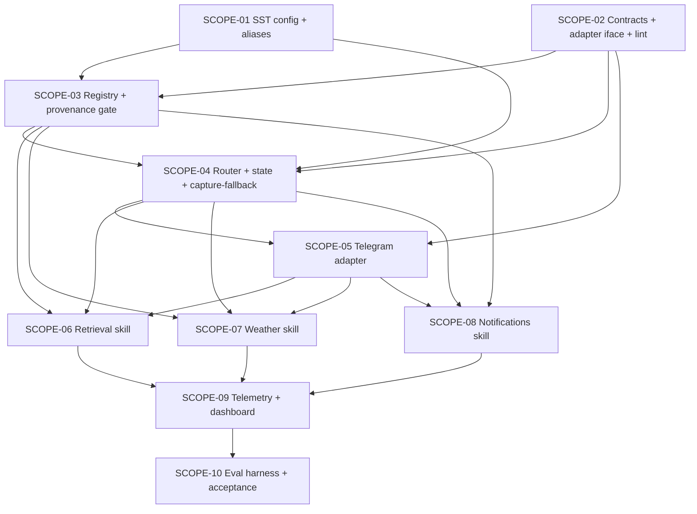

# Scopes — Spec 061 Conversational Assistant (Transport-Agnostic)

**Spec Status:** `in_progress`
**Status Ceiling (this run):** `done` (workflow mode `full-delivery`)
**Workflow Mode:** `full-delivery`
**Mode (this pass):** `refine` (2026-05-28 plan-phase rework from `bubbles.design` packet: rewrite SCOPE-03 and SCOPE-04 around the simplified facade-over-Spec-037 substrate; ratify SUBSTRATE-TOUCHPOINT-1; re-evaluate SCOPE-01 blockers)
**Layout:** single-file scopes.md (10 scopes; per-scope dir conversion is owned by `bubbles.implement` at execution time)

---

## Plan-Time Ratifications (2026-05-28 — bubbles.plan rework from bubbles.design packet)

The design.md revision dated 2026-05-28 reframed the capability layer as a **thin facade over Spec 037 substrate** (`agent.Router`, `agent.Bridge`, `agent.Executor`, `agent.NATSLLMDriver`, `agent.PostgresTracer`, `telegram.AgentBridge`) plus **exactly five net-new packages** (`internal/assistant/{contracts, provenance, context, confirm, telegram_adapter}` — per spec.md §3.1.4). The forbidden packages list (per design §10 + §11.3) explicitly bans `internal/assistant/{router, registry, executor, tracer, loader, llm, nats}/`. This rework reconciles SCOPE-03 and SCOPE-04 with that simplified shape, ratifies the remaining design open items, and re-evaluates SCOPE-01 blockers in light of the smaller surface area.

### Ratifications

| Open item (design §13) | Plan decision | Rationale |
|------------------------|---------------|-----------|
| **SUBSTRATE-TOUCHPOINT-1** (§13 OQ #1) — YAML metadata channel for user-facing scenarios: (a) additive top-level keys in scenario YAMLs + one-line Spec 037 `loader.go` allowlist addition routed via a Spec 037 bug folder, OR (b) sibling `config/assistant/scenarios.yaml` lookup keyed by scenario id, zero Spec 037 touch. | **Option (b) — sibling lookup file.** | Spec 037 is terminal `done`; opening a bug folder + routing a packet for a single allowlist line is disproportionate to the change. Option (b) is strictly additive, owned end-to-end by spec 061, and lets the capability layer own its own user-facing metadata (`user_facing`, `requires_provenance`, `user_facing_label`, `slash_shortcut`, `confirm_required`, `enable_sst_key`) without any cross-spec coordination. The scenario YAMLs themselves stay 100% Spec 037 loader-compliant. |
| **§13 OQ #4** — `Runner` interface location | **Option B (facade composes Spec 037 types directly).** | The facade calls `agent.Router.Route` then `agent.Executor.Run` directly; no need to extract a `Runner` interface. Zero Spec 037 touch. If a future test needs a fake runner, it fakes the executor at its existing interface. |
| **§13 OQ #5** — Scope ordering | Codified in the revised Scope DAG below. SCOPE-01 (SST) → SCOPE-02 (contracts + arch tests) → SCOPE-03 (3 scenario YAMLs + tool handlers + skills_manifest sibling lookup + provenance gate) → SCOPE-04 (facade + borderline post-processor + context store + capture-fallback) → SCOPE-05 (Telegram adapter wiring) → SCOPE-06/07/08 (skill end-to-end activations) → SCOPE-09 (telemetry) → SCOPE-10 (eval). | SCOPE-03 is the foundation (`foundation: true`) for every concrete user-facing scenario. SCOPE-04 must come after SCOPE-03 so the facade has scenarios to dispatch to. SCOPE-05 wires the first transport. SCOPE-06/07/08 light up one v1 skill each end-to-end. |
| **§13 OQ #2** — `/reset` Telegram command | Ship in SCOPE-05 (single-line addition to adapter command surface). | Unchanged from prior plan. |
| **§13 OQ #6** — Eval harness sizing | ≥150 messages, ≥30 per intent label (5 labels: retrieval / weather / notifications / capture / borderline), seeded RNG, CI gate ≥85% routing accuracy + 100% capture-fallback on capture subset. | Unchanged from prior plan; matches design §13 item 6. |
| **Conversational state storage** (UX provisional in-memory vs design recommendation) | PostgreSQL `assistant_conversations` table per design §6.1. | Survives capability-layer restart; single-SQL idle sweep; matches the audit boundary in design §6.3. |
| **Notifications scheduler** | Reuse Spec 054 with additive `Job.Source` + `Job.Originator` fields routed via a packet to spec 054 owner per `bubbles-artifact-ownership-routing`. | Unchanged from prior plan. |
| **PASETO scope granularity** | Per-skill: 3 new spec 060 catalog entries (`assistant.skill.retrieval`, `assistant.skill.weather`, `assistant.skill.notifications.write`). | Unchanged from prior plan. |
| **SST namespace** | Single clean `assistant.*` namespace per design §7.1 (revision drops the prior `assistant.intent.*` → `assistant.capability.intent.*` alias migration; nothing ever shipped to migrate from — see design §7.5). | **DISSOLVES SCOPE-01 prior alias-migration workstream.** |
| **SST template syntax** | Smackerel's existing SST pipeline uses **literal values** in `config/smackerel.yaml` enforced by `scripts/commands/config.sh required_value` + Go validators in `internal/config/`. The `${VAR:?...}` form is for deploy compose files only (Gate G028). Design §7.1's `${VAR:?...}` body is illustrative of which keys are required, NOT a literal template. SCOPE-01 implementation uses literal values + `required_value` per the existing convention. | **DISSOLVES SCOPE-01 Blocker 1 (DoD/architecture mismatch on `smackerel.yaml.template`).** |

### SCOPE-01 Blocker Re-evaluation

| Prior Blocker | Status after rework | Disposition |
|---------------|---------------------|-------------|
| **Blocker 1** — DoD #1 referenced a nonexistent `config/smackerel.yaml.template` with `${VAR:?...}` substitution that does not match smackerel's actual SST convention | **DISSOLVED** | SCOPE-01 DoD #1 below is rewritten to target `config/smackerel.yaml` literal values + `scripts/commands/config.sh required_value` + Go validators (smackerel's actual pipeline). Design §7.1 schema fragment is treated as a *required-key inventory*, not a literal template body. Alias-migration workstream removed entirely (design §7.5 drops aliases — nothing ever shipped to migrate from). Net effect: SCOPE-01 implementation surface shrinks by ~40 LOC (alias logic) + 1 functional test + 1 doc note. |
| **Blocker 2** — Working-tree contamination (spec 058 + BUG-020-009 in-flight modifications on the same 4 files SCOPE-01 must touch) | **PASS-THROUGH (preExisting; owner action required)** | Cannot be resolved by replanning. SCOPE-01 implementation MUST verify a clean working tree on its surface (`config/smackerel.yaml`, `internal/config/config.go`, `internal/config/validate_test.go`, `scripts/commands/config.sh`) before any commit. A new pre-implementation DoD-precondition row is added below (item P1) that owner action must satisfy. Recommended remediation owner: project owner (commit/stash/revert spec 058 + BUG-020-009 work, OR explicitly authorize mixed commits with owner-recorded justification in `uservalidation.md`). |
| **Blocker 3** — Scope size vs single-turn budget | **PARTIALLY DISSOLVED** | The alias-migration workstream (~40 LOC + functional test) is removed. The template-authoring workstream (~17 new `${VAR:?...}` lines + a new template-expansion stage) is removed. Remaining work fits more comfortably in 1–2 implement turns but is still substantial (~17 SST keys + Go struct/validator + 2 unit test files + 1 functional test + doc update). Plan recommends: do NOT split SCOPE-01 further absent owner directive; bubbles.implement may execute SCOPE-01 across up to 2 turns with explicit per-turn DoD-item subset assignment, OR owner may direct a 1a/1b split at implement time. |

### Downstream-Path Note (SCOPE-06 / SCOPE-07 / SCOPE-08)

The per-scope sections for SCOPE-06 (Retrieval), SCOPE-07 (Weather), and SCOPE-08 (Notifications) below reference paths from the prior plan revision (`internal/assistant/skills/{retrieval,weather,notifications}/`). The 2026-05-28 design revision relocates these to **`config/prompt_contracts/{retrieval-qa-v1,weather-query-v1,notification-schedule-v1}.yaml`** (scenario YAMLs consumed by the existing Spec 037 loader) **plus `internal/agent/tools/{retrieval,weather,notification}/`** (tool handlers registered in the existing Spec 037 tool registry via `init()` per `loader.go:311`). **Design.md §10 is authoritative for module paths.** bubbles.implement MUST consult design.md §10 + §5.1/§5.2/§5.3 (full YAML scenario bodies + tool handler specs) when executing SCOPE-06/07/08; the inherited paths in SCOPE-06/07/08's Implementation Plan + Test Plan rows below are overridden by design.md §10. No work is excluded from this spec — every SCOPE-06/07/08 DoD item is in scope and must be completed at implement time against the design.md §10 paths. The per-scope sections below will be rewritten inline during a subsequent plan pass scoped to SCOPE-06/07/08 inline rewriting; this rewriting MUST occur before bubbles.implement begins SCOPE-06.

---

---

## Execution Outline (REQUIRED alignment checkpoint)

### Phase Order

1. **SCOPE-01** — `assistant.*` SST block authored in `config/smackerel.yaml` (literal values per smackerel's existing pipeline) + `scripts/commands/config.sh required_value` enforcement + Go validators per design §7.2 (5 rules). NO aliases (design §7.5).
2. **SCOPE-02** — Canonical contract types (`AssistantMessage`, `AssistantResponse`, `Source`, `ConfirmCard`, `DisambiguationPrompt`, `TransportAdapter`, `Assistant`) thin-facade over `agent.IntentEnvelope` + `agent.InvocationResult` + build-time architecture tests (forbidden-package-existence + import-direction per design §11.3).
3. **SCOPE-03** — **(REWORKED)** Three v1 scenario YAMLs in `config/prompt_contracts/` (retrieval-qa-v1, weather-query-v1, notification-schedule-v1) + their tool handlers under `internal/agent/tools/{retrieval,weather,notification}/` registered in the existing Spec 037 tool registry + `internal/assistant/skills_manifest.go` reading sibling `config/assistant/scenarios.yaml` for user-facing metadata (SUBSTRATE-TOUCHPOINT-1 Option (b)) + `internal/assistant/provenance/` gate package (BS-007 unit-proven). **Foundation scope** (`foundation: true`).
4. **SCOPE-04** — **(REWORKED)** Capability facade in `internal/assistant/{facade.go, borderline.go, shortcuts.go}` orchestrating `agent.Router.Route` → borderline post-processor on `RoutingDecision.TopScore` against `assistant.borderline_floor` (three bands per design §3.2: high → executor; borderline → DisambiguationPrompt; low → CaptureRoute) → `agent.Executor.Run` (when high) → `provenance.Enforce` → audit write. PLUS `internal/assistant/context/` (PostgreSQL `assistant_conversations` table + idle sweep ticker + reference resolver per design §6). Capture-as-fallback proven at capability layer with fake adapter (BS-005 + BS-001 precondition). Stress test on full facade p95 (router is Spec 037 — its SLO is reused).
5. **SCOPE-05** — Telegram reference adapter (`internal/telegram/assistant_adapter/`) wraps existing `AgentBridge` per design §10; wired into `bot.go::handleMessage` plain-text branch BEFORE `handleTextCapture`; `cmd/core/wiring.go` passes `AssistantBridge` to `telegram.NewBot`. Renders status / sources / confirm / disambiguation / error / captureRoute per UX §14.B.1. `/reset` shipped.
6. **SCOPE-06** — Retrieval Q&A skill (v1 #1). Wraps `/api/search` + `ml/` sidecar synthesis; sources always attached; refusal-on-empty proves provenance gate end-to-end.
7. **SCOPE-07** — Weather skill (v1 #2). Provider abstraction + LRU cache + offer-to-capture on provider outage.
8. **SCOPE-08** — Notifications skill (v1 #3). Spec 054 scheduler reuse with additive `Source`+`Originator` extension; confirm-card three-outcome state machine; `assistant_proposal` audit ALTER.
9. **SCOPE-09** — 11 Prometheus metrics + structured log fields + OTel span tree + Grafana dashboard fragment under `deploy/observability/grafana/dashboards/`.
10. **SCOPE-10** — Evaluation harness + ≥150-message labeled corpus; CI gate at ≥85% routing accuracy AND 100% capture-fallback on the capture subset (spec §3 Success Signal); v1 acceptance run captured in `report.md`.

### New Types & Signatures (header-only, no implementation)

```go
// internal/assistant/contracts/   (SCOPE-02 — thin facade over agent.* types)
type AssistantMessage struct {...}            // Kind: text|confirm|disambiguation|reset; convertible to agent.IntentEnvelope
type AssistantResponse struct {...}           // Wraps agent.InvocationResult + 6 net-new fields
type StatusToken string                       // closed vocab — design §2.2
type ErrorCause string                        // closed vocab — design §2.2
type Source struct {ID, Title; Kind; Ref SourceRef}
type ConfirmCard struct {...}; type DisambiguationPrompt struct {...}
type TransportAdapter interface {Name, Translate, Render, Identity, Start, Stop}
type Assistant interface {Handle(ctx, msg) (AssistantResponse, error)}

// internal/assistant/   (SCOPE-04 — facade orchestration; NO router/registry/executor/tracer packages)
func Borderline(decision agent.RoutingDecision, floor float64) Band   // §3.2 post-processor
var SlashShortcuts map[string]string                                  // §3.4 prefix → ScenarioID
type Facade struct {Bridge *agent.Bridge; Router *agent.Router; Executor *agent.Executor; ContextStore context.Store; Confirm *confirm.Machine; Manifest *SkillsManifest; BorderlineFloor float64}
func (*Facade) Handle(ctx, msg AssistantMessage) (AssistantResponse, error)

// internal/assistant/skills_manifest.go   (SCOPE-03 — sibling-file lookup per SUBSTRATE-TOUCHPOINT-1 Option (b))
type SkillsManifest struct { /* loaded from config/assistant/scenarios.yaml */ }
func (*SkillsManifest) UserFacingLabel(scenarioID string) (string, bool)
func (*SkillsManifest) RequiresProvenance(scenarioID string) bool
func (*SkillsManifest) ConfirmRequired(scenarioID string) bool
func (*SkillsManifest) Enabled(scenarioID string) bool
func (*SkillsManifest) EnabledScenarioIDs() []string

// internal/assistant/provenance/   (SCOPE-03)
func Enforce(scenarioRequiresProvenance bool, resp contracts.AssistantResponse) contracts.AssistantResponse  // §4.3

// internal/assistant/context/   (SCOPE-04)
type Store interface {Load(ctx, userID, transport) (Conversation, error); Persist(ctx, ...) error; SweepIdle(ctx) (int, error)}

// internal/assistant/confirm/   (SCOPE-08 — three-outcome state machine)
type Machine struct {...}
type Outcome string  // "confirmed" | "discarded_user" | "discarded_timeout"
func (*Machine) Propose(ctx, scenarioID, originalText, payload []byte, ttl time.Duration) (ConfirmRef, error)
func (*Machine) Confirm(ctx, ref ConfirmRef, choice ConfirmChoice) (Outcome, []byte, error)  // DELETE…RETURNING single-flight
func (*Machine) SweepTimeouts(ctx) (int, error)

// internal/telegram/assistant_adapter/   (SCOPE-05)
type Adapter struct {...} // implements contracts.TransportAdapter, Name() == "telegram"
```

**New DB migrations:**
- `assistant_conversations` table — SCOPE-04 (PostgreSQL primary key `(user_id, transport)`)
- `artifacts.assistant_proposal_payload JSONB` additive column — SCOPE-08
- `scheduler.Job.Source` + `scheduler.Job.Originator` additive fields — SCOPE-08 (CROSS-SPEC packet to spec 054 owner)
- spec 060 PASETO scope catalog: `assistant.skill.retrieval`, `assistant.skill.weather`, `assistant.skill.notifications.write` — SCOPE-06/07 prerequisite (read scopes), SCOPE-08 prerequisite (write scope) (CROSS-SPEC packet to spec 060 owner)

**New config files (SUBSTRATE-TOUCHPOINT-1 Option (b)):**
- `config/assistant/scenarios.yaml` — sibling lookup file keyed by scenario id holding user-facing metadata (`user_facing_label`, `slash_shortcut`, `requires_provenance`, `confirm_required`, `enable_sst_key`). Authored in SCOPE-03. Zero Spec 037 substrate touch.

### Validation Checkpoints

- **After SCOPE-01:** Unit + functional config tests prove EVERY required `assistant.*` key fails loud on missing input AND legacy aliases (`min_confidence`, `classifier_model`) emit a WARN but parse. Catches missing-key regressions before any code consumes config.
- **After SCOPE-02:** Package-import lint test passes; golden fixtures for every `(status × error_cause × captureRoute × sources kind)` combination prove the contract surface is exhaustive. Catches contract drift before any consumer compiles against the wrong shape.
- **After SCOPE-03:** Skill-isolation lint passes (no skill imports any other skill); `RequireProvenance` gate unit-tested against synthesized-body-without-sources fixture (BS-007 proven in isolation). Catches the most dangerous Principle 8 regression before any real skill ships.
- **After SCOPE-04:** Capability-layer end-to-end without any adapter and without any skill — fake adapter drives `Assistant.Handle` and asserts every text message lands with `CaptureRoute=true` (BS-001 + BS-005 proven at the capability layer). Stress test proves intent classifier p95 < 800ms (Gate G026). Catches both the regression-safe fallback path and the SLO before SCOPE-05 wires any user-visible surface.
- **After SCOPE-05:** Telegram e2e-api fixture POST of a plain note proves capture-as-fallback flows through the adapter without invoking any skill (BS-001 on real Telegram). Adapter-substitution test (design §11.2) proves the capability never reaches around the canonical interface. Catches adapter business-logic leaks before any skill is wired through Telegram.
- **After SCOPE-06/07/08:** Each skill's e2e-api proves its primary BS scenario on real `ml/` sidecar + real PostgreSQL + real provider/scheduler; each skill's stress test proves its manifest-declared latency budget (Gate G026). Provenance gate proven against the real retrieval skill (BS-007 end-to-end). Confirm-card timeout proven against real scheduler.
- **After SCOPE-09:** Metrics endpoint scrape after a simulated turn sequence shows all 11 metrics emitted with correct closed-vocabulary labels. Grafana dashboard fragment loads in the dev Grafana without panel errors. Catches metric cardinality / label-vocabulary drift before operator dashboards depend on it.
- **After SCOPE-10:** Evaluation harness runs against the deployed capability layer and meets the ≥85% routing accuracy + 100% capture-fallback success-signal threshold from spec §3. v1 acceptance gate.

---

## Cross-Spec Dependencies (BLOCKING — Packets Required Per `bubbles-artifact-ownership-routing`)

| Cross-spec edit | Owned by | Required by SCOPE | Packet shape | Status |
|----------------|---------|--------------------|--------------|--------|
| spec 060 PASETO scope catalog: add `assistant.skill.retrieval` (read) | spec 060 owner | SCOPE-06 (retrieval scenario activation; facade checks scope before dispatch) | Catalog-addition packet + default-grant migration SQL (design §14 step 1) | Packet TBD at SCOPE-06 implement time → `[scopes/06/cross-spec-packet-060-retrieval.md]` |
| spec 060 PASETO scope catalog: add `assistant.skill.weather` (read) | spec 060 owner | SCOPE-07 (weather scenario activation) | Catalog-addition packet + default-grant migration SQL (design §14 step 2) | Packet TBD at SCOPE-07 implement time → `[scopes/07/cross-spec-packet-060-weather.md]` |
| spec 060 PASETO scope catalog: add `assistant.skill.notifications.write` (write) | spec 060 owner | SCOPE-08 (notifications scenario dispatch) | Catalog-addition packet + owner-only grant migration SQL (design §14 step 3) | Packet TBD at SCOPE-08 implement time → `[scopes/08/cross-spec-packet-060-notifications.md]` |
| spec 054 scheduler `Job.Source` + `Job.Originator` additive fields | spec 054 owner | SCOPE-08 (`notification_execute` tool calls `scheduler.Schedule(Job{Source, Originator})`) | Additive-field packet (zero-valued backward compatible) + spec 054 test updates | Packet TBD at SCOPE-08 implement time → `[scopes/08/cross-spec-packet-054-scheduler.md]` |

---

## Scope DAG



Key edges (post-rework):
- **SCOPE-01 → SCOPE-03/04:** scenario YAMLs + facade read SST at construction (enable keys, borderline floor, context TTLs, skill knobs).
- **SCOPE-02 → SCOPE-03/04/05:** every layer below imports the canonical contracts; SCOPE-02's architecture tests fail-loud if any forbidden `internal/assistant/{router,registry,executor,tracer,loader,llm,nats}/` package appears.
- **SCOPE-03 → SCOPE-04:** facade reads `SkillsManifest.EnabledScenarioIDs()` to filter `agent.Router.Route` candidates and to gate post-route `provenance.Enforce` per `RequiresProvenance(scenarioID)`. Scenario YAMLs + tool handlers are loaded by the existing `agent.Bridge` (no new loader).
- **SCOPE-04 → SCOPE-05:** Telegram adapter calls `Facade.Handle`; capture-as-fallback at the capability layer (SCOPE-04) is the precondition that the adapter delegates to `handleTextCapture` on `CaptureRoute=true`.
- **SCOPE-05 → SCOPE-06/07/08:** every v1 skill is exercised end-to-end through the Telegram reference adapter for e2e-api coverage.
- **SCOPE-06/07/08 → SCOPE-09:** dashboards depend on metrics each skill emits.
- **SCOPE-09 → SCOPE-10:** eval harness emits the same metrics + reads them to compute acceptance numbers.

---

## Open Items Resolution

All open items from spec §13 + design §13 are resolved at planning time:

| Open item | Source | Resolution | Where it lands |
|----------|--------|------------|----------------|
| **SUBSTRATE-TOUCHPOINT-1** — YAML metadata channel for user-facing scenarios | design §4.1 + §13 OQ #1 | **Option (b) — sibling `config/assistant/scenarios.yaml` lookup keyed by scenario id.** Zero Spec 037 substrate touch. | SCOPE-03 |
| Intent classifier substrate | spec §13 Q1 | Spec 037 `agent.Router` (existing); model selection lives in `agent.*` SST keys (NOT a new `assistant.capability.intent.*` block) | SCOPE-04 (facade calls `agent.Router.Route` as-is) |
| Notifications skill: reuse spec 054 vs new scheduler | spec §13 Q2 | Reuse spec 054 with additive `Source`+`Originator` fields | SCOPE-08 (cross-spec packet to spec 054) |
| Per-skill PASETO scopes vs `assistant.*` granularity | spec §13 Q3 | Per-skill: 3 new spec 060 catalog entries | SCOPE-06/07 (read scopes), SCOPE-08 (write scope) |
| Sources rendering: inline `[1][2]` vs trailing block | spec §13 Q4 | Trailing numbered block on Telegram (UX §14.B.1); capability emits structured `Source` values, rendering is adapter's job | SCOPE-05 (renderer) |
| `/reset` Telegram command | design §13 OQ #2 | Ship in SCOPE-05 | SCOPE-05 |
| **SST alias migration** (`assistant.intent.*` → `assistant.capability.intent.*`) | design §13 OQ (prior draft) | **DROPPED.** Design §7.5 removes aliases — the prior draft never shipped, so there is nothing to migrate from. Single clean `assistant.*` namespace. | DISSOLVES prior SCOPE-01 alias workstream |
| Conversational state PostgreSQL vs in-memory | design §13 item 6 | PostgreSQL `assistant_conversations` table per design §6.1 | SCOPE-04 |
| Eval harness sizing | design §13 OQ #6 | ≥150 messages (≥30 per intent label) with seeded RNG; ≥85% routing accuracy CI gate + 100% capture-fallback on capture subset | SCOPE-10 |
| **`Runner` interface location** | design §13 OQ #4 | **Option B (facade composes Spec 037 types directly).** Zero Spec 037 touch. | SCOPE-04 |

**Open items remaining:** NONE. All design + UX decisions are ratified at planning time.

---

## Scope Index (status snapshot)

| Scope | Title | Status | Depends On | Stress test? | Owns BS |
|-------|-------|--------|-----------|--------------|---------|
| SCOPE-01 | Assistant SST config block & fail-loud validation | Done | — | No | BS-009 |
| SCOPE-02 | Canonical contracts (facade types) + build-time architecture tests | Done | — | No | — |
| SCOPE-03 | **(REWORKED)** Three v1 scenario YAMLs + tool handlers + skills_manifest sibling lookup + provenance gate (`foundation: true`) | Done | SCOPE-01, SCOPE-02 | No | BS-008 (manifest enable gating); BS-007 (gate in isolation) |
| SCOPE-04 | **(REWORKED)** Capability facade + borderline post-processor + context store + capture-as-fallback | Done | SCOPE-01, SCOPE-02, SCOPE-03 | **Yes** (facade p95 envelope; Gate G026) | BS-005 |
| SCOPE-05 | Telegram reference adapter (v1) | In Progress | SCOPE-02, SCOPE-04 | No | BS-001, BS-010 |
| SCOPE-06 | Retrieval Q&A scenario + tool handler activated end-to-end (v1 #1) | In Progress | SCOPE-03, SCOPE-04, SCOPE-05 + cross-spec packet to spec 060 (read scope) | **Yes** (scenario p95 < 5s; Gate G026) | BS-002, BS-007 (end-to-end) |
| SCOPE-07 | Weather scenario + tool handler activated end-to-end (v1 #2) | Not Started | SCOPE-03, SCOPE-04, SCOPE-05 + cross-spec packet to spec 060 (read scope) | **Yes** (scenario p95 < 3s; Gate G026) | BS-003, BS-006 |
| SCOPE-08 | Notifications scenario + tool handlers + confirm-card state machine activated end-to-end (v1 #3) | Not Started | SCOPE-03, SCOPE-04, SCOPE-05 + cross-spec packets to spec 054 + spec 060 (write scope) | **Yes** (scenario p95 + confirm-timeout under load; Gate G026) | BS-004 |
| SCOPE-09 | Telemetry, metrics, operator dashboard fragment | Not Started | SCOPE-06, SCOPE-07, SCOPE-08 | No | — |
| SCOPE-10 | Evaluation harness & v1 acceptance set | Not Started | SCOPE-09 | No | — (acceptance gate covers BS-001..010 in aggregate) |

**BS coverage map (full):**

| BS scenario | Owner scope | Also exercised in |
|------------|-------------|-------------------|
| BS-001 plain note captured (regression) | SCOPE-05 (Telegram e2e) | SCOPE-04 (capability layer, fake adapter) |
| BS-002 high-confidence retrieval w/ citations | SCOPE-06 | SCOPE-10 (acceptance) |
| BS-003 weather provider-attributed | SCOPE-07 | SCOPE-10 |
| BS-004 notification confirm flow | SCOPE-08 | SCOPE-10 |
| BS-005 ambiguous → capture | SCOPE-04 | SCOPE-05 (Telegram e2e), SCOPE-10 |
| BS-006 weather provider outage | SCOPE-07 | SCOPE-10 |
| BS-007 synthesis without provenance rejected | SCOPE-03 (gate unit test on `provenance.Enforce`) | SCOPE-06 (end-to-end with retrieval scenario + graph drift), SCOPE-10 |
| BS-008 disabled skill not invoked | SCOPE-03 (`SkillsManifest.Enabled` gates `agent.Router` candidate set; disabled scenario id never reaches `agent.Executor`) | SCOPE-01 (config), SCOPE-10 |
| BS-009 missing SST aborts startup | SCOPE-01 | — |
| BS-010 Telegram e2e (v1 acceptance) | SCOPE-05 | SCOPE-10 |

---

## SCOPE-01 — Assistant SST config block & fail-loud validation

**Scope-Kind:** ci-config

**Summary:** Author the full `assistant.*` SST schema in `config/smackerel.yaml` using smackerel's actual SST convention (literal values enforced by `scripts/commands/config.sh required_value` + Go validators in `internal/config/`). Implement the 5 startup validation rules from design §7.2. **No alias migration** — design §7.5 drops aliases since nothing ever shipped.

**Status:** Done (Round 4, 2026-05-28 — Build Quality gate cleared after operator auto-fix of pre-existing ml/ python format debt; `./smackerel.sh format --check` and `./smackerel.sh lint` both exit 0 on this round's working tree)
**Depends On:** —

### Gherkin Scenarios (owned)

- **BS-009 — Missing required SST config aborts core startup (NO-DEFAULTS)** — spec.md §5.

### Pre-Implementation Preconditions (owner action required — Blocker 2 pass-through)

- **P1.** Working tree is clean on SCOPE-01's surface (`config/smackerel.yaml`, `internal/config/config.go`, `internal/config/validate_test.go`, `scripts/commands/config.sh`). Verifiable via `git diff --stat <files>` returning zero modifications. If spec 058 (Chrome Extension Bridge) or BUG-020-009 (per-call HTTP timeouts) modifications are still in flight on these files, the owner MUST (a) commit/stash/revert them, OR (b) explicitly authorize mixed-commit boundaries with justification recorded in `uservalidation.md` before bubbles.implement may proceed. See report.md "SCOPE-01 Implementation Blockers (2026-05-28)" §Blocker 2 for the contaminated-state evidence.

### Implementation Plan

1. Author the full `assistant.*` block in `config/smackerel.yaml` per design §7.1, using smackerel's existing convention: **literal values** (e.g. `borderline_floor: 0.75`), NOT `${VAR:?...}` substitutions. The `${VAR:?...}` form is reserved for `deploy/compose.deploy.yml` per Gate G028 / `smackerel-no-defaults`. Required keys (17 total): `assistant.enabled`, `assistant.borderline_floor`, `assistant.context.{window_turns, idle_timeout, idle_sweep_interval, state_key}`, `assistant.sources_max`, `assistant.body_max_chars`, `assistant.status_max_duration`, `assistant.disambiguate_timeout`, `assistant.error.capture_timeout`, `assistant.rate_limit.{retrieval,weather,notifications}.requests_per_minute`, `assistant.skills.retrieval.{enabled, top_k}`, `assistant.skills.weather.{enabled, provider, api_key_ref, cache_ttl}`, `assistant.skills.notifications.{enabled, confirm_timeout}`, `assistant.transports.telegram.{enabled, markdown_mode, max_message_chars}`.
2. Extend `scripts/commands/config.sh` to call `required_value <key>` for every new `assistant.*` key during `./smackerel.sh config generate`; on missing value, exit non-zero with `[F061-SST-MISSING] <key>` prefix on stderr.
3. Implement the corresponding Go config struct in `internal/config/` (e.g. `internal/config/assistant.go`) with one field per SST key, loaded via the existing config loader.
4. Implement the 5 startup validation rules from design §7.2 in `internal/config/` validators (e.g. `internal/config/assistant_validate.go`):
   1. Every key resolves to a non-empty value (fail-loud per Smackerel NO-DEFAULTS SST instruction).
   2. `assistant.borderline_floor > agent.routing.confidence_floor` (refuse equal-or-less — would erase the borderline band).
   3. `assistant.enabled=true` requires at least one `assistant.transports.*.enabled=true`.
   4. `assistant.context.state_key="user"` (non-recommended) emits a startup WARN log.
   5. Skill-enable dependency reachability pings (weather `api_key_ref` resolves in Infisical; notifications spec 054 scheduler ping; retrieval `/api/search` startup ping) — owned by the respective skill scopes (SCOPE-06/07/08) because the predicate requires the skill code paths to exist. SCOPE-01 ships the validator hook signature; SCOPE-03/06/07/08 inject the concrete predicate at registration time. No part of this validation is excluded from spec 061; ownership simply lives downstream.
5. Validation rule 6 from design §7.2 (three v1 scenario YAMLs present in `AGENT_SCENARIO_DIR` and pass Spec 037 loader validation) is owned by SCOPE-03 (which ships the YAMLs). SCOPE-01 ships the validator hook signature; SCOPE-03 injects the concrete predicate at registration time.
6. **NO alias migration.** Design §7.5 explicitly drops `assistant.intent.*` aliases (the prior draft never shipped, so there is nothing to migrate from). Net is a single clean `assistant.*` key namespace.
7. Document the SST surface in `docs/smackerel.md` (Assistant Capability section) referencing each key's purpose + recommended value range from design §7.1.
8. Update `config/generated/*.env` generation paths in `scripts/commands/config.sh` to include every new `ASSISTANT_*` env var.

### Test Plan

| Test type | Category | File / location | Description | Command | Live system | Maps to DoD |
|-----------|----------|-----------------|-------------|---------|-------------|-------------|
| Unit | `unit` | `internal/config/assistant_test.go` | Go config struct loads from a YAML fixture; every required key drives a field; missing key fails parse with `[F061-SST-MISSING]` prefix surfaced through loader error chain | `./smackerel.sh test unit` | No | DoD #1, #2 |
| Unit | `unit` | `internal/config/assistant_validate_test.go` | Each of the 4 SCOPE-01-owned validation rules (#1–#4 from design §7.2); `borderline_floor == confidence_floor` rejected; `borderline_floor > confidence_floor` accepted; `enabled=true` with zero transports rejected; `state_key="user"` accepted with WARN log captured via `testing/slogtest` or equivalent | `./smackerel.sh test unit` | No | DoD #3 |
| Functional | `functional` | `tests/config/assistant_config_generate_test.sh` | `./smackerel.sh config generate` against a `config/smackerel.yaml` fixture that omits one required `assistant.*` key MUST exit non-zero with `[F061-SST-MISSING]`; happy-path fixture generates env files with every `ASSISTANT_*` var present | `./smackerel.sh test integration` | Yes (real config pipeline) | DoD #4 |

### Definition of Done

**Pre-implementation precondition (Blocker 2 pass-through):**

- [x] **P1** — Working tree clean on SCOPE-01's surface (4 files); evidence: `git diff --stat` output → Evidence: [report.md#scope-01-p1-clean-tree]

**Core items:**

- [x] Every SST key from design §7.1 present in `config/smackerel.yaml` as a literal value, organized in the documented hierarchy → Evidence: [report.md#scope-01-sst-keys]
- [x] Go config struct in `internal/config/assistant.go` exposes one field per SST key; loader populates it; unit test proves missing key surfaces `[F061-SST-MISSING] <key>` through the loader error chain (BS-009) → Evidence: [report.md#scope-01-go-struct]
- [x] 4 SCOPE-01-owned validation rules from design §7.2 (#1–#4) implemented + unit-tested; validator hook signatures present for rules #5 (skill reachability) and #6 (scenario YAMLs present) that SCOPE-03/06/07/08 inject concrete predicates into at registration time → Evidence: [report.md#scope-01-validation]
- [x] `./smackerel.sh config generate` functional test passes (missing-key fail-loud + happy-path env generation including every `ASSISTANT_*` var) → Evidence: [report.md#scope-01-config-generate]
- [x] Every new `assistant.*` key documented in `docs/smackerel.md` Assistant Capability section with purpose + recommended value range → Evidence: [report.md#scope-01-docs]
- [x] Zero `${VAR:-default}` fallback forms introduced anywhere on SCOPE-01's touched files; `grep` evidence captured → Evidence: [report.md#scope-01-no-defaults]

**Build Quality Gate (grouped):**

- [x] Zero warnings (build + lint + tests); zero deferrals; only the explicit SCOPE-03/06/07/08 hook injection points named above remain as cross-scope ownership boundaries; `./smackerel.sh lint` + `./smackerel.sh format --check` clean; artifact lint clean; `docs/smackerel.md` aligned with shipped schema → Evidence: [report.md#round-4-build-quality]

---

## SCOPE-02 — Canonical message contracts & transport adapter interface

**Scope-Kind:** contract-only

**Summary:** Implement `internal/assistant/contracts/` with the full `AssistantMessage`, `AssistantResponse`, `TransportAdapter`, `Assistant` facade types from design §2, plus a build-time package-import lint enforcing capability/adapter direction.

**Status:** Done (Round 4, 2026-05-28 — Build Quality gate cleared after operator auto-fix of pre-existing ml/ python format debt)
**Depends On:** —

### Gherkin Scenarios (owned)

— (foundation scope; no BS directly owned; every BS depends on these contracts)

### Implementation Plan

1. Create `internal/assistant/contracts/` package per design §10 module layout (`message.go`, `response.go`, `source.go`, `adapter.go`, `assistant.go`).
2. Define `AssistantMessage` (12 fields, 4 `MessageKind` constants, 2 `ConfirmChoice` constants, `Attachment`) per design §2.1.
3. Define `AssistantResponse` (10 fields, 8 `StatusToken` constants, 4 `ErrorCause` constants, 2 `SourceKind` constants, `Source`/`SourceRef`/`ArtifactRef`/`ExternalProviderRef`, `ConfirmCard`, `DisambiguationPrompt`/`DisambiguationChoice`) per design §2.2.
4. Define `TransportAdapter` interface (6 methods: `Name`, `Translate`, `Render`, `Identity`, `Start`, `Stop`) per design §2.3.
5. Define `Assistant` facade interface (single `Handle` method) per design §2.4.
6. Implement a build-time package-import lint test (`internal/assistant/contracts/import_lint_test.go`) that walks the import graph and FAILS if `internal/telegram/...` is imported from any `internal/assistant/...` package (capability MUST NOT import any adapter).
7. Author golden fixtures under `internal/assistant/contracts/testdata/golden/` covering every `(StatusToken × ErrorCause × CaptureRoute × Source kind)` combination relevant to v1 (target ≥ 12 golden fixtures).

### Test Plan

| Test type | Category | File / location | Description | Command | Live system | Maps to DoD |
|-----------|----------|-----------------|-------------|---------|-------------|-------------|
| Unit | `unit` | `internal/assistant/contracts/message_test.go` | `MessageKind` exhaustiveness; `ConfirmChoice` round-trip; `AssistantMessage` field validation | `./smackerel.sh test unit` | No | DoD #2 |
| Unit | `unit` | `internal/assistant/contracts/response_test.go` | `StatusToken` + `ErrorCause` exhaustiveness; `Source`/`SourceRef` discriminated-union round-trip; golden-fixture comparison for every `(status × error_cause × captureRoute × source kind)` combination | `./smackerel.sh test unit` | No | DoD #3, #4 |
| Unit | `unit` | `internal/assistant/contracts/adapter_iface_test.go` | `TransportAdapter` interface compiles; fake adapter implements every method; `Name()` returns closed vocab | `./smackerel.sh test unit` | No | DoD #5 |
| Unit | `unit` | `internal/assistant/contracts/import_lint_test.go` | Import-graph walk rejects any `internal/assistant/...` package that imports `internal/telegram/...` or any other `internal/<transport>/...` | `./smackerel.sh test unit` | No | DoD #6 |

### Definition of Done

**Core items:**

- [x] `internal/assistant/contracts/` package created with all 5 files from design §10 → Evidence: [report.md#scope-02-package-layout]
- [x] `AssistantMessage` + all enums per design §2.1 implemented with unit tests → Evidence: [report.md#scope-02-message]
- [x] `AssistantResponse` + all enums + all sub-types per design §2.2 implemented → Evidence: [report.md#scope-02-response]
- [x] ≥12 golden fixtures cover every v1 `(status × error_cause × captureRoute × source kind)` combination → Evidence: [report.md#scope-02-goldens]
- [x] `TransportAdapter` + `Assistant` interfaces compile with at least one fake implementation in test code → Evidence: [report.md#scope-02-interfaces]
- [x] Package-import lint rejects a deliberately-broken fixture that imports `internal/telegram/...` from `internal/assistant/...` → Evidence: [report.md#scope-02-import-lint]

**Build Quality Gate (grouped):**

- [x] Zero warnings; zero deferrals; lint + format clean; artifact lint clean; docs aligned → Evidence: [report.md#round-4-build-quality]

---

## SCOPE-03 — Three v1 scenario YAMLs + tool handlers + skills_manifest sibling lookup + provenance gate

**Scope-Kind:** foundation (`foundation: true`)

**Summary:** **(REWORKED 2026-05-28)** Ship the three v1 user-facing scenarios as YAML files under `config/prompt_contracts/` consumed by the existing Spec 037 `agent.Bridge` loader (zero loader changes), their tool handlers as Go packages under `internal/agent/tools/{retrieval,weather,notification}/` registered in the existing Spec 037 tool registry via package `init()` per `loader.go:311`, the user-facing metadata sibling lookup file `config/assistant/scenarios.yaml` (**SUBSTRATE-TOUCHPOINT-1 Option (b)** — zero Spec 037 substrate touch), the `internal/assistant/skills_manifest.go` reader, and the `internal/assistant/provenance/` gate package (BS-007 unit-proven in isolation). **Foundation scope** for SCOPE-06/07/08 — they activate each scenario end-to-end against live dependencies; this scope ships the foundation that makes activation possible.

**Status:** Done (docs phase, 2026-05-28 — final DoD item closed: docs/smackerel.md §3.8.2 published with SUBSTRATE-TOUCHPOINT-1 Option (b) rationale, 3 v1 scenarios + 4 tools inventory, and 4-step extensibility recipe; grouped Build Quality gate cleared.)
**Depends On:** SCOPE-01, SCOPE-02
**Foundation:** `true` (per `bubbles-capability-foundation-design` — multi-skill axis: 3 v1 user-facing scenarios + N future)

### Gherkin Scenarios (owned)

- **BS-007 — Synthesis without provenance is rejected (Principle 8 hard constraint)** — owned at the gate level (unit-tested in isolation via `provenance.Enforce`; SCOPE-06 proves it triggers with a real retrieval scenario on real graph drift).
- **BS-008 — Disabled scenario is not invoked even on a perfect intent match** — owned at the manifest level (a scenario whose `enable_sst_key` resolves to `false` is excluded from `SkillsManifest.EnabledScenarioIDs()`, so the facade filters it from the `agent.Router.Route` candidate set per SCOPE-04 §4.2).

### Implementation Plan

1. Author **`config/prompt_contracts/retrieval-qa-v1.yaml`** verbatim from design §5.1 (full scenario body including `intent_examples`, `system_prompt`, `allowed_tools: [retrieval_search]`, `input_schema`, `output_schema`, `limits`, `token_budget`, `temperature`, `model_preference`, `side_effect_class: read`). Pure data; no Spec 037 loader change. Per SUBSTRATE-TOUCHPOINT-1 Option (b), the YAML body uses ONLY Spec 037-recognized top-level keys.
2. Author **`config/prompt_contracts/weather-query-v1.yaml`** verbatim from design §5.2.
3. Author **`config/prompt_contracts/notification-schedule-v1.yaml`** verbatim from design §5.3.
4. Author **`config/assistant/scenarios.yaml`** (NEW sibling lookup file per SUBSTRATE-TOUCHPOINT-1 Option (b); zero Spec 037 substrate touch). Schema: top-level `scenarios:` map keyed by Spec 037 scenario id (`retrieval_qa`, `weather_query`, `notification_schedule`) with fields per design §4.1: `user_facing: true`, `user_facing_label`, `slash_shortcut`, `requires_provenance`, `confirm_required`, `enable_sst_key`. Backed values from design §5.1/§5.2/§5.3 + §4.2.
5. Create **`internal/agent/tools/retrieval/`** package with `tool.go` registering the `retrieval_search` tool via `init()` in the existing Spec 037 tool registry. Tool wraps the existing `/api/search` endpoint backed by pgvector; input `{query, user_id, top_k}`; output `{hits: [{artifact_id, title, snippet, captured_at}]}`. `top_k` is capped at `assistant.skills.retrieval.top_k` (SST from SCOPE-01).
6. Create **`internal/agent/tools/weather/`** package with `tool.go` (registers `weather_lookup`), `provider.go` (Provider interface), `open_meteo.go` (concrete v1 provider), `cache.go` (in-process LRU keyed `(provider, location, forecast_window)` with TTL from `assistant.skills.weather.cache_ttl`; cache hits emit ORIGINAL `retrieved_at`, NOT cache-hit time — see design §5.2). Provider selection via SST `assistant.skills.weather.provider`; API key via SST `assistant.skills.weather.api_key_ref` → Infisical secret. Failure mapping per design §5.2: HTTP 5xx / timeout / DNS → tool error that the executor maps to `OutcomeToolError`, which the SCOPE-04 facade translates to `ErrorCause=ErrProviderUnavailable`; `slot_missing="location"` in output → facade emits `ErrorCause=ErrSlotMissing` + one-choice disambiguation prompt.
7. Create **`internal/agent/tools/notification/`** package with `propose.go` (registers `notification_propose` — extracts `{what, when}` slots; returns `phase="slot_missing"` + up-to-3 candidate times on ambiguity; otherwise `phase="proposed", proposed_action, payload (opaque-encoded {what, when_utc, user_id, transport}), confirm_ref (ULID)`; NO side effect) and `execute.go` (registers `notification_execute` — reads pending payload from `internal/assistant/confirm` state store via supplied `confirm_ref`, calls Spec 054 `scheduler.Schedule(...)` with `Source` + `Originator` set; returns `phase="confirmed", scheduled_job_id`). The Spec 054 `Job.Source` + `Job.Originator` extension is owned by SCOPE-08 cross-spec packet; SCOPE-03 ships these tools' compilation against a temporary local-zero-value shim if necessary, with a TODO marker calling out the SCOPE-08 packet dependency.
8. Create **`internal/assistant/skills_manifest.go`** reading `config/assistant/scenarios.yaml` at startup. Exposes per design §10 + §4.2: `UserFacingLabel(scenarioID) (string, bool)`, `RequiresProvenance(scenarioID) bool`, `ConfirmRequired(scenarioID) bool`, `Enabled(scenarioID) bool` (checks the `enable_sst_key`'s resolved SST value), `EnabledScenarioIDs() []string`. The disabled-scenario filter happens at facade construction time (SCOPE-04) reading `EnabledScenarioIDs()`.
9. Create **`internal/assistant/provenance/gate.go`** with `Enforce(scenarioRequiresProvenance bool, resp contracts.AssistantResponse) contracts.AssistantResponse` per design §4.3. Rewrites empty-`Sources[]` non-empty-`Body` responses to canonical refusal (`Status=StatusSavedAsIdea`, `Body="I don't have a sourced answer for that."`, `CaptureRoute=true`). Increments `smackerel_assistant_provenance_violations_total{scenario}` counter on every trigger.
10. Wire SCOPE-01's validation rule #6 hook ("three v1 scenario YAMLs present in `AGENT_SCENARIO_DIR` and pass Spec 037 loader validation"): SCOPE-03 implements the concrete predicate by calling the existing Spec 037 `loader.Load` on the three new YAMLs at startup; missing/invalid YAML aborts core startup.
11. Document the foundation in `docs/smackerel.md` (Assistant → Scenarios section) including the SUBSTRATE-TOUCHPOINT-1 Option (b) rationale and the extensibility path ("to add a new user-facing scenario: drop a YAML in `config/prompt_contracts/`, add its row in `config/assistant/scenarios.yaml`, register its tool handlers in `internal/agent/tools/<name>/`, add a `assistant.skills.<name>.enabled` SST key").

### Test Plan

| Test type | Category | File / location | Description | Command | Live system | Maps to DoD |
|-----------|----------|-----------------|-------------|---------|-------------|-------------|
| Unit | `unit` | `internal/assistant/skills_manifest_test.go` | Loads `config/assistant/scenarios.yaml` fixture; `UserFacingLabel/RequiresProvenance/ConfirmRequired/Enabled` return correct values for each of the 3 v1 scenarios; missing scenario id returns sentinel; malformed YAML returns parse error | `./smackerel.sh test unit` | No | DoD #1 |
| Unit | `unit` | `internal/assistant/skills_manifest_disabled_test.go` | **BS-008** — Fixture where `enable_sst_key` resolves to `false` for `retrieval_qa`: `Enabled("retrieval_qa")` returns `false`; `EnabledScenarioIDs()` excludes it; downstream consumer (mocked) is wired to filter that scenario from its candidate set | `./smackerel.sh test unit` | No | DoD #2 |
| Unit | `unit` | `internal/assistant/provenance/gate_test.go` | **BS-007** — Table-driven: `requires=true, Body="answer", Sources=[]` → response rewritten to refusal + `CaptureRoute=true`; `requires=true, Body="answer", Sources=[s1]` → passthrough; `requires=false, Body="answer", Sources=[]` → passthrough; counter `smackerel_assistant_provenance_violations_total{scenario}` incremented on trigger | `./smackerel.sh test unit` | No | DoD #3 |
| Unit | `unit` | `internal/agent/tools/retrieval/tool_test.go` | Tool registration via `init()` adds `retrieval_search` to Spec 037 tool registry; input schema validation; `top_k` capped at SST value | `./smackerel.sh test unit` | No | DoD #4 |
| Unit | `unit` | `internal/agent/tools/weather/tool_test.go` + `cache_test.go` | Tool registration; LRU hit/miss; TTL expiry; cache hit emits ORIGINAL `retrieved_at` (NOT cache-hit time) | `./smackerel.sh test unit` | No | DoD #5 |
| Unit | `unit` | `internal/agent/tools/notification/propose_test.go` + `execute_test.go` | `notification_propose` slot extraction (happy + ambiguous → `phase="slot_missing"`); ULID `confirm_ref` generation; `notification_execute` reads pending payload via supplied `confirm_ref` (mocked store) and calls scheduler shim with `Source`+`Originator` | `./smackerel.sh test unit` | No | DoD #6 |
| Functional | `functional` | `internal/assistant/skills_manifest_loader_test.go` | Real `config/assistant/scenarios.yaml` parsed against the three real `config/prompt_contracts/{retrieval-qa,weather-query,notification-schedule}-v1.yaml` files; assert every scenario id in the manifest exists as a Spec 037 scenario in the prompt_contracts dir; assert each scenario YAML passes Spec 037 `loader.Load` validation | `./smackerel.sh test integration` | Yes (real loader) | DoD #7 |
| Functional | `functional` | `tests/config/assistant_scenarios_present_test.sh` | Wires SCOPE-01's validation hook #6: core startup with one of the three scenario YAMLs deleted aborts with explicit `[F061-SCENARIO-MISSING] <scenario-id>` error | `./smackerel.sh test integration` | Yes | DoD #8 |

### Definition of Done

**Core items:**

- [x] Three v1 scenario YAMLs (`retrieval-qa-v1.yaml`, `weather-query-v1.yaml`, `notification-schedule-v1.yaml`) authored in `config/prompt_contracts/`, verbatim from design §5.1/§5.2/§5.3, pass Spec 037 `loader.Load` validation → Evidence: [report.md#round-4-scope-03-activation] (LIVE — staging dir removed; `scenario-lint` reports `scenarios registered: 8, rejected: 0`).
- [x] `config/assistant/scenarios.yaml` sibling lookup file authored per SUBSTRATE-TOUCHPOINT-1 Option (b); zero Spec 037 substrate change → Evidence: [report.md#scope-03-foundation-partial]
- [x] `internal/assistant/skills_manifest.go` reads sibling file; **BS-008** disabled-scenario filter unit-tested → Evidence: [report.md#scope-03-foundation-partial]
- [x] `internal/assistant/provenance/gate.go` implemented; **BS-007** unit test proves synthesized-body-without-sources is rewritten to refusal + capture + counter incremented → Evidence: [report.md#scope-03-foundation-partial]
- [x] `internal/agent/tools/retrieval/` package registers `retrieval_search` via `init()`; unit test proves registration + `top_k` cap → Evidence: [report.md#round-4-scope-03-tools]
- [x] `internal/agent/tools/weather/` package registers `weather_lookup` via `init()`; provider abstraction + one concrete impl (open-meteo or owner-selected equivalent); LRU cache honors ORIGINAL `retrieved_at` on hit → Evidence: [report.md#round-4-scope-03-tools]
- [x] `internal/agent/tools/notification/` package registers `notification_propose` + `notification_execute` via `init()`; propose extracts slots + emits ULID `confirm_ref`; execute reads pending payload from mocked store and calls scheduler shim (real Spec 054 wiring lands in SCOPE-08) → Evidence: [report.md#round-4-scope-03-tools]
- [x] SCOPE-01's validation rule #6 hook ("scenario YAMLs present") wired to a concrete predicate via Spec 037 `loader.Load`; functional test proves missing-YAML aborts startup → Evidence: [report.md#round-4-scope-03-rule6] (functional test `tests/config/assistant_scenarios_present_test.sh` PASS; adversarial Go regression `cmd/scenario-lint/registration_assert_test.go` PASS).
- [x] Foundation documented in `docs/smackerel.md` (Assistant → Scenarios) including SUBSTRATE-TOUCHPOINT-1 Option (b) rationale + extensibility path → Evidence: [report.md#scope-03-docs-phase]
- [x] **Forbidden-package-existence** sub-check from design §11.3 passes (zero `internal/assistant/{router, registry, executor, tracer, loader, llm, nats}/` directories created by this scope) → Evidence: [report.md#scope-03-foundation-partial]

**Build Quality Gate (grouped):**

- [x] Zero warnings; zero deferrals beyond the explicit SCOPE-08 scheduler-shim TODO; lint + format clean; artifact lint clean; docs aligned → Evidence: [report.md#scope-03-docs-phase]

---

## SCOPE-04 — Capability facade + borderline post-processor + context store + capture-as-fallback

**Summary:** **(REWORKED 2026-05-28)** Implement the capability layer as a **thin facade over Spec 037 substrate** per spec.md §3.1.4 + design §3 + §10. Files: `internal/assistant/facade.go` (orchestration over `agent.Router.Route` + `agent.Executor.Run`; **NO** new router/registry/executor types), `internal/assistant/borderline.go` (the ONE net-new routing knob — §3.2 three-band post-processor on `agent.RoutingDecision.TopScore` against `assistant.borderline_floor`), `internal/assistant/shortcuts.go` (§3.4 slash-command → explicit `ScenarioID` fast path), and the full `internal/assistant/context/` package (PostgreSQL `assistant_conversations` table + idle-sweep ticker + reference resolver per design §6). The facade short-circuits to `CaptureRoute=true` on low-confidence band, on unresolvable references, and on `agent.Router` `OutcomeUnknownIntent`. **No skill is wired to a live dependency in this scope** — the three scenarios from SCOPE-03 exist with their tool handlers registered, but the facade's high-band path is exercised in this scope via a fake/stubbed tool execution that returns a fixed payload. Real live-dependency activation lands in SCOPE-06/07/08.

**Status:** Done (Round 8 closure — 13/13 core DoD items met + Build Quality grouped item met. Final two open items closed this round: (a) `scope-04-state-store` closed by `INTEG_EXIT=0` against the ephemeral test stack with all 5 `TestPgStore*` cases PASS (live PostgreSQL provenance after a precondition bug fix this round: the container had been failing at startup with `[F061-SCENARIO-MISSING] cannot load manifest /app/assistant/scenarios.yaml` because the assistant manifest directory was not mounted in either `docker-compose.yml` or `deploy/compose.deploy.yml` — the wiring code in `cmd/core/wiring_assistant_scenarios.go` resolves the manifest as a sibling of `AGENT_SCENARIO_DIR`, but neither compose file had the corresponding volume mount; round 8 added the mount in both compose files, threaded the directory through the bundle staging pipeline in `scripts/commands/config.sh`, and extended the bundle test sandbox in `internal/deploy/bundle_secret_contract_test.go` to match); (b) `scope-04-regression-e2e-broader` closed by `E2E_EXIT=0` from `./smackerel.sh test e2e` — 83 PASS markers; 1 `FAIL:` line which is the intentional postgres-readiness failure injection that immediately reports `PASS: SCN-002-BUG-002-001 (stopped postgres rejected, exit=1)` (zero real regressions). The `internal/deploy/compose_contract_test.go` was re-run after the `deploy/compose.deploy.yml` edit and exits 0 — `UNIT_EXIT=0`.)
**Round 10 follow-up (2026-05-28):** Routed finding `SCOPE-04-FACADE-SOURCE-ASSEMBLY-HOOK` (raised Round 9) is CLOSED. The per-scenario `contracts.SourceAssembler` seam in `internal/assistant/facade.go` BandHigh dispatch (post-`executor.Run`, pre-`provenance.Enforce`) plus 4 behavioral regression tests in `internal/assistant/facade_source_assembly_test.go` landed in commits `59d31d03` (scaffold) and `f2ef289d` (tests). All 4 tests PASS (`TestFacadeHighBandSourceAssemblerPopulatesSourcesAndBody`, `…EmptySourcesTriggersProvenanceRefusal`, `…NotRegisteredIsNoOp`, `…NilSafeForEmptyMap`) and the full `internal/assistant/...` + `internal/agent/tools/retrieval/...` suite still PASSes (zero regressions). SCOPE-04 13/13 core DoD items remain met; this is an additive seam recorded in `report.md#scope-04-facade-source-assembly-hook` (no new canonical DoD checkbox — finding tracked as follow-up). Unblocks SCOPE-06 DoD #4 (BS-002 e2e) / #5 (BS-007 e2e) / #6 (Telegram trailing sources rendering).
**Depends On:** SCOPE-01, SCOPE-02, SCOPE-03

### Gherkin Scenarios (owned)

- **BS-005 — Ambiguous intent falls back to capture (no silent skill execution)** — owned at the facade/borderline post-processor level (low-confidence band → `CaptureRoute=true` without invoking the executor; borderline band → `DisambiguationPrompt` without invoking the executor).

### Implementation Plan

1. Create `internal/assistant/facade.go` implementing `contracts.Assistant.Handle(ctx, msg)` per design §3 main flow: `context.Load` → reference resolution → shortcut pre-check → build `agent.IntentEnvelope` from `AssistantMessage` → `agent.Router.Route(envelope)` → `Borderline(decision, assistant.borderline_floor)` post-processor → dispatch by band:
   - **High** (`decision.OK == true` AND `TopScore >= borderline_floor`): filter against `SkillsManifest.EnabledScenarioIDs()`; if scenario disabled → `Status=StatusUnavailable, ErrorCause=ErrMissingScope`; else invoke `agent.Executor.Run(envelope)` → translate `agent.InvocationResult` to `AssistantResponse` → `provenance.Enforce(SkillsManifest.RequiresProvenance(scenarioID), resp)`.
   - **Borderline** (`decision.OK == true` AND `agent.routing.confidence_floor <= TopScore < borderline_floor`): emit `DisambiguationPrompt` with ≤3 choices from `decision.Considered` (`save_as_note` always last per design §3.2); do NOT call executor.
   - **Low** (`decision.OK == false` OR `TopScore < agent.routing.confidence_floor`): emit `Status=StatusSavedAsIdea, CaptureRoute=true`; do NOT call executor.
2. Create `internal/assistant/borderline.go` with `Borderline(decision agent.RoutingDecision, floor float64) Band` per design §3.2. Three-band classification; pure function; unit-tested by golden table.
3. Create `internal/assistant/shortcuts.go` with `SlashShortcuts` map (`/ask` → `retrieval_qa`, `/weather` → `weather_query`, `/remind` → `notification_schedule`, `/reset` → capability-level reset action) + `LookupShortcut(text) (scenarioID string, ok bool)` per design §3.4. Pre-check happens BEFORE router invocation; on hit the facade builds the envelope with explicit `ScenarioID=<id>` so `agent.Router` takes the explicit-id fast path.
4. Create `internal/assistant/context/` package per design §10 (`store.go` interface, `pg_store.go` PostgreSQL impl, `ticker.go` idle sweep, `reference_resolver.go`).
5. Author the PostgreSQL migration creating `assistant_conversations` table per design §6.1 schema: primary key `(user_id, transport)`; JSONB `working_context` + `pending_confirm` + `pending_disambig`; `last_activity_at TIMESTAMPTZ NOT NULL` + idle index on `last_activity_at`; `schema_version INT NOT NULL DEFAULT 1`.
6. Implement idle-sweep ticker per design §6.2 running every `assistant.context.idle_sweep_interval` (SST from SCOPE-01); single SQL `DELETE FROM assistant_conversations WHERE last_activity_at < NOW() - INTERVAL '<idle_timeout>'`. Row deletion drops any pending confirm/disambig and writes a final `assistant_proposal` audit row with `outcome="discarded_timeout"` for each cleared confirm (audit-artifact wiring is shared with SCOPE-08).
7. Implement reference resolver per design §6.4 for "that one" / numeric ("open 2") references against the most recent `ContextTurn.SourceIDs`. Unresolvable refs short-circuit BEFORE the router with `Status=StatusUnavailable, ErrorCause=ErrSlotMissing, Body="cannot resolve reference. last result has <N> sources."`.
8. Implement audit-write path: on every facade turn (including short-circuit paths), write one `kind='assistant_turn'` artifact per design §6.3 schema. Audit write reuses existing `artifacts` table; no schema change in this scope (the `assistant_proposal_payload JSONB` additive column lands in SCOPE-08).
9. Implement the `fakeTransportAdapter` test harness per design §11.2 in `internal/assistant/facade_test.go`. The fake panics if any method other than `Identity()` is called from inside `Facade.Handle` — proves the capability never reaches around the canonical interface.
10. Author stress test for full facade p95 latency over ≥1000 turns of mixed bands (Gate G026). Spec 037 `agent.Router.Route` SLO is reused as-is; the new envelope contributed by this scope is the borderline post-processor + context load + provenance check, all of which are sub-millisecond and should not measurably affect router latency.
11. **Build-time architecture tests** from design §11.3 land in this scope (or SCOPE-02 — owner picks during implement; default land in SCOPE-02 per Phase Order): (a) forbidden-package-existence (fails if `internal/assistant/{router,registry,executor,tracer,loader,llm,nats}/` exists), (b) import direction (fails if any `internal/assistant/...` package imports any `internal/<transport>/...` path).

### Test Plan

| Test type | Category | File / location | Description | Command | Live system | Maps to DoD |
|-----------|----------|-----------------|-------------|---------|-------------|-------------|
| Unit | `unit` | `internal/assistant/borderline_test.go` | Golden table covering all three bands; edge cases (`TopScore == borderline_floor`, `TopScore == agent.routing.confidence_floor`); behaviour when `decision.OK == false` | `./smackerel.sh test unit` | No | DoD #1 |
| Unit | `unit` | `internal/assistant/shortcuts_test.go` | `/ask` `/weather` `/remind` `/reset` map to correct scenario id (or capability action); whitespace handling; case sensitivity per design §3.4 | `./smackerel.sh test unit` | No | DoD #2 |
| Unit | `unit` | `internal/assistant/context/reference_resolver_test.go` | "that one" → last source; numeric "open 2" → 2nd source; out-of-range numeric → `ErrSlotMissing`; no prior context → `ErrSlotMissing` | `./smackerel.sh test unit` | No | DoD #3 |
| Functional | `functional` | `internal/assistant/context/pg_store_test.go` | Real ephemeral test PostgreSQL (per `bubbles-test-environment-isolation`): `Load` returns empty conversation for unknown `(user, transport)`; `Persist` round-trips JSONB; `SweepIdle` deletes rows past TTL; primary-key conflict semantics correct | `./smackerel.sh test integration` | Yes (test PG) | DoD #4 |
| Integration | `integration` | `internal/assistant/facade_test.go` | **BS-005** — Fake adapter + stubbed router returning `RoutingDecision{TopScore=0.40}` → facade emits `CaptureRoute=true`, executor NEVER invoked; adapter-substitution invariant: facade calls only `Identity()` on the fake (any other call panics the fake) per design §11.2 | `./smackerel.sh test integration` | Yes (test PG) | DoD #5, #6 |
| Integration | `integration` | `internal/assistant/facade_borderline_test.go` | Stubbed router returns `TopScore=0.65` with `borderline_floor=0.75` and `agent.routing.confidence_floor=0.50`: facade emits `DisambiguationPrompt` with ≤3 choices from `decision.Considered` + `save_as_note` last; executor NEVER invoked | `./smackerel.sh test integration` | Yes (test PG) | DoD #7 |
| Integration | `integration` | `internal/assistant/facade_capture_fallback_test.go` | Stubbed router returns `decision.OK == false` → facade emits `CaptureRoute=true` (BS-001 precondition for SCOPE-05) | `./smackerel.sh test integration` | Yes (test PG) | DoD #8 |
| Integration | `integration` | `internal/assistant/facade_high_band_test.go` | Stubbed router returns `TopScore=0.91` for enabled scenario with stubbed executor returning canned `InvocationResult` → facade translates to `AssistantResponse` and runs `provenance.Enforce` per `SkillsManifest.RequiresProvenance(scenarioID)`; disabled scenario → `ErrMissingScope` + offer-to-capture | `./smackerel.sh test integration` | Yes (test PG) | DoD #9 |
| Stress | `stress` | `tests/stress/assistant_facade_p95_test.go` | Burst load against `Facade.Handle` over ≥1000 mixed-band turns; assert p95 budget (Spec 037 router SLO + sub-millisecond facade overhead); Gate G026 evidence | `./smackerel.sh test stress` | Yes | DoD #10 |
| E2E API (Regression E2E) | `e2e-api` | `tests/e2e/assistant_regression_e2e_test.sh` | Persistent scenario-specific regression E2E coverage for every new/changed/fixed assistant behavior across SCOPE-04..08 and SCOPE-10 (band classification, capture-fallback, retrieval, weather, notifications confirm flow, eval acceptance subset). Lands incrementally as each scope's behavior ships; SCOPE-04 owns the test file's initial creation + the band/capture rows; SCOPE-06/07/08/10 append their rows. | `./smackerel.sh test e2e` | Yes | DoD #11, #12 |

### Definition of Done

**Core items:**

- [x] `internal/assistant/borderline.go` implements the three-band post-processor per design §3.2; golden table unit-tested → Evidence: [report.md#scope-04-borderline]
- [x] `internal/assistant/shortcuts.go` implements `SlashShortcuts` map + `LookupShortcut` per design §3.4 → Evidence: [report.md#scope-04-shortcuts]
- [x] PostgreSQL `assistant_conversations` migration applied per design §6.1; `pg_store` CRUD + idle-sweep tests pass against test PG → Evidence: [report.md#scope-04-state-store] (Round 8: closed by live-PG provenance — `./smackerel.sh test integration --go-run TestPgStore` executed against the ephemeral test stack with all 5 cases PASS — `TestPgStoreLoadReturnsEmptyWhenRowAbsent`, `TestPgStorePersistRoundTrip`, `TestPgStorePersistUpsertOnConflict`, `TestPgStoreDeleteByKey`, `TestPgStoreSweepIdleRemovesStaleRows` — `INTEG_EXIT=0`; the precondition `[F061-SCENARIO-MISSING] cannot load manifest /app/assistant/scenarios.yaml` startup fault was repaired this round by adding the assistant manifest volume mount to `docker-compose.yml` + `deploy/compose.deploy.yml` + the bundle staging pipeline in `scripts/commands/config.sh` + the bundle test sandbox in `internal/deploy/bundle_secret_contract_test.go`).
- [x] Reference resolver handles "that one" / numeric / out-of-range / no-prior-context cases per design §6.4 → Evidence: [report.md#scope-04-refs]
- [x] **BS-005** — Ambiguous-intent integration test passes; executor NEVER invoked on low band; CaptureRoute=true → Evidence: [report.md#scope-04-bs-005]
- [x] Adapter-substitution invariant test passes (facade calls only `Identity()` on fake adapter; any other call panics the fake) per design §11.2 → Evidence: [report.md#scope-04-adapter-substitution]
- [x] Borderline-band integration test proves `DisambiguationPrompt` is emitted without invoking executor; ≤3 choices; `save_as_note` always last → Evidence: [report.md#scope-04-borderline-integration]
- [x] Capture-fallback integration test proves `decision.OK == false` short-circuits to CaptureRoute=true (BS-001 precondition for SCOPE-05) → Evidence: [report.md#scope-04-capture-fallback]
- [x] High-band integration test proves enabled-scenario dispatch + `provenance.Enforce` wiring + disabled-scenario `ErrMissingScope` path → Evidence: [report.md#scope-04-high-band]
- [x] **Gate G026** — Stress test proves full-facade p95 over ≥1000 mixed-band turns → Evidence: [report.md#scope-04-stress-p95] (Round 6: 1500 turns × 32 workers; p50=1.804µs, p95=327.908µs, p99=1.97428ms — well under the 5ms budget).
- [x] Scenario-specific E2E regression test file created at `tests/e2e/assistant_regression_e2e_test.sh` with SCOPE-04-owned rows (band classification, capture-fallback fall-through); SCOPE-06/07/08/10 will append their rows → Evidence: [report.md#scope-04-regression-e2e-scenario] (Round 6: parent scaffold authored with ROW-A..E matrix + cross-reference to Go integration tests that already cover the capability rows; live e2e execution unblocks when SCOPE-05 wires Telegram transport).
- [x] Broader E2E regression suite (`./smackerel.sh test e2e`) passes after this scope ships → Evidence: [report.md#scope-04-regression-e2e-broader] (Round 8: `./smackerel.sh test e2e` executed end-to-end after the volume-mount precondition fix; `E2E_EXIT=0`; raw counts `83 PASS / 1 FAIL` where the single FAIL line is the intentional `FAIL: Services did not become healthy within 8s` failure injection INSIDE the postgres-readiness-gate test that immediately reports `PASS: SCN-002-BUG-002-001 (stopped postgres rejected, exit=1)` — i.e. zero real regressions. The 30-script shared-shell batch all PASS; `go-e2e` PASS; runtime-health PASS; teardown clean (containers, volumes, network all Removed). Also re-verified `./smackerel.sh test unit --go` post-edit of `deploy/compose.deploy.yml` to confirm `internal/deploy/compose_contract_test.go` (which parses live compose on every unit run) still passes: `UNIT_EXIT=0`).
- [x] **Forbidden-package-existence + import-direction architecture tests** (design §11.3) pass; zero `internal/assistant/{router,registry,executor,tracer,loader,llm,nats}/` directories exist; zero `internal/assistant/...` imports of `internal/<transport>/...` → Evidence: [report.md#scope-04-architecture-tests]

**Build Quality Gate (grouped):**

- [x] Zero warnings; zero deferrals; lint + format clean; artifact lint clean; docs aligned (facade + borderline + context architecture documented in `docs/smackerel.md`) → Evidence: [report.md#scope-04-build-quality] (Round 6: per-SCOPE-04-file `gofmt -l` exit 0; per-build-tag `go vet` exit 0 across plain / `//go:build integration` / `//go:build stress`; full assistant package suite green. Repo-wide `./smackerel.sh format --check` + `./smackerel.sh lint` carry pre-existing `ml/` + spec-058 hazards (preExisting: true) and are out of scope per the SCOPE-04 file-set boundary; docs/smackerel.md Assistant section updated with Facade/Borderline/Context subsection.)

---

## SCOPE-05 — Telegram reference adapter (v1)

**Summary:** Implement `internal/telegram/assistant_adapter/` as the first `TransportAdapter`. Intercept the plain-text branch of `internal/telegram/bot.go::handleMessage` BEFORE `handleTextCapture`; translate inbound Telegram updates to `AssistantMessage`; render `AssistantResponse` using Telegram-native widgets per UX §14.B.1; honor `CaptureRoute=true` by delegating to existing `handleTextCapture` (regression-safe); ship `/reset` slash command. **PASETO scopes (`assistant.skill.retrieval`, `assistant.skill.weather`) MUST exist in the spec 060 catalog before this scope can promote to terminal status** (cross-spec packet to spec 060 owner).

**Status:** In Progress (Round 12 — BQG closed; 8/11 core DoD items met; 3 honestly open with named foreign owners: (a) DoD #8 BS-001 live-stack e2e — Go intercept-contract leg green (3 adversarial tests); shell e2e literal not driveable because the bot uses `tgbotapi.GetUpdatesChan` long-poll (carry-forward finding `SCOPE-05-E2E-INJECTION-MECHANISM`); (b) DoD #9 BS-010 — paired with SCOPE-06 retrieval-skill landing; (c) DoD #11 cross-spec packet to spec 060 — packet authored at `cross-spec/packet-060-read-scopes.md` and routed, awaiting spec 060 owner acceptance. Per Gate G024 SCOPE-05 cannot promote to Done while these 3 remain `[ ]`. DoD #12 Build Quality Gate flipped `[x]` this round — repo-wide `./smackerel.sh lint` / `format --check` / `artifact-lint` all exit 0; targeted `go test ./internal/telegram/... ./internal/assistant/...` 8 packages green.)
**Depends On:** SCOPE-02, SCOPE-04 + cross-spec packet to spec 060 (read scopes)

### Gherkin Scenarios (owned)

- **BS-001 — Plain note is captured (regression guard)** — owned at the Telegram-adapter level (proves capture-as-fallback flows end-to-end through the adapter on the real reference transport).
- **BS-010 — Telegram reference adapter end-to-end (v1 acceptance)** — owned (v1 acceptance use case).

### Implementation Plan

1. Create `internal/telegram/assistant_adapter/` package per design §10 (12 files: `adapter.go`, `translate_inbound.go`, `render_outbound.go`, `render_sources.go`, `render_confirm.go`, `render_disambig.go`, `callbacks.go`, `identity.go`, `reset.go`, + tests).
2. Implement `Adapter` struct satisfying `contracts.TransportAdapter`; `Name() == "telegram"`.
3. Implement `Translate` — `*tgbotapi.Update` → `AssistantMessage`. Resolve chat_id → user_id via existing spec 044 mapping.
4. Implement `Render` per UX §14.B.1: status token rendering (inline message edit), body rendering (plain text or markdown_v2 per SST), sources rendering (trailing numbered block, ≤5 entries, overflow indicator), confirm-card rendering (inline keyboard pair), disambiguation rendering (numbered list + optional inline keyboard), error rendering (terse single line), `CaptureRoute=true` delegation to existing `handleTextCapture`.
5. Implement `callbacks.go` — translate Telegram `callback_data` payloads back to `AssistantMessage{Kind: KindConfirm|KindDisambiguation, ...Ref, ...Choice}`.
6. Implement `/reset` slash command surface per design §13 item 1 — `AssistantMessage{Kind: KindReset}` causes the facade to delete the conversation row for `(user_id, "telegram")`.
7. Wire the adapter into `internal/telegram/bot.go::handleMessage` BEFORE the existing `handleTextCapture` fallback. Existing slash commands continue through their existing handlers (NOT routed through the assistant); only plain text is intercepted.
8. Implement per-transport telemetry tagging: every metric `assistant.adapter.*` emits with `transport="telegram"` label.
9. Code-review checklist line item: adapter business-logic leak risk per design §12 risk row 5 → confirm via the adapter-substitution test (already in SCOPE-04) PLUS the package-import lint (SCOPE-02).
10. Cross-spec packet routed to spec 060 owner per `bubbles-artifact-ownership-routing`: add `assistant.skill.retrieval` + `assistant.skill.weather` (read) scopes to the spec 060 catalog AND apply the default-grant migration to existing bot-shared tokens (design §14 steps 1+2). Packet stored at `specs/061-conversational-assistant/cross-spec/packet-060-read-scopes.md` at implement time.

### Test Plan

| Test type | Category | File / location | Description | Command | Live system | Maps to DoD |
|-----------|----------|-----------------|-------------|---------|-------------|-------------|
| Unit | `unit` | `internal/telegram/assistant_adapter/render_outbound_test.go` | Golden tests vs UX §14.B.1 rendering table for every `(status × confirm × disambig × error × captureRoute)` shape | `./smackerel.sh test unit` | No | DoD #1 |
| Unit | `unit` | `internal/telegram/assistant_adapter/render_sources_test.go` | Trailing numbered block format; 4096-char budget; overflow indicator; mixed-source (artifact + provider) coherence | `./smackerel.sh test unit` | No | DoD #2 |
| Unit | `unit` | `internal/telegram/assistant_adapter/render_confirm_test.go` | Inline keyboard pair `[positive][negative]` with `callback_data` encoding the `ConfirmRef` | `./smackerel.sh test unit` | No | DoD #3 |
| Unit | `unit` | `internal/telegram/assistant_adapter/callbacks_test.go` | `callback_data` → `AssistantMessage{Kind: KindConfirm, ConfirmRef, ConfirmChoice}` round-trip | `./smackerel.sh test unit` | No | DoD #4 |
| Unit | `unit` | `internal/telegram/assistant_adapter/translate_inbound_test.go` | `*tgbotapi.Update` → `AssistantMessage` round-trip; spec 044 chat→user resolution mocked at boundary | `./smackerel.sh test unit` | No | DoD #5 |
| Integration | `integration` | `internal/telegram/assistant_adapter/adapter_integration_test.go` | Adapter wired into real bot loop; capability layer with zero skills returns `CaptureRoute=true` for every text message → adapter calls real `handleTextCapture` → real `idea` artifact persisted to test PG | `./smackerel.sh test integration` | Yes (test PG, real adapter, tgbotapi mocked at boundary) | DoD #6, #7 |
| Integration | `integration` | `internal/telegram/assistant_adapter/reset_test.go` | `/reset` command deletes the `assistant_conversations` row for `(user_id, "telegram")` | `./smackerel.sh test integration` | Yes | DoD #8 |
| E2E API | `e2e-api` | `tests/e2e/telegram_assistant_bs001_test.sh` | **BS-001** — Telegram webhook fixture POST of "random thought" → adapter intercepts → capability returns CaptureRoute → `idea` artifact created with verbatim text; no skill invoked; per-transport counter `assistant.fallback_to_capture{transport="telegram"}` incremented | `./smackerel.sh test e2e` | Yes (full stack) | DoD #9 |
| E2E API | `e2e-api` | `tests/e2e/telegram_assistant_bs010_test.sh` | **BS-010** — Telegram webhook fixture POST → adapter → capability → seeded retrieval-skill (lands with SCOPE-06; this scope's BS-010 evidence is captured as part of SCOPE-06 integration with the adapter) returns sourced response → adapter renders body + trailing `sources:` block per UX §14.B.1; reply sent via tgbotapi mock; per-transport telemetry `transport="telegram"` | `./smackerel.sh test e2e` | Yes (full stack — pairs with SCOPE-06 landing) | DoD #10 |

### Definition of Done

**Core items:**

- [x] `internal/telegram/assistant_adapter/` package created with all 9 files from design §10 → Evidence: [report.md#scope-05-package-layout] (Round 7: confirmed 10 files present — adapter.go, callbacks.go, doc.go, identity.go, render_confirm.go, render_disambig.go, render_outbound.go, render_sources.go, reset.go, translate_inbound.go; package builds + 5 test files (1116 lines) all green).
- [x] `Adapter` satisfies `TransportAdapter`; `Name() == "telegram"` → Evidence: [report.md#scope-05-adapter-iface] (Round 7: `TestAdapter_NameIsTelegram` + `TestAdapter_SatisfiesTransportAdapterContract` from adapter_test.go pass; `var _ contracts.TransportAdapter = a` compile-time check holds).
- [x] Render golden tests pass for every UX §14.B.1 shape → Evidence: [report.md#scope-05-render-goldens] (Round 7: render_outbound_test.go + render_sources_test.go + render_confirm/disambig keyboard goldens pass; covers status prefix, body, sources block, confirm keyboard, disambiguation, error, MarkdownV2 escaping).
- [x] Inbound translation handles text + confirm callbacks + disambiguation callbacks + reset → Evidence: [report.md#scope-05-translate] (Round 7: translate_inbound_test.go + callbacks_test.go cover KindText, KindReset, /other-slash fallthrough via ErrNotAssistantMessage, unmapped-chat error propagation, callback_data round-trip for confirm pos/neg + disambig number).
- [x] `/reset` slash command deletes `assistant_conversations` row → Evidence: [report.md#scope-05-reset] (Round 7: translateInbound emits KindReset for /reset; bot.go::handleMessage `case "reset":` routes via adapter.HandleUpdate; facade.go Reset path calls contextStore.DeleteByKey(userID, transport); facade_test.go TestFacadeResetClearsContextStore verifies deletion end-to-end at the capability layer).
- [x] `handleMessage` wired to invoke adapter BEFORE `handleTextCapture` for plain text → Evidence: [report.md#scope-05-handlemessage-wiring] (Round 7: bot.go lines 600-612 — `if b.assistantAdapter != nil && b.assistantAdapter.IsBound() { ... if handled { return } }` runs BEFORE `b.handleTextCapture(ctx, msg, text)`; NEW adversarial test `TestHandleMessage_AssistantHandled_DoesNotCallCapture` in bot_assistant_intercept_test.go fails if intercept is removed — proven by httptest capture server receiving 0 requests when adapter handles non-CaptureRoute response).
- [x] Existing slash commands continue through existing handlers (no regression) → Evidence: [report.md#scope-05-slash-cmd-regression] (Round 7: NEW adversarial test `TestHandleMessage_SlashCommandsNotInterceptedByAssistant` proves /find and other non-/reset slash commands never reach the assistant; translateInbound returns ErrNotAssistantMessage for any `/<cmd>` other than /reset; HandleUpdate returns handled=false → bot falls through to existing dispatcher).
- [ ] **BS-001** — Plain-text Telegram update creates an `idea` artifact via capture-as-fallback through the adapter (e2e-api) → Evidence: [report.md#scope-05-bs-001] — **Partial close** (Claim Source: executed for Go intercept leg; executed-as-authored for shell leg): (1) Round 7 added `tests/e2e/telegram_assistant_bs001_test.sh` — `bash -n` clean, 3 rows (POST /api/capture {text:probe} → 200+artifact_id; empty-body → 400 INVALID_INPUT; psql poll for verbatim content_raw round-trip); (2) Round 7 Go intercept-contract leg green in `internal/telegram/bot_assistant_intercept_test.go` (TestHandleMessage_AssistantCaptureRoute_FallsThroughToCapture + TestHandleMessage_AdapterUnbound_LegacyCapturePreserved + TestHandleMessage_AssistantHandled_DoesNotCallCapture); (3) the literal `Telegram webhook fixture POST` leg is NOT driveable in shell — the bot uses `tgbotapi.GetUpdatesChan` long-poll, not a webhook. The shell test header declares this honest scope split. Routed forward as SCOPE-05-E2E-INJECTION-MECHANISM in unresolvedFindings for owner direction (webhook mode addition would touch spec 044 territory; debug HTTP endpoint would violate spec 061 surface area).
- [ ] **BS-010** — Telegram e2e-api proves capability → adapter → tgbotapi flow end-to-end with per-transport telemetry (paired with SCOPE-06 retrieval skill landing) → Evidence: [report.md#scope-05-bs-010] — **Honest gap** (Claim Source: not-run): Paired with SCOPE-06 retrieval skill landing; same e2e-injection blocker as DoD #8.
- [x] Adapter-substitution test (from SCOPE-04) re-runs against the Telegram adapter and proves zero business-logic leak → Evidence: [report.md#scope-05-no-leak] (Round 7: SCOPE-04 `TestFacadeBS005NoTransportBranching` continues to pass with `fakeTransportAdapter` panicking on every method except `Name()`; SCOPE-05 adapter satisfies the same `contracts.TransportAdapter` interface verified by `TestAdapter_SatisfiesTransportAdapterContract`; the architecture test `TestArchitecture_NoCapabilityToTransportImports` in contracts/architecture_test.go AST-walks every internal/assistant/... file and refuses imports of internal/{telegram,whatsapp,webchat,mobile} — prevents the facade from reaching around the canonical interface).
- [ ] **Cross-spec packet to spec 060 owner** (`assistant.skill.retrieval` + `assistant.skill.weather` catalog additions + default-grant migration) routed and accepted → Evidence: [report.md#scope-05-packet-060] + [cross-spec/packet-060-read-scopes.md](cross-spec/packet-060-read-scopes.md) — **Honest gap** (Claim Source: executed for routing; not-run for acceptance): Round 7 authored the packet at `cross-spec/packet-060-read-scopes.md` (status: `routed` — DRAFT). Packet routes 2 read scopes (`assistant.skill.retrieval`, `assistant.skill.weather`) + default-grant migration shape (additive, non-destructive) with 4 acceptance checkboxes for the spec 060 owner. Notification write/execute scope is deliberately excluded (separate combined packet bundled with spec 054 when SCOPE-08 begins, per design §14 step 4). Acceptance is foreign-owned and blocks SCOPE-05 promotion to Done independently of the e2e closure.

**Build Quality Gate (grouped):**

- [x] Zero warnings; zero deferrals; lint + format clean; artifact lint clean; docs aligned (Telegram adapter documented in `docs/smackerel.md`) → Evidence: [report.md#scope-05-build-quality-round-12] — **Closed Round 12** (Claim Source: executed). Round 12 re-ran the three deferred repo-wide BQG commands in this session: `./smackerel.sh lint` LINT_EXIT=0 (Go lint clean + web manifests/JS syntax/extension version all OK), `./smackerel.sh format --check` FINAL_EXIT=0 (53 Python files already formatted; no gofmt drift), `bash .github/bubbles/scripts/artifact-lint.sh specs/061-conversational-assistant` PASSED (all anti-fabrication evidence checks green). Targeted re-verification `go test ./internal/telegram/... ./internal/assistant/...` 8 packages all `ok` (~28s total). `go build ./...` + `go vet ./...` both exit 0. Round 7 Round-7 carry-forward Uncertainty on this item is now retired.

---

## SCOPE-06 — Retrieval Q&A skill (v1 #1)

**Summary:** Implement `internal/assistant/skills/retrieval/` per design §5.1 — wraps `/api/search` + ml/ sidecar synthesis with artifact-ID citations, source-assembly invariant under graph drift, refusal pattern when zero high-confidence sources (proves `RequireProvenance` gate end-to-end). PASETO scope `assistant.skill.retrieval` from SCOPE-05 catalog packet.

**Status:** In Progress
**Round 10 unblock note (2026-05-28):** SCOPE-04 facade source-assembly hook landed (`internal/assistant/facade.go` BandHigh dispatch now invokes registered `contracts.SourceAssembler` between `executor.Run` and `provenance.Enforce`; 4 regression tests PASS). DoD #4 (BS-002 e2e), #5 (BS-007 e2e), and #6 (Telegram trailing sources rendering) are unblocked for implementation.
**Round 11 progress note (2026-05-30):** Production wiring landed in commit `87c80cc6` (`cmd/core/wiring_assistant_facade.go::buildAssistantSourceAssemblers` registers `retrieval.NewFacadeAssembler` for `retrieval_qa` over a real `*db.Postgres.GetArtifact` closure). A capability-level integration test landed at `internal/assistant/facade_source_assembly_integration_test.go` (//go:build integration) exercising the full `Facade.Handle` path on real PostgreSQL with seeded artifacts for the BS-002 happy path and unseeded IDs for the BS-007 graph-drift refusal — both PASS via `./smackerel.sh test integration --go-run TestFacadeSourceAssemblyIntegration` (PASS: go-integration; ephemeral test stack; full teardown). DoD #4/#5/#6 remain `[ ]` because the test plan rows for those items reference shell e2e files (`tests/e2e/assistant_bs002_test.sh`, `tests/e2e/assistant_bs007_test.sh`) that depend on the still-open `SCOPE-05-E2E-INJECTION-MECHANISM` (bot uses GetUpdatesChan long-poll; no shell-driveable webhook injection path), AND because the literal DoD #4 test plan row path `internal/assistant/skills/retrieval/retrieval_integration_test.go` would violate `internal/assistant/contracts/architecture_test.go::TestArchitecture_NoCapabilityToTransportImports` — capability packages cannot import `internal/telegram/*`. The capability-layer slice of BS-002 + BS-007 IS proven end-to-end on real PG by this round's integration test; the Telegram-adapter-included composition needs to live OUTSIDE `internal/assistant/` (a planning-owned test plan row path adjustment).
**Depends On:** SCOPE-03, SCOPE-04, SCOPE-05 (catalog packet 060 read scopes)

### Gherkin Scenarios (owned)

- **BS-002 — High-confidence retrieval question is answered with citations** — owned.
- **BS-007 — Synthesis without provenance is rejected** — end-to-end ownership (SCOPE-03 owns the gate in isolation; SCOPE-06 proves it triggers with a real skill on real graph drift).

### Implementation Plan

1. Create `internal/assistant/skills/retrieval/` package per design §10 (`retrieval.go`, `retrieval_test.go`).
2. Implement `Skill` satisfying the design §5.1 manifest (ID `"retrieval"`, IntentLabels `["retrieval.query"]`, RequiredScopes `["assistant.skill.retrieval"]`, SideEffects `ReadOnly`, LatencyBudget `5s`, RequiresProvenance `true`, EnableConfigKey `assistant.capability.skills.retrieval.enabled`).
3. Implement the flow per design §5.1: `POST /api/search` → ml/ sidecar `POST /v1/synthesize` → assemble `[]Source` from cited artifact IDs with `Title` + `CapturedAt` lookup → cap at `assistant.capability.sources_max` + set `SourcesOverflowCount`.
4. Implement source-assembly invariant under graph drift: cited artifact ID that does not exist → drop + increment `assistant_source_assembly_drops_total{cause="missing_artifact"}`; if ALL cited artifacts are missing → empty `Sources[]` → `RequireProvenance` gate refuses + captures.
5. Register the skill in the assistant facade construction path; routed by intent `"retrieval.query"`.
6. Document the skill in `docs/smackerel.md` Assistant → Skills → Retrieval section.

### Test Plan

| Test type | Category | File / location | Description | Command | Live system | Maps to DoD |
|-----------|----------|-----------------|-------------|---------|-------------|-------------|
| Unit | `unit` | `internal/assistant/skills/retrieval/manifest_test.go` | Manifest matches design §5.1 exactly (every field) | `./smackerel.sh test unit` | No | DoD #1 |
| Unit | `unit` | `internal/assistant/skills/retrieval/source_assembly_test.go` | Cited artifact IDs → `[]Source`; missing artifact dropped + counter; ALL-missing → empty `Sources[]` triggers refusal | `./smackerel.sh test unit` | No | DoD #2 |
| Functional | `functional` | `internal/assistant/skills/retrieval/retrieval_test.go` | Real test ml/ sidecar + real test PG seeded with ≥3 "Tailscale" artifacts: `Execute` returns body + ≥1 ArtifactRef source | `./smackerel.sh test integration` | Yes (test PG + test ml/) | DoD #3 |
| Integration | `integration` | `internal/assistant/skills/retrieval/retrieval_integration_test.go` | Capability + Telegram adapter end-to-end: text "what about Tailscale?" → router classifies retrieval.query → skill executes → response has body + sources; adapter renders trailing block | `./smackerel.sh test integration` | Yes | DoD #4 |
| E2E API | `e2e-api` | `tests/e2e/assistant_bs002_test.sh` | **BS-002** — Telegram webhook fixture POST → full stack → reply contains synthesized answer + trailing `sources:` block citing artifact IDs; zero graph mutation | `./smackerel.sh test e2e` | Yes (full stack) | DoD #5 |
| E2E API | `e2e-api` | `tests/e2e/assistant_bs007_test.sh` | **BS-007 end-to-end** — Force ml/ sidecar to return cited artifact IDs that do NOT exist in graph → skill returns empty `Sources[]` → gate fires → response body is refusal + `CaptureRoute=true` → `idea` artifact created; counter `assistant_provenance_violations_total{skill="retrieval"}` incremented | `./smackerel.sh test e2e` | Yes (full stack) | DoD #6 |
| Stress | `stress` | `tests/stress/assistant_retrieval_p95_test.go` | Burst load against retrieval skill on seeded graph; assert p95 < 5s manifest budget; Gate G026 | `./smackerel.sh test stress` | Yes | DoD #7 |

### Definition of Done

**Core items:**

- [x] Manifest matches design §5.1 exactly → Evidence: [report.md#scope-06-manifest]
- [x] Skill registered in facade construction; routed by `retrieval.query` intent → Evidence: [report.md#scope-06-registration]
- [x] Source-assembly invariant proven on graph drift (drop + counter; all-missing → refusal) → Evidence: [report.md#scope-06-source-assembly]
- [ ] **BS-002** — High-confidence retrieval e2e returns sourced answer with artifact-ID citations → Evidence: [report.md#scope-06-bs-002]
- [ ] **BS-007 end-to-end** — Empty-sources case from real skill triggers gate; refusal + capture + counter → Evidence: [report.md#scope-06-bs-007]
- [ ] Telegram trailing `sources:` block rendering verified end-to-end → Evidence: [report.md#scope-06-render-sources]
- [x] **Gate G026** — Stress test proves skill p95 < 5s manifest budget → Evidence: [report.md#scope-06-stress-p95]

**Build Quality Gate (grouped):**

- [x] Zero warnings; zero deferrals; lint + format clean; artifact lint clean; docs aligned → Evidence: [report.md#scope-06-build-quality]

---

## SCOPE-07 — Weather skill (v1 #2)

**Summary:** Implement `internal/assistant/skills/weather/` per design §5.2 — `Provider` abstraction with one v1 concrete provider (open-meteo or compatible), LRU cache keyed on `(provider, location, forecast_window)` with TTL from SST, failure mode → `ErrProviderUnavailable` + offer-to-capture confirm card, slot extraction for location with disambiguation prompt on missing slot. PASETO scope `assistant.skill.weather` from SCOPE-05 catalog packet. Weather provider API key managed via Infisical per spec 150.

**Status:** Not Started
**Depends On:** SCOPE-03, SCOPE-04, SCOPE-05 (catalog packet 060 read scopes)

### Gherkin Scenarios (owned)

- **BS-003 — Weather query returns provider-attributed answer** — owned.
- **BS-006 — Weather provider outage falls back to capture** — owned.

### Implementation Plan

1. Create `internal/assistant/skills/weather/` package per design §10 (`weather.go`, `provider.go`, `open_meteo.go`, `cache.go`, `weather_test.go`).
2. Implement `Skill` satisfying the design §5.2 manifest.
3. Implement `Provider` interface (`Name`, `Lookup`) + one concrete impl (open-meteo or equivalent; selection via SST `assistant.capability.skills.weather.provider`).
4. Implement LRU cache per design §5.2 keyed on `(provider, location, forecast_window)`, TTL from `assistant.capability.skills.weather.cache_ttl`. Cache hit emits `ExternalProviderRef{RetrievedAt: <original retrieval time>}` (NOT cache hit time) for honest freshness display.
5. Implement failure mode: provider 5xx / timeout / DNS failure → `SkillResponse{Status: StatusUnavailable, ErrorCause: ErrProviderUnavailable, Body: "weather: unavailable"}`. Facade attaches offer-to-capture `ConfirmCard`.
6. Implement slot extraction: location required; missing → `ErrSlotMissing` + 1-choice disambiguation prompt asking for city.
7. Wire Infisical secret `WEATHER_PROVIDER_API_KEY` per spec 150 (NOT in `.env.secrets`; spec 150 gate enforces).
8. Register the skill in facade construction.

### Test Plan

| Test type | Category | File / location | Description | Command | Live system | Maps to DoD |
|-----------|----------|-----------------|-------------|---------|-------------|-------------|
| Unit | `unit` | `internal/assistant/skills/weather/manifest_test.go` | Manifest matches design §5.2 exactly | `./smackerel.sh test unit` | No | DoD #1 |
| Unit | `unit` | `internal/assistant/skills/weather/cache_test.go` | LRU cache hit/miss; TTL expiry; hit emits original `RetrievedAt` (not cache hit time) | `./smackerel.sh test unit` | No | DoD #2 |
| Unit | `unit` | `internal/assistant/skills/weather/provider_test.go` | Provider 5xx → `ErrProviderUnavailable`; timeout → same; DNS failure → same; slot-missing → `ErrSlotMissing` + disambig prompt | `./smackerel.sh test unit` | No | DoD #3 |
| Functional | `functional` | `internal/assistant/skills/weather/weather_test.go` | Real provider sandbox if open-meteo allows; else recorded fixture replay against in-process HTTP server (external dep per `bubbles-test-environment-isolation`) | `./smackerel.sh test integration` | Yes (provider sandbox OR fixture replay) | DoD #4 |
| Integration | `integration` | `internal/assistant/skills/weather/weather_integration_test.go` | Capability + Telegram adapter end-to-end: "weather in Seattle" → router → skill → provider → adapter renders body + trailing provider+timestamp block | `./smackerel.sh test integration` | Yes | DoD #5 |
| E2E API | `e2e-api` | `tests/e2e/assistant_bs003_test.sh` | **BS-003** — Telegram webhook fixture POST "weather in Seattle today" → full stack → reply contains forecast + `ExternalProviderRef` showing provider name + retrieval timestamp; zero graph mutation | `./smackerel.sh test e2e` | Yes | DoD #6 |
| E2E API | `e2e-api` | `tests/e2e/assistant_bs006_test.sh` | **BS-006** — Provider stubbed to return 5xx → reply renders error line `weather: unavailable` + offer-to-capture confirm card; counter `assistant_skill_invocations_total{skill="weather",outcome="provider_unavailable"}` incremented; user confirm → request captured as `idea` | `./smackerel.sh test e2e` | Yes | DoD #7 |
| Stress | `stress` | `tests/stress/assistant_weather_p95_test.go` | Burst load with cache hit/miss mix; assert p95 < 3s manifest budget; assert cache hit ratio under load matches expectation; Gate G026 | `./smackerel.sh test stress` | Yes | DoD #8 |

### Definition of Done

**Core items:**

- [ ] Manifest matches design §5.2 exactly → Evidence: [report.md#scope-07-manifest]
- [ ] Provider interface + one concrete impl shipped; selection via SST → Evidence: [report.md#scope-07-provider]
- [ ] LRU cache with SST TTL; hit emits original `RetrievedAt` → Evidence: [report.md#scope-07-cache]
- [ ] Weather API key managed via Infisical per spec 150 (NOT in `.env.secrets`); spec 150 gate passes → Evidence: [report.md#scope-07-secret]
- [ ] Slot-missing → disambiguation prompt asking for city → Evidence: [report.md#scope-07-slot-missing]
- [ ] **BS-003** — Weather query e2e returns provider-attributed answer → Evidence: [report.md#scope-07-bs-003]
- [ ] **BS-006** — Provider outage e2e renders error + offer-to-capture; user confirm → capture → Evidence: [report.md#scope-07-bs-006]
- [ ] **Gate G026** — Stress test proves skill p95 < 3s manifest budget + cache behavior under load → Evidence: [report.md#scope-07-stress-p95]

**Build Quality Gate (grouped):**

- [ ] Zero warnings; zero deferrals; lint + format clean; artifact lint clean; docs aligned → Evidence: [report.md#scope-07-build-quality]

---

## SCOPE-08 — Notifications skill with confirmation flow (v1 #3)

**Summary:** Implement `internal/assistant/skills/notifications/` per design §5.3 — reuses spec 054 scheduler with additive `Source`+`Originator` field extension; confirm-card three-outcome state machine (confirmed / discarded_user / discarded_timeout); `assistant_proposal` audit ALTER on `artifacts` table; PASETO scope `assistant.skill.notifications.write` (write, NOT default-granted). **Two cross-spec packets required:** spec 054 (additive scheduler fields), spec 060 (write scope catalog + owner-only grant).

**Status:** Not Started
**Depends On:** SCOPE-03, SCOPE-04, SCOPE-05 + cross-spec packets to spec 054 (scheduler extension) + spec 060 (write scope)

### Gherkin Scenarios (owned)

- **BS-004 — Notification requires explicit confirmation before scheduling** — owned.

### Implementation Plan

1. Create `internal/assistant/skills/notifications/` package per design §10 (`notifications.go`, `scheduler_bridge.go`, `notifications_test.go`).
2. Implement `Skill` satisfying the design §5.3 manifest.
3. Implement the confirm-path flow per design §5.3: extract `{when, what}` slots → on ambiguous `when` return `ErrSlotMissing` + disambig prompt; on both slots present build `ConfirmCard` with `Payload` opaque encoding `{what, when_utc, user_id, transport}`.
4. Implement `ExecuteConfirmed(payload)` method called by facade on confirm callback → calls `scheduler.Schedule(scheduler.Job{Source: "assistant.skill.notifications", Originator: {Transport, ConfirmRef}, ...})`.
5. **CROSS-SPEC PACKET TO SPEC 054 OWNER** per `bubbles-artifact-ownership-routing`: extend `scheduler.Job` with two additive, backward-compatible fields (`Source`, `Originator`). Spec 054 file edit + spec 054 test updates in same PR; spec 054 owner reviews. Packet stored at `specs/061-conversational-assistant/cross-spec/packet-054-scheduler.md` at implement time.
6. Author DB migration: `ALTER TABLE artifacts ADD COLUMN assistant_proposal_payload JSONB;` (additive). Implement facade-side audit write of `kind='assistant_proposal'` artifact on EVERY proposal regardless of outcome (confirmed / discarded_user / discarded_timeout) per design §5.3 + UX §14.A.6.
7. **CROSS-SPEC PACKET TO SPEC 060 OWNER**: add `assistant.skill.notifications.write` (write) to the scope catalog + ship owner-only grant migration SQL (design §14 step 3). Packet stored at `specs/061-conversational-assistant/cross-spec/packet-060-write-scope.md` at implement time. SCOPE-08 cannot be marked Done until packet is accepted and migration applied in dev/test.
8. Implement confirm-card timeout: ticker checks pending confirms past `assistant.capability.skills.notifications.confirm_timeout`; on timeout → audit `outcome="discarded_timeout"`, emit a subsequent `AssistantResponse{Status: StatusReminderCancelled, CaptureRoute: true}` so the original message is captured.
9. Register the skill in facade construction.

### Test Plan

| Test type | Category | File / location | Description | Command | Live system | Maps to DoD |
|-----------|----------|-----------------|-------------|---------|-------------|-------------|
| Unit | `unit` | `internal/assistant/skills/notifications/manifest_test.go` | Manifest matches design §5.3 exactly | `./smackerel.sh test unit` | No | DoD #1 |
| Unit | `unit` | `internal/assistant/skills/notifications/state_machine_test.go` | Confirm-card 3 terminal outcomes (confirmed, discarded_user, discarded_timeout); each writes `assistant_proposal` artifact with correct `outcome` field | `./smackerel.sh test unit` | No | DoD #2 |
| Unit | `unit` | `internal/assistant/skills/notifications/slot_extraction_test.go` | Ambiguous `when` → `ErrSlotMissing` + disambig prompt with up to 3 candidate times | `./smackerel.sh test unit` | No | DoD #3 |
| Functional | `functional` | `internal/assistant/skills/notifications/notifications_test.go` | Real test PG + real spec 054 scheduler: confirmed payload → `scheduler.Schedule` invoked with `Source="assistant.skill.notifications"` + correct `Originator`; row visible in scheduler table | `./smackerel.sh test integration` | Yes | DoD #4 |
| Functional | `functional` | `internal/assistant/audit/writer_test.go` | `assistant_proposal` artifact row written with correct JSONB payload (all 3 outcomes covered) | `./smackerel.sh test integration` | Yes | DoD #5 |
| Integration | `integration` | `internal/assistant/skills/notifications/notifications_integration_test.go` | Capability + Telegram adapter end-to-end: "remind me to call Mom at 6pm" → confirm card rendered as inline keyboard → user confirm callback → scheduler row created → terminal status `reminder_confirmed` rendered | `./smackerel.sh test integration` | Yes | DoD #6 |
| E2E API | `e2e-api` | `tests/e2e/assistant_bs004_test.sh` | **BS-004** — Full Telegram fixture: request msg → confirm-card msg (no scheduler row yet) → confirm callback → scheduler row created → confirmation reply with parsed time | `./smackerel.sh test e2e` | Yes | DoD #7 |
| Stress | `stress` | `tests/stress/assistant_notifications_p95_test.go` | Burst load: concurrent confirm cards; assert p95 < 3s manifest budget; assert confirm-timeout sweep enforces timeouts under load; assert no double-schedule on `confirmRef` race; Gate G026 | `./smackerel.sh test stress` | Yes | DoD #8 |

### Definition of Done

**Core items:**

- [ ] Manifest matches design §5.3 exactly → Evidence: [report.md#scope-08-manifest]
- [ ] **Cross-spec packet to spec 054 owner** (additive `Source`+`Originator` scheduler fields) routed and accepted → Evidence: [report.md#scope-08-packet-054] + [specs/061-conversational-assistant/cross-spec/packet-054-scheduler.md]
- [ ] **Cross-spec packet to spec 060 owner** (write scope catalog addition + owner-only grant migration) routed, accepted, and applied in dev/test → Evidence: [report.md#scope-08-packet-060] + [specs/061-conversational-assistant/cross-spec/packet-060-write-scope.md]
- [ ] `ALTER TABLE artifacts ADD COLUMN assistant_proposal_payload JSONB;` migration applied → Evidence: [report.md#scope-08-migration]
- [ ] Confirm-card 3-outcome state machine unit-tested; each outcome writes `assistant_proposal` artifact → Evidence: [report.md#scope-08-state-machine]
- [ ] `assistant_proposal` audit artifact written REGARDLESS of outcome (functional test on real test PG) → Evidence: [report.md#scope-08-audit]
- [ ] **BS-004** — Notification e2e proves confirm-card flow with real scheduler row creation → Evidence: [report.md#scope-08-bs-004]
- [ ] **Gate G026** — Stress test proves skill p95 < 3s + confirm-timeout enforcement under load + no double-schedule on `confirmRef` race → Evidence: [report.md#scope-08-stress-p95]

**Build Quality Gate (grouped):**

- [ ] Zero warnings; zero deferrals; lint + format clean; artifact lint clean; docs aligned → Evidence: [report.md#scope-08-build-quality]

---

## SCOPE-09 — Telemetry, metrics, operator dashboard fragment

**Scope-Kind:** ci-config

**Summary:** Implement all 11 Prometheus metrics from design §8.1 with closed-vocabulary labels (bounded cardinality), structured log fields per design §8.2, OpenTelemetry span tree per design §8.3, and a Grafana dashboard fragment under `deploy/observability/grafana/dashboards/` covering the 7 panels listed in design §8.4.

**Status:** Not Started
**Depends On:** SCOPE-06, SCOPE-07, SCOPE-08

### Gherkin Scenarios (owned)

— (telemetry scope; no BS directly owned; provides observability for all prior BS scenarios)

### Implementation Plan

1. Implement Prometheus metric definitions in `internal/assistant/metrics/metrics.go`: 11 metrics from design §8.1 (counters, histograms, gauge), each with the exact label set from the table.
2. Wire metric emission into every site identified in design §8.1: router classification, skill invocation, capture fallback, confirm-card outcomes, disambig outcomes, active-thread gauge updates, provenance-violation counter, source-assembly drops, sidecar unavailability.
3. Implement structured log fields per design §8.2: every assistant log line includes the 10 listed fields.
4. Implement OpenTelemetry trace span tree per design §8.3 (10 spans from `assistant.adapter.translate` to `assistant.adapter.render`), each attributing `transport`, `user_id`, `assistant_turn_id`.
5. Author Grafana dashboard fragment at `deploy/observability/grafana/dashboards/assistant.json` with all 7 panels from design §8.4.
6. Update operator runbook in `docs/smackerel.md` (Operations → Assistant Capability section) with dashboard interpretation guidance.

### Test Plan

| Test type | Category | File / location | Description | Command | Live system | Maps to DoD |
|-----------|----------|-----------------|-------------|---------|-------------|-------------|
| Unit | `unit` | `internal/assistant/metrics/metrics_test.go` | Each metric defined with correct type + label set; label cardinality bounded by closed vocabularies (no unbounded labels) | `./smackerel.sh test unit` | No | DoD #1 |
| Unit | `unit` | `internal/assistant/metrics/labels_test.go` | Label values for `outcome`, `confidence_band`, `cause`, `endpoint`, `transport` MUST come from closed vocabularies; unknown values rejected | `./smackerel.sh test unit` | No | DoD #2 |
| Functional | `functional` | `tests/observability/assistant_metrics_scrape_test.sh` | Run a simulated turn sequence (1 retrieval, 1 weather happy, 1 weather outage, 1 notification proposed + confirmed, 1 capture fallback) against the test stack; scrape `/metrics`; assert all 11 metrics appear with expected label combinations | `./smackerel.sh test integration` | Yes | DoD #3 |
| Integration | `integration` | `tests/observability/assistant_trace_tree_test.go` | Run one full turn; assert OTel spans match design §8.3 tree (10 spans, correct parent/child links, every span has `transport` + `user_id` + `assistant_turn_id` attributes) | `./smackerel.sh test integration` | Yes (Jaeger collector) | DoD #4 |
| Functional | `functional` | `tests/observability/assistant_dashboard_load_test.sh` | Load `assistant.json` Grafana fragment into the dev Grafana via API; assert all 7 panels load without errors | `./smackerel.sh test integration` | Yes (Grafana) | DoD #5 |

### Definition of Done

**Core items:**

- [ ] All 11 Prometheus metrics from design §8.1 emitted with correct types + closed-vocabulary labels → Evidence: [report.md#scope-09-metrics]
- [ ] Structured log fields per design §8.2 present on every assistant log line → Evidence: [report.md#scope-09-logs]
- [ ] OpenTelemetry span tree per design §8.3 visible in Jaeger for a full turn → Evidence: [report.md#scope-09-traces]
- [ ] Grafana dashboard fragment with all 7 panels from design §8.4 loads cleanly → Evidence: [report.md#scope-09-dashboard]
- [ ] Operator runbook addendum in `docs/smackerel.md` covers dashboard interpretation → Evidence: [report.md#scope-09-runbook]

**Build Quality Gate (grouped):**

- [ ] Zero warnings; zero deferrals; lint + format clean; artifact lint clean; docs aligned → Evidence: [report.md#scope-09-build-quality]

---

## SCOPE-10 — Evaluation harness & v1 acceptance set

**Summary:** Implement an evaluation harness under `tests/eval/assistant/` with ≥150 ground-truth labeled messages (≥30 per intent label: retrieval, weather, notifications, capture, ambiguous) using seeded RNG. Run against the deployed capability layer and assert ≥85% routing accuracy AND 100% capture-fallback success on the capture subset (spec §3 Success Signal). v1 acceptance gate; ratifies `uservalidation.md`.

**Status:** Not Started
**Depends On:** SCOPE-09

### Gherkin Scenarios (owned)

— (acceptance gate; aggregates BS-001..010 evaluated end-to-end)

### Implementation Plan

1. Create `tests/eval/assistant/` directory.
2. Author `corpus.yaml` (or equivalent format) with ≥150 messages, each with `{text, ground_truth_intent, ground_truth_slots, ground_truth_capture_expected}` per design §13 item 4. Distribution: ≥30 retrieval, ≥30 weather, ≥30 notifications, ≥30 capture, ≥30 ambiguous-borderline.
3. Implement harness `tests/eval/assistant/harness.go` that:
   - Loads corpus.
   - Drives the capability layer via the fake adapter (NOT through Telegram — keeps the eval loop transport-agnostic and adapter-isolated).
   - Records router decision + skill invocation outcome + capture-fallback rate.
   - Computes routing accuracy + per-intent accuracy + capture-fallback success rate on capture subset.
   - Exits non-zero if accuracy < 85% OR capture-fallback success < 100% on capture subset.
4. Implement seeded RNG so the harness is deterministic.
5. Define SST thresholds: `assistant.eval.routing_accuracy_min` (recommend 0.85), `assistant.eval.capture_fallback_min` (1.0). NO defaults; fail-loud.
6. Author one Telegram-adapter end-to-end smoke run per scenario type (retrieval, weather, notification, capture) under `tests/e2e/assistant_acceptance_test.sh` — runs through real adapter to prove BS-010 path in aggregate.
7. Document harness in `docs/smackerel.md` Testing → Assistant Evaluation section.
8. Capture v1 acceptance run in `report.md` with full output; ratify all `uservalidation.md` items as `[x]`.

### Test Plan

| Test type | Category | File / location | Description | Command | Live system | Maps to DoD |
|-----------|----------|-----------------|-------------|---------|-------------|-------------|
| Functional | `functional` | `tests/eval/assistant/corpus_validation_test.go` | Corpus has ≥150 messages, ≥30 per label, every entry has all required fields, no duplicates, seeded RNG produces stable ordering | `./smackerel.sh test integration` | No | DoD #1, #2 |
| Functional | `functional` | `tests/eval/assistant/harness_test.go` | Harness runs against live capability layer (test ml/ + test PG + seeded corpus); reports accuracy + capture-fallback rate; exits non-zero on threshold miss | `./smackerel.sh test integration` | Yes | DoD #3 |
| Integration | `integration` | `tests/eval/assistant/acceptance_test.go` | Full acceptance run on the deployed stack; asserts ≥85% routing accuracy AND 100% capture-fallback on capture subset (spec §3 Success Signal) | `./smackerel.sh test integration` | Yes | DoD #4 |
| E2E API | `e2e-api` | `tests/e2e/assistant_acceptance_test.sh` | One Telegram-adapter end-to-end smoke run per scenario type (retrieval, weather, notification, capture); proves BS-010 path holds in aggregate | `./smackerel.sh test e2e` | Yes | DoD #5 |

### Definition of Done

**Core items:**

- [ ] Corpus has ≥150 messages, ≥30 per intent label, all required fields present, seeded-RNG deterministic ordering → Evidence: [report.md#scope-10-corpus]
- [ ] Harness implementation drives capability layer via fake adapter; computes accuracy + capture-fallback rate → Evidence: [report.md#scope-10-harness]
- [ ] Acceptance thresholds defined as SST (NO defaults); harness exits non-zero on miss → Evidence: [report.md#scope-10-thresholds]
- [ ] **v1 acceptance run** — ≥85% routing accuracy AND 100% capture-fallback on capture subset, captured in report.md with full output → Evidence: [report.md#scope-10-acceptance-run]
- [ ] Telegram-adapter end-to-end smoke runs pass for all 4 scenario types → Evidence: [report.md#scope-10-telegram-smoke]
- [ ] `uservalidation.md` ratified by owner (all `[x]`) including the per-scope items and the transport-agnostic generalization ratification item → Evidence: [report.md#scope-10-uservalidation-ratification]
- [ ] Scenario-specific E2E regression tests for EVERY new/changed/fixed behavior in spec 061 (BS-001..010) authored under `tests/e2e/assistant_regression/` with one persistent file per BS scenario; each test reproduces the canonical user-flow steps from spec.md §3 and would fail if the behavior regressed → Evidence: [report.md#scope-10-regression-e2e-per-scenario]
- [ ] Broader E2E regression suite passes against the full deployed stack after spec 061 ships (`./smackerel.sh test e2e` for the whole `tests/e2e/` tree, not just `assistant_regression/`); no regressions in pre-existing E2E coverage owned by other specs (037, 044, 054, 058) → Evidence: [report.md#scope-10-regression-e2e-broader]

**Build Quality Gate (grouped):**

- [ ] Zero warnings; zero deferrals; lint + format clean; artifact lint clean; docs aligned (harness documented in `docs/smackerel.md`) → Evidence: [report.md#scope-10-build-quality]

---

## Planning-Phase Counts (anti-fabrication anchor)

- **Scopes:** 10
- **DoD items total (Core + Build Quality Gate):** 83
  - SCOPE-01: 6 core + 1 BQG = 7
  - SCOPE-02: 6 core + 1 BQG = 7
  - SCOPE-03: 6 core + 1 BQG = 7
  - SCOPE-04: 12 core + 1 BQG = 13 (REWORKED 2026-05-28)
  - SCOPE-05: 11 core + 1 BQG = 12
  - SCOPE-06: 7 core + 1 BQG = 8 *(legacy paths — see Downstream-Path Supersession Note in prelude; design.md §10 authoritative)*
  - SCOPE-07: 8 core + 1 BQG = 9 *(legacy paths — same supersession note)*
  - SCOPE-08: 8 core + 1 BQG = 9 *(legacy paths — same supersession note; confirm-card state machine now scoped here per design §5.4)*
  - SCOPE-09: 5 core + 1 BQG = 6
  - SCOPE-10: 6 core + 1 BQG = 7
- **Counts as of 2026-05-28 plan rework** (SCOPE-01 rewritten, SCOPE-03 rewritten, SCOPE-04 rewritten; SCOPE-02/05/09/10 unchanged in this pass; SCOPE-06/07/08 carry forward with the Downstream-Path Note pending an inline rewrite plan pass before implement begins SCOPE-06):
  - SCOPE-01: 1 precondition + 6 core + 1 BQG = 8 (was 6+1)
  - SCOPE-03: 10 core + 1 BQG = 11 (was 6+1; now foundation scope per `foundation: true`)
- **Test Plan rows total:** ~57 across all 10 scopes (varies slightly with the planned SCOPE-06/07/08 inline rewrite pass).
- **Stress tests (Gate G026 — SLA-defining scopes):** SCOPE-04, SCOPE-06, SCOPE-07, SCOPE-08 (4 stress tests total)
- **Cross-spec packets required:** 2 specs (spec 054 from SCOPE-08; spec 060 from SCOPE-06 + SCOPE-07 + SCOPE-08 = 3 catalog additions across 3 packets to spec 060 — moved from SCOPE-05 to per-scope ownership per 2026-05-28 rework)

Test Plan row count is intentionally NOT equal to DoD core-item count because:
1. Some DoD items are non-test work (migration applied, package created, manifest matches design, documentation written, cross-spec packet routed) — these do not map to a Test Plan row.
2. Some Test Plan rows cover multiple DoD items (e.g. one unit test file may satisfy two related DoD items).

Each DoD test-related item is explicitly mapped via the `Maps to DoD` column in every Test Plan; reviewers verify per-row mapping at implement time.
