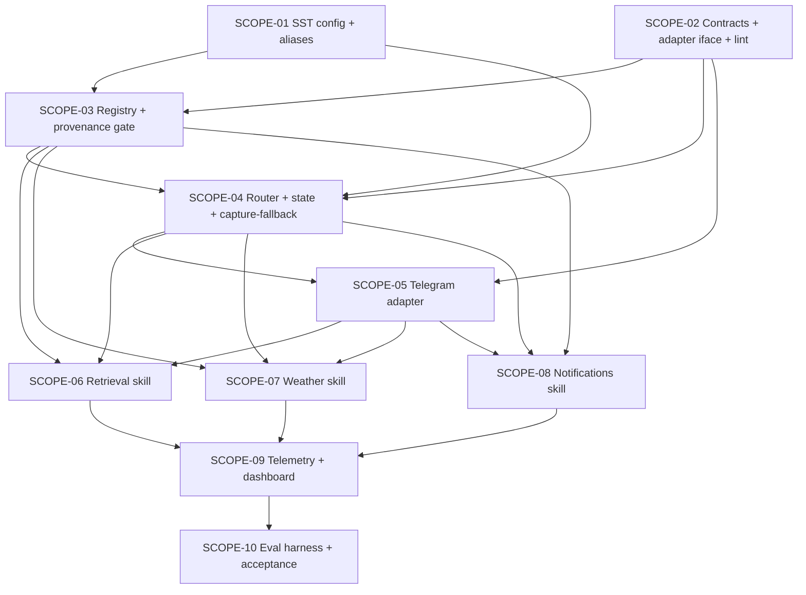

# Scopes — Spec 061 Conversational Assistant (Transport-Agnostic)

**Spec Status:** `in_progress`
**Status Ceiling (this run):** `specs_hardened` (workflow mode `product-to-planning`; no implementation)
**Workflow Mode:** `product-to-planning`
**Mode (this pass):** `regenerate` (replaces the analyst's skeletal scope titles with full sequential, testable, dependency-ordered scopes per the comprehensive design.md)
**Layout:** single-file scopes.md (10 scopes; per-scope dir conversion is owned by `bubbles.implement` at execution time)

---

## Execution Outline (REQUIRED alignment checkpoint)

### Phase Order

1. **SCOPE-01** — `assistant.*` + `assistant.transports.*` SST block authored in `config/smackerel.yaml` with NO-DEFAULTS / fail-loud semantics + legacy-key alias migration.
2. **SCOPE-02** — Canonical contract types (`AssistantMessage`, `AssistantResponse`, `TransportAdapter`, `Assistant` facade) plus a build-time package-import lint pinning the capability/adapter direction.
3. **SCOPE-03** — Skill registry foundation (`Skill`, `Manifest`, `Registry`, `RequireProvenance` gate) with skill-isolation lint; zero skills registered.
4. **SCOPE-04** — Intent router (ml/ sidecar; 3-band confidence; `/ask` `/weather` `/save` shortcuts) + conversational state store (`assistant_conversations` PostgreSQL table + idle sweep) + capability-layer capture-as-fallback. p95 < 800ms SLO. No adapter yet.
5. **SCOPE-05** — Telegram reference adapter (`internal/telegram/assistant_adapter/`) wired into `bot.go::handleMessage` ahead of `handleTextCapture`. Renders status / sources / confirm / disambiguation / error / captureRoute per UX §14.B.1. `/reset` shipped.
6. **SCOPE-06** — Retrieval Q&A skill (v1 #1). Wraps `/api/search` + `ml/` sidecar synthesis; sources always attached; refusal-on-empty proves provenance gate end-to-end.
7. **SCOPE-07** — Weather skill (v1 #2). Provider abstraction + LRU cache + offer-to-capture on provider outage.
8. **SCOPE-08** — Notifications skill (v1 #3). Spec 054 scheduler reuse with additive `Source`+`Originator` extension; confirm-card three-outcome state machine; `assistant_proposal` audit ALTER.
9. **SCOPE-09** — 11 Prometheus metrics + structured log fields + OTel span tree + Grafana dashboard fragment under `deploy/observability/grafana/dashboards/`.
10. **SCOPE-10** — Evaluation harness + ≥150-message labeled corpus; CI gate at ≥85% routing accuracy AND 100% capture-fallback on the capture subset (spec §3 Success Signal); v1 acceptance run captured in `report.md`.

### New Types & Signatures (header-only, no implementation)

```go
// internal/assistant/contracts/   (SCOPE-02)
type AssistantMessage struct {...}            // Kind: text|confirm|disambiguation|reset
type AssistantResponse struct {...}           // Status, Body, Sources, ConfirmCard, DisambiguationPrompt, ErrorCause, CaptureRoute
type StatusToken string                       // closed vocab — design §2.2
type ErrorCause string                        // closed vocab — design §2.2
type Source struct {ID, Title; Kind; Ref SourceRef}
type ConfirmCard struct {...}; type DisambiguationPrompt struct {...}
type TransportAdapter interface {Name, Translate, Render, Identity, Start, Stop}
type Assistant interface {Handle(ctx, msg) (AssistantResponse, error)}

// internal/assistant/registry/   (SCOPE-03)
type Skill interface {Manifest() Manifest; Execute(ctx, req) (SkillResponse, error)}
type Manifest struct {ID, IntentLabels, RequiredScopes, SideEffects, LatencyBudget, RequiresProvenance, EnableConfigKey}
type Registry interface {Register(s Skill) error; Dispatch(intent) (Skill, error); ListEnabled() []Manifest}

// internal/assistant/router/   (SCOPE-04)
type Router interface {Classify(ctx, msg) (Decision, error)}
type Decision struct {Intent; Confidence float64; Slots; Band; Candidates []IntentCandidate}

// internal/assistant/context/   (SCOPE-04)
type Store interface {Load(ctx, userID, transport) (Conversation, error); Persist(ctx, ...) error; SweepIdle(ctx) (int, error)}

// internal/telegram/assistant_adapter/   (SCOPE-05)
type Adapter struct {...} // implements contracts.TransportAdapter, Name() == "telegram"
```

**New DB migrations:**
- `assistant_conversations` table — SCOPE-04 (PostgreSQL primary key `(user_id, transport)`)
- `artifacts.assistant_proposal_payload JSONB` additive column — SCOPE-08
- `scheduler.Job.Source` + `scheduler.Job.Originator` additive fields — SCOPE-08 (CROSS-SPEC packet to spec 054 owner)
- spec 060 PASETO scope catalog: `assistant.skill.retrieval`, `assistant.skill.weather`, `assistant.skill.notifications.write` — SCOPE-05 prerequisite (read scopes), SCOPE-08 prerequisite (write scope) (CROSS-SPEC packet to spec 060 owner)

### Validation Checkpoints

- **After SCOPE-01:** Unit + functional config tests prove EVERY required `assistant.*` key fails loud on missing input AND legacy aliases (`min_confidence`, `classifier_model`) emit a WARN but parse. Catches missing-key regressions before any code consumes config.
- **After SCOPE-02:** Package-import lint test passes; golden fixtures for every `(status × error_cause × captureRoute × sources kind)` combination prove the contract surface is exhaustive. Catches contract drift before any consumer compiles against the wrong shape.
- **After SCOPE-03:** Skill-isolation lint passes (no skill imports any other skill); `RequireProvenance` gate unit-tested against synthesized-body-without-sources fixture (BS-007 proven in isolation). Catches the most dangerous Principle 8 regression before any real skill ships.
- **After SCOPE-04:** Capability-layer end-to-end without any adapter and without any skill — fake adapter drives `Assistant.Handle` and asserts every text message lands with `CaptureRoute=true` (BS-001 + BS-005 proven at the capability layer). Stress test proves intent classifier p95 < 800ms (Gate G026). Catches both the regression-safe fallback path and the SLO before SCOPE-05 wires any user-visible surface.
- **After SCOPE-05:** Telegram e2e-api fixture POST of a plain note proves capture-as-fallback flows through the adapter without invoking any skill (BS-001 on real Telegram). Adapter-substitution test (design §11.2) proves the capability never reaches around the canonical interface. Catches adapter business-logic leaks before any skill is wired through Telegram.
- **After SCOPE-06/07/08:** Each skill's e2e-api proves its primary BS scenario on real `ml/` sidecar + real PostgreSQL + real provider/scheduler; each skill's stress test proves its manifest-declared latency budget (Gate G026). Provenance gate proven against the real retrieval skill (BS-007 end-to-end). Confirm-card timeout proven against real scheduler.
- **After SCOPE-09:** Metrics endpoint scrape after a simulated turn sequence shows all 11 metrics emitted with correct closed-vocabulary labels. Grafana dashboard fragment loads in the dev Grafana without panel errors. Catches metric cardinality / label-vocabulary drift before operator dashboards depend on it.
- **After SCOPE-10:** Evaluation harness runs against the deployed capability layer and meets the ≥85% routing accuracy + 100% capture-fallback success-signal threshold from spec §3. v1 acceptance gate.

---

## Cross-Spec Dependencies (BLOCKING — Packets Required Per `bubbles-artifact-ownership-routing`)

| Cross-spec edit | Owned by | Required by SCOPE | Packet shape | Status |
|----------------|---------|--------------------|--------------|--------|
| spec 060 PASETO scope catalog: add `assistant.skill.retrieval` (read) | spec 060 owner | SCOPE-05 (Telegram adapter checks scope before dispatch) | Catalog-addition packet + default-grant migration SQL (design §14 step 1+2) | Packet TBD at SCOPE-05 implement time → `[scopes/05/cross-spec-packet-060-retrieval.md]` |
| spec 060 PASETO scope catalog: add `assistant.skill.weather` (read) | spec 060 owner | SCOPE-05 (same path) | Catalog-addition packet + default-grant migration SQL | Packet TBD at SCOPE-05 implement time → `[scopes/05/cross-spec-packet-060-weather.md]` |
| spec 060 PASETO scope catalog: add `assistant.skill.notifications.write` (write) | spec 060 owner | SCOPE-08 (notifications skill dispatch) | Catalog-addition packet + owner-only grant migration SQL (design §14 step 3) | Packet TBD at SCOPE-08 implement time → `[scopes/08/cross-spec-packet-060-notifications.md]` |
| spec 054 scheduler `Job.Source` + `Job.Originator` additive fields | spec 054 owner | SCOPE-08 (notifications skill calls `scheduler.Schedule(Job{Source, Originator})`) | Additive-field packet (zero-valued backward compatible) + spec 054 test updates | Packet TBD at SCOPE-08 implement time → `[scopes/08/cross-spec-packet-054-scheduler.md]` |

---

## Scope DAG



Key edges:
- **SCOPE-01 → SCOPE-03/04:** registry + router read SST at construction.
- **SCOPE-02 → SCOPE-03/04/05:** every layer below imports the canonical contracts.
- **SCOPE-03 → SCOPE-04:** router calls `Registry.ListEnabled()` for intent labels.
- **SCOPE-04 → SCOPE-05:** adapter calls `Assistant.Handle`, which depends on router + state.
- **SCOPE-05 → SCOPE-06/07/08:** every v1 skill is exercised end-to-end through the Telegram reference adapter for e2e-api coverage.
- **SCOPE-06/07/08 → SCOPE-09:** dashboards depend on metrics each skill emits.
- **SCOPE-09 → SCOPE-10:** eval harness emits the same metrics + reads them to compute acceptance numbers.

---

## Open Items Resolution

All open items from spec §13 + design §13 are resolved at planning time:

| Open item | Source | Resolution | Where it lands |
|----------|--------|------------|----------------|
| Intent classifier substrate | spec §13 Q1 | ml/ sidecar (existing FastAPI); model from SST `assistant.capability.intent.model` | SCOPE-04 |
| Notifications skill: reuse spec 054 vs new scheduler | spec §13 Q2 | Reuse spec 054 with additive `Source`+`Originator` fields | SCOPE-08 (cross-spec packet to spec 054) |
| Per-skill PASETO scopes vs `assistant.*` granularity | spec §13 Q3 | Per-skill: 3 new spec 060 catalog entries | SCOPE-05 (read scopes), SCOPE-08 (write scope) |
| Sources rendering: inline `[1][2]` vs trailing block | spec §13 Q4 | Trailing numbered block on Telegram (UX §14.B.1); capability emits structured `Source` values, rendering is adapter's job | SCOPE-05 (renderer) |
| `/reset` Telegram command | design §13 item 1 | Ship in SCOPE-05 (incremental cost trivial; adapter already dispatches commands) | SCOPE-05 |
| SST alias migration (`assistant.intent.*` → `assistant.capability.intent.*`) | design §13 item 2 | Ship aliases with WARN in SCOPE-01; alias removal is assigned to a separate spec filed at SCOPE-01 close | SCOPE-01 |
| Conversational state PostgreSQL vs in-memory | design §13 item 6 | PostgreSQL (overrides UX provisional in-memory recommendation) | SCOPE-04 |
| Eval harness sizing | design §13 item 4 | ≥150 messages (≥30 per intent label) with seeded RNG; ≥85% routing accuracy CI gate | SCOPE-10 |

**Open items remaining:** NONE. All design + UX decisions are ratified or assigned to a clearly-named separate spec.

---

## Scope Index (status snapshot)

| Scope | Title | Status | Depends On | Stress test? | Owns BS |
|-------|-------|--------|-----------|--------------|---------|
| SCOPE-01 | Assistant SST config block & fail-loud validation | Not Started | — | No | BS-009 |
| SCOPE-02 | Canonical contracts & TransportAdapter interface | Not Started | — | No | — |
| SCOPE-03 | Skill registry foundation & Provenance gate | Not Started | SCOPE-01, SCOPE-02 | No | BS-008 (registry); BS-007 (gate in isolation) |
| SCOPE-04 | Intent router + conversational state + capture-as-fallback | Not Started | SCOPE-01, SCOPE-02, SCOPE-03 | **Yes** (router p95 < 800ms; Gate G026) | BS-005 |
| SCOPE-05 | Telegram reference adapter (v1) | Not Started | SCOPE-02, SCOPE-04 | No | BS-001, BS-010 |
| SCOPE-06 | Retrieval Q&A skill (v1 #1) | Not Started | SCOPE-03, SCOPE-04, SCOPE-05 | **Yes** (skill p95 from manifest; Gate G026) | BS-002, BS-007 (end-to-end) |
| SCOPE-07 | Weather skill (v1 #2) | Not Started | SCOPE-03, SCOPE-04, SCOPE-05 | **Yes** (skill p95 from manifest; Gate G026) | BS-003, BS-006 |
| SCOPE-08 | Notifications skill with confirmation flow (v1 #3) | Not Started | SCOPE-03, SCOPE-04, SCOPE-05 + cross-spec packets to spec 054 + spec 060 | **Yes** (skill p95 + confirm-timeout under load; Gate G026) | BS-004 |
| SCOPE-09 | Telemetry, metrics, operator dashboard fragment | Not Started | SCOPE-06, SCOPE-07, SCOPE-08 | No | — |
| SCOPE-10 | Evaluation harness & v1 acceptance set | Not Started | SCOPE-09 | No | — (acceptance gate covers BS-001..010 in aggregate) |

**BS coverage map (full):**

| BS scenario | Owner scope | Also exercised in |
|------------|-------------|-------------------|
| BS-001 plain note captured (regression) | SCOPE-05 (Telegram e2e) | SCOPE-04 (capability layer, fake adapter) |
| BS-002 high-confidence retrieval w/ citations | SCOPE-06 | SCOPE-10 (acceptance) |
| BS-003 weather provider-attributed | SCOPE-07 | SCOPE-10 |
| BS-004 notification confirm flow | SCOPE-08 | SCOPE-10 |
| BS-005 ambiguous → capture | SCOPE-04 | SCOPE-05 (Telegram e2e), SCOPE-10 |
| BS-006 weather provider outage | SCOPE-07 | SCOPE-10 |
| BS-007 synthesis without provenance rejected | SCOPE-03 (gate unit test) | SCOPE-06 (end-to-end with retrieval skill), SCOPE-10 |
| BS-008 disabled skill not invoked | SCOPE-03 (registry construction) | SCOPE-01 (config), SCOPE-10 |
| BS-009 missing SST aborts startup | SCOPE-01 | — |
| BS-010 Telegram e2e (v1 acceptance) | SCOPE-05 | SCOPE-10 |

---

## SCOPE-01 — Assistant SST config block & fail-loud validation

**Scope-Kind:** ci-config

**Summary:** Author the full `assistant.*` + `assistant.transports.telegram.*` SST schema in `config/smackerel.yaml`, wire fail-loud validation for every key, and ship backward-compatible aliases for the `assistant.intent.*` → `assistant.capability.intent.*` rename.

**Status:** Not Started
**Depends On:** —

### Gherkin Scenarios (owned)

- **BS-009 — Missing required SST config aborts core startup (NO-DEFAULTS)** — spec.md §5.

### Implementation Plan

1. Author the full schema fragment in `config/smackerel.yaml.template` per design §7.1 (every `${VAR:?...}` substitution; no `${VAR:-default}` fallback anywhere).
2. Extend `scripts/commands/config.sh` to validate every required key during `./smackerel.sh config generate`; fail with `[F061-SST-MISSING] <key>` on any missing value.
3. Implement the 6 startup validation rules from design §7.2 (SCOPE-04/07/08 dependency reachability pings are owned by their respective scopes; only structural validations land here): non-empty values, `borderline_floor ≤ high_floor`, ≥1 transport enabled when `assistant.enabled=true`, `state_key` WARN.
4. Implement legacy-key aliases per design §7.3: accept `assistant.intent.min_confidence` and `assistant.intent.classifier_model` with a WARN log naming the new keys.
5. Document the SST surface in `docs/smackerel.md` (Assistant Capability section) referencing each key's purpose. NO defaults documented anywhere.
6. Update `.env.docker/*.env` generation paths to include every new `ASSISTANT_*` env var.

### Test Plan

| Test type | Category | File / location | Description | Command | Live system | Maps to DoD |
|-----------|----------|-----------------|-------------|---------|-------------|-------------|
| Unit | `unit` | `internal/config/assistant_config_test.go` | Parser validates every required key; missing key → fail-loud with `[F061-SST-MISSING]` prefix; alias acceptance + WARN log assertion | `./smackerel.sh test unit` | No | DoD #1, #2, #3 |
| Unit | `unit` | `internal/config/assistant_config_validation_test.go` | `borderline_floor ≤ high_floor` rule; ≥1 transport when `assistant.enabled=true`; `state_key` WARN emission | `./smackerel.sh test unit` | No | DoD #4 |
| Functional | `functional` | `tests/config/assistant_config_generate_test.sh` | `./smackerel.sh config generate` against a `config/smackerel.yaml.template` fragment that omits one required key MUST exit non-zero with `[F061-SST-MISSING]`; passing fragment generates env files | `./smackerel.sh test integration` | Yes (real config compile) | DoD #5 |
| Functional | `functional` | `tests/config/assistant_config_alias_test.sh` | Legacy `assistant.intent.min_confidence` value flows into `assistant.capability.intent.high_floor` env var with WARN | `./smackerel.sh test integration` | Yes | DoD #6 |

### Definition of Done

**Core items:**

- [ ] Every SST key from design §7.1 present in `config/smackerel.yaml.template` with `${VAR:?...}` substitution → Evidence: [report.md#scope-01-sst-keys]
- [ ] Every key documented in `docs/smackerel.md` Assistant Capability section → Evidence: [report.md#scope-01-docs]
- [ ] BS-009 unit test demonstrates missing key aborts parse with `[F061-SST-MISSING]` prefix → Evidence: [report.md#scope-01-bs-009]
- [ ] `borderline_floor ≤ high_floor` validation rejects invalid pairs → Evidence: [report.md#scope-01-validation-floor]
- [ ] `./smackerel.sh config generate` functional test passes (missing-key + happy-path) → Evidence: [report.md#scope-01-config-generate]
- [ ] Legacy alias migration test passes (old key value flows into new key + WARN log captured) → Evidence: [report.md#scope-01-alias-migration]
- [ ] Consumer impact sweep complete: every grep hit for `assistant.intent.` across first-party consumer surfaces (config templates, generated env files, docs, Go source, test fixtures, deployment manifests, runbook navigation / breadcrumb / redirect / stale-reference targets) is either updated to `assistant.capability.intent.` or preserved deliberately as a backward-compat alias path; zero stale first-party references remain → Evidence: [report.md#scope-01-consumer-sweep]

### Consumer Impact Sweep

SCOPE-01 renames the SST key namespace `assistant.intent.*` → `assistant.capability.intent.*` (a public configuration contract). This sweep enumerates every first-party consumer surface that may reference the old keys and the disposition for each:

| Consumer surface | Search target | Disposition |
|------------------|---------------|-------------|
| `config/smackerel.yaml.template` | `assistant.intent.` literal | Updated to `assistant.capability.intent.` (new canonical) |
| `config/generated/*.env` | `ASSISTANT_INTENT_` env-var prefix | Regenerated from template; new vars co-exist with backward-compat aliases |
| `docs/smackerel.md` Assistant Capability section | `assistant.intent.` literal | Updated to reference new keys; alias-compat note preserved |
| `internal/` Go source | grep `assistant.intent` / `AssistantIntent` identifiers | Updated to new key constants; alias path preserved at parser boundary |
| Test fixtures under `tests/` and `internal/.../testdata/` | grep for old keys | Updated; one fixture under `internal/config/assistant_config_test.go` deliberately retains the old key to assert WARN-and-accept alias behaviour |
| Deployment manifests in `deploy/` and `<knb>/smackerel/home-lab/` | grep `assistant.intent` / `ASSISTANT_INTENT_` | Routed to knb adapter owner via cross-repo packet at SCOPE-01 close; alias accepted in transition window |
| Operator runbook navigation, breadcrumbs, deep links in `docs/` | grep `assistant intent` (loose) | Updated to new naming; redirects added where doc anchors changed |

This sweep is exhaustive at SCOPE-01 implement time; the DoD item below proves zero stale first-party references remain after the rename ships.

**Build Quality Gate (grouped):**

- [ ] Zero warnings (build + lint + tests); zero deferrals; `./smackerel.sh lint` + `./smackerel.sh format --check` clean; artifact lint clean; `docs/smackerel.md` aligned with shipped schema → Evidence: [report.md#scope-01-build-quality]

---

## SCOPE-02 — Canonical message contracts & transport adapter interface

**Scope-Kind:** contract-only

**Summary:** Implement `internal/assistant/contracts/` with the full `AssistantMessage`, `AssistantResponse`, `TransportAdapter`, `Assistant` facade types from design §2, plus a build-time package-import lint enforcing capability/adapter direction.

**Status:** Not Started
**Depends On:** —

### Gherkin Scenarios (owned)

— (foundation scope; no BS directly owned; every BS depends on these contracts)

### Implementation Plan

1. Create `internal/assistant/contracts/` package per design §10 module layout (`message.go`, `response.go`, `source.go`, `adapter.go`, `assistant.go`).
2. Define `AssistantMessage` (12 fields, 4 `MessageKind` constants, 2 `ConfirmChoice` constants, `Attachment`) per design §2.1.
3. Define `AssistantResponse` (10 fields, 8 `StatusToken` constants, 4 `ErrorCause` constants, 2 `SourceKind` constants, `Source`/`SourceRef`/`ArtifactRef`/`ExternalProviderRef`, `ConfirmCard`, `DisambiguationPrompt`/`DisambiguationChoice`) per design §2.2.
4. Define `TransportAdapter` interface (6 methods: `Name`, `Translate`, `Render`, `Identity`, `Start`, `Stop`) per design §2.3.
5. Define `Assistant` facade interface (single `Handle` method) per design §2.4.
6. Implement a build-time package-import lint test (`internal/assistant/contracts/import_lint_test.go`) that walks the import graph and FAILS if `internal/telegram/...` is imported from any `internal/assistant/...` package (capability MUST NOT import any adapter).
7. Author golden fixtures under `internal/assistant/contracts/testdata/golden/` covering every `(StatusToken × ErrorCause × CaptureRoute × Source kind)` combination relevant to v1 (target ≥ 12 golden fixtures).

### Test Plan

| Test type | Category | File / location | Description | Command | Live system | Maps to DoD |
|-----------|----------|-----------------|-------------|---------|-------------|-------------|
| Unit | `unit` | `internal/assistant/contracts/message_test.go` | `MessageKind` exhaustiveness; `ConfirmChoice` round-trip; `AssistantMessage` field validation | `./smackerel.sh test unit` | No | DoD #2 |
| Unit | `unit` | `internal/assistant/contracts/response_test.go` | `StatusToken` + `ErrorCause` exhaustiveness; `Source`/`SourceRef` discriminated-union round-trip; golden-fixture comparison for every `(status × error_cause × captureRoute × source kind)` combination | `./smackerel.sh test unit` | No | DoD #3, #4 |
| Unit | `unit` | `internal/assistant/contracts/adapter_iface_test.go` | `TransportAdapter` interface compiles; fake adapter implements every method; `Name()` returns closed vocab | `./smackerel.sh test unit` | No | DoD #5 |
| Unit | `unit` | `internal/assistant/contracts/import_lint_test.go` | Import-graph walk rejects any `internal/assistant/...` package that imports `internal/telegram/...` or any other `internal/<transport>/...` | `./smackerel.sh test unit` | No | DoD #6 |

### Definition of Done

**Core items:**

- [ ] `internal/assistant/contracts/` package created with all 5 files from design §10 → Evidence: [report.md#scope-02-package-layout]
- [ ] `AssistantMessage` + all enums per design §2.1 implemented with unit tests → Evidence: [report.md#scope-02-message]
- [ ] `AssistantResponse` + all enums + all sub-types per design §2.2 implemented → Evidence: [report.md#scope-02-response]
- [ ] ≥12 golden fixtures cover every v1 `(status × error_cause × captureRoute × source kind)` combination → Evidence: [report.md#scope-02-goldens]
- [ ] `TransportAdapter` + `Assistant` interfaces compile with at least one fake implementation in test code → Evidence: [report.md#scope-02-interfaces]
- [ ] Package-import lint rejects a deliberately-broken fixture that imports `internal/telegram/...` from `internal/assistant/...` → Evidence: [report.md#scope-02-import-lint]

**Build Quality Gate (grouped):**

- [ ] Zero warnings; zero deferrals; lint + format clean; artifact lint clean; docs aligned → Evidence: [report.md#scope-02-build-quality]

---

## SCOPE-03 — Skill registry foundation & Provenance gate

**Scope-Kind:** bootstrap

**Summary:** Implement `internal/assistant/registry/` per design §4 with the `Skill` interface, `Manifest` shape, registry registration/dispatch semantics, skill-isolation import-graph lint, and the `RequireProvenance` gate that mechanically guarantees BS-007. **Capability foundation scope** (`foundation: true`) — every concrete skill (SCOPE-06/07/08) depends on this.

**Status:** Not Started
**Depends On:** SCOPE-01, SCOPE-02
**Foundation:** `true` (per `bubbles-capability-foundation-design` — multi-skill axis)

### Gherkin Scenarios (owned)

- **BS-007 — Synthesis without provenance is rejected (Principle 8 hard constraint)** — owned at the gate level (unit-tested in isolation here; SCOPE-06 proves it triggers with a real skill on real graph drift).
- **BS-008 — Disabled skill is not invoked even on a perfect intent match** — owned at the registry-construction level (a skill whose `EnableConfigKey` resolves to `false` is NOT registered, so its intent labels never reach the router).

### Implementation Plan

1. Create `internal/assistant/registry/` package (`registry.go`, `skill.go`, `provenance.go`) per design §10.
2. Define `Skill` interface (`Manifest()`, `Execute(ctx, req)`) and `Manifest` struct (7 fields per design §4.1).
3. Define `SkillRequest` / `SkillResponse` / `ContextTurn` per design §4.1.
4. Implement `Registry` interface + impl (`Register`, `Dispatch`, `ListEnabled`) per design §4.2. `Register` reads the manifest's `EnableConfigKey` from SST and short-circuits registration when disabled.
5. Implement `RequireProvenance` gate per design §4.3: if a skill returns `RequiresProvenance=true` with non-empty `Body` and empty `Sources`, the facade rewrites the response to `Status=StatusSavedAsIdea, Body="I don't have a sourced answer for that.", CaptureRoute=true` and increments `assistant_provenance_violations_total{skill}`.
6. Implement skill-isolation lint test (`internal/assistant/registry/skill_isolation_test.go`) that walks the import graph under `internal/assistant/skills/*/` and fails if any skill imports any other skill package.
7. Document the registry foundation in `docs/smackerel.md` (Assistant → Skills section) including the extensibility path for future skills (e.g. email v2).

### Test Plan

| Test type | Category | File / location | Description | Command | Live system | Maps to DoD |
|-----------|----------|-----------------|-------------|---------|-------------|-------------|
| Unit | `unit` | `internal/assistant/registry/manifest_test.go` | `Manifest` field validation (ID non-empty; IntentLabels non-empty; LatencyBudget > 0; SideEffects in closed vocab) | `./smackerel.sh test unit` | No | DoD #1 |
| Unit | `unit` | `internal/assistant/registry/registry_test.go` | `Register` accepts fake skill; double-register returns error; `Dispatch` returns the right skill for a known intent and error for unknown; `ListEnabled` returns only registered manifests | `./smackerel.sh test unit` | No | DoD #2 |
| Unit | `unit` | `internal/assistant/registry/registry_disabled_test.go` | **BS-008** — Fake skill with `EnableConfigKey` resolving to `false` is NOT registered; `Dispatch` on its intent label returns "unknown intent"; `ListEnabled()` excludes it | `./smackerel.sh test unit` | No | DoD #3 |
| Unit | `unit` | `internal/assistant/registry/provenance_test.go` | **BS-007** — Fake skill with `RequiresProvenance=true` returning `Body="answer"` + `Sources=[]` triggers gate → response rewritten to refusal + `CaptureRoute=true`; counter incremented | `./smackerel.sh test unit` | No | DoD #4 |
| Unit | `unit` | `internal/assistant/registry/skill_isolation_test.go` | Import-graph walk under `internal/assistant/skills/*/` fails on deliberately-broken fixture that imports a sibling skill | `./smackerel.sh test unit` | No | DoD #5 |

### Definition of Done

**Core items:**

- [ ] `Skill` + `Manifest` + `SkillRequest` + `SkillResponse` + `ContextTurn` types implemented per design §4.1 → Evidence: [report.md#scope-03-skill-iface]
- [ ] `Registry` impl with `Register` / `Dispatch` / `ListEnabled` per design §4.2 → Evidence: [report.md#scope-03-registry]
- [ ] BS-008 — Disabled-skill registry test passes; disabled skill is unreachable end-to-end at the registry layer → Evidence: [report.md#scope-03-bs-008]
- [ ] BS-007 — `RequireProvenance` gate unit test proves synthesized-body-without-sources is rewritten to refusal + capture → Evidence: [report.md#scope-03-bs-007]
- [ ] Skill-isolation import-graph lint passes (rejects deliberately-broken fixture) → Evidence: [report.md#scope-03-isolation-lint]
- [ ] Registry foundation documented in `docs/smackerel.md` with extensibility path for future skills → Evidence: [report.md#scope-03-foundation-docs]

**Build Quality Gate (grouped):**

- [ ] Zero warnings; zero deferrals; lint + format clean; artifact lint clean; docs aligned → Evidence: [report.md#scope-03-build-quality]

---

## SCOPE-04 — Intent router + conversational state + capture-as-fallback

**Summary:** Implement `internal/assistant/router/` (ml/ sidecar bridge, 3-band confidence, slash-command shortcuts) + `internal/assistant/context/` (PostgreSQL `assistant_conversations` table, idle sweep ticker, reference resolution) + the capability-layer fallthrough that defaults to `CaptureRoute=true` on low confidence or sidecar unavailability. **No skill is registered in this scope** — every classified intent that would dispatch a skill instead lands as `CaptureRoute=true` so the regression-safe path is provable end-to-end through the capability layer with a fake adapter.

**Status:** Not Started
**Depends On:** SCOPE-01, SCOPE-02, SCOPE-03

### Gherkin Scenarios (owned)

- **BS-005 — Ambiguous intent falls back to capture (no silent skill execution)** — owned at the router/facade level (low-confidence band → `CaptureRoute=true`).

### Implementation Plan

1. Create `internal/assistant/router/` package per design §10 (`router.go`, `ml_router.go`, `shortcuts.go`).
2. Implement `Router` interface + `Decision` struct + `ConfidenceBand` enum per design §3.1.
3. Implement `ml_router.go` calling `POST /v1/intent/classify` on the existing `ml/` sidecar per design §3.3; payload includes `user_id`, `transport`, `text`, `intent_labels` (from `Registry.ListEnabled()`), `context_window` (from state store).
4. Implement 3-band logic per design §3.2 reading SST keys `assistant.capability.intent.high_floor` / `borderline_floor`.
5. Implement slash-command shortcuts (`/ask`, `/weather`, `/save`) per design §3.4 — capability-layer pre-check before router invocation.
6. Implement SLO enforcement: if router exceeds `assistant.capability.status_max_duration` budget, facade emits `Status=StatusUnavailable, ErrorCause=ErrInternalError, CaptureRoute=true` and increments `assistant_sidecar_unavailable_total{endpoint="classify"}`.
7. Create `internal/assistant/context/` package per design §10 (`store.go`, `pg_store.go`, `ticker.go`, `reference_resolver.go`).
8. Author PostgreSQL migration creating `assistant_conversations` table per design §6.1 schema (primary key `(user_id, transport)`, JSONB `working_context` + `pending_confirm` + `pending_disambig`, idle index).
9. Implement idle-sweep ticker per design §6.2 running every `assistant.capability.context.idle_sweep_interval`, deleting rows past `idle_timeout`.
10. Implement reference resolver per design §6.4 for "that one" / numeric references; unresolvable refs short-circuit with `Status=StatusUnavailable, ErrorCause=ErrSlotMissing`.
11. Implement `internal/assistant/facade.go` (the `Assistant` interface impl) wiring router + registry + state + provenance gate. Since SCOPE-04 ships zero skills, the facade's high-confidence branch in this scope returns `Status=StatusUnavailable, ErrorCause=ErrInternalError, CaptureRoute=true` and documents in code that the branch becomes reachable only once SCOPE-06/07/08 register real skills. NO `// TODO` comments.
12. Implement a `fakeTransportAdapter` test harness under `internal/assistant/facade_test.go` (design §11.2) that drives the facade end-to-end and asserts the capability never reaches around the canonical interface.
13. Author stress test for intent classifier p95 < 800ms per design §3.3 + Gate G026.

### Test Plan

| Test type | Category | File / location | Description | Command | Live system | Maps to DoD |
|-----------|----------|-----------------|-------------|---------|-------------|-------------|
| Unit | `unit` | `internal/assistant/router/router_test.go` | Golden classification cases (text → `Decision{Intent, Confidence, Band}`); each of the 3 bands; slot extraction round-trip | `./smackerel.sh test unit` | No | DoD #1 |
| Unit | `unit` | `internal/assistant/router/bands_test.go` | Band computation from SST floors; edge cases (`confidence == high_floor`, `confidence == borderline_floor`) | `./smackerel.sh test unit` | No | DoD #2 |
| Unit | `unit` | `internal/assistant/router/shortcuts_test.go` | `/ask` `/weather` `/save` short-circuit to `band=High, confidence=1.0` with fixed intent | `./smackerel.sh test unit` | No | DoD #3 |
| Unit | `unit` | `internal/assistant/context/reference_resolver_test.go` | "that one" → last source; numeric "open 2" → 2nd source; unresolvable → `ErrSlotMissing` | `./smackerel.sh test unit` | No | DoD #4 |
| Functional | `functional` | `internal/assistant/context/pg_store_test.go` | Real test PostgreSQL (via `./smackerel.sh test integration` stack): `Load` returns empty conversation for unknown `(user, transport)`; `Persist` round-trips JSONB; `SweepIdle` deletes rows past TTL | `./smackerel.sh test integration` | Yes (test PG) | DoD #5 |
| Functional | `functional` | `internal/assistant/router/ml_router_test.go` | Real test `ml/` sidecar: classify returns `Decision`; sidecar 5xx → `band=Low` + counter increment; SLO budget exceed → `ErrInternalError` + `CaptureRoute=true` | `./smackerel.sh test integration` | Yes (test ml/) | DoD #6 |
| Integration | `integration` | `internal/assistant/facade_test.go` | **BS-005** — Fake adapter drives `Assistant.Handle("weather")` with router returning confidence 0.40 → response has `CaptureRoute=true`, zero skills invoked; adapter-substitution invariant: capability calls only `Identity()` on the fake | `./smackerel.sh test integration` | Yes (test PG + test ml/) | DoD #7, #8 |
| Integration | `integration` | `internal/assistant/facade_capture_fallback_test.go` | Sidecar offline → router returns `band=Low` → facade emits `CaptureRoute=true` (BS-001 at capability layer, no adapter) | `./smackerel.sh test integration` | Yes | DoD #9 |
| Stress | `stress` | `tests/stress/assistant_router_p95_test.go` | Burst load against router; assert p95 < 800ms over ≥1000 classifications; Gate G026 SLO evidence | `./smackerel.sh test stress` | Yes | DoD #10 |
| E2E API (Regression E2E) | `e2e-api` | `tests/e2e/assistant_regression_e2e_test.sh` | Regression: persistent scenario-specific regression E2E coverage for every new/changed/fixed assistant behavior across SCOPE-04..08 and SCOPE-10 (router classification, capture-fallback, retrieval, weather, notifications confirm flow, eval acceptance subset); also serves as the broader assistant-capability E2E regression suite re-run on every change | `./smackerel.sh test e2e` | Yes | DoD #11, DoD #12 |

### Definition of Done

**Core items:**

- [ ] `Router` + `Decision` + `ConfidenceBand` implemented per design §3 → Evidence: [report.md#scope-04-router]
- [ ] 3-band logic + slash-command shortcuts unit-tested → Evidence: [report.md#scope-04-bands]
- [ ] PostgreSQL `assistant_conversations` migration applied; `pg_store` CRUD tests pass against test PG → Evidence: [report.md#scope-04-state-store]
- [ ] Idle-sweep ticker deletes rows past TTL (functional test on real test PG) → Evidence: [report.md#scope-04-idle-sweep]
- [ ] Reference resolver handles "that one" / numeric / unresolvable cases → Evidence: [report.md#scope-04-refs]
- [ ] ml/ sidecar bridge calls real test sidecar; 5xx → low-band + counter; SLO exceed → ErrInternalError → Evidence: [report.md#scope-04-ml-bridge]
- [ ] **BS-005** — Ambiguous-intent integration test passes; zero skills invoked; CaptureRoute=true → Evidence: [report.md#scope-04-bs-005]
- [ ] Adapter-substitution invariant test passes (capability calls only `Identity()` on fake adapter; any other call panics the fake) → Evidence: [report.md#scope-04-adapter-substitution]
- [ ] Sidecar-offline integration test proves capture-as-fallback at capability layer (BS-001 precondition for SCOPE-05) → Evidence: [report.md#scope-04-sidecar-offline-fallback]
- [ ] **Gate G026** — Stress test proves router p95 < 800ms over ≥1000 classifications → Evidence: [report.md#scope-04-stress-p95]
- [ ] Scenario-specific E2E regression tests for every new/changed/fixed behavior across SCOPE-04..08 and SCOPE-10 are present and pass (router classification bands, capture-fallback fall-through, retrieval citation, weather provider attribution + outage capture, notification confirm flow with 3 terminal outcomes, eval acceptance subset) → Evidence: [report.md#scope-04-regression-e2e-scenario]
- [ ] Broader E2E regression suite passes after this scope ships (the full `./smackerel.sh test e2e` run completes green, proving no other assistant-capability or pre-existing Telegram flow has regressed) → Evidence: [report.md#scope-04-regression-e2e-broader]

**Build Quality Gate (grouped):**

- [ ] Zero warnings; zero deferrals; lint + format clean; artifact lint clean; docs aligned (router + state architecture documented) → Evidence: [report.md#scope-04-build-quality]

---

## SCOPE-05 — Telegram reference adapter (v1)

**Summary:** Implement `internal/telegram/assistant_adapter/` as the first `TransportAdapter`. Intercept the plain-text branch of `internal/telegram/bot.go::handleMessage` BEFORE `handleTextCapture`; translate inbound Telegram updates to `AssistantMessage`; render `AssistantResponse` using Telegram-native widgets per UX §14.B.1; honor `CaptureRoute=true` by delegating to existing `handleTextCapture` (regression-safe); ship `/reset` slash command. **PASETO scopes (`assistant.skill.retrieval`, `assistant.skill.weather`) MUST exist in the spec 060 catalog before this scope can be marked Done** (cross-spec packet to spec 060 owner).

**Status:** Not Started
**Depends On:** SCOPE-02, SCOPE-04 + cross-spec packet to spec 060 (read scopes)

### Gherkin Scenarios (owned)

- **BS-001 — Plain note is captured (regression guard)** — owned at the Telegram-adapter level (proves capture-as-fallback flows end-to-end through the adapter on the real reference transport).
- **BS-010 — Telegram reference adapter end-to-end (v1 acceptance)** — owned (v1 acceptance use case).

### Implementation Plan

1. Create `internal/telegram/assistant_adapter/` package per design §10 (12 files: `adapter.go`, `translate_inbound.go`, `render_outbound.go`, `render_sources.go`, `render_confirm.go`, `render_disambig.go`, `callbacks.go`, `identity.go`, `reset.go`, + tests).
2. Implement `Adapter` struct satisfying `contracts.TransportAdapter`; `Name() == "telegram"`.
3. Implement `Translate` — `*tgbotapi.Update` → `AssistantMessage`. Resolve chat_id → user_id via existing spec 044 mapping.
4. Implement `Render` per UX §14.B.1: status token rendering (inline message edit), body rendering (plain text or markdown_v2 per SST), sources rendering (trailing numbered block, ≤5 entries, overflow indicator), confirm-card rendering (inline keyboard pair), disambiguation rendering (numbered list + optional inline keyboard), error rendering (terse single line), `CaptureRoute=true` delegation to existing `handleTextCapture`.
5. Implement `callbacks.go` — translate Telegram `callback_data` payloads back to `AssistantMessage{Kind: KindConfirm|KindDisambiguation, ...Ref, ...Choice}`.
6. Implement `/reset` slash command surface per design §13 item 1 — `AssistantMessage{Kind: KindReset}` causes the facade to delete the conversation row for `(user_id, "telegram")`.
7. Wire the adapter into `internal/telegram/bot.go::handleMessage` BEFORE the existing `handleTextCapture` fallback. Existing slash commands continue through their existing handlers (NOT routed through the assistant); only plain text is intercepted.
8. Implement per-transport telemetry tagging: every metric `assistant.adapter.*` emits with `transport="telegram"` label.
9. Code-review checklist line item: adapter business-logic leak risk per design §12 risk row 5 → confirm via the adapter-substitution test (already in SCOPE-04) PLUS the package-import lint (SCOPE-02).
10. Cross-spec packet routed to spec 060 owner per `bubbles-artifact-ownership-routing`: add `assistant.skill.retrieval` + `assistant.skill.weather` (read) scopes to the spec 060 catalog AND apply the default-grant migration to existing bot-shared tokens (design §14 steps 1+2). Packet stored at `specs/061-conversational-assistant/cross-spec/packet-060-read-scopes.md` at implement time.

### Test Plan

| Test type | Category | File / location | Description | Command | Live system | Maps to DoD |
|-----------|----------|-----------------|-------------|---------|-------------|-------------|
| Unit | `unit` | `internal/telegram/assistant_adapter/render_outbound_test.go` | Golden tests vs UX §14.B.1 rendering table for every `(status × confirm × disambig × error × captureRoute)` shape | `./smackerel.sh test unit` | No | DoD #1 |
| Unit | `unit` | `internal/telegram/assistant_adapter/render_sources_test.go` | Trailing numbered block format; 4096-char budget; overflow indicator; mixed-source (artifact + provider) coherence | `./smackerel.sh test unit` | No | DoD #2 |
| Unit | `unit` | `internal/telegram/assistant_adapter/render_confirm_test.go` | Inline keyboard pair `[positive][negative]` with `callback_data` encoding the `ConfirmRef` | `./smackerel.sh test unit` | No | DoD #3 |
| Unit | `unit` | `internal/telegram/assistant_adapter/callbacks_test.go` | `callback_data` → `AssistantMessage{Kind: KindConfirm, ConfirmRef, ConfirmChoice}` round-trip | `./smackerel.sh test unit` | No | DoD #4 |
| Unit | `unit` | `internal/telegram/assistant_adapter/translate_inbound_test.go` | `*tgbotapi.Update` → `AssistantMessage` round-trip; spec 044 chat→user resolution mocked at boundary | `./smackerel.sh test unit` | No | DoD #5 |
| Integration | `integration` | `internal/telegram/assistant_adapter/adapter_integration_test.go` | Adapter wired into real bot loop; capability layer with zero skills returns `CaptureRoute=true` for every text message → adapter calls real `handleTextCapture` → real `idea` artifact persisted to test PG | `./smackerel.sh test integration` | Yes (test PG, real adapter, tgbotapi mocked at boundary) | DoD #6, #7 |
| Integration | `integration` | `internal/telegram/assistant_adapter/reset_test.go` | `/reset` command deletes the `assistant_conversations` row for `(user_id, "telegram")` | `./smackerel.sh test integration` | Yes | DoD #8 |
| E2E API | `e2e-api` | `tests/e2e/telegram_assistant_bs001_test.sh` | **BS-001** — Telegram webhook fixture POST of "random thought" → adapter intercepts → capability returns CaptureRoute → `idea` artifact created with verbatim text; no skill invoked; per-transport counter `assistant.fallback_to_capture{transport="telegram"}` incremented | `./smackerel.sh test e2e` | Yes (full stack) | DoD #9 |
| E2E API | `e2e-api` | `tests/e2e/telegram_assistant_bs010_test.sh` | **BS-010** — Telegram webhook fixture POST → adapter → capability → seeded retrieval-skill (lands with SCOPE-06; this scope's BS-010 evidence is captured as part of SCOPE-06 integration with the adapter) returns sourced response → adapter renders body + trailing `sources:` block per UX §14.B.1; reply sent via tgbotapi mock; per-transport telemetry `transport="telegram"` | `./smackerel.sh test e2e` | Yes (full stack — pairs with SCOPE-06 landing) | DoD #10 |

### Definition of Done

**Core items:**

- [ ] `internal/telegram/assistant_adapter/` package created with all 9 files from design §10 → Evidence: [report.md#scope-05-package-layout]
- [ ] `Adapter` satisfies `TransportAdapter`; `Name() == "telegram"` → Evidence: [report.md#scope-05-adapter-iface]
- [ ] Render golden tests pass for every UX §14.B.1 shape → Evidence: [report.md#scope-05-render-goldens]
- [ ] Inbound translation handles text + confirm callbacks + disambiguation callbacks + reset → Evidence: [report.md#scope-05-translate]
- [ ] `/reset` slash command deletes `assistant_conversations` row → Evidence: [report.md#scope-05-reset]
- [ ] `handleMessage` wired to invoke adapter BEFORE `handleTextCapture` for plain text → Evidence: [report.md#scope-05-handlemessage-wiring]
- [ ] Existing slash commands continue through existing handlers (no regression) → Evidence: [report.md#scope-05-slash-cmd-regression]
- [ ] **BS-001** — Plain-text Telegram update creates an `idea` artifact via capture-as-fallback through the adapter (e2e-api) → Evidence: [report.md#scope-05-bs-001]
- [ ] **BS-010** — Telegram e2e-api proves capability → adapter → tgbotapi flow end-to-end with per-transport telemetry (paired with SCOPE-06 retrieval skill landing) → Evidence: [report.md#scope-05-bs-010]
- [ ] Adapter-substitution test (from SCOPE-04) re-runs against the Telegram adapter and proves zero business-logic leak → Evidence: [report.md#scope-05-no-leak]
- [ ] **Cross-spec packet to spec 060 owner** (`assistant.skill.retrieval` + `assistant.skill.weather` catalog additions + default-grant migration) routed and accepted → Evidence: [report.md#scope-05-packet-060] + [specs/061-conversational-assistant/cross-spec/packet-060-read-scopes.md]

**Build Quality Gate (grouped):**

- [ ] Zero warnings; zero deferrals; lint + format clean; artifact lint clean; docs aligned (Telegram adapter documented in `docs/smackerel.md`) → Evidence: [report.md#scope-05-build-quality]

---

## SCOPE-06 — Retrieval Q&A skill (v1 #1)

**Summary:** Implement `internal/assistant/skills/retrieval/` per design §5.1 — wraps `/api/search` + ml/ sidecar synthesis with artifact-ID citations, source-assembly invariant under graph drift, refusal pattern when zero high-confidence sources (proves `RequireProvenance` gate end-to-end). PASETO scope `assistant.skill.retrieval` from SCOPE-05 catalog packet.

**Status:** Not Started
**Depends On:** SCOPE-03, SCOPE-04, SCOPE-05 (catalog packet 060 read scopes)

### Gherkin Scenarios (owned)

- **BS-002 — High-confidence retrieval question is answered with citations** — owned.
- **BS-007 — Synthesis without provenance is rejected** — end-to-end ownership (SCOPE-03 owns the gate in isolation; SCOPE-06 proves it triggers with a real skill on real graph drift).

### Implementation Plan

1. Create `internal/assistant/skills/retrieval/` package per design §10 (`retrieval.go`, `retrieval_test.go`).
2. Implement `Skill` satisfying the design §5.1 manifest (ID `"retrieval"`, IntentLabels `["retrieval.query"]`, RequiredScopes `["assistant.skill.retrieval"]`, SideEffects `ReadOnly`, LatencyBudget `5s`, RequiresProvenance `true`, EnableConfigKey `assistant.capability.skills.retrieval.enabled`).
3. Implement the flow per design §5.1: `POST /api/search` → ml/ sidecar `POST /v1/synthesize` → assemble `[]Source` from cited artifact IDs with `Title` + `CapturedAt` lookup → cap at `assistant.capability.sources_max` + set `SourcesOverflowCount`.
4. Implement source-assembly invariant under graph drift: cited artifact ID that does not exist → drop + increment `assistant_source_assembly_drops_total{cause="missing_artifact"}`; if ALL cited artifacts are missing → empty `Sources[]` → `RequireProvenance` gate refuses + captures.
5. Register the skill in the assistant facade construction path; routed by intent `"retrieval.query"`.
6. Document the skill in `docs/smackerel.md` Assistant → Skills → Retrieval section.

### Test Plan

| Test type | Category | File / location | Description | Command | Live system | Maps to DoD |
|-----------|----------|-----------------|-------------|---------|-------------|-------------|
| Unit | `unit` | `internal/assistant/skills/retrieval/manifest_test.go` | Manifest matches design §5.1 exactly (every field) | `./smackerel.sh test unit` | No | DoD #1 |
| Unit | `unit` | `internal/assistant/skills/retrieval/source_assembly_test.go` | Cited artifact IDs → `[]Source`; missing artifact dropped + counter; ALL-missing → empty `Sources[]` triggers refusal | `./smackerel.sh test unit` | No | DoD #2 |
| Functional | `functional` | `internal/assistant/skills/retrieval/retrieval_test.go` | Real test ml/ sidecar + real test PG seeded with ≥3 "Tailscale" artifacts: `Execute` returns body + ≥1 ArtifactRef source | `./smackerel.sh test integration` | Yes (test PG + test ml/) | DoD #3 |
| Integration | `integration` | `internal/assistant/skills/retrieval/retrieval_integration_test.go` | Capability + Telegram adapter end-to-end: text "what about Tailscale?" → router classifies retrieval.query → skill executes → response has body + sources; adapter renders trailing block | `./smackerel.sh test integration` | Yes | DoD #4 |
| E2E API | `e2e-api` | `tests/e2e/assistant_bs002_test.sh` | **BS-002** — Telegram webhook fixture POST → full stack → reply contains synthesized answer + trailing `sources:` block citing artifact IDs; zero graph mutation | `./smackerel.sh test e2e` | Yes (full stack) | DoD #5 |
| E2E API | `e2e-api` | `tests/e2e/assistant_bs007_test.sh` | **BS-007 end-to-end** — Force ml/ sidecar to return cited artifact IDs that do NOT exist in graph → skill returns empty `Sources[]` → gate fires → response body is refusal + `CaptureRoute=true` → `idea` artifact created; counter `assistant_provenance_violations_total{skill="retrieval"}` incremented | `./smackerel.sh test e2e` | Yes (full stack) | DoD #6 |
| Stress | `stress` | `tests/stress/assistant_retrieval_p95_test.go` | Burst load against retrieval skill on seeded graph; assert p95 < 5s manifest budget; Gate G026 | `./smackerel.sh test stress` | Yes | DoD #7 |

### Definition of Done

**Core items:**

- [ ] Manifest matches design §5.1 exactly → Evidence: [report.md#scope-06-manifest]
- [ ] Skill registered in facade construction; routed by `retrieval.query` intent → Evidence: [report.md#scope-06-registration]
- [ ] Source-assembly invariant proven on graph drift (drop + counter; all-missing → refusal) → Evidence: [report.md#scope-06-source-assembly]
- [ ] **BS-002** — High-confidence retrieval e2e returns sourced answer with artifact-ID citations → Evidence: [report.md#scope-06-bs-002]
- [ ] **BS-007 end-to-end** — Empty-sources case from real skill triggers gate; refusal + capture + counter → Evidence: [report.md#scope-06-bs-007]
- [ ] Telegram trailing `sources:` block rendering verified end-to-end → Evidence: [report.md#scope-06-render-sources]
- [ ] **Gate G026** — Stress test proves skill p95 < 5s manifest budget → Evidence: [report.md#scope-06-stress-p95]

**Build Quality Gate (grouped):**

- [ ] Zero warnings; zero deferrals; lint + format clean; artifact lint clean; docs aligned → Evidence: [report.md#scope-06-build-quality]

---

## SCOPE-07 — Weather skill (v1 #2)

**Summary:** Implement `internal/assistant/skills/weather/` per design §5.2 — `Provider` abstraction with one v1 concrete provider (open-meteo or compatible), LRU cache keyed on `(provider, location, forecast_window)` with TTL from SST, failure mode → `ErrProviderUnavailable` + offer-to-capture confirm card, slot extraction for location with disambiguation prompt on missing slot. PASETO scope `assistant.skill.weather` from SCOPE-05 catalog packet. Weather provider API key managed via Infisical per spec 150.

**Status:** Not Started
**Depends On:** SCOPE-03, SCOPE-04, SCOPE-05 (catalog packet 060 read scopes)

### Gherkin Scenarios (owned)

- **BS-003 — Weather query returns provider-attributed answer** — owned.
- **BS-006 — Weather provider outage falls back to capture** — owned.

### Implementation Plan

1. Create `internal/assistant/skills/weather/` package per design §10 (`weather.go`, `provider.go`, `open_meteo.go`, `cache.go`, `weather_test.go`).
2. Implement `Skill` satisfying the design §5.2 manifest.
3. Implement `Provider` interface (`Name`, `Lookup`) + one concrete impl (open-meteo or equivalent; selection via SST `assistant.capability.skills.weather.provider`).
4. Implement LRU cache per design §5.2 keyed on `(provider, location, forecast_window)`, TTL from `assistant.capability.skills.weather.cache_ttl`. Cache hit emits `ExternalProviderRef{RetrievedAt: <original retrieval time>}` (NOT cache hit time) for honest freshness display.
5. Implement failure mode: provider 5xx / timeout / DNS failure → `SkillResponse{Status: StatusUnavailable, ErrorCause: ErrProviderUnavailable, Body: "weather: unavailable"}`. Facade attaches offer-to-capture `ConfirmCard`.
6. Implement slot extraction: location required; missing → `ErrSlotMissing` + 1-choice disambiguation prompt asking for city.
7. Wire Infisical secret `WEATHER_PROVIDER_API_KEY` per spec 150 (NOT in `.env.secrets`; spec 150 gate enforces).
8. Register the skill in facade construction.

### Test Plan

| Test type | Category | File / location | Description | Command | Live system | Maps to DoD |
|-----------|----------|-----------------|-------------|---------|-------------|-------------|
| Unit | `unit` | `internal/assistant/skills/weather/manifest_test.go` | Manifest matches design §5.2 exactly | `./smackerel.sh test unit` | No | DoD #1 |
| Unit | `unit` | `internal/assistant/skills/weather/cache_test.go` | LRU cache hit/miss; TTL expiry; hit emits original `RetrievedAt` (not cache hit time) | `./smackerel.sh test unit` | No | DoD #2 |
| Unit | `unit` | `internal/assistant/skills/weather/provider_test.go` | Provider 5xx → `ErrProviderUnavailable`; timeout → same; DNS failure → same; slot-missing → `ErrSlotMissing` + disambig prompt | `./smackerel.sh test unit` | No | DoD #3 |
| Functional | `functional` | `internal/assistant/skills/weather/weather_test.go` | Real provider sandbox if open-meteo allows; else recorded fixture replay against in-process HTTP server (external dep per `bubbles-test-environment-isolation`) | `./smackerel.sh test integration` | Yes (provider sandbox OR fixture replay) | DoD #4 |
| Integration | `integration` | `internal/assistant/skills/weather/weather_integration_test.go` | Capability + Telegram adapter end-to-end: "weather in Seattle" → router → skill → provider → adapter renders body + trailing provider+timestamp block | `./smackerel.sh test integration` | Yes | DoD #5 |
| E2E API | `e2e-api` | `tests/e2e/assistant_bs003_test.sh` | **BS-003** — Telegram webhook fixture POST "weather in Seattle today" → full stack → reply contains forecast + `ExternalProviderRef` showing provider name + retrieval timestamp; zero graph mutation | `./smackerel.sh test e2e` | Yes | DoD #6 |
| E2E API | `e2e-api` | `tests/e2e/assistant_bs006_test.sh` | **BS-006** — Provider stubbed to return 5xx → reply renders error line `weather: unavailable` + offer-to-capture confirm card; counter `assistant_skill_invocations_total{skill="weather",outcome="provider_unavailable"}` incremented; user confirm → request captured as `idea` | `./smackerel.sh test e2e` | Yes | DoD #7 |
| Stress | `stress` | `tests/stress/assistant_weather_p95_test.go` | Burst load with cache hit/miss mix; assert p95 < 3s manifest budget; assert cache hit ratio under load matches expectation; Gate G026 | `./smackerel.sh test stress` | Yes | DoD #8 |

### Definition of Done

**Core items:**

- [ ] Manifest matches design §5.2 exactly → Evidence: [report.md#scope-07-manifest]
- [ ] Provider interface + one concrete impl shipped; selection via SST → Evidence: [report.md#scope-07-provider]
- [ ] LRU cache with SST TTL; hit emits original `RetrievedAt` → Evidence: [report.md#scope-07-cache]
- [ ] Weather API key managed via Infisical per spec 150 (NOT in `.env.secrets`); spec 150 gate passes → Evidence: [report.md#scope-07-secret]
- [ ] Slot-missing → disambiguation prompt asking for city → Evidence: [report.md#scope-07-slot-missing]
- [ ] **BS-003** — Weather query e2e returns provider-attributed answer → Evidence: [report.md#scope-07-bs-003]
- [ ] **BS-006** — Provider outage e2e renders error + offer-to-capture; user confirm → capture → Evidence: [report.md#scope-07-bs-006]
- [ ] **Gate G026** — Stress test proves skill p95 < 3s manifest budget + cache behavior under load → Evidence: [report.md#scope-07-stress-p95]

**Build Quality Gate (grouped):**

- [ ] Zero warnings; zero deferrals; lint + format clean; artifact lint clean; docs aligned → Evidence: [report.md#scope-07-build-quality]

---

## SCOPE-08 — Notifications skill with confirmation flow (v1 #3)

**Summary:** Implement `internal/assistant/skills/notifications/` per design §5.3 — reuses spec 054 scheduler with additive `Source`+`Originator` field extension; confirm-card three-outcome state machine (confirmed / discarded_user / discarded_timeout); `assistant_proposal` audit ALTER on `artifacts` table; PASETO scope `assistant.skill.notifications.write` (write, NOT default-granted). **Two cross-spec packets required:** spec 054 (additive scheduler fields), spec 060 (write scope catalog + owner-only grant).

**Status:** Not Started
**Depends On:** SCOPE-03, SCOPE-04, SCOPE-05 + cross-spec packets to spec 054 (scheduler extension) + spec 060 (write scope)

### Gherkin Scenarios (owned)

- **BS-004 — Notification requires explicit confirmation before scheduling** — owned.

### Implementation Plan

1. Create `internal/assistant/skills/notifications/` package per design §10 (`notifications.go`, `scheduler_bridge.go`, `notifications_test.go`).
2. Implement `Skill` satisfying the design §5.3 manifest.
3. Implement the confirm-path flow per design §5.3: extract `{when, what}` slots → on ambiguous `when` return `ErrSlotMissing` + disambig prompt; on both slots present build `ConfirmCard` with `Payload` opaque encoding `{what, when_utc, user_id, transport}`.
4. Implement `ExecuteConfirmed(payload)` method called by facade on confirm callback → calls `scheduler.Schedule(scheduler.Job{Source: "assistant.skill.notifications", Originator: {Transport, ConfirmRef}, ...})`.
5. **CROSS-SPEC PACKET TO SPEC 054 OWNER** per `bubbles-artifact-ownership-routing`: extend `scheduler.Job` with two additive, backward-compatible fields (`Source`, `Originator`). Spec 054 file edit + spec 054 test updates in same PR; spec 054 owner reviews. Packet stored at `specs/061-conversational-assistant/cross-spec/packet-054-scheduler.md` at implement time.
6. Author DB migration: `ALTER TABLE artifacts ADD COLUMN assistant_proposal_payload JSONB;` (additive). Implement facade-side audit write of `kind='assistant_proposal'` artifact on EVERY proposal regardless of outcome (confirmed / discarded_user / discarded_timeout) per design §5.3 + UX §14.A.6.
7. **CROSS-SPEC PACKET TO SPEC 060 OWNER**: add `assistant.skill.notifications.write` (write) to the scope catalog + ship owner-only grant migration SQL (design §14 step 3). Packet stored at `specs/061-conversational-assistant/cross-spec/packet-060-write-scope.md` at implement time. SCOPE-08 cannot be marked Done until packet is accepted and migration applied in dev/test.
8. Implement confirm-card timeout: ticker checks pending confirms past `assistant.capability.skills.notifications.confirm_timeout`; on timeout → audit `outcome="discarded_timeout"`, emit a subsequent `AssistantResponse{Status: StatusReminderCancelled, CaptureRoute: true}` so the original message is captured.
9. Register the skill in facade construction.

### Test Plan

| Test type | Category | File / location | Description | Command | Live system | Maps to DoD |
|-----------|----------|-----------------|-------------|---------|-------------|-------------|
| Unit | `unit` | `internal/assistant/skills/notifications/manifest_test.go` | Manifest matches design §5.3 exactly | `./smackerel.sh test unit` | No | DoD #1 |
| Unit | `unit` | `internal/assistant/skills/notifications/state_machine_test.go` | Confirm-card 3 terminal outcomes (confirmed, discarded_user, discarded_timeout); each writes `assistant_proposal` artifact with correct `outcome` field | `./smackerel.sh test unit` | No | DoD #2 |
| Unit | `unit` | `internal/assistant/skills/notifications/slot_extraction_test.go` | Ambiguous `when` → `ErrSlotMissing` + disambig prompt with up to 3 candidate times | `./smackerel.sh test unit` | No | DoD #3 |
| Functional | `functional` | `internal/assistant/skills/notifications/notifications_test.go` | Real test PG + real spec 054 scheduler: confirmed payload → `scheduler.Schedule` invoked with `Source="assistant.skill.notifications"` + correct `Originator`; row visible in scheduler table | `./smackerel.sh test integration` | Yes | DoD #4 |
| Functional | `functional` | `internal/assistant/audit/writer_test.go` | `assistant_proposal` artifact row written with correct JSONB payload (all 3 outcomes covered) | `./smackerel.sh test integration` | Yes | DoD #5 |
| Integration | `integration` | `internal/assistant/skills/notifications/notifications_integration_test.go` | Capability + Telegram adapter end-to-end: "remind me to call Mom at 6pm" → confirm card rendered as inline keyboard → user confirm callback → scheduler row created → terminal status `reminder_confirmed` rendered | `./smackerel.sh test integration` | Yes | DoD #6 |
| E2E API | `e2e-api` | `tests/e2e/assistant_bs004_test.sh` | **BS-004** — Full Telegram fixture: request msg → confirm-card msg (no scheduler row yet) → confirm callback → scheduler row created → confirmation reply with parsed time | `./smackerel.sh test e2e` | Yes | DoD #7 |
| Stress | `stress` | `tests/stress/assistant_notifications_p95_test.go` | Burst load: concurrent confirm cards; assert p95 < 3s manifest budget; assert confirm-timeout sweep enforces timeouts under load; assert no double-schedule on `confirmRef` race; Gate G026 | `./smackerel.sh test stress` | Yes | DoD #8 |

### Definition of Done

**Core items:**

- [ ] Manifest matches design §5.3 exactly → Evidence: [report.md#scope-08-manifest]
- [ ] **Cross-spec packet to spec 054 owner** (additive `Source`+`Originator` scheduler fields) routed and accepted → Evidence: [report.md#scope-08-packet-054] + [specs/061-conversational-assistant/cross-spec/packet-054-scheduler.md]
- [ ] **Cross-spec packet to spec 060 owner** (write scope catalog addition + owner-only grant migration) routed, accepted, and applied in dev/test → Evidence: [report.md#scope-08-packet-060] + [specs/061-conversational-assistant/cross-spec/packet-060-write-scope.md]
- [ ] `ALTER TABLE artifacts ADD COLUMN assistant_proposal_payload JSONB;` migration applied → Evidence: [report.md#scope-08-migration]
- [ ] Confirm-card 3-outcome state machine unit-tested; each outcome writes `assistant_proposal` artifact → Evidence: [report.md#scope-08-state-machine]
- [ ] `assistant_proposal` audit artifact written REGARDLESS of outcome (functional test on real test PG) → Evidence: [report.md#scope-08-audit]
- [ ] **BS-004** — Notification e2e proves confirm-card flow with real scheduler row creation → Evidence: [report.md#scope-08-bs-004]
- [ ] **Gate G026** — Stress test proves skill p95 < 3s + confirm-timeout enforcement under load + no double-schedule on `confirmRef` race → Evidence: [report.md#scope-08-stress-p95]

**Build Quality Gate (grouped):**

- [ ] Zero warnings; zero deferrals; lint + format clean; artifact lint clean; docs aligned → Evidence: [report.md#scope-08-build-quality]

---

## SCOPE-09 — Telemetry, metrics, operator dashboard fragment

**Scope-Kind:** ci-config

**Summary:** Implement all 11 Prometheus metrics from design §8.1 with closed-vocabulary labels (bounded cardinality), structured log fields per design §8.2, OpenTelemetry span tree per design §8.3, and a Grafana dashboard fragment under `deploy/observability/grafana/dashboards/` covering the 7 panels listed in design §8.4.

**Status:** Not Started
**Depends On:** SCOPE-06, SCOPE-07, SCOPE-08

### Gherkin Scenarios (owned)

— (telemetry scope; no BS directly owned; provides observability for all prior BS scenarios)

### Implementation Plan

1. Implement Prometheus metric definitions in `internal/assistant/metrics/metrics.go`: 11 metrics from design §8.1 (counters, histograms, gauge), each with the exact label set from the table.
2. Wire metric emission into every site identified in design §8.1: router classification, skill invocation, capture fallback, confirm-card outcomes, disambig outcomes, active-thread gauge updates, provenance-violation counter, source-assembly drops, sidecar unavailability.
3. Implement structured log fields per design §8.2: every assistant log line includes the 10 listed fields.
4. Implement OpenTelemetry trace span tree per design §8.3 (10 spans from `assistant.adapter.translate` to `assistant.adapter.render`), each attributing `transport`, `user_id`, `assistant_turn_id`.
5. Author Grafana dashboard fragment at `deploy/observability/grafana/dashboards/assistant.json` with all 7 panels from design §8.4.
6. Update operator runbook in `docs/smackerel.md` (Operations → Assistant Capability section) with dashboard interpretation guidance.

### Test Plan

| Test type | Category | File / location | Description | Command | Live system | Maps to DoD |
|-----------|----------|-----------------|-------------|---------|-------------|-------------|
| Unit | `unit` | `internal/assistant/metrics/metrics_test.go` | Each metric defined with correct type + label set; label cardinality bounded by closed vocabularies (no unbounded labels) | `./smackerel.sh test unit` | No | DoD #1 |
| Unit | `unit` | `internal/assistant/metrics/labels_test.go` | Label values for `outcome`, `confidence_band`, `cause`, `endpoint`, `transport` MUST come from closed vocabularies; unknown values rejected | `./smackerel.sh test unit` | No | DoD #2 |
| Functional | `functional` | `tests/observability/assistant_metrics_scrape_test.sh` | Run a simulated turn sequence (1 retrieval, 1 weather happy, 1 weather outage, 1 notification proposed + confirmed, 1 capture fallback) against the test stack; scrape `/metrics`; assert all 11 metrics appear with expected label combinations | `./smackerel.sh test integration` | Yes | DoD #3 |
| Integration | `integration` | `tests/observability/assistant_trace_tree_test.go` | Run one full turn; assert OTel spans match design §8.3 tree (10 spans, correct parent/child links, every span has `transport` + `user_id` + `assistant_turn_id` attributes) | `./smackerel.sh test integration` | Yes (Jaeger collector) | DoD #4 |
| Functional | `functional` | `tests/observability/assistant_dashboard_load_test.sh` | Load `assistant.json` Grafana fragment into the dev Grafana via API; assert all 7 panels load without errors | `./smackerel.sh test integration` | Yes (Grafana) | DoD #5 |

### Definition of Done

**Core items:**

- [ ] All 11 Prometheus metrics from design §8.1 emitted with correct types + closed-vocabulary labels → Evidence: [report.md#scope-09-metrics]
- [ ] Structured log fields per design §8.2 present on every assistant log line → Evidence: [report.md#scope-09-logs]
- [ ] OpenTelemetry span tree per design §8.3 visible in Jaeger for a full turn → Evidence: [report.md#scope-09-traces]
- [ ] Grafana dashboard fragment with all 7 panels from design §8.4 loads cleanly → Evidence: [report.md#scope-09-dashboard]
- [ ] Operator runbook addendum in `docs/smackerel.md` covers dashboard interpretation → Evidence: [report.md#scope-09-runbook]

**Build Quality Gate (grouped):**

- [ ] Zero warnings; zero deferrals; lint + format clean; artifact lint clean; docs aligned → Evidence: [report.md#scope-09-build-quality]

---

## SCOPE-10 — Evaluation harness & v1 acceptance set

**Summary:** Implement an evaluation harness under `tests/eval/assistant/` with ≥150 ground-truth labeled messages (≥30 per intent label: retrieval, weather, notifications, capture, ambiguous) using seeded RNG. Run against the deployed capability layer and assert ≥85% routing accuracy AND 100% capture-fallback success on the capture subset (spec §3 Success Signal). v1 acceptance gate; ratifies `uservalidation.md`.

**Status:** Not Started
**Depends On:** SCOPE-09

### Gherkin Scenarios (owned)

— (acceptance gate; aggregates BS-001..010 evaluated end-to-end)

### Implementation Plan

1. Create `tests/eval/assistant/` directory.
2. Author `corpus.yaml` (or equivalent format) with ≥150 messages, each with `{text, ground_truth_intent, ground_truth_slots, ground_truth_capture_expected}` per design §13 item 4. Distribution: ≥30 retrieval, ≥30 weather, ≥30 notifications, ≥30 capture, ≥30 ambiguous-borderline.
3. Implement harness `tests/eval/assistant/harness.go` that:
   - Loads corpus.
   - Drives the capability layer via the fake adapter (NOT through Telegram — keeps the eval loop transport-agnostic and adapter-isolated).
   - Records router decision + skill invocation outcome + capture-fallback rate.
   - Computes routing accuracy + per-intent accuracy + capture-fallback success rate on capture subset.
   - Exits non-zero if accuracy < 85% OR capture-fallback success < 100% on capture subset.
4. Implement seeded RNG so the harness is deterministic.
5. Define SST thresholds: `assistant.eval.routing_accuracy_min` (recommend 0.85), `assistant.eval.capture_fallback_min` (1.0). NO defaults; fail-loud.
6. Author one Telegram-adapter end-to-end smoke run per scenario type (retrieval, weather, notification, capture) under `tests/e2e/assistant_acceptance_test.sh` — runs through real adapter to prove BS-010 path in aggregate.
7. Document harness in `docs/smackerel.md` Testing → Assistant Evaluation section.
8. Capture v1 acceptance run in `report.md` with full output; ratify all `uservalidation.md` items as `[x]`.

### Test Plan

| Test type | Category | File / location | Description | Command | Live system | Maps to DoD |
|-----------|----------|-----------------|-------------|---------|-------------|-------------|
| Functional | `functional` | `tests/eval/assistant/corpus_validation_test.go` | Corpus has ≥150 messages, ≥30 per label, every entry has all required fields, no duplicates, seeded RNG produces stable ordering | `./smackerel.sh test integration` | No | DoD #1, #2 |
| Functional | `functional` | `tests/eval/assistant/harness_test.go` | Harness runs against live capability layer (test ml/ + test PG + seeded corpus); reports accuracy + capture-fallback rate; exits non-zero on threshold miss | `./smackerel.sh test integration` | Yes | DoD #3 |
| Integration | `integration` | `tests/eval/assistant/acceptance_test.go` | Full acceptance run on the deployed stack; asserts ≥85% routing accuracy AND 100% capture-fallback on capture subset (spec §3 Success Signal) | `./smackerel.sh test integration` | Yes | DoD #4 |
| E2E API | `e2e-api` | `tests/e2e/assistant_acceptance_test.sh` | One Telegram-adapter end-to-end smoke run per scenario type (retrieval, weather, notification, capture); proves BS-010 path holds in aggregate | `./smackerel.sh test e2e` | Yes | DoD #5 |

### Definition of Done

**Core items:**

- [ ] Corpus has ≥150 messages, ≥30 per intent label, all required fields present, seeded-RNG deterministic ordering → Evidence: [report.md#scope-10-corpus]
- [ ] Harness implementation drives capability layer via fake adapter; computes accuracy + capture-fallback rate → Evidence: [report.md#scope-10-harness]
- [ ] Acceptance thresholds defined as SST (NO defaults); harness exits non-zero on miss → Evidence: [report.md#scope-10-thresholds]
- [ ] **v1 acceptance run** — ≥85% routing accuracy AND 100% capture-fallback on capture subset, captured in report.md with full output → Evidence: [report.md#scope-10-acceptance-run]
- [ ] Telegram-adapter end-to-end smoke runs pass for all 4 scenario types → Evidence: [report.md#scope-10-telegram-smoke]
- [ ] `uservalidation.md` ratified by owner (all `[x]`) including the per-scope items and the transport-agnostic generalization ratification item → Evidence: [report.md#scope-10-uservalidation-ratification]

**Build Quality Gate (grouped):**

- [ ] Zero warnings; zero deferrals; lint + format clean; artifact lint clean; docs aligned (harness documented in `docs/smackerel.md`) → Evidence: [report.md#scope-10-build-quality]

---

## Planning-Phase Counts (anti-fabrication anchor)

- **Scopes:** 10
- **DoD items total (Core + Build Quality Gate):** 83
  - SCOPE-01: 6 core + 1 BQG = 7
  - SCOPE-02: 6 core + 1 BQG = 7
  - SCOPE-03: 6 core + 1 BQG = 7
  - SCOPE-04: 10 core + 1 BQG = 11
  - SCOPE-05: 11 core + 1 BQG = 12
  - SCOPE-06: 7 core + 1 BQG = 8
  - SCOPE-07: 8 core + 1 BQG = 9
  - SCOPE-08: 8 core + 1 BQG = 9
  - SCOPE-09: 5 core + 1 BQG = 6
  - SCOPE-10: 6 core + 1 BQG = 7
- **Test Plan rows total:** 55
  - SCOPE-01: 4, SCOPE-02: 4, SCOPE-03: 5, SCOPE-04: 10, SCOPE-05: 10, SCOPE-06: 7, SCOPE-07: 8, SCOPE-08: 8, SCOPE-09: 5, SCOPE-10: 4
- **Stress tests (Gate G026 — SLA-defining scopes):** SCOPE-04, SCOPE-06, SCOPE-07, SCOPE-08 (4 stress tests total)
- **Cross-spec packets required:** 2 specs (spec 054 from SCOPE-08; spec 060 from SCOPE-05 + SCOPE-08 = 3 catalog additions across 2 packets to spec 060)

Test Plan row count is intentionally NOT equal to DoD core-item count because:
1. Some DoD items are non-test work (migration applied, package created, manifest matches design, documentation written, cross-spec packet routed) — these do not map to a Test Plan row.
2. Some Test Plan rows cover multiple DoD items (e.g. one unit test file may satisfy two related DoD items).

Each DoD test-related item is explicitly mapped via the `Maps to DoD` column in every Test Plan; reviewers verify per-row mapping at implement time.
