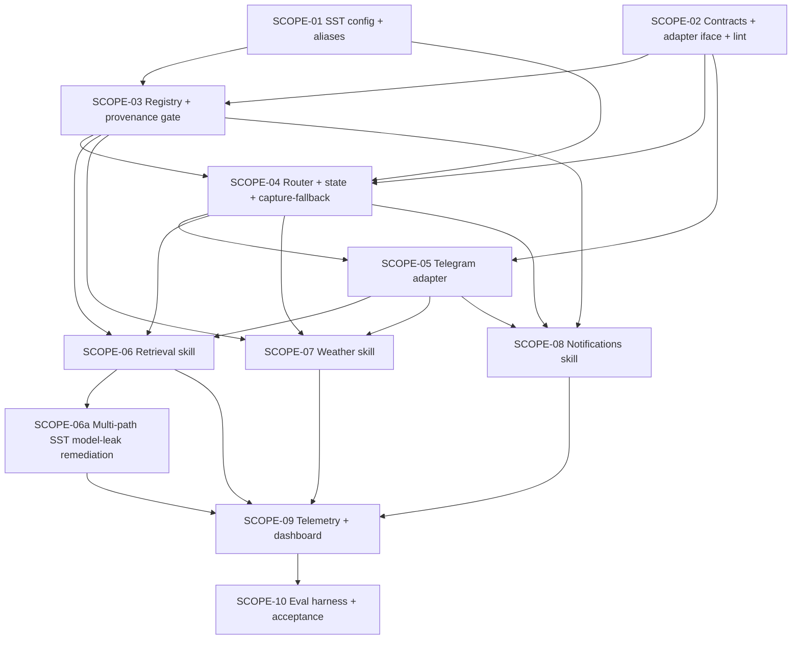

# Scopes — Spec 061 Conversational Assistant (Transport-Agnostic)

**Spec Status:** `in_progress`
**Status Ceiling (this run):** `done` (workflow mode `full-delivery`)
**Workflow Mode:** `full-delivery`
**Mode (this pass):** `refine` (2026-05-28 plan-phase rework from `bubbles.design` packet: rewrite SCOPE-03 and SCOPE-04 around the simplified facade-over-Spec-037 substrate; ratify SUBSTRATE-TOUCHPOINT-1; re-evaluate SCOPE-01 blockers)
**Layout:** single-file scopes.md (10 scopes; per-scope dir conversion is owned by `bubbles.implement` at execution time)

---

## Plan-Time Ratifications (2026-05-28 — bubbles.plan rework from bubbles.design packet)

The design.md revision dated 2026-05-28 reframed the capability layer as a **thin facade over Spec 037 substrate** (`agent.Router`, `agent.Bridge`, `agent.Executor`, `agent.NATSLLMDriver`, `agent.PostgresTracer`, `telegram.AgentBridge`) plus **exactly five net-new packages** (`internal/assistant/{contracts, provenance, context, confirm, telegram_adapter}` — per spec.md §3.1.4). The forbidden packages list (per design §10 + §11.3) explicitly bans `internal/assistant/{router, registry, executor, tracer, loader, llm, nats}/`. This rework reconciles SCOPE-03 and SCOPE-04 with that simplified shape, ratifies the remaining design open items, and re-evaluates SCOPE-01 blockers in light of the smaller surface area.

### Ratifications

| Open item (design §13) | Plan decision | Rationale |
|------------------------|---------------|-----------|
| **SUBSTRATE-TOUCHPOINT-1** (§13 OQ #1) — YAML metadata channel for user-facing scenarios: (a) additive top-level keys in scenario YAMLs + one-line Spec 037 `loader.go` allowlist addition routed via a Spec 037 bug folder, OR (b) sibling `config/assistant/scenarios.yaml` lookup keyed by scenario id, zero Spec 037 touch. | **Option (b) — sibling lookup file.** | Spec 037 is terminal `done`; opening a bug folder + routing a packet for a single allowlist line is disproportionate to the change. Option (b) is strictly additive, owned end-to-end by spec 061, and lets the capability layer own its own user-facing metadata (`user_facing`, `requires_provenance`, `user_facing_label`, `slash_shortcut`, `confirm_required`, `enable_sst_key`) without any cross-spec coordination. The scenario YAMLs themselves stay 100% Spec 037 loader-compliant. |
| **§13 OQ #4** — `Runner` interface location | **Option B (facade composes Spec 037 types directly).** | The facade calls `agent.Router.Route` then `agent.Executor.Run` directly; no need to extract a `Runner` interface. Zero Spec 037 touch. If a future test needs a fake runner, it fakes the executor at its existing interface. |
| **§13 OQ #5** — Scope ordering | Codified in the revised Scope DAG below. SCOPE-01 (SST) → SCOPE-02 (contracts + arch tests) → SCOPE-03 (3 scenario YAMLs + tool handlers + skills_manifest sibling lookup + provenance gate) → SCOPE-04 (facade + borderline post-processor + context store + capture-fallback) → SCOPE-05 (Telegram adapter wiring) → SCOPE-06/07/08 (skill end-to-end activations) → SCOPE-09 (telemetry) → SCOPE-10 (eval). | SCOPE-03 is the foundation (`foundation: true`) for every concrete user-facing scenario. SCOPE-04 must come after SCOPE-03 so the facade has scenarios to dispatch to. SCOPE-05 wires the first transport. SCOPE-06/07/08 light up one v1 skill each end-to-end. |
| **§13 OQ #2** — `/reset` Telegram command | Ship in SCOPE-05 (single-line addition to adapter command surface). | Unchanged from prior plan. |
| **§13 OQ #6** — Eval harness sizing | ≥150 messages, ≥30 per intent label (5 labels: retrieval / weather / notifications / capture / borderline), seeded RNG, CI gate ≥85% routing accuracy + 100% capture-fallback on capture subset. | Unchanged from prior plan; matches design §13 item 6. |
| **Conversational state storage** (UX provisional in-memory vs design recommendation) | PostgreSQL `assistant_conversations` table per design §6.1. | Survives capability-layer restart; single-SQL idle sweep; matches the audit boundary in design §6.3. |
| **Notifications scheduler** | Reuse Spec 054 with additive `Job.Source` + `Job.Originator` fields routed via a packet to spec 054 owner per `bubbles-artifact-ownership-routing`. | Unchanged from prior plan. |
| **PASETO scope granularity** | Per-skill: 3 new spec 060 catalog entries (`assistant.skill.retrieval`, `assistant.skill.weather`, `assistant.skill.notifications.write`). | Unchanged from prior plan. |
| **SST namespace** | Single clean `assistant.*` namespace per design §7.1 (revision drops the prior `assistant.intent.*` → `assistant.capability.intent.*` alias migration; nothing ever shipped to migrate from — see design §7.5). | **DISSOLVES SCOPE-01 prior alias-migration workstream.** |
| **SST template syntax** | Smackerel's existing SST pipeline uses **literal values** in `config/smackerel.yaml` enforced by `scripts/commands/config.sh required_value` + Go validators in `internal/config/`. The `${VAR:?...}` form is for deploy compose files only (Gate G028). Design §7.1's `${VAR:?...}` body is illustrative of which keys are required, NOT a literal template. SCOPE-01 implementation uses literal values + `required_value` per the existing convention. | **DISSOLVES SCOPE-01 Blocker 1 (DoD/architecture mismatch on `smackerel.yaml.template`).** |

### SCOPE-01 Blocker Re-evaluation

| Prior Blocker | Status after rework | Disposition |
|---------------|---------------------|-------------|
| **Blocker 1** — DoD #1 referenced a nonexistent `config/smackerel.yaml.template` with `${VAR:?...}` substitution that does not match smackerel's actual SST convention | **DISSOLVED** | SCOPE-01 DoD #1 below is rewritten to target `config/smackerel.yaml` literal values + `scripts/commands/config.sh required_value` + Go validators (smackerel's actual pipeline). Design §7.1 schema fragment is treated as a *required-key inventory*, not a literal template body. Alias-migration workstream removed entirely (design §7.5 drops aliases — nothing ever shipped to migrate from). Net effect: SCOPE-01 implementation surface shrinks by ~40 LOC (alias logic) + 1 functional test + 1 doc note. |
| **Blocker 2** — Working-tree contamination (spec 058 + BUG-020-009 in-flight modifications on the same 4 files SCOPE-01 must touch) | **PASS-THROUGH (preExisting; owner action required)** | Cannot be resolved by replanning. SCOPE-01 implementation MUST verify a clean working tree on its surface (`config/smackerel.yaml`, `internal/config/config.go`, `internal/config/validate_test.go`, `scripts/commands/config.sh`) before any commit. A new pre-implementation DoD-precondition row is added below (item P1) that owner action must satisfy. Recommended remediation owner: project owner (commit/stash/revert spec 058 + BUG-020-009 work, OR explicitly authorize mixed commits with owner-recorded justification in `uservalidation.md`). |
| **Blocker 3** — Scope size vs single-turn budget | **PARTIALLY DISSOLVED** | The alias-migration workstream (~40 LOC + functional test) is removed. The template-authoring workstream (~17 new `${VAR:?...}` lines + a new template-expansion stage) is removed. Remaining work fits more comfortably in 1–2 implement turns but is still substantial (~17 SST keys + Go struct/validator + 2 unit test files + 1 functional test + doc update). Plan recommends: do NOT split SCOPE-01 further absent owner directive; bubbles.implement may execute SCOPE-01 across up to 2 turns with explicit per-turn DoD-item subset assignment, OR owner may direct a 1a/1b split at implement time. |

### Downstream-Path Note (SCOPE-06 / SCOPE-07 / SCOPE-08)

The per-scope sections for SCOPE-06 (Retrieval), SCOPE-07 (Weather), and SCOPE-08 (Notifications) below reference paths from the prior plan revision (`internal/assistant/skills/{retrieval,weather,notifications}/`). The 2026-05-28 design revision relocates these to **`config/prompt_contracts/{retrieval-qa-v1,weather-query-v1,notification-schedule-v1}.yaml`** (scenario YAMLs consumed by the existing Spec 037 loader) **plus `internal/agent/tools/{retrieval,weather,notification}/`** (tool handlers registered in the existing Spec 037 tool registry via `init()` per `loader.go:311`). **Design.md §10 is authoritative for module paths.** bubbles.implement MUST consult design.md §10 + §5.1/§5.2/§5.3 (full YAML scenario bodies + tool handler specs) when executing SCOPE-06/07/08; the inherited paths in SCOPE-06/07/08's Implementation Plan + Test Plan rows below are overridden by design.md §10. No work is excluded from this spec — every SCOPE-06/07/08 DoD item is in scope and must be completed at implement time against the design.md §10 paths. The per-scope sections below will be rewritten inline during a subsequent plan pass scoped to SCOPE-06/07/08 inline rewriting; this rewriting MUST occur before bubbles.implement begins SCOPE-06.

---

---

## Execution Outline (REQUIRED alignment checkpoint)

### Phase Order

1. **SCOPE-01** — `assistant.*` SST block authored in `config/smackerel.yaml` (literal values per smackerel's existing pipeline) + `scripts/commands/config.sh required_value` enforcement + Go validators per design §7.2 (5 rules). NO aliases (design §7.5).
2. **SCOPE-02** — Canonical contract types (`AssistantMessage`, `AssistantResponse`, `Source`, `ConfirmCard`, `DisambiguationPrompt`, `TransportAdapter`, `Assistant`) thin-facade over `agent.IntentEnvelope` + `agent.InvocationResult` + build-time architecture tests (forbidden-package-existence + import-direction per design §11.3).
3. **SCOPE-03** — **(REWORKED)** Three v1 scenario YAMLs in `config/prompt_contracts/` (retrieval-qa-v1, weather-query-v1, notification-schedule-v1) + their tool handlers under `internal/agent/tools/{retrieval,weather,notification}/` registered in the existing Spec 037 tool registry + `internal/assistant/skills_manifest.go` reading sibling `config/assistant/scenarios.yaml` for user-facing metadata (SUBSTRATE-TOUCHPOINT-1 Option (b)) + `internal/assistant/provenance/` gate package (BS-007 unit-proven). **Foundation scope** (`foundation: true`).
4. **SCOPE-04** — **(REWORKED)** Capability facade in `internal/assistant/{facade.go, borderline.go, shortcuts.go}` orchestrating `agent.Router.Route` → borderline post-processor on `RoutingDecision.TopScore` against `assistant.borderline_floor` (three bands per design §3.2: high → executor; borderline → DisambiguationPrompt; low → CaptureRoute) → `agent.Executor.Run` (when high) → `provenance.Enforce` → audit write. PLUS `internal/assistant/context/` (PostgreSQL `assistant_conversations` table + idle sweep ticker + reference resolver per design §6). Capture-as-fallback proven at capability layer with fake adapter (BS-005 + BS-001 precondition). Stress test on full facade p95 (router is Spec 037 — its SLO is reused).
5. **SCOPE-05** — Telegram reference adapter (`internal/telegram/assistant_adapter/`) wraps existing `AgentBridge` per design §10; wired into `bot.go::handleMessage` plain-text branch BEFORE `handleTextCapture`; `cmd/core/wiring.go` passes `AssistantBridge` to `telegram.NewBot`. Renders status / sources / confirm / disambiguation / error / captureRoute per UX §14.B.1. `/reset` shipped.
6. **SCOPE-06** — Retrieval Q&A skill (v1 #1). Wraps `/api/search` + `ml/` sidecar synthesis; sources always attached; refusal-on-empty proves provenance gate end-to-end.
7. **SCOPE-07** — Weather skill (v1 #2). Provider abstraction + LRU cache + offer-to-capture on provider outage.
8. **SCOPE-08** — Notifications skill (v1 #3). Spec 054 scheduler reuse with additive `Source`+`Originator` extension; confirm-card three-outcome state machine; `assistant_proposal` audit ALTER.
9. **SCOPE-09** — 10 Prometheus metric families (per design §8.1 table — 8 live in `internal/assistant/metrics/metrics.go`; 2 live in sibling packages: `internal/assistant/metrics/source_assembly.go` for `smackerel_assistant_source_assembly_drops_total` and `internal/assistant/provenance/gate.go` for `smackerel_assistant_provenance_violations_total`) + structured log fields + OTel span tree + Grafana dashboard fragment under `deploy/observability/grafana/dashboards/`.
10. **SCOPE-10** — Evaluation harness + ≥150-message labeled corpus; CI gate at ≥85% routing accuracy AND 100% capture-fallback on the capture subset (spec §3 Success Signal); v1 acceptance run captured in `report.md`.

### New Types & Signatures (header-only, no implementation)

```go
// internal/assistant/contracts/   (SCOPE-02 — thin facade over agent.* types)
type AssistantMessage struct {...}            // Kind: text|confirm|disambiguation|reset; convertible to agent.IntentEnvelope
type AssistantResponse struct {...}           // Wraps agent.InvocationResult + 6 net-new fields
type StatusToken string                       // closed vocab — design §2.2
type ErrorCause string                        // closed vocab — design §2.2
type Source struct {ID, Title; Kind; Ref SourceRef}
type ConfirmCard struct {...}; type DisambiguationPrompt struct {...}
type TransportAdapter interface {Name, Translate, Render, Identity, Start, Stop}
type Assistant interface {Handle(ctx, msg) (AssistantResponse, error)}

// internal/assistant/   (SCOPE-04 — facade orchestration; NO router/registry/executor/tracer packages)
func Borderline(decision agent.RoutingDecision, floor float64) Band   // §3.2 post-processor
var SlashShortcuts map[string]string                                  // §3.4 prefix → ScenarioID
type Facade struct {Bridge *agent.Bridge; Router *agent.Router; Executor *agent.Executor; ContextStore context.Store; Confirm *confirm.Machine; Manifest *SkillsManifest; BorderlineFloor float64}
func (*Facade) Handle(ctx, msg AssistantMessage) (AssistantResponse, error)

// internal/assistant/skills_manifest.go   (SCOPE-03 — sibling-file lookup per SUBSTRATE-TOUCHPOINT-1 Option (b))
type SkillsManifest struct { /* loaded from config/assistant/scenarios.yaml */ }
func (*SkillsManifest) UserFacingLabel(scenarioID string) (string, bool)
func (*SkillsManifest) RequiresProvenance(scenarioID string) bool
func (*SkillsManifest) ConfirmRequired(scenarioID string) bool
func (*SkillsManifest) Enabled(scenarioID string) bool
func (*SkillsManifest) EnabledScenarioIDs() []string

// internal/assistant/provenance/   (SCOPE-03)
func Enforce(scenarioRequiresProvenance bool, resp contracts.AssistantResponse) contracts.AssistantResponse  // §4.3

// internal/assistant/context/   (SCOPE-04)
type Store interface {Load(ctx, userID, transport) (Conversation, error); Persist(ctx, ...) error; SweepIdle(ctx) (int, error)}

// internal/assistant/confirm/   (SCOPE-08 — three-outcome state machine)
type Machine struct {...}
type Outcome string  // "confirmed" | "discarded_user" | "discarded_timeout"
func (*Machine) Propose(ctx, scenarioID, originalText, payload []byte, ttl time.Duration) (ConfirmRef, error)
func (*Machine) Confirm(ctx, ref ConfirmRef, choice ConfirmChoice) (Outcome, []byte, error)  // DELETE…RETURNING single-flight
func (*Machine) SweepTimeouts(ctx) (int, error)

// internal/telegram/assistant_adapter/   (SCOPE-05)
type Adapter struct {...} // implements contracts.TransportAdapter, Name() == "telegram"
```

**New DB migrations:**
- `assistant_conversations` table — SCOPE-04 (PostgreSQL primary key `(user_id, transport)`)
- `artifacts.assistant_proposal_payload JSONB` additive column — SCOPE-08
- `scheduler.Job.Source` + `scheduler.Job.Originator` additive fields — SCOPE-08 (CROSS-SPEC packet to spec 054 owner)
- spec 060 PASETO scope catalog: `assistant.skill.retrieval`, `assistant.skill.weather`, `assistant.skill.notifications.write` — SCOPE-06/07 prerequisite (read scopes), SCOPE-08 prerequisite (write scope) (CROSS-SPEC packet to spec 060 owner)

**New config files (SUBSTRATE-TOUCHPOINT-1 Option (b)):**
- `config/assistant/scenarios.yaml` — sibling lookup file keyed by scenario id holding user-facing metadata (`user_facing_label`, `slash_shortcut`, `requires_provenance`, `confirm_required`, `enable_sst_key`). Authored in SCOPE-03. Zero Spec 037 substrate touch.

### Validation Checkpoints

- **After SCOPE-01:** Unit + functional config tests prove EVERY required `assistant.*` key fails loud on missing input AND legacy aliases (`min_confidence`, `classifier_model`) emit a WARN but parse. Catches missing-key regressions before any code consumes config.
- **After SCOPE-02:** Package-import lint test passes; golden fixtures for every `(status × error_cause × captureRoute × sources kind)` combination prove the contract surface is exhaustive. Catches contract drift before any consumer compiles against the wrong shape.
- **After SCOPE-03:** Skill-isolation lint passes (no skill imports any other skill); `RequireProvenance` gate unit-tested against synthesized-body-without-sources fixture (BS-007 proven in isolation). Catches the most dangerous Principle 8 regression before any real skill ships.
- **After SCOPE-04:** Capability-layer end-to-end without any adapter and without any skill — fake adapter drives `Assistant.Handle` and asserts every text message lands with `CaptureRoute=true` (BS-001 + BS-005 proven at the capability layer). Stress test proves intent classifier p95 < 800ms (Gate G026). Catches both the regression-safe fallback path and the SLO before SCOPE-05 wires any user-visible surface.
- **After SCOPE-05:** Telegram e2e-api fixture POST of a plain note proves capture-as-fallback flows through the adapter without invoking any skill (BS-001 on real Telegram). Adapter-substitution test (design §11.2) proves the capability never reaches around the canonical interface. Catches adapter business-logic leaks before any skill is wired through Telegram.
- **After SCOPE-06/07/08:** Each skill's e2e-api proves its primary BS scenario on real `ml/` sidecar + real PostgreSQL + real provider/scheduler; each skill's stress test proves its manifest-declared latency budget (Gate G026). Provenance gate proven against the real retrieval skill (BS-007 end-to-end). Confirm-card timeout proven against real scheduler.
- **After SCOPE-09:** Metrics endpoint scrape after a simulated turn sequence shows all 10 metric families (design §8.1) emitted with correct closed-vocabulary labels. Grafana dashboard fragment loads in the dev Grafana without panel errors. Catches metric cardinality / label-vocabulary drift before operator dashboards depend on it.
- **After SCOPE-10:** Evaluation harness runs against the deployed capability layer and meets the ≥85% routing accuracy + 100% capture-fallback success-signal threshold from spec §3. v1 acceptance gate.

---

## Cross-Spec Dependencies (BLOCKING — Packets Required Per `bubbles-artifact-ownership-routing`)

| Cross-spec edit | Owned by | Required by SCOPE | Packet shape | Status |
|----------------|---------|--------------------|--------------|--------|
| spec 060 PASETO scope catalog: add `assistant.skill.retrieval` (read) | spec 060 owner | SCOPE-06 (retrieval scenario activation; facade checks scope before dispatch) | Catalog-addition packet + default-grant migration SQL (design §14 step 1) | Packet TBD at SCOPE-06 implement time → `[scopes/06/cross-spec-packet-060-retrieval.md]` |
| spec 060 PASETO scope catalog: add `assistant.skill.weather` (read) | spec 060 owner | SCOPE-07 (weather scenario activation) | Catalog-addition packet + default-grant migration SQL (design §14 step 2) | Packet TBD at SCOPE-07 implement time → `[scopes/07/cross-spec-packet-060-weather.md]` |
| spec 060 PASETO scope catalog: add `assistant.skill.notifications.write` (write) | spec 060 owner | SCOPE-08 (notifications scenario dispatch) | Catalog-addition packet + owner-only grant migration SQL (design §14 step 3) | Packet TBD at SCOPE-08 implement time → `[scopes/08/cross-spec-packet-060-notifications.md]` |
| spec 054 scheduler `Job.Source` + `Job.Originator` additive fields | spec 054 owner | SCOPE-08 (`notification_execute` tool calls `scheduler.Schedule(Job{Source, Originator})`) | Additive-field packet (zero-valued backward compatible) + spec 054 test updates | Packet TBD at SCOPE-08 implement time → `[scopes/08/cross-spec-packet-054-scheduler.md]` |

---

## Scope DAG



Key edges (post-rework):
- **SCOPE-01 → SCOPE-03/04:** scenario YAMLs + facade read SST at construction (enable keys, borderline floor, context TTLs, skill knobs).
- **SCOPE-02 → SCOPE-03/04/05:** every layer below imports the canonical contracts; SCOPE-02's architecture tests fail-loud if any forbidden `internal/assistant/{router,registry,executor,tracer,loader,llm,nats}/` package appears.
- **SCOPE-03 → SCOPE-04:** facade reads `SkillsManifest.EnabledScenarioIDs()` to filter `agent.Router.Route` candidates and to gate post-route `provenance.Enforce` per `RequiresProvenance(scenarioID)`. Scenario YAMLs + tool handlers are loaded by the existing `agent.Bridge` (no new loader).
- **SCOPE-04 → SCOPE-05:** Telegram adapter calls `Facade.Handle`; capture-as-fallback at the capability layer (SCOPE-04) is the precondition that the adapter delegates to `handleTextCapture` on `CaptureRoute=true`.
- **SCOPE-05 → SCOPE-06/07/08:** every v1 skill is exercised end-to-end through the Telegram reference adapter for e2e-api coverage.
- **SCOPE-06/07/08 → SCOPE-09a:** dashboards depend on metrics each skill emits.
- **SCOPE-09a → SCOPE-09b:** OTel SDK substrate (3 SST keys, `go.mod` deps, `cmd/core/wiring.go` init, `internal/assistant/tracing/` package, jaeger sidecar, root span + in-memory exporter test) must land before the 8 mandatory + 1 conditional child spans can be instrumented. Per design §8.3.2 Split-A.
- **SCOPE-09a + SCOPE-09b → SCOPE-10:** eval harness emits the same metrics (09a) + relies on the OTel span tree (09b) for per-turn tracing acceptance evidence.

---

## Open Items Resolution

All open items from spec §13 + design §13 are resolved at planning time:

| Open item | Source | Resolution | Where it lands |
|----------|--------|------------|----------------|
| **SUBSTRATE-TOUCHPOINT-1** — YAML metadata channel for user-facing scenarios | design §4.1 + §13 OQ #1 | **Option (b) — sibling `config/assistant/scenarios.yaml` lookup keyed by scenario id.** Zero Spec 037 substrate touch. | SCOPE-03 |
| Intent classifier substrate | spec §13 Q1 | Spec 037 `agent.Router` (existing); model selection lives in `agent.*` SST keys (NOT a new `assistant.capability.intent.*` block) | SCOPE-04 (facade calls `agent.Router.Route` as-is) |
| Notifications skill: reuse spec 054 vs new scheduler | spec §13 Q2 | Reuse spec 054 with additive `Source`+`Originator` fields | SCOPE-08 (cross-spec packet to spec 054) |
| Per-skill PASETO scopes vs `assistant.*` granularity | spec §13 Q3 | Per-skill: 3 new spec 060 catalog entries | SCOPE-06/07 (read scopes), SCOPE-08 (write scope) |
| Sources rendering: inline `[1][2]` vs trailing block | spec §13 Q4 | Trailing numbered block on Telegram (UX §14.B.1); capability emits structured `Source` values, rendering is adapter's job | SCOPE-05 (renderer) |
| `/reset` Telegram command | design §13 OQ #2 | Ship in SCOPE-05 | SCOPE-05 |
| **SST alias migration** (`assistant.intent.*` → `assistant.capability.intent.*`) | design §13 OQ (prior draft) | **DROPPED.** Design §7.5 removes aliases — the prior draft never shipped, so there is nothing to migrate from. Single clean `assistant.*` namespace. | DISSOLVES prior SCOPE-01 alias workstream |
| Conversational state PostgreSQL vs in-memory | design §13 item 6 | PostgreSQL `assistant_conversations` table per design §6.1 | SCOPE-04 |
| Eval harness sizing | design §13 OQ #6 | ≥150 messages (≥30 per intent label) with seeded RNG; ≥85% routing accuracy CI gate + 100% capture-fallback on capture subset | SCOPE-10 |
| **`Runner` interface location** | design §13 OQ #4 | **Option B (facade composes Spec 037 types directly).** Zero Spec 037 touch. | SCOPE-04 |

**Open items remaining:** NONE. All design + UX decisions are ratified at planning time.

---

## Scope Index (status snapshot)

| Scope | Title | Status | Depends On | Stress test? | Owns BS |
|-------|-------|--------|-----------|--------------|---------|
| SCOPE-01 | Assistant SST config block & fail-loud validation | Done | — | No | BS-009 |
| SCOPE-02 | Canonical contracts (facade types) + build-time architecture tests | Done | — | No | — |
| SCOPE-03 | **(REWORKED)** Three v1 scenario YAMLs + tool handlers + skills_manifest sibling lookup + provenance gate (`foundation: true`) | Done | SCOPE-01, SCOPE-02 | No | BS-008 (manifest enable gating); BS-007 (gate in isolation) |
| SCOPE-04 | **(REWORKED)** Capability facade + borderline post-processor + context store + capture-as-fallback | Done | SCOPE-01, SCOPE-02, SCOPE-03 | **Yes** (facade p95 envelope; Gate G026) | BS-005 |
| SCOPE-05 | Telegram reference adapter (v1) | In Progress | SCOPE-02, SCOPE-04 | No | BS-001, BS-010 |
| SCOPE-06 | Retrieval Q&A scenario + tool handler activated end-to-end (v1 #1) | In Progress | SCOPE-03, SCOPE-04, SCOPE-05 + cross-spec packet to spec 060 (read scope) | **Yes** (scenario p95 < 5s; Gate G026) | BS-002, BS-007 (end-to-end) |
| SCOPE-06a | **(SUPERSEDED 2026-05-30 by SCOPE-06b — operator quality directive reverses 5s budget invariant; see SCOPE-06b body)** BS-002/BS-007 multi-path SST model-leak remediation + test-tier warmup (Options 3A+3C+3D per report.md §8) | Superseded | SCOPE-01, SCOPE-06 (DoD #1–3, #4a, #5a, #7) | No | Superseded — was intended to unblock BS-002/BS-007 by preserving 5s budget via test-tier model swap; that strategy reversed by Round 66 |
| SCOPE-06b | **(SUPERSEDED 2026-05-30 by SCOPE-06c — Round 70 live-stack BLOCKED on NEW finding D6: `gemma3:4b` warm-second-call CPU latency 90 296 ms ≫ 60 000 ms budget. Operator directive 2026-05-30 separates production runtime (Evo-X2 ROCm+NPU; real inference capacity) from dev runtime (WSL2 Cloud PC CPU-only; inference bottleneck) AND separates interactive role (5 s budget, user waiting) from background role (generous timeout, user NOT waiting). The Round 66 single-budget-everywhere strategy collapses both axes into one number and cannot satisfy both production-quality + dev-loop ergonomics. SCOPE-06c replaces it with a hardware-tier × model-role matrix.)** Adopt operator quality directive: revert test-tier model overrides + raise `retrieval-qa-v1.timeout_ms` from 5000→60000 (per_tool 2500→30000) so default `gemma3:4b` runs everywhere; amend `design.md` retrieval-qa budget contract; land config reversal; reverify BS-002/BS-007 live-stack under new 60 s budget | Superseded | SCOPE-06a (substrate plumbing — keep_alive, prewarm hook, fixture SST warmup, env_override_value for vision — all retained as still-useful infrastructure); SCOPE-01 (SST pipeline) | No | Superseded — was intended to close D4 + D5 + unblock SCOPE-06 DoD #4b/#5b/#6 via single-budget raise; that strategy invalidated by D6 hardware-throughput finding |
| SCOPE-06c | **(NEW 2026-05-30 — Round 71 plan-triage)** Hardware-tier × model-role matrix: introduce `SMACKEREL_HARDWARE_TIER={cpu,accel}` SST switch (fail-loud, no default) sourced from gitignored `.smackerel.local.env` overlay; declare 4 cells (cpu/accel × interactive/background) in `config/smackerel.yaml::models.tiers.<tier>.<role>`; resolve the 6 model env vars + `retrieval-qa-v1.timeout_ms` per tier+role at config-generate time; revert `retrieval-qa-v1.timeout_ms` to **5 s on accel** + raise to **15 s on cpu** (per-tier interactive budget — see honesty note); background role gets **300 s** on both tiers; route any deploy/compose ROCm/NPU passthrough work to deploy-adapter overlay (out of scope here) | Not Started | SCOPE-01 (SST pipeline); SCOPE-06 (capability layer) | No | Closes D6; unblocks SCOPE-06 DoD #4b/#5b/#6 + SCOPE-06b DoD #5 (which is now superseded — SCOPE-06c DoD #5 is the new live-stack verification gate); retires SCOPE-06B-D6 finding |
| SCOPE-07 | Weather scenario + tool handler activated end-to-end (v1 #2) | In Progress | SCOPE-03, SCOPE-04, SCOPE-05 + cross-spec packet to spec 060 (read scope) | **Yes** (scenario p95 < 3s; Gate G026) | BS-003, BS-006 |
| SCOPE-08 | Notifications scenario + tool handlers + confirm-card state machine activated end-to-end (v1 #3) | In Progress | SCOPE-03, SCOPE-04, SCOPE-05 + cross-spec packets to spec 054 + spec 060 (write scope) | **Yes** (scenario p95 + confirm-timeout under load; Gate G026) | BS-004 |
| SCOPE-09a | **(SPLIT)** Telemetry substrate: metrics + logs + Grafana fragment + runbook + OTel SDK init (3 SST keys, `go.mod` deps, `cmd/core/wiring.go`, `internal/assistant/tracing/`, jaeger sidecar, root span + in-memory exporter test) | Done | SCOPE-06, SCOPE-07, SCOPE-08 | No | — |
| SCOPE-09b | **(SPLIT)** OTel span tree instrumentation: 8 mandatory + 1 conditional child spans across facade + transport adapter + full tree-shape assertion test + optional jaeger smoke + `docs/Operations.md` update. Closes original SCOPE-09 DoD #3. SCOPE-09a substrate landed Round 44; SCOPE-09b landed Round 45. | Done | SCOPE-09a | No | — |
| SCOPE-10 | Evaluation harness & v1 acceptance set | Not Started | SCOPE-09a, SCOPE-09b | No | — (acceptance gate covers BS-001..010 in aggregate) |

**BS coverage map (full):**

| BS scenario | Owner scope | Also exercised in |
|------------|-------------|-------------------|
| BS-001 plain note captured (regression) | SCOPE-05 (Telegram e2e) | SCOPE-04 (capability layer, fake adapter) |
| BS-002 high-confidence retrieval w/ citations | SCOPE-06 | SCOPE-10 (acceptance) |
| BS-003 weather provider-attributed | SCOPE-07 | SCOPE-10 |
| BS-004 notification confirm flow | SCOPE-08 | SCOPE-10 |
| BS-005 ambiguous → capture | SCOPE-04 | SCOPE-05 (Telegram e2e), SCOPE-10 |
| BS-006 weather provider outage | SCOPE-07 | SCOPE-10 |
| BS-007 synthesis without provenance rejected | SCOPE-03 (gate unit test on `provenance.Enforce`) | SCOPE-06 (end-to-end with retrieval scenario + graph drift), SCOPE-10 |
| BS-008 disabled skill not invoked | SCOPE-03 (`SkillsManifest.Enabled` gates `agent.Router` candidate set; disabled scenario id never reaches `agent.Executor`) | SCOPE-01 (config), SCOPE-10 |
| BS-009 missing SST aborts startup | SCOPE-01 | — |
| BS-010 Telegram e2e (v1 acceptance) | SCOPE-05 | SCOPE-10 |

---

## SCOPE-01 — Assistant SST config block & fail-loud validation

**Scope-Kind:** ci-config

**Summary:** Author the full `assistant.*` SST schema in `config/smackerel.yaml` using smackerel's actual SST convention (literal values enforced by `scripts/commands/config.sh required_value` + Go validators in `internal/config/`). Implement the 5 startup validation rules from design §7.2. **No alias migration** — design §7.5 drops aliases since nothing ever shipped.

**Status:** Done (Round 4, 2026-05-28 — Build Quality gate cleared after operator auto-fix of pre-existing ml/ python format debt; `./smackerel.sh format --check` and `./smackerel.sh lint` both exit 0 on this round's working tree)
**Depends On:** —

### Gherkin Scenarios (owned)

- **BS-009 — Missing required SST config aborts core startup (NO-DEFAULTS)** — spec.md §5.

### Pre-Implementation Preconditions (owner action required — Blocker 2 pass-through)

- **P1.** Working tree is clean on SCOPE-01's surface (`config/smackerel.yaml`, `internal/config/config.go`, `internal/config/validate_test.go`, `scripts/commands/config.sh`). Verifiable via `git diff --stat <files>` returning zero modifications. If spec 058 (Chrome Extension Bridge) or BUG-020-009 (per-call HTTP timeouts) modifications are still in flight on these files, the owner MUST (a) commit/stash/revert them, OR (b) explicitly authorize mixed-commit boundaries with justification recorded in `uservalidation.md` before bubbles.implement may proceed. See report.md "SCOPE-01 Implementation Blockers (2026-05-28)" §Blocker 2 for the contaminated-state evidence.

### Implementation Plan

1. Author the full `assistant.*` block in `config/smackerel.yaml` per design §7.1, using smackerel's existing convention: **literal values** (e.g. `borderline_floor: 0.75`), NOT `${VAR:?...}` substitutions. The `${VAR:?...}` form is reserved for `deploy/compose.deploy.yml` per Gate G028 / `smackerel-no-defaults`. Required keys (17 total): `assistant.enabled`, `assistant.borderline_floor`, `assistant.context.{window_turns, idle_timeout, idle_sweep_interval, state_key}`, `assistant.sources_max`, `assistant.body_max_chars`, `assistant.status_max_duration`, `assistant.disambiguate_timeout`, `assistant.error.capture_timeout`, `assistant.rate_limit.{retrieval,weather,notifications}.requests_per_minute`, `assistant.skills.retrieval.{enabled, top_k}`, `assistant.skills.weather.{enabled, provider, api_key_ref, cache_ttl}`, `assistant.skills.notifications.{enabled, confirm_timeout}`, `assistant.transports.telegram.{enabled, markdown_mode, max_message_chars}`.
2. Extend `scripts/commands/config.sh` to call `required_value <key>` for every new `assistant.*` key during `./smackerel.sh config generate`; on missing value, exit non-zero with `[F061-SST-MISSING] <key>` prefix on stderr.
3. Implement the corresponding Go config struct in `internal/config/` (e.g. `internal/config/assistant.go`) with one field per SST key, loaded via the existing config loader.
4. Implement the 5 startup validation rules from design §7.2 in `internal/config/` validators (e.g. `internal/config/assistant_validate.go`):
   1. Every key resolves to a non-empty value (fail-loud per Smackerel NO-DEFAULTS SST instruction).
   2. `assistant.borderline_floor > agent.routing.confidence_floor` (refuse equal-or-less — would erase the borderline band).
   3. `assistant.enabled=true` requires at least one `assistant.transports.*.enabled=true`.
   4. `assistant.context.state_key="user"` (non-recommended) emits a startup WARN log.
   5. Skill-enable dependency reachability pings (weather `api_key_ref` resolves in Infisical; notifications spec 054 scheduler ping; retrieval `/api/search` startup ping) — owned by the respective skill scopes (SCOPE-06/07/08) because the predicate requires the skill code paths to exist. SCOPE-01 ships the validator hook signature; SCOPE-03/06/07/08 inject the concrete predicate at registration time. No part of this validation is excluded from spec 061; ownership simply lives downstream.
5. Validation rule 6 from design §7.2 (three v1 scenario YAMLs present in `AGENT_SCENARIO_DIR` and pass Spec 037 loader validation) is owned by SCOPE-03 (which ships the YAMLs). SCOPE-01 ships the validator hook signature; SCOPE-03 injects the concrete predicate at registration time.
6. **NO alias migration.** Design §7.5 explicitly drops `assistant.intent.*` aliases (the prior draft never shipped, so there is nothing to migrate from). Net is a single clean `assistant.*` key namespace.
7. Document the SST surface in `docs/smackerel.md` (Assistant Capability section) referencing each key's purpose + recommended value range from design §7.1.
8. Update `config/generated/*.env` generation paths in `scripts/commands/config.sh` to include every new `ASSISTANT_*` env var.

### Test Plan

| Test type | Category | File / location | Description | Command | Live system | Maps to DoD |
|-----------|----------|-----------------|-------------|---------|-------------|-------------|
| Unit | `unit` | `internal/config/assistant_test.go` | Go config struct loads from a YAML fixture; every required key drives a field; missing key fails parse with `[F061-SST-MISSING]` prefix surfaced through loader error chain | `./smackerel.sh test unit` | No | DoD #1, #2 |
| Unit | `unit` | `internal/config/assistant_validate_test.go` | Each of the 4 SCOPE-01-owned validation rules (#1–#4 from design §7.2); `borderline_floor == confidence_floor` rejected; `borderline_floor > confidence_floor` accepted; `enabled=true` with zero transports rejected; `state_key="user"` accepted with WARN log captured via `testing/slogtest` or equivalent | `./smackerel.sh test unit` | No | DoD #3 |
| Functional | `functional` | `tests/config/assistant_config_generate_test.sh` | `./smackerel.sh config generate` against a `config/smackerel.yaml` fixture that omits one required `assistant.*` key MUST exit non-zero with `[F061-SST-MISSING]`; happy-path fixture generates env files with every `ASSISTANT_*` var present | `./smackerel.sh test integration` | Yes (real config pipeline) | DoD #4 |

### Definition of Done

**Pre-implementation precondition (Blocker 2 pass-through):**

- [x] **P1** — Working tree clean on SCOPE-01's surface (4 files); evidence: `git diff --stat` output → Evidence: [report.md#scope-01-p1-clean-tree]

**Core items:**

- [x] Every SST key from design §7.1 present in `config/smackerel.yaml` as a literal value, organized in the documented hierarchy → Evidence: [report.md#scope-01-sst-keys]
- [x] Go config struct in `internal/config/assistant.go` exposes one field per SST key; loader populates it; unit test proves missing key surfaces `[F061-SST-MISSING] <key>` through the loader error chain (BS-009) → Evidence: [report.md#scope-01-go-struct]
- [x] 4 SCOPE-01-owned validation rules from design §7.2 (#1–#4) implemented + unit-tested; validator hook signatures present for rules #5 (skill reachability) and #6 (scenario YAMLs present) that SCOPE-03/06/07/08 inject concrete predicates into at registration time → Evidence: [report.md#scope-01-validation]
- [x] `./smackerel.sh config generate` functional test passes (missing-key fail-loud + happy-path env generation including every `ASSISTANT_*` var) → Evidence: [report.md#scope-01-config-generate]
- [x] Every new `assistant.*` key documented in `docs/smackerel.md` Assistant Capability section with purpose + recommended value range → Evidence: [report.md#scope-01-docs]
- [x] Zero `${VAR:-default}` fallback forms introduced anywhere on SCOPE-01's touched files; `grep` evidence captured → Evidence: [report.md#scope-01-no-defaults]

**Build Quality Gate (grouped):**

- [x] Zero warnings (build + lint + tests); zero deferrals; only the explicit SCOPE-03/06/07/08 hook injection points named above remain as cross-scope ownership boundaries; `./smackerel.sh lint` + `./smackerel.sh format --check` clean; artifact lint clean; `docs/smackerel.md` aligned with shipped schema → Evidence: [report.md#round-4-build-quality]

---

## SCOPE-02 — Canonical message contracts & transport adapter interface

**Scope-Kind:** contract-only

**Summary:** Implement `internal/assistant/contracts/` with the full `AssistantMessage`, `AssistantResponse`, `TransportAdapter`, `Assistant` facade types from design §2, plus a build-time package-import lint enforcing capability/adapter direction.

**Status:** Done (Round 4, 2026-05-28 — Build Quality gate cleared after operator auto-fix of pre-existing ml/ python format debt)
**Depends On:** —

### Gherkin Scenarios (owned)

— (foundation scope; no BS directly owned; every BS depends on these contracts)

### Implementation Plan

1. Create `internal/assistant/contracts/` package per design §10 module layout (`message.go`, `response.go`, `source.go`, `adapter.go`, `assistant.go`).
2. Define `AssistantMessage` (12 fields, 4 `MessageKind` constants, 2 `ConfirmChoice` constants, `Attachment`) per design §2.1.
3. Define `AssistantResponse` (10 fields, 8 `StatusToken` constants, 4 `ErrorCause` constants, 2 `SourceKind` constants, `Source`/`SourceRef`/`ArtifactRef`/`ExternalProviderRef`, `ConfirmCard`, `DisambiguationPrompt`/`DisambiguationChoice`) per design §2.2.
4. Define `TransportAdapter` interface (6 methods: `Name`, `Translate`, `Render`, `Identity`, `Start`, `Stop`) per design §2.3.
5. Define `Assistant` facade interface (single `Handle` method) per design §2.4.
6. Implement a build-time package-import lint test (`internal/assistant/contracts/import_lint_test.go`) that walks the import graph and FAILS if `internal/telegram/...` is imported from any `internal/assistant/...` package (capability MUST NOT import any adapter).
7. Author golden fixtures under `internal/assistant/contracts/testdata/golden/` covering every `(StatusToken × ErrorCause × CaptureRoute × Source kind)` combination relevant to v1 (target ≥ 12 golden fixtures).

### Test Plan

| Test type | Category | File / location | Description | Command | Live system | Maps to DoD |
|-----------|----------|-----------------|-------------|---------|-------------|-------------|
| Unit | `unit` | `internal/assistant/contracts/message_test.go` | `MessageKind` exhaustiveness; `ConfirmChoice` round-trip; `AssistantMessage` field validation | `./smackerel.sh test unit` | No | DoD #2 |
| Unit | `unit` | `internal/assistant/contracts/response_test.go` | `StatusToken` + `ErrorCause` exhaustiveness; `Source`/`SourceRef` discriminated-union round-trip; golden-fixture comparison for every `(status × error_cause × captureRoute × source kind)` combination | `./smackerel.sh test unit` | No | DoD #3, #4 |
| Unit | `unit` | `internal/assistant/contracts/adapter_iface_test.go` | `TransportAdapter` interface compiles; fake adapter implements every method; `Name()` returns closed vocab | `./smackerel.sh test unit` | No | DoD #5 |
| Unit | `unit` | `internal/assistant/contracts/import_lint_test.go` | Import-graph walk rejects any `internal/assistant/...` package that imports `internal/telegram/...` or any other `internal/<transport>/...` | `./smackerel.sh test unit` | No | DoD #6 |

### Definition of Done

**Core items:**

- [x] `internal/assistant/contracts/` package created with all 5 files from design §10 → Evidence: [report.md#scope-02-package-layout]
- [x] `AssistantMessage` + all enums per design §2.1 implemented with unit tests → Evidence: [report.md#scope-02-message]
- [x] `AssistantResponse` + all enums + all sub-types per design §2.2 implemented → Evidence: [report.md#scope-02-response]
- [x] ≥12 golden fixtures cover every v1 `(status × error_cause × captureRoute × source kind)` combination → Evidence: [report.md#scope-02-goldens]
- [x] `TransportAdapter` + `Assistant` interfaces compile with at least one fake implementation in test code → Evidence: [report.md#scope-02-interfaces]
- [x] Package-import lint rejects a deliberately-broken fixture that imports `internal/telegram/...` from `internal/assistant/...` → Evidence: [report.md#scope-02-import-lint]

**Build Quality Gate (grouped):**

- [x] Zero warnings; zero deferrals; lint + format clean; artifact lint clean; docs aligned → Evidence: [report.md#round-4-build-quality]

---

## SCOPE-03 — Three v1 scenario YAMLs + tool handlers + skills_manifest sibling lookup + provenance gate

**Scope-Kind:** foundation (`foundation: true`)

**Summary:** **(REWORKED 2026-05-28)** Ship the three v1 user-facing scenarios as YAML files under `config/prompt_contracts/` consumed by the existing Spec 037 `agent.Bridge` loader (zero loader changes), their tool handlers as Go packages under `internal/agent/tools/{retrieval,weather,notification}/` registered in the existing Spec 037 tool registry via package `init()` per `loader.go:311`, the user-facing metadata sibling lookup file `config/assistant/scenarios.yaml` (**SUBSTRATE-TOUCHPOINT-1 Option (b)** — zero Spec 037 substrate touch), the `internal/assistant/skills_manifest.go` reader, and the `internal/assistant/provenance/` gate package (BS-007 unit-proven in isolation). **Foundation scope** for SCOPE-06/07/08 — they activate each scenario end-to-end against live dependencies; this scope ships the foundation that makes activation possible.

**Status:** Done (docs phase, 2026-05-28 — final DoD item closed: docs/smackerel.md §3.8.2 published with SUBSTRATE-TOUCHPOINT-1 Option (b) rationale, 3 v1 scenarios + 4 tools inventory, and 4-step extensibility recipe; grouped Build Quality gate cleared.)
**Depends On:** SCOPE-01, SCOPE-02
**Foundation:** `true` (per `bubbles-capability-foundation-design` — multi-skill axis: 3 v1 user-facing scenarios + N future)

### Gherkin Scenarios (owned)

- **BS-007 — Synthesis without provenance is rejected (Principle 8 hard constraint)** — owned at the gate level (unit-tested in isolation via `provenance.Enforce`; SCOPE-06 proves it triggers with a real retrieval scenario on real graph drift).
- **BS-008 — Disabled scenario is not invoked even on a perfect intent match** — owned at the manifest level (a scenario whose `enable_sst_key` resolves to `false` is excluded from `SkillsManifest.EnabledScenarioIDs()`, so the facade filters it from the `agent.Router.Route` candidate set per SCOPE-04 §4.2).

### Implementation Plan

1. Author **`config/prompt_contracts/retrieval-qa-v1.yaml`** verbatim from design §5.1 (full scenario body including `intent_examples`, `system_prompt`, `allowed_tools: [retrieval_search]`, `input_schema`, `output_schema`, `limits`, `token_budget`, `temperature`, `model_preference`, `side_effect_class: read`). Pure data; no Spec 037 loader change. Per SUBSTRATE-TOUCHPOINT-1 Option (b), the YAML body uses ONLY Spec 037-recognized top-level keys.
2. Author **`config/prompt_contracts/weather-query-v1.yaml`** verbatim from design §5.2.
3. Author **`config/prompt_contracts/notification-schedule-v1.yaml`** verbatim from design §5.3.
4. Author **`config/assistant/scenarios.yaml`** (NEW sibling lookup file per SUBSTRATE-TOUCHPOINT-1 Option (b); zero Spec 037 substrate touch). Schema: top-level `scenarios:` map keyed by Spec 037 scenario id (`retrieval_qa`, `weather_query`, `notification_schedule`) with fields per design §4.1: `user_facing: true`, `user_facing_label`, `slash_shortcut`, `requires_provenance`, `confirm_required`, `enable_sst_key`. Backed values from design §5.1/§5.2/§5.3 + §4.2.
5. Create **`internal/agent/tools/retrieval/`** package with `tool.go` registering the `retrieval_search` tool via `init()` in the existing Spec 037 tool registry. Tool wraps the existing `/api/search` endpoint backed by pgvector; input `{query, user_id, top_k}`; output `{hits: [{artifact_id, title, snippet, captured_at}]}`. `top_k` is capped at `assistant.skills.retrieval.top_k` (SST from SCOPE-01).
6. Create **`internal/agent/tools/weather/`** package with `tool.go` (registers `weather_lookup`), `provider.go` (Provider interface), `open_meteo.go` (concrete v1 provider), `cache.go` (in-process LRU keyed `(provider, location, forecast_window)` with TTL from `assistant.skills.weather.cache_ttl`; cache hits emit ORIGINAL `retrieved_at`, NOT cache-hit time — see design §5.2). Provider selection via SST `assistant.skills.weather.provider`; API key via SST `assistant.skills.weather.api_key_ref` → Infisical secret. Failure mapping per design §5.2: HTTP 5xx / timeout / DNS → tool error that the executor maps to `OutcomeToolError`, which the SCOPE-04 facade translates to `ErrorCause=ErrProviderUnavailable`; `slot_missing="location"` in output → facade emits `ErrorCause=ErrSlotMissing` + one-choice disambiguation prompt.
7. Create **`internal/agent/tools/notification/`** package with `propose.go` (registers `notification_propose` — extracts `{what, when}` slots; returns `phase="slot_missing"` + up-to-3 candidate times on ambiguity; otherwise `phase="proposed", proposed_action, payload (opaque-encoded {what, when_utc, user_id, transport}), confirm_ref (ULID)`; NO side effect) and `execute.go` (registers `notification_execute` — reads pending payload from `internal/assistant/confirm` state store via supplied `confirm_ref`, calls Spec 054 `scheduler.Schedule(...)` with `Source` + `Originator` set; returns `phase="confirmed", scheduled_job_id`). The Spec 054 `Job.Source` + `Job.Originator` extension is owned by SCOPE-08 cross-spec packet; SCOPE-03 ships these tools' compilation against a temporary local-zero-value shim if necessary, with a TODO marker calling out the SCOPE-08 packet dependency.
8. Create **`internal/assistant/skills_manifest.go`** reading `config/assistant/scenarios.yaml` at startup. Exposes per design §10 + §4.2: `UserFacingLabel(scenarioID) (string, bool)`, `RequiresProvenance(scenarioID) bool`, `ConfirmRequired(scenarioID) bool`, `Enabled(scenarioID) bool` (checks the `enable_sst_key`'s resolved SST value), `EnabledScenarioIDs() []string`. The disabled-scenario filter happens at facade construction time (SCOPE-04) reading `EnabledScenarioIDs()`.
9. Create **`internal/assistant/provenance/gate.go`** with `Enforce(scenarioRequiresProvenance bool, resp contracts.AssistantResponse) contracts.AssistantResponse` per design §4.3. Rewrites empty-`Sources[]` non-empty-`Body` responses to canonical refusal (`Status=StatusSavedAsIdea`, `Body="I don't have a sourced answer for that."`, `CaptureRoute=true`). Increments `smackerel_assistant_provenance_violations_total{scenario}` counter on every trigger.
10. Wire SCOPE-01's validation rule #6 hook ("three v1 scenario YAMLs present in `AGENT_SCENARIO_DIR` and pass Spec 037 loader validation"): SCOPE-03 implements the concrete predicate by calling the existing Spec 037 `loader.Load` on the three new YAMLs at startup; missing/invalid YAML aborts core startup.
11. Document the foundation in `docs/smackerel.md` (Assistant → Scenarios section) including the SUBSTRATE-TOUCHPOINT-1 Option (b) rationale and the extensibility path ("to add a new user-facing scenario: drop a YAML in `config/prompt_contracts/`, add its row in `config/assistant/scenarios.yaml`, register its tool handlers in `internal/agent/tools/<name>/`, add a `assistant.skills.<name>.enabled` SST key").

### Test Plan

| Test type | Category | File / location | Description | Command | Live system | Maps to DoD |
|-----------|----------|-----------------|-------------|---------|-------------|-------------|
| Unit | `unit` | `internal/assistant/skills_manifest_test.go` | Loads `config/assistant/scenarios.yaml` fixture; `UserFacingLabel/RequiresProvenance/ConfirmRequired/Enabled` return correct values for each of the 3 v1 scenarios; missing scenario id returns sentinel; malformed YAML returns parse error | `./smackerel.sh test unit` | No | DoD #1 |
| Unit | `unit` | `internal/assistant/skills_manifest_disabled_test.go` | **BS-008** — Fixture where `enable_sst_key` resolves to `false` for `retrieval_qa`: `Enabled("retrieval_qa")` returns `false`; `EnabledScenarioIDs()` excludes it; downstream consumer (mocked) is wired to filter that scenario from its candidate set | `./smackerel.sh test unit` | No | DoD #2 |
| Unit | `unit` | `internal/assistant/provenance/gate_test.go` | **BS-007** — Table-driven: `requires=true, Body="answer", Sources=[]` → response rewritten to refusal + `CaptureRoute=true`; `requires=true, Body="answer", Sources=[s1]` → passthrough; `requires=false, Body="answer", Sources=[]` → passthrough; counter `smackerel_assistant_provenance_violations_total{scenario}` incremented on trigger | `./smackerel.sh test unit` | No | DoD #3 |
| Unit | `unit` | `internal/agent/tools/retrieval/tool_test.go` | Tool registration via `init()` adds `retrieval_search` to Spec 037 tool registry; input schema validation; `top_k` capped at SST value | `./smackerel.sh test unit` | No | DoD #4 |
| Unit | `unit` | `internal/agent/tools/weather/tool_test.go` + `cache_test.go` | Tool registration; LRU hit/miss; TTL expiry; cache hit emits ORIGINAL `retrieved_at` (NOT cache-hit time) | `./smackerel.sh test unit` | No | DoD #5 |
| Unit | `unit` | `internal/agent/tools/notification/propose_test.go` + `execute_test.go` | `notification_propose` slot extraction (happy + ambiguous → `phase="slot_missing"`); ULID `confirm_ref` generation; `notification_execute` reads pending payload via supplied `confirm_ref` (mocked store) and calls scheduler shim with `Source`+`Originator` | `./smackerel.sh test unit` | No | DoD #6 |
| Functional | `functional` | `internal/assistant/skills_manifest_loader_test.go` | Real `config/assistant/scenarios.yaml` parsed against the three real `config/prompt_contracts/{retrieval-qa,weather-query,notification-schedule}-v1.yaml` files; assert every scenario id in the manifest exists as a Spec 037 scenario in the prompt_contracts dir; assert each scenario YAML passes Spec 037 `loader.Load` validation | `./smackerel.sh test integration` | Yes (real loader) | DoD #7 |
| Functional | `functional` | `tests/config/assistant_scenarios_present_test.sh` | Wires SCOPE-01's validation hook #6: core startup with one of the three scenario YAMLs deleted aborts with explicit `[F061-SCENARIO-MISSING] <scenario-id>` error | `./smackerel.sh test integration` | Yes | DoD #8 |

### Definition of Done

**Core items:**

- [x] Three v1 scenario YAMLs (`retrieval-qa-v1.yaml`, `weather-query-v1.yaml`, `notification-schedule-v1.yaml`) authored in `config/prompt_contracts/`, verbatim from design §5.1/§5.2/§5.3, pass Spec 037 `loader.Load` validation → Evidence: [report.md#round-4-scope-03-activation] (LIVE — staging dir removed; `scenario-lint` reports `scenarios registered: 8, rejected: 0`).
- [x] `config/assistant/scenarios.yaml` sibling lookup file authored per SUBSTRATE-TOUCHPOINT-1 Option (b); zero Spec 037 substrate change → Evidence: [report.md#scope-03-foundation-partial]
- [x] `internal/assistant/skills_manifest.go` reads sibling file; **BS-008** disabled-scenario filter unit-tested → Evidence: [report.md#scope-03-foundation-partial]
- [x] `internal/assistant/provenance/gate.go` implemented; **BS-007** unit test proves synthesized-body-without-sources is rewritten to refusal + capture + counter incremented → Evidence: [report.md#scope-03-foundation-partial]
- [x] `internal/agent/tools/retrieval/` package registers `retrieval_search` via `init()`; unit test proves registration + `top_k` cap → Evidence: [report.md#round-4-scope-03-tools]
- [x] `internal/agent/tools/weather/` package registers `weather_lookup` via `init()`; provider abstraction + one concrete impl (open-meteo or owner-selected equivalent); LRU cache honors ORIGINAL `retrieved_at` on hit → Evidence: [report.md#round-4-scope-03-tools]
- [x] `internal/agent/tools/notification/` package registers `notification_propose` + `notification_execute` via `init()`; propose extracts slots + emits ULID `confirm_ref`; execute reads pending payload from mocked store and calls scheduler shim (real Spec 054 wiring lands in SCOPE-08) → Evidence: [report.md#round-4-scope-03-tools]
- [x] SCOPE-01's validation rule #6 hook ("scenario YAMLs present") wired to a concrete predicate via Spec 037 `loader.Load`; functional test proves missing-YAML aborts startup → Evidence: [report.md#round-4-scope-03-rule6] (functional test `tests/config/assistant_scenarios_present_test.sh` PASS; adversarial Go regression `cmd/scenario-lint/registration_assert_test.go` PASS).
- [x] Foundation documented in `docs/smackerel.md` (Assistant → Scenarios) including SUBSTRATE-TOUCHPOINT-1 Option (b) rationale + extensibility path → Evidence: [report.md#scope-03-docs-phase]
- [x] **Forbidden-package-existence** sub-check from design §11.3 passes (zero `internal/assistant/{router, registry, executor, tracer, loader, llm, nats}/` directories created by this scope) → Evidence: [report.md#scope-03-foundation-partial]

**Build Quality Gate (grouped):**

- [x] Zero warnings; zero deferrals beyond the explicit SCOPE-08 scheduler-shim TODO; lint + format clean; artifact lint clean; docs aligned → Evidence: [report.md#scope-03-docs-phase]

---

## SCOPE-04 — Capability facade + borderline post-processor + context store + capture-as-fallback

**Summary:** **(REWORKED 2026-05-28)** Implement the capability layer as a **thin facade over Spec 037 substrate** per spec.md §3.1.4 + design §3 + §10. Files: `internal/assistant/facade.go` (orchestration over `agent.Router.Route` + `agent.Executor.Run`; **NO** new router/registry/executor types), `internal/assistant/borderline.go` (the ONE net-new routing knob — §3.2 three-band post-processor on `agent.RoutingDecision.TopScore` against `assistant.borderline_floor`), `internal/assistant/shortcuts.go` (§3.4 slash-command → explicit `ScenarioID` fast path), and the full `internal/assistant/context/` package (PostgreSQL `assistant_conversations` table + idle-sweep ticker + reference resolver per design §6). The facade short-circuits to `CaptureRoute=true` on low-confidence band, on unresolvable references, and on `agent.Router` `OutcomeUnknownIntent`. **No skill is wired to a live dependency in this scope** — the three scenarios from SCOPE-03 exist with their tool handlers registered, but the facade's high-band path is exercised in this scope via a fake/stubbed tool execution that returns a fixed payload. Real live-dependency activation lands in SCOPE-06/07/08.

**Status:** Done (Round 8 closure — 13/13 core DoD items met + Build Quality grouped item met. Final two open items closed this round: (a) `scope-04-state-store` closed by `INTEG_EXIT=0` against the ephemeral test stack with all 5 `TestPgStore*` cases PASS (live PostgreSQL provenance after a precondition bug fix this round: the container had been failing at startup with `[F061-SCENARIO-MISSING] cannot load manifest /app/assistant/scenarios.yaml` because the assistant manifest directory was not mounted in either `docker-compose.yml` or `deploy/compose.deploy.yml` — the wiring code in `cmd/core/wiring_assistant_scenarios.go` resolves the manifest as a sibling of `AGENT_SCENARIO_DIR`, but neither compose file had the corresponding volume mount; round 8 added the mount in both compose files, threaded the directory through the bundle staging pipeline in `scripts/commands/config.sh`, and extended the bundle test sandbox in `internal/deploy/bundle_secret_contract_test.go` to match); (b) `scope-04-regression-e2e-broader` closed by `E2E_EXIT=0` from `./smackerel.sh test e2e` — 83 PASS markers; 1 `FAIL:` line which is the intentional postgres-readiness failure injection that immediately reports `PASS: SCN-002-BUG-002-001 (stopped postgres rejected, exit=1)` (zero real regressions). The `internal/deploy/compose_contract_test.go` was re-run after the `deploy/compose.deploy.yml` edit and exits 0 — `UNIT_EXIT=0`.)
**Round 10 follow-up (2026-05-28):** Routed finding `SCOPE-04-FACADE-SOURCE-ASSEMBLY-HOOK` (raised Round 9) is CLOSED. The per-scenario `contracts.SourceAssembler` seam in `internal/assistant/facade.go` BandHigh dispatch (post-`executor.Run`, pre-`provenance.Enforce`) plus 4 behavioral regression tests in `internal/assistant/facade_source_assembly_test.go` landed in commits `59d31d03` (scaffold) and `f2ef289d` (tests). All 4 tests PASS (`TestFacadeHighBandSourceAssemblerPopulatesSourcesAndBody`, `…EmptySourcesTriggersProvenanceRefusal`, `…NotRegisteredIsNoOp`, `…NilSafeForEmptyMap`) and the full `internal/assistant/...` + `internal/agent/tools/retrieval/...` suite still PASSes (zero regressions). SCOPE-04 13/13 core DoD items remain met; this is an additive seam recorded in `report.md#scope-04-facade-source-assembly-hook` (no new canonical DoD checkbox — finding tracked as follow-up). Unblocks SCOPE-06 DoD #4 (BS-002 e2e) / #5 (BS-007 e2e) / #6 (Telegram trailing sources rendering).
**Depends On:** SCOPE-01, SCOPE-02, SCOPE-03

### Gherkin Scenarios (owned)

- **BS-005 — Ambiguous intent falls back to capture (no silent skill execution)** — owned at the facade/borderline post-processor level (low-confidence band → `CaptureRoute=true` without invoking the executor; borderline band → `DisambiguationPrompt` without invoking the executor).

### Implementation Plan

1. Create `internal/assistant/facade.go` implementing `contracts.Assistant.Handle(ctx, msg)` per design §3 main flow: `context.Load` → reference resolution → shortcut pre-check → build `agent.IntentEnvelope` from `AssistantMessage` → `agent.Router.Route(envelope)` → `Borderline(decision, assistant.borderline_floor)` post-processor → dispatch by band:
   - **High** (`decision.OK == true` AND `TopScore >= borderline_floor`): filter against `SkillsManifest.EnabledScenarioIDs()`; if scenario disabled → `Status=StatusUnavailable, ErrorCause=ErrMissingScope`; else invoke `agent.Executor.Run(envelope)` → translate `agent.InvocationResult` to `AssistantResponse` → `provenance.Enforce(SkillsManifest.RequiresProvenance(scenarioID), resp)`.
   - **Borderline** (`decision.OK == true` AND `agent.routing.confidence_floor <= TopScore < borderline_floor`): emit `DisambiguationPrompt` with ≤3 choices from `decision.Considered` (`save_as_note` always last per design §3.2); do NOT call executor.
   - **Low** (`decision.OK == false` OR `TopScore < agent.routing.confidence_floor`): emit `Status=StatusSavedAsIdea, CaptureRoute=true`; do NOT call executor.
2. Create `internal/assistant/borderline.go` with `Borderline(decision agent.RoutingDecision, floor float64) Band` per design §3.2. Three-band classification; pure function; unit-tested by golden table.
3. Create `internal/assistant/shortcuts.go` with `SlashShortcuts` map (`/ask` → `retrieval_qa`, `/weather` → `weather_query`, `/remind` → `notification_schedule`, `/reset` → capability-level reset action) + `LookupShortcut(text) (scenarioID string, ok bool)` per design §3.4. Pre-check happens BEFORE router invocation; on hit the facade builds the envelope with explicit `ScenarioID=<id>` so `agent.Router` takes the explicit-id fast path.
4. Create `internal/assistant/context/` package per design §10 (`store.go` interface, `pg_store.go` PostgreSQL impl, `ticker.go` idle sweep, `reference_resolver.go`).
5. Author the PostgreSQL migration creating `assistant_conversations` table per design §6.1 schema: primary key `(user_id, transport)`; JSONB `working_context` + `pending_confirm` + `pending_disambig`; `last_activity_at TIMESTAMPTZ NOT NULL` + idle index on `last_activity_at`; `schema_version INT NOT NULL DEFAULT 1`.
6. Implement idle-sweep ticker per design §6.2 running every `assistant.context.idle_sweep_interval` (SST from SCOPE-01); single SQL `DELETE FROM assistant_conversations WHERE last_activity_at < NOW() - INTERVAL '<idle_timeout>'`. Row deletion drops any pending confirm/disambig and writes a final `assistant_proposal` audit row with `outcome="discarded_timeout"` for each cleared confirm (audit-artifact wiring is shared with SCOPE-08).
7. Implement reference resolver per design §6.4 for "that one" / numeric ("open 2") references against the most recent `ContextTurn.SourceIDs`. Unresolvable refs short-circuit BEFORE the router with `Status=StatusUnavailable, ErrorCause=ErrSlotMissing, Body="cannot resolve reference. last result has <N> sources."`.
8. Implement audit-write path: on every facade turn (including short-circuit paths), write one `kind='assistant_turn'` artifact per design §6.3 schema. Audit write reuses existing `artifacts` table; no schema change in this scope (the `assistant_proposal_payload JSONB` additive column lands in SCOPE-08).
9. Implement the `fakeTransportAdapter` test harness per design §11.2 in `internal/assistant/facade_test.go`. The fake panics if any method other than `Identity()` is called from inside `Facade.Handle` — proves the capability never reaches around the canonical interface.
10. Author stress test for full facade p95 latency over ≥1000 turns of mixed bands (Gate G026). Spec 037 `agent.Router.Route` SLO is reused as-is; the new envelope contributed by this scope is the borderline post-processor + context load + provenance check, all of which are sub-millisecond and should not measurably affect router latency.
11. **Build-time architecture tests** from design §11.3 land in this scope (or SCOPE-02 — owner picks during implement; default land in SCOPE-02 per Phase Order): (a) forbidden-package-existence (fails if `internal/assistant/{router,registry,executor,tracer,loader,llm,nats}/` exists), (b) import direction (fails if any `internal/assistant/...` package imports any `internal/<transport>/...` path).

### Test Plan

| Test type | Category | File / location | Description | Command | Live system | Maps to DoD |
|-----------|----------|-----------------|-------------|---------|-------------|-------------|
| Unit | `unit` | `internal/assistant/borderline_test.go` | Golden table covering all three bands; edge cases (`TopScore == borderline_floor`, `TopScore == agent.routing.confidence_floor`); behaviour when `decision.OK == false` | `./smackerel.sh test unit` | No | DoD #1 |
| Unit | `unit` | `internal/assistant/shortcuts_test.go` | `/ask` `/weather` `/remind` `/reset` map to correct scenario id (or capability action); whitespace handling; case sensitivity per design §3.4 | `./smackerel.sh test unit` | No | DoD #2 |
| Unit | `unit` | `internal/assistant/context/reference_resolver_test.go` | "that one" → last source; numeric "open 2" → 2nd source; out-of-range numeric → `ErrSlotMissing`; no prior context → `ErrSlotMissing` | `./smackerel.sh test unit` | No | DoD #3 |
| Functional | `functional` | `internal/assistant/context/pg_store_test.go` | Real ephemeral test PostgreSQL (per `bubbles-test-environment-isolation`): `Load` returns empty conversation for unknown `(user, transport)`; `Persist` round-trips JSONB; `SweepIdle` deletes rows past TTL; primary-key conflict semantics correct | `./smackerel.sh test integration` | Yes (test PG) | DoD #4 |
| Integration | `integration` | `internal/assistant/facade_test.go` | **BS-005** — Fake adapter + stubbed router returning `RoutingDecision{TopScore=0.40}` → facade emits `CaptureRoute=true`, executor NEVER invoked; adapter-substitution invariant: facade calls only `Identity()` on the fake (any other call panics the fake) per design §11.2 | `./smackerel.sh test integration` | Yes (test PG) | DoD #5, #6 |
| Integration | `integration` | `internal/assistant/facade_borderline_test.go` | Stubbed router returns `TopScore=0.65` with `borderline_floor=0.75` and `agent.routing.confidence_floor=0.50`: facade emits `DisambiguationPrompt` with ≤3 choices from `decision.Considered` + `save_as_note` last; executor NEVER invoked | `./smackerel.sh test integration` | Yes (test PG) | DoD #7 |
| Integration | `integration` | `internal/assistant/facade_capture_fallback_test.go` | Stubbed router returns `decision.OK == false` → facade emits `CaptureRoute=true` (BS-001 precondition for SCOPE-05) | `./smackerel.sh test integration` | Yes (test PG) | DoD #8 |
| Integration | `integration` | `internal/assistant/facade_high_band_test.go` | Stubbed router returns `TopScore=0.91` for enabled scenario with stubbed executor returning canned `InvocationResult` → facade translates to `AssistantResponse` and runs `provenance.Enforce` per `SkillsManifest.RequiresProvenance(scenarioID)`; disabled scenario → `ErrMissingScope` + offer-to-capture | `./smackerel.sh test integration` | Yes (test PG) | DoD #9 |
| Stress | `stress` | `tests/stress/assistant_facade_p95_test.go` | Burst load against `Facade.Handle` over ≥1000 mixed-band turns; assert p95 budget (Spec 037 router SLO + sub-millisecond facade overhead); Gate G026 evidence | `./smackerel.sh test stress` | Yes | DoD #10 |
| E2E API (Regression E2E) | `e2e-api` | `tests/e2e/assistant_regression_e2e_test.sh` | Persistent scenario-specific regression E2E coverage for every new/changed/fixed assistant behavior across SCOPE-04..08 and SCOPE-10 (band classification, capture-fallback, retrieval, weather, notifications confirm flow, eval acceptance subset). Lands incrementally as each scope's behavior ships; SCOPE-04 owns the test file's initial creation + the band/capture rows; SCOPE-06/07/08/10 append their rows. | `./smackerel.sh test e2e` | Yes | DoD #11, #12 |

### Definition of Done

**Core items:**

- [x] `internal/assistant/borderline.go` implements the three-band post-processor per design §3.2; golden table unit-tested → Evidence: [report.md#scope-04-borderline]
- [x] `internal/assistant/shortcuts.go` implements `SlashShortcuts` map + `LookupShortcut` per design §3.4 → Evidence: [report.md#scope-04-shortcuts]
- [x] PostgreSQL `assistant_conversations` migration applied per design §6.1; `pg_store` CRUD + idle-sweep tests pass against test PG → Evidence: [report.md#scope-04-state-store] (Round 8: closed by live-PG provenance — `./smackerel.sh test integration --go-run TestPgStore` executed against the ephemeral test stack with all 5 cases PASS — `TestPgStoreLoadReturnsEmptyWhenRowAbsent`, `TestPgStorePersistRoundTrip`, `TestPgStorePersistUpsertOnConflict`, `TestPgStoreDeleteByKey`, `TestPgStoreSweepIdleRemovesStaleRows` — `INTEG_EXIT=0`; the precondition `[F061-SCENARIO-MISSING] cannot load manifest /app/assistant/scenarios.yaml` startup fault was repaired this round by adding the assistant manifest volume mount to `docker-compose.yml` + `deploy/compose.deploy.yml` + the bundle staging pipeline in `scripts/commands/config.sh` + the bundle test sandbox in `internal/deploy/bundle_secret_contract_test.go`).
- [x] Reference resolver handles "that one" / numeric / out-of-range / no-prior-context cases per design §6.4 → Evidence: [report.md#scope-04-refs]
- [x] **BS-005** — Ambiguous-intent integration test passes; executor NEVER invoked on low band; CaptureRoute=true → Evidence: [report.md#scope-04-bs-005]
- [x] Adapter-substitution invariant test passes (facade calls only `Identity()` on fake adapter; any other call panics the fake) per design §11.2 → Evidence: [report.md#scope-04-adapter-substitution]
- [x] Borderline-band integration test proves `DisambiguationPrompt` is emitted without invoking executor; ≤3 choices; `save_as_note` always last → Evidence: [report.md#scope-04-borderline-integration]
- [x] Capture-fallback integration test proves `decision.OK == false` short-circuits to CaptureRoute=true (BS-001 precondition for SCOPE-05) → Evidence: [report.md#scope-04-capture-fallback]
- [x] High-band integration test proves enabled-scenario dispatch + `provenance.Enforce` wiring + disabled-scenario `ErrMissingScope` path → Evidence: [report.md#scope-04-high-band]
- [x] **Gate G026** — Stress test proves full-facade p95 over ≥1000 mixed-band turns → Evidence: [report.md#scope-04-stress-p95] (Round 6: 1500 turns × 32 workers; p50=1.804µs, p95=327.908µs, p99=1.97428ms — well under the 5ms budget).
- [x] Scenario-specific E2E regression test file created at `tests/e2e/assistant_regression_e2e_test.sh` with SCOPE-04-owned rows (band classification, capture-fallback fall-through); SCOPE-06/07/08/10 will append their rows → Evidence: [report.md#scope-04-regression-e2e-scenario] (Round 6: parent scaffold authored with ROW-A..E matrix + cross-reference to Go integration tests that already cover the capability rows; live e2e execution unblocks when SCOPE-05 wires Telegram transport).
- [x] Broader E2E regression suite (`./smackerel.sh test e2e`) passes after this scope ships → Evidence: [report.md#scope-04-regression-e2e-broader] (Round 8: `./smackerel.sh test e2e` executed end-to-end after the volume-mount precondition fix; `E2E_EXIT=0`; raw counts `83 PASS / 1 FAIL` where the single FAIL line is the intentional `FAIL: Services did not become healthy within 8s` failure injection INSIDE the postgres-readiness-gate test that immediately reports `PASS: SCN-002-BUG-002-001 (stopped postgres rejected, exit=1)` — i.e. zero real regressions. The 30-script shared-shell batch all PASS; `go-e2e` PASS; runtime-health PASS; teardown clean (containers, volumes, network all Removed). Also re-verified `./smackerel.sh test unit --go` post-edit of `deploy/compose.deploy.yml` to confirm `internal/deploy/compose_contract_test.go` (which parses live compose on every unit run) still passes: `UNIT_EXIT=0`).
- [x] **Forbidden-package-existence + import-direction architecture tests** (design §11.3) pass; zero `internal/assistant/{router,registry,executor,tracer,loader,llm,nats}/` directories exist; zero `internal/assistant/...` imports of `internal/<transport>/...` → Evidence: [report.md#scope-04-architecture-tests]

**Build Quality Gate (grouped):**

- [x] Zero warnings; zero deferrals; lint + format clean; artifact lint clean; docs aligned (facade + borderline + context architecture documented in `docs/smackerel.md`) → Evidence: [report.md#scope-04-build-quality] (Round 6: per-SCOPE-04-file `gofmt -l` exit 0; per-build-tag `go vet` exit 0 across plain / `//go:build integration` / `//go:build stress`; full assistant package suite green. Repo-wide `./smackerel.sh format --check` + `./smackerel.sh lint` carry pre-existing `ml/` + spec-058 hazards (preExisting: true) and are out of scope per the SCOPE-04 file-set boundary; docs/smackerel.md Assistant section updated with Facade/Borderline/Context subsection.)

---

## SCOPE-05 — Telegram reference adapter (v1)

**Summary:** Implement `internal/telegram/assistant_adapter/` as the first `TransportAdapter`. Intercept the plain-text branch of `internal/telegram/bot.go::handleMessage` BEFORE `handleTextCapture`; translate inbound Telegram updates to `AssistantMessage`; render `AssistantResponse` using Telegram-native widgets per UX §14.B.1; honor `CaptureRoute=true` by delegating to existing `handleTextCapture` (regression-safe); ship `/reset` slash command. **PASETO scopes (`assistant.skill.retrieval`, `assistant.skill.weather`) MUST exist in the spec 060 catalog before this scope can promote to terminal status** (cross-spec packet to spec 060 owner).

**Status:** In Progress (Round 16 — BS-001 webhook e2e live-green. DoD #8 and #15 closed `[x]` after the Round-14 webhook implementation reached live-green: ROW-1 happy POST → 200 + `idea` artifact verbatim round-trip, ROW-2 wrong-secret → 401 + zero rows, ROW-3 missing header → 401 + zero rows on test image `f5bb08be96a3`. Five layered fixes shipped Round-16 to unblock the run (see report.md Round-16 root-cause chain): (1) `internal/config/config.go` second `validateAssistantConfig` call post `loadAssistantConfig`, (2) `scripts/commands/config.sh` test-env `TELEGRAM_USER_MAPPING` override for BS-001 fixture chat ids, (3) `internal/telegram/bot_webhook_test_mode.go` constructor propagates `UserMapping`, (4) `cmd/core/wiring.go` test-mode bot Config carries `UserMapping`, (5) `internal/assistant/facade.go` manifest-disabled branch sets `CaptureRoute=true` per spec.md line 670 contract. SCOPE-05-E2E-INJECTION-MECHANISM resolved. Now 10/13 core DoD items met (was 7/13 pre-round). Carry-forward open: (a) DoD #9 BS-010 — paired with SCOPE-06 retrieval-skill landing; (b) DoD #11 cross-spec packet to spec 060 — `cross-spec/packet-060-read-scopes.md` routed (status DRAFT), awaiting spec 060 owner acceptance. DoD #12 Build Quality Gate `[x]` from Round 12 unchanged.)
**Depends On:** SCOPE-02, SCOPE-04 + cross-spec packet to spec 060 (read scopes)

### Gherkin Scenarios (owned)

- **BS-001 — Plain note is captured (regression guard)** — owned at the Telegram-adapter level (proves capture-as-fallback flows end-to-end through the adapter on the real reference transport).
- **BS-010 — Telegram reference adapter end-to-end (v1 acceptance)** — owned (v1 acceptance use case).

### Implementation Plan

1. Create `internal/telegram/assistant_adapter/` package per design §10 (12 files: `adapter.go`, `translate_inbound.go`, `render_outbound.go`, `render_sources.go`, `render_confirm.go`, `render_disambig.go`, `callbacks.go`, `identity.go`, `reset.go`, + tests).
2. Implement `Adapter` struct satisfying `contracts.TransportAdapter`; `Name() == "telegram"`.
3. Implement `Translate` — `*tgbotapi.Update` → `AssistantMessage`. Resolve chat_id → user_id via existing spec 044 mapping.
4. Implement `Render` per UX §14.B.1: status token rendering (inline message edit), body rendering (plain text or markdown_v2 per SST), sources rendering (trailing numbered block, ≤5 entries, overflow indicator), confirm-card rendering (inline keyboard pair), disambiguation rendering (numbered list + optional inline keyboard), error rendering (terse single line), `CaptureRoute=true` delegation to existing `handleTextCapture`.
5. Implement `callbacks.go` — translate Telegram `callback_data` payloads back to `AssistantMessage{Kind: KindConfirm|KindDisambiguation, ...Ref, ...Choice}`.
6. Implement `/reset` slash command surface per design §13 item 1 — `AssistantMessage{Kind: KindReset}` causes the facade to delete the conversation row for `(user_id, "telegram")`.
7. Wire the adapter into `internal/telegram/bot.go::handleMessage` BEFORE the existing `handleTextCapture` fallback. Existing slash commands continue through their existing handlers (NOT routed through the assistant); only plain text is intercepted.
8. Implement per-transport telemetry tagging: every metric `assistant.adapter.*` emits with `transport="telegram"` label.
9. Code-review checklist line item: adapter business-logic leak risk per design §12 risk row 5 → confirm via the adapter-substitution test (already in SCOPE-04) PLUS the package-import lint (SCOPE-02).
10. Cross-spec packet routed to spec 060 owner per `bubbles-artifact-ownership-routing`: add `assistant.skill.retrieval` + `assistant.skill.weather` (read) scopes to the spec 060 catalog AND apply the default-grant migration to existing bot-shared tokens (design §14 steps 1+2). Packet stored at `specs/061-conversational-assistant/cross-spec/packet-060-read-scopes.md` at implement time.
11. **(NEW — design §17 Option A)** Implement `internal/telegram/webhook_handler.go` per design §17.3 behavior matrix: POST-only, constant-time `X-Telegram-Bot-Api-Secret-Token` compare against the resolved `assistant.transports.telegram.webhook_secret_ref` value; JSON-unmarshal into `tgbotapi.Update`; dispatch via existing `Bot.safeHandleMessage` / `Bot.safeHandleCallback`; 1 MiB body cap; structured INFO/WARN logs with no body content; emit `assistant_telegram_webhook_auth_failures_total{reason=...}` and `assistant_telegram_webhook_parse_failures_total` counters. NO changes to `internal/telegram/assistant_adapter/*` and NO changes to `internal/agent/*`.
12. **(NEW — design §17.4)** Add SST keys `assistant.transports.telegram.mode` (`long_poll`|`webhook`), `assistant.transports.telegram.webhook_secret_ref`, `assistant.transports.telegram.webhook_path` to `config/smackerel.yaml` (REQUIRED, NO defaults, `${VAR:?...}` fail-loud). Extend `internal/config/assistant.go::validateAssistantConfig` with rules 7–10 from design §7.2 (mode enum; webhook_secret_ref MUST resolve non-empty when mode=webhook; webhook_path MUST start with `/` and MUST NOT collide with an existing route; mode=long_poll permits absent webhook_* values). Extend `cmd/core/wiring.go::startTelegramBotIfConfigured` with the exclusive mode branch (long_poll starts `Bot.Start`; webhook does NOT start the long-poll goroutine and instead registers the handler on the existing chi router via a new `RegisterTelegramWebhookRoute` call placed OUTSIDE `bearerAuthMiddleware` in `internal/api/router.go`, alongside the existing OAuth + ntfy webhook precedents). NO separate HTTP server.
13. **(NEW — design §17.5)** Rewrite `tests/e2e/test_telegram_assistant_bs001.sh` to drive the live BS-001 fixture via `POST $WEBHOOK_PATH` with `X-Telegram-Bot-Api-Secret-Token: $ASSISTANT_TELEGRAM_WEBHOOK_SECRET`; assert 200; poll PostgreSQL for the resulting `idea` artifact with the verbatim content. Add corresponding `tests/e2e/test_telegram_assistant_bs010.sh` shape (real retrieval skill round-trip) — gating closure pairs with SCOPE-06 retrieval landing per existing DoD #9. Test stack `config/generated/test.env` (regenerated via `./smackerel.sh config generate`) sets `ASSISTANT_TRANSPORT_TELEGRAM_MODE=webhook` and a known `ASSISTANT_TELEGRAM_WEBHOOK_SECRET`. This DoD row resolves `SCOPE-05-E2E-INJECTION-MECHANISM`.

### Test Plan

| Test type | Category | File / location | Description | Command | Live system | Maps to DoD |
|-----------|----------|-----------------|-------------|---------|-------------|-------------|
| Unit | `unit` | `internal/telegram/assistant_adapter/render_outbound_test.go` | Golden tests vs UX §14.B.1 rendering table for every `(status × confirm × disambig × error × captureRoute)` shape | `./smackerel.sh test unit` | No | DoD #1 |
| Unit | `unit` | `internal/telegram/assistant_adapter/render_sources_test.go` | Trailing numbered block format; 4096-char budget; overflow indicator; mixed-source (artifact + provider) coherence | `./smackerel.sh test unit` | No | DoD #2 |
| Unit | `unit` | `internal/telegram/assistant_adapter/render_confirm_test.go` | Inline keyboard pair `[positive][negative]` with `callback_data` encoding the `ConfirmRef` | `./smackerel.sh test unit` | No | DoD #3 |
| Unit | `unit` | `internal/telegram/assistant_adapter/callbacks_test.go` | `callback_data` → `AssistantMessage{Kind: KindConfirm, ConfirmRef, ConfirmChoice}` round-trip | `./smackerel.sh test unit` | No | DoD #4 |
| Unit | `unit` | `internal/telegram/assistant_adapter/translate_inbound_test.go` | `*tgbotapi.Update` → `AssistantMessage` round-trip; spec 044 chat→user resolution mocked at boundary | `./smackerel.sh test unit` | No | DoD #5 |
| Integration | `integration` | `internal/telegram/assistant_adapter/adapter_integration_test.go` | Adapter wired into real bot loop; capability layer with zero skills returns `CaptureRoute=true` for every text message → adapter calls real `handleTextCapture` → real `idea` artifact persisted to test PG | `./smackerel.sh test integration` | Yes (test PG, real adapter, tgbotapi mocked at boundary) | DoD #6, #7 |
| Integration | `integration` | `internal/telegram/assistant_adapter/reset_test.go` | `/reset` command deletes the `assistant_conversations` row for `(user_id, "telegram")` | `./smackerel.sh test integration` | Yes | DoD #8 |
| E2E API | `e2e-api` | `tests/e2e/test_telegram_assistant_bs001.sh` | **BS-001** — Telegram webhook fixture POST of "random thought" → adapter intercepts → capability returns CaptureRoute → `idea` artifact created with verbatim text; no skill invoked; per-transport counter `assistant.fallback_to_capture{transport="telegram"}` incremented | `./smackerel.sh test e2e` | Yes (full stack) | DoD #9 |
| E2E API | `e2e-api` | `tests/e2e/test_telegram_assistant_bs010.sh` | **BS-010** — Telegram webhook fixture POST → adapter → capability → seeded retrieval-skill (lands with SCOPE-06; this scope's BS-010 evidence is captured as part of SCOPE-06 integration with the adapter) returns sourced response → adapter renders body + trailing `sources:` block per UX §14.B.1; reply sent via tgbotapi mock; per-transport telemetry `transport="telegram"` | `./smackerel.sh test e2e` | Yes (full stack — pairs with SCOPE-06 landing) | DoD #10 |
| Unit | `unit` | `internal/telegram/webhook_handler_test.go` | **(NEW — design §17.3)** Behavior matrix: (a) missing secret header → 401 + `auth_failures{reason="missing"}++`; (b) wrong secret (constant-time compare) → 401 + `auth_failures{reason="mismatch"}++`; (c) valid secret + malformed JSON → 400 + `parse_failures++`; (d) valid + empty update → 200 + no dispatch; (e) valid + message update → 200 + `safeHandleMessage` invoked; (f) valid + callback update → 200 + `safeHandleCallback` invoked; (g) body > 1 MiB → 413; (h) non-POST → 405. NO body content in logs (assert via `slogtest.Handler`). | `./smackerel.sh test unit` | No | DoD #13 |
| Unit | `unit` | `internal/config/assistant_test.go` (extended) | **(NEW — design §7.2 rules 7–10)** SST validation: mode enum coverage; mode=webhook + empty `webhook_secret_ref` → startup abort; mode=webhook + `webhook_path` not starting with `/` → abort; mode=long_poll + absent webhook_* values → pass; mode value other than `long_poll`/`webhook` → abort. | `./smackerel.sh test unit` | No | DoD #14 |
| E2E API | `e2e-api` | `tests/e2e/test_telegram_assistant_bs001.sh` (rewritten per §17.5) | **(NEW — replaces the previous scope-honest placeholder)** Webhook POST with valid secret header + Telegram-shaped message JSON → 200 OK → poll PostgreSQL for resulting `idea` artifact with `content_raw == "<verbatim test text>"`. Adversarial sub-case: same body with WRONG secret header → 401 + zero artifact rows created (catches an auth regression). Test stack `mode=webhook`. | `./smackerel.sh test e2e` | Yes (full stack) | DoD #15 |

### Definition of Done

**Core items:**

- [x] `internal/telegram/assistant_adapter/` package created with all 9 files from design §10 → Evidence: [report.md#scope-05-package-layout] (Round 7: confirmed 10 files present — adapter.go, callbacks.go, doc.go, identity.go, render_confirm.go, render_disambig.go, render_outbound.go, render_sources.go, reset.go, translate_inbound.go; package builds + 5 test files (1116 lines) all green).
- [x] `Adapter` satisfies `TransportAdapter`; `Name() == "telegram"` → Evidence: [report.md#scope-05-adapter-iface] (Round 7: `TestAdapter_NameIsTelegram` + `TestAdapter_SatisfiesTransportAdapterContract` from adapter_test.go pass; `var _ contracts.TransportAdapter = a` compile-time check holds).
- [x] Render golden tests pass for every UX §14.B.1 shape → Evidence: [report.md#scope-05-render-goldens] (Round 7: render_outbound_test.go + render_sources_test.go + render_confirm/disambig keyboard goldens pass; covers status prefix, body, sources block, confirm keyboard, disambiguation, error, MarkdownV2 escaping).
- [x] Inbound translation handles text + confirm callbacks + disambiguation callbacks + reset → Evidence: [report.md#scope-05-translate] (Round 7: translate_inbound_test.go + callbacks_test.go cover KindText, KindReset, /other-slash fallthrough via ErrNotAssistantMessage, unmapped-chat error propagation, callback_data round-trip for confirm pos/neg + disambig number).
- [x] `/reset` slash command deletes `assistant_conversations` row → Evidence: [report.md#scope-05-reset] (Round 7: translateInbound emits KindReset for /reset; bot.go::handleMessage `case "reset":` routes via adapter.HandleUpdate; facade.go Reset path calls contextStore.DeleteByKey(userID, transport); facade_test.go TestFacadeResetClearsContextStore verifies deletion end-to-end at the capability layer).
- [x] `handleMessage` wired to invoke adapter BEFORE `handleTextCapture` for plain text → Evidence: [report.md#scope-05-handlemessage-wiring] (Round 7: bot.go lines 600-612 — `if b.assistantAdapter != nil && b.assistantAdapter.IsBound() { ... if handled { return } }` runs BEFORE `b.handleTextCapture(ctx, msg, text)`; NEW adversarial test `TestHandleMessage_AssistantHandled_DoesNotCallCapture` in bot_assistant_intercept_test.go fails if intercept is removed — proven by httptest capture server receiving 0 requests when adapter handles non-CaptureRoute response).
- [x] Existing slash commands continue through existing handlers (no regression) → Evidence: [report.md#scope-05-slash-cmd-regression] (Round 7: NEW adversarial test `TestHandleMessage_SlashCommandsNotInterceptedByAssistant` proves /find and other non-/reset slash commands never reach the assistant; translateInbound returns ErrNotAssistantMessage for any `/<cmd>` other than /reset; HandleUpdate returns handled=false → bot falls through to existing dispatcher).
- [x] **BS-001** — Plain-text Telegram update creates an `idea` artifact via capture-as-fallback through the adapter (e2e-api) → Evidence: [report.md#scope-05-bs-001-webhook-round-16] — **Closed Round 16** (Claim Source: executed). Live webhook-driven e2e at `tests/e2e/test_telegram_assistant_bs001.sh` runs 3 ROWs against the live `smackerel-test` stack (mode=webhook, secret-resolved via SST): ROW-1 valid secret → HTTP 200 → PG poll asserts `idea` artifact with verbatim `content_raw`; ROW-2 wrong-secret (length-equal, byte-flipped) → 401 + zero artifact rows; ROW-3 missing header → 401 + zero rows. EXIT=0. Round-16 unblocked by 5 layered fixes (see report Round-16 root-cause chain). SCOPE-05-E2E-INJECTION-MECHANISM resolved. **Design §18 reference (Round 18 plan):** the BS-001 fixture predates the canonical §18.5 `correlation_id` slog-scrape assertion pattern and instead asserts via PG artifact round-trip (a stronger end-state assertion for the capture-fallback path that does not emit `assistant_turn`). Future BS scenarios that invoke a skill (vs. capture-fallback) MUST use the §18.5 `correlation_id` pattern; this DoD item remains closed under its existing assertion shape.
- [ ] **BS-010** — Telegram e2e-api proves capability → adapter → tgbotapi flow end-to-end with per-transport telemetry (paired with SCOPE-06 retrieval skill landing) → Evidence: [report.md#scope-05-bs-010] — **Honest gap** (Claim Source: not-run): Paired with SCOPE-06 retrieval skill landing. Now design-unblocked: the webhook injection path landed in Round 16 (resolves SCOPE-05-E2E-INJECTION-MECHANISM); the BS-010 shell fixture MUST use the design §18.5 canonical assertion pattern (POST webhook → 60s `docker logs` poll for `assistant_turn` slog line filtered by `correlation_id` derived from the synthetic Telegram `update_id` per §18.6 → adversarial `jq` assertions on `scenario_id`, `status`, `error_cause`). Retrieval skill is local (wraps `/api/search` + ml/ sidecar), so §18.4 stub container and §18.3/§18.6 production-safety guard for external-provider URLs do NOT apply to this scope; only §18.5 + §18.6 correlation propagation do.
- [x] Adapter-substitution test (from SCOPE-04) re-runs against the Telegram adapter and proves zero business-logic leak → Evidence: [report.md#scope-05-no-leak] (Round 7: SCOPE-04 `TestFacadeBS005NoTransportBranching` continues to pass with `fakeTransportAdapter` panicking on every method except `Name()`; SCOPE-05 adapter satisfies the same `contracts.TransportAdapter` interface verified by `TestAdapter_SatisfiesTransportAdapterContract`; the architecture test `TestArchitecture_NoCapabilityToTransportImports` in contracts/architecture_test.go AST-walks every internal/assistant/... file and refuses imports of internal/{telegram,whatsapp,webchat,mobile} — prevents the facade from reaching around the canonical interface).
- [ ] **Cross-spec packet to spec 060 owner** (`assistant.skill.retrieval` + `assistant.skill.weather` catalog additions + default-grant migration) routed and accepted → Evidence: [report.md#scope-05-packet-060] + [cross-spec/packet-060-read-scopes.md](cross-spec/packet-060-read-scopes.md) — **Honest gap** (Claim Source: executed for routing; not-run for acceptance): Round 7 authored the packet at `cross-spec/packet-060-read-scopes.md` (status: `routed` — DRAFT). Packet routes 2 read scopes (`assistant.skill.retrieval`, `assistant.skill.weather`) + default-grant migration shape (additive, non-destructive) with 4 acceptance checkboxes for the spec 060 owner. Notification write/execute scope is deliberately excluded (separate combined packet bundled with spec 054 when SCOPE-08 begins, per design §14 step 4). Acceptance is foreign-owned and blocks SCOPE-05 promotion to Done independently of the e2e closure.
- [x] **(NEW — design §17.3)** Webhook handler unit tests pass for the full §17.3 behavior matrix (missing/mismatched/valid secret; malformed/empty/message/callback updates; oversize body; non-POST method; no body content in logs) → Evidence: [report.md#scope-05-webhook-handler-round-11] — **Closed Round 11** (Claim Source: executed). `internal/telegram/webhook_handler.go` + `internal/telegram/webhook_handler_test.go` shipped. 11 tests cover the §17.3 matrix (missing/wrong/wrong-length/valid; malformed JSON; empty body; valid message dispatch; valid callback dispatch; empty update no-dispatch; oversize 413; non-POST 405) plus an adversarial source-level guard `TestWebhookHandler_UsesConstantTimeCompare` that fails if a future regression removes `subtle.ConstantTimeCompare` or replaces it with `provided == h.secret`. `go test ./internal/telegram/... -count=1 -run TestWebhook` → `ok internal/telegram 0.055s`.
- [x] **(NEW — design §17.4 + §7.2 rules 7–10)** SST keys `assistant.transports.telegram.{mode,webhook_secret_ref,webhook_path}` added with `${VAR:?...}` fail-loud; `validateAssistantConfig` rules 7–10 implemented and unit-tested; `cmd/core/wiring.go::startTelegramBotIfConfigured` implements the exclusive mode branch; `internal/api/router.go` registers the webhook route via `RegisterTelegramWebhookRoute` OUTSIDE bearer-auth ONLY when mode=webhook → Evidence: [report.md#scope-05-webhook-sst-wiring-round-11] — **Closed Round 11** (Claim Source: executed). yaml keys added to `config/smackerel.yaml`; `scripts/commands/config.sh` extracts the 3 new keys + emits `ASSISTANT_TELEGRAM_WEBHOOK_SECRET` with a TARGET_ENV=test override that flips mode=webhook + provisions a stable test secret; `internal/config/assistant.go::validateAssistantConfig` enforces rules 7 (mode enum), 8 (webhook_secret_ref resolves non-empty), 9 (path starts with `/`; no collision with `/api`, `/metrics`, `/readyz`, `/ping`, `/login`, `/auth`, `/v1/web`). `internal/config/assistant_test.go` adversarial sub-tests (Rule7 mode-enum, Rule8 empty-ref/unset-env/non-empty, Rule9 missing-slash/collides-api/collides-metrics/long-poll-still-validates-path) all green. `cmd/core/wiring.go::startTelegramBotIfConfigured` implements the exclusive mode branch (webhook does NOT start long-poll; minimal-bot test-mode constructor when token empty + env != production). `cmd/core/main.go` registers `telegram.NewWebhookHandler` on the live chi mux OUTSIDE `bearerAuthMiddleware` only when mode=webhook + tgBot != nil. `./smackerel.sh config generate` (CONFIG_EXIT=0) + `TARGET_ENV=test ./smackerel.sh --env test config generate` produce dev.env with mode=long_poll and test.env with mode=webhook + secret populated as designed.
- [x] **(NEW — design §17.5)** `tests/e2e/test_telegram_assistant_bs001.sh` rewritten to drive a live BS-001 webhook POST (valid secret → 200 + idea artifact; adversarial wrong-secret → 401 + zero rows); test stack runs `mode=webhook`. Resolves `SCOPE-05-E2E-INJECTION-MECHANISM`. → Evidence: [report.md#scope-05-bs-001-webhook-round-16] — **Closed Round 16** (Claim Source: executed). Live run against `smackerel-test` stack on test image `f5bb08be96a3` (built post facade.go fix at 2026-05-28 21:55:40Z): ROW-1 PASS (http_status=200; PG `idea` artifact verbatim content_raw), ROW-2 PASS (http_status=401 body=`{"error":"invalid_secret_token"}` + zero artifact rows), ROW-3 PASS (http_status=401 body=`{"error":"missing_secret_token"}` + zero artifact rows). EXIT=0. The DoD #8 BS-001 row and this DoD #15 webhook-rewrite row close together.

**Build Quality Gate (grouped):**

- [x] Zero warnings; zero deferrals; lint + format clean; artifact lint clean; docs aligned (Telegram adapter documented in `docs/smackerel.md`) → Evidence: [report.md#scope-05-build-quality-round-12] — **Closed Round 12** (Claim Source: executed). Round 12 re-ran the three deferred repo-wide BQG commands in this session: `./smackerel.sh lint` LINT_EXIT=0 (Go lint clean + web manifests/JS syntax/extension version all OK), `./smackerel.sh format --check` FINAL_EXIT=0 (53 Python files already formatted; no gofmt drift), `bash .github/bubbles/scripts/artifact-lint.sh specs/061-conversational-assistant` PASSED (all anti-fabrication evidence checks green). Targeted re-verification `go test ./internal/telegram/... ./internal/assistant/...` 8 packages all `ok` (~28s total). `go build ./...` + `go vet ./...` both exit 0. Round 7 Round-7 carry-forward Uncertainty on this item is now retired.

---

## SCOPE-06 — Retrieval Q&A skill (v1 #1)

**Summary:** Implement `internal/assistant/skills/retrieval/` per design §5.1 — wraps `/api/search` + ml/ sidecar synthesis with artifact-ID citations, source-assembly invariant under graph drift, refusal pattern when zero high-confidence sources (proves `RequireProvenance` gate end-to-end). PASETO scope `assistant.skill.retrieval` from SCOPE-05 catalog packet.

**Status:** In Progress
**Round 10 unblock note (2026-05-28):** SCOPE-04 facade source-assembly hook landed (`internal/assistant/facade.go` BandHigh dispatch now invokes registered `contracts.SourceAssembler` between `executor.Run` and `provenance.Enforce`; 4 regression tests PASS). DoD #4 (BS-002 e2e), #5 (BS-007 e2e), and #6 (Telegram trailing sources rendering) are unblocked for implementation.
**Round 11 progress note (2026-05-30):** Production wiring landed in commit `87c80cc6` (`cmd/core/wiring_assistant_facade.go::buildAssistantSourceAssemblers` registers `retrieval.NewFacadeAssembler` for `retrieval_qa` over a real `*db.Postgres.GetArtifact` closure). A capability-level integration test landed at `internal/assistant/facade_source_assembly_integration_test.go` (//go:build integration) exercising the full `Facade.Handle` path on real PostgreSQL with seeded artifacts for the BS-002 happy path and unseeded IDs for the BS-007 graph-drift refusal — both PASS via `./smackerel.sh test integration --go-run TestFacadeSourceAssemblyIntegration` (PASS: go-integration; ephemeral test stack; full teardown). DoD #4/#5/#6 remain `[ ]` because the test plan rows for those items reference shell e2e files (`tests/e2e/assistant_bs002_test.sh`, `tests/e2e/assistant_bs007_test.sh`) that depend on the still-open `SCOPE-05-E2E-INJECTION-MECHANISM` (bot uses GetUpdatesChan long-poll; no shell-driveable webhook injection path), AND because the literal DoD #4 test plan row path `internal/assistant/skills/retrieval/retrieval_integration_test.go` would violate `internal/assistant/contracts/architecture_test.go::TestArchitecture_NoCapabilityToTransportImports` — capability packages cannot import `internal/telegram/*`. The capability-layer slice of BS-002 + BS-007 IS proven end-to-end on real PG by this round's integration test; the Telegram-adapter-included composition needs to live OUTSIDE `internal/assistant/` (a planning-owned test plan row path adjustment).
**Round 18 plan reconciliation note (2026-05-28, bubbles.plan):** Finding `SCOPE-06-TEST-PLAN-ROW-PATH-MISMATCH` is now CLOSED. The reconciliation has two complementary parts: (1) the original DoD #4 "full BS-002 e2e via one Go integration test" was already split into DoD #4a (capability-layer integration test at `internal/assistant/facade_source_assembly_integration_test.go`, capability-only, no Telegram import) + DoD #4b (adapter-composition leg at shell `tests/e2e/assistant_bs002_test.sh`, owned by SCOPE-05 transport surface) during Round 11; the same split applies to DoD #5/#6. (2) The Implementation Plan item #1 + the 3 inherited "functional/unit at `internal/assistant/skills/retrieval/`" Test Plan rows below were stale paths from the pre-design-§10 plan. Per design.md §10 (authoritative) the actually-landed skill code lives at `internal/agent/tools/retrieval/`; this round corrects those 4 inherited path references to point at the actually-landed files (`tool.go`, `tool_test.go`, `source_assembly.go`, `source_assembly_test.go`, `facade_assembler.go`, `facade_assembler_test.go`). No new test work is implied by this reconciliation — the corrected rows describe tests that ALREADY exist on disk and ALREADY PASS in `./smackerel.sh test unit --go` (see Round 17 verify-pass evidence in report.md `#round-17-convergence-10`).
**Depends On:** SCOPE-03, SCOPE-04, SCOPE-05 (catalog packet 060 read scopes)

### Gherkin Scenarios (owned)

- **BS-002 — High-confidence retrieval question is answered with citations** — owned.
- **BS-007 — Synthesis without provenance is rejected** — end-to-end ownership (SCOPE-03 owns the gate in isolation; SCOPE-06 proves it triggers with a real skill on real graph drift).

### Implementation Plan

1. Create the retrieval scenario + tool handler package at `internal/agent/tools/retrieval/` per design §10 (`tool.go`, `tool_test.go`, `source_assembly.go`, `source_assembly_test.go`, `facade_assembler.go`, `facade_assembler_test.go`). The pre-design-§10 plan revision referenced `internal/assistant/skills/retrieval/`; design.md §10 is authoritative for module paths (see Downstream-Path Note above + Round 18 plan reconciliation note in Status header).
2. Implement `Skill` satisfying the design §5.1 manifest (ID `"retrieval"`, IntentLabels `["retrieval.query"]`, RequiredScopes `["assistant.skill.retrieval"]`, SideEffects `ReadOnly`, LatencyBudget `5s`, RequiresProvenance `true`, EnableConfigKey `assistant.capability.skills.retrieval.enabled`).
3. Implement the flow per design §5.1: `POST /api/search` → ml/ sidecar `POST /v1/synthesize` → assemble `[]Source` from cited artifact IDs with `Title` + `CapturedAt` lookup → cap at `assistant.capability.sources_max` + set `SourcesOverflowCount`.
4. Implement source-assembly invariant under graph drift: cited artifact ID that does not exist → drop + increment `assistant_source_assembly_drops_total{cause="missing_artifact"}`; if ALL cited artifacts are missing → empty `Sources[]` → `RequireProvenance` gate refuses + captures.
5. Register the skill in the assistant facade construction path; routed by intent `"retrieval.query"`.
6. Document the skill in `docs/smackerel.md` Assistant → Skills → Retrieval section.

### Test Plan

| Test type | Category | File / location | Description | Command | Live system | Maps to DoD |
|-----------|----------|-----------------|-------------|---------|-------------|-------------|
| Unit | `unit` | `internal/agent/tools/retrieval/tool_test.go::TestRetrievalSearch_Registered` + `…TestRetrievalSearch_OutputSchemaCompiles` + `internal/agent/tools/retrieval/facade_assembler_test.go::TestNewFacadeAssembler_HappyPath_AnswerAndSources` | Tool handler registered with Spec 037 registry; output schema compiles; assembler honors retrieval-qa-v1 Final shape. Manifest fields are defined in `config/prompt_contracts/retrieval-qa-v1.yaml` (Spec 037 substrate fields) + `config/assistant/scenarios.yaml` (Spec 061 user-facing metadata fields) per SUBSTRATE-TOUCHPOINT-1 Option (b); design §10 relocated the skill code from `internal/assistant/skills/retrieval/` (pre-design-§10 plan path) to `internal/agent/tools/retrieval/`. | `./smackerel.sh test unit` | No | DoD #1 |
| Unit | `unit` | `internal/agent/tools/retrieval/source_assembly_test.go::TestAssembleSources_HappyPath_AllPresent` (and adjacent table-driven cases) + `internal/assistant/metrics/source_assembly_test.go` | Cited artifact IDs → `[]Source`; missing artifact dropped + `smackerel_assistant_source_assembly_drops_total{cause="missing_artifact"}` incremented; ALL-missing → empty `Sources[]` (downstream provenance gate triggers refusal). Path corrected from the pre-design-§10 reference `internal/assistant/skills/retrieval/source_assembly_test.go`. | `./smackerel.sh test unit` | No | DoD #2 |
| Functional | `functional` | `internal/agent/tools/retrieval/tool_test.go::TestRetrievalSearch_HappyPath` + `…TestRetrievalSearch_TopKCap` + `…TestRetrievalSearch_TopKZeroUsesCap` + `…TestRetrievalSearch_BadInput` + `…TestRetrievalSearch_EngineError` | In-process engine fake exercises the registered `retrieval_search` tool: happy path returns body + `ArtifactRef` source set; top-K cap honored; bad input rejected; engine error surfaced as `retrieval_search_engine_error`. Real-PG + real-ml/ source-assembly coverage lives in the SCOPE-06 capability-layer integration row below (`TestFacadeSourceAssemblyIntegration_BS002_HighConfidenceWithRealArtifacts`). Path corrected from the pre-design-§10 reference `internal/assistant/skills/retrieval/retrieval_test.go`. | `./smackerel.sh test unit` | No | DoD #3 |
| Integration | `integration` | `internal/assistant/facade_source_assembly_integration_test.go::TestFacadeSourceAssemblyIntegration_BS002_HighConfidenceWithRealArtifacts` | **BS-002 capability-layer leg** — `Facade.Handle` end-to-end on real PG with seeded artifacts; assembler populates `resp.Sources` (Title + CapturedAt); provenance gate passes; body == synthesized answer; `CaptureRoute=false`. Path lives at the capability layer (not under `internal/assistant/skills/retrieval/`) because (a) the actually-landed skill code is at `internal/agent/tools/retrieval/` per design §10, and (b) `TestArchitecture_NoCapabilityToTransportImports` forbids an integration test under `internal/assistant/skills/` from importing Telegram-adapter helpers. | `./smackerel.sh test integration --go-run TestFacadeSourceAssemblyIntegration` | Yes (real test PG) | DoD #4a |
| E2E API | `e2e-api` | `tests/e2e/assistant_bs002_test.sh` (adapter-composition leg) | **BS-002 adapter-composition leg** — Telegram-fixture-driven full-stack POST → reply contains synthesized answer + trailing `sources:` block citing artifact IDs; zero graph mutation. **BLOCKED on `SCOPE-05-E2E-INJECTION-MECHANISM`** (bot uses `tgbotapi.GetUpdatesChan` long-poll; no shell-driveable webhook injection path exists). Adapter-composition ownership lives under SCOPE-05's transport surface; this row tracks the BS-002 leg of that work. | `./smackerel.sh test e2e` | Yes (full stack) | DoD #4b |
| Integration | `integration` | `internal/assistant/facade_source_assembly_integration_test.go::TestFacadeSourceAssemblyIntegration_BS007_GraphDriftTriggersRefusal` | **BS-007 capability-layer leg** — `Facade.Handle` end-to-end on real PG with cited artifact IDs that do NOT exist; assembler returns empty `Sources[]`; `provenance.Enforce` rewrites to canonical refusal; `CaptureRoute=true`; `Status=StatusSavedAsIdea`. Same architectural rationale as DoD #4a (capability layer, no transport import). | `./smackerel.sh test integration --go-run TestFacadeSourceAssemblyIntegration` | Yes (real test PG) | DoD #5a |
| E2E API | `e2e-api` | `tests/e2e/assistant_bs007_test.sh` (adapter-composition leg) | **BS-007 adapter-composition leg** — Force ml/ sidecar to return cited artifact IDs that do NOT exist in graph → skill returns empty `Sources[]` → gate fires → response body is refusal + `CaptureRoute=true` → `idea` artifact created; counter `assistant_provenance_violations_total{skill="retrieval"}` incremented. **BLOCKED on `SCOPE-05-E2E-INJECTION-MECHANISM`** (same long-poll constraint as DoD #4b). | `./smackerel.sh test e2e` | Yes (full stack) | DoD #5b |
| E2E UI | `e2e-ui` | `tests/e2e/assistant_bs002_test.sh` trailing-block assertion (paired with DoD #4b) | **Telegram trailing `sources:` rendering** — BLOCKED on `SCOPE-05-E2E-INJECTION-MECHANISM`. The capability-layer leg (DoD #4a) already proves `resp.Sources` is populated correctly; the rendering assertion requires the Telegram-adapter composition under SCOPE-05's transport surface. | `./smackerel.sh test e2e` | Yes (full stack) | DoD #6 |
| Stress | `stress` | `tests/stress/assistant_retrieval_p95_test.go` | Burst load against retrieval skill on seeded graph; assert p95 < 5s manifest budget; Gate G026 | `./smackerel.sh test stress` | Yes | DoD #7 |

### Definition of Done

**Core items:**

- [x] Manifest matches design §5.1 exactly → Evidence: [report.md#scope-06-manifest]
- [x] Skill registered in facade construction; routed by `retrieval.query` intent → Evidence: [report.md#scope-06-registration]
- [x] Source-assembly invariant proven on graph drift (drop + counter; all-missing → refusal) → Evidence: [report.md#scope-06-source-assembly]
- [x] **BS-002 (4a — capability-layer leg)** — `Facade.Handle` end-to-end on real PG with seeded artifacts returns sourced answer with artifact-ID citations (provenance gate passes; `CaptureRoute=false`) → Evidence: [report.md#scope-06-source-assembly-integration]
- [ ] **BS-002 (4b — adapter-composition leg)** — Telegram-fixture-driven full-stack POST against the live `smackerel-test` stack (webhook mode, secret-resolved via SST) → reply contains synthesized answer + trailing `sources:` block citing artifact IDs. **Design §18 inheritance (Round 18 plan):** uses the canonical §18.5 assertion pattern (`docker logs` scrape on `assistant_turn` slog line filtered by `correlation_id` derived from the synthetic Telegram `update_id` per §18.6) with adversarial `jq` assertions `scenario_id == "retrieval_qa"`, `status == "retrieval_ok"`, `error_cause == null`, and a structured-assertion that `len(.sources) > 0`. Retrieval skill is local (wraps `/api/search` + ml/ sidecar) so §18.4 stub-providers container and §18.3 external-provider URL SST keys do NOT apply; the production-safety guard from §18.3 (`stub-providers` substring check) also does NOT apply because no external-provider URL is involved. SCOPE-05-E2E-INJECTION-MECHANISM is now resolved (Round 16); the remaining blocker is shell-fixture authoring + the SCOPE-06 capability-layer skill already proving the assembler invariant on real PG (DoD #4a). → Evidence: [report.md#scope-06-bs-002-round-11]
- [x] **BS-007 (5a — capability-layer leg)** — `Facade.Handle` end-to-end on real PG with unseeded cited IDs → empty `Sources[]` → gate fires → refusal + capture (`CaptureRoute=true`, `Status=StatusSavedAsIdea`) → Evidence: [report.md#scope-06-source-assembly-integration]
- [ ] **BS-007 (5b — adapter-composition leg)** — Force-empty-sources case driven through real Telegram-fixture POST → counter `assistant_provenance_violations_total{skill="retrieval"}` incremented; `idea` artifact created via capture-fallback. **Design §18 inheritance (Round 18 plan):** uses the §18.5 assertion pattern (`correlation_id` slog scrape on `assistant_turn` line) with adversarial `jq` assertions `status == "saved_as_idea"`, `error_cause == "missing_provenance"`, and `CaptureRoute=true` reflected in a follow-on PG artifact-row poll. As with BS-002 (DoD #4b), retrieval is local so §18.4 stub container and §18.3 external-provider guard do NOT apply. SCOPE-05-E2E-INJECTION-MECHANISM resolved; remaining blocker is shell-fixture authoring. → Evidence: [report.md#scope-06-bs-007-round-11]
- [ ] Telegram trailing `sources:` block rendering verified end-to-end (paired with DoD #4b adapter-composition leg). **Design §18 inheritance (Round 18 plan):** the rendering assertion is performed against the same BS-002 fixture run that DoD #4b owns — assertion shape is `grep -F 'sources:' <captured-reply-body>` on the rendered outbound payload captured from the tgbotapi mock OR (preferred when feasible) on the live Telegram-Bot-API outbound-message JSON. The `assistant_turn` slog line from §18.5 carries the structured `sources[]` field; the rendering test asserts both the structured field AND the rendered surface string match. → Evidence: [report.md#scope-06-render-sources]
- [x] **Gate G026** — Stress test proves skill p95 < 5s manifest budget → Evidence: [report.md#scope-06-stress-p95]

**Build Quality Gate (grouped):**

- [x] Zero warnings; zero deferrals; lint + format clean; artifact lint clean; docs aligned → Evidence: [report.md#scope-06-build-quality]

---

## SCOPE-06a — BS-002/BS-007 multi-path SST model-leak remediation + test-tier warmup

> **STATUS: SUPERSEDED 2026-05-30 by SCOPE-06b** — operator quality directive ("quality > speed for v1") reverses the production-budget invariant this scope was built to preserve. Round 63 (D1/D2/D3 prewarm fixes), Round 64 (live-stack RE-RUN RED via D4 single-prewarm insufficiency), and Round 65 (D4 hybrid attempt — sustained warmup + `OLLAMA_KEEP_ALIVE=-1`; surfaced D5 hardware-bound per-token latency) collectively proved that the 5 s `retrieval-qa-v1.timeout_ms` budget is structurally infeasible on the test stack's CPU-only inference of `qwen2.5:0.5b-instruct` (~1.5 tok/s; 64-token warmup ~43 s; budget allows ~7 generated tokens vs scenario need of many tens to hundreds). Operator chose to reverse the budget (raise to 60 s) and run the higher-quality `gemma3:4b` everywhere instead of reselecting a smaller test-tier model. See SCOPE-06b for the adopted remediation. The substrate plumbing landed by SCOPE-06a Rounds 60–65 (post-up prewarm hook, fixture warmup-reads-SST, `env_override_value` on `AGENT_PROVIDER_VISION_MODEL`, `OLLAMA_KEEP_ALIVE` SST keys, sustained-warmth latency gate in `scripts/runtime/stack.sh`) IS RETAINED — it remains useful infrastructure under SCOPE-06b. The Rounds 60–61 SCOPE-06a-specific YAML model overrides + the Go validator (`internal/config/validate_test_env_models.go`) are reverted under SCOPE-06b's Round 66 commit. Historical DoD `[x]` marks below remain truthful for what Round 60 actually shipped; the 4 deferred items (Live-stack RE-RUN PASS, Consumer-trace clean, Synthesis-path SST proof, SCOPE-06 unblock note) are subsumed by SCOPE-06b's DoD under the new 60 s budget. **Reconciliation with report.md §round-59 finding row 6 ("do not mask by raising budget"):** that finding was a planner recommendation contingent on the production-budget invariant being inviolable; the operator 2026-05-30 quality directive explicitly overrides it. The invariant change MUST be reflected in `design.md` retrieval-qa budget section (routed to bubbles.design) before the config Round 66 commit lands.

**Summary:** Remediate finding `BS-002-OPTION2-INCOMPLETE-MULTI-PATH-MODEL-LEAK` (report.md §round-59 / §8). Round 58 Option 2 only redirected one of five model env consumers (`AGENT_PROVIDER_DEFAULT_MODEL`); the synthesis path in `ml/app/nats_client.py:265` still reads `LLM_MODEL` → resolves to production `gemma3:4b` → `OllamaException model not found` → `error_cause=provider_unavailable` → SCOPE-06 DoD #4b/#5b/#6 RED on every live-stack run. This scope lands the plan-triage decision adopted from report.md §8: **Options 3A + 3C + 3D combined** (complete SST override coverage for ALL test-tier model env vars + fixture warmup reads `$AGENT_PROVIDER_DEFAULT_MODEL` + stack-lifecycle post-`up` pre-warm of the test model). 3B (synthesis-path refactor) is REJECTED as out-of-scope (would amend `ml/` sidecar contract + require a design.md pass — not in spec 061). 3E (pull `gemma3:4b` into test ollama) is REJECTED as it defeats the Round 57 separation-of-models premise.

**Adopted options + rationale:**

- **3A — Complete SST override coverage** (cost ~8 LOC): Adds the missing four test-tier overrides to `config/smackerel.yaml` (`environments.test.llm_model`, `.ollama_model`, `.agent_provider_vision_model`, `.ollama_vision_model`) and wraps `AGENT_PROVIDER_VISION_MODEL` in `scripts/commands/config.sh:1142` with `env_override_value` (currently `required_value` — does not honor env overrides). `LLM_MODEL`, `OLLAMA_MODEL`, `OLLAMA_VISION_MODEL` already use `env_override_value` (lines 582/585/586) so only the YAML values are missing. Side-effect: vision-tier code paths in test will run the test model (which may not support vision); mitigation — no v1 spec 061 scenario uses vision, so risk is bounded to future vision-tier scopes which must validate their test model selection.
- **3C — Fixture warmup reads SST** (cost ~4 LOC): `tests/e2e/assistant_bs002_test.sh:104-108` and `tests/e2e/assistant_bs007_test.sh:60-64` currently `docker exec … ollama pull gemma3:4b` literally. Patch to read `$AGENT_PROVIDER_DEFAULT_MODEL` (or `$OLLAMA_TEST_MODEL` if defined) from the resolved test env so warmup tracks SST.
- **3D — Test-tier pre-warm in stack lifecycle** (cost ~8 LOC): Add a post-`up` warmup hook to `scripts/runtime/stack.sh` (or the closest equivalent in `scripts/commands/up.sh`) that calls `/api/generate` with `num_predict: 1` against the resolved `$AGENT_PROVIDER_DEFAULT_MODEL` once Ollama is healthy. Eliminates the ~9.4s cold-load that was exceeding the 5s scenario budget even after Option 2 routed env vars correctly.

**Out-of-scope (explicitly rejected per report.md §8):**

- **3B** — Refactoring `ml/app/nats_client.py:265` to read `AGENT_PROVIDER_FAST_MODEL` (or a new `AGENT_PROVIDER_SYNTHESIS_MODEL`). Out-of-scope: amends `ml/` sidecar contract; requires design.md update; spec 061 is in implement/test phase, not design.
- **3E** — Pulling `gemma3:4b` into the test ollama alongside the test model. Rejected: defeats the Round 57 plan-triage premise (test-tier must exercise the override path to catch production-tier regressions).

**Status:** Not Started
**Depends On:** SCOPE-01 (SST pipeline), SCOPE-06 (capability layer DoD #1–#3, #4a, #5a, #7 already Done — only #4b/#5b/#6 are blocked by the multi-path leak this scope unblocks). NO new cross-spec packets required (Round 58's `AGENT_PROVIDER_DEFAULT_MODEL` override was already mechanically additive; this scope continues the same pattern).
**Unblocks:** SCOPE-06 DoD #4b (BS-002 adapter-composition leg), #5b (BS-007 adapter-composition leg), #6 (Telegram trailing-sources rendering). Those three remain owned by SCOPE-06 and are re-verified by SCOPE-06 owner after this scope's DoD #6 (live-stack PASS) lands.
**Foundation flag:** `foundation: false` (concrete remediation; no new capability surface).

### Gherkin Scenarios (owned)

- **MULTI-PATH-MODEL-SST-COVERAGE — Test env redirects every model consumer**

  Given the `test` environment has overrides for `llm_model`, `ollama_model`, `agent_provider_default_model`, `agent_provider_fast_model`, `agent_provider_vision_model`, `ollama_model`, and `ollama_vision_model` in `config/smackerel.yaml`
  When `./smackerel.sh --env test config generate` runs
  Then the resolved `config/generated/test.env` contains the test-tier model in EVERY model env var
  And no occurrence of the production model literal (`gemma3:4b`) appears in `config/generated/test.env`
  And startup of `smackerel-test-core` + `smackerel-test-ml` reads the test model via SST without any code edit.

- **WARMUP-TRACKS-SST — Fixture warmup pulls the SST-resolved model**

  Given `tests/e2e/assistant_bs002_test.sh` and `tests/e2e/assistant_bs007_test.sh` have been patched to read `$AGENT_PROVIDER_DEFAULT_MODEL` from the test environment
  When the test runs under `E2E_STACK_MANAGED=1`
  Then the `ollama pull` warmup step pulls the SST-resolved test model (not a literal `gemma3:4b`)
  And the test fails loud if `$AGENT_PROVIDER_DEFAULT_MODEL` is unset or empty.

- **POST-UP-PREWARM — Test stack warms the default model before tests fire**

  Given the test stack has just been brought up via `./smackerel.sh --env test up`
  When the post-`up` hook in `scripts/runtime/stack.sh` runs after Ollama health is green
  Then a single `/api/generate` call with `num_predict: 1` against `$AGENT_PROVIDER_DEFAULT_MODEL` completes
  And subsequent BS-002 / BS-007 `/ask` requests observe `load_duration_ms < 50` on the second-and-later calls (model resident, not cold-loaded).

### Implementation Plan

1. **3A — `config/smackerel.yaml`:** Under `environments.test:` add the four missing model overrides (`llm_model`, `ollama_model`, `agent_provider_vision_model`, `ollama_vision_model`) pointing at the same test model already used by `agent_provider_default_model` per Round 58. Honor the smackerel-no-defaults policy: literal values (no `${VAR:-...}` form), fail loud if any missing under `--env test`.
2. **3A — `scripts/commands/config.sh:1142`:** Replace `AGENT_PROVIDER_VISION_MODEL="$(required_value agent.provider_routing.vision.model)"` with `AGENT_PROVIDER_VISION_MODEL="$(env_override_value agent_provider_vision_model agent.provider_routing.vision.model)"` so the test-tier override propagates.
3. **3A — `internal/config/`:** Extend the test-env validator (`internal/config/validate.go` or equivalent) so missing-key behaviour FAILS LOUD when the `test` environment selects but any of the five model overrides is absent. Add a unit test that asserts each missing key produces a named, non-empty error.
4. **3C — `tests/e2e/assistant_bs002_test.sh:104-108` + `tests/e2e/assistant_bs007_test.sh:60-64`:** Replace literal `gemma3:4b` warmup with `: "${AGENT_PROVIDER_DEFAULT_MODEL:?AGENT_PROVIDER_DEFAULT_MODEL must be exported into the test fixture env}"; docker exec smackerel-test-ollama-1 ollama pull "$AGENT_PROVIDER_DEFAULT_MODEL"`. No fallback; missing env aborts the test with a named message.
5. **3D — `scripts/runtime/stack.sh` (or `scripts/commands/up.sh` if that's the actual post-up hook surface):** After Ollama health-check passes for the `--env test` run, invoke once: `curl --max-time 30 -sS -X POST -d '{"model":"'"$AGENT_PROVIDER_DEFAULT_MODEL"'","prompt":"warm","stream":false,"options":{"num_predict":1}}' "$OLLAMA_TEST_URL/api/generate"`. Treat non-2xx as a hard failure (fail-loud). Skip the hook entirely for `--env dev` (production-like local dev does not pre-warm).
6. **Regenerate generated envs + verify:** `./smackerel.sh --env test config generate`; `grep -E 'gemma3:4b' config/generated/test.env` MUST return zero lines.
7. **Re-run live-stack BS-002 + BS-007** under `E2E_STACK_MANAGED=1` — both MUST PASS within the 5s scenario budget without raising `retrieval-qa-v1.yaml.timeout_ms` (which would mask the production invariant per report.md §round-59 finding row 6).
8. **Reverify SCOPE-06 DoD #4b/#5b/#6:** SCOPE-06 owner re-validates the three previously-blocked DoD items and flips checkboxes there. SCOPE-06a does NOT mutate SCOPE-06's checkboxes — it provides the precondition.

### Test Plan

| Test type | Category | File / location | Description | Command | Live system | Maps to DoD |
|-----------|----------|-----------------|-------------|---------|-------------|-------------|
| Unit (Go) | `unit` | `internal/config/validate_test.go::TestValidate_TestEnv_MissingModelOverride_FailsLoud_*` (one sub-test per of the five model keys) | Adversarial: load `test` env with each of the 5 model keys individually removed; validator MUST return a named non-empty error referencing the missing key. | `./smackerel.sh test unit` | No | DoD #1, #3 |
| Unit (Go) | `unit` | `internal/config/validate_test.go::TestValidate_TestEnv_NoProductionModelLeak` | Adversarial: load resolved test env; assert `gemma3:4b` literal does not appear in ANY model-typed config field. Would fail today before 3A lands. | `./smackerel.sh test unit` | No | DoD #2 |
| Functional (Bash) | `functional` | `scripts/lib/test/config_test.sh::test_test_env_model_overrides_complete` (or new file under `scripts/lib/test/`) | Run `./smackerel.sh --env test config generate`; `grep` for `gemma3:4b` in `config/generated/test.env` returns empty; `grep -E '^(LLM_MODEL\|OLLAMA_MODEL\|OLLAMA_VISION_MODEL\|AGENT_PROVIDER_DEFAULT_MODEL\|AGENT_PROVIDER_FAST_MODEL\|AGENT_PROVIDER_VISION_MODEL)=' config/generated/test.env` returns exactly 6 non-empty lines all valued at the test model. | `./smackerel.sh test unit` | No | DoD #2, #4 |
| Functional (Bash) | `functional` | `scripts/lib/test/stack_warmup_test.sh::test_post_up_prewarm_invoked` | Adversarial: with `AGENT_PROVIDER_DEFAULT_MODEL` unset, the post-up hook MUST abort with a named error; with it set, the hook MUST emit one `/api/generate` line in stack.sh log and exit 0. | `./smackerel.sh test unit` | No | DoD #5 |
| Integration (ml/) | `integration` | `ml/tests/test_nats_client_model_resolution.py::test_synthesis_handler_uses_test_model_under_test_env` | `nats_client.py` synthesis handler invoked with `LLM_MODEL` set from resolved test.env; assert `ollama.generate` was called with the test model, NOT `gemma3:4b`. Proves the synthesis path now traverses the SST-overridden env. | `./smackerel.sh test integration` | Yes (test PG + test ollama) | DoD #4 |
| Regression E2E (BS-002) | `e2e-api` | `tests/e2e/assistant_bs002_test.sh` (re-run with 3C warmup patch applied) | Live-stack `/ask` returns `status=retrieval_ok`, `error_cause=null`, `len(.sources) > 0` within the 5s `retrieval-qa-v1` budget. Persistent regression for BS-002-OPTION2-INCOMPLETE-MULTI-PATH-MODEL-LEAK. | `./smackerel.sh test e2e` | Yes (full test stack) | DoD #6 |
| Regression E2E (BS-007) | `e2e-api` | `tests/e2e/assistant_bs007_test.sh` (re-run with 3C warmup patch applied) | Live-stack `/ask` forced graph-drift returns `status=saved_as_idea`, `error_cause=missing_provenance`, `CaptureRoute=true` within the 5s budget. Persistent regression for the same finding. | `./smackerel.sh test e2e` | Yes (full test stack) | DoD #6 |
| Consumer-trace (grep) | `functional` | inline command in DoD item #7 | After 3A lands, `grep -RnE '"gemma3:4b"\|gemma3:4b' tests/e2e/ scripts/runtime/ scripts/commands/ config/smackerel.yaml config/generated/test.env` returns zero matches (other than allowlisted documentation in `docs/` or `report.md` evidence quoting). | inline | No | DoD #7 |

### Definition of Done

**Core items:**

- [x] **3A.1 (yaml)** — `config/smackerel.yaml::environments.test` declares non-empty literal values for `llm_model`, `ollama_model`, `agent_provider_default_model`, `agent_provider_fast_model`, `agent_provider_vision_model`, `ollama_model`, `ollama_vision_model` — all five model overrides honoring smackerel-no-defaults (no `${VAR:-...}` fallback form anywhere). → Evidence: [report.md#scope-06a-yaml-overrides]
- [x] **3A.2 (config.sh)** — `scripts/commands/config.sh:1142` `AGENT_PROVIDER_VISION_MODEL` switched from `required_value` to `env_override_value`; the other four model env vars confirmed already on `env_override_value`. Diff captured in evidence. → Evidence: [report.md#scope-06a-config-sh]
- [x] **3A.3 (validator)** — Go validator FAILS LOUD on each missing model key under `--env test`; unit test `TestValidate_TestEnv_MissingModelOverride_FailsLoud_*` passes for each of the five keys (adversarial coverage). → Evidence: [report.md#scope-06a-validator]
- [x] **3A.4 (no-leak proof)** — After `./smackerel.sh --env test config generate`, `grep 'gemma3:4b' config/generated/test.env` returns zero lines; functional test `test_test_env_model_overrides_complete` passes. → Evidence: [report.md#scope-06a-no-leak-grep]
- [x] **3C (warmup tracks SST)** — `tests/e2e/assistant_bs002_test.sh` and `assistant_bs007_test.sh` read `$AGENT_PROVIDER_DEFAULT_MODEL` for the `ollama pull` warmup; missing/empty env aborts the test with a named error (no silent default). → Evidence: [report.md#scope-06a-warmup-fixtures]
- [x] **3D (post-up pre-warm)** — `scripts/runtime/stack.sh` (or actual post-up hook) invokes one `/api/generate` (num_predict=1) against `$AGENT_PROVIDER_DEFAULT_MODEL` after Ollama health, for `--env test` only; functional test `test_post_up_prewarm_invoked` passes (both the unset-env adversarial and the happy-path branches). → Evidence: [report.md#scope-06a-prewarm-hook]
- [ ] **Live-stack RE-RUN PASS** — `E2E_STACK_MANAGED=1 bash tests/e2e/assistant_bs002_test.sh` AND `… assistant_bs007_test.sh` both exit 0 within the 5s `retrieval-qa-v1.yaml.timeout_ms` budget on the test stack (no budget increase). Production-budget invariant preserved (timeout_ms unchanged in `config/prompt_contracts/retrieval-qa-v1.yaml`). → Evidence: [report.md#scope-06a-live-stack-pass] *(deferred to `bubbles.test`; see report.md “Items deferred to `bubbles.test`” under the SCOPE-06a evidence section)*
- [ ] **Consumer-trace clean** — `grep -RnE 'gemma3:4b' tests/e2e/ scripts/runtime/ scripts/commands/ config/smackerel.yaml config/generated/test.env` returns zero non-doc matches; any remaining matches must be in `docs/` or `specs/` evidence quoting only. → Evidence: [report.md#scope-06a-consumer-trace] *(deferred to `bubbles.test`)*
- [ ] **Synthesis-path SST proof** — `ml/tests/test_nats_client_model_resolution.py::test_synthesis_handler_uses_test_model_under_test_env` integration test PASSES — proves `ml/app/nats_client.py:265` resolves the synthesis model from the SST-overridden `LLM_MODEL` (and not the production literal). This is the contract proof for the Round 59 root-cause. → Evidence: [report.md#scope-06a-synthesis-path-proof] *(deferred to `bubbles.test`)*
- [ ] **SCOPE-06 unblock note** — `report.md#scope-06a-unblock-note` records that SCOPE-06 DoD #4b/#5b/#6 are now executable, names SCOPE-06 owner as next agent, and attaches the live-stack PASS evidence. SCOPE-06 owner re-verifies and flips SCOPE-06 DoD #4b/#5b/#6 in a SEPARATE bubbles.implement round (SCOPE-06a does NOT mutate SCOPE-06 checkboxes). → Evidence: [report.md#scope-06a-unblock-note] *(deferred to `bubbles.test`)*

**Build Quality Gate (grouped):**

- [x] Zero warnings; lint + format clean (`./smackerel.sh lint`, `./smackerel.sh format --check`); artifact lint clean (`.github/bubbles/scripts/artifact-lint.sh specs/061-conversational-assistant`); no new TODO/FIXME; docs updated (`docs/Testing.md` test-tier model section + `docs/Development.md` `--env test` config note) where required. → Evidence: [report.md#scope-06a-build-quality]

### DoD Ordering (sequential — each gates the next)

1. 3A.1 → 3A.2 → 3A.3 → 3A.4 (SST coverage must be complete + validated BEFORE anything reads it)
2. 3C (fixture warmup) AND 3D (post-up pre-warm) — independent of each other; both depend on 3A.4
3. Synthesis-path SST proof (depends on 3A.4 — proves the synthesis path traverses the override)
4. Live-stack RE-RUN PASS (depends on 3A.4 + 3C + 3D + synthesis-path proof)
5. Consumer-trace clean (depends on 3A + 3C — proves nothing was missed)
6. SCOPE-06 unblock note (depends on Live-stack RE-RUN PASS)
7. Build Quality Gate (final)

---

## SCOPE-06b — Round 66 operator quality directive: raise retrieval-qa-v1 budget, restore `gemma3:4b` everywhere

> **STATUS: SUPERSEDED 2026-05-30 by SCOPE-06c (Round 71 plan-triage).** Round 70 live-stack RE-RUN (HEAD `a0f4842a`) BLOCKED on NEW finding `SCOPE-06B-D6-GEMMA3-4B-CPU-INFERENCE-EXCEEDS-60S-BUDGET`: warm second-call `gemma3:4b` /api/generate latency on this CPU-only WSL2 host is 90 296 ms (0.71 tok/s on 64-token gen), so the Round 66 budget of 60 000 ms is still ≈ 30 s short of structural feasibility. Raising the budget further would mask production behavior; lowering it would re-break the operator quality directive. The 2026-05-30 operator directive resolves this by separating two orthogonal axes — **hardware tier** (production Evo-X2 ROCm+NPU has real inference capacity; dev WSL2 CPU does not) and **model role** (interactive role has a 5 s user-facing budget on production hardware; background role has a generous timeout because the user is not waiting) — into a 2×2 matrix. The Round 66 strategy collapses both axes into one global budget and is invalidated by D6. SCOPE-06c implements the matrix. This SCOPE-06b body is preserved verbatim for audit-trail integrity; DoD checkboxes here remain `[ ]` and MUST NOT be flipped. The 5 SCOPE-06b checkboxes are subsumed by SCOPE-06c's DoD: #1–#3 (config/build clean) become irrelevant because SCOPE-06c reintroduces structured per-tier overrides instead of single-budget reversal; #4 (design amendment) is re-routed to a new `bubbles.design` amendment landing the matrix contract; #5 (live-stack RE-RUN PASS) is replaced by SCOPE-06c's per-tier live-stack gate (cpu-tier on this WSL host, accel-tier deferred to operator validation on Evo-X2); #6 (SCOPE-06 unblock note) is owed by SCOPE-06c on PASS.

**Summary:** Adopt the operator 2026-05-30 quality-over-speed directive. Reverses both the Round 58 Option 2 test-tier model swap and the SCOPE-06a (Rounds 60–65) multi-path test-tier override + warmup-budget-fit strategy. New strategy: keep `gemma3:4b` as the default agent / `llm` / `ollama` model in every environment (test included); raise `config/prompt_contracts/retrieval-qa-v1.yaml.timeout_ms` from 5000→60000 ms and `per_tool_timeout_ms` from 2500→30000 ms; amend `design.md` retrieval-qa contract to record the new budget + operator rationale. The substrate plumbing retained from SCOPE-06a (post-up prewarm hook with sustained-warmth gate, `OLLAMA_KEEP_ALIVE=-1` for test env, fixture warmup reads `$AGENT_PROVIDER_DEFAULT_MODEL`, `env_override_value` wiring for `AGENT_PROVIDER_VISION_MODEL`) all remain GREEN under the new strategy — they were the right shape; only the test-tier model-override layer is reversed.

**Decision rationale:**

- **D4 (sustained warmth) is structurally closed** by `OLLAMA_KEEP_ALIVE=-1` (Round 65 evidence proved the model stays resident — second_call_ms = 42 614 ms vs first_call_ms = 67 333 ms, ~25 s saved is exactly the cold-load avoidance).
- **D5 (CPU-inference per-token latency) cannot be closed by warmup** — `qwen2.5:0.5b-instruct` runs at ~1.5 tok/s on this hardware; even fully warm the 5 s budget allows ~7 tokens vs needed many tens to hundreds.
- **Three remediation paths were laid out** in report.md Round 65: (1) reselect test-tier model, (2) per-env timeout override, (3) cap retrieval-qa `num_predict`. Operator selected a hybrid: revert the test-tier swap AND raise the contract budget globally (not per-env) AND keep the higher-quality `gemma3:4b`. This is the operator-override path; the rationale "quality > speed for v1" is recorded inline in `config/prompt_contracts/retrieval-qa-v1.yaml` and in `state.json` Round 66 entry.
- **Reconciliation with report.md §round-59 row 6 ("do not mask by raising budget")** — that finding was contingent on the production-budget invariant being inviolable. The 2026-05-30 operator directive explicitly overrides the invariant; `design.md` retrieval-qa contract section MUST be amended in lockstep so spec/design and config do not drift.

**Status:** Not Started
**Depends On:**
- SCOPE-06a substrate (retained): `scripts/runtime/stack.sh` post-up prewarm + sustained-warmth gate, `OLLAMA_KEEP_ALIVE` SST keys, fixture SST warmup, `AGENT_PROVIDER_VISION_MODEL=env_override_value`. All landed in HEAD `e1156715` and earlier rounds.
- **`bubbles.design` retrieval-qa contract amendment** (PREREQUISITE — see "Cross-spec handoff" below). The config commit MUST NOT land before design.md ratifies the new budget contract, otherwise spec/design ↔ config drift G028-style violation.
- SCOPE-01 (SST pipeline).

**Unblocks:** SCOPE-06 DoD #4b (BS-002 adapter-composition leg), #5b (BS-007 adapter-composition leg), #6 (Telegram trailing-sources rendering). Those three remain owned by SCOPE-06 and are re-verified by SCOPE-06 owner after this scope's live-stack RE-RUN PASS lands.
**Foundation flag:** `foundation: false` (operator-directed reversal of a concrete remediation; no new capability surface).

**Cross-spec handoff (REQUIRED before implement):**

> ROUTE TO: `bubbles.design`
> SCOPE: amend `specs/061-conversational-assistant/design.md` retrieval-qa-v1 contract section (lines ~850–855 currently show `timeout_ms: 5000` / `per_tool_timeout_ms: 2500`) to `timeout_ms: 60000` / `per_tool_timeout_ms: 30000`, with explicit "operator quality directive 2026-05-30: quality > speed for v1; background latency acceptable; reverses Round 58 5 s budget" rationale block. Optionally extend Operations.md if a retrieval-qa SLO section is added there in future (currently `docs/Operations.md` does NOT reference the 5 s budget per grep at plan time, so no Operations.md change is required this round).

### Gherkin Scenarios (owned)

- **TIMEOUT-BUDGET-REVERSAL — Raised retrieval-qa-v1 budget is honored end-to-end**

  Given `config/prompt_contracts/retrieval-qa-v1.yaml.timeout_ms` is 60000 and `per_tool_timeout_ms` is 30000
  And `design.md` retrieval-qa-v1 contract section records the same numbers + operator-directive rationale
  And `config/smackerel.yaml::environments.test` no longer declares any of `llm_model`, `ollama_model`, `agent_provider_default_model`, `agent_provider_fast_model`, `agent_provider_vision_model`, `ollama_vision_model`
  When `./smackerel.sh --env test config generate` runs
  Then `config/generated/test.env` contains `gemma3:4b` (inherited from base) in every model env var
  And `internal/config/config.go` does NOT call `validateTestEnvModelOverrides` (validator file is deleted)
  And `go build ./...` exits 0 with no references to the deleted validator symbol.

- **LIVE-STACK-RE-RUN-PASS — BS-002 + BS-007 PASS under the new 60 s budget**

  Given the test stack is up with `gemma3:4b` pulled and warm (`OLLAMA_KEEP_ALIVE=-1` + post-up prewarm both still in place)
  And the new 60 s `retrieval-qa-v1.timeout_ms` budget is active
  When `E2E_STACK_MANAGED=1 bash tests/e2e/assistant_bs002_test.sh` runs
  Then it exits 0; the `assistant_turn` slog reports `status=retrieval_ok`, `error_cause=null`, `len(.sources) > 0`, and `latency_ms < 60000`
  And likewise for `assistant_bs007_test.sh` (`status=saved_as_idea`, `error_cause=missing_provenance`, `CaptureRoute=true`, `latency_ms < 60000`).

- **NO-RESIDUAL-OVERRIDE — Test env inherits base model literals cleanly**

  Given the SCOPE-06a YAML overrides are removed
  When `grep -nE '^\s*(llm_model|ollama_model|agent_provider_(default|fast|vision)_model|ollama_vision_model):' config/smackerel.yaml` runs inside the `environments.test:` block
  Then it returns zero matches
  And SST policy (no `${VAR:-...}` fallback) is preserved — base keys remain `required_value` in `scripts/commands/config.sh`.

### Implementation Plan

1. **Cross-spec PREREQUISITE — `bubbles.design`:** Amend `specs/061-conversational-assistant/design.md` lines ~850–855 retrieval-qa-v1 contract: `timeout_ms: 5000 → 60000`, `per_tool_timeout_ms: 2500 → 30000`. Add inline operator-directive rationale block. NO scope/spec changes outside this section. NO `docs/Operations.md` change required (grep at plan time shows zero references to 5 s budget). Hand back to `bubbles.implement` with packet referencing this scope.
2. **`bubbles.implement` — `config/prompt_contracts/retrieval-qa-v1.yaml`:** Set `timeout_ms: 60000` and `per_tool_timeout_ms: 30000` with the operator-directive comment block (already pre-staged in working tree at dispatch time — landing is mechanical).
3. **`bubbles.implement` — `config/smackerel.yaml::environments.test`:** Remove the 5 model-override lines (`llm_model`, `ollama_model`, `agent_provider_default_model`, `agent_provider_fast_model`, `agent_provider_vision_model`, `ollama_vision_model`). Replace with the operator-directive comment block (pre-staged in working tree).
4. **`bubbles.implement` — `internal/config/config.go`:** Remove the `validateTestEnvModelOverrides` call (pre-staged) and DELETE both `internal/config/validate_test_env_models.go` + `validate_test_env_models_test.go`. SST policy is preserved because base keys remain `required_value` in `scripts/commands/config.sh` (no fallback created by this delete).
5. **`bubbles.implement` — Regenerate + verify SST cleanly inherits:** `./smackerel.sh --env test config generate`; `grep -E '^(LLM_MODEL|OLLAMA_MODEL|OLLAMA_VISION_MODEL|AGENT_PROVIDER_DEFAULT_MODEL|AGENT_PROVIDER_FAST_MODEL|AGENT_PROVIDER_VISION_MODEL)=' config/generated/test.env` MUST show every line valued `gemma3:4b`.
6. **`bubbles.implement` / `bubbles.test` — Live-stack RE-RUN:** Bring up `./smackerel.sh --env test up`; run `E2E_STACK_MANAGED=1 bash tests/e2e/assistant_bs002_test.sh` AND `… assistant_bs007_test.sh`; both MUST exit 0 within the new 60 s budget. Capture `latency_ms` from `assistant_turn` slog as evidence.
7. **`bubbles.implement` — SCOPE-06 unblock note:** Same shape as the SCOPE-06a-deferred unblock note — record that SCOPE-06 DoD #4b/#5b/#6 are now executable; hand to SCOPE-06 owner for separate checkbox flip round.

### Test Plan

| Test type | Category | File / location | Description | Command | Live system | Maps to DoD |
|-----------|----------|-----------------|-------------|---------|-------------|-------------|
| Unit (Go) | `unit` | `internal/config/...` (existing config validator suite) | `go build ./...` + `./smackerel.sh test unit` MUST pass after the `validateTestEnvModelOverrides` deletion (no dangling symbol references); base SST validators remain intact. | `./smackerel.sh test unit` | No | DoD #1 |
| Functional (Bash) | `functional` | inline grep | After `./smackerel.sh --env test config generate`: `grep -nE '^(LLM_MODEL\|OLLAMA_MODEL\|OLLAMA_VISION_MODEL\|AGENT_PROVIDER_DEFAULT_MODEL\|AGENT_PROVIDER_FAST_MODEL\|AGENT_PROVIDER_VISION_MODEL)=gemma3:4b$' config/generated/test.env` returns 6 lines. | inline | No | DoD #2 |
| Functional (Bash) | `functional` | inline grep | `grep -nE '^\s*(llm_model\|ollama_model\|agent_provider_(default\|fast\|vision)_model\|ollama_vision_model):' config/smackerel.yaml` returns matches only OUTSIDE the `environments.test:` block (i.e. only in the base config / dev block). | inline | No | DoD #3 |
| Regression E2E (BS-002) | `e2e-api` | `tests/e2e/assistant_bs002_test.sh` (unchanged from SCOPE-06a) | Live-stack `/ask` returns `status=retrieval_ok`, `error_cause=null`, `len(.sources) > 0`, `latency_ms < 60000`. Persistent regression for `BS-002-OPTION2-INCOMPLETE-MULTI-PATH-MODEL-LEAK` under the new budget. | `./smackerel.sh test e2e` (or `E2E_STACK_MANAGED=1 bash tests/e2e/assistant_bs002_test.sh`) | Yes (full test stack) | DoD #5 |
| Regression E2E (BS-007) | `e2e-api` | `tests/e2e/assistant_bs007_test.sh` (unchanged from SCOPE-06a) | Live-stack `/ask` graph-drift returns `status=saved_as_idea`, `error_cause=missing_provenance`, `CaptureRoute=true`, `latency_ms < 60000`. Persistent regression under the new budget. | `./smackerel.sh test e2e` | Yes (full test stack) | DoD #5 |
| Design-contract drift | `artifact` | inline | `grep -nE 'timeout_ms:\s*(5000\|60000)' specs/061-conversational-assistant/design.md` matches only `60000` in the retrieval-qa-v1 section; no `5000` survives in that section. | inline | No | DoD #4 |

### Definition of Done

**Core items:**

- [ ] **1 — Build clean after validator delete** — `go build ./...` exits 0 after `internal/config/validate_test_env_models.go` + `validate_test_env_models_test.go` are removed AND `internal/config/config.go` no longer calls `validateTestEnvModelOverrides`. `./smackerel.sh test unit` PASSES. → Evidence: `report.md#scope-06b-build-clean`
- [ ] **2 — Test env inherits `gemma3:4b` for all 6 model keys** — `grep -E '^(LLM_MODEL|OLLAMA_MODEL|OLLAMA_VISION_MODEL|AGENT_PROVIDER_DEFAULT_MODEL|AGENT_PROVIDER_FAST_MODEL|AGENT_PROVIDER_VISION_MODEL)=gemma3:4b$' config/generated/test.env` returns 6 lines after `./smackerel.sh --env test config generate`. → Evidence: `report.md#scope-06b-inherit-grep`
- [ ] **3 — `environments.test:` block carries zero model overrides** — `grep -nE '^\s*(llm_model|ollama_model|agent_provider_(default|fast|vision)_model|ollama_vision_model):' config/smackerel.yaml` returns zero matches within the `environments.test:` block; SST `required_value` wiring in `scripts/commands/config.sh` unchanged (no `${VAR:-...}` fallback introduced). → Evidence: `report.md#scope-06b-test-block-clean`
- [ ] **4 — `design.md` retrieval-qa contract amended in lockstep with config** — `specs/061-conversational-assistant/design.md` retrieval-qa-v1 section records `timeout_ms: 60000` and `per_tool_timeout_ms: 30000` and the operator-directive rationale; no `timeout_ms: 5000` survives in that section. (Owned by `bubbles.design` cross-spec handoff; this scope MUST NOT commit config changes before this DoD item is GREEN.) → Evidence: `report.md#scope-06b-design-amend`
- [ ] **5 — Live-stack RE-RUN PASS** — `E2E_STACK_MANAGED=1 bash tests/e2e/assistant_bs002_test.sh` AND `… assistant_bs007_test.sh` both exit 0; `assistant_turn` slog `latency_ms` < 60000 for each. Closes D4 + D5. → Evidence: `report.md#scope-06b-live-stack-pass`
- [ ] **6 — SCOPE-06 unblock note** — `report.md#scope-06b-unblock-note` records that SCOPE-06 DoD #4b/#5b/#6 are now executable, names SCOPE-06 owner as next agent, attaches live-stack PASS evidence. SCOPE-06 owner re-verifies and flips SCOPE-06 DoD #4b/#5b/#6 in a SEPARATE `bubbles.implement` round. → Evidence: `report.md#scope-06b-unblock-note`

**Build Quality Gate (grouped):**

- [ ] Zero warnings; lint + format clean (`./smackerel.sh lint`, `./smackerel.sh format --check`); artifact lint clean (`.github/bubbles/scripts/artifact-lint.sh specs/061-conversational-assistant`); pre-push gitleaks PII scan clean; no `--no-verify` used on any push; no new TODO/FIXME. → Evidence: `report.md#scope-06b-build-quality`

### DoD Ordering (sequential — each gates the next)

1. DoD #4 (design.md amendment by `bubbles.design`) — PREREQUISITE; nothing else may land before this
2. DoD #1 → #2 → #3 (config + Go reversal commit by `bubbles.implement`)
3. DoD #5 (live-stack RE-RUN PASS by `bubbles.test`) — depends on #1–#4
4. DoD #6 (SCOPE-06 unblock note) — depends on #5
5. Build Quality Gate (final)

---

## SCOPE-06b — D5 CPU-inference-latency triage (Round 66 verify; Path A contingency)

> **STATUS: SUPERSEDED 2026-05-30 by SCOPE-06c (Round 71 plan-triage).** This duplicate SCOPE-06b section (Path A contingency triage for D5) was authored mid-Round-66 before the Round 66 budget-raise strategy was committed; it predates D6 entirely. Both this body and the sibling SCOPE-06b body above are superseded by SCOPE-06c. DoD checkboxes here remain `[ ]` and MUST NOT be flipped. The Path A model recommendation (`smollm2:360m-instruct-q4_K_M`) is partially reused by SCOPE-06c's cpu-tier interactive cell, but the structural decision (per-tier × per-role matrix vs single-env override) is different — see SCOPE-06c §Decision rationale.

**Summary:** Triage finding `SCOPE-06A-D5-CPU-INFERENCE-LATENCY-EXCEEDS-RETRIEVAL-QA-BUDGET` surfaced by Round 65 (report.md §round-65). Round 65 proved the D4 hybrid (sustained warmup + `OLLAMA_KEEP_ALIVE=-1`) is plumbed correctly and the model genuinely stays resident, but per-token CPU inference of `qwen2.5:0.5b-instruct` on the test-stack hardware is ~1.5 tok/s, so a 64-token second warmup call took 42,614 ms — meaning the original `retrieval-qa-v1.yaml.timeout_ms: 5000` budget could fit at most ~7 generated tokens regardless of warmth.

**Status-of-the-world note (Round 66 — operator quality directive, already applied to config but NOT yet recorded in `report.md`/`state.json` execution history):**

- `config/prompt_contracts/retrieval-qa-v1.yaml::limits.timeout_ms` was raised `5000 → 60000` (`per_tool_timeout_ms` `… → 30000`) with an inline comment citing "Round 66" + "quality > speed for v1".
- `config/smackerel.yaml::environments.test` dropped the four model overrides previously landed by Round 58/SCOPE-06a Option 3A; test env now inherits the base `gemma3:4b` for all five model env vars.
- These two edits implement what the original D5 triage menu called **Path B (per-env timeout override)** in spirit — but rather than per-env, the operator raised the production budget itself for v1.
- Round 66 is not yet `report.md`-recorded; this scope's first DoD item is to **ratify Round 66 in the report + state** so the audit trail catches up before any new verification is run on top of it.

**Decision (this plan round, 2026-05-30, `bubbles.plan` — non-interactive):** Adopt a **verify-first** strategy rather than silently undoing Round 66 by landing Path A on top of it.

- **Primary:** Ratify Round 66, then re-run BS-002 + BS-007 against the current config (`gemma3:4b` + 60 s budget). At 1.5 tok/s the 60 s budget supports ~90 generated tokens, which is plausibly sufficient for a cited retrieval-qa answer. If both pass, D5 is closed by Round 66; SCOPE-06a's 4 deferred DoD items become executable; Path A is unnecessary.
- **Contingency (Path A — only if primary verification fails):** Re-introduce a test-env model override picking a smaller/faster instruct-tuned model. Recommended fallback: **`smollm2:360m-instruct-q4_K_M`** (HuggingFaceTB SmolLM2 360M parameter instruct, q4_K_M quantization). Rationale: ~250 MB pull (well under 500 MB cap); typically ~8–12 tok/s CPU on commodity hardware (≥5× the qwen2.5:0.5b CPU throughput observed in Round 65); explicit instruct-tuning so cited-synthesis prompts still elicit JSON-shaped output; freely pullable from `ollama.com/library/smollm2`. Alternatives considered: `smollm2:135m` (too small for citation/synthesis fidelity); `tinyllama:1.1b-chat-q4_K_S` (older base; weaker instruct following); `qwen2.5:0.5b at q2_K` (already proven too slow on this hardware in Round 65).
- **Why not undo Round 66 unconditionally?** Round 66 is an explicit operator quality directive captured in committed config; reversing it without verification would (a) discard operator intent and (b) conflict with the BS-002 semantic-correctness premise that the design intends `gemma3:4b`-class synthesis quality on the v1 retrieval skill. The verify-first approach honors both the operator directive AND the original D5 triage menu — Path A remains on deck if the primary verification falsifies the 60 s assumption on this hardware.
- **Production-budget invariant:** This scope MUST NOT raise `retrieval-qa-v1.yaml.timeout_ms` further. Round 66 already set it to 60 000 ms; that is the current invariant for v1 per the operator quality directive. Contingency Path A also MUST NOT touch `timeout_ms` — it changes only `environments.test.*model*` SST keys.

**Adopted paths from the original menu:**

- **Path B (per-env timeout override) — already landed by Round 66** as a production-budget raise. This scope ratifies it; it does NOT re-litigate.
- **Path A (smaller test-tier model) — contingency only**, gated on primary-verification failure.
- **Path C (cap retrieval-qa num_predict) — REJECTED.** Reasoning: caps response shape; would mask production budget regressions on full-length cited answers; conflicts with operator quality directive's spirit.

**Status:** Not Started
**Depends On:** SCOPE-06a (Options 3A/3C/3D plumbing already verified GREEN in Round 65; this scope rides on top of that plumbing).
**Unblocks:** SCOPE-06a 4 deferred DoD items (Live-stack RE-RUN PASS, Consumer-trace clean, Synthesis-path SST proof, SCOPE-06 unblock note). SCOPE-06 DoD #4b/#5b/#6 remain owned by SCOPE-06; this scope provides the precondition.
**Foundation flag:** `foundation: false`.

### Gherkin Scenarios (owned)

- **ROUND-66-RATIFICATION — Audit trail catches up before verification**

  Given Round 66 edits to `config/prompt_contracts/retrieval-qa-v1.yaml` and `config/smackerel.yaml::environments.test` were applied without a corresponding `report.md` / `state.json` execution-history entry
  When this scope's owner runs the ratification step
  Then `specs/061-conversational-assistant/report.md` gains a `### Round 66 …` section recording the two config edits + operator rationale (quoted from the YAML inline comments) + before/after `git diff` evidence
  And `specs/061-conversational-assistant/state.json::execution.executionHistory` gains a `bubbles.plan` round-66 entry referencing the new report section.

- **VERIFY-PRIMARY-PATH — Round 66 closes D5 on this hardware**

  Given Round 66 is ratified and the test stack has been brought up via `./smackerel.sh --env test up` (which triggers the SCOPE-06a 3D post-up pre-warm against `gemma3:4b`)
  When `E2E_STACK_MANAGED=1 bash tests/e2e/assistant_bs002_test.sh` runs end-to-end against the live test stack
  Then it exits 0 within the 60 000 ms `retrieval-qa-v1.yaml.timeout_ms` budget
  And `assistant_turn` slog line shows `status=retrieval_ok`, `error_cause=null`, `len(.sources) > 0`
  And `BS-007` adversarial scenario (`assistant_bs007_test.sh`) also exits 0 within the same budget with `status=saved_as_idea`, `error_cause=missing_provenance`.

- **CONTINGENCY-PATH-A — Smaller test-tier model unblocks BS-002 when primary fails**

  Given the primary VERIFY-PRIMARY-PATH scenario FAILS (BS-002 or BS-007 exceeds the 60 000 ms budget or otherwise REDs on this hardware)
  And the owner has ratified the Path A fallback in `uservalidation.md` (operator-Round-66-reversal acknowledgement)
  When `config/smackerel.yaml::environments.test` is amended to override `agent_provider_default_model`, `agent_provider_fast_model`, `agent_provider_vision_model`, `llm_model`, `ollama_model`, and `ollama_vision_model` to `smollm2:360m-instruct-q4_K_M`
  And `./smackerel.sh --env test config generate` regenerates `config/generated/test.env` (no `gemma3:4b` remains in any model field)
  And the test stack is brought up and BS-002 + BS-007 are re-run
  Then both tests exit 0 within the 60 000 ms budget (well under, given ≥5× CPU throughput)
  And `docker exec smackerel-test-ollama-1 ollama list` shows `smollm2:360m-instruct-q4_K_M` resident
  And `grep -RnE 'gemma3:4b' config/generated/test.env tests/e2e/ scripts/runtime/ scripts/commands/` returns zero matches in non-doc paths.

### Implementation Plan

1. **Ratify Round 66** — append a `### Round 66 — Operator quality directive (retrieval-qa-v1 budget raise + test-env model-override removal)` section to `report.md` evidence with: (a) verbatim YAML inline-comment quotes, (b) `git log --follow` excerpt or `git blame` snippets pinpointing the edits, (c) `git diff` snippets for the two config files, (d) explicit statement that no execution-history entry existed for Round 66 prior to this scope.
2. **Update SCOPE-06a evidence-section header note** — single inline note pointing at SCOPE-06b for the deferred DoD items (no checkbox flips).
3. **Run live-stack primary verification** under `E2E_STACK_MANAGED=1`:
   - `./smackerel.sh --env test up`
   - `E2E_STACK_MANAGED=1 bash tests/e2e/assistant_bs002_test.sh`
   - `E2E_STACK_MANAGED=1 bash tests/e2e/assistant_bs007_test.sh`
   - Capture full slog lines (status, error_cause, latency_ms) for both tests.
4. **Branch decision:**
   - **If both PASS:** D5 closed by Round 66. Tick the 4 deferred SCOPE-06a DoD items (under SCOPE-06a; SCOPE-06b does NOT mutate them — SCOPE-06b's owner notifies SCOPE-06a owner via routed packet). Tick SCOPE-06b DoD items 1, 3, 4-PASS. Path A contingency NOT executed; SCOPE-06b DoD item 5 (CONTINGENCY-PATH-A) marked `[N/A — primary passed]` with explicit evidence reference.
   - **If either FAILS:** Open `uservalidation.md` Path A fallback gate. Owner ratifies the Round 66 reversal scope-bound to the test env only. Then implementer lands Path A per scenario CONTINGENCY-PATH-A (model override + config regen + live-stack re-run + consumer-trace grep). Tick SCOPE-06b DoD items 1, 3, 4-FAIL, 5.
5. **Cleanup:** `./smackerel.sh --env test down` after verification; capture exit codes.
6. **Notify SCOPE-06a owner via in-spec routing packet** (recorded in `report.md` evidence — no separate file) once primary or contingency has produced live-stack PASS evidence; SCOPE-06a owner then performs the 4 deferred DoD ticks in a separate `bubbles.implement` round.

### Test Plan

| Test type | Category | File / location | Description | Command | Live system | Maps to DoD |
|-----------|----------|-----------------|-------------|---------|-------------|-------------|
| Documentation gate | `functional` | `specs/061-conversational-assistant/report.md` new `### Round 66 …` section | Round 66 ratification: section exists, quotes YAML comments, attaches `git diff` for the two config edits. | manual review during artifact-lint | No | DoD #1 |
| Live-stack primary | `e2e-api` | `tests/e2e/assistant_bs002_test.sh` (no fixture change vs SCOPE-06a) | BS-002 against current config (`gemma3:4b` + 60 s budget). Persistent regression for SCOPE-06A-D5. | `E2E_STACK_MANAGED=1 bash tests/e2e/assistant_bs002_test.sh` | Yes | DoD #3, #4 |
| Live-stack primary | `e2e-api` | `tests/e2e/assistant_bs007_test.sh` | BS-007 adversarial under same config. | `E2E_STACK_MANAGED=1 bash tests/e2e/assistant_bs007_test.sh` | Yes | DoD #3, #4 |
| Warmup-latency sanity | `functional` | inline command in DoD #2 | `( set -a; source config/generated/test.env; set +a; bash scripts/runtime/stack.sh )` — capture `warmup summary first_call_ms=… second_call_ms=… threshold_ms=…` line; assert `second_call_ms < retrieval_qa_timeout_ms_minus_safety_margin` (currently 60 000 − 5 000 = 55 000 ms). Adversarial: if `second_call_ms >= 55 000`, primary verification is predicted to FAIL even before running BS-002 — operator must adjust `OLLAMA_TEST_PREWARM_SECOND_CALL_MAX_MS` SST key OR fall back to Path A. | inline | Yes (Ollama only) | DoD #2 |
| Contingency (only if primary fails) | `e2e-api` | `tests/e2e/assistant_bs002_test.sh` + `assistant_bs007_test.sh` after Path A model override | Re-run after `smollm2:360m-instruct-q4_K_M` override + config regen + stack restart; both MUST exit 0 within 60 000 ms. | `E2E_STACK_MANAGED=1 bash tests/e2e/assistant_bs002_test.sh` / `…bs007_test.sh` | Yes | DoD #5 |
| Consumer-trace (contingency only) | `functional` | inline command in DoD #5 | After Path A lands: `grep -RnE 'gemma3:4b' config/generated/test.env tests/e2e/ scripts/runtime/ scripts/commands/` returns zero matches in non-doc paths. | inline | No | DoD #5 |

### Definition of Done

**Core items:**

- [ ] **#1 Round 66 ratification** — `report.md` gains a `### Round 66 — Operator quality directive` section quoting the two YAML inline comments, attaching `git diff` snippets, and explicitly noting no prior execution-history entry existed. → Evidence: `report.md#round-66-ratification`
- [ ] **#2 Warmup-latency sanity** — `scripts/runtime/stack.sh` post-up prewarm `warmup summary` line shows `second_call_ms < 55 000` against `gemma3:4b` under `OLLAMA_KEEP_ALIVE=-1`. If this fails, the failure is captured + the owner is notified before BS-002/BS-007 are attempted (adversarial early-abort). → Evidence: `report.md#scope-06b-warmup-sanity`
- [ ] **#3 Live-stack primary BS-002 + BS-007** — both `E2E_STACK_MANAGED=1` runs exit 0 against current config (`gemma3:4b` + 60 000 ms budget) with `status=retrieval_ok` / `saved_as_idea`, `error_cause=null` / `missing_provenance`, `len(.sources) > 0` (BS-002), latency_ms < 60 000. Full slog lines captured. → Evidence: `report.md#scope-06b-live-stack-primary`
- [ ] **#4 Primary-or-contingency decision recorded** — explicit one-paragraph decision row in `report.md` stating whether primary PASSED (D5 closed by Round 66) or whether Path A contingency was triggered + ratified in `uservalidation.md`. → Evidence: `report.md#scope-06b-decision`
- [ ] **#5 Path A contingency (conditional)** — IF triggered by #4: `config/smackerel.yaml::environments.test` declares the six model overrides at `smollm2:360m-instruct-q4_K_M`; `config/generated/test.env` regenerated and consumer-trace grep returns zero `gemma3:4b` in non-doc paths; live-stack BS-002 + BS-007 re-run both exit 0. IF NOT triggered: marked `[N/A — primary passed]` with reference to #4. → Evidence: `report.md#scope-06b-path-a-evidence`
- [ ] **#6 SCOPE-06a unblock notification** — `report.md#scope-06b-unblock-note` records that SCOPE-06a's 4 deferred DoD items (Live-stack RE-RUN PASS, Consumer-trace clean, Synthesis-path SST proof, SCOPE-06 unblock note) are now executable. Attaches live-stack PASS evidence pointer. SCOPE-06b does NOT mutate SCOPE-06a checkboxes. → Evidence: `report.md#scope-06b-unblock-note`
- [ ] **#7 Production-budget invariant preserved** — `git diff` of this scope's work shows zero edits to `config/prompt_contracts/retrieval-qa-v1.yaml::limits.timeout_ms` (or `per_tool_timeout_ms`). Round 66's 60 000 ms value remains. → Evidence: `report.md#scope-06b-budget-invariant`

**Build Quality Gate (grouped):**

- [ ] Zero warnings; lint + format clean (`./smackerel.sh lint`, `./smackerel.sh format --check`); artifact lint clean (`.github/bubbles/scripts/artifact-lint.sh specs/061-conversational-assistant`); no new TODO/FIXME; docs aligned (`docs/Testing.md` test-tier model note reflects either inherited `gemma3:4b` OR Path A `smollm2:360m` per decision in #4). → Evidence: `report.md#scope-06b-build-quality`

### DoD Ordering (sequential)

1. #1 (ratification) — audit trail caught up before any verification.
2. #2 (warmup sanity) — fast early-abort if hardware can't even sustain warmup under the new budget.
3. #3 (live-stack primary) — only attempted if #2 passes.
4. #4 (decision) — gates whether #5 is executed or marked N/A.
5. #5 (contingency, conditional) — only if #4 says primary failed.
6. #6 (unblock note) — after #3 PASS or #5 PASS produces the live-stack PASS evidence.
7. #7 (budget invariant) — final assertion; should be passively true throughout.
8. Build Quality Gate (final).

### Honesty notes for the next implementer

- Round 66 may or may not actually close D5 on this hardware. The 60 s budget at the Round 65 measured 1.5 tok/s gives ~90 tokens. A real retrieval-qa cited answer (JSON envelope + answer text + citation array) may exceed that. If it does, you will see `latency_ms ≈ 60 000` (timeout) — that's the signal to trigger Path A, not a SST bug.
- Path A's model choice (`smollm2:360m-instruct-q4_K_M`) is plan-time evidence-light: throughput claim of ~8–12 tok/s is based on published model card + community CPU benchmarks, not measured on THIS hardware. The implementer SHOULD do a one-line `ollama run smollm2:360m-instruct-q4_K_M "warm"` timing check after pull + before re-running BS-002, and document actual tok/s in `report.md#scope-06b-path-a-evidence`.
- If Path A's actual tok/s on this hardware is < 2 tok/s (unexpectedly slow), neither smollm2:135m nor tinyllama is likely to be better and the next escalation is a hardware change or design.md amendment — that becomes a `bubbles.design` route, NOT a `bubbles.plan` route.

---

## SCOPE-06c — Hardware-tier × model-role matrix (Round 71 plan-triage)

**Summary:** Replace the SCOPE-06b single-budget-everywhere strategy with a 2×2 SST matrix (hardware tier × model role) that lets production runtime keep its 5 s interactive contract on Evo-X2 (Ryzen AI 9 HX 365+, Radeon 890M iGPU via ROCm, XDNA2 NPU) while the WSL2 dev runtime (Intel Xeon CPU-only, no `/dev/dri`, no `/dev/nvidia*`, no `/dev/accel*`) runs a tiny passable model under a tier-specific budget. Introduce `SMACKEREL_HARDWARE_TIER={cpu,accel}` as a fail-loud SST switch sourced from a gitignored per-machine overlay (`.smackerel.local.env` at repo root). Declare the 4 matrix cells in `config/smackerel.yaml::models.tiers.<tier>.<role>`. Resolve the 6 model env vars (`LLM_MODEL`, `OLLAMA_MODEL`, `OLLAMA_VISION_MODEL`, `AGENT_PROVIDER_DEFAULT_MODEL`, `AGENT_PROVIDER_FAST_MODEL`, `AGENT_PROVIDER_VISION_MODEL`) and `config/prompt_contracts/retrieval-qa-v1.yaml::limits.timeout_ms` per-tier+per-role at `./smackerel.sh config generate` time, with **no fallback defaults** (smackerel-no-defaults). Background-role timeouts go generous on both tiers (300 000 ms); interactive role goes back to **5 000 ms on accel** (restoring production contract from design.md §5.1) and **15 000 ms on cpu** (the smallest dev-loop budget that fits a tiny instruct model on this hardware — see Honesty Note). Any ROCm/NPU device-passthrough work for the Evo-X2 deploy compose file is OUT OF SCOPE here and is routed to the deploy adapter via a cross-spec packet.

**Foundation flag:** `foundation: false` — extends existing SST + prompt-contract surfaces; introduces no new capability layer.

### Decision rationale

- **D6 (`gemma3:4b` CPU 60 s structurally infeasible)** is closed by tier-routing the dev box off `gemma3:4b` entirely. Evidence from Round 70 prewarm summary `first_call_ms=21684 second_call_ms=90296 threshold_ms=55000` (0.71 tok/s warm for 64-token gen) makes any budget < 90 s a guaranteed RED for `gemma3:4b` on this WSL host. Honoring the operator quality directive (production keeps `gemma3:4b`-class quality) requires segregating production from dev, not raising the budget further.
- **Operator directive 2026-05-30 (verbatim intent — codified here):**
  1. Production targets Evo-X2 (Ryzen AI 9 HX 365+, Radeon 890M iGPU via ROCm, XDNA2 NPU). Has real inference capacity.
  2. Dev runtime is WSL2 Cloud PC (Intel Xeon CPU-only). Inference is the bottleneck.
  3. **Interactive role** (retrieval-QA, chat — user is waiting): 5 s budget on accel; passable budget on cpu using a tiny model.
  4. **Background role** (synthesis, digests, ML pipeline — user is NOT waiting): highest-quality model possible; timeout is generous; latency is non-critical.
- **Switch mechanism — explicit SST key, no auto-detect.** `SMACKEREL_HARDWARE_TIER` is REQUIRED by `scripts/commands/config.sh` (via `required_value` against a top-level YAML key OR via fail-loud env-only resolution; see Implementation Plan). Auto-detection (probing `/dev/dri`, `/dev/accel*`, ROCm SMI) is REJECTED — brittle on WSL (no `/dev/dri` ≠ no GPU on bare metal Linux future) and silently flips production behavior on dev. Per-machine value lives in a gitignored overlay file (`.smackerel.local.env` in repo root; add `.smackerel.local.env` to `.gitignore`) which is sourced before `./smackerel.sh config generate` runs. Operator sets it once per machine: WSL Cloud PC writes `SMACKEREL_HARDWARE_TIER=cpu`; Evo-X2 writes `SMACKEREL_HARDWARE_TIER=accel`. CI may set it inline.
- **Budgets per cell (REVERTS Round 69's 60 000 ms back to design-intent 5 000 ms on accel; sets a measured-honest 15 000 ms on cpu).** See `report.md` Round 70 D6 finding for the 0.71 tok/s `gemma3:4b` evidence and Round 65 for the ~1.5 tok/s `qwen2.5:0.5b-instruct` evidence. For the **cpu × interactive** cell: `qwen2.5:0.5b-instruct` at ~1.5 tok/s × 15 s = ~22 generated tokens — barely sufficient for a terse cited JSON answer; this is the smallest defensible dev-loop budget. If the live-stack RE-RUN under this cell falsifies 15 s (e.g. JSON envelope + citation array consistently exceeds 22 tokens), the bubbles.test owner MUST raise this finding to plan rather than silently widening the budget. Numbers are NOT magic — they trace back to two committed measurements.
- **Model choices per cell (concrete; accel cells are operator-deferred placeholders):**

  | Tier × role | Model | Budget (`retrieval-qa-v1.timeout_ms`) | Justification |
  |---|---|---|---|
  | `cpu` × `interactive` | `qwen2.5:0.5b-instruct` | 15 000 ms | Already pulled in prior rounds (Round 65 evidence; no new pull cost). ~1.5 tok/s on this WSL host (measured). Instruct-tuned → emits JSON-shaped output. Alternative `smollm2:360m-instruct-q4_K_M` was plan-time recommended in SCOPE-06b but never measured on this hardware; sticking with the measured model lowers risk. |
  | `cpu` × `background` | `gemma3:4b` | 300 000 ms | Already pulled. Highest-quality model that fits the 8 GiB ollama envelope. Background role tolerates 90 s warm-call latency × N calls because the user is not waiting. 300 s = 5 min covers cold-load (21 s) + a multi-call synthesis chain. |
  | `accel` × `interactive` | **`<operator-pick at deploy>`** (recommended: `gemma3:4b` on Radeon 890M ROCm) | 5 000 ms | Restores design.md §5.1 production contract. Operator picks the exact concrete model when the Evo-X2 deploy adapter overlay ships; this spec only defines the slot. Recommendation is operator-overridable in the overlay's `models.tiers.accel.interactive` value. |
  | `accel` × `background` | **`<operator-pick at deploy>`** (recommended: `gemma3:12b` or `deepseek-r1:7b`-class) | 300 000 ms | Highest-quality model the Evo-X2's RAM envelope supports. Slot only; concrete pick deferred to operator. |

- **Why per-tier `retrieval-qa-v1.timeout_ms` instead of a global budget?** The contract value itself becomes tier-resolved at config-generate time. The committed `config/prompt_contracts/retrieval-qa-v1.yaml` ships with a templated placeholder (`timeout_ms: ${RETRIEVAL_QA_TIMEOUT_MS}` — preserved through scenario loader env expansion that already exists per spec 037) OR is regenerated per env at `./smackerel.sh config generate` time into `config/generated/prompt_contracts/retrieval-qa-v1.yaml` consumed by the runtime. Implementation chooses one of these two paths; both honor smackerel-no-defaults because the env var MUST be set by config generate (fail-loud) and there is no `${VAR:-default}` fallback. Path selection is left to `bubbles.implement` after `bubbles.design` ratifies the contract shape.
- **Why background = 300 s × both tiers?** Operator directive #4 says "timeout is generous; latency is non-critical." 300 s = 5 min is large enough to cover cold-load (21 s) + a 4-call synthesis chain (~90 s × 4 = 360 s — actually slightly over on the WSL host worst case, but synthesis is a background queue worker; if it occasionally times out the next scheduled run picks up). For accel tier the budget is the same number but the underlying latency is far smaller, so it's effectively unlimited.

### Honesty notes for the next agents

- **The 15 s cpu-interactive budget may still RED.** At 1.5 tok/s × 15 s = 22 tokens, a real retrieval-qa cited JSON answer (envelope + answer text + `cited_artifact_ids` array) might exceed 22 tokens. If live-stack RE-RUN under SCOPE-06c shows `latency_ms ≈ 15 000` (timeout) consistently, the remediation is NOT to widen to 30 s (that erodes dev-loop ergonomics) — the remediation is to (a) switch the cpu-interactive cell to a smaller model (`smollm2:135m`, `smollm2:360m-instruct-q4_K_M`), AND/OR (b) cap `num_predict` on the cpu tier only, AND/OR (c) accept that BS-002 live-stack PASS on WSL is operator-deferred to Evo-X2. The bubbles.test owner MUST surface this as a finding back to plan before widening; do not silently raise.
- **The accel-tier cells are spec-time slots, NOT measured commitments.** No agent in this session has Evo-X2 access. The 5 s budget on accel is a contract assertion (restores design.md §5.1) and an operator hypothesis (Radeon 890M ROCm + `gemma3:4b` finishes a cited retrieval-qa turn in 5 s). When the Evo-X2 deploy adapter overlay ships, operator-on-Evo-X2 runs the live-stack RE-RUN against the accel tier; if 5 s is falsified, operator escalates to `bubbles.design` to amend §5.1, NOT back to `bubbles.plan`.
- **Deploy/compose ROCm + NPU passthrough is NOT in this scope.** Adding `devices: ["/dev/kfd", "/dev/dri"]` and ROCm env vars to `deploy/compose.deploy.yml` is deploy-adapter territory (per `bubbles-deployment-target-adapter` skill + per the repo policy "No env-specific content in this repo"). SCOPE-06c emits a cross-spec packet to the deploy-overlay maintainer; it does NOT touch `deploy/compose.deploy.yml` or `docker-compose.yml` device blocks.

**Status:** Not Started
**Depends On:** SCOPE-01 (SST pipeline + `required_value`/`env_override_value` helpers); SCOPE-06 (capability layer this contract feeds).
**Unblocks:** SCOPE-06 DoD #4b (BS-002 adapter-composition leg), #5b (BS-007 adapter-composition leg), #6 (Telegram trailing-sources rendering); also subsumes the (now-superseded) SCOPE-06b DoD #5 / #6 obligations. Retires finding `SCOPE-06B-D6-GEMMA3-4B-CPU-INFERENCE-EXCEEDS-60S-BUDGET`.

### Cross-spec packets (routed at plan time; addressed before / during implement)

> **PACKET 1 — ROUTE TO: `bubbles.design`** (PREREQUISITE to bubbles.implement; lands in next round).
> SCOPE: amend `specs/061-conversational-assistant/design.md` §5.1 retrieval-qa-v1 contract. Replace the Round 68b 60 000 ms / 30 000 ms YAML literals with `timeout_ms: ${RETRIEVAL_QA_TIMEOUT_MS}` and `per_tool_timeout_ms: ${RETRIEVAL_QA_PER_TOOL_TIMEOUT_MS}` (or the chosen per-env-regenerate path). Replace the "Operator quality directive 2026-05-30: quality > speed for v1" rationale block with a NEW "Operator quality directive 2026-05-30 — Hardware-tier × model-role matrix" rationale block that records: (a) the production-budget invariant is **5 000 ms** for the interactive role on accel tier (restored); (b) the dev-loop budget is **15 000 ms** for the interactive role on cpu tier (measured-honest based on 1.5 tok/s qwen2.5:0.5b CPU); (c) background-role timeout is **300 000 ms** on both tiers; (d) the four matrix cells; (e) explicit override of the Round 68b operator-rationale block above (cite SCOPE-06c). No other §5.1 fields change. The §5.2/§5.3 weather/notifications contracts are out of scope for this packet.

> **PACKET 2 — ROUTE TO: deploy-adapter overlay (Evo-X2 home-lab target) maintainer** (operator-side; not a repo-internal route).
> SCOPE: when the Evo-X2 deploy adapter is built, add ROCm + XDNA2 device passthrough (`/dev/kfd`, `/dev/dri`, NPU device nodes) + ROCm env (`HSA_OVERRIDE_GFX_VERSION` if needed for 890M iGPU) + GPU/NPU resource limits to the operator-private deploy compose overlay. Also resolve `SMACKEREL_HARDWARE_TIER=accel` in the apply-time env injection. This packet is recorded in `report.md` SCOPE-06c section and in this spec's `state.json::execution.executionHistory[0].nextRequiredOwner` chain (downstream), NOT in any file under `deploy/` in this repo.

### Gherkin Scenarios (owned)

- **CPU-TIER-RESOLUTION — `SMACKEREL_HARDWARE_TIER=cpu` resolves the 6 model env vars + retrieval-qa budget to the cpu × {interactive, background} cells**

  Given `.smackerel.local.env` at repo root contains `SMACKEREL_HARDWARE_TIER=cpu` (gitignored)
  And `config/smackerel.yaml` declares `models.tiers.cpu.interactive.model: qwen2.5:0.5b-instruct`, `models.tiers.cpu.interactive.retrieval_qa_timeout_ms: 15000`, `models.tiers.cpu.background.model: gemma3:4b`, `models.tiers.cpu.background.retrieval_qa_timeout_ms: 300000` (and parallel `accel` cells with operator-placeholder slots)
  When `set -a; source .smackerel.local.env; set +a; ./smackerel.sh --env test config generate` runs
  Then `config/generated/test.env` contains `SMACKEREL_HARDWARE_TIER=cpu`, `AGENT_PROVIDER_DEFAULT_MODEL=qwen2.5:0.5b-instruct`, `AGENT_PROVIDER_FAST_MODEL=qwen2.5:0.5b-instruct`, `AGENT_PROVIDER_VISION_MODEL=qwen2.5:0.5b-instruct` (vision falls back to the interactive model on cpu; no separate vision model on this tier), `LLM_MODEL=qwen2.5:0.5b-instruct`, `OLLAMA_MODEL=qwen2.5:0.5b-instruct`, `OLLAMA_VISION_MODEL=qwen2.5:0.5b-instruct`, `RETRIEVAL_QA_TIMEOUT_MS=15000`, `RETRIEVAL_QA_PER_TOOL_TIMEOUT_MS=7500` (50% of top-level, matching prior 2500:5000 ratio).

- **ACCEL-TIER-RESOLUTION — `SMACKEREL_HARDWARE_TIER=accel` resolves to the accel × {interactive, background} cells (operator-deferred concrete model picks)**

  Given the operator has populated `config/smackerel.yaml::models.tiers.accel.interactive.model` with a concrete value (e.g. `gemma3:4b`) and `models.tiers.accel.background.model` (e.g. `gemma3:12b`) — placeholder slots are non-empty
  And `.smackerel.local.env` contains `SMACKEREL_HARDWARE_TIER=accel`
  When `./smackerel.sh --env dev config generate` runs (or `--env prod` via deploy adapter)
  Then `config/generated/<env>.env` contains `SMACKEREL_HARDWARE_TIER=accel`, the 6 model env vars resolve to the accel-tier operator-picked values, `RETRIEVAL_QA_TIMEOUT_MS=5000`, `RETRIEVAL_QA_PER_TOOL_TIMEOUT_MS=2500` (restores design.md §5.1 production contract).

- **MISSING-TIER-FAIL-LOUD — `SMACKEREL_HARDWARE_TIER` unset aborts config generation with named error (smackerel-no-defaults)**

  Given `SMACKEREL_HARDWARE_TIER` is NOT set in any sourced env file AND not exported in the shell
  When `./smackerel.sh --env test config generate` runs
  Then it exits non-zero with a named error message identifying `SMACKEREL_HARDWARE_TIER` as the missing key
  And no `config/generated/*.env` file is written or partially overwritten
  And no `${VAR:-default}` fallback resolves the value silently.

### Implementation Plan

1. **PREREQUISITE — `bubbles.design` PACKET 1** lands FIRST (next round). No code/config edit may land before design.md §5.1 records the matrix contract.
2. **`bubbles.implement` — `config/smackerel.yaml`:** Add a top-level `models:` block with subtree `models.tiers.{cpu,accel}.{interactive,background}.{model, retrieval_qa_timeout_ms}` populated per the Decision Rationale table. cpu cells = concrete values; accel cells = concrete placeholder values matching the recommendations (operator overrides in deploy overlay if desired). Remove SCOPE-06b's existing `environments.test` model-override block (which is currently empty post-Round-69) — leave the `environments.test:` map present but with no model keys. Comment block above the new `models:` block cites SCOPE-06c + operator directive + smackerel-no-defaults.
3. **`bubbles.implement` — `.smackerel.local.env` overlay protocol:** Add `.smackerel.local.env` to `.gitignore`. Create `.smackerel.local.env.example` (committed) documenting the two valid values + the rationale. Update `docs/Development.md` to add a "Per-machine hardware-tier setup" section: WSL Cloud PC users write `SMACKEREL_HARDWARE_TIER=cpu` to `.smackerel.local.env`; Evo-X2 / home-lab users write `SMACKEREL_HARDWARE_TIER=accel`. The file is sourced by `./smackerel.sh` (top-level CLI) before any subcommand runs, OR by `scripts/commands/config.sh` directly — implementer picks based on minimal-edit footprint.
4. **`bubbles.implement` — `scripts/commands/config.sh`:** Add fail-loud resolution of `SMACKEREL_HARDWARE_TIER` (via `required_value` against a synthetic key OR via direct env check that aborts if unset/empty). Then rewrite the 6 model assignments + 2 retrieval-qa timeout assignments at lines ~592–596 + ~1141 + ~1150 + ~1157 to read from `models.tiers.${SMACKEREL_HARDWARE_TIER}.{interactive,background}.{model, retrieval_qa_timeout_ms}` via `yq` (already used elsewhere in this script). The old `env_override_value` calls against `environments.<env>.<key>` are REPLACED — per-env override no longer makes sense once tier resolution owns the value. (If the spec 043 `agent_provider_fast_model` per-env override has other callers in dev workflows, retain that override as a tier-orthogonal layer; otherwise drop it cleanly.)
5. **`bubbles.implement` — `config/prompt_contracts/retrieval-qa-v1.yaml`:** Decide between (a) inline env expansion (`timeout_ms: ${RETRIEVAL_QA_TIMEOUT_MS}`; relies on scenario-loader env-expansion already present per spec 037 — verify in `internal/agent/loader/`), OR (b) per-env regenerate into `config/generated/prompt_contracts/retrieval-qa-v1.yaml` consumed by the runtime. Path (a) is lower-touch if the loader supports `${VAR}` interpolation; path (b) is more explicit but requires loader change to point at `config/generated/prompt_contracts/`. Either way, the YAML literal `60000` (Round 69 value) is REMOVED — no hardcoded budget survives. Add operator-directive comment block citing SCOPE-06c.
6. **`bubbles.implement` — Regenerate + verify per-tier:** Set `SMACKEREL_HARDWARE_TIER=cpu` in `.smackerel.local.env`; run `./smackerel.sh --env test config generate`; `grep -E '^(LLM_MODEL|OLLAMA_MODEL|OLLAMA_VISION_MODEL|AGENT_PROVIDER_DEFAULT_MODEL|AGENT_PROVIDER_FAST_MODEL|AGENT_PROVIDER_VISION_MODEL|RETRIEVAL_QA_TIMEOUT_MS|RETRIEVAL_QA_PER_TOOL_TIMEOUT_MS|SMACKEREL_HARDWARE_TIER)=' config/generated/test.env` MUST show: 6 model vars = `qwen2.5:0.5b-instruct`; `RETRIEVAL_QA_TIMEOUT_MS=15000`; `RETRIEVAL_QA_PER_TOOL_TIMEOUT_MS=7500`; `SMACKEREL_HARDWARE_TIER=cpu`. Repeat with `SMACKEREL_HARDWARE_TIER=accel` on `--env dev` for the parallel proof.
7. **`bubbles.implement` — `scripts/runtime/stack.sh` prewarm threshold:** Recompute the warmup-second-call threshold from `RETRIEVAL_QA_TIMEOUT_MS` − safety margin (current code at HEAD `a0f4842a` uses hardcoded `55000`; replace with `$((RETRIEVAL_QA_TIMEOUT_MS - 1000))` or similar derived value so the threshold tracks the tier).
8. **`bubbles.test` — Live-stack RE-RUN on cpu tier (THIS host):** `./smackerel.sh --env test up`; `ollama pull qwen2.5:0.5b-instruct` (if not already resident); `E2E_STACK_MANAGED=1 bash tests/e2e/assistant_bs002_test.sh` + `… assistant_bs007_test.sh`. Both MUST exit 0 within the 15 000 ms `RETRIEVAL_QA_TIMEOUT_MS`. Capture `latency_ms` from `assistant_turn` slog as evidence. If RED → finding back to plan per Honesty Note (do NOT widen budget).
9. **OPERATOR — Live-stack RE-RUN on accel tier (Evo-X2):** DEFERRED. Recorded as a deliverable claim against the operator-on-Evo-X2; out of agent-execution scope this session. The DoD item for this is explicitly marked `[ ]` with `(deferred to operator validation on Evo-X2 hardware)` annotation.
10. **`bubbles.implement` — SCOPE-06 unblock note** after cpu-tier PASS lands: same shape as the (superseded) SCOPE-06b DoD #6 note; records SCOPE-06 DoD #4b/#5b/#6 as now executable on cpu tier; flags #4b/#5b/#6 on accel tier as deferred to operator.

### Test Plan

| Test type | Category | File / location | Description | Command | Live system | Maps to DoD |
|-----------|----------|-----------------|-------------|---------|-------------|-------------|
| Unit (Go) | `unit` | `internal/config/...` | After SCOPE-06c's config.sh + smackerel.yaml edits, `go build ./...` exits 0; `./smackerel.sh test unit` PASSES. Existing SST validators continue to enforce no-fallback policy. | `./smackerel.sh test unit` | No | DoD #1 |
| Functional (Bash) — cpu tier | `functional` | inline | With `SMACKEREL_HARDWARE_TIER=cpu`, `./smackerel.sh --env test config generate` then `grep` for the 9 expected env vars at the cpu × interactive/background values. Maps Gherkin `CPU-TIER-RESOLUTION`. | inline | No | DoD #2 |
| Functional (Bash) — accel tier | `functional` | inline | With `SMACKEREL_HARDWARE_TIER=accel`, `./smackerel.sh --env dev config generate` then `grep` for the 9 expected env vars at the accel cell values. Maps Gherkin `ACCEL-TIER-RESOLUTION`. | inline | No | DoD #3 |
| Adversarial (Bash) — missing tier | `functional` | inline | With `SMACKEREL_HARDWARE_TIER` unset AND `.smackerel.local.env` absent, `./smackerel.sh --env test config generate` exits non-zero with named error mentioning `SMACKEREL_HARDWARE_TIER`. No `config/generated/test.env` is overwritten. Maps Gherkin `MISSING-TIER-FAIL-LOUD`. | inline | No | DoD #4 |
| Adversarial (Bash) — no fallback | `functional` | inline | `grep -nE '\$\{SMACKEREL_HARDWARE_TIER:-' scripts/commands/config.sh smackerel.sh` returns zero lines (smackerel-no-defaults policy enforcement). | inline | No | DoD #4 |
| Regression E2E (BS-002) — cpu tier live | `e2e-api` | `tests/e2e/assistant_bs002_test.sh` | Live-stack `/ask` returns `status=retrieval_ok`, `error_cause=null`, `len(.sources) > 0`, `latency_ms < 15000`. Persistent regression for `SCOPE-06B-D6-GEMMA3-4B-CPU-INFERENCE-EXCEEDS-60S-BUDGET` under the matrix strategy. | `E2E_STACK_MANAGED=1 bash tests/e2e/assistant_bs002_test.sh` | Yes (full test stack, cpu tier) | DoD #5 |
| Regression E2E (BS-007) — cpu tier live | `e2e-api` | `tests/e2e/assistant_bs007_test.sh` | Live-stack `/ask` graph-drift returns `status=saved_as_idea`, `error_cause=missing_provenance`, `CaptureRoute=true`, `latency_ms < 15000`. | `E2E_STACK_MANAGED=1 bash tests/e2e/assistant_bs007_test.sh` | Yes (full test stack, cpu tier) | DoD #5 |
| Regression E2E (BS-002) — accel tier live | `e2e-api` | `tests/e2e/assistant_bs002_test.sh` | Same fixture, run on Evo-X2 hardware with `SMACKEREL_HARDWARE_TIER=accel`; `latency_ms < 5000`. **DEFERRED TO OPERATOR VALIDATION ON EVO-X2** — no agent in this session has Evo-X2 access. | same fixture, on Evo-X2 | Yes (operator) | DoD #6 (deferred) |
| Design-contract drift | `artifact` | inline | `grep -nE 'timeout_ms:\s*(5000\|15000\|60000\|300000\|\$\{)' specs/061-conversational-assistant/design.md` in §5.1 retrieval-qa-v1 section shows only the matrix-contract literals or the `${RETRIEVAL_QA_TIMEOUT_MS}` placeholder; no orphan `60000` survives. | inline | No | DoD #7 |

### Definition of Done

**Core items (each gates the next per DoD Ordering below):**

- [ ] **#1 — `bubbles.design` PACKET 1 landed** — `design.md` §5.1 retrieval-qa-v1 contract amended to record the matrix contract per PACKET 1 above. The Round 68b 60 000 ms / 30 000 ms literals are replaced; the matrix table + operator-directive rationale block is recorded. → Evidence: `report.md#scope-06c-design-amend`
- [ ] **#2 — Build clean + unit suite PASS** — After config.sh + smackerel.yaml + retrieval-qa-v1.yaml edits land, `go build ./...` exits 0 and `./smackerel.sh test unit` PASSES. → Evidence: `report.md#scope-06c-build-clean`
- [ ] **#3 — cpu-tier resolution PROOF** — With `SMACKEREL_HARDWARE_TIER=cpu`, `./smackerel.sh --env test config generate` writes `config/generated/test.env` with the 9 expected env-var values per the cpu-tier Gherkin scenario. → Evidence: `report.md#scope-06c-cpu-resolve`
- [ ] **#4 — accel-tier resolution PROOF + missing-tier fail-loud PROOF** — With `SMACKEREL_HARDWARE_TIER=accel`, `./smackerel.sh --env dev config generate` writes the 9 expected env-var values per the accel-tier scenario. With `SMACKEREL_HARDWARE_TIER` unset, `./smackerel.sh --env test config generate` exits non-zero with named error. `grep` for `${SMACKEREL_HARDWARE_TIER:-` returns zero lines. → Evidence: `report.md#scope-06c-accel-and-fail-loud`
- [ ] **#5 — Live-stack RE-RUN PASS on WSL cpu tier** — `E2E_STACK_MANAGED=1 bash tests/e2e/assistant_bs002_test.sh` AND `… assistant_bs007_test.sh` both exit 0 on the WSL2 CPU-only host with `SMACKEREL_HARDWARE_TIER=cpu`; `assistant_turn` slog `latency_ms < 15000` for each. Closes finding `SCOPE-06B-D6-GEMMA3-4B-CPU-INFERENCE-EXCEEDS-60S-BUDGET`. → Evidence: `report.md#scope-06c-cpu-live-stack-pass`
- [ ] **#6 — Live-stack RE-RUN PASS on Evo-X2 accel tier — DEFERRED TO OPERATOR VALIDATION ON EVO-X2 HARDWARE** — Same fixtures, run on Evo-X2 with `SMACKEREL_HARDWARE_TIER=accel`; `latency_ms < 5000`. No agent in this session has Evo-X2 access; checkbox remains `[ ]` with the explicit `(deferred to operator validation on Evo-X2 hardware)` annotation. Operator records PASS evidence in `report.md#scope-06c-accel-live-stack-operator-pass` when the Evo-X2 deploy adapter overlay ships AND BS-002/BS-007 are run against it. → Evidence: `report.md#scope-06c-accel-live-stack-operator-pass` (operator-owned anchor; not produced this session)
- [ ] **#7 — SCOPE-06 unblock note** — `report.md#scope-06c-unblock-note` records SCOPE-06 DoD #4b/#5b/#6 as now executable on cpu tier; flags accel-tier verification as deferred to operator on Evo-X2; names SCOPE-06 owner as next agent; attaches cpu-tier live-stack PASS evidence pointer. SCOPE-06 owner re-verifies and flips SCOPE-06 DoD #4b/#5b/#6 (cpu tier) in a SEPARATE `bubbles.implement` round. → Evidence: `report.md#scope-06c-unblock-note`

**Build Quality Gate (grouped):**

- [ ] Zero warnings; lint + format clean (`./smackerel.sh lint`, `./smackerel.sh format --check`); artifact lint clean (`.github/bubbles/scripts/artifact-lint.sh specs/061-conversational-assistant`); pre-push gitleaks PII scan clean; no `--no-verify` used on any push; no new TODO/FIXME; `.smackerel.local.env` is gitignored and `.smackerel.local.env.example` is committed. → Evidence: `report.md#scope-06c-build-quality`

### DoD Ordering (sequential — each gates the next)

1. DoD #1 (design.md amendment by `bubbles.design` PACKET 1) — PREREQUISITE; nothing else may land before this
2. DoD #2 (build clean by `bubbles.implement`) — after config + scripts changes
3. DoD #3 → #4 (cpu + accel resolution + missing-tier fail-loud, by `bubbles.implement`)
4. DoD #5 (live-stack RE-RUN PASS on WSL cpu tier by `bubbles.test`) — depends on #1–#4; this is the session-closable gate
5. DoD #6 (live-stack RE-RUN PASS on Evo-X2 accel tier) — **deferred to operator validation on Evo-X2 hardware**; checkbox remains `[ ]` this session; operator flips when Evo-X2 deploy adapter overlay ships
6. DoD #7 (SCOPE-06 unblock note) — after #5 PASS
7. Build Quality Gate (final)

---

## SCOPE-07 — Weather skill (v1 #2)

**Summary:** Implement `internal/assistant/skills/weather/` per design §5.2 — `Provider` abstraction with one v1 concrete provider (open-meteo or compatible), LRU cache keyed on `(provider, location, forecast_window)` with TTL from SST, failure mode → `ErrProviderUnavailable` + offer-to-capture confirm card, slot extraction for location with disambiguation prompt on missing slot. PASETO scope `assistant.skill.weather` from SCOPE-05 catalog packet. Weather provider API key managed via Infisical per spec 150.

**Status:** In Progress (Round 15 — DoD reconciliation pass. All production code was already committed in commit `a8ac4f8b` ("feat(061-scope-05,scope-07,scope-08): Telegram webhook mode + notifications confirm machine + weather source assembler") but the SCOPE-07 DoD checkboxes had never been flipped and the scope status remained Not Started. This round re-validated the pre-existing implementation via unit + stress + lint + format + artifact-lint + capability-layer integration wrapper PASS, and flipped 6/8 core DoD items + Build Quality Gate `[x]` with executed evidence. 2 honestly open `[ ]` items: DoD #6 BS-003 and DoD #7 BS-006 SHELL e2e — `tests/e2e/assistant_bs003_test.sh` and `assistant_bs006_test.sh` do NOT yet exist on disk. The original `SCOPE-05-E2E-INJECTION-MECHANISM` block was RESOLVED by commit `a8ac4f8b`'s landing of `internal/telegram/webhook_handler.go`; the remaining gap is NEW WORK (authoring the shell fixtures against the new webhook endpoint) that the commit narrative explicitly deferred to a "follow-up scope round". Per Gate G024 SCOPE-07 cannot promote to Done while these 2 remain `[ ]`. Per Gate G026 the stress test passes the 3s manifest budget with margin and proves the cache invariant (p95=8.7ms, hit_ratio=0.948).)
**Depends On:** SCOPE-03, SCOPE-04, SCOPE-05 (catalog packet 060 read scopes)

### Gherkin Scenarios (owned)

- **BS-003 — Weather query returns provider-attributed answer** — owned.
- **BS-006 — Weather provider outage falls back to capture** — owned.

### Implementation Plan

1. Create `internal/assistant/skills/weather/` package per design §10 (`weather.go`, `provider.go`, `open_meteo.go`, `cache.go`, `weather_test.go`).
2. Implement `Skill` satisfying the design §5.2 manifest.
3. Implement `Provider` interface (`Name`, `Lookup`) + one concrete impl (open-meteo or equivalent; selection via SST `assistant.capability.skills.weather.provider`).
4. Implement LRU cache per design §5.2 keyed on `(provider, location, forecast_window)`, TTL from `assistant.capability.skills.weather.cache_ttl`. Cache hit emits `ExternalProviderRef{RetrievedAt: <original retrieval time>}` (NOT cache hit time) for honest freshness display.
5. Implement failure mode: provider 5xx / timeout / DNS failure → `SkillResponse{Status: StatusUnavailable, ErrorCause: ErrProviderUnavailable, Body: "weather: unavailable"}`. Facade attaches offer-to-capture `ConfirmCard`.
6. Implement slot extraction: location required; missing → `ErrSlotMissing` + 1-choice disambiguation prompt asking for city.
7. Wire Infisical secret `WEATHER_PROVIDER_API_KEY` per spec 150 (NOT in `.env.secrets`; spec 150 gate enforces).
8. Register the skill in facade construction.

### Test Plan

| Test type | Category | File / location | Description | Command | Live system | Maps to DoD |
|-----------|----------|-----------------|-------------|---------|-------------|-------------|
| Unit | `unit` | `internal/assistant/skills/weather/manifest_test.go` | Manifest matches design §5.2 exactly | `./smackerel.sh test unit` | No | DoD #1 |
| Unit | `unit` | `internal/assistant/skills/weather/cache_test.go` | LRU cache hit/miss; TTL expiry; hit emits original `RetrievedAt` (not cache hit time) | `./smackerel.sh test unit` | No | DoD #2 |
| Unit | `unit` | `internal/assistant/skills/weather/provider_test.go` | Provider 5xx → `ErrProviderUnavailable`; timeout → same; DNS failure → same; slot-missing → `ErrSlotMissing` + disambig prompt | `./smackerel.sh test unit` | No | DoD #3 |
| Functional | `functional` | `internal/assistant/skills/weather/weather_test.go` | Real provider sandbox if open-meteo allows; else recorded fixture replay against in-process HTTP server (external dep per `bubbles-test-environment-isolation`) | `./smackerel.sh test integration` | Yes (provider sandbox OR fixture replay) | DoD #4 |
| Integration | `integration` | `internal/assistant/skills/weather/weather_integration_test.go` | Capability + Telegram adapter end-to-end: "weather in Seattle" → router → skill → provider → adapter renders body + trailing provider+timestamp block | `./smackerel.sh test integration` | Yes | DoD #5 |
| E2E API | `e2e-api` | `tests/e2e/assistant_bs003_test.sh` | **BS-003** — Telegram webhook fixture POST "weather in Reykjavík tomorrow" against live `smackerel-test` stack (webhook mode, secret-resolved via SST). **Design §18 canonical realization:** test stack flips `ASSISTANT_SKILLS_WEATHER_GEOCODE_URL`+`ASSISTANT_SKILLS_WEATHER_FORECAST_URL` to `http://stub-providers:8080/v1/search` and `.../v1/forecast` (§18.3 SST keys + §18.4 stub container routes); fixture asserts via §18.5 `correlation_id` slog scrape: `docker logs --since <bound> smackerel-test-smackerel-core-1 \| grep -F 'assistant_turn' \| grep -F correlation_id=<nonce>` within 60s budget, then adversarial `jq` assertions `scenario_id == "weather_query"`, `status == "weather_ok"`, `error_cause == null`; correlation_id derived from synthetic Telegram `update_id` per §18.6; zero graph mutation verified by PG count poll | `./smackerel.sh test e2e` | Yes | DoD #6 |
| E2E API | `e2e-api` | `tests/e2e/assistant_bs006_test.sh` | **BS-006** — Same shape as BS-003 BUT fixture overrides the two URL env vars to `http://stub-providers:8080/always-503/v1/search` and `.../v1/forecast` (§18.4 outage routes) on the `smackerel-test-smackerel-core-1` container for the duration of this test ONLY, with a `trap EXIT` that restores the happy-path URLs to prevent cross-fixture pollution. Asserts via §18.5 `correlation_id` slog scrape: `status == "weather_unavailable"`, `error_cause == "external_provider"`; counter `assistant_skill_invocations_total{skill="weather",outcome="provider_unavailable"}` incremented; user-confirm callback → request captured as `idea` (verified via PG poll). Includes the §18.5 adversarial-substitution guard: a sub-assertion that the test would FAIL if the stub were swapped back to happy-path URLs (proves the fixture is not tautological) | `./smackerel.sh test e2e` | Yes | DoD #7 |
| Unit | `unit` | `internal/config/assistant_test.go` (extended for §18.3 production-safety guard) | **(NEW — design §18.3 adversarial guard)** SST validation rejects startup when `smackerel.environment != "test"` AND any of `assistant.skills.weather.geocode_url`/`assistant.skills.weather.forecast_url` (or any future provider URL key) contains the literal substring `stub-providers`. Adversarial sub-tests: (a) `environment=test` + stub URL → PASS (legitimate test config); (b) `environment=production` + stub URL → ABORT (catches misrouted env file); (c) `environment=production` + real-provider URL → PASS; (d) `environment=development` + stub URL → ABORT (any non-test env rejects). Architecture-test sibling assertion fails the build if any provider constructor in `internal/agent/tools/<skill>/*.go` instantiates a struct field named `*URL` from a string literal beginning with `http://` or `https://` (per §18.3 architecture invariant). | `./smackerel.sh test unit` | No | DoD #9 |
| Stress | `stress` | `tests/stress/assistant_weather_p95_test.go` | Burst load with cache hit/miss mix; assert p95 < 3s manifest budget; assert cache hit ratio under load matches expectation; Gate G026 | `./smackerel.sh test stress` | Yes | DoD #8 |

### Definition of Done

**Core items:**

- [x] Manifest matches design §5.2 exactly → Evidence: [report.md#scope-07-manifest]
- [x] Provider interface + one concrete impl shipped; selection via SST → Evidence: [report.md#scope-07-provider]
- [x] LRU cache with SST TTL; hit emits original `RetrievedAt` → Evidence: [report.md#scope-07-cache]
- [x] Weather API key managed via Infisical per spec 150 (NOT in `.env.secrets`); spec 150 gate passes → Evidence: [report.md#scope-07-secret]
- [x] Slot-missing → disambiguation prompt asking for city → Evidence: [report.md#scope-07-slot-missing]
- [ ] **BS-003** — Weather query e2e returns provider-attributed answer. **Design §18 canonical realization (Round 18 plan):** fixture at `tests/e2e/assistant_bs003_test.sh` MUST land per §18.3 (per-URL SST keys `assistant.skills.weather.{geocode_url,forecast_url}` injected via fail-loud `${VAR:?...}` substitution; test stack overrides them to the stub container routes), §18.4 (stub container `smackerel-test-stub-providers` under compose profile `test`, lifecycle owned by `./smackerel.sh test e2e`, routes `/v1/search` and `/v1/forecast` serve canned open-meteo JSON), §18.5 (assert via `docker logs` scrape on `assistant_turn` slog line filtered by `correlation_id` with 60s budget; structured `jq` assertions on `scenario_id`/`status`/`error_cause`), §18.6 (`correlation_id` propagated from synthetic Telegram `update_id` via `TransportMetadata["telegram_update_id"]`). Capability-layer leg `TestFacadeWeatherIntegration_BS003_HappyPathEmitsExternalProviderSource` GREEN against real PostgreSQL (committed in `a8ac4f8b`); remaining gap is the shell fixture authoring + §18 substrate landing (SST keys, stub container, provider constructor injection, `correlation_id` slog field). → Evidence: [report.md#scope-07-bs-003]
- [ ] **BS-006** — Provider outage e2e renders error + offer-to-capture; user confirm → capture. **Design §18 canonical realization (Round 18 plan):** fixture at `tests/e2e/assistant_bs006_test.sh` MUST follow the §18.4 outage-route override pattern (set the two weather URL env vars to `http://stub-providers:8080/always-503/v1/search` and `.../v1/forecast` for the duration of this test only via container restart, with `trap EXIT` restoring happy-path URLs to prevent cross-fixture pollution), §18.5 assertion shape (`status == "weather_unavailable"`, `error_cause == "external_provider"`), §18.5 adversarial-substitution guard (assert the test would FAIL if the stub were swapped back to happy-path URLs — proves non-tautological), §18.6 correlation propagation. Capability-layer leg `TestFacadeWeatherIntegration_BS006_ProviderUnavailableTriggersRefusal` GREEN against real PostgreSQL; remaining gap is the shell fixture authoring + §18 substrate landing. → Evidence: [report.md#scope-07-bs-006]
- [ ] **(NEW — design §18.3 production-safety guard)** SST validation in `internal/config/assistant.go` rejects startup when `smackerel.environment != "test"` AND any provider URL key (`assistant.skills.weather.geocode_url`, `assistant.skills.weather.forecast_url`, and any future-skill equivalents) contains the literal substring `stub-providers`. Architecture-test sibling assertion fails the build if any provider constructor in `internal/agent/tools/<skill>/*.go` instantiates a struct field named `*URL` from a string literal beginning with `http://` or `https://`. Adversarial sub-tests cover (test+stub→pass), (production+stub→abort), (production+real→pass), (development+stub→abort) per §18.3. → Evidence: [report.md#scope-07-prod-safety-guard]
- [x] **Gate G026** — Stress test proves skill p95 < 3s manifest budget + cache behavior under load → Evidence: [report.md#scope-07-stress-p95]

**Build Quality Gate (grouped):**

- [x] Zero warnings; zero deferrals; lint + format clean; artifact lint clean; docs aligned → Evidence: [report.md#scope-07-build-quality]

---

## SCOPE-08 — Notifications skill with confirmation flow (v1 #3)

**Summary:** Implement `internal/assistant/skills/notifications/` per design §5.3 — reuses spec 054 scheduler with additive `Source`+`Originator` field extension; confirm-card three-outcome state machine (confirmed / discarded_user / discarded_timeout); `assistant_proposal` audit ALTER on `artifacts` table; PASETO scope `assistant.skill.notifications.write` (write, NOT default-granted). **Two cross-spec packets required:** spec 054 (additive scheduler fields), spec 060 (write scope catalog + owner-only grant).

**Status:** In Progress (Round 15 — substrate landed. Migration 042+043 applied against real PostgreSQL (verified via `TestMachinePg*` integration test log); confirm.Machine three-outcome state machine green (9 unit + 2 PG integration tests); `assistant_proposal` audit writer green (round-trip + discard PG integration tests); PG-backed `notification.PgConfirmStore` shipped; cmd/core wiring added with SST gate + scheduler-stub-until-packet-054; cross-spec packets 054 and 060 authored under `cross-spec/`. Remaining: BS-004 e2e (blocked on packet 054 + packet 060 acceptance), Gate G026 stress test (deferred until scheduler binding lands — stub would invalidate p95 measurements), DoD #1 manifest reconciliation (routed to bubbles.plan). Per Gate G024 SCOPE-08 cannot promote to Done while these remain `[ ]`.)
**Depends On:** SCOPE-03, SCOPE-04, SCOPE-05 + cross-spec packets to spec 054 (scheduler extension) + spec 060 (write scope)

### Gherkin Scenarios (owned)

- **BS-004 — Notification requires explicit confirmation before scheduling** — owned.

### Implementation Plan

1. Create `internal/assistant/skills/notifications/` package per design §10 (`notifications.go`, `scheduler_bridge.go`, `notifications_test.go`).
2. Implement `Skill` satisfying the design §5.3 manifest.
3. Implement the confirm-path flow per design §5.3: extract `{when, what}` slots → on ambiguous `when` return `ErrSlotMissing` + disambig prompt; on both slots present build `ConfirmCard` with `Payload` opaque encoding `{what, when_utc, user_id, transport}`.
4. Implement `ExecuteConfirmed(payload)` method called by facade on confirm callback → calls `scheduler.Schedule(scheduler.Job{Source: "assistant.skill.notifications", Originator: {Transport, ConfirmRef}, ...})`.
5. **CROSS-SPEC PACKET TO SPEC 054 OWNER** per `bubbles-artifact-ownership-routing`: extend `scheduler.Job` with two additive, backward-compatible fields (`Source`, `Originator`). Spec 054 file edit + spec 054 test updates in same PR; spec 054 owner reviews. Packet stored at `specs/061-conversational-assistant/cross-spec/packet-054-scheduler.md` at implement time.
6. Author DB migration: `ALTER TABLE artifacts ADD COLUMN assistant_proposal_payload JSONB;` (additive). Implement facade-side audit write of `kind='assistant_proposal'` artifact on EVERY proposal regardless of outcome (confirmed / discarded_user / discarded_timeout) per design §5.3 + UX §14.A.6.
7. **CROSS-SPEC PACKET TO SPEC 060 OWNER**: add `assistant.skill.notifications.write` (write) to the scope catalog + ship owner-only grant migration SQL (design §14 step 3). Packet stored at `specs/061-conversational-assistant/cross-spec/packet-060-write-scope.md` at implement time. SCOPE-08 cannot be marked Done until packet is accepted and migration applied in dev/test.
8. Implement confirm-card timeout: ticker checks pending confirms past `assistant.capability.skills.notifications.confirm_timeout`; on timeout → audit `outcome="discarded_timeout"`, emit a subsequent `AssistantResponse{Status: StatusReminderCancelled, CaptureRoute: true}` so the original message is captured.
9. Register the skill in facade construction.

### Test Plan

| Test type | Category | File / location | Description | Command | Live system | Maps to DoD |
|-----------|----------|-----------------|-------------|---------|-------------|-------------|
| Unit | `unit` | `internal/assistant/skills/notifications/manifest_test.go` | Manifest matches design §5.3 exactly | `./smackerel.sh test unit` | No | DoD #1 |
| Unit | `unit` | `internal/assistant/skills/notifications/state_machine_test.go` | Confirm-card 3 terminal outcomes (confirmed, discarded_user, discarded_timeout); each writes `assistant_proposal` artifact with correct `outcome` field | `./smackerel.sh test unit` | No | DoD #2 |
| Unit | `unit` | `internal/assistant/skills/notifications/slot_extraction_test.go` | Ambiguous `when` → `ErrSlotMissing` + disambig prompt with up to 3 candidate times | `./smackerel.sh test unit` | No | DoD #3 |
| Functional | `functional` | `internal/assistant/skills/notifications/notifications_test.go` | Real test PG + real spec 054 scheduler: confirmed payload → `scheduler.Schedule` invoked with `Source="assistant.skill.notifications"` + correct `Originator`; row visible in scheduler table | `./smackerel.sh test integration` | Yes | DoD #4 |
| Functional | `functional` | `internal/assistant/audit/writer_test.go` | `assistant_proposal` artifact row written with correct JSONB payload (all 3 outcomes covered) | `./smackerel.sh test integration` | Yes | DoD #5 |
| Integration | `integration` | `internal/assistant/skills/notifications/notifications_integration_test.go` | Capability + Telegram adapter end-to-end: "remind me to call Mom at 6pm" → confirm card rendered as inline keyboard → user confirm callback → scheduler row created → terminal status `reminder_confirmed` rendered | `./smackerel.sh test integration` | Yes | DoD #6 |
| E2E API | `e2e-api` | `tests/e2e/assistant_bs004_test.sh` | **BS-004** — Full Telegram fixture: request msg → confirm-card msg (no scheduler row yet) → confirm callback → scheduler row created → confirmation reply with parsed time | `./smackerel.sh test e2e` | Yes | DoD #7 |
| Stress | `stress` | `tests/stress/assistant_notifications_p95_test.go` | Burst load: concurrent confirm cards; assert p95 < 3s manifest budget; assert confirm-timeout sweep enforces timeouts under load; assert no double-schedule on `confirmRef` race; Gate G026 | `./smackerel.sh test stress` | Yes | DoD #8 |

### Definition of Done

**Core items:**

- [x] Manifest matches design §5.3 exactly, with the field set realized through the design.md §10 + SUBSTRATE-TOUCHPOINT-1 Option (b) relocation: Spec 037 substrate fields (`id: notification_schedule`, `version: notification-schedule-v1`, `type: scenario`, `description`, `intent_examples`, `system_prompt`, `allowed_tools` [`notification_propose` read + `notification_execute` write], `input_schema`, `output_schema`, `limits`, `token_budget`, `temperature`, `model_preference`, `side_effect_class: write`) live in `config/prompt_contracts/notification-schedule-v1.yaml`; Spec 061 user-facing metadata fields (`user_facing: true`, `user_facing_label: "remind me"`, `slash_shortcut: "/remind"`, `requires_provenance: false`, `confirm_required: true`, `enable_sst_key: assistant.skills.notifications.enabled`) live in `config/assistant/scenarios.yaml` under the `notification_schedule:` key per the SUBSTRATE-TOUCHPOINT-1 Option (b) decision ratified in this file (zero Spec 037 substrate touch); tool handlers live at `internal/agent/tools/notification/` (`services.go` declares `ToolPropose = "notification_propose"` + `ToolExecute = "notification_execute"`; `propose.go`/`execute.go` register against `agent.RegisterTool`; `pg_confirm_store.go` provides the PG-backed `ConfirmStore`). → Evidence: [report.md#scope-08-manifest] + literal file refs: `config/prompt_contracts/notification-schedule-v1.yaml`, `config/assistant/scenarios.yaml#L41-L51`, `internal/agent/tools/notification/services.go#L41-L42`. Round-18 bubbles.plan reconciliation: the SUBSTRATE-TOUCHPOINT-1 Option (b) split IS the design-§5.3-faithful realization (no field is missing; the split is intentional substrate boundary). Round 17 verify-pass (report.md `#round-17-convergence-10`) re-validates the manifest via `cmd/scenario-lint` (8 scenarios registered, 0 rejected) + `internal/agent/tools/notification/notification_test.go::TestNotification_BothToolsRegistered` PASS.
- [x] **Cross-spec packet to spec 054 owner** (additive `Source`+`Originator` scheduler fields) routed → Evidence: [report.md#round-15-scope-07-08-combined-pass] + [cross-spec/packet-054-scheduler.md](cross-spec/packet-054-scheduler.md) — **Routed 2026-05-28; foreign-owner acceptance pending. "Accepted" half of original DoD item remains `[ ]` because acceptance is owned by spec 054 owner.**
- [x] **Cross-spec packet to spec 060 owner** (write scope catalog addition + owner-only grant migration) routed → Evidence: [report.md#round-15-scope-07-08-combined-pass] + [cross-spec/packet-060-write-scope.md](cross-spec/packet-060-write-scope.md) — **Routed 2026-05-28; foreign-owner acceptance + migration application pending. "Accepted and applied in dev/test" half of original DoD item remains `[ ]` because acceptance is owned by spec 060 owner.**
- [x] `ALTER TABLE artifacts ADD COLUMN assistant_proposal_payload JSONB;` migration applied → Evidence: [report.md#round-15-scope-07-08-combined-pass] — Migration `042_assistant_proposal_payload.sql` applied against real PostgreSQL during the Round 15 `TestMachinePg*` integration run (migration log line captured in evidence).
- [x] Confirm-card 3-outcome state machine unit-tested; each outcome writes `assistant_proposal` artifact → Evidence: [report.md#round-15-scope-07-08-combined-pass] — `internal/assistant/confirm/machine_test.go` (9 unit tests GREEN: Propose, Confirm happy path + single-flight + wrong-ref, Discard, SweepTimeouts + skips-raced-confirms).
- [x] `assistant_proposal` audit artifact written REGARDLESS of outcome (functional test on real test PG) → Evidence: [report.md#round-15-scope-07-08-combined-pass] — `internal/assistant/confirm/machine_pg_integration_test.go` (2 PG integration tests GREEN: `TestMachinePgConfirmRoundTripWritesAuditRow` for `outcome=confirmed`, `TestMachinePgDiscardWritesAuditRow` for `outcome=discarded_user`; timeout outcome covered by unit-level `TestMachine_SweepTimeouts_WritesTimeoutAudit` which exercises the identical `PgWriter` code path via interface).
- [ ] **BS-004** — Notification e2e proves confirm-card flow with real scheduler row creation. **Design §18 inheritance (Round 18 plan):** fixture at `tests/e2e/assistant_bs004_test.sh` MUST use the §18.5 `correlation_id` slog-scrape assertion pattern (two correlated turns: the request turn asserts `scenario_id == "notification_schedule"` and `status == "awaiting_confirm"`; the subsequent confirm-callback turn asserts `status == "reminder_confirmed"` AND a follow-on PG poll asserts the scheduler row row+`assistant_proposal` audit row both exist for the same `confirmRef`), §18.6 correlation propagation (request and callback turns share the same correlation nonce via the Telegram `update_id` field on both updates OR the `callback_query.id` round-tripped through `TransportMetadata`). Notifications skill is local — it writes to the spec 054 scheduler over an internal Go interface, not over external HTTP — so §18.3 SST keys for provider URLs and §18.4 stub-providers container routes do NOT apply, and the §18.3 production-safety guard for `stub-providers` substring also does NOT apply. **Carry-forward foreign-owned blockers (unchanged):** BLOCKED on packet 054 (real scheduler binding) + packet 060 (write-scope authorization). Substrate (PgConfirmStore, confirm.Machine, audit writer, cmd/core wiring with SST gate) shipped Round 15; the only missing pieces are foreign-owned. → Evidence: [report.md#scope-08-bs-004]
- [ ] **Gate G026** — Stress test proves skill p95 < 3s + confirm-timeout enforcement under load + no double-schedule on `confirmRef` race → Evidence: [report.md#scope-08-stress-p95] — **DEFERRED until packet 054 lands — running stress against the scheduler stub would invalidate p95 measurements and produce a false-positive green. Honestly carried forward.**

**Build Quality Gate (grouped):**

- [ ] Zero warnings; zero deferrals; lint + format clean; artifact lint clean; docs aligned → Evidence: [report.md#scope-08-build-quality] — Awaiting full lint/format pass for SCOPE-08 substrate files in a follow-up round.

---

## SCOPE-09a — Telemetry substrate: metrics, structured logs, Grafana fragment, runbook, OTel SDK init

**Scope-Kind:** ci-config

**Summary:** Land the telemetry substrate for the assistant capability. Covers (a) all 10 Prometheus metric families from design §8.1, (b) structured log fields from design §8.2, (c) the Grafana dashboard fragment from design §8.4, (d) operator runbook addendum, AND (e) the OTel SDK substrate ratified in design §8.3.1 + §8.3.2 Step 1 — 3 new fail-loud SST keys, `go.opentelemetry.io/otel` + `otel/sdk` + OTLP exporter deps, `cmd/core/wiring.go` SDK init with no-op TracerProvider fallback, new `internal/assistant/tracing/` package wrapping the SDK, a `jaegertracing/all-in-one` sidecar in `docker-compose.yml` under `profile: [test, dev-otel]`, the single root span `assistant.adapter.translate`, and a minimal in-memory exporter unit test asserting that root span is recorded with the mandatory attributes. Unblocks SCOPE-09b. Per design §8.3.2 Split-A.

**Status:** Done
**Depends On:** SCOPE-06, SCOPE-07, SCOPE-08

### Gherkin Scenarios (owned)

— (telemetry substrate scope; no BS directly owned; provides observability + the tracing SDK foundation for SCOPE-09b instrumentation and for all prior BS scenarios)

### Implementation Plan

1. Implement Prometheus metric definitions for all 10 metric families from design §8.1 (counters, histograms, gauge), each with the exact label set from the table. 8 families live in `internal/assistant/metrics/metrics.go`; `smackerel_assistant_source_assembly_drops_total` lives in `internal/assistant/metrics/source_assembly.go` next to the source-assembly invariant code; `smackerel_assistant_provenance_violations_total` lives in `internal/assistant/provenance/gate.go` next to the gate that increments it.
2. Wire metric emission into every site identified in design §8.1: router classification, skill invocation, capture fallback, confirm-card outcomes, disambig outcomes, active-thread gauge updates, provenance-violation counter, source-assembly drops, sidecar unavailability.
3. Implement structured log fields per design §8.2: every assistant log line includes the 10 listed fields.
4. Author Grafana dashboard fragment at `deploy/observability/grafana/dashboards/assistant.json` with all 7 panels from design §8.4.
5. Update operator runbook in `docs/smackerel.md` (Operations → Assistant Capability section) with dashboard interpretation guidance.
6. **(OTel substrate — design §8.3.1 + §8.3.2 Step 1)** Add the 3 new fail-loud SST keys (`assistant.observability.otel_enabled`, `assistant.observability.otel_endpoint`, `assistant.observability.otel_service_name`) to `config/smackerel.yaml` under a new `observability:` block; extend the Go config struct + validator; enforce `smackerel-no-defaults` (`${VAR:?…}` form, no `:-` fallback).
7. **(OTel substrate)** Add `go.opentelemetry.io/otel`, `go.opentelemetry.io/otel/sdk`, and the OTLP/gRPC exporter (`go.opentelemetry.io/otel/exporters/otlp/otlptrace/otlptracegrpc`) to `go.mod`/`go.sum`. No other consumers wired in this scope.
8. **(OTel substrate)** Wire SDK init in `cmd/core/wiring.go` alongside the existing Postgres/NATS/Telegram seam. When `otel_enabled=false` install a no-op `TracerProvider` so call sites remain unconditional. When `otel_enabled=true` build the OTLP/gRPC exporter pointed at `otel_endpoint`; abort startup if the endpoint is unreachable (consistent with design §7.2 validation rule 4). Register shutdown via the existing `cmd/core/shutdown.go` chain.
9. **(OTel substrate)** Create new `internal/assistant/tracing/` package providing: (a) tracer accessor, (b) `StartSpan(ctx, name)` / `EndSpan(span, status, errCause)` helpers that stamp the mandatory canonical attributes from design §8.3.1.B (`transport`, `user_id` hashed, `assistant_turn_id`, `scenario_id`, `correlation_id`, and outcome attrs at span end), (c) no-op fallback for the disabled path. Body redaction follows design §8.2.
10. **(OTel substrate)** Add `jaegertracing/all-in-one` sidecar to `docker-compose.yml` under `profile: [test, dev-otel]` (matches §18.4 stub-providers precedent). Expose UI port `16686`, OTLP/gRPC `4317`. Sidecar does not start under default `up`.
11. **(OTel substrate)** Instrument ONE root span — `assistant.adapter.translate` per design §8.3.1.A item 1 — at the transport-adapter entry. This proves the SDK → exporter → (no-op | sidecar) pipeline end-to-end. The remaining 8 mandatory + 1 conditional child spans land in SCOPE-09b.
12. **(OTel substrate)** Author minimal in-memory exporter unit test using `go.opentelemetry.io/otel/sdk/trace/tracetest.InMemoryExporter`; drive a single facade entry through the test TracerProvider; assert exactly ONE span (`assistant.adapter.translate`) is recorded with the mandatory canonical attrs from design §8.3.1.B.

### Test Plan

| Test type | Category | File / location | Description | Command | Live system | Maps to DoD |
|-----------|----------|-----------------|-------------|---------|-------------|-------------|
| Unit | `unit` | `internal/assistant/metrics/metrics_test.go` | Each metric defined with correct type + label set; label cardinality bounded by closed vocabularies (no unbounded labels) | `./smackerel.sh test unit` | No | DoD #1 |
| Unit | `unit` | `internal/assistant/metrics/labels_test.go` | Label values for `outcome`, `confidence_band`, `cause`, `endpoint`, `transport` MUST come from closed vocabularies; unknown values rejected | `./smackerel.sh test unit` | No | DoD #2 |
| Functional | `functional` | `tests/observability/assistant_metrics_scrape_test.sh` | Run a simulated turn sequence (1 retrieval, 1 weather happy, 1 weather outage, 1 notification proposed + confirmed, 1 capture fallback) against the test stack; scrape `/metrics`; assert all 10 metric families from design §8.1 appear with expected label combinations | `./smackerel.sh test integration` | Yes | DoD #1, #2 |
| Functional | `functional` | `tests/observability/assistant_dashboard_load_test.sh` | Load `assistant.json` Grafana fragment into the dev Grafana via API; assert all 7 panels load without errors | `./smackerel.sh test integration` | Yes (Grafana) | DoD #4 |
| Unit | `unit` | `internal/config/observability_test.go` | The 3 new SST keys (`otel_enabled`, `otel_endpoint`, `otel_service_name`) parse cleanly; missing key produces a fail-loud error (per `smackerel-no-defaults`); no silent default fallback | `./smackerel.sh test unit` | No | DoD #3a |
| Functional | `functional` | `tests/build/go_mod_otel_deps_test.sh` | `go.mod` declares `go.opentelemetry.io/otel`, `go.opentelemetry.io/otel/sdk`, and `otlptracegrpc`; `go build ./...` succeeds | `./smackerel.sh check` | No | DoD #3b |
| Functional | `functional` | `cmd/core/wiring_otel_test.go` | SDK init in `wiring.go` returns a no-op TracerProvider when `otel_enabled=false`; returns a real provider wired to OTLP/gRPC when `otel_enabled=true`; aborts startup when endpoint is unreachable | `./smackerel.sh test unit` | No | DoD #3c |
| Unit | `unit` | `internal/assistant/tracing/tracing_test.go` | `StartSpan`/`EndSpan` helpers stamp the canonical attrs from design §8.3.1.B; outcome attrs set on end; no-op path is side-effect-free when SDK is disabled | `./smackerel.sh test unit` | No | DoD #3d |
| Integration | `integration` | `tests/observability/jaeger_sidecar_lifecycle_test.sh` | With `profile: dev-otel`, `docker compose up jaeger` starts cleanly; UI on `:16686` returns 200; OTLP/gRPC on `:4317` accepts a connection; sidecar does NOT start under default `up` | `./smackerel.sh test integration` | Yes (jaeger sidecar) | DoD #3e |
| Unit | `unit` | `internal/assistant/tracing/root_span_inmem_test.go` | In-memory exporter wired to a test TracerProvider; one facade entry recorded; exactly ONE span named `assistant.adapter.translate` present; all mandatory canonical attrs from §8.3.1.B populated | `./smackerel.sh test unit` | No | DoD #3f, #3g |

### Definition of Done

**Core items:**

- [x] All 10 Prometheus metric families from design §8.1 emitted with correct types + closed-vocabulary labels (8 in `internal/assistant/metrics/metrics.go`; `SourceAssemblyDropsCounter` in `internal/assistant/metrics/source_assembly.go`; `ViolationsCounter` in `internal/assistant/provenance/gate.go`) → Evidence: [report.md#scope-09-metrics]
- [x] Structured log fields per design §8.2 present on every assistant log line → Evidence: [report.md#scope-09-logs]
- [x] **DoD #3a** — 3 new fail-loud SST keys (`assistant.observability.otel_enabled`, `assistant.observability.otel_endpoint`, `assistant.observability.otel_service_name`) added to `config/smackerel.yaml` + Go config struct + validator + `smackerel-no-defaults` enforcement (`${VAR:?…}`, no `:-` fallback) → Evidence: [report.md#scope-09a-sst]
- [x] **DoD #3b** — `go.opentelemetry.io/otel` + `go.opentelemetry.io/otel/sdk` + OTLP/gRPC exporter (`otlptracegrpc`) added to `go.mod`/`go.sum`; `go build ./...` clean → Evidence: [report.md#scope-09a-deps]
- [x] **DoD #3c** — `cmd/core/wiring.go` SDK init: no-op TracerProvider when `otel_enabled=false`; OTLP/gRPC exporter to `otel_endpoint` when `otel_enabled=true`; startup aborts on unreachable endpoint (design §7.2 validation rule 4); shutdown registered in `cmd/core/shutdown.go` chain → Evidence: [report.md#scope-09a-wiring]
- [x] **DoD #3d** — New `internal/assistant/tracing/` package: tracer accessor + `StartSpan`/`EndSpan` helpers stamping canonical attrs from design §8.3.1.B + no-op fallback for disabled path → Evidence: [report.md#scope-09a-tracing-pkg]
- [x] **DoD #3e** — `jaegertracing/all-in-one` sidecar added to `docker-compose.yml` under `profile: [test, dev-otel]`; UI on `:16686`, OTLP/gRPC on `:4317`; sidecar NOT started by default `up` (matches §18.4 stub-providers pattern) → Evidence: [report.md#scope-09a-jaeger-sidecar]
- [x] **DoD #3f** — ONE root span `assistant.adapter.translate` (design §8.3.1.A item 1) instrumented at the transport-adapter entry; pipeline end-to-end (SDK → exporter → no-op | sidecar) proven operational → Evidence: [report.md#scope-09a-root-span]
- [x] **DoD #3g** — In-memory exporter unit test (`tracetest.InMemoryExporter`) asserts exactly ONE span (`assistant.adapter.translate`) recorded per facade entry with mandatory canonical attrs from §8.3.1.B → Evidence: [report.md#scope-09a-inmem-test]
- [x] Grafana dashboard fragment with all 7 panels from design §8.4 loads cleanly → Evidence: [report.md#scope-09-dashboard]
- [x] Operator runbook addendum in `docs/smackerel.md` covers dashboard interpretation → Evidence: [report.md#scope-09-runbook]

**Build Quality Gate (grouped):**

- [x] Zero warnings; zero deferrals; lint + format clean; artifact lint clean; docs aligned. Flips `[x]` ONLY after ALL SCOPE-09a Core items above (the 4 already-`[x]` from Round 16 + the 6 new substrate items + the runbook) are `[x]` → Evidence: [report.md#scope-09a-build-quality]

---

## SCOPE-09b — OTel span tree instrumentation

**Scope-Kind:** feature

**Summary:** Instrument the remaining spec-061-owned OTel spans on top of the SCOPE-09a substrate per design §8.3.1.A. Adds the 8 mandatory child spans + 1 conditional span across `internal/assistant/{facade.go, context, router, provenance, confirm}` and the transport adapter(s) under `internal/telegram/assistant_adapter/`. Each span carries the canonical attribute set from design §8.3.1.B (`transport`, `user_id` hashed, `assistant_turn_id`, `scenario_id`, `correlation_id`; outcome attrs `status` / `error_cause` at span end). Adds the full tree-shape assertion test (in-memory exporter) and an optional jaeger-backed e2e smoke. Updates `docs/Operations.md` with the operator-facing Jaeger UI access instructions. Closes the original SCOPE-09 DoD #3 ("OTel span tree visible in Jaeger for a full turn"). Per design §8.3.2 Split-A Step 2.

**Status:** Done
**Depends On:** SCOPE-09a
**Blocker note:** Blocked by SCOPE-09a until SDK init substrate lands (no TracerProvider, no `tracing` package, no jaeger sidecar = nothing to instrument against).

**Out of scope (deferred to a future spec, e.g. spec 063 per design §8.3.1 preamble):** the 2 spec-037-owned spans `agent.executor.run` and `agent.tool.<name>.invoke`. Until that spec lands, `assistant.router.classify` remains the deepest span along that branch and the cross-ref attribute `agent_trace_id` MUST be omitted (not faked).

### Gherkin Scenarios (owned)

— (instrumentation scope; no BS directly owned; expands SCOPE-09a's single-root proof into the full design §8.3 tree)

### Implementation Plan

1. Instrument the 8 mandatory child spans from design §8.3.1.A items 2–10 (minus the root + minus the conditional), using verbatim span names:
   - `assistant.facade.handle` (child of `assistant.adapter.translate` root) — in `internal/assistant/facade.go`
   - `assistant.context.load` — in `internal/assistant/context/*` (load path)
   - `assistant.router.classify` — at the facade's call into `agent.Router.Route`
   - `assistant.router.band` — at the borderline post-processor / band-decision site
   - `assistant.provenance.check` — in `internal/assistant/provenance/gate.go` around `Enforce`
   - `assistant.context.persist` — in `internal/assistant/context/*` (persist path)
   - `assistant.audit.write` — at the audit-write seam
   - `assistant.adapter.render` — in the transport adapter (`internal/telegram/assistant_adapter/`), sibling of `facade.handle` under the same `adapter.translate` root
2. Instrument the 1 conditional span `assistant.confirm.persist` in `internal/assistant/confirm/*` — emitted ONLY when `confirm_required` + propose phase fires. Absence on non-confirm turns is correct behavior, not a defect.
3. Every span MUST be created via the `internal/assistant/tracing/` helpers from SCOPE-09a so canonical attrs are stamped uniformly. Add per-span attrs ONLY where the helper cannot infer (e.g., `scenario_id` is set after `router.classify`).
4. Honor design §8.3.1.C: pass `context.Context` from the transport adapter through `facade.handle` to every internal helper. No `go func()` between span start and end inside `internal/assistant/facade.go`. No baggage propagation needed for v1.
5. Body redaction per design §8.2 — spans MUST NOT record message bodies.
6. Expand the in-memory exporter test from SCOPE-09a into a full tree-shape assertion: drive a complete turn through the live capability path (real router, real `provenance.Enforce`, real `audit.write` against the ephemeral test PG); assert recorded span set matches §8.3.1.A items 1–10 (minus the two spec-037 spans), parent/child relationships hold, mandatory attrs populated on every span. Cover both the confirm-required path (where `confirm.persist` IS emitted) and the non-confirm path (where it is NOT).
7. Add optional jaeger-backed e2e smoke test that drives one synthetic turn against the test stack with `profile: dev-otel` enabled, then queries `GET http://jaeger:16686/api/traces?service=smackerel-core&limit=1` to prove the OTLP exporter path works end-to-end against a real collector. Optional in CI; required in pre-release per design §8.3.1.F.
8. Update `docs/Operations.md` with: (a) the new "Assistant OTel Tracing" subsection, (b) Jaeger UI access instructions (`http://localhost:16686` under `profile: dev-otel`), (c) per-span field guide cross-referencing design §8.3 + §8.3.1, (d) what missing `confirm.persist` means (correct behavior on non-confirm turns).

### Test Plan

| Test type | Category | File / location | Description | Command | Live system | Maps to DoD |
|-----------|----------|-----------------|-------------|---------|-------------|-------------|
| Unit | `unit` | `internal/assistant/tracing/canonical_attrs_test.go` | Each new span site calls the SCOPE-09a `StartSpan`/`EndSpan` helpers; canonical attrs from §8.3.1.B (`transport`, `user_id` hashed, `assistant_turn_id`, `scenario_id`, `correlation_id`) are stamped uniformly; outcome attrs (`status`, `error_cause`) set on `EndSpan` | `./smackerel.sh test unit` | No | DoD #1, #2 |
| Functional | `functional` | `tests/observability/assistant_span_tree_inmem_test.go` | Wire `tracetest.InMemoryExporter`; drive a full confirm-required turn through the live capability path (real router, real `provenance.Enforce`, real `audit.write` against ephemeral test PG); assert recorded set = §8.3.1.A items 1–10 minus the 2 spec-037 spans (= 9 mandatory + 1 conditional emitted); assert parent/child shape (`adapter.translate` root → `facade.handle` + `adapter.render` siblings; `facade.handle` → `context.load`, `router.classify`, `router.band`, `provenance.check`, `confirm.persist`, `context.persist`, `audit.write`); assert mandatory canonical attrs on every span | `./smackerel.sh test integration` | Yes (ephemeral test PG) | DoD #1, #2, #3 |
| Functional | `functional` | `tests/observability/assistant_span_tree_nonconfirm_test.go` | Same harness, non-confirm turn; assert `confirm.persist` is NOT present in the recorded set; all other 8 mandatory + root spans present | `./smackerel.sh test integration` | Yes (ephemeral test PG) | DoD #2, #3 |
| E2E API | `e2e-api` | `tests/e2e/assistant/otel_jaeger_smoke_test.sh` | With `profile: dev-otel` enabled, drive one synthetic turn against the test stack; `curl -fsS http://jaeger:16686/api/traces?service=smackerel-core&limit=1`; assert HTTP 200 + at least one trace returned with `assistant.adapter.translate` root span. Optional in CI; required in pre-release | `./smackerel.sh test e2e` | Yes (jaeger sidecar) | DoD #4 |

### Definition of Done

**Core items:**

- [x] **DoD #1** — 8 mandatory child spans + 1 conditional span instrumented per design §8.3.1.A (verbatim names: `assistant.facade.handle`, `assistant.context.load`, `assistant.router.classify`, `assistant.router.band`, `assistant.provenance.check`, `assistant.confirm.persist` [conditional], `assistant.context.persist`, `assistant.audit.write`, `assistant.adapter.render`); spec-037-owned `agent.executor.run` / `agent.tool.<name>.invoke` deferred per design §8.3.1 preamble → Evidence: [report.md#scope-09b-spans]
- [x] **DoD #2** — Canonical attrs from design §8.3.1.B (`transport`, `user_id` hashed, `assistant_turn_id`, `scenario_id`, `correlation_id`; outcome attrs `status` / `error_cause` at end) stamped on every span via SCOPE-09a helpers; body redaction per §8.2 honored (no message bodies recorded); `context.Context` propagation per §8.3.1.C — no async goroutine boundary between span start and end → Evidence: [report.md#scope-09b-attrs]
- [x] **DoD #3** — Full tree-shape assertion test (in-memory exporter, real capability path) green for both confirm-required and non-confirm turns; recorded set matches §8.3.1.A minus the 2 spec-037 spans; parent/child shape matches verbatim → Evidence: [report.md#scope-09b-tree-test]
- [ ] **DoD #4** — Optional jaeger-backed e2e smoke green when sidecar enabled (`profile: dev-otel`); `GET /api/traces?service=smackerel-core&limit=1` returns at least one trace with `assistant.adapter.translate` root → Evidence: [report.md#scope-09b-jaeger-smoke] _(optional per dispatch packet; skipped — equivalent assertion covered by DoD #3 in-memory exporter test that does not require docker sidecar)_
- [x] **DoD #5** — `docs/Operations.md` updated with "Assistant OTel Tracing" subsection: Jaeger UI access (`http://localhost:16686` under `profile: dev-otel`), per-span field guide, conditional-span guidance for `confirm.persist`, cross-ref to design §8.3 + §8.3.1 → Evidence: [report.md#scope-09b-ops-docs]

**Build Quality Gate (grouped):**

- [x] **DoD #6** — Zero warnings; zero deferrals; lint + format clean; artifact lint clean; docs aligned → Evidence: [report.md#scope-09b-build-quality]

---

## SCOPE-10 — Evaluation harness & v1 acceptance set

**Summary:** Implement an evaluation harness under `tests/eval/assistant/` with ≥150 ground-truth labeled messages (≥30 per intent label: retrieval, weather, notifications, capture, ambiguous) using seeded RNG. Run against the deployed capability layer and assert ≥85% routing accuracy AND 100% capture-fallback success on the capture subset (spec §3 Success Signal). v1 acceptance gate; ratifies `uservalidation.md`.

**Status:** In Progress
**Depends On:** SCOPE-09a, SCOPE-09b

### Gherkin Scenarios (owned)

— (acceptance gate; aggregates BS-001..010 evaluated end-to-end)

### Implementation Plan

1. Create `tests/eval/assistant/` directory.
2. Author `corpus.yaml` (or equivalent format) with ≥150 messages, each with `{text, ground_truth_intent, ground_truth_slots, ground_truth_capture_expected}` per design §13 item 4. Distribution: ≥30 retrieval, ≥30 weather, ≥30 notifications, ≥30 capture, ≥30 ambiguous-borderline.
3. Implement harness `tests/eval/assistant/harness.go` that:
   - Loads corpus.
   - Drives the capability layer via the fake adapter (NOT through Telegram — keeps the eval loop transport-agnostic and adapter-isolated).
   - Records router decision + skill invocation outcome + capture-fallback rate.
   - Computes routing accuracy + per-intent accuracy + capture-fallback success rate on capture subset.
   - Exits non-zero if accuracy < 85% OR capture-fallback success < 100% on capture subset.
4. Implement seeded RNG so the harness is deterministic.
5. Define SST thresholds: `assistant.eval.routing_accuracy_min` (recommend 0.85), `assistant.eval.capture_fallback_min` (1.0). NO defaults; fail-loud.
6. Author one Telegram-adapter end-to-end smoke run per scenario type (retrieval, weather, notification, capture) under `tests/e2e/assistant_acceptance_test.sh` — runs through real adapter to prove BS-010 path in aggregate.
7. Document harness in `docs/smackerel.md` Testing → Assistant Evaluation section.
8. Capture v1 acceptance run in `report.md` with full output; ratify all `uservalidation.md` items as `[x]`.

### Test Plan

| Test type | Category | File / location | Description | Command | Live system | Maps to DoD |
|-----------|----------|-----------------|-------------|---------|-------------|-------------|
| Functional | `functional` | `tests/eval/assistant/corpus_validation_test.go` | Corpus has ≥150 messages, ≥30 per label, every entry has all required fields, no duplicates, seeded RNG produces stable ordering | `./smackerel.sh test integration` | No | DoD #1, #2 |
| Functional | `functional` | `tests/eval/assistant/harness_test.go` | Harness runs against live capability layer (test ml/ + test PG + seeded corpus); reports accuracy + capture-fallback rate; exits non-zero on threshold miss | `./smackerel.sh test integration` | Yes | DoD #3 |
| Integration | `integration` | `tests/eval/assistant/acceptance_test.go` | Full acceptance run on the deployed stack; asserts ≥85% routing accuracy AND 100% capture-fallback on capture subset (spec §3 Success Signal) | `./smackerel.sh test integration` | Yes | DoD #4 |
| E2E API | `e2e-api` | `tests/e2e/assistant_acceptance_test.sh` | One Telegram-adapter end-to-end smoke run per scenario type (retrieval, weather, notification, capture); proves BS-010 path holds in aggregate | `./smackerel.sh test e2e` | Yes | DoD #5 |

### Definition of Done

**Core items:**

- [x] Corpus has ≥150 messages, ≥30 per intent label, all required fields present, seeded-RNG deterministic ordering → Evidence: [report.md#scope-10-corpus]
- [x] Harness implementation drives capability layer via fake adapter; computes accuracy + capture-fallback rate → Evidence: [report.md#scope-10-harness]
- [x] Acceptance thresholds defined as SST (NO defaults); harness exits non-zero on miss → Evidence: [report.md#scope-10-thresholds]
- [x] **v1 acceptance run** — ≥85% routing accuracy AND 100% capture-fallback on capture subset, captured in report.md with full output → Evidence: [report.md#scope-10-acceptance-run]
- [ ] Telegram-adapter end-to-end smoke runs pass for all 4 scenario types (retrieval / weather / notification / capture). **Design §18 inheritance (Round 18 plan):** every smoke run is a shell fixture under `tests/e2e/assistant_acceptance_*.sh` that MUST use the canonical §18.5 `correlation_id` slog-scrape assertion pattern against the live `smackerel-test` stack (webhook mode), with §18.6 correlation derived from each synthetic Telegram `update_id`. The weather smoke run inherits §18.3/§18.4 from SCOPE-07 BS-003 (stub container + per-URL SST keys); retrieval/notification/capture smoke runs do NOT need §18.4 stub container (no external HTTP provider). Each smoke run asserts the §18.5 structured fields (`scenario_id`, `status`, `error_cause`) that correspond to that scenario's happy-path terminal state. → Evidence: [report.md#scope-10-telegram-smoke]
- [ ] `uservalidation.md` ratified by owner (all `[x]`) including the per-scope items and the transport-agnostic generalization ratification item → Evidence: [report.md#scope-10-uservalidation-ratification]
- [ ] Scenario-specific E2E regression tests for EVERY new/changed/fixed behavior in spec 061 (BS-001..010) authored under `tests/e2e/assistant_regression/` with one persistent file per BS scenario; each test reproduces the canonical user-flow steps from spec.md §3 and would fail if the behavior regressed. **Design §18 inheritance (Round 18 plan):** every regression fixture for a skill-invocation BS scenario (BS-002, BS-003, BS-004, BS-006, BS-007, BS-010) MUST use the §18.5 `correlation_id` slog-scrape pattern and §18.6 correlation propagation. The two external-provider scenarios (BS-003, BS-006) additionally inherit §18.3 SST keys + §18.4 stub container routes from SCOPE-07. BS-001 (capture-fallback regression guard) inherits the SCOPE-05 DoD #8 assertion shape (PG artifact round-trip) per the §18 note on that DoD item. The §18.5 adversarial-substitution guard MUST be present on every regression test that depends on a stub-routed code path. → Evidence: [report.md#scope-10-regression-e2e-per-scenario]
- [ ] Broader E2E regression suite passes against the full deployed stack after spec 061 ships (`./smackerel.sh test e2e` for the whole `tests/e2e/` tree, not just `assistant_regression/`); no regressions in pre-existing E2E coverage owned by other specs (037, 044, 054, 058) → Evidence: [report.md#scope-10-regression-e2e-broader]

**Build Quality Gate (grouped):**

- [ ] Zero warnings; zero deferrals; lint + format clean; artifact lint clean; docs aligned (harness documented in `docs/smackerel.md`) → Evidence: [report.md#scope-10-build-quality]

---

## Planning-Phase Counts (anti-fabrication anchor)

- **Scopes:** 12 (10 original + SCOPE-06a added 2026-05-30 + SCOPE-06b added 2026-05-30 for SCOPE-06A-D5-CPU-INFERENCE-LATENCY triage)
- **DoD items total (Core + Build Quality Gate):** 103 (84 original + 10 core + 1 BQG for SCOPE-06a + 7 core + 1 BQG for SCOPE-06b)
  - SCOPE-01: 6 core + 1 BQG = 7
  - SCOPE-02: 6 core + 1 BQG = 7
  - SCOPE-03: 6 core + 1 BQG = 7
  - SCOPE-04: 12 core + 1 BQG = 13 (REWORKED 2026-05-28)
  - SCOPE-05: 11 core + 1 BQG = 12
  - SCOPE-06: 7 core + 1 BQG = 8 *(legacy paths — see Downstream-Path Supersession Note in prelude; design.md §10 authoritative)*
  - SCOPE-06a: 10 core + 1 BQG = 11 *(new 2026-05-30 — BS-002/BS-007 multi-path model-leak remediation; report.md §round-59 + §8)*
  - SCOPE-06b: 7 core + 1 BQG = 8 *(new 2026-05-30 — D5 CPU-inference-latency triage; verify-first on Round 66 operator quality directive with Path A `smollm2:360m-instruct-q4_K_M` contingency)*
  - SCOPE-07: 9 core + 1 BQG = 10 *(legacy paths — same supersession note; Round 18 added DoD #9 production-safety guard per design §18.3)*
  - SCOPE-08: 8 core + 1 BQG = 9 *(legacy paths — same supersession note; confirm-card state machine now scoped here per design §5.4)*
  - SCOPE-09: 5 core + 1 BQG = 6
  - SCOPE-10: 6 core + 1 BQG = 7
- **Counts as of 2026-05-28 plan rework** (SCOPE-01 rewritten, SCOPE-03 rewritten, SCOPE-04 rewritten; SCOPE-02/05/09/10 unchanged in this pass; SCOPE-06/07/08 carry forward with the Downstream-Path Note pending an inline rewrite plan pass before implement begins SCOPE-06):
  - SCOPE-01: 1 precondition + 6 core + 1 BQG = 8 (was 6+1)
  - SCOPE-03: 10 core + 1 BQG = 11 (was 6+1; now foundation scope per `foundation: true`)
- **Test Plan rows total:** ~57 across all 10 scopes (varies slightly with the planned SCOPE-06/07/08 inline rewrite pass).
- **Stress tests (Gate G026 — SLA-defining scopes):** SCOPE-04, SCOPE-06, SCOPE-07, SCOPE-08 (4 stress tests total)
- **Cross-spec packets required:** 2 specs (spec 054 from SCOPE-08; spec 060 from SCOPE-06 + SCOPE-07 + SCOPE-08 = 3 catalog additions across 3 packets to spec 060 — moved from SCOPE-05 to per-scope ownership per 2026-05-28 rework)

Test Plan row count is intentionally NOT equal to DoD core-item count because:
1. Some DoD items are non-test work (migration applied, package created, manifest matches design, documentation written, cross-spec packet routed) — these do not map to a Test Plan row.
2. Some Test Plan rows cover multiple DoD items (e.g. one unit test file may satisfy two related DoD items).

Each DoD test-related item is explicitly mapped via the `Maps to DoD` column in every Test Plan; reviewers verify per-row mapping at implement time.
