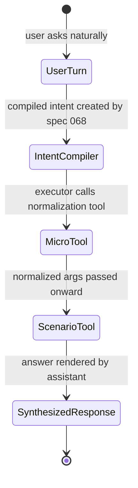
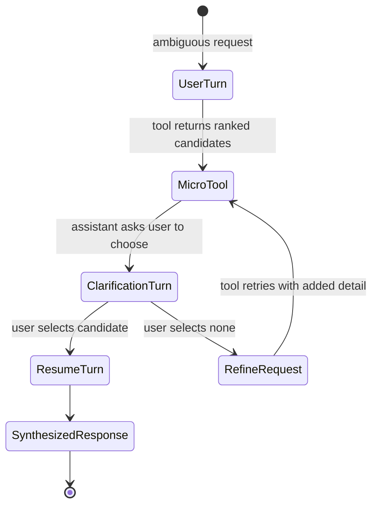

# Feature: 065 Generic Micro-Tools (Capability Foundation)

**Status:** in_progress (planning bootstrap; ceiling = `done`)
**Workflow Mode:** `full-delivery`
**Owner Directive (2026-05-31):** Extract per-scenario brittleness into a
small set of generic, composable micro-tools that the agent loop
(specs 037 + 064) can chain across ANY scenario, so scenarios stop
accumulating per-API normalization quirks in their system prompts.

**Depends On:** spec 037 (LLM scenario agent & tool registry),
spec 064 (open-ended knowledge agent — provides the tool-registry
shape and planner contract).
**Amends:** spec 016 (weather connector — moves geocoding/location
normalization out of the weather skill prompt), spec 037 (extends the
tool registry with the cross-scenario micro-tool family).
**Unblocks:** spec 068 (structured intent compiler — uses these
tools to refine normalized slots) and spec 066 (legacy keyword
surface retirement — needs `entity_resolve` to drop
`internal/api/domain_intent.go`).

---

## 1. Problem Statement

The intent-driven assistant (specs 037 + 061) already routes ANY user
text through a generic LLM ↔ tool loop. But concrete scenarios are
accumulating per-tool brittleness that gets patched inside their
system prompt or as scenario-local Go code:

- **Weather**: 6+ commits in two weeks fixing Open-Meteo geocoding
  fragility (`"palm springs ca"` not matching, trailing-token retry
  reverted, prompt-side location normalization landed). The fix
  belongs in a reusable tool, not in one scenario's prompt.
- **Recipes**: ingredient and unit handling needs the same kind of
  normalization (cup vs. mL; "1 lb" vs. "454 g"); without a generic
  tool the recipe scenario will repeat the weather pattern.
- **`/find` API**: [internal/api/domain_intent.go](../../internal/api/domain_intent.go)
  parses recipe / product / price intent with regex. The right
  primitive is a generic entity-resolve tool the agent calls; the
  regex parser should not exist.
- **Open-knowledge agent (spec 064)**: already declares `unit_convert`
  and `calculator` in its v1 toolset. Those tools must live as
  scenario-agnostic primitives, not buried in 064.

Without this spec, every new scenario will grow its own
normalization code paths, prompts will balloon, and the
"intent-driven, no per-scenario code" mandate erodes.

---

## 2. Actors & Personas

| Actor | Description | Goals | Permissions |
|-------|-------------|-------|-------------|
| **Agent Loop (spec 037 executor, spec 064 planner)** | Generic LLM ↔ tool dispatcher. | Chain micro-tools to normalize tool inputs and synthesize precise outputs without scenario-specific Go code. | Calls allowlisted micro-tools per scenario contract. |
| **Scenario author** | Writes a new scenario YAML in `config/prompt_contracts/`. | Compose existing micro-tools (`location_normalize`, `unit_convert`, `entity_resolve`, `calculator`) instead of writing custom Go normalization code. | Lists micro-tools in `allowed_tools`; does NOT write normalization in `system_prompt`. |
| **Operator** | Owns SST configuration. | Enable/disable specific micro-tools; configure provider (e.g. which geocoder backs `location_normalize`); set per-tool timeout / cache TTL. | Edits `config/smackerel.yaml` `assistant.tools.<tool_name>.*`. |
| **Human user (chat owner)** | Issues NL requests. | Get correct answers regardless of input-string variance (`"sf"`, `"palm springs ca"`, `"1 lb of flour"`). | Existing transport permissions. |

---

## 3. Outcome Contract

**Intent:** Every input-normalization or unit-conversion concern lives
once, as a scenario-agnostic micro-tool the agent can call. Scenarios
compose tools; they do not embed regex parsers, location dictionaries,
unit tables, or per-API quirks in their prompts or Go handlers.

**Success Signal:**
- The weather scenario's `system_prompt` is reduced by ≥40% (current
  lines documenting Open-Meteo location-string format are replaced by
  a one-line "call `location_normalize` first" instruction).
- `internal/api/domain_intent.go` is deleted in spec 066 and replaced
  by a single `entity_resolve` agent call; no regex intent parsing
  remains in user-facing request paths outside diagnostic commands.
- New `location_normalize`, `unit_convert`, `entity_resolve`, and
  `calculator` tools are registered in the spec 037 tool registry,
  declared in `config/smackerel.yaml` under `assistant.tools.*`,
  schema-validated, and reachable from any scenario via
  `allowed_tools`.
- A live-stack test asserts the agent answers `"convert 3 cups of
  flour to grams"`, `"weather in sf tomorrow"`, and `"weather in palm
  springs ca"` correctly without scenario-specific normalization
  code.

**Hard Constraints:**
1. **No silent fallbacks (smackerel NO-DEFAULTS).** Every micro-tool
   reads its config from SST and fails-loud on missing keys; missing
   provider, timeout, or TTL aborts startup.
2. **Generic by construction.** No micro-tool may embed
   scenario-specific logic ("if recipe then …", "if weather then …").
   Each tool exposes one verb against one canonical domain primitive.
3. **Schema-bound I/O.** Every tool declares JSON Schema for input
   and output; the executor validates both; LLM-malformed calls fail
   the executor's existing schema-retry loop (spec 037).
4. **Provider-pluggable.** `location_normalize` MUST allow swapping
   the geocoder (open-meteo → google → mapbox) by SST without Go
   changes; the same applies to any tool with an upstream provider.
5. **Capture-as-fallback preserved (spec 061 / 064).** A tool failure
   never silently degrades the answer; the agent loop either retries,
   refuses, or captures, per the existing facade contract.
6. **QF boundary preserved (P10).** No micro-tool initiates financial
   action. `calculator` is pure math; tools that touch external data
   carry source attribution forward.

**Failure Condition:** If a new scenario added after this spec ships
embeds its own normalization regex, scenario-local Go quirk handling,
or per-provider input shaping in its system prompt, the spec has
failed.

---

## 4. Product Principle Alignment

| Principle | Alignment | Evidence |
|-----------|-----------|----------|
| **P1 Observe First, Ask Second** | Tools resolve ambiguity (`"sf"`, `"palm springs ca"`) without asking the user. Borderline cases still flow to the spec 061 disambiguation prompt. | Success Signal; SCN-065-A03. |
| **P2 Vague In, Precise Out** | Core thesis. Vague input strings are normalized to canonical entities before the next tool call. | Outcome Contract Intent. |
| **P4 Source-Qualified Processing** | Tool outputs preserve source metadata (which geocoder resolved a name; which conversion table produced a unit). | Hard Constraint 3, 4. |
| **P5 One Graph, Many Views** | No new persistent store; tool results flow through existing artifact / trace surfaces. | Design (TBD by bubbles.design). |
| **P8 Trust Through Transparency** | Tool outputs include provider attribution; cite-back verifier in spec 064 carries it through. | Hard Constraint 4. |
| **P10 QF Companion Boundary** | Structural exclusion of financial-action tools. | Hard Constraint 6. |

---

## 5. Functional Requirements (BDD Scenarios)

All scenarios are tagged with stable IDs `SCN-065-A01..A07` for
scenario-manifest registration during `bubbles.plan`.

```gherkin
Scenario: SCN-065-A01 — location_normalize resolves abbreviated US state
  Given the assistant is configured with location_normalize backed by open-meteo geocoding
  When the agent calls location_normalize with input "palm springs ca"
  Then the tool returns a canonical location { name, country, admin1, lat, lon } with admin1 = "California"
  And the call succeeds without retry within the per-tool timeout

Scenario: SCN-065-A02 — location_normalize resolves common city nickname
  Given the assistant is configured with location_normalize
  When the agent calls location_normalize with input "sf"
  Then the tool returns a canonical location with name containing "San Francisco" and admin1 = "California"

Scenario: SCN-065-A03 — location_normalize returns ambiguous-result envelope for borderline input
  Given the assistant is configured with location_normalize
  When the agent calls location_normalize with input "springfield"
  Then the tool returns status = "ambiguous" with a ranked candidate list (≤5)
  And the agent loop surfaces a spec 061 disambiguation prompt rather than guessing

Scenario: SCN-065-A04 — unit_convert performs canonical conversion
  Given the assistant is configured with unit_convert
  When the agent calls unit_convert with { value: 3, from: "cup", to: "g", substance: "flour" }
  Then the tool returns a numeric result with explicit precision and source attribution

Scenario: SCN-065-A05 — calculator evaluates pure math expression
  Given the assistant is configured with calculator
  When the agent calls calculator with expression "(15 * 1.08875) + 12"
  Then the tool returns the numeric result with at most 6 significant digits
  And refuses any expression containing identifiers or function calls outside its allowlist

Scenario: SCN-065-A06 — entity_resolve maps colloquial domain terms
  Given the assistant is configured with entity_resolve over the user knowledge graph
  When the agent calls entity_resolve with { input: "the lease", scope: "documents" }
  Then the tool returns the top-ranked artifact reference and a confidence score
  And returns status = "ambiguous" when the top score is below the configured floor

Scenario: SCN-065-A07 — fail-loud on missing SST config
  Given assistant.tools.location_normalize.provider is unset in SST
  When the core process starts
  Then startup aborts with a fail-loud error naming the missing key
  And no fallback geocoder is silently chosen
```

---

## 6. Acceptance Criteria

- Each SCN-065-A0N scenario maps to at least one test in the scope's
  Test Plan (authored by `bubbles.plan`), with a `Regression E2E` row
  per scenario.
- The weather scenario YAML (`config/prompt_contracts/weather-query-v1.yaml`)
  is amended in this spec's scope work to call `location_normalize`
  before `weather_lookup`, and its `system_prompt` shrinks by ≥40%.
- `internal/api/domain_intent.go` continues to exist after this spec
  but is marked for deletion in spec 066's scope; spec 066's design
  references the `entity_resolve` tool introduced here.
- A `principleAlignment` block is added to every new scenario YAML
  that uses these tools (enforcement specified in spec 067).
- No new `os.getenv("X", "default")`, `${VAR:-default}`, or silent
  fallback is introduced anywhere in this spec's code surface.

---

## 7. Non-Goals

- Replacing or extending the spec 064 cite-back verifier.
- Adding new scenarios — that's the consumers' job (spec 016 amend,
  future scenarios).
- Migrating legacy slash commands — that is spec 066.
- Adding new web-search providers or web-fetch tools — that is spec
  064's territory.
- Designing the full tool registry capability foundation — already
  done in specs 037 + 064; this spec composes against that surface.

---

## 8. Open Questions (resolve in `bubbles.design`)

- Does `entity_resolve` reuse the spec 064 `internal_retrieval` tool
  or wrap it? (Probably wrap, to keep registry entries one-verb.)
- Does `location_normalize` cache hits at the tool layer (in-process
  LRU like weather today) or at the registry layer (shared across
  tools)? Choose one cache locus; do not duplicate.
- Which provider backs `entity_resolve` v1 — same pgvector path as
  retrieval, or a thinner exact-then-vector fallback? Decide in
  design.

## UI Wireframes

### Screen Inventory

| Screen | Actor(s) | Status | Surface | Scenarios Served |
|--------|----------|--------|---------|------------------|
| Micro-Tool Clarification Turn | Human user, Agent Loop | New | Transport-neutral assistant response | SCN-065-A03, SCN-065-A06 |
| Micro-Tool Trace Detail | Operator, Scenario author | New | Web/devtools trace view | SCN-065-A01..A07 |

### UI Primitives

| Primitive | Consumed By | Composition Rules | Accessibility / Responsive Constraints |
|-----------|-------------|-------------------|----------------------------------------|
| Tool confidence badge | Clarification Turn, Trace Detail | Show `resolved`, `ambiguous`, or `failed` from the tool envelope; never infer a friendlier state from text. | Badge text must be readable without color; compact to one line on mobile. |
| Candidate selector | Clarification Turn | Present ranked candidates with the distinguishing fields the tool returned, such as city/state/country or artifact title/source. | Each candidate is a keyboard-focusable option with a stable ordinal and accessible label. |
| Source/provider badge | Clarification Turn, Trace Detail | Show the provider or graph source that produced the normalization result. | Provider name must remain visible on narrow screens; truncate only long URLs. |
| Tool trace row | Trace Detail | One row per tool call: tool name, input summary, status, elapsed time, source, and trace link. | Table collapses to stacked rows below tablet width with labels retained. |

### Transport-Neutral Interaction Requirements

- The assistant-facing clarification response is authored once and rendered by Telegram, HTTP, and any later frontend from the same response fields.
- A micro-tool result never exposes provider jargon as the primary message; technical details belong in the trace view.
- Ambiguity is resolved by asking the user to choose between concrete candidates, not by asking them to restate the full request.
- Tool failure copy must preserve the user's prompt and state whether the turn was captured, refused, or awaiting clarification.

### UX User Validation Checklist

| Validation Item | Pass Signal |
|-----------------|-------------|
| Ambiguous locations feel clear | A user can distinguish at least two `springfield` candidates without knowing the geocoder internals. |
| Tool normalization feels invisible | A user who asks for `weather in sf tomorrow` sees the weather answer, not a tool-execution explanation. |
| Trace view supports debugging | An operator can identify which micro-tool normalized the input, which provider answered, and why ambiguity was raised. |
| Cross-scenario reuse is visible | A scenario author can see the same `unit_convert` and `entity_resolve` primitives used from more than one scenario. |

### Screen: Micro-Tool Clarification Turn

**Actor:** Human user | **Route:** Transport-neutral assistant turn | **Status:** New

┌──────────────────────────────────────────────────────────────┐
│ Assistant                                                     │
├──────────────────────────────────────────────────────────────┤
│ I found a few matches for "springfield". Which one did you   │
│ mean?                                                        │
│                                                              │
│ ┌──────────────────────────────────────────────────────────┐ │
│ │ 1  Springfield, Illinois, United States       [geocoder] │ │
│ │ 2  Springfield, Missouri, United States       [geocoder] │ │
│ │ 3  Springfield, Massachusetts, United States  [geocoder] │ │
│ └──────────────────────────────────────────────────────────┘ │
│                                                              │
│ [Choose 1] [Choose 2] [Choose 3] [None of these]             │
│                                                              │
│ Tool: location_normalize   Status: ambiguous   Trace: [open] │
└──────────────────────────────────────────────────────────────┘

**Interactions:**
- Candidate option -> select -> original assistant turn resumes with the selected normalized value.
- `None of these` -> prompt asks for one more distinguishing detail and keeps the original request in context.
- `Trace: open` -> opens the Micro-Tool Trace Detail for operators with permission.

**States:**
- Empty state: no candidates -> canonical tool failure response that preserves or captures the original prompt.
- Loading state: assistant shows the pending turn state owned by spec 061; no tool-specific spinner text.
- Error state: provider error -> short fail-loud response with capture/refusal status and trace id.

**Responsive:**
- Mobile: candidates stack as full-width tap targets; trace link moves below the action row.
- Tablet/Desktop: candidates may appear as a compact list with badges aligned right.

**Accessibility:**
- Candidate buttons expose ordinal plus candidate name to screen readers.
- Keyboard navigation moves through candidates before secondary actions.
- Status badges include text labels, not color-only meaning.

### Screen: Micro-Tool Trace Detail

**Actor:** Operator, Scenario author | **Route:** `/assistant/traces/{trace_id}` | **Status:** New

┌────────────────────────────────────────────────────────────────────────────┐
│ Assistant Trace: [trace_id]                         [Copy] [Open Turn]    │
├────────────────────────────────────────────────────────────────────────────┤
│ Raw turn: "weather in palm springs ca tomorrow"                           │
│ Compiled action: external_lookup  Scenario: weather_query                  │
│                                                                            │
│ ┌──────────────────────────────────────────────────────────────────────┐   │
│ │ Tool Calls                                                            │   │
│ │ Name                Status      Input Summary        Output Summary   │   │
│ │ location_normalize  resolved    palm springs ca      Palm Springs, CA │   │
│ │ weather_lookup      resolved    lat/lon + tomorrow   forecast ready   │   │
│ └──────────────────────────────────────────────────────────────────────┘   │
│                                                                            │
│ Source/provider: open-meteo geocoding                                      │
│ Schema validation: input passed, output passed                             │
│ Config source: assistant.tools.location_normalize.*                         │
└────────────────────────────────────────────────────────────────────────────┘

**Interactions:**
- Tool row -> expand -> shows schema-validated input/output summaries and provider attribution.
- `Copy` -> copies redacted trace summary for support/debugging.
- `Open Turn` -> returns to the parent assistant conversation trace.

**States:**
- Empty state: trace has no tool calls -> show `No tool calls recorded for this turn` with the compiled action.
- Loading state: skeleton rows sized to the final table columns.
- Error state: trace access denied -> auth error with no trace content leaked.

**Responsive:**
- Mobile: tool table becomes stacked cards with label/value pairs.
- Desktop: rows stay scannable with sticky column headers for long traces.

**Accessibility:**
- Expand controls announce open/closed state.
- Redacted values are labelled as redacted, not blank.
- Copy action reports success/failure through an ARIA live region.

## User Flows

### User Flow: Normalized Assistant Request



### User Flow: Ambiguous Micro-Tool Resolution


