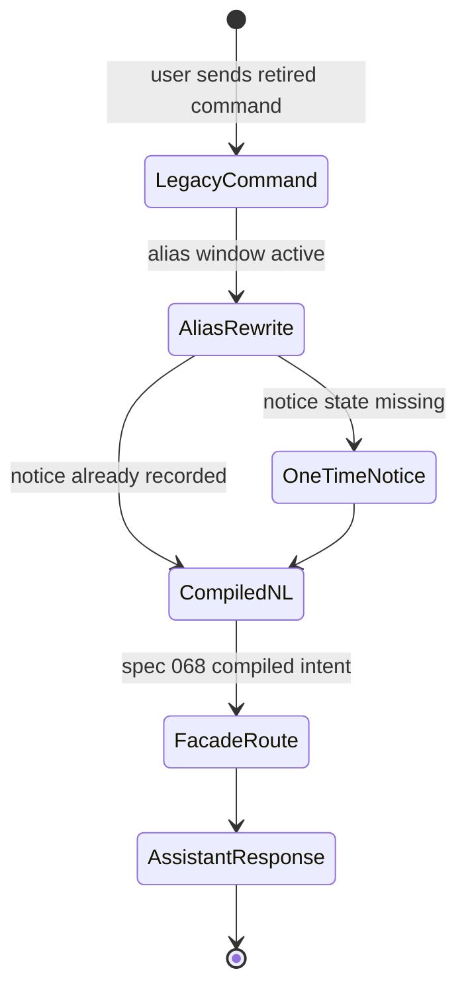
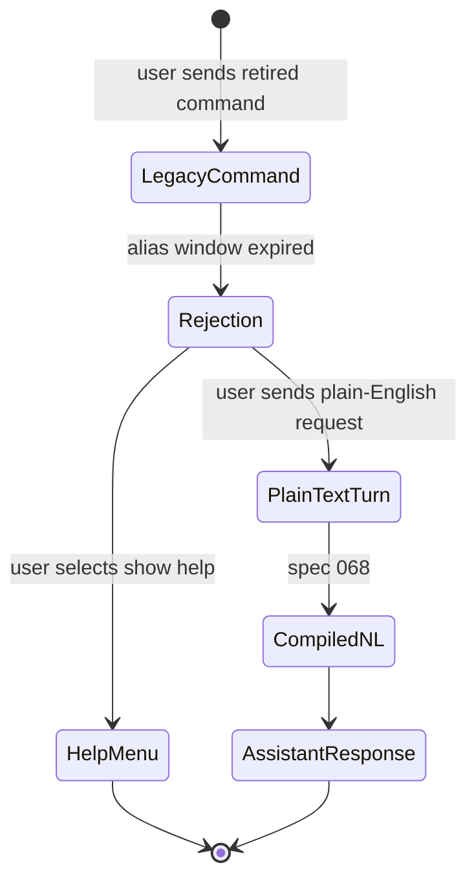

# Feature: 066 Legacy Keyword Surface Retirement

**Status:** in_progress (planning bootstrap; ceiling = `done`)
**Workflow Mode:** `full-delivery`
**Owner Directive (2026-05-31):** Delete every keyword-driven user
request path that competes with the intent-driven assistant
(specs 037 + 061 + 064). Reduce Telegram slash commands to a small
operational set; route all other text through the NL → router →
agent-loop pipeline.

**Depends On:** spec 037 (LLM scenario agent & tool registry),
spec 061 (conversational assistant facade + Telegram adapter),
spec 064 (open-ended knowledge agent — catches anything no
deterministic scenario claims), spec 065 (generic micro-tools —
provides `entity_resolve` so `domain_intent.go` regex parser can be
replaced), spec 068 (structured intent compiler — turns the NL
replacement for each retired command into a typed, validated action
request), spec 069 (assistant HTTP transport — provides the
Telegram-free E2E surface for proving retired command equivalents over
the live stack).
**Amends:** spec 061 (Telegram adapter command surface), spec 016
(weather connector — removes `/weather` reliance on shortcut as
primary entrypoint), spec 035 (recipe enhancements — collapses
recipe slash commands into NL), spec 036 (meal planning — collapses
`/meal_plan` into NL), spec 027 (annotation keyword-map replacement),
spec 028 (actionable-list command retirement), spec 034 (expense
command retirement), spec 039 (`/watch` command retirement).
**Unblocks:** none (cleanup spec).

---

## 1. Problem Statement

The intent-driven architecture target requires that ANY user request
flow through one path: NL input → LLM intent extraction → router →
scenario or open-knowledge agent → tool call(s) → LLM synthesis → NL
reply. Two legacy surfaces still violate that mandate:

1. **Telegram slash command catalog** ([internal/telegram/bot.go](../../internal/telegram/bot.go))
   currently registers 18+ commands. Most are scenario-specific
   shortcuts (`/find`, `/rate`, `/concept`, `/person`, `/list`,
   `/expense`, `/watch`, `/meal_plan`, `/recipe`, `/cook`, `/lint`,
   `/done`, `/recent`). Each has its own Go handler. This is a
   parallel command surface that bypasses the agent loop entirely,
   and every new feature adds another command.
2. **Regex-driven domain intent parser** ([internal/api/domain_intent.go](../../internal/api/domain_intent.go))
   detects `recipe|product|price` intent in the `/find` HTTP API via
   regex. This is exactly the keyword-routing pattern the agent path
   forbids ([tests/integration/agent/forbidden_pattern_test.go](../../tests/integration/agent/forbidden_pattern_test.go)),
   living outside the guarded surface.
3. **Annotation keyword map** ([internal/annotation/parser.go](../../internal/annotation/parser.go))
   classifies user interactions (`"cooked it" → MadeIt`, etc.) with a
   keyword table. This is an LLM extraction job with confidence and
   borderline disambiguation, not a keyword lookup.

If we leave these surfaces in place, the codebase has two competing
request paths and the "intent-driven, no per-scenario code" mandate
is structurally violated.

---

## 2. Actors & Personas

| Actor | Description | Goals | Permissions |
|-------|-------------|-------|-------------|
| **Human user (chat owner)** | Single operator using Telegram (v1) or future transports. | Get the same outcomes via plain English that legacy slash commands used to provide; not need to remember command names. | Existing transport permissions. |
| **Operator** | Owns SST configuration and deployment. | Cleanly retire legacy commands with a deprecation window; advertise the new operational command set. | Edits `config/smackerel.yaml` `assistant.transports.telegram.*`. |
| **Spec 061 Assistant Facade** | Capability-layer dispatcher. | Receive ALL non-operational Telegram text via a single inbound path; route via the existing intent router. | Calls executor; emits disambiguation / capture per existing contract. |
| **Spec 064 Open-Knowledge Agent** | Terminal scenario before capture-as-fallback. | Answer any NL question previously served by a one-off slash command. | Existing tool registry. |

---

## 3. Outcome Contract

**Intent:** The Telegram (and any future transport) command surface
holds ONLY operational commands. Every other user request — including
search, ratings, lists, recipes, expenses, watches, meal plans, ad-hoc
questions — is plain text compiled by spec 068 into `CompiledIntent`,
then routed through the intent-driven agent pipeline.

**Success Signal:**
- Telegram registered `BotCommands` after this spec ships contains
  exactly the operational set: `/help`, `/status`, `/reset`,
  `/digest`, `/recent`, `/done`. (Plus the existing intent-aware
  shortcuts `/ask`, `/weather`, `/remind` from spec 061, retained as
  power-user fast-paths.)
- `internal/api/domain_intent.go` is deleted; the `/find` HTTP API
  calls the agent loop's `entity_resolve` tool (from spec 065) for
  any structured intent extraction it needs.
- `internal/annotation/parser.go` keyword map is replaced by an LLM
  extraction call returning `{ kind, confidence }`; borderline
  results route to the spec 061 disambiguation prompt.
- The legacy slash command handlers (`handleFind`, `handleRate`,
  `handleConcept`, `handlePerson`, `handleList`, `handleExpense`,
  `handleWatch`, `handleLint`, recipe / cook / meal_plan handlers)
  are deleted from `internal/telegram/`; their NL equivalents pass
  through the existing facade.
- A live-stack test asserts that for each retired command, the NL
  equivalent (e.g. `"find my notes about ACL tags"`, `"rate that 8
  out of 10"`, `"add eggs to my groceries"`, `"plan meals for next
  week"`) produces the same end-state as the old slash command did.

**Hard Constraints:**
1. **Capture-as-fallback preserved (spec 061 invariant).** No retired
   command may regress into silent loss; messages that no scenario
   claims still flow to the open-knowledge agent (spec 064), then to
   the capture fallback.
2. **No silent defaults (smackerel NO-DEFAULTS).** Removing legacy
   handlers does not introduce env fallbacks; if a config key
   previously consumed by a legacy handler is no longer used, delete
   it from SST rather than defaulting it.
3. **Deprecation window for muscle memory.** During a configurable
   `assistant.transports.telegram.legacy_alias_window_until` date
   (SST), each retired slash command is intercepted, mapped to a
   synthetic NL prompt, and routed through the assistant — with a
   one-time per-user "this command will go away on …" notice. After
   the window, the command is rejected with a `unknown command` reply
   pointing to `/help`.
4. **Operational commands remain code-driven.** `/help`, `/status`,
   `/reset`, `/digest`, `/recent`, `/done` are diagnostic /
   conversation-control surfaces and stay in `internal/telegram/`.
   They MUST NOT route through the LLM.
5. **No regressions in existing scenario invocation.** `/ask`,
   `/weather`, `/remind` keep their explicit-scenario fast-path
   semantics (spec 061 BS-002).

**Failure Condition:** Any legacy slash command handler still wired
after this spec ships, OR `internal/api/domain_intent.go` still
present, OR the annotation keyword map still present in the runtime
classification path.

---

## 4. Product Principle Alignment

| Principle | Alignment | Evidence |
|-----------|-----------|----------|
| **P1 Observe First, Ask Second** | The user states intent in their own words; the system never demands a command. Borderline cases go to disambiguation (spec 061), not error. | Hard Constraint 1; SCN-066-A03. |
| **P2 Vague In, Precise Out** | NL replaces keyword command syntax. Vague phrasing is normalized by micro-tools (spec 065) before action. | Outcome Contract Intent. |
| **P6 Invisible By Default, Felt Not Heard** | One-time deprecation notice per user per command; no nag screens, no daily reminders. | Hard Constraint 3. |
| **P8 Trust Through Transparency** | Each retired command's NL alias is documented in `/help`; deprecation notice names the replacement path. | SCN-066-A06. |
| **P10 QF Companion Boundary** | Retirement does not change financial-action surface; QF-related commands (none in v1) are unaffected. | N/A. |

---

## 5. Functional Requirements (BDD Scenarios)

```gherkin
Scenario: SCN-066-A01 — Telegram BotCommands lists only operational set after deploy
  Given the legacy_alias_window_until date is in the past
  When a Telegram client requests the BotCommands menu
  Then the menu contains exactly: /help, /status, /reset, /digest, /recent, /done, /ask, /weather, /remind
  And contains none of: /find, /rate, /concept, /person, /list, /expense, /watch, /lint, /meal_plan, /recipe, /cook

Scenario: SCN-066-A02 — NL replaces /find
  Given the user sends "find my notes about ACL tags"
  When the assistant facade routes the message
  Then the message is matched to retrieval_qa via the intent router (similarity path)
  And the response cites at least one artifact, identical to the previous /find behavior

Scenario: SCN-066-A03 — NL replaces /rate via disambiguation
  Given the user sends "rate that 8 out of 10" with no recent rateable artifact in context
  When the assistant facade routes the message
  Then the user receives a spec 061 disambiguation prompt offering candidate artifacts
  And selecting an artifact persists the rating exactly as /rate previously did

Scenario: SCN-066-A04 — Legacy slash command inside deprecation window
  Given the legacy_alias_window_until date is in the future
  When the user sends "/find ACL tags"
  Then the command is transparently rewritten to the NL prompt "find ACL tags" and routed through the facade
  And the user receives a one-time per-user notice "/find will be removed on YYYY-MM-DD; just type your question"

Scenario: SCN-066-A05 — Legacy slash command after deprecation window
  Given the legacy_alias_window_until date is in the past
  When the user sends "/find ACL tags"
  Then the assistant replies with a canonical unknown-command notice pointing to /help
  And no scenario is invoked

Scenario: SCN-066-A06 — /help text enumerates NL examples, not legacy commands
  Given the user sends /help
  Then the response describes the six operational commands AND lists NL example prompts for the retired surfaces
  And contains no instruction to use any retired command

Scenario: SCN-066-A07 — domain_intent.go deletion is enforced
  Given the repository is checked out at this spec's completion SHA
  When a test runs that grep-asserts the file's absence
  Then internal/api/domain_intent.go does not exist
  And no remaining call site references parseDomainIntent

Scenario: SCN-066-A08 — annotation classification uses LLM extraction
  Given the user sends "cooked it last night, was great"
  When the annotation pipeline classifies the interaction
  Then the classification is produced by an LLM tool returning { kind, confidence } above the configured floor
  And the keyword-map code path in internal/annotation/parser.go no longer exists in the runtime classification path

Scenario: SCN-066-A09 — operational command unaffected
  Given the user sends /status
  Then the response is produced by the existing operational handler, NOT routed through the LLM
  And the response shape matches the pre-spec behavior
```

---

## 6. Acceptance Criteria

- All SCN-066-A0N scenarios map to tests authored by `bubbles.plan`;
  SCN-066-A02..A04 require live-stack regression coverage.
- A consumer-impact sweep enumerates: legacy `/help` text, Telegram
  `BotCommands` registration, API clients depending on `/find` regex
  semantics, docs (`docs/Operations.md`, `README.md`, `docs/INVESTOR_OVERVIEW.md`),
  test fixtures referencing legacy command syntax, and ML eval
  fixtures.
- A migration note is published in `docs/Operations.md` describing
  the deprecation window and the NL replacements.
- No new SST defaults, no new fallback chains, no new keyword maps
  introduced.

---

## 7. Non-Goals

- Adding new scenarios — covered by spec 064 (open-knowledge) and
  spec 065 (micro-tools).
- Adding new transports (WhatsApp, web chat) — spec 061's
  transport-agnostic facade already covers that.
- Replacing the spec 061 disambiguation UI itself.
- Changing the operational command set's shapes (`/status`,
  `/digest`, etc.) — they remain unchanged.

---

## 8. Open Questions (resolve in `bubbles.design`)

- Should the deprecation-window alias rewrite happen in the Telegram
  adapter or in the facade? (Likely the adapter, to keep the facade
  transport-neutral.)
- How long is the deprecation window — 30 days, 90 days, or until the
  next major version? Decide before SCOPE-01 ships.
- What is the precise BotCommands menu order? UX call for
  `bubbles.ux`.

## UI Wireframes

### Screen Inventory

| Screen | Actor(s) | Status | Surface | Scenarios Served |
|--------|----------|--------|---------|------------------|
| Telegram Help Menu After Retirement | Human user | Modified | Telegram operational command response | SCN-066-A01, SCN-066-A06, SCN-066-A09 |
| Legacy Alias Notice | Human user | New | Telegram assistant turn | SCN-066-A04 |
| Retired Command Rejection | Human user | New | Telegram assistant turn | SCN-066-A05 |

### UI Primitives

| Primitive | Consumed By | Composition Rules | Accessibility / Responsive Constraints |
|-----------|-------------|-------------------|----------------------------------------|
| Operational command list | Help Menu, Rejection | Show only retained commands in a stable order: `/help`, `/status`, `/reset`, `/digest`, `/recent`, `/done`, plus `/ask`, `/weather`, `/remind` while spec 061 retains them. | Commands appear as text and are not the only way to express examples. |
| Natural-language example row | Help Menu, Rejection | Pair each retired surface with one plain-English example, not a replacement slash command. | Examples must wrap cleanly in Telegram and HTTP-rendered cards. |
| One-time retirement notice | Alias Notice | Names the legacy command, the explicit end date, and the plain-English replacement pattern. | Notice text stays under one phone screen and is not repeated after acknowledgement state is recorded. |
| Unknown command action row | Rejection | Offers `Show help` and `Use plain English` actions; does not invoke a scenario. | Buttons are reachable by keyboard-equivalent transport affordances. |

### Transport-Neutral Interaction Requirements

- Retired command equivalents are taught as plain-language examples that compile through spec 068, not as a new command grammar.
- `/help` remains deterministic and operational; it must not ask the LLM to generate the command catalog.
- Alias-window and rejection copy must render from the same fields in Telegram and HTTP test surfaces.
- The UI must not present retired commands as active actions anywhere outside the one-time alias notice naming the command being retired.

### UX User Validation Checklist

| Validation Item | Pass Signal |
|-----------------|-------------|
| Help menu teaches plain English | A user can find examples for search, rating, lists, recipes, and watches without seeing retired commands as options. |
| Muscle-memory path is humane | During the alias window, a retired command still completes the intended task and explains the plain-English replacement once. |
| Retirement is unambiguous | After the alias window, the rejected command response names `/help` and does not route a scenario. |
| Operational commands stay obvious | `/status`, `/reset`, `/digest`, `/recent`, and `/done` remain discoverable as deterministic controls. |

### Screen: Telegram Help Menu After Retirement

**Actor:** Human user | **Route:** Telegram `/help` | **Status:** Modified

┌────────────────────────────────────────────────────────────┐
│ Smackerel Help                                             │
├────────────────────────────────────────────────────────────┤
│ Operational commands                                       │
│ /help    show this menu                                    │
│ /status  system status                                     │
│ /reset   clear the current pending assistant turn           │
│ /digest  latest digest                                     │
│ /recent  recent captures                                   │
│ /done    finish the current operational prompt              │
│                                                            │
│ You can also ask naturally:                                │
│ "find my notes about ACL tags"                             │
│ "rate that 8 out of 10"                                    │
│ "add eggs to my groceries"                                 │
│ "plan meals for next week"                                 │
│ "watch for a price drop on the espresso machine"           │
│                                                            │
│ Shortcuts: /ask /weather /remind                            │
└────────────────────────────────────────────────────────────┘

**Interactions:**
- User sends one of the listed operational commands -> deterministic handler responds.
- User sends an example as plain text -> spec 068 compiles the turn before routing.
- User taps/selects an example in a richer transport -> example text is copied into the composer, not executed as a hidden command.

**States:**
- Empty state: not applicable; help always renders the operational list and example rows.
- Loading state: not applicable for Telegram; HTTP-rendered clients may show a standard message skeleton.
- Error state: if help catalog generation fails, return a static fail-loud operational help response.

**Responsive:**
- Mobile/Telegram: examples remain short enough to fit in one message without horizontal scrolling.
- Web/HTTP clients: operational commands and examples may render as two columns on desktop.

**Accessibility:**
- Commands and examples use plain text, not icon-only controls.
- Example rows are announced as examples, not commands.
- The retained shortcut list is visually and semantically separated from retired surfaces.

### Screen: Legacy Alias Notice

**Actor:** Human user | **Route:** Telegram retired slash command during alias window | **Status:** New

┌────────────────────────────────────────────────────────────┐
│ Assistant                                                  │
├────────────────────────────────────────────────────────────┤
│ I understood this as: "find ACL tags"                      │
│                                                            │
│ Notice: /find is retiring on [YYYY-MM-DD]. Next time, just  │
│ type the question in plain English.                         │
│                                                            │
│ Result                                                     │
│ [compiled-NL response with citations or disambiguation]     │
│                                                            │
│ [Show help]                                                │
└────────────────────────────────────────────────────────────┘

**Interactions:**
- Retired command -> adapter rewrites to the canonical plain-English prompt and routes through the facade.
- `Show help` -> deterministic `/help` response.
- User continues conversation -> pending disambiguation/confirm state behaves as spec 061 defines.

**States:**
- Empty state: no result from routed NL -> capture/refusal response from the facade.
- Loading state: same pending assistant response used for any NL turn.
- Error state: alias rewrite fails -> unknown-command response, no raw command routed.

**Responsive:**
- Mobile: notice appears before the result and stays under one short paragraph.
- Desktop/web client: notice may render as an inline warning above the response body.

**Accessibility:**
- The retired command name and replacement prompt are both present in text.
- The notice is announced once, then omitted when per-user notice state exists.
- Warning styling is not color-only.

### Screen: Retired Command Rejection

**Actor:** Human user | **Route:** Telegram retired slash command after alias window | **Status:** New

┌────────────────────────────────────────────────────────────┐
│ Assistant                                                  │
├────────────────────────────────────────────────────────────┤
│ I do not use /find anymore.                                │
│                                                            │
│ Type what you want in plain English, for example:           │
│ "find my notes about ACL tags"                             │
│                                                            │
│ [Show help] [Use plain English]                             │
└────────────────────────────────────────────────────────────┘

**Interactions:**
- `Show help` -> deterministic `/help` response.
- `Use plain English` -> inserts or suggests the converted prompt where transport affordances allow.
- Sending a plain-English turn -> compiles through spec 068 before any scenario routing.

**States:**
- Empty state: not applicable; retired command always returns the rejection body after the alias window.
- Loading state: not applicable; rejection is deterministic.
- Error state: if command catalog state is unavailable, fail closed with the unknown-command body.

**Responsive:**
- Mobile: keep the response to one concise message.
- Desktop/web client: action row can become two adjacent buttons.

**Accessibility:**
- The response does not rely on command color or strikethrough to convey retired state.
- Buttons have explicit text labels.
- Screen readers hear the replacement example before the actions.

## User Flows

### User Flow: Alias Window Retired Command



### User Flow: After Alias Window


