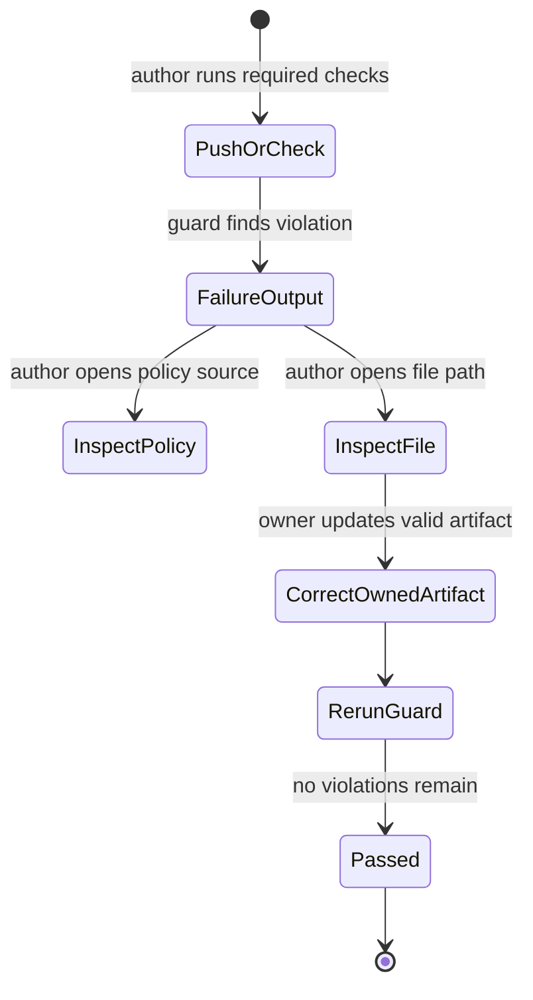
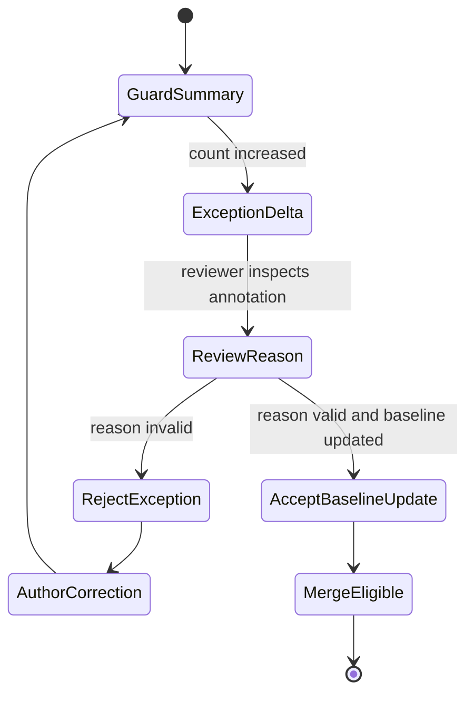

# Feature: 067 Intent-Driven Policy Enforcement (CI Guards)

**Status:** in_progress (planning bootstrap; ceiling = `done`)
**Workflow Mode:** `full-delivery`
**Owner Directive (2026-05-31):** Add mechanical guardrails so the
intent-driven architecture does not silently regress as scenarios and
features are added. Make the rules of specs 037 / 061 / 064 / 065 /
066 enforceable at CI time, not just at review time.

**Depends On:** spec 037 (tool registry — the forbidden-pattern test
already exists at the agent boundary; this spec broadens its reach),
spec 064 (open-knowledge agent — defines the principleAlignment
expectation per scenario), spec 065 (micro-tools — provides examples
of correct cross-scenario tools), spec 066 (legacy retirement — the
guards keep retired surfaces from sneaking back in), spec 068
(structured intent compiler — supplies the traceable NL ->
CompiledIntent contract that guards can enforce).
**Amends:** spec 037 (extends forbidden-pattern enforcement beyond
the agent path), spec 064 (mandates `principleAlignment` block per
scenario YAML), spec 068 (adds compiler-bypass detection: no
user-facing NL route may call Router.Route without a validated
CompiledIntent trace record), spec 069 (adds a guard that no
scenario / facade / executor code branches on
`AssistantMessage.Transport` — only adapter and audit layers may
inspect that field).
**Unblocks:** none (governance spec).

---

## 1. Problem Statement

The intent-driven architecture only stays intent-driven if:

1. Per-scenario prompt growth stays bounded (today's weather-prompt
   patch chain shows the opposite tendency — every brittleness adds
   prompt lines).
2. Scenario YAMLs declare which product principles they implement, so
   reviewers can spot drift early ([docs/Product-Principles.md](../../docs/Product-Principles.md)
   declares this expectation but no scenario YAML carries it yet).
3. The smackerel NO-DEFAULTS / fail-loud SST policy is enforced across
   `ml/app/` and `internal/` — today
   [ml/app/main.py:248](../../ml/app/main.py#L248) silently falls back
   to an empty `EMBEDDING_MODEL`, and there is no automated guard.
4. The "no keyword routing" rule enforced for `internal/agent/`
   (`tests/integration/agent/forbidden_pattern_test.go`) is extended
   to the surfaces that today host the violators (`internal/api/`,
   `internal/telegram/`, `internal/annotation/`) so spec 066's
   deletions cannot quietly come back.

Without this spec the previous specs accumulate as guidance; with it,
the rules are enforced by tests that fail CI.

---

## 2. Actors & Personas

| Actor | Description | Goals | Permissions |
|-------|-------------|-------|-------------|
| **Agent / human author** | Anyone editing scenarios, tools, or assistant code. | Ship a change that passes CI; understand violations from a clear test failure naming the rule. | Edits scenarios + code. |
| **CI pipeline** | GitHub Actions or equivalent. | Run guard tests on every push; block merges on violations. | Read repo. |
| **Reviewer** | Human merge approver. | Trust the guard tests to catch policy drift so review focuses on substance. | Read PR. |
| **Operator** | Owns thresholds. | Tune `system_prompt` line limits and similarity floors via SST as the assistant matures. | Edits `config/smackerel.yaml` `policy.*`. |

---

## 3. Outcome Contract

**Intent:** The intent-driven architecture's rules are mechanically
enforced. Violations fail CI with named, actionable errors. Reviewers
do not have to remember the rules.

**Success Signal:**
- A scenario YAML missing a `principleAlignment` block fails a
  loader-level test naming the missing block and the principles
  catalog path.
- A scenario YAML with `system_prompt` exceeding the SST-configured
  line cap (default sentinel value `policy.scenario_prompt_max_lines`)
  fails a guard test naming the scenario and the current line count
  vs. the cap.
- A code search in `internal/api/`, `internal/telegram/`, and
  `internal/annotation/` for keyword-routing regex patterns
  (`recipeIntentRe`, `productIntentRe`, scenario-classifying keyword
  maps in user-request paths) fails a guard test naming each
  violating file:line.
- A code search in `ml/app/` and `internal/` for silent-default
  patterns (`os.getenv(KEY, NON_EMPTY)`, `os.Getenv(...) + literal
  fallback`, shell `${VAR:-DEFAULT}` outside doc-FORBIDDEN samples)
  fails a guard test naming each violating file:line.
- A loader-level test asserts that every scenario YAML in
  `config/prompt_contracts/` declares `principleAlignment` listing
  IDs present in `docs/Product-Principles.md`.

**Hard Constraints:**
1. **No bypass flags in production CI.** Skipping these guards
   requires a documented `policy-exception` annotation in the
   scenario YAML or code file plus a reviewer sign-off line; CI
   refuses to merge if the annotation count grows without
   explanation.
2. **Threshold values come from SST.** No magic constants embedded in
   the guard test code; cap and floors live in
   `config/smackerel.yaml` `policy.*`. Missing keys fail-loud at
   loader start.
3. **Guards run in CI's required test set.** They cannot be marked
   `optional` or `flake`.
4. **Generic by construction.** No guard knows about specific
   scenarios; each guard expresses a class of rule and enumerates
   violators dynamically.
5. **Capture-as-fallback unaffected.** This spec touches static
   analysis only; it changes no runtime path.

**Failure Condition:** A future change that grows `weather-query-v1`
`system_prompt` past the cap, or adds a new scenario without a
`principleAlignment` block, or reintroduces a keyword regex in
`internal/api/`, merges without CI failure.

---

## 4. Product Principle Alignment

| Principle | Alignment | Evidence |
|-----------|-----------|----------|
| **P2 Vague In, Precise Out** | Guards prevent the "ballooning system prompt" pattern that compensates for missing tool primitives. | Hard Constraint of spec 065; this spec enforces. |
| **P4 Source-Qualified Processing** | `principleAlignment` block forces every scenario to declare its principle citations, traceable to source. | Success Signal #1. |
| **P8 Trust Through Transparency** | CI failures name the rule and the violation; no silent skip; no hidden exception. | Hard Constraint 1. |
| **P10 QF Companion Boundary** | The QF tool exclusion test already exists; this spec broadens that style of guard to the other rules. | Hard Constraint 4. |

---

## 5. Functional Requirements (BDD Scenarios)

```gherkin
Scenario: SCN-067-A01 — Missing principleAlignment fails loader test
  Given a scenario YAML in config/prompt_contracts/ without a principleAlignment block
  When the policy-guard test runs
  Then the test fails naming the scenario id and the missing block
  And the failure message references docs/Product-Principles.md

Scenario: SCN-067-A02 — System prompt exceeds line cap
  Given config/smackerel.yaml sets policy.scenario_prompt_max_lines = 60
  And a scenario YAML's system_prompt exceeds 60 non-blank lines
  When the policy-guard test runs
  Then the test fails naming the scenario id, the current line count, and the cap

Scenario: SCN-067-A03 — Forbidden keyword routing pattern in API path
  Given a file under internal/api/ contains a regex assigned to a name matching `(?i)intent.*re$` driving request-routing decisions
  When the policy-guard test runs
  Then the test fails naming each violating file:line

Scenario: SCN-067-A04 — Forbidden keyword map in user-request path
  Given a file under internal/telegram/ or internal/annotation/ contains a Go map whose keys are user-facing free-text and whose values drive scenario or classification choice
  When the policy-guard test runs
  Then the test fails naming the file and the violating identifier

Scenario: SCN-067-A05 — Silent default in Python sidecar
  Given a file under ml/app/ contains os.getenv("KEY", "non-empty-default") for a runtime SST key
  When the policy-guard test runs
  Then the test fails naming the file:line and the SST key
  And references .github/instructions/smackerel-no-defaults.instructions.md

Scenario: SCN-067-A06 — Silent default in Go runtime
  Given a file under internal/ assigns os.Getenv("KEY") then falls back to a literal string for a runtime SST value
  When the policy-guard test runs
  Then the test fails naming the file:line and the SST key

Scenario: SCN-067-A07 — policy-exception annotation visible and rate-limited
  Given a scenario YAML carries a policy-exception annotation with a stated reason and reviewer alias
  When the policy-guard test runs
  Then the guard reports the exception in its summary but does not fail
  And a separate quota test fails if total policy-exception count grew vs. the baseline file at the repo root without a baseline bump in the same commit

Scenario: SCN-067-A08 — Threshold value sourced from SST
  Given config/smackerel.yaml omits policy.scenario_prompt_max_lines
  When the core process starts (or guards bootstrap)
  Then startup fails-loud naming the missing key
```

---

## 6. Acceptance Criteria

- All SCN-067-A0N scenarios map to tests (`bubbles.plan`); each guard
  is implemented as a Go test under `tests/integration/policy/` or
  similar.
- The existing forbidden-pattern test in `tests/integration/agent/`
  is extended (not duplicated) to cover the new surfaces.
- The `policy.*` SST section is added to `config/smackerel.yaml` with
  fail-loud defaults (no `:-`-style fallback).
- An audit baseline file `policy-exception-baseline.txt` (or
  equivalent) is committed at the repo root with the count of
  pre-existing exceptions at this spec's introduction; raising the
  count without bumping the baseline fails CI.
- Initial roll-out fixes the known violations (
  [ml/app/main.py:248](../../ml/app/main.py#L248) embedding-model
  fallback) OR records them with explicit `policy-exception`
  annotations and links to remediation specs.

---

## 7. Non-Goals

- Redefining the principles catalog itself.
- Adding new scenarios.
- Refactoring existing scenario prompts to fit the cap — that work is
  carried by the spec(s) introducing the cap-violating change
  (typically spec 065's amend of weather).
- Enforcing English-only prompt content or other stylistic rules.

---

## 8. Open Questions (resolve in `bubbles.design`)

- Initial value of `policy.scenario_prompt_max_lines` — pick a value
  that the post-spec-065-amendment `weather-query-v1` passes and the
  current pre-amendment version fails, so the guard provably catches
  the case that motivated it.
- Should the baseline file be human-edited or auto-generated? If
  auto-generated, how is tampering detected?
- Where does the policy-exception annotation live in YAML — a
  top-level `policyExceptions:` block, or per-block annotations? Both
  are workable; pick one in design.

## UI Wireframes

### Screen Inventory

| Screen | Actor(s) | Status | Surface | Scenarios Served |
|--------|----------|--------|---------|------------------|
| Policy Guard Failure Output | Agent / human author, Reviewer | New | CI terminal / PR check output | SCN-067-A01..A06, SCN-067-A08 |
| Policy Exception Summary | Reviewer, Operator | New | CI terminal / PR check output | SCN-067-A07 |

### UI Primitives

| Primitive | Consumed By | Composition Rules | Accessibility / Responsive Constraints |
|-----------|-------------|-------------------|----------------------------------------|
| Violation row | Failure Output, Exception Summary | Show guard id, rule, file path, line when available, and required owner/action. | Rows must be meaningful when copied as plain text. |
| Policy source link | Failure Output | Reference the governing spec or instruction file that defines the rule. | Link text names the policy, not only `click here`. |
| Exception badge | Exception Summary | Distinguish `accepted`, `new`, and `over-budget`; never hide exception counts in collapsed output. | Badge text must be present in monochrome terminal output. |
| Baseline delta summary | Exception Summary | Show previous count, current count, and whether the baseline was intentionally updated. | Numeric values are announced with labels and do not require color. |

### Transport-Neutral Interaction Requirements

- Guard output is the UX for this governance feature; it must be readable in local terminals, CI logs, and PR check annotations.
- Every failure message names the violated intent-driven rule and the owning artifact path to inspect.
- The output must avoid suggesting ad-hoc bypasses; valid resolution paths are code/spec corrections or explicit policy-exception metadata.
- Policy guard output should be stable enough for tests to assert key phrases without depending on terminal color.

### UX User Validation Checklist

| Validation Item | Pass Signal |
|-----------------|-------------|
| Failure is actionable | An author can identify the exact file and rule from the first screen of CI output. |
| Policy source is discoverable | A reviewer can jump from a violation row to the governing spec or instruction file. |
| Exception growth is visible | A reviewer can see whether a policy-exception count increased and why. |
| Terminal output is accessible | The same failure remains understandable with ANSI colors stripped. |

### Screen: Policy Guard Failure Output

**Actor:** Agent / human author, Reviewer | **Route:** CI check `intent-policy-guard` | **Status:** New

> Note: the `internal/api/domain_intent.go` reference in the illustrative output below is preserved as a historical example; the file was retired by spec 066 SCOPE-4 on 2026-06-02.

┌────────────────────────────────────────────────────────────────────────────┐
│ Intent Policy Guard                                                        │
├────────────────────────────────────────────────────────────────────────────┤
│ Status: failed                                                             │
│                                                                            │
│ Rule G067-A03  Forbidden keyword routing pattern                           │
│ File: internal/api/domain_intent.go:[line]                                  │
│ Detail: user-facing request path routes from regex intent classification    │
│ Required resolution: route through CompiledIntent or remove legacy path      │
│ Policy source: specs/067-intent-driven-policy-enforcement/spec.md           │
│                                                                            │
│ Rule G067-A05  Silent default in Python sidecar                             │
│ File: ml/app/main.py:[line]                                                 │
│ Detail: runtime SST key has a fallback value                                │
│ Required resolution: fail loud on missing configuration                      │
│ Policy source: .github/instructions/smackerel-no-defaults.instructions.md    │
└────────────────────────────────────────────────────────────────────────────┘

**Interactions:**
- File path link -> opens the violation location in local/PR environments that support links.
- Policy source link -> opens the rule definition.
- Rerun check -> refreshes output after corrections.

**States:**
- Empty state: no violations -> concise pass summary with guard count and exception count.
- Loading state: CI step logs the guard category currently scanning.
- Error state: guard bootstrap fails -> fail-loud message naming the missing SST key or baseline file.

**Responsive:**
- Terminal: rows wrap with labels repeated; no table-only layout.
- PR check view: each violation may become an annotation, with the full summary retained.

**Accessibility:**
- All status values are text-first; ANSI color is optional.
- Violations are grouped by rule id for screen-reader scanability.
- Long file paths wrap after directory separators.

### Screen: Policy Exception Summary

**Actor:** Reviewer, Operator | **Route:** CI check `policy-exception-summary` | **Status:** New

┌────────────────────────────────────────────────────────────────────────────┐
│ Policy Exception Summary                                                   │
├────────────────────────────────────────────────────────────────────────────┤
│ Baseline count: [n]   Current count: [n+1]   Status: over-budget            │
│                                                                            │
│ ┌──────────────────────────────────────────────────────────────────────┐   │
│ │ Exception                         Owner        Reason       Status    │   │
│ │ scenario weather-query-v1 prompt  reviewer     migration    accepted  │   │
│ │ ml/app/main.py default            reviewer     missing      new       │   │
│ └──────────────────────────────────────────────────────────────────────┘   │
│                                                                            │
│ Required resolution: remove new exception or update baseline with review.   │
└────────────────────────────────────────────────────────────────────────────┘

**Interactions:**
- Exception row -> opens the annotated file or scenario YAML.
- Baseline link -> opens the baseline artifact chosen by design.
- Reviewer annotation -> records review metadata in the owning artifact, not in CI output.

**States:**
- Empty state: zero exceptions -> show `No policy exceptions recorded`.
- Loading state: scanning exception annotations.
- Error state: baseline unreadable -> fail-loud, no implicit zero baseline.

**Responsive:**
- Terminal: row labels repeat for copied output.
- PR check view: baseline delta appears before individual rows.

**Accessibility:**
- Exception statuses are words, not icon-only.
- Baseline and current counts are labelled.
- Required resolution text follows the table for linear reading.

## User Flows

### User Flow: Author Fixes Guard Failure



### User Flow: Reviewer Handles Policy Exception Delta


