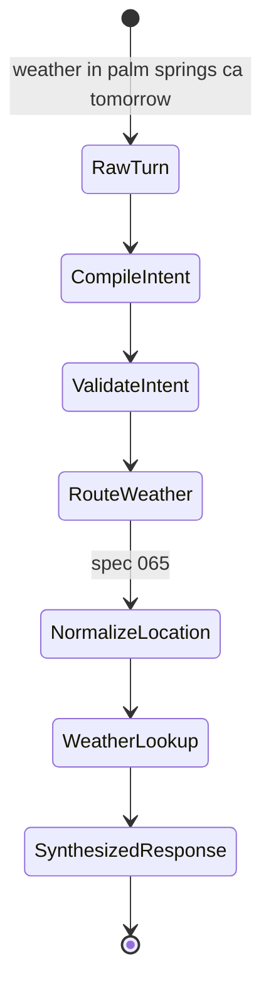
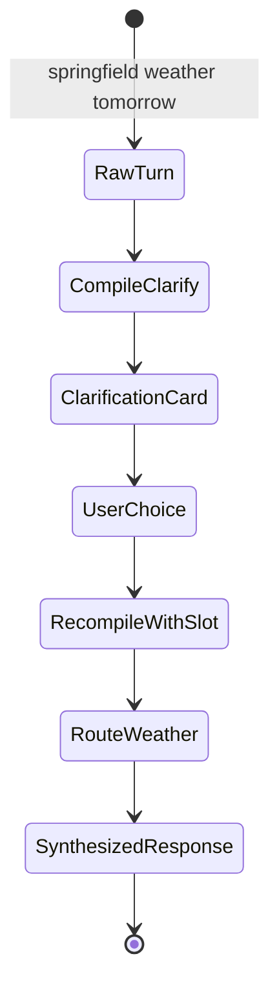
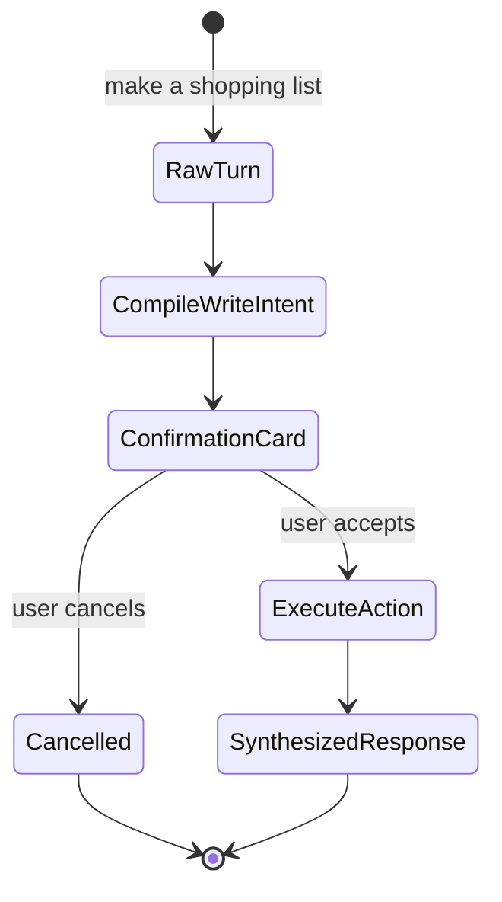

# Feature: 068 Structured Intent Compiler

**Status:** in_progress (planning bootstrap; ceiling = `done`)
**Workflow Mode:** `full-delivery`
**Owner Directive (2026-05-31):** Make the owner-stated request path a
first-class runtime contract: EVERY user natural-language turn is
compiled by the LLM into a normalized, schema-bound Smackerel intent
before routing, tool selection, external communication, or response
synthesis happens.

**Depends On:** spec 037 (LLM scenario agent & tool registry), spec 061
(conversational assistant facade), spec 064 (open-ended knowledge
agent), spec 065 (generic micro-tools).
**Amends:** spec 061 (the facade inserts intent compilation before
scenario routing), spec 037 (IntentEnvelope grows from a routing input
into a compiled-turn carrier), spec 064 (open-knowledge consumes the
compiled intent rather than raw text only), spec 066 (retired slash
commands route through compiled NL intents), spec 067 (policy guards
include compiler-bypass detection).
**Unblocks:** full removal of scenario-specific command handlers and
regex intent parsers without losing structured behavior. Pairs with
[spec 069 — Assistant HTTP Transport](../069-assistant-http-transport/spec.md):
spec 069 provides the testable HTTP ingress that exercises the
compiler end-to-end across every transport using the same
`Facade.Handle` code path.

---

## 1. Problem Statement

Smackerel now has the pieces of an intent-driven assistant, but the
current pipeline is not yet the owner's required pipeline.

Today, spec 061 builds an `IntentEnvelope` around raw user text, then
routes it by explicit slash shortcut or embedding similarity against
scenario examples. The scenario/executor later asks the LLM to call
tools. That is useful, but it is not the invariant the owner stated:

1. LLM transforms the user's natural language into a structured
   Smackerel intent.
2. The structured intent identifies the next step: internal search,
   weather lookup, recipe/list/expense action, open-knowledge answer,
   clarification, or capture.
3. Logic and external calls execute using normalized structured
   arguments, never raw ad-hoc text.
4. LLM synthesizes the tool/action result into the final user response.

Without a first-class intent compiler, Smackerel still has too many
places where raw text decides behavior:

- `/ask`, `/weather`, `/remind` short-circuit routing by setting a
  scenario id directly.
- The router chooses a scenario from raw text embedding similarity
  rather than a typed request object.
- Legacy paths such as `internal/api/domain_intent.go` parse domain
  intent with regex until spec 066 deletes them.
- Scenario prompts carry slot extraction rules that should be expressed
  as a shared typed intent schema.

This spec introduces the missing contract: a compiler that produces a
single `CompiledIntent` object for every user turn. The router,
executor, tools, and response synthesizer all consume that object.

---

## 2. Actors & Personas

| Actor | Description | Goals | Permissions |
|-------|-------------|-------|-------------|
| **Human user (chat owner)** | Sends ordinary natural-language requests through Telegram v1 and future transports. | Type naturally; never memorize command syntax; receive precise behavior or clear clarification. | Existing transport permissions. |
| **Intent Compiler** | LLM-backed, schema-validated capability inserted before routing. | Convert raw NL + conversation context into `CompiledIntent` with normalized slots, action class, side-effect class, candidate tools/scenarios, confidence, and clarification need. | Calls the LLM bridge; reads conversation context; writes no business state. |
| **Scenario Router** | Existing spec 037 router, amended. | Route based on `CompiledIntent` first, using similarity only as a tie-breaker / fallback. | Reads scenario manifest and compiler output. |
| **Agent Executor** | Existing spec 037 executor. | Pass compiled structured context to scenario/tool loop; refuse malformed or missing compiled intent when required. | Calls tools from allowed registry. |
| **Transport Adapter** | Telegram v1 now, future adapters later. | Produce transport-neutral inbound messages and receive transport-neutral responses. | Does not parse domain intent. |
| **Operator** | Owns SST config. | Enable compiler model route, budget, confidence floors, and fail-loud policy. | Edits `config/smackerel.yaml` `assistant.intent_compiler.*`. |

---

## 3. Domain Capability Model

### Domain primitives

| Primitive | Meaning | Lifecycle |
|-----------|---------|-----------|
| `RawTurn` | Transport-normalized user input plus source, user id, correlation id, and conversation window. | Created per inbound turn; retained in conversation context and trace. |
| `CompiledIntent` | Schema-bound interpretation of the raw turn. | `draft` -> `validated` -> `routed` OR `clarification_required` OR `capture_only`. |
| `IntentAction` | The next system step requested by the user. | Selected during compilation; executed by router/executor only after validation. |
| `IntentSlot` | Normalized entity / value / time / unit / artifact reference used by the action. | Extracted by compiler; may be refined by micro-tools from spec 065. |
| `IntentRouteCandidate` | Candidate scenario/tool family with confidence and rationale. | Ranked during compilation; router consumes. |
| `IntentTrace` | Audit record tying raw text, compiled intent, route decision, tool calls, and final response together. | Persisted for observability and debugging; redacts sensitive slot values per source policy. |

### CompiledIntent minimum schema

```json
{
  "version": "v1",
  "language": "en",
  "user_goal": "string",
  "action_class": "answer|retrieve|external_lookup|internal_action|state_mutation|clarify|capture_only|refuse",
  "side_effect_class": "none|read|write|external_read|external_write",
  "scenario_hint": "string|null",
  "tool_hints": ["string"],
  "normalized_request": {},
  "slots": {},
  "missing_slots": ["string"],
  "confidence": 0.0,
  "clarification_prompt": "string|null",
  "safety_flags": ["string"],
  "source_policy": {
    "requires_citations": true,
    "allowed_source_kinds": ["graph", "tool", "web", "computation"]
  }
}
```

### Business policies

- A user-facing turn MUST have exactly one `CompiledIntent` before
  scenario routing, except operational commands that are explicitly
  excluded (`/help`, `/status`, `/reset`, `/digest`, `/recent`,
  `/done`).
- The compiler is not allowed to execute tools or mutate state. It
  only returns structured intent.
- Missing required slots produce `action_class = "clarify"`, not a
  guessed action.
- `side_effect_class` gates execution. Write actions require the
  existing confirmation / capability gate; read-only actions may
  execute without confirmation.
- Runtime config is fail-loud. Missing compiler model, timeout,
  schema version, confidence floor, or budget key aborts startup.
- The router may use embedding similarity only after compilation, as
  a ranking input, never as the sole source of truth for user intent.

---

## 4. Outcome Contract

**Intent:** Every user NL request is compiled into a validated,
traceable `CompiledIntent`; every downstream action uses structured
arguments from that object or from schema-validated tools, not raw
ad-hoc text.

**Success Signal:**
- Live-stack traces for weather, recipe/list, retrieval, annotation,
  open-knowledge, and expense requests all include the same sequence:
  `raw_turn_received -> intent_compiled -> intent_validated ->
  route_selected -> tool_or_action_executed -> response_synthesized`.
- Weather request `"weather in palm springs ca tomorrow"` compiles to
  `{ action_class: "external_lookup", scenario_hint: "weather_query",
  slots.location.raw: "palm springs ca", slots.window: "tomorrow" }`,
  then spec 065 `location_normalize` produces the canonical location
  before `weather_lookup` calls Open-Meteo.
- Recipe/list request `"make a shopping list for Pad Thai and Caesar"`
  compiles to an internal action with artifact/entity slots; no regex
  parser or slash command handler participates.
- Unknown / underspecified input compiles to `clarify` or
  `capture_only`; it does not silently pick a fallback scenario.
- A guard test fails if a user-facing request path reaches scenario
  routing without a `CompiledIntent` trace record.

**Hard Constraints:**
1. **Operational command carve-out is explicit and tiny.** Only
   `/help`, `/status`, `/reset`, `/digest`, `/recent`, `/done` bypass
   the compiler; they remain deterministic operational surfaces.
2. **No defaults.** All compiler config lives under
   `assistant.intent_compiler.*`; missing keys fail-loud. No fallback
   model, fallback prompt, fallback confidence floor, or default
   action class is allowed.
3. **No tool execution during compilation.** The compiler may suggest
   tools, but executor/tool registry performs all calls after route
   selection and schema validation.
4. **Schema validation before routing.** Invalid compiler JSON causes
   a structured compiler error path, not a raw-text router fallback.
5. **Capture preserved.** Compiler failure or unknown intent produces
   capture-as-fallback via spec 061/064; raw user text is never lost.
6. **Side effects are gated.** Any compiled intent with
   `side_effect_class in {write, external_write}` requires the
   existing confirm / capability gate before execution.
7. **Traceability is mandatory.** `IntentTrace` links raw text,
   compiled intent, selected route, tool calls, and final response.

**Failure Condition:** A user-facing natural-language request can reach
scenario routing, a tool call, or a domain action without a valid
`CompiledIntent`, OR a compiler failure silently falls back to a
scenario instead of clarify/capture.

---

## 5. Product Principle Alignment

| Principle | Alignment | Evidence |
|-----------|-----------|----------|
| **P1 Observe First, Ask Second** | Compiler turns vague input into structure without demanding command syntax; only asks when required slots are missing. | Hard Constraints 1, 5. |
| **P2 Vague In, Precise Out** | Core feature. Raw NL becomes precise normalized intent and slots. | Outcome Contract. |
| **P4 Source-Qualified Processing** | `source_policy` carries required source kinds into execution and response synthesis. | CompiledIntent schema. |
| **P5 One Graph, Many Views** | Compiler emits graph/action references; it does not create a parallel intent store beyond trace records. | Domain model. |
| **P6 Invisible By Default** | No command-learning burden; clarification only when needed. | Success Signal. |
| **P8 Trust Through Transparency** | IntentTrace makes the request interpretation auditable; wrong routing can be debugged from evidence. | Hard Constraint 7. |
| **P10 QF Companion Boundary** | `side_effect_class` and safety flags prevent financial action from being routed without explicit policy. | Hard Constraint 6. |

---

## 6. Functional Requirements (BDD Scenarios)

```gherkin
Scenario: SCN-068-A01 — Weather NL compiles before route
  Given the intent compiler is enabled
  When the user sends "weather in palm springs ca tomorrow"
  Then the compiler returns a valid CompiledIntent with action_class = "external_lookup"
  And scenario_hint = "weather_query"
  And slots.location.raw = "palm springs ca"
  And slots.window = "tomorrow"
  And the router receives the CompiledIntent before selecting weather_query

Scenario: SCN-068-A02 — Retrieval NL compiles before route
  Given the intent compiler is enabled
  When the user sends "what did I save about ACL tags last month?"
  Then the compiler returns action_class = "retrieve"
  And scenario_hint = "retrieval_qa"
  And normalized_request.query preserves the user's question
  And the retrieval scenario receives structured context, not raw text only

Scenario: SCN-068-A03 — Recipe/list action compiles without slash command
  Given specs 065 and 066 are implemented
  When the user sends "make a shopping list for Pad Thai and Caesar"
  Then the compiler returns action_class = "internal_action"
  And side_effect_class = "write"
  And tool_hints include entity_resolve and the list assembly tool family
  And the existing confirmation gate runs before the list is persisted

Scenario: SCN-068-A04 — Annotation intent compiles without keyword map
  Given specs 066 and 068 are implemented
  When the user sends "made it last night, 4 out of 5, needs more garlic"
  Then the compiler returns action_class = "state_mutation"
  And slots include interaction_type = "made_it", rating = 4, note = "needs more garlic"
  And no runtime keyword map chooses the interaction type

Scenario: SCN-068-A05 — Ambiguous request asks for clarification
  Given the intent compiler is enabled
  When the user sends "springfield weather tomorrow"
  Then the compiler returns action_class = "clarify"
  And missing_slots or ambiguity metadata identifies the location ambiguity
  And the facade emits the existing disambiguation prompt rather than picking a city

Scenario: SCN-068-A06 — Compiler malformed JSON fails safely
  Given the LLM provider returns malformed compiler output
  When the compiler validates the response
  Then no scenario is routed
  And the user turn follows the canonical compiler-failure refusal-with-capture path
  And an intent_compiler_error_total metric increments with cause = "schema_invalid"

Scenario: SCN-068-A07 — Operational commands bypass compiler explicitly
  Given the user sends /status
  Then the operational status handler responds directly
  And no CompiledIntent is required
  And the trace labels the turn as operational_command_bypass

Scenario: SCN-068-A08 — Guard detects raw route bypass
  Given a user-facing code path calls Router.Route with RawInput and no CompiledIntent
  When the policy guard from spec 067 runs
  Then it fails naming the file and the missing compiler step

Scenario: SCN-068-A09 — Side-effect class gates execution
  Given the compiler returns side_effect_class = "external_write"
  When a scenario attempts to execute without confirmation
  Then the executor blocks the action and emits the existing confirm-required response
```

---

## 7. Acceptance Criteria

- Every user-facing NL request path in Telegram, API, scheduler, and
  future transports either produces a `CompiledIntent` or is explicitly
  labeled as an operational-command bypass.
- The existing `IntentEnvelope` either embeds `CompiledIntent` or is
  superseded by an envelope that carries both raw text and compiled
  intent; raw text remains available for trace/capture but does not
  drive behavior by itself.
- Scenario YAMLs declare the compiler schema version they accept and
  the required fields they consume.
- Spec 067 adds a guard that fails on Router.Route calls from
  user-facing paths without a compiled intent record.
- Spec 066 uses the compiler to replace `/find`, `/rate`, `/list`,
  `/expense`, `/watch`, `/meal_plan`, recipe/cook commands, and the
  annotation keyword map.
- `assistant.intent_compiler.*` SST keys exist, are required, and fail
  loud when missing.
- E2E coverage includes weather, retrieval, recipe/list, annotation,
  expense, open-knowledge, ambiguous clarify, malformed compiler JSON,
  and operational command bypass.

---

## 8. Non-Goals

- Implementing the micro-tools themselves (spec 065).
- Retiring the legacy slash commands (spec 066).
- Adding web search / open-domain answer tools (spec 064).
- Changing product-domain behavior for recipes, expenses, lists,
  annotations, or weather beyond their request entry path.
- Creating a new user-visible command language.

---

## 9. Open Questions (resolve in `bubbles.design`)

- Is `CompiledIntent` embedded in `IntentEnvelope.StructuredContext`,
  or does `IntentEnvelope` gain a typed `CompiledIntent` field?
- Should compiler output be cached within a conversation turn retry,
  or recompiled after every clarification answer? Prefer recompile
  after clarification, cache only within identical retry.
- Does the compiler run on bare `/ask`, `/weather`, `/remind` shortcut
  bodies, or do those remain explicit scenario fast-paths with a
  synthetic compiled intent? The safer path is synthetic compiled
  intent so all traces stay uniform.

## UI Wireframes

### Screen Inventory

| Screen | Actor(s) | Status | Surface | Scenarios Served |
|--------|----------|--------|---------|------------------|
| Assistant Clarification From Compiled Intent | Human user | New | Transport-neutral assistant response | SCN-068-A05, SCN-068-A06, SCN-068-A09 |
| Intent Trace Inspector | Operator, Scenario author | New | Web/devtools trace view | SCN-068-A01..A09 |
| Side-Effect Confirmation Card | Human user | Modified | Transport-neutral assistant response | SCN-068-A03, SCN-068-A04, SCN-068-A09 |

### UI Primitives

| Primitive | Consumed By | Composition Rules | Accessibility / Responsive Constraints |
|-----------|-------------|-------------------|----------------------------------------|
| Clarification card | Clarification From Compiled Intent, Side-Effect Confirmation Card | Uses `clarification_prompt`, `missing_slots`, and candidate values from `CompiledIntent`; never invents missing data in the renderer. | Prompt appears before choices; choices have stable ordinals and text labels. |
| Compiled intent summary | Intent Trace Inspector | Shows action class, side-effect class, scenario hint, confidence, and source policy. | Values must remain visible without hover; sensitive slots are redacted with labels. |
| Side-effect badge | Confirmation Card, Trace Inspector | Labels `none`, `read`, `write`, `external_read`, or `external_write`; write classes require confirmation affordance. | Badge includes text and semantic warning role when confirmation is required. |
| Trace step timeline | Intent Trace Inspector | Fixed sequence: raw turn, intent compiled, intent validated, route selected, tool/action executed, response synthesized. | Timeline is readable as an ordered list on narrow screens. |

### Transport-Neutral Interaction Requirements

- User-visible assistant copy is generated from the assistant response model, not from transport-specific branches.
- Clarification and confirmation cards must render the same logical fields in Telegram, HTTP, and later web/mobile clients.
- The user sees the natural prompt, choices, and action consequences; operators see compiled-intent internals in trace views.
- Compiler failure states must state whether the user's original turn was captured or refused; raw-text rerouting is never presented as a recovery option.

### UX User Validation Checklist

| Validation Item | Pass Signal |
|-----------------|-------------|
| Natural language remains primary | A user can complete weather, retrieval, list, and annotation tasks without command syntax. |
| Clarification feels specific | Ambiguous requests ask for the missing slot only, not a full restatement. |
| Side effects are understandable | Before a write action, the user sees what will change and can accept or cancel. |
| Trace tells the routing story | An operator can follow a turn from raw text to compiled intent to selected route without reading logs. |

### Screen: Assistant Clarification From Compiled Intent

**Actor:** Human user | **Route:** Transport-neutral assistant turn | **Status:** New

┌──────────────────────────────────────────────────────────────┐
│ Assistant                                                     │
├──────────────────────────────────────────────────────────────┤
│ I can check the weather, but I need the location clarified.   │
│                                                              │
│ Request understood as: weather tomorrow                       │
│ Missing slot: location                                        │
│                                                              │
│ Which Springfield did you mean?                               │
│ [Springfield, IL] [Springfield, MO] [Springfield, MA]          │
│ [Type another location]                                       │
└──────────────────────────────────────────────────────────────┘

**Interactions:**
- Candidate choice -> compiles the next turn with the selected slot and resumes routing.
- `Type another location` -> keeps the original request and asks only for the location value.
- User sends unrelated text -> spec 061 pending-state rules decide whether to reset or capture.

**States:**
- Empty state: missing slot with no candidates -> prompt for the specific missing value.
- Loading state: assistant pending turn skeleton; no visible compiler jargon.
- Error state: compiler malformed output -> refusal-with-capture response with trace id.

**Responsive:**
- Mobile: choices stack; missing-slot summary stays above the choices.
- Desktop: choices may appear in a compact row, but remain full text labels.

**Accessibility:**
- Prompt and missing slot are separate screen-reader paragraphs.
- Candidate buttons include city, region, and country where available.
- Focus returns to the assistant response after a choice is submitted.

### Screen: Intent Trace Inspector

**Actor:** Operator, Scenario author | **Route:** `/assistant/traces/{trace_id}/intent` | **Status:** New

┌────────────────────────────────────────────────────────────────────────────┐
│ Intent Trace: [trace_id]                              [Copy] [Open Turn]  │
├────────────────────────────────────────────────────────────────────────────┤
│ Raw turn: "make a shopping list for Pad Thai and Caesar"                  │
│                                                                            │
│ CompiledIntent                                                             │
│ action_class: internal_action          side_effect_class: write             │
│ scenario_hint: shopping_list_assemble  confidence: 0.86                     │
│ tool_hints: entity_resolve, unit_convert                                    │
│ source_policy: citations required; graph/tool sources                       │
│                                                                            │
│ ┌──────────────────────────────────────────────────────────────────────┐   │
│ │ Trace Steps                                                           │   │
│ │ 1 raw_turn_received        ok                                         │   │
│ │ 2 intent_compiled          ok                                         │   │
│ │ 3 intent_validated         ok                                         │   │
│ │ 4 route_selected           shopping_list_assemble                     │   │
│ │ 5 confirmation_required    write action                               │   │
│ └──────────────────────────────────────────────────────────────────────┘   │
└────────────────────────────────────────────────────────────────────────────┘

**Interactions:**
- Trace step -> expands validation details and redacted slots.
- `Copy` -> copies redacted trace summary.
- `Open Turn` -> returns to full assistant conversation trace.

**States:**
- Empty state: no compiled intent -> show operational-command bypass or compiler failure state, never a blank trace.
- Loading state: step timeline skeleton retains the final ordered-list shape.
- Error state: trace access denied -> auth error with no slot values leaked.

**Responsive:**
- Mobile: compiled-intent fields become stacked label/value rows.
- Desktop: trace timeline and compiled summary can sit side by side.

**Accessibility:**
- Timeline is exposed as an ordered list.
- Redacted fields announce `redacted`.
- Side-effect badges include text and warning role for write classes.

### Screen: Side-Effect Confirmation Card

**Actor:** Human user | **Route:** Transport-neutral assistant turn | **Status:** Modified

┌──────────────────────────────────────────────────────────────┐
│ Assistant                                                     │
├──────────────────────────────────────────────────────────────┤
│ I can create a shopping list from these recipes.              │
│                                                              │
│ Action: create list                                           │
│ Items: Pad Thai, Caesar Salad                                 │
│ Will change: one new draft list                               │
│                                                              │
│ [Create list] [Cancel] [Change recipes]                       │
└──────────────────────────────────────────────────────────────┘

**Interactions:**
- `Create list` -> executes the gated write action.
- `Cancel` -> clears pending confirmation state and sends no write.
- `Change recipes` -> returns to clarification with the original compiled intent preserved.

**States:**
- Empty state: action summary missing required fields -> clarification card instead of confirmation.
- Loading state: pending confirmation action disables duplicate submission affordances.
- Error state: stale confirmation ref -> reset-safe message with option to restate the request.

**Responsive:**
- Mobile: actions stack with the destructive/cancel action visually secondary.
- Desktop: actions align in one row after the action summary.

**Accessibility:**
- The action consequence is text before the primary action.
- Primary action name includes the object being created or changed.
- Confirmation reference is not exposed as the visible label.

## User Flows

### User Flow: Weather Request Compiles Before Route



### User Flow: Ambiguous Request Clarifies Missing Slot



### User Flow: Side-Effect Intent Requires Confirmation


