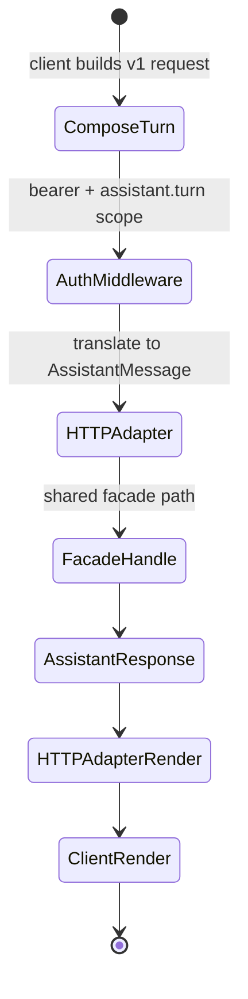
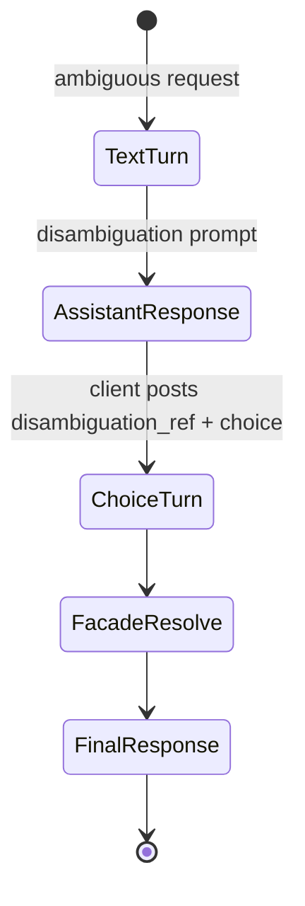
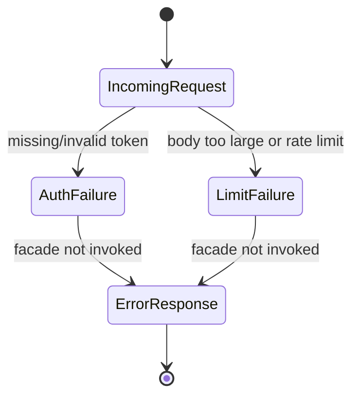

# Feature: 069 Assistant HTTP Transport (Testable Conversational Surface)

**Status:** in_progress (planning bootstrap; ceiling = `done`)
**Workflow Mode:** `full-delivery`
**Owner Directive (2026-05-31):** Smackerel must have a programmatic
conversational surface that is callable by automated tests and reusable
by every future frontend (web chat, shared iOS+Android mobile,
WhatsApp via webhook, mobile in-app, devtools). Today the only entry path is the Telegram
bot, which makes the assistant effectively untestable end-to-end and
forces every new transport to fork integration logic.

**Depends On:** spec 037 (LLM scenario agent), spec 043 (Ollama test
infrastructure for real-model E2E), spec 044 (per-user bearer auth),
spec 060 (scope claims), spec 061 (conversational assistant facade +
`TransportAdapter` interface), spec 068 (structured intent compiler —
the compiler runs inside the facade and is exercised by every
transport equally).
**Amends:** spec 061 (adds a second concrete `TransportAdapter` next
to Telegram; the contract itself is unchanged), spec 031 (live-stack
testing — E2E tests now drive the assistant through HTTP instead of
the Telegram bot), spec 043 (the canonical real-LLM happy-path E2E is
re-targeted from Telegram-only to HTTP transport), spec 020 (security
hardening — adds one new authenticated HTTP route under the per-user
bearer policy).
**Unblocks:** future transport specs for web chat, shared iOS+Android
mobile in-app, WhatsApp Business webhook, and any UI that needs a conversational
surface; full E2E coverage of specs 061/064/065/066/067/068 without a
real Telegram account.

---

## 1. Problem Statement

Spec 061 introduced a clean transport-agnostic capability layer:

- `internal/assistant.Facade.Handle(ctx, contracts.AssistantMessage)`
  returns `contracts.AssistantResponse` and owns conversation state,
  routing, scenario execution, disambiguation, confirm, and capture
  fallback.
- `internal/assistant/contracts.TransportAdapter` is the documented
  capability ⇄ transport boundary with `Translate / Render /
  Identity / Start / Stop`.
- Telegram (`internal/telegram/assistant_adapter/`) is the v1
  adapter and uses this contract correctly.

What is missing is **any other adapter that can be driven
deterministically by a test harness or a non-Telegram frontend**:

- There is no HTTP route that accepts an `AssistantMessage` and
  returns an `AssistantResponse`.
- E2E tests that want to verify weather / retrieval / open-knowledge
  / intent-compiler behavior end-to-end must either stand up a real
  Telegram client (impossible in CI) or call into Go internals,
  which is in-process unit testing dressed as integration.
- A web chat / shared iOS+Android mobile / WhatsApp adapter cannot exist without
  reimplementing both transport-side glue *and* the backend ingress
  shape, because there is no canonical HTTP surface for the facade.

This spec adds exactly one new adapter — an HTTP transport — that
satisfies all of: deterministic E2E testing, web chat ingress,
mobile in-app ingress, and a webhook-style ingress for transports
that bridge to HTTP (e.g. WhatsApp Business). Telegram remains
unchanged.

---

## 2. Actors & Personas

| Actor | Description | Goals | Permissions |
|-------|-------------|-------|-------------|
| **Human user (web/mobile/chat)** | Operator using a non-Telegram conversational UI now or in the future. | Send a turn, get a response, see disambiguation/confirm prompts, reset conversation — identical semantics to Telegram. | Per-user bearer auth (spec 044) with the assistant scope claim (spec 060). |
| **Test harness** | E2E test runner (`tests/e2e/...`) and chaos / stress drivers. | Drive any number of users through any scenario over HTTP; assert structured responses; replay turns; never touch a real Telegram or WhatsApp account. | Test-only bearer tokens issued per test, scoped to the test user. |
| **Future transport (web chat, shared iOS+Android mobile, WhatsApp)** | Frontend developer building a new client. | Implement only client-side glue; speak the canonical HTTP contract; inherit conversation, disambig, confirm, capture, and compiler behavior unchanged. | Standard per-user bearer auth; rate-limited per spec 020. |
| **HTTP Transport Adapter** (new) | Concrete `TransportAdapter` implementation registered under `Transport="web"` (closed-vocabulary token already reserved in `contracts.AssistantMessage`). | Translate HTTP request bodies into `AssistantMessage`; render `AssistantResponse` into HTTP response bodies; honor `CaptureRoute`; integrate with the facade's existing disambig/confirm round-trip. | Reads auth context; writes no business state directly. |
| **Operator** | Owns SST configuration. | Enable / disable the HTTP transport per environment; set rate limits, body-size caps, CORS allowlist, conversation TTL. | Edits `config/smackerel.yaml` `assistant.transports.http.*`. |

---

## 3. Outcome Contract

**Intent:** A single HTTP transport adapter exposes the assistant
capability layer so that automated tests and any non-Telegram
frontend drive the same backend through the same contract Telegram
uses, with zero capability-layer changes.

**Success Signal:**
- A user (or test) sends a request to `POST /api/assistant/turn` with
  a bearer token. The handler builds a canonical
  `contracts.AssistantMessage` (transport = `"web"`), calls
  `Facade.Handle`, and returns the `contracts.AssistantResponse`
  serialized as JSON.
- The same `Facade.Handle` invocation that backs `/api/assistant/turn`
  also backs Telegram. Behavior — routing, intent compilation
  (spec 068), open-knowledge (spec 064), micro-tools (spec 065),
  disambig, confirm, capture-as-fallback — is identical across
  transports. No transport-specific scenario logic exists.
- A new E2E test suite under `tests/e2e/assistant/` drives weather,
  retrieval, recipe/list, open-knowledge, disambiguation, confirm,
  reset, capture-as-fallback, and intent-compiler clarify paths over
  HTTP against the live stack. The Telegram bot is NOT required for
  this suite.
- A second `TransportAdapter` (HTTP) coexists with Telegram in the
  facade registry. The closed-vocabulary token `"web"` is reserved
  but the API surface is generic enough to back web chat, shared
  iOS+Android mobile in-app, and any future bridge.
- The same HTTP endpoint, called with a different `transport_hint`
  query parameter (`web | mobile | bridge`), allows a future WhatsApp
  Business webhook bridge or a shared iOS+Android mobile app to identify itself
  without forking the route. The closed-vocabulary check (existing
  `AllMessageKinds`-style guard) is extended once and only once.

**Hard Constraints:**
1. **Zero changes to capability layer.** The HTTP adapter MUST
   implement `contracts.TransportAdapter` as it stands today. If a
   change to that contract is needed, it ships in a separate spec
   amending 061, not silently in this spec.
2. **Per-user bearer auth required.** No anonymous / shared-secret
   path. Routes are mounted behind spec 044 + spec 060 with a new
   `assistant.turn` scope claim. Missing/invalid token returns 401
   without invoking the facade.
3. **No defaults (smackerel NO-DEFAULTS).** All adapter config lives
   under `assistant.transports.http.*` (enabled, bind, rate limits,
   body-size cap, CORS allowlist, conversation TTL). Missing keys
   fail loud at startup.
4. **Idempotency carried by the client.** The request body MUST
   include a `transport_message_id` field that maps to
   `AssistantMessage.TransportMessageID` so retried turns dedupe
   exactly like Telegram retries; the adapter MUST NOT invent one.
5. **Capture-as-fallback preserved.** When `AssistantResponse.CaptureRoute
   == true`, the adapter calls the existing capture path before
   returning. The HTTP response surfaces the capture acknowledgement
   identically to Telegram (the user's prompt is never lost).
6. **Streaming is out of scope for v1.** The HTTP response is a
   single JSON document. Streaming / SSE / WebSocket is a follow-up
   spec that amends this one; it does not gate v1.
7. **Stable wire schema.** The HTTP request and response JSON shapes
   are versioned (`schema_version: "v1"`) and pinned by a golden-file
   contract test. Breaking changes ship as `v2`, not silent edits.
8. **One adapter, many frontends.** No per-frontend route variants
   (`/api/assistant/web/turn`, `/api/assistant/mobile/turn`). One
   route, one schema, transport identification by `transport_hint`
   in the request body. A future closed-vocabulary check enforces it.

**Failure Condition:** A test cannot drive the assistant end-to-end
without a real Telegram account, OR a second concrete frontend
requires changes to capability-layer code to ship, OR the HTTP route
develops scenario-specific branching.

---

## 4. Product Principle Alignment

| Principle | Alignment | Evidence |
|-----------|-----------|----------|
| **P2 Vague In, Precise Out** | The HTTP contract is the precise wire form of the same vague-in/precise-out behavior Telegram already exposes. | Outcome Contract. |
| **P4 Source-Qualified Processing** | HTTP responses carry the same Source attribution as Telegram (citations, provenance). | Hard Constraint 1. |
| **P5 One Graph, Many Views** | Two transports, one capability layer, one knowledge graph. | Domain. |
| **P6 Invisible By Default** | The new surface adds no user-visible prompts; it is a developer / frontend ingress. | Non-Goals. |
| **P8 Trust Through Transparency** | Wire schema is pinned by a golden contract test; breaking changes are visible and versioned. | Hard Constraint 7. |
| **P10 QF Companion Boundary** | HTTP turns are subject to the same side-effect / confirm gate as Telegram; no new financial-action surface introduced. | Hard Constraint 1. |

---

## 5. Functional Requirements (BDD Scenarios)

```gherkin
Scenario: SCN-069-A01 — HTTP turn returns the same response Telegram would
  Given the HTTP transport adapter is enabled with a valid bearer token
  When the user POSTs { transport_message_id, kind: "text", text: "/ask what is the weather in barcelona" } to /api/assistant/turn
  Then the response is HTTP 200 with a JSON body matching the AssistantResponse schema
  And the response body contains the same scenario invocation result a Telegram /ask would have produced for the same compiled intent
  And the response sets Transport = "web" and TransportMessageID echoing the request

Scenario: SCN-069-A02 — Auth is mandatory
  Given no bearer token is provided
  When the user POSTs to /api/assistant/turn
  Then the response is HTTP 401
  And the facade is never invoked

Scenario: SCN-069-A03 — Disambiguation prompt round-trips over HTTP
  Given a prior turn produced an AssistantResponse with a DisambiguationPrompt
  When the user POSTs { kind: "disambiguation", disambiguation_ref, disambiguation_choice: 2 }
  Then the facade resolves the choice exactly as Telegram would
  And the next response is the chosen scenario's invocation result

Scenario: SCN-069-A04 — Confirm prompt round-trips over HTTP
  Given a prior turn produced an AssistantResponse with a ConfirmCard
  When the user POSTs { kind: "confirm", confirm_ref, confirm_choice: "accept" }
  Then the side-effect-bearing action executes
  And the response carries the same post-confirm result Telegram would produce

Scenario: SCN-069-A05 — Reset clears pending state
  When the user POSTs { kind: "reset" }
  Then the facade drops any pending confirm/disambig state for (user, transport=web)
  And the response is the canonical reset acknowledgement

Scenario: SCN-069-A06 — Capture-as-fallback acknowledgement is identical to Telegram
  Given the facade returns AssistantResponse with CaptureRoute = true
  When the HTTP adapter renders the response
  Then the local capture path is invoked exactly once
  And the HTTP response body includes the same "saved-as-idea" acknowledgement shape Telegram emits

Scenario: SCN-069-A07 — Schema is pinned by a golden contract test
  Given the request and response wire schemas declared in this spec
  When the contract test runs
  Then any change to the JSON field names, types, or required fields fails the test unless schema_version is bumped

Scenario: SCN-069-A08 — Telegram and HTTP share one facade instance
  Given Telegram and HTTP adapters are both registered in the same process
  When a turn arrives on each transport for the same user
  Then both invocations hit the same Facade.Handle code path
  And both record turns in the same assistant_conversations row family (keyed by (UserID, Transport))
  And no scenario or routing decision branches on transport name

Scenario: SCN-069-A09 — Transport hint reserved but generic
  Given the request includes transport_hint = "mobile" or "bridge"
  When the adapter translates the request
  Then transport_hint is recorded for telemetry only and does NOT alter scenario selection, tool allowlist, or response shape
  And an unknown transport_hint is rejected by the closed-vocabulary check

Scenario: SCN-069-A10 — Rate limit and body-size cap from SST
  Given assistant.transports.http.rate_limit_per_user_per_minute and body_size_max_bytes are set
  When a user exceeds either limit
  Then the request is rejected with the standard 429 / 413 status
  And no facade invocation occurs
  And missing config keys fail loud at startup (NO-DEFAULTS)

Scenario: SCN-069-A11 — E2E suite drives the live stack without Telegram
  Given the live test stack is up
  When tests/e2e/assistant/* runs
  Then weather, retrieval, recipe/list, open-knowledge, disambig, confirm, reset, capture-fallback, and intent-compiler clarify scenarios all pass against the HTTP route
  And no test in the suite requires a real Telegram account or the Telegram bot to be running
```

---

## 6. Acceptance Criteria

- New package `internal/assistant/http_adapter/` (final name decided
  in design) implements `contracts.TransportAdapter` for the closed
  vocabulary value `"web"`.
- New HTTP route `POST /api/assistant/turn` under the existing
  per-user bearer middleware (spec 044) with the new
  `assistant.turn` scope claim (spec 060).
- Wire schemas (request + response) are pinned by a golden contract
  test located alongside the adapter; `schema_version: "v1"`.
- E2E suite under `tests/e2e/assistant/` covers SCN-069-A01..A11
  against the live stack via HTTP; existing Telegram coverage stays
  in place but is no longer the only end-to-end path.
- `assistant.transports.http.*` SST keys (enabled, bind, rate limits,
  body-size cap, CORS allowlist, conversation TTL, schema-version)
  exist, are required, and fail loud when missing.
- Telegram coverage and behavior are unchanged.
- Spec 031 (live-stack testing) is amended so that the canonical
  "drive the assistant end-to-end" path is HTTP, not Telegram.
- Spec 067 policy guards extend to detect any scenario / facade code
  that branches on `AssistantMessage.Transport`; only the adapter
  and audit layers may inspect that field.

---

## 7. Non-Goals

- Streaming responses (SSE/WebSocket). Follow-up spec amending this
  one.
- Building the actual web chat / shared iOS+Android mobile / WhatsApp UIs. Those ship
  as their own frontend specs; they consume the contract defined
  here.
- Multi-tenant auth model changes. Spec 044 + spec 060 stay
  authoritative.
- A second backend ingress mechanism (gRPC, MCP). Out of scope; can
  be added later via additional adapters under the same contract.
- Persisting HTTP-only conversation history outside the existing
  `assistant_conversations` schema. (UserID, Transport) keying
  already covers it.

---

## 8. Open Questions (resolve in `bubbles.design`)

- Exact route shape: `POST /api/assistant/turn` returning the full
  `AssistantResponse`, or `POST /api/assistant/turn` + `GET
  /api/assistant/turn/{id}` for long-running scenarios? V1 prefers
  the synchronous single-shot to keep the contract trivial; streaming
  is a follow-up.
- Whether the closed-vocabulary check for `AssistantMessage.Transport`
  expands from `{"telegram","whatsapp","web","mobile"}` to add
  `"bridge"`, or whether bridges always present as `"web"` with
  `transport_hint = "bridge"`. Prefer the latter to avoid
  vocabulary churn.
- Whether the request body's `kind` field reuses the existing
  `MessageKind` JSON values or introduces a parallel wire form.
  Prefer reusing the existing values verbatim and pinning them in
  the golden test.

## UI Wireframes

### Screen Inventory

| Screen | Actor(s) | Status | Surface | Scenarios Served |
|--------|----------|--------|---------|------------------|
| HTTP Assistant Turn Console | Test harness, Future transport developer | New | Devtools / E2E contract client | SCN-069-A01..A11 |
| Transport-Neutral Chat Response | Human user, Future transport developer | New | Web/mobile/chat consumer surface | SCN-069-A01, SCN-069-A03..A06, SCN-069-A09 |
| HTTP Error Response Surface | Test harness, Future transport developer | New | HTTP client / frontend error renderer | SCN-069-A02, SCN-069-A07, SCN-069-A10 |

### UI Primitives

| Primitive | Consumed By | Composition Rules | Accessibility / Responsive Constraints |
|-----------|-------------|-------------------|----------------------------------------|
| Assistant response body | Chat Response, Turn Console | Render `AssistantResponse` text, citations, disambiguation, confirm, reset, and capture acknowledgement from one schema. | Response order must remain logical in narrow chat UIs. |
| Turn request editor | Turn Console | Edits schema-versioned request fields; required fields are visible before optional transport hints. | Labels and validation errors remain attached to fields. |
| Transport hint badge | Chat Response, Turn Console | Shows `web`, `mobile`, or `bridge` for telemetry only; never changes scenario affordances. | Badge is secondary and not used as the only response status. |
| HTTP error card | Error Response Surface | Maps 401, 413, 429, and schema errors to stable user/test-visible messages without leaking secrets. | Status code and plain-language meaning are both present. |

### Transport-Neutral Interaction Requirements

- Frontends must render assistant turns from the HTTP response schema without transport-specific scenario branches.
- Disambiguation, confirmation, reset, and capture-as-fallback use the same interaction vocabulary as Telegram.
- Transport hints are telemetry/context only; users must not see different choices or response shape because a client identifies as web, mobile, or bridge.
- Error responses must be stable enough for E2E assertions and clear enough for a future UI to render without custom backend knowledge.

### UX User Validation Checklist

| Validation Item | Pass Signal |
|-----------------|-------------|
| Contract is testable | A test author can compose a valid turn from the console/schema without Telegram knowledge. |
| Frontend handoff is clear | A web/mobile developer can map response fields to chat UI primitives without adding scenario-specific branches. |
| Errors are understandable | 401, 413, 429, and schema mismatch responses have distinct visible states and no secret leakage. |
| Transport parity is visible | The same request produces the same logical response over HTTP as the Telegram adapter path. |

### Screen: HTTP Assistant Turn Console

**Actor:** Test harness, Future transport developer | **Route:** `POST /api/assistant/turn` contract client | **Status:** New

┌────────────────────────────────────────────────────────────────────────────┐
│ Assistant HTTP Turn Console                                                │
├────────────────────────────────────────────────────────────────────────────┤
│ Request                                                                    │
│ schema_version: [v1]                                                       │
│ transport_message_id: [test-turn-001]                                      │
│ kind: [text v]      transport_hint: [web v]                                │
│ text: [weather in palm springs ca tomorrow________________________]        │
│                                                                            │
│ [Send Turn] [Reset Conversation] [Copy JSON]                               │
│                                                                            │
│ Response                                                                   │
│ HTTP 200                                                                   │
│ AssistantResponse.schema_version: v1                                       │
│ Transport: web    TransportMessageID: test-turn-001                       │
│ Body: [assistant answer / disambiguation / confirm / capture ack]          │
│ Trace: [trace_id]                                                          │
└────────────────────────────────────────────────────────────────────────────┘

**Interactions:**
- `Send Turn` -> submits the body with bearer auth and renders the structured response.
- `Reset Conversation` -> sends `kind: reset` for the same user/transport.
- `Copy JSON` -> copies the redacted request or response contract for fixtures.

**States:**
- Empty state: no response yet -> show schema guidance through field labels, not instructional prose blocks.
- Loading state: send button disabled and response panel shows pending status.
- Error state: HTTP error card with status, machine code, and safe message.

**Responsive:**
- Mobile: request fields stack above response; JSON copy moves into an overflow action.
- Desktop: request and response may sit side by side for comparison.

**Accessibility:**
- Every request field has a visible label.
- Validation errors are announced next to the offending field.
- Response status changes use an ARIA live region in web/devtools surfaces.

### Screen: Transport-Neutral Chat Response

**Actor:** Human user, Future transport developer | **Route:** Future web/mobile chat surface consuming `/api/assistant/turn` | **Status:** New

┌──────────────────────────────────────────────────────────────┐
│ Smackerel Assistant                                           │
├──────────────────────────────────────────────────────────────┤
│ You                                                          │
│ weather in palm springs ca tomorrow                          │
│                                                              │
│ Assistant                                                    │
│ It looks warm tomorrow in Palm Springs, California.           │
│ High: [value]  Low: [value]  Source: [weather provider]       │
│                                                              │
│ [Sources] [Trace]                                             │
│                                                              │
│ Composer                                                     │
│ [Ask naturally________________________________________] [Send]│
└──────────────────────────────────────────────────────────────┘

**Interactions:**
- `Send` -> posts one HTTP turn with a client-supplied `transport_message_id`.
- `Sources` -> expands citations/provenance from the response body.
- `Trace` -> available only to authorized operator/devtools contexts.
- Disambiguation/confirm response -> replaces source/actions row with schema-provided choices.

**States:**
- Empty state: conversation empty -> composer is active; no marketing or command-learning panel.
- Loading state: user turn remains visible while assistant response is pending.
- Error state: HTTP error card appears inline, preserving composer input where safe.

**Responsive:**
- Mobile: chat remains single-column; action buttons wrap below the assistant answer.
- Desktop: optional side panel may show sources/trace without changing turn semantics.

**Accessibility:**
- Chat transcript uses ordered message roles.
- Composer submit has a text label and keyboard shortcut is optional, not required.
- Source and trace actions are labelled and do not rely on icon-only meaning.

### Screen: HTTP Error Response Surface

**Actor:** Test harness, Future transport developer | **Route:** `/api/assistant/turn` error response | **Status:** New

┌──────────────────────────────────────────────────────────────┐
│ Assistant HTTP Error                                          │
├──────────────────────────────────────────────────────────────┤
│ Status: 401 Unauthorized                                      │
│ Code: auth_required                                           │
│ Message: A bearer token with assistant.turn scope is required.│
│ Facade invoked: no                                            │
│ Trace: [request_id]                                           │
│                                                              │
│ [Copy error] [Retry with token]                               │
└──────────────────────────────────────────────────────────────┘

**Interactions:**
- `Copy error` -> copies status/code/request id only, not secrets.
- `Retry with token` -> client-side affordance; backend still requires a new authorized request.
- Schema error row -> highlights invalid request fields in devtools clients.

**States:**
- Empty state: not applicable; only renders when an error response exists.
- Loading state: inherited from the request console or frontend chat pending state.
- Error state: nested renderer failure -> show raw safe status/code/message text.

**Responsive:**
- Mobile: status, code, and message stack vertically.
- Desktop: error details can appear beside the request that produced them.

**Accessibility:**
- Status code and meaning are both read aloud.
- Error card takes focus after a failed submit in interactive clients.
- Secret-bearing headers are never printed in visible or copied text.

## User Flows

### User Flow: HTTP Turn Parity



### User Flow: Disambiguation Round Trip



### User Flow: HTTP Error Before Facade


