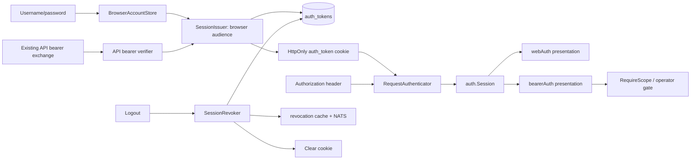

# Technical Design: [BUG-070-001] Unified Production Browser Session

## Design Brief

### Current State

`internal/api/web_login.go::HandleWebLogin` verifies username/password through
`webcreds.Repo.VerifyAndTouch`, then explicitly assigns `token = d.AuthToken`
and writes that shared runtime token into the `auth_token` cookie. The matching
unit test requires this behavior. Production `bearerAuthMiddleware`, however,
first verifies the cookie as a per-user PASETO and rejects the shared value when
`production_shared_token_fallback_enabled=false`.

Legacy server pages do not use that verifier. `webAuthMiddleware` compares only
against `d.AuthToken` and even bypasses authentication whenever that value is
empty, regardless of the active production PASETO configuration. This creates
two independent production trust models. In addition,
`web_user_credentials.username` has no binding to `auth_users.user_id`, and
authorization scopes exist only inside previously minted tokens, so password
verification currently cannot safely derive a per-user subject or grants.

### Target State

Production has one browser trust model: a persisted PASETO v4.public token with
audience `smackerel-browser-session`, per-user subject, JTI, explicit scopes,
issued/expiry times, and revocation lifecycle. Username/password login and
existing API-token exchange both issue this browser token and place only it in
one HttpOnly cookie. They never copy the shared token or an API bearer into the
cookie.

One request authenticator parses either the browser cookie or an Authorization
header, enforces the carrier's expected audience, consults the same revocation
cache, and produces one `auth.Session`. Both `webAuthMiddleware` and
`bearerAuthMiddleware` call it. The middleware families differ only in response
presentation and route-level scope checks, not identity verification.

### Patterns To Follow

- `internal/auth/issue.go::IssueAndPersistToken`: canonical key, JTI, HMAC-at-
	rest, expiry, and `auth_tokens` persistence sequence.
- `internal/auth/verify.go::VerifyAndParse`: canonical signature, issuer, key
	rotation, time, and scope parsing.
- `internal/api/router.go::bearerAuthMiddleware`: canonical revocation-cache
	and `auth.Session` population behavior.
- `internal/auth/revocation`: DB-canonical revocation plus immediate local
	cache and NATS propagation.
- `internal/api/sanitize_next.go`: one same-origin safe-return sanitizer used
	before and after credential submission.
- `auth.RequireScope`: route authorization remains separate from identity and
	preserves 401-versus-403 semantics.

### Patterns To Avoid

- The credential branch in `web_login.go` must no longer set `d.AuthToken` as
	the cookie value.
- `webAuthMiddleware` must no longer own a separate shared-token comparison or
	production empty-token bypass.
- `webcreds.VerifyAndTouch` returning only `nil` is insufficient for session
	issuance because the username is not a canonical auth principal or grant.
- `internal/db/migrations/044_web_user_credentials.sql` describes credentials
	as a shared-token UX layer; that active runtime assumption is superseded.
- Existing `web_login_credential_test.go` codifies the defect and must be
	replaced by a test of browser-purpose PASETO issuance, not relaxed.
- Existing PWA Playwright runs in dev shared-token mode and cannot prove the
	production browser contract.

### Resolved Decisions

- One cookie and one production browser token audience serve legacy pages,
	PWA fetches, `/api`, and `/v1`.
- Machine/API clients retain Authorization headers with API-bearer audience;
	browser and machine carriers are distinct purposes verified by one service.
- Credentials bind explicitly to `auth_users`; usernames are not inferred as
	principal IDs at login.
- Browser scope grants are persisted explicitly and validated before issuance;
	no wildcard or implicit default grant exists.
- Existing no-audience PASETOs remain header-only legacy API bearers until
	their signed expiry; they are never accepted directly from a cookie.
- Logout revokes the current browser token before claiming success, then clears
	the cookie. A revocation-store failure is a visible logout failure.
- Shared-token fallback stays disabled in production and is not a migration
	mechanism for browser accounts.

### Open Questions

One implementation-blocking operator decision remains: each existing production
`web_user_credentials` row needs an explicit `auth_user_id` and scope grant set.
The codebase contains no truthful source from which to infer those grants.
Migration tooling must report unbound counts and refuse production password
login until the owner supplies the mapping; it must not grant all scopes.

## Purpose And Scope

This design owns production browser session issuance, principal/grant binding,
cookie and purpose contracts, shared request authentication, logout/revocation,
safe return, telemetry, migration, compatibility, and focused real-browser
validation. It preserves existing machine bearer flows, dev/test shared-token
ergonomics outside production, cryptographic key rotation, invitations, rate
limits, route authorization, and public PWA asset serving.

It does not convert the browser token into JavaScript state, introduce refresh
tokens, make all users operators, change business-route permissions, or enable
production shared-token fallback.

## Root Cause Analysis

### Confirmed Issuance Split

The credential path in `HandleWebLogin` does all of the following:

1. calls `WebCredentials.VerifyAndTouch(username, password)`;
2. assigns the submitted username to response-only `userID`;
3. assigns `d.AuthToken` to `token`;
4. skips PASETO verification through `credentialVerified=true`;
5. writes `token` to the `auth_token` cookie.

`internal/api/web_login_credential_test.go` explicitly asserts the cookie equals
`shared-token-123`. This is not an incidental bug; it is the currently encoded
contract.

### Confirmed Verification Split

`bearerAuthMiddleware` in production calls `auth.VerifyAndParse`, enforces
revocation, and creates `SessionSourcePerUserToken`. Only an explicit
`ProductionSharedTokenFallbackEnabled` branch accepts `d.AuthToken`.

`webAuthMiddleware` instead checks only `d.AuthToken` by constant-time header
or cookie comparison. If `d.AuthToken==""`, it calls the page handler directly.
It neither parses PASETO nor consults revocation, user status, expiry, key
rotation, or scopes. Consequently, the same cookie can be accepted by legacy
pages and rejected by modern routes exactly as reported.

### Confirmed Identity/Grant Gap

Migration 044 stores only `username`, `password_hash`, and timestamps.
Migration 033 stores canonical principals in `auth_users` and issued tokens in
`auth_tokens`, but there is no foreign key between them and no persistent scope
grant table. `VerifyAndTouch` returns no principal. PASETO scopes are supplied
only at mint time by CLI flags and are not recoverable as an account policy.

Issuing a token with `sub=username`, no scopes, or every known scope would each
invent authorization. The repair therefore requires explicit account binding
and grants before password login can mint a session.

### Confirmed Purpose Gap

Current PASETOs include issuer, subject, JTI, iat, nbf, exp, footer key ID, and
optional scopes, but no audience/purpose claim. `extractBearerTokenWithSource`
returns only `header` or `pwa_cookie`; verification applies the same token
contract to either. A stolen API token can therefore be placed in a cookie and
there is no wrong-purpose discriminator. The new browser audience closes this
gap without adding a second cryptographic verifier.

## Capability Foundation

### Foundation Contract

| Contract | Responsibility | Consumers |
|---|---|---|
| `BrowserAccountStore` | Verify password with timing parity; resolve active canonical principal and explicit browser scopes; update login metadata without hiding store failures. | Credential login, account provisioning, migration audit. |
| `SessionIssuer` | Issue and persist a purpose-bound PASETO under active signing material and explicit TTL/scopes. | Password login and API-token exchange. |
| `RequestAuthenticator` | Extract carrier, verify signature/issuer/time/audience, reject revocation, and return one `auth.Session` without a per-request database lookup. | Legacy web middleware and modern bearer middleware. |
| `SessionRevoker` | Revoke one current browser JTI in PostgreSQL, update local cache, broadcast to peers, then permit cookie clearing. | Logout and administrative revoke. |
| `BrowserSessionPolicy` | Define audience, cookie name/attributes, TTL source, safe return, allowed carrier, and non-sensitive outcome vocabulary. | Issuer, middleware, login/logout UI, tests, telemetry. |
| `MutationTrustGuard` | Require a trusted same-origin context and a server-validated, session-bound anti-CSRF proof for every cookie-authenticated state-changing request, returning 403 before any mutation with no per-request database read. | Every mutating family: server forms, HTMX, PWA fetch, JSON, Cards, admin, plus pre-session login/registration/logout. |

### Extension Points

- Credential verifier: username/password is the concrete human credential
	implementation; token exchange is a separate authenticated intake path.
- Carrier: browser cookie and Authorization header use one authenticator but
	require different audiences.
- Presentation: browser navigation redirects safely; API/HTMX/fetch returns
	typed 401/403 without changing verification.

### Foundation-Owned Behavior

- signature, key rotation, issuer, nbf/exp, audience, revocation, and scope
	parsing;
- one `auth.Session` shape and one non-enumerating failure taxonomy;
- no production shared-token fallback;
- no token value in response body, DOM, URL, browser storage, logs, metrics,
	or trace attributes;
- one trusted-origin check plus a server-validated, session-bound anti-CSRF
	proof on every cookie-authenticated mutation, with SameSite treated as
	necessary-not-sufficient;
- explicit logout revocation and expiry-aligned cookie lifetime.

## Concrete Implementations

### Username/Password Browser Session Issuer

`POST /v1/web/login` form input is verified through `BrowserAccountStore`.
Success returns `{UserID, Scopes}` from the database-bound account, invokes
`SessionIssuer` with browser audience, persists the token, writes the cookie,
and redirects to the sanitized destination. No cookie is written until all
steps succeed.

### API-Bearer To Browser-Session Exchange

The existing JSON/token login path remains a compatibility intake, but changes
semantics: it validates the supplied PASETO as an API bearer (including legacy
no-audience API tokens during the bounded compatibility rule), resolves its
active principal/scopes, and issues a new persisted browser-session PASETO. It
does not copy the submitted wire token into the cookie. This preserves machine-
minted bootstrap/rotation onboarding without making an API token a browser
session.

### Browser Cookie Authentication

Requests carrying the session cookie require audience
`smackerel-browser-session`. Both legacy and modern middleware consume the same
verified `auth.Session`. Modern route scope middleware then enforces claims as
it does today. Principal active status is checked at issuance/exchange. A later
account-disable operation must transactionally revoke all active tokens and
publish those revocations; the request hot path remains cache-backed rather
than querying PostgreSQL on every request.

### API Header Authentication

Authorization headers require audience `smackerel-api-bearer`. Existing signed
tokens with no audience are classified as `legacy_api_bearer`, accepted only
from the header carrier until their existing `exp`, and never reissued without
an audience. Wrong-audience browser tokens in headers and API tokens in cookies
fail closed unless an explicit exchange endpoint is invoked.

### Variation Axes

| Axis | Options | Foundation Rule |
|---|---|---|
| Credential intake | Password, API-token exchange | Intake proves identity; neither chooses authorization from request input. |
| Carrier/purpose | HttpOnly cookie/browser audience, Authorization header/API audience | Carrier selects the one allowed audience; mismatch is rejected. |
| Presentation | Top-level HTML redirect, HTMX/API JSON 401, scope JSON 403 | Verification result is shared; only response projection varies. |
| Environment | Production per-user, dev/test shared-token ergonomic | Shared-token path is structurally excluded from production browser authentication. |
| Anti-CSRF proof carrier | Hidden `_csrf` form field, `X-CSRF-Token` header | One signed session-bound proof verified identically regardless of carrier; the companion `smackerel_csrf` cookie is the double-submit vehicle only. |

## Architecture Overview



### Owning Code Paths

| Concern | Current Owner | Required Change |
|---|---|---|
| Credential storage | `internal/auth/webcreds/repo.go` | Resolve bound principal and grants on successful verification; expose typed store/internal failures. |
| PASETO issuance | `internal/auth/issue.go` | Require audience/purpose; persist token purpose and browser issued source. |
| PASETO verification | `internal/auth/verify.go` | Parse audience and enforce expected audience at the request-authenticator boundary. |
| Principal/token storage | `internal/auth/bearer_store.go` | Read active principal, grants, token status; persist browser token purpose; revoke current token. |
| Login/logout | `internal/api/web_login.go` | Mint/exchange browser token; align cookie expiry; revoke before successful logout. |
| Request auth | `internal/api/router.go` | Replace duplicated web/bearer verification branches with `RequestAuthenticator`; preserve presentation differences. |
| Runtime composition | `cmd/core/wiring.go` | Construct account store, issuer, verifier, and revoker fail-loud from existing auth SST and stores. |
| Provisioning | `cmd/core/cmd_users.go`, `internal/api/web_register.go`, `internal/auth/webinvite`, invite admin UI | Create/bind principal and grants atomically; require explicit authorization selection. |

## Data Model And Migration

### Credential-to-Principal Binding

Add to `web_user_credentials`:

```sql
ALTER TABLE web_user_credentials
	ADD COLUMN auth_user_id TEXT;

ALTER TABLE web_user_credentials
	ADD CONSTRAINT fk_web_credentials_auth_user
	FOREIGN KEY (auth_user_id) REFERENCES auth_users(user_id)
	ON DELETE RESTRICT;

CREATE UNIQUE INDEX ux_web_credentials_auth_user_id
	ON web_user_credentials(auth_user_id)
	WHERE auth_user_id IS NOT NULL;
```

The column is nullable only as a migration state for historical rows. New
account writes require a non-empty binding. Production password login rejects
unbound rows with the same visible credential message while emitting a distinct
safe operational outcome. A migration audit reports counts, never usernames,
and blocks production-login readiness until every enabled credential is bound.
It does not infer `auth_user_id=username`.

### Persistent Scope Grants

Add a normalized grant table:

```sql
CREATE TABLE auth_user_scope_grants (
	user_id     TEXT        NOT NULL REFERENCES auth_users(user_id) ON DELETE CASCADE,
	scope       TEXT        NOT NULL,
	granted_at  TIMESTAMPTZ NOT NULL,
	granted_by  TEXT        NOT NULL,
	PRIMARY KEY (user_id, scope)
);
```

Application code validates every scope with `auth.ValidateScopeName` and the
registered surface allowlist before insert and before issuance. The existing
runtime requires `assistant:turn`, but `RegisteredScopeSurfaces` currently omits
`assistant`; that surface must be registered in the same implementation before
such a grant is accepted. No empty/wildcard scope implies authorization.

### Token Purpose And Issued Source

Migrate `auth_tokens` without a lingering database default:

```sql
ALTER TABLE auth_tokens ADD COLUMN token_purpose TEXT;
UPDATE auth_tokens SET token_purpose = 'legacy_api_bearer'
 WHERE token_purpose IS NULL;
ALTER TABLE auth_tokens ALTER COLUMN token_purpose SET NOT NULL;
ALTER TABLE auth_tokens ADD CONSTRAINT ck_auth_tokens_purpose
 CHECK (token_purpose IN ('legacy_api_bearer','api_bearer','browser_session'));
```

Replace the existing issued-source check with a closed set including
`web_password` and `web_token_exchange` alongside `cli`, `admin_api`, and
`bootstrap`. New issuance always supplies both source and purpose explicitly.

### Registration Invite Grants

Production DB invites must carry an operator-selected principal identity and
scope set so registration can atomically create the credential, principal, and
grants. Extend invite metadata with nullable migration columns
`auth_user_id` and `granted_scopes`; new invite generation requires both.
Historical outstanding invites without grants are not live for production
registration and must be explicitly revoked/replaced, not upgraded to broad
access. Plaintext invite handling remains one-time and hashed at rest.

The consume transaction performs, in order:

1. guarded single-use invite claim;
2. `auth_users` insertion with explicit ID and active status;
3. `web_user_credentials` insertion bound to that ID;
4. one validated grant row per selected scope;
5. commit all or none.

The repeatable static registration secret cannot carry grants. In production it
is rejected by the account-create path with the same non-enumerating unavailable
response; production registration uses only a DB invite carrying explicit
principal/grant metadata. Development/test may retain the static bootstrap path
for shared-token ergonomics, but it cannot produce a production-ready bound
account or browser PASETO.

## Token And Cookie Contracts

### PASETO Claims

Every newly issued token contains:

| Claim | Browser Session | API Bearer |
|---|---|---|
| `iss` | `smackerel` | `smackerel` |
| `aud` | `smackerel-browser-session` | `smackerel-api-bearer` |
| `sub` | bound `auth_users.user_id` | enrolled `auth_users.user_id` |
| `jti` | persisted random token ID | persisted random token ID |
| `iat`, `nbf`, `exp` | explicit configured TTL | explicit configured TTL |
| `scope` | current explicit grant snapshot | explicit mint request validated by policy |
| footer `kid` | active key ID | active key ID |

`IssueOptions` and `ParsedToken` gain audience/purpose fields. Missing audience
is accepted only by the explicit header-only legacy API rule; cookie validation
requires the browser audience without exception.

### Cookie

Keep the existing `auth_token` name for route/test compatibility. The cookie is:

- `HttpOnly=true`
- `Secure=true` in production
- `SameSite=Lax`
- `Path=/`
- no `Domain` attribute
- `Expires` equal to PASETO `exp`
- `Max-Age` derived from the positive remaining lifetime

The cookie value is never returned in JSON or HTML. The successful JSON exchange
may retain non-sensitive `user_id` and `expires_at`. Browser scripts continue to
use `credentials: "same-origin"` and never inspect the cookie. A separate,
non-authenticating `smackerel_csrf` companion cookie carries the anti-CSRF proof
(see `## Cross-Site Request Forgery Protection`); it is deliberately
script-readable and is never the session token.

## Issuance Flows

### Password Login

1. Parse the bounded form and sanitize `next`.
2. Verify credentials with timing parity.
3. Resolve bound active `auth_user_id` and validated grant set from PostgreSQL.
4. Refuse disabled, unbound, or invalid-grant accounts without setting a cookie.
5. Call `IssueAndPersistToken` with browser audience, grants, explicit TTL,
	 source `web_password`, and `issued_by=auth_user_id`.
6. Set the expiry-aligned cookie.
7. Redirect to the sanitized destination. The destination's normal middleware
	 revalidates the cookie and route authorization; successful destination
	 rendering, not `Set-Cookie`, is the visible success proof.

Unknown username, wrong password, malformed password record, disabled account,
and unbound account share the same browser-visible rejection. Database or
issuer failure uses the UX-approved temporary-unavailable state, not invalid
credentials and not a partial session.

### API-Token Exchange

1. Parse bounded JSON/form token input.
2. Verify signature/issuer/time and API/legacy API audience.
3. Check revocation and active principal at the exchange/issuance boundary.
4. Resolve current browser grants from the account policy; do not blindly copy
	 the API token's scopes.
5. Issue/persist a new browser token with source `web_token_exchange`.
6. Set the browser cookie; never place the supplied API token in it.

This path remains an explicit exchange. Presenting an API token directly as an
`auth_token` cookie is wrong-purpose and yields 401.

## Unified Request Authentication

`RequestAuthenticator.Authenticate(r)` returns `(auth.Session,
AuthFailureKind)`. It owns extraction, purpose, signature/time verification,
and revocation checks exactly once. Principal status is an issuance-time policy;
account disablement revokes outstanding tokens rather than adding a database
query to every authenticated request.

Carrier precedence remains fail-closed: if Authorization is present but
malformed, do not silently use the cookie. A valid header is checked as API
audience; a cookie is checked as browser audience. The returned session records
carrier/source for metrics but uses the same per-user session source and claims.

`bearerAuthMiddleware` calls the authenticator, attaches the session, and emits
the existing generic API 401 on failure. `webAuthMiddleware` calls the same
authenticator and attaches the same session; top-level HTML navigation gets the
existing sanitized 303, while HTMX/API-like requests get 401. Neither performs
a second token comparison.

PWA assets remain publicly serveable, but every protected data fetch crosses
the same authenticator. This is not a second PWA trust model: static shell
availability conveys no authenticated content.

## Authorization Boundaries

Authentication proves principal and session purpose. Route authorization stays
at existing middleware:

| Surface | Authentication | Additional Authorization |
|---|---|---|
| Legacy Search/Digest/Topics/Cards pages | Browser session cookie | Existing web route policy; no shared-token bypass. |
| Assistant `POST /api/assistant/turn` | Same cookie through unified authenticator | `assistant:turn` grant. |
| Knowledge Graph reads | Same cookie | `knowledge-graph:read` grant. |
| Annotation mutation | Same cookie | `annotation:edit` grant. |
| Connectors/Photos/model picker | Same cookie | Existing handler/route checks. |
| Operator/admin surfaces | Same cookie | Existing operator/admin gate; ordinary browser grants do not imply operator. |

401 means session missing/rejected. 403 means a valid session lacks scope or
operator authorization. Downstream provider/database degradation must not
invalidate the session or trigger login.

## Cross-Site Request Forgery Protection

AUTH-011 requires every cookie-authenticated state-changing request to prove
BOTH a trusted same-origin request context AND a server-validated anti-CSRF
proof bound to the browser session, and it declares SameSite insufficient on its
own. `SameSite=Lax`, the same-origin fetch posture, the CORS allowlist, CSP, and
POST-only login/logout are retained as defense-in-depth but are treated as
necessary-not-sufficient. This section defines the additional session-bound
proof and supersedes the earlier "No token is exposed for a custom CSRF scheme"
position.

### The Proof Is Not Session Material

The anti-CSRF proof is a distinct, single-purpose, NON-authenticating value. It
grants no access alone: a request bearing a valid proof but no valid
`smackerel-browser-session` cookie is unauthenticated (401), and a request
bearing a valid session cookie but no matching proof is a forgery (403). Because
the proof authenticates nothing, it is deliberately readable by same-origin page
script, unlike the session PASETO, which stays HttpOnly and script-inaccessible
(SCN-070-001-04). Exposing the proof does not weaken session privacy; the two
values are separated by purpose, and the session token itself is never exposed
to the CSRF scheme.

### Stateless Session-Bound Token (Signed Double-Submit)

The proof is a signed double-submit token derived from the authenticated
session, requiring no per-request database lookup:

```
csrf_proof = base64url(nonce) "." base64url(HMAC_SHA256(csrf_signing_key, aud "|" sub "|" jti "|" nonce))
```

- `aud`, `sub`, and `jti` come from the caller's verified `auth.Session`
	(browser audience); `nonce` is a fresh random value minted with the session.
- `csrf_signing_key` is a dedicated secret sourced fail-loud from the same auth
	SST/secret material as the PASETO keys (no default; it participates in the
	existing key-id/rotation discipline). It is deliberately NOT the PASETO
	signing key, so a CSRF-key compromise cannot mint sessions and a PASETO-key
	compromise cannot forge proofs independently.
- Because the signature binds `jti`, a proof minted for one session cannot
	validate against another (mismatch), and a proof for a rotated or expired
	session no longer matches the current `jti` (stale). No server-side proof
	store is required, so this adds no schema and preserves the cache-backed,
	no-database-per-request hot path.

### Delivery And Carriers

Wherever the browser-session cookie is issued (password login step 6, API-token
exchange step 6, and any session rotation) the server also mints the matching
proof and delivers it through three same-origin channels so every mutation
family can echo it:

| Channel | Consumers | Form |
|---|---|---|
| Companion `smackerel_csrf` cookie | All fetch-based families | `Secure` in production, `SameSite=Lax`, `Path=/`, `HttpOnly=false` (deliberately script-readable), `Expires`/`Max-Age` aligned to the session `exp`. This is the double-submit vehicle. |
| Hidden `_csrf` form field | Server-rendered forms, HTMX | Injected into every server-rendered mutating form so no-JS legacy forms and HTMX submissions carry the proof. |
| `<meta name="csrf-token">` | HTMX, PWA fetch, JSON, Cards, admin | Read by client code to populate the request header; HTMX attaches it globally via `hx-headers`. |

On the request, server forms and HTMX submit the `_csrf` field; PWA fetch, JSON,
Cards, and admin send an `X-CSRF-Token` header.

### Server Validation (Every State-Changing Method)

One `MutationTrustGuard` runs for every `POST`/`PUT`/`PATCH`/`DELETE` on a
cookie-authenticated route, AFTER `RequestAuthenticator` and BEFORE the route
handler or scope mutation. Every check must pass; the first failure returns
`403` before any state change with one non-enumerating body:

1. Trusted same-origin context: `Origin` (or the `Referer` fallback when
	 `Origin` is absent) is present and in the same-origin allowlist; otherwise
	 `origin_rejected`.
2. Proof present: extract the `_csrf` field or `X-CSRF-Token` header; an absent
	 proof is `csrf_missing`.
3. Double-submit cross-check: the presented proof equals the `smackerel_csrf`
	 companion cookie value (constant-time); a header or field with no matching
	 cookie is rejected.
4. Signature and binding: recompute the HMAC over the authenticated session's
	 `aud|sub|jti` and the presented `nonce`, then constant-time compare to the
	 presented signature. A bad signature or one bound to a different session is
	 `csrf_mismatch`; one bound to a prior (rotated/expired) `jti` is `csrf_stale`.

The guard reads no database; it uses only the already-verified session claims
plus the server key. Success emits `accepted` and the request proceeds under the
identity's role and grants. The operator role is subject to the identical guard
and never bypasses request-forgery protection.

### Pre-Session Mutations (Login And Registration)

Login and registration are POSTs that run BEFORE any session exists, so they
cannot bind to a session `jti`. They use a pre-session variant of the same
signed double-submit: when `/login` or the registration page is served, the
server mints an anonymous `smackerel_csrf` cookie plus hidden field whose HMAC
binds a short-lived random anonymous nonce (with no `sub`/`jti`). The guard
validates trusted Origin plus the signed double-submit match before accepting
the credential or registration POST, defeating login- and registration-CSRF. On
successful authentication the anonymous proof is replaced by the session-bound
proof above; logout clears both the session cookie and the `smackerel_csrf`
cookie.

### Presentation And Telemetry

A forgery rejection is `403` before mutation and is distinct from `401`
session-ended and from `403` scope-denied: top-level HTML navigations render the
safe, non-enumerating blocked shell without a login loop, while fetch, API, and
HTMX receive a typed `403`. Missing, stale, mismatched, and cross-origin
failures share one visible rejection. The guard emits only bounded telemetry
`outcome=origin_rejected|csrf_missing|csrf_stale|csrf_mismatch|accepted` and
`family=form|htmx|pwa|json|cards|admin`, with no token, cookie, nonce, or
identity value.

## Logout And Revocation

`POST /v1/web/logout` authenticates the current browser cookie with browser
audience. For a valid active session it:

1. calls `BearerStore.RevokeToken(tokenID, actorID, "browser_logout")`;
2. marks the local cache revoked and broadcasts through the existing
	 revocation broadcaster after commit;
3. clears the cookie with matching Path/Secure/SameSite attributes;
4. returns JSON success or 303 to `/login`.

If the cookie is missing, malformed, expired, or already revoked, logout clears
it idempotently and reveals no validation cause. If canonical DB revocation of
a valid token fails, return a typed 503/failure and do not claim signed out;
the user may retry. A NATS broadcast failure after DB commit does not undo
logout: local cache is updated immediately and peers converge through the
existing periodic DB refresh.

Administrative revocation continues to use the same store/cache/broadcast
path. Password rotation does not silently revoke all sessions unless an
explicit product requirement says so; current-token logout and administrative
revocation remain distinct operations.

## Security And Privacy

- Passwords stay write-only and Argon2id-verified; no password, hash, token,
	cookie, invite plaintext, or full username is logged.
- Login rate limiting remains outside authentication middleware and remains
	keyed by trusted client IP.
- User-visible credential errors are non-enumerating. Operational metrics may
	distinguish `invalid_credentials`, `account_disabled`, `account_unbound`,
	`grant_invalid`, `issuer_unavailable`, and store failure with bounded labels.
- Browser purpose is cryptographically signed in `aud`; request input cannot
	choose or override it.
- SameSite=Lax, same-origin fetch, the existing CORS allowlist, CSP, and
	POST-only login/logout remain active as defense-in-depth but are
	necessary-not-sufficient; every cookie-authenticated mutation additionally
	requires a server-validated, session-bound anti-CSRF proof (see
	`## Cross-Site Request Forgery Protection`, AUTH-011). That proof is a
	distinct non-authenticating value, not the session token, and is the only
	value deliberately exposed to same-origin script.
- Safe return is always processed by `sanitizeNext` on GET and POST. Raw query
	values, fragments, cross-origin targets, credentials, and rejected targets
	are not echoed. Route authorization runs again after redirect.
- Auth failure logs must not include token ID for malformed/unverified tokens;
	a verified JTI may be used only as a one-way/controlled correlation field.
- `auth.RequireScope` currently logs `user_id` and the full `token_scopes`, and
	labels `AuthScopeRejected` with `sess.UserID`. The implementation must replace
	those with request ID, route class, required scope, and bounded carrier/source
	labels. User identity and full grant sets are not acceptable log/metric
	dimensions.

## Failure And UI State Mapping

| Technical Outcome | HTTP/Navigation | Visible State |
|---|---|---|
| Credential accepted, session persisted | 303 to safe destination | `Opening [safe label]`, then authorized destination; no standalone success card. |
| Invalid/unknown/disabled/unbound credential | 401 | One non-enumerating invalid state; no cookie. |
| Rate limit | 429 | Typed rate-limit state and server-authorized retry timing. |
| DB/signing/persistence failure | 503 | Temporary unavailable; username may remain, password clears; no cookie. |
| Missing/malformed/expired/revoked/wrong-purpose session | 303 for top-level HTML or 401 for fetch/API | `Your session ended`; protected content removed. |
| Valid session, missing scope/operator | 403 | Access denied; no login loop. |
| Forged/cross-origin/stale/missing CSRF proof on a mutation | 403 before mutation | Non-enumerating blocked request; no state change; distinct from 401 session-ended and 403 scope-denied. |
| Healthy authenticated empty collection | 200 | Surface-specific true empty; session remains valid. |
| Downstream failure | Surface-owned 5xx/degraded response | Surface error/degradation; session remains valid. |
| Logout revocation failure | 503 | Could not sign out; Retry; no false signed-out claim. |

## Migration And Backward Compatibility

### Existing Machine Clients

Authorization-header clients continue using API bearers. All new mints include
API audience. Existing valid no-audience PASETOs are header-only
`legacy_api_bearer` tokens until their signed expiry; this is a bounded wire
compatibility rule, not a runtime flag or shared-token fallback. They cannot be
accepted from cookies.

### Existing Browser Cookies

Shared-token and API-token cookies are rejected in production once unified
authentication lands. The browser is redirected to login and receives a new
browser-purpose token after valid credential or token exchange. No dual-cookie
overlap is introduced.

### Existing Credential Rows

Historical rows remain stored but are not session-ready until explicitly bound
to an active `auth_users` principal and grant set. A repo CLI migration command
must accept explicit username, auth user ID, and repeated validated scopes; it
must support dry inspection by count and perform binding/grants transactionally.
It must never derive grants from routes, prior shared-token privilege, or the
username.

The implementation cannot ship production credential login while unbound rows
are silently usable. The operator-provided mapping is therefore a rollout gate.

### Registration And Provisioning

`users add` and DB-invite registration move to one account-provisioning service
that writes principal, credential binding, and grants atomically. Password
rotation updates only the credential hash and preserves binding/grants.
Registration itself still creates no cookie; login is the sole browser-session
issuer.

## Observability

Preserve existing auth validation latency/outcome metrics and extend bounded
labels for browser purpose and carrier:

- issuance: `outcome=issued|credential_rejected|account_unbound|account_disabled|grant_invalid|persist_failed`, `source=web_password|web_token_exchange`;
- validation: `outcome=accepted|expired|revoked|malformed|unknown_key|wrong_purpose|account_disabled`, `carrier=cookie|header`;
- logout: `outcome=revoked|invalid_cookie_cleared|already_revoked|store_failed|broadcast_degraded`;
- csrf mutation guard: `outcome=origin_rejected|csrf_missing|csrf_stale|csrf_mismatch|accepted`, `family=form|htmx|pwa|json|cards|admin`, with no token, cookie, nonce, or identity value;
- migration readiness: counts of bound/unbound credentials and invalid grants,
	never identities.

A successful login trace links credential verification, token persistence, and
one destination authorization through request/trace IDs only. It must not
record password, username, token, cookie, claims body, invite, or safe-return
raw query. Wrong-purpose and malformed remain operationally distinct but share
generic user-facing copy.

## Testing And Validation Strategy

No product tests, builds, browser runs, or certification are claimed by this
design. Required strategy:

| Scenario | Test Boundary | Required Assertion |
|---|---|---|
| `SCN-070-001-01` | Real PostgreSQL + production config + real browser form | One browser-purpose HttpOnly cookie authorizes legacy page, Assistant, Connectors, Photos, Graph, model picker, Cards, and representative `/api`/`/v1` reads permitted by grants. |
| `SCN-070-001-02` | Real unknown user/wrong password/disabled/unbound rows | Same visible rejection and no persisted token/cookie accepted by either middleware. |
| `SCN-070-001-03` | Cryptographic adversarial matrix | Malformed, expired, revoked, wrong-audience, shared-token-shaped, API-token cookie, and unknown-key inputs all fail both middleware families. |
| `SCN-070-001-04` | Playwright DOM/storage/URL/console plus response inspection | No credential/token in script-readable surfaces; cookie is HttpOnly/Secure/Lax and expiry-aligned. |
| `SCN-070-001-05` | Real login, logout, Back/direct navigation | DB/cache revocation commits, cookie clears, and both route families reject replay. |
| `SCN-070-001-06` | Authorized live empty collection | True empty renders without auth copy. |
| `SCN-070-001-07` | Owned degraded dependency | Healthy surfaces continue under the same session; only degraded capability errors. |
| `SCN-070-001-08` | Playwright keyboard/screen reader at 320px/200% zoom | Focus/status/error/recovery are operable and non-overlapping. |
| `SCN-070-001-09` | Real per-family forged-request matrix (server form, HTMX, PWA fetch, JSON, Cards, admin) plus pre-session login/registration/logout, real browser cookie jar | Missing, stale, mismatched, and cross-origin proof each return 403 before any state change across every mutation family; a trusted-origin request with a valid session-bound proof proceeds; SameSite alone is never sufficient evidence. |
| `SCN-070-001-10` | Two real logins (daily-user and operator) on the disposable production stack with fallback false | One cookie per identity yields 2xx across every permitted middleware family with no second login; the daily user receives 403 on representative operator-only routes with no login loop or content disclosure; the operator receives 2xx only on granted operator routes. |
| `SCN-070-001-11` | Operator, granted daily user, and ungranted daily user reading the single operator-owned global corpus | Each identity reads only its explicitly granted content; the ungranted identity receives 403 with no content, counts, labels, or existence hints; no response or readiness claim asserts tenant or per-user row isolation. |

### Independent Canary Order

1. Account binding/grant repository and migration adversarials.
2. Issuer/verifier audience, expiry, revocation, and wrong-carrier unit tests.
3. Password-login-to-cookie integration with real PostgreSQL and TLS cookie jar.
4. Middleware parity canary: one legacy page plus one `/api` plus one `/v1`
	 route receives the exact same `Session.UserID`, JTI, and scopes.
5. Logout/replay canary.
6. Real Playwright username/password journey with no bearer injection,
	 internal interception, or shared-token fallback.
7. Broader authenticated PWA and server-rendered journey set.

The pre-fix adversarial test must use the real username/password form under
production auth with fallback false and show that the resulting old shared-
token cookie fails a modern route. Static source checks, direct PASETO minting,
or dev shared-token Playwright cannot satisfy the reported behavior.

## Narrow Rollback

Schema changes are additive and remain in place during rollback; dropping
principal bindings, grants, or purpose audit data would destroy authorization
history. The narrow rollback unit is the browser issuer/authenticator wiring.

If a healthy-route regression requires rollback, production username/password
login is changed to an explicit unavailable response and browser-purpose
cookies are rejected/cleared. Machine API-header authentication remains active.
Rollback must not restore shared-token cookies, enable production fallback,
accept wrong-purpose tokens, or revive the split middleware. Once the canary is
repaired, roll forward to unified browser authentication.

No rollback rebuilds tokens or rewrites account grants. Existing browser tokens
may be bulk-revoked through the canonical revocation operation if the issuer is
suspected, with token IDs and reasons recorded through the existing audit path.

## Alternatives And Tradeoffs

### Let Modern Middleware Accept The Shared Cookie

Rejected. It erases per-user identity, scopes, expiry, and revocation and makes
the production fallback permanent.

### Teach Legacy Middleware To Accept Both Shared And PASETO

Rejected. Dual acceptance preserves two browser trust models and leaves logout
and authorization inconsistent.

### Put An Existing API PASETO Directly In The Cookie

Rejected. It lacks browser-purpose separation and permits bearer replay across
carriers. The explicit exchange mints the correct purpose instead.

### Infer `auth_user_id=username` And Grant Every Scope

Rejected. Neither identity equivalence nor broad authorization is present in a
source of truth. That would turn a migration convenience into privilege
escalation.

### Opaque Server-Side Session ID

Not selected. It would require a new session table and per-request database
lookup while the existing signed-token, revocation-cache, key-rotation, and
scope foundations already satisfy the lifecycle when used consistently.

### Rely On SameSite And Origin Alone For CSRF

Rejected. AUTH-011 states SameSite is not sufficient acceptance evidence.
`SameSite=Lax` still permits top-level cross-site POST navigations and offers no
defense against a same-site/subdomain forgery or a stale-session replay, so a
server-validated, session-bound proof is required in addition to the Origin
check.

### Store A Synchronizer CSRF Token Server-Side

Not selected. A per-session server-stored token would add a table and a
per-request lookup, contradicting the cache-backed, no-database-per-request hot
path. The signed double-submit binds the proof to the session `jti`
cryptographically and achieves the same session-bound guarantee statelessly.

## Complexity Tracking

| Added Complexity | Simpler Alternative | Why The Simpler Alternative Is Rejected |
|---|---|---|
| Explicit credential-principal binding and scope-grant table | Treat username as subject and grant broad access | The simpler path fabricates identity/authorization and can escalate privilege. |
| Audience-bound browser/API purposes | Reuse any valid PASETO in any carrier | Wrong-purpose replay cannot be detected without a signed discriminator. |
| Shared request-authenticator service | Patch each middleware independently | Independent patches preserve drift in revocation, expiry, status, and telemetry. |
| Logout DB revocation before success | Clear cookie only | Clearing one browser does not invalidate a copied/replayed token. |
| Stateless session-bound anti-CSRF proof (signed double-submit) | Rely on `SameSite=Lax` plus same-origin/CORS alone | AUTH-011 declares SameSite insufficient; a session-bound proof detects a forged same-site or stale-session mutation that SameSite/Origin cannot, and the signed form adds it with no store, no schema, and no per-request database read. |

## Routed Design Questions

| Owner | Question | Required Constraint |
|---|---|---|
| Product/security owner via `bubbles.plan` | What `auth_user_id` and explicit browser scope set belongs to each existing production credential row? | No username inference, wildcard, or all-scope migration. |
| `bubbles.plan` | Which representative legacy, `/api`, and `/v1` routes form the smallest middleware-parity canary? | Include at least one scope-gated and one operator-denied route. |
| `bubbles.plan` | How will the disposable production-mode Playwright lane provision a bound invited account without bearer injection? | Use real account/invite/password/PASETO persistence and the browser cookie jar. |

## Superseded Design Decisions

The initialization-only text that left issuer, middleware, principal, purpose,
and logout paths unconfirmed is superseded by the source-grounded design above.
It is not active design authority.
