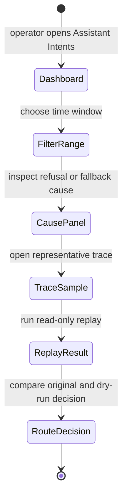
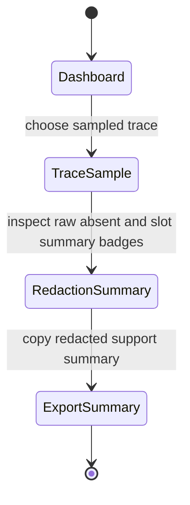

# Feature: 071 IntentTrace Observability Surface

**Status:** in_progress (analyst bootstrap; ceiling = `done`)
**Workflow Mode:** `full-delivery`
**Owner Directive (2026-05-31):** Define the observability and export
contract for the `IntentTrace` records introduced by
[spec 068 — Structured Intent Compiler](../068-structured-intent-compiler/spec.md).
Specs [067](../067-intent-driven-policy-enforcement/spec.md) and
[068](../068-structured-intent-compiler/spec.md) both reference
`IntentTrace`, but no spec authoritatively owns the structured-log
shape, OpenTelemetry attributes, replay/inspection tooling, redaction
policy, retention, sampling, or operator-visible dashboard. This spec
closes that gap so every compiled turn produces inspectable,
redacted, replayable telemetry.

**Depends On:** [spec 030 — Observability](../030-observability/spec.md),
[spec 049 — Monitoring Stack](../049-monitoring-stack/spec.md),
[spec 067 — Intent-Driven Policy Enforcement](../067-intent-driven-policy-enforcement/spec.md),
[spec 068 — Structured Intent Compiler](../068-structured-intent-compiler/spec.md).
**Amends:** [spec 030](../030-observability/spec.md) (adds the
`IntentTrace` log/OTel attribute family),
[spec 049](../049-monitoring-stack/spec.md) (adds the assistant intent
dashboard + alerts),
[spec 068](../068-structured-intent-compiler/spec.md) (pins the trace
emission contract that 068 only describes informally).
**Unblocks:** future per-skill traceability work; future calibration
and confidence-floor tuning; future scenario refusal analytics.

---

## 1. Problem Statement

Spec 068 says "every compiled turn emits an `IntentTrace`" and spec
067 leans on those traces to detect raw-route bypass at runtime, but
the actual record shape, transport, retention, and operator surface
are unspecified. Today an operator cannot:

- Reconstruct a turn from logs alone — slot redaction is ad hoc and
  sensitive values may leak or be stripped inconsistently.
- See how often clarifications fire, which `action_class` values
  dominate, or which scenarios refuse most often (refusal counters
  in spec 064 are not joined to compiler traces).
- Replay a historical turn to verify a routing change is safe before
  release.
- Control sampling rate, retention, or export destination through
  SST — knobs do not exist and any implementation today would invent
  silent defaults, violating smackerel NO-DEFAULTS.

Without this spec, IntentTrace remains a name in two other specs
and not a runtime contract. This spec defines the record, the export
path, the redaction policy, the sampling/retention SST keys, the
replay tool, and the operator dashboard surface.

---

## 2. Actors & Personas

| Actor | Description | Goals | Permissions |
|-------|-------------|-------|-------------|
| **Operator** | Owns SST config and reads the monitoring stack. | Set sampling rate, retention TTL, export targets; view the IntentTrace dashboard; investigate refusal/clarification spikes. | Edits `config/smackerel.yaml` `assistant.intent_trace.*`; reads Grafana/Loki. |
| **Compiler** | The intent compiler introduced by spec 068. | Emit exactly one `IntentTrace` per compiled turn with stable attributes. | Writes structured logs + OTel spans only; no business state. |
| **Replay Tool** | New CLI (`./smackerel.sh assistant replay-intent <trace_id>`) or equivalent. | Reconstruct a turn from a stored IntentTrace alone and re-run routing deterministically. | Reads stored traces; runs the compiler/router in dry-run mode. |
| **Privacy Reviewer** | Anyone auditing whether sensitive slot values leak into logs. | Confirm raw text and slot values are redacted per the source policy. | Reads dashboards and stored traces. |
| **Spec 067 Policy Guard** | Runtime guard that detects raw-route bypass. | Read IntentTrace fields to prove every external action was preceded by a compiled intent. | Reads traces only. |

---

## 3. Outcome Contract

**Intent:** Every compiled turn emits exactly one structured,
redacted, sampled, exportable `IntentTrace` record with stable
attributes, queryable for dashboards and re-runnable via a replay
tool, with sampling/retention/export configured through SST.

**Success Signal:**
- For every invocation of the spec 068 compiler, exactly one
  `IntentTrace` record is produced with the required attributes
  (`trace_id`, `turn_id`, `user_id`, `transport`, `action_class`,
  `side_effect_class`, `confidence`, `route_decision`, `tool_calls[]`,
  `final_response_status`).
- Sensitive slot values are redacted before the trace leaves the
  process; the trace stores a `slots_redaction_summary` instead of
  raw values when `source_policy.persist_raw_text == false`.
- A replay invocation `./smackerel.sh assistant replay-intent <trace_id>`
  rehydrates the trace into the compiler/router in dry-run mode and
  produces the same `route_decision` and `tool_calls[]` as the
  original turn (modulo wall-clock and model nondeterminism captured
  via the trace's `model_route` and `seed` fields).
- An operator dashboard (Grafana panel set named "Assistant Intents")
  surfaces: top-N `action_class` distribution, clarification rate,
  refusal causes joined to spec 064 refusal counters, compiler error
  rate, and capture-as-fallback rate.
- Sampling rate, retention TTL, and export targets all come from SST
  (`assistant.intent_trace.sampling_ratio`,
  `assistant.intent_trace.retention_days`,
  `assistant.intent_trace.export_targets[]`). Missing keys fail loud
  at startup (NO-DEFAULTS).

**Hard Constraints:**
1. **Exactly one trace per compiled turn.** No silent drops; sampled-out
   turns still emit a minimal `IntentTraceSampledOut` envelope so
   counters never under-report total turns.
2. **Redaction before export.** Raw text and slot values are never
   logged when the originating source's policy forbids it. Redaction
   is centralized; no per-call ad hoc redaction.
3. **Stable schema, versioned.** `IntentTrace.schema_version: "v1"`
   pinned by a golden contract test. Breaking changes ship as `v2`.
4. **No defaults (smackerel NO-DEFAULTS).** Every SST key under
   `assistant.intent_trace.*` is required. Missing keys fail loud at
   startup; the compiler refuses to start.
5. **Replay is read-only.** The replay tool MUST NOT mutate
   conversation state, persist new artifacts, or invoke side-effect
   tools. The replay output is diagnostic only.
6. **Spec 067 dependency.** The trace fields required by spec 067's
   bypass guard (`route_decision`, `tool_calls[].name`,
   `compiler_invoked: true|false`) are mandatory and never optional.
7. **Refusal join.** Each refusal counter in spec 064 carries a
   `cause` label that matches an `IntentTrace.refusal_cause` value,
   so dashboards can join refusal counts to trace samples without
   guesswork.

**Failure Condition:** A compiled turn is observed in production
without a corresponding IntentTrace, OR sensitive slot values leak
into logs in violation of source policy, OR an operator cannot reach
the IntentTrace dashboard without code changes, OR sampling/retention
silently defaults when SST is incomplete.

---

## 4. Product Principle Alignment

| Principle | Alignment | Evidence |
|-----------|-----------|----------|
| **P4 Source-Qualified Processing** | Source policy decides redaction; raw text never leaks when the source forbids it. | Hard Constraint 2. |
| **P5 One Graph, Many Views** | One trace schema; many views (dashboard, replay, policy guard, refusal join). | Outcome Contract. |
| **P6 Invisible By Default** | No new user-facing prompts; observability is an operator surface. | Non-Goals. |
| **P8 Trust Through Transparency** | Every routing decision and tool call is inspectable; replay reproduces the decision. | Hard Constraints 1, 3, 5. |
| **P10 QF Companion Boundary** | Side-effect-bearing turns are visible via `side_effect_class`; replay cannot trigger side effects. | Hard Constraints 5, 6. |

---

## 5. Functional Requirements (BDD Scenarios)

```gherkin
Scenario: SCN-071-A01 — Exactly one IntentTrace per compiled turn
  Given the compiler is enabled and sampling_ratio = 1.0
  When a user sends a natural-language turn
  Then exactly one IntentTrace record is emitted with schema_version = "v1"
  And the record carries trace_id, turn_id, user_id, transport, action_class, side_effect_class, confidence, route_decision, tool_calls[], and final_response_status

Scenario: SCN-071-A02 — Sampled-out turns still emit a minimal envelope
  Given sampling_ratio = 0.1 and this turn is not sampled
  When the turn is compiled and executed
  Then a minimal IntentTraceSampledOut envelope is emitted with trace_id, turn_id, action_class, and side_effect_class only
  And total-turn counters in the dashboard match the sum of sampled + sampled-out envelopes

Scenario: SCN-071-A03 — Sensitive slot values are redacted per source policy
  Given a turn whose source_policy.persist_raw_text = false
  When the IntentTrace is emitted
  Then raw_text is absent and slots_redaction_summary is present
  And no slot value classified as sensitive appears anywhere in the exported record

Scenario: SCN-071-A04 — Replay reproduces the routing decision
  Given a stored IntentTrace with action_class = "weather.lookup" and route_decision = "scenarios/weather"
  When `./smackerel.sh assistant replay-intent <trace_id>` runs
  Then the compiler/router rehydrates the trace in dry-run mode
  And the produced route_decision matches the original
  And no side-effect tool is invoked and no conversation state mutates

Scenario: SCN-071-A05 — SST keys are required and fail loud
  Given assistant.intent_trace.sampling_ratio is unset
  When the core process starts
  Then startup fails with a NO-DEFAULTS error naming the missing key
  And no IntentTrace records are emitted because the process never reaches steady state

Scenario: SCN-071-A06 — Dashboard surfaces top action_class distribution
  Given the IntentTrace export target is the monitoring stack from spec 049
  When the operator opens the "Assistant Intents" dashboard
  Then the top-N action_class distribution panel renders from real trace samples
  And the clarification-rate, refusal-cause, compiler-error-rate, and capture-as-fallback-rate panels render from the same data source

Scenario: SCN-071-A07 — Refusal counters join to IntentTrace by cause label
  Given spec 064 refusal counters emit a `cause` label
  When a refusal occurs
  Then the corresponding IntentTrace.refusal_cause equals the counter's cause label exactly
  And a dashboard join by cause label returns matching rows in both data sources

Scenario: SCN-071-A08 — Spec 067 bypass guard reads IntentTrace fields
  Given a tool call is observed via OpenTelemetry
  When the spec 067 bypass guard inspects the surrounding trace
  Then it finds compiler_invoked = true and a matching route_decision in the IntentTrace
  And a synthetic raw-route bypass (no IntentTrace ancestor) triggers the guard

Scenario: SCN-071-A09 — Retention TTL is enforced from SST
  Given assistant.intent_trace.retention_days = 14
  When 15 days pass since a record was emitted
  Then the record is no longer queryable from the configured export targets
  And the retention sweep itself is observable via a structured log entry

Scenario: SCN-071-A10 — Schema is pinned by a golden contract test
  Given the IntentTrace schema declared in this spec
  When the contract test runs
  Then any change to field names, types, or required fields fails the test unless schema_version is bumped
```

---

## 6. Acceptance Criteria

- `IntentTrace` record type and `IntentTraceSampledOut` envelope are
  defined in the assistant package (final location decided in
  `bubbles.design`) with `schema_version: "v1"` and a golden contract
  test.
- Spec 068 compiler emits exactly one trace (or sampled-out envelope)
  per compiled turn; no silent drops.
- Redaction is centralized and driven by source policy; no per-call
  ad hoc redaction code paths.
- SST keys `assistant.intent_trace.sampling_ratio`,
  `assistant.intent_trace.retention_days`,
  `assistant.intent_trace.export_targets[]` are required and fail
  loud at startup when missing.
- Replay tool `./smackerel.sh assistant replay-intent <trace_id>`
  exists, is read-only, and reproduces `route_decision` +
  `tool_calls[]` deterministically.
- "Assistant Intents" dashboard panels in the spec 049 monitoring
  stack surface action_class distribution, clarification rate,
  refusal causes (joined to spec 064 counters), compiler error rate,
  and capture-as-fallback rate.
- Spec 067 bypass guard reads `compiler_invoked` and `route_decision`
  from IntentTrace and fires on raw-route bypass.
- Spec 030 and spec 049 are amended to reference the IntentTrace
  contract as the authoritative source for assistant turn telemetry.

---

## 7. Non-Goals

- New user-facing prompts or chat surfaces. This is an operator and
  policy-guard surface only.
- Replacing the spec 030 observability stack. This spec adds one
  trace family and one dashboard, not a new pipeline.
- LLM model evaluation / calibration tooling. The trace makes that
  work possible later but does not implement it.
- Long-term archival beyond the SST retention TTL.

---

## 8. Open Questions (resolve in `bubbles.design`)

- Whether `IntentTrace` is emitted as a structured log record, an
  OpenTelemetry span attribute set, or both (probably both, with
  the OTel span carrying `trace_id` and the structured log carrying
  the full payload).
- Exact storage backend for replay (Loki vs. a small Postgres table
  vs. the existing assistant conversations table).
- Whether `slots_redaction_summary` is a string sketch (counts,
  classes) or a typed map. Prefer typed map for testability.
- Whether sampled-out envelopes carry a minimal `user_id_hash`
  instead of `user_id` to keep counters joinable without raising
  privacy footprint.

## UI Wireframes

### Screen Inventory

| Screen | Actor(s) | Status | Surface | Scenarios Served |
|--------|----------|--------|---------|------------------|
| Assistant Intents Dashboard | Operator, Privacy Reviewer | New | Grafana / monitoring dashboard | SCN-071-A02, SCN-071-A06, SCN-071-A07, SCN-071-A09 |
| IntentTrace Replay Result | Operator, Replay Tool, Scenario author | New | CLI / devtools diagnostic output | SCN-071-A01, SCN-071-A03, SCN-071-A04, SCN-071-A08, SCN-071-A10 |

### UI Primitives

| Primitive | Consumed By | Composition Rules | Accessibility / Responsive Constraints |
|-----------|-------------|-------------------|----------------------------------------|
| Intent metric panel | Dashboard | Show sampled, sampled-out, clarification, refusal, compiler-error, and capture-as-fallback counts from one trace family. | Values include labels and units; panels collapse to a single-column list on narrow views. |
| Redaction badge | Dashboard, Replay Result | Show `raw absent`, `slots summarized`, or `safe sample` from trace fields; never infer privacy state from missing display text. | Badge text is visible in monochrome and appears next to the field it qualifies. |
| Trace sample row | Dashboard, Replay Result | One row per trace sample: trace id, action class, route decision, final status, refusal cause, capture id when present. | Rows retain labels when stacked; long ids wrap or copy without horizontal scrolling. |
| Replay comparison block | Replay Result | Show original route/tool calls beside dry-run route/tool calls and mark match/mismatch explicitly. | Match status is text-first and announced before the detailed rows. |

### Operator-Facing Interaction Requirements

- The dashboard is the primary UX for this spec; it must let an operator answer whether traces exist, whether privacy redaction is active, and whether refusal/capture spikes are tied to a cause.
- Replay output must stay diagnostic and read-only; every action label must reinforce that no side-effect tools or conversation-state writes occurred.
- Trace ids, route decisions, and cause labels must be copyable for support without exposing raw user text when source policy forbids it.
- Sampled-out turns appear in aggregate counts and in sparse rows; the UI must not imply they were silently dropped.

### UX User Validation Checklist

| Validation Item | Pass Signal |
|-----------------|-------------|
| Dashboard explains turn volume | An operator can reconcile total turns as sampled plus sampled-out envelopes. |
| Redaction is inspectable | A privacy reviewer can confirm why raw text or slots are absent without seeing sensitive values. |
| Replay supports routing review | A scenario author can compare original and dry-run route/tool calls from one trace id. |
| Refusal/capture joins are visible | An operator can trace a refusal cause or fallback capture from dashboard aggregate to trace sample. |

### Screen: Assistant Intents Dashboard

**Actor:** Operator, Privacy Reviewer | **Route:** Grafana `Assistant Intents` | **Status:** New

┌────────────────────────────────────────────────────────────────────────────┐
│ Assistant Intents                                      [Time range] [Export]│
├────────────────────────────────────────────────────────────────────────────┤
│ Total turns [n]  Sampled [n]  Sampled-out [n]  Compiler errors [n]         │
│                                                                            │
│ ┌────────────────────────────┐ ┌───────────────────────────────────────┐  │
│ │ Top action_class           │ │ Refusal / fallback causes              │  │
│ │ weather.lookup       [n]   │ │ no_ground                  [n]         │  │
│ │ list.create          [n]   │ │ policy_refusal             [n]         │  │
│ │ unrouted             [n]   │ │ capture_as_fallback        [n]         │  │
│ └────────────────────────────┘ └───────────────────────────────────────┘  │
│                                                                            │
│ Recent trace samples                                                       │
│ trace_id     action_class      route_decision       redaction      status  │
│ [trace]      weather.lookup    scenarios/weather    raw absent     ok      │
│ [trace]      unrouted          capture_fallback     summarized     saved   │
└────────────────────────────────────────────────────────────────────────────┘

**Interactions:**
- Time range -> refreshes all panels from the same configured export target.
- Trace row -> opens the redacted trace detail or copies trace id when no web detail exists.
- Export -> downloads aggregate counts and redacted trace ids only.

**States:**
- Empty state: no traces in range -> show `No IntentTrace records in this range` plus current sampling ratio.
- Loading state: metric panels reserve final dimensions while queries run.
- Error state: export target unavailable -> fail-loud panel naming the unavailable source, not a zero-count panel.

**Responsive:**
- Mobile: metric panels stack, recent trace rows become labelled cards.
- Desktop: aggregate panels stay above samples for fast scanning.

**Accessibility:**
- Panel titles describe the metric and time range.
- Color is secondary to text labels for status, redaction, and alert state.
- Trace ids have explicit copy labels and do not require hover.

### Screen: IntentTrace Replay Result

**Actor:** Operator, Replay Tool, Scenario author | **Route:** `./smackerel.sh assistant replay-intent <trace_id>` | **Status:** New

┌────────────────────────────────────────────────────────────────────────────┐
│ IntentTrace Replay: [trace_id]                         Status: read-only   │
├────────────────────────────────────────────────────────────────────────────┤
│ Trace schema: v1     Redaction: slots summarized     Source policy: [name] │
│                                                                            │
│ Original decision                  Dry-run decision                         │
│ route_decision: scenarios/weather  route_decision: scenarios/weather        │
│ tool_calls: weather.lookup         tool_calls: weather.lookup               │
│ final_status: answered             final_status: answered                   │
│                                                                            │
│ Match result: route and tool calls match                                    │
│ Side effects invoked: none                                                  │
└────────────────────────────────────────────────────────────────────────────┘

**Interactions:**
- Copy summary -> copies redacted replay output with trace id and match result.
- Open dashboard -> uses trace id/time range when a web monitoring surface is available.
- Mismatch row -> expands deterministic inputs such as model route, seed, and schema version.

**States:**
- Empty state: trace id not found -> diagnostic message naming the configured retention window.
- Loading state: show trace lookup, dry-run compile, and comparison phases as ordered steps.
- Error state: replay would require a side effect -> stop with `side effects blocked` and no mutation.

**Responsive:**
- Terminal: comparison rows repeat labels and avoid color-only diff markers.
- Web/devtools: original and dry-run columns may sit side by side on desktop, stacked on mobile.

**Accessibility:**
- Match/mismatch text appears before details.
- Redacted fields are labelled as redacted instead of blank.
- Ordered replay phases are readable by screen readers and copied terminal logs.

## User Flows

### User Flow: Operator Investigates Intent Spike



### User Flow: Privacy Reviewer Checks Redaction



