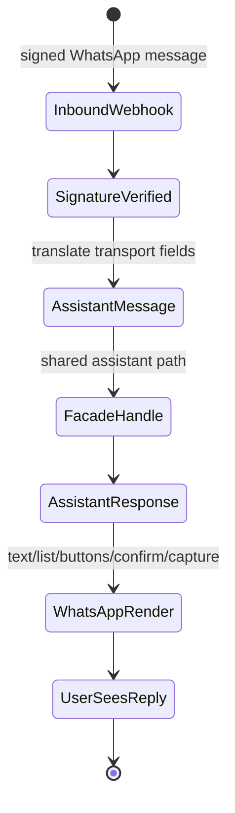
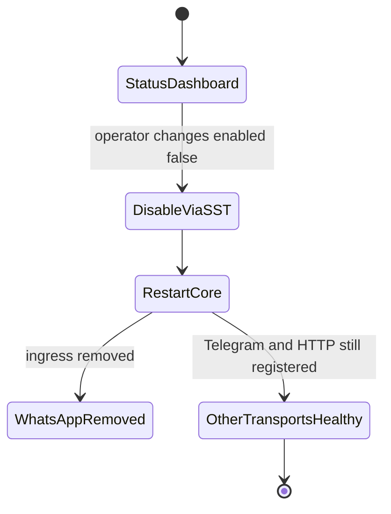

# Feature: 072 WhatsApp Business Webhook Adapter

**Status:** in_progress (analyst bootstrap; ceiling = `done`)
**Workflow Mode:** `full-delivery`
**Owner Directive (2026-05-31):** Implement the first non-Telegram,
non-HTTP `TransportAdapter` that conforms to
[spec 061 — Conversational Assistant](../061-conversational-assistant/spec.md).
WhatsApp Business inbound webhooks are translated into
`AssistantMessage`, and outbound `AssistantResponse` is rendered to
WhatsApp message types using the same `Facade.Handle` code path
Telegram and the HTTP transport already use.

**Depends On:** [spec 061 — Conversational Assistant](../061-conversational-assistant/spec.md),
[spec 069 — Assistant HTTP Transport](../069-assistant-http-transport/spec.md)
(shared webhook/bridge patterns and per-user auth shape),
[spec 044 — Per-User Bearer Auth](../044-per-user-bearer-auth/spec.md),
[spec 060 — Bearer Auth Scope Claim](../060-bearer-auth-scope-claim/spec.md).
**Amends:** [spec 061](../061-conversational-assistant/spec.md) (adds
the second non-reference concrete `TransportAdapter` next to
Telegram, proving the contract is not Telegram-specific).
**Unblocks:** future cross-transport conversation-continuity work
(handing a conversation between WhatsApp, web, and Telegram for one
user).

---

## 1. Problem Statement

Spec 061 defines a transport-agnostic `TransportAdapter` contract and
spec 069 adds the HTTP transport that proves the contract is testable.
Today the only first-class human-messaging transport is Telegram.
WhatsApp Business is the most likely next human-messaging transport
(reach, business-API maturity, webhook shape similar to Telegram's
webhook mode), but no spec authoritatively owns:

- Inbound webhook signature verification and payload translation
  into the canonical `AssistantMessage`.
- Outbound rendering of `AssistantResponse` into WhatsApp's typed
  message families (text, interactive list, interactive button,
  template) without violating capture-as-fallback or losing
  disambiguation/confirm semantics.
- SST-driven credentials and per-environment enable/disable.
- The operator runbook for rotating WhatsApp Business credentials
  and disabling the transport without taking down Telegram or HTTP.

Adding WhatsApp Business as a concrete adapter validates that
`TransportAdapter` truly is transport-neutral and produces the
template every future human-facing transport (Discord DM, Signal,
Matrix, RCS) can follow.

---

## 2. Actors & Personas

| Actor | Description | Goals | Permissions |
|-------|-------------|-------|-------------|
| **Human user (WhatsApp)** | Operator messaging Smackerel from WhatsApp Business. | Identical assistant behavior to Telegram and the HTTP transport. | WhatsApp Business inbound; mapped to Smackerel per-user auth via verified phone number → user mapping. |
| **WhatsApp Business Webhook** | Meta-hosted inbound webhook delivery. | Deliver signed payloads to Smackerel for translation. | Reaches a public ingress; signed with Meta's webhook secret. |
| **WhatsApp Transport Adapter** (new) | Concrete `TransportAdapter` for `Transport = "whatsapp"` (closed-vocabulary token already reserved in `contracts.AssistantMessage`). | Verify signatures, translate inbound to `AssistantMessage`, render `AssistantResponse` to WhatsApp message types, honor `CaptureRoute`. | Reads SST credentials; speaks to WhatsApp Business Cloud API; never bypasses the facade. |
| **Operator** | Owns SST credentials and the enable flag. | Provision credentials; rotate them; enable/disable WhatsApp per environment without affecting Telegram or HTTP. | Edits `config/smackerel.yaml` `assistant.transports.whatsapp.*`. |
| **Facade** | The spec 061 `assistant.Facade`. | Process the turn identically regardless of transport. | Unchanged. |

---

## 3. Outcome Contract

**Intent:** A WhatsApp Business adapter implements
`contracts.TransportAdapter` for the closed-vocabulary token
`"whatsapp"`, so the same `Facade.Handle` powers Telegram, HTTP, and
WhatsApp turns with zero capability-layer changes.

**Success Signal:**
- An inbound WhatsApp webhook arrives, signature is verified, and
  the adapter produces an `AssistantMessage` with `Transport =
  "whatsapp"` and the canonical `TransportMessageID` taken from
  WhatsApp's message id (idempotency is preserved).
- The adapter routes the resulting `AssistantResponse` to WhatsApp
  message types: plain text → text message; choice-style
  disambiguation → interactive list (≤10 rows) or interactive
  buttons (≤3 buttons); confirm → interactive buttons "accept" /
  "decline"; capture-as-fallback acknowledgement → text. Mappings
  are exhaustive and pinned by a golden test; unknown response
  shapes fall back to text rather than dropping the response.
- Disambiguation, confirm, reset, and capture-as-fallback round-trips
  behave identically to Telegram and HTTP.
- Per-environment enable/disable comes from SST. With WhatsApp
  disabled, Telegram and HTTP continue to serve users; with WhatsApp
  enabled and credentials missing, startup fails loud.
- The closed-vocabulary `Transport = "whatsapp"` value (already
  reserved in spec 061) is the only new addition to the facade
  registry; no scenario or routing code branches on the transport
  name.

**Hard Constraints:**
1. **Zero changes to capability layer.** The adapter implements
   `contracts.TransportAdapter` as it stands today. Any contract
   change ships as an amendment to spec 061, not silently here.
2. **Webhook signature verification mandatory.** Unsigned or
   incorrectly signed payloads are rejected with the standard
   WhatsApp webhook response before the facade is touched.
3. **SST credentials, no defaults.** `assistant.transports.whatsapp.*`
   keys (enabled, phone_number_id, business_account_id,
   webhook_verify_token, app_secret, access_token,
   message_template_namespace, rate_limit_per_user_per_minute) are
   required when `enabled = true`. Missing keys fail loud at
   startup.
4. **Idempotency from WhatsApp message id.** The adapter MUST set
   `AssistantMessage.TransportMessageID` to the WhatsApp message id
   so Meta's retries dedupe like Telegram retries.
5. **Capture-as-fallback preserved.** When
   `AssistantResponse.CaptureRoute == true`, the adapter calls the
   capture path before rendering, and the rendered WhatsApp reply
   surfaces the same "saved-as-idea" acknowledgement Telegram and
   HTTP emit. The user's prompt is never lost.
6. **Transport disable is independent.** Disabling WhatsApp via SST
   removes only the WhatsApp ingress; Telegram and HTTP transports
   are unaffected. The facade registry tolerates the missing adapter
   cleanly.
7. **Mapping table is exhaustive.** Every `AssistantResponse` shape
   has a defined WhatsApp render; "unknown response shape" falls
   back to text rather than dropping the response on the floor. The
   mapping is pinned by a golden test.
8. **No template-message fallback for free-form replies.** WhatsApp
   message templates are only used when explicitly required by
   WhatsApp's 24-hour customer-service window rules; the adapter
   MUST NOT silently wrap normal replies in templates.

**Failure Condition:** A WhatsApp turn produces a different scenario
outcome than the same input on Telegram or HTTP, OR an unsigned
webhook reaches the facade, OR disabling WhatsApp breaks Telegram or
HTTP, OR an `AssistantResponse` shape has no defined WhatsApp render
and is dropped instead of falling back to text.

---

## 4. Product Principle Alignment

| Principle | Alignment | Evidence |
|-----------|-----------|----------|
| **P1 Observe First, Ask Second** | Capture-as-fallback works identically on WhatsApp; the user's words are preserved. | Hard Constraint 5. |
| **P4 Source-Qualified Processing** | WhatsApp is identified as the source on every artifact and trace; provenance is preserved. | Outcome Contract. |
| **P5 One Graph, Many Views** | Three transports, one facade, one knowledge graph. | Outcome Contract. |
| **P6 Invisible By Default** | No unsolicited WhatsApp pushes; the adapter only responds to user turns. | Non-Goals. |
| **P8 Trust Through Transparency** | Mapping from `AssistantResponse` to WhatsApp message types is pinned by a golden test. | Hard Constraint 7. |
| **P10 QF Companion Boundary** | Side-effect-bearing actions still pass through the confirm gate; no new financial-action surface. | Hard Constraint 1. |

---

## 5. Functional Requirements (BDD Scenarios)

```gherkin
Scenario: SCN-072-A01 — Inbound webhook becomes a canonical AssistantMessage
  Given the WhatsApp adapter is enabled with valid SST credentials
  When a signed WhatsApp text message webhook arrives
  Then the adapter verifies the signature and translates the payload into an AssistantMessage with Transport = "whatsapp"
  And AssistantMessage.TransportMessageID equals the WhatsApp message id

Scenario: SCN-072-A02 — Unsigned or wrongly signed webhooks are rejected
  Given a webhook arrives without a valid X-Hub-Signature header
  When the adapter processes it
  Then the request is rejected with the standard error response
  And the facade is never invoked

Scenario: SCN-072-A03 — AssistantResponse renders to the correct WhatsApp message type
  Given a turn produces an AssistantResponse containing a disambiguation prompt with three choices
  When the adapter renders it
  Then the user receives a WhatsApp interactive-button message with three buttons
  And the button payloads carry disambiguation_ref and choice index so the next inbound turn round-trips

Scenario: SCN-072-A04 — Mapping is exhaustive with a text fallback
  Given an AssistantResponse shape that has no specific WhatsApp render
  When the adapter renders it
  Then the user receives a text message containing the response's text representation
  And the response is never silently dropped

Scenario: SCN-072-A05 — Capture-as-fallback acknowledgement is identical to Telegram and HTTP
  Given the facade returns AssistantResponse with CaptureRoute = true
  When the WhatsApp adapter renders the response
  Then the capture path is invoked exactly once
  And the WhatsApp reply contains the same "saved-as-idea" acknowledgement shape Telegram and HTTP emit

Scenario: SCN-072-A06 — SST credentials are required and fail loud when enabled
  Given assistant.transports.whatsapp.enabled = true and access_token is unset
  When the core process starts
  Then startup fails with a NO-DEFAULTS error naming the missing key
  And no WhatsApp ingress is exposed

Scenario: SCN-072-A07 — Disabling WhatsApp leaves Telegram and HTTP unaffected
  Given Telegram, HTTP, and WhatsApp are all registered and operating
  When the operator sets assistant.transports.whatsapp.enabled = false and restarts
  Then the WhatsApp ingress is removed
  And Telegram and HTTP continue to serve user turns with no regressions

Scenario: SCN-072-A08 — Disambiguation / confirm / reset round-trip identically
  Given a prior WhatsApp turn produced a confirm prompt
  When the user taps "accept"
  Then the facade resolves the confirm exactly as the Telegram and HTTP paths would
  And the post-confirm response is rendered to WhatsApp text or interactive type per the mapping table

Scenario: SCN-072-A09 — No silent template wrapping for normal replies
  Given a reply to a user within the WhatsApp 24-hour customer-service window
  When the adapter renders the response
  Then a free-form text or interactive message is sent
  And a WhatsApp message template is NOT used

Scenario: SCN-072-A10 — Idempotency on Meta retries
  Given Meta retries the same webhook with the same WhatsApp message id
  When the adapter processes both deliveries
  Then the facade observes exactly one turn for that TransportMessageID
  And no duplicate scenario invocation or capture occurs
```

---

## 6. Acceptance Criteria

- New package implementing `contracts.TransportAdapter` for
  `Transport = "whatsapp"` (final location decided in
  `bubbles.design`).
- New inbound webhook route mounted under the existing public
  ingress, behind WhatsApp signature verification.
- Outbound renderer with exhaustive mapping from `AssistantResponse`
  shapes to WhatsApp message types; mapping pinned by a golden
  contract test.
- `assistant.transports.whatsapp.*` SST keys exist, are required
  when `enabled = true`, and fail loud at startup when missing.
- Disambiguation, confirm, reset, and capture-as-fallback all work
  identically to Telegram and HTTP, exercised by an integration test
  that drives all three adapters against the same facade.
- Spec 061 is amended to record WhatsApp as the second concrete
  non-reference `TransportAdapter` and to confirm the contract did
  not change.
- Operator runbook for credential rotation and per-environment
  disable lives under `docs/Operations.md` (final wording in
  `bubbles.design`).

---

## 7. Non-Goals

- Outbound unsolicited messaging or marketing pushes via WhatsApp.
  The adapter only responds to user turns.
- Multi-tenant WhatsApp Business Account onboarding flows.
- Replacing or restructuring the per-user auth model. Spec 044 +
  spec 060 stay authoritative; phone-number → user mapping is the
  only addition.
- Building Discord, Signal, Matrix, or RCS adapters. This spec is
  the template; other adapters ship later under the same contract.

---

## 8. Open Questions (resolve in `bubbles.design`)

- Where the phone-number → user mapping lives (a new table vs.
  extending the existing user table) and how unrecognized phone
  numbers are handled (refuse vs. silent enrollment behind a flag).
- Whether outbound media (images, documents) is in scope for v1 or
  deferred to a follow-up spec; v1 prefers text + interactive only.
- Whether WhatsApp message templates are used at all in v1 (probably
  not — out-of-window replies are simply not sent until the user
  re-engages).
- Exact rate-limit policy when WhatsApp Business throttles the
  outbound API: queue with backoff, drop with operator alert, or
  fall back to a capture-only reply.

## UI Wireframes

### Screen Inventory

| Screen | Actor(s) | Status | Surface | Scenarios Served |
|--------|----------|--------|---------|------------------|
| WhatsApp Assistant Turn | Human user (WhatsApp) | New | WhatsApp Business chat | SCN-072-A01, SCN-072-A03, SCN-072-A05, SCN-072-A08, SCN-072-A09 |
| WhatsApp Transport Status | Operator | New | Operations / monitoring surface | SCN-072-A02, SCN-072-A06, SCN-072-A07, SCN-072-A10 |

### UI Primitives

| Primitive | Consumed By | Composition Rules | Accessibility / Responsive Constraints |
|-----------|-------------|-------------------|----------------------------------------|
| WhatsApp response renderer | Assistant Turn | Render text, interactive list, interactive buttons, confirm, reset, and capture acknowledgement from `AssistantResponse` shape only. | Labels must stay meaningful in WhatsApp's native screen-reader affordances. |
| Choice payload row | Assistant Turn | Preserve disambiguation ref and choice index in payloads; visible label stays human-readable. | Button/list text must fit WhatsApp limits and remain distinct when read aloud. |
| Transport health row | Transport Status | Show enabled state, credential readiness, signature rejection count, idempotent retry count, and last successful send. | Rows stack with labels on narrow dashboards and copied runbook output. |
| Capture acknowledgement | Assistant Turn, Transport Status | Same saved-as-idea shape and copy as Telegram, HTTP, web, and shared iOS+Android mobile; status may include already-captured when supplied. | One short message; no nested card requirement on transports without cards. |

### Transport-Neutral Interaction Requirements

- WhatsApp renders the same assistant response model as Telegram and HTTP; it must not introduce scenario-specific copy or extra decision paths.
- Interactive buttons and lists are transport affordances only; the semantic action is still the schema-provided disambiguation, confirm, reset, or capture acknowledgement.
- Signature failures and disabled-transport states are operator-visible, not user-chat mysteries.
- Rate-limit and retry states must preserve the user's turn and `TransportMessageID`; duplicate sends must be explainable from telemetry.

### UX User Validation Checklist

| Validation Item | Pass Signal |
|-----------------|-------------|
| WhatsApp feels like the same assistant | A user gets the same logical answer, choices, and confirmation meaning as Telegram/HTTP for the same turn. |
| Interactive choices are clear | A user can choose among up to ten list rows or three buttons without seeing payload ids. |
| Capture acknowledgement is familiar | A fallback capture returns the canonical saved-as-idea acknowledgement, not transport-specific prose. |
| Operator can isolate transport issues | An operator can tell whether a problem is signature, credential, disabled-state, retry, or Meta API send failure. |

### Screen: WhatsApp Assistant Turn

**Actor:** Human user (WhatsApp) | **Route:** WhatsApp Business chat | **Status:** New

┌──────────────────────────────────────────────────────────────┐
│ WhatsApp Business: Smackerel                                  │
├──────────────────────────────────────────────────────────────┤
│ You                                                          │
│ weather in springfield tomorrow                              │
│                                                              │
│ Smackerel                                                    │
│ I found a few matches. Which one did you mean?                │
│                                                              │
│ [Springfield, IL]                                             │
│ [Springfield, MO]                                             │
│ [Springfield, MA]                                             │
│                                                              │
│ Reply is rendered from AssistantResponse.disambiguation.      │
└──────────────────────────────────────────────────────────────┘

**Interactions:**
- Text message -> signed webhook -> adapter translates to `AssistantMessage` and invokes the shared facade.
- Interactive row/button -> next webhook carries disambiguation or confirm payload back to the facade.
- Capture-as-fallback response -> user receives the canonical saved-as-idea acknowledgement.

**States:**
- Empty state: no active conversation -> normal WhatsApp chat composer; no command menu required.
- Loading state: native WhatsApp delivery indicators only; Smackerel does not add verbose processing copy.
- Error state: outbound send fails -> operator alert/telemetry records the failure; user turn remains dedupable by message id.

**Responsive:**
- Mobile: native WhatsApp layout; choice labels stay short and unique.
- Desktop WhatsApp Web: same message sequence; no extra desktop-only actions.

**Accessibility:**
- Button/list labels contain the actual choice text, not only ordinals.
- Confirm buttons use explicit verbs such as `accept` and `decline`.
- Saved/capture state is conveyed in text, not message color.

### Screen: WhatsApp Transport Status

**Actor:** Operator | **Route:** Operations dashboard / runbook check | **Status:** New

┌────────────────────────────────────────────────────────────────────────────┐
│ WhatsApp Transport Status                              [Refresh] [Disable] │
├────────────────────────────────────────────────────────────────────────────┤
│ Enabled: true       Credentials: ready       Webhook signature: enforced   │
│ Last inbound: [time]  Last outbound: [time]  Last Meta error: [none/code]  │
│                                                                            │
│ Counters                                                                   │
│ signed inbound [n]  rejected signature [n]  idempotent retry [n]           │
│ rendered text [n]   rendered list [n]       rendered buttons [n]           │
│ capture ack [n]     dropped responses [0]                                  │
└────────────────────────────────────────────────────────────────────────────┘

**Interactions:**
- Refresh -> reloads health and counters from the configured monitoring source.
- Disable -> links to the operator-owned SST runbook; it does not mutate config directly from the dashboard.
- Counter row -> opens filtered traces for the selected render or rejection class.

**States:**
- Empty state: WhatsApp disabled -> show disabled state and confirm Telegram/HTTP status is unaffected.
- Loading state: fixed-size health rows prevent dashboard shift.
- Error state: credentials missing while enabled -> fail-loud status naming the missing SST key category.

**Responsive:**
- Mobile: health rows stack as labelled status cards.
- Desktop: counters can render as a compact table with status row pinned above.

**Accessibility:**
- Enabled/disabled and ready/error states are words, not color-only chips.
- Counter names include the transport prefix for copied output.
- Disable/runbook action is labelled as operational guidance, not an in-chat action.

## User Flows

### User Flow: WhatsApp Turn Parity



### User Flow: Operator Handles Transport Disable



