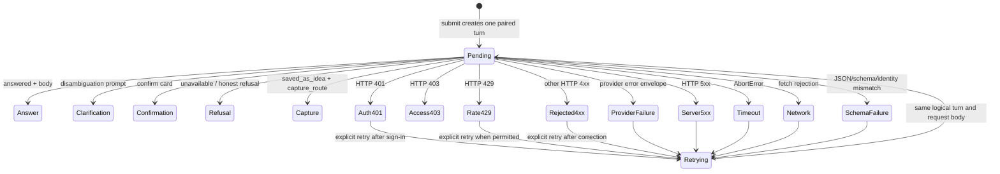

# Technical Design: [BUG-073-006] Exhaustive Assistant Turn Outcomes

## Design Brief

### Current State

`web/pwa/assistant.js::submitText` immediately appends only the user transcript
row, then dispatches a request. The page has one global
`#assistant-response`/`#assistant-error` region rather than an Assistant row
paired with each user message. There is therefore no persistent logical turn
group for pending, retrying, or terminal state.

`postTurn` reads every body as text and throws a raw `Error` on non-2xx before
decoding a schema-valid `httpadapter.TurnResponse`. `dispatchTurn` catches every
HTTP, timeout, network, JSON, and schema failure and collapses them into
`Network or server error. You can retry the same turn.` Outer
`bearerAuthMiddleware` 401 and `auth.RequireScope` 403 responses use API error
shapes different from adapter-owned v1 envelopes, so pre-facade rejection
cannot reach `renderResponse` at all.

There is also a local schema failure before any fetch: every request builder in
`assistant.js` sets `client_context: ""`, while generated
`validateTurnRequest` requires `client_context` to be an object. Validation runs
before `dispatchTurn` enters its error-rendering `try`, so the already-appended
user row can remain unpaired even when authentication is healthy.

### Target State

Each submission atomically creates one in-memory `AssistantTurn` containing a
user row and a paired Assistant row. The Assistant row moves from `pending` to
exactly one terminal state: answer, clarification, confirmation, refusal,
capture, auth error, access error, rate limit, request rejection, provider
failure, server failure, timeout, network failure, or schema/decode failure.
It is never blank.

The client normalizes both schema-valid v1 envelopes and outer middleware error
bodies into a closed `TurnOutcome`; raw server text never reaches DOM or logs.
Retry reuses the original `transport_message_id` and request body, updates the
same paired row through `retrying`, and remains single-flight. Authentication
recovery refreshes the HttpOnly cookie without persisting or automatically
resubmitting the prompt.

### Patterns To Follow

- `internal/assistant/httpadapter/schema.go::TurnResponse`: stable v1 success
	and adapter-error envelope with `status`, `error_cause`, `capture_route`,
	`facade_invoked`, and trace fields.
- `httpadapter.HTTPAdapter::errorResponse` and `writePreFacadeError`: safe,
	closed error tokens for adapter/rate/body failures.
- `httpadapter.turnResponseCache`: server deduplication by user,
	`transport_message_id`, and request fingerprint.
- `internal/assistant/contracts/response.go`: distinction between
	`answered`, `saved_as_idea`, `unavailable`, provider failure, no match, and
	honest no-grounded-answer refusal.
- Existing same-origin `fetch(..., credentials: "same-origin")`: browser auth
	remains an HttpOnly cookie and is never read by JavaScript.

### Patterns To Avoid

- The current single global response panel cannot represent a chronological
	turn lifecycle and must not remain the state owner.
- Throwing `"HTTP <status>: <raw body>"` in `postTurn` leaks internal text into
	exception surfaces and discards typed server outcomes.
- `showLocalError` currently uses one generic copy for unrelated failures and
	cannot distinguish 401, 403, 429, provider, timeout, network, or schema.
- Existing Playwright files `assistant_chat.spec.ts`,
	`assistant_retry.spec.ts`, and `assistant_accessibility.spec.ts` are served-
	route/documentation probes; they do not submit through the browser UI or
	assert terminal rows.
- The Go E2E retry test proves server dedup but not browser transcript identity,
	pending state, or duplicate-row prevention.

### Resolved Decisions

- Keep `assistant_turn_v1` unchanged; its existing fields are sufficient.
- Build `client_context` as `{}` and run request validation inside the guarded
	turn transition so a local contract failure becomes `schema_decode`, not an
	unhandled blank turn.
- Normalize transport failures client-side instead of inventing fake server
	success envelopes.
- Use one in-memory turn model keyed by `transport_message_id`; no transcript,
	prompt, token, or retry body enters browser persistence.
- Retry updates the same turn group and reuses the same request identity/body.
- 401 and 403 are distinct; neither becomes empty, refusal, or capture.
- Genuine low-band capture remains the only path to `saved_as_idea` styling.
- Re-authentication is explicit and never automatically resubmits a message.

### Open Questions

None blocking. Full production-cookie Playwright depends on the design and
implementation of `BUG-070-001`. The owned real-stack fault controls for
network, timeout, 5xx, invalid-envelope, and the auth/scope/rate/provider
scenarios are the `BUG-102-001`-owned fault-profile registry entries this packet
consumes by `stableId` (see `## Fault Registry Consumption`); `bubbles.plan`
links each entry to its owned real-stack boundary, and this packet authors none
of them.

## Purpose And Scope

This design repairs the browser Assistant at `/pwa/assistant.html`, its
same-origin `POST /api/assistant/turn` transport adapter, per-turn DOM/state,
safe-copy mapping, retry/re-authentication behavior, observability, and focused
regression boundaries. It preserves facade routing and business semantics,
server deduplication, capture/refusal rules, generated schema v1, and mobile
render descriptor consumers. It does not alter spec 104 or specs 105/106.

## Root Cause Analysis

### Confirmed Root Cause

The observed blank/incomplete turn follows from four concrete gaps:

1. `appendTranscriptRow("user", text)` creates a user row before dispatch, but
	 no paired Assistant row is created for pending or failure.
2. `renderResponse` renders only into global latest-response nodes. It is
	 reachable only after `postTurn` returns a schema-valid 2xx body.
3. `postTurn` throws before parsing non-2xx bodies, even though adapter-owned
	 errors and pre-facade rate/body errors already use `TurnResponse v1`.
	 Router-owned 401 and scope-owned 403 use other JSON error shapes.
4. `dispatchTurn` maps every thrown condition to the same global local error,
	 retaining retry input but losing error type and turn pairing.
5. `buildTextRequest`, `buildConfirmRequest`, and
	 `buildDisambiguationRequest` emit a string `client_context`; the generated
	 schema requires an object. Because validation precedes the dispatch `try`,
	 this local mismatch can fail before both fetch and terminal rendering.

`renderResponse` additionally checks `capture_route` as a string even though
the generated schema requires a boolean. The new structural outcome mapper
replaces this dead branch and accepts capture only for the valid boolean/status
combination.

An auth rejection before facade execution therefore preserves the user row,
never creates a paired Assistant terminal row, and bypasses the only function
that renders structured outcomes. The same architecture also misclassifies
network, timeout, 5xx, and schema failures.

### Existing Server Contracts

- `internal/api/router.go` runs `bearerAuthMiddleware` outside
	`AssistantTurnHandler`; missing/rejected sessions return 401 before the
	adapter and set `facade_invoked` nowhere.
- `httpadapter.PreFacadeChain` runs scope, rate, and body limits. Rate/body
	errors use v1 envelopes; `auth.RequireScope` emits a separate 403 body.
- `HTTPAdapter` emits v1 error envelopes for invalid turns, disabled transport,
	dedup conflict/capacity, and facade errors.
- Successful facade responses carry the structural distinction needed to
	prevent false capture: `status`, `error_cause`, and `capture_route`.

The repair must consume all of these honestly without forcing outer auth
middleware to fabricate an Assistant success envelope.

## Architecture Overview



### Owning Code Paths

| Concern | Owner | Required Change |
|---|---|---|
| Static DOM | `web/pwa/assistant.html` | Replace global latest-response ownership with a transcript container able to hold paired turn groups; retain one accessible initial state and composer. |
| Turn model/reducer | `web/pwa/assistant.js` | Add an in-memory map/order of `AssistantTurn`; create/update one paired group by ID. |
| Transport normalization | `assistant.js::postTurn` | Return a typed transport result; parse safe v1 envelopes on any status; classify outer middleware and no-envelope failures. |
| Rendering | `assistant.js::renderResponse` | Render into a turn-specific Assistant row; map only closed safe states; clear incompatible controls/sources on transitions. |
| Retry | `assistant.js::dispatchTurn/retryPending` | Preserve request and same ID per failed turn; one in-flight lease; update same row. |
| Wire schema | `internal/assistant/httpadapter/schema.go` and generated JS | No field change. Keep v1 generation/drift checks intact. |
| Outer errors | `internal/api` auth and `internal/auth::RequireScope` | Preserve existing HTTP semantics; optional convergence on one safe API error decoder is allowed, but not required for this fix. |

## Client Data And State Contracts

### In-Memory Turn Model

```javascript
// Conceptual shape; exact implementation may use classes or closures.
{
	id: transportMessageId,
	request: validatedTurnRequest,
	userText: visibleText,
	phase: "pending" | "retrying" | "terminal",
	outcome: null | TurnOutcome,
	attempt: 1,
	inFlight: true,
	abortController: controller
}
```

`request` and `userText` live in memory only. The DOM contains the user-authored
visible transcript but no hidden duplicate in data attributes. The model is
discarded on page close/reload by design. No `localStorage`, `sessionStorage`,
IndexedDB, CacheStorage, service-worker queue, URL query, or cookie stores it.

The current global `pendingTurn` becomes a lookup by turn ID or a reference to
the one retryable turn. Editing the composer must not erase retry context for a
prior failed visible turn; retry belongs to that row, not to the current draft.
Single-flight may remain global for the first repair, provided every ignored
duplicate leaves both draft and existing turn unchanged.

### Closed Turn Outcome

```javascript
{
	kind: "answer" | "clarification" | "confirmation" | "refusal" |
				"capture" | "auth_401" | "access_403" | "rate_limited" |
				"request_rejected" | "provider_unavailable" | "server_error" |
				"timeout" | "network" | "schema_decode",
	safeMessage: fixedCopy,
	retryable: boolean,
	signInRequired: boolean,
	response: validatedTurnResponseOrNull,
	requestId: nonSensitiveCorrelationOrEmpty
}
```

Raw response text and JavaScript exception messages are not fields. The
normalizer may extract only allowlisted code/status/request-ID information.

## Transport Normalization

### Response Processing Order

1. Execute same-origin fetch with timeout and the original validated request.
2. Record HTTP status and content type; read a bounded response body.
3. Attempt JSON parse without interpolating parse text into UI/logs.
4. If the object satisfies `validateTurnResponse`, also require its
	 `transport_message_id` to equal the active turn ID when non-empty.
5. Map the validated v1 envelope using HTTP status plus structural fields.
6. Otherwise map known outer error shapes by HTTP status and allowlisted error
	 code only.
7. If neither contract validates, return `schema_decode` for a received HTTP
	 response, `timeout` for `AbortError`, or `network` for fetch rejection.

The normalizer returns a value; expected failures do not throw raw errors into
the UI. Programmer invariant failures may still throw and are caught at the
dispatch boundary as `schema_decode`/internal-safe error.

### HTTP/Error Mapping

| Boundary | Condition | Outcome | Safe Action |
|---|---|---|---|
| Router auth | 401 | `auth_401` | Open Sign in, then explicit Retry. |
| Scope middleware | 403 / `scope_required` | `access_403` | Safe return or revise permitted action; no login loop. |
| Pre-facade limiter | 429 / `rate_limited` | `rate_limited` | Retry only when server permits; no automatic loop. |
| Validation | Other 4xx | `request_rejected` | Edit or explicit Retry according to code. |
| Facade/provider envelope | `status=unavailable`, `error_cause=provider_unavailable` | `provider_unavailable` | Explicit Retry; never capture. |
| Honest refusal | `status=unavailable`, `error_cause=no_match|no_grounded_answer|missing_scope|slot_missing|model_not_switchable` with safe body | `refusal` | Refine/choose permitted action; preserve server body only after schema validation. |
| Genuine capture | `status=saved_as_idea` and `capture_route=true` | `capture` | Show capture acknowledgement. |
| Invalid capture combination | capture flag/status/body contradiction | `schema_decode` | Retry; do not render partial capture. |
| Server/adapter | 5xx | `server_error` unless validated provider classification applies | Retry. |
| Client timeout | Abort caused by turn deadline | `timeout` | Retry. |
| Fetch rejection | No HTTP response | `network` | Retry. |
| Parse/schema/ID mismatch | Response received but invalid | `schema_decode` | Retry; no partial body/sources/controls. |

`facade_invoked=false` is operational context, not user copy. It helps tests and
telemetry distinguish pre-facade rejection but never changes 401/403 privacy.

## DOM And Rendering Contract

Each submission appends one `<li data-turn-state>` group containing visible
`You` and `Smackerel` sections. The turn ID is held in the JS model/closure; it
is not serialized as a DOM data attribute. The Smackerel section immediately
contains `Waiting for Smackerel`, so there is no empty interval.

Request construction uses `client_context: {}`. Request validation occurs
after the paired turn exists and inside the same safe outcome boundary as
response validation. A local request-contract regression produces a terminal
`schema_decode` row and zero network requests; it never leaves an unhandled
promise or blank row.

On transition:

- replace the same Assistant row's state/body;
- clear sources, choices, confirmation controls, and prior errors first;
- attach sources only for a validated response state that permits them;
- attach confirm/disambiguation controls only to their matching state;
- attach Retry or Sign in only to the terminal turn that owns it;
- never append another user row during retry;
- never show capture route/style unless both structural capture conditions hold.

The initial transcript contains no synthetic Assistant message. It contains a
separate invitation outside the chronological list and disappears after the
first valid submission.

## Retry And Idempotency

Retry uses the exact validated request object and
`transport_message_id` retained by the failed turn. It does not mint a new ID,
append a user row, or auto-copy the prompt into the composer. The paired row
moves to `Trying this turn again`, increments its non-sensitive attempt count,
and disables its actions while in flight.

Repeated activation while pending/retrying is ignored by the in-memory lease.
The server's `turnResponseCache` remains authoritative for duplicate network
delivery: same user + ID + fingerprint replays one result; same ID with a
different body yields conflict. The client maps conflict to request rejection
and never overwrites the original prompt/body silently.

An outcome is terminal for the current attempt, not immutable forever: retry
may replace it on the same logical turn. At every moment there is exactly one
current Assistant state per user row.

## Authentication Recovery

The client never reads the cookie. For `auth_401`, the paired row presents a
fixed same-origin `/login?next=/assistant` link with `target="_blank"` and
`rel="noopener"`. Opening sign-in in a separate tab preserves the original
Assistant tab's in-memory failed turn while the refreshed HttpOnly cookie is
shared across the origin. The user returns to the original tab and explicitly
activates Retry.

This avoids all forbidden alternatives: no prompt in `next`, no transcript in
storage, no token handoff, no cross-window message containing sensitive data,
and no automatic replay after credentials are entered. If the browser blocks a
new tab, the link remains a normal safe navigation but the page truthfully
cannot preserve in-memory retry context; no persistence fallback is added.

403 does not offer sign-in again because a valid session with insufficient
scope would loop. It offers a safe product return or input correction.

## Security And Privacy Boundaries

- Authentication remains the same-origin HttpOnly cookie; JavaScript never
	reads `document.cookie` or auth headers.
- Fixed safe copy maps allowlisted status/error tokens. Raw response bodies,
	exception strings, stack traces, provider messages, and auth details never
	enter DOM, attributes, console, or telemetry.
- Full prompts/transcripts never enter logs or metrics. Turn correlation uses a
	one-way/non-sensitive client correlation or server request ID; do not log the
	transport message ID if policy classifies it as linkable user data.
- Sources render only after full schema validation and continue through
	`safeHref`; partial invalid responses render no links or controls.
- High-band failure cannot inherit `saved_as_idea`, capture route, success
	color, source list, or confirmation controls.
- The service worker must not queue Assistant POSTs. Retry is visible and
	user-initiated only.

## Accessibility And Responsive Behavior

The transcript is a named chronological log, but only the changed Assistant row
announces. Pending/retrying uses a polite status. Auth, access, rate, network,
timeout, server, and schema errors use one alert transition, not a permanently
assertive container that repeats on rerender.

Focus remains in the composer after ordinary submission. A terminal error does
not forcibly move focus while the user types; its alert is announced and its
Retry/Sign-in control follows the paired row in DOM order. Activating Retry
returns focus to that row's status/action when complete. Explicit tab indexes
should be removed in favor of chronological DOM order unless an existing
accessibility contract proves they are necessary; dynamic controls otherwise
create cross-turn ordering conflicts.

At 320 CSS pixels and 200% zoom, turn labels, text, status, sources, actions,
and composer wrap in one column. The composer must not cover the latest turn or
mobile navigation. Reduced-motion removes spinner/typing animation while
retaining textual pending/retrying states.

## Migration And Backward Compatibility

There is no database migration and no `assistant_turn_v1` schema bump. Existing
request/response fields, generated validators, mobile codegen, render descriptor
canary, facade contracts, and server dedup keys remain unchanged.

The browser DOM changes from a global latest-response panel to per-turn groups.
Existing selectors used by consumers should be inventoried before removal. A
temporary compatibility mount may keep `#assistant-response-section` as the
container around the newest turn, but it must not retain a second independent
state. The active state owner is the turn model only.

Existing healthy answer, clarification, confirmation, refusal, and capture
fixtures must render byte/semantics compatible content. Only blank/generic
failure behavior changes. The generated `assistant_turn_v1.js` remains
regenerated solely by its existing codegen command when the schema changes;
this repair does not hand-edit it.

## Observability

Server metrics already distinguish auth validation and many Assistant outcomes.
Add or extend a bounded browser-turn outcome event only through a project-owned
same-origin telemetry endpoint if one exists or is explicitly planned; do not
introduce a fire-and-forget external client logger. The bounded vocabulary is:

`answer|clarification|confirmation|refusal|capture|auth_401|access_403|rate_limited|request_rejected|provider_unavailable|server_error|timeout|network|schema_decode`.

Allowed fields are outcome, HTTP class, facade-invoked boolean when validated,
attempt ordinal, duration bucket, and server request ID. Forbidden fields are
prompt/transcript, response body, source title/URL, username, cookie/token,
provider credential, raw error, and transport request body.

Server logs for pre-facade and adapter errors already carry request IDs and safe
codes; implementation should preserve that correlation. A dashboard should
alert on terminal blank invariant violations detected by E2E or client error
counts, not inspect transcript content.

## Fault Registry Consumption (BUG-102-001-Owned)

`ASST-UI-011` requires the disposable validate/e2e stacks to **consume** a
test-only, machine-readable fault-profile registry, and `SCN-073-006-10`
exercises that consumption. This packet is a pure **consumer** of that registry:
it does not own, author, define, or fork it.

### Ownership Boundary

`BUG-102-001` OWNS the shared, production-inert, test-only, machine-readable
fault-profile registry (its `JOURNEY-016` / `SCN-102-001-12`), including the
closed nine-field profile schema and its "Consumer Contract (BUG-073-006 And
Other Journey Owners)". Per capability-foundation-design the broadest consumer
owns the shared foundation: `BUG-102-001` exercises the widest fault surface
(every required product journey), so it owns the registry; this Assistant packet
consumes it. The registry lives under a `BUG-102-001`-owned generic acceptance
surface (for example `config/acceptance/fault-profiles.v1.yaml` plus its JSON
Schema); this design neither creates nor edits it.

### Consumed Assistant Fault Profiles

`SCN-073-006-10`'s eight required Assistant fault conditions are **entries
registered in the `BUG-102-001` registry**, referenced from this packet's
disposable `env=test*` stacks by immutable `stableId` only:

| Assistant fault (SCN-073-006-10) | Terminal `TurnOutcome` |
|---|---|
| Auth rejection before facade | `auth_401` |
| Scope denial | `access_403` |
| Rate limit | `rate_limited` |
| Provider failure | `provider_unavailable` |
| Server failure | `server_error` |
| Timeout | `timeout` |
| Network loss | `network` |
| Invalid envelope | `schema_decode` |

Each row is a distinct registered profile; this packet defines none of them and
invents no `stableId`. The nine fields `BUG-102-001` defines once — `stableId`,
`journey` (the "owning scenario" `ASST-UI-011` names), `setup`, `teardown`,
`parallelism`, `expectedRequest`, `expectedResponseOrTermination`, `evidence`,
and `noFirstPartyInterception` — are the OWNER's schema; this packet consumes
those field names as-is and does not restate, rename, or re-shape them.

### Consumption Invariants

- **No parallel registry.** This packet authors no second registry, defines no
  profile inline, and does not re-declare the nine-field schema as its own.
- **Reference by `stableId`.** The eight faults are addressed by their immutable
  `stableId`; a missing or unknown `stableId` fails and never falls back to an
  inline definition.
- **Owner-supplied lifecycle.** When it runs a profile this packet uses that
  profile's own `setup`/`teardown`/`parallelism` and asserts its
  `expectedRequest` and `expectedResponseOrTermination` through real disposable
  stack behavior — the one-way "consume, never own" contract `BUG-102-001`
  publishes.
- **Shared production inertness.** No consumer exposes a fault selector,
  trigger, or profile in a production build, route, request schema, or UI
  (`ASST-UI-012`); the profiles exist only in disposable `env=test*` stacks.
- **Real-stack faults only.** Every consumed profile is produced by genuine
  stack behavior at an owned boundary, honoring `noFirstPartyInterception` —
  never `page.route`/`context.route`/`route.fulfill`/first-party request
  interception.

This section resolves the design-side residual `bubbles.plan` routed here
("fault-profile registry architecture absent from design.md"): the architecture
is `BUG-102-001`-owned and this packet consumes it. The corresponding scopes.md
realignment is routed to `bubbles.plan` (see `## Routed Design Questions`).

## Testing And Validation Strategy

No product test, browser run, build, or certification is claimed by this
design. Required coverage is:

| Scenario | Test Boundary | Required Assertion |
|---|---|---|
| `SCN-073-006-01` | Real authenticated Playwright | One user row + immediate pending row + exactly one POST + one non-empty supported terminal row. |
| `SCN-073-006-02` | Real missing/expired/revoked cookie before facade | 401 leaves paired auth row and Sign in; no blank/capture/success. |
| `SCN-073-006-03` | Local invalid request plus real 403, 429, 4xx, 5xx, invalid v1 response at owned boundaries | Each maps to distinct fixed state; local-invalid sends zero requests; raw body absent. |
| `SCN-073-006-04` | Owned live timeout and network boundary without route interception | Original turn remains; timeout/network differ; Retry appears. |
| `SCN-073-006-05` | Browser double-click/keyboard retry plus server dedup | One additional request, same ID/fingerprint, no duplicate user/Assistant row. |
| `SCN-073-006-06` | High-band failure and genuine low-band capture | Only genuine capture gets saved acknowledgement; failure remains error/refusal. |
| `SCN-073-006-07` | Initial page | Zero transcript rows and one accessible invitation. |
| `SCN-073-006-08` | Sensitive raw server detail fixture at owned server boundary | Fixed safe DOM/log copy; no token, prompt duplicate, stack, or raw body. |
| `SCN-073-006-09` | Playwright keyboard/accessibility at 320px and 200% zoom | One announcement per transition, chronological focus, no overlap/scroll. |
| `SCN-073-006-10` | Real disposable `env=test*` validate/e2e stack consuming the `BUG-102-001` registry profiles by `stableId` | Each of the eight Assistant fault profiles injects at an owned real-stack boundary per its 102-owned `setup`/`teardown`/`parallelism`; its `expectedRequest`/`expectedResponseOrTermination` hold without first-party interception; the production build/config/route/UI exposes no fault control. |

The pre-fix adversarial browser test must submit through the real form with a
session that the real router rejects before facade invocation and assert the
paired Assistant row. A test that directly calls the API, injects a bearer,
intercepts `/api/assistant/turn`, or only scans source cannot close the bug.

Unit tests should cover the pure normalizer/state reducer matrix, including
response-ID mismatch and invalid capture combinations. Integration tests should
preserve the existing pre-facade and adapter envelope assertions. The focused
browser canary runs before broad Assistant and unified-journey E2E because the
transcript renderer is shared high-fan-out client infrastructure.

## Narrow Rollback

Rollback restores only the prior Assistant HTML/JS/CSS renderer and focused
telemetry from the immediately preceding revision. It does not alter facade,
wire schema, database, auth middleware, or server dedup. The rollback trigger is
a regression in healthy turn rendering or composer operability detected by the
independent canary.

The prior blank-error behavior is not an acceptable steady state. If the
per-turn renderer must be withdrawn while a healthy-render regression is fixed,
the route should be explicitly unavailable rather than silently accepting turns
into a blank response.

## Alternatives And Tradeoffs

### Render Typed Errors In The Existing Global Error Node

Rejected. It improves copy but leaves errors detached from the user turn,
cannot support chronological retries, and still permits blank Assistant rows.

### Change Every Outer Middleware To Emit TurnResponse V1

Rejected for this packet. It would couple general auth/scope middleware to one
transport schema and broaden the change across unrelated routes. Client
normalization safely composes existing contracts.

### Persist Failed Turns In Session Storage

Rejected. Prompts/transcripts are sensitive, sessionStorage is default-deny,
and persistence is unnecessary for same-tab retry.

### Automatically Retry After Sign-In Or Network Recovery

Rejected. It can replay user intent without consent and create duplicate side
effects. Retry remains explicit and server-idempotent.

### Single-Implementation Justification

This is a narrow repair inside the existing HTTP Assistant adapter and browser
renderer. It adds no provider, transport, or second state framework. Mobile and
other adapters retain their current renderers; the shared v1 contract is reused
rather than abstracted again.

## Complexity Tracking

| Added Complexity | Simpler Alternative | Why The Simpler Alternative Is Rejected |
|---|---|---|
| Per-turn in-memory reducer and DOM group | One global error banner | A global banner cannot preserve pairing, chronology, retry identity, or the exactly-one terminal invariant. |
| Multi-shape transport normalizer | Throw on every non-2xx | Throwing discards safe server codes and collapses auth/access/provider/schema outcomes. |

## Routed Design Questions

| Owner | Question | Required Constraint |
|---|---|---|
| `bubbles.plan` | Realign `SCOPE-01`, which currently authors a parallel fault-profile registry and re-declares the nine-field schema. | Retitle `SCOPE-01` to a consumer scope of the `BUG-102-001`-owned registry; drop the parallel-registry authorship and the nine-field-schema redeclaration; reference the eight Assistant fault profiles by `stableId` only (see `## Fault Registry Consumption`). |
| `bubbles.plan` | Which owned real-stack controls produce 5xx, timeout, network loss, and invalid envelope without Playwright interception? | They are the `BUG-102-001`-registry fault profiles this packet consumes by `stableId`, not a 073-authored registry; browser/API assertions must traverse actual transport and render paths with `noFirstPartyInterception` honored. |
| `bubbles.plan` | Which healthy Assistant scenarios form the independent renderer canary before broad E2E? | Include answer, clarification/confirmation, refusal, and genuine capture semantics. |
| `bubbles.plan` | How is full cookie-based Playwright sequenced after `BUG-070-001`? | No bearer injection may substitute for production browser trust. |

## Superseded Design Decisions

The initialization-only text that left transport/state ownership unconfirmed is
superseded by the source-grounded design above. It is not active design
authority.
