# Expected Behavior: [BUG-073-006] Honest Assistant Turn Failures

## Problem Statement

Assistant currently lacks a complete client-side terminal state for failures that occur before the facade returns a normal response. A user must never infer whether a blank row means pending, lost, saved, or failed.

## Outcome Contract

**Intent:** Pair every submitted user message with an accessible pending state and exactly one honest terminal outcome while preserving safe retry context.

**Success Signal:** The real UI renders distinct success, refusal, 401/403 re-authentication, server error, timeout/network, and malformed-response states; retry submits once and preserves transcript/input.

**Hard Constraints:** Failure never becomes capture/success; auth tokens and internal payloads remain private; transcript state is not lost or duplicated; live E2E uses real HTTP without interception.

**Failure Condition:** A turn can remain blank, retry duplicates a message, an error erases input/transcript, or any non-success is rendered as a successful capture/answer.

## Requirements

- **ASST-UI-001:** Submission SHALL append one user message and one associated pending Assistant turn.
- **ASST-UI-002:** Every HTTP non-2xx SHALL resolve the pending turn into a typed inline error.
- **ASST-UI-003:** 401/403 SHALL offer re-authentication/access guidance without presenting no answer or no data.
- **ASST-UI-004:** Timeout, network, 5xx, and schema/decoding failures SHALL have distinct non-sensitive messages and retry.
- **ASST-UI-005:** Retry SHALL reuse preserved safe input/context and create at most one new request/terminal turn.
- **ASST-UI-006:** Successful answer, clarification, confirmation, honest refusal, and low-band capture SHALL retain their existing distinct semantics.
- **ASST-UI-007:** A failed high-band turn SHALL never render the capture acknowledgement or success status.
- **ASST-UI-008:** Empty transcript SHALL show a true initial state without fabricated content.
- **ASST-UI-009:** Errors and state changes SHALL be announced accessibly, preserve logical focus, and remain usable on narrow viewports.
- **ASST-UI-010:** Client logs/telemetry SHALL exclude auth material, full prompt/transcript, and unredacted server bodies.
- **ASST-UI-011:** Disposable validate/e2e stacks SHALL consume a test-only machine-readable fault-profile registry. Every profile SHALL declare a stable ID, owning scenario, setup, teardown, parallelism/isolation rule, expected request, expected response or termination, allowed evidence, and the assertion proving no first-party request interception.
- **ASST-UI-012:** Fault controls SHALL be absent from production route, configuration, UI, and request schemas. A production build or profile that can select, inject, or trigger a test fault SHALL fail acceptance.

## User Scenarios

```gherkin
Scenario: SCN-073-006-01 Successful turn remains complete
  Given an authenticated user and a healthy Assistant
  When the user submits one message
  Then one pending turn becomes one visible supported terminal outcome

Scenario: SCN-073-006-02 Pre-facade auth rejection is visible
  Given the session is missing, expired, or rejected before the facade
  When the user submits a message
  Then the message remains paired with an inline re-authentication error
  And no blank Assistant row remains

Scenario: SCN-073-006-03 Non-2xx and schema failures are typed
  Given the server returns a 4xx/5xx or a malformed response envelope
  When the client processes the response
  Then a non-sensitive typed error and retry are visible

Scenario: SCN-073-006-04 Network and timeout preserve retry context
  Given the request loses network connectivity or exceeds its timeout
  When the request terminates
  Then the transcript and original safe input remain
  And retry is available without duplicate submission

Scenario: SCN-073-006-05 Retry is idempotent from the user's perspective
  Given a failed turn has a retry action
  When the user activates retry once or repeatedly during pending state
  Then at most one request is active and one terminal outcome is appended

Scenario: SCN-073-006-06 Failure never becomes capture or success
  Given a high-band Assistant turn is rejected before or after facade execution
  When the UI renders the outcome
  Then it shows neither the saved-as-an-idea acknowledgement nor success styling

Scenario: SCN-073-006-07 Empty transcript remains honest
  Given no message has been submitted
  When Assistant opens
  Then it shows an accessible initial state with no fake conversation

Scenario: SCN-073-006-08 Error states protect privacy
  Given an auth or server response contains internal diagnostic detail
  When the client renders and logs the failure
  Then credentials, tokens, full prompts, and raw internal bodies are absent

Scenario: SCN-073-006-09 Assistant failures are accessible and responsive
  Given a keyboard or screen-reader user on a narrow viewport
  When pending, error, retry, or re-authentication renders
  Then status is announced, focus remains predictable, and controls do not overlap

Scenario: SCN-073-006-10 Test faults are registered and production-inert
  Given a disposable validate/e2e stack and the machine-readable fault-profile registry
  When auth rejection, scope denial, rate limit, provider failure, server failure, timeout, network loss, and invalid envelope profiles run in parallel as declared
  Then each profile performs its declared setup and teardown and produces the expected real request/response outcome without first-party request interception
  And the same fault controls are unavailable in production configuration, routes, requests, and UI
```

## Acceptance Criteria

1. Every submitted message has one pending and one terminal state; no blank rows.
2. 401/403, 4xx/5xx, timeout, network, schema, success, refusal, and initial-empty states are distinct.
3. Adversarial regression rejects the POST before facade execution and fails if the old blank response returns.
4. Retry is deduplicated and preserves safe context.
5. Real-stack Playwright asserts visible DOM and actual requests without interception.
6. A machine-readable validate/e2e fault-profile registry covers every required failure with setup, teardown, parallelism, expected request/response, and no-interception proof; production paths expose no fault control.

## Release Train

- Target train: `mvp`.
- Flags introduced: none.
- Assistant may be advertised only where the complete error-state contract is active.

## UI Wireframes

### UX Requirements

| ID | Observable Contract |
|---|---|
| UX-073-006-01 | Each accepted composer submission creates one visual turn group containing the user message and one immediately visible Assistant row labeled `Waiting for Smackerel`. |
| UX-073-006-02 | The Assistant row always resolves to exactly one current terminal state; a 2xx response with empty/invalid content resolves to `Response could not be read`, never a blank row. |
| UX-073-006-03 | 401 session rejection, 403 scope denial, 429 rate limit, other request rejection, 5xx, provider failure envelope, timeout, network loss, and schema/decode failure use distinct safe copy and actions. |
| UX-073-006-04 | Retry retains the original visible user message and safe in-memory logical turn identity, updates the same paired Assistant row to retrying, and never appends a duplicate user message. |
| UX-073-006-05 | Sign-in recovery returns to the failed turn but does not automatically resubmit the user's message; the user explicitly activates Retry after re-authentication. |
| UX-073-006-06 | Answer, clarification, confirmation, honest refusal, genuine low-band capture, and typed failure remain visually and semantically distinct. Failure cannot inherit capture route, success styling, sources, or confirmation controls. |
| UX-073-006-07 | Initial transcript empty is an invitation to compose, not a fabricated Assistant message. `Filtered empty` is not a valid Assistant turn state; retrieval no-match is represented only by the server's honest refusal/capture contract. |
| UX-073-006-08 | Raw response bodies, stack traces, credential material, full transcript/prompt telemetry, and internal error strings never enter user-visible copy, DOM data attributes, client logs, or retry labels. |

### Screen Inventory

| Screen | Actor(s) | Status | Scenarios Served |
|---|---|---|---|
| Assistant Conversation (`/assistant`) | Daily user, mobile user | Existing - Modify | SCN-073-006-01 through SCN-073-006-09 |

### Single-Screen Justification

This packet repairs one Assistant conversation surface and its per-turn states; it introduces no second page or reusable cross-feature capability. The shared Assistant/Today composition, shell, theme, and product availability contract remain owned by spec 106.

### Screen: Assistant Turn Lifecycle

**Actor:** Daily User, Mobile User | **Route:** `/assistant` | **Status:** Modify

**Desktop:**

```text
┌──────────────────────────────────────────────────────────────────────────┐
│ Assistant                                              [session menu]    │
├──────────────────────────────────────────────────────────────────────────┤
│ Conversation                                                             │
│                                                                          │
│ You                                                                      │
│ [original submitted message...........................................] │
│                                                                          │
│ Smackerel  [Waiting / Answer / Clarify / Confirm / Refusal / Error]      │
│ [response body OR typed safe status; this row is never blank]            │
│ [Sources] [Choice controls] [Confirm/Cancel] [Retry] [Sign in again]     │
│ [Attempt 1 failed / retry status, when applicable]                       │
│                                                                          │
│ [Jump to latest, only when reader is above newest turn]                  │
├──────────────────────────────────────────────────────────────────────────┤
│ Your message                                                             │
│ ┌────────────────────────────────────────────────────────────┐ [Send]   │
│ │ [draft / next message]                                     │          │
│ └────────────────────────────────────────────────────────────┘          │
│ [composer validation / sending status]                                  │
└──────────────────────────────────────────────────────────────────────────┘
```

**Mobile / narrow viewport:**

```text
┌──────────────────────────────┐
│ Assistant          [Session] │
├──────────────────────────────┤
│ You                          │
│ [submitted message wraps]    │
│                              │
│ Smackerel [Error]            │
│ [typed safe explanation]     │
│ [Retry] [Sign in again]      │
│                              │
│ [Jump to latest]             │
├──────────────────────────────┤
│ Your message                 │
│ [draft.....................] │
│ [full-width Send]            │
│ [validation / sending]       │
└──────────────────────────────┘
```

**Initial and turn states:**

| State Key | Assistant Row / Screen Treatment | Primary Action | Forbidden Co-Presentation |
|---|---|---|---|
| `initial-empty` | Page invitation: `Ask Smackerel about what you have captured`; no transcript row. | Focus composer | Fake greeting, fake result, Retry, or empty result card. |
| `validation` | Composer says `Enter a message`; no turn group is created. | Correct message | Network request or pending row. |
| `pending` | Paired row says `Waiting for Smackerel`; Send/Retry duplicate actions disabled. | None required | Blank row, success/capture styling, prior turn body in new row. |
| `answer` | Answer body plus verified sources/provenance when present. | Open source / continue | Error alert, capture acknowledgement, empty body. |
| `clarification` | Clarifying question and numbered/clearly labeled choices. | Choose / reply | Generic error or confirmation semantics. |
| `confirmation` | Proposed action summary plus Confirm and Cancel. | Confirm / Cancel | Action shown as already completed. |
| `refusal` | Honest limitation/refusal body and available safer next action. | Refine question | `Saved as an idea`, success badge, blank body. |
| `capture` | Genuine low-band `Saved as an idea` acknowledgement and captured-item link when authorized. | Open captured item | High-band failure/refusal semantics. |
| `auth-401` | `Your session ended before Smackerel could answer`; user message remains, Assistant row is terminal. | Sign in again | `No answer`, capture, raw auth cause, automatic resubmit. |
| `access-403` | `You do not have access to use this Assistant action`. | Return / ask permitted question | Sign-in loop or account/scope internals. |
| `rate-limited-429` | `Too many Assistant requests`; safe retry timing when supplied. | Retry when allowed | Provider/down copy, account existence, automatic retry loop. |
| `request-rejected-4xx` | `This message could not be sent` plus safe input correction when the contract permits. | Edit message / Retry | Raw request body/server validation string. |
| `provider-unavailable` | `A provider Smackerel needs is unavailable`; no capture/success. | Retry / View availability when authorized | Answer/capture body or provider credential. |
| `server-5xx` | `Smackerel could not complete this turn`. | Retry | Raw server response/stack trace or `Connection lost`. |
| `timeout` | `Smackerel took too long to respond`. | Retry | Network/server certainty or blank pending row. |
| `network` | `Connection to Smackerel was lost`. | Retry | Server/provider diagnosis. |
| `schema-decode` | `Smackerel returned a response this page could not read`. | Retry | Raw response body or partial controls/sources. |
| `retrying` | Same paired row says `Trying this turn again`; attempt count may be shown. | None required | Duplicate user row, active Retry, stacked error alerts. |

**Interactions:**

- Submit appends the user row and paired pending Assistant row atomically from the user's perspective. Empty/whitespace input produces field validation and no row/request.
- Retry reuses the same logical turn identity and visible user message, transitions the paired row through `Trying this turn again`, and disables repeated activation until terminal.
- If Retry returns an idempotent replay, the same terminal response appears once; no second Assistant answer or duplicate source list is appended.
- `Sign in again` uses a safe Assistant return target. After successful auth the failed row still says the session ended and exposes Retry; the original message is not auto-sent.
- Choice and confirmation controls belong only to their corresponding terminal state and are removed when a subsequent turn/retry starts.
- Automatic scroll follows a newly submitted turn only when the user was already at the transcript end. If the user is reviewing history, a `Jump to latest` control appears instead of stealing scroll/focus.

**Responsive:** Transcript and composer share one column below tablet width. The composer remains in normal/sticky-safe flow above mobile navigation and virtual keyboard insets; it never covers the latest row or actions. Controls wrap with text labels. At 320px and 200% zoom there is no horizontal page scroll, clipped body, or overlapping composer/navigation.

**Keyboard:** Tab order follows shell, transcript interactive elements in chronological order, Jump to latest, composer, Send, and current turn recovery controls in DOM order. Enter sends; Shift+Enter inserts a newline. Retry/Sign in again return focus to the paired row after navigation/state change. Escape does not discard a draft.

**Screen reader and visual accessibility:**

- Transcript is a named chronological log, but only the new/changed Assistant row is announced; rerendering does not reread the full conversation.
- Each turn group exposes `You` and `Smackerel` labels plus current state. Pending/retrying uses polite status; auth/access/network/timeout/server/schema failures use one alert per transition.
- Focus remains in the composer after ordinary submission; the pending row is announced without forced focus. On failure, Retry is described by the associated user turn without reading the full prompt into the action name.
- State is expressed by text and semantic role, not color/spinner alone. Reduced-motion removes typing/spinner animation while retaining `Waiting for Smackerel`.
- Private prompt text is not copied into live-region status, telemetry copy, data attributes, or error announcements beyond the transcript row the user authored.

### Playwright-Visible Behavior Contract

These are planned real-stack observations and do not claim Assistant, auth, browser, or test execution.

| ID | Real-Stack Setup and Gesture | Required Visible / Request Assertion | Forbidden Outcome |
|---|---|---|---|
| UX-E2E-073-006-01 | Authenticated user submits one message to a healthy Assistant. | One user row and one immediately visible pending Assistant row; exactly one real POST; pending resolves to one supported terminal state with non-empty body/controls as required. | Blank row, duplicate POST/turn, missing user pairing. |
| UX-E2E-073-006-02 | Real session is missing/expired/revoked so middleware rejects before facade. | User row remains; paired row shows session-ended copy and Sign in again; facade-owned answer/capture content is absent. | Blank Assistant row, no-answer/empty, saved-as-idea, success style. |
| UX-E2E-073-006-03 | Authenticated user lacks Assistant scope and receives 403. | Paired row shows access guidance and safe return; no sign-in loop. | Session-ended copy, scope internals, blank row. |
| UX-E2E-073-006-04 | Real rate limit, request rejection, provider failure envelope, and server 5xx occur in separate runs. | Each paired row shows its distinct safe copy/action and exactly one terminal state. | Raw response/internal body, generic blank, capture/success. |
| UX-E2E-073-006-05 | Real endpoint/network is made unreachable and real request exceeds timeout in separate runs without internal route interception. | Network and timeout copy are distinct; original turn and transcript remain; Retry is visible. | One generic error for both, pending forever, lost transcript. |
| UX-E2E-073-006-06 | Real stack returns a contract-invalid/undecodable successful envelope through the owned fault boundary. | `Response could not be read` state and Retry are visible. | Partial body/sources/controls, raw body, blank row. |
| UX-E2E-073-006-07 | User activates Retry repeatedly while retry is pending. | Exactly one additional real request uses the same logical turn identity; no duplicate user row; one retrying then terminal Assistant row. | Concurrent requests, duplicate answer/source list, second user message. |
| UX-E2E-073-006-08 | User signs in from a 401 turn and returns to Assistant. | Failed turn remains visible with Retry; no automatic resubmission occurs; explicit Retry can complete once. | Surprise message replay or lost failed turn. |
| UX-E2E-073-006-09 | High-band turn fails before/after facade; low-band turn genuinely captures in separate runs. | Failure has error/refusal styling and no capture route; low-band capture alone shows saved acknowledgement/link. | High-band `Saved as an idea` or low-band generic error. |
| UX-E2E-073-006-10 | Assistant opens with no messages. | Accessible initial invitation and focused/reachable composer; transcript contains zero fake conversation rows. | Fabricated greeting/result or Retry. |
| UX-E2E-073-006-11 | Keyboard/screen-reader user submits/fails/retries at 320px and 200% zoom. | One state announcement per transition; focus order is predictable; composer/actions remain visible above keyboard/nav; no overlap/horizontal scroll. | Full transcript reread, focus loss, pointer-only recovery. |
| UX-E2E-073-006-12 | Auth/server failure contains sensitive/internal text. | Safe fixed copy only; token, credential, full prompt duplicate, stack trace, and raw body are absent from DOM/data attributes/console-visible diagnostics. | Sensitive detail exposure. |

### Routed Design Questions

| Owner | Question | UX Constraint That Must Survive Resolution |
|---|---|---|
| `bubbles.design` | What client-visible error envelope maps pre-facade 401/403/429/4xx/5xx and facade/provider failures without exposing raw bodies? | Every non-2xx produces one typed safe terminal row; auth and access remain distinct. |
| `bubbles.design` | How is one logical turn grouped across pending, retrying, idempotent replay, and terminal response in the DOM/data contract? | Retry never duplicates the user message or produces multiple current terminal responses. |
| `bubbles.design` | Which in-memory retry context survives re-authentication without persisting the full prompt or auto-submitting it? | User explicitly retries after safe return; no credential/prompt client storage. |
| `bubbles.plan` | Which real owned fault boundaries produce pre-facade auth rejection, scope denial, rate limit, provider failure, 5xx, timeout/network, and invalid envelope without internal Playwright interception? | Browser coverage asserts actual requests and visible paired rows; no canned response fulfills the scenarios. |

## User Flows

### User Flow: Every Turn Reaches One Honest Outcome

```mermaid
stateDiagram-v2
  [*] --> InitialEmpty
  InitialEmpty --> Compose: Focus composer
  Compose --> Validation: Empty submit
  Validation --> Compose: Enter message
  Compose --> Pending: Submit once
  Pending --> Answer
  Pending --> Clarification
  Pending --> Confirmation
  Pending --> Refusal
  Pending --> CaptureAck: Genuine low-band capture only
  Pending --> SessionEnded: 401 before or after facade
  Pending --> AccessDenied: 403
  Pending --> RateLimited: 429
  Pending --> RequestRejected: Other 4xx
  Pending --> NetworkError
  Pending --> ProviderError
  Pending --> Timeout
  Pending --> ServerError: 5xx
  Pending --> DecodeError
  SessionEnded --> Reauthenticate: Sign in again
  Reauthenticate --> SessionEnded: Return; await explicit Retry
  SessionEnded --> Retrying: Explicit Retry after auth
  RateLimited --> Retrying: Retry when allowed
  RequestRejected --> Compose: Correct input
  NetworkError --> Retrying: Retry once
  ProviderError --> Retrying: Retry once
  Timeout --> Retrying: Retry once
  ServerError --> Retrying: Retry once
  DecodeError --> Retrying: Retry once
  Retrying --> Pending: Same logical turn; one request
  AccessDenied --> Compose: Ask permitted question / return
```


