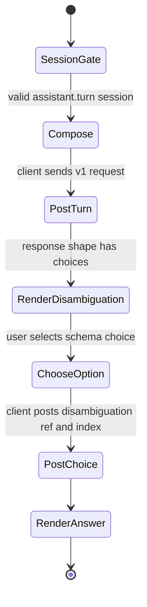
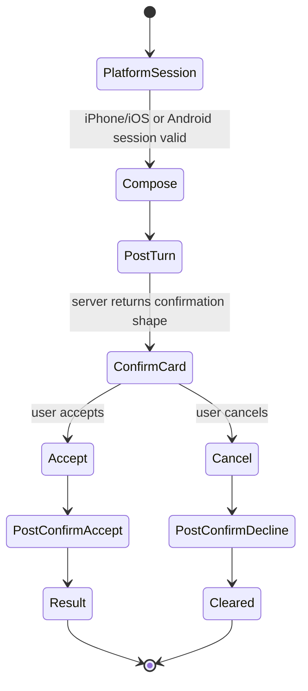
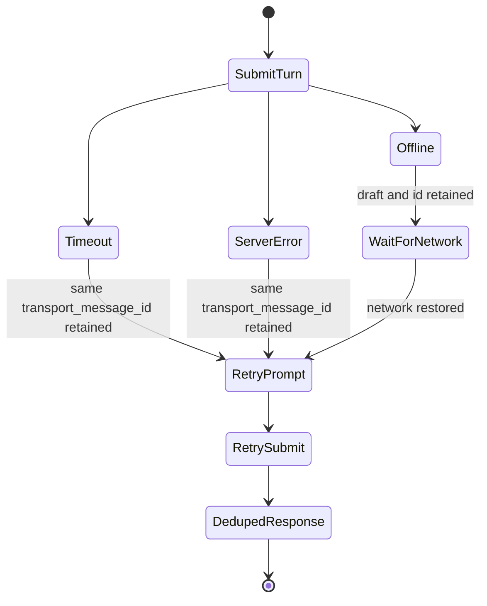
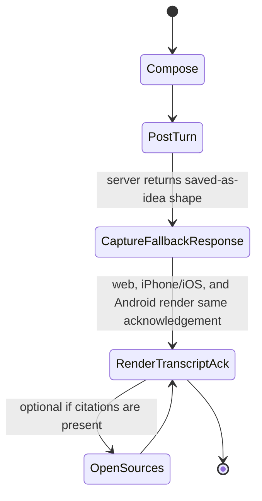
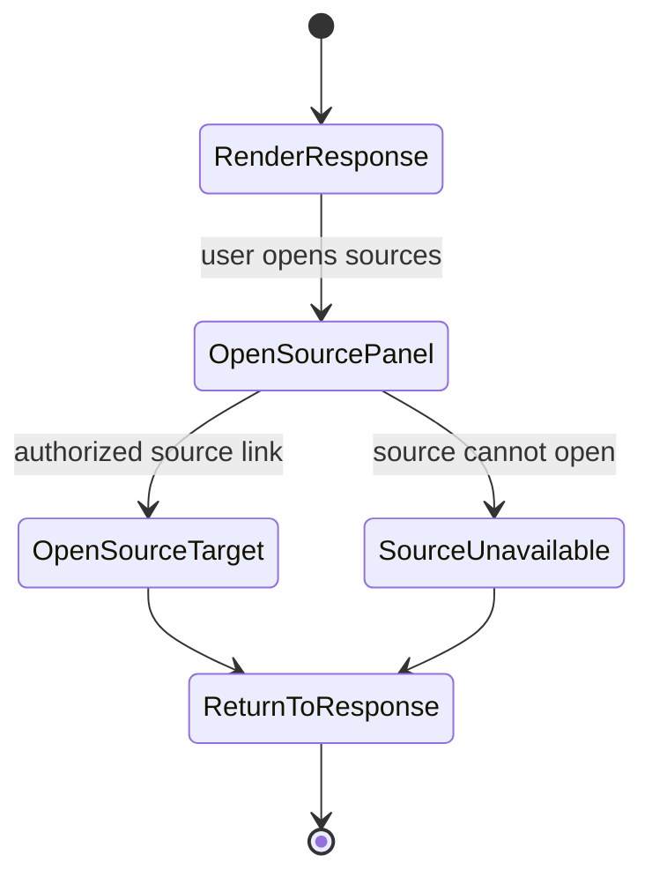

# Feature: 073 Web/Mobile Assistant Frontend Client

**Status:** in_progress (analyst bootstrap; ceiling = `done`)
**Workflow Mode:** `full-delivery`
**Owner Directive (2026-05-31):** Specify the first concrete frontend
clients that consume
[spec 069's `POST /api/assistant/turn`](../069-assistant-http-transport/spec.md)
— a minimal web chat UI and one shared mobile frontend codebase that
ships iPhone/iOS and Android clients from the same mobile foundation.
Without these consumers, spec 069 has only a test harness using it;
this spec turns 069 into a real human-facing surface and proves the
wire contract holds across web plus both required mobile platforms.

**Depends On:** [spec 069 — Assistant HTTP Transport](../069-assistant-http-transport/spec.md),
[spec 044 — Per-User Bearer Auth](../044-per-user-bearer-auth/spec.md),
[spec 060 — Bearer Auth Scope Claim](../060-bearer-auth-scope-claim/spec.md),
[spec 061 — Conversational Assistant](../061-conversational-assistant/spec.md)
(client-side rendering semantics for `AssistantResponse`).
**Amends:** [spec 069](../069-assistant-http-transport/spec.md) (adds
the first concrete consumers and exercises the golden wire-schema
contract from the client side).
**Unblocks:** offline-mode, richer multimodal client work, and later
mobile packaging work that builds on the required shared iOS+Android
frontend foundation.

---

## 1. Problem Statement

Spec 069 ships a transport-agnostic HTTP surface
(`POST /api/assistant/turn`) and a golden schema test, but the only
consumer today is an E2E test suite. That means:

- The wire schema is tested for structural stability but not yet
  for usability by a real client renderer (disambiguation,
  confirmation, citations, capture acknowledgement).
- A new frontend developer (web, iPhone/iOS, or Android) has no reference
  implementation; any first attempt risks reintroducing
  scenario-specific branching on the client side.
- Code generation for the wire schema (used by the shared mobile
  frontend and the web client) has no proven mobile consumer, so
  contract drift between client and server can only be detected when
  a real client breaks.

This spec defines a minimal web chat client and a shared mobile
frontend codebase that produces iPhone/iOS and Android assistant
clients. They consume the spec 069 contract, share generated types,
and render every `AssistantResponse` shape with no client-side
scenario logic. The clients are deliberately minimal: chat composer,
response renderer, disambiguation list, confirm card, citations
panel, capture acknowledgement.

---

## 2. Actors & Personas

| Actor | Description | Goals | Permissions |
|-------|-------------|-------|-------------|
| **Human user (web)** | Operator chatting with Smackerel from a desktop or mobile browser. | Send NL turns; see structured responses; tap disambig/confirm without learning command syntax. | Per-user bearer auth (spec 044) with `assistant.turn` scope (spec 060). |
| **Human user (iPhone/iOS)** | Operator chatting from the iPhone/iOS mobile assistant client. | Identical assistant behavior to web and Android. | Same per-user bearer auth via the approved mobile auth flow. |
| **Human user (Android)** | Operator chatting from the Android mobile assistant client. | Identical assistant behavior to web and iPhone/iOS. | Same per-user bearer auth via the approved mobile auth flow. |
| **Web Client** (new) | Minimal HTML/JS or framework-agnostic single-page chat surface. | POST to `/api/assistant/turn`, render the schema-pinned `AssistantResponse`, route disambig/confirm/reset/capture identically to Telegram/WhatsApp. | Reads bearer token from the auth flow defined in spec 044. |
| **Shared Mobile Client** (new) | One mobile frontend codebase that targets iPhone/iOS and Android while consuming the same HTTP contract via generated types. | Same assistant behavior as web on both mobile platforms. | Same auth model; platform-specific secure handling is design-owned but must not split the business capability. |
| **Wire Schema** | The golden schema from spec 069. | Stay the single source of truth for both clients; codegen targets pin to it. | N/A. |

---

## 3. Outcome Contract

**Intent:** A minimal web frontend and one shared mobile frontend
codebase for iPhone/iOS and Android consume the spec 069 HTTP contract
using shared generated types, render every `AssistantResponse` shape
with no scenario-specific logic, and serve real users without
modifying server-side code.

**Success Signal:**
- A user opens the web client, signs in (spec 044), and sends a NL
  turn. The client POSTs to `/api/assistant/turn` with a valid
  bearer token and an idempotent `transport_message_id`, then
  renders the returned `AssistantResponse`: text body, citations,
  disambiguation choices, confirmation card, capture
  acknowledgement, all from the schema-pinned shapes.
- The shared mobile client renders the same turn identically on
  iPhone/iOS and Android using generated types pinned by the golden
  contract from spec 069.
- A code change that breaks the wire schema breaks both client
  builds at codegen time, including the shared mobile build before
  iPhone/iOS or Android users see broken UI.
- Transient network failures (timeouts, 5xx) are retried with the
  same `transport_message_id` so duplicate scenario invocations
  cannot occur (hard constraint from spec 069 is honored client-side).
- Capture-as-fallback acknowledgement renders identically on web,
  iPhone/iOS, and Android with the same shape and the same text.
- Neither client branches on scenario id, action class, or
  `transport_hint`; every interaction derives from the response
  shape alone.

**Hard Constraints:**
1. **Shared wire schema.** Web and the shared mobile frontend consume
  types generated from the spec 069 golden schema. Any local
  extensions are forbidden.
2. **Shared iOS+Android mobile codebase.** iPhone/iOS and Android are
  both required mobile targets. They MUST ship from one shared mobile
  frontend codebase unless a future design amendment documents
  infeasibility, owner approval, and the smallest acceptable split.
3. **No client-side scenario logic.** Clients render whatever the
   response says; they MUST NOT decide what to show based on
   scenario id, action class, or `transport_hint`.
4. **Idempotent retries.** Network retries reuse the same
   `transport_message_id` so the server dedupes them. The clients
   MUST NOT mint a fresh id per retry.
5. **Auth flows reuse existing infrastructure.** Web obtains tokens
  via the existing auth flow (spec 044); mobile obtains tokens via
  the same flow adapted to platform-safe handling for iPhone/iOS and
  Android. No new auth primitive ships in this spec.
6. **Closed-vocabulary transport_hint.** Web uses
  `transport_hint = "web"`; the shared mobile client uses
  `transport_hint = "mobile"` on iPhone/iOS and Android. Both are
  existing reserved tokens in spec 061 / spec 069. The value is
  telemetry-only and never alters affordances.
7. **No defaults (smackerel NO-DEFAULTS) where applicable.** Any
   client-side config exposed via SST-generated env (e.g. backend
   base URL) is required and fails loud if missing at build/start
   time.
8. **Accessibility floor.** Web and mobile meet a minimum a11y bar
  (keyboard navigation and ARIA live region in web; VoiceOver support
  on iPhone/iOS; TalkBack support on Android).
9. **Capture-as-fallback parity.** The "saved-as-idea"
   acknowledgement renders with the same shape and copy as
   Telegram, HTTP-test, and WhatsApp (spec 072).

**Failure Condition:** A client renders different choices, actions,
or status for the same `AssistantResponse` than another client; OR a
client introduces scenario-specific branching to fix a UX issue
instead of changing the server contract; OR retries change
`transport_message_id`; OR iPhone/iOS is omitted from the required
mobile frontend; OR mobile delivery splits into separate iOS and
Android codebases without an owner-approved design amendment; OR a
wire-schema change breaks runtime UI without breaking codegen first.

---

## 4. Product Principle Alignment

| Principle | Alignment | Evidence |
|-----------|-----------|----------|
| **P2 Vague In, Precise Out** | The composer accepts vague NL; the response is precise and structured. | Outcome Contract. |
| **P5 One Graph, Many Views** | Web plus shared iOS+Android mobile clients, one wire schema, one knowledge graph. | Hard Constraints 1-2. |
| **P6 Invisible By Default** | No client-side push notifications in v1; the user always initiates. | Non-Goals. |
| **P7 Small, Frequent, Actionable Output** | Responses fit phone-screen-first; long-form output is not introduced. | Outcome Contract. |
| **P8 Trust Through Transparency** | Citations and sources are first-class panels in both clients. | Outcome Contract. |
| **P10 QF Companion Boundary** | Side-effect-bearing actions still pass the server confirm gate; no client-side bypass. | Hard Constraint 2. |

## Domain Capability Model

| Primitive | Lifecycle / States | Relationships | Business Policy |
|-----------|--------------------|---------------|-----------------|
| Assistant Client | unavailable -> ready -> submitting -> rendered -> retryable/error | Web Client and Shared Mobile Client are concrete views of the same capability. | Platform layout may vary, but assistant behavior, auth requirements, and response semantics stay identical. |
| Shared Mobile Frontend | planned -> built -> platform-packaged for iPhone/iOS and Android -> validated | Produces both required mobile clients from one mobile codebase. | A platform-specific concern may adapt shell, accessibility bridge, or secret handling, but it must not fork business behavior or schema interpretation. |
| Assistant Turn | drafted -> submitted -> acknowledged -> resolved or retryable | Created by composer; sent to spec 069; rendered into transcript. | Retries reuse the original `transport_message_id`; no client mints a new id for the same attempted turn. |
| Assistant Response | received -> validated -> rendered -> acted-on or archived in transcript | Consumed by renderer; may include citations, disambiguation, confirmation, reset, capture acknowledgement, or error state. | Clients render by response shape only, never by scenario id, action class, platform, or `transport_hint`. |
| Source / Citation | absent -> available -> opened -> unavailable/error | Attached to response detail and citation drawer/panel. | Source metadata is displayed from server-provided fields; clients do not synthesize or suppress attribution. |

Provider- and screen-neutral behavior vocabulary: compose turn, submit
turn, render response, choose disambiguation, confirm action, cancel
action, reset pending state, open source, retry same turn, announce
response, and preserve draft. These behaviors apply to web, iPhone/iOS,
and Android unless a future owner-approved design amendment narrows a
platform-specific implementation detail without changing the business
capability.

---

## 5. Functional Requirements (BDD Scenarios)

```gherkin
Scenario: SCN-073-A01 — Web client sends an authenticated turn and renders the response
  Given the web client has a valid bearer token with the assistant.turn scope
  When the user types a NL message and submits it
  Then the client POSTs to /api/assistant/turn with a fresh transport_message_id
  And the response body is rendered: text, citations, and any disambig/confirm/capture controls

Scenario: SCN-073-A02 — Shared mobile client uses generated types from the golden schema
  Given the shared mobile client is built for iPhone/iOS and Android with types generated from the spec 069 golden schema
  When the wire schema is changed in a way that breaks compatibility
  Then the shared mobile build fails at codegen before either mobile platform ships
  And no incompatible iPhone/iOS or Android client ships to users

Scenario: SCN-073-A03 — Transient network failure retries with the same transport_message_id
  Given the client POSTs a turn and the request times out
  When the client retries
  Then the retry uses the SAME transport_message_id
  And the server returns the same response (deduped)

Scenario: SCN-073-A04 — Disambiguation prompt renders and round-trips on web and mobile
  Given a turn returns an AssistantResponse with a disambiguation prompt
  When the user picks choice 2 on web, iPhone/iOS, and Android in separate sessions
  Then every client POSTs kind = "disambiguation" with the same disambiguation_ref shape
  And the eventual response on every client matches the chosen scenario's invocation result

Scenario: SCN-073-A05 — Confirm card renders identically and round-trips
  Given a turn returns an AssistantResponse with a confirm card
  When the user accepts the action
  Then the side-effect-bearing path executes server-side
  And web, iPhone/iOS, and Android render the post-confirm result with identical structure

Scenario: SCN-073-A06 — Capture-as-fallback acknowledgement is identical to other transports
  Given the server returns AssistantResponse with CaptureRoute = true
  When the client renders the response
  Then the "saved-as-idea" acknowledgement appears with the same shape and copy as Telegram, HTTP-test, and WhatsApp
  And no client-side capture logic exists; the server's response alone drives the UI

Scenario: SCN-073-A07 — No client-side scenario logic exists
  Given the response shape does not include a recognized control variant
  When the client renders it
  Then the client falls back to rendering the text body
  And the client does NOT branch on scenario id, action class, or transport_hint to decide affordances

Scenario: SCN-073-A08 — Closed-vocabulary transport_hint is honored
  Given the web client sends transport_hint = "web" and the shared mobile client sends transport_hint = "mobile" on iPhone/iOS and Android
  When the server processes all three clients
  Then the server-side closed-vocabulary check accepts both values
  And neither value alters scenario selection or response shape

Scenario: SCN-073-A09 — Web client meets accessibility floor
  Given a screen reader is active on the web client
  When the user submits a turn and the response arrives
  Then the response area announces via an ARIA live region
  And keyboard navigation reaches the composer, send button, disambig choices, and confirm buttons in a sensible order

Scenario: SCN-073-A10 — Shared mobile client meets VoiceOver and TalkBack accessibility floor
  Given VoiceOver is enabled on iPhone/iOS and TalkBack is enabled on Android
  When the user submits a turn and the response arrives
  Then the response renders with semantic labels readable by both mobile assistive technologies
  And interactive controls (disambig list, confirm buttons) are focusable and announce their purpose on both mobile platforms

Scenario: SCN-073-A11 — Missing backend base URL fails loud at build/start time
  Given the SST-derived backend base URL is unset for a client build
  When the client is built or initialized
  Then the build or initialization fails loud with a NO-DEFAULTS error naming the missing key
```

---

## 6. Acceptance Criteria

- Web client (final stack decided in `bubbles.design`) implements
  composer, response renderer, disambiguation list, confirm card,
  citations panel, and capture acknowledgement using types
  generated from the spec 069 golden schema.
- One shared mobile frontend codebase implements the same surfaces
  for iPhone/iOS and Android using the same generated types.
- Codegen pipeline (final shape decided in `bubbles.design`) breaks
  web and shared mobile builds when the golden schema changes
  incompatibly.
- E2E tests drive web, iPhone/iOS, and Android clients (or a shared
  headless harness plus platform accessibility checks) end to end
  against the live stack via `/api/assistant/turn`.
- Accessibility checks (web: axe-style scan + keyboard-only walkthrough;
  mobile: VoiceOver walkthrough on iPhone/iOS and TalkBack walkthrough
  on Android) pass at the defined floor.
- Spec 069 is amended to record the first two concrete consumers
  and to confirm the wire schema needed no modifications to support
  them.

---

## 7. Non-Goals

- Push notifications, background sync, or unsolicited messaging on
  either client.
- Desktop-app or watchOS clients. iPhone/iOS and Android are both
  required in this spec and are not optional mobile targets.
- Separate iOS-only and Android-only frontend codebases. Mobile
  delivery must use one shared codebase unless a future design
  amendment documents infeasibility and owner approval.
- Offline mode, streaming responses, or multi-turn animations.
  Streaming is a follow-up to spec 069.
- New auth primitives. Spec 044 + spec 060 stay authoritative.

---

## 8. Open Questions (resolve in `bubbles.design`)

- Web client stack (vanilla TS + minimal framework vs. a heavier
  framework). Prefer minimal: it must demonstrate that the contract
  is renderable without a heavy client.
- Shared mobile codebase choice for iPhone/iOS and Android (for
  example Kotlin Multiplatform, React Native, Flutter, or another
  owner-approved shared-mobile approach) and the associated codegen
  target shape.
- Whether the web client lives in this repo or in a separate web
  repo at the outset (this affects build-time SST and CI shape).
- Token handling details on iPhone/iOS and Android, including how the
  shared mobile codebase delegates platform-safe secret handling
  without creating separate business logic paths; web remains between
  HttpOnly cookie vs. in-memory token + refresh.

## UI Wireframes

### Screen Inventory

| Screen | Actor(s) | Status | Surface | Scenarios Served |
|--------|----------|--------|---------|------------------|
| Assistant Session Gate | Human user (web), Human user (iPhone/iOS), Human user (Android) | New | Web + shared mobile | SCN-073-A01, SCN-073-A02, SCN-073-A08, SCN-073-A11 |
| Web Assistant Chat | Human user (web), Operator | New | Web desktop/mobile browser | SCN-073-A01, SCN-073-A03, SCN-073-A04, SCN-073-A05, SCN-073-A06, SCN-073-A07, SCN-073-A09, SCN-073-A11 |
| Shared Mobile Assistant Chat | Human user (iPhone/iOS), Human user (Android) | New | One shared mobile client packaged for iPhone/iOS and Android | SCN-073-A02, SCN-073-A03, SCN-073-A04, SCN-073-A05, SCN-073-A06, SCN-073-A07, SCN-073-A08, SCN-073-A10, SCN-073-A11 |
| Assistant Response Detail & Sources | Human user, Operator | New | Shared response renderer panel/sheet | SCN-073-A04, SCN-073-A05, SCN-073-A06, SCN-073-A07, SCN-073-A09, SCN-073-A10 |
| Retry & Offline Recovery | Human user (web), Human user (iPhone/iOS), Human user (Android) | New | Inline recovery state in chat | SCN-073-A03, SCN-073-A07, SCN-073-A11 |

### UI Primitives

| Primitive | Consumed By | Composition Rules | Accessibility / Responsive Constraints |
|-----------|-------------|-------------------|----------------------------------------|
| Session gate | Web Chat, Shared Mobile Chat | Verifies an existing auth session and `assistant.turn` scope before the composer is enabled; does not introduce a new auth primitive. | Web announces missing session via status text; mobile labels the same state for VoiceOver and TalkBack. |
| Secure session handoff | Shared Mobile Chat | The shared mobile client calls a platform adapter for token/session handling; iPhone/iOS uses Keychain-class storage, Android uses Keystore-backed encrypted storage, and business logic never branches by platform. | No bearer token appears in transcript, copy actions, logs, accessibility labels, or non-secure client storage. |
| Chat composer | Web Chat, Shared Mobile Chat | Sends one turn with a stable `transport_message_id`; retry reuses the same id and preserves the user's draft. | Submit button has visible text; multiline input remains reachable by keyboard, VoiceOver, and TalkBack. |
| Assistant response card | Web Chat, Shared Mobile Chat, Response Detail | Renders text, citations, disambiguation, confirm, reset, and capture acknowledgement from generated schema types only. | Message role, body, controls, and sources follow one reading order across web, iPhone/iOS, and Android. |
| Disambiguation control | Web Chat, Shared Mobile Chat, Response Detail | Shows schema-provided choices with stable ordinals; posts choice ref and index back to `/api/assistant/turn`. | Each choice is a focusable control with full label, not only number; VoiceOver and TalkBack announce ordinal plus label. |
| Confirmation control | Web Chat, Shared Mobile Chat, Response Detail | Shows action consequence before accept/cancel; never executes write actions client-side. | Primary action includes object/action text; cancel is reachable and visually secondary on web, iPhone/iOS, and Android. |
| Capture-as-fallback acknowledgement | Web Chat, Shared Mobile Chat | Renders the server-provided saved-as-idea acknowledgement with the same shape and copy across transports. | Announced as an assistant response, not a toast-only status; remains visible in transcript. |
| Citation drawer/sheet | Web Chat, Shared Mobile Chat, Response Detail | Expands source links and source labels from response fields; no client-side citation synthesis. | Drawer/panel/sheet has labelled close control and returns focus to the source trigger on web, iPhone/iOS, and Android. |
| Retry/offline card | Web Chat, Shared Mobile Chat | Shows retry after timeout, 5xx, offline, or failed initialization; retry uses the same `transport_message_id` and request body. | Error status is announced through ARIA live region on web, VoiceOver on iPhone/iOS, and TalkBack on Android. |

### Transport-Neutral Interaction Requirements

- Web and shared mobile share the same response vocabulary; any rendering difference is layout-only, not semantic.
- The shared mobile codebase packages iPhone/iOS and Android clients from one business UI foundation; platform adapters may handle secure session storage, accessibility bridge details, safe areas, and system back gestures only.
- Client code must render by response shape, never by scenario id, action class, or `transport_hint`.
- Network retry UI must preserve the original user text and retry with the same `transport_message_id`.
- Web sends `transport_hint = "web"`; iPhone/iOS and Android send `transport_hint = "mobile"`. The hint never changes visible affordances.
- A failed request may show retry, edit, or copy-safe-error actions, but must not silently capture the turn unless the server explicitly returns the capture-as-fallback response shape.
- Empty chat states stay utilitarian: active composer first, no marketing panel or command-learning wall.

### UX User Validation Checklist

| Validation Item | Pass Signal |
|-----------------|-------------|
| First turn is obvious | A user can open either client, type a natural-language turn, and understand the response without command syntax. |
| Shared mobile parity holds | The same disambiguation, confirmation, retry, source, and capture acknowledgement response feels equivalent on iPhone/iOS and Android. |
| Web/mobile parity holds | The same `AssistantResponse` produces equivalent visible choices and actions on web, iPhone/iOS, and Android. |
| Retry is understandable | A timeout keeps the user's message visible and retries without duplicate side effects. |
| Offline/network failure is recoverable | Web, iPhone/iOS, and Android show a clear inline failure state, preserve the draft/turn id, and recover without duplicate side effects. |
| Sources build trust | A user can reveal citations/sources without losing the chat context. |
| iPhone/iOS accessibility floor is met | VoiceOver reaches composer, choices, confirms, citations, saved-as-idea acknowledgement, retry/offline errors, and session errors in a coherent order. |
| Android accessibility floor is met | TalkBack reaches composer, choices, confirms, citations, saved-as-idea acknowledgement, retry/offline errors, and session errors in a coherent order. |

### Screen: Assistant Session Gate

**Actor:** Human user (web), Human user (iPhone/iOS), Human user (Android) | **Route:** `/assistant` / mobile assistant tab | **Status:** New

┌────────────────────────────────────────────────────────────────────────────┐
│ Smackerel Assistant                                      [Account] [Help]   │
├────────────────────────────────────────────────────────────────────────────┤
│ Session required                                                           │
│ Sign in with an account that has assistant.turn access.                     │
│                                                                            │
│ [Sign in]                                                                  │
│                                                                            │
│ Session status                                                             │
│ [Not signed in]                                                            │
│                                                                            │
│ Platform handling                                                          │
│ Web: existing auth flow                                                     │
│ Mobile: shared client session adapter                                      │
└────────────────────────────────────────────────────────────────────────────┘

**Interactions:**
- Sign in -> starts the existing spec 044 auth flow; no new auth primitive is introduced.
- Valid session with `assistant.turn` -> enables the composer and opens the same chat surface.
- Missing scope -> shows a non-retryable permission state and keeps the composer disabled.
- Session expired -> prompts re-auth and preserves any local draft that has not been submitted.

**States:**
- Empty state: unauthenticated status with one sign-in action.
- Loading state: session check runs before enabling send; skeleton/status text does not imply a valid session.
- Error state: missing backend base URL or auth configuration fails loud with the missing key name; no fallback endpoint is used.

**Responsive:**
- Mobile: session action fills available width below the status; iPhone/iOS respects safe area and Android respects system navigation insets.
- Desktop/tablet: session status remains above the disabled composer or opens as the first panel in `/assistant`.

**Accessibility:**
- Web exposes the session status as a labelled status region and keeps keyboard focus on the sign-in action.
- iPhone/iOS VoiceOver and Android TalkBack announce session state, required scope, and next action with equivalent labels.
- Token/session values are never rendered, copied, logged, or exposed to assistive-technology labels.

### Screen: Web Assistant Chat

**Actor:** Human user (web), Operator | **Route:** `/assistant` | **Status:** New

┌────────────────────────────────────────────────────────────────────────────┐
│ Smackerel Assistant                                      [Sources] [Trace] │
├────────────────────────────────────────────────────────────────────────────┤
│ You                                                                        │
│ weather in springfield tomorrow                                            │
│                                                                            │
│ Assistant                                                                  │
│ I found a few matches. Which one did you mean?                              │
│                                                                            │
│ [Springfield, IL] [Springfield, MO] [Springfield, MA] [Type another]       │
│                                                                            │
│ Composer                                                                   │
│ [Ask naturally______________________________________________] [Send]       │
└────────────────────────────────────────────────────────────────────────────┘

**Interactions:**
- Send -> posts `/api/assistant/turn` with bearer auth, generated request type, and stable `transport_message_id`.
- Disambiguation choice -> posts choice ref/index from schema fields.
- Confirm action -> posts schema-provided confirm accept/decline; server owns all side effects.
- Sources -> expands citations panel from response body.
- Retry -> resubmits the same request body and `transport_message_id` after timeout, 5xx, or offline recovery.
- Trace -> visible only in authorized operator/devtools context.

**States:**
- Empty state: composer focused with an empty transcript; no command menu required.
- Loading state: submitted user turn remains visible; send is disabled for that turn until response or retry state appears.
- Capture-as-fallback state: saved-as-idea acknowledgement appears as a normal assistant response with sources/controls area omitted unless the schema includes them.
- Error state: inline error card shows status/code/safe message, preserves composer input when safe, and offers retry with the same `transport_message_id`.
- Offline state: banner and inline card say the turn has not reached the server; retry is disabled until the client observes network recovery.

**Responsive:**
- Mobile: single-column transcript; controls wrap below response body.
- Desktop: optional source drawer can sit beside transcript without changing response semantics.

**Accessibility:**
- Transcript uses ordered message roles and an ARIA live region for new assistant responses.
- Keyboard focus moves from composer to new controls only after the response arrives.
- Error card receives focus after failed submit and includes status plus meaning.

### Screen: Shared Mobile Assistant Chat

**Actor:** Human user (iPhone/iOS), Human user (Android) | **Route:** Mobile assistant tab | **Status:** New

┌──────────────────────────────────────────────────────────────┐
│ Smackerel                                      [Account]      │
├──────────────────────────────────────────────────────────────┤
│ You                                                          │
│ make a grocery list for pad thai                             │
│                                                              │
│ Assistant                                                    │
│ I can create a draft grocery list from that request.          │
│ Will change: one new draft list                              │
│                                                              │
│ [Create list]                                                │
│ [Cancel]                                                     │
│ [Change request]                                             │
│                                                              │
│ [Ask naturally_____________________________] [Send]           │
└──────────────────────────────────────────────────────────────┘

**Interactions:**
- Send -> posts generated request type with `transport_hint = "mobile"` on both iPhone/iOS and Android.
- Create list -> posts confirm acceptance; server owns the side effect.
- Cancel -> posts confirm decline and clears pending state server-side.
- Change request -> sends a clarification-style turn preserving the original prompt.
- Sources -> opens the shared source sheet with platform-native sheet behavior.
- Retry -> resubmits the same request body and `transport_message_id`; neither platform mints a replacement id for the same turn.

**States:**
- Empty state: active composer and empty transcript; no onboarding card.
- Loading state: progress affordance appears in the message row, not as a blocking full-screen state.
- Disambiguation state: choices stack under the assistant message with the same labels and ordinals on iPhone/iOS and Android.
- Confirm state: accept/cancel/change controls remain visible until the server clears or resolves the pending action.
- Capture-as-fallback state: saved-as-idea acknowledgement is rendered in the transcript with the same copy as web and other transports.
- Error state: retry card keeps the same `transport_message_id` for retry and distinguishes timeout, 5xx, missing config, and permission errors.
- Offline state: draft and submitted message remain visible; retry becomes available only after network recovery.

**Responsive:**
- Phone: actions stack as full-width controls below the assistant message; iPhone/iOS safe areas and Android system navigation insets are respected.
- Tablet/foldable: transcript remains readable; sources may use a side sheet without changing the response contract.

**Accessibility:**
- VoiceOver and TalkBack announce role, message body, consequence, then actions with equivalent labels.
- Controls have semantic labels, minimum touch target sizing, and full ordinal/choice text.
- Focus returns to the composer after a completed turn unless a disambiguation, confirmation, retry, or source sheet requires input.
- Saved-as-idea and offline/error states are announced as transcript/status content, not only as transient snackbars.

### Screen: Assistant Response Detail & Sources

**Actor:** Human user, Operator | **Route:** Shared response renderer detail / source drawer/sheet | **Status:** New

┌────────────────────────────────────────────────────────────────────────────┐
│ Response Detail                                            [Close] [Copy]  │
├────────────────────────────────────────────────────────────────────────────┤
│ Response type: disambiguation        Transport hint: web/mobile            │
│ Schema version: v1                   TransportMessageID: [id]              │
│                                                                            │
│ Body                                                                       │
│ [assistant text]                                                           │
│                                                                            │
│ Sources                                                                    │
│ 1 [source title]  [source label]  [open]                                   │
│ 2 [source title]  [source label]  [open]                                   │
│                                                                            │
│ Controls                                                                   │
│ [schema-provided choices or confirmation actions]                          │
└────────────────────────────────────────────────────────────────────────────┘

**Interactions:**
- Open source -> opens citation/source target when authorized.
- Copy -> copies redacted response summary and schema metadata, not bearer tokens.
- Close -> returns focus to the response card that opened the panel.
- Retry from detail -> returns to the transcript retry card and uses the original turn id.

**States:**
- Empty state: no citations -> show `No sources returned for this response` and keep controls visible.
- Loading state: source rows reserve stable height while resolving display labels.
- Error state: source unavailable -> row-level error; response body remains visible.
- Capture-as-fallback state: source area is absent or empty unless server attached citations; acknowledgement remains visible above controls.

**Responsive:**
- Mobile: detail opens as a full-screen sheet on iPhone/iOS and Android with equivalent close and focus-return behavior.
- Desktop/tablet: detail may open as a side panel beside the transcript.

**Accessibility:**
- Panel has a labelled title and close action.
- Source rows expose title, source label, and unavailable state.
- Copy success/failure is announced through a live region on web and equivalent VoiceOver/TalkBack status announcements on mobile.

### Screen: Retry & Offline Recovery

**Actor:** Human user (web), Human user (iPhone/iOS), Human user (Android) | **Route:** Inline chat recovery state | **Status:** New

┌────────────────────────────────────────────────────────────────────────────┐
│ You                                                                        │
│ book reminder for tomorrow morning                                         │
│                                                                            │
│ Not sent                                                                   │
│ The network dropped before Smackerel received this turn.                    │
│ TransportMessageID: [same-id]                                              │
│                                                                            │
│ [Retry] [Edit message] [Dismiss]                                           │
└────────────────────────────────────────────────────────────────────────────┘

**Interactions:**
- Retry -> resubmits the original request body and `transport_message_id` after timeout, 5xx, or network recovery.
- Edit message -> creates a new draft and a new id only after the user changes the turn, leaving the failed attempt visible as not sent.
- Dismiss -> removes the local error card only when no server-side action could have occurred.

**States:**
- Timeout/5xx state: retry is available immediately and reuses the same id.
- Offline state: retry is disabled until connectivity returns; draft and submitted text remain visible.
- Duplicate-safe state: if the server later returns a deduped response, the error card is replaced by the real assistant response.
- Missing config state: retry is disabled and the error names the missing SST-derived key.

**Responsive:**
- Mobile: actions stack; iPhone/iOS and Android use the same labels and order.
- Desktop/tablet: retry card stays inline below the affected user turn and does not block unrelated transcript scrolling.

**Accessibility:**
- Web announces the failure through an ARIA live region and moves focus to Retry only when it becomes actionable.
- VoiceOver and TalkBack announce whether Retry is enabled, why it is disabled offline, and whether the turn reached the server.
- The stable `transport_message_id` is exposed only in diagnostic/operator contexts, not as required user copy.

## User Flows

### User Flow: Authenticated Web Turn With Disambiguation



### User Flow: Shared Mobile Confirmed Side Effect



### User Flow: Idempotent Retry Across Web And Mobile



### User Flow: Capture-As-Fallback Response Rendering



### User Flow: Source Review



