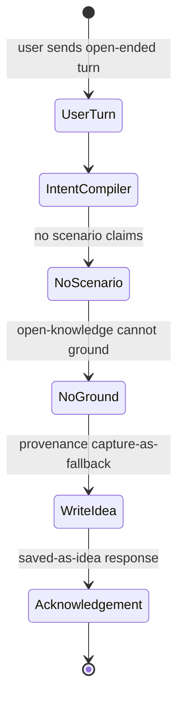
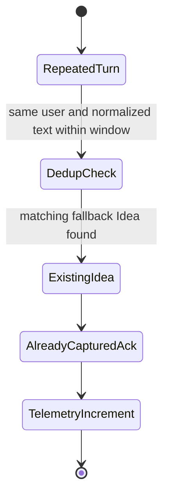
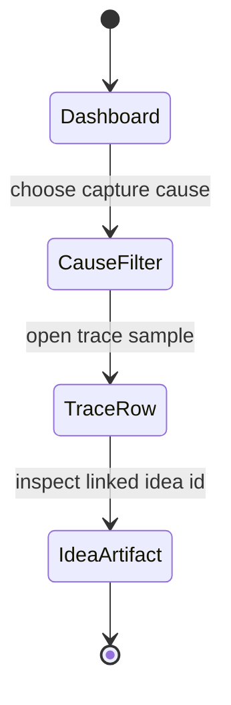

# Feature: 074 Capture-as-Fallback Cross-Cutting Policy

**Status:** in_progress (analyst bootstrap; ceiling = `done`)
**Workflow Mode:** `full-delivery`
**Owner Directive (2026-05-31):** Specify the cross-cutting
capture-as-fallback policy that specs
[061](../061-conversational-assistant/spec.md),
[064](../064-open-ended-knowledge-agent/spec.md),
[066](../066-legacy-keyword-surface-retirement/spec.md),
[068](../068-structured-intent-compiler/spec.md), and
[069](../069-assistant-http-transport/spec.md) all reference as
inviolable but none authoritatively defines. Topics: when an
open-ended turn becomes a capture, dedup vs. the explicit capture
path ([spec 008](../008-telegram-share-capture/spec.md)), provenance
labeling, Idea-artifact shape, lifecycle state, and observability.

**Depends On:** [spec 003 — Phase 2 Ingestion](../003-phase2-ingestion/spec.md),
[spec 008 — Telegram Share Capture](../008-telegram-share-capture/spec.md),
[spec 061 — Conversational Assistant](../061-conversational-assistant/spec.md),
[spec 064 — Open-Ended Knowledge Agent](../064-open-ended-knowledge-agent/spec.md),
[spec 066 — Legacy Keyword Surface Retirement](../066-legacy-keyword-surface-retirement/spec.md),
[spec 068 — Structured Intent Compiler](../068-structured-intent-compiler/spec.md).
**Downstream Consumers (informational, not depends-on):**
[spec 069 — Assistant HTTP Transport](../069-assistant-http-transport/spec.md)
references this policy as inviolable. These specs are downstream
consumers that reference this policy; this spec does not depend on them.
**Amends:** [spec 003](../003-phase2-ingestion/spec.md) (adds the
fallback Idea-artifact provenance label and dedup contract),
[spec 008](../008-telegram-share-capture/spec.md) (clarifies that
the explicit capture path is provenance-distinct from fallback),
[spec 061](../061-conversational-assistant/spec.md) (formalizes
"capture-as-fallback inviolable" into a testable contract), and
[spec 064](../064-open-ended-knowledge-agent/spec.md) (defines when
an ungrounded open-knowledge turn must capture).
**Unblocks:** future capture analytics, deduplication-quality work,
and capture-driven topic-formation features.

---

## 1. Problem Statement

"Capture-as-fallback" appears as an inviolable policy across five
specs, but its actual contract is fragmented:

- Specs 061, 064, 068, and 069 all say "if nothing else handles the
  turn, capture it" without defining what "nothing else handles"
  means precisely (which scenarios count as handling? does a
  clarification count? does a refusal count?).
- Spec 008's explicit capture path produces Idea-shaped artifacts
  with one provenance, but no spec says whether fallback captures
  share that provenance or get a distinct label. Today they would
  blur together in analytics.
- Dedup behavior is undefined: a user who says the same thing twice
  in five seconds should not produce two Ideas, but no spec defines
  the dedup key or window. Conversely, an explicit capture and a
  fallback capture of the same text SHOULD remain distinct because
  the user's intent differs.
- The intent compiler (spec 068) introduces a "clarify" path; if
  the user abandons clarification, the original prompt may or may
  not become a capture. No spec says which.
- Observability is missing: there is no counter, dashboard, or
  IntentTrace field that ties a captured Idea back to the turn that
  produced it.

Without this spec, every consumer reinvents the policy and the
"inviolable" claim is unverifiable.

---

## 2. Actors & Personas

| Actor | Description | Goals | Permissions |
|-------|-------------|-------|-------------|
| **Human user** | Person whose passing remark is preserved even when no scenario handles it. | Never lose a thought; see a brief acknowledgement; tell the system later "no, that was just chat" if needed. | Existing transport permissions. |
| **Facade** | The spec 061 `assistant.Facade`. | Decide whether a turn is captured-as-fallback and route to the capture path before responding. | Reads conversation state; writes Idea artifacts via the capture path. |
| **Intent Compiler** | Spec 068. | Hand the facade a `CompiledIntent` whose `action_class` may be `unrouted` or `clarify`. | Same as spec 068. |
| **Open-Knowledge Agent** | Spec 064. | When grounding fails, signal "no ground" so the facade can capture. | Same as spec 064. |
| **Explicit Capture Path** | Spec 008 share/capture flow. | Stay provenance-distinct from fallback captures. | Same as spec 008. |
| **Operator** | Owns SST config (dedup window, abandonment timeout, observability sampling). | Tune behavior without code changes. | Edits `config/smackerel.yaml` `capture_as_fallback.*`. |
| **Idea Artifact Reader** | Future analytics / dedup-quality tooling. | Distinguish fallback captures from explicit captures with one query. | Reads artifact provenance labels. |

---

## 3. Outcome Contract

**Intent:** Capture-as-fallback is a single named runtime policy
with a precise trigger contract, a distinct provenance label, a
deterministic dedup behavior, a defined Idea-artifact shape and
lifecycle state, and observable telemetry.

**Success Signal:**
- A turn that (a) no scenario claims, (b) the spec 064 open-knowledge
  agent cannot ground, and (c) the spec 068 compiler does not put
  into a clarification round-trip — produces exactly one Idea
  artifact with provenance label `"capture-as-fallback"`.
- Idea artifacts from the explicit capture path (spec 008) carry
  provenance `"capture-explicit"` and are NEVER deduped against
  fallback captures, because the user's intent differs.
- Two consecutive fallback turns from the same user with the same
  normalized text within the SST-configured `dedup_window` produce
  exactly one Idea artifact, not two. Outside the window they
  produce two.
- A spec 068 clarify path that the user abandons (no answer within
  the SST-configured `clarify_abandon_timeout`) results in the
  ORIGINAL prompt being captured-as-fallback with a flag
  `abandoned_clarification: true`, so the thought is not lost.
- A `capture_as_fallback_total` counter exists with `cause` label
  (`unrouted`, `open_knowledge_no_ground`,
  `clarify_abandoned`, `compiler_error`) and the corresponding
  IntentTrace (spec 071) carries an `idea_artifact_id` field
  pointing to the produced artifact.
- The user-visible acknowledgement is the same short "saved-as-idea"
  shape across Telegram, HTTP, WhatsApp, web, and Android.

**Hard Constraints:**
1. **Inviolable.** No code path may suppress capture-as-fallback for
   a turn that meets the trigger contract. There is no
   `disable_capture_as_fallback` SST key. (An SST key exists for
   dedup window and abandonment timeout, NOT for disabling capture.)
2. **Exactly one Idea per fallback decision.** No silent duplicates;
   no silent drops. If capture fails, the failure is observable
   and the turn surfaces a soft error in the acknowledgement.
3. **Provenance is mandatory and distinct.** `"capture-as-fallback"`
   vs. `"capture-explicit"` are distinct provenance values; analytics
   and dedup queries treat them as different sources.
4. **Dedup is scoped.** Dedup is per `(user_id, normalized_text)`
   within `capture_as_fallback.dedup_window` (SST). Cross-user dedup
   is forbidden.
5. **No defaults.** `capture_as_fallback.dedup_window`,
   `capture_as_fallback.clarify_abandon_timeout`,
   `capture_as_fallback.normalization_policy` are required SST keys.
   Missing keys fail loud at startup.
6. **Observability is required.** `capture_as_fallback_total{cause}`
   counter exists; IntentTrace (spec 071) carries
   `idea_artifact_id` when a fallback capture occurs.
7. **Lifecycle.** Fallback Ideas enter the standard Idea lifecycle
   defined by spec 003; this spec adds no new lifecycle state. They
   are eligible for the same promotion, topic formation, and
   archival paths as explicit Ideas.
8. **No content interpretation at capture time.** The fallback
   capture writes the user's normalized text and provenance only;
   it does NOT attach inferred tags, topics, or categories. Later
   passes own that work.

**Failure Condition:** A turn meets the trigger contract and no
Idea is produced; OR a fallback and an explicit capture dedup
against each other; OR dedup silently uses defaults; OR an
abandoned clarification loses the original prompt; OR the
acknowledgement shape differs across transports.

---

## 4. Product Principle Alignment

| Principle | Alignment | Evidence |
|-----------|-----------|----------|
| **P1 Observe First, Ask Second** | Capture preserves the thought before the system asks the user to organize it. | Outcome Contract. |
| **P3 Knowledge Breathes** | Fallback Ideas enter the standard Idea lifecycle; no parallel artifact type. | Hard Constraint 7. |
| **P4 Source-Qualified Processing** | Provenance is mandatory and distinct. | Hard Constraint 3. |
| **P5 One Graph, Many Views** | One Idea artifact family, two provenance labels, one knowledge graph. | Hard Constraints 3, 7. |
| **P6 Invisible By Default** | The acknowledgement is one short line; no system-initiated follow-up. | Outcome Contract. |
| **P9 Design For Restart, Not Perfection** | The user's thought is preserved even after abandoned clarifications; the system never punishes the user with lost input. | Hard Constraint and clarify-abandon scenario. |

---

## 5. Functional Requirements (BDD Scenarios)

```gherkin
Scenario: SCN-074-A01 — Unrouted turn produces exactly one fallback Idea
  Given a user turn that no scenario claims and open-knowledge cannot ground
  When the facade processes the turn
  Then exactly one Idea artifact is created with provenance = "capture-as-fallback"
  And the acknowledgement returned to the user is the canonical "saved-as-idea" shape

Scenario: SCN-074-A02 — Explicit capture is provenance-distinct
  Given the user invokes the spec 008 explicit capture path with text T
  When the Idea artifact is created
  Then provenance = "capture-explicit"
  And a later fallback capture of the same normalized text T (within the dedup window or outside it) does NOT dedup against this artifact

Scenario: SCN-074-A03 — Same-user same-text within dedup window dedupes
  Given a user sends a fallback-eligible turn with normalized text T
  And the same user sends another fallback-eligible turn with normalized text T within capture_as_fallback.dedup_window
  When the facade processes the second turn
  Then exactly one Idea artifact exists for (user, T)
  And the second turn's acknowledgement indicates "already captured"

Scenario: SCN-074-A04 — Same-user same-text outside dedup window does not dedup
  Given a user sends a fallback-eligible turn with normalized text T
  And the same user sends another fallback-eligible turn with normalized text T after capture_as_fallback.dedup_window has elapsed
  When the facade processes the second turn
  Then two distinct Idea artifacts exist with provenance = "capture-as-fallback"

Scenario: SCN-074-A05 — Cross-user dedup is forbidden
  Given user U1 captures text T as a fallback Idea
  When user U2 sends a fallback-eligible turn with the same normalized text T
  Then a separate Idea artifact is created for U2
  And no cross-user dedup occurs

Scenario: SCN-074-A06 — Abandoned clarification captures the original prompt
  Given the spec 068 compiler issues a clarify prompt
  And the user does not respond within capture_as_fallback.clarify_abandon_timeout
  When the facade times out the clarification
  Then exactly one Idea artifact is created from the ORIGINAL prompt with provenance = "capture-as-fallback" and abandoned_clarification = true
  And the cause label on the capture_as_fallback_total counter is "clarify_abandoned"

Scenario: SCN-074-A07 — Counter and IntentTrace carry the capture link
  Given a fallback capture occurs with cause = "open_knowledge_no_ground"
  When telemetry is inspected
  Then capture_as_fallback_total{cause="open_knowledge_no_ground"} increments by 1
  And the IntentTrace (spec 071) for that turn carries idea_artifact_id pointing to the produced artifact

Scenario: SCN-074-A08 — Missing SST keys fail loud
  Given capture_as_fallback.dedup_window is unset
  When the core process starts
  Then startup fails with a NO-DEFAULTS error naming the missing key

Scenario: SCN-074-A09 — Capture is inviolable
  Given any SST configuration in any environment
  When a turn meets the trigger contract (unrouted, no ground, not in clarify, not in confirm)
  Then a fallback Idea is produced
  And no SST key exists that can suppress fallback capture for that turn

Scenario: SCN-074-A10 — No content interpretation at capture time
  Given a fallback-eligible turn
  When the Idea artifact is created
  Then the artifact contains the normalized text and provenance only
  And no inferred tags, topics, or categories are attached at capture time

Scenario: SCN-074-A11 — Acknowledgement shape is identical across transports
  Given the facade returns AssistantResponse with CaptureRoute = true
  When Telegram, HTTP-test, WhatsApp, web, and Android render the response
  Then the "saved-as-idea" acknowledgement carries the same shape and copy on every transport
```

---

## 6. Acceptance Criteria

- Cross-cutting policy module (final location decided in
  `bubbles.design`) owns the trigger contract, dedup, provenance,
  abandonment-handling, and observability emission.
- Provenance values `"capture-as-fallback"` and `"capture-explicit"`
  are first-class enum members on the Idea artifact (or its
  equivalent) and are persisted; analytics queries can distinguish
  them without heuristics.
- SST keys `capture_as_fallback.dedup_window`,
  `capture_as_fallback.clarify_abandon_timeout`,
  `capture_as_fallback.normalization_policy` exist, are required,
  and fail loud at startup when missing.
- `capture_as_fallback_total{cause}` counter is exported via the
  spec 049 monitoring stack with the four cause labels listed in
  the Outcome Contract.
- IntentTrace (spec 071) gains an `idea_artifact_id` optional
  field populated when a fallback capture occurs.
- Spec 003 is amended to record the fallback provenance and the
  dedup contract; spec 008 is amended to record the
  provenance-distinct guarantee; spec 061 is amended to point at
  this spec as the authoritative definition of the inviolable
  policy; spec 064 is amended to record the
  "no-ground-triggers-capture" trigger.

---

## 7. Non-Goals

- New artifact types beyond the existing Idea. Fallback Ideas use
  the standard Idea shape.
- New lifecycle states beyond those defined by spec 003.
- Inferred tagging or topic formation at capture time. Out of scope
  per Hard Constraint 8 and Principle 1.
- Cross-user dedup. Out of scope per Hard Constraint 4.
- A user-facing "undo capture" affordance. Possible follow-up spec.

---

## 8. Open Questions (resolve in `bubbles.design`)

- Exact normalization policy (case, punctuation, whitespace,
  unicode-NFKC vs. NFC). Prefer NFKC + casefold + collapse
  whitespace, but `capture_as_fallback.normalization_policy` is an
  SST key so the value is operator-visible.
- Whether dedup includes a similarity threshold (e.g. cosine on
  embeddings) or strict normalized-text equality. Prefer strict
  equality in v1; embedding-based dedup is a follow-up.
- Whether the "already captured" acknowledgement on a dedup hit
  carries a different shape than the first acknowledgement or the
  same shape. Prefer the same shape with an `already_captured: true`
  flag.
- Where the cross-cutting policy module lives in the package tree
  (`internal/assistant/capture/` vs. `internal/capture/fallback/`).

## UI Wireframes

### Screen Inventory

| Screen | Actor(s) | Status | Surface | Scenarios Served |
|--------|----------|--------|---------|------------------|
| Fallback Capture Acknowledgement | Human user | New | Transport-neutral assistant response | SCN-074-A01, SCN-074-A03, SCN-074-A04, SCN-074-A05, SCN-074-A06, SCN-074-A09, SCN-074-A11 |
| Capture-as-Fallback Telemetry | Operator, Idea Artifact Reader | New | Monitoring / trace detail surface | SCN-074-A02, SCN-074-A07, SCN-074-A08, SCN-074-A10 |

### UI Primitives

| Primitive | Consumed By | Composition Rules | Accessibility / Responsive Constraints |
|-----------|-------------|-------------------|----------------------------------------|
| Saved-as-idea acknowledgement | Acknowledgement | One canonical response shape across Telegram, HTTP, WhatsApp, web, and Android; may include `already_captured`. | One concise message; no color-only saved state. |
| Provenance label | Acknowledgement, Telemetry | Show `capture-as-fallback` or `capture-explicit` only from persisted artifact fields. | Labels remain visible in copied output and narrow cards. |
| Dedup status row | Acknowledgement, Telemetry | Show created vs already captured and the normalized-text dedup key summary without raw sensitive values. | Status text precedes ids; long ids wrap. |
| Capture trace link | Acknowledgement, Telemetry | Connect assistant turn, IntentTrace, counter cause, and Idea artifact id. | Link text names the destination, not only the id. |

### Transport-Neutral Interaction Requirements

- The acknowledgement is short and identical in shape across transports; transport renderers may adapt layout but not meaning.
- Users are never asked to tag, classify, or organize the captured Idea at capture time.
- Dedup hits should reassure the user that the thought is already preserved without exposing dedup internals.
- Operator telemetry must make fallback captures distinguishable from explicit captures without heuristic queries.

### UX User Validation Checklist

| Validation Item | Pass Signal |
|-----------------|-------------|
| Thought preservation is clear | A user can tell that an unhandled turn was saved without needing to re-send it. |
| Dedup feels non-destructive | Repeating the same thought quickly tells the user it was already captured, not lost. |
| No organization burden | The acknowledgement does not ask the user to tag, categorize, or choose a lifecycle state. |
| Provenance is auditable | An operator can separate fallback and explicit captures from one trace or dashboard query. |

### Screen: Fallback Capture Acknowledgement

**Actor:** Human user | **Route:** Transport-neutral assistant turn | **Status:** New

┌──────────────────────────────────────────────────────────────┐
│ Assistant                                                     │
├──────────────────────────────────────────────────────────────┤
│ Saved as an idea.                                             │
│                                                              │
│ [View recent ideas]                                           │
└──────────────────────────────────────────────────────────────┘

**Interactions:**
- Unrouted/no-ground turn -> facade writes one fallback Idea before returning acknowledgement.
- Dedup hit -> same acknowledgement shape with `already_captured: true` available to richer clients.
- View recent ideas -> opens the existing recent-captures surface where the transport supports links/actions.

**States:**
- Empty state: no acknowledgement is shown unless a fallback decision occurred.
- Loading state: pending assistant response uses the standard transport pending state.
- Error state: capture write fails -> soft error states that saving failed and includes trace id for operator review.

**Responsive:**
- Mobile/chat transports: one short message; optional action may stack below.
- Desktop/web clients: acknowledgement can render as a compact response card in the transcript.

**Accessibility:**
- Saved state is text-first and announced as the assistant response.
- Optional action label names the destination.
- Error state does not hide the user's original turn from the transcript.

### Screen: Capture-as-Fallback Telemetry

**Actor:** Operator, Idea Artifact Reader | **Route:** Monitoring dashboard / IntentTrace detail | **Status:** New

┌────────────────────────────────────────────────────────────────────────────┐
│ Capture-as-Fallback Telemetry                         [Time range] [Export]│
├────────────────────────────────────────────────────────────────────────────┤
│ Total fallback captures [n]   Dedup hits [n]   Capture failures [n]        │
│                                                                            │
│ Cause breakdown                                                             │
│ unrouted [n]  open_knowledge_no_ground [n]  clarify_abandoned [n]          │
│ compiler_error [n]                                                          │
│                                                                            │
│ Recent captures                                                             │
│ trace_id     cause                    provenance             idea_id        │
│ [trace]      open_knowledge_no_ground capture-as-fallback   [artifact]     │
│ [trace]      clarify_abandoned        capture-as-fallback   [artifact]     │
└────────────────────────────────────────────────────────────────────────────┘

**Interactions:**
- Cause filter -> narrows recent captures and counter panels to one cause.
- Trace id -> opens the redacted IntentTrace with `idea_artifact_id`.
- Idea id -> opens artifact detail where the operator is authorized.

**States:**
- Empty state: zero fallback captures -> show zero counts, not missing-panel errors.
- Loading state: fixed metric slots and labelled table skeleton.
- Error state: IntentTrace export unavailable -> fail-loud panel naming the unavailable source.

**Responsive:**
- Mobile: cause breakdown becomes a labelled list; recent captures become cards.
- Desktop: metric summary, cause breakdown, and recent rows stay visible above the fold.

**Accessibility:**
- Cause labels are full text, not abbreviations.
- Provenance labels are readable without color.
- Exported summaries omit raw text when source policy forbids it.

## User Flows

### User Flow: Unrouted Turn Becomes Idea



### User Flow: Dedup Hit Preserves Trust



### User Flow: Operator Traces Fallback Capture



