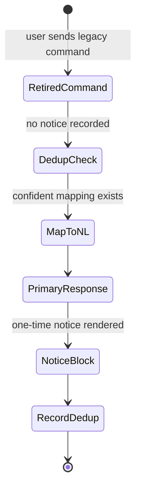
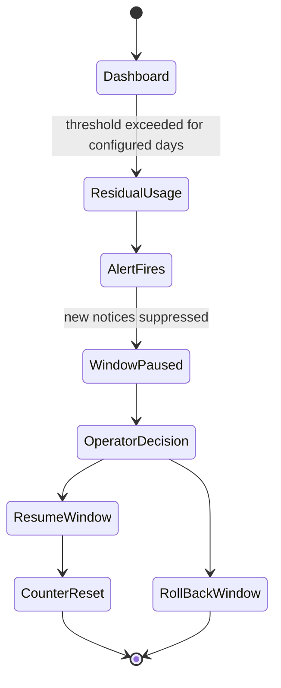
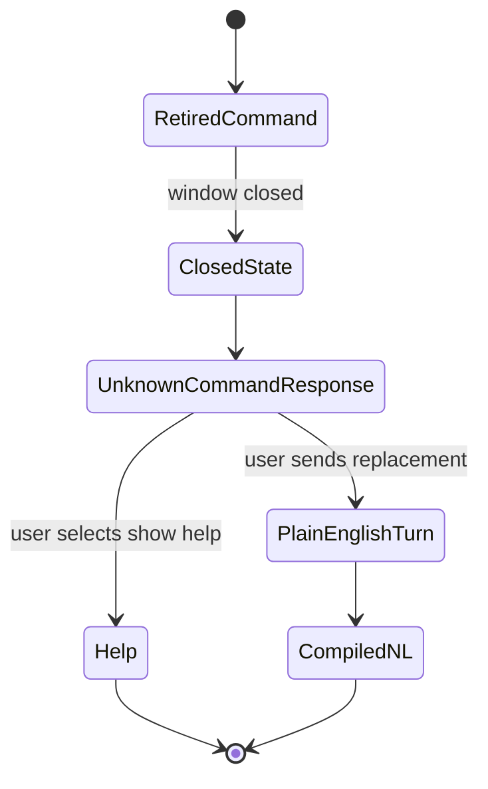

# Feature: 075 Legacy-Surface Deprecation Telemetry & User Comms

**Status:** in_progress (analyst bootstrap; ceiling = `done`)
**Workflow Mode:** `full-delivery`
**Owner Directive (2026-05-31):** Specify user-facing deprecation
messaging, telemetry on residual legacy-command usage, and rollback
criteria for the retirement work in
[spec 066 — Legacy Keyword Surface Retirement](../066-legacy-keyword-surface-retirement/spec.md).
Without this, spec 066 has no measurable rollout safety net and no
defined way to pause or roll back the deprecation if residual usage
indicates the migration is unsafe.

**Depends On:** [spec 066 — Legacy Keyword Surface Retirement](../066-legacy-keyword-surface-retirement/spec.md),
[spec 049 — Monitoring Stack](../049-monitoring-stack/spec.md),
[spec 030 — Observability](../030-observability/spec.md),
[spec 061 — Conversational Assistant](../061-conversational-assistant/spec.md).
**Amends:** [spec 066](../066-legacy-keyword-surface-retirement/spec.md)
(adds the rollout safety net spec 066 currently lacks),
[spec 049](../049-monitoring-stack/spec.md) (adds the legacy-retirement
dashboard and alert rules).
**Unblocks:** post-retirement cleanup work (final deletion of legacy
handlers after the deprecation window closes with zero residual
usage).

---

## 1. Problem Statement

Spec 066 retires the legacy slash-command surface in favor of the
natural-language assistant introduced by specs 061 and 068. The
retirement plan in spec 066 describes the handler removals and the
canonical NL replacements, but it does NOT define:

- How users are told their old commands have been retired (or are
  in a deprecation window) — without this, a long-time user types
  `/weather` and gets a silent "unknown command" with no migration
  hint.
- How residual usage is measured during the deprecation window — we
  have no counter to tell us whether the user community has actually
  migrated, so the "final removal" decision is a guess.
- The rollback criteria that would pause or reverse the retirement
  if residual usage indicates the new surface is failing real
  users.
- The post-window steady state: what response a retired command
  produces, and how we prove no handler invocation occurs.
- How the "one notice per command per user" guarantee is enforced
  so users are not spammed by repeated deprecation prompts.

This spec closes those gaps so spec 066's retirement is measurable,
reversible, and humane.

---

## 2. Actors & Personas

| Actor | Description | Goals | Permissions |
|-------|-------------|-------|-------------|
| **Human user (long-time)** | A user who knew the old commands. | Be told once, gently, what the NL alternative is; not be re-spammed; have time to migrate. | Existing transport permissions. |
| **Human user (new)** | A user who never used the old commands. | Never see deprecation prompts. | Existing transport permissions. |
| **Operator** | Owns SST config and reads the monitoring stack. | Track residual usage; pause / roll back the retirement if a threshold is crossed; eventually retire the deprecation messaging itself. | Edits `config/smackerel.yaml` `legacy_retirement.*`; reads Grafana / alerting. |
| **Assistant Facade** | Spec 061. | Detect a retired command, emit (at most) one user-visible notice per command per user, route the user's intent to the NL alternative if possible. | Reads conversation state; writes to the assistant_conversations row for the dedup ledger. |
| **Telemetry Pipeline** | Spec 030 + spec 049. | Count residual usage by command, by user, by day; alert on thresholds. | Standard telemetry permissions. |

---

## 3. Outcome Contract

**Intent:** The spec 066 retirement is rolled out behind a measurable,
human-friendly deprecation window with one-time-per-user-per-command
notices, residual-usage telemetry, SST-defined rollback criteria, and
a defined post-window steady state.

**Success Signal:**
- During the deprecation window, the first time a user invokes a
  retired command (e.g. `/weather`), the assistant replies with the
  canonical NL alternative ("Try just asking: 'weather in
  Barcelona'") AND, if possible, executes the user's intent via the
  NL path so the user is not stranded.
- The same user invoking the same retired command again receives
  the normal NL-driven response WITHOUT the deprecation notice.
  Dedup is per `(user_id, retired_command)` and stored in the
  assistant_conversations row family.
- A `legacy_command_residual_total{command,user_bucket}` counter
  exists and a rolling 7-day report (queryable from the spec 049
  dashboard) shows residual usage per command per day, plus the
  count of distinct users invoking each retired command.
- SST keys define the rollback criteria. If on day D residual usage
  for any retired command exceeds
  `legacy_retirement.rollback_threshold_percent_active_users` (e.g.
  5%) for `legacy_retirement.rollback_threshold_days_consecutive`
  consecutive days, an alert fires and the deprecation window
  pauses automatically (new notices suppressed; existing handlers
  remain active).
- After the window closes (operator flips the SST flag), retired
  commands return the canonical unknown-command response with a
  `/help` pointer, and the legacy handlers are no longer invoked.
  Metrics confirm zero handler invocations across a defined
  observation period.
- Per-user dedup is durable: clearing local app state does not
  re-spam the user, because the ledger lives in the
  assistant_conversations row family on the server.

**Hard Constraints:**
1. **At most one notice per (user, retired_command).** No
   re-notification on subsequent invocations. The dedup ledger is
   persistent and server-side.
2. **Notice is informational, not blocking.** The user's original
   intent is still served (via the NL path) when the assistant can
   confidently map it. The notice is a one-line addendum, not a
   barrier.
3. **SST drives the window.** Window open/close, rollback
   thresholds, rollback consecutive-day window, and post-window
   response copy all live under `legacy_retirement.*` SST keys.
   Missing keys fail loud at startup.
4. **Pause is automatic and reversible.** Crossing the rollback
   threshold automatically pauses the window (no new notices,
   legacy handlers remain active) and alerts the operator. The
   operator can resume or roll back manually; resumption resets
   the consecutive-day counter.
5. **Telemetry is required.** The `legacy_command_residual_total`
   counter and the rolling 7-day dashboard panel exist and are
   wired to the spec 049 stack. Without these, the window cannot
   be opened.
6. **No PII in residual telemetry.** `user_bucket` is a
   privacy-preserving hash, not a user identifier. Cross-user
   counts are aggregated.
7. **Post-window proof.** When the operator declares the window
   closed, a contract test (or runtime guard) confirms zero
   invocations of the retired handlers over a defined observation
   period; only then is final code deletion permitted.
8. **Deduplication ledger uses assistant_conversations.** No
   parallel storage. The dedup state lives in the same row family
   that powers the assistant facade so retirement and facade share
   their truth.

**Failure Condition:** A user receives the deprecation notice more
than once for the same command; OR residual usage exceeds the
threshold and the window does not pause; OR the post-window steady
state allows legacy handler invocation; OR the dashboard cannot
answer "how many distinct users still type `/weather` this week?".

---

## 4. Product Principle Alignment

| Principle | Alignment | Evidence |
|-----------|-----------|----------|
| **P6 Invisible By Default, Felt Not Heard** | At most one notice per user per command, and the user's intent is still served. | Hard Constraints 1, 2. |
| **P8 Trust Through Transparency** | Residual usage and rollback criteria are operator-visible and SST-driven. | Hard Constraints 3, 5. |
| **P9 Design For Restart, Not Perfection** | A user who returns after months is told once and gently; not punished with errors. | Hard Constraints 1, 2. |
| **P10 QF Companion Boundary** | No new financial-action surface introduced; deprecation messaging is information-only. | Outcome Contract. |

---

## 5. Functional Requirements (BDD Scenarios)

```gherkin
Scenario: SCN-075-A01 — First retired-command invocation shows one notice and serves the intent
  Given the deprecation window is open and user U has never invoked /weather since the window opened
  When U sends "/weather barcelona"
  Then the response contains the canonical NL alternative as a one-line addendum
  And the user's weather intent is served via the NL path
  And the dedup ledger records (U, "/weather") as notified

Scenario: SCN-075-A02 — Second invocation of the same retired command does not re-notify
  Given the dedup ledger already records (U, "/weather") as notified
  When U sends "/weather barcelona" again
  Then the response is the normal NL-driven weather response
  And no deprecation notice is included

Scenario: SCN-075-A03 — Different retired command produces its own one-time notice
  Given the dedup ledger records (U, "/weather") as notified but NOT (U, "/remind")
  When U sends "/remind tomorrow at 9"
  Then the deprecation notice for /remind is shown exactly once
  And the dedup ledger records (U, "/remind") as notified

Scenario: SCN-075-A04 — Residual telemetry counts invocations per command per user bucket
  Given the deprecation window is open
  When users invoke retired commands across the deprecation period
  Then legacy_command_residual_total{command,user_bucket} increments accordingly
  And the dashboard's rolling 7-day report renders per-command and per-day counts plus distinct user counts

Scenario: SCN-075-A05 — Rollback threshold pauses the window automatically
  Given residual usage for /weather exceeds legacy_retirement.rollback_threshold_percent_active_users for legacy_retirement.rollback_threshold_days_consecutive consecutive days
  When the alerting evaluation runs
  Then an alert fires
  And the window enters PAUSED state: new notices are suppressed and legacy handlers continue serving requests until the operator decides

Scenario: SCN-075-A06 — Resuming the window resets the consecutive-day counter
  Given the window is in PAUSED state
  When the operator resumes the window after addressing the cause
  Then the consecutive-day counter resets to 0
  And residual telemetry continues unchanged

Scenario: SCN-075-A07 — Window-closed response is the canonical unknown-command response
  Given the operator flips legacy_retirement.window_state to "closed"
  When user U invokes /weather
  Then the response is the canonical unknown-command response with a /help pointer
  And no legacy handler is invoked

Scenario: SCN-075-A08 — Post-window observation confirms zero legacy handler invocations
  Given the window has been closed for the SST-defined observation period
  When the observation report runs
  Then the report shows zero invocations of the retired handlers over the period
  And only then may final code deletion proceed (gated by the report)

Scenario: SCN-075-A09 — Dedup ledger survives across sessions and devices
  Given user U received the /weather deprecation notice on Telegram
  When U invokes /weather later from the web client (spec 073)
  Then no deprecation notice is shown because the ledger is keyed on (user_id, retired_command), not on transport

Scenario: SCN-075-A10 — Missing SST keys fail loud
  Given legacy_retirement.rollback_threshold_percent_active_users is unset
  When the core process starts
  Then startup fails with a NO-DEFAULTS error naming the missing key
  And the deprecation window cannot be opened

Scenario: SCN-075-A11 — Telemetry contains no raw user identifiers
  Given the legacy-retirement dashboard is open
  When the operator inspects residual usage
  Then user_bucket is a privacy-preserving hash, not a raw user id
  And no raw text from user turns appears in the residual telemetry
```

---

## 6. Acceptance Criteria

- Deprecation-message renderer integrated into the spec 061 facade
  for each retired command listed in spec 066 (final list in spec
  066; this spec references it by ID).
- Persistent per-user-per-command dedup ledger stored in the
  `assistant_conversations` row family; one notice per
  `(user_id, retired_command)` lifetime-of-window.
- `legacy_command_residual_total{command,user_bucket}` counter
  emitted by the facade; rolling 7-day dashboard panel in the
  spec 049 monitoring stack.
- Alert rule wired to
  `legacy_retirement.rollback_threshold_percent_active_users` and
  `legacy_retirement.rollback_threshold_days_consecutive`; firing
  the alert moves the window to PAUSED automatically.
- SST keys under `legacy_retirement.*` (window_state,
  rollback_threshold_percent_active_users,
  rollback_threshold_days_consecutive,
  post_window_observation_days, notice_copy_per_command,
  post_window_unknown_response_copy) exist, are required, and
  fail loud when missing.
- Post-window observation report (final shape decided in
  `bubbles.design`) gates final handler deletion; the report
  proves zero handler invocations over the configured observation
  period.
- Spec 066 is amended to require this spec's safety net before any
  hard removal lands; spec 049 is amended to host the dashboard
  panel and alert rule.

---

## 7. Non-Goals

- Removing the legacy handlers themselves. That is owned by spec
  066; this spec gates the removal.
- A user-facing "opt out of deprecation notices" toggle. The
  one-time-per-user-per-command guarantee already makes the notice
  unobtrusive.
- Cross-product retirement tooling. This spec covers Smackerel's
  legacy command surface only.
- Re-introducing any retired commands. If real users still need
  one, that is a fresh spec, not a rollback of this spec.

---

## 8. Open Questions (resolve in `bubbles.design`)

- Whether the dedup ledger is a dedicated column or a JSON map on
  the existing assistant_conversations row; prefer a JSON map keyed
  by retired-command string for forward-compatibility.
- Exact threshold default values (the SST keys are required and
  fail loud, so there is no silent default; but `bubbles.design`
  should propose the recommended initial values, e.g. 5% / 3
  consecutive days / 14-day observation window).
- Whether `user_bucket` uses an HMAC of `user_id` keyed by a
  rotating server-side secret, or a deterministic hash; prefer
  HMAC with rotation to limit re-identification risk.
- Whether the deprecation notice is rendered as a separate
  `AssistantResponse` shape (deprecation_notice + primary_response)
  or as a prefix on the primary response text; prefer a structured
  field so frontends (spec 073) can style it consistently.

## UI Wireframes

### Screen Inventory

| Screen | Actor(s) | Status | Surface | Scenarios Served |
|--------|----------|--------|---------|------------------|
| One-Time Deprecation Notice | Human user (long-time) | New | Transport-neutral assistant response | SCN-075-A01, SCN-075-A02, SCN-075-A03, SCN-075-A09 |
| Legacy Retirement Dashboard | Operator | New | Grafana / monitoring dashboard | SCN-075-A04, SCN-075-A05, SCN-075-A06, SCN-075-A08, SCN-075-A11 |
| Window-Closed Command Response | Human user | New | Transport-neutral assistant response | SCN-075-A07, SCN-075-A08 |

### UI Primitives

| Primitive | Consumed By | Composition Rules | Accessibility / Responsive Constraints |
|-----------|-------------|-------------------|----------------------------------------|
| Deprecation notice block | One-Time Notice | Names the retired command and plain-English replacement once per `(user, command)`; it must not block the primary response. | One short paragraph, announced before or after the primary answer consistently. |
| Legacy command metric row | Dashboard | Shows command, residual count, distinct user buckets, trend, and rollback-threshold state. | Row text remains meaningful when copied from Grafana/CI output. |
| Window state badge | Dashboard, Window-Closed Response | Shows `open`, `paused`, or `closed` from SST/runtime state only. | State is text-first and not color-only. |
| Unknown-command action row | Window-Closed Response | Offers `/help` pointer and plain-English example; no legacy handler invocation. | Buttons/links have explicit labels and wrap cleanly on mobile. |

### Transport-Neutral Interaction Requirements

- Deprecation messaging is informational and one-time; it must never interrupt a successfully mapped NL response.
- The same dedup ledger applies across Telegram, web, iPhone/iOS, Android, WhatsApp, and HTTP-derived transports.
- Dashboard copy must avoid raw user ids or raw command text beyond the retired command token itself.
- Paused and closed states must be visible to operators and reflected consistently in user responses.

### UX User Validation Checklist

| Validation Item | Pass Signal |
|-----------------|-------------|
| Notice is humane | A long-time user sees the replacement once and still gets their intended result when mapping is confident. |
| No re-spam across devices | The same user does not see the notice again from another transport. |
| Rollback state is obvious | An operator can tell whether the window is open, paused, or closed from the dashboard. |
| Post-window response is clear | A user receives a concise unknown-command response with `/help` guidance and no legacy execution. |
| Telemetry protects privacy | The dashboard shows buckets and aggregates, never raw user ids or raw user turns. |

### Screen: One-Time Deprecation Notice

**Actor:** Human user (long-time) | **Route:** Transport-neutral assistant turn during retirement window | **Status:** New

┌──────────────────────────────────────────────────────────────┐
│ Assistant                                                     │
├──────────────────────────────────────────────────────────────┤
│ Weather for Barcelona tomorrow                               │
│ [primary NL-driven response]                                  │
│                                                              │
│ Notice: /weather is retiring. Next time, just ask:            │
│ "weather in Barcelona tomorrow"                              │
│                                                              │
│ [Show help]                                                   │
└──────────────────────────────────────────────────────────────┘

**Interactions:**
- Retired command with no dedup entry -> render primary response plus notice and record `(user, command)` as notified.
- Retired command with dedup entry -> render primary response without notice.
- Show help -> deterministic retained help surface.

**States:**
- Empty state: not applicable; notice only appears with a retired-command turn.
- Loading state: standard assistant pending response; no separate retirement spinner.
- Error state: mapping to NL path is not confident -> show notice plus safe help guidance, not a guessed execution.

**Responsive:**
- Mobile/chat: notice stays one short paragraph after the primary response.
- Desktop/web: notice may render as a compact inline block attached to the response card.

**Accessibility:**
- Retired command and replacement example are both text.
- Notice is not conveyed by color or icon alone.
- One-time behavior is server-side; clearing client state does not re-trigger notice.

### Screen: Legacy Retirement Dashboard

**Actor:** Operator | **Route:** Grafana `Legacy Retirement` | **Status:** New

┌────────────────────────────────────────────────────────────────────────────┐
│ Legacy Retirement                                  [Time range] [Export]   │
├────────────────────────────────────────────────────────────────────────────┤
│ Window state: open     Threshold: [percent]% for [n] days                  │
│ Active users: [n]      Alert state: [ok/paused/firing]                    │
│                                                                            │
│ Residual usage by command                                                   │
│ command     7d count   distinct user buckets   trend       threshold state │
│ /weather    [n]        [n]                     [up/down]   [ok/over]       │
│ /remind     [n]        [n]                     [up/down]   [ok/over]       │
│                                                                            │
│ Post-window observation                                                     │
│ retired handler invocations: [n]   observation days: [n]                   │
└────────────────────────────────────────────────────────────────────────────┘

**Interactions:**
- Command row -> opens per-day residual usage with user buckets aggregated.
- Alert state -> opens the alert rule and SST keys used for the threshold.
- Export -> downloads aggregate report with no raw user ids or raw turn text.

**States:**
- Empty state: no residual usage -> show zero rows per retired command, not a blank dashboard.
- Loading state: fixed metric slots and table rows prevent layout shift.
- Error state: telemetry unavailable -> window cannot be opened; show fail-loud dashboard error.

**Responsive:**
- Mobile: command rows become cards with command, count, users, and threshold state.
- Desktop: threshold summary remains pinned above residual usage table.

**Accessibility:**
- Window state and alert state are text labels.
- Trend values include direction words, not arrows only.
- Aggregation and privacy notes are visible in exported summaries.

### Screen: Window-Closed Command Response

**Actor:** Human user | **Route:** Transport-neutral assistant turn after retirement window closes | **Status:** New

┌──────────────────────────────────────────────────────────────┐
│ Assistant                                                     │
├──────────────────────────────────────────────────────────────┤
│ I do not use /weather anymore.                               │
│                                                              │
│ Ask in plain English instead, for example:                    │
│ "weather in Barcelona tomorrow"                              │
│                                                              │
│ [Show help]                                                   │
└──────────────────────────────────────────────────────────────┘

**Interactions:**
- Retired command after closed state -> canonical unknown-command response with help pointer.
- Show help -> deterministic help response.
- User sends plain-English replacement -> normal spec 068 compiled NL path.

**States:**
- Empty state: not applicable; closed response only appears after retired command invocation.
- Loading state: deterministic response; no long-running state expected.
- Error state: help catalog unavailable -> static safe help pointer and no legacy handler invocation.

**Responsive:**
- Mobile/chat: one concise message with optional help action.
- Desktop/web: action can render beside the replacement example.

**Accessibility:**
- Unknown-command reason and replacement example are announced before the action.
- The response does not rely on strikethrough or color to show retirement.
- Help action has a text label.

## User Flows

### User Flow: First Retired Command During Window



### User Flow: Rollback Threshold Pauses Window



### User Flow: Closed Window Rejects Legacy Handler



